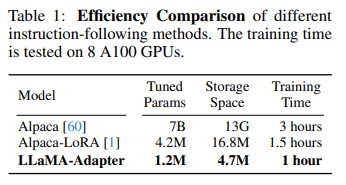

논문 및 이미지 출처 : <https://arxiv.org/pdf/2303.16199.pdf>

# Abstract

**LLaMA-Adapter** 는 LLaMA 를 instruction-following model 로 효율적으로 fine-tuning 하기 위한 경량 adaptation method

- 52K self-instruction 사용
- LLaMA 7B model 을 freezing 한 채, LLaMA-Adapter 를 사용하면 **1.2M** learnable parameter 만 추가됨
- 8대의 A100 GPU 에서 1시간 이하의 fine-tuning cost 발생

구체적으로,

1. learnable adaptation prompts 를 채택, 이를 상단의 Transformer layer 의 word token 앞에 추가
2. zero-initialized attention 메커니즘 및 zero gating 제안
    - new instruction 을 LLaMA 에 adaptively injects 하는 동시에 pre-trained knowledge 를 효과적으로 보존

LLaMA-Adapter 는 multi-model instruction 으로 확장 가능

ScienceQA 및 COCO caption 벤치마크에 우수한 reasoning 성능 달성

전통적인 비전 및 언어 task 에서 pre-trained model (ViT, RoBERTa)을 fine-tuning 하기 위해 zero-initialized attention 메커니즘을 평가하여 저자의 approach 의 우수한 일반화 능력 보여줌

# 1. Introduction

LLM 이 크게 발전하는데 비해 instruction model 은 높은 비용 및 시간이 든다.

이를 해결하려, Stanford Alpaca 는 LLaMA 를 instruction-following model 로 fine-tuning 하는 방법을 제안하여 저렴하고 복제 가능한 모델을 만들었지만 여전히 시간이 많이 소요된다.

본 논문은 **LLaMA-Adapter** 도입으로 LLaMA 를 instruction-following model 로 효율적으로 fine-tuning 하는 방법 제안

- training 을 목적으로 52K instruction-output data 활용
- LLaMA 를 freezing 하여 efficiency 보존 
- LLaMA 상단의 transformer layer 에 learnable adaptation prompts 를 input instruction token 앞에 붙임
- 초기 훈련 단계에서 adaptation prompt 의 noise 를 피하기 위해, layer 의 vanilla attention 메커니즘을 zero-initialized attention 으로 수정하고 learnable gating 추가

다음 LLaMA-Adapter 는 Fig 1 에서 네 가지 특징 가짐

- 1.2M Parameters
  - pre-trained LLaMA 7B 는 freezing 하고 1.2M parameter 인 adaptation prompt 만 학습
  - 7B Alpaca 와 comparable instruction-following
- One-hour Fine-tuning
  - zero-initialized gating 을 사용한 경량 adaptation module 덕에 8개의 A100 GPU 에서 1시간 미만으로 Alpaca 보다 3배 빠름
- Plug with Expertise
  - 여러 시나리오에 대한 여러 adapter 를 삽입하고 LLaMA 에 다양한 expert knowledge 를 부여하는 유연성 지님 
- Multi-model Instruction
  - text instruction 뿐 아니라 image input 으로 multi-model reasoning 수행 가능
  - image tokens 을 adaptation prompts 에 추가함으로써 ScienceQA 및 COCO caption 벤치마크에서 comparable 한 성능

instruction-following model 뿐 아니라, vision 및 language models 에 대해서도 _zero-initialized_ attention 이 parameter-efficient fine-tuning 으로 일반화 가능

pre-trained ViT 를 fine-tuning 하는데 저자의 approach 로 VTAB-1k 벤치마크에서 우수한 성능 달성

ReBERTa 의 경우 SQuAD v1.1 및 v2.0 에서 선도적인 결과 달성

# 2. Related Work

# 3. LLaMA-Adapter

# 3.1 Learnable Adaptation Prompts

52K instruction-output data 및 $N$-layer transformer 를 사용하는 pre-trained LLaMA 가 주어졌을 때, 저자는 instruction-following fine-tuning 을 위해 _learnable adaptation prompts_ 셋 채택

- $\{ P_l \}^L_{l=1}$ : $L$ transformer layer 에 대한 prompts
  - $P_l \in \mathbb{R}^{K \times C}$
  - $K$ : 각 layer 에 대한 prompt length
  - $C$ : LLaMA transformer 의 feature dimension

prompt 를 transformer 의 가장 상단 $L$ layer $(l \leq L)$ 에 삽입한 것을 주목하자.

이는 higher-level semantics 를 갖는 language representation 을 더 잘 tuning 하도록 해줌

예로 $l$-th inserted layer $(l \leq L)$ 를 보자.

- $T_i \in \mathbb{R}^{M \times C}$ : $M$-length word tokens
  - input instruction 및 이미 생성된 response 표시
- learnable adaptation prompt 는 token dimension 을 따라 $T_i$ 과 prefix 로 연결

$$
\begin{equation}
  [P_l; T_l] \in \mathbb{R}^{(K+M) \times C}
\end{equation}
$$

$P_l$ 에서 학습된 instruction knowledge 는 transformer block 의 attention layers 를 통해 subsequent contextual response 를 생성하도록 $T_i$ 에게 효율적으로 가이드함

## 3.2 Zero-initialized Attention

adaptation prompts 가 무작위로 초기화되면, training 초기에 word token 에 혼란을 일으킬 수 있어, fine-tuning 의 안정성과 효과를 해칠 수 있음

이로 인해 저자는 last $L$ transformer layers 에서 vanilla attention 매커니즘을 수정하여 zero-initialized attention 으로 수정

$l$-th inserted layer 의 $[P_l; T_l]$ 상단의 $(M + 1)$-th word 를 생성하는 상황을 가정

- $t_l \in \mathbb{R}^{1 \times C}$ : 해당 $(M+1)$-th word token
- attention 매커니즘은 input tokens 을 queries, keys 및 values 로 변환하기 위해 linear projection 에 적용

$$
\begin{align}
& Q_l = \text{Linear}_q (\ t_l\ ); \\
& K_l = \text{Linear}_k (\ [P_l; T_l; t_l] \ ); \\
& V_l = \text{Linear}_v (\ [P_l; T_l; t_l] \ ).
\end{align}
$$

이후 softmax function 전에 $Q_l$ 와 $K_l$ 의 attention scores 를 계산

$$
\begin{equation}
  S_l = Q_l K_l^T / \sqrt{C} \in \mathbb{R}^{1 \times (K+M+1)}
\end{equation}
$$

이는 new word $t_l$ 와 모든 $K+M+1$ tokens 간의 feature simiarities 를 기록하는 것.

한편 $S_l$ 은 두 component 로 재정립될수 있다.

$$
\begin{equation}
  S_l = [S_l^K; S_l^{M+1}]^T
\end{equation}
$$

- $S^K_l \in \mathbb{R}^{K+1}$ : $K$ adaptation prompts 의 attention score
  - learnable prompt 가 $t_l$ 를 생성하는데 얼마나 많은 정보를 제공하는지 지표
  - 훈련 초기 단계에 혼란을 야기할 수 있음
- $S_l^{M+1} \in \mathbb{R}^{(M+1)\times 1}$ : $M+1$ word tokens

learnable gating factor $g_l$ 을 도입하여 attention 의 $S_l^K$ 를 adaptively control

- zero 로 초기화
- $g_l$ 은 부적합한 prompt 의 영향을 제거한 후 LLaMA 에 더 많은 instruction semantics 제공을 위해 크기를 증가시킬 수 있음
- 저자는 Eq 6 의 두 component 에 독립적으로 softmax function 을 적용하고, 첫 번째 항을 $g_l$ 로 곱함

$$
\begin{equation}
  S^g_l = [\text{softmax}(S_l^K) \cdot g_l ; \ \text{softmax}(S_l^{M+1})]^T
\end{equation}
$$

- separate softmax function 은 두 번째 항이 adaptation prompt 와 관련 없도록 보장
- $g_l$ 이 거의 0에 가까울 때, 기존 LLaMA pre-trained knowledge 를 토큰 $t_l$ 에 전달하여 생성 가능
- attention 내의 독립적으로 학습되는 여러 $g_l$ 을 도입하여 multi-head 매커니즘의 학습 다양성을 촉진 어텐션 내에서 서로 독립적으로 학습되는 여러 gl을 도입하여 다중 헤드 메커니즘의 학습 다양성을 촉진합니다. 

마지막으로, $l$-th attention layer 의 output 을 linear projection layer 를 사용하여 계산

$$
\begin{equation}
  t_l^o = \text{Linear}_o (S_l^g V_l) \in \mathbb{R}^{1 \times C}
\end{equation}
$$

위의 zero-initialized attention 을 사용하면, adaptation prompts 는 점진적으로 transformer 에 새로 습득한 instructional signals 을 주입하는 동시에 LLaMA 의 pre-trained knowledge 를 통합하여 고품질 response 제공 가능

## 3.3 Multi-modal Reasoning

text instruction 외에도, LLaMA-Adapter 는 다른 modalities input 에 대한 answering 능력이 존재

ScieneceQA 를 예로 들자.

visual 및 textual contexts 와 해당 question 및 option 을 함께 제공하면, model 은 answer 을 위해 multi-modal understanding 을 수행해야 한다.

visual context 로 input image 가 주어진 경우

- pre-trained visual encoder CLIP 을 활용하여, multi-scale global feature 추출
  - $\{ I_m \}^M_{m=1}$
  - $I_m \in \mathbb{R}^{1 \times C}$
  - $M$ : scale number
- 이후 channel dimension 을 따라 $M$-scale features 를 연결하고 learnable proejction network 적용

$$
\begin{equation}
  I_p = \text{Projection} \left( \text{Concat} ( \{ I_m \}^M_{m=1} ) \right)
\end{equation}
$$

- $I_p \in \mathbb{R}^{1 \times C}$
  - 이는 adaptation prompts 와 동일한 feature dimension 을 갖는 전체 image token 으로 간주
- $I_p$ 를 $K$ 번 반복하고, 이를 모든 inserted transformer layer $L$ 의 $K$-length 의 adaptation prompt 에 요소별로 더함

$l$-th layer 에 대해 획득한 multi-modal prompt 를 다음과 같이 나타냄

$$
\begin{equation}
  P_l^v = P_l + \text{Repeat}(I_p) \in \mathbb{R}^{K \times C}
\end{equation}
$$

- $P_l^v$ : image context 로부터의 visual information 을 통합한 adaptation prompt

위 과정을 통해 LLaMA 는 vision-language input 에 대한 response 를 생성하도록 fine-tuning 되고, multi-modal understanding 으로 어려운 generation task 도 처리 가능

## 3.4 Zero-initialized Attention for other Large Models

zero-initialized attention 을 사용한 adaptation prompt 는 instruction model 에만 한정되지 않고, vision 및 language task 의 Large model 에도 활용 및 일반화 능력 발휘 가능

### Vision Models

pre-trained ViT 를 활용하여 최상위 transformer layer $L$ 개에 adaptation prompt 를 prefix 로 삽입 후, 모든 inserted layer 에 attention 작업을 zero-initialized 로 수정

ViT 를 고정한 채 모델의 일부 parameter 만 추가하고 VTAB-1k 벤치마크에서 full fine-tuning 과 유사한 결과 얻음

### Language Models

RoBERTa 를 활용하여 SQuAD QA task 에 zero-initialized attention 를 평가

P-tuning v2 위에 zero-initialized attention 을 구현

마찬가지로 fine-tuning 중 P-tuning v2 의 prompt token 과 저자의 zero gating factor 만 learnable 하게 설정

기존 language tasks 에서 우수성을 입증

# 4. Experiment

## 4.1 Instruction-following Evaluation

### Settings

- Standord Alpaca 를 따라 52K instruction-following 활용, 175 instruction-output pairs 로 추가 확장
- LLaMA-Adapter 를 8대 A100 GPU 에서 5 epoch fine-tuning
- warmup epoch 2
- batch size 64
- learning 0.009
- weight decay 0.02
- 7B parameter 및 $N = 32$ transformer layer 를 가진 pre-trained LLaMA 사용
- prompt length $K=10$
- adaptation prompt 를 last $L=30$ layer 에 삽입
- generation 단계
  - temperature 0.1
  - $\text{top-p} = 0.75$ 로 설정된 샘플링을 default decoding 로 설정
- quantitative 평가
  - GPT-4 에게 80개 질문에 대한 instruction-following model 의 응답품질 평가하도록 요청
  - 비교적 첫 번째 응답에 높은 점수 부여

### Performance

Fig 4 에서 LLaMA-Adapter 와 Alpaca 의 response 비교

- Alpaca 와 comparable 한 합리적은 응답 출력

Fig 6 에서 quantitative 결과 비교

- GPT-4 평가에서 LLaMA-Adapter 가 비교적 많은 승리를 얻음
- 이를 통해 zero-initialized attention 메커니즘의 효과 입증

### Efficiency

Table 1 에서 다양한 instruction-following 의 learnable parameter, 저장 공간 및 훈련 시간 비교

- LLaMA-Adapter 는 1.2M parameter, 4.9M 저장 공간 및 1 시간 훈련으로 우수한 훈련 효율성 제공
- 모바일에서도 LLaMA 같은 LLM 을 fine-tuning 가능

## 4.2 Multi-modal Evaluation

### Settings

Multi-modal 의 경우 input image 의 multi-sacle global feature 추출을 위해 CLIP 의 visual encoder 를 활용하여 learnable projection network 로 간단한 연속 MLP 사용

- 생성을 위한 ecoding 으로 greedy search 사용
- 다른 hyperparameter 는 LLaMA-Adapter 와 동일
- ScienceQA 및 COCO Caption 에서 평가

visual 및 textual contexts, question 및 option 그리고 answer 를 LLaMA-Adapter 의 input 으로 사용

### Performance 

LLaMA-Adapter 와 VQA methods 및 language models 를 ScienceQA 에서 비교

- LLaMA-Adapter$_T$ 는 1.2M Parameter 만으로 78.31% 성능 달성
- 0.6M 개 projection network 를 추가 주입하여 multi-modal 에 +6.88% 성능 향상

COCO Caption 에서는 BLIP 및 BLIP-2 같은 모델과 비교

- 많은 비용이 드는 모델들과 비교하여 LLaMA-Adapter 는 Caption 에서도 ClipCap 보다 나은 성능을 보임

## 4.3 Ablation Study

### Insertion Layers

transformer layer 에 삽입할 수를 조사.

- layer 수 증가시킬 수록 parameter 가 많아지지만 ScienceQA 에서 큰 성능 향상

### Zero-initialized Attention

zero-initialized 매커니즘은 LLaMA-Adapter 의 초기 훈련 중 안정성과 생성 능력에 필수

- zero-initialized attention 으로 +43.08% 성능 향상 기여
- 반면 rand-init attention 은 40.77% 만 달성
  - Table 2 의 첫번 째 항인 Random Choice 와 동일한 성능

위는 zero-initialized attention 의 loss curves 로, rand-init attention 보다 더 빨리 수렴하고 더 낮은 loss 에 도달

### Robustness to Over-fitting

LLM 의 fine-tuning data 는 보통 pre-trained 보다 작은 규모다.

이 때문에 over-fitting 방지를 위해 hyperparameter 조정에 조심해야 한다

위는 LLaMA-Adapter 가 over-fitting 에 상대적으로 견고함을 보여준다.

15 - 60 epoch 으로 변하는 과정에도 여전히 정확도가 상승하는 것을 볼 수 있다.

이는 parameter 가 가벼운 Adapter 만 학습하기 때문

## 4.4 Zero-initialized Attention for other Large Models

### Settings

image classification 을 위해 ImageNet-21K dataset 에서 pre-trained ViT-B/16 을 fine-tuning

VTAB-1K 사용하여 평가 진행

QA task 의 경우, RoBERTa$_{large}$ 모델을 SQuAD 에 평가 진행

### Performance

- 저자의 approach 는 VPT 에 비해 각각 +3.26%, +2.00%, +1.77% 의 향상
- SQuAD v1.1 및 v2.0 에서 zero-initialized attention 은 P-tuning v2 보다 향상

# 5. Conclusion

- **LLaMA-Adapter** 는 1.2M parameter 및 1시간의 훈련으로 Alpaca 와 comparable
- 훈련 안정성 및 좋은 성능을 위해 gating mamechanism 을 갖춘 **zero-initialized attention** 도입
  - instruction singal 을 적응적으로 통합 및 LLaMA 의 pre-trained knowledge 보존
- multi-modal reasoning 을 잘 일반화하여 ScienceQA 및 COCO caption 에 comparable