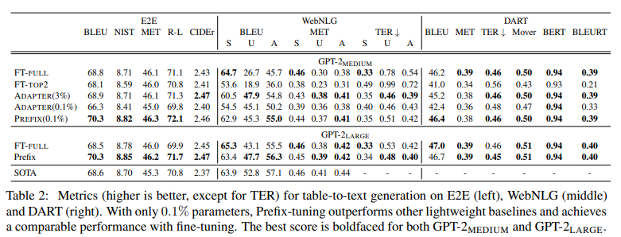
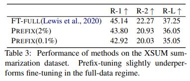
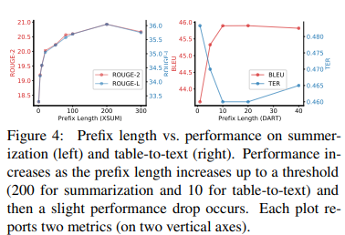
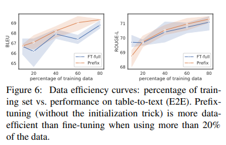

논문 및 이미지 출처 : <https://aclanthology.org/2021.acl-long.353.pdf>

# Abstract

Fine-tuning (FT) 는 large pre-trained language models 를 downstream task 에 활용하는 표준 방법이다.

하지만 FT 는 language model (LM) parameter 를 수정하고 각 task 에 대한 full copy 를 저장해야 한다.

본 논문에선 natural language generation (NLG) tasks 에 대한 FT 의 경량적 대안인 **_prefix-tuning_** 를 제안

prefix-tuning 는

- LM parameter 를 freezing 하는 대신 _continuous task-specific vectors_ 의 sequence 인, _prefix_ 를 최적화
- LM prompting 에서 영감을 받아 subsequent tokens 가 이 prefix 를 "virtual tokens" 처럼 참조할 수 있게함

저자는 prefix-tuning 을 table-to-text generation 을 위해 GPT-2 에 적용하고 요약을 위해 BART 에 적용

0.1% parameter 만 수정함으로써, prefix-tuning 은 full data 설정에서 동등한 성능 및 low-data 설정에서 FT 를 능가하며, training 중 unseen topics 를 가진 examples 를 더 잘 추론

# 1. Introduction

Fine-tuning (FT) 은 large pre-trained language model 을 사용하여 donwstream task (e.g. summarization) 를 수행하는 주요 패러다임. 하지만 FT 는 LM 의 모든 parameter 를 update 하고 저장해야 하므로 각 task 마다 수정된 모든 LM parameter 의 copy 를 저장해야 한다.

현재 LM 크기를 고려하면 비용이 매우 많이 든다. 예로, GPT-2 는 774M parameter, GPT-3 는 175B parameter 를 가지고 있다.

이 문제를 _lightweight fine-tuning_ 으로, pre-trained LM 대부분의 parameter 를 freezing 하고 smaller parameter set 만 tuning 하는 것이다.

예로, adapter-tuning 은 pre-trained LM 의 layers 사이에 additional task-specific layers 를 삽입한다.

adapter-tuning 은 NLU 및 NLG 에서 유망한 성능을 보이며 FT 와 유사한 성능을 달성하여 약 2-4% 정도의 task-specific parameter 를 추가한다.

극단적으로 GPT-3 는 어떠한 LM parameter 도 수정하지 않고 in-context learning 을 사용하여 배포 가능하다.

in-context learning 은 prompting 의 한 형태로, natural language task instruction 와 몇 가지 예제를 task input 에 먼저 추가한 다음 LM 에서 task output 생성.

하지만 Transformer 는 제한된 길이의 context (GPT-3 의 경우 2048) 에만 의존할 수 있어, in-context learning 은 매우 작은 훈련셋으로 제한된다.

본 논문에서는 prompting 에 영감을 받은 lightweight FT 인 _prefix-tuning_ 을 제안

- task input 은 linearized table (e.g. "name: Starbucks | type: coffee shop") 이며 output 은 text description (예: "Starbucks serves coffee")
- Prefix-Tuning 은 input 에 _continuous task-specific vectors_ sequence 인 _prefix_ 를 앞에 추가
  - 이 prefix 는 Figure 1 (아래) 에 빨간 블록으로 표시
- 각 토큰 생성 시, LM 은 prefix 에 참조할 수 있으므로 prefix 가 "virtual token" sequence 처럼 작동하지만 prefix 는 실제 토큰과 대응하지 않는 free parameter 로만 구성
  - 반면 Figure 1 (위) 의 FT 는 모든 LM parameter 를 update 하고 각 task 마다 tuned model 의 copy 를 저장해야 함

결과적으로, 저자는 LLM 과 learned task-specific prefix 의 copy 만 저장하면 되므로 각 additional task 에 대한 매우 작은 overhead 발생 (e.g. 250K parameter for table-to-text)

# 2. Related Work

# 3. Problem Statement

input $x$ 가 context 고 output $y$ 가 token sequence 인 조건부 생성 작업을 고려

Figure 2 (오른쪽)에 나와 있는 두 가지 작업에 중점을 둔다.

table-to-text 에서, $x$ 는 linearized data table 에 해당하고 $y$ 는 text description 이다.

summarization 에서, $x$ 는 article 이고 $y$ 는 summary 이다.

## 3.1 Autoregressive LM

$\phi$ (e.g. GPT-2) 에 의한 parameterized autoregressive neural language model $p_{\phi}(y\ |\ x)$ 가 있다고 가정하자.

- Figure 2 (위)에 있는 것 처럼, $z = [x; y]$ 으로, $x$ 와 $y$ 의 연결
- $\text{X}_{\text{idx}}$ 는 $x$ 에 해당하는 indices sequence 로 나타냄
- $\text{Y}_{\text{idx}}$ 도 $y$ 에 대해 동일하게 적용
- $i$ time step 에서의 activation vector 는 $h_i \in \mathbb{R}^d$
  - 여기서 $h_i = [h_i^{(1)}; \cdots; h_i^{(n)}]$ 은 이 time step 의 all activation layers 를 연결
  - $h_i^{(j)}$ 는 time step $i$ 에서의 $j$-th layer 의 activation vector

autoregressive neural LM 은 다음과 같이 left context 에서 $z_i$ 와 past activations 의 function 으로 $h_i$ 계산

$$
\begin{equation}
  h_i = \text{LM}_{\phi} (z_i, h_{<i}),
\end{equation}
$$

- $h_i$ 의 last layer 는 next token: $p_{\phi}(z_{i+1}\ |\ h_{\leq i}) = \text{softmax}(W_{\phi} h_i^{(n)})$ 의 distribution 계산을 위해 사용
- $W_{\phi}$ 는 $h_i^{(n)}$ 를 vocabulary logits 으로 매핑하기 위한 행렬

## 3.2 Encoder-Decoder Archirecture

$p_{\phi}(y\ |\ x)$ 모델링을 위해 encoder-decoder architecture (e.g. BART) 를 사용할 수 있다.

- $x$ 는 bidirectional encoder 에 의해 인코딩된 것
- decoder 는 $y$ 를 autoregressively predict (encoded $x$ 및 left context 에 조건을 둔 상태)

동일한 indexing 및 activation notation 은 Figure 2 (아래) 와 같이 표시

- $i \in \text{X}_{\text{idx}}$ 는 bidirectional encoder 에 의해 계산
- $i \in \text{Y}_{\text{idx}}$ 에 대한 각 $h_i$ 는 Eq. 1 을 사용하여 autoregressive decoder 로 계산

## 3.3 Fine-tuning

full FT 에서, 저자는 pre-trained parameter $\phi$ 를 초기화한다.

여기서 $p_{\phi}$ 는 trainable LM distribution 이며, 다음 log-likelihood objective 를 따라 gradient update 를 수행한다.

$$
\begin{equation}
  \underset{\phi}{\max}\ \log p_{\phi}(y\ |\ x) = \underset{\phi}{\max} \sum_{i \in \text{Y}_{\text{idx}}} \log p_{\phi} (z_i\ |\ h_{<i}).
\end{equation}
$$

# 4. Prefix-Tuning

## 4.1 Intuition

Prompting 은 parameter 를 변경하지 않고 LM 을 조절할 수 있는 적절한 context 에 조건을 둔다.

예로 LM 이 word (e.g. Obama) 를 생성하길 원하면, 해당 단어의 일반적인 공존어를 context 로 추가할 수 있으며 (e.g. Barack), LM 은 원하는 단어에 훨씬 더 높은 확률을 할당한다.

single word 나 sentence 생성을 넘어, 이러한 intuition 을 확장하여 LM 을 NLG task 를 해결하도록 조절하는 context 를 찾기를 원한다.

- context 는 task input $x$ 에서 추출할 내용을 가이드함으로써 task input $x$ 의 인코딩에 영향을 미칠 수 있다.
- next token distribution 을 조절함으로써 task output $y$ 의 생성에도 영향을 미칠 수 있다.

하지만 위같은 context 가 존재하는지 명백하지 않으며, natural language task instruction (e.g. "summarize the following table in one sentence") 를 사용하면 context 가 task 를 해결하도록 인간을 가이드할 수 있지만, 중간 규모의 pre-trained LM 에서는 실패한다.

discrete instruction 최적화는 도움 될 수 있지만, computationally challenging

---

discrete token 최적화 대신, instruction 을 저자는 continuous word embeddings 로 최적화할 수 있으며, 그 효과는 all Transformer activation layers 로 propagated upward 되고 subsequent token 으로 rightward 된다.

이는 실제 단어의 embeddings 로 제한되는 discrete prompt 보다 표현력이 높다.

Prefix-tuning 은 표현력을 높이는데서 더 나아가 all activation layers 를 최적화함으로써 나아간다.

다른 이점으로는 network depth 에 따라 long computation paths 를 피하기 위해 representations 를 직접 수정할 수 있다.

## 4.2 Method

Prefix-Tuning 은 autoregressive LM 에 prefix 를 덧붙여 $z = [\text{PREFIX}; x; y]$ 를 얻거나 encoder 및 decoder 모두에 prefix 를 덧붙여 $z = [\text{PREFIX}; x; \text{PREFIX}'; y]$ 을 얻는다. (Fig 2 참조)

- 여기서, $\text{P}_{\text{idx}}$ 는 prefix indices 의 sequence
- $|\text{P}_{\text{idx}}|$ 는 prefix length

Eq. 1 의 recurrence relation 을 따르되, prefix indices 의 activation 은 free parameter 이며, dimension $|\text{P}_{\text{idx}}| \times \text{dim}(h_i)$ 의 matrix $\text{P}_{\text{idx}}$ ($\theta$ 에 의해 parameterized) 에 의해 주어진다.

$$
\begin{equation}
  h_i = \left\{\begin{matrix}
  P_\theta [i, :], & \text{if} i \in \text{P}_{\text{idx}} \\ 
  \text{LM}_{\phi}(z_i, h_{<i}), & \text{otherwise.}
  \end{matrix}\right.
\end{equation}
$$

training objective 는 Eq. 2 와 동일하게 하지만 trainable parameters set 은 변경한다.

- LM parameters $\phi$ 는 고정되고 prefix parameters $\theta$ 만 trainable parameters 이다.
- 여기서 각 $h_i$ 는 trainable $P_\theta$ 의 function 이다.
- $i \in \text{P}_{\text{idx}}$ 인 경우 $h_i$ 는 $P_\theta$ 로 직접 copy 되기 때문에 clear 하다.
- $i \notin \text{P}_{\text{idx}}$ 인 경우 prefix activation 은 항상 left context 에 있으며 right activation 에 어떠한 영향을 미칠 것이기 때문에 $h_i$ 는 여전히 $P_\theta$ 에 의존적이다.

## 4.3 Parameterization of $P_{\theta}$

$P_\theta$ 를 직접적으로 update 하는 것은 불안정한 최적화와 약간의 성능 저하를 유발

따라서 저자는 smaller matrix ($P'_\theta$) 로 large feedforward neural network $\text{MLP}_\theta$ 를 포함한 reparameterized matrix $P_\theta [i:0] = \text{MLP}_\theta (P'_\theta [i,:])$ 을 만든다.

이제 trainable parameters 는 $P'_\theta$ 및 $\text{MLP}_\theta$ 의 parameter 를 포함한다.

$P_\theta$ 와 $P_\theta'$ 는 rows 수는 같지만 column 수가 다르다.

training 이 완료되면, 이런 reparameterization parameters 를 drop 하고 prefix ($P_\theta$) 만 저장하면 된다.

# 5. Experimental Setup

## 5.1 Datasets and Metrics

table-to-text task 를 위한 세 가지 generation dataset 인 E2E, WebNLG 및 DART 에서 평가

- dataset 은 복잡성과 크기에 따라 정렬됨
- E2E 는 레스토랑 리뷰만 1 domain
- WebNLG 는 14 domains
- DART 는 Wikipedia 의 open domain table 사용

summarization task 의 경우, 뉴스 기사에 대한 요약 데이터셋 XSUM 사용

ROUGE-1, ROUGE-2 및 ROUGE-L 을 보고

## 5.2 Methods

table-to-text generation task 대해 prefix-tuning 을 다른 세 가지 방법과 비교

- full fine-tuning (FT-FULL), top 2 layers fine-tuning (FTTOP2), adapter tuning (ADAPTER)

## 5.3 Architectures and Hyperparameters

table-to-text 에 대해 GPT-2-MEDIUM 및 GPT-2-LARGE 사용

summarization task 에 대해선 BART LARGE 사용 

저자의 구현은 huggingface transformers 에 기반

- training 시 AdamW optimizer 및 Hugging Face 의 기본 설정에 따른 linear learning rate scheduler 사용
- hyperparameter 는 epochs, batch size, learning rate 및 prefix length 들을 조정
  - 10 epochs
  - 5 batch size
  - $5 \cdot 10^{-5}$ learning rate
  - 10 prefix length
- model 은 TITAN Xp 또는 GeForce GTX TITAN X 에서 훈련
- Prefix-tuning 은 22,000개 examples 에 대해 epoch 당 0.2 시간 걸림
- Fine-tuning 은 epoch 당 0.3 시간 걸림
- summarization model 은 Telsa V100 에서 훈련
  - XSUM dataset 은 epoch 당 1.25 시간 걸림
- prefix-tuning 은 fine-tuning 보다 약 30% 시간 효율성이 좋음
- GPU 메모리 효율성에선, 1 batch size 로 하는 prefix-tuning 은 총 GPU 메모리의 10% 차지 및 fine-tuning 은 50% 차지
- 디코딩 시엔 table-to-text task 에 대해 beam search 사용하며 크기는 5
- summarization task 에선 6 beam 과 0.8 length normalization 사용
- table-to-text 의 경우, batch 처리를 하지 않고 문장 당 1.2초, summarization 의 경우엔 10 batch size 를 사용하여 배치당 2.6초가 걸림 

# 6. Main Results

## 6.1 Table-to-text Generation

0.1% 의 task-specific parameter 만 update 하여, prefix-tuning 은 table-to-text generation 에서 효과적

다른 lightweight baseline (ADAPTER 및 FT-TOP2) 를 능가하며 parameter 를 30배 적게 update 하면서도 (full) FT 와 comparable

- prefix-tuning 과 adapter-tuning 의 parameter 수를 0.1% 로 맞추면, Table 2 에서 prefix-tuning 이 ADAPTER 보다 큰 성능을 보임
- 평균적으로 데이터셋 당 4.1 BLEU 개선
- fine-tuning (100%) 및 adapter-tuning (3.0%) 와 비교하여 prefix-tuning 은 두 시스템과 comparable 또는 나은 성능
  - 이는 prefix-tuning 이 adapter-tuning 보다 Pareto efficient 이며, generation quality 향상 및 parameter 를 크게 줄임
- DART 에서 좋은 성능을 달성하여, prefix-tuning 이 다양한 domain 과 많은 table 에 일반화될 수 있음을 시사
- 

요약하면, prefix-tuning 은 GPT-2 를 table-to-text generation 에 적응시키는데 효과적이고 공간 효율적인 방법. 또한 GPT-2-LARGE 로 확장하면 성능 이득을 유지하며, GPT-3 같은 아키텍처로 더 큰 모델로의 확장에서도 잠재력이 있음을 시사

## 6.2 Summarization

위에서 보이듯 2% parameter 로 prefix-Tuning 는 FT 보다 약간 낮다.

parameter 가 0.1% 일 때, prefix-tuning 은 full FT 에 못미친다.

table-to-text dataset 과 XSUM 간에는 prefix-Tuning 이 table-to-text 에서 우위를 가지는 이유는 다음 차이점이 있다.

1. XSUM 은 평균적으로 세 개의 table-to-text dataset 보다 4배 많은 예제 포함
2. 입력 기사에는 평균적으로 table-to-text dataset 의 linearized table input 보다 17배 김
3. 요약에선 기사로부터 주요 내용을 선택해야 하므로 table-to-text 보다 복잡 

## 6.3 Low-data Setting

table-to-text 및 summarization 결과를 기반으로, prefix-tuning 은 training example 수가 적을 때 비교적 이점을 가짐

low-data 설정에 대해 체계적으로 탐구하기 위해 전체 데이터셋의 sub-sample 을 사용

각 크기에 대해 5개의 다른 데이터셋을 샘플링하고 2개의 훈련 랜덤 시드에서 평균을 냈다. 따라서 low-data 설정마다 10개의 모델을 평균화하였다.

위의 오른쪽은 dataset size 가 커짐에 따라 간격이 좁아지지만, low-data 에서 prefix-tuning 이 평균적으로 2.9 BLEU 더 높은 성능을 보이고 smaller parameter 가 필요하다는 것을 시사한다.

왼쪽에선 다른 데이터 수준에서 훈련된 prefix-tuning 및 fine-tuning 모델에 의해 생성된 8개의 예제이다.

두 방법 모두 low-data 설정에서 table content 가 누락되는 경향이 있지만, prefix-tuning 은 fine-tuning 보다 믿음직 스러운 경향이 있다.

예로 fine-tuning (100, 200) 은 실제 평균 고객 등급을 낮게 평가하는 반면, prefix-tuning (100, 200) 은 테이블과 일치하는 설명을 생성한다.

## 6.4 Extrapolation

table-to-text 및 summarization 의 unseen topic 으로 extrapolation 성능 조사

extrapolation 설정을 위해 기존 데이터셋을 분할하여 training 및 test 가 다른 topic 을 다루도록 함

- table-to-text 의 경우 WebNLG 데이터셋은 table topic 으로 label 지정
- training 및 dev 에 나타나는 9개 카테고리는 SEEN, text 에만 나타나는 5개의 카테고리는 UNSEEN 으로 표시
  - SEEN 카테고리에 훈련하고 UNSEEN 카테고리에 테스트
- summarization 의 경우 두 가지 extrapolation data 분할을 구성
  - new-to-sports 에서, 뉴스 기사를 훈련하고 스포츠 기사를 테스트
  - within-new 에서, {world, UK, business} 뉴스를 훈련하고 나머지 뉴스 카테고리에서 테스트

table-to-text 및 summarization 모두에서 prefix-tuning 은 Table 4 와 Table 2 에 표시된 것과 같이 모든 메트릭에서 FT 보다 extrapolation 성능이 우수

또한 adapter-tuning 도 prefix-tuning 과 유사한 extrapolation 성능 달성하며, Table 2 에서 보이듯 이 공통된 경향은 LM parameter 를 보존하는 것이 extrapolation 에 긍정적인 영향을 미친다는 것을 시사

# 7. Intrinsic Evaluation

## 7.1 Prefix Length

longer prefix 는 더 많은 trainable parameter 를 통해 더 큰 표현력을 의미

prefix 증가에 따라 성능이 증가하다 임계값에 도달 (summarization 은 200, table-to-text 는 10) 후 약간의 성능 저하

임계값보다 긴 prefix 는 낮은 training loss 를 유발하지만 약간 더 나쁜 테스트 성능을 나타내어 training data 에 overfitting 가능성을 시사

## 7.2 Full vs Embedding-only

"virtual token" 의 continuous embedding 을 최적화하는 것을 _embedding-only_ 라 부른다.

word embedding 은 free parameter 이며 나머지 activation layers 는 Transformer 에 의해 계산된다.

Table 5 상단에는  성능 하락을 보여주며, embedding layer 만 조정하는 것은 충분한 표현력이 부족하는 것을 시사

embedding-only 는 discrete prompt 최적화의 성능 상한선을 제시한다.

이유는 discrete prompt 가 embedding layer 를 정확하게 실제 단어의 embedding 과 일치시키도록 제한하기 때문이다. 따라서 다음과 같은 증가하는 표현력 chain 이 있다.

discrete prompting < embedding-only < prefix-tuning

## 7.3 Prefix-tuning vs Infix-tuning

sequence 내에서 trainable activations 위치에 따른 성능 조사

이러한 trainable activation 을 시작 부분 $[\text{PREFIX}; x; y]$ 에 배치한다.

또한 trainable activation 을 $x$ 와 $y$ 사이 (i.e. $[x; \text{INFIX}; y]$) 에도 위치하며 이를 infix-tuning 이라 한다.

Table 5 (하단) 에서 infix-tuning 이 prefix-tuning 보다 약간 성능이 낮다는 것을 보여준다. 

이는 prefix-tuning 이 $x$ 와 $y$ 의 activation 에 영향을 미칠 수 있지만 infix-tuning 은 $y$ 의 activation 에만 영향을 미칠 수 있기 때문이다.

## 7.4 Initialization

저자는 prefix 가 data 설정에 어떻게 initialization 되는지가 성능에 큰 영향을 끼지는 것을 발견

Random initialization 은 low performance, high variance 를 가짐

실제 단어의 activation 으로 초기화하는 것은 generation 을 크게 향상시킴 

특히 summarization 과 text-to-text task 에 이와 관련된 단어로 초기화하면 "elephant" 나 "divide" 같이 관련 없는 단어보다 약간 더 나은 성능을 얻지만 random initialization 이 더 나은 성능을 보임

또한 전체 데이터 설정에서 initialization trick 은 영향을 미치지 않으며 random initialization 도 동일한 수준의 성능 제공

prefix 를 pre-trained LM 에 의해 계산된 실제 단어의 activation 으로 초기화하기 때문에 이 전략은 prefix-tuning 개념과 일치

## 7.5 Data Efficiency

data efficiency 측면에서도 random initialization 을 사용한 prefix-tuning 과 전체 fine-tuning 의 성능을 비교하면 E2E task 의 5가지 데이터 규모 (10%, 20%, 40%, 60% 및 80%) 에서 성능 비교

Figure 6 은 20% 이상의 데이터를 사용할 때 prefix-tuning 이 fine-tuning 보다 성능이 우수함을 보여줌. 

데이터 규모가 10% 인 경우 random initialization 을 사용한 prefix-tuning 이 full fine-tuning 과 유사하거나 약간 더 낮은 성능을 제공하여 이 low-data 범위에서 성능을 향상시키기 위해 initialization trick 이 필요함을 시사

# 8. Discussion

### Personalization

[1](#1-introduction) 에서 언급했듯, prefix-tuning 은 독립적인 훈련이 많은 task 에 유리

한 사례로 user privacy 보호를 위해 각 사용자의 데이터를 분리하고 각 사용자에 대해 별도의 개인화된 모델을 훈련한다고 했을 때, 각 사용자는 독립적인 task 로 간주할 수 있음

수백만 명의 사용자가 있을 경우 prefix-tuning 은 이 설정에서 확장 가능하며, 유연한 방식으로 사용자를 추가하거나 삭제할 수 있어 교차 오염없이 작동할 수 있다.

### Batching across users.

동일한 personalization 설정에서도 prefix-tuning 은 다른 prefix 를 사용한 다른 사용자의 쿼리를 배치로 처리 가능

여러 사용자가 입력으로 클라우드 GPU 에 쿼리하는 경우, 동일한 배치에 넣는 것이 계산적으로 효율적

prefix-tuning 은 shared LM 을 그대로 유지하므로 배치를 만드는 것은 입력에 개인화된 prefix 를 추가하는 단순한 단계가 필요하며 나머지 계산은 변경되지 않는다.

반면, adapter-tuning 은 shared transformer layer 사이에 개인화된 adapter 가 있는 경우 서로 다른 사용자를 배치로 처리할 수 없다.

이러한 배치 이점은 동일한 task 에 훈련된 여러 prefix 의 효율적인 앙상블을 생성하는 데 도움이 될 수도 있다.

### Inductive bias of prefix-tuning

Fine-tuning 은 all pretrained parameter 를 업데이트하는 반면, prefix-tuning 과 adapter-tuning 은 보존한다. 

LM 은 일반적인 목적의 corpora 에서 pretraining 되었으므로 LM parameter 를 보존하면 training 중의 unseen domain 에 대한 일반화에 도움 가능

이에 따라 prefix-tuning 과 adapter-tuning 이 inference 설정에서 큰 성능 향상을 보이는 것을 관찰 ([6.4](#64-extrapolation)). 그러나 이러한 방법이 추론을 어떻게 개선하는지는 여전히 알려지지 않은 문제

---

Prefix-tuning 과 adapter-tuning 은 둘 다 pre-trained parameter 를 고정하지만 Transformer 의 activation layer 에 영향을 미치기 위해 다른 parameter set tuning.

Prefix-tuning 은 LM 을 그대로 유지하며 prefix 와 pre-trained attention block 을 사용하여 이후 activation 에 영향을 미친다. 

반면, adapter-tuning 은 LM layer 사이에 trainable module 을 삽입하여 activation 에 직접 residual vectors 추가. 더불어, prefix-tuning 은 adapter-tuning 에 비해 훨씬 적은 parameter 를 필요로 하는 것을 관찰했는데, 이는 prefix-tuning 이 pre-trained LM 을 가능한 한 그대로 유지하여, adapter-tuning 보다 LM을 더 활용하기 때문이라고 생각한다.

최근 연구는 intrinsic dimension 을 사용하여 fine-tuning 과 동일한 효과를 내는 low-dimensional reparameterization 수가 존재함을 보여줌. 

왜 downstream task 에서 작은 수의 parameter 만 update 해도 좋은 정확도를 얻을 수 있는지를 설명한다. 

저자의 연구는 small prefix 를 update 함으로써 좋은 생성 성능도 얻을 수 있음을 보여준다. 

그러나 prefix-tuning 은 단순히 trainable parameter 의 크기뿐만 아니라 어떤 subset parameter 를 수정해야 하는지에 관한 것이다. 

따라서 미래 연구에서 더 나은 accuracy-size trade-off 를 달성하는 다른 light-weight fine-tuning 방법을 탐구하는 것은 흥미로울 것.
