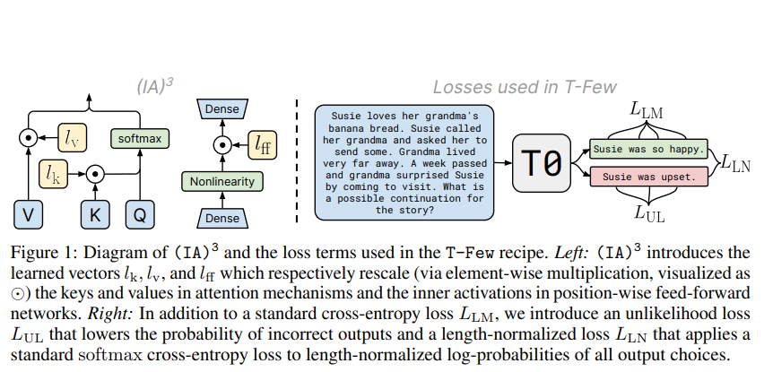
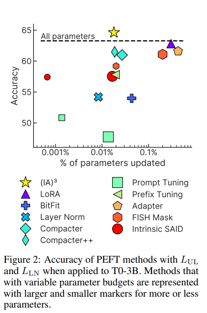
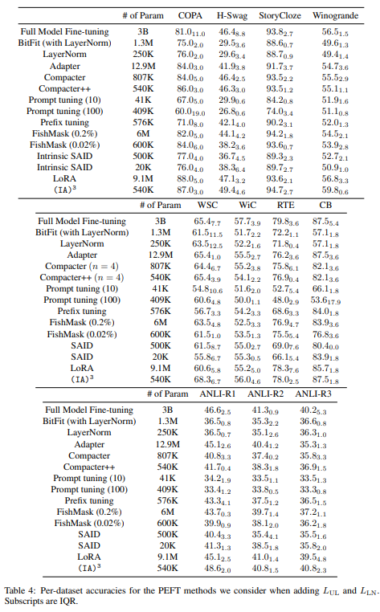
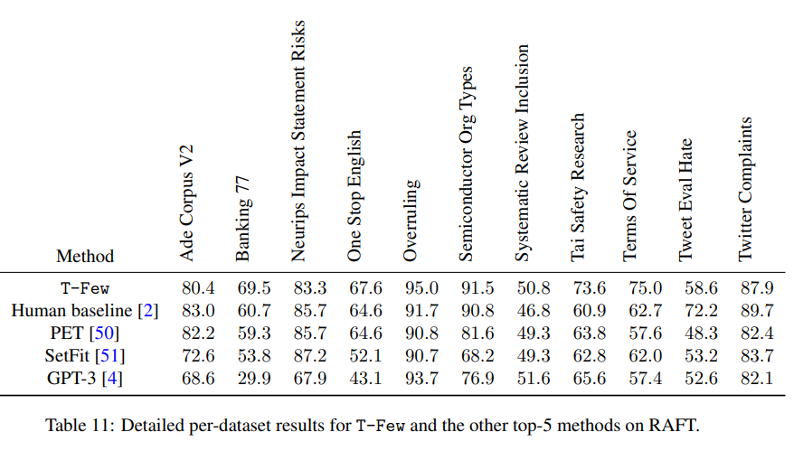

논문 및 이미지 출처 : <https://arxiv.org/pdf/2205.05638.pdf>

# Abstract

Few-shot in-context learning (ICL)은 pre-trained language model (LM) 이 input 의 일부에 적은 수의 training examples 를 feeding 하여 unseen task 를 gradient-based training 없이 수행하게 했다.

- ICL 은 all training examples 를 처리해야 하여 계산, 메모리 및 저장 비용이 큼

Parameter-efficient fine-tuning (PEFT) (e.g. adapter modules, prompt tuning, sparse update, etc) 은 모델이 new task 를 수행하도록 훈련된 parameter small set 을 제공하는 paradigm

---

본 논문은 few-shot ICL 과 PEFT 를 비교하여 PEFT 가 better accuracy 및 lower computational cost 제공을 입증한다.

이 과정에 learned vector 로 activations 를 확장하는 new PEFT 인 $(IA)^3$ 소개

- tiny new parameter 만 도입하여 더 강력한 성능
- T0 model 에 기반하는 _F-Few_ 로, new tasks 에 대한 task-specific tuning 또는 modifications 없이 적용할 수 있는 simple recipe 제안
- T-Few 를 RAFT benchmark 에 적용함으로써 unseen tasks 에 대한 효과성 검증
- super-human 성능을 최초로 6% 로 능가하여 SOTA 달성

# 1. Introduction

pre-trained LM 은 NLP 의 중요한 요소

- 모델로 target task 에 대한 _data-efficient_ 를 크게 향상. 즉, pre-trained LM 을 초기화에 사용하여 less labeled data 에 better results
- common approach 는 pre-trained LM 의 parameter 를 초기화에 사용한 다음, target downstream task 에 gradient-based fine-tuning 수행
  - fine-tuning 은 SOTA 를 도출하지만, new parameter set 값을 가지는 single task 에 특화된 모델을 생성하여 여러 downstream task 에 fine-tuning 할 경우 불필요하게 복잡해짐

[Language models are unsupervised multitask learners, Language models are
few-shot learners] 에서 인기 있는 alternative approach 는 _in-context learning_ (ICL) 이다.

- ICL 은 모델이 _prompted_ example 을 inputting 하여 downstream task 를 수행하도록 유도
- Few-shot prompting 은 input-target pairs 를 예측이 필요한 single unlabeled example 을 따라, human-understandable instructions 및 example 로 변환
- ICL 은 gradient-based training 이 필요하지 않아, single model 은 즉시 다양한 task 에 수행 가능
- 따라서, ICL 은 pre-training 중에 모델이 학습한 능력에만 의존하며, 이 특성으로 인해 ICL 방법에 관심이 쏠림

ICL 은 위 이점에도 불구하고 여러 단점 존재

- 모델이 예측할 때마다 prompted input-target pairs 를 모두 처리하면 상당한 계산 비용 발생
- ICL 은 일반적으로 fine-tuning 보다 성능 떨어짐
- prompt 의 exact formatting (단어 선택 및 예제 순서 포함)이 모델의 성능에 미치는 영향을 예측 불가능

최근 ICL 이 incorrect labels 를 제공해도 잘 수행하는 점을 보여주며, 얼마나 많은 학습이 이루어지는지에 대한 의문 제기

최근의 연구는 ICL이 부정확한 레이블을 제공받아도 잘 수행할 수 있다는 점을 보여주는데, 이는 학습이 얼마나 많이 이루어지는지에 대한 의문을 불러일으킴

---

model 이 new task 수행을 위해 minimal updates 로 모델을 활성화하는 추가적인 패러다임인 _parameter-efficient fine-tuning_ (PEFT)

- pre-trained model 에 추가 또는 선택된 small parameter 만 update 하여 fine-tuning
- 최근 전체 모델의 subset parameter (e.g. 0.01%)만 update 하거나 추가하여 fine-tuning 과 동등한 성능 달성
- 특정 PEFT 은 batch 내의 examples 를 다르게 처리하는 _mixed-task batches_ 를 허용하여 PEFT 및 ICL 은 multitask models 모두에 적합

PEFT 의 이점은 fine-tuning 의 일부 단점을 해소하지만, 매우 적은 양의 label data 만 사용 가능할 경우 PEFT 방법이 잘 작동하는지에 대한 연구가 적다.

본 논문의 주요 목표는 이 공백을 메우기 위해 model, PEFT method 및 fixed hyperparameter set 을 사용하여, 모델의 일부 parameter 만 업데이트하며 novel, unseen task 에서 강력한 성능을 달성하는 recipe 제안

- 저자의 approach 는 T0 model 을 기반
  - 이 모델은 T5 의 변형으로 다양한 prompt dataset 의 multitask mixture 을 fine-tuning 한 것
- classification 및 multiple-choice tasks 성능 향상을 위해 unlikelihood 및 length normalization-based loss term 추가
- intermediate activations 를 learned vectors 와 곱하는 PEFT method $(IA)^3$ 개발
  - $(IA)^3$ 은 parameter 를 최대 10,000배 적게 업데이트하며 full fine-tuning 보다 강력한 성능 달성
- 저자의 _T-Few_ recipe 는 ICL (16배 큰 모델과 비교) 에 비해 상당히 더 나은 성능 발휘
  - real-world few-shot learning 벤치마크 RAFT 에서 처음으로 human 능가
  - less compute 및 inference 중 mixed-task batches 가능

# 2. Background

# 3. Designing the T-Few Recipe

PEFT 는 small storage requirement 및 computational cost 로 model 을 new task 에 adapting 할 가능성을 제시하여 ICL 의 대안으로 유망함

- 따라서 저자는 computational 및 storage cost 를 최소화하며 inference 중 mixed-task batches 가 가능한, limited labeled examples 로 new task 에 높은 정확도를 달성할 수 있는 recipe 개발이 목표

여기서 _recipe_ 란 new task 에서 강력한 성능을 제공하는 model 및 hyperparameter 설정을 의미하며, manual tuning 이나 per-task adjustments 없이 강력한 성능을 보장할 수 있는 것이다.

이를 평가하기 위해 limited labeled data 만 사용 가능한 few-shot settings 에서 approach 가 실질적인 옵션임을 보장할 수 있다.

## 3.1 Model and Datasets

limited labeled examples 로 fine-tuning 후에도 성능이 높은 이상적인 pre-trained model 선택에 있어, PEFT method 적용으로 best 성능을 달성한 T0 채택.

- T0 는 T5 기반이며, unlabeled text data 인 large corpus 의 masked language modeling objective 로 pre-training 한 encoder-decoder Transformer
- dataset multitask mixture 을 기반으로 T5 를 fine-tuning 하여 zero-shot generalization 가능 (i.e. additional gradient-based training 없이 task 수행)
- T0 training 에 사용된 dataset examples 는 Public Pool of Prompts (P3) 의 prompt templates 를 적용한 prompted 이며, prompted text-to-text format 으로 변환
- T0 는 3B 와 11B parameter 를 제공하며 각각 "T0-3B" 및 "T0" 로 지칭

---

T0 는 zero-shot generalization 을 위해 설계되었지만, 저자는 few labeled example 만으로 fine-tuning 후에도 강력한 성능을 달성하는 것을 증명

- T0 generalization 능력 테스트를 위해 multitask training mixture 에서 제외할 task 선택
  - sentence completion (COPA, H-SWAG 및 Stroy Cloze datasets)
  - natural language inference (ANLI, CB 및 RTE)
  - coreference resolution (WSC 및 Winogrande)
  - word sense disambiguation (WiC)

또한 RAFT 벤치마크에서 T-Few 의 능력을 Sectiopn [4.3](#43-performance-on-real-world-few-shot-tasks-raft) 에서 테스트

- RAFT 는 validation 및 held-out test set 없이 unseen "real-world" few-shot collection

평가에는 "rank classification" 을 사용하며, all possible label strings 에 대한 모델의 log-probabilities 는 순위를 지정하며, 가장 높은 순위의 choice 는 가 올바른 답일 경우 모델 예측이 올바르다 간주

Rank classification evaluation 은 classification 및 multiple choice tasks 모두와 호환

모델 성능은 prompt template 에 따라 크게 다르므로 각 데이터셋에 대한 all prompt template 를 median accuray 로 보고

test label 이 public 이 아닐 경우 (e.g. SuperGLUE) test set 또는 validation set 에 대한 정확도를 보고

본문에선 위에서 언급한 9개 데이터셋에 대한 median accuracy 보고

## 3.2 Unlikelihood Training and Length Normalization

PEFT 연구 전에, 저자는 LM 의 few-shot fine-tuning 의 성능 향상을 위한 두 가지 additional loss terms 탐구

LM 은 보통 cross-entropy loss $L_{LM} = -\frac{1}{T} \sum_t \log p (y_t | \text{x}, y_{<t})$ 로 훈련된다.

- input sequence $\text{x}$ 에 대한 correct target sequence $\text{y} = (y_1, y_2, \dots, y_T)$ 의 probability 가 증가하도록 훈련
- 평가를 위해, 모델의 correct/incorrect choice 의 probability 에 따라 다른 rank classification 사용

$$
\begin{equation}
  L_{\text{UL}} = -\frac{\sum^N_n=1 \sum^{T^{(n)}}_{t=1} \log (1 - p (\hat{y}_i^{(n)}|\text{x}, \hat{y}^{(n)}_{<t}))}{\sum^N_{n=1}T^{(n)}}
\end{equation}
$$

- 모델이 incorrect target sequence 의 tokens 을 예측하는 것을 억제한다.
  - incorrect target sequence $\hat{\text{y}}^{(n)} = (\hat{y}_1, \hat{y}_2, \dots, \hat{y}_{T^(n)}$ 는 $N$ 개 incorrect target sequence 의 $n$-th
- $L_{\text{UL}}$ 을 추가하여 rank classification 결과가 개선될 것으로 가정
  - 이는 모델이 incorrect choice 에 더 낮은 확률을 할당하도록 훈련되므로 correct choice 가 가장 높은 순위로 ranking 될 가능성이 향상될 것으로 예상

---

training example 에 대한 possible target sequence 는 길이가 다양하며, 특히 multiple-choice tasks 에서 더 그렇다.

각 choice 를 proability 에 따라 ranking 매기면 모델은 더 shorter choice 를 선호한다. 이는 각 token 에 할당된 확률이 $\leq 1$ 이기 때문이다.

이를 보정하기 위해 rank classification 수행 시에 length normalization 사용을 고려한다.

- length normalization 은 모델이 각 possible answer choice 에 대한 score 를 choice token 수로 나누어 계산하는 방법 (GPT-3 에서 사용됨)
- evaluation 중 length normalization 을 사용할 때는 training 중 length-normalized evaluation 을 더 정확히 반영하는 additional loss 도입
-  먼저, 주어진 output sequence 의 length-normalized log probability $\beta(\text{x}, \text{y}) = \frac{1}{T}\sum^T_{t=1} \log p(y_t|\text{x},y_{<t}).$ 을 계산
-  그 후, Eq. 2 의 softmax cross-entropy loss 를 최소화함으로써 correct answer choice 의 length-normalized log probability 최대화

$$
\begin{equation}
  L_{\text{LN}} = - \log \frac{\exp(\beta(\text{x}, \text{y}))}{\exp(\beta(\text{x}, \text{y})) + \sum^N_{n=1} \exp(\beta(\text{x}, \hat{\text{y}}^{(n)}))}
\end{equation}
$$

$L_{\text{LM}}$, $L_{\text{UL}}$ 및 $L_{\text{LN}}$ 을 사용하여 모델을 training 할 때 이 loss 들을 단순히 합한다.

이는 few-shot setting 에 tuning 하기 어려운 hyperparameter 도입을 파하기 위함

- $L_{\text{LM}}$ 추가로 정확도가 60.7% → 62.71% 향상
- 모두 포함하면 63.3% 로 더 개선

이러한 loss 들은 additional hyperparameter 를 도입하지 않고도 성능을 향상시키므로 저자의 recipe 에 포함하고 이후 모든 실험에도 사용

## 3.3 Parameter-efficient fine-tuning with $(IA)^3$

few-shot ICL 과 유리한 비교를 위해 다음 PEFT 특성이 필요

- storage 및 memory cost 발생하지 않기 위해 가능한 한 few parameter 만 추가하거나 업데이트
- new task 에 대해 few-shot training 후에도 강력한 정확도 달성
- ICL 기능 중 하나인 mixed-task batches 허용성
  - mixed-task batches 이 가능하면서 PEFT 방법을 지키려면 모델 자체를 수정하면 안된다.
  - 위를 만족시키기 위해선 batch 의 각 examples 를 다른 모델 또는 computational graph 로 처리해야 한다.
- example 이 어떤 task 에 해당하는지에 따라 batch 의 각 examples 에 독립적이고 비용이 저렴하게 수행 가능하여 모델의 _activations_ 를 직접 수정하는 방법이 대인일 수 있다.
- Prompt tuning 및 Prefix-tuning 은 learned vectors 를 activation 또는 embedding sequence 에 연결하여 작동하므로 mixed-task batches 를 허용하는 activation-modifying PEFT method 의 예이다.
  - 하지만 합리적인 정확도를 얻지 못하였으며, 성능이 좋은 다른 PEFT method 는 mixed-task batches 를 허용하지 않음

위 사항으로 저자는 새로운 PEFT 방법을 개발 

---

대안으로, 저자는 모델의 activations 와 learned vector 간의 element-wise multiplication (i.e. rescaling) 을 탐구

- 저자는 $l \odot x$ 형태의 adaptation 고려
  - $l \in \mathbb{R}^d$ : learned task-specific vector
  - $\odot$ : element-wise multiplication
  - $x \in \mathbb{R}^{T \times d}$ : activations 의 length-$T$ sequence
- "broadcasting notation" 을 사용하여 $l \odot x$ 의 $(i, j)^{th}$ entry 는 $l_j x_{i,j}$ 이다.
- 예비 실험에선, Transformer 모델의 각 activation set 에 대한 learned rescaling vector 를 도입할 필요가 없음을 발견
  - 대신, self-attention 및 encoder-decoder attention 매커니즘에서 key, value 에 rescaling vector 도입
  - position-wise feed-forward network 의 intermediate activation 에도 rescaling vector 를 도입

구체적으로, 다음과 같이 attention 매커니즘 도입

 position-wise feed-forward 네트워크의 중간 활성화에도 재조정 벡터를 도입하는 것이 충분하다는 것을 발견했습니다. 구체적으로, Vaswani et al. [33]의 표기법을 사용하여 우리는 다음과 같이 attention 메커니즘에 도입합니다:

$$
\begin{equation}
  \text{softmax}\left ( \frac{Q(l_k \odot K^T)}{\sqrt{d_k}}  \right ) (l_v \odot V)
\end{equation}
$$

또한 position-wise feed-forward network 에서는 $(l_{ff} \odot \gamma (W_1 x))W_2$ 형태로 도입 

- $\gamma$ : feed-forward network nonlinearity 

각 Transformer layer block 마다 별도의 $l_k$, $l_v$ 및 $l_{ff}$ vector set 을 도입

- 이로 인해 $L$-layer-block Transformer encoder 에 $L(d_k + d_v + d_{ff})$ new parameter 추가
- $L$-layer-block decoder 에는 $L(2d_k + 2d_v + 2d_{ff})$ (self-attention 및 encoder-decoder attention 모두가 있어 2 factor 존재) 가 추가
- $l_k$, $l_v$ 및 $l_{ff}$ 는 모두 1로 초기화되어 있으므로 이러한 vecotrs 가 추가 되면 모델이 계산하는 전반적인 함수는 변경되지 않는다.

저자는 위와 같은 방법을 $(IA)^3$ 이라 부르며, "Infused Adapter by Inhibiting and Amplifying Inner Activations" 의 약자다.

---

$(IA)^3$ 은 batch 내의 각 activations sequence 는 learned task vector 에 의해 별도로 및 저렴하게 multiple 되므로 mixed-task batches 를 가능하게 함

또한 모델이 single task 에만 사용될 것이라면, $(IA)^3$ 의 도입으로 인한 수정은 weight matrices 에 영구적으로 적용하여 elementwise multiplication 이 필요하지 않고 model architecture 가 변경되지 않도록 할 수 있다.

이는 $(IA)^3$ 에서 수행된 element-wise multiplication 이 항상 matrix multiplication 과 동시에 발생하기 때문이다. $l \odot W x = (l \odot W) x$

이 경우, original model 과 비교하여 $(IA)^3$ 는 additional computational cost 를 부담하지 않는다.

---

$(IA)^3$ 검증을 위해, held-out task 의 few-shot dataset 에서 fine-tuning T0-3B 에 대한 저자의 설정에서 다양한 adaptation methods 를 비교

9 가지 강력한 PEFT 방법들과 비교한다.

- BitFit : bias parameter 만 update
- Adapters : self-attention 및 position-wise feed forward networks 후 task-specific layer 도입
- Compacter 및 Compacter++ : low-rank matrices 및 hypercomplex multiplication 을 사용하여 adapter 개선
- Prompt tuning : model input 에 연결되는 task-specific prompt embeddings 학습
- FISH Mask : Fisher information 에 기반하여 업데이트할 parameter subset 을 선택
- Intrinsic SAID : low-dimensional subspace 에서 optimization 수행
- Prefix-tuning : model 의 activations 에 연결되는 task-specific vectors 학습
- LoRA : parameter matrices 에 low-rank 를 할당

추가적으로 저자는 baseline full fine-tuning 및 layer normalization parameter 만 업데이트하는 것 포함

결과는 Fig. 2 에서 확인 가능

- $(IA)^3$ 은 full fine-tuning baseline 보다 높은 정확도 달성
- 다른 PEFT 는 parameter update 또는 introduce fewer parameter 이지만 $(IA)^3$ 은 훨씬 우수한 성능 발휘
- Compacter 및 Compacter++ 는 few-shot setting 에서 full fine-tuning 보다 뛰어나다 하며, prompt tuning 은 full fine-tuning 과 일치할 수 있다고 발견 했지만, 두 경우엔 다양한 hyperparameter choices 시도
  - 위 경우는 다른 모델 및 다른 데이터셋에서 비롯되어, 검증셋 성능이 training 과정 중 급격하게 변동할 수 있어 최적화 문제 가능성 시사

## 3.4 Pre-training $(IA)^3$

최근 prompt tuning 에서 prompt embeddings 를 _pre-training_ 하는 것이 downstream few-shot tasks 를 fine-tuning 할 때 성능 향상시키는 것 보여줌

이전 연구에서 unlabeled text data 에 적용되는 self-supervised tasks 를 사용하거나 separate task 또는 multitask mixture 로부터의 embeddings 를 사용하는 것을 고려했다.

저자는 전자를 따라, $(IA)^3$ 에 의해 도입된 new parameter 를 T0 훈련에 사용된 동일한 multitask mixture 에 간단히 pre-training 한다.

16 batch size 로 100,000 steps pretraining 후 $(IA)^3$ parameter 를 각 개별 downstream dataset 에 대해 fine-tuning

저자의 pre-training 이 fine-tuning 정확도를 64.6 에서 65.8 로 향상시켜 recipe 에 추가

## 3.5 Combining the ingredients

요약하면 T-Few recipe 는 다음과 같이 정의

- T0 모델을 백본으로 사용
- downstream task adaptation 을 위해 $(IA)^3$ 사용
- T0 와 동일한 multitask mixture 에서 pre-training 한 $(IA)^3$ 으로 초기화된 parameter
- objective 로는 standard language modeling loss $L_{\text{LM}}$, incorrect choices 에 대해선 unlikelihood loss $L_{\text{UL}}$ 및 length-normalized loss $L_{\text{LN}}$ 사용
- 다음 hyperparameter 로 학습
  - learning rate 3$e^{-3}$
  - linear decay schedule 60 step warmup
  - Adafactor optimizer
  - 8 sequence 의 batch size
  - 1,000 steps
- training 및 inference 중 downstream dataset 에 prompt template 을 적용하여 각 example 을 instructive text-to-text 형태로 변환
- 

중요한 점은, _위 recipe 를 각 downstream dataset 에 동일한 방식으로 적용하며_ per-dataset hyperparameter tuning 및 modifications 없이 사용

이는 recipe 가 validation sets 가 적은 few-shot learning setting 에서 실용적인 옵션으로 사용될 수 있다.

# 4. Outperforming ICL with T-Few

T-Few recipe 를 T0-3B 에 설계 및 확립 후, T0 (11B) 에 적용하여 strong few-shot ICL baseline 과 성능 비교

그리고 모든 task 에 대해 동일한 recipe 및 hyperparameter 를 사용

## 4.1 Performance on T0 tasks

먼저 T0 의 training mixture 에서 제외된 dataset 에 대한 T-Few 성능 평가

저자는 T0 의 zero-shot learning 과 비교한다. (T0 에 대한 zero-shot 보다 few-shot ICL 이 성능이 떨어지는 것을 확인하였기 때문)

- T5+LM 으로 few-shot ICL (T0 기반으로 하는 next-step-prediction LM)
- GPT-3 의 6.7, 13 및 175B 의 few-shot ICL

- T-Few 는 다른 방법보다 훨씬 큰 마진으로 성능 우수
- 특히 16배 작은 크기에도 GPT-3 175B 의 few-shot ICL 보다 6% 높은 정확도 달성
- smaller GPT-3 보다 훨씬 큰 마진으로 성능 높임
- T-Few 는 T0 zero-shot learning 및 T5-LM 의 few-shot ICL 보다 높은 정확도 달성

## 4.2 Comparing computational costs

T-Few 가 ICL-based models 을 크게 앞선 성능을 보여줬으므로 이제 각 few-shot learning approach 에서 상대적인 cost 를 비교한다.

단순성을 위해, Transformer-based LM 에 대한 FLOPs-per-tokens estimates 를 사용한다.

구체적으로,

- $N$ parameter 를 가진 decoder-only Transformer (e.g. GPT)가 interence 에는 $2N$ FLOPs per token 을 사용하고 training 에는 $6N$ FLOPs per token 을 사용한다고 추정
- T0 및 T5 같은 encoder-decoder 모델 (encoder 와 decoder 가 동일한 layer 수 및 크기를 가지는 경우) 은 각 token 을 encoder 또는 decoder 중 하나만 처리하므로 FLOPs per token estimates 는 inference 및 training 에 각각 $N$ 및 $3N$ 이 사용된다.
- FLOPs 는 real-world computational cost 가 아니므로 latency, power usage 및 other costs 등에 따라 다양한 비용 발생 가능. 하지만 하드웨어 설정이 크게 다를 것으로 예상되므로 FLOPs 에 중점을 둠

cost 에 대한 요약은 Table 1 에서 제공

- 저자는 dataset 의 중간 수의 shot (41) 사용
- rank evaluation 및 unlikelihood loss  두 경우엔 unlabeled example 에 대한 prediction 을 얻기 위해 모든 possible output choice 를 처리해야 한다.
- input 및 all possible target 에 대해 combined tokenized sequence length 중간 값은 저자가 고려한 데이터셋에서 103 이다
- few-shot ICL 로 처리된 in-context examples 의 경우 correct target 만 필요하므로, median sequence length 는 98 이다.
- ICL 로 single example 을 처리하는데 필요한 것은 $41 \times 98 + 103$ token 이다.

### Inference cost

향상된 정확도 외에도 few-shot ICL 을 피하는 주된 이점은 inference costs 가 크게 낮아지는 것

- T-Few 를 사용하여 single input 및 all target choice 를 처리하려면 $11e9 \times 103 = 1.1e12$ FLOPs 가 필요하다
- GPT-3 175B 를 사용한 few-shot ICL 은 $2×175e9× (41 × 98 + 103) = 1.4e15$ FLOPs 가 필요

Section [2.1](#32-unlikelihood-training-and-length-normalization) 에서 언급했듯이, same in-context examples set 을 재사용할 때 key 와 value vectors 를 caching 하면 ICL 의 computational cost 를 줄일 수 있다.

이는 약 41배 정도만 감소시켰으며, GPT-3 ICL costs 를 T-Few 만큼 충분히 낮추진 못한다.

### Training cost

T-Few 는 updating parameter 를 수반한 방법이기 때문에 training cost 발생

11B encoder-decoder model 을 103 length sequence 의 8 batch size 로 1,000 steps training 하는데 약 $3 × 11e9 × 1, 000 × 8 × 103 = 2.7e16$ FLOPs 가 필요

- few-shot ICL 을 사용한 GPT-3 175B 의 _single_ example 처리에 필요한 FLOPs 의 약 20배 더 크다.
  - T-Few training cost 는 GPT-3 175B 를 사용한 few-shot ICL 로 20 examples 처리하는데 드는 비용만큼 사용
- single dataset 에서 T-Few 로 T0 를 fine-tuning 하는데 single NVIDIA A100 GPU 로 약 30분 밖에 안걸림

### Storage cost

T-Few 는 가장 큰 Storage cost 발생

- $(IA)^3$ 에 의해 추가된 parameter 는 single-precision floats 로 저장될 때, 4.2MB dist space 를 차지
- 반면, ICL method 는 tokenized in-context example 만 저장하므로 (일반적으로 32-bit integers), $41 × 98 × 32 bits = 16$kB disk space 요구
- 하지만 4.2MB 는 model checkpoint 와 비교하면 미미
- 10,000 개 task 에 대한 adaptation vectors $(IA)^3$ 를 저장하는 데는 T0 checkpoint (41.5GB) 만큼의 space 필요

그러나 4.2MB는 모델 체크포인트 자체의 디스크 크기와 비교하면 미미합니다. 10,000개의 작업에 대한 (IA)3 적응 벡터를 저장하는 데는 T0 체크포인트(약 41.5GB)만큼의 공간이 필요합니다.

### Memory usage

inference 중 memory usage 는 model parameter 에 의해 발생

T-Few 는 inference 중에 더 낮은 memory usage 소요

training 중에는 backpropagation 을 위해 intermediate activations 를 caching 하고 Adafactor 의 gradient accumulator 변수를 위한 memory usage 소요

하지만 위에서 언급했듯, T-Few recipe 를 single 80GB A100 GPU 로 사용 가능

## 4.3 Performance on Real-world Few-shot Tasks (RAFT)

few-shot learning 에 대해 성능 평가를 하며, real world 에서의 T-Few 성능을 더 잘 평가하기 위해 RAFT 에서 평가

- RAFT 는 real-world applications 를 반영하는 11 가지 task 구성
  - 각 RAFT datasets 는 validation 및 test set 없으며 public label 이 없는 50 training example 만 가지고 있음
  - unrealistically-large validation set 또는 test set 에 tuning 하는 속임수를 쓸 수 없다는 점
- T-Few 를 adapting 하기 위해 dataset 과 함께 제공된 standard prompt 사용
- top-5 정확도는 Table 2 에 표시
- T-Few 는 75.8 의 SOTA 정확도 달성 인간 기준 (73.5%) 능가

위 결과로 T-Few 가 강력한 성능을 달성하기 위해 new real-world task 에 즉시 적용 가능함을 검증

## 4.4 Ablation experiments

T-Few design 실험은 T0-3B 에서 진행하여, T0 에서 T-Few Ablation 실험 수행

각 구성 요소를 추가함으로써 얻는 이득이 각 개별 데이터셋의 정확도를 크게 증가시키진 않지만, 데이터셋 전체에서 평균 성능을 일관되게 향상

pre-training 을 제거하면 정확도가 1.6% 감소하며, unlikelihood training 및 length normalization 을 제거하면 정확도가 4.1% 감소하며, 모두 제거하면 2.5% 감소했다.

# 5. Conclusion

저자는 T-Few recipe 소개

- few-shot learning 에 대한 computational cost 가 낮은 parameter-efficient recipe
- few-shot ICL 보다 높은 정확도 달성

T-Few 에 $(IA)^3$ 라는 새로운 PEFT 방법 사용

- learned vectors 로 inner activations 를 rescales
- full fine-tuning 보다 훨씬 적은 additional parameter 로 더 나은 성능
- T-Few 는 incorrect choice 에 대한 lower probability 를 outputting 하고 다양한 answer choices 의 length 를 고려하기 위해 두 가지 loss 사용

---

- T-Few 를 그대로 RAFT 에 적용할 때, human 성능을 뛰어 넘음
- computational costs 의 detailed characterization 을 통해 T-Few 가 few-shot ICL 과 비교하여, inference 중 1,000배 이상 fewer FLOPs 를 사용
- single NVIDIA A100 GPU 에 30 분 만에 훈련 가능

---

모든 실험은 classification tasks 이기 때문에 summarization 및 QA 같은 generation task 에 대해서도 T-Few 적용 가능할 것으로 보이며, LLM 을 사용한 few-shot learning 을 최적으로 수행하는 것에 대한 새로운 관점의 제공을 추후 연구 필요