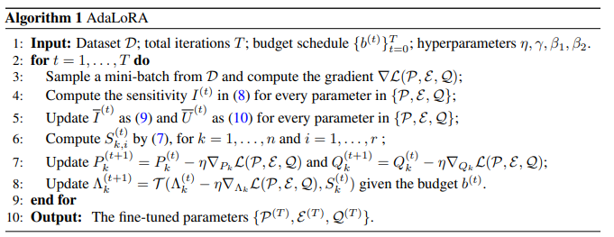
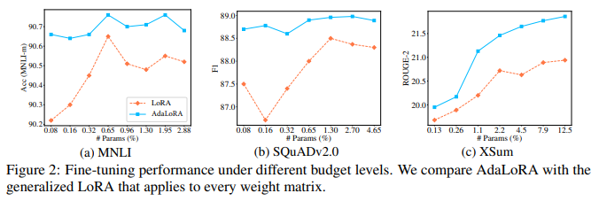
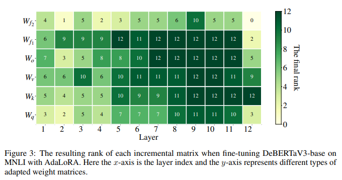

논문 및 이미지 출처 : <https://arxiv.org/pdf/2303.10512.pdf>

# Abstract

large pre-trained language models (PLMs) 을 downstream tasks 에 fine-tuning 하는 것은 NLP 의 주요 패러다임

- 보통 pre-trained model 의 all parameter 를 fine-tuning 하는데, 이는 downstream tasks 이 많으면 비효율적이다.
- 많은 fine-tuning 방법이 제안되었으며, all pre-trained weights 의 incremental update 로 학습하는 효율적인 방법을 찾는데 사용
  - 이 방법들은 종종 all pre-trained weight matrices 에 대한 incremental updates budget 을 균등하게 분배하며, 다른 weight parameter 의 중요성을 간과함
  - 결과적으로 fine-tuning 성능은 sub-optimal

위 사항을 극복하기 위해 저자는 **_AdaLoRA_** 제안

- weight matrices 의 importance score 에 따라 parameter budget 을 adaptively allocate
- AdaLoRA 는 singular value decomposition (SVD) 형식으로 incremental updates 를 parameterize
- 위 nodel approach 는 unimportant update 의 singular value 를 효과적으로 제거
- 근본적으로 parameter budget 을 줄이는 것이지만 고사양의 SVD computations 를 피하는 것이다.

저자는 natural language processing, question answering 및 natural language generation 에 여러 pre-trained model 을 광범위하게 실험하여 AdaLoRA 의 효과를 검증

결과 AdaLoRA 는 baseline 대비 획기적으로 개선하며, 특히 low budget setting 에서 높은 효과를 나타냈다.

# 1. Introduction

fine-tuned PLMs 는 다양한 NLP 에 우수한 성능을 보여주지만 큰 메모리 공간을 필요로 한다.

BERT 는 300M, T5 는 11B, GPT-3 175B 등 매우 큰 parameter 로 이루어져 있다.

이러한 PLMs 로 NLP 시스템을 구축할 때, 일반적으로 multiple tasks 를 동시에 다루어야 하는데, 다수의 downstream tasks 가 있을 경우, full fine-tuning 은 각 task 에 별도의 LM copy 를 유지해야하므로 메모리 소비가 과도하게 비싸진다.

---

이를 해결하기 위해 PLM 의 fine-tuning parameter 수를 줄이며 성능을 유지/향상 시키기 위한 두 가지 주요 연구 방향이 제시됐다.

1. PLM 에 small neural modules 를 추가하고 각 task 에 대한 이 modules 만 fine-tuning
   - base model 은 freezing 하고 tasks 간에 공유
   - 적은 수의 task-specifc parameter 만 도압되고 업데이트되므로 large model 의 실용성 향상
     - 예로, adapter tuning 은 base model 사이에 adapters 라는 small neural modules 삽입
     - prefix-tuning 및 prompt tuning 은 base model 의 input 또는 hidden layer 에 additional trainable prefix tokens 부착
     - 위 방법들은 full fine-tuning 과 comparable 한 성능 달성하며 parameter 의 1% 미만을 업데이트하기 때문에 메모리 소비도 줄인다.
2. model architecture 수정 없이, pre-trained weight 의 incremental update 를 parameter-efficient 방법으로 모델링
   - 예로, Given pre-trained weight matrix $W^{(0)}$
     - diff pruning 은 incremental update $\triangle$ 를 sparse matrix 로 모델링
     - Diff pruning 은 $\triangle$ 를 $W^{(0)}$ 와 same dimension 으로 초기화하고 entry 규모에 기반하여 $\triangle$ 를 element-wise 제거
     - diff pruning 은 important updates 를 adaptively retaining 및 unimportant 것은 제거하여 parameter-efficient 효율성 크게 높임
   - 하지만 diff pruning 에는 여러 제한 사항 존재
     - unstructured sparse matrices 의 computation 을 가속화하기 위해 low-level implementation 에 의존하며, 이는 deep learning 에서 제대로 지원하지 않음
     - 따라서 training 중 $\triangle$ 를 dense matrix 에 저장해야 함
     - $\triangle$ 의 각 entry 를 해당 gradient 로 업데이트하고 제거해야함
     - 이로 인해 full fine-tuning 과 유사한 계산 비용 발생

위 단점을 극복하기 위해, LoRA 라는 메소드도 제안되었으며, 이는 $\triangle$ 를 두 개의 smaller matrices 의 곱으로 low-rank matrix 로 parameterize

$$
\begin{equation}
    W = W^{(0)} + \triangle = W^{(0)} + BA,
\end{equation}
$$

- $W^{(0)}$, $\triangle \in \mathbb{R}^{d_1 \times d_2}$, $A \in \mathbb{R}^{r \times d_2}$, $B \in \mathbb{R}^{d_1 \times r}$, $r \ll \{ d_1, d_2 \}$
- fine-tuning 중, $A$, $B$ 만 업데이트
- rank $r$ 은 dimension $W$ 보다 작게 선택 (e.g. $d_1 = d_2 = 1024$ 일 때 $r = 8$)
- additional trainable parameter 가 0.5% 미만인 상황에서, training overhead 를 full fine-tuning 대비 최대 70% 까지 줄임
- LoRA 는 full fine-tuning 과 유사하거나 더 나은 성능 달성
- 한편, 두 small matrices 의 곱셈은 diff pruning 의 unstructured sparse matrices 보다 implement 및 deploy 가 더 쉬움

LoRA 는 여전히 제한 사항 존재

- 각 incremental matrix $\triangle$ 의 rank $r$ 을 동일하게 미리 지정
- pre-trained models 를 fine-tuning 할 때 weight matrices 의 중요성이 modules 및 layers 간에 크게 다르다는 사실을 무시
- 이를 설명하기 위해 Fig. 1 에 구체적으로 제시
  - 동일한 trainable parameter 수로 specific modules 또는 layers 를 fine-tuning 할 때 LoRA 의 성능 비교
  - Fig. 1a 에선 feed-forward networks (FFN) 를 fine-tuning 하면 self-attention modules 보다 더 나은 성능 달성
  - Fig. 1b 에선 top layers 의 weight matrices 가 bottom layers 보다 더 중요하단 것 보여줌
- 주요 weight matrices 에 더 맘ㄶ은 trainable parameter 를 추가하면 model performance 향상 가능. 반면, less important weight matrices 를 추가하면 향상되지 않거나 저해 가능
- parameter budget, i.e. total trainable parameters 가 주어진 경우, 항상 important modules 에 더 많은 parameter 를 할당하는 것이 좋다.
- budget 을 모든 weight matrices/layers 에 고르게 분배하는 LoRA 및 다른 방법(e.g. adapter/prefix tuning)은 부적절한 성능을 낼 수 있음

위 사항으로 다음 질문 제기

_importance modules 에 따라 parameter budget 을 adaptively 할당하여 PEFT 성능을 향상시키는 방법은 뭘까?_

---

위 질문을 위해 새로운 방법 **_AdaLoRA_** (Adaptive Low-Rank Adaptation) 제안

- LoRA-alike fine-tuning 동안 weight matrices 사이에서 parameter budget 을 동적으로 할당
  - 구체적으로, AdaLoRA 는 incremental matrices 의 rank 를 조절하여 budget 을 제어한다.
  - Critical incremental matrices 에는 high rank 가 할당되어 fine-grained 및 task-specific information 을 더 capture 가능
  - Less inportance ones 는 overfitting 을 방지하고 computational budget 절약을 위해 lower rank 로 제거
- matrices approximation 의 기존 연구에서 matrices rank 를 제어하는 여러 방법이 있다.
  - 대부분은 matrix 의 SVD 를 직접 계산한 다음 smallest singular value 를 truncate
  - 이런 작업은 rank 를 명시적으로 조작할 수 있으며, resulting matrix 와 original matrix 간의 차이를 최소화한다.
  - 하지만 fine-tuning large models 에서는 high-dimensional weight matrices 에 대한 SVD 를 반복적으로 적용하기엔 비용이 크므로 SVD 를 정확하게 계산하는 대신 $\triangle$ 를 $\triangle = P \Lambda Q$ 로 모델링하여 SVD 를 모방한다.
    - diagonal matrix $\Lambda$ 에는 singular values 가 포함되어 있으며 orthogonal matrices $P$ 및 $Q$ 는 $\triangle$ 의 left/right singular vectors 를 나타냄
    - $P$ 와 $Q$ 의 orthogonality 를 regularizing 하기 위해 training loss 에 additional penalty 를 추가
- 이러한 parameterization 은 SVD 의 intensive computations 을 피한다.
- unimportant singluar values 만 drop 하면서 singular vectors 는 유지

---

저자는 AdaLoRA 효과 입증을 위해 다양한 task 및 models 에 포괄적 실험

- NLU (GLUE) 및 QA (SQuADv1, SQuADv2) dataset 에서 DeBERTaV3-base 성능 평가
- BART-large 에 저자의 approach 를 적용하고 NLG (XSum 및 CNN/DailyMail) task 에서의 성능 평가
- AdaLoRA 가 low budget setting 에서 우수한 성과
- full fine-tuning 의 0.1% 미만의 trainable parameter 로 SQuAD2.0 dataset 에서 SOTA approach 와 비교하여 1.2% F1 개선

# 2. Background

### Transformer-based Models

전형적인 Transformer model 은 $L$ stacked blocks 로 이루어져 있다.

각 블록은 two submodules 를 포함한다

- multi-head attention (MHA) 및 full connected FFN
- Given input sequence $X \in \mathbb{R}^{n \times d}$, MHA 는 병렬로 $h$ head 에서 attention function 을 수행

$$
\text{MHA} (X) = \text{Concat}(\text{head}_1, \dots, \text{head}_h)W_o, \quad \text{head})i = \text{Softmax}(XW_{qi}(XW_{ki})^\top / \sqrt{d_n})XW_{vi,}
$$

- $W_o \in \mathbb{R}^{d \times d}$ : output projection
- $W_{qi}, W_{ki}, W_{vi} \in \mathbb{R}^{d \times d_h}$ : query, key 및 value projection of head $i$
- $d_h$ : 일반적으로 $d/h$ set

다른 important module 인 FFN 은 two linear transformations 와 그 사이에 ReLU activation 을 포함

$$
\text{FFN}(X) = \text{ReLU}(XW_{fi} + b_1)W_{f2} + b_2
$$

- $W_{f1} \in \mathbb{R}^{d \times d_m}$
- $W_{f2} \in \mathbb{R}^{d_m \times d}$

마지막으로 residual connection 이 사용되며 layer normalization 수행

### Low Rank Adaptation

LoRA 는 two small matrices 의 곱으로 pre-trained weights 를 incremental update 모델링

$h = W^{(0)}$ 의 경우, 수정된 forward pass 는 다음과 같다.

$$
\begin{equation}
  h = W^{(0)}x + \triangle x = W^{(0)}x + BAx,
\end{equation}
$$

- $W^{(0)}$, $\triangle \in \mathbb{R}^{d_1 \times d_2}$, $A \in \mathbb{R}^{r \times d_2}$, $B \in \mathbb{R}^{d_1 \times r}$, $r \ll \{ d_1, d_2 \}$
- 일반적으로 $A$ 는 random Gaussian initialization 을 채택하고, $B$ 는 training 초기에 $\triangle = 0$ 이 되도록 0 으로 초기화

$A_{i*}$ 는 $A$ 의 $i$-th row, $B_{*i}$ 는 $B$ 의 $i$-th column, $\mathcal{G}_i = \{ A_{i*}, B_{*i} \}$ 는 $i$-th doublet

-  LoRA 는 주로 MHA 의 query 및 value projections 만 적용
- [Towards a unified view of parameter-efficient transfer learning. He] 는 FFN 의 weight matrix (i.e. $W_{f1}$, $W_{f2}$) 에도 확장하여 성능 향상. 동시에 adapter tuning, prefix tuning 및 LoRA 를 포함한 다양한 efficient tuning 에 대한 통합된 관점 제안

# 3. AdaLoRA Method

저자는 두 가지 주요 구성 요소 포함

- SVD-based adaptation. incremental matrices 를 singluar value decomposition 형태로 고안
- Importance-aware rank allocation, 새로 디자인된 importance metric 을 기반으로 redundant singluar values 제거

## 3.1 SVD-Based Adaptation

pre-trained weight matrices 의 incremental update 를 singular value decomposition 형식으로 parameterize

$$
\begin{equation}
  W = W^{(0)} + \triangle = W^{(0)} + P \Lambda Q,
\end{equation}
$$

- $P \in \mathbb{R}^{d_1 \times r}$ 및 $Q \in \mathbb{R}^{r \times d_2}$ : $\triangle$ 의 left/right singular vectors
- diagonal matrix $\Lambda \in \mathbb{R}^{r \times r}$ : singular values $\{ \lambda _i \}_{1 \leq i \leq r}$ ( $r \ll \min (d_1, d_2)$ ) 를 포함
- 나아가, $i$-th singular value 및 vectors 를 포함하는 triplet 을 $\mathcal{G} = \{ P_{*i}, \lambda_{i}, Q_{i*} \}$ 로 표시
- 실제론, $\Lambda$ 는 diagonal 이므로 $\mathbb{R}^r$ 의 vector 로만 저장된다.
  - $\Lambda$ 는 0 으로 초기화되고 $P$ 및 $Q$ 는 $\triangle$ 가 training 초기에 0 이 되도록 하기 위해 random Gaussian 초기화를 채택
  - $P$ 및 $Q$ 의 orthogonality 강화를 위해 아래 regularizer 활용

$$
\begin{equation}
  R(P,Q) = \left \| P^\top P - I  \right \|^2_\text{F} = \left \| QQ^\top - I  \right \|^2_\text{F}.
\end{equation}
$$

저자의 방법에서, 각 gradient decent step 이후 rank 조절을 위해 $\Lambda$ 가 반복적으로 제거됨

모든 $\triangle$ 에 대해 직접 SVD 를 계산하여 singular values 를 조작할 수 있다. 하지만 계산 복잡성은 $O(\min (d_1, d_2)d_1d_2)$ 에 있다.

- 큰 수의 high-dimensional incremental matrices 에 대해 반복적으로 SVD 를 적용하는 것은 비용이 크다
- 반면, 저자의 parameterization 은 intensive SVD computation 을 피하므로 computational overhead 를 크게 줄인다.

--- 

LoRA 는 structured pruning 을 적용하여 rank  를 제어할 수 있지만 (i.e. prune $BA$ doublet-wise) 다음과 같은 단점이 있다.

- doublet 이 중요하지 않다 측정되면 해당 요소 모두 pruning 해야함
  - 이로 인해, pruned dublet 을 다시 활성화하기가 거의 불가능
  - doublet entries 는 모두 제거되고 훈련되지 않으므로 잘못 삭제된 doublet 을 재활성화하는 가능성을 보존하지 않음
  - 반면, adaLoRA 는 Eq. 3 에 기반하여 singular values 를 masking 하며 singular vectors 를 항상 유지
- LoRA 의 $A$ 와 $B$ 는 orthogonal 이 아니므로, doublets 간에 종속성이 있을 수 있음
  - doublets 를 버리면 smallest singular values 를 truncating 하는 것보다 original matrix 와의 larger variation 발생 가능
  - 따라서 rank allocation 의 각 step 에 incremental matrices 가 극도로 변경되어 훈련 불안정성을 유발하고 일반화에도 해를 입힐 수 있다.

## 3.2 Importance-Aware Rank Allocation

저자는 SVD-based adaptation 을 각 transformer layer 의 weight matrix $W_q, W_k, W_v, W_{f1}$ 및 $W_{f2}$ 에 적용

budget 제어를 위해, training 중 importance score 에 대응하여 singular values 를 반복적으로 제거한다.

- $k$ 로 incremental matrix 를 인덱싱. i.e. $\triangle_k = P_k \Lambda_k Q_k$ for $k = 1,\dots, n$
  - $n$ : adapted weight matrices 수
  - $\mathcal{G}_{k,i} = \{ P_{k,*i}, \lambda_{k,i}, Q_{k,i*} \}$ : $\triangle_k$ 의 $i$-th triplet
  - $S_{k,i*}$ : importance score
- parameter set $\mathcal{P} = \{ P_k \}^n_{k=1}$, $\mathcal{E} = \{ \Lambda_k \}^n_{k=1}$, $\mathcal{Q} = \{ Q_k \}^n_{k=1}$
- training cost $\mathcal{C} (\mathcal{P}, \mathcal{E}, \mathcal{Q})$
- With regularization Eq. 4, training objective $\mathcal{L}(\mathcal{P}, \mathcal{E}, \mathcal{Q}) = \mathcal{C}(\mathcal{P}, \mathcal{E}, \mathcal{Q}) + \gamma \sum^n_{k=1} R(P_k, Q_k)$
  - $\gamma > 0$ : regularization coefficient
- $t$-th step 에서, 저자는 $k = 1, \dots, n$ 에 대한 $P^{(t)}_k$, $\Lambda^{(t)}_k$ 및 $Q_k^{(t)}$ update 에 stochastic gradient step 사용
- 특히 $\Lambda_k^{(t)}$ 의 경우

$$
\begin{equation}
  \tilde{\Lambda}_k^{(t)} = \Lambda_k^{(t)} - \eta \triangledown_{\Lambda_k} \mathcal{L}(\mathcal{P}^{(t)}. \mathcal{E}^{(t)}, \mathcal{Q}^{(t)}),
\end{equation}
$$

- $\eta > 0$ : learning rate

Given importance score $S_k^{(t)}$, singular values 는 다음을 따라 pruning 됨

$$
\begin{equation}
  \Lambda_k^{(t+1)} = \mathcal{T} (\tilde{\Lambda}_k^{(t)}, S_k^{(t)}), \text{with} \mathcal{T}(\tilde{\Lambda}_k^{(t)}, S_k^{(t)})_{ii} = \left\{\begin{matrix}
  \tilde{\Lambda}^{t}_{k,ii} & S^{t}_{k,i}\  \text{is in the top-}b^{(t)}\  \text{of}\  S^{t}, \\ 
  0 & \text{otherwise,}
  \end{matrix}\right.
\end{equation}
$$

- $S^{t} = \{ S_{k,i}^{(t)} \}_{1 \leq k \leq n, 1 \leq i \leq r}$ : all triplets 의 importance score 포함
- $b^{(t)}$ : $t$-th step 에서의 나머지 singular values 의 budget
- less important singular values 를 제거함으로써 higher priority incremental matrices 에 더 많은 budget 을 부여

저자는 importance score 를 설계하기 위해 몇가지 옵션 도입

### Magnitude of singular values

모든 triplet 의 중요성을 quantify 하는 가장 직접적인 방법 중 하나. i.e. $S_{k,i} = \lambda_{k,i}$

- 이 방법으로 가장 중요하지 않은 singular values 만 제거된다.
  - 이는 original matrix 와의 차이를 최소화하고 training 을 더욱안정화 시킨다.
  - 기존의 많은 연구에서 이러한 criterion 을 사용하여 matrix rank 를 제어했다.
- 하지만, 이러한 simple metric 은 parameter 가 model performance 에 미치는 기여를 적절하게 quantify 할 수 없다는 점

### Sensitivity-based importance

importance scoring 의 다른 대안으로, training loss 에 대한 parameters sensitivity 를 quantify

하지만 이전 연구에선 sensitivity 를 사용하여 single entries 의 importance 를 quantify 하고 weights elemen-wise 제거하는 unstructured pruning 적용

저자의 경우는, triplets 가 group-wise 로 제거되기 때문에, new metric 을 디자인해야 한다.

각 entry 의 sensitivity 를 고려하고 triplets 의 모델 성능에 대한 기여를 quantify 하기 위해 결합

따라서 저자의 triplets $\mathcal{G}_{k,i}$ 내의 singular value 및 vectors 를 모두 고려한 새로운 importance metric 제안

$$
\begin{equation}
  S_{k,i} = s(\lambda _{k,i}) + \frac{1}{d_1} \sum^{d_1}_{j=1} s(P_{k,ji}) + \frac{1}{d_2} \sum^{d_2}_{j=1} s(Q_{k,ij}),
\end{equation}
$$

- 여기서 저자는 $P_{k, *i}$ 및 $Q_{k,i*}$ 의 mean importance 를 계산하여 $S_{k,i}$ 가 $\mathcal{G}_{k,i}$ 의 parameter 수와 상관없이 조절되도록 함
- $s(\cdot)$ : single entries 에 대한 specific importance function
  - $s(\cdot)$ 로 sensitivity 를 채택할 수 있으며, 이는 gradient-weight 곱의 크기로 정의

$$
\begin{equation}
  I(w_{ij}) = \left | w_{ij} \triangledown_{w_{ij}} \mathcal{L} \right |,
\end{equation}
$$

- $w_{ij}$ : any trainable parameter
- Eq. 8 은 parameter 가 제거했을 때, loss 의 변화를 근사화하는 것
- parameter 의 제거가 큰 영향을 미친다면, 모델은 이에 민감하며 유지해야 한다.
  - 하지만, [Platon] 은 Eq. 8 의 sensitivity 가 아직 신뢰할 수 있는 importance 지표가 아니라는 지적을 함. 이 score 는 sample mini batch 에서 sample 되어 그런 것으로 추정한다.
  - stochastic sampling 및 complicated training 은 Eq. 8 을 사용하여 sensitivity 를 추정할 때 높은 변동성과 큰 불확실성을 초래
  - 따라서 [Platon] 은 sensitivity smoothing 과 uncertainly quantification 제안

$$
\begin{align}
    \overline{I}^{(t)}(w_{ij}) &= \beta_1 \overline{I}^{(t-1)}(w_{ij}) + (1-\beta_1)I^{(t)}(w_{ij}) \\
    
    \overline{U}^{(t)}(w_{ij}) &= \beta_2 \overline{U}^{(t-1)}(w_{ij}) + (1-\beta_2) \left | I^{(t)}(w_{ij}) - \overline{I}^{(t)}(w_{ij}) \right |,
\end{align}
$$

- $0 < \beta_1, \beta_2 < 1.$
- $\overline{I}^{(t)}$ : exponential moving average 을 사용한 smoothed sensitivity
- $\overline{U}^{(t)}$ : $I^{(t)}$ 및 $\overline{I}^{(t)}$ 사이의 local variation 에 의해 quantify 된 uncertainly term 
- importance 를 $\overline{I}^{(t)}$ 및 $\overline{U}^{(t)}$ 간의 곱으로 정의
- 이는 $s(\cdot)$ 에 대한 다른 option 이 될 수 있다.

$$
\begin{equation}
  s^{(t)}(w_{ij}) = \overline{I}^{(t)}(w_{ij}) \cdot \overline{U}^{(t)}(w_{ij}).
\end{equation}
$$

다양한 importance metrics 비교를 위해 세부적인 ablation 은 [Section 4.4](#43-nautral-language-generation) 에서 제시

저자는 sensitivity variant (Eq. 11) 을 기반한 metric (Eq. 7)이 우수한 성능을 내는 것을 발견.

저자는 다음과 같은 알고리즘 요약

## 3.3 Global Budget Scheduler

rank 조절은 low-rank adaptation 의 맥락에서 parameter budget 을 제어하는 것이다. 

- 따라서 저자는 all incremental matrices 의 total rank (i.e. total singular values 수) 를 budget $b^{(t)}$ 로 정의한다.
- budget allocation 은 fine-tuning 중 반복적으로 수행된다.

training 을 용이하게 하기 위해, 저자는 global budget scheduler 를 제안한다.

- 구체적으로, initial budget $b^{(0)}$ 을 target budget $b^{(T)}$ 보다 약간 높게 설정 (e.g. $b^{(T)}$ 의 약 1.5배)
- 각 incremental matrix 의 intial rank 를 $r = b^{(0)} / n$ 으로 설정
- 저자는 $t_i$ steps 동아안 warm up training 그리고 budget $b^{(t)}$ 가 $b^{(T)}$ 에 도달할 때까지 $b^{(t)}$ 를 감소시키기 위해 cubic schedule 따름
- 마지막으로, resulting budget 을 고정하고 모델을 $t_f$ 단계 동안 fine-tuning

이는 AdaLoRA 가 먼저 parameter space 을 탐색한 다음 가장 중요한 weight 에 집중할 수 있도록 한다.

# 4. Experiments

AdaLoRa 를 구현하여 DeBERTaV3-base 와 BART-large 를 fine-tuning 하는데 사용

제안된 알고리즘의 효과를 NLU (GLUE), QA (SQuADv1 및 SQuADv2) 및 NLG (XSum 및 CNN/DailyMail) 에서 평가

all gain 이 $p < 0.05$ 로 유의한 결과 얻음

### Implementation Details

저자는 _PyTorch_ 로 모든 알고리즘 구현

구현은 publicly available _Huggigface Transformers_ 코드 기반

모든 실험은 NVIDIA V100 GPUs 에 수행

---

LoRA 는 $\triangle x$ 를 $\alpha / \gamma$ 로 scaling 했다.

- $\alpha$ : $\gamma$ 에 대한 상수
- output 의 크기는 서로 다른 $\gamma$ 에 대해 일관되게 유지될 수 있으므로 $\gamma$ 를 변경할 때 learning rate 에 드는 노력을 줄임
- $\alpha$ 는 16 또는 32 로 설정 되며 tuning 하지 않음
- LoRA 에 따르면, Eq. 3 에 동일한 scaling 을 추가하고 $\alpha$ 를 LoRA 에 고정
- 또한, Algorithm 1 에서 저자는 모든 $\triangle_T$ steps (e.g. $\triangle_T = 100$) 에서 singular values 를 제거하므로 pruned triplets 는 이러한 간격 내에서 업데이트될 수 있으며 future iterations 에서 다시 활성화될 수 있음

### Baselines

AdaLoRA 를 다음 방법들과 비교

- _full fine-tuning_ :  adaptation 을 위한 가장 일반적인 approach
  - fine-tuning 중, 모델은 pre-trained weights 및 biases 로 초기화되고 모든 model parameter 가 gradient updates
- _Bitfit_ : 효과적인 parameter-efficient fine-tuning
  - pre-trained model 에서 bias vectors 만 fine-tuning
- _Adapter tuning_ : transformer blocks 사이에 two-layer adapters 삽입
  - 저자는 두 가지 유형의 adapter 와 비교
  - _Houlsby adapter_ 는 self-attention module 및 FFN module 사이에 삽입하며 그 뒤 residual connection
  - Adapter-fusion (_Pfeiffer_) 은 adapter 를 FFN module 과 LayerNorm module 이후에만 적용하는 효율적인 디자인 제안
  - trainable parameter 수는 layer 수, adapter 의 hidden dimension 및 inputs dimension 에 의해 결정
- _LoRA_ : parameter-efficient fine-tuning 의 SOTA method
  - two small matrices 로 incremental updates 를 parameterize 하고 이 두 행렬만 fine-tuning
  - trainable parameter 의 수는 rank $r$ 및 adapted weight matrices 의 수 $n$ 으로 제어
  - [Hu] 는 LoRA 에 query 및 value projection 에만 적용
  - 저자는 LoRA 를 all weight matrices (i.e. $W_q, W_k, W_v, W_{f_1}, W_{f_2}$) 에 적용하여 성능 향상을 발견
  - 따라서 저자는 이 일반화된 LoRA 와 비교하여 성능 극대화

## 4.1 Natural Language Understanding

### Models and Datasets

저자가 제안된 알고리즘으로 DeBERTaV3-base 의 fine-tuning 성능 평가

NLU (GLUE) 에서 실험 진행하며, 이 벤치마크에는 2 single-sentence classification tasks, 3 similarity 및 paraphrase tasks 및 4 natural language inference tasks 포함

### Implementation Details

DeBERTaV3-base 는 183M parameter 포함

저자는 여러 budget levels 에서 AdaLoRA 를 baseline 과 비교

- trainable parameters 0.3/0.6/1.2M 고려
- parameter budget 을 맞추기 위해, 저자는 adapter 의 hidden budget $\{8, 16, 32, 64\}$ 에서 선택하며, LoRA 의 rank $r$ 을 $\{2, 4, 8\}$ 로 설정하며, AdaLoRA 의 final budget $b^{(T)}$ 를 $\{144, 288, 576\}$ 에서 선택
- 이후 AdaLoRA 에 대해 $b^{(0)}$ 를 $b^{(T)}$ 의 1.5배로 설정, regularization coefficient $\gamma$ 를 $\{0.1, 0.3, 0.5\}$ 에서 선택
- exponential moving parameters $\beta_1$ 및 $\beta_2$ 를 default value 0.85 로 설정
- learning rate 는 $\{5 × 10^{-5}, 8 × 10^{-5}, 1 × 10{^-4}, 2 × 10{^-4} \}$ 중에서 선택

### Main results

다양한 budget setting 에서 AdaLoRA 를 baseline 과 비교

- GLUE dev set 에서 all dataset 및 all parameter level 에서 AdaLoRA 를 기존 방법과 비교하여 더 나은 또는 동등한 성능 달성
- parameter budget 이 0.3M 인 경우 AdaLoRA 는 RTE 에서 87.36% 달성하여 SOTA baseline 보다 1.8% 높음
- AdaLoRA 는 매우 낮은 budget 에서도 종종 더 나은 성능

## 4.2 Question Answering

### Models and Datasets

제안된 알고리즘을 two QA (SQuADv1 및 SQuADv2) 에서 성능 평가

- AdaLoRA 를 DeBERTaV3-base fine-tuning 에 사용
- 이 task 들은 sequence labeling problem 을 다룸
- 각 token 이 answer span 의 시작과 끝이 될 probability 예측

### Implementation Details

다양한 parameter budget 에서 baseline 과 AdaLoRA 비교

- trainable parameter 수를 total pre-trained parameter 0.08%/0.16%/0.32%/0.65% 에서 선택
- budget 요구사항을 맞추기 위해, adapter hidden dimension 을 $\{ 4, 8, 16, 32, 64 \}$ 에서 선택
- LoRA 의 rank $r$ 은 $\{ 1, 2, 4, 8\}$ 에서 선택
- AdaLoRA 의 final total rank $b^{(T)}$ 는 $\{ 72, 144, 288, 576 \}$ 에서 선택
- batch size 16
- AdamW optimizer
- learning rate $1 \times 10^{-3}$

### Main Results

4 가지 budget setting: total pre-trained parameters 0.08%, 0.16%, 0.32%, 0.65% 에서 DeBERTaV3-base fine-tuning 에서 실험

- AdaLoRA 는 all budget level 에서 기존 방법를 능가
- two metrics: EM 및 F1 에서 더 우수한 성능 발휘
- Houlsby adapter 및 Pfeiffer adapter 의 성능은 parameter budget 을 줄이면 감소하는 반면, 저자의 방법은 일관된 성능

## 4.3 Nautral Language Generation

### Models and Datasets

NLG tasks 의 SOTA 와 비교를 위해, 저자는 AdaLoRA 를 BART-large 모델을 fine-tuning 하는데 적용.

그리고 두 가지 데이터셋에서 모델 성능 평가 (XSum, CNN/DailyMail)

### Implementation Details

DeBERTaV3-base 와 유사하게, 저자는 low-rank/SVD-based adaptation 을 encoder 및 decoder layer 의 모든 weight matrix 에 적용

- ROUGE 1/2/L scores report
- 15 epochs
- 8 beam length
- 64 batch size

CNN/DailyMail 의 경우

- 4 beam search
- 32 batch size

### Main Results

- 4 가지 budget 에서 fine-tuning 성능 비교
- trainable parameter 수는 total pre-trained parameter 의 0.13%, 0.26%, 1.10% 및 2.20%
- all budget levels 에서 두 데이터셋에 baseline 과 비교하여 AdaLoRA 는 더 나은 성능 달성

## 4.4 Analysis

### Different budget levels

Fig. 2 에서 여러 budget levels 에서 DeBERTaV3-base 를 fine-tuning 한 실험 결과

- 세 데이터셋 (MNLI-m, SQuADv2, XSum) 에서 baseline 과 비교하여 AdaLoRa 는 모든 budget level 에서 일관된 성능 향상
- XSum task 의 경우 budget 을 늘릴수록 성능 향상이 두드러지며, 이는 high budget 이 NLG task 에 도움이 되는 것을 시사
- MNLI 및 SQuADv2 dataset 에선 low budget levels ($\leq 1$%) 에서 AdaLoRA 는 SQuADv2 에서 88.87% F1 달성. 이는 high budget (4.65) 의 성능 (88.89% F1) 과 유사

### Comparison to low-rank parameterization

[Section 3.1](#31-svd-based-adaptation) 에서 언급했듯, LoRA 를 doublet-wise pruning 하여 rank allication

- 이 경우 doublets 가 완전히 제거되므로, 다시 활성화하는 장벽이 높아진다
- crucial doublets 가 실수로 제거될 때 학습 불안정성을 초래하고 일반화에 해를 끼칠 수 있다.

이를 설명하기 위해 Table 4 에서 세 개의 데이터셋 (SST-2, RTE 및 CoLA) 에서 AdaLoRA 와 LoRA 의 pruning 을 비교

all budget levels 에서 AdaLoRA 가 모든 데이터셋에서 LoRA pruning 을 능가

### Variants of the importance score

AdaLoRA 에서 importance score 는 Eq. 7 의 triplet 내의 every entry 의 sensitivity 및 uncertainly 로 정의

Table 4 에서 importance score 의 두 variants 조사

- Eq. 7 의 $s(\cdot)$ 를 sensitivity 만으로 변경하는 경우
- $S_i$ 를 직접 $|\lambda_i|$ 로 정의하는 경우

결과에서, 제안된 importance score 가 일반적으로 잘 수행

two variants 는 성능을 최대 0.9% 까지 저하

### The role of two components

저자의 방법의 two components 인 SVD adaptation 및 adaptive budget allocation 이 성능 향상에 중요한 역할 하는 것을 언급

이를 증명하기 위해 다음과 같은 변형과 비교

- SVD-LoRA : Eq. 3, 4 의 SVD-based adaptation 만으로 fine-tuning
- LoRA$_{\text{regu}}$ : LoRA 에 $A$ 와 $B$ 에 orthogonal regularization (Eq. 4) 적용
- AdaLoRA$_{\gamma = 0}$ : AdaLoRA 에 orthogonal regularization (Eq. 4) 없이

Table 5 에서, SST-2 및 MNLI 에 DeBERTaVe-base 를 fine-tuning 한 결과

- SVD adaptation 만 사용한 fine-tuning 이 LoRA 보다 향상을 보이지만 AdaLoRA 의 성능에 미치지 못함
- SVD orthogonal regularization 없는 AdaLoRA 의 성능은 저하됨

이 결과로 두 component 가 모델 성능에 기여하는 것 확인

### The resulting budget distribution

Fig. 3 은 AdaLoRA 로 fine-tuning 된 DeBERTaV3-base 의 각 incremental matrix 의 resulting rank 

AdaLoRA 가 항상 FFN 및 top layers 에 더 많은 budget 을 할당하는 경향이 있다는 것을 발견

- 이러한 행동은 FFN module 의 weight matrices 와 top layers 의 weight matrices 가 모델 성능에 더 중요하다는 저자의 경험적 결론과 일치
- 따라서 이는 저자가 제안한 importance metric 기준이 AdaLoRA 를 crucial module 에 집중하도록 guide 한다는 것 확인
- 한편, AdaLoRA 에 의해 생성된 rank distribution 은 budget levels, task 및 modle 간에 일관
- 이는 remaining parameter 수가 $b^{(T)}$ 와 linearly scaling 되므로 remaining parameter 를 제어하기 위해 $b^{(T)}$ 를 조절할 수 있다는 것을 의미

# 5. Conclusion

저자는 parameter-efficient fine-tuning method AdaLoRA 제안

- importance scoring 에 따라 parameter budget 을 adaptively allocate
- weight matrices 의 incremental update 를 singular value decomposition (SVD) 형식으로 parameterize
- 이후 new importance metric 을 기반으로 singular values 를 조작하여 parameter budget 을 incremental matrices 간에 dynamically allocate
- 이 방식은 효과적으로 모델 성능 및 파라미터 효율성 향상
- NLU, QA 및 NLG task 에 광범위하게 실험하여 기존 방법보다 우수한 성능 달성