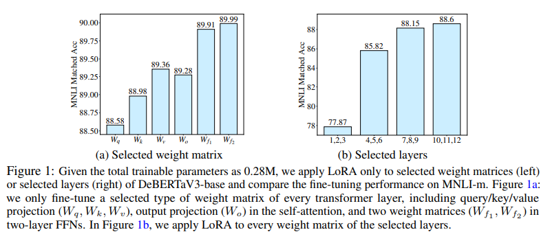

논문 및 이미지 출처 : <https://arxiv.org/pdf/2303.10512.pdf>

# Abstract

large pre-trained language models (PLMs) 을 downstream tasks 에 fine-tuning 하는 것은 NLP 의 주요 패러다임

- 보통 pre-trained model 의 all parameter 를 fine-tuning 하는데, 이는 downstream tasks 이 많으면 비효율적이다.
- 많은 fine-tuning 방법이 제안되었으며, all pre-trained weights 의 incremental update 로 학습하는 효율적인 방법을 찾는데 사용
  - 이 방법들은 종종 all pre-trained weight matrices 에 대한 incremental updates budget 을 균등하게 분배하며, 다른 weight parameter 의 중요성을 간과함
  - 결과적으로 fine-tuning 성능은 sub-optimal

위 사항을 극복하기 위해 저자는 **_AdaLoRA_** 제안

- weight matrices 의 importance score 에 따라 parameter budget 을 adaptively allocate
- AdaLoRA 는 singular value decomposition (SVD) 형식으로 incremental updates 를 parameterize
- 위 nodel approach 는 unimportant update 의 singular value 를 효과적으로 제거
- 근본적으로 parameter budget 을 줄이는 것이지만 고사양의 SVD computations 를 피하는 것이다.

저자는 natural language processing, question answering 및 natural language generation 에 여러 pre-trained model 을 광범위하게 실험하여 AdaLoRA 의 효과를 검증

결과 AdaLoRA 는 baseline 대비 획기적으로 개선하며, 특히 low budget setting 에서 높은 효과를 나타냈다.

# 1. Introduction

fine-tuned PLMs 는 다양한 NLP 에 우수한 성능을 보여주지만 큰 메모리 공간을 필요로 한다.

BERT 는 300M, T5 는 11B, GPT-3 175B 등 매우 큰 parameter 로 이루어져 있다.

이러한 PLMs 로 NLP 시스템을 구축할 때, 일반적으로 multiple tasks 를 동시에 다루어야 하는데, 다수의 downstream tasks 가 있을 경우, full fine-tuning 은 각 task 에 별도의 LM copy 를 유지해야하므로 메모리 소비가 과도하게 비싸진다.

---

이를 해결하기 위해 PLM 의 fine-tuning parameter 수를 줄이며 성능을 유지/향상 시키기 위한 두 가지 주요 연구 방향이 제시됐다.

1. PLM 에 small neural modules 를 추가하고 각 task 에 대한 이 modules 만 fine-tuning
   - base model 은 freezing 하고 tasks 간에 공유
   - 적은 수의 task-specifc parameter 만 도압되고 업데이트되므로 large model 의 실용성 향상
     - 예로, adapter tuning 은 base model 사이에 adapters 라는 small neural modules 삽입
     - prefix-tuning 및 prompt tuning 은 base model 의 input 또는 hidden layer 에 additional trainable prefix tokens 부착
     - 위 방법들은 full fine-tuning 과 comparable 한 성능 달성하며 parameter 의 1% 미만을 업데이트하기 때문에 메모리 소비도 줄인다.
2. model architecture 수정 없이, pre-trained weight 의 incremental update 를 parameter-efficient 방법으로 모델링
   - 예로, Given pre-trained weight matrix $W^{(0)}$
     - diff pruning 은 incremental update $\triangle$ 를 sparse matrix 로 모델링
     - Diff pruning 은 $\triangle$ 를 $W^{(0)}$ 와 same dimension 으로 초기화하고 entry 규모에 기반하여 $\triangle$ 를 element-wise 제거
     - diff pruning 은 important updates 를 adaptively retaining 및 unimportant 것은 제거하여 parameter-efficient 효율성 크게 높임
   - 하지만 diff pruning 에는 여러 제한 사항 존재
     - unstructured sparse matrices 의 computation 을 가속화하기 위해 low-level implementation 에 의존하며, 이는 deep learning 에서 제대로 지원하지 않음
     - 따라서 training 중 $\triangle$ 를 dense matrix 에 저장해야 함
     - $\triangle$ 의 각 entry 를 해당 gradient 로 업데이트하고 제거해야함
     - 이로 인해 full fine-tuning 과 유사한 계산 비용 발생

위 단점을 극복하기 위해, LoRA 라는 메소드도 제안되었으며, 이는 $\triangle$ 를 두 개의 smaller matrices 의 곱으로 low-rank matrix 로 parameterize

$$
\begin{equation}
    W = W^{(0)} + \triangle = W^{(0)} + BA,
\end{equation}
$$

- $W^{(0)}$, $\triangle \in \mathbb{R}^{d_1 \times d_2}$, $A \in \mathbb{R}^{r \times d_2}$, $B \in \mathbb{R}^{d_1 \times r}$, $r \ll \{ d_1, d_2 \}$
- fine-tuning 중, $A$, $B$ 만 업데이트
- rank $r$ 은 dimension $W$ 보다 작게 선택 (e.g. $d_1 = d_2 = 1024$ 일 때 $r = 8$)
- additional trainable parameter 가 0.5% 미만인 상황에서, training overhead 를 full fine-tuning 대비 최대 70% 까지 줄임
- LoRA 는 full fine-tuning 과 유사하거나 더 나은 성능 달성
- 한편, 두 small matrices 의 곱셈은 diff pruning 의 unstructured sparse matrices 보다 implement 및 deploy 가 더 쉬움

LoRA 는 여전히 제한 사항 존재

- 각 incremental matrix $\triangle$ 의 rank $r$ 을 동일하게 미리 지정
- pre-trained models 를 fine-tuning 할 때 weight matrices 의 중요성이 modules 및 layers 간에 크게 다르다는 사실을 무시
- 이를 설명하기 위해 Fig. 1 에 구체적으로 제시
  - 동일한 trainable parameter 수로 specific modules 또는 layers 를 fine-tuning 할 때 LoRA 의 성능 비교
  - Fig. 1a 에선 feed-forward networks (FFN) 를 fine-tuning 하면 self-attention modules 보다 더 나은 성능 달성
  - Fig. 1b 에선 top layers 의 weight matrices 가 bottom layers 보다 더 중요하단 것 보여줌
- 주요 weight matrices 에 더 맘ㄶ은 trainable parameter 를 추가하면 model performance 향상 가능. 반면, less important weight matrices 를 추가하면 향상되지 않거나 저해 가능
- parameter budget, i.e. total trainable parameters 가 주어진 경우, 항상 important modules 에 더 많은 parameter 를 할당하는 것이 좋다.
- budget 을 모든 weight matrices/layers 에 고르게 분배하는 LoRA 및 다른 방법(e.g. adapter/prefix tuning)은 부적절한 성능을 낼 수 있음

위 사항으로 다음 질문 제기

_importance modules 에 따라 parameter budget 을 adaptively 할당하여 PEFT 성능을 향상시키는 방법은 뭘까?_

---

위 질문을 위해 새로운 방법 **_AdaLoRA_** (Adaptive Low-Rank Adaptation) 제안

이 메소드는 LoRA와 유사한 파인튜닝 동안 가중치 행렬 사이에서 매개변수 예산을 동적으로 할당합니다. 구체적으로, AdaLoRA는 점진적 행렬의 랭크를 조절하여 그 예산을 제어합니다. 중요한 점진적 행렬에는 높은 랭크가 할당되어 미세한 세부 정보와 과제 특정 정보를 더 캡처할 수 있습니다. 중요하지 않은 행렬은 과적합을 방지하고 계산 예산을 절약하기 위해 더 낮은 랭크로 가지런히 삭감됩니다. 행렬 근사의 기존 문헌에서 행렬의 랭크를 제어하는 방법은 여러 가지가 있습니다. 대부분은 행렬의 특이값 분해 (SVD)를 직접 계산한 다음 가장 작은 특이값을 절단합니다. 이러한 작업은 랭크를 명시적으로 조작할 수 있으며 더 중요한 것은 결과 행렬과 원래 행렬 간의 차이를 최소화합니다. 그러나 대형 모델의 파인튜닝에서는 높은 차원의 가중치 행렬에 대한 SVD를 반복적으로 적용하는 것이 금액적으로 비싸기 때문에 SVD를 정확하게 계산하는 대신에 Δ를 Δ = PΛQ로 모델링하여 SVD를 모방합니다. 대각 행렬 Λ에는 특이값이 포함되어 있으며 직교 행렬 P와 Q는 Δ의 좌/우 특이 벡터를 나타냅니다. P와 Q의 직교성을 규제하기 위해 훈련 손실에 추가적인 패널티가 도입됩니다. 이러한 매개변수화는 SVD의 고비용 계산을 피합니다. 또 다른 장점은 중요하지 않은 특이값만 삭제하면서 특이 벡터를 유지한다는 것입니다. 이것은 미래 복원의 가능성을 보존하고 훈련을 안정화시킵니다. 저희의 중요도 점수 및 예산 스케줄러에 대한 자세한 내용은 3장에서 확인할 수 있습니다.

우리는 AdaLoRA의 효과를 입증하기 위해 다양한 작업과 모델에 대한 포괄적인 실험을 수행합니다. 구체적으로, 우리는 자연어 이해 (GLUE, Wang et al. (2019)) 및 질문 응답 (SQuADv1, Rajpurkar et al. (2016) 및 SQuADv2, Rajpurkar et al. (2018)) 데이터셋에서 DeBERTaV3-base (He et al., 2021a)의 성능을 평가합니다. 또한 BART-large (Lewis et al., 2019)에 우리의 방법을 적용하고 자연어 생성 (XSum, Narayan et al. (2018) 및 CNN/DailyMail, Hermann et al. (2015)) 작업에서의 성능을 평가합니다. 우리는 AdaLoRA가 저예산 설정에서 특히 우수한 성과를 거두며, 예를 들어 전체 파인튜닝의 0.1% 미만 학습 가능한 매개변수로 SQuAD2.0 데이터셋에서 최첨단 접근 방식과 비교하여 1.2% F1 개선을 달성함을 보여줍니다.