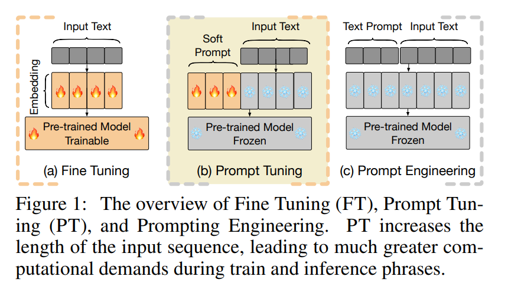
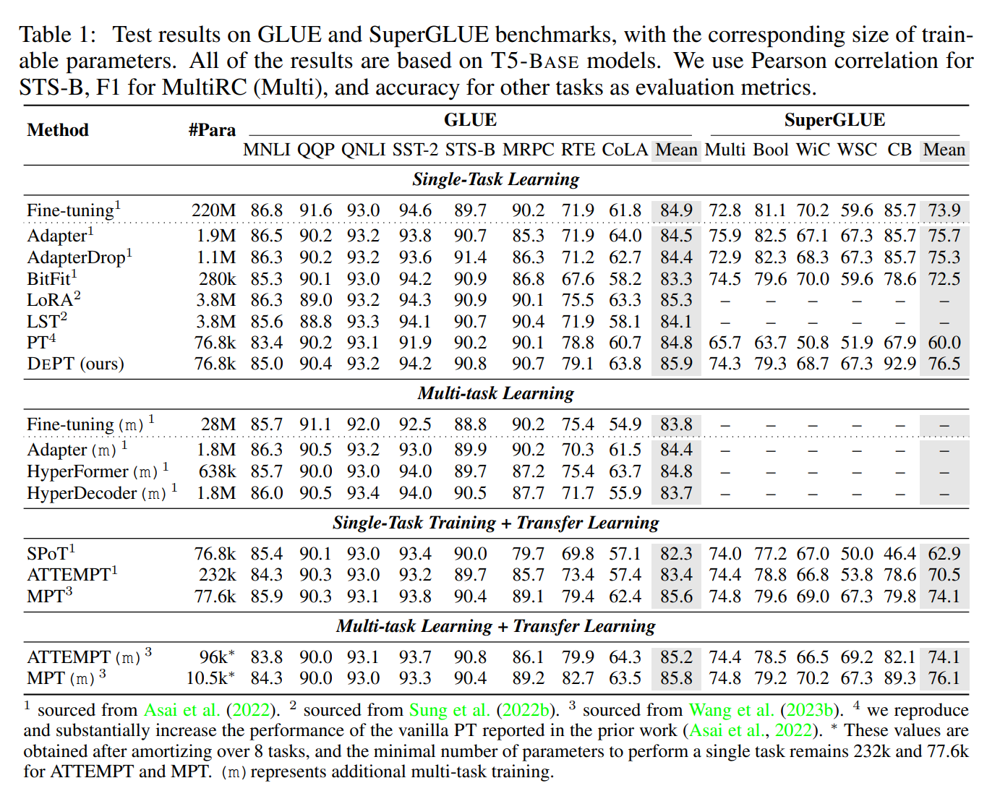
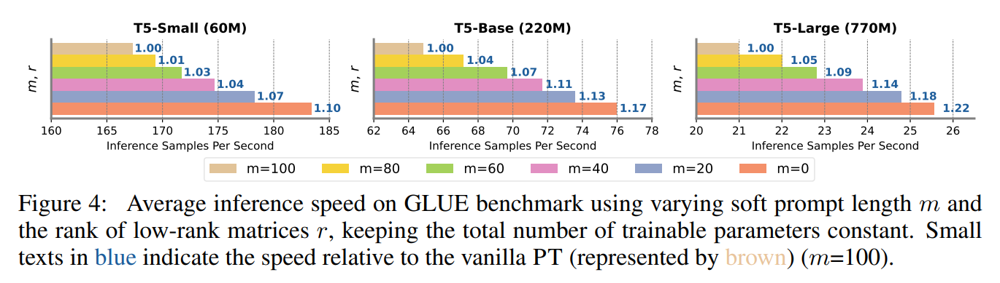
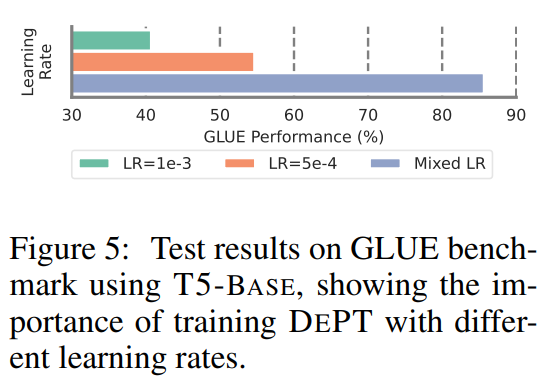

논문 및 이미지 출처 : <https://arxiv.org/pdf/2309.05173v1.pdf>

# Abstract

작은 **trainable soft (continuous) prompt vectors** 를 language models (LM) 의 input 에 붙이는 **Prompt Tuning (PT)** 는 **parameter-efficient fine-tuning (PEFT)** 에서 다양한 tasks 및 model 에서 유망한 결과를 보여줌.

- PT 가 다른 PEFT 보다 뛰어난데, fewer trainable parameter 로 competitive 하며, 모델 사이즈 확장에 따라 parameter 가 극적으로 커지지 않음.
- 하지만 추가적인 soft prompt tokens 을 도입하면, longer input sequences 가 초래하여 **Transformer 의 quadratic complexity** 로 인해 training/inference time 및 memory usage 에 상당한 영향이 감
- 이는 매일 많은 쿼리를 처리하는 Large Language Models (LLMs) 에게 특히 중요한 문제

  
<b><u>
    Transformer's quadratic complexity
  </u></b>

    input sequence length 에 비례하여 계산 비용이 제곱으로 증가하는 것.

    Transformer 의 self-attention 매커니즘에서, input sequence 의 length 가 N 이라 한다면 모든 단어 쌍에 대한 similarity 를 계산하므로, N x N 크기의 행렬이 생성된다. 이는 이후 연산에도 활용된다.

    따라서 input sequence length 가 (N 이) 증가할수록 제곱 비례하여 증가하게 된다.

위 해결하기 위해 저자는 **De**composed **P**rompt **T**uning (DEPT) 를 제안

- soft prompt 를 shorter soft prompt 및 pair of low-rank matrices 로 분해
- 이후 두 가지 다른 learning rate 로 최적화

---

- 이를 통해 memory 및 time cost 를 vanilla PT 와 비교하여 20% 이상 절약하면서도 성능이 좋음
- 23 natural language processing (NLP) 및 vision-language (VL) tasks 에서 SOTA PEFT 및 full fine-tuning (FFT) 를 능가하기도 함
- 모델 사이즈 증가에 따라 효율성이 더 증가
- few-shot learning 에서 parameter-efficient transfer learning (PEFL) 을 유연하게 통합하고 다양한 모델 아키텍처 및 사이즈에 대한 적응성이 좋다.

# 1. Introduction

- FT : NLP tasks 에서 downstream task 의 성능 향상을 제공. 하지만 LMs 의 full parameter 업데이트 및 저장이 필요 (Fig. 1a)
- Prompt engineering : parameter 를 업데이트하진 않지만 설계가 어렵고 성능의 분산이 높다 (Fig. 1c).
- PEFT : 적은 수의 parameter 만 학습하면서 FFT 와 맞먹는 성능을 유지하는 것이 목표로, 최근 부상
- PT : PEFT 에서 생겨나, trainable continuous prompt vector 를 input 앞에 붙인다 (Fig. 1b).
  - PT 는 fewer trainable parameter 로 경쟁력있는 성능을 유지하고 모델 사이즈 확장에 따라 trainable parameter 가 극단적으로 커지지 않아 다른 PEFT 보다 좋다.

PT 가 다양한 task 및 model 에서 좋은 결과를 내지만, 2 가지 한계점이 존재

1. 느린 수렴 및 초기화에 민감
   - 이 이슈를 해결하기 위해 PETL 등장 (Fig. 2a). 다양한 source tasks 에서 soft prompts 를 pre-training 하고 이 prompts 로 초기화
   - 일부 연구에선 source tasks 에서 학습된 prompts 를 multiple target tasks 와 jointly training 으로 성능을 향상 (Multi-task Learning). 하지만 sequence length 증가로 인한 load 계산량 증가는 여전히 문제로 남음 
2. input sequence 의 길이가 증가하여, Transformer 의 quadratic complexity 로 인해 계산량 증가 (i.e. train/inference time 및 memory cost)

PETL 은 모델 수렴에 대한 training steps 은 줄일 수 있지만, optimization step 에서는 계산적으로 비용이 많이 든다.

중요한 것은 inference 단계 중, 효율성이 향상되지 않는 다는 것이며, 이는 LLMs 중요하다.

본 논문에서는 **De**composed **P**rompt **T**uning (DEPT) 을 제안한다.

- trainable soft prompt 를 shorter soft prompt 및 couple of low-rank matrices 로 분해
  - low-rank matrices 의 곱을 frozen word embeddings 에 element-wise 로 더함 (Fig. 2b)
  - shorter soft prompt 및 updated word embedding matrix 는 두 가지 다른 learning rate 를 사용하여 optimizing - 모델 수렴을 위해 중요한 단계
- 23 NLP 및 VL tasks 에서 SOTA PEFT 를 능가 (FFT 포함)
  - 경험적으로 다양한 모델 아키텍처 및 사이즈에 훈련 효율성을 크게 향상시키고, vanilla PT 와 비교하여 training time 및 memory costs 를 20% 절약
  - 중요한 점은 모델 사이즈가 증가하면 효율성도 증가. 이는 LLMs 에 이점이고 적합한 점이다.

contribution 요약

- DePT 는 input sequence length 를 줄이기 위해 soft prompt 를 분해함으로써 PT 의 효율적 한계점 해결. training 및 inference 효율성이 향상하고, time 및 memory costs 20% 이상 절약
- 23 NLP 및 VL 에서 FFT 를 포함하여 SOTA PEFT 능가. PETL 를 매끄럽게 통합하며 few-shot learning 에서 이점이 됨
- 모델 사이즈 증가에 따라 효율성도 증가하며 이는 LLMs 에 잘 맞는 특징. 다양한 PEFT (Adapter, LoRA) 와 orthogonal (독립적으로 작동 가능)하며 쉽게 결합될 수 있다.

# 2. Method

## 2.1 Background: Prompt Tuning (PT)

$L \overset{\underset{\mathrm{\triangle}}{}}{=} \{ x_i, y_i \}^N_{i=1}$

- N : target task $\mathcal{T}$ 의 labelled training data
- backbone model $\Theta$ 이 있을 때, 각 input text $x_i$ 는 word embeddings $W_i \in \mathbb{R}^{s \times d}$ 와 관련된 sequence 와 매핑됨
- PT 는 trainable prompt matrix $P \in \mathbb{R}^{l \times d}$ 를 frozen word embedding matrix $W_i$ 앞에 붙임
  - $l$ : virtual tokens 수에 대한 hyper-parameter
  - soft prompt $P$ 는 랜덤 또는 top vocabularies 에서 word embeddings 를 샘플링하여 초기화
- model 의 input 은 결합된 matrix 인 $[P;W_i] \in \mathbb{R}^{(l + 1s) \times d}$ 가 됨
- targeted loss function 은 다음과 같다.

$$
\begin{equation}
  \mathcal{L}_{PT} = - \sum_i \log P (y_i | [P, W_i]; \Theta),
\end{equation}
$$

여기서 loss function 은 soft prompt matrix $P$ 와 관련하여만 optimizing

## 2.2 Our Approach: Decomposed Prompt Tuning (DePT)

#### The decomposition of the soft prompt

Fig. 2b 와 같이, trainable prompt matrix $P \in \mathbb{R}^{l \times d}$ 를 two components 로 분해

1. shorter trainable prompt matrix $P_s \in \mathbb{R}^{m \times d};$
   - smaller trainable prompt matrix 는 word embedding matrix 앞에 붙임
2. pair of low-rank matrices, $A \in \mathbb{R}^{s \times r}$ 및 $B \in \mathbb{R}^{r \times d}$
   - rank $r \ll \min(s,d)$
   - low-rank matrices 의 곱은 corrdinate-wise sum 으로 word embedding 업데이트

$$
\begin{equation}
  W'_i = W_i + \triangle W_i = W_i + BA \in \mathbb{R}^{s \times d},
\end{equation}
$$

- $W_i$ : frozen
- $A$ 및 $B$ : trainable. LoRA 설정에 따라, random Gaussian 초기화 사용
- training 시작 시 $\triangle W = BA$ 는 0
- loss function 은 다음과 같다.

$$
\begin{equation}
  \mathcal{L}_{DePT} = - \sum_i \log P(y_i | [P_s, W'_i]; \Theta)
\end{equation}
$$

저자는 실험에서, trainable parameters 사이즈를 유지하기 위해 $l \times d = m \times d + (s + d) \times r$ 식을 만족하는 $m$ 및 $r$ 을 선택한다.

따라서 $m$ 은 $r > 0$ 일 때 상상 $l$ 보다 작다.

이 설계는 memory 효율성을 향상시키고 shorter input sequence (i.e. $m + s < l + s$) 가 Transformer 의 quadratic complexity 로 인한 계산량을 줄여주듯이, vanilla PT 와 비교하여 계산량을 줄여준다.

#### Two rates of learning

shorter trainable prompt matrix $P_s$ 를 learning rate $\alpha_1$ 으로, pair of low-rank matrices $A$ 및 $B$ 는 learning rate $\alpha_2$ 로 훈련시킴.

$\alpha_1$ 은 $\alpha_2$ 보다 상당히 크게 한다.

위 선택은 경험적으로 실험하여 검증한다.

# 3. Experiments And Results

## 3.1 Experimental Setup

#### Datasets and tasks

DePT 를 21 NLP 및 2 NL tasks 에 평가

- for NLP tasks, 다양한 source datasets 을 사용
  - GLUE
    - MNLI
    - QQP
    - QNLI
    - SST-2
    - STS-B
    - MRPC
    - RTE
    - CoLA
  - SuperGLUE
    - MultiRC
    - BoolQ
    - WiC
    - WSC
    - CB
  - MRQA 2019 Shared Task
    - Natural Questions
    - HotpotQA
    - SearchQA
    - NewsQA
  - others
    - WinoGrande
    - Yelp-2
    - SciTail
    - PAWS-Wiki
- for VL tasks, visual question-answering task VQA 및 image caption generation task MSCOCO 사용

#### Baselines

다양한 baselines 와 비교

1. fine-tuning FT : 각 downstream task 에 adaption 하기 위해 all parameter tuning
2. vanilla PT : target prompt vectors 를 top vocabularies 에서 랜덤 샘플링하여 초기화하며, 추가적인 transfer 및 multi-task learning 사용
   - SPoT, ATTEMPT, APT 
3. SOTA PEFT :
   - Adapters
   - AdapterDrop
   - BitFit
   - HyperFormer
   - HyperDecoder
   - P-tuning
   - LoRA
   - LST
   - multi-task learning

공평한 비교를 위해 published papers 의 metrics 및 T-5 BASE 사용

#### Implementation details

- 220M parameters 의 T5-BASE model 을 주로 사용
- 모든 tasks 에서 virtual tokens $l$ 을 100 으로 설정하고 trainable parameter 수를 유지하기 위해 DePT 의 hyper-parameters 조절
  - 예로, vanilla PT 는 trainable parameters $l \times d$ 포함.
    - hidden size $d$ : 768
  - DePT 은 virtual tokens $m$ 을 40 으로, low-rank matrices $r$ 을 45 로 설정.
    - 결과적으로, trainable parameters $m \times d + (s + d) \times r$ 이 되며, 이는 전체적으로 76,800 trainable parameters 가 된다.
- VL tasks 의 경우, CLIP (frozen) 및 T5-BASE 를 결합한 CLIP-5 아키텍처 활용
  - 이전 연구 (LST: Ladder side-tuning for parameter and memory efficient transfer learning.) 를 따라, CLIP 의 visual representation 과 T5-BASE 의 text embedding 을 붙임
  - trainable visual layer 은 text embedding 과 동일한 차원의 visual representation 을 align 하기 위해 CLIP 및 T5 사이에 사용된다.

확장하여 T5-SMALL (60M), T5-LARGE (770M), GPT2-SMALL (100M), GPT2-MEDIUM (345M) 및 GPT2-LARGE (774M) 을 포함하여 평가

---

few-shot 실험에선, $k$ 개 examples 를 training set 에서 3번 무작위로 선택하고 $k$-shot 에 대해 mean 및 standard deviations 보고.

PETL 의 이전 연구를 따라, MNLI, QQP, SST-2, SQUAD 및 ReCoRD 를 source tasks 로 사용.

soft prompt 및 low-rank matrix pairs 는 source tasks 중 하나로부터 soft prompts 로 초기화

## 3.2 Main Results

### 3.2.1 Performance on GLUE and SuperGLUE benchmarks

- DePT 는 GLUE 및 SuperGLUE 에서 fewer trainable parameters 를 사용하면서도 Adapter, LoRA 및 LST 같은 SOTA PEFT 를 능가, 또한 FFT 도 능가
- vanilla PT 및 추가 transfer learning 과 multi-task learning 을 추가 도입한 PT 도 능가

위 결과로 less training time 를 이루고 memory resources 를 줄여줌

DEPT 는 위의 PETL 와 orthogonal 한 것도 주목할만한 가치가 있다.

### 3.2.2 Performance on MRQA 2019 Shared Task and other NLP datasets

- MRQA 2019 Shared Task 에서 PEFT 는 vanilla PT 및 additional transfer 과 multi-task learning 을 활용한 PT 를 추가적인 trainable parameter 없이 능가
- PT 는 능가하지만, FFT baselines 과 비교하면 격차가 여전히 남아 있다.

### 3.3.3 Performance on Vision-Language tasks

- 두 가지 VL tasks (VQA 및 MS COCO) 에서 DePT 는 다른 SOTA PEFT 성능을 능가
- VQA dataset 에서 P-tuning 및 BitFit 같은 방법은 능가하지만, FFT 성능은 능가하지 못함

## 3.3 Time and Memory Efficiency

### 3.3.1 DePT improves and memory efficiency up to more than 20%

- GLUE 의 8 tasks 에서 encoder-decoder (T5) 및 decoder-only (GPT-2) 의 세 가지 모델 사이즈로 soft prompt length $m$ 대비 training 및 memory costs 평균을 비교
- 이 실험으로 soft prompt ($l = 200$) 을 small soft prompt 및 low-rank matrics 로 분해하는 것으로 시간 효율성을 향상시키고 memory resource 를 줄이면서도 경쟁력있는 성능을 만들었다.
- 특히, T5 model 에서 DePT 로 soft prompt length 20 을 사용하여 GLUE 에서 vanilla PT 평균 성능 능가
- 이 실험으로 다양한 모델 아키텍처 (특히 GPT) 와 적용성 및 적응성이 좋다.
- soft prompt ($m = 0$) 가 제거되고 T5/GPT-2 에 상관없이 pair of low-rank matrices 에 의존 할 때, 성능이 떨어지는 것에 주목할 만 하다.

### 3.3.2 DePT grows more efficient as the model size increases

- single PTX 3090 GPU 를 사용하여 GLUE 로 inference speed 측정하였으며 Huggingface Trainer Class 를 사용하여 계산
- 모델 크기 증가에 따라 inference samples 초당 평가 수의 상대적인 향상을 관찰
  - 예로, T5-SMALL 에서 vanilla PT 는 초당 167.3개, DePT ($m = 20$) 은 178.3 샘플 평가. 추론 속도가 약 6.5% 향상
  - T5-LARGE 에서는 vanilla PT 는 초당 21.0 개, DePT ($m = 20$) 은 24.8 샘플 평가. 추론 속도 약 18.1% 상승
- 위 특징으로 DePT 가 특히 LLMs 에 유익하고 적합한 것을 나타냄

## 3.4 Further Analysis

#### Few-shot Learning

vanilla PT 는 few-shot tasks 에서 자주 저조했으며, DePT 도 동일

이 이슈를 피하기 위해, 저자는 PETL 연구에서 영감을 받은 transfer learning 을 채택 (Fig. 1a)

- few-shot tasks 에서, 저자는 target task 진행 전에 soft prompt 및 low-rank pair 를 source tasks 에 pre-training
- 이전 연구 (Karimi Mahabadi et al., 2021; Asai et al., 2022; Wang et al., 2023b; Shi & Lipani, 2023a) 를 따라, 저자는 14 NLP tasks few-shot 실험에서 DePT 의 효과성 평가

---

위 실험에서 두 가지 주요 관점 관찰

- DePT 는 PETL approaches 를 자연스럽게 통합
- few-shot task 에서 SOTA PEFT 보다 좋은 성능

full fine-tuning (FT), Adapters (AD), vanilla PT (PT), SPoT (ST), HyperFormer (HF), ATTEMPT (AT), MPT 를 포함한 PEFT 와 DePT 를 BoolQ, CB, SciTail 에서 효과성을 평가

Table 5 는 GLUE 및 SuperGLUE 에서 DePT 와 vanilla PT, MPT 의 성능 표시

- vanilla PT 는 few-shot tasks 에서 어려움을 겪는 것을 보여주며, 이는 이전 연구에서 PT few-shot learning 에서 PETL 의 중요성을 시사
- 반대로 DePT 의 성능은 PETL framework 에서 큰 이득을 보고 있음 (Fig. 2a)
- 게다가, transfer learning 을 이용한 DePT 는 14 NLP tasks 에서 MPT 와 유사한 성능을 보이며, 다른 PEFT 성능도 능가하며 효과성 입증

#### The importance of different learning rate

Fig. 5 는 세 가지 다른 learning rate 설정 결과를 보여준다.

1. singular learning rate $3e-1$ 
2. singular learning rate $5e-4$
3. mixed learning rate; soft prompt - larger rate; low-rank pair - lower rate;

위 결과는 DePT 가 두 가지 다른 learning rate training 의 중요성을 보여준다.

# 4. Related Works

# 5. Epilogue

#### Conclusion

- DePT 로 vanilla PT (20% up) 및 SOTA PEFT 보다 효율성을 향상시키고 time 및 memory 를 절약
- DePT 는 모델 사이즈 증가에 따라 효율성도 증가

#### Limitations and Broader Impact

추가 hyper-parameters (e.g. learning rate of low-rank) 의 도입이 주요 한계점

model training 의 hyperparameter optimization 단계 중 약간의 추가 계산 부하가 있을 수 있다.

하지만 model training 은 일회성이며, model inference 은 그렇지 않다. 이점에서 효율성 장점이 특히 중요해지며, LMs 에 대한 prompting 기술 활용에 초점을 둔다.