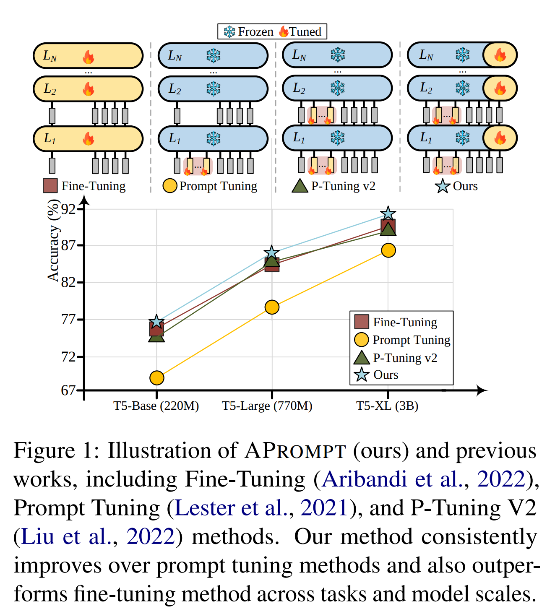
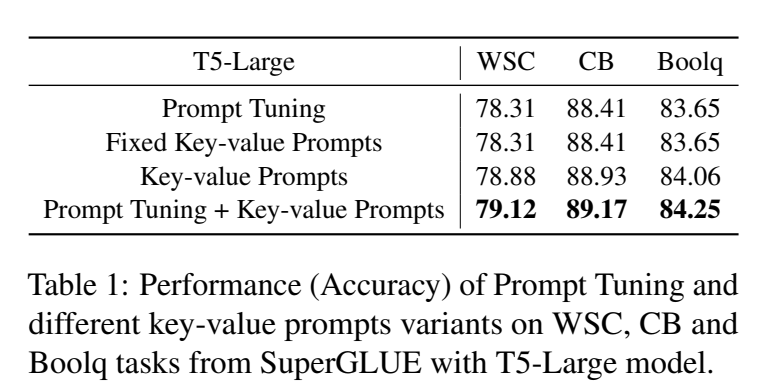
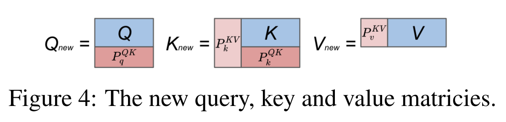
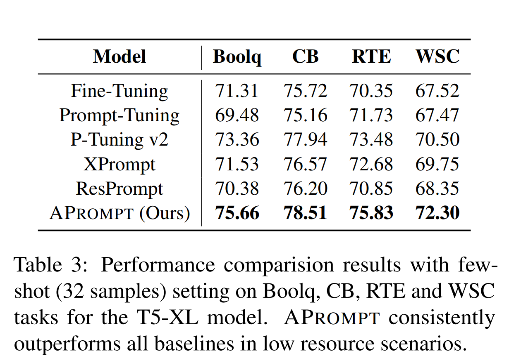
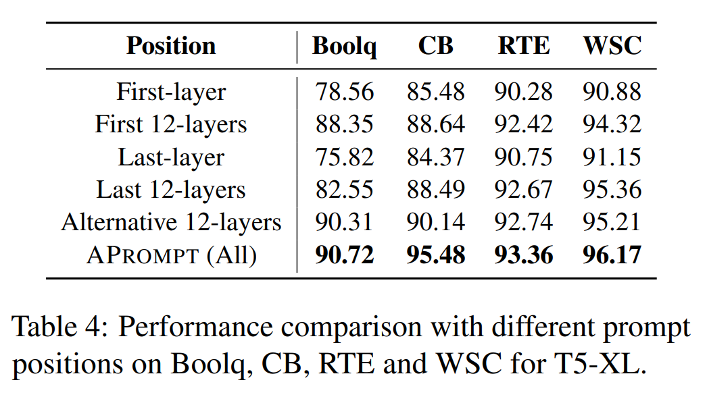
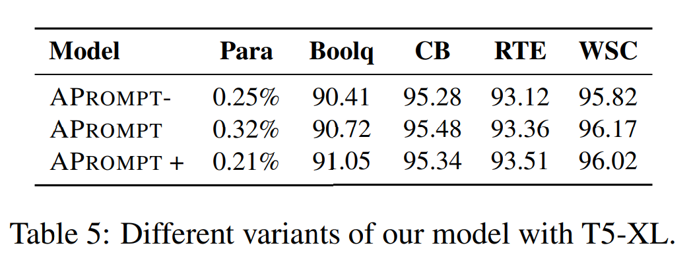

논문 및 이미지 출처 : <https://aclanthology.org/2023.emnlp-main.567.pdf>

large language model 의 성장으로, model 을 new task 에 fine-tuning 하는 과정이 parameter-intensive 하게 되었다.

prompt-tuning 은 Pre-trained language models (PLMs) 을 adapting 하는 효과적이고 효율적인 approach 로 등장한다.

하지만 대부분 input layer 에만 prompt 를 도입하여 성능이 제한되지만 개선할 여지는 크다.

본 논문에선 PLMs 의 효율적인 adapting 을 위한 novel Attention Prompt tuning 인 **APROMPT** 제안

- 기존 prompt-tuning 을 attention prompt tuning 의 특정 경우도 고려할 수 있음을 입증
- fine-tuning 중 attention computation 을 guide 하기 위해 query, key 및 value prompts 를 attention layer 에 통합
- SuperGLUE 에서의 실험 결과 SOTA baseline 및 PLMs 의 다양한 scale 의 fine-tuning 보다 일관되게 우수함
- prompt 설계의 효과와 저자의 방식의 효율성을 검증

# 1. Introduction

PLMs 는 NLU task 에서 상당한 인기를 얻어왔으며, 모델 크기를 확장하며 성능이 향상된다.

LLaMA, GPT, PaLM 등의 PLMs 도 점차 보급되고 있다. 하지만 효과적인 성능에도 불구하고 PLMs 의 fine-tuning 은 all parameter 에 대한 gradient 및 update 로 인해 매우 parameter-inefficient 하며, 각 task 에 대한 fine-tuned copy 를 저장하고 배치해야하여 연산 비용도 발생하여 model adapting 을 방해하는 문제도 있다.

full fine-tuning 대체를 위해, parameter-efficient tuning 이 제안되며, 이는 _partial tuning_ 및 _extra module_ 기술이 포함된다.

- _partial tuning_ (Yosinki et al. 2014): classifier head 또는 last few layers 같은 backbone 의 일부만 fine-tuning
- _extra module_ : learnable bias terms (Cai et al. 2020) 도입하거나  추가 adapters (Houlsby et al. 2019) 을 도입

위 전략들은 pretrain-then-finetune 패러다임 내에서 작동하며 learnable parameter 수를 효과적으로 줄였다.

하지만 이 방식은 full fine-tuning 과 성능 간격이 크게 벌어진다.

- 최근 prompt tuning approach (Lester et al. 2021; Li and Liang. 2021; He et al. 2022b; Yang et al. 2023)이 제안됐으며, 이는 _learnable soft prompts_ 를 input 에 prepend 한다.
  - 이 prompt 는 fine-tuning 과정 중 업데이트되는 continuous embedding 으로 구성된다. 
- prompt-tuning 은 다른 parameter-efficient fine-tuning 에 비해 더 단순하고 유연한 방법을 제공하며, PLMs 에서는 full fine-tuning 에 더 가깝게 작동하는 것이 입증되었다.
- prompt-tuning 은 일반적으로 모델 매개변수의 0.5% 미만으로 구성되어 fine-tuning 의 대안으로 제공
  - 하지만, 기존 prompt-tuning 은 주로 input layer 를 수정하고 self-attention mechanism 의 아키텍처는 철저히 탐색하지 않음
  - 따라서 성능이 낮으며 개선할 여지가 있음

본 논문에선 PLMs adapting 을 위한 novel Attention Prompt tuning 인 **APROMPT** 을 제안

- Prompt tuning 을 재검토하고, input prompt 가 특수화된 key-value prompt 로 간주될 수 있다는 것을 이론적 및 경험적으로 입증하여 APROMPT 소개
- 이전의 prompt tuning 과 달리, APROMPT 는 query, key 및 value prompt 세 가지 set 을 포함
  - 이 prompt 는 Transformer layer 내의 self-attention block 에 각각의 matrix 에 prepend
  - 이 Attention prompt 가 new task 에 attention computation 을 더 효과적으로 guide 하여 original input prompt 와 함께 학습되어 adapting 중 빠르고 정확하게 tuning
- SuperGLUE 에서 APROMPT 가 SOTA 에 비해 우수한 성능 보여줌
- ablation study 결과 Attention Prompt 의 효과성과 효율성을 강력하게 입증

**main contributions**

- input prompt 가 attention prompt 의 툭수한 형태의 관점을 입증하고, 저자의 방식에 대한 이해 향식
- input prompt 와 함께 query, key 및 value prompt 를 self-attention computation 에 통합하여 새로운 방식의 tuning 을 가능케하는 새로운 Attention prompt tuning 설계
- SuperGLUE 의 다양한 task 에 포괄적인 실험으로 SOTA 에 비해 효과적임을 입증

# 2. Related Work

#### Pre-trained Language Models

PLM (Yang et al., 2019; Ainslie 등, 2020; Zaheer et al., 2020; Zhao 등, 2023)은 다양한 NLP task 에서 성공을 거두었다. 

BERT (Devlin et al, 2019) 및 RoBERTa (Liu et al, 2019)와 같은 선구적인 연구는 masked language model (MLM) 및 next sentence prediction task 로 문맥 표현을 학습한다. 

최근에는 GPT-3 (Brown et al, 2020), T5 (Raffel et al, 2020), 및 PaLM (Chowdhery et al, 2022)을 포함한 다양한 PLM 이 다양한 pre-training design 등장했다. 

그러나 parameter 수의 지수적 증가로 인해 fine-tuning 에 어려움이 있다. 각 task 에 대한 fine-tuning 된 parameter 를 저장하고 유지하는 것은 cost 가 많이 든다.

#### Parameter-Efficient Tuning

PLMs 크기가 커짐에 따라 copy 를 저장하고 업데이트하는 것이 점점 부담스러워 진다.

parameter-efficient fine-tuning 이 LLM 에 등장하여, _partial tuning_ 및 _extra module_ 에 따라 카테고리가 나뉜다.

- _partial tuning_ : bias terms 및 last layers 의 모듈 일부 업데이트
- _extra module_ : SideTuning 및 adapter 를 포함한 model 의 다양한 위치에 task-specific parameter 동;ㅣㅂ

#### Prompt Tuning

virtual token 으로 모델에 learnable parameter 를 model input 에 삽입 또는 각 layer 에 삽입할 수 있다.

최근 prompt-tuning 의 성능과 안정성 개선을 위해 residual connection 을 추가하고, prompt-tuning 의 지속적인 학습 환경이 확장되고 있다. 하지만 대부분 input layer 에만 prompt 를 추가하여 성능이 제한된다.

가장 최근엔 MixPrompt (Yang et al, 2023) 및 E2VPT (Han et al, 2023) 등 제안되어, prompt 를 key-value prompt 와 결합한다. 이는 저자의 attention prompt tuning 의 경우로 취급할 수 있다

# 3. Prompt Tuning Revisit

## 3.1 Preliminary

Prompt tuning 은 PLMs 의 downstream task 에 빠른 적응을 위한 parameter-efficient 

- task-specific prompts 또는 prompt token $P \in R^{d\times m}$ 을 도입
- 이 prompt 를 input sequence $X \in R^{d\times n}$ 에 prepend 되어 new input $X_{new} = [P, X] \in R^{d\times (m+n)}$ 생성 (Fig. 2 left)
  - $m$ : prompt token length
  - $n$ : input sequence length
  - $d$ : embedding vector dimension

이 prompts 는 backbone 은 freezing 한 채 downstream task 에 fine-tuning

## 3.2 Connection with Key-Value Prompts

prompt-tuning 의 작동을 깊이 조사하고 _traditional input prompt 가 constrained key-value prompts 와 동등함_을 보여줌

prompt-tuning 에선 prompt token 이 input 에 prepend 된다. 이후 new sequence $X_{new} = [P, X]$ 가 next layer 의 text token 의 contextual embedding 을 계산하기 위해 Transformer encoder layer 에 feed

$$
Attn([P, X]) = softmax(\frac{Q^TK_{new}}{\sqrt{d}})V_{new}
$$

$$
Q = H^qX, K_{new} = H^kX_{new}, V_{new} = H^vX_{new}
$$

- Q, $K_{new}$, $V_{new}$ : new query, key 및 value embedding matrices
- $H^q$, $H^k$ 및 $H^v$ 는 pre-trained model parameter 로, freezing
- query Q 의 경우, original text token $X$ 만 업데이트되어 next layer 에서 사용되므로 새로 계산할 필요가 없다. 그러면 다음과 같다.

$$
K_{new} = H^kX_{new} = [H^kP, H^kX] = [P_k, K]
$$

유사하게, $V_{new} = [P_v, V]$ 를 갖는다. 따라서 prompt-tuning 중 prompt tokens $P$ 를 추가하는 것은 key prompts $P_k$ 및 value prompts $P_v$ 를 각각 original key 와 value matrices 에 prepend 하는 것과 동일하다고 할 수 있다. (Fig. 2)

이러한 key-value prompts 는 input prompts $P$ 에 의해 제약되거나 결합된다.

## 3.3 Empirical Study

더욱 검증하기 위해, SuperGLUE 의 세 task 에서 T5-Large backbone 으로 Prompt Tuning, Fixed Key-value Prompt, Key-value Prompt 및 Prompt Tuning + Key-value Prompt 를 수행

- Fixed Key-value Prompt 는 Prompt Tuning 에서 학습된 optimal prompts $P^*$ 를 fixed key 및 value prompts 에 추가
  - 즉, 어떠한 tuning 없이 $P_k = H^kP^*$ 및 $P_v = H^vP^*$
- Key-value Prompt 는 fine-tuning 중 optimal key 및 value 를 학습
- Prompt Tuning + Key-value Prompt 는 fine-tuning 중 input prompts 및 key-value prompts 함께 학습

비교는 Table 1 에 제시되어 있다.

- Fixed Key-value Prompt 는 Prompt Tuning 과 동일한 결과를 달성
  - 저자의 기대와 일치하며, input prompts 가 제약된 key-value prompts 사이의 동등성을 검증
- fine-tuning 중 key-value prompts 를 학습할 경우 Fixed key-value prompts 보다 성능 향상
  - 이유는 fixed key-value prompts 가 제약 없는 key-value prompts 의 search space 내의 특수한 경우로 볼 수 있기 때문
- fine-tuning 중 input prompts 와 key-value prompts 결합이 가장 높은 성능 달성
  - 저자의 가설은 key-value prompts 가 input prompts 에 포함된 정보를 포함할 수 있는 잠재력이 있지만, 실제로는 input prompts 가 fine-tuning 과정에서 추가적인 가치를 제공함을 시사

# 4. Attention Prompt Tuning

저자는 attention prompt tuning 을 Transformer layer 에 도입하여 attention computation 을 용이하게 하는 방식을 제안

저자의 모델은 다른 parameter 들은 고정한 채로 오직 세 가지 구성 요소만 학습

1. Input prompts $P_i$. 각 Transformer encoder layer 의 input sequence 의 시작 부분에 삽입
2. attention prompt 는 각각 query, key 및 value matrices 내에 통합된 $P_q$, $P_k$ 및 $P_v$
   - 이러한 prompt 는 fine-tuning data 로부터 새로운 attention pattern 학습
3. task-specific head 는 specific task 에 특화된 lightweight module 이며 효율적으로 학습

## 4.1 Input Prompts

전통적인 prompt-tuning 과 유사하게, input prompts 는 $d$-dimension embedding vector set 으로 구성하며, 차원은 text token 과 일치

이런 prompts 는 각 Transformer encoder layer 의 input sequence 시작 부분에 삽입되고 모든 text token 과 상호작용

이는 task-specific embedding 학습에 도움되며 모델이 new task 의 성능을 효과적으로 guide

- 공식적으로, 이 input prompts 는 $P_i = \{ P^1_i, P^2_i, \dots, P^N_i \}$ 로 정의
  - $P^j_i$ : $j_{th}$ Transformer encoder layer 의 learnable input promps
  - $N$ : 전체 레이서 수
  - encoder layer 는 다음과 같이 표시

$$
Z^1 = \textcolor{blue}{L_1}(\textcolor{red}{P^1_i}, E)
$$

$$
Z^j = \textcolor{blue}{L_j}(\textcolor{red}{P^j_i}, Z^{j-1}) \quad j = 2, 3, \dots, N
$$

- $Z^j$ : $j_{th}$ encoder layer 로 계산된 text tokens 의 contextual embedding
- 서로 다른 색상은 $\textcolor{red}{\text{trainable}}$ 및 $\textcolor{blue}{\text{frozen}}$ 을 나타낸다.
- $E$ : backbone 으로부터 초기화된 text token embedding

## 4.2 Attention Prompts

input prompts 는 new task 에 대한 knowledge 학습에 효과적이지만, 각 encoder layer 내의 정보 상호작용을 guide 하는 능력은 없다. 

new data 로 fine-tuning 중 word distribution 은 pre-training 중 본 예제와 크게 다를 수 있다. 따라서 fine-tuning data 로부터 새로운 정보를 포착하는 능력을 향상시키는 것이 중요하다.

이는 input tokens 사이에 더 나은 attention 을 가능하게 함으로써 task-specific context 에서 나타나는 new pattern 을 효과적으로 학습하는 것을 의미한다.

이를 위해, 각 encoder layer 내의 attention block 에 통합된 novel attention prompts 를 소개

이러한 attention prompts 는 _query-key prompts_ 와 __key-value prompts__ 두 그룹으로 분류될 수 있다.

- query-key prompts 는 $P^{QK}_q$ 및 $P^{QK}_k$ 로 표시되며, attention module 내의 original query 및 key 에 append 되는 small matrices 로 구성
  - 이러한 query-key prompts 를 통합함으로써 token 간의 attention map computation 을 향상시킨다.
- key-value prompts 는 $P^{KV}_k$ 및 $P^{KV}_v$ 로 표시되며, key 및 value matrices 에 각각 삽입된 두 개의 supplementary matrices (few columns) 로 구성
  - 이러한 key-value prompts 는 input tokens 가 attention 할 수 있는 추가 정보를 제공하여 learned embedding 의 representation 을 강화
- query-key 및 key-value prompts 모두 통합함으로써, fine-tuning 과정 중 더 효과적인 information interaction 을 가능하게하고 new patterns 를 포착할 수 있게 한다.
- new query, key 및 value matrices 는 이런 new attention prompts 로 확장된다. (Fig. 4)
- new key matrix 는 query-key 및 key-value prompts 모두에서 추가된다.

그럼 new attention computation 은 다음과 같다.

$$
L(\cdot) = \textcolor{blue}{MLP} ( \textcolor{blue}{LN} ( \textcolor{red}{MSA} (\cdot) ) )
$$

$$
MSA(\cdot) = softmax(\frac{\textcolor{red}{Q^T_{new}K_{new}}}{\sqrt{d}})\textcolor{red}{V_{new}}
$$

- MLP 및 LN : frozen multi-layer perceptron 및 layer norm
- MSA : Transformer encoder layer 내의 multi-head self-attention

이렇게 하여 attention prompts 는 new task 에 대한 model adaptation 을 효과적으로 guide

## 4.3 Task-specific Head

각 downstream task 의 경우, very small module 이며 specific task 에 특수화되는 task-specific head 를 를 fine-tuning 하여 predictions 를 생성

$$
y = \textcolor{red}{Head}(Z^N)
$$

- $Z^N$ : encoder 의 top layer 의 output contextual embedding

# 5. Experiments

## 5.1 Datasets

이전 prompt-tuning 연구에 따라 NLU task 인 SuperGLUE 에서 실험 수행

- BoolQ, CB, COPA, MRC, ReC, RTE, WiC 및 WSC

## 5.2 Baselines

SOTA prompt-tuning 과 비교한다.

- Fine-Tuning : T5 standard full fine-tuning
- Prompt-Tuning : vanilla prompt tuning. input layer 에 input prompts 추가
- P-Tuning v2 : 각 transformer layer 에 개별적인 prompts 삽입
- XPrompt : 가장 작은 important token-level 및 piece-level prompts 를 pruning
- ResPrompt : prompt tuning 의 안정성 및 성능을 높인 residual connection 추가

## 5.3 Implementation Details

APROMPT 는 Prompt Tuning 연구를 위해 OpenPrompt 를 사용하여 구현

- 16개 NVIDIA Tesla V100 GPU 에서 학습
- 각 SuperGLUE 를 따라 text-to-text 형식으로 변환
- 세 가지 규모의 PLMs 사용: T5-base, T5-large, T5-XL
- 이전 연구를 따라, input, query-key 및 key-value pomrpts length 를 조정하며 훈련
  - input prompts 10 으로 설정하고, query-key 및 key-value prompts 의 최적 길이를 $\{1,5,10,20,50\}$ 에서 search
- Adafactor optimizer 사용하여 weight decay 1e-5 훈련

## 5.4 Main Results

1. APROMPT 는 다양한 backbone 으로 일관되게 prompt-tuning baseline 능가하며, attention prompt 의 효과적인 설계를 보여줌
   - T5-large 의 Boolq 에서, APROMPT 의 acc 점수는 XPrompt 및 P-Tuning v2 와 비교하여 각각 5.62% 및 2.76% 개선
   - 기존 prompt-tuning 방식이 주로 input prompt token 을 설계하고, new data 내에서 상호 작용을 포착하지 못함을 시사
   - 반면, 저자의 attention prompt 는 이러한 갭을 줄여 향상된 성능을 얻는다.
2. APROMPT 는 대부분의 경우 full fine-tuning 보다 우수한 성능 발휘하며, T5-base 같은 small backbone 에서 여전히 일부 격차가 있긴 하다.
   - 이 관찰은 다양한 NLU task 에 효과적임을 보여주며, backbone 의 약 0.4% 만 훈련하여 달성하였으며, 매우 parameter-efficient 하다.
   - APROMPT 가 추가적인 attention prompt 를 도입하더라도 input prompt 의 길이가 크게 줄었음도 가치 있다 (fix 10)
   - 따라서 P-Tuning v2 와 비교하여 trainable parameter 가 적다.
3. backbone 모델 크기가 증가함에 따라 fine-tuning 과 다른 prompt-tuning method 간의 gap 을 줄이는 것에 가치가 있음
   - 이는 이전 연구 (Lester et al. 2021; Ma et al. 2022) 와 일치하며, fine-tuning 과 대안 prompt-tuning 간의 수렴 추세를 강조

# 6. Analysis and Discussion

#### Results on Low-resource Scenario

저자는 APROMPT 및 baseline 을 low-resource setting 에서의 성능을 평가

(Schick and Schütze, 2021) 를 따라, 저자는 fixed random seed 를 사용하여 각 task 에 대한 32 examples 를 선택하여 new training set 으로 사용

저자는 limited training set 에 prompt model 을 학습하고 best checkpoint 로 Table 3 에 report

- limited data 에서는 모든 method 가 상당한 성능 저하를 경험하지만, APROMPT 는 Boolq, CB, RTE 및 WSC 같은 task 에서 baseline 을 일관되게 능가
- 대부분의 prompt-tuning 이 fine-tuning 과 비교하여 더 나은 결과를 관찰
  - 이는 limited data 로 훈련할 때 overfitting 의 어려움에도 불구하고, prompt-tuning 이 fine-tuning 에 비해 우수한 일반화 능력을 보여줌

#### Impact of Difference Prompts

다양한 prompt 의 영향을 조사하기 위해, 다양한 prompt combinations 를 탐구하여 ablation study 수행

구체적으로, 네 가지 추가적인 모델로 실험 수행

- input prompts 없이
- query-key prompts 없이
- key-value prompts 없이
- query-key 및 key-value prompts 없이

- 결과 모델 성능이 trainable prompts 중 하나를 제거할 때 감소하는 것을 볼 수 있다. 
- input prompts 없이 APROMPT 의 성능 감소가 attention prompt 없는 모델과 비교하여 비교적 작음을 관찰
  - 이는 input prompts 와 비교하여 query-key 및 key-value prompts 의 중요성을 보여줌 (Section 3 의 타당함)
- APROMPT 의 모든 prompts 결합이 최상의 성능

#### Impact of Prompt Length

APROMPT 에서 query-key 및 key-value prompt 의 length 가 조정해야하는 hyperparameter 다.

다양한 prompt length 가 모델 성능에 미치는 영향을 분석하기 위해, 저자는 prompt length  를 $\{1, 5, 10, 20, 50\}$ 으로 수정하여 실험

모든 조합의 성능 결과는 RTE 와 WSC 에 대해 Fig. 6 에 나와 있다.

- 모든 task 에 걸쳐 일관되게 최고의 성능을 달성하는 optimal prompt length 는 없다는 것을 알 수 있다.
  - 예로, RTE 에서 10 query-key prompt 로 best 성능을 얻음
  - 서로 다른 task 와 dataset 이 서로 다른 데이터 분포를 보이며, "hard" task 는 데이터의 pattern 과 knowledge 를 효과적으로 포착하기 위해 longer prompts 가 필요하다 가설 세움
  - 하지만 이는 trainable parameter 수가 증가하는 대가가 이루어짐
  - 그럼에도 일정 범위 내에서는 성능이 비교적 안정적임

#### Impact of Prompt Positions

이는 모델 성능에 대한 prompt position 의 영향을 평가

encoder 와 decoder 에 다양한 prompt 위치를 적용하여 다섯 가지 추가 모델 훈련

- first layer, last layer, first 12 layers, last 12 layers
- all encoder 및 decoder layer 에 prompt 를 삽입하는 것이 best 성능 얻음 (놀라운 일은 아님)
- 또한 input layer 또는 output layer 에만 prompt 넣는 것은 성능 저하를 일으키는 것을 관찰
  - 이는 다른 prompt-tuning 연구에서의 관찰과 일관됨

#### Effect of Attention Prompts Balancing

APROMPT 의 query-key 및 key-value prompt 는 모델 성능 각각에 다른 기여를 함

상관 관계와 효과를 더욱 조사하기 위해, trainable parameter 수를 고정하고 key-value prompt 비율을 조정하여 실험 수행

비율은 $\{0, 0.25, 0.5, 0.75, 1\}$ 로 조정

- task 간에 다른 패턴 관찰
  - WSC 는 0.75 비율일 때 최고
  - CB 는 비율이 0.5 일 때 최고
- 대부분 비율이 0 또는 1 일 때는 성능 저하를 관찰

#### Variants of APROMPT

performance-scale trade-off 분석을 위해 APROMPT 의 두 가지 변형 비교

- input prompt 를 제거하고 attention prompt 만 유지한 변형
- XPrompt 의 pruning 을 적용하여 important 가 낮은 prompt 를 제거한 변형

- Table 5 에서 input prompt 의 기여가 크지 않다는 것을 관찰
  - 이는 Section 3 결과와 일치
- prompt pruning 적용 후, trainable parameter 수는 감소하지만, 성능은 task 간에 다양하게 나타났으며, prompt 수와 모델 성능 사이의 trade-off 를 찾는데 있어 탐구할 여지가 있어 보임

# 7. Conclusions

본 연구는 prompt-tuning 을 attention prompt-tuning 과 연결하여 보여주며, input prompt 를 attention layer 의 key-value prompt 의 특수한 경우로 간주 가능함

이 관찰로, query, key 및 value prompt 란 세 가지 new prompts set 을 소개하며, 이를 attention layer 에 통합하여 fine-tuning 중 attention computation 으로 guide

SuperGLUE 실험에서 여러 baseline 에 비해 우수한 성능을 보여준다.

# Limitations

저자의 APROMPT 모델에는 두 가지 한계가 존재

- 다른 prompt-tuning 및 fine-tuning 방식을 능가하지만, attention prompt 의 optimal combination 을 식별하는 것에는 어려움이 존재
  - optimal prompt length 를 확인하는 searching 은 수행했지만 체계적인 해결책 필요
- 현재 모델은 각각의 개별 task 에 대해 task-agnostic prompts 를 학습
  - 이를 해결하기 위해 parametric network 를 탐구하여 모델의 유연성과 multiple task 에 대한 adaptability 를 향상시킬 예정
