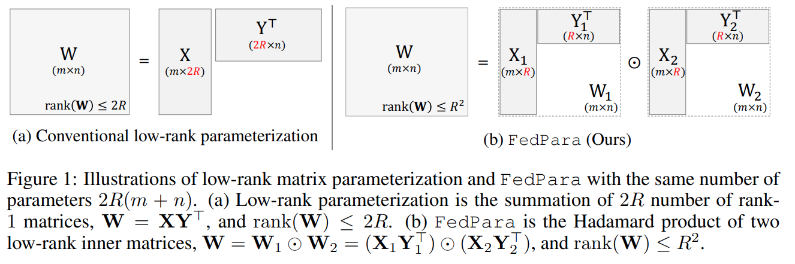
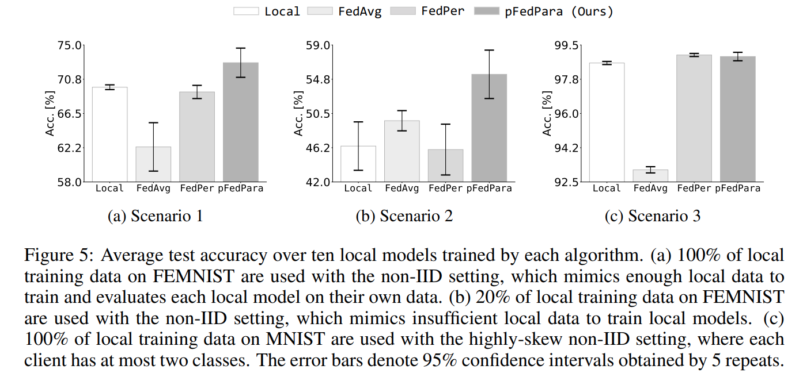

논문 및 이미지 출처 : <https://arxiv.org/pdf/2108.06098>

# Abstract

이 논문에서는 Federated Learning (FL)에서 빈번한 model upload 및 download 로 인한 부담을 극복하기 위해 **FedPara** 라는 communication-efficient parameterization 를 제안한다. 

- 제안된 방법은 low-rank weights 뒤에 Hadamard product 를 적용하여 layer 의 weight parameters 를 재구성한다. 
- 기존의 low-rank parameterization 과 달리, FedPara 는 low-rank constraints 를 받지 않아 larger capacity 를 가진다.
  - 이 속성 덕분에, 기존 layer 대비 3 ~ 10배 lower communication costs 로 비슷한 성능을 달성할 수 있다. 
  - 이는 전통적인 low-rank 방법으로는 불가능하다. 
- FedPara 는 other efficient FL optimizer 와 결합하여 성능을 더욱 향상시킬 수 있다. 

추가적으로, personalized FL 응용을 위해 **pFedPara** 라는 방법을 확장했다.

이는 parameters 를 global 과 local 로 분리한다. 

pFedPara 는 경쟁 personalized FL 방법들보다 3배 fewer parameters 로 더 나은 성능을 달성한다.  

# 1. Introduction

Federated Learning (FL)은 모바일 및 IoT 기기의 발전과 보급에 따라 제안된 효율적인 협업 학습 전략이다. 

FL 은 data sharing 없이 edge device 의 local computing resources 및 private data 를 활용할 수 있게 한다. 

FL 은 다음과 같은 과정으로 이루어진다:

1. clients 는 central server 로부터 global model 을 다운로드한다.  
2. clients 는 자신만의 private data 를 사용해 local 에서 model 을 업데이트한다.  
3. clients 는 local model 을 server 로 업로드한다.  
4. server 는 updated model 을 통합하고 이 과정을 반복하여 global model 이 수렴할 때까지 진행한다.  

FL 은 distributed learning 과 다음과 같은 주요 차이점을 가진다:

- **Heterogeneous data**: 데이터가 분산되어 있으며 non-IID 하고, clients 별로 데이터 양이 균형 잡히지 않았다. 따라서 local data 는 전체 data distribution 를 대표하지 않는다.  
- **Heterogeneous systems**: clients 는 하드웨어 및 인프라가 서로 다르며, all clients 의 연결 상태가 항상 빠르거나 안정적이지 않다. 다양한 communication paths 를 통해 대규모 clients 가 참여하면서 communication 부담이 발생한다.

이러한 FL 의 특성은 heterogeneous data 로 인한 convergence stability 와 communication overhead 에 어려움을 야기한다. 

- 이전 연구들은 수정된 loss functions 나 model aggregation 방법을 제안해 안정성을 높이고 communication round 를 줄였다. 
- 하지만 bandwidth constraints 가 있는 edge device 나 low-quality communication infrastructure 에선 여전히 데이터 전송량이 많다.
- 데이터 전송량이 많으면 edge device 의 energy consumption 문제를 유발한다. 
  - wireless communication 은 계산보다 훨씬 더 많은 전력을 소모하기 때문이다.  

이 논문에서는 FL 을 위한 communication-efficient reparameterization 방법인 **FedPara** 를 제안한다. 

- FedPara 는 round 당 전송되는 bits 수를 줄이며, 모델의 fully-connected (FC) layer 와 convolutional layer 를 small factorized form 으로 재구성해 모델의 용량을 유지한다. 
- 핵심 아이디어는 low-rank parameterization 과 Hadamard product 를 결합하여 아래와 같은 _low-rank Hadamard product_ 를 사용하는 것이다.
  - $W = (X_1Y_1^\top) \odot (X_2Y_2^\top) \in \mathbb{R}^{m \times n}$
  - 여기서 $\text{rank}(X_1Y_1^\top) = \text{rank}(X_2Y_2^\top) = r$ 이면 $\text{rank}(W) \leq r^2$ 
- 이 특징은 일반적인 $m \times n$ matrix 보다 훨씬 적은 파라미터로 full-rank matrix 를 표현할 수 있게 한다. 
  - 이로 인해 training 중 communication 부담이 크게 줄어든다. 
  - inference phase 에선 $W$ 를 미리 구성하여 원래 구조로 유지하므로, FedPara 는 inference 시 계산 복잡도를 변경하지 않는다.  

이전 연구들은 수렴을 위한 communication round 를 줄이는 데 초점을 맞췄지만, FedPara 는 layer 의 내부 구조를 재정의함으로써 optimization 과정에 영향을 주지 않는 독립적인 접근 방식을 취한다. 

FedPara 의 효과를 VGG, ResNet, LSTM 같은 다양한 network architecture 와 IID 및 non-IID 설정의 standard classification dataset 에서 평가했다. 

- 제안된 parameterization 은 동일한 파라미터 수로 traditional low-rank parameterization baseline 을 능가하며, 경우에 따라 파라미터 수가 증가할수록 기존 모델을 초과하는 정확도를 보였다.  
- 추가로, FedPara 를 다른 FL 알고리즘과 결합해 communication 효율성을 더욱 개선했다. 

또한 FedPara 를 personalized FL 응용으로 확장하여 **pFedPara** 를 제안했다. 

- 이는 각각 global 과 local inner matrix 의 역할을 분리한다. 
- global matrix 는 common knowledge 를 학습하고, local matrix 는 clients-specific knowledge 를 학습한다. 
- FEMNIST 와 MNIST dataset 의 subset 을 사용해 local data 양과 heterogeneity 에 따라 세 가지 시나리오를 설계했다.
- pFedPara 는 경쟁 알고리즘 대비 성능과 강건성을 보여줬다.  

### Main Contributions

- **FedPara 제안**: FL 을 위한 low-rank Hadamard product parameterization 방법으로, communication 효율성을 극대화한다. 
  - traditional low-rank parameterization 과 달리 FedPara 는 reduced parameters 로 full-rank matrix 와 tensor 를 표현할 수 있다. 
  - FedPara 는 목표 정확도를 달성하기 위해 원래 모델 대비 최대 10배 fewer total communication costs 를 필요로 한다.
  - 경우에 따라 rank 를 조정해 original model 을 초과하는 성능을 보인다.  
- **조합 가능성**: FedPara 는 novel approach 를 취했기 때문에, 다른 FL 방법들과 결합하여 정확도와 communication 효율성을 더욱 향상시킬 수 있다.
- **pFedPara 제안**: FedPara 를 personalized FL 로 확장하여 layer weight 를 global 과 local parameters 로 분리했다. 
  - pFedPara 는 challenging 환경에서도 경쟁 방법들보다 더 강건한 결과를 보여줬다.  

# 2 Method

이 섹션에서는 먼저 2.1 에서 세 가지 인기 있는 low-rank parameterization 방법에 대해 개요를 제공한 후, 2.2 에서 제안하는 FedPara 의 알고리즘적 특성과 함께 이를 설명한다. 

2.3 에서는 FedPara 를 personalized FL application 인 pFedPara 로 확장한다.

#### Notations

Hadamard product 는 $\odot$, Kronecker product 는 $\otimes$, n-mode tensor product 는 $\times_n$, 그리고 tensor $T \in \mathbb{R}^{k_1 \times \cdots \times k_n}$ 에 대해 tensor 의 $i$-th unfolding 은 $T_{(i)} \in \mathbb{R}^{k_i \times \prod_{j \neq i} k_j}$ 로 나타낸다.

## 2.1 Overview of Low-Rank Parameterization

신경망에서 low-rank decomposition 은 주로 PLM 을 압축하기 위해 사용되며, 이는 파라미터 수를 줄이면서도 encoded information loss 를 최소화한다. 

learned parameter matrix $W \in \mathbb{R}^{m \times n}$ 가 주어졌을 때, rank-$r$ approximation 을 찾는 문제는 다음과 같이 정의된다:

$\underset{\widetilde{W}}{\text{arg min}} \, ||W - \widetilde{W}||_F \quad \text{such that} \quad \widetilde{W} = XY^\top$

여기서 $X \in \mathbb{R}^{m \times r}, Y \in \mathbb{R}^{n \times r}, r \ll \min(m, n)$ 이다. 이를 통해 파라미터 수를 $O(mn)$ 에서 $O((m + n)r)$ 로 줄일 수 있으며, 최적의 해는 SVD 로 얻을 수 있다.

이 matrix decomposition 은 FC layer 와 convolution layer 의 reshaped kernel 에 적용 가능하다. 하지만 convolution kernel 의 자연적인 형태는 fourth-order tensor 이기 때문에, Tucker 및 CP decomposition 같은 low-rank tensor decomposition 이 더 적합한 접근법일 수 있다. 

예를 들어, learned high-order tensor $\mathcal{T} \in \mathbb{R}^{k_1 \times \cdots \times k_n}$ 에 대해 Tucker decomposition 은 kernel tensor $\mathcal{K} \in \mathbb{R}^{r_1 \times \cdots \times r_n}$ 와 matrices $X_i \in \mathbb{R}^{r_i \times k_i}$ 를 곱하여 다음과 같이 나타낸다:

$T_e = K \times_1 X_1 \times_2 \cdots \times_n X_n,$

반면, CP decomposition 은 rank-1 tensor 들의 합으로 표현된다:

$T_e = \sum_{i=1}^{i=r} x_i^1 \times x_i^2 \times \cdots \times x_i^n,$

여기서 $x_i^j \in \mathbb{R}^{k_j}$ 이다. 이 방법들도 모델 파라미터 수를 줄이는 데 기여한다. 이러한 구조적 방법들을 **conventional low-rank constraints** 또는 **low-rank parameterization methods** 라고 한다.

- FL 에서는 파라미터가 training 중 clients 와 server 간에 자주 전송되므로, 파라미터 수를 줄이는 것은 communication costs 감소로 이어지며, 이는 본 연구의 주요 초점이다. 
- SVD, Tucker, CP decomposition 을 사용하는 post-decomposition 접근법은 training 이 끝난 후 original parameterization 에 적용되기 때문에 communication costs 를 줄이지 않는다. 
- 즉, FL training 중에는 여전히 original large-size parameters 를 전송하며, training 후에야 파라미터 수가 감소한다.

본 연구에서는 low-rank parameterization 과는 다른 개념을 사용한다. 

- FL 시나리오에서는 low-rank constraint 를 사용해 모델을 scratch training 을 하지만, 특히 _low-rank Hadamard product re-parameterization_ 방식을 사용한다. 
- FC 및 convolutional layer 를 포함한 각 learnable layer 를 재구성하고 surrogate model 을 FL 로 학습한다. 
- 기존 FL 에서 사용되는 low-rank 방법과 달리, 제안한 parameterization 은 원래 모델과 유사한 정확도를 달성할 수 있다.

## 2.2 FedPara: A Communication-Efficient Parameterization

traditional low-rank parameterization 은 low-rank constraints 로 인해 representation 이 제한적이다. 

이를 극복하면서도 파라미터 수를 줄이기 위해, **FedPara** 라는 new low-rank Hadamard product parameterization 을 제안한다. 

이 방법의 주요 속성은 다음과 같다:

#### Proposition 1

$X_1 \in \mathbb{R}^{m \times r_1}, X_2 \in \mathbb{R}^{m \times r_2}, Y_1 \in \mathbb{R}^{n \times r_1}, Y_2 \in \mathbb{R}^{n \times r_2}, r_1, r_2 \leq \min(m, n)$ 이고, matrix $W$ 가 $W := (X_1Y_1^\top) \odot (X_2Y_2^\top)$ 이면 $\text{rank}(W) \leq r_1r_2.$ 이다.  

---

Proposition 1 은 low-rank parameterization 과 달리, two inner low-rank matrices $W_1$ 과 $W_2$ 의 Hadamard product 를 사용하여 higher-rank matrix 을 구성할 수 있음을 나타낸다 (Fig. 1).

$r_1r_2 \geq \min(m, n)$ 을 만족하도록 inner rank $r_1$ 과 $r_2$ 를 선택하면, 구성된 matrix 는 low-rank restriction 이 없으며 full-rank matrix 를 표현할 가능성이 높다 (Fig. 6). 즉, FedPara 는 full-rank 를 달성할 수 있는 minimal parameter 특성을 가진다.  

추가적으로, $r_1$ 과 $r_2$ 를 조정하여 파라미터 수를 제어할 수 있다. 하지만 minimal parameter 로 maximal rank 를 설정하기 위한 유용한 hyper-parameter 설정 속성을 아래에서 제공한다.

#### Proposition 2

$R \in \mathbb{N}$ 이 주어졌을 때, 다음 조건을 만족하는 $r_1, r_2$ 에 대한 유일한 최적 선택은 $r_1 = r_2 = R$ 이다:

$$
\begin{equation}
    \underset{r_1, r_2 \in \mathbb{N}}{\text{arg min}} \, (r_1 + r_2)(m + n) \quad \text{s.t.} \quad r_1r_2 \geq R^2,
\end{equation}
$$

optimal value 는 $2R(m + n)$ 이다.

---

Eq. 3 은 target rank constraint $R^2$ 를 가진 matrix 에서 parameterization 에 사용되는 weight parameter 수를 최소화하는 기준을 의미한다.

- Proposition 2 는 hyper-parameter 를 효율적으로 설정하는 방법을 제공한다. 
  - Proposition 2 에 따르면, $r_1 = r_2 = R$ 로 설정하고 $R^2 \geq \min(m, n)$ 을 만족하면, FedPara는 low-rank restriction 없이 동작하며 much fewer parameter 수로 full-rank matrix 를 구성할 가능성이 높다. 
  - 즉, $2R(m + n) \ll mn$ 이 성립한다.
- 추가적으로, 동일한 파라미터 수를 사용할 경우, FedPara 의 $\text{rank}(W)$ 는 traditional low-rank parameterization 의 $R^2$ 배에 해당한다. 이는 Fig. 1 과 Tab. 1에 나타나 있다.

Proposition 1 을 convolutional layer 로 확장하려면, fourth-order tensor kernel 을 행렬로 변환하는 단순한 방식을 사용할 수 있다. 

- 예로, $\mathbb{R}^{O \times I \times K_1 \times K_2} \rightarrow \mathbb{R}^{O \times (IK_1K_2)}$ 로 변환한다. 
  - $O$ : output channel 수
  - $I$ : input channel 수
  - $K_1$ 및 $K_2$ : kernel size
- 이 방식은 $I \times K_1 \times K_2$ 크기의 몇 가지 basis filter 를 사용해 convolution filter 를 표현한다.  
- 그러나 tensor kernel 을 reshape 하지 않고 convolutional layer 를 더 효율적으로 parameterize 할 수 있다.

#### Proposition 3

$\mathcal{T}_1, \mathcal{T}_2 \in \mathbb{R}^{R \times R \times k_3 \times k_4}, X_1, X_2 \in \mathbb{R}^{k_1 \times R}, Y_1, Y_2 \in \mathbb{R}^{k_2 \times R}, R \leq \min(k_1, k_2)$ 이고, convolution kernel $\mathcal{W} := (\mathcal{T}_1 \times_1 X_1 \times_2 Y_1) \odot (T_2 \times_1 X_2 \times_2 Y_2)$ 이면, kernel 의 rank 는 $\text{rank}(\mathcal{W}^{(1)}) = \text{rank}(\mathcal{W}^{(2)}) \leq R^2$ 을 만족한다.

---

Proposition 3 은 Proposition 1 의 확장이지만 reshape 없이 convolutional layer 에 적용할 수 있다. 

Tab. 1 의 convolutional layer 사례에서는, specific tensor size 가 주어질 때 Proposition 3 이 Proposition 1 보다 3.8배 fewer parameters 를 요구한다. 따라서 convolutional layer 에는 tensor 기반 방법이 더 효과적이다.

선택적으로, non-linearity 와 Jacobian correction regularization 을 선택적으로 사용할 수 있다. 

이러한 기법은 정확도와 convergence stability 를 향상시킬 수 있지만 필수적이지 않다. 장치의 자원 상황에 따라 이러한 기법을 생략할 수 있다.  

# 2.3 pFedPara: Personalized FL Application

실제 상황에서는 각 clients 의 usage times 및 habits 같은 서로 다른 특성으로 인해 데이터가 heterogeneous 하고 개인화되어 있다.

이를 해결하기 위해 FedPer 은 모델에서 global layer 와 local layer 를 구분하는 방법을 제안했다. 

- clients 는 global layer (top layer) 만 전송하며, local layer (bottom layers) 는 각 장치에 남겨둔다.
- global layers 는 general feature 를 추출하기 위해 jointly learning 을 수행하며, local layer 는 사용자별로 편향된다.

FedPara 를 활용해 **pFedPara** 라는 personalization application 을 제안한다. 

- 여기서는 Hadamard product 를 global inner weight $W_1$ 와 local inner weight $W_2$ 사이의 연결 고리로 사용한다.
- 개인화된 모델의 각 layer 는 다음과 같이 구성된다: $W = W_1 \odot (W_2 + 1)$
  - $W_1$ : training 중 server 로 전송
  - $W_2$ : local device 에 남는다. 
- 이를 통해 $W_1$ 은 globally shared knowledge 를 암묵적으로 학습하며, $(W_2 + 1)$ 의 스위치 역할을 한다.
- 수식적으로, 이를 다음과 같이 다시 쓸 수 있다: $W = W_1 \odot W_2 + W_1 = W_{\text{per.}} + W_{\text{glo.}}$
  - $W_{\text{per.}} = W_1 \odot W_2$
  - $W_{\text{glo.}} = W_1$
- pFedPara 에서 final personalized parameter $W$ 의 구성은 global weight $W_{\text{glo.}}$ 와 personalizing residue $W_{\text{per.}}$ 의 additive model 로 볼 수 있다.  
  - pFedPara 는 same rank 조건에서 FedPara 대비 half parameters 만 전송하므로 communication efficiency 가 더 증가한다.  
- 직관적으로, FedPer 와 pFedPara 는 split 방향에 따라 구분된다. 
  - Fig. 2 에 그 차이를 시각적으로 설명했다. 
  - 편의를 위해 feed-forward network 사례를 설명했지만, 이는 일반적인 경우로 확장 가능하다.

# 3 Experiments

FedPara 의 communication costs, parameter 수, 다른 FL 방법과의 호환성을 평가했다.

pFedPara 는 서로 다른 세 가지 non-IID 시나리오에서 평가했다. 

모든 실험에서 FedPara 는 standard FL 알고리즘인 FedAvg 를 backbone optimizer 로 사용했다. 

## 3.1 Setup

#### Datasets

FedPara 실험에서는 다음의 네 가지 인기 있는 FL dataset 을 사용했다: CIFAR-10, CIFAR-100, CINIC-10, Shakespeare

- IID 설정에서 CIFAR-10 과 CINIC-10 은 100 partitions 로, CIFAR-100 은 50 partitions 로 데이터를 랜덤하게 나눴다.
- non-IID 설정에서는 Dirichlet distribution 을 사용해 데이터를 랜덤하게 나눴으며, Dirichlet parameter $\alpha$ 는 0.5로 설정했다.
- FL 중 각 round 에서 clients 의 16% 를 샘플링했다.  
- pFedPara 실험에서는 MNIST 와 FEMNIST 같은 handwritten dataset 의 subset 을 사용했다.
- MNIST 의 non-IID 설정에서는 각 clients 가 최대 two classes 만 포함하도록 설정했다.

#### Models

CNN 아키텍처로 VGG 와 ResNet, RNN 아키텍처로 LSTM, 그리고 multilayer perceptron 에서 two FC layers 를 실험했다.

VGG16 아키텍처를 사용할 때는 batch normalization 을 group normalization 으로 대체했다.  

- VGG16$_\text{ori.}$ 는 원래 VGG16 모델
- VGG16$_\text{low}$ 는 Tucker 형태로 low-rank tensor parameterization 을 적용한 VGG16  
- VGG16$_\text{FedPara}$ 는 FedPara 를 적용한 VGG16 을 의미

pFedPara 실험에서는 two FC layers 를 사용했다.

#### Rank Hyper-parameter

$W_1$ 과 $W_2$ 의 inner rank $r$ 은 다음과 같이 설정했다: $r = (1 - \gamma)r_{\text{min}} + \gamma r_{\text{max}}$

- $r_{\text{min}}$ 은 Proposition 2 에 따라 FedPara 가 full-rank 를 달성할 수 있는 minimum rank, $r_{\text{max}}$ 는 FedPara 의 parameter 수가 original parameter 수를 초과하지 않는 maximum rank, $\gamma \in [0, 1]$ 은 가중치로 설정된다.
- 단순화를 위해 all layer 에 대해 동일한 $\gamma$ 를 고정했다.  
  - $\gamma$ 는 parameter 수를 결정하는 요소이다.  

## 3.2 Quantitative Results

#### Capacity

Tab. 2 는 FedPara 가 동일한 parameter 수를 가진 low-rank parameterization 대비 higher rank 를 달성한다는 것을 입증한다.

- VGG16$_\text{low}$ 와 VGG16$_\text{FedPara}$ 를 동일한 round $T$ 동안 학습했으며, 각각 VGG16$_\text{ori.}$ 파라미터의 10.25% 와 10.15% 를 사용하여 비교 가능하도록 설정했다.
- Tab. 2a 에서 보이듯이, VGG16$_\text{FedPara}$ 는 all IID 및 non-IID benchmark 에서 VGG16$_\text{low}$ 를 상당한 차이로 능가한다.  
- 비슷한 경향이 recurrent neural network (RNN) 에서도 관찰된다.
  - Shakespeare dataset 의 subset 에 대해 LSTM 을 학습한 결과, LSTM$_\text{FedPara}$ 가 LSTM$_\text{low}$ 보다 높은 정확도를 보였다. 
  - 이때 parameter 수는 각각 LSTM 의 19% 와 16% 로 설정되었다. 
- 이 실험은 FedPara 가 traditional low-rank parameterization 보다 더 나은 모델 표현력과 정확도를 가진다는 것을 증명한다.

#### Communication Cost

VGG16$_\text{FedPara}$ 와 VGG16$_\text{ori.}$ 를 정확도 및 communication costs 측면에서 비교했다. 

FL 평가에서는 보통 목표 정확도에 도달하는 데 필요한 round 수를 communication costs 로 측정하지만, 본 연구에서는 더 실질적인 communication cost metrics 로 총 전송된 bit size 를 사용했다. 이는 다음과 같이 계산한다: $2 \times (\#\text{participants}) \times (\text{model size}) \times (\#\text{rounds})$

- 여기서 up-link 와 down-link 모두를 고려했다.
- CIFAR-10, CIFAR-100, CINIC-10 dataset 의 난이도에 따라 VGG16$_\text{FedPara}$ 의 model size 는 VGG16$_\text{ori.}$ 의 각각 10.1%, 29.4%, 21.8% 로 설정했다.  
- Fig. 3a-3f 에 따르면, VGG16$_\text{FedPara}$ 는 VGG16$_\text{ori.}$ 와 비슷한 정확도를 유지하면서도 훨씬 낮은 communication costs 를 요구한다.
- Fig. 3g 는 목표 정확도에 도달하기 위한 model training 시 필요한 communication costs 와 에너지 소비량을 보여준다.
- 에너지 소비는 user-to-data center topology energy model 을 사용해 계산했다.
- VGG16$_\text{FedPara}$ 는 동일한 목표 정확도를 달성하기 위해 VGG16$_\text{ori.}$ 대비 2.8 ~ 10.1배 fewer communication costs 와 energy 를 소비한다.
- 이러한 특성 덕분에, FedPara 는 communication 및 배터리 소모 제약이 있는 edge device 에 적합하다.

#### Model Parameter Ratio

Rank ratio $\gamma$ 를 조정하여 parameter 수가 FedPara 의 정확도에 미치는 영향을 분석했다.

- Fig. 4 에 나타난 바와 같이, VGG16$_\text{FedPara}$ 의 정확도는 parameter 수가 증가함에 따라 대부분 향상된다.
- 경우에 따라 VGG16$_\text{FedPara}$ 는 VGG16$_\text{ori.}$ 보다 더 높은 정확도를 달성하기도 한다. 
- 이는 model compression 에 대한 기존 연구들에서 보고된 바와 일치하며, 파라미터를 줄이면 종종 regularization effects 로 인해 정확도가 향상된다는 것을 보여준다.

#### Compatibility

FedPara-based model 을 다른 FL optimizer 와 결합해 호환성을 평가했다.

- 목표 round 동안의 정확도와 목표 정확도에 도달하기 위한 round 수를 측정했다.
- Tab. 3에 따르면, VGG16$_\text{FedPara}$ 를 SOTA 인 FedDyn 과 결합하면 다른 조합 중에서 가장 우수한 성능을 보였다.
- 따라서 FedPara 를 other efficient FL 접근법과 결합하면 communication costs 를 더욱 절감할 수 있다.

#### **Personalization**

pFedPara 를 평가할 때 clients 업데이트를 위한 sampling 이 없다고 가정했다.

FEMNIST 와 MNIST dataset 에서 two FC layer 를 학습했으며, FedPAQ, FedAvg, FedPer, pFedPara 네 가지 알고리즘을 사용했다.  

- **FedPAQ**: 각 local data 만을 사용해 local model 을 학습
- **FedAvg**: FedAvg optimization 를 사용해 global 모델을 학습  
- **FedPer** 와 **pFedPara**: 각각 first layer (FedPer) 와 inner matrix 의 half (pFedPara) 을 server 와 공유하며 학습하고, 나머지 부분은 로컬에서 업데이트

세 가지 시나리오에서 알고리즘을 평가했다 (Figure 5).

- **Scenario 1 (Figure 5a)**: clients 가 충분한 데이터를 가진 경우, FedPAQ 의 정확도가 FedAvg 와 FedPer 보다 높았다. 하지만 pFedPara 가 다른 방법들을 능가했다.  
- **Scenario 2 (Figure 5b)**: local data 가 부족한 경우, FedAvg 의 정확도가 FedPAQ 보다 높았다. FedPer 의 정확도는 FedAvg 보다 낮았는데, 이는 FedPer 의 마지막 layer 가 다른 clients 의 데이터를 활용하지 못하기 때문이다. pFedPara 는 분산된 데이터를 효과적으로 활용해 더 높은 성능을 보였다.
- **Scenario 3 (Figure 5c)**: data distribution 가 매우 skewed 된 경우, FedAvg 의 정확도는 다른 방법들보다 훨씬 낮았다. 대부분의 시나리오에서 pFedPara 는 다른 방법들보다 우수하거나 유사한 성능을 보였다. 이는 pFedPara 가 personalized 모델을 협력적으로 학습하며 강건하게 작동한다는 것을 입증한다.  
- 추가적으로, pFedPara 와 FedPer 는 파라미터를 부분적으로 전송하므로 communication costs 을 절감한다.
  - pFedPara 는 FedPer 대비 3.4배 fewer parameters 를 전송하며, FedPer 는 original model 대비 1.07배 fewer parameter 를 전송한다.
  - FedPer 의 절감 효과는 last layer 만 전송하지 않도록 설계되었기 때문에 미미하다.
  - 반면, pFedPara 는 Hadamard product 를 통해 all layer 를 factorize 하고 각 layer 의 half 만 전송하기 때문에 FedPer 보다 세 배 더 큰 절감을 달성한다. 따라서 pFedPara 는 personalization 성능과 communication 효율성 모두에서 더 적합하다.

# 4 Related Work

## Federated Learning

가장 널리 사용되고 있는 알고리즘인 FedAvg 는 다수의 local SGD iterations 를 통해 global model 을 simple model averaging 방식으로 업데이트하여 communication costs 을 줄인다.

FedAvg 의 variants (예; Li et al., Yu et al., Diao et al.)은 communication costs 감소, data heterogeneity 극복, 또는 convergence stability 향상을 위해 제안되었다. 

고급 FL optimizer 들(Karimireddy et al., Acar et al., Reddi et al.)은 convergence behavior 을 개선하고 필요한 convergence round 수를 줄여 communication 효율성을 높였다.

Federated quantization 방법들은 FedAvg 와 quantization 알고리즘을 결합하여 upload costs 를 줄이면서 모델 정확도를 유지한다.  

FedPara 는 layer parameterization 을 drop-in 방식으로 대체할 수 있는 접근법으로, 이러한 기존 방법들과 독립적이며 호환 가능하다. 따라서 FedPara 는 다른 FL optimizer 나 모델 quantization 과 통합할 수 있다.

## Distributed Learning

대규모 데이터 센터의 distributed learning 에서는 communication 이 병목 현상이 될 수 있다.

이를 해결하기 위해 gradient compression 접근법들이 제안되었으며, 여기에는 quantization, sparsification, low-rank decomposition, 그리고 adaptive compression 이 포함된다.

그러나 이러한 방법들은 FL 의 특성인 data distribution 와 각 round 의 일부 참여자 처리 문제를 다루지 않는다. 따라서 distributed learning 방법을 FL 에 확장하는 것은 특히 optimization-based approach 에서 간단하지 않다.

## Low-rank Constraints

Section 2.1 에서 설명했듯이, low-rank decomposition 방법들은 additional steps (training 후 decomposition 및 fine-tuning) 때문에 FL 에 적합하지 않다.

FL 에서는 low-rank 접근법이 제안되었지만, high compression rate 를 설정하면 정확도가 저하되는 문제가 있었다.

이를 극복하기 위해 FedDLR 은 adaptive rank selection 방식을 사용하여 성능을 개선했다. 하지만 이러한 모델들은 본질적으로 제한된 low-rank restriction 에 묶여 있다.  

FedPara 는 이론적으로 low-rank restriction 이 없음을 보여주며, 실험적으로도 본 방식으로 reparameterized model 들이 original counterpart 와 유사한 정확도를 달성함을 입증했다.

# 5 Discussion and Conclusion

FL 의 communication bottleneck 현상을 극복하기 위해, new parameterization 방법인 **FedPara** 와 이를 personalized **pFedPara** 를 제안했다. 

FedPara 와 pFedPara 모두 communication overhead 를 크게 줄이면서 성능 저하를 최소화하거나 때로는 original model 보다 더 나은 성능을 보여준다.

strong low-rank constraint 를 사용하더라도 FedPara 는 low-rank restriction 이 없으며, 제안된 low-rank Hadamard product parameterization 덕분에 full-rank matrix 와 tensor 를 달성할 수 있다.  

이러한 특성은 traditional low-rank parameterization 이나 다른 FL 접근법으로는 달성할 수 없었던 communication-efficient FL 을 가능하게 한다.  

#### Discussions

FedPara 는 training 중 Hadamard product 를 포함한 multiplications 연산을 수행하여 layer weight 를 구성한다.

- 이 multiplications 연산은 gradient exploding, vanishing, dead neurons, 또는 numerical instability 에 더 민감할 수 있다.
- 하지만 He initialization 을 사용할 때 실험에서 이러한 문제가 관찰되지 않았다. 적절한 초기화를 탐구하면 본 방법의 잠재적 불안정을 개선할 가능성이 있다.
- 또한, layer 의 representation 을 rank 관점에서 분석했지만, weight 와 activation 의 통계적 분석 역시 초기화 및 neural network 이해에 유용한 방법을 제공한다.

이러한 분석은 본 연구에서 충분히 다루어지지 않았으나, FedPara-specific 초기화나 optimization 방법 개발로 이어질 수 있는 유망한 연구 방향이다.

#### Computational Cost

FedPara 는 training 중 weight 를 재구성하기 때문에 original parameterization 이나 low-rank 접근법보다 더 많은 computation costs이 든다.

그러나 FL 시나리오에서 총 training time 에서 computational costs 가 차지하는 비율은 크지 않으며, communication costs 이 더 큰 비중을 차지한다. 

이는 FedPara 가 low-rank approach 보다 더 높은 정확도를 가지면서도 original model 보다 fewer training time 을 요구해 Pareto efficiency 가 우수하다는 사실로 증명된다.  

반면, distributed learning 에서는 communication costs 대비 computation costs 이 더 중요할 수 있다.

따라서 대규모 distributed learning 에서 FedPara 의 계산 및 communication 효율성을 동시에 개선하는 것은 유망한 연구 방향이다.

# Appendix

## A Maximal Rank Property

이 섹션에서 proposition 증명과 rank property 측면에서의 알고리즘 동작에 대한 추가 분석 제시

### A.1 Proofs

#### Proposition 1

$X_1 \in \mathbb{R}^{m \times r_1}, X_2 \in \mathbb{R}^{m \times r_2}, Y_1 \in \mathbb{R}^{n \times r_1}, Y_2 \in \mathbb{R}^{n \times r_2}, r_1, r_2 \leq \min(m, n)$ 이고, matrix $W$ 가 $W := (X_1Y_1^\top) \odot (X_2Y_2^\top)$ 이면 $\text{rank}(W) \leq r_1r_2.$ 이다.

---

**Proof**

$X_1Y_1^\top$ 와 $X_2Y_2^\top$ 는 rank-1 matrices 의 summation 으로 표현할 수 있다: $X_iY_i^\top = \sum_{j=1}^{j=r_i} x_{ij}y_{ij}^\top$

여기서, $x_{ij}$ 및 $y_{ij}$ 는 $X_i$ 및 $Y_i$ 의 $j$-th column vectors 이고 $i \in \{1,2\}$ 이다.

따라서, $W$ 는 다음과 같이 표현된다:

$$
\begin{equation}
    W = X_1Y_1^\top \odot X_2Y_2^\top = \sum_{j=1}^{j=r_1} x_{1j}y_{1j}^\top \odot \sum_{j=1}^{j=r_2} x_{2j}y_{2j}^\top = \sum_{k=1}^{k=r_1} \sum_{j=1}^{j=r_2}(x_{1k}y_{1k}^\top) \circ (x_{2j}y_{2j}^\top).
\end{equation}
$$

$W$ 은 $r_1r_2$ 개의 rank-1 matrices 의 summation 으로 표현된다.

따라서 $\text{rank}(W) \leq r_1r_2$ 이다.  

#### Proposition 2

$R \in \mathbb{N}$ 이 주어졌을 때, 다음 조건을 만족하는 $r_1, r_2$ 에 대한 유일한 최적 선택은 $r_1 = r_2 = R$ 이다:

$$
\begin{equation}
    \underset{r_1, r_2 \in \mathbb{N}}{\text{arg min}} \, (r_1 + r_2)(m + n) \quad \text{s.t.} \quad r_1r_2 \geq R^2,
\end{equation}
$$

optimal value 는 $2R(m + n)$ 이다.

---

**Proof**

산술-기하 평균 부등식 (arithmetic-geometric mean inequality)과 주어진 constraint 를 사용한다:

$$
(r_1 + r_2)(m + n) \geq 2\sqrt{r_1r_2}(m + n) \geq 2R(m + n).
$$

equality 은 $r_1 = r_2 = R$ 일 때, arithmetic–geometric mean inequality 에서만 성립한다.

#### Corollary 1

Proposition 2 에 따라, $R^2 \geq \min(m, n)$ 은 다음과 같은 조건을 만족하는 $W = (X_1Y_1^\top) \odot (X_2Y_2^\top) \in \mathbb{R}^{m \times n}$ 에 대해 maximal rank 를 달성하기 위한 필요충분조건이다. 여기서 $X_1 \in \mathbb{R}^{m \times r_1}, X_2 \in \mathbb{R}^{m \times r_2}, Y_1 \in \mathbb{R}^{n \times r_1}, Y_2 \in \mathbb{R}^{n \times r_2}, r_1, r_2 \leq \min(m, n).$

---

**Proof**

- **충분조건 증명**  
Proposition 2 에 따라 $r_1 = r_2 = R$ 이며 $R^2 \geq \min(m, n)$ 일 때: $\text{rank}(W) \leq \min(r_1r_2, m, n) = \min(R^2, m, n) = \min(m, n).$

따라서 matrix $W$ 는 low-rank restriction 이 없으며, $R^2 \geq \min(m, n)$ 은 충분조건이다.

- **필요조건 증명**  
필요조건은 대우법(contraposition)으로 증명한다. 만약 $R^2 < \min(m, n)$ 이라면, matrix $W$ 는 maximal rank 에 도달할 수 없다. Proposition 2 에 따라 $r_1 = r_2 = R$ 이고 $R^2 < \min(m, n)$ 이라면: $\text{rank}(W) \leq \min(r_1r_2, m, n) = \min(R^2, m, n) = R^2 < \min(m, n).$

즉, $\text{rank}(W)$ 는 $R^2$ 에 의해 상한 제한을 가지며 이는 $W$ 의 maximal achievable rank 보다 낮다.

따라서 $R^2 \geq \min(m, n)$ 은 필요조건이다. 

이는 대우법이 참임으로써 증명된다.

---

**Corollary**

Corollary 1 은 $R^2 \geq \min(m, n)$ 일 때 구성된 weight $W$ 가 low-rank limitation 을 가지지 않음을 나타낸다. 

또한, minimum inner rank 를 다음과 같이 정의할 수 있다: $r_{\text{min}} := min(\lceil \sqrt{m} \rceil, \lceil \sqrt{n} \rceil).$

$r_1 = r_2 = r_{\text{min}}$ 으로 설정하면: $r_1r_2 = r_{\text{min}}^2 \geq \min(m, n)$, 따라서 FedPara 의 $\text{rank}(W)$ 는 maximal rank 를 달성하며, parameter 수를 최소화할 수 있다.

#### Proposition 3

$\mathcal{T}_1, \mathcal{T}_2 \in \mathbb{R}^{R \times R \times k_3 \times k_4}, X_1, X_2 \in \mathbb{R}^{k_1 \times R}, Y_1, Y_2 \in \mathbb{R}^{k_2 \times R}, R \leq \min(k_1, k_2)$ 이고, convolution kernel $\mathcal{W} := (\mathcal{T}_1 \times_1 X_1 \times_2 Y_1) \odot (T_2 \times_1 X_2 \times_2 Y_2)$ 이면, kernel 의 rank 는 $\text{rank}(\mathcal{W}^{(1)}) = \text{rank}(\mathcal{W}^{(2)}) \leq R^2$ 을 만족한다.

---

**Proof**

Rabanser et al 에 따르면, tensor 의 $1^\text{st}$ 및 $2^\text{st}$ unfolding 은 다음과 같이 표현할 수 있다:

$$
\begin{equation}
    \begin{align*}
        \mathcal{W}^{(1)} = (X_1 \mathcal{T}_1^{(1)} (I^{(4)} \otimes I^{(3)} \otimes Y_1)^\top) \odot (X_2 \mathcal{T}_2^{(1)} (I^{(4)} \otimes I^{(3)} \otimes Y_2)^\top), \\
        \mathcal{W}^{(2)} = (Y_1 \mathcal{T}_1^{(2)} (I^{(4)} \otimes I^{(3)} \otimes X_1)^\top) \odot (Y_2 \mathcal{T}_2^{(1)} (I^{(4)} \otimes I^{(3)} \otimes X_2)^\top),
    \end{align*}
\end{equation}
$$

- 여기서 $I^{(3)} \in \mathbb{R}^{k_3 \times k_3}, I^{(4)} \in \mathbb{R}^{k_4 \times k_4}$ 는 identity matrix
- $\mathcal{W}^{(1)}$ 과 $\mathcal{W}^{(2)}$ 는 matrices 이므로, Proposition 1 의 증명에서 사용된 동일한 과정을 적용할 수 있다.
- 따라서: $\text{rank}(\mathcal{W}^{(1)}) = \text{rank}(\mathcal{W}^{(2)}) \leq R^2$ 를 얻는다