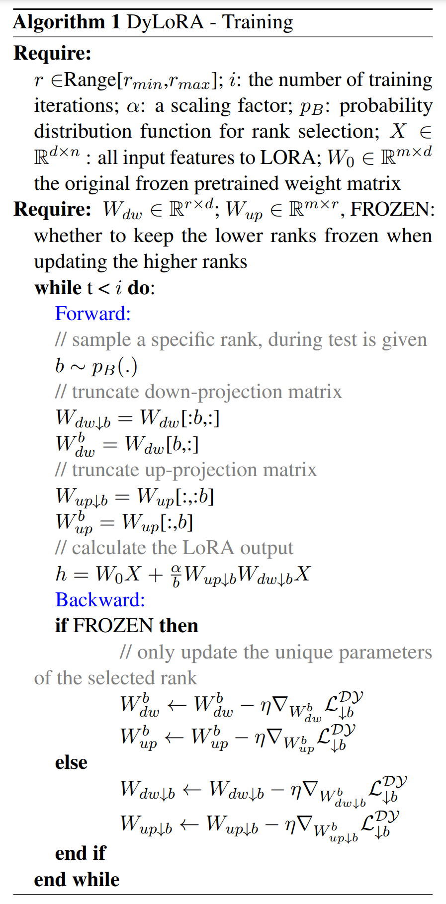
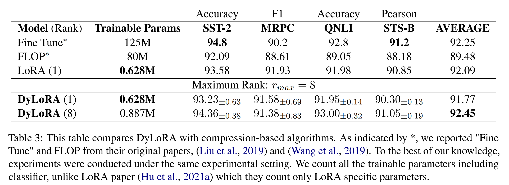
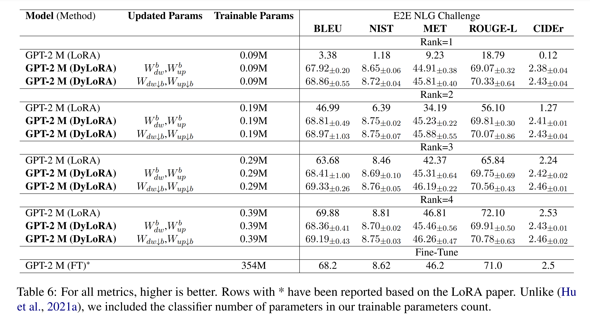
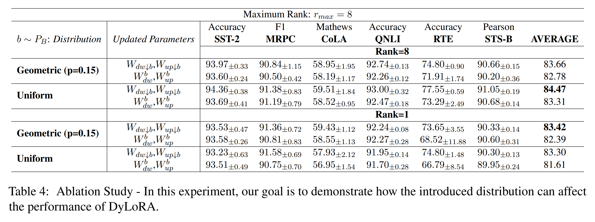

논문 및 이미지 출처 : <https://aclanthology.org/2023.eacl-main.239.pdf>

# Abstract

Pre-trained Models (PMs)의 크기가 점점 커짐에 따라, 이를 fine-tuning 비용이 많이 들고 자원을 많이 소모하게 되었다. 이를 해결하기 위해, low-rank adapters (LoRA)는 모델의 주요 pre-trained weights 를 고정시키고, learnable truncated SVD modules(일명 LoRA blocks)을 모델에 도입한다. 

LoRA blocks 는 parameter-efficient 이지만, 두 가지 주요 문제점이 있다. 

1. 이러한 blocks 의 크기는 고정되어 있으며, training 후에는 변경할 수 없다(e.g., LoRA blocks 의 rank 를 변경해야 할 경우, scratch training).
2. 이들의 rank 를 최적화하는 데는 많은 탐색과 노력이 필요하다. 

이 연구에서는 이러한 두 가지 문제를 함께 해결하기 위해 dynamic low-rank adaptation(DyLoRA) 기법을 도입한다. 

- DyLoRA 방법은 single rank 대신 다양한 rank 에 대해 LoRA blocks 를 훈련시키며, training 중에 adapter modules 로 학습한 representation 을 rank 에 따라 정렬한다.
- 저자는 RoBERTa 와 GPT 와 같은 다양한 크기의 PMs 을 사용하여, NLU (GLUE)와 NLG(E2E, DART, WebNLG)에서 저자의 솔루션을 평가한다. 
- 결과 DyLoRA 를 사용해 search-free models 를 LoRA 보다 최소 4x ~ 7x 더 빠르게 훈련할 수 있으며, 성능 저하가 거의 없음을 보여준다.
- 또한, 저자의 모델은 LoRA 보다 훨씬 더 넓은 범위의 rank 에서 일관되게 좋은 성능을 발휘할 수 있다.

# 1. Introduction

pre-training/fine-tuning 은 NLP 해결하는 데 있어 인기 있는 패러다임이 되었다. 이는 CV 에서도 마찬가지이다. 

최근 PMs 과 pre-trained vision-language models 는 크게 발전했다. 이러한 PMs 의 크기가 점점 커짐에 따라, 이를 downstream tasks 에 fine-tuning 하는 것이 더 비용이 많이 들게 되었다. 

게다가, model 의 parameters 수가 labeled data 수에 비례하여 증가함에 따라, fine-tuning 과정에서 overfitting 에 더 취약해질 것이다. 

해결책은 두 가지로 나뉜다: 첫째, model compression; 둘째, Parameter-Efficient Tuning (PET). 

1. Transformer-based model 을 위한 다양한 model compression 이 존재하는데, matrix factorization, pruining, quantization, 그리고 knowledge distillation 등이 있다. 
2. low-rank adapters 및 prompt-based methods 같은 다양한 종류의 PET 기법도 존재한다. 

최근 model compression 은 문헌에서 잘 확립되어 왔으나, 이를 LLM 에 적용하는 것은 매우 비용이 많이 들 수 있다. 

왜냐하면 compression 기법은 일반적으로 원래의 large model 을 training (또는 fine-tuning)해야 하기 때문이다. 

- 한 예로 knowledge distillation 로, 이는 large teacher model 을 fine-tuning 하거나 student model 을 pre-training 하는 데 의존한다. 
- 게다가, compression 기법을 사용하면 모델 성능이 저하되는 경우가 많다. 
- PET 는 압축 방법의 대안이 될 수 있으며, 특히 large pre-trained model 의 전체 용량을 lightweight training efforts 로 사용하고자 할 때(e.g., language model 을 서비스로 사용하는 시나리오) 유용하다. 
- PET 기법 중에서는 low-rank adapters 가 많은 주목을 받고 있는데, 이는 prompt tuning 기법과 달리, low-rank adapters 는 sequence length 를 늘리지 않고, 더 빠르게 훈련되며, 더 나은 성능을 보이기 때문이다. 

비록 Adapter, Compacter, LoRA 같은 여러 low-rank adaptation 기법들이 존재하지만, 이들 모두 두 가지 주요 공통 문제를 가지고 있다: 

1. 그들의 rank size 를 선택하는 방법이 명확하지 않다(이들의 성능은 이 rank 선택에 매우 민감); 
2. 이들의 training 은 정적(static)이다. 이는 특정 rank size 에 기반한 low-rank model 이 훈련되면, 다른 rank value 에서는 제대로 작동하지 않는다는 의미이다(즉, 다른 rank value 마다 별도의 모델을 훈련해야 한다). 

이 논문에서는 이러한 두 가지 문제를 해결하기 위해 dynamic low-rank adapters (DyLoRA)을 제안한다. 

- generality 을 잃지 않고, 저자는 LoRA 에 초점을 맞추어 single rank 대신 다양한 rank 에 대해 LoRA blocks 를 훈련시키고, training 중에 다른 rank 에서 학습된 representation 을 sorting. 
- 저자의 모델은 더 유연할 뿐만 아니라, trainign time 을 추가하지 않고도 훨씬 더 넓은 rank 범위에서 LoRA 보다 더 우수한 성능을 발휘할 수 있다. 
- 또한, DyLoRA 는 rank search 를 위한 extra training 이 필요하지 않다. 

저자의 기여를 다음과 같이 요약할 수 있다:

- **Dynamic LoRA**: LoRA 에 DyLoRA 을 개발하여, 추가 비용 없이 inference 시에 동적으로 작동할 수 있게 만들었다.
- **Search-free LoRA**: 성능에서 미미한 타협을 감수함으로써, LoRA 의 optimal rank 를 선택하는 비용이 많이 드는 search process 을 피할 수 있음을 입증하였다.

# 2. Related Work

자연어 이해(NLU)와 같은 classification tasks 에서는 PLMs 이 low intrinsic dimension 을 가지고 있다. 이 관찰은 PET 을 위한 low-rank adapters 를 사용하는 동기를 부여한다. 

문헌에서 여러 low-rank adapters 가 제안되었으며, 대표적으로 LoRA, Adapter, Compacter, Parallel Adapter(PA)이 있다. 

- LoRA 는 key, value attention matrix 에 parallel non-linearity low-rank up/down-projection transformation
  - LoRA 의 장점은 training 후 adapter module 이 모델의 original weight matrix 에 통합될 수 있어 inference time 을 매우 효율적으로 만들 수 있다는 점이다.
- Adapter 도 low-rank up/down-projection transformation 을 가지며 intermediate non-linearity 를 포함한다. 
  - Adapter module 은 feed forward 와 직렬로 적용되며, 이는 모델의 inference time 을 증가시킬 수 있다. 
- PA 는 FFN block  과 parallel 로 적용될 수 있는 더 빠른 Adapter 버전이다. 
- Compacter 는 Kronecker products 의 합을 사용하여 각 up/down projection matrix 를 재구성하는 메모리 효율적인 Adapter 버전이다. 

이 모든 low-rank adapters 는 두 가지 주요 문제를 겪는다: 1) optimal rank 를 찾기 위해서는 많은 시간과 노력이 필요한 search process 이 필요하다; 2) tuned adapter module 은 특정 rank 에 대해서만 잘 작동한다.

문헌에서는 DynaBERT 과 GradMax 같은 dynamic network 에 대한 몇 가지 시도가 있었지만, low-rank adapters 및 network 의 dynamic tuning 및 search process 를 제거하는 문제는 여전히 열려 있다. 

- DRONE 은 data-aware low-rank model compression 기술을 제안하지만, 이는  search process 을 제거하지 못하며, 또한 동적이지 않다. 
- DynaBERT 는 network 의 width 및 depth 를 dynamic tuning 을 위해 two-stage 를 도입하지만, DynaBERT 는 subnetwork training 을 위한 과제에 fine-tuned teacher model 이 필요하므로 PET 기법에는 적합하지 않다. 
- GradMax 는 trained neural 을 변경하지 않고 network neural 을 점진적으로 추가하는 기술이지만, GradMax 가 low-rank adapters 에서 rank search 문제를 해결하는 데 어떻게 활용될 수 있는지는 명확하지 않다. 
- [Structured pruning of large language models.] 은 Factorized Low-rank Pruning (FLOP)이라는 structed pruning 을 제안한다. 
  - FLOP 는 network 의 weight matrix 를 rank-1 components 의 합으로 분해하며, 이를 training 중 regularizing 하여 sparsity 를 확보한다. 
  - FLOP 는 main model 을 압축하는 데 목표를 두고 있으며, lower-rank representation 에서 good rank 를 찾는 데 사용할 수 있더라도, final low-rank model 은 동적이지 않다(i.e. LoRA 와 마찬가지로 one rank 에 대해서만 잘 훈련되며, 다른 rank 에서는 그렇지 않다). 

이 논문에서는 single-rank adapter 를 한 번에 훈련하는 대신, multiple-rank 에 대해 동시에 low-rank module 을 훈련시키는 새로운 방법론을 제안한다(training cost 를 변경하지 않으면서). 

_Nested Dropout_ 의 아이디어에 영감을 받아, 새로운 방식으로 low-rank adapters module 의 bottleneck 에서 representation 을 정렬하는 방법을 모색한다. 

# 3 Background

## 3.1 Nested Dropout

dropout 에 영감을 받은 Nested Dropout 은 auto-encoder 를 훈련할 때 representation 에 순서를 부여하는 것을 목표로 하는 stochastic regularization 기법이다. 

Nested Dropout 은 training 시 순서를 선호하는 implicit bias (dropout 에는 없음)를 추가한다. 

- 예로, dropout 에서는 network 의 어떤 nodes 나 units 을 무작위로 제거할 수 있지만, Nested Dropout 에서는 $k^{th}$ unit 을 무작위로 선택하면 1 to $k$ index 를 가진 모든 units 를 유지하고, $k$ 보다 큰 index 를 가진 unit 들을 제거한다. 
- 따라서 Nested Dropout 은 더 중요한 정보를 더 낮은 index 에 수용하도록 한다.

Nested Dropout 의 표기법을 따라, 

- Nested Dropout 은 $N$ training examples $\{y_i\}_{i=1}^N \in Y$, $Y \subset \mathbb{R}^D$ 를 그들의 대응하는 representation $\{x_i\}_{i=1}^N \in X$, $X \subset \mathbb{R}^K$ 에 mapping 하는 function $f_{\theta}: Y \rightarrow X$ 와, 
- 이러한 representation 을 복원하기 위해 또 다른 function $g_{\psi}: X \rightarrow Y$ 를 사용해 inputs 를 복원하는 auto-encoder mapping 을 가정한다. 
- reconstruction loss 는 다음과 같이 정의될 수 있다:

$$
\begin{equation}
    C(\theta, \psi) = \sum_{i=1}^{N} ||y_i - g_{\psi}(f_{\theta}(y_i))||^2.
\end{equation}
$$

- 이때, representation vector $x$에서 일부 unit 을 무작위로 제거하고자 한다면, pre-defined categorical distribution $p_B(.)$ 로부터 $b \in \{1, 2, ..., K\}$ 의 random variable $b \sim p_B(.)$ 를 sampling 하고, function $f_{\theta}$ 와 $g_{\psi}$ 를 1 to $b$ 까지의 index 를 유지하고, $b+1$ to $K$ 까지의 index 를 제거하도록 잘라낼 수 있다. 
- vector $x$ 의 $b$-truncated version 을 $x_{\downarrow b}$ 라고 하고, function $f_{\theta}$ 와 $g_{\psi}$ 의 $b$-truncated version 을 각각 $f_{\theta \downarrow b}$ 와 $g_{\psi \downarrow b}$ 라고 정의하자. 
- 이 경우 reconstruction loss 는 $b$-truncated model 에 대해 다음과 같이 재정의된다:

$$
\begin{equation}
    \begin{aligned}
        &C(\theta, \psi) = \mathbb{E}_{p_B}[C_{\downarrow b}(\theta, \psi)] = \sum_{b=1}^{K} p_B(b) C_{\downarrow b}(\theta, \psi) \\
        &\text{where} \\
        &C_{\downarrow b}(\theta, \psi) = \sum_{i=1}^{N} ||y_i - g_{\psi \downarrow b}(f_{\theta \downarrow b}(y_i))||^2.
    \end{aligned}
\end{equation}
$$

- final stage 에서 이 model parameters 를 다음 optimization problem 을 얻을 수 있다.

$$
\begin{equation}
    (\theta^*, \psi^*) = \argmin_{\theta, \psi} C(\theta, \psi).
\end{equation}
$$

- 본 논문에서 제안한 작업은 Nested Dropout 에서 제안된 odering information 를 도입한 것에서 영감을 받았지만, 다음과 같은 여러 측면에서 차별화된다:

1. Nested Dropout 은 vector representation 에 ordering information 을 추가하는 데 사용되지만, 저자는 single rank 대신 multiple rank 에 걸쳐 작동할 수 있도록 low-rank matrix decomposition 에 ordering information 를 추가한다.
2. 저자의 훈련 알고리즘은 distribution function $p_B(.)$ 의 선택에서 Nested Dropout 과 다르며, Nested Dropout 에서 사용된 linear summation loss 과 비교해 각 truncated matrix 에 대해 더 효율적인 individual loss 를 제안한다. 
   - Nested Dropout 의 원래 제안은 mixed truncated examples 로 batch 를 사용하는 것이었다. 저자는 효율성을 높이고 suboptimal 문제를 해결하기 위해 entire batch 에서 fix truncation 을 제안한다.

## 3.2 LoRA: Low-rank Adapters

LoRA 에선 PLMs 의 일부 dense layer weights 에 parallel 로 low-rank adapters module 을 추가한다. fine-tuning process 에서 original pre-trained weights 는 frezzing 되며, 대신 LoRA module 이 업데이트된다. 

- 예로, network 에서 $W_0 \in \mathbb{R}^{m \times d}$ 가 pre-trained weight matrix 라 가정하고, LoRA module $\Delta W = W_{up}W_{dw}$ 가 이에 추가되었다고 하자. 
  - $W_{up} \in \mathbb{R}^{m \times r}$, $W_{dw} \in \mathbb{R}^{r \times d}$
  - $r \ll \min(m, d)$
- 이 경우, 해당 layer 의 output 은 다음과 같이 계산될 수 있다.

$$
\begin{equation}
    h = W_0x + \Delta W x = W_0x + \frac{\alpha}{r} W_{up} W_{dw} x.
\end{equation}
$$

- $W_{up}$ matrix 는 zero matrix 로 초기화
- $W_{dw}$ matrix 은 평균이 0 인 Gaussian distribution 으로 초기화
- $\alpha$ 는 constant scale hyper-parameter
- LoRA 에서 rank $r$는 각 task 에 대해 튜닝해야 하는 hyper-parameter 이다. 
- 또한, LoRA 는 특정 $r$ value 에 대해서만 작동하는 static low-rank adapters 이다.

### 4 Our Method: DyLoRA

generality 을 잃지 않고, 잘 알려진 low-rank adapters 기술 중 하나인 LoRA 를 기반으로 설명한다. 

- 각 LoRA module 에는 up-projection ($W_{up} \in \mathbb{R}^{m \times r}$) 과 down-projection ($W_{dw} \in \mathbb{R}^{r \times d}$) matrix 가 있다.
- 여기서, $r \in Range[r_{min}, r_{max}]$ 범위에서 LoRA module 이 작동하도록 훈련하고자 한다고 가정하자. 
  - $r_{min}$과 $r_{max}$는 new hyper-parameter 로 간주될 수 있다. 
- LoRA module 이 single rank 가 아닌 multiple rank 에서 작동하도록 하려면 rank 를 증가시키거나 감소시키는 것이 모델 성능에 큰 영향을 미치지 않도록 해야 한다.
- 이러한 동작을 구현하는 한 가지 방법은 LoRA module 의 training process 에서 different ranks 의 information content 를 sorting 하는 것이다. 
- 이와 관련하여, 각 training step 에서 $b \sim p_B(.)$, $b \in \{r_{min}, r_{min} + 1, ..., r_{max}\}$ 를 pre-defined categorical distribution 에서 sampling 하고, 이에 따라 $W_{dw}$ 및 $W_{up}$ matrix 를 tuncate 한다.

$$
\begin{equation}
    \begin{aligned}
        W_{dw \downarrow b} = W_{dw}[1 : b, :] \\
        W_{up \downarrow b} = W_{up}[:, 1 : b]
    \end{aligned}
\end{equation}
$$

- $W_{dw \downarrow b}$ 및 $W_{up \downarrow b}$ 는 각각 $W_{dw}$ 와 $W_{up}$ 의 $b$-truncated version 이다. (Fig. 1)
- 또한, $W_{dw}^b$ 는 $W_{dw}$ 의 $b^{th}$ row 에 해당하며, $W_{up}^b$ 는 $W_{up}$ 의 $b^{th}$ column 에 해당한다.

$$
\begin{equation}
    \begin{aligned}
        W_{dw}^b = W_{dw}[b, :] \\
        W_{up}^b = W_{up}[:, b]
    \end{aligned}
\end{equation}
$$

- training 중 truncated LoRA module 의 forward pass 는 다음과 같이 계산:

$$
\begin{equation}
    h = W_0x + \frac{\alpha}{b} W_{up \downarrow b}W_{dw \downarrow b}x.
\end{equation}
$$

- 단순화를 위해 network 에 one LoRA module 만 있다고 가정하자 (Eq. 7 처럼). 
- 먼저, $W_{dw}$ 와 $W_{up}$ 을 tunable parameters 로 하는 network $f(x; W_{dw}, W_{up})$ 의 regular static loss function $\mathcal{L}^S$ 를 $N$ input-output pairs $(x, y) = (x_i, y_i)_{i=1}^N$ 에 대해 고려하자:

$$
\begin{equation}
    \min_{W_{dw}, W_{up}} \mathcal{L}^S(x, y; W_{dw}, W_{up}) ≜ \sum_{i=1}^{N} l(f(x_i; W_{dw}, W_{up}), y_i).
\end{equation}
$$

- $l(f, y)$ : network predictions 와 target labels 간의 차이를 측정하는 loss function
- 그런 다음, $b$-truncated process 를 고려하여 network 를 동적으로 만드는 loss function 을 확장할 수 있다. 
- dynamic loss function $\mathcal{L}^{\mathcal{D} \mathcal{Y}}$ 는 다음과 같이 정의된다.

$$
\begin{equation}
    \mathcal{L}^{\mathcal{D} \mathcal{Y}}_{\downarrow b} = \sum_{i=1}^{N} l(f(x_i; W_{dw \downarrow b}, W_{up \downarrow b}), y_i).
\end{equation}
$$

- loss function 은 nested dropout loss 와 중요한 차이가 있어 더 효율적이다. 
- nested dropout loss 는 다음과 같은 형태이다: $\sum_{b=r_{min}}^{r_{max}} p_B(b) \mathcal{L}^{\mathcal{D} \mathcal{Y}}_{\downarrow b}(x, y; W_{dw \downarrow b}, W_{up \downarrow b})$
  - 이는 entire possible ranks range 를 학산해야 하므로 계산 비용이 많이 든다. 
- 이 계산 제한을 극복하기 위해, 각 time step 에서 target rank 에 대해 개별적으로 model parameters 를 최적화하는 방식으로 대체한다. 
- nested dropout 과의 또 다른 차이점은 parameter update phase 에서 new mode (이른바 _frozen_)를 hyper-parameter 로 추가하는 것이다. 
  - 이는 truncation phase 의 sampled $b^{th}$ row 및 column 만 업데이트하도록 제안한다(i.e., 이전 time step 에서 학습한 parameter 가 잊히지 않도록 single row 또는 column 만 한 번에 업데이트한다). 
  - 성능에 약간의 비용이 들지만, 이 접근법은 알고리즘의 효율성을 더욱 높일 수 있다.

$$
\begin{equation}
    \begin{aligned}
        W_{dw}^b \leftarrow W_{dw}^b - \eta \nabla_{W_{dw}^b} L_{DY \downarrow b} \\
        W_{up}^b \leftarrow W_{up}^b - \eta \nabla_{W_{up}^b} L_{DY \downarrow b}
    \end{aligned}
\end{equation}
$$

Tab. 4 에서 "b" 만 업데이트하는 것과 1 to $b$ 까지의 row 와 column 을 업데이트하는 것의 영향을 보여준다. 

이는 algorithm 1 에 설명되어 있다.

# 5. Experiments

기존 LoRA 방법과의 공정한 비교를 위해, 실험 설정을 LoRA 논문과 유사하게 유지하고자 했다. 

따라서, 마찬가지로 GLUE 벤치마크(dev set)에 대한 LoRA 및 DyLoRA 실험의 backbone 으로는 pre-trained RoBERTa base model 을 선택했고, NLG 에는 GPT-Medium 을 사용했다. 

실험에서 hyper-parameter tuning 을 사용하지 않았으며, validation epochs 를 탐색하지 않았고, 모델 성능을 향상시키기 위해 MLNI trick (pre-trained weights 대신 MLNI checkpoint 사용)도 사용하지 않았다. 

총 200 이상의 실험을 수행했으며, 1600 이상의 모델을 평가했다.

## 5.1 Baselines

- **Fine Tune**: DyLoRA 성능에 대한 상대적인 상한선을 보여주기 위해, all parameters 를 fine-tuning. trainable parameters 수가 많긴 하지만, 이는 high-rank 모델의 성능을 더 잘 이해하는 데 도움이 될 수 있다.
- **LoRA**: DyLoRA 의 baselines 로 original LoRA 모델을 사용했으며, 해당 논문의 제시된 tuned hyper-parameter 를 적용했다. 그 결과, 대부분의 실험이 LoRA 에 유리한 방식으로 진행되었다.
- **FLOP**: Factorized Low Rank Pruning (FLOP)은 유연성 덕분에 all matrix multiplication 를 적용될 수 있으며, 따라서 저자의 문제에서 탐색을 피할 수 있다. 그러나 이 baseline 은 DyLoRA 의 동적 특성이 부족하다. 이를 통해 regularization-based method 의 성능과 장단점을 보여주고자 했다.

## 5.2 LoRA ranks selection problem

LoRA 알고리즘의 rank 결정의 명확한 지침이 없다. 

LoRA 논문에서는 rank 에 따라 모델의 성능이 크게 달라진다는 점이 명확히 드러나며, 명확한 경향을 나타내지 않는다. 

GLUE 벤치마크에서도 동일한 문제가 관찰된다. 

이론적으로는 성능이 가장 좋은 rank 가 항상 high rank 라고 주장할 수 있다. 그러나 high rank 는 adaptation process 에  additional parameters 를 도입하게 되며, 이는 바람직하지 않을 수 있다. 

- Tab. 1 에서 보여주듯이, 가장 효과적인 rank 는 task 마다 다르다. 
- 예로, MRPC 결과를 기준으로 보면, 성능이 가장 low rank 는 16 인 반면, 성능이 가장 높은 rank 는 32이다. 
- 이는 SST-2와는 다르며, SST-2에서는 rank 1 이 성능이 가장 낮고 rank 8 이 가장 효과적인 rank 였다. 
- dataset size, hyper-parameter 선택, 하드웨어 구성 및 optimization 같은 여러 요인이 이러한 차이에 기여할 수 있다.

## 5.3 dynamic low-rank adaptation

서로 다른 구성의 다양한 디바이스에 신경망을 배포하려고 한다고 가정해보자. 

high rank 를 사용하면 parameters 수가 많아지기 때문에 매우 민감한 디바이스에서는 문제가 될 수 있다. 

따라서 여러 구성을 가진 multiple models 를 훈련시키거나 optimal rank 를 찾아야 한다.

 이는 LoRA 설정에서도 각 task 와 디바이스에 맞는 optimal rank 를 찾아야 하기 때문에 상당한 비용이 든다. 그러나 DyLoRA 를 사용하면 task 당 one model 만 훈련시키면 되며, inference 시점에서 적응적이기 때문에 필요에 따라 배포할 수 있다. 
 

- Tab. 2 에서 DyLoRA 의 동적 특성을 보여준다. 
- 공정한 비교를 위해, 이 표에 나와 있는 모든 LoRA 와 DyLoRA 모델은 동일한 모델 크기를 가지며, 동일한 코드와 평가 과정을 사용했고, 모든 모델이 동일한 정도로 훈련되었다. 
- LoRA 의 경우, low rank 에서 inference 수행 시 성능이 저하된다. 이는 training 시에 rank 8로만 모델이 훈련되었기 때문이다. 
- 반면 DyLoRA 는 low rank 에서도 높은 성능을 유지하면서 rank 8에서도 LoRA 와 경쟁할 만한 성능을 보인다.

## 5.4 Search-free low rank adaptation

앞서 언급했듯이 특정 rank 를 선택하는 과정은 비용이 많이 든다. 

표 5에서는 LoRA 와 DyLoRA 에 대한 이러한 검색 비용을 보여주는 실험을 제시한다. 

- 예로, entire rank 범위를 단순하게 검색하고자 한다면 (e.g., 실험에서 64), proper rank 를 결정하기 위해 64 distinct model 을 훈련하고 평가해야 한다. 
- entire rank space 를 검색할 경우 비용은 더욱 증가한다. 
- uniform search 를 할 경우 이 비용이 줄어들지만(실험에서 7x) 여전히 제안된 방법보다 더 비싸다. 
- 따라서 LoRA(Search)에서는 ranks=1,2,4,8,16,32,64 에 대한 실험을 수행했으며, 가장 좋은 결과를 보고했다. 
- 결과는 제안된 방법이 훨씬 낮은 비용으로 경쟁력 있는 성능을 발휘한다는 것을 보여준다.

## 5.5 Robustness of DyLoRA

Tab. 2 에서 설명했듯이, DyLoRA 는 무작위성에 대해 상당히 robust 하며 안정적인 convergence 덕에 일관되게 좋은 결과를 낼 수 있다.

## 5.6 Regularization and Pruning

search problem 을 피하는 대체 방법으로 regularization/Pruning 을 사용하여 weight matrix 의 intrinsic rank 를 결정하는 방법이 있다. 

이 방법을 통해 original matrix parameters 수를 줄일 수 있지만, inference 중에 dynamic model 을 가지지는 못한다. 

이러한 방법과 DyLoRA 의 차이를 설명하기 위해, 이러한 모델 중 하나인 FLOP 의 성능을 Tab. 3 에 보고했다. 

- FLOP 는 low-rank factorization 를 활용하여 원래 weight matrix 을 나타내는 new matrix 를 생성한다. 
- 따라서 total parameters 는 줄어들지만, DyLoRA 와 비교할 만한 성능을 달성하려면 더 많은 trainable parameters 가 필요하다.

## 5.7  Generative Tasks

이 실험에서는 E2E NLG Challenge, DART 및 WebNLG 같은 다양한 NLG 에서 모델의 성능을 평가했다. 

- NLG task 는 NLU task 와 유사한 패턴을 보여주며, DyLoRA 가 LoRA 에 비해 더 넓은 rank 범위에서 잘 작동함을 보여준다.

## 5.8 Ablation Study

DyLoRA 의 두 가지 design choices 영향을 조사한다: 1) 저자의 기술에서 new distribution $P_B$ hyper-parameter 의 영향; 2) $W_{dw}^b$ 및 $W_{up}^b$ parameter 를 entire $W_{dw↓b}$ 및 $W_{up↓b}$ 대신 업데이트하는 것의 영향;

- distribution $P_B$ 는 training process 에서 다양한 rank 의 상대적 중요성을 변화시킨다. 
- DyLoRA 의 성능에 대한 선택된 distribution 의 영향을 조사하기 위해, geometric distribution 와 uniform distribution 두 가지를 사용했다. 

- Tab. 4 에서 보듯이, geometric distribution 는 low rank 를 최적화하기 위한 훨씬 더 나은 방법을 제공하며, training 중 low rank 에 더 많은 주의를 기울이기 때문이다. 
- uniform distribution 는 all rank 에서 더 나은 성능을 제공한다. 
- geometric distribution 가 필요한 hyper-parameter 를 추가하는 것을 피하기 위해 대부분의 실험에서는 uniform distribution 를 사용했다. 
- 또한 rank $b$ 의 최적화가 low rank(1 to $b-1$)의 성능에 부정적인 영향을 미치지 않으면서 합리적인 성능을 유지할 수 있음을 보여준다. 
  - 이는 low rank 와 겹치지 않는 rank $r$ 에 해당하는 unique parameters 만 업데이트함으로써 달성할 수 있다.

- Tab. 7 에서는 저자의 individual loss (Eq. 9)을 nested dropout original function 과 동일한 설정에서 사용하는 결과를 보여준다. 
- 제안된 objective function 은 효과적이고 효율적이다. 
- 또한, multiple rank 가 관련된 경우 summation loss 은 확장성이 없다는 점도 중요하다. 

# 6 Conclusion

이 논문에서는 rank selection 과 dynamic  으로 만드는 문제를 해결하기 위해 low-rank adapters 에 대한 솔루션 DyLoRA 를 제안했다. 

DyLoRA 가 여러 번 re-training 을 요구하지 않고도 rank 를 선택할 수 있으며, inference 에서 LoRA 를 동적으로 만들 수 있음을 보여주었다. 

그 결과, 많은 실제 시나리오에서 optimal rank 를 찾는 과정을 피할 수 있다. 

DyLoRA 의 성능이 LoRA 와 비슷하면서도 추가적인 시간과 노력을 들이지 않고도 더 넓은 rank 범위를 지원할 수 있음을 입증했다.

### 한계

LoRA 에 따르면, scalar 의 적절한 선택은 결과를 개선할 수 있다. 

optimal selection 이 무엇인지 결정하려면 추가 조사가 필요하다. 

uniform distribution 가 specific geometric distribution 만큼 효과적일 수 있음을 입증했음에도 불구하고, 다른 downstream tasks 에 대한 다양한 distribution 의 영향을 평가하려면 추가 조사가 필요하다. 

이 논문에서 보여준 바와 같이, 저자의 알고리즘은 넓은 rank 범위에서 작동하지만 특정 범위를 선택하는 것이 어떤 영향을 미치는지 이해하려면 추가 연구가 필요하다.