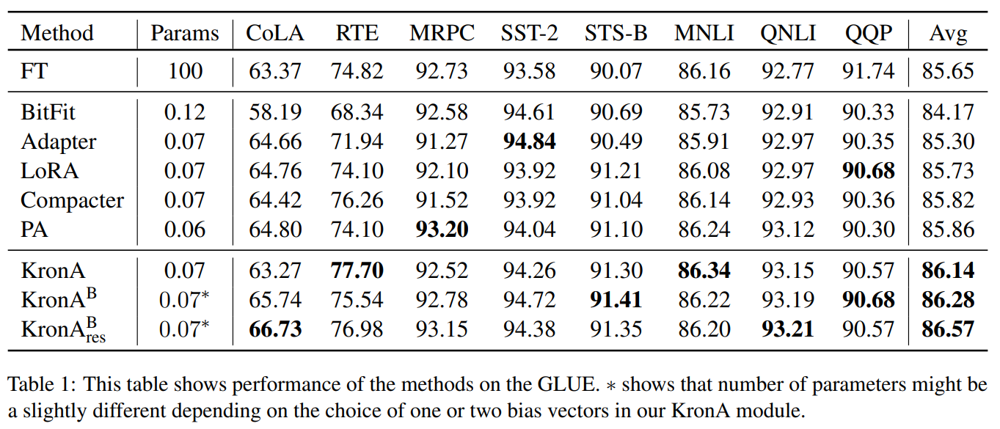

논문 및 이미지 출처 : <https://arxiv.org/pdf/2212.10650>

# Abstract

Pre-trained Language Model (PLM)을 특정 downstream task 에 fine-tuning 하는 것은 NLP 에서 널리 알려진 패러다임이다. 하지만 PLM 크기가 계속 커짐에 따라 여러 downstream task 에 대해 전체 모델을 학습하는 것은 비용이 많이 들고 자원 소모가 크다. 이를 해결하기 위해 최근 Parameter Efficient Tuning (PET) 기법들이 fine-tuning 의 효율성을 높이기 위해 제안되었다. 

PET 기법 중 인기 있는 카테고리 중 하나는 low-rank adaptation 으로, learnable truncated SVD module 을 original model 에 순차적 또는 병렬로 삽입하는 방식이다. 하지만 low-rank decomposition 은 representation 한계가 있다는 단점이 있다.

이 논문에서는 low-rank representation 대신 Kronecker product 를 사용해 이 문제를 해결한다. 

Transformer-based PLM 의 efficient fine-tuning 을 위해 Kronecker product-based adapter module 인 **KronA** 를 제안한다. 

제안한 방법을 T5 에 적용하고 GLUE benchmark 에서 실험하여 Kronecker-based module 을 사용하는 것이 기존 PET 기법들보다 우수한 성능을 보일 수 있음을 증명했다.

# 1. Introduction

large PLM 은 다양한 NLP task 에서 SOTA 성능을 달성하기 위한 backbone 으로 사용되고 있다. 이런 large PLMs 는 in-context learning 이나 model parameters 를 fine-tuning 하여 downstream application 에 적응한다.  

**In-context learning** 은 모든 training examples 를 각 sample 에 대해 처리해야 하므로 inference 시 상당한 메모리 및 계산 오버헤드가 발생한다. 반면, 모델 전체를 fine-tuning 하는 full fine-tuning (FT) 방식은 less inference latency 와 향상된 정확도를 제공한다. 

하지만 모델 크기가 커질수록 all parameters 를 fine-tuning 하는 것은 점점 더 어려워진다. 또한 각 downstream application 마다 entire model checkpoint 를 저장해야 하므로, 배포 및 task 간 전환이 매우 비효율적이다.

이 문제를 해결하기 위해 PLM 의 대부분 (또는 전부) parameters 를 고정시키고, 소수의 learnable parameters 만 삽입하는 방식들이 제안되었다. 이는 fine-tuning 에 필요한 메모리 및 계산 요구 사항을 크게 줄인다. 또한 전체 모델을 저장하는 대신, 각 task 에 대해 조정된 소수의 parameters 만 저장하면 된다. 이런 기법들을 **Parameter Efficient Tuning (PET)** 이라고 한다.

- PET 기법 중 soft prompts 는 learnable parameters 를 각 layer 의 input 에 추가한다. 
  - 하지만 embedding layer 의 길이가 증가하면서 inference 시 상당한 계산 오버헤드가 발생한다.  
- 다른 PET 기법으로는 Transformer 구조 내부에 adapter module 을 삽입하는 방식이 있다. 
  - Adapter 는 up projection 과 down projection 으로 구성된 low-rank module 이다. 
  - 하지만 이런 접근 방식은 inference 시 계산량과 latency 을 증가시켜, latency 이 중요한 시나리오에서는 비효율적이다.
- 이를 해결하기 위해 **Low Rank Adaptation (LoRA)** 가 개발되었다. 
  - LoRA 는 extra low-rank module 을 learnable parameters 로 사용한다. 
  - Fine-tuning 후, task-specific parameters 를 PLM weights 와 병합할 수 있어, inference 시 latency  및 에너지 요구 사항을 그대로 유지할 수 있다. 
  - 하지만 LoRA 는 보통 full fine-tuning 에 비해 정확도가 떨어지는 경우가 있다. 이는 low-rank 구조가 task-specific updates 를 위해 강한 가정을 내리기 때문이다.

**Kronecker product decomposition** 은 low-rank assumption 에 의존하지 않는 또 다른 행렬 분해 방식이다. 이 강력한 분해 방식은 model compression 에 사용될 때 low-rank factorization 을 능가하는 성능을 보여주었으며, Transformer-based language model 의 compression 에도 성공적으로 활용되었다.

Kronecker decomposition 의 성공에 영감을 받아, 이 논문에서는 LoRA 의 low-rank decomposition 을 Kronecker product decomposition 으로 대체하여 **KronA (Kronecker Adapter)** 를 개발했다. 이 간단한 수정은 inference latency 을 증가시키지 않으면서 정확도를 향상시킬 수 있음을 보였다.  

- inference latency 이 증가해도 괜찮은 애플리케이션을 위해, Feed-Forward Network (FFN) module 과 병렬로 사용되는 KronA 의 변형인 **KronA$^\text{B}$** 를 제안한다. 
  - KronA$^\text{B}$ 는 GLUE benchmark 에서 full fine-tuning 을 크게 초과하는 성능을 보여준다. 
- 마지막으로, learnable residual connection 을 KronA$^\text{B}$ 에 추가한 **KronA$^\text{B}_\text{res}$** 를 개발하여 더욱 향상된 결과를 얻었다.

---

### Contributions

1. **KronA 제안**: inference latency 이 중요한 시나리오에 적합하도록 weight matrices 와 병렬로 삽입 가능한 <ins>Kron</ins>ecker <ins>A</ins>dapter module 을 제안.  
2. **KronA$^\text{B}$ 및 KronA$^\text{B}_\text{res}$ 제안**: FFN module 과 병렬로 KronA 를 사용하는 KronA$^\text{B}$ 를 제안하고, learnable residual connection 을 추가한 KronA$^\text{B}_\text{res}$ 를 통해 정확도를 더욱 향상
3. **성능 평가 제공**: GLUE benchmark 에서 기존 SOTA 기법들과의 비교를 통해 GLUE score, training time, inference latency 측면에서 성능 평가를 제공

# 2. Related Works and Baselines

- Zaken et al 은 PLM 의 weights 를 고정하고, downstream task 에 fine-tuning 하기 위해 bias 또는 subset biases 만 조정하는 방법을 제안했다. 
  - 이 기법은 **BitFit** 이라고 하며, parameter-efficient 및 fast 지만, SOTA 방법들에 비해 좋은 성능을 보이지는 못한다.  
- Houlsby et al 은 PET 방법으로 **Adapters** 를 제안했다. 
  - 이 방법에서는 PLM 의 전체 파라미터를 고정하고, **Adapters** 라 불리는 learnable module 을 FFN 이나 attention block 뒤에 순차적으로 삽입한다. 
  - 각 Adapter module 은 down projection, non-linear function, up projection, 그리고 residual connection 으로 구성된다.  
- He et al 은 **Parallel-Adapter (PA)** 를 개발하여 Adapter 를 능가하는 성능을 달성했다. 
  - PA 는 original PLM module 과 병렬로 삽입되며, scaling factor 를 포함하지만, PLM module 자체에 residual connection 이 있기 때문에 PA 내부의 residual connection 은 제거되었다 (Figure 1.c). 
  - 같은 연구에서 He et al 은 PET 방법들에 대한 통합된 관점을 제시하고, Prefix tuning 과 PA 같은 기술들을 결합했다.
- Karimi Mahabadi et al 은 PET 을 위해 수정된 sequential adapter 버전인 **Compacter** 를 사용했다. 
  - Compacter 에서는 여러 Kronecker factor 의 Kronecker product 를 추가하여 module 의 weight matrix 를 재구성한다. 
  - 각 Kronecker factor 는 two sub-factors 의 matrix multiplication 결과로 구성된다. 
  - Compacter 는 GLUE 에서 좋은 성능을 보였지만, 학습 및 inference 단계 모두에서 속도가 느리다는 단점이 있다.  
- **LoRA** 는 PLM 의 다양한 부분에 down projection 과 up projection 으로 구성된 learnable module 을 삽입한다.
  - LoRA module 은 query 및 value matrix 와 병렬로 삽입하는 것을 권장한다. 
  - training 중 PLM weights 를 고정하고 LoRA module 만 tuning 한다. 
  - inference 시에는 LoRA weights 가 original PLM weight matrices 에 병합된다. 
  - 따라서 Adapter 나 Compacter 와 달리, LoRA 는 inference time 을 증가시키지 않는다.

LoRA, PA, 그리고 Compacter 는 Pfeiffer-Adapter, AdapterDrop, VGLM-Adapter, Prompt tuning, Prefix tuning 같은 기존의 많은 baseline 을 능가했다. 

따라서 본 연구에서는 이 방법들을 baseline 으로 사용하여 비교를 진행했다.

# 3 Methodology

## 3.1 Kronecker Product

Kronecker product 는 two input matrices $A \in \mathbb{R}^{a_1 \times a_2}$ 와 $B \in \mathbb{R}^{b_1 \times b_2}$ 에 대해 수행되는 연산으로, 결과는 block matrix $W \in \mathbb{R}^{w_1 \times w_2}$ 이다. 

- $W$ 의 각 block $(i, j)$ 는 $a_{i,j}$ 와 matrix $B$ 의 multiplication 과 같다. 
- resulting matrix shape 는 $(w_1, w_2)$ 이며, $w_1 = a_1 \times b_1$, $w_2 = a_2 \times b_2$ 이다. 

Kronecker product 의 동작 방식은 아래의 Eq. (1) 과 같다.

$$
\begin{equation}
    W = A \otimes B =
    \begin{bmatrix}
    a_{11}B & \cdots & a_{1n}B \\
    \vdots & \ddots & \vdots \\
    a_{m1}B & \cdots & a_{mn}B
    \end{bmatrix}
\end{equation}
$$

Kronecker product 는 PET 에 적합한 몇 가지 흥미로운 특징을 가지고 있다. 

1. 이는 rank deficient 하지 않다. 
   - 즉, LoRA 나 Adapter 에서 사용되는 low-rank down-projection 과 달리, Kronecker product decomposition 은 input matrix 의 rank 를 유지한다.
2. $W$ 를 재구성하는 대신 Eq. (2)를 사용하여 Kronecker module 의 출력을 계산하면 FLOPS 수를 줄이고 속도를 높일 수 있다. 
   - 더 구체적으로, embedding dimension $d_h$ 인 input vector $x \in \mathbb{R}^{d_h}$ 를 $A$ 와 $B$ 의 Kronecker product 와 곱할 때, 아래와 같이 계산할 수 있다.

$$
\begin{equation}
    (A \otimes B)x = \gamma \big( B \eta_{b_2 \times a_2}(x) A^\top \big)
\end{equation}
$$

- $A^\top$ : $A$ transpose
- $\eta_{m \times n}(y)$ : vector $y \in \mathbb{R}^{mn}$ 를 크기가 $m \times n$ matrix 로 재구성하는 연산
- $\gamma(Y)$ : matrix $Y \in \mathbb{R}^{m \times n}$ 를 column을 쌓아 vector 로 변환하는 연산

## 3.2 KronA

Figure 1.a 는 LoRA module 의 구조를 보여준다. 

- $A$ : down projection
- $B$ : up projection
- 이 module 을 KronA 로 수정하기 위해 normal product 를 Kronecker product 로 대체
  - 또한, LoRA projection 은 Kronecker factors 로 대체 (Figure 1.b)
- KronA 가 적용되었을 때 출력이 생성되는 방식은 Eq. (3) 으로 나타냄
  - $A_k$ 와 $B_k$ 는 LoRA projection 을 대체한 Kronecker factors
- LoRA 와 마찬가지로, KronA 는 fixed scale factor $s$ 를 사용하며 이는 hyperparameter

$$
\begin{equation}
    Y = XW + sX[A_k \otimes B_k]
\end{equation}
$$

KronA module 은 fine-tuning 단계 동안 PLM weight matrices 와 병렬로 적용된다. 

fine-tuning 이후, Kronecker factors 는 곱해지고 scale 이 적용된 뒤, original PLM weight matrices 에 병합된다 (Eq. (4)). 

따라서 LoRA 와 마찬가지로 KronA 는 inference time 을 증가시키지 않는다.

$$
\begin{equation}
    W_{\text{tuned}} = W + s[A_k \otimes B_k]
\end{equation}
$$

Kronecker factors 의 초기화와 관련해서, two factors 모두를 Normal distribution 으로 초기화하는 것보다 한 factor 를 0 으로 초기화하는 것이 결과를 크게 개선한다는 것을 관찰했다.

## 3.3 KronA$^\text{B}$와 KronA$^\text{B}_\text{res}$

PA 방법의 유망한 성능에 영감을 받아, KronA module 을 FFN block 과 병렬로 사용할 경우를 조사했고, 이를 **KronA$^\text{B}$** 라고 명명.

- B superscript 는 이 module 이 PLM weight matrices 에 적용되는 KronA 와 달리 PLM block 에 적용된다는 것을 의미한다.
- PA 방법과 마찬가지로, FFN block 의 non-linearity 때문에 KronA module 을 fine-tuning 후 PLM 에 병합할 수 없다. 
- 따라서 inference time 과 계산량이 증가한다. 

FFN block 과 병렬로 KronA$^\text{B}$ 가 작동하는 방식은 아래 Eq. (5)와 같다.

$$
\begin{equation}
    Y = \text{FFN}(X) + sX[A_k \otimes B_k]
\end{equation}
$$

- representation 을 더욱 향상시키기 위해, KronA$^\text{B}$ module 내부에 scaled residual connection 을 추가하여 **KronA$^\text{B}_\text{res}$** 를 개발했다.
- Residual connection 의 scale $s_{\text{res}}$ 은 초기값 1로 설정되며 fine-tuning 과정에서 tuning 된다.

FFN 과 병렬로 KronA$^\text{B}_\text{res}$ 가 작동하는 방식은 Eq. (6)으로 나타낸다. 

Figure 1.c 와 1.d 는 각각 PA module 과 KronA$^\text{B}_\text{res}$ 의 구조를 보여준다.

$$
\begin{equation}
    Y = \text{FFN}(X) + sX[A_k \otimes B_k] + s_{\text{res}}X
\end{equation}
$$

# 4 Results and Discussion

## 4.1 GLUE Results

Table 1 은 제안한 방법들이 T5 모델에 적용되었을 때, 다른 baseline 과 비교한 GLUE scores 를 보여준다. 

- KronA 와 KronA$^\text{B}$ 는 각각 LoRA 와 PA 와 같은 low-rank 기법을 능가한다. 
- 또한 제안된 모든 module 은 평균적으로나 대부분의 GLUE task 에서 SOTA baseline 을 능가한다. 
- 특히 extra learnable residual connection 을 활용한 KronA$^\text{B}_\text{res}$ 는 상당히 더 나은 결과를 달성한다.

## 4.2 Inference and Training Time

Table 2 는 논의된 방법들의 normalized inference latency 을 보여준다. 

- KronA, LoRA, FT, BitFit 는 inference 단계에서 모델에 extra parameters 나 계산을 더하지 않으므로 inference latency 이 증가하지 않는다. 
  - KronA$^\text{B}$ 는 Compacter 및 Adapter 보다 훨씬 빠르지만, PA 보다 느리다. 
    - 이는 예상대로 Kronecker product 계산이 normal matrix multiplication 보다 느리기 때문이다. 
    - 또한 learnable residual connection 을 추가하면 latency 이 더 증가한다.
- KronA module 과 그 variants 는 정확도에서 상당한 개선을 제공하지만, LoRA, PA, Adapter 와 같은 low-rank counterparts 에 비해 training time 이 약간 더 걸린다. 
- 그러나 이 training time 증가는 크지 않으며, KronA module 은 여전히 FT 보다 훨씬 빠르다.

# 5 Conclusion and Future Directions

이 연구에서는 SOTA PET 기법의 low-rank projection 을 Kronecker product 로 대체하여 Kronecker-based adapter 를 개발했다. 

training 및 inference time 을 비교하는 것 외에도, 제안된 adapter 를 T5 모델에 대해 GLUE benchmark 에 적용하여 SOTA baseline 을 능가하는 성능을 보였다.