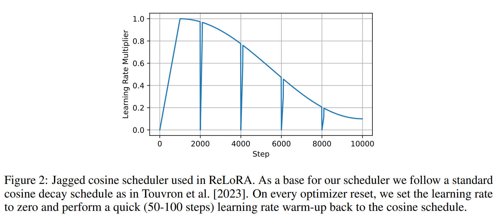
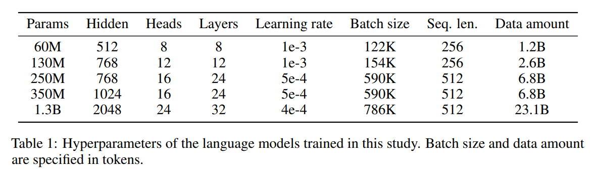
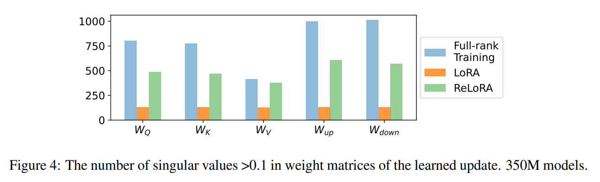
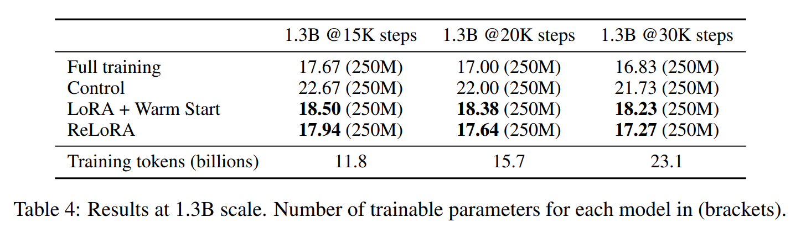
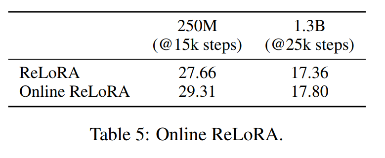
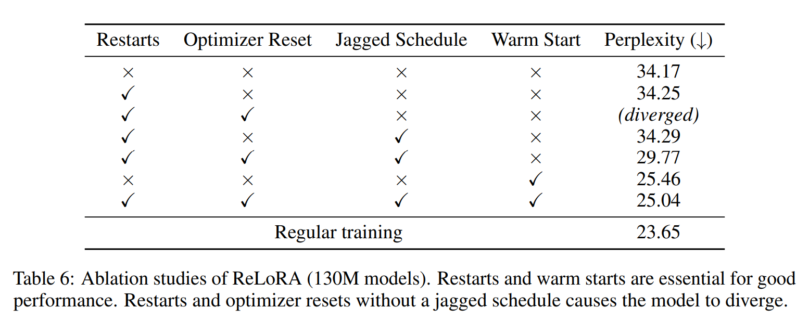

논문 및 이미지 출처 : <https://arxiv.org/pdf/2307.05695>

# Abstract

scaling 의 지배적인 효과로 인해 billions parameters 를 가진 large networks 가 등장했지만, overparameterized models 를 훈련할 필요성은 여전히 명확히 이해되지 않았으며, training costs 는 기하급수적으로 증가하고 있다. 

이 논문에서는 large networks 를 훈련하는 접근법으로 parameter-efficient training 기법을 탐구한다. 

저자는 ReLoRA 라는 새로운 방법을 소개하는데, 이는 low-rank update 를 활용하여 high-rank networks 를 훈련한다. 

- ReLoRA 를 최대 1.3B parameters 를 가진 transformer language models 에 적용하여, 일반적인 neural network training 과 비교 가능한 성능을 보여준다. 
- ReLoRA 는 per GPU 최대 5.5GB 의 RAM 을 절약하고, model size 및 hardware setting 에 따라 training speed 를 9-40% 까지 향상시킨다. 
- 저자의 연구 결과는 large-scale pre-training 에서 parameter-efficient 기법의 잠재력을 보여준다.

# 1. Introduction

최근 점점 더 overparameterized networks 를 훈련하거나 "stack more layers" 접근법을 채택하는 경향이 지배적이었다.

large networks 의 정의는 100M parameters 를 가진 모델에서 100B parameters 를 가진 모델로 진화했으며, 이러한 network training 에 관련된 computational costs 는 대부분의 연구 그룹에 부담스러운 수준이 되었다. 

그럼에도 불구하고, training examples 보다 훨씬 더 많은 파라미터를 가진 모델을 훈련해야 하는 필요성은 이론적으로 잘 이해되지 않고 있다.

---

대안적인 scaling 접근법으로는 more compute-efficient scaling optima, retrieval-augmented models , 그리고 smaller models 을 오래 training 하는 간단한 접근법 등이 있다. 

그러나 이들 접근법은 overparameterized models 이 필요한 이유에 대한 이해를 높이지 않으며, 이러한 models 의 training 을 민주화하는 데도 기여하지 않는다. 

- 예로, RETRO 를 훈련하려면 복잡한 training settings 와 trillions tokens 를 빠르게 검색할 수 있는 인프라가 필요하며, LLaMA-7B 를 훈련하는 데는 여전히 수백 개의 GPU 가 필요하다.
- 반면, zero-redundancy optimizer, 16-bit training, 8-bit inference, 그리고 parameter-efficient fine-tuning (PEFT) 같은 접근법은 large models 를 보다 접근 가능하게 만드는 데 중요한 역할을 해왔다. 
- 특히, PEFT 방법은 billion-scale language models 나 diffusion models 를 consumer hardware 에서 fine-tuning 할 수 있게 했다. 
- 이는 이러한 접근법이 pre-training 에도 도움이 될 수 있는지에 대한 질문을 제기한다.

#### Contribution

본 연구에서는 ReLoRA 를 소개하며, 이는 training process 에서 집합적으로 high-rank network 를 훈련하기 위해 individially low-rank update 를 사용한다. 

- 저자는 ReLoRA 가 high-rank update 를 수행하며 일반적인 neural network training 과 유사한 성능을 달성함을 실증적으로 보여준다. 
- ReLoRA 의 구성 요소는 neural network 의 initial full-rank training, LoRA training, restarts, jagged learning rate schedule, partial optimizer resets 등이 있다. 
- 저자는 ReLoRA 를 최대 1.3B parameters 를 가진 transformer language models 에서 평가한다. 
- 마지막으로, ReLoRA 의 효율성은 model size 가 커질수록 증가하여, multi-billiton parameter networks 의 efficient training 을 위한 실용적인 옵션임을 확인했다.

# 2. Method

저자는 two matrices sum 의 rank 에 관심이 있다: $rank(A + B) \leq rank(A) + rank(B)$. 

matrix $A$ 에 대해 $rank(A) < dim(A)$ 일 때, $B$ 가 존재하며 $rank(B) < dim(B)$ 이면서 이들의 합이 $A$ 나 $B$ 보다 higher rank 를 가진다.

저자는 이 성질을 활용하여 flexible parameter-efficient training 방법을 만들고자 한다. 

- 먼저 LoRA 로 시작하는데, 이는 low-rank update 아이디어를 기반으로 한 parameter-efficient fine-tuning 방법이다. 
- LoRA 는 $W \in \mathbb{R}^{m \times n}$ 에 의한 reparameterized any linear 에 적용될 수 있다.
- 구체적으로, LoRA 는 weight upodate $\delta W$ 를 Eq. (1) 같이 rank-$r$ 의 곱인 $W_AW_B$ 로 분해한다. 
  - $s \in \mathbb{R}$ 은 보통 $1/r$ 로 설정된 fixed scaling factor

$$
\begin{equation}
    \begin{aligned}
        &\delta W = sW_AW_B \\
        &W_A \in \mathbb{R}^{in \times r}, \, W_B \in \mathbb{R}^{r \times out}
    \end{aligned}
\end{equation}
$$

- 실제로, LoRA 는 training 후에 original parameter 에 병합될 수 있는 new trainable parameter $W_A$ 와 $W_B$ 를 추가하는 방식으로 구현된다.
- 따라서 이러한 구현은 rank $r = \max_{W_A, W_B}$ 인 $rank(W_AW_B)$ 에 의해 제한된다.

만약 LoRA 를 training 도중에 restart 할 수 있다면, 즉 training 중에 $W_A$ 와 $W_B$ 를 병합하고 이들의 값을 초기화할 수 있다면, update 의 total rank 를 증가시킬 수 있다. 

이를 여러 번 수행하면 neural network update 는 다음과 같이 된다:

$$
\begin{equation}
    \Delta W = \sum_{t=0}^{T_1} \delta W_t + \sum_{t=T_1}^{T_2} \delta W_t + \cdots + \sum_{t=T_{N-1}}^{T_N} \delta W_t = sW_{A}^{1}W_{B}^{1} + sW_{A}^{2}W_{B}^{2} + \cdots + sW_{A}^{N}W_{B}^{N}
\end{equation}
$$

- restart 를 구현하는 것은 실제로 간단하지 않으며 optimization procedure 에 몇 가지 수정이 필요하다. 
- 일반적인 SGD 과 달리, Adam update 는 주로 previous steps 에서 축적된 gradient 의 first 및 second moments 에 의해 guide 된다. 
- 실제로, Adam 의 $\beta_1$과 $\beta_2$ 는 보통 very high $0.9 - 0.999$ 사이에 있다. 
  - 이는 merge-and-reinit 후에도 $W_A^2$ 의 old gradient moments 를 계속 사용하면 $W_A^1$ 와 동일한 directions 로 이끌어져 동일한 subspace 을 optimizing 하게 됨을 의미한다.

이를 해결하기 위해 ReLoRA 는 merge-and-reinit 중에서 optimizer state 를 partial reset 하기 위해 magnitude pruning 을 수행한다. 

또한 optimizer reset 후 loss 가 diverging 되지 않도록 learning rate 를 0 으로 설정한 후 subsequent warm-up 을 진행한다 (Fig. 2). 

저자의 ablation study (Tab. 6)는 이러한 수정이 LoRA 보다 성능을 향상시키는 데 필요함을 보여준다.

마지막으로, 실험에서 scratch (random initialization) training 으로 시작하는 경우에는 ReLoRA 를 "warm start" 하기 위해 short full-rank training 이 필요하다는 것을 발견했다. 

이 모든 것을 통해 ReLoRA 는 한 번에 small parameters 만 훈련하면서도, 특히 large transformer network 에서 full-rank training 에 필적하는 성능을 달성할 수 있다. 

이는 Algorithm 1 에 설명된다.

#### Enhancing computational efficiency

다른 low-rank training 기법과 달리, ReLoRA 는 original network 의 frozen weights 를 유지하고 new trainable parameter 를 추가하는 LoRA 접근 방식을 따른다. 

처음에는 이 방식이 계산적으로 비효율적이라고 생각할 수 있지만, frozen parameters 와 trainable parameter 의 차별화는 parameter-efficient fine-tuning 에서 중요한 역할을 한다.

- trainable parameter 의 수를 줄임으로써, ReLoRA 는 optimizer state 에 소비되는 메모리를 크게 줄이고 larger batch siezs 를 사용할 수 있게 하여 hardware efficiency 를 극대화한다. 
- 또한, 이는 large-scale distributed training 종종 제한 요인이 되는 bandwidth 요구사항을 줄인다. 
- 게다가, frozen parameters 는 restart 간에 업데이트되지 않으므로 low-precision 로 양자화된 형식으로 유지할 수 있어, 메모리와 계산 부담을 더욱 줄일 수 있다.

#### Locally Low-Rank Training: Intuition

여러 연구에 따르면 neural network training 은 완전히 low-rank 이거나, 초기에는 high-rank 을 가지고 이후에 low-rank 으로 전환되는 여러 단계를 가진다고 한다. 

- 예로, Aghajanyan et al. [2021] 은 모델이 커지거나 더 오랜 시간 동안 pre-training 될수록 downstream task 를 학습하는 데 필요한 업데이트의 rank 가 감소함을 보여준다. 
- Arora et al. [2019] 는 SGD 가 low-rank 솔루션을 향한 bias 를 가진다고 발견했다. 
- training 초기의 Lottery Tickets 의 존재도 이 가설을 부분적으로 뒷받침하는데, Lottery Tickets network 를 훈련하는 것이 일반적인 training process 의 low-rank 근사로 볼 수 있기 때문이다.

저자의 empirical analysis (Sec. 4)은 pre-trained neural network 이 long trajectory 에 걸쳐 high-rank update 를 나타냄을 보여준다 (Fig. 4). 

그러나 충분히 small trajectory 에서는 training 이 low-rank update 로 효과적으로 근사될 수 있다. 

위 결과를 바탕으로, 저자는 neural network training 이 locally low-rank 이라는 가설을 세우며, 이는 ReLoRA 의 직접적인 동기가 된다.

# 3. Experiments

ReLoRA 의 효과를 평가하기 위해 C4 dataset 에서 다양한 model size (60M, 130M, 250M, 350M, 1.3B)를 사용하여 transformer language models 를 훈련시켰다. 

모든 실험에서 data repetition 없이 (single epoch) Chinchilla Scaling Laws 를 기반으로 compute-optimal data amount 를 사용하여 훈련을 진행했다.

#### Architecture and training hyperparameters

저자의 architecture 는 transformer 에 기반하며 LLaMA 와 유사하다. 

- 저자는 pre-normalization, RMSNorm, SwiGLU activation function, $\frac{8}{3}$h fully-connected hidden state 크기, 그리고 rotary embeddings 을 사용했다. 
- pre-training token 수는 Chinchilla scaling laws 을 기반으로 선택했다. 
- architecture 와 training hyper-parameters 는 Tab. 1에 제시되어 있다.
- all LoRA 와 ReLoRA 실험에서 rank $r = 128$ 을 사용했다. 
  - 이는 초기 실험에서 이 값이 best perplexity/memory trade-off 을 제공했기 때문 
- ReLoRA hyper-parameters 선택에 대한 추가 권장 사항은 부록 A 에서 찾을 수 있다.
- 1.3B model 에 대한 rank choice 는 Sec 4.1 에 다룬다.
- 저자는 all floating point operations 에 대해 bfloat 16 를 사용하며, 효과적인 attention computation 을 위해 FlashAttention 을 사용한다.

#### ReLoRA and baselines setup

- ReLoRA 는 all attention 및 fully connected network parameters 를 대체하며, embeddings 및 normalization layers 은 full-rank 로 업데이트된다.
- ReLoRA-wrapped models 는 full-rank training 보다 fewer trainable parameters 이기 때문에, ReLoRA 와 동일한 trainable parameters 를 가진 full-rank 인 Control baseline 을 포함한다.
- ReLoRA 는 5,000 update steps 에서 full-rank training 의 checkpoint 로 초기화되며, 이후 5,000 steps 마다 3 번 reset 하여 총 20K steps 에 도달한다.
  - 각 reset 후, optimization state 의 99% 가 magnitude 에 기반하여 prune 되며, 다음 100 iterations 동안 loss 는 warm up 된다 
- ReLoRA parameters 는 LoRA best 를 따르며, $A$-matrix 에 Kaiming initialization 을 사용하고, $B$-matrix 는 0 으로 초기화된다.

#### Scaling up to 1.3B

- 130M 및 350M model size 에서 초기 결과를 바탕으로, 1.3B parameter language model 을 훈련하기 위해 ReLoRA 를 적용.
- baseline 으로, 23B tokens 를 scratch learning 으로 1.3B model 을 pre-training. 
- 2K, 5K 및 10K checkpoint 에서 시작하여 여러 ReLoRA 실행을 수행. 
- 대부분의 실험에서 $r = 128$ 을 계속 사용했으며, 추가 실험에서는 rank 128 과 512(hidden size 2048) 간의 차이가 거의 없음을 보여준다. (Sec. 4.1)

# 4. Results

#### Parameter-efficient pre-training

Tab.2 및 Fig. 1 에서 결과를 보여준다.

- ReLoRA 는 LoRA training 을 초월하며, 제안된 수정의 효과를 입증한다.

- 더욱이, ReLoRA 는 upstream 및 downstream task 에서 full-rank training 과 유사한 성능을 달

#### High-rank training through low-rank updates

- ReLoRA 가 LoRA 보다 higher rank update 를 수행하는지 여부를 결정하기 위해 learned update 의 singular value spectrum 을 warm-start weights 를 plot
- 구체적으로, warm-start weights 와 ReLoRA, LoRA, 그리고 full-rank trained models 의 final weights 간의 차이를 비교하는 추가 실험을 수행했다. 
- Fig. 3 은 $\Delta W_Q$, $\Delta W_K$, $\Delta W_V$, $\Delta W_{down}$ 의 singular values 에 대한 LoRA 와 ReLoRA 의 중요한 질적 차이를 보여준다.
- 대부분의 LoRA singular values 은 0 이며 (Fig. 4), 눈에 띄는 high values (1.5 이상)을 가진 값들이 있는 반면, ReLoRA 는 0.1과 1.0 사이에 higher distribution 를 보이며, 이는 full-rank training 과 유사하다.

- 추가적으로, LoRA, ReLoRA, 그리고 full-rank training 에서 0.1 미만의 singular values 수를 계산했다. 
- 저자의 결과 (Fig. 4)는 ReLoRA 가 LoRA 에 비해 0 에 가까운 singular values 의 수가 훨씬 적고, full-rank training 에 더 가깝다는 것을 보여준다.
- 이 관찰은 high-rank update 의 중요성을 강조하며, ReLoRA 가 multiple low-rank update 를 수행함으로써 실제로 high-rank update 를 달성한다는 것을 입증한다.

## 4.1 Scaling up to 1.3B

- 이 model size 에서의 best run 은 10K step warm start (total update steps  33%) 후에 시작. 
- ReLoRA 는 rank $r = 128$, learning rate $5e-4$, 100 steps 의 learning rate warmup, 50 steps 의 restart warmup 으로 훈련되었다.

- ReLoRA 는 training 내내 LoRA 를 명확히 능가하며, 두 방법 간의 격차는 15K steps 에서 0.56 에서 시작해 30K steps 에서 0.96 으로 증가했다.
- training 이 끝날 때, ReLoRA 는 17.24 의 perplexity 에 도달했으며, 이는 full-rank training 보다 0.44 높다. 

#### Varying ReLoRA rank

이 실험에서는 rank $r = 128$ 이 이 크기의 model (hidden size 2048)에도 여전히 적용 가능한지, 또는 증가시킬 필요가 있는지 평가하고자 했다.

이를 위해, 30K steps 중 5K steps 의 early checkpoint 를 warm start  사용했다. 

이 시점에서 loss changes 가 빠르기 때문에 training 역학에서의 차이가 더욱 분명하게 드러난다. 

이 모델들은 추가로 10K iterations 로 훈련되었다. 

예상치 못하게도, rank 128(perplexity 19.16) 과 rank 512(perplexity 19.00) 간의 차이가 거의 없음을 발견했다.

#### Negative results: Online ReLoRA

직관적으로, 더 자주 ReLoRA 를 reset 하면 더 나은 성능을 보일 것으로 예상되는데, 이는 higher rank update 를 학습할 수 있기 때문이다. 

일반적으로, 각 ReLoRA reset 시에 optimizer reset 과 learning rate scheduler 의 rewarmup 를 수행한다(Sec 1). 

- 그러나 실험 결과, very high ReLoRA reset rate 는 오히려 성능을 저하시켰다. 
- Online ReLoRA 는 이 문제를 해결하는데, LoRA parameters 를 매우 자주(e.g., 매 100 iterations) 병합하면서도 optimizer reset rate 는 2-5K iterations 마다 유지한다. 
- 예상치 못하게도, 250M 및 1.3B size 에서 Online ReLoRA 가 일반적인 ReLoRA 보다 성능이 더 나쁜 것으로 나타났다 (Tab. 5).

#### ReLoRA Training Speedup

ReLoRA training 에는 440 A100-hours 이 소요되었으며, 이는 full-rank training 에 비해 56 A100-hours 을 절약한 것이다. 

speedup 의 일부는 두 배 larger microbatch size 를 사용할 수 있었기 때문이다. 

- 동일한 microbatch size 로 훈련할 때, ReLoRA 는 RAM 소비를 27.8Gb 에서 22.3Gb 로 줄여 5.5Gb 의 GPU RAM 을 절약했다. 
- 8xA100 setting 에서 warm start 및 ReLoRA training time 을 결합했을 때, 1.3B-ReLoRA training 에는 86시간(wall clock)이 걸렸으며, 동일한 데이터 양으로 1.3B full-rank model 을 훈련하는 데 걸린 93.5 hours 에 비해 상대적인 speedup 이 9% 였다.

- 추가적으로, ReLoRA speedup 은 hardware 에 크게 의존하는 것으로 나타났다(Tab. 7). 
- ealry 2xRTX3090 에서의 실험에서는 speedup 이 42% 로 추정되었다. 
- 보다 실용적이지만 여전히 상대적으로 예산 친화적인 6xA6000 Ada setting 에서는 1B full-rank model training 에 152 hour wall-block training time 소요된 반면, ReLoRA model (33% warm start)에는 119 hours 가 소요되어 33 hours 를 절약하여 21% 의 상대적인 speedup 을 보였다. 
- 이러한 차이는 GPU 메모리 속도에 기인한다고 생각되며, ReLoRA 는 less trainable parameters 를 가지고 있어 low-bandwidth memory 를 더 효율적으로 활용할 수 있다.

## 4.2 Ablation studies

저자는 130M size model 을 사용하여 ReLoRA 의 4 crucial components (restart, jaged schedule, optimizer reset, warm start)에 대한 ablation studies 수행

결과는 Tab. 6 에 제시되었다.

#### LoRA

- components 없이 ReLoRA 는 LoRA 의 parameterized low-rank network 를 훈련하는 것과 사실상 동일하다. 
- 이 접근법은 매우 높은 perplexity 를 나타내며, 이는 simple matrix decomposition 이 full-rank training 과는 상당히 다른 training 역학을 가지고 있음을 시사한다.

#### Adding restarts and optimizer resets

- ReLoRA 에서 jaged schedule 과 optimizer reset 없이 수행하면 LoRA 와 유사한 성능을 보이는데, 이는 prior weights 와 동일한 subspace 로 newly initialized parameters 를 강제로 이동시켜 모델의 용량을 제한하기 때문이다.
- 그러나 ReLoRA 에서 simple optimizer reset 을 수행하면 모델이 발산하게 된다. 
- jaged schedule 은 훈련을 안정화하는 데 도움이 되며 mixture 에 긍정적인 영향을 미친다.
- 초기 실험에서 partial optimizer reset 과 jaged scheduler 의 combination 이 learning rate 를 scratch initialization 에 수백 steps 이 필요한 경우보다 더 빠르게 warm-up 할 수 있게 해준다는 것을 관찰했다.

#### Warm start

- warm start 는 가장 큰 개선을 보여주며 perplexity 를 거의 10 point 낮춘다. 
- warmup 이후의 training 이 loss 에 기여하는지를 조사하기 위해 warmed-up networks 의 perplexity 를 측정한 결과 27.03 으로 나타났다. 
- 이는 final ReLoRA 레시피를 제외한 all low-rank 방법을 능가하지만, 여전히 final network 와는 상당한 차이를 보인다. 
- 이는 early training 의 중요성을 보여주며, 이는 lottery ticket hypothesis 과 rewinding 의 개념과 유사하다. 
- 저자의 실험에서는 별도로 명시되지 않는 한 total training updates 의 약 1/4 동안 warm start 를 수행했다.

# 5. Related work

#### Scaling versus Efficiency 

overparameterization 및 neural network 의 trainability 및 generalization 사이의 관계는 [Zhang et al., 2017, Belkin et al., 2018, Frankle and Carbin, 2019, Nakkiran et al., 2019, Singh et al., 2021] 에서 광범위하게 연구되었지만, 여전히 미스터리로 남아 있다. 

또한, scaling lows 는 다양한 modality 에 걸쳐 network size 와 성능 사이에 단순하면서도 strong power-law dependence 가 있음을 보여준다. 

이 발견은 overparameterization 을 지지할 뿐만 아니라, 엄청나게 resource-intensive neural network training 을 장려한다. 

그럼에도 불구하고, Lottery Ticket Hypothesis 는 원칙적으로 overparameterization  최소화할 수 있음을 시사한다.

#### Parameter-efficient fine-tuning

Aghajanyan et al. [2021] 은 pre-training 이 fine-tuning 을 통해 new task 를 학습하는 데 필요한 network 변경 양을 줄인다는 사실을 발견했다. 

즉, larger networks 나 more data 로 pre-trained network 는 new task 학습하는 데 필요한 범위의 rank 측면에서 더 적은 수정이 필요하다. 

이는 parameter-efficient fine-tuning 방법의 성공을 설명하며 LoRA 와 Compacter 와 같은 low-rank fine-tuning 방법의 개발을 촉진했다.

#### Low-rank neural network training
 
Low-rank representation training 은 CNN compression, regularization, efficient training 의 맥락에서 탐구되었다. 

그러나 대부분의 방법들은 CNN 에만 특화되어 있거나, 확장성이 떨어지거나, millions parameters 의 large transformer 에선 평가되지 않았다. 

large transformer 는 efficient training 에서 큰 이점을 얻을 수 있다. 

transformer 는 low-rank internal dimensionality 와 representations 를 가지는 것으로 나타났지만, Bhojanapalli et al. [2020] 의 연구는 multi-head attention 에서 key 와 query projection 의 low-rank 가 transformer 의 성능을 저해한다는 것을 보여주었다. 

저자의 실험(Sec. 6) 또한 low-rank transformer 가 full-rank baseline 및 ReLoRA 에 비해 성능이 상당히 떨어진다는 것을 보여준다.

**6 결론**

이 논문에서는 parameter-efficient fine-tuning 방법을 large language models 의 pre-training 에 적용할 수 있음을 입증했다. 

먼저 low-rank matrix factorization (LoRA) 접근법의 한계를 검토하고, 이 방법이 high-performing transformer 모델을 효과적으로 훈련하는 데 어려움을 겪는다는 것을 관찰했다. 

이러한 문제를 해결하기 위해 ReLoRA 를 제안했으며, 이 방법은 rank of sum property 를 활용하여 multiple low-rank update 를 통해 high-rank network 를 훈련한다. 

ReLoRA 는 lottery ticket hypothesis 과 rewinding 개념과 유사하게, ReLoRA 로 전환하기 전에 full-rank training warm start 를 사용한다.

training 중 ReLoRA 는 주기적으로 parameter 를 network 의 main parameters 에 병합하고, optimizer reset 및 learning rate rewarmup 을 수행한다.

저자는 ReLoRA 가 large transformer model training 에서 LoRA 를 일관되게 능가한다는 것을 입증했다. 

가장 큰 실험에서는 8xA100 setting 에서 wall-clock time 을 9% 줄였으며, 더 저렴한 hardware 에서 larger speedup(20~40%) 을 달성했다. 

나아가, 저자의 결과는 ReLoRA 가 regular training 과 유사한 성능을 보여주어, large models training 의 효율성을 개선할 수 있는 유망한 후보임을 시사한다. 