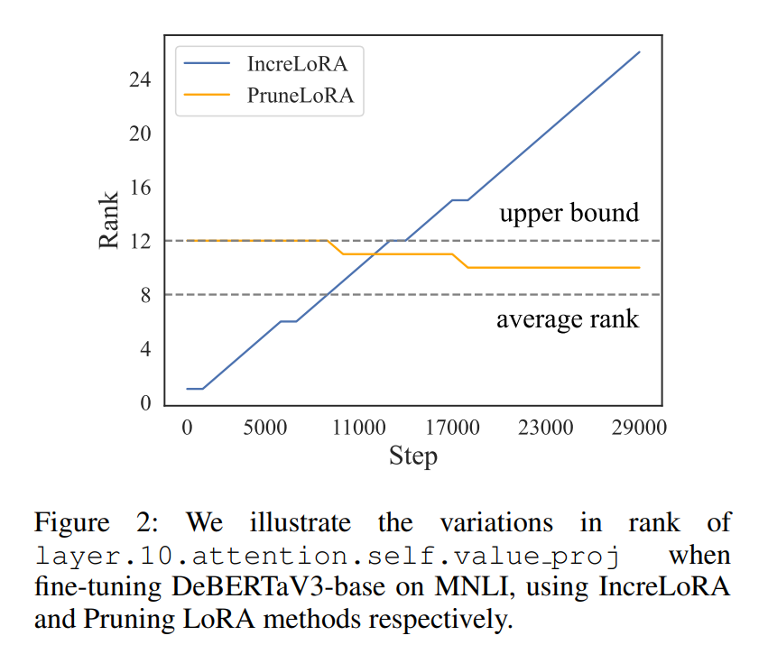
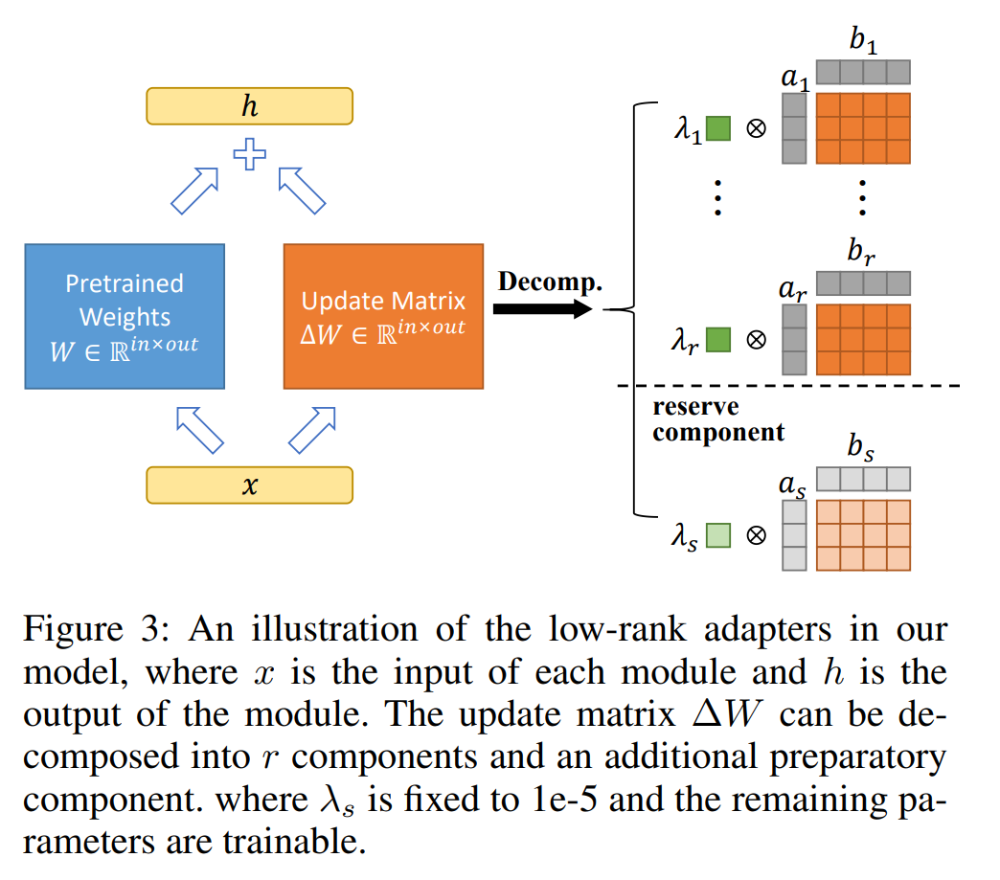
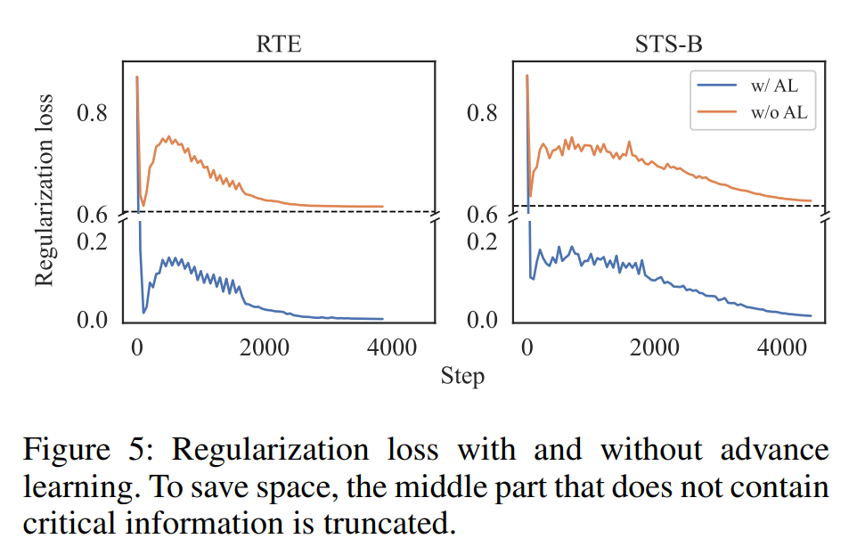
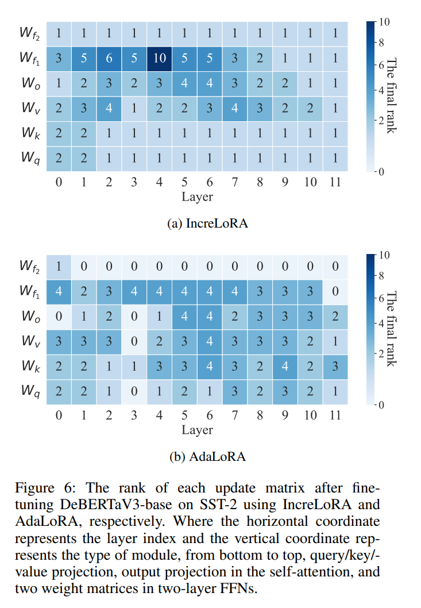

논문 및 이미지 출처 : <https://arxiv.org/pdf/2308.12043>

# Abstract

pre-trained language models(PLM)의 크기가 커짐에 따라, 모델의 all parameters 를 fine-tuning 하는 것은 비효율적이며, 특히 많은 수의 downstream task 가 있을 경우 training 및 storage cost 가 크게 증가한다. 

이를 위해 많은 parameter-efficient fine-tuning(PEFT) 방법이 제안되었는데, 그 중 Low-Rank Adaptation(LoRA)은 대표적인 방법으로, 각 target module 에 trainable low-rank decomposition matrices 을 삽입한다. 

그러나 LoRA 는 서로 다른 module 의 parameter importance 를 무시한다. 

이를 해결하기 위해 많은 연구들이 LoRA 의 parameters 를 pruning 하는 방법을 제안했다. 

하지만 제한된 훈련 조건에서는 pruned parameter matrices 의 rank upper bound 가 여전히 pre-defined value 에 의해 제한된다. 

따라서 저자는 각 module 의 importance scores 를 기반으로 training 중에 trainable parameters 를 점진적으로 추가하는 방법인 IncreLoRA 를 제안한다. 

- 이는 initial trainable parameters 수에 제한을 받지 않으며, pruning methods 와 달리 동일한 training overhead 에서 각 parameter matrices 에 higher rank upper bound 을 제공한다. 
- 저자는 GLUE 에서 광범위한 실험을 통해 IncreLoRA 의 효과를 입증하였다. 
- 결과는 IncreLoRA 가 특히 low-resource setting 에서 higher parameter efficiency 를 가지고 있으며, 기저 모델들을 크게 능가함을 보여준다.

# 1. Introduction

large-scale data 로 pre-trained model 을 다양한 downstream task 에 맞게 fine-tuning 하는 것이 가장 성공적인 훈련 패러다임 중 하나로 자리잡았다. 

하지만 BERT(110M∼340M), T5(60M∼11B), GPT-3(175B), LLaMA(7B∼65B) 같은 인기 있는 pre-trained model 의 크기가 증가하면서, GPU memory 한계로 인해 이러한 모델을 훈련하는 것이 어려워졌고, 각 downstream task 에 대해 모델의 full parameters 를 훈련하고 저장하는 것이 매우 비싸게 되었다.

parameter-efficient fine-tuning(PEFT)은 위의 문제에 대한 유망한 해결책이다. 

이는 모델의 subset parameters 만을 수정함으로써 full parameters 를 fine-tuning 한 것과 유사한 성능을 달성한다. 

그 광범위한 응용 가능성 덕에, 연구자들은 다양한 PEFT 를 제안해왔다. 

- 일부 방법은 original model 의 subset parameters 만 fine-tuning 하는 반면, 다른 방법은 new parameters 를 추가로 훈련하여 original model 에 추가한다.
- LoRA 는 대표적인 방법 중 하나로, two low-rank matrices 의 곱을 통해 original weight matrix 와 동일한 크기의 low-rank update matrix $\Delta W$ 를 시뮬레이션하고, fine-tuning 과정에서 two low-rank matrices 만 업데이트한다 (일반적으로 original matrix parameters 의 0.01% − 0.5% 에 해당하며, 이는 matrix rank 에 따라 다르다). 
- 그럼에도 불구하고 LoRA 의 fine-tuning 성능은 full parameters fine-tuning 성능에 접근하거나 이를 초과하는 것으로 나타났다.

---

- LoRA 는 간단한 구조 덕분에 다양한 task 에 도입되었지만, all update matrices 에 동일한 rank 를 설정하여 module 간의 차이를 무시한다. 
- 그러나 각 update matrix 에 다른 rank 를 할당하는 것이 동일한 총 trainable parameters 수에서 더 나은 fine-tuning 성능을 달성한다는 것이 입증되었다. 
- 이 방법은 LoRA 방식의 pruning 으로 인식될 수 있으며, 더 나은 성능을 달성하였지만, 각 LoRA module 의 rank 는 여전히 pruning 이전의 rank 에 의해 제한된다(여기서 module rank 는 실제로는 module 내에서 two low-rank matrices 의 곱으로 얻어진 update matrix 의 rank 를 의미하며, 이하에서는 두 용어를 혼용할 것이다). 

앞서 언급한 structed pruning methods 은 보통 initial average rank 를 final sate 의 1.5x 설정한다. 

예로, pruning 후 average rank 가 8 이라면, 각 module 의 initial rank 는 12 가 될 것이다. 

- Fig. 2 에서 알 수 있듯이, unimportant modules 의 rank 는 pruning 후 감소할 것이며 (최대 0 까지 감소하여 parameter update 가 없을 수 있다), important modules 의 rank 는 8 보다 클 가능성이 크지만, 여전히 rank 의 initial upper bound 12 를 초과할 수 없다. 
- pruning 후 각 module 이 higher rank upper bound 을 갖도록 하기 위해서는 각 module 에 higher initial rank 를 설정해야 하는데, 이는 model training cost 를 증가시키고 훈련을 안정시키기 위한 더 많은 반복이 필요하게 된다.

---

- 이러한 모순을 해결하기 위해 저자는 IncreLoRA 를 제안하는데, 이는 training process 에서 각 module 의 importance scores 를 기반으로 자동으로 rank 를 증가시키며, 동일한 training cost 에서 각 module 이 higher rank upper bound 을 갖게 한다. 
- subsequently added parameters 가 충분히 훈련되지 않는 문제를 방지하기 위해, 저자는 유리한 초기 상태를 가질 수 있도록 new pre-training 기법을 사용했으며, 이를 "advance learning" 이라고 부른다. 
- 또한, 이러한 parameters 에 independent learning rate curves 를 할당하여 training stability 를 보장한다. 

Fig. 1 에서 볼 수 있듯이, 실험 결과 IncreLoRA 가 특히 low-resource 상황에서 더 나은 성능을 달성했으며, higher parameter budget 을 가진 다른 방법들과 충분히 경쟁할 만한 성과를 보였다. 

본 논문의 기여는 다음과 같이 요약된다:

- 저자는 pruning methods 에 비해 lower training cost 와 higher rank upper bound 을 가진 IncreLoRA 를 제안한다. 이는 점진적으로 trainable parameters 를 할당하는 최초의 parameter-efficient fine-tuning 방법이다.
- 저자는 newly added parameters 가 better state 를 미리 찾을 수 있게 하는 new pre-training method 를 도입했으며, additional training time 을 소모하지 않으면서도 training stability 를 보장했다.
- 저자는 NLU 벤치마크에서 광범위한 실험을 수행했으며, 그 결과 도입한 모델의 효과가 입증되었다.

# 2. Related Work

## 2.1. Selective Method

Selective Method 는 original model 의 parameters 를 기반으로 모델을 선택하고 업데이트한다. 

network top layers 몇 개만 fine-tuning 하는 방법은 PEFT 의 초기 시도로 볼 수 있으며, 최근 제안된 많은 방법들은 specific model layers 또는 internal module 을 선택한다. 

- BitFit 은 model bias parameters 만 업데이트하며, 이는 trainable parameters 수를 극적으로 줄이지만, 이 무차별적인 접근 방식은 sub-optimal performance 에 도달한다.
- parameter selection 에서 trainable parameters 를 scoring function 에 기반하여 선택하는 Unstructured parameter fine-tuning 방법 은 더 완전한 해결책을 제공한다. 
- FishMask 는 모델에 따라 subdata 에서 multiple iterations 를 수행하고 parameter Fisher information 를 계산한 후, maximum Fisher information 을 가진 $k$ parameters 를 선택하여 업데이트하는 masking 을 구성한다. 
  - 그러나 기존 DNN 과 하드웨어는 이러한  unstructured sparse matrices 의 계산을 잘 지원하지 못하므로, training 중 memory usage 가 full parameters fine-tuning 과 유사하다.

## 2.2. Additive Method

Additive Method 는 full parameters fine-tuning 을 대체하여 prototype network 에 trainable additional parameters 를 추가하는 방식이다. 

- Adapter 는 original network 에 삽입되는 trainable mini module 로, 처음에는 multi-domain image classification 에 적용되었으며, 이후에는 Transformer 의 Attention 및 FNN layers 에 도입되었다.
  - 이 방법은 많은 variants 를 낳았다. 
- adapter 와 달리 LoRA 는 two low-rank matrices 의 곱으로 model weight matrix update 를 시뮬레이션하며, trained parameters 는 inference 단계에서 original network 의 weight 에 추가될 수 있어 additional inference overhead 를 발생시키지 않는다. 
- Prefix-Tuning 은 all layers 의 hidden states sequence 앞에 trainable parameters 를 추가하는 방식이다. 
- 유사한 접근법으로 Prompt-Tuning 이 있다. 
- LST 는 original network 의 hidden state 를 small trainable ladder side network 로 전달하여 backbone network 의 gradient backpropagation 을 필요로 하지 않아 메모리 활용도를 더욱 줄였다.

## 2.3. Hybrid Method

위에서 언급한 PEFT 방법들의 인상적인 성능을 바탕으로, 여러 연구들이 다양한 방법의 효과를 탐구하고 최적의 성능을 위해 이들을 결합하는 통합 프레임워크를 설계하는 데 주력해왔다. 

그러나 이러한 연구들은 여전히 초기의 수동적 시도에 속한다. 

최근 많은 연구들은 PEFT module 에도 parameter redundancy 가 존재한다는 아이디어를 바탕으로, trainable parameters 를 pruning 하여 limited parameter budget 내에서 better fine-tuning 성능을 달성하고자 한다. 

- Lawton et al. (2023)은 LoRA 에 대해 structed 및 unstructed pruning methods 을 모두 적용하였다. 
- Zeng, Zhang, and Lu (2023)은 all layers 가 동일한 PEFT module (Adapter, LoRA, Prefix-Tuning 등)을 공유하고, 각 layer 에서 다른 sub network 를 선택하기 위해 binary mask 를 학습한다.

# 3. Methodology

IncreLoRA 은 training process 에서 모델의 trainable parameters 를 점진적으로 증가시키는 것이다. 

저자의 관찰에 따르면, 개선 전략 없이 incremental parameter allocation 은 training insufficiency 및 instability 를 초래할 가능성이 높아, fine-tuning 성능이 저하될 수 있다. 

저자는 new importance scores function 을 제안하는 대신, 이 훈련 접근 방식을 어떻게 개선할 수 있는지에 초점을 맞춘다. 

## 3.1.  Reconstructing Low-Rank Matrices

pre-trained weight matrix $W^{(0)} \in \mathbb{R}^{out \times in}$ 에 대해, parameter-efficient fine-tuning 은 update matrix $\Delta W$ 로 정의된다. 

LoRA 는 이를 two low-rank matrices 의 곱으로 분해한다:

$$
\begin{equation}
    W = W^{(0)} + \Delta W = W^{(0)} + BA,
\end{equation}
$$

- $A \in \mathbb{R}^{r \times in}$, $B \in \mathbb{R}^{out \times r}$, rank $r \ll \min(in, out)$
- update matrix 에는 보통 $1/r$ 로 설정되는 scaling factor 가 적용
- $A$ 와 $B$ 는 vectors set 으로 볼 수 있다: $A = [a_1, a_2, \cdots, a_r]$, $B = [b_1, b_2, \cdots, b_r]$
  - $a_i \in \mathbb{R}^{in}$, $b_i \in \mathbb{R}^{out}$

따라서 Eq. (1)은 다음과 같이 더욱 분해될 수 있다:

$$
\begin{equation}
    \begin{aligned}
        W &= W^{(0)} + w_1 + w_2 + \cdots + w_r \\
        &= W^{(0)} + b_1a_1 + b_2a_2 + \cdots + b_ra_r,
    \end{aligned}
\end{equation}
$$

- $w_i$는 벡터 $b_i$, $a_i$의 곱으로 얻은 rank 1 행렬이다.

IncreLoRA 는 advance learning 전략에 맞추기 위해, 각 $w_i$ 에 scaling $\lambda_i$ 를 추가하여 Eq. (1) 을 다음과 같이 갱신한다:

$$
\begin{equation}
  W = W^{(0)} + \sum_{i=1}^{r} \lambda_i w_i = W^{(0)} + \sum_{i=1}^{r} \lambda_i b_i a_i,
\end{equation}
$$

- $\lambda_i$ 는 backpropagation 을 통해 갱신된다. 
- 저자는 각 $a_i$ 와 $b_i$ 에 대해 random Gaussian initialization 을 적용하고, 
- $\lambda_i$ 는 $\Delta W$ 의 initial state 가 0 이 되도록 초기화한다.

$w_i$ 간의 의존성을 줄이고 training stability 를 보장하기 위해, AdaLoRA 가 도입한 regularization term 을 적용한다:

$$
\begin{equation}
  R (A, B) = \|A^T A - I\|_F^2 + \|B^T B - I\|_F^2,
\end{equation}
$$

- $I$ : identity matrix
  - 이는 training 후 $A$ 와 $B$ 가 orthogonal 하도록 강제하며, trained $w_i$ 의 Frobenius norm 을 1 로 만들어 $w_i$ 가 $\Delta W$ 에 미치는 영향을 $\lambda_i$ 가 제어할 수 있게 한다. 
- $\Lambda = [\lambda_1, \lambda_2, \cdots, \lambda_r]$ 라고 하면, $\Delta W = B\Lambda A$ 로 나타낼 수 있으며, 이는 $\lambda_i$ 가 임의의 상수일 수 있다는 점을 제외하면 singular value decomposition (SVD)와 유사하다. 
- 반면, SVD 에서 singular value 는 non-negative 이다.
- IncreLoRA 에선 original LoRA matrices 를 SVD-like triplets 로 대체하며, $\Lambda$ 가 diagonoal matrix 이므로 이를 one-dimensional tensor 로 저장할 수 있어 각 module 에 대해 $r$ additional parameters 만 도입된다.  

일반적인 Transformer-based model training 에선 LoRA 가 보통 Attention layers 의 key 와 value projection matrix 에 부가된다. 

그러나 IncreLoRA 에선 all linear layers 에 대해 parameter update 가 적용되며, importance scores 에 따라 allocator 가 update matrix 의 rank 를 조정한다.

## 3.2. Incremental Parameter Allocation

pruning 접근과 달리, IncreLoRA 에선 훈련이 진행됨에 따라 trainable parameters 의 양이 증가한다. 

- 각 module 에 대해 parameter budget 을 rank 로 나타내며, 훈련이 끝날 때 all ranks 의 합을 $r_{\text{final}}$ 로 나타내어 할당할 수 있는 rank 의 총 개수를 나타낸다. 
- model initialization 시 각 module 의 rank 는 1 이며, parameter allocation phase 에서 model 의 total rank $r_{\text{total}}$ 은 선형적으로 증가하여, parameter allocation 이 끝나면 $r_{\text{total}} = r_{\text{final}}$ 이 된다.
- parameter allocation phase 의 $t$-th step 에서, 각 module $k = 1, 2, \dots, n$ 에 대한 importance scores $S_k^{(t)}$ 가 유지되어야 하며, 
  - $k$ : module index
  - $n$ : total module 수

저자는 Molchanov et al. (2019) 의 방식에 따라 update matrix 의 all parameters 의 average scores 를 $S_k^{(t)}$ 로 설정한다:

$$
\begin{equation}
  S_k^{(t)} = \text{avg} (|\Delta W_k \ast \text{grad} (\Delta W_k)|).
\end{equation}
$$

- update matrix 은 $B$, $\Lambda$, $A$ 의 곱으로 모델링되며, backpropagation 을 통해 이 matrix 로 gradient 가 전달될 때 이를 backward hook 으로 캡처할 수 있다. 
- mini-batch training 을 사용하므로 각 step 의 score 은 sampling 의 randomness 에 영향을 받기 때문에, score 의 신뢰성을 높이기 위해 sensitivity smoothing 과 uncertainty quantification 를 적용한다:

$$
\begin{align}
  &I_k^{(t)} = \beta_1 I_k^{(t-1)} + (1 - \beta_1) S_k^{(t)}, \\
  &U_k^{(t)} = \beta_2 U_k^{(t-1)} + (1 - \beta_2) \left| I_k^{(t)} - S_k^{(t)} \right|, \\
  &\hat{S}_k^{(t)} = I_k^{(t)} \ast U_k^{(t)},
\end{align}
$$

- $0 < \beta_1, \beta_2 < 1$
- $\hat{S}_k^{(t)}$ 는 실제로 사용하는 importance scores
- $\nu$ step 간격으로 할당기가 top-$h$ 에 해당하는 점수를 가진 all modules 에 new parameter set 을 추가
- $\nu$ 와 $h$ 는 hyper-parameters 로, 기본적으로 $\nu$ 는 warmup step 과 동일하게 설정한다. 
- 이론적으로, 각 training session 의 시작 시 module 별 rank 의 upper bound 는 $r_{\text{final}}/h$ 가 된다.

## 3.3. Advance Learning

Sec. 3.1 설명처럼, update matrix $\Delta W_k$ 는 Frobenius norm 이 1 인 all components $w_{k,i}$ 의 가중합으로 볼 수 있다. 

all $w_{k,i}$ 의 values 는 state 로 볼 수 있으며, weight $\lambda_{k,i}$ 는 이 state 가 $\Delta W_k$ 에 미치는 영향으로 간주된다. 

저자는 update matrix 의 rank 를 증가시킬 때마다 added $w_{k,i}$ 가 good state 를 가지기를 원한다. 

- 따라서 모델을 초기화하고 module 의 rank 를 증가시킬 때, 저자는 extra reserve component $w_{k,s}$ (i.e., $a_{k,s}$, $b_{k,s}$)와 $\lambda_s$ 를 추가하며, $a_{k,s}$ 와 $b_{k,s}$ 는 random Gaussian 으로 초기화되어 훈련 가능하고, $\lambda_{k,s}$ 는 $1e-5$ 로 초기화되어 고정된다. 
  - $w_{k,s}$ 는 훈련을 통해 better state 를 찾을 것이며, $\lambda_{k,s}$ 는 매우 작은 값이므로 $w_{k,s}$ 는 모델에 실질적인 영향을 미치지 않는다. 
  - 저자의 실험에서는 $\lambda_{k,i}$ 의 크기 순서가 보통 $1e-1$ 에서 $1e-2$ 사이에 있다는 것을 발견했으므로, $\lambda_{k,s}$ 는 상대적으로 작은 값이며 $w_{k,s}$ 는 모델에 큰 영향을 미치지 않는다. 
  - module 의 rank 가 증가해야 할 때, $\lambda_{k,s}$ 가 활성화되고 $w_{k,s}$ 는 후속 훈련에서 점진적으로 효과를 발휘하게 된다.
- 더욱이, all trainable parameters 에 동일한 learning rate curves 를 적용하는 것은 적합하지 않다. 
  - 왜냐하면 advance learning 을 위해 new parameter set 이 추가될 때, 이 parameters 는 random state 에 있으므로 이미 유리한 상태로 trained other parameters 의 learning rate 를 따를 수 없기 때문이다. 
  - 따라서 이 parameters 에 대해 new learning rate curves 를 설정하며, 이는 warmup 을 다시 시작하고 훈련 종료 시 다른 parameters 과 동일하게 learning rate 을 0 으로 줄인다. 
- IncreLoRA 의 세부 프로세스를 Algorithm 1 에 요약한다.

# 4. Experiment

## 4.1. Experimental Setting

#### Dataset.

GLUE 는 sentence relation recognition, semantic analysis, NLI 같은 다양한 tasks 를 포함한 generalized NLU evaluation benchmark 로, 여기서 체계적인 평가를 위해 8 tasks 를 선택한다: Corpus of Linguistic Acceptability (CoLA), Multi-Genre Natural Language Inference (MNLI), Microsoft Research Paraphrase Corpus (MRPC), Question Natural Language Inference (QNLI), Quora Question Pairs (QQP), Recognizing Textual Entailment (RTE), Stanford Sentiment Treebank (SST-2), Semantic Textual Similarity Benchmark (STS-B)가 포함된다. 

all datasets 의 language 는 BCP-47 en 이다.

#### Baselines.

저자는 Full Fine-tuning, BitFi, HAdapter, PAdapter, LoRA 및 AdaLoRA 와 IncreLoRA 를 비교한다. 

- BitFit 은 모델에서 bias 만 fine-tuning 한다. 
- HAdapter 는 Transformer 에서 Attention module 과 FNN module 뒤에 adapter 삽입하며, 
- PAdapter 는 FNN module 과 LayerNorm 뒤에만 adapter 를 삽입한다. 
- AdaLoRA 는 LoRA 에 적용되는 structed pruning 방법이다.

#### Training Cost. 

일반적인 pre-trained model weight 는 무시하고 다양한 방법 간의 차이에만 집중한다. 

모든 방법이 AdamW optimizer 를 사용하는 것으로 가정하면, LoRA module 의 rank 가 증가할 때마다 $m$ parameters 가 필요하며, LoRA 는 $3mr$ memory 를 차지해야 한다. 

structed pruning LoRA 의 경우 pruning ratio 를 50% 로 가정하면 $6mr$ memory 를 차지해야 한다. 

IncreLoRA 는 각 module 에 preparatory component 를 추가해야 하므로 $3m(r + 1)$ memory 를 차지해야 한다.

#### Implementation Details.

- Pytorch 와 Transformers 라이브러리를 사용하며, 모든 실험은 NVIDIA 4090 GPU 에서 수행된다. 
- 저자는 DeBERTaV3-base 를 fine-tuning 하기 위해 IncreLoRA 를 구현했으며, 이 모델은 12 layers 와 768 hidden size 를 가지고 있으며 총 183M parameters 를 포함한다. 
- 저자는 backbone network 의 all weight matrices 에 대해 update matrix 을 적용하며, 모델에서 all update matrices 의 final total rank $r^{\text{final}}$ 에 따라 trainable parameters 의 총 개수를 조정한다. 
  - 예로, target average rank ($r^{\text{avg}}$) 가 2 일 때 DeBERTaV3-base 의 trainable parameters 는 약 0.32M 이다. 
  - 저자는 $r^{\text{avg}}$ 를 {2, 4, 8, 12, 16, 24} 에서 선택하며, 이는 DeBERTaV3-base 에서 $r^{\text{total}}$ 이 {144, 288, 576, 864, 1152, 1728} 에 해당한다. 
- 저자는 GLUE 의 all dataset 에서 $r^{\text{avg}} = 2$ 및 $r^{\text{avg}} = 8$ 설정으로 실험을 수행하며, 몇몇 dataset 에 대해서는 all $r^{\text{avg}}$ level 에 대해 실험을 진행한다. 
  - 그러나 실제로는 total parameters 수가 고정되지 않는다. 
  - 개별 module 의 크기에 따라 다른 rank distribution 으로 인해 total parameters 양이 달라지며, 일부 task 에서는 lower-than-budgeted parameter 수만 필요한 경우, parameter distribution 이 완료되기 전에 optimal checkpoint 가 발생할 수 있다. 

#### 4.2. Experiment Result

다양한 parameter budgets 하에서 IncreLoRA 와 baseline 모델의 성능을 Tab. 1 에서 비교한다. 

- IncreLoRA 는 task 마다 trainable parameters 의 할당이 고정되어 있지 않기 때문에, all tasks 에 대한 average parameter 수를 보여준다. 
- 이를 통해, 다양한 parameter budget 하에서 IncreLoRA 가 baseline model 과 비슷하거나 더 나은 성능을 발휘하는 것을 확인할 수 있다.
- 게다가, 일부 dataset 에서는 IncreLoRA 가 다른 방법들보다 4x more parameter budget 을 가진 모델을 능가하는 성능을 보여준다. 
- 예로, parameter budget 이 0.3M 일 때, IncreLoRA 는 SST-2 에서 96.26% 의 정확도를 달성하는데, 이는 full fine-tuning 및 AdaLoRA(1.27M)보다 높은 수치이다. 
- 또한 RTE 에서는 88.52% 의 정확도를 달성하며, 이는 full fine-tuning 보다 3.61% 높고, AdaLoRA(1.27M)보다 0.43% 높다.
- 추가적으로, 같은 budget-level 에서 IncreLoRA 가 사실상 more parameters 를 차지하는 것을 발견했다. 
- 이는 대부분의 task 에서 FNN module 에 parameter 를 추가하는 것을 선호하기 때문인데, DeBERTaV3-base 에선 이 module 이 다른 module 보다 4x more parameters 를 한 번에 추가한다. 
- 그럼에도 불구하고, IncreLoRA 는 여전히 뛰어난 성능을 발휘하며, GLUE 에서 평균적으로 more budget 방법들을 능가하는 성과를 보여준다.

## 4.3. Different Budget Levels

저자는 DeBERTaV3-base 를 다양한 parameter budget level 에서 IncreLoRA 로 fine-tuning 한 성능을 테스트하고 그 결과를 Fig. 4 에 제시한다. 

- RTE 와 STS-B dataset 모두에서, 다양한 budget-level 에서 IncreLoRA 가 상당한 성능 향상을 달성한 것을 확인할 수 있다. 
- 또한 IncreLoRA 는 lowest parameter budget 만으로도 LoRA 의 all parameter budget level 을 능가하는 성과를 낸다. 
- 예로, IncreLoRA 는 rank 가 2 일 때 RTE 에서 88.81% 의 정확도를 달성하며, 이는 LoRA 의 최고 성능인 86.04% 보다 2.77% 높다. 
- 이는 IncreLoRA 이 low-resource 상황에서 high parameter efficiency 를 가지고 있음을 보여준다.

## 4.4. Ablation Experiment

individual components 효과를 검증하기 위해, average rank = 2 설정에서 ablation 실험을 수행하고, 그 결과를 Tab. 2 및 Fig. 5 에 표시한다. 

#### Raw Incremental Parameter Allocation.

- all components 를 제거하고 단순히 training 중에 trainable parameters 를 동적으로 추가하는 경우, 이는 LoRA 기반의 structed pruning 와는 반대되는 방식이며, 성능이 더 나쁘다. 
- training 중간에 추가된 parameter 가 충분히 훈련되지 않기 때문에, 모델의 성능이 급격히 떨어지며, 이는 original LoRA 보다도 낮은 성능을 보인다.

#### Advance Learning and Orthogonal Regularization.

- Advance Learning 과 Orthogonal Regularization 을 original incremental parameter allocation 에 개별적으로 추가하면, model training performance 가 크게 향상된다. 
- RTE 에서는 Orthogonal Regularization 과 Advance Learning 이 각각 1.81%, 1.08% 의 정확도 향상을 가져온다. 
- 여기서 중요한 점은 IncreLoRA 의 Advance Learning 이 Orthogonal Regularization 에 미치는 효과이다. 
- Orthogonal Regularization 에 Advance Learning 을 추가하면, RTE 의 정확도와 STS-B 의 average correlation 가 각각 0.36%, 0.10% 증가하는 것을 확인할 수 있다. 
- AdaLoRA 는 $A$ 와 $B$ 를 orthogonal 상태로 유지하면 모델의 parameter efficiency 이 향상된다고 주장한다.

---

- Fig. 5 처럼, $A$, $B$ 는 training 후에도 여전히 large Orthogonal Regularization loss 를 보이지만, Advance Learning 을 추가하면 이 loss 가 빠르게 감소하고 $A$, $B$ 는 사실상 orthogonal 상태를 이룬다. 
- 이는 predictive  손실과 regularization losses 간의 trade-off 때문이라고 생각된다. 
- Advance Learning 이 제거되면, added parameters 의 gradient 가 주로 predictive losses 에서 비롯되어 regularization losses 가 감소하는 것을 방해하는 경향이 있다. 
- Advance Learning 동안, $\lambda_s$ 는 smaller value 로 고정되어 있어, preparatory component 가 모델에 미치는 영향을 제한하며, gradient 는 주로 regularization losses 에서 비롯된다. 
- preparatory component 가 활성화되면, 이미 better orthogonal 을 가지고 있어 IncreLoRA 의 parameter efficiency 를 보장한다.

#### Restart Warmup.

Advance Learning 은 $w_i$ 가 better initial state 로 활성화되도록 하지만, randomly initialized $a_i$ 와 $b_i$ 가 original learning rate scheduler 를 따를 때, mini-batch data distribution 의 large variance 로 인해 학습이 불안정해질 수 있다. 

각 added parameter groups 에 대해 warmup 을 다시 시작하면, 모델의 성능이 크게 향상된다.

## 4.5. Analysis

incremental parameter allocations 로 인해 rank 의 upper bound 이 높아지는 것이 유효한지를 검증하기 위해, IncreLoRA 와 AdaLoRA 의 rank distribution 가 모델 성능에 미치는 영향을 조사한다. 

구체적으로, 두 방법을 동일한 base model 과 parameter size 를 기반으로 SST-2 에서 각각 적용하고, 각 module 의 rank distribution 를 저장한다. 

- Fig. 6 처럼, 두 방법 모두 $W_v$, $W_o$, $W_{f1}$ 에 more rank 를 할당하는 것을 선호하지만, IncreLoRA 는 rank 의 more centralized distribution 를 생성한다. 
- 저자는 이것이 low-resource 상황에서 저자의 접근이 효과적인 요인 중 하나라고 가정한다. 
- important modules 들이 여전히 low-resource 상황에서도 higher rank 를 유지하도록 보장하기 때문이다.

두 가지 서로 다른 rank distribution 로 new LoRA 모델을 초기화하고, 실험 변동성을 최소화하기 위해 두 방법에 공통적인 SVD-like parameter matrix 형태와 regularization term 을 유지한 채 동일한 learning rate 와 epoch 수로 학습을 진행한다. 

- Tab. 3 처럼, IncreLoRA 로 얻은 rank distribution 가 better parameter efficiency 를 제공하는 모델을 만들어낸다. 
- 추가적으로, 두 가지 다른 rank distribution 를 가진 LoRA 모델의 성능이 IncreLoRA 와 AdaLoRA 만큼 좋지 않다는 것을 발견했다. 
- 이는 생성된 rank distribution 와 저자가 제안한 incremental parameter allocation 방법이 어느 정도 의존성이 있음을 시사하며, training process 에서 individual module 을 동적으로 조정해야만 최적의 성능을 달성할 수 있음을 보여준다.

# 5. Conclusion.

이 논문에서는 low-rank adapter 의 parameter efficiency 를 더욱 향상시키기 위한 간단하고 효과적인 parameter-efficient trimming 방법인 IncreLoRA 를 제안한다. 

- structed pruning methods 와 달리, 저자는 training process 에서 incrementally trainable parameters 를 할당한다. 
- 또한, LoRA 의 low-rank matrix 를 재구성하고, initial learning 과 warmup restart 를 활용하여 학습 효과와 안정성을 향상시키는 방법을 제안한다. 
- 실험 결과는 우리가 제안한 모델의 효과를 입증하며, low-resource 환경에서도 우수한 성능을 보여준다.