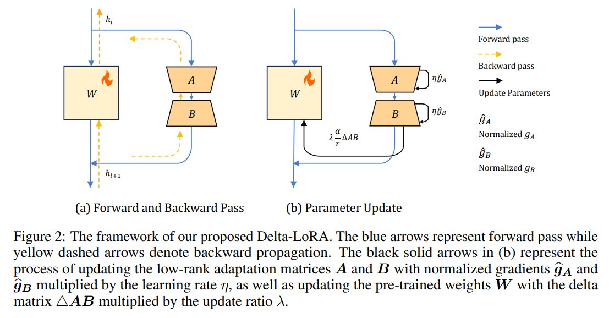
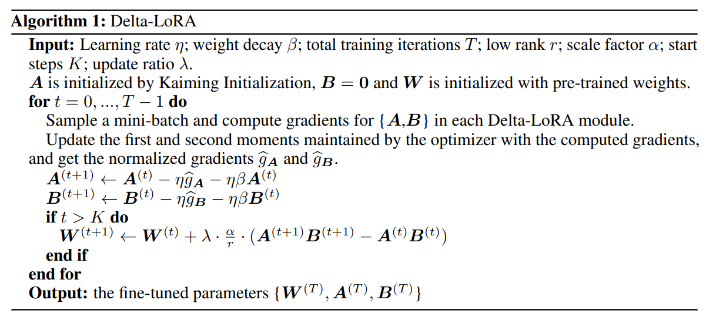
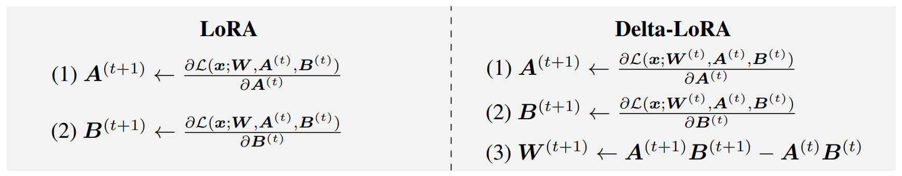
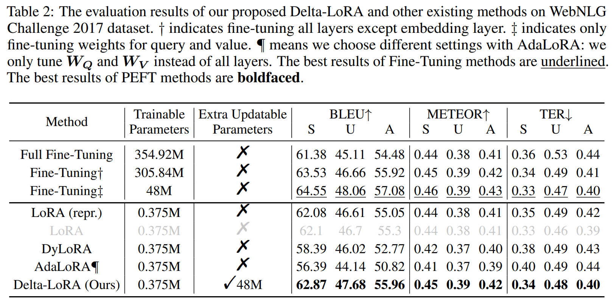
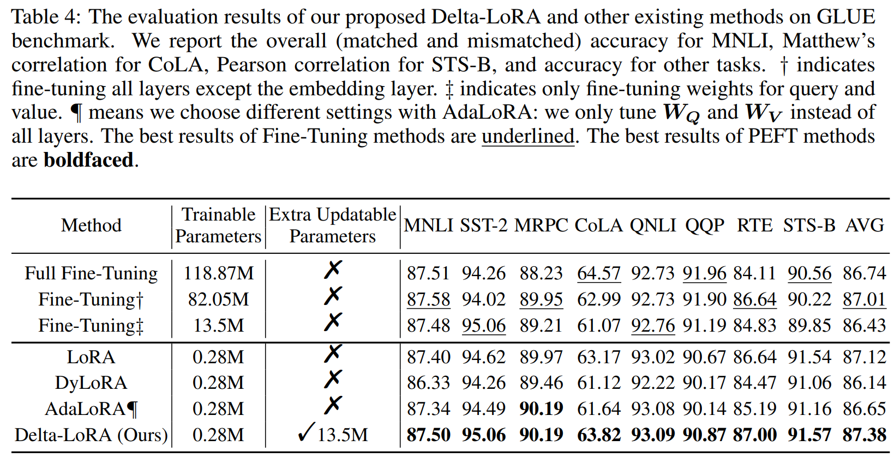

논문 및 이미지 출처 : <https://arxiv.org/pdf/2309.02411>

# Abstract

본 논문에서는 large language models(LLMs)을 fine-tuning 하기 위한 novel parameter-efficient approach 인 Delta-LoRA 를 제안한다. 

LoRA 및 AdaLoRA 같은 다른 low-rank adaptation 방식과 달리, Delta-LoRA 는 low-rank matrix $A$ 와 $B$ 를 업데이트할 뿐만 아니라 two low-rank matrix 의 product $(A^{(t+1)}B^{(t+1)} − A^{(t)}B^{(t)})$ 의 delta 를 활용한 업데이트를 통해 pre-trained weight $W$ 로 학습을 전파한다. 

이러한 전략은 low-rank matrix 의 점진적인 업데이트만으로는 downstream tasks 에 capable representations 를 학습하는 데 한계가 있다는 문제를 효과적으로 해결한다.

더욱이, $W$ 의 업데이트는 $W$ 의 gradients 를 계산하거나 momentums 를 저장할 필요가 없으므로, Delta-LoRA 는 LoRA 와 비교해 memory requirements 및 computational costs 가 비슷하다. 

광범위한 실험을 통해 Delta-LoRA 가 기존의 low-rank adaptation 방식들을 크게 능가함을 보여준다. 

이러한 결과를 뒷받침하기 위해 Delta-LoRA 의 효과를 강조하는 포괄적인 분석도 추가로 제공한다.

# 1 Introduction

최근 large language models(LLMs)은 다양한 downstream tasks 에서 탁월한 성능을 보이며 많은 주목을 받고 있다. 

millions parameters 로 구성된 기존의 Transformer 와 달리, 현대의 LLMs 는 일반적으로 billions parameters 로 확장되며, 이를 통해 emergent capabilities 와 strong generalization 같은 장점을 얻는다. 

이러한 고성능 LLMs 를 downstream tasks 에 맞춰 fine-tuning 하는 것은 individual tasks 에 소요되는 training time 을 줄이면서도 우수한 성능을 제공하기 때문에 mainstream paradigm 이 되었다.

그러나 all learnable parameters 를 사용해 LLM 의 full fine-tuning 은 high memory requirements 때문에 multiple GPUs 를 필요로 하며, 이는 많은 기업과 연구 기관에서 감당할 수 없는 수준이다.  Full Fine-tuning 은 연구자들에게 막대한 도전 과제를 제시한다: massive parameter size 때문에 LLMs 는 이미 일반적인 모델보다 more storage space 을 필요로 하며; further training 는 GPU memory requirements 을 더욱 악화시킨다. 

- 이는 AdamW Loshchilov & Hutter 같은 common optimizers 가 model parameters 의 여러 copies 를 유지하기 때문에 memory overhead 가 2 ~ 3X 로 증가하기 때문이다. 
- 이러한 이유로 memory overhead 를 줄이기 위한 일련의 방법들이 제안되었다. 
- 이들 중 일부는 learnable parameters 를 1% 이하로 줄여 fine-tuning speed 를 가속화하기도 한다. 
- 이 방법들 중 LoRA 는 광범위한 downstream tasks 에서 안정적인 성능을 보이며, overfitting 현상이 관찰되지 않았고, inference 시 extra memory 와 computational costs 가 발생하지 않는다는 점에서 가장 매력적이다.

LoRA 와 그 후속연구들은 PEFT(Parameter Efficient Fine-Tuning) 분야에서 대안적 접근법에 비해 우수한 성능을 보여주었지만, 대부분의 시나리오에서 Full Fine-tuning 과 비교할 때 상당한 성능 차이가 존재한다는 점이 강조되었다.

이러한 차이는 모델의 일부 parameters 만 업데이트함으로써 나타나는 한계로, training data 에 나타나는 복잡한 패턴을 충분히 학습하지 못하기 때문이다.

이 간격을 메우기 위한 합리적인 전략은 optimization process 에 more parameters 를 도입하는 것이다. 

본 논문에서는 Fig. 1 처럼, 기존 LoRA 와 동일한 memory consumption 를 유지하면서 pre-trained matrix 와 two low-rank matrix 를 동시에 업데이트하는 새로운 PEFT 접근법인 Delta-LoRA 를 소개한다. 

- 구체적으로는 pre-trained matrix $W$ 는 two consecutive iterations 에서 two low-rank matrix 의 product 의 delta ($△AB = A^{(t+1)}B^{(t+1)} - A^{(t)}B^{(t)}$) 로 업데이트하며, two low-rank matrix 은 AdamW optimizer 에 의해 자동으로 업데이트된다. 
- 이는 mathematical property $\frac{\partial \mathcal{L}}{\partial W} = \frac{\partial \mathcal{L}}{\partial AB}$ 에 기반을 두고 있으며, $△AB$ 가 $W$ 의 업데이트를 지시하는 대체물로 작용한다 (Sec. 4). 
- $W$ 의 gradients 를 저장하지 않으며, optimizer 를 사용해 pre-trained matrix 를 업데이트하지 않기 때문에 제안된 방법은 additional memory overhead 를 발생시키지 않는다. 
- 이러한 전략적 통합은 two low-rank matrix 만 업데이트할 때 발생하는 sub-optimal representation learning 문제를 효과적으로 완화한다. 
- 더욱이, pre-trained weight 의 업데이트 방향을 점진적 업데이트 행렬의 방향과 일치시킨다. 
- 또한, $\frac{\partial \mathcal{L}}{\partial W} = \frac{\partial \mathcal{L}}{\partial AB}$ 을 보장하기 위해, low-rank branches 에서 Dropout layer 를 제거하여, $W$ 에 대해 보다 합리적인 delta 를 얻는다. 
- 제안된 방법의 이점은 명확하다. pre-trained weight 를 optimization process 에 포함시킴으로써 more parameters 를 통합하여 intricate representation 을 학습할 가능성을 높인다.

본 논문의 주요 기여는 다음과 같이 요약된다:

- Delta-LoRA 라는 새로운 PEFT 방법을 도입하여, full weight matrix 와 two low-rank matrix 를 동시에 업데이트한다. 
  - Delta-LoRA 는 two matrix $A$ 와 $B$ 의 product 의 delta 를 활용하여 pre-trained weight 를 업데이트하며, 이로써 optimizer 에서 second-order momentums 를 저장하지 않는다.
- Delta-LoRA 의 gradients flow 를 분석하고, low-rank branches 에서 Dropout layer 가 $\frac{\partial \mathcal{L}}{\partial W} \neq \frac{\partial \mathcal{L}}{\partial AB}$ 를 유발함을 보여준다. 
  - 따라서, Delta-LoRA 에서는 $W$ 에 대한 합리적인 delta 를 얻기 위해 Dropout layer 를 제거한다.
- 다양한 NLP task 에서 Delta-LoRA 가 일관된 성능 향상을 제공함을 보여주는 포괄적인 실험을 수행한다. 
  - 또한, 각 component 가 기여하는 가치를 분석하며 그 우수성을 설명한다.

# 2 Preliminaries

#### Transformer-based Models.

Transformer 는 recurrence 와 convolution 대신 self-attention 메커니즘을 채택하여 기계 번역에서 새로운 SOTA 를 달성했다. 

이후, Dosovitskiy et al.(2021) 는 다양한 CV task 에서 범용성을 보이는 Vision-Transformer(ViT) 아키텍처를 제안했다. 

현재 Transformer-based model 은 NLP 와 CV 에서 가장 인기 있는 선택지가 되었다. 

Transformer 는 일반적으로 L stacked block 을 구성되며, 각 블록은 multi-head attention(MHA) module 과 feed-forward network(FFN) module 을 포함한다. 

input sequence $X \in \mathbb{R}^{n \times d}$ 에 대해 MHA module 의 output 인 MHA($X$)는 다음과 같이 정의된다:

$$
\begin{equation}
    \begin{aligned}
        \text{head}_i = \text{softmax}\left(\frac{XW_{Q_i}(XW_{K_i})^\top}{\sqrt{d_k}}\right)XW_{V_i} \\
        \text{MHA}(X) = \text{concat}(\text{head}_1, ..., \text{head}_k)W_o,
    \end{aligned}
\end{equation}
$$

- $d_k$ : scaliong factor
- $d_k = \frac{d}{k}$
- $W_{K_i}$, $W_{Q_i}$, $W_{V_i}$, $W_o$ 는 각각 key, query, value, MHA output 계산을 위한 weight matrix
- MHA module 외에도 FFN 은 Transformer-based model 에서 매우 중요하다. 
- FFN 은 two fully connected (FC) layer 를 activation function 와 함께 쌓아 구성된다. 

FFN 은 다음과 같이 정의된다:

$$
\begin{equation}
    \text{FFN}(x) = W_{f_2} \, \text{ReLU}(W_{f_1} \, x + b_1) + b_2,
\end{equation}
$$

- $x \in \mathbb{R}^d$
- $W_{f1}$ 과 $W_{f2}$ 는 FFN 내의 two fully connected layers
- $b_1$ 과 $b_2$ : bias terms

#### Low Rank Adaptation.

pre-trained matrix $W \in \mathbb{R}^{c \times d}$ 가 주어졌을 때, LoRA 는 incremental update $\Delta W$ 를 학습하고 이를 two low-rank matrix $A$ 와 $B$ 의 matrix product 으로 decomposing 하여 $\Delta W = AB$ 로 나타낸다. 

- $A \in \mathbb{R}^{c \times r}$, $B \in \mathbb{R}^{r \times d}$
- $r \ll \min(d, c)$
- input $x$ 와 hidden state $h$ 에 대해, LoRA 는 다음과 같은 forward process 를 가짐:

$$
\begin{equation}
    h = W^*x = Wx + \Delta W x = Wx + \frac{\alpha}{r}ABx
\end{equation}
$$

- training stage 초기에 $A$ 는 Kaiming initialization 를 통해 무작위로 초기화되며, $B$ 는 incremental update $AB = 0$ 을 보장하기 위해 zero matrix 로 초기화된다. 
- 또한, LoRA 는 hyper-parameters $\alpha$ 와 $r$ 를 사용하여 $ABx$ 를 scaling

# 3 Related Works

현대 Transformer-based model 의 parameter 규모가 점점 커짐에 따라, 이러한 large language models(LLM)을 fine-tuning 하려면 high memory capacity 을 갖춘 multiple GPUs 가 필요하다. 

이는 주로 AdamW 같은 일반적인 optimizer 가 extra parameter size (gradients, first-order 및 second-order momentums)를 3x 유지해야 하기 때문이다. 

이러한 격차를 해소하기 위해, 일련의 Parameter-Efficient Fine-Tuning (PEFT) 방법이 제안되었다.

- Adapter 는 pre-trained weight 를 고정한 채로 pre-trained layers 사이에 lightweight learnable parameters 를 도입한다. 
- Prompt-Tuning 은 특정 task 에 대해 fine-tuning 과 유사한 성능을 달성하기 위해 prompt 를 최적화하는 것을 목표로 하며, 
- Prefix-Tuning 은 learnable prefix 를 최적화하여 이러한 learnable parameters 를 각 hidden state 에 미리 추가한다. 
- 이러한 방법들은 눈에 띄는 성능 성과를 보였지만, 필연적으로 inference stage 에서 additional overhead 를 발생시킨다.

LoRA 는 low-rank matrix two product 을 사용해 full-rank matrix 의 증분 업데이트를 모델링한다

LoRA 는 훈련 후 pre-trained weight 에 증분 업데이트를 병합하여 inference 시 additional computational overhead 를 피한다. 

더욱이, LoRA 는 Ding et al.(2023)의 평가에 따르면 가장 효과적인 PEFT 기법 중 하나로 꼽힌다. 

이후 LoRA 를 기반으로 한 일련의 향상된 방법들이 제안되었다. 

- G-LoRA 는 pre-trained weight 를 fine-tuning 하기 위해 generalized prompt module 을 활용하여 CV task 에 더 나은 표현을 제공한다. 
- DyLoRA 는 training stage 후 two lightweight matrix 의 rank 를 조정하는 것을 목표로 한다. 
  - 기존 방식과 달리, DyLoRA 는 training 중 rank 를 고정하지 않고 변화를 도입한다. 
- AdaLoRA 는 다양한 weight parameter 에 부여된 중요성을 강조한다. 
  - 이 기술은 importance scores 에 따라 weight matrix 간에 파라미터 예산을 지능적으로 할당한다. 
- Q-LoRA 는 4-bit NormalFloat 로 pre-trained model 을 양자화하여 평균 메모리 사용량을 더욱 줄이는 방법을 제안했다. 
  - 이 양자화 접근법은 모델의 효능을 유지하면서도 LLM training 의 자원 집약적인 특성을 효과적으로 완화하고 관련 문제를 해결한다.

# 4 Methodology

Delta-LoRA 는 Fig. 1 과 Fig. 2 에 나타난 두 가지 핵심 설계를 포함한다: (i) 기존의 low-rank adaptation matrix $A$ 와 $B$ 와 함께 full weight matrix $(W)$ 도 동시에 업데이트하며, 증분 업데이트에서 발생하는 delta $(A^{(t+1)}B^{(t+1)} - A^{(t)}B^{(t)})$ 를 활용하여 pre-trained weight $W$ 를 정교하게 조정한다. (ii) 기존 LoRA 모듈에 포함된 Dropout layer 는 Delta-LoRA 에서 제외된다. 이는 Dropout 이 $\frac{\partial \mathcal{L}}{\partial W} = \frac{\partial \mathcal{L}}{\partial AB}$ 라는 필수 가정을 위반한다는 사실을 인식했기 때문이다.

## 4.1 Update the Delta of Low-Rank Matrices on Pre-trained Weights

input $x$ 와 이에 상응하는 hidden state $h$ 에 대해, LoRA 는 two low-rank matrix $A$ 와 $B$ 를 최적화하여 pre-trained fixed weight matrix $W$ 에 대한 증분 업데이트 $AB$ 를 학습한다. 

이전 방법들과 달리, 저자는 $W$ 도 업데이트되어야 한다고 주장한다.

- 이를 통해 more learnable parameters 를 optimization process 에 도입하여 학습 능력을 높일 수 있다. 
- 그러나, weight matrix $W$ 를 fine-tuning 하기 위해 normalized gradients(i.e., optimizer 에서 normalized 후의 gradients)를 얻는 것은 간단하지 않다. 
- 이는 AdamW 같은 optimizer 가 GPU 메모리에 최소한 3 extra parameter copies (i.e., gradients, first-order 및 second-order momentums)을 유지해야 하기 때문이다. 
- 흥미롭게도, LoRA 모듈이 Dropout layer 를 무시하고 matrix $A$ 와 $B$ 만 유지한다고 가정할 때, loss $\mathcal{L}$ 에 대한 matrix $AB$ 와 $W$ 의 gradients 가 정확히 동일하다는 점을 발견했다. 

이 일치는 다음과 같이 공식적으로 나타낼 수 있다:

$$
\begin{equation}
    \begin{aligned}
        &g_{W+AB} = \frac{\partial \mathcal{L}}{\partial h_{i+1}} \cdot \left( \frac{\partial h_{i+1}}{\partial (W + AB)} \right)^\top = \frac{\partial \mathcal{L}}{\partial h_{i+1}} \cdot h_i^\top, \\
        &g_W = \frac{\partial \mathcal{L}}{\partial h_{i+1}} \cdot \frac{\partial h_{i+1}}{\partial W}^\top = \frac{\partial \mathcal{L}}{\partial h_{i+1}} \cdot h_i^\top, \\
        &g_{AB} = \frac{\partial \mathcal{L}}{\partial h_{i+1}} \cdot \frac{\partial h_{i+1}}{\partial AB}^\top = \frac{\partial \mathcal{L}}{\partial h_{i+1}} \cdot h_i^\top,\\
        &\Rightarrow g_W = g_{AB},
    \end{aligned}
\end{equation}
$$

- $h_{i+1} = W h_i + AB h_i$
- $h_i$ 및 $h_{i+1}$ 는 각각 $i$-th layer 및 $i+1$-th layer 의 output
- $AB$ : adaptation matrix $A$ 와 $B$ 의 matrix product
- $\mathcal{L}$ : loss function
- $g_{W+AB}$, $g_W$ 및 $g_{AB}$ 는 각각 $\frac{\partial \mathcal{L}}{\partial (W+AB)}$, $\frac{\partial \mathcal{L}}{\partial W}$, $\frac{\partial \mathcal{L}}{\partial AB}$ 에 대한 gradients 를 나타낸다.

Eq. (4) 는 weight matrix $W$ 의 parameter update 를 학습할 때, $g_{AB}$ 를 사용하여 $g_W$ 를 동화시킬 수 있다는 영감을 준다. 

그러나 아쉽게도 back-propagation process 에서 $g_W$ 대신 $g_A$ 와 $g_B$ gradients 만 얻을 수 있다. 더욱이, $AB$ 에 대한 gradients 계산은 matrix $W$ 와 동일한 차원을 가지므로, two matrix 가 동일한 $d \times k$ dimension 을 공유하기 때문에 동일한 GPU memory overhead 를 수반한다.

모델이 parameter 를 업데이트하는 일반적인 optimization process 에서, gradient descent 를 적용하여 $W^{(t+1)} = W^{(t)} − \eta g_W$ 로 parameter 를 업데이트한다. 

- $\Delta W = −\eta g_W$ : learning rate $\eta$ 를 사용한 parameter update 
- 마찬가지로, $\Delta AB$ 를 $AB$ 에 대한 gradients 로 보고 이 matrix 를 Eq. (4) 에 따라 $g_W$ 의 대체물로 사용한다. 
- 여기서 $\Delta AB$ 는 다음과 같이 계산할 수 있다:

$$
\begin{equation}
    \Delta AB = A^{(t+1)}B^{(t+1)} − A^{(t)}B^{(t)} = \eta A^{(t)} g_B + \eta g_A B^{(t)} − \eta^2 g_A g_B,
\end{equation}
$$

- $A^{(t)}$, $B^{(t)}$ 및 $W^{(t)}$ : 각각 $t$-th step 의 $A$, $B$ 및 $W$ 의 weight
- $A^{(t+1)} = A^{(t)} − \eta g_A$, $B^{(t+1)} = B^{(t)} − \eta g_B$, $\eta$ 는 learning rate
- 정확히 말하면, $-\Delta AB$ 는 Appendix A.1 처럼 $g_{AB}$ 및 $g_W$ 와 직접적으로 같지는 않다. 그럼에도 불구하고 $\Delta AB$ 는 matrix $AB$ 에 대한 실제 업데이트 방향을 나타낼 수 있다. 
- 이 가정을 기반으로, $-\Delta AB$ 를 $W$ 의 업데이트를 지시하는 gradients 로 사용하는 것이 합리적이다.

따라서 training stage 에서 matrix $\Delta AB$ 를 도입하여 pre-trained weight $W$ 를 다음과 같은 방식으로 업데이트한다:

$$
\begin{equation}
    W^{(t+1)} = W^{(t)} + \lambda \cdot \frac{\alpha}{r} \cdot \Delta AB, \text{ where } \Delta AB = A^{(t+1)}B^{(t+1)} − A^{(t)}B^{(t)},
\end{equation}
$$

- $\lambda$ : $AB$ 와 pre-trained weight $W$ 의 update ratio 를 조정하는 hyper-parameters 를 나타낸다. 
- $W$ 에 대한 parameter update 는 $K$ training iterations 후에 시작된다. 

알고리즘의 절차적 세부 사항은 알고리즘 1 에 설명되어 있다.

#### Discussion.

Delta-LoRA 는 LoRA 와 비교하면 주요 수정이 있다.

다음과 같이 다름을 논의한다:

이는 LoRA 는 $W$ 는 동결한 채 $A$ 와 $B$ 만 update 하며, Delta-LoRA 는 optimizer 에 의해 $A$ 및 $B$ 를 update 하며 $A$ 와 $B$ 의 product 의 delta 로 $W$ 를 update 한다.

## 4.2 The Structure of Our Delta-LoRA

LoRA 와 그 후속인 AdaLoRA 는 two low-rank matrix $A$ 와 $B$ 앞에 Dropout layer 를 배치한다. 

그러나 이러한 배치는 gradients matrix $g_W$ 와 $g_{AB}$ (AdaLoRA 에서는 $g_{AEB}$) 사이에 불일치를 초래한다. 

이 불일치의 도출은 다음과 같이 나타낼 수 있다:

$$
\begin{equation}
    \begin{aligned}
        &g_W = \frac{\partial \mathcal{L}}{\partial h_{i+1}} \cdot \left( \frac{\partial h_{i+1}}{\partial W} \right)^\top = \frac{\partial \mathcal{L}}{\partial h_{i+1}} \cdot h_i^\top \\
        &\neq g_{AB} = \frac{\partial \mathcal{L}}{\partial h_{i+1}} \cdot \left( \frac{\partial h_{i+1}}{\partial AB} \right)^\top = \frac{\partial \mathcal{L}}{\partial h_{i+1}} \cdot \text{Drop}(h_i)^\top,
    \end{aligned}
\end{equation}
$$

- Drop(·) : Dropout layer
  - 이는 $g_W \neq g_{AB}$ 을 초래한다. 
- 합리적인 선택은 low-rank module 에서 Dropout layer 를 제거하고, over-fitting 문제가 발생할 경우 pre-trained layers 사이에 Dropout layer 를 활성화하는 것이다.
- 이 수정은 추가적인 이점도 가져온다: (1) 어느 정도 under-fitting 을 완화하여 network 의 learned representation 을 향상시킬 수 있다. 
- 이러한 개선의 논리는 LoRA 와 그 후속들이 pre-trained weight 에 대한 low-rank 업데이트를 공식화하는 데 full parameters 의 1% 미만을 포함한다는 사실에 있다. 
- 그러나 대부분의 경우 이 같은 적은 비율의 parameters 에만 의존하는 것은 adequate representation capacity 을 부여하지 못할 수 있다; 
- (2) 이 수정은 또한 메모리 절약 이점도 제공한다. intermediate features 를 저장할 필요가 없으므로 모델은 memory comsumption 을 줄인다. 결과적으로 back-propagation process 에서 사용되는 activation memory 가 감소한다.

# 5. Experiments

Delta-LoRA 를 RoBERTa, GPT-2, BART 와 함께 다양한 dataset 에서 평가한다. 

구체적으로, (1) RoBERTa 를 8 NLP understanding task 로 구성된 GLUE 벤치마크에서 훈련하고, (2) GPT-2 를 Hu et al. (2022)의 설정을 따라 E2E Challenge 및 WebNLG Challenge 2017 에서 훈련하며, (3) BART 를 Zhang et al. (2022)의 설정을 사용하여 XSum dataset 에서 훈련한다. 

실험은 PyTorch 로 구현하였으며, HuggingFace 에서 pre-trained weight 및 구성 파일을 다운로드하여 사용하였다.

## 5.1 Baselines

Delta-LoRA 방법을 Fine-Tuning 과 LoRA, AdaLoRA, DyLoRA 같은 기존 방법과 비교한다. 

PEFT 방법에 대해서는 LoRA 논문에서 사용된 설정을 따라 $W_V$ 와 $W_Q$ 의 증분 업데이트만 훈련한다. 

Fine-Tuning 방법에 대해서는 two extra training paradigms 을 사용한다: (1) embedding 을 고정하고 all other parameters 를 훈련하는 Fine-Tuning†; (2) $W_V$ 와 $W_Q$ 만 훈련하는 Fine-Tuning‡.

#### Fine-Tuning.

최근 몇 년 동안 Fine-Tuning 은 NLP 와 CV task 모두에서 mainstream paradigm 이 되었다. 

그러나 full parameters 를 Fine-Tuning 하는 것은 over-fitting 및 training instability 같은 잠재적 단점이 있다. 

따라서 network layer 의 일부를 고정하고 나머지를 Fine-Tuning 하는 것이 인기를 얻고 있다. 

실험에서는 Full Fine-Tuning, embedding layer 를 고정한 Fine-Tuning†, query 및 key matrix 만을 Fine-Tuning‡ 와 비교한다.

#### LoRA

two low-rank matrix 의 product 을 사용하여 증분 업데이트를 학습하며, GPU 메모리 비용을 줄인다. 

공정한 비교를 위해, LoRA 의 설정을 따라 실험 결과를 재현하였다.

#### DyLoRA

training 중에 LoRA module 을 위한 rank $r$ 을 무작위로 선택한다.

#### AdaLoRA

증분 업데이트를 위한 optimal rank 결정하는 문제에 초점을 맞춘다. 

singular value pruning 의 adaptive apporach 를 사용하여 각 singular value 의 size 에 따라 rank 선택을 조정한다. 

따라서 각 layer 에 대해 other rank 를 사용한다.

## 5.2 Natural Language Generation

#### Models and Datasets

Delta-LoRA 의 효과를 검증하기 위해 GPT2-Medium 을 사용하여 data-to-text task 를 위한 two datasets, 즉 E2E NLG Challenge 및 WebNLG Challenge 2017 에서 실험을 수행한다. 

GPT2-Medium 은 24 Transformer layers 로 구성된 354M parameters 를 가진다. 

- E2E NLG Challenge dataset 은 restaurant domain 에서 약 42,000 training samples, 4,600 validation samples, 4,600 test samples 로 구성된다. 
- WebNLG Challenge 2017 은 9 categories 에서 21,855 training samples 를 포함하며, test set 에서는 총 14 categories 를 포함한다. 
- text summarization task 를 위해서는 BART-Large 를 사용하여 XSum dataset 에서 Delta-LoRA 의 효과를 검증한다. 
- 이 dataset 은 training 을 위한 204,045 samples, validation 을 11,332 samples, test 를 위한 11,332 samples 로 구성된다.

#### Implementation Details

LoRA 와 그 후속 모델들과 공정하게 비교하기 위해, Delta-LoRA 와 3 PEFT methods 를 구현하는 데 있어 LoRA 의 모델 설정을 채택하였다. 

- MHA 모듈에서 $W_Q$ 와 $W_V$ 의 low-rank 증분 업데이트만 학습한다. 
- 훈련 구성도 공정한 비교를 위해 기존 baseline 에 따라 선택하였다. 
- data-to-text dataset 의 경우, LoRA 에서 사용된 training epochs 수, batch size 등을 포함한 동일한 훈련 구성을 사용한다. 
  - Delta-LoRA 의 update ratio $\lambda = 2$ 와 start step $K = 500$ 으로 설정하였다. 
- text summarization task 의 경우, AdaLoRA 의 구현을 사용하고 동일한 훈련 구성을 채택하였다. 
  - Delta-LoRA 의 update ratio $\lambda = 0.5$ 와 start step $K = 1000$ 으로 설정하였다.

#### Experimental Results

- Tab. 1 은 E2E Challenge dataset 에 대한 5 metrics results 를 보여주며, 제안된 방법이 3 baselines 과 여러 Fine-Tuning 방법에 비해 최고 성능을 달성했음을 보여준다. 
- BLEU 및 ROUGE-L metrics 에서 제안된 방법은 LoRA 에 비해 각각 1.24 및 1.13 성능 향상을 얻었으며, NIST, METEOR 및 CIDEr 에서 각각 0.13, 0.86 및 0.08 향상을 나타냈다. 

- Tab. 2 는 WebNLG Challenge 2017 dataset 에 대한 BLEU score 에서 Delta-LoRA 가 baseline 보다 더 우수한 성능을 나타내며, Seen, Unseen 및 All test data 에서 각각 0.79, 1.08 및 0.91 향상을 보여준다. 
- 또한, METEOR 및 TER metrics 에서도 Delta-LoRA 가 all data 에서 LoRA 에 비해 각각 0.01 및 0.02 의 향상을 달성하며 최고 성능을 기록했다. 

- text summarization task 의 경우, 테스트 결과는 Tab. 3 에 나와 있으며, 4 metrics 에서 3 PEFT methods 대해 Delta-LoRA 가 최고 성능을 달성했음을 보여준다.

## 5.3 Natural Language Understanding

#### Models and Datasets.

제안된 방법과 기존 방법, 그리고 2 Fine-Tuning methods 의 성능을 평가하기 위해 RoBERTa-base 를 사용한다. 

LoRA 및 후속 연구들과 공정하고 명확한 비교를 위해 GLUE 벤치마크를 선택하였다. 

이 벤치마크는 8 datasets 으로 구성되며, classification task, similarity 및 paraphrase tasks, 그리고 natural language inference tasks 을 포함한다.

#### Implementation Details.

RoBERTa-base 는 118M parameters 를 가지며, 실험을 수행하고 baseline 과 비교하기 위해 사용된다. 

- 메모리 비용을 줄이고 훈련 속도를 높이기 위해 입력 길이를 512 에서 256 으로 줄이는 것 외에는 대부분 LoRA 의 훈련 구성을 채택하였다. 
- AdaLoRA 의 경우 rank 8 로 설정하고, target rank 6 으로 설정하며, 다른 hyper-parameters 는 각 작업의 특성에 따라 선택하였다. 
- Delta-LoRA 에 대해서는 update ratio $\lambda$ 를 0.5 로 설정하고, 각 task 에서 사용되는 warmup steps 에 따라 start steps $K$ 를 달리 설정하였다.

#### Experimental Results.

- Tab. 4 에 따르면, Delta-LoRA 는 GLUE 벤치마크의 all 8 tasks 에서 기존 방법들을 능가하였다. 
- 이 tasks 중 SST-2, CoLA, RTE 에서 두드러진 성능 향상이 관찰되었는데, 이는 이 dataset 들이 less training data 를 포함하고 있어, 기존 Fine-Tuning 방법을 사용할 때 모델이 견고한 표현을 효과적으로 학습하는 데 어려움을 겪기 때문이다. 
- Delta-LoRA 는 MNLI, MRPC, QNLI, STS-B 같은 나머지 dataset 에서도 준수한 성능을 보이며, 다양한 설정에서 안정적이고 신뢰할 수 있음을 증명하였다. 
- 흥미롭게, few pre-trained parameters 를 fine-tuning 함으로써 현저한 성능 향상을 가져올 수 있음을 발견하였고, 이는 제안된 방법이 pre-trained model 의 generalization 능력을 유지하면서도 few parameters 만을 tuning 하여 다른 PEFT 방법보다 개선된 성능을 달성하게 하는 데 기여함을 증명한다.

## 5.4 Comprehensive Understanding Of Delta-LoRA

#### Ablation study.

수정된 LoRA module (i.e., Delta-LoRA)의 기여와 업데이트 알고리즘의 효과를 더 잘 이해하기 위해, GPT2-medium 을 사용하여 E2E Challenge dataset 에서 연구를 수행하였다. 

- Tab. 5 에 나타난 바와 같이, low-rank 업데이트의 delta 를 사용하여 pre-trained matrix 를 업데이트하는 것만으로도 성능 향상이 가능하지만, Delta-LoRA 모듈에서 dropout 을 제거할 경우 최상의 성능을 얻을 수 있다. 
  - 이 관찰 결과는 제안된 방법론의 각 component 가 중요한 역할을 한다는 것을 확인시켜 준다. 
- 성능 향상이 단순히 update size 증가에서 비롯된 것이 아니라, 제안된 방법의 본질적인 특성에서 비롯된 것인지 구별하기 위해 추가 실험을 설계하였다. 
- 제안된 알고리즘에 따르면, pre-trained matrix 와 low-rank matrix 의 parameters 를 모두 업데이트하는데, 이는 weight 에 large $△AB$ 업데이트가 extra parameters 도입 없이 성능을 향상시키는 것인지 의심을 일으킬 수 있다. 

- 이 질문에 답하기 위해, Tab. 6 에서 결과를 보여주는 실험을 설계하여 제안된 방법의 효과를 증명하였다. 
- LoRA 의 learning rate 을 $2e-4$ 에서 $6e-4$ 로 조정하여 $W + AB$ 가 $3 \times △AB$ 로 업데이트될 수 있도록 하였고, 이는 $\lambda$ 를 2 로 설정한 Delta-LoRA 와 동일하다. 
- $3 \times △AB$ 로 $AB$ 를 업데이트하더라도 성능이 Delta-LoRA 와 비교할 때 여전히 부족하다는 것을 발견하였다. 
- 이 실험은 optimization process 에 more parameters 를 도입함으로써 모델이 better representation 을 학습할 수 있음을 추가로 증명한다.

#### The cosine similarity between fine-tuned and the pre-trained parameters to measure learning effects.

Delta-LoRA 의 뛰어난 성능의 이유를 설명하기 위해 Fine-Tuning‡, LoRA, Delta-LoRA 의 3 baselines 를 비교 분석하였다. 

E2E Challenge dataset 에서 실험을 수행하였으며, $W_Q$ 와 $W_V$ 에 대해 fine-tuning 또는 증분 업데이트를 학습하였다. 

learning rate 을 $2e-4$ 로 설정하고 5 epochs 동안 훈련하였다. 

이후, final checkpoint 를 사용하여 비교를 수행하였다. 

- Fig. 3 에서 볼 수 있듯이, LoRA 는 대부분의 transformer blocks 에서 가장 높은 유사도를 나타낸다. 
- 이 관찰은 LoRA 가 주로 $W∗ = W + AB$ 행렬을 제한된 범위 내에서 수정함을 시사한다. 
- 반면, Delta-LoRA 는 가장 낮은 cosine similarity 를 보이며, 제안된 접근 방식이 final matrix $W∗$ 에 가장 큰 수정 사항을 유도함을 보여준다. 
- 이러한 특성으로 인해, 제안된 방법은 모델이 better representation 을 학습하도록 효과적으로 자극할 수 있으며, 이는 모든 4 PEFT methods 중에서 최고 성능을 달성하게 만든다. 
- 이 관찰 결과는 Tab. 1 의 결과와도 일치하는데, Delta-LoRA 는 3 methods 중 가장 우수한 성능을 달성했으며, LoRA 는 Fine-Tuning‡ 보다 약간 뒤처진다.

# 6 Conclusion

이 논문에서는 full weight matrix 와 two low-rank matrix 를 동시에 업데이트하는 새로운 방법인 Delta-LoRA 를 제안하였다. 

Delta-LoRA 는 delta $A^{(t+1)}B^{(t+1)}−A^{(t)}B^{(t)}$ 를 활용하여 pre-trained weight($W$) 를 업데이트한다. 

이러한 방식으로 optimization process 에 more learnable parameters 를 도입하여, LoRA 와 유사한 메모리 비용으로 더 나은 표현을 학습할 수 있도록 한다. 

한편, low-rank branches 에서 Dropout layer 가 불필요하다는 것을 gradient flow 를 통해 확인하였다. 

또한, 제안된 방법의 효과와 견고성을 이해하기 위한 철저한 분석을 제공하였다. 

광범위한 NLP task 에 대한 실험을 통해 Delta-LoRA 의 효과를 경험적으로 검증하였다.

# Appendix

# A.1 The Expansion of $△AB$

실제 training process 에서 optimizer 및 $△AB$ 에 대한 regularization 을 포함한 다양한 training factor 를 고려해야 한다.

AdamW 및 L$_2$ regularization 을 사용한 경우, $△AB$ 는 다음과 같이 확장된다:

$$
\begin{equation}
    \begin{aligned}
        \Delta AB &= A^{(t+1)}B^{(t+1)} - A^{(t)}B^{(t)} \\
        &= (A^{(t)} - η\hat{g}_A - ηβA^{(t)}) · (B^{(t)} - η\hat{g}_B - ηβB^{(t)}) - A^{(t)}B^{(t)} \\
        &= A^{(t)}B^{(t)} - ηA^{(t)}\hat{g}_B - ηβA^{(t)}B^{(t)} - η\hat{g}_AB^{(t)} + η^2 \hat{g}_A \hat{g}_B + η^2 β\hat{g}_A B^{(t)} \\
        &- ηβA^{(t)}B^{(t)} + η^2 βA^{(t)}\hat{g}_B + η^2 β^2 A^{(t)}B^{(t)} - A^{(t)}B^{(t)} \\
        &= -ηA^{(t)}\hat{g}_B - ηβA^{(t)}B^{(t)} - η\hat{g}_AB^{(t)} + η^2 \hat{g}_A \hat{g}_B + η^2 β\hat{g}_AB^{(t)} \\
        &=- ηβA^{(t)}B^{(t)} + η^2 βA^{(t)}\hat{g}_B + η^2 β^2 A^{(t)}B^{(t)} \\
        &≈ -ηA^{(t)}\hat{g}_B - η\hat{g}_AB^{(t)}
    \end{aligned}
\end{equation}
$$

- $η$ : learning rate
- $β$ : weight decay
- pre-trained weight W 에 대해 $△W = η\hat{g}W + ηβW^{(t)}$

따라서 training process 에서 $△AB$ 는 $△W$ 와 같지 않다.
