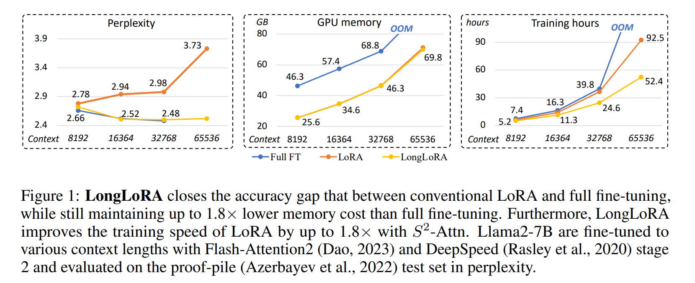
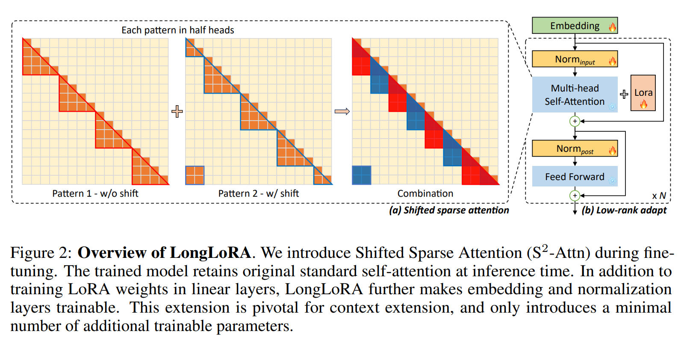
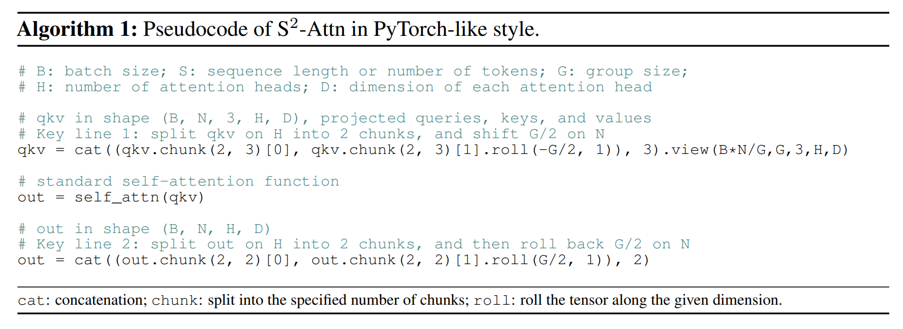
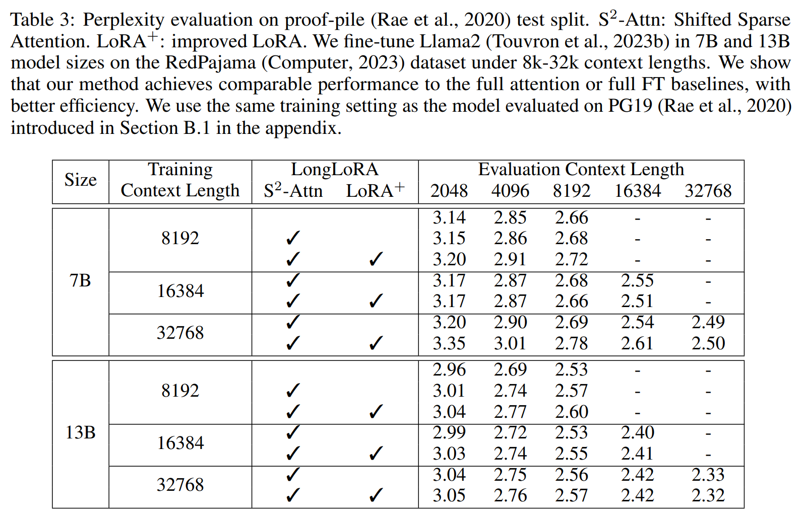
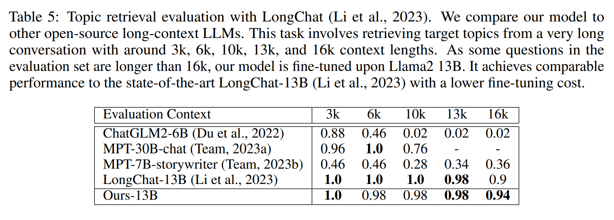
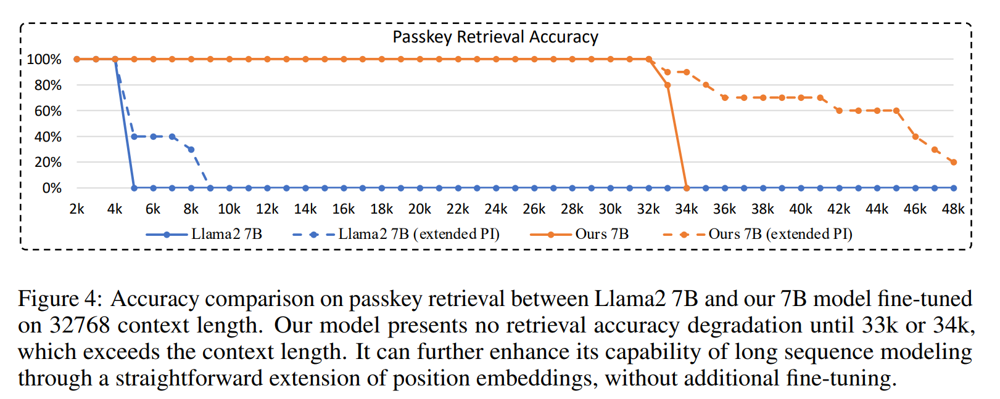

논문 및 이미지 출처 : <https://arxiv.org/pdf/2309.12307>

### 초록

LongLoRA 는 limited computation cost 로 pre-trained large language model(LLM)의 context sizes 를 확장하는 efficient fine-tuning 접근 방식이다. 

일반적으로 long context sizes 로 LLM 을 훈련하는 것은 계산적으로 비용이 많이 들며, 상당한 training time 과 GPU 자원을 필요로 한다. 예로, 8192 의 context length 로 훈련하면 2048 의 context length 에 비해 16x computation cost 이 든다. 

본 논문에서는 두 가지 측면에서 LLM 의 context extension 을 가속화한다. 

한편, inference 시에 _dense global_ attention 가 필요하지만, model 의 fine-tuning 은 _sparse local_ attention 로 효과적이고 효율적으로 수행할 수 있다. 

- shifted sparse attention(S$^2$-Attn) 는 context extension 을 효과적으로 가능하게 하며, vanilla attention 와 유사한 성능을 유지하면서 computation cost 을 실질적으로 절감한다. 
  - 특히, 이는 training 시 _두 줄의 코드_ 만으로 구현할 수 있으며, inference 시에는 선택적이다. 
- 다른 한편으로, context extension 을 위한 parameter efficient fine-tuning 방식을 재검토한다. 
  - 특히, context extension 을 위한 LoRA 는 trainable embedding 및 normalization 가 전제되어야 잘 작동한다는 것을 발견하였다. 
- LongLoRA 는 improved LoRA 와 S$^2$-Attn 을 결합한다. 
- LongLoRA 는 Llama2 model(7B/13B to 70B)에서 다양한 task 에 대해 강력한 실험적 결과를 보여준다. 
  - LongLoRA 는 Llama2 7B 를 4k context 에서 100k 로 확장하거나, Llama2 70B 를 single 8× A100 에서 32k 로 확장할 수 있다. 
  - LongLoRA 는 model 의 context 를 확장하면서 original architecture 를 유지하며, Flash-Attention2 와 같은 대부분의 기존 기술과 호환된다.
- 추가로, LongLoRA 와 저자의 long instruction-following LongAlpaca dataset 을 사용하여 supervised fine-tuning 을 수행한다. 

# 1 Introduction

large language model(LLM)은 일반적으로 pre-defined context sizes 로 훈련된다. 

예로, LLaMA 는 2048 tokens, Llama2 는 4096 tokens 를 사용한다. 

그러나 이러한 pre-defined size 는 long documents 를 요약하거나 long questions 에 답하는 등 많은 응용에서 LLM 을 제한한다. 

이 제한을 해결하기 위해, 최근 몇 가지 연구는 LLM 을 longer context 로 훈련하거나 fine-tuning 한다. 

그러나 long sequence 의 LLM 을 scratch training 하는 것은 computational challenges 를 제시하며, 기존의 pre-trained LLM 을 fine-tuning 하는 것도 상당히 비싸다. 

- 예로, Position Interpolation 은 LLaMA model 을 2k to 8k context 로 확장하기 위해 32 A100 GPU 를 사용하고, longer context 의 fine-tuning 에는 128 A100 GPU 를 사용하였다. 
- FOT 은 standard transformer training 을 위해 32 TPU 를 사용하고, LongLLaMA 에는 128 TPU 를 사용하였다. 
- 이러한 computation resources 은 일반 연구자들에게는 감당하기 어려운 경우가 많아, 저자는 LLM 의 context window 를 효율적으로 확장할 수 있는 방법을 모색하게 된다.

하나의 간단한 접근 방식은 pre-trained LLM 을 low-rank adaptation(LoRA) 을 통해 fine-tuning 하는 것이다. 

- LoRA 는 self-attention blocks 의 linear projection layers 를 low-rank matrix 를 사용하여 수정하며, 일반적으로 efficient 하며 trainable parameters 수를 줄인다. 
- 그러나 저자의 경험적 발견에 따르면, long context model 을 이 방식으로 훈련하는 것은 effective 및 efficient 하지 않다. 
  - _effectiveness_ 측면에선, plain low-rank adaptation 이 long context extension 에서 high perplexity 를 초래한다 (Tab. 2).
    - e.g., $rank = 256$ 의 higher value 로 증가시켜도 안화되지 않는다.
  - _efficiency_ 측면에선, LoRA 를 사용하든 사용하지 않든, context sizes 가 확장됨에 따라 computation cost 이 극적으로 증가하며, 이는 주로 standard self-attention 메커니즘 때문이다. 
    - Fig. 1 처럼, LoRA 를 사용하더라도 standard Llama2 model 의 training time 이 context window 가 확장될 때 상당히 증가한다.

이 논문에서는 LongLoRA 를 소개한다. 

- LongLoRA 는 pre-trained LLM 의 context window 를 확장하는 efficient fine-tuning 접근 방식이다. 
- LoRA 는 full fine-tuning 을 근사하기 위해 low-rank weights update 를 사용한다. 
  - 마찬가지로, 저자는 short attention 가 training 중 long context 를 근사할 수 있음을 발견하였다. 
- 저자는 shifted sparse attention (S$^2$-Attn) 를 standard self-attention 의 efficient substitute 으로 제시한다. 
- Fig. 2 처럼, 저자는 context length 를 여러 groups 으로 나누고 각 group 에서 attention 를 개별적으로 수행한다. 
  - half attention head 에서, 저자는 tokens 를 half group size 만큼 shift 하여 neighboring groups 간의 information flow 을 보장한다. 
  - 예로, S$^2$-Attn 을 group size 2048 로 사용하여 총 8192 context length training 을 근사한다. 
  - 이는 Swin Transformer 와 high-level spirit 을 공유한다.

S$^2$-Attn 을 통해 fine-tuned model 은 inference 중 original attention architecture 를 유지한다. 

- 이는 대부분의 기존 optimization 및 infrastructure 를 용이하게 한다. 
- 일반 LLM 에 대한 기술은 저자의 방법에도 적용할 수 있다.
  - 예로, Flash-Attention2 는 training 및 inference time 모두에서 저자의 방법과 호환된다. 
  - 그 이유는 short attention 가 LLM 의 pre-training steps 에서의 attention 방식과 유사하기 때문이다. 
  - dilated attention 또는 sparse attention 과 같은 다른 efficient attention 방식은 standard style 과 큰 차이가 있으며, Tab. 6 에서와 같이 저자의 방식처럼 잘 작동하지 않는다.

저자는 trainable embedding 및 normalization layers 가 long context LoRA fine-tuning 의 핵심임을 경험적으로 보여준다. 

- Tab. 2 처럼, embeddings ($\le 2\%$) 및 normalization layers ($\le 0.004\%$) 는 entire LLM 에서 parameters 의 작은 비율을 차지한다. 
- 예로, Llama2 7B 에서 embeddings 은 2% 미만의 parameters 를 가지며, normalization 는 0.004% 이하의 parameters 를 가진다. 
- 이 비율은 larger LLM 에서는 더 줄어든다.

실험에서 LongLoRA 가 효과적이고 효율적임을 보여준다. 

- 저자는 Llama2 7B, 13B 및 70B 의 context window 확장에 대한 실험 결과를 제시한다. 
- Position Interpolation 의 실험 설정을 따르며, proper position embeddings 으로 model fine-tuning 한다. 
- trained models 은 full-attention 및 fully fine-tuning 결과와 비교할 수 있는 성능을 달성하며, computation cost 은 훨씬 적다 (Fig. 1 참조). 
- LongLoRA 는 single 8× A100 에서 Llama2 7B 를 최대 100k context 로, 또는 70B model 을 최대 32k 로 fine-tuning 할 수 있다.
- 또한, 저자는 LongAlpaca 라는 long instruction-following dataset 을 사용하여 supervised fine-tuning(SFT)을 위한 솔루션을 제시한다. 
- 저자의 LongLoRA model 은 long questions 과 해당 답변으로 additional fine-tuning 된다. 
- 저자는 기술 논문, 공상 과학 및 기타 책을 위한 다양한 유형의 질문을 설계한다. SFT 는 LLM 의 대화 능력을 향상시키는 데 중요하다.

# 2 RELATED WORK

#### Long-context Transformers

long context 를 지원하기 위해 많은 연구가 진행되었다. 

이러한 접근 방식 중 일부는 retrieval-based, related documents 를 가져오고 retrieved results 를 context 에 포함시켜 language models 를 보강한다. 

저자의 연구는 이러한 연구와 상호 보완적이며, 저자의 attention 메커니즘은 inference 중 변경되지 않는다. 

많은 연구들은 multi-head attention 를 근사화된 방식으로 수정한다. 이러한 연구들은 self-attention 계산의 quadratic complexity 을 완화한다. 

- 예로, Longformer 와 BigBird 는 sparse attention 를 사용하여 long sequence 를 처리한다. 
- 다른 연구들은 memory 메커니즘을 활용하여 past inputs 를 compression 하고 related tokens 를 검색한다. 
- 이러한 연구들의 한계는 compression 이 full attention 과 큰 차이가 있어 pre-trained LLM 을 fine-tuning 하는 데에 비현실적이라는 점이다. 

비록 저자의 연구도 attention 메커니즘의 근사화를 포함하지만, standard attention 과 유사한 형태와 작은 차이를 가지며, 이는 pre-trained LLM 을 S$^2$-Attn 으로 fine-tuning 하고 inference 중 full attention 를 유지할 수 있게 한다.

#### Long-context LLMs.

LLM 은 일반적으로 pre-defined context length 로 훈련된다. 

- 예로, LLaMA 는 2048, Llama2 는 4096 tokens 를 사용한다. 
- long context 로 LLM 을 scratch training 하는 것은 대부분의 연구자들에게는 너무 비용이 크다. 
- 최근 몇몇 연구들은 fine-tuning 을 통해 LLM 의 context length 를 확장하려고 시도했다. 
- Position Interpolation 은 rotary position encoding 을 수정하여 LLaMA 의 context length 를 32768 로 확장한다. 
- Focused Transformer 은 contrastive learning 을 사용하여 LongLLaMA 를 훈련한다. 
  - 이들 모두 full fine-tuning 에 의존하며, 이는 계산적으로 비싸다(training 에 128 A100 GPU / 128 TPUv3 사용). 
- Landmark attention 은 efficient approach 이지만 다소 손실이 있다. 
  - 이는 long context input 을 retrievaled tokens 으로 compression 한다. 

저자의 방법은 fine-tuning cost 를 대폭 절감하면서 original attention 의 품질을 유지한다. 

저자의 방법은 inference 중 entire input 에 대한 접근을 유지하며, fine-tuning 시 original architecture 를 보존한다.

일부 문헌은 long context extension 을 위한 LLM 의 position embeddings 수정에 초점을 맞추고 있다. 

- 여기에는 Position Interpolation, positional Skipping, 그리고 out-of-distribution-based methods 등이 포함된다. 
- 저자의 방법은 efficient fine-tuning 과 inference 중 original architecture 유지에 초점을 맞추며, position embeddings 방법들과는 orthogonal 하다.

#### efficient fine-tuning

이 연구는 LoRA 를 기반으로 한다.

LoRA 외에도 여러 다른 parameter efficient fine-tuning 방법이 있다. 

- 여기에는 prompt tuning, prefix tuning, hidden state tuning, bias tuning, 그리고 masked weight learning 이 포함된다. 
- Input-tuning 은 input embeddings 을 tuning 하기 위해 adapter 를 도입한다. 
- input embeddings layers 도 저자의 방법에서는 trainable 하지만, long context extension 에는 충분하지 않다. 

저자는 실험에서 layer types 에 대한 포괄적인 분석을 수행하였다(Tab. 2). 

기존 연구는 sparse mask 가 training cost 를 효과적으로 절감하고 성능 저하를 방지할 수 있음을 보여준다.

# 3 LongLoRA

## 3.1 Background

#### transformer

LLM 은 일반적으로 transformer 를 기반으로 구축된다. 

- Llama2 를 보면, LLM model 은 embedding input layer 과 여러 decoder layers 로 구성된다. 
- 각 decoder layers 는 self-attention module 을 포함한다. 
- 이 module 은 input features 를 query, key, value set $\{q, k, v\}$ 로 mapping 하여, linear projection layers 와 weight matrices $\{W_q, W_k, W_v\}$ 를 사용한다. 
- $\{q, k, v\}$ 를 주어진 후, output $o$ 는 다음과 같이 계산된다:

$$
\begin{equation}
    o = \text{softmax}(qk^T)v
\end{equation}
$$

- output 은 linear layer 와 weight matrix $W_o$ 를 통해 projection 된다. 그 후 MLP layers 가 이어진다. 
- self-attention module 전후에 layer normalization 가 적용되며, 모든 decoder layers 후에 final normalization 가 수행된다.

long sequence 의 경우, self-attention 는 computation cost 이 quadratic 에 비례하여 문제를 겪는다. 

이는 training procedure 를 극적으로 늦추고 GPU memory costs 를 증가시킨다.

#### Low-rank Adaptation
 
LoRA 는 pre-trained model 의 weights update 가 adaptation 중에 low intrinsic rank 를 가진다고 가정한다. 

pre-trained weight matrix $W \in \mathbb{R}^{d \times k}$ 는 low-rank decomposition $W + \Delta W = W + BA$ 로 업데이트된다. 

- $B \in \mathbb{R}^{d \times r}$ 및 $A \in \mathbb{R}^{r \times k}$
- rank $r \ll \text{min}(d, k)$
- training 중에는 $W$ 는 고정되며 gradient updates 가 없고, $A$ 와 $B$ 만 learnable.
  - 이는 LoRA training 이 full fine-tuning 보다 훨씬 efficient 이유이다.

transformer 구조에서는 LoRA 가 attention weights ($W_q$, $W_k$, $W_v$, $W_o$)만 적응하고, MLP 및 normalization layers 를 포함한 다른 all layers 는 고정된다. 

이러한 방식은 simple 및 parameter efficient 이다. 

그러나, 저자는 attention weights 에 대한 low-rank adaptation 만으로는 long context extension 이 잘 작동하지 않음을 경험적으로 보여준다.

## 3.2 Shifted Sparse Attention

standard self-attention 는 $O(n^2)$ 의 computation cost 가 드므로, long sequence 에서 LLM 의 memory costs 이 높고 속도가 느려진다. 

이 문제를 해결하기 위해, 저자는 Shifted Sparse Attention (S$^2$-Attn)을 제안한다. 

이 방식은 Fig. 2 에 나타나 있다.

#### Pilot Study.

Tab. 1 에서 full attention 과 fine-tuning 을 사용하여 훈련하고 테스트한 standard baseline model 을 구축하였다. 

- 이 model 은 다양한 context length 에서 일관되게 좋은 품질을 보인다. 
- 첫 번째 시도는 short attention, 즉 Fig. 2 의 _pattern_ 1 만을 사용하여 훈련하는 것이다. 
- long context 의 경우, high cost 는 주로 self-attention module 에서 발생한다. 
  - 따라서 이 시도에서는 input 이 길어 여러 groups 로 나누어 self-attention 를 수행한다. 
  - 예로, model 은 training 과 test 단계에서 8192 tokens 를 input 으로 사용하지만, self-attention 는 각 group 에서 2048 size 로 수행된다. 
  - group 수는  4 이다. 
  - 이 pattern 은 효율적이지만 very long context 에서는 여전히 작동하지 않는다. 
- Tab. 1 에서 볼 수 있듯이, context length 가 증가함에 따라 perplexity 가 커진다. 
  - 그 이유는 서로 다른 group 간의 information exchange 이 없기 때문이다.

information exchange 도입을 위해, Fig. 2 에 나타난 shifted pattern 을 포함한다. 

- 저자는 group partition 을 half self-attention head 에서 half group size 만큼 shift 한다. 
- 8192 context length 를 예로, pattern 1 에선 first group 이 $1^{st}$ 에서 $2048^{th}$ tokens 까지 self-attention 를 수행한다. 
- pattern 2 에선 group partition 이 1024 만큼 shift 된다. 
- first attention group 은 $1025^{th}$ 에서 $3072^{th}$ tokens 까지 시작되며, first 와 last 1024 tokens 는 동일한 group 에 속한다. 
- 저자는 pattern 1 과 2 를 각각 half self-attention head 에서 사용한다. 
- 이 방식은 additional computation cost 를 증가시키지 않으면서도 서로 다른 group 간의 information flow 를 가능하게 한다. 
- 이 방식이 standard attention baseline 에 가까운 결과를 얻는다고 보여준다.

#### Consistency to Full Attention.

기존 efficient attention 설계는 long context LLM 의 효율성을 향상시킬 수 있다. 

그러나 대부분은 long context fine-tuning 에 적합하지 않다. 

이러한 transformer 는 scratch training 하기 위해 설계되었기 때문에 pre-training 에서 사용되는 standard full attention 과 차이가 있기 때문이다. 

- Tab. 6 에선 S$^2$-Attn 이 efficient fine-tuning 을 가능하게 할 뿐만 아니라 full attention test 도 지원함을 보여준다. 
- 다른 attention 방식도 long context fine-tuning 에 사용할 수 있지만, model 은 fine-tuning 중에 사용된 attention 방식으로만 테스트할 수 있다. 
- shift 방식은 model 이 specific attention pattern 에 over-fitting 됨을 방지한다.

#### Easy Implementation.

S$^2$-Attn 은 구현이 쉽다. 두 가지 단계만 포함된다: (1) half self-attention head 에서 tokens shift, (2) token dimension 에서 batch dimension 으로 feature transposing. 

두 줄의 코드면 충분하다. 저자는 Algorithm 1 에서 PyTorch style 의 코드를 제공한다.

### 3.3 long context 를 위한 개선된 LoRA

LoRA 는 LLM 을 다른 dataset 에 적응시키기 위한 효율적이고 인기 있는 방법이다. 

이는 full fine-tuning 보다 trainable parameters 와 memory costs 를 크게 절감한다. 

그러나 short context length 에서 long context 로 LLM 을 적응시키는 것은 쉽지 않다. 

저자는 LoRA 와 full fine-tuning 간의 명백한 차이를 경험적으로 관찰했다. 

- Tab. 2 처럼, LoRA 와 full fine-tuning 간의 차이는 target context length 가 커질수록 커진다. 
- 그리고 larger rank 를 가진 LoRA 도 이 차이를 줄일 수 없다.

# 4 Experiment

## 4.1 Experimental Settings

#### Models

저자는 pre-trained 7B, 13B, 70B Llama2 model 을 확장한다. 

- maximum extended context windows size 는 7B model 의 경우 100k, 13B model 의 경우 65536, 70B model 의 경우 32768 이다. 
- 이 model 들에 대한 position index 는 Position Interpolation 으로 재조정된다.

#### Training Procedure
 
- 저자는 Position Interpolation 에서 대부분의 training hyper-parameters 를 따르지만, 일부 경우에는 single 8× A100 GPU 을 사용하므로 batch size 가 더 작다. 
- all model 은 next tokens prediction objective 를 통해 fine-tuning 된다. 
- AdamW 를 사용하며, $\beta_1 = 0.9$ 와 $\beta_2 = 0.95$ 를 설정한다.
- learning rate 는 7B 및 13B model 에는 $2 \times 10^{-5}$, 70B model 에는 $10^{-5}$ 로 설정된다. 
- 또한 linear learning rate warmup 을 사용한다. 
- weights decay 는 0 으로 설정된다. 
- per-device batch size 는 1 로 설정하고, gradient accumulation step 은 8 로 설정하여, 8 GPUs 를 사용할 때 global batch size 는 64 가 된다. 
- 저자는 model 을 1000 steps 동안 훈련한다.

#### Dataset

- 저자는 Redpajama dataset 을 training 에 사용한다. 
- 저자의 fine-tuned model 의 long sequence language modeling 성능을 평가하기 위해, book corpus dataset 인 PG19 와 cleaned Arxiv Math proof-pile dataset 에서 평가한다. 
- PG19 의 test split 을 사용하며, 이 split 은 100 documents 로 구성된다. 
- proof-pile dataset 의 경우, 이 dataset 의 test split 을 평가에 사용한다. 
- proof-pile data preprocessing 에는 Position Interpolation 을 따른다. 
- 저자는 sliding window approach 를 사용하여 perplexity 를 평가하며, $S = 256$ 을 따른다.

## 4.2 Main Results

#### Long-sequence Language Modeling.

Tab. 3 에서 proof-pile 과 PG19 dataset 에서 model 과 baseline 의 perplexity 를 보고한다. 

- 특정 training context length 에서, 저자의 model 은 longer context sizes 로 더 나은 perplexity 를 달성한다. 
  - 이는 저자의 efficient fine-tuning 방법의 효과를 나타낸다. 
- 동일한 training 및 evaluation context length 의 경우, context sizes 가 증가함에 따라 perplexity 가 감소한다. 
  - 예로, Llama2 7B model 의 경우, context window size 를 8192 에서 32768 로 증가시키면 perplexity 가 2.72 에서 2.50 으로 -0.22 감소한다. 
  - Llama2 13B model 의 경우, perplexity 가 -0.28 감소한다.

Tab. 4 에서는 single 8× A100 에서 fine-tuning 할 수 있는 maximum context length 를 추가로 조사한다. 

- Llama2 7B, 13B, 및 70B 를 각각 100k, 65536, 및 32768 context length 로 확장한다. 
- LongLoRA 는 이러한 극단적으로 큰 설정에서 유망한 결과를 얻는다. 
- 또한, extended model 에서 작은 context sizes 에서 약간의 perplexity 저하를 발견했다. 
- 이는 Position Interpolation 의 알려진 한계이다.

#### Retrieval-based Evaluation.

long context 에서 Retrieval experiments 를 수행하였다. 

Tab. 5 에서는 LongChat 에서 도입된 topic retrieval task 에서 다른 open LLM 과 저자의 model 을 비교한다. 

- 이 task 는 매우 long chat 에서 target topic 을 검색하는 것이며, length 는 3k, 6k, 10k, 13k, 16k 로 변동된다. 
- LongChat 의 일부 question 이 16k 를 초과하므로, 18k context length 로 Llama2 13B 를 fine-tuning 하였다. 
- training cost 는 16k 와 유사하다. 

- 저자의 model 은 이 작업에서 SOTA model 인 LongChat-13B 와 유사한 성능을 달성한다. 
- LongChat-13B 는 self-collected long context conversation text 에서 fully fine-tuned 반면, 저자의 model 은 next tokens generation 방식을 통해 RedPajama 에서 효율적으로 적응되었다. 
- 저자의 model 은 16k evaluation 에서 LongChat-13B 를 약간 초과한다.

Fig. 4 에선 Landmark Attention 을 따르는 passkey retrieval accuracy 를 제시한다. 

- model 은 long documents 에서 random passkey 를 찾는 필요가 있다. 
- 저자는 Llama2 7B 와 32768 context length 로 fine-tuned LongLoRA model 을 연구하였다. 
- passkey retrieval accuracy 를 1k to 34k, 대략 1k 간격으로 테스트하였다 (sentence length 를 정밀하게 조절할 수 없기 때문에). 
- 각 document length 에 대해 model 을 10 번 테스트하며, random passkey value 가 다르다. 

- 저자의 model 은 33k 또는 34k 까지 합리적인 passkey retrieval accuracy 를 달성한다. 
- 추가 fine-tuning 없이, max position embeddings 을 48k 로 수정하여 position interpolation 을 확장한 model 이 있다. 이는 Fig. 4 의 Ours 7B (extended PI)로 나타낸다. 
  - 이 model 은 position interpolation 을 단순히 확장하여 longer documents 를 처리할 수 있다. 
  - Fig. 4 의 주황색 점선처럼, 32k context length 로 fine-tuned model 은 33k to 45k range 에서 중간 정도의 검색 능력을 보인다(60%-90% 정확도).
- position interpolation 을 확장하더라도, Llama2 7B 는 4k context length 이후에 급격한 정확도 저하를 겪는다 (파란색 점선).

## 4.3 Ablation Study

#### Ablation on Fine-tuning Steps.

Fig. 5 에서는 PG19 validation set 에서 8192 context length 로 extended Llama2 7B model 의 perplexity 와 fine-tuning 단계 간의 관계를 보고한다. 

- fine-tuning 없이, step 0 에서 model 의 long context 능력은 제한적이다(e.g., 15.82 perplexity). 
- 저자는 perplexity 가 빠르게 감소하는 것을 보여준다. 
- full fine-tuning 은 low-rank training 보다 더 빠르게 수렴한다. 
- 두 방법은 200 steps 후에 가까워지며, 끝에서는 큰 차이가 없다.

#### Attention Patterns

Tab. 6 에서는 fine-tuning 동안 다양한 attention pattern 의 영향을 보여준다.

- 저자는 Llama2 7B model 을 32768 context length 로 fine-tuning 하고 PG19 validation set 에서 perplexity 를 평가한다. 
- 저자는 다양한 설정 간의 exchange 방식을 조사한다.

- LongLoRA 에서 사용한 shift 연산의 경우, 세 가지 선택이 있다: disabling, sequential layers 간의 shifting, attention head 간의 shifting.
  - layers 간 shifting 은 허용되지만 최선은 아니다. 
  - 또한, all attention head 를 pattern 1 또는 pattern 2 로 설정하는 것은 작동하지 않는다.
  - left or right shifting 은 성능 차이가 미미하다.
- 저자는 또한 dilated attention, block sparse attention, stride sparse attention 등의 다른 efficient attention 설계를 테스트하였다. 
  - dilated attention 에선 attention head 간에 dilate rate 를 1 to 2 로 균일하게 변동시켰다. 
  - block sparse attention 에서는 $n = 4$ block-wise masking matrix 를 사용하고 block 을 left shifting 하여 원인적 방식으로 만들었다. 
  - stride sparse attention 은 local 및 stride pattern 을 포함한다. 이러한 설정은 유사한 computation cost 을 공유한다. 
    - 이러한 pattern 은 training-fromscratch transformers 에서 발명되었다. 
- 이 실험은 pre-trained LLM 에서 long context adaptation 을 위한 이들의 능력을 조사하기 위함이다. 
  - dilated attention 은 full fine-tuning 에서 잘 작동하지만 low-rank adaptation 에는 잘 맞지 않는다. 
  - stride sparse attention 으로 fine-tuning 하는 것은 해롭다. 
  - 이들은 full attention 과 큰 차이를 보이며, 이는 pre-training 단계에서 적용된다.

### 5 결론

이 연구에서는 LLM 의 context length 를 효율적으로 확장할 수 있는 LongLoRA 를 제안한다. 

- LongLoRA 는 standard full fine-tuning 보다 GPU memory costs 과 training time 을 덜 소모하며, accuracy loss 를 최소화한다. 
- architecture-level 에서, 저자는 training 중 standard self-attention pattern 을 근사화하기 위해 $S^2$-Attn 을 제안한다. 
  - $S^2$-Attn 은 구현이 쉽고 코드 두 줄만 필요하다. 
  - 또한, $S^2$-Attn 으로 훈련된 model 은 inference 중에도 original standard attention architecture 를 유지하므로 대부분의 기존 인프라와 최적화를 재사용할 수 있다. 
- training-level 에서, 저자는 LoRA 와 full fine-tuning 간의 gap 을 trainable normalization 및 embeddings 으로 연결한다. 
  - 저자의 방법은 single 8× A100 에서 Llama2 7B 를 100k context length 로, 70B model 을 32k context length 로 확장할 수 있다. 
  - 또한, long instruction dataset 인 LongAlpaca 를 제시하고 LongLoRA 를 사용하여 supervision fine-tuning 을 수행하였다.