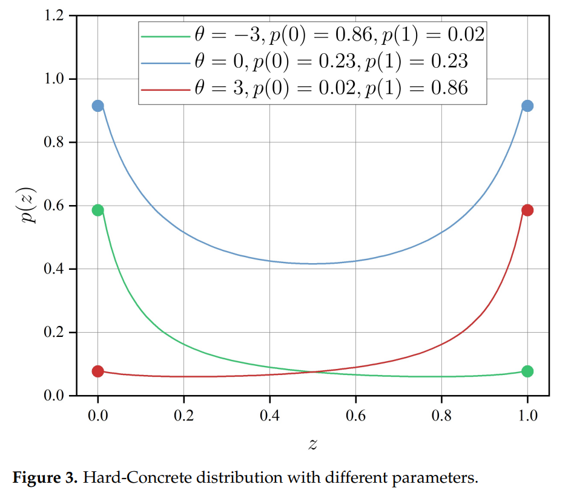
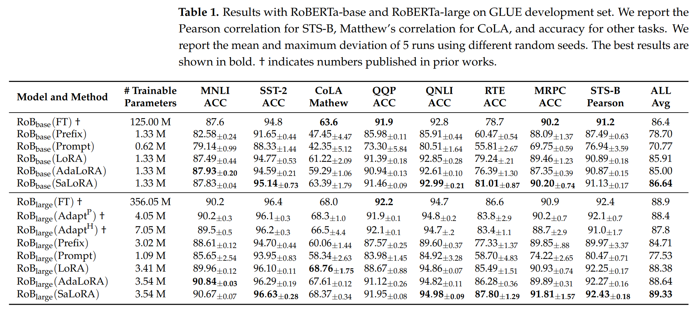
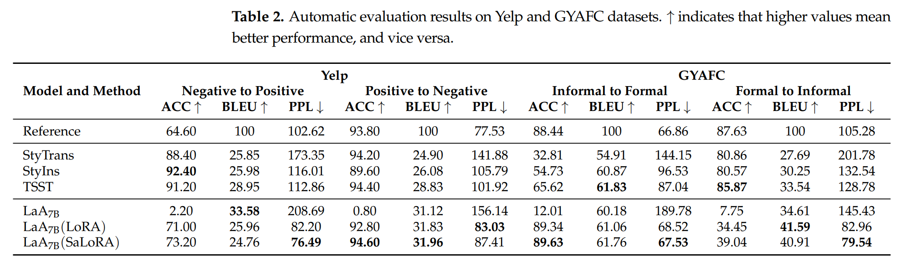
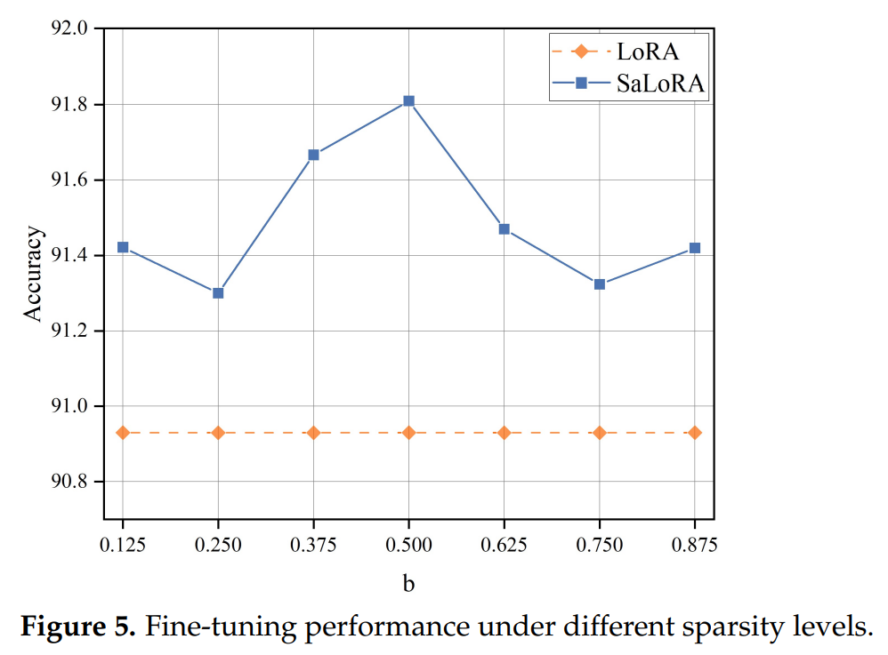
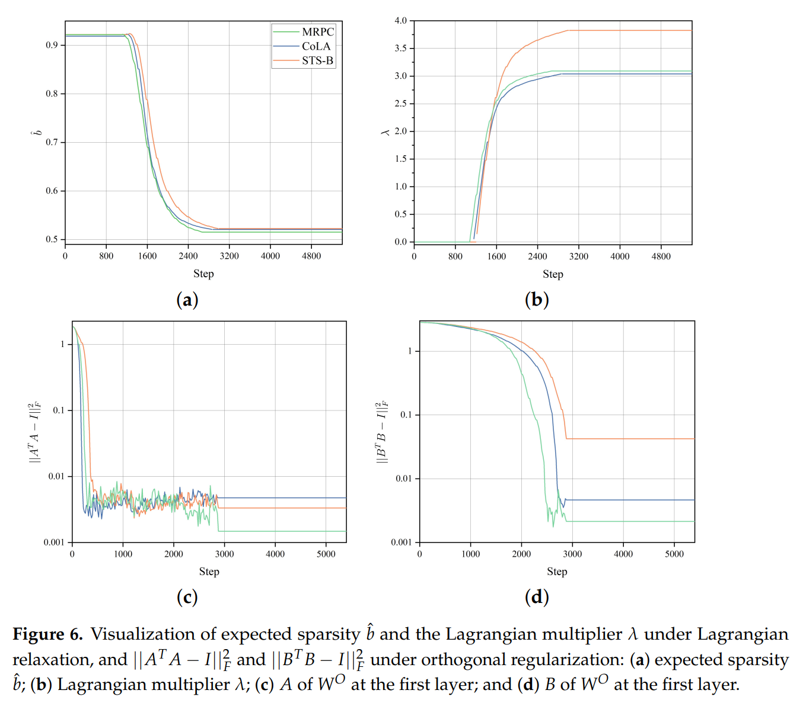
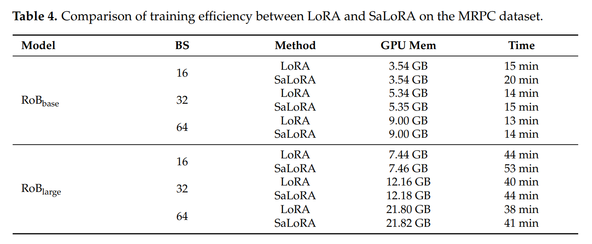
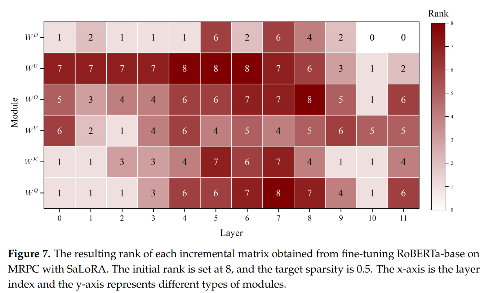

논문 및 이미지 출처 : <https://www.mdpi.com/2227-7390/11/20/4317>

# Abstract

pre-trained language model(PLM)의 규모가 커짐에 따라 full parameter fine-tuning 은 비용이 과도하게 들며 실질적으로 불가능해진다. 

이에 따라, pre-trained weights 를 점진적으로 업데이트하는 방식의 parameter-efficient adaptation 기법이 제안되었으며, 그중 하나가 low-rank adaptation(LoRA)이다. 

그러나 LoRA 는 적용할 modules 와 layers 를 선택하는 데 있어 경험적 방법에 의존하며, 동일한 rank 를 부여한다. 

이로 인해 modules 와 layers 간 structural information 를 무시한 fine-tuning 은 비효율적이다. 

본 연구에서는 structure-aware low-rank adaptation (SaLoRA)을 제안하며, 이는 training process 에서 rank-0 components 을 제거함으로써 각 incremental matrix 의 intrinsic rank 를 adaptively training 한다

저자는 다양한 규모의 pre-trained model 을 사용하여 GLUE 같은 task-oriented 및 Yelp, GYAFC 같은 task-agnostic 환경에서 포괄적인 실험을 수행하였다. 

실험 결과, SaLoRA 는 structure-aware intrinsic rank 를 효과적으로 포착하며, LoRA 보다 training efficiency 에 큰 영향을 미치지 않으면서도 일관되게 성능을 향상시킨다는 것을 보여준다.

# 1. Introduction

model 과 corpus 의 규모가 커짐에 따라, large-scale language model(LLM)은 NLP task 에서 in-context learning 능력을 보여주었다. 

즉, 몇 가지 예시만으로 context 내에서 training 을 수행하는 것이다. 

- in-context learning 은 이제 LLM 을 사용하는 주요 패러다임이 되었지만, task-specific fine-tuning 이 여전히 더 나은 성능을 보인다. 
- 이러한 경우에는, task-specific model 이 target task 에 맞춘 input-output examples 구성된 dataset 에서 독립적으로 훈련된다. 
- 그러나 large-scale model 을 다룰 때, 서로 다른 tasks 에 대해 all parameters 를 업데이트하고 저장하는 full parameter fine-tuning 은 비실용적이다.
- 실제로, billions parameters LLM 은 few parameters 만 최적화하여 효과적으로 fine-tuning 될 수 있다.

이로 인해 model tuning 을 위한 parameter-efficient fine-tuning(PEFT) 기법들이 등장하게 되었다. 

이는 model parameters 의 일부만 최적화하고 나머지는 고정하여, computation 및 storage costs 를 크게 줄인다. 

- LoRA 는 trainable low-rank decomposition matrices 을 LLM 에 도입하여, 모델이 original LLM 을 유지하고 획득한 지식을 보존하면서 new task 에 적응할 수 있도록 한다. 
- 기본적으로 이 접근법은 specific downstream task 에 적응하는 동안 pre-trained language model 의 weight update 가 low-rank 라는 가정에 기반한다. 
- 따라서 LoRA 는 incremental matrices 의 rank 를 줄임으로써, additional trainable parameter 의 0.5% 미만을 최적화한다. 
- 이 최적화는 full parameter fine-tuning 과 비교하여 유사하거나 더 나은 성능을 달성한다.

그러나 LoRA 는 여러 장점에도 불구하고, 몇 가지 한계점이 있다. 

1. LoRA 가 적용되는 modules 와 layers 를 선택하는 데 있어 경험적 방법에 의존한다는 점이다. 
   - 경험적 방법은 특정 상황에서는 효과적일 수 있지만, generalizability 이 부족하다는 점에서 문제가 된다. 
   - new data 에 적용될 때 성능이 최적화되지 않거나 완전히 실패할 가능성이 있다. 
2. 다양한 modules 와 layers 에 동일한 rank 를 부여한다는 점이다. 
   - 이는 신경망 내부의 복잡한 구조적 관계와 중요한 차이를 과도하게 단순화하는 경향이 있다. 
   - 이러한 현상은 Fig. 1 에 나타나 있다.

본 논문에서는 structure-aware low-rank adaptation(SaLoRA)을 제안하며, training process 에서 rank-0 components 을 제거함으로써 각 incremental matrices 의 intrinsic rank 를 적응적으로 학습한다. 

- Fig. 2 에 처럼, 저자는 각 incremental matrices 에 대해 diagonal gate matrix $G = diag(g_1, \dots, g_r)$ 을 도입한다. 
- 수정된 incremental matrices 은 $\Delta W = BGA$ 로 표현될 수 있다.
  - incremental matrices 은 세 부분으로 나뉘며, 각 부분 $T_i$ 는 $B$ 의 $i$-th column, $G$ 의 $i$-th gate mask, $A$ 의 $i$-th row 를 포함한다. 
    - 여기서 $g_i$ 는 $i$-th triplet 의 존재 여부를 나타내는 binary "gate"
  - activate triplet 개수를 learning objective 에 penalty term 으로 추가하는 것은 불가능하지만, 저자는 a differentiable relaxation method 를 사용하여 non-critical triplets 을 선택적으로 제거하는데, 이는 $L_0$ norm 을 고려한 것이다. 
  - $L_0$ norm 은 non-zero triplets 수와 같으며, 모델이 less essential triplets 를 비활성화하도록 유도한다. 
- 이 전략은 task-specific information 을 포착하기 위해 중요한 incremental matrices 에는 higher-rank 를 부여하고, less significant matrices 은 lower-rank 를 가지도록 가지치기하여 over-fitting 을 방지한다.
  - 그러나 $A$ 와 $B$ 는 orthogonal 하지 않기 때문에, triplets 간의 잠재적 의존성이 존재한다. 
    - 이러한 triplets 를 제거하면 original matrix 에서 significant deviation 가 발생할 수 있다.
    - training 의 stability 와 generalization 를 향상하기 위해, 저자는 $B$ 와 $A$ 에 대해 orthogonal regularization 을 도입한다. 
    - 또한 density constraint 를 통합하고, Lagrangian relaxation 을 활용하여 valid parameters 수를 제어한다.

저자는 SaLoRA 의 효율성을 평가하기 위해 다양한 task 와 model 에 대한 광범위한 실험을 수행하였다. 

특히, GLUE 벤치마크에서 모델 성능을 평가하기 위해 task-oriented setting 에서 실험을 진행하였다. 

또한, LLaMA-7B 를 50K cleaned instruction-following dataset 으로 fine-tuning 한 후, two text style transformer tasks (sentiment transfer, formality transfer)에서 zero-shot task inference  통해 task-agnostic setting 에서 모델 성능을 평가하였다. 

실험 결과, SaLoRA 는 training efficiency 을 크게 훼손하지 않으면서도 일관되게 LoRA 보다 우수한 성능을 보였다.

# 2. Background

#### Transformer Architecture.

Transformer 는 주로 two submodules 로 구성된다: multi-head self-attention(MHA) layers 와 fully fonnection (feedforward, FFN) layers. 

MHA 는 다음과 같이 정의된다:

$$
\begin{equation}
   \begin{align*}
      &\text{MHA}(Q, K, V) = \text{Concat}(\text{head}_1, \dots, \text{head}_h) W^O, \\
      &\text{head}_i = \text{Attention}(QW^Q_i, KW^K_i, VW^V_i)
   \end{align*}
\end{equation}
$$

- $Q, K, V \in \mathbb{R}^{n \times d}$ : input-embedding matrices
- $W_O \in \mathbb{R}^{d \times d}$ : output projection
- $W^Q_i, W^K_i, W^V_i \in \mathbb{R}^{d \times d_k}$ : 각각 $i$-th head 의 query, key, value projection
- $n$ : sequence length
- $d$ : embedding dimension
- $h$ : head 수
- $d_k = d/h$ : projection subspace 의 hidden dimension

FFN 는 ReLU activation function 으로 구분된 two linear trasnformations 로 구성된다:

$$
\begin{equation}
   \text{FFN}(x) = \text{ReLU}(xW^U + b^U)W^D + b^D
\end{equation}
$$

- $W^U \in \mathbb{R}^{d \times d_m}$, $W^D \in \mathbb{R}^{d_m \times d}$

#### Parameter-Efficient Fine-Tuning.

model scale 이 커짐에 따라, 최근 연구들은 세 가지 주요 parameter-efficient fine-tuning(PEFT) 기법을 개발됐다.

이 기법들은 model parameters 의 일부만 최적화하고 나머지는 고정하여, computation 및 storage costs 을 크게 줄인다. 

- additional-based methods 는 original model 또는 process 의 일부가 아닌 additional trainable module 또는 parameters 를 도입한다. 
- Specifcation-based methods 는 original model 또는 process 내에서 specific parameters 만 훈련 가능하도록 지정하고, 나머지는 고정 상태로 유지한다. 
- Reparameterization-based methods 는 LoRA 를 포함하여, 기존 parameters 를 변환하여 parameter-efficient 형태로 reparameterize 한다.

본 연구에서는 특히 LoRA 에 중점을 두어 reparameterization 기반 방법을 탐구한다.

#### Low-Rank Adaptation. 

LoRA 는 reparameterization-based methods 의 대표적인 예이다. 

- LoRA 에서는 pre-trained LLM 의 dense layers 일부 weight 가 trainable low-rank incremental matrices 을 주입함으로써 reparameterization 된다. 
  - 이 reparameterization 은 low-rank matrix 만 업데이트되도록 하고, original pre-trained weights 는 고정 상태로 유지한다. 
- 이러한 matrix 의 rank 를 줄임으로써, LoRA 는 LLM 의 fine-tuning 과정에서 parameters 수를 효과적으로 줄인다.
- pre-trained weight matrix $W \in \mathbb{R}^{d \times k}$ 에 low-rank incremental matrix $\Delta W = BA$ 가 추가되었다고 하자. 

$h = Wx$ 에 대한 수정된 forward pass 과정은 다음과 같다:

$$
h = Wx + \frac{\alpha}{r} \Delta W x = Wx + \frac{\alpha}{r} B A x
$$

- $B \in \mathbb{R}^{d \times r}$, $A \in \mathbb{R}^{r \times k}$
- rank $r$ : $\min(d, k)$
- $\alpha$ : constant scaling hyper-parameter
- matrix $A$ 는 random zero-mean Gaussian initialization
- matrix $B$ 는 zero matrix initialization
- 따라서 $\Delta W = BA$ 는 훈련 초기에는 zero 로 설정된다. 
- $B_{*j}$ 와 $A_{j*}$ 는 각각 $B$ 의 $j$-th column 과 $A$ 의 $j$-th row 을 나타낸다.

이를 통해, $\Delta W$ 는 다음과 같이 표현될 수 있다:

$$
\begin{equation}
   \Delta W = \sum_{j=1}^r B_{*j} A_{j*}
\end{equation}
$$

# 3. Method

## 3.1. Problem Formalization

저자는 LLM 을 specific downstream task 에 효율적으로 fine-tuning 하는 일반적인 문제를 고려한다. 

- training corpus $D = (x_i, y_i)_{i=1}^{N}$ 를 고려하며,
  - $N$ : samples 수
- 각 sample 은 input $x_i$ 와 그에 해당하는 output $y_i$ 로 구성된다. 
- 저자는 incremental matrices $\Delta W_i = B_i A_i$ 를 가리키는 index $i$ 를 사용하며, 
  - $i = 1, \dots, K$ 에서 $K$ 는 incremental matrices 의 수
- 그러나 LoRA 는 각 incremental matrices 에 동일한 rank 를 가정하여 modules 와 layers 간의 structural relationships 와 weight matrices 의 중요성을 간과한다. 
  - 이러한 간과는 전체 모델 성능에 잠재적인 영향을 미칠 수 있다. 
- 저자의 목표는 각 incremental matrices $\Delta W_i$ 에 대해 optimal $\text{rank}^*(\Delta W_i)$ 를 동적으로 결정하는 것이다. 

optimization objective 는 다음과 같이 공식화될 수 있다:

$$
\begin{equation}
   \begin{aligned}
      \min_\mathcal{W} \mathcal{R}(\mathcal{W}) \triangleq \frac{1}{N} \sum_{i=1}^{N} \mathcal{L}(f(x_i; \mathcal{W}), y_i) \\
      \text{s.t.} \quad \text{rank}(\Delta W_i) \leq r, \, k = 1, \dots, K.
   \end{aligned}
\end{equation}
$$

- $\mathcal{W} = \{\Delta W_1, \dots, \Delta W_K\}$ : trainable parameter set
- $\mathcal{L}$ : classification task 의 경우 cross-entropy 같은 loss function
- $\text{rank}(\Delta W_i) \in \{0, 1, \dots, r\}$ : optimizing 해야 하는 unkown parameter

## 3.2. Structure-Aware Intrinsic Rank Using $L_0$ Norm

training 중 minimal computational overhead 로 $\text{rank}^*(\Delta W_i)$ 를 동적으로 찾기 위해, 저자는 gate matrix $G$ 를 도입하여 structure-aware intrinsic rank 를 정의한다:

$$
\begin{equation}
   \Delta W = BGA = \sum_{j=1}^{r} g_j B_{*j} A_{j*}
\end{equation}
$$

- $g_j \in \{0, 1\}$ : $j$-th rank 의 존재 여부를 나타내는 binary "gate" 로 작동한다.
- gate matrix $G = \text{diag}(g_1, \dots, g_r)$ 는 pruning variables 로 이루어진 diagonal matrix
- variable $g_j$ 를 학습함으로써, all matrices 에 동일한 rank 를 적용하는 대신 각 incremental matrices 의 rank 를 개별적으로 제어할 수 있다. 
- non-critical rank-0 components 를 비활성화하려면, gate matrix $G$ 에 $L_0$ norm regularization 을 적용하는 것이 이상적이다:

$$
||G||_0 = \sum_{j=1}^{r} g_j
$$

- $r$ : incremental matrices 의 rank 
- $L_0$ norm : non-zero triplets 의 수를 측정하며, $L_0$ 을 최적화하면 less important incremental matrices 를 비활성화하도록 모델을 유도할 수 있다.

불행히도 $||G||_0$ 를 포함한 optimization objective 는 non-differentiability 여서 계산적으로 불가능하며, objective unfction 에서 이를 직접적으로 regularization term 으로 통합할 수 없다. 

대신, 저자는 gate variables 를 $[0, 1]$ 구간 내에서 continuous variables 로 처리하는 stochastic relaxation approach fmf 사용한다. 

gate variables 가 differentiable 이 유지되도록 reparameterization trick 을 사용한다.

이전 연구를 따르며, 저자는 random variables $g$ 의 continuous surrogate 로 Hard-Concrete (HC) distribution 을 채택하고, 이를 Fig. 3 에 나타낸다. 

HC distribution 은 $s$ 에 hard-sigmoid rectification 을 적용하여, 먼저 $u \in U(0, 1)$ 을 sampling 한 후 다음과 같이 계산된다:

$$
\begin{equation}
   \begin{aligned}
      &s = \text{Sigmoid} \left( \frac{\log \frac{u}{1-u} + \log \theta}{\tau} \right) \times (\zeta - \gamma) + \gamma \\
      &g = \min(1, \max(0, s))
   \end{aligned}
\end{equation}
$$

- $\theta$ : distribution 의 trainable parameters
- $\tau$ : temperature
- $\gamma < 0$, $\zeta > 1$ 인 구간 $(\gamma, \zeta)$ 는 support egde 에서 probability mass 을 집중시킬 수 있게 한다. 
- final output $g$ 는 $[0, 1]$ 내에서 정정된다. 

gate 가 non-zero probabilities 의 합을 통해 $L_0$ norm regularization 을 다음과 같은 closed form 으로 계산할 수 있다:

$$
\begin{equation}
   \begin{aligned}
      E[||G||_0] &= \sum_{j=1}^{r} E[g_j > 0] \\
      &=  \sum_{j=1}^{r} \text{Sigmoid} \left(\log \theta_j - \tau \log \frac{-\gamma}{\zeta} \right)
   \end{aligned}
\end{equation}
$$

- 이제 $g$ 는 parameterized HC distribution function 의 output 으로, 신경망의 intermediate representation 으로 작동하며, $\theta = \{\theta_1, \dots, \theta_r\}$ 에 대한 gradient-based optimization methods 가 가능해진다.
- 각 training batch 의 경우, 저자는 gate mask 를 sampling 한 후 sampling efficiency 향상을 위해 batch 내의 training examples 전역에 이를 공유시킨다.

## 3.3. Enhanced Stability Using Orthogonal Regularization

DNN 에서 Orthogonality 는 multiplication 과정에 original matrix 의 norm 을 유지하며 signal vanishing 또는 exploding 현상을 방지하는 데 중요한 역할을 한다. 

그러나 LoRA 에서는 $B$ 와 $A$ 가 orthogonal 이 아니므로, $L_0$ regularization 을 통해 특정 columns 나 rows 를 제거할 경우 큰 변화가 발생할 수 있다. 

이는 training instability 로 이어지고, generalization 성능에 부정적인 영향을 미칠 수 있다. 

이를 해결하기 위해 orthogonal regularization 을 적용하여 orthogonality condition 을 강제한다:

$$
\begin{equation}
   \mathcal{R}_{\text{orth}}(B, A) = ||B^T B - I||^2_F + ||A A^T - I||^2_F
\end{equation}
$$

- $I$ : identity matrix

이제 Eq. (8) 와 Eq. (9) 를 Eq. (4) 에 대입하여 new training objective 를 도출할 수 있다:

$$
\begin{equation}
   \min_{\mathcal{W}, \Theta} \mathcal{R}(\mathcal{W}, \Theta) , \frac{1}{N} \sum_{i=1}^{N} \mathcal{L}(f(x_i;\mathcal{W}), y_i) + \lambda \sum_{i=1}^{K} E[||G_i||_0] + \beta \sum_{i=1}^{K} \mathcal{R}_{\text{orth}}(B_i, A_i)
\end{equation}
$$

- $\Theta = \{\theta_i, \dots, \theta_K\}$ : trainable parameter set
- $\lambda$ 와 $\beta$ 는 two constant hyper-parameter

## 3.4. Controlled Budget Using Lagrangian Relaxation

Eq. (10) 만을 사용하여 각 incremental matrices 의 intrinsic rank 를 학습하면, 결과적으로 parameter budget 을 직접적으로 제어할 수 없다. 

이는 특정 model size 나 parameter budget 을 요구하는 실제 응용에서 문제가 될 수 있다. 

이 문제를 해결하기 위해, 저자는 네트워크가 specific desired budget 을 달성할 수 있도록 $\mathcal{R}(\mathcal{W}, \Theta)$ 에 additional density constraint 를 도입한다.

$$
\begin{equation}
   \begin{aligned}
      \min_\mathcal{W} \mathcal{R}(\mathcal{W}) , &\frac{1}{N} \sum_{i=1}^{N} \mathcal{L}(f(x_i;\mathcal{W}), y_i) + \beta \sum_{i=1}^{K} \mathcal{R}_{\text{orth}}(B_i, A_i) \\
      &\text{s.t.} \quad C(\Theta) \triangleq \sum_{i=1}^{K} \frac{E[||G_i||_0] \times (d_i + k_i)}{\#(B_i) + \#(A_i)} = b
   \end{aligned}
\end{equation}
$$

- $b$ : target density
- $\#(x)$ : matrix $x$ 내의 total parameters 수
- $\Delta W_i = B_i A_i$
  - $B_i$ 는 $d_i \times r_i$, $A_i$ 는 $r_i \times k_i$ 형태
- 그러나 density constraint 를 낮추는 것은 어려운 문제이며, 반드시 constrained optimization problem 은 아니다. 

이 문제를 해결하기 위해 Lagrangian relaxation 을 활용하여 대안적 접근을 취하고, 이에 따른 min-max game 을 적용한다:

$$
\begin{equation}
   \max_{\lambda} \min_{\mathcal{W}, \Theta} \mathcal{L}(\mathcal{W}, \Theta, \lambda) \triangleq \mathcal{R}(\mathcal{W}, \Theta) + \lambda (C(\Theta) - b)^2
\end{equation}
$$

- $\lambda \in \mathbb{R}$ :Lagrangian multiplier, training 중에 함께 업데이트된다. 
- $\lambda$ 의 업데이트는 equality constraint 가 만족되지 않으면 training loss 를 증가시키며, desired parameter budget 을 달성하게 한다. 
  - 저자는 이전 연구대로, $\lambda$ 에 대한 projected gradient ascent 와 $(\mathcal{W}, \Theta)$ 에 대한 gradient ascent 를 동시에 수행하여 Lagrangian relaxation 를 최적화한다. 
  - 실험 중 저자는 $\lambda (C(\Theta) - b)^2$ term 이 빠르게 수렴하는 것을 관찰했다. 
- training efficiency 을 높이기 위해, 저자는 $T_{\text{start}}$ 와 $T_{\text{end}}$ time step 사이에서만 $\Theta$ 와 $\lambda$ 를 최적화한다.

Algorithm 1 에 요약된 알고리즘을 제공한다.

## 3.5. Inference

- training 중에 gate mask $g_i$ 는 HC distribution 의 random variable 이다.
- inference 시 저자는 먼저 $G$ 내에서 각 $g_i$ 의 expected value 를 계산한다. 
- 만약 $g_i$ 가 0 보다 크다면, 해당 $i$-th low-rank triplets 를 유지한다. 
- 이 과정을 통해 deterministic matrices $B$ 와 $A$ 를 얻을 수 있다.

# 4. Experiments

저자는 제안된 SaLoRA 의 효과를 RoBERTa 와 LLaMA7B 에서 task-oriented 및 task-agnostic settings. 모두에서 평가.

#### Baselines

SaLoRA 를 다음의 방법들과 비교했다:

- **Fine-tuning (FT)**: 가장 일반적인 방법으로, 제안된 방법의 성능 상한을 설정하기 위해 모델 내 all parameters 를 fine-tuning 한다.
- **Adapting tuning**: self-attention module (및 MLP module)과 subsequent residual connection 사이에 adapter layers 를 추가한다. 
  - 각 adapter module 은 two fully connected layers 와 그 사이의 nonlinearity 를 포함한다. 이 원래 디자인은 Adapter$^H$ 로 불린다. 
  - 최근엔 MLP module 이후에만 adapter layers 를 적용하고 LayerNorm 을 따르는 더 효율적인 접근 방식을 소개했다. 이를 Adapter$^P$ 라고 부른다.
- **Prefix-tuning (Prefix)**: input 에 continuous task-specific activations 의 sequence 를 추가한다.
  - tuning 중에는 model parameters 를 고정하고 오직 prefix activations 에만 gradient 를 backpropagate 한다.
- **Prompt-tuning (Prompt)**: prefix-tuning 의 단순화된 버전으로, 각 downstream task 에 대해 additional $k$ tunable tokens 를 input text 에 추가할 수 있다.
- **LoRA**: original LoRA 구현은 query 와 value projection 에만 적용되었다. 그러나 경험적 연구는 LoRA 를 $W^Q$, $W^K$, $W^V$, $W^O$, $W^U$, $W^D$ 를 포함한 all matices 에 확장하면 성능이 더 향상될 수 있음을 보여주었다. 따라서 이 generalization 된 LoRA 구성과 저자의 접근 방식을 비교하여 효과를 극대화했다.
- **AdaLoRA**: importance scores 에 따라 weight matrices 간의 parameter budget 을 적응적으로 배분하기 위해 singular value decomposition 을 사용한다. 
  - 그러나 이 baseline 은 특히 large matrices 에 대해 계산 집약적인 작업을 수반하므로, 자원이 제한된 시나리오에서는 비효율적일 수 있다.

## 4.1. Task-Oriented Performance

#### Models and Datasets.

GLUE 에서 pre-trained RoBERTa-base (125M) 와 RoBERTa-large (355M) model 을 사용하여 다양한 적응 방법의 성능을 평가했다. 

HuggingFace Transformers 에서 제공하는 모델을 활용한다.

#### Implementation Details.

- all baseline 방법을 실행하기 위해 공개된 구현을 사용. 
- LoRA, AdaLoRA, SaLoRA 의 성능을 $r = 8$ 에서 평가했다. 
- 제어된 parameter budget 을 유지하기 위해 SaLoRA 와 AdaLoRA 모두에 대해 parameter budget 비율 $(b)$ 을 0.50 으로 설정했다. 
- training 중에는 AdamW optimizer 와 linear learning rate scheduler 를 사용했다. 
- 실험 중, gate matrix 과 Lagrange multiplier 의 학습을 위해 large learning rate $(\eta_c)$ 을 사용하는 것이 learning process 에 크게 개선된다는 것을 관찰했다. 
- 따라서 모든 실험에서 $\eta_c$ 를 0.01 로 설정했다. 
- 모든 모델은 NVIDIA A100 (40 GB) GPU 를 사용하여 fine-tuning 했다.

#### Main Results.

SaLoRA 를 다양한 model scale 설정에서 baseline 방법들과 비교했으며, GLUE dev set 의 실험 결과는 Tab. 1 에 제시되어 있다. 

- SaLoRA 는 all datasets 에서 기존 방법들과 비교하여 일관되게 더 나은 성능을 달성하거나 유사한 성능을 보였다. 
- 또한, FT 방법을 초월하는 성능을 보였다. 
- 특히 SaLoRA 는 LoRA 와 비교했을 때 two models 가 base/large model scale 에서 유사한 parameters 수 1.33M/3.54M 을 가지는데도 불구하고 특히 두드러진 우수성을 보였다. 
- training 후 SaLoRA 는 0.5 × 1.33M/0.5 × 3.54M parameters 만을 효과적으로 사용했으면서도 여전히 우수한 성능을 달성했다. 
- 이 관찰 결과는 증가된 행렬의 intrinsic rank 를 학습하는 데 있어 SaLoRA 의 효과를 강조한다.

## 4.2. Task-Agnostic Performance

#### Models and Datasets.

저자는 self-instruct tuned LLaMA-7B 모델의 성능을 instruction-following data 에서 평가하기 위해 실험을 진행했다. 

저자의 목표는 모델이 arbitrary tasks 에 대한 instruction 을 이해하고 실행할 수 있는 능력을 평가하는 것이었다. 

저자는 two text-style transfer datasets 인 Yelp 와 GYAFC 에서 모델 성능을 평가했다. 

text-style transfer 은 sentence 의 style 을 원하는 style 로 변경하면서 style-independent content 를 유지하는 작업을 의미한다.

#### Implementation Details.

learning rate $\eta_p$ 를 $\{8 \times 10^{-5}, 3 \times 10^{-5}, 1 \times 10^{-4}, 3 \times 10^{-4}, 8 \times 10^{-4}, 1 \times 10^{-3}\}$ 중에서 조정했으며, 나머지 hyper-parameter 는 다음과 같이 고정했다: $r = 8$, $b = 0.5$, $\eta_c = 0.01$, $\beta = 0.1$, $\tau = 1.0$, $\gamma = -0.1$, $\zeta = 1.1$.

모든 모델은 NVIDIA A800 (80 GB) GPU 에서 fine-tuning 되었다.

또한, SaLoRA 와 dataset-specific style transfer models 인 StyTrans, StyIns, TSST 의 성능을 비교했다. 

SaLoRA 와는 달리, 이들 모델은 dataset-specific 에 대해 훈련되었다. 

style transfer models 의 성능을 평가하기 위해 다음과 같은 metric 을 사용했다: (1) 각 dataset 에 대해 fine-tuned BERT-base classifier 를 사용한 Transfer Accuracy (ACC). (2) BLEU scores 를 통한 human references 와의 Semantic Similarity. (3) KenLM 으로 측정된 perplexity(PPL) 를 통한 Sentence Fluency.

#### Main Results.

Tab. 2 는 Yelp 와 GYAFC dataset 에서의 실험 결과를 제시한다. 

- SaLoRA 는 LoRA 와 비교하여 모든 방향에서 더 나은 성능 또는 유사한 성능을 달성했다. 
  - 이는 SaLoRA 의 효과성을 입증한다. 
- negative-to-positive transfer direction 에선 SaLoRA 의 transfer accuracy 가 dataset-specific models (e.g., StyIns 의 92.40)보다 낮았지만, 여전히 human reference accuracy 인 64.60 과 일치했다. 
- 또한, SaLoRA 는 dataset-specific models 에 비해 lower perplexity(PPL)를 보였다. 
  - 이 결과는 SaLoRA(및 LoRA)가 human writing tendencies 와 더 밀접하게 일치한다는 것을 보여준다. 
- formal-to-informal transfer direction 에서도 dataset-specific models 보다 낮은 transfer accuracy 를 보였다. 
- 이 차이는 large models 가 more formal outputs 를 생성하는 경향이 있기 때문일 수 있다. 
- SaLoRA 는 dataset-specific models 보다 transfer accuracy 에서 상당한 개선을 보였다.

## 4.3. Analysis

#### The Effect of Rank $r$.

Fig. 4 는 다양한 rank 에서 RoBERTa-large 의 fine-tuning 실험 결과를 보여준다. 

- rank $r$ 이 모델 성능에 상당한 영향을 미친 것을 알 수 있다. 
- rank 가 너무 크거나 작으면 성능이 최적이 아니었다. 
- 이 관찰은 휴리스틱 접근 방식을 통해 $r$ 의 optimal value 를 선택하는 것이 항상 가능한 것은 아님을 강조한다. 
- 특히, SaLoRA 는 all rank 에서 baseline LoRA 와 비교하여 일관되게 성능을 향상시켰다. 
- 이는 SaLoRA 가 incremental matrix 의 “intrinsic rank” 를 효과적으로 포착했다는 것을 시사한다.

#### The Effect of Sparsity $b$.

Fig. 5 는 다양한 sparsity level 에서 RoBERTa-large 의 fine-tuning 실험 결과를 보여준다. 

- 눈에 띄게, SaLoRA 는 all sparsity level 에서 baseline 과 비교하여 향상된 성능을 일관되게 나타냈다. 
- 이 결과는 SaLoRA 의 수정 사항이 다양한 sparsity 하에서도 incremental matrix 의 “intrinsic rank” 를 획득하는 데 도움이 되었음을 시사한다. 
- 특히, SaLoRA 는 low sparsity conditions (0.125) 에서도 LoRA 의 결과를 초월했다. 
- SaLoRA 가 low sparsity conditions 에서도 LoRA 를 초과할 수 있다는 사실은 limited budget 내에서도 parameters 를 포착하고 활용할 수 있는 능력을 강조한다. 
- 따라서 SaLoRA 는 limited budget 내에서 그 효능이 확장될 수 있으며, 더 넓은 응용 분야에서 유용한 방법이 될 수 있다.

#### Ablation Study.

저자는 SaLoRA 에서 Lagrangian relaxation 와 orthogonal regularization 의 영향을 조사했다.

구체적으로, 다음과 같은 variants SaLoRA 를 비교했다: (i) SaLoRA$_{\lambda=0}$: Lagrangian relaxation 가 없는 SaLoRA; (ii) SaLoRA$_{\beta=0}$: orthogonal regularization 가 없는 SaLoRA. 

이러한 variants 는 CoLA, STS-B, MRPC dataset 에서 RoBERTa-base model 의 fine-tuning 에 포함되었다. 

target sparsity 는 기본적으로 0.5 로 설정되었다. 

SPS 는 incremental matrix 의 expected sparsity 를 나타낸다. 

Tab. 3 에서 다음과 같은 결과를 볼 수 있다:

1. Lagrangian relaxation 가 없으면 parameter budget 을 제어할 수 없었으며, 3 datasets 에서 각각 0.37, 0.42, 0.43 이었다. 
   - 이러한 결과는 Lagrangian relaxation 가 parameter budget 의 할당을 제어하는 데 중요한 역할을 한다는 것을 강조한다. 
   - 그럼에도 불구하고, Lagrangian relaxation 를 생략하면 성능이 약간 향상될 수 있다. 
   - 그러나 parameter budget 제어의 중요성을 고려할 때, 이 additional 향상은 무시해야 한다.
2. orthogonal regularization 가 없으면 SaLoRA 의 성능이 저하되었다. 
   - 이러한 결과는 SaLoRA 에 orthogonal regularization 을 포함시킴으로써 쌍들이 서로 독립적이게 되어 성능이 크게 향상된다는 것을 검증한다.

#### Visualization of Four Components.

저자는 4 components 의 시각화, 즉 expected sparsity $\hat{b}$, Lagrangian multiplier $\lambda$ 및 $||A^T A - I||_F^2$, 그리고 $||B^T B - I||_F^2$ 를 플로팅하여, 이 4 components 가 각각 Lagrangian relaxation 와 orthogonal regularization 에 의해 regularization 되는지 여부를 보여주었다. 

구체적으로, 저자는 CoLA, STS-B, MRPC dataset 에서 SaLoRA 를 사용하여 RoBERTa-base 를 fine-tuning 하였다. 

initial Lagrangian multiplier $\lambda$ 는 0 으로 설정되었으며, target sparsity $b$ 는 0.5 였다. 

Fig. 6 에서 다음과 같은 결과를 볼 수 있다:

1. expected sparsity $\hat{b}$ 는 0.92 에서 약 0.50 으로 감소하였으며, Lagrangian multiplier $\lambda$ 는 training 동안 계속 증가하였다. 
   - 이 결과는 SaLoRA 알고리즘이 constraints 를 충족하는 데 더 중점을 두었으며, 결국 constraints 를 충족시키는 것과 objective function optimizing 간의 균형을 이루었음을 나타낸다.
2. $||A^T A - I||_F^2$와 $||B^T B - I||_F^2$의 값은 매우 미미한 수준 (e.g., 0.001)으로 최적화될 수 있었다. 따라서 이 최적화 과정은 A 와 B 두 행렬에 대해 orthogonal 을 강제하였으며, 쌍들이 서로 독립적이도록 보장하였다.

#### Comparison of Training Efficiency.

저자는 SaLoRA 의 memory 및 computational efficiency 를 분석하였다. 

Tab. 4 에서 RoBERTa 모델의 두 가지 크기, 즉 RoBbase 와 RoBlarge 를 선택하여, NVIDIA A100 (40 GB) GPU 에서 다양한 batch size 하의 peak GPU memory 와 training time 을 측정하였다. 

Tab. 4 에서 다음과 같은 결과를 볼 수 있다:

1. 두 방법의 GPU 메모리 사용량은 매우 유사하였다. 이러한 결과는 SaLoRA 가 상당한 memory overhead 를 발생시키지 않음을 보여준다. 
   - 그 이유는 SaLoRA 가 LoRA 와는 달리 gate matrix 만을 도입하기 때문이다. 
   - 총 parameters 수는 $r \times L \times M$ 이다. 
     - $r$ 은 incremental matrix 의 rank (8 로 설정됨)
     - $L$ 은 모델 내의 layer 수 (RoBbase 는 12, RoBlarge 는 24)
     - $M$ 은 각 layer 의 module 수 (6 으로 설정됨)를 나타낸다.
2. SaLoRA 를 사용할 때, batch size 32 에서 training time 이 LoRA 에 비해 11% 증가하였다. 
   - 이는 SaLoRA 가 성능에서 뚜렷한 향상을 이루었음을 나타낸다. 
   - SaLoRA 는 전체 training time 의 30%에 해당하는 specific training phase (T$_{start}$ 부터 T$_{end}$ 까지)에서만 사용되므로, 나머지 70% 는 LoRA 와 동일하게 진행된다. 
   - 따라서 전체적인 training time 에 미치는 영향은 관리 가능한 수준에 유지된다.

#### The Resulting Rank Distribution.

Fig. 7 은 SaLoRA 를 사용하여 RoBERTa-base 를 fine-tuning 하면서 얻어진 각 incremental matrix 의 rank 를 보여준다.

- SaLoRA 는 항상 module (W$^U$, W$^O$, W$^V$)과 layer (4, 5, 6, 7)에 higher rank 를 할당하는 것을 관찰하였다. 
- 이는 Fig. 1 에서 보여진 실험적 결과와 일치하며, module(W$^U$, W$^O$, W$^V$)과 layer (4, 5, 6, 7)가 모델 성능에서 중요한 역할을 한다는 것을 나타낸다. 
- 따라서 이 발견은 SaLoRA 가 중요한 modules 와 layers 를 효과적으로 우선시하는 동시에, incremental matrix 의 structure-aware intrinsic rank 를 학습하는 능력을 강조한다.

# 5. Conclusions

본 논문에서는 structure-aware low-rank adaptation 방법인 SaLoRA 를 제안하였다. 

- SaLoRA 는 각 incremental matrix 의 intrinsic rank 를 적응적으로 학습한다. 
- SaLoRA 에서는 activated gate 수를 기반으로 $L_0$ norm 을 패널티하여 incremental matrix 의 rank 를 조정하는 diagonal gate matrix 을 도입하였다. 
- training stability 와 model generalization 를 향상시키기 위해 $B$ 와 $A$ 를 orthogonal regularization 하였다. 
- 또한, density constraint 를 통합하고 Lagrangian relaxation 를 사용하여 유효 rank 수를 제어하였다. 

실험 결과, SaLoRA 는 structure-aware intrinsic rank 를 효과적으로 캡처하며, training efficiency 을 크게 희생하지 않고도 LoRA 를 일관되게 능가함을 보여주었다.