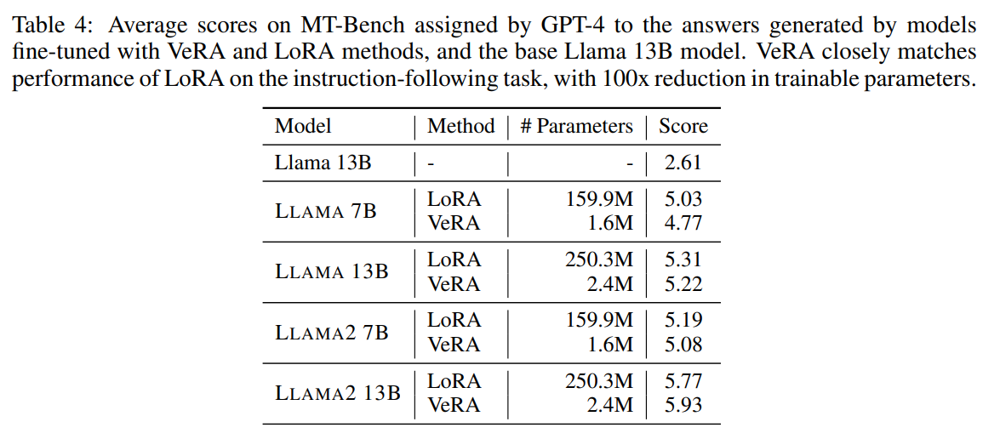
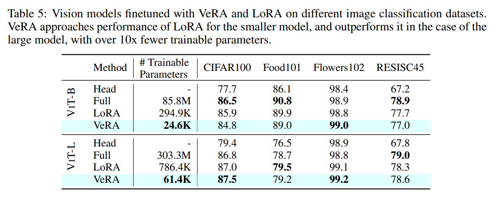

논문 및 이미지 출처 : <https://arxiv.org/pdf/2310.11454>

# Abstract

Low-rank adapation (LoRA) 는 large language models 의 finetuning 시 trainable parameter 수를 줄이는 인기 있는 방법이지만, 더 큰 model 로 확장하거나 사용자별 혹은 task 별로 수많은 adapted model 을 배포할 때 여전히 심각한 저장소 문제에 직면한다. 

본 연구에서는 LoRA 와 동일한 성능을 유지하면서도 trainable parameter 수를 크게 줄이는 **Vector-based Random Matrix Adaptation (VeRA)** 를 제안한다. 

* VeRA 는 모든 layer 에 걸쳐 공유되는 하나의 low-rank matrix pairs 를 사용하고, 대신 small scaling vector 를 학습함으로써 이를 달성한다. 
* 저자는 GLUE 및 E2E benchmark, image classification task 에서 그 효과를 입증하였으며, 7B 및 13B language models 의 instruction-tuning 에서의 적용을 보여준다.

# 1 Introduction

점점 더 크고 복잡해지는 language model 시대에서 특정 task 에 대한 efficient adaptation 문제는 그 어느 때보다 중요해지고 있다. 이러한 model 들은 강력한 기능을 제공하지만, 막대한 memory 요구량은 특히 personalized 사용을 위해 adaptation 할 때 심각한 병목이 된다. 예를 들어, 개별 사용자의 행동과 feedback 에서 지속적으로 학습하고 이를 반영하는 cloud 기반 운영체제 assistant 를 생각해 보자. 사용자별로 finetuned model 의 checkpoint 를 저장해야 하는 필요성은 저장 공간 요구량을 빠르게 증가시키며, 여러 task 가 결합될 경우 그 문제는 더욱 심각해진다.

이 문제는 GPT-4 와 같은 최신 SOTA model 에서 더욱 두드러진다. LoRA 와 같은 finetuning 기법은 효과적이지만 여전히 상당한 memory overhead 를 발생시킨다. 예를 들어, GPT-3 의 query 및 value layer 에 rank 16 의 LoRA 를 적용할 경우 single-precision 으로 저장했을 때 최소 288MB 의 memory 가 필요하다. 만약 이를 백만 개의 finetuned weight (e.g., 사용자별 1 개) 로 확장하면, 총 275TB 가 된다. 

최근 language model 의 확산과 personalized assistant, edge device 등에서의 활용을 고려할 때, efficient adaptation 방법은 필수적이다. 저자는 더 효율적인 접근이 가능하다고 본다. Aghajanyan et al 은 pretrained model feature 의 intrinsic dimensionality 가 매우 낮다고 지적하였다. 이 연구들은 LoRA 에서 사용되는 trainable parameter 수보다 훨씬 낮은 수치를 보고하였으며, 이는 개선 여지가 있음을 시사한다.

동시에, 최근 연구들은 random weight 와 projection 을 사용하는 model 이 놀라운 효과를 보인다는 사실을 보여주었다. 이러한 model 들은 저자의 제안인 Vector-based Random Matrix Adaptation (VeRA) 의 기반이 된다. 

* VeRA 는 weight matrix 를 reparametrization 함으로써 finetuning 동안 도입되는 trainable parameter 수를 최소화한다. 
* 구체적으로, 저자는 layer 간에 공유되는 fixed random matrix pairs 를 두고 이를 적응시키기 위해 “scaling vector” 를 사용한다. 
* 이 접근을 통해 single GPU 의 제한된 memory 안에 훨씬 더 많은 model 버전을 담을 수 있다.

요약하면, 저자의 주요 기여는 다음과 같다.

* additional inference time cost 가 없는 새로운 finetuning 방법을 제안한다. 이 방법은 SOTA 인 LoRA 와 비교해 trainable parameter 수를 더 줄이면서도 유사한 성능을 낸다.
* 저자의 방법을 LoRA 및 다른 parameter-efficient adaptation 방법과 비교하여 natural language understanding (GLUE) 및 natural language generation (E2E) benchmark 에서 평가하고, instruction-following 및 image classification task 에서도 LoRA 와 비교한다.
* 방법의 개별 구성 요소와 그것이 성능에 미치는 영향을 더 잘 이해하기 위해 ablation study 를 수행한다.

# 2 Related Work

#### Low-Rank Adaptation (LoRA).

LoRA 는 large pretrained language model 의 finetuning 과정에서 발생하는 계산적 문제에 대한 혁신적인 해결책을 제시한다. Hu et al. 이 제안한 이 방법은 finetuning 동안의 weight 변화량을 low-rank matrix 로 근사하여 학습해야 하는 parameter 수를 효과적으로 줄인다. 

* LoRA 의 장점 중 하나는 대부분의 parameter 에 대해 gradient 계산 및 optimizer state 유지 필요성을 줄임으로써 finetuning 의 hardware 장벽을 크게 낮춘다는 점이다. 
* 또한 quantized model weight 와도 함께 사용할 수 있어 요구 사항을 더욱 줄일 수 있다. 
* 더 나아가 LoRA module 은 쉽게 교체 가능하여 task 전환이 효율적이고 자원 소모가 적다. 
* 중요한 점은 adapter-based finetuning 접근과 달리, LoRA 는 배포 시 additional inference time cost 가 발생하지 않는다. 이는 trainable matrix 가 fixed weight 와 병합될 수 있기 때문이다.

이를 기반으로 AdaLoRA 는 finetuning 중 low-rank matrix 의 rank 를 동적으로 조정하는 기법을 도입하여 LoRA 를 확장하였다. 핵심 아이디어는 importance metric 에 기반해 matrix 의 덜 중요한 구성 요소를 선택적으로 pruning 하여 parameter budget 을 최적으로 분배하는 것이다.

#### Parameter Efficiency in Existing Methods.

LoRA 와 같은 방법들은 finetuning 성능에서 상당한 향상을 보여주었지만 여전히 상당한 수의 trainable parameter 를 요구한다. Aghajanyan et al. 은 intrinsic dimension 의 upper bound 가 이러한 방법에서 일반적으로 사용되는 것보다 훨씬 작다고 보고하였다. 예를 들어, RoBERTa base 의 경우 $d_{90}$ 이 896 으로 보고되었으나, LoRA 논문에서는 해당 model 에 대해 0.3M 개의 trainable parameter 를 사용했다고 보고하였다. 이는 parameter 수를 더 줄일 수 있음을 시사한다. 

AdaLoRA 는 parameter 를 더 중요한 layer 에 동적으로 할당함으로써 이 방향으로 나아가지만, 저자는 다른 접근을 통해 약간의 성능 저하를 감수하면서도 상당한 parameter 감소를 달성할 수 있다고 본다. 이는 저자가 다음 섹션에서 소개하는 방법의 기반이 된다.

#### Random Models and Projections.

Random matrix 와 projection 을 활용한 model efficiency 는 여러 연구에서 뒷받침되고 있다. 

* Frankle & Carbin 은 무작위로 초기화된 neural network 안에 학습 시 높은 성능에 도달할 수 있는 subnetwork 가 존재함을 확인하였다. 
* Ramanujan et al. 은 학습이 전혀 없는 경우에도 놀라운 성능을 낼 수 있는 subnetwork 가 존재함을 밝혔다. 
* Aghajanyan et al. 은 전체 공간으로 random projected few parameter 만 학습해도 full-parameter model 의 90% 성능을 달성할 수 있음을 보였다. 
* Ruiz et al. 은 text-to-image model 의 personalization 을 위해 random frozen matrix 를 LoRA 내부에 활용하는 parameter-efficient finetuning 방법을 제안하였다. 
* 또한 Lu et al., Schrimpf et al., Frankle et al. 의 연구는 frozen, 무작위 초기화된 model 에서 작은 부분만 finetuning 해도 놀라운 성능을 낼 수 있음을 보여주었다.

종합적으로, 이러한 연구들은 finetuning 방법에서 frozen random matrix 활용에 대한 강력한 근거를 제시하며, 본 논문에서 채택한 접근의 이론적 및 경험적 기반을 제공한다.

# 3 Method

이 절에서는 **Vector-based Random Matrix Adaptation (VeRA)** 를 소개한다. 

VeRA 는 SOTA 방법인 LoRA 를 기반으로 확장한 parameter-efficient finetuning 방법이다. VeRA 의 핵심 혁신은 low-rank matrix 의 reparameterization 에 있다. 구체적으로, 모든 adapted layer 에 걸쳐 공유되는 무작위 초기화된 matrix pairs 를 고정(freeze)하고, 각 layer 별 adaptation 을 가능하게 하는 trainable scaling vector 를 도입한다 (Fig. 1 참조). LoRA 와 마찬가지로, 학습된 scaling vector 와 low-rank matrix 는 원래 weight 와 병합될 수 있어 additional inference latency 가 발생하지 않는다.

## 3.1 Method Formulation

LoRA 는 새로운 task 에 large-language model 을 적응시키기 위해 두 개의 low-rank matrix 곱을 finetuning 한다. 정식적으로, pretrained weight matrix $W_0 \in \mathbb{R}^{m \times n}$ 에 대해 weight update $\Delta W$ 는 다음과 같이 low-rank decomposition 으로 제한된다:

$$
h = W_0 x + \Delta W x = W_0 x + \underline{BA}x,
\tag{1}
$$

여기서 gradient descent 를 통해 업데이트되는 parameter 는 $A$, $B$ 이다. 이 근사는 원래 weight $W_0$ 를 고정(freeze)하면서 새로운 low-rank matrix $A$, $B$ 만 최적화할 수 있게 한다. 이러한 matrix 는 rank 감소 특성 때문에 원래 matrix 보다 크기가 훨씬 작다. $A \in \mathbb{R}^{m \times r}$, $B \in \mathbb{R}^{r \times n}$ 이고, $r \ll \min(m, n)$ 이 bottleneck 차원으로 사용된다.

반면, VeRA 는 다음과 같이 표현된다:

$$
h = W_0 x + \Delta W x = W_0 x + \underline{\Lambda_b} B \underline{\Lambda_d} A x
\tag{2}
$$

* 이 접근에서 $A$, $B$ 는 고정되고(random, frozen), layer 간 공유되며, 
* scaling vector $b$, $d$ 가 trainable parameter 가 된다. 
* $b$, $d$ 는 각각 diagonal matrices $\Lambda_b$, $\Lambda_d$ 로 표현된다. 
* 이 방식은 $A$, $B$ 의 행과 열을 효과적으로 scale 하거나 disable 할 수 있게 하여, 매우 적은 수의 trainable parameter 로 layer 별 adaptation 을 가능하게 한다.

이때 $B \in \mathbb{R}^{m \times r}$, $A \in \mathbb{R}^{r \times n}$ 은 low-rank 일 필요가 없다. 왜냐하면 이들은 static 하며 별도로 값을 저장할 필요가 없기 때문이다. 대신 $r$ 을 변화시키면 $d \in \mathbb{R}^{1 \times r}$ 를 통해 trainable parameter 수가 선형적으로 증가한다.

## 3.2 Parameter Count

$L_{\text{tuned}}$ 를 finetuned layer 수, $d_{\text{model}}$ 을 해당 layer 의 차원으로 두자. VeRA 의 trainable parameter 수는 다음과 같이 표현된다: $|\Theta| = L_{\text{tuned}} \times (d_{\text{model}} + r),$ 반면 LoRA 는 다음과 같다: $|\Theta| = 2 \times L_{\text{tuned}} \times d_{\text{model}} \times r.$

특히 lowest rank ($r = 1$) 에서는 VeRA 가 LoRA 의 절반 정도의 trainable parameter 만 필요하다. 또한 rank 가 증가할수록 VeRA 의 parameter 수는 각 증가마다 $L_{\text{tuned}}$ 만큼만 늘어나지만, LoRA 는 $2 L_{\text{tuned}} d_{\text{model}}$ 만큼 증가한다. 이는 GPT-3 와 같이 96 개 attention layer 와 hidden size 가 12288 인 매우 깊고 넓은 model 맥락에서 특히 큰 절약으로 이어진다.

이 효율성을 기반으로, VeRA 의 주요 장점은 trained weight 조정을 저장할 때 필요한 memory footprint 가 매우 작다는 점이다. random frozen matrix 는 random number generator (RNG) seed 로 재생성될 수 있기 때문에 memory 에 저장할 필요가 없다. 따라서 memory 요구량은 학습된 $b$, $d$ vector 와 하나의 RNG seed 를 저장하는 데 필요한 byte 로 제한된다. LoRA 와 비교한 memory 효율성은 Tab. 1 에 제시된다.

## 3.3 Initialization Strategies

* **Shared Matrices:** 저자의 방법에서는 frozen low-rank matrix $A$, $B$ 를 위해 Kaiming initialization 을 사용한다. 이는 matrix 차원에 따라 값을 scaling 하여, $AB$ 의 matrix product 가 모든 rank 에 대해 일관된 분산을 유지하게 한다. 따라서 rank 별로 learning rate 를 다시 조정할 필요가 없다.
* **Scaling Vectors:** scaling vector $b$ 는 0 으로 초기화되며, 이는 LoRA 의 $B$ 초기화와 일치하고 첫 forward pass 에서 weight matrix 가 영향을 받지 않도록 한다. scaling vector $d$ 는 모든 요소에 동일한 비영(非零) 값으로 초기화되며, 이는 성능 향상을 위해 조정할 수 있는 새로운 hyperparameter 를 도입한다.

Fig. 1 은 VeRA 의 low-rank matrix 와 scaling vector 초기화 예시를 보여준다. 구체적으로, low-rank matrix 는 normal distribution 으로 초기화되며, $d$ vector 는 1 로 초기화된다. 또한 uniform distribution 을 $A$, $B$ 초기화에 사용하거나, $d$ 에 대해 다른 비영 상수를 사용하는 대안 초기화도 실험에서 탐구되었다.

# 4 Experiments

이 절에서는 제안된 finetuning 방법을 평가하기 위한 일련의 실험을 수행한다. 먼저 GLUE 와 E2E benchmark 에서 저자의 방법을 LoRA 및 다른 baseline 과 비교한다. 이어서 Llama model 의 instruction-tuning 과 Vision Transformer 를 이용한 image classification 에 실험을 확장한다. 다음으로, 하나의 task 를 선택하여 LoRA 와 VeRA 모두에 대해 rank 를 변화시키며 trainable parameter 수에 따른 성능 변화를 분석한다. 마지막으로 ablation study 를 통해 방법의 각 구성 요소와 초기화 방식이 성능에 미치는 영향을 탐구한다.

#### Baselines.

VeRA 와 비교한 baseline 은 다음과 같다:

* **Full finetuning**: pretrained weight 로 초기화한 후 모든 parameter 를 학습한다.
* **BitFit**: bias vector 만 finetuning 하고 나머지 parameter 는 고정한다. Zaken et al. 이 심층적으로 연구하였다.
* **Adapter tuning**: Houlsby et al. 이 처음 제안한 방법으로, self-attention 과 MLP module 사이에 adapter layer 를 삽입하고 residual connection 을 추가한다. 
  * 이 구조는 두 개의 fully connected layer 와 nonlinearity 로 이루어지며 **Adapter$^H$** 로 표기된다. 
  * Lin et al. 은 adapter layer 를 MLP module 뒤와 LayerNorm 이후에만 사용하는 변형을 제안했으며, 이는 Pfeiffer et al. 이 제안한 Adapter$^P$ 와 유사하다. 
  * Rucklé et al. 은 특정 adapter layer 를 생략하여 효율성을 높이는 AdapterDrop (Adapter$^D$) 을 제안하였다.
* **LoRA**: 앞 절에서 소개한 Hu et al. 의 방법.

## 4.1 GLUE BENCHMARK

저자는 RoBERTa base 및 RoBERTa large model 을 사용하여 GLUE benchmark 에서 VeRA 를 평가하였다. RoBERTa base 에는 rank 1024, RoBERTa large 에는 rank 256 을 사용하였다. shared matrix 는 PyTorch 에 구현된 uniform Kaiming initialization 으로 초기화하였고, $d$ vector 의 초기값은 0.1 로 설정하였다.

* 실험 세팅은 전반적으로 Hu et al. 의 설정과 유사하게, 각 self-attention module 의 query 및 value projection matrix 에 저자의 방법을 적용하고 classification head 는 전체 학습하였다. 
* Hu et al. 이 adapted layer 의 gradient 를 조정하기 위해 추가 hyperparameter $\alpha$ 를 사용한 것과 달리, 저자는 classification head 와 adapted layer 에 서로 다른 learning rate 를 도입하였다. 
* learning rate 와 training epoch 수는 hyperparameter tuning 으로 결정하였으며, 구체적인 설정은 Appendix A 의 Tab. 8 에 제시된다. 
* batch size 는 RoBERTa base 의 경우 64, RoBERTa large 의 경우 32 로 설정하였으며, 최대 sequence 길이는 각각 512, 128 이다.

시간 및 비용 제약으로 인해 MNLI 와 QQP task 는 생략하였으며, 따라서 MRPC, RTE, STS-B task 에서 MNLI trick 을 사용하지 않았다. Hu et al. 과 동일하게, finetuned layer 에 해당하는 trainable parameter 수만 보고하며 classification head 는 표준 방식으로 학습했기 때문에 제외하였다. 5 개의 서로 다른 random seed 로 실험을 반복하고, 각 run 에서 best epoch 결과를 기록한 후 median 값을 보고하였다.

#### Results.

Tab. 2 에 따르면 VeRA 는 두 model 모두에서 LoRA 와 경쟁력 있는 성능을 보였으며, 필요한 parameter 수는 한 자릿수 수준 더 적었다.

## 4.2 E2E BENCHMARK

E2E benchmark 에 대해서는 Hu et al. 의 실험 설정을 따라 GPT-2 Medium 및 Large model 을 finetuning 하였다. LoRA 에 대해서는 Hu et al. 이 제공한 구현과 hyperparameter 설정을 그대로 사용하였고, VeRA 에 대해서는 rank 와 learning rate 를 조정하였다. 사용된 전체 hyperparameter 는 Appendix A 에 제시되어 있다.

#### Results.

마지막 epoch 결과를 보고한다. Tab. 3 에 따르면 VeRA 는 GPT-2 Medium 에서 약 3 배, GPT-2 Large 에서 약 4 배 더 적은 trainable parameter 로 LoRA 를 능가하였다.

# 4 EXPERIMENTS (continued)

## 4.3 INSTRUCTION TUNING

Instruction tuning 은 language model 이 주어진 instruction 을 더 효과적으로 따르도록 finetuning 하는 과정이다. 저자는 VeRA 가 Llama 및 Llama2 model 의 instruction-following 능력을 극히 적은 수의 trainable parameter 만으로 가능하게 함을 보였다. 구체적으로, 7B 와 13B variant 에 대해 VeRA 는 각각 1.6M, 2.4M 개의 trainable parameter 만 사용하지만, LoRA (rank 64, Dettmers et al. 방식) 는 각각 159.9M, 250.3M 개가 필요하다.

실험에서는 LoRA 와 VeRA 를 모두 적용하였으며, 두 방법 모두 Dettmers et al. 과 유사하게 최상위 layer 를 제외한 모든 linear layer 에 적용하였다. 또한 동일 연구의 quantization 기법을 활용하여 단일 GPU 에서 학습을 수행하였다.

데이터셋으로는 Alpaca dataset 의 정제된 버전을 사용하였다. 이 데이터셋은 51K 개의 instruction 및 demonstration 으로 구성되어 있으며 hallucination, 병합된 instruction, 빈 output 과 같은 문제를 수정한 버전이다. 학습은 learning rate sweep 후 1 epoch 동안 수행하였다.

평가는 MT-Bench 를 사용하였다. 여기서는 80 개의 multi-turn 질문에 대해 model 응답을 생성하고 이를 GPT-4 로 평가하였다. GPT-4 는 각 응답에 대해 10 점 만점의 정량적 점수를 부여하였다. Tab. 4 에 trainable parameter 수와 평균 점수를 함께 제시한다.

#### Results.

결과적으로, VeRA 는 trainable parameter 수를 100 배 줄였음에도 불구하고 LoRA 기반 finetuning 성능과 근접한 결과를 보였다.

## 4.4 IMAGE CLASSIFICATION

Image classification task 를 평가하기 위해, Vision Transformer (ViT) Base 및 Large variant 를 CIFAR100, Food101, Flowers102, RESISC45 dataset 에 적용하였다. 각 dataset 은 클래스당 10 개의 sample 로 학습하고, CIFAR100, Food101, Flowers102 는 전체 test set, RESISC45 는 나머지 sample 로 평가하였다. ViT weight 는 ImageNet-21k 로 사전학습된 모델을 사용하였다.

LoRA 와 VeRA 는 ViT 의 query 및 value layer 에 적용하였고, baseline 으로는 fully finetuned model (Full) 과 classification head 만 학습한 경우 (Head) 를 포함하였다. GLUE benchmark 와 마찬가지로 LoRA 는 rank 8, VeRA 는 rank 256 을 사용하였다. 모든 방법에 대해 learning rate 를 조정하고, 10 epoch 학습 후 결과를 Tab. 5 에 제시하였다. 여기서 보고된 parameter 수는 classification head 를 제외한다.

#### Results.

결과적으로, VeRA 는 ViT-Base 의 세 dataset 에서 LoRA 성능에 근접하고 Flowers102 에서는 이를 능가하였다. ViT-Large 에서는 CIFAR100, Flowers102, RESISC45 세 dataset 에서 LoRA 를 능가하였다.

## 4.5 SCALING THE NUMBER OF TRAINABLE PARAMETERS

마지막으로, GLUE benchmark 의 RTE task 에서 RoBERTa large model 을 사용하여 LoRA 와 VeRA 의 parameter scalability trade-off 를 분석하였다. VeRA 는 $r = {1, 4, 16, 64, 256, 1024}$, LoRA 는 $r = {1, 2, 4, 8, 16, 32, 64}$ 를 설정하고, trainable parameter 수와 accuracy 간의 trade-off 를 관찰하였다. 각 설정은 5 개의 random seed 로 반복하여 median 결과를 보고하였다. LoRA 는 HuggingFace PEFT 구현을 사용하고 Hu et al. 의 hyperparameter 를 따랐으며, VeRA 는 이전 subsection 의 RTE 실험에서 사용한 동일한 hyperparameter 를 적용하였다.

#### Results.

결과 (Fig. 2) 에 따르면, VeRA 는 LoRA 보다 훨씬 더 parameter-efficient 하다. 특히 동일한 parameter 수를 가진 고랭크 VeRA 는 LoRA 대비 accuracy 가 4%p 높았다.

# 4.6 ABLATION STUDY

이 절에서는 저자의 방법을 구성하는 개별 요소들의 영향을 살펴보기 위해 ablation study 를 수행한다. 모든 실험은 MRPC 와 RTE task 에 초점을 맞추고 RoBERTa large model 을 사용하였다. 각 실험은 이전 섹션의 hyperparameter 를 유지하며, 조사 대상 구성 요소만 수정하였다. 모든 설정은 5 개의 random seed 로 반복 실행되었고, 결과는 평균과 표준편차로 보고하였다.

#### Single Scaling Vector. 

먼저 저자의 방법에서 $d$ 와 $b$ scaling vector 두 개 모두가 필요한지 조사하였다. 두 가지 ablation 설정을 만들었는데, 하나는 $d$ 를 제외한 "only b", 다른 하나는 $b$ 를 제외한 "only d" 이다. "only d" 설정에서는 $d$ 를 0 으로 초기화하였다. Tab. 6 에 따르면 어느 scaling vector 를 제거하더라도 성능이 저하된다. 다만 "only d" 설정이 "only b" 설정보다 다소 더 나은 성능을 보였다. 이는 $d$ scaling vector 가 $b$ vector 보다 더 높은 표현력을 가진다는 점을 시사한다. 구체적으로, $d$ 는 두 low-rank matrix 의 행(row) 을 조정하여 최종적으로 구성되는 matrix 의 더 넓은 부분에 영향을 미친다. 반면 $b$ 는 두 matrix 곱의 결과 matrix 의 행만 scale 한다.

#### Initialization of Shared Matrices.

shared matrix 의 초기화 방식으로 Kaiming normal, Kaiming uniform, 그리고 \[0, 0.1] 범위의 uniform initialization 세 가지를 비교하였다. Tab. 6 결과에 따르면 Kaiming 초기화 방식이 uniform 범위 초기화보다 성능이 우수했으며, uniform 변형이 normal 변형보다 약간 더 나은 결과를 보였다.

#### Initialization of Scaling Vector.

$d$ vector 초기값이 성능에 미치는 영향을 탐구하기 위해 $d_{\text{init}} \in {1.0, 10^{-1}, 10^{-7}}$ 을 실험하였다. Tab. 6 결과, $d_{\text{init}}$ 의 선택이 성능에 크게 영향을 미쳤으며, $10^{-1}$ 과 $10^{-7}$ 설정이 1.0 보다 더 나은 성능을 보였다. 이는 frozen matrix 의 특정 행에서 학습 초기에 sign 변화가 일어나 최적화 과정에서 더 큰 유연성을 제공했기 때문으로 보인다.

#### Magnitude of Adaptation.

Fig. 3 은 RTE task finetuning 후 $d$ vector 변화량의 크기를 시각화한 것이다. low-rank frozen matrix 는 layer 마다 동일하므로, 각 layer 의 $d$ vector 길이를 직접 비교하여 상대적 adaptation 정도를 평가할 수 있다. 전체적으로 query matrix 에서 value matrix 보다 더 큰 adaptation 이 발생하였으며, 이는 해당 부분에서 finetuning 필요성이 크거나 더 쉽게 적응된다는 것을 시사한다. 또한 이전 연구 결과와 유사하게, later layer 가 earlier layer 에 비해 더 큰 adaptation 을 보였다.

#### Sharing Random Matrices.

마지막으로, RTE, MRPC, CoLA, STS-B task 에 대해 random matrix 공유 여부가 성능에 미치는 영향을 평가하였다. 하나의 설정은 모든 adapted layer 가 동일한 random matrix 를 공유하고, 다른 하나는 layer 마다 고유한 matrix 를 생성하는 방식이다. 

Tab. 7 결과, RTE 와 STS-B task 에서는 평균 성능이 동일하였으며, MRPC 와 CoLA 에서는 고유 matrix 를 사용할 때 약간의 개선이 있었다.

# 5 CONCLUSION

본 연구에서는 LoRA 대비 trainable parameter 수를 크게 줄이면서도 downstream task 에서 유사하거나 더 나은 성능을 달성하는 finetuning 방법을 제안하였다. 구체적으로, RoBERTa large 에 대해 GLUE benchmark 에서 동일 성능을 유지하며 parameter 수를 10 배 줄였고, image classification task 에서도 10 배 감소, E2E benchmark 에서 3 배 감소를 달성하였다. 이 방법은 사용자별로 수많은 finetuned model 의 빈번한 교체가 필요한 cloud 기반 AI 서비스와 같은 상황에서 특히 적합하다. scaling vector 크기가 매우 작기 때문에 단일 GPU 의 제한된 memory 내에 다수의 model 버전을 저장할 수 있어, 특정 model 을 memory 에 로드해야 하는 병목 현상을 제거하고 serving 효율성을 크게 향상시킨다.

현재 연구는 Transformer 구조를 가진 language 및 vision model 에 초점을 맞추었지만, 본 방법의 적용 가능성은 다른 구조 및 domain 으로 확장될 여지가 있다. 또한 dynamic parameter budget allocation, 다양한 initialization 및 regularization 기법과 같은 추가적인 개선을 통해 성능이 더욱 향상될 가능성이 있다.

