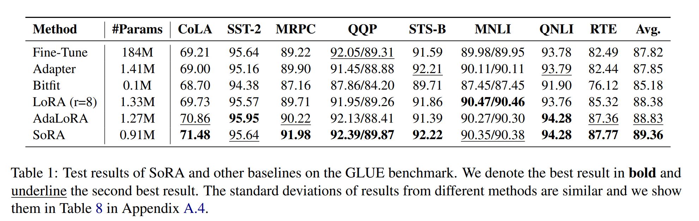
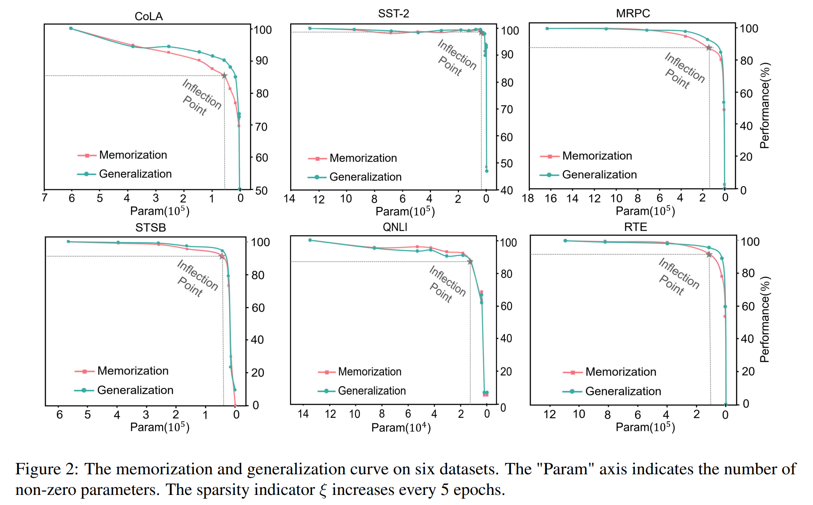
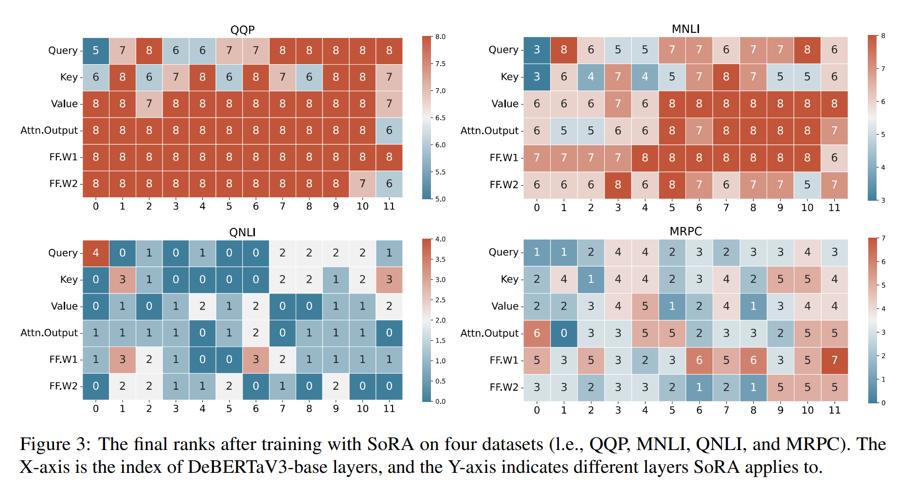

논문 및 이미지 출처 : <https://arxiv.org/pdf/2311.11696>

# Abstract

large-scale pre-trained language model(LLM)의 fine-tuning 을 parameter-efficient 방식으로 수행하는 것은 그 효과성과 효율성으로 널리 연구되고 있다. 

Low-Rank Adaptation(LoRA)은 adaptation process 가 본질적으로 low-dimensional 이란 가정을 바탕으로 한 주목할 만한 접근법을 제시한다. 

LoRA 는 뛰어난 성능을 보여주었으나, fixed 및 unalterable intrinsic rank 로 구현되어 항상 최적의 선택이 아닐 수 있다.

more flexible adaptation 의 필요성을 인식하여, 저자는 LoRA 의 방법론을 확장해 adaptation process 중에 intrinsic rank 를 동적으로 조정할 수 있는 새로운 접근법인 Sparse Low-Rank Adaptation(SoRA)을 제안한다. 

- 저자는 training stage 에서 Proximal Gradient Method 로 optimized gate unit 을 도입하여 rank 의 cardinality 를 제어하고, gate 의 sparsity 를 반영하여 업데이트를 수행한다. 
- inference inference stage 에선 zeroed-out rank 에 해당하는 parameter block 을 제거하여, SoRA module 을 간결하면서도 rank-optimal LoRA 로 축소시킨다. 
- 저자의 접근법은 higher rank 로 초기화하여 LoRA 의 representation 을 강화하는 동시에, sparse way 로 parameter 를 업데이트하여 일시적으로 증가한 parameter 를 효율적으로 제어한다. 
- 또한, SoRA 를 위한 sparsifying scheduler 를 도입해 non-zero parameter 의 수가 model memorization 및 generalization 에 미치는 영향을 조사한다. 
- 실험 결과, SoRA 는 parameter 70% 및 training time 70% 를 유지하면서도 다른 베이스라인보다 우수한 성능을 보일 수 있음을 입증했다.

# 1 Introduction

large-scale pre-trained language model 의 parameter-efficient adaptation 방법은 점점 더 주목받고 있다. 

이 방법들은 일반적으로 model 대부분의 parameter 를 변경하지 않고, additional trainable parameter 를 모델에 삽입하거나, few parameter 만 trainable 로 지정하거나, adaptation process 을 more efficient 형태로 reparameterization 한다. 

- 이 방법들은 다양한 모델과 작업에서 유효성이 입증되었으며, 종종 all parameters 를 사용하는 full model fine-tuning 보다 동등하거나 더 나은 결과를 보여준다.  
- 이러한 방법들은 base model 을 데이터에 맞게 적응시킬 기회를 제공하여, specific task 나 personalized user 에 맞춰 language model 을 개선하고 사용자 맞춤형으로 조정할 수 있는 가능성을 제시한다. 
- optimized parameter 의 lightweight nature 덕에, 이는 모델에 무리 없이 삽입될 수 있으며, 이를 통해 목표한 개선 사항을 정확하게 반영할 수 있다. 
- 이 중에서도 Low-Rank Adaptation(LoRA)은 현재 가장 효율적인 방법 중 하나로 여겨지며, model adaptation 후 parameter changes 가 본질적으로 "low-dimensional" 이란 가정하에, low-rank decomposition 으로 얻은 matrix 를 optimizing 하여 adaptation 을 적응을 수행한다. 
- LoRA 는 additional neural modules 를 삽입하면서 발생하는 forward propagation latency 를 피하면서 안정적인 성능을 보여준다.  
- 비록 LoRA 가 효과적이지만, intrinsic rank 의 설정 (일반적으로 hyper-parameter 로서)은 여전히 명확하지 않다. 
- 직관적으로, larger rank 는 larger optimization space 를 제공하고 more challenging tasks 를 처리할 수 있는 능력을 부여한다. 하지만 실제론 optimal intrinsic rank 는 base model 과 task 에 따라 다를 것이다. 
 
GPT-3 처럼 175B parameters, LLaMA 처럼 700M to 65B 에 이르는 large-scale model 에서 hyper-parameter 를 탐색하는 것은 엄청난 계산 비용을 요구하므로, adaptive ranks 기반 방법을 개발하는 것이 자연스러운 접근법이다. 

일부 기존 연구에서는 이 방향을 탐구하려는 시도가 있었으나, 대부분은 heuristic 또는 additional costs 를 도입한다. 

이 논문에서 저자는 SoRA 라는 간단하고 효과적이며 automated adaptive parameter-efficient fine-tuning 방법을 제안한다. 

- 저자는 L1 regularization 을 사용하여 updated matrices 의 sparsity 를 제어하는 gating module 을 도입하고 Proximal Gradient Descent update 를 통해 최적화를 진행한다. 
- training 후, gating vector 의 zero entry 는 down-projection matrix 의 columns 와 up-projection matrix 의 rows 를 기록하며, 단순히 제거하여 more parameter-efficient 방식으로 저장될 수 있다. 
- 다른 adaptive apporach 와 비교하여, Proximal Gradient 방법은 명확한 수학적 의미를 가지며, additional computations 및 heuristics 를 포함할 필요가 없다. 
  - 예로, AdaLoRA 는 additional regularizer 를 도입하여 lower 및 upper projection matrices 가 엄격하게 singular value decomposition (SVD) 정의를 따르도록 한다.
    - 각 matrix 는 orthogonal
  - 그러나 이 regularization term 은 gradient calculations 로 인해 상당한 computational overhead 를 초래한다. 
  - 반면에, 저자는 이러한 요구를 제거하고 대신 intermediate diagonal matrix 를 제어하여 low-rank components 를 선택적으로 filering 한다. 
  - Sec. 3 에서 SoRA 와 관련 방법들을 자세히 비교한다.  

---

- SoRA 의 메커니즘은 또한 sparsity 를 일시적으로 제어하고 non-zero trainable parameter 의 수와 memorization 및 generalization capabilities 간의 관계를 조사할 수 있도록 한다. 
- 저자는 sparsifying scheduler 를 제안하며, model adaptation process 가 strong “compression capability” 을 보여주며, tiny portion parameter(LoRA rank 가 1 이하일 때도)로 상당한 성능을 유지할 수 있음을 발견했다. 
- 광범위한 실험을 통해 저자의 방법의 효과를 입증한다. 
- 특히, 저자의 모델은 fewer parameter 및 30% shorter training time 으로 일관되게 parameter-efficient baselines 를 능가할 수 있다.

# 2 A Closer Look to Adaptive Rank

#### Related Work.

본 접근 방식을 소개하기 전에, parameter-efficient tuning 과 backbone Low-Rank Adaptation(LoRA)을 간략히 요약한다. 

parameter-efficient tuning 은 full model 을 변경하지 않고 일부 parameter 만을 최적화하는 방법들의 집합이다. 

- 일부 방법들은 Adapter, Prefix 와 Prompt Tuning 처럼 additional neural modules 나 parameters 를 backbone model 에 삽입한다. 
- 또 다른 방법들은 특정 parameter 만 trainable 로 지정하거나 가변적으로 만든다.
- 연구자들은 이러한 parameter-efficient methods 의 효과와 효율성을 개선하기 위해 여러 변형을 제안했다.
- 최근 이러한 방법들은 multi-modal 과 instruction-tuning 시나리오로도 확장되고 있다.

본 논문에서는 주로 Low-Rank Adaptation(LoRA) 을 중점적으로 다루며, LoRA 는 low-rank matrices 를 사용하여 wieght change 를 근사한다.

LoRA 에서는 pre-trained wieghts ($W_0 \in \mathbb{R}^{p \times q}$) 가 고정되고, trainable LoRA module 은 weight change $\Delta = W_u W_d \in \mathbb{R}^{p \times q}$ 의 low-rank decomposition matrices $W_d \in \mathbb{R}^{r \times q}$ 및 $W_u \in \mathbb{R}^{p \times r}$ 이다. 

이 방식에서, current layer 의 outout $h$ 는 다음과 같이 나타낼 수 있다:

$$
\begin{equation}
  y \leftarrow W_0 x + W_u W_d x,
\end{equation}
$$

- $r \ll \min\{p, q\}$ : low-rank matrices 의 size 및 trainable parameter 수를 조절하는 hyper-parameter

이 절에서는 주로 last term 에 집중하며, 이를 $z \leftarrow W_u W_d x$ 로 나타낸다.

#### Adaptive Rank on LoRA.

LoRA 는 tractability 및 efficiency 에서 큰 진전을 이루었지만, optimal rank $r$ 를 선택하는 유연성의 부족이 문제로 남아있다. 

learning rate 및 weight decay 같은 continuouis hyper-parameter 와 달리, LoRA 의 rank $r$ 은 discrete values 로 이루어져 있어 training 중에 dynamic tuning 이 어렵다. 

optimal rank 는 model 및 task 에 따라 달라지므로, rank $r$ 이 너무 크면 resource 를 낭비하고, 너무 작으면 성능이 저하될 수 있다. 

이 제한 사항들은 LoRA 의 adaptive-rank-selection plug-in 를 도입할 필요성을 강조한다.

최근 몇 년 동안 LoRA rank 를 유연하게 조정하는 여러 보완책이 제안되었다. 

- 예로, Valipour et al. (2022) 은 DyLoRA 에서 pre-defined discrete distribution $p_B(\cdot)$ 를 통해 다양한 rank choices 를 최적화한다. 
- 이 방법은 nested dropout 과 유사하지만, LoRA module 의 different rank 를 최적화하는 mixture model 로 간주할 수 있다.

그럼에도 불구하고, LoRA rank 를 직접적이고 결정적으로 조정하는 것이 더 매력적인 접근 방식으로 보인다. 

이를 위해 저자는 먼저 matrix rank 와 singular value decomposition(SVD) 사이의 연결에서 중요한 힌트를 얻었다. 

LoRA 에서의 weight change 를 $\Delta := W_u W_d$ 로 나타낼 수 있고, 이를 singular value decomposition 하면 다음과 같이 된다:

$$
\begin{equation}
  \Delta_{p \times q} = U_{p \times p} \Sigma_{p \times q} V_{q \times q}^\top,
\end{equation}
$$

- $U$ 와 $V$ 는 각각 orthogonal
- $\Sigma$ 는 $\Delta$ 의 singular values 를 diagonal elements 를 포함한 diagonal matrix: $\sigma(\Delta) = \{\sigma_1 \geq \sigma_2 \geq \cdots \geq \sigma_{\min\{p,q\}} \geq 0\}$. 
- 편의상 $\Sigma$ 의 diagonal 을 column vector 로 바꾼다.

$$
\begin{equation}
  g := (\sigma_1, \sigma_2, \cdots, \sigma_{\min\{p,q\}})^\top.
\end{equation}
$$

이후 $\min\{p, q\} = d$ 일 때, LoRA 의 forward propagation 을 다음과 같이 재구성할 수 있다:

$$
\begin{equation}
  z \leftarrow \Delta x = U_{\cdot, 1:d}(g \odot V^\top_{\cdot, 1:d} x),
\end{equation}
$$

- $\odot$ : element-wise dot product (Hadamard product)
- $\text{rank}(\Delta) = \|g\|_0$, 즉 $g$ 의 $\ell_0$ norm 으로 표현
- 따라서 LoRA 의 rank 를 조정하는 것은 vector $g$ 의 sparsity 을 제어하는 것과 동일하다. 
- Zhang et al. (2023) 은 이 SVD-based track 을 따라 AdaLoRA 라는 방법론을 제안했다.
- AdaLoRA 에선 vector $g$ 의 elements 를 조정하여, nonzero entries 수가 pre-defined budget $b$ 보다 작도록 한다. 
  - 구체적으로, weight-gradient product 에서 수행되는 새롭게 제안한 "sensitivity" metric 을 사용해 top-$b$ importance score entries 만 보존한다.
  - $g$ entries 의 nonnegativity 은 합리적으로 제거될 수 있다. 
  - 그 이유는 negative $g_i$ 가 $u_i$ 나 $v_i$ 중 하나의 부호를 뒤집는 것으로 간단히 positive case 로 전환될 수 있기 때문이다. 
  - 또한, $U^\top U = I_p$ 및 $V^\top V = I_q$ 라는 orthogonality conditions 를 regularization term 을 대체하여 constrained optimization problem 을 unconstrained version 으로 변환한다.

$$
\begin{equation}
  R(U, V) = \| U^\top U - I_p \|_F^2 + \| V^\top V - I_q \|_F^2.
\end{equation}
$$

실험을 통해 그 유효성이 입증되었음에도 불구하고, AdaLoRA 에는 방법론을 재고하고 개선을 기다리는 두 가지 문제가 여전히 존재한다. 

1. AdaLoRA 의 sparsity selection criterion 은 weight-gradient product 의 moving average 에 의존하는 새롭게 제안된 importance scores 에 기반하고 있다. 
   - 이는 경험적 연구에서 유효성을 보여주었지만, 이 기준은 이론적 동기가 부족한 휴리스틱한 방식에 가깝다. 
2. importance scores 의 moving average operation 과 orthogonality regularization (Eq. (5)) 의 gradient 는 additional computation cost 를 초래한다.

위에서 언급된 AdaLoRA 의 한계와 비교하여, SoRA 는 더욱 단순화된 update rule 을 제공하며, sparsity regularization 와 proximal gradient methods 의 이론에 의해 뒷받침된다.

# 3 Our Approach

sparse low-rank adaptation(SoRA)은 sparse gating unit 을 통해 training process 에서 intrinsic rank 를 동적으로 조정하는 것이다. 

## 3.1 Sparse Low-rank Adaptation

#### Module Structure.

- SoRA module 을 설계할 때, 실용적 또는 연구적 필요에 따라 maximum acceptable rank $r_{\text{max}}$ 를 pre-define
- 이후, 각 SoRA module 은 LoRA 에서 가져온 two matrices $W_d \in \mathbb{R}^{r_{\text{max}} \times q}$ 와 $W_u \in \mathbb{R}^{p \times r_{\text{max}}}$ 를 각각 down-projection 과 up-projection 으로 상속받는다. 
- maximum rank $r_{\text{max}}$ 는 비교적 크게 설정되지만, 이를 sparse sence 로 효율적으로 조절하는 방법을 소개한다. 
- 이는 SVD(Singular Value Decomposition) 방식을 모방한 gating unit $g \in \mathbb{R}^{r_{\text{max}}}$ 을 projection matrices 사이에 주입함으로써 실현된다. 

SoRA module 의 forward propagation 은 다음과 같이 진행된다:  

$$
\begin{align}
  &h\ ^{\underleftarrow{\text{down-projection}}}\ W_d x; \\
  &h'\ ^{\underleftarrow{\text{gating}}}\ g \odot h; \\
  &z\ ^{\underleftarrow{\text{up-projection}}}\ W_u h';
\end{align}
$$

보다 간단히 표현하면:  
$$
\begin{equation}
  z \leftarrow W_u (g \odot (W_d x)).
\end{equation}
$$  

#### Optimization.

LoRA 와 마찬가지로 down-projection 및 up-projection matrices 는 stochastic gradient methods 로 optimizing 되며, 각 gate $g$ 는 sparsity-promoting way 로 업데이트된다:

$$
\begin{equation}
  g_{t+1} \leftarrow T_{\eta_t \cdot \lambda}(g_t - \eta_t \nabla_g L_0(\Delta_t)),
\end{equation}
$$

- $\mathcal{L}_0(\cdot)$ : language model 의 original loss function
- $\Delta$ : complete tunable parameter (gates 포함)
- $\eta_t > 0$ : $t$-th iteration 의 step-size
- $\lambda > 0$ : sparsity promotion hyper-parameter
- $T_{\eta_t \cdot \lambda}(\cdot)$ : 아래의 soft-thresholding function 의 element-wise broadcast 적용을 의미한다:  

$$
\begin{equation}
  T_\xi(x) := 
  \begin{cases} 
  x - \xi, & x > \xi \\ 
  0, & -\xi < x \leq \xi \\ 
  x + \xi, & x \leq -\xi
  \end{cases}
\end{equation}
$$

- $\xi = \eta_t \cdot \lambda$ : threshold
- 실제론 Eq. (10) 의 true gradient $\nabla_g \mathcal{L}_0$ 은 mini-batch stocastic counterpart 근사치를 통해 계산된다.  

#### Post-pruning.

training 완료되면 SoRA weights 를 추가로 pruning 하여 zeroed-out ranks 를 제거하고, module 을 다시 LoRA 형태로 줄인다. 

구체적으로는, $k$-th SoRA module 의 경우 gating vector $g^{(k)}$ 에서 zero entry index 를 다음과 같이 정의한다:

$$
\begin{equation}
  \mathcal{I}^{(k)} = \left\{ i \in [1 : r_{\text{max}}]\ |\ g^{(k)}_i = 0 \right\}
\end{equation}
$$  

- down-projection $W_d^{(k)}$ 의 $\mathcal{I}^{(k)}$-th rows 를 삭제해 $\tilde{W}_d^{(k)}$ 을 얻고, up-projection $W_u^{(k)}$ 의 $\mathcal{I}^{(k)}$-th columns 를 삭제해 $\tilde{W}_u^{(k)}$ 얻는다. 
- 또한 gate $g^{(k)}$ 의 $\mathcal{I}^{(k)}$-th entries 를 삭제해 $\tilde{g}^{(k)}$ 를 얻는다. 
- 이를 통해 inference time 에 $k$-th SoRA module 은 rank $r_{\text{max}} - |\mathcal{I}^{(k)}|$ 을 갖는 일반적인 LoRA module 로 작동하게 된다.  

## 3.2 Interpretation and Comparison

#### Theoretical interpretation.

update rule Eq. (10) 은 $\ell_1$ loss 에 대한 proximal gradient method 의 적용이다. 

이는 Eq. (10) 을 다음과 같이 동등하게 재정식화할 수 있기 때문에 즉시 도출된다:

$$
\begin{equation}
  \begin{aligned}
    g_{t+1} &\leftarrow \argmin_g \ \eta_t \cdot \lambda \|g\|_1 \\
    &+ \frac{1}{2} \|g - (g_t - \eta_t \nabla \mathcal{L}_0(g_t))\|_2^2.
  \end{aligned}
\end{equation}
$$

- 위 Eq. (13) 은 정확히 $\ell_1$ regularization loss function 의 proximal gradient update 이다:  

$$
\begin{equation}
  \mathcal{L}(\Delta) := \mathcal{L}_0(\Delta) + \lambda \sum_{k=1}^{K} \|g^{(k)}\|_1,
\end{equation}
$$  

- $g^{(k)}$ : $k$-th SoRA module 의 gate
- 이 sparsity-promoting 전략은 LASSO estimator 과 compressed sensing 에서 유래되었으며, DNN 에서도 여러 연구에 채택된다.

#### Comparision with AdaLoRA.

SVD 에 영감을 받은 점에서 SoRA 는 선행 연구인 AdaLoRA 같은 차이점을 보인다.

1. AdaLoRA 에 사용된 orthogonal regularization (Eq. (5)) 를 SoRA 에선 적용하지 않는다. 
   - 그 이유는 rank selection 을 위해 gate $g$ 를 spare 하는 것만으로 충분하기 때문이다. 
   - SVD 의 원래 요구 사항을 고수하면 additional computational costs 가 발생할 수 있다. 
2. AdaLoRA 에서의 moving average importance scores 는 특정 entry 가 zerod out 될 때의 loss changes 에 대한 approximation 로 작동하며, 이는 parameter "sensitivity" 의 heuristic measurement 로 간주된다. 
   - 그러나 모델이 특정 parameter 에 대해 일시적으로 민감하다고 해서 해당 parameter 를 유지해야 한다는 의미는 아니다. 이에 대한 엄격한 이론적 근거가 없기 때문이다. 
   - 반면, SoRA 의 rank selection 은 soft-thresholding operation (Eq. (10))에 기반하며, proximal gradient iteration 의 이론적 정당성에 의해 더 깔끔한 방식으로 이루어진다. 
   - 앞서 설명했듯 SoRA module 의 update rule 은 regularized loss objective (Eq. (14))를 minimizing 하여 interpolation-complexity trade-off 의 원칙을 정확히 따른다.  
  
형식적 간결함과 이론적 명료성을 넘어, SoRA 는 fewer parameters 로 less wall-clock time 안에 우수한 실험 성능을 보여준다.

## 3.3 Scheduling ξ to Explore Memorization and Generalization

저자는 threshold $\xi$ 을 sparsity indicator 로 부른다. 

- 이 parameter 는 SoRA 의 training process 에서 sparsity 을 직접적으로 결정할 수 있다. 
- 이는 parameter budget 과 expected performance 에 따라 constant 로 설정하여 sparsity 을 휴리스틱하게 제어할 수 있다. 
- $\xi$ 를 adaptation process 에서 동적으로 변경할 때, SoRA 는 model $\mathcal{M}$ 과 dataset $\mathcal{D}$ 에 대한 memorization 및 generalization 을 평가하기 위한 효과적인 도구로 작동한다.
- 즉, model $\mathcal{M}$ 과 data $\mathcal{D}$ 가 주어졌을 때, 특정 성능을 달성하기 위해 얼마나 많은 additional parameters 가 필요한지 시각적으로 관찰할 수 있다. 

저자는 이 기본 아이디어를 다음과 같이 설명한다.  
  
- 이 과정은 $\xi$ 에 상대적으로 small value 를 할당하는 것에서 시작된다. 
- 따라서 initial SoRA model 은 "dense" 하게 설정되고, 수렴할 때까지 훈련된다. 
- 이 stage 가 완료되면, $\xi$ value 를 점진적으로 증가시키는 schedular 를 도입하여 model sparsity 를 강화한다. 
- dense model 에서 sparse model 로의 전환 동안, training data 와 test data 를 각각 통해 model memorization 및 generalization capabilities 를 평가할 수 있다.

이 절차는 Algorithm 1 에 보고된다.  
  

이 과정은 model adaptation 시나리오에서 "compression loss" 을 탐구하는 것으로 간주될 수 있다. 

- "compression loss" 이란 sparsity 가 증가함에 따라 model performance 가 감소하는 것을 의미하며, constraints 하에서 model prediction 능력을 얼마나 잘 유지하는지 측정하는 지표이다. 
- 이 "compression loss" 를 조사하는 것은 model adaptation 의 동작을 이해하는 데 의미가 있으며, 높은 성능을 유지하는 효율적이고 compact model 개발을 촉진할 수 있다.

# 4 Experiments

광범위한 실험을 통해 저자의 접근 방식의 효과를 종합적으로 평가한다. 

일반적으로 이 섹션에서는 두 가지 측면을 탐구한다: (1) 일반적인 parameter-efficient method 로서의 성능 및 해당 분석; (2) SoRA 의 sparsity 특성을 통해 memorization 및 generalization 의 조사를 수행한다.

## 4.1 Experimental Settings

#### Baselines.

저자의 baseline 은 full-parameter fine-tuning 및 Adapter, BitFit, LoRA, AdaLoRA 같은 잘 알려진 parameter-efficient methods 를 포함한다. 

Adapter 의 variants 는 성능이 매우 유사하다는 것을 발견하여 생략하였고, Prompt Tuning 은 수렴하는 데 상당한 시간이 소요되고 저자의 backbone model 에서 non-trivial performance 를 얻지 못한다는 점에서 포함하지 않았다.

#### Datasets

평가를 위해 GLUE 벤치마크를 채택하였으며, CoLA, SST-2, MRPC, QQP, STS-B, MNLI, QNLI, RTE 를 포함한다. 

주로 DeBERTaV3-base 를 backbone model 로 사용하며, 분석을 위해 RoBERTa-large 도 사용한다.

## 4.2 Results

저자는 NLU 를 위한 널리 인정받는 벤치마크인 GLUE 에서 평가를 실시한다. 

SoRA 의 실험 성능과 다른 기준 방법들의 성능은 Tab. 1 에 기록되어 있다. 

저자는 이러한 방법들을 재현하고 5 random seeds 의 평균 결과를 제시한다.

- 저자의 발견에 따르면, AdaLoRA 와 SoRA 는 모두 initial LoRA baseline 을 지속적으로 초과 달성하였다. 
  - 이는 adaptive rank 가 model apdatation 을 향상시키는 강력한 해결책이 될 수 있음을 강조한다. 
  - 특히 SoRA 는 다른 all baselines, 특히 LoRA 와 AdaLoRA 를 초과 달성하였으며, fewer parameters 를 사용하였다. 
- 이는 adaptive rank 를 달성하는 데 더 효과적이고 필수적인 접근 방식이 될 수 있음을 뒷받침한다. 
  - 예로, MRPC 에서 SoRA 는 91.98% 의 정확도를 달성하여 AdaLoRA 를 1.76% 초과하였다. 
  - 평균적으로 SoRA 는 GLUE 벤치마크에서 LoRA 와 AdaLoRA 를 각각 0.98% 및 0.52% 초과하였으며, 각각 31.5% 및 28.3% fewer parameters 를 사용하였다. 

adaptive rank 의 효과를 더욱 자세히 살펴보기 위해, Tab. 2 에서 LoRA 와 SoRA 의 different rank 를 비교하는 실험을 수행하였다.

- 결과는 SoRA 의 우수성이 다양한 parameter budget 에서 일관되게 유지됨을 확인시켜 주며, SoRA 는 all settings 에서 LoRA baselines 를 초과 달성하면서 30% fewer parameters 를 사용하였다.

## 4.3 Sparsifying Scheduler

저자는 SoRA 의 sparsifying scheduler 를 적용하며, adaptation process 에서 sparse indicator $\xi$ (1e-4 starting)를 점진적으로 증가시킨다. 

Fig. 2 에서 RoBERTa-large 의 MRPC, RTE, STS-B, CoLA, QNLI, SST-2 에 대한 memorization 및 generalization curves 를 나타낸다. 

- 여기서 memorization 은 training set 의 성능으로 측정하고, generalization 는 validation set 의 성능으로 측정한다. 
- 흥미롭게도, 거의 모든 dataset 에서 강력한 "compression performance" 를 관찰하였다. 
  - 이 중 SST-2 는 가장 "compressible" task 로, model 이 47,104 non-zero parameters 로도 99% 이상의 성능을 유지한다. 
  - 특히, 단 4,096 parameters 로도 90% 이상의 memorization 및 generalization 능력을 보존할 수 있다. 
- sparsifying process 가 진행됨에 따라, 모델은 다양한 data 에서 "inflection point" 를 경험하며, 이후 성능이 급격히 감소한다. 
  - 이러한 일관된 현상은 성능을 뒷받침하는 몇 가지 critical parameters 가 존재하며, 이는 additional investigation 이 필요함을 시사한다. 
- 그래프에서 얻은 통찰은 또한 dataset 에 따라 모델의  adaptation difficulty 가 다르게 나타나는 경향을 보여준다. 
  - 예로, CoLA 같은 특정 dataset 은 다른 dataset 에 비해 성능 감소가 더 일찍 나타나고 더 두드러진다. 
  - 또 다른 발견은 sparsifying process 에서 memorization 및 generalization 의 경향이 일관되게 나타나며, 이는 직관과 일치한다. 
- 저자의 관찰은 또한 intermediate 및 deep layers 의 parameter 가 밀도를 유지하는 경향이 있는 반면, shallow layers 의 parameter 는 sparsity 를 더 많이 보이는 경향이 있음을 나타낸다. 

## 4.4 Rank Analysis

직관적으로 말하자면, single model 은 다양한 downstream dataset 에 적응할 때 서로 다른 정도의 어려움을 겪는다. 

동시에 모델 내의 all parameters 가 동일한 importance 를 가지지는 않으며, 일부는 성능에 더 중요한 역할을 한다. 

이 Section 에선 SoRA 를 사용하여 training process 가 수렴한 후의 final ranks 를 4 datasets 에 대해 시각화한다. 

- Fig. 3 에서 QQP 의 trained parameter matrices 는 매우 밀집한 반면, 다른 dataset 에서는 그러한 밀집도가 나타나지 않는다.
- 이는 서로 다른 수준의 어려움이 존재함을 반영한다. 
- 이러한 현상은 performance 와 parameter budget 을 활용하는 것이 불변의 법칙이 아니라, 특정 상황에서의 고려가 필요함을 시사한다.

## 4.5 Applying SoRA to Different Weights

Tab. 1 실험에선 LoRA, AdaLoRA, SoRA 를 all weight matrices 에 적용하여 성능을 향상시켰다. 

PEFT 가 model 내의 다양한 position 에 적용될 때 성능이 변동할 수 있다는 점은 이전 연구에서도 입증되었다. 

저자는 SoRA 의 영향을 조사하기 위해 3 datasets 에서 이러한 ablation study 를 수행하였다. 

SoRA 는 budget-oriented method 는 아니지만, retained non-zero parameters 를 대략 동등하게 맞추기 위해 $\lambda$를 조정하였다. 

- Tab. 3 처럼, 대부분의 경우 SoRA 를 all weight matrices 에 적용했을 때 one 또는 several types weights 에만 적용했을 때보다 성능이 상당히 향상되었다. 
- 이는 SoRA 를 all weight matrices 에 균일하게 적용하는 것이 유익한 전략이 될 수 있음을 시사한다. 
- 반면, SoRA 를 $W_Q, K$ 에만 적용하면 성능이 크게 저하되며, 이는 LoRA 와 일치한다.

## 4.6 Efficiency Analysis

저자는 SoRA 가 이론적으로 명확하고 계산 효율적인 방법임을 Sec. 3.2 에서 설명하였다. 

이를 평가하기 위해, 이 Section 에선 SoRA 와 AdaLoRA 의 효율성을 측정한다. 

동일한 계산 인프라와 batch size 를 사용하여 6 datasets 에서 AdaLoRA 와 SoRA 의 average epoch time 을 계산하였다.

- Tab. 4 처럼, SoRA 는 AdaLoRA 보다 약 30% fewer training time 을 소요한다. 
- CoLA, QNLI, RTE dataset 같은 특정 경우에서는 SoRA 가 효율성에서 상당한 우위를 보인다. 
- 반대로, SoRA 는 다른 dataset 에서도 AdaLoRA 보다 일관되게 앞서지만, 그 차이는 크지 않다. 
- 이러한 차이는 다양한 task 에서 AdaLoRA 와 SoRA 의 서로 다른 rank distribution 에 기인할 수 있다. 
- 이러한 distribution 은 AdaLoRA 의 regularization calculation 에 영향을 미친다.

# 5 Conclusion

저자의 연구는 Sparse Low-Rank Adaptation (SoRA)을 제안하며, 이는 large-scale pre-trained language model 의 parameter-efficient fine-tuning 을 위한 혁신적인 방법이다. 

adaptation process 가 본질적으로 희소할 수 있다는 가설에 따라, 저자는 sparsity 을 조절하기 위해 최적화 가능한 gate 를 도입하여 dynamic alternative rank 를 제공하며, 이를 통해 optimization space 를 확장하고 parameter-efficiency 를 향상시킨다. 

이 방법은 간단하고 이론적으로 뒷받침되며 다양한 작업에서 유망한 성능을 보인다. 

SoRA 를 도구로 활용하여, 저자는 parameter 와 memorization 및 generalization 간의 trade-off 를 분석하기 위한 sparsifying scheduler 를 제안한다.

# Limitations

SoRA 가 보여준 고무적인 결과에도 불구하고, 현재 연구에는 인정할 만한 몇 가지 한계가 있다. 

본 논문은 SoRA 의 효과성을 standard NLP 에서만 평가하였다. 

그러나 최근 연구는 parameter-efficient methods 가 cross-modal 또는 instruction-following 시나리오에 적용될 수 있음을 보여준다. 

이러한 경우 SoRA 의 sparsity 가 어떻게 나타나는지는 아직 알려지지 않았으며, 조사할 가치가 있다. 

저자의 sparsifying scheduler 는 language model 의 adaptation process 에 대한 통찰을 제공할 수 있지만, 절차를 엄밀하게 설명하고 adaptation process 의 난이도를 보다 효율적으로 평가하는 것은 여전히 도전적이다. 
