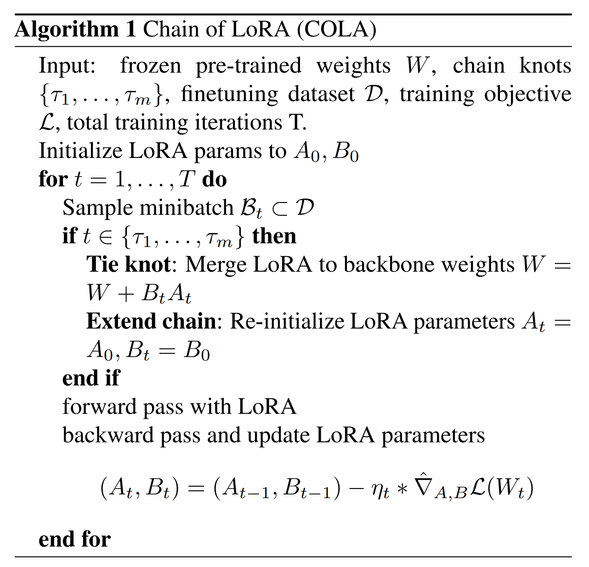
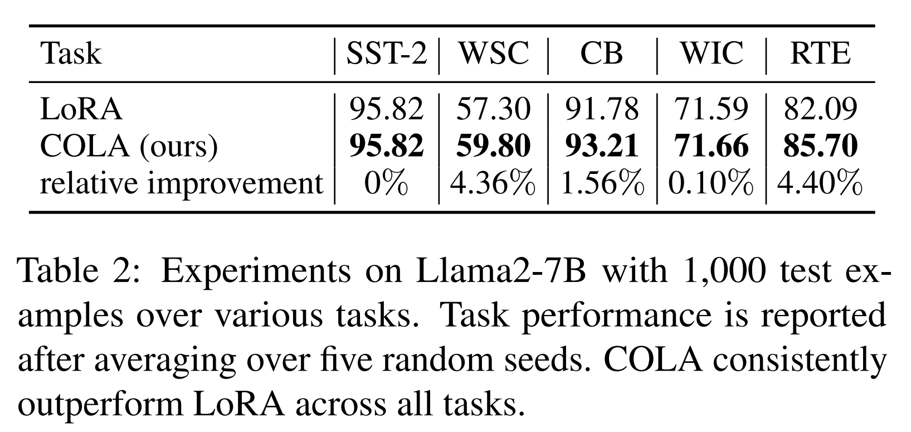
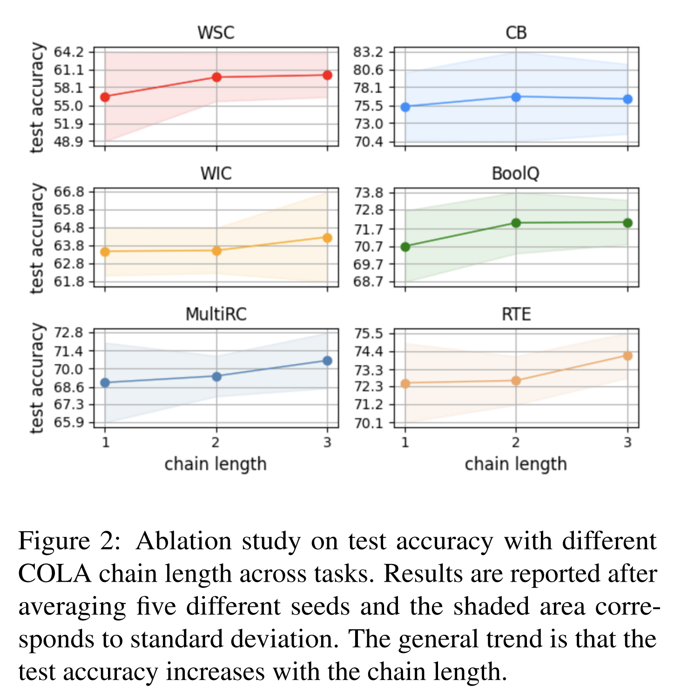
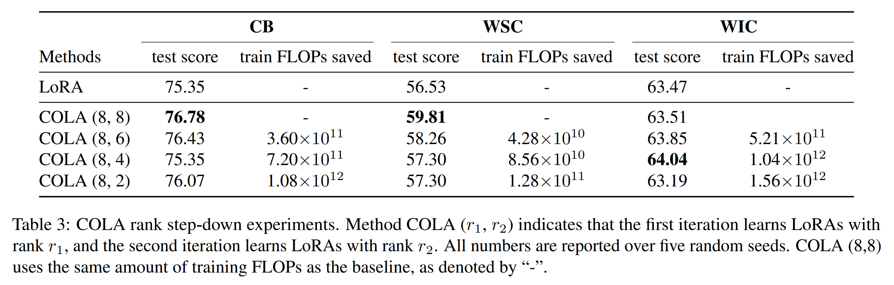
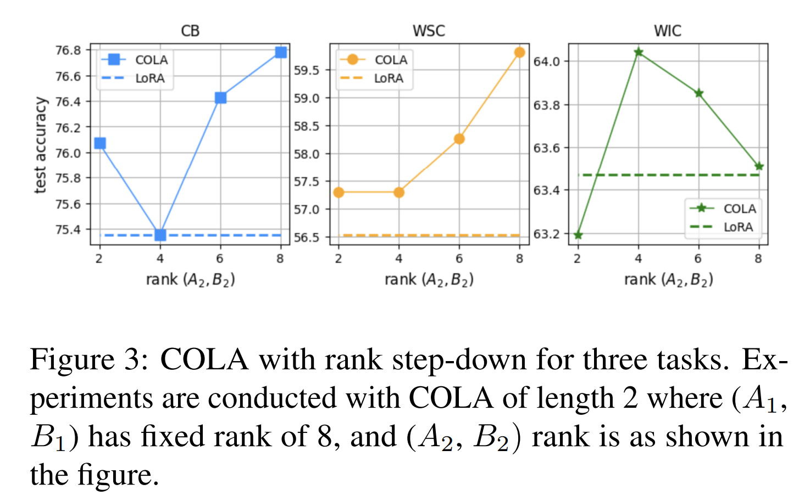
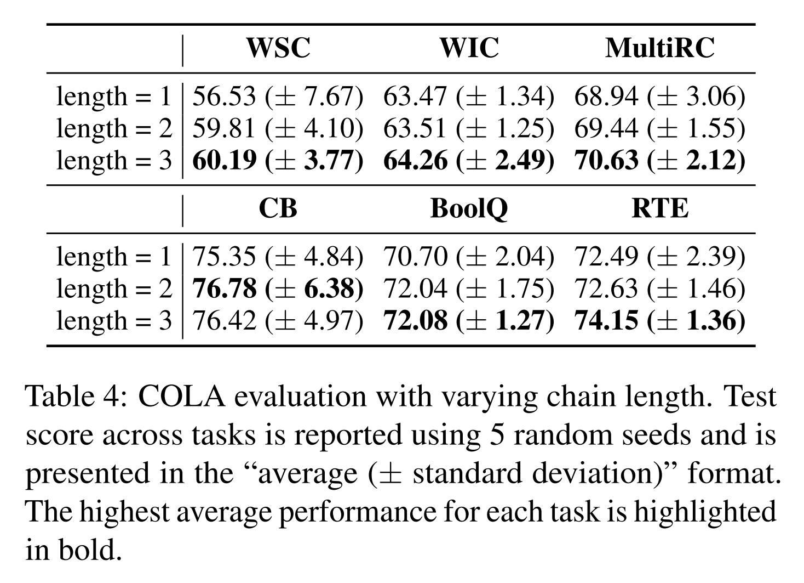

논문 및 이미지 출처 : <https://arxiv.org/pdf/2401.04151>

# Abstract 

Fine-tuning 은 pre-trained large language model 을 specific task 에 맞게 tuning 하는 주요 방법론이다. 

모델의 규모와 작업의 다양성이 확장됨에 따라, parameter-efficient fine-tuning 방법이 매우 중요해지고 있다. 

가장 널리 사용되는 방법 중 하나는 Low-Rank Adaptation (LoRA) 및 그 variants 다. 

LoRA 는 two low-rank matrix 의 product 로 weight update 를 encoding 한다. 

이러한 장점에도 불구하고, LoRA 는 specific task 에서 generalization error 측면에서 full-parameter fine-tuning 에 미치지 못한다.

저자는 LoRA 와 full-parameter fine-tuning 사이의 gap 을 additional computational costs 나 memory overheads 없이 줄이기 위해 Chain of LoRA (COLA)를 소개한다. 

- COLA 는 Frank-Wolfe 알고리즘에서 영감을 받은 iterative optimization 프레임워크로, pre-trained language model 의 parameters 에 learned LoRA module 을 병합하고, new LoRA module 을 위한 re-initialize optimization 인 residual learning procedure 를 사용한다. 
- 저자는 이 알고리즘의 theoretical convergence guarantees 을 제공하며, 실험 결과를 통해 저자의 알고리즘의 효과성을 검증한다. 
- 다양한 모델 (OPT 및 Llama-2) 과 7 tasks 에서 COLA 는 additional computation 이나 memory costs 없이 LoRA 를 일관되게 능가할 수 있음을 보여준다.

# 1. Introduction

pre-trained language model 은 NLP 에서 중요한 역할을 하며, 다양한 분야에서 뛰어난 성능을 보여주고 있다. 

large language model 의 fine-tuning 은 pre-trained model 을 specific task 에 맞게 조정하여, 기계 번역 및 코드 분석과 같은 다양한 실제 응용 프로그램에서 성능을 향상시킬 수 있다. 

full-parameter fine-tuning 의 상당한 이점에도 불구하고, 이 과정에서 발생하는 computational costs 와 memory requirements 는 특히 large language model 의 지속적인 성장에 비추어볼 때 중요한 도전 과제가 된다.

이러한 이유로, parameter-efficient fine-tuning (PEFT) 방법들이 큰 주목을 받고 있다. 

PEFT 는 모델의 all parameters 를 tuning 하는 대신, 특정 응용 프로그램에 대한 지식을 전문화하기 위해 original model parameters 의 일부만을 조정한다. 

parameter-efficient fine-tuning 에서 가장 널리 사용되는 패러다임 중 하나는 Low-Rank Adaptation (LoRA)이다. 

- LoRA 는 model weights 중 small low-rank 부분만을 수정하는 데 초점을 맞추고 있다. 
- 이는 training 중 model weights 에 low-rank matrix 을 추가하는 방식으로 이루어진다. 
- LoRA 의 장점은 fine-tuning 에 소요되는 computational overhead 와 시간을 크게 줄여주어, 특히 매우 큰 모델의 경우 효율성과 확장성을 높일 수 있다는 점이다. 
- 그러나 LoRA 는 generalization error 측면에서 full-parameter fine-tuning 에 비해 열등하다.

본 논문에서는 LoRA 와 full-parameter fine-tuning 간의 generalization error 격차를 계산 효율성을 유지하면서 줄일 수 있는지 조사한다. 

- 저자는 residual learning 방법을 통해 LLM weights 의 high-rank augmentation 을 학습함으로써 이를 달성한다. 
- 이 high-rank augmentation 은 여러 low-rank 구조로 구성된다. 
- 즉, 저자는 반복 절차를 사용하여 기존 근사치에 low-rank addition 를을 학습하여, 그 rank 를 증가시킨다. 
- 따라서 이 절차를 "Chain of LoRA" 또는 약칭으로 "COLA" 라 한다.

이 residual learning 방법은 Frank-Wolfe 알고리즘에서 영감을 받아 matrix completion 에 적용되며, 이는 rank 1 추가로 기존 완성을 보강한다. 

여러 반복을 거치면서, 이 residual learning procedure 는 정확한 high-rank completion 을 산출할 수 있음을 보여줄 수 있다.

#### Contributions

저자는 parameter-efficient fine-tuning 을 위한 iterative optimization 프레임워크인 COLA 를 제시한다. 

- COLA 는 mathematical optimization 의 Frank-Wolfe 방법에 기반을 두고 있으며, 이 관계를 형식화한다.
- 저자는 다양한 dataset 과 model 을 대상으로 한 광범위한 실험을 통해 COLA 의 효과를 입증한다. 
- COLA 는 computational costs 증가 없이 generalization error 측면에서 LoRA 를 일관되게 능가한다. 
  - 예로, COLA 를 사용한 OPT-1.3B fine-tuning 은 WSC 에서 LoRA 에 비해 6.47%의 상대적인 테스트 정확도 향상을 가져온다. 
  - Llama2-7B 실험에서는 최대 4.4% 의 상대적인 테스트 점수 향상이 나타났다.

저자는 제안된 방법에서 사용되는 iterative learning 프레임워크의 이론적 분석을 제공하여, smooth nonconvex optimization 설정에서 stationary points 으로 수렴함을 입증한다.

# 2. Related Work

#### Adaper based methods

adapter 기반 접근법은 Transformer layers 사이에 compact adapter 모듈을 삽입하는 연구로 이루어진다. 

Fine-tuning 과정에서 새로 도입된 lightweight adapter 만 훈련되며, pre-trained model 은 동결되어 다양한 tasks 간에 공유된다. 

이를 통해 large model 을 다양한 tasks 에 맞게 tuning 하는 실용성과 효율성이 크게 향상된다. 

- Houlsby et al. (2019)은 new bottleneck adapter 모듈을 제안하며, 이를 각 Transformer layer 내에 두 번 배치한다. 
  - 이 adapter 는 skip connection 을 도입하여 모듈 설계에 필요한 parameters 수를 효과적으로 제한하는 bottleneck structure 를 사용한다. 
- Variant adapter 아키텍처와 배치는 동시 연구에서 제안되었다. 
- single task adaptation 을 위한 adapter-based approach 의 성공을 기반으로, 후속 연구들은 multi-task learning 시나리오로 adapter-based architecture 를 확장한다. 
- AdapterFusion 은 task-specific adapter 를 학습하고 이후 별도의 knowledge composition tep 에서 이를 결합하는 two-stage learning 프레임워크를 제안한다.

#### Prefix tuning methods.

다른 연구들은 tunable parameters 를 input 및 hidden layer 에 포함시키는 방법을 탐구한다.

- 이러한 lightweight task-specific vector 는 일반적으로 "prefix" 라고 불리며, task-specific 모델을 저장하는 데 필요한 memory overhead 를 현저히 줄여준다. 
- 또한, 특히 data 가 제한된 상황에서 전체 fine-tuning 보다 우수한 성능을 발휘한다. 
- Efficient prompt tuning 은 learnable tesor ("soft prompt")를 모델의 input embedding 에 연결하여 prefix tuning 을 더욱 간소화한다. 
- 이러한 "soft prompts" 는 back-propagation 를 통해 학습되어 downstream task 를 수행한다.

#### LoRA and its variants.

저자의 연구와 가장 밀접한 관련이 있는 작업은 LoRA 로, fine-tuning 중 weight update 를 근사하기 위해 learnable low-rank matrix 을 도입한다. 

LoRA 의 기초를 바탕으로, 최근 여러 연구들은 다양한 관점에서 그 variants 를 탐구하고 있다. 

- QLoRA 는 4-bit 양자화를 활용하여 LLM 을 효과적이고 효율적으로 fine-tuning 한다. 
- Tied-LoRA 는 parameter efficiency 를 높이기 위해 weight tying 과 selective training 을 도입한다. 
- Chen et al. (2023) 은 limited computational costs 으로 LLM 의 context size 를 확장하기 위해 LongLoRA 를 제안한다. 
- MultiLoRA(Wang et al., 2023) 는 multi-task adptation 을 위해 특별히 설계되었다. 동시에, Sheng et al. (2023) 은 multiple LoRA adapter 의 scalable serving 을 개선하는 프레임워크인 S-LoRA 를 소개한다.
- LLM 의 fine-tuning 을 위한 optimization 는 memory saving 같은 특별한 도전 과제를 가지고 있다. 이러한 이유로, zero-order optimization 방법이 제안되었다.

# 3. Our Method

## 3.1 Preliminaries

#### Low Rank Adaptation (LoRA)

Low Rank Adaptation (LoRA) 은 특정 weights 의 low-rank decomposition matrics 를 학습함으로써 large language model 의 fine-tuning 효율성을 향상시키는 것을 목표로 한다. 

이는 task adaptation 에서 weight update 의 "intrinsic rank" 가 낮다고 가정하고, learnable low-rank decomposition matrices 를 Transformer architecture 의 각 layer 에 주입한다. 

pre-trained model 의 weight matrix $W_{\text{frozen}}$ 을 고려할 때, task adaptation 을 위한 weight update $\Delta W$는 low-rank decomposition $BA$ 로 표현된다. 

LoRA 를 사용한 forward pass 는 다음과 같다:

$$
W_{\text{frozen}}x + \Delta W x = W_{\text{frozen}}x + BAx,
$$

- $W_{\text{frozen}}, \Delta W \in \mathbb{R}^{d \times k}$, $A \in \mathbb{R}^{r \times k}$, $B \in \mathbb{R}^{d \times r}$이며, $r \ll \min(d, k)$
- $A$ 는 일반적으로 random gaussian initialization 을 사용
- $B$ 는 training  start 시 $\Delta W = 0$ 이 되도록 zero 로 초기화된다. 
- training 중 $W_{\text{frozen}}$ 은 동결되고, 오직 $B$, $A$ 만 최적화된다. 
- deployment 시, learned low-rank matrix 들은 pre-trained model 의 frozen weight 와 병합될 수 있다.

#### Frank-Wolfe

Frank-Wolfe 방법, 또는 conditional gradient method 는 constrained convex optimization, 그리고 최근 nonconvex optimization problem 을 해결하기 위한 optimization 알고리즘이다. 

Frank-Wolfe 방법의 주요 특징은 constraints 를 다루는 방식이다. 

- projection 을 통해 constraint set 에 projecting 하는 대신, linear optimization oracle 을 사용한다. 
- 반복적으로, 이 방법은 허용 가능한 영역 내에서 objective function 의 linear approximation 을 찾고, 이 approximation 의 minimizer towards 로 이동한다.

Frank-Wolfe 알고리즘은 linear optimization 이 Euclidean projections 보다 더 쉬운 문제에 특히 적합하다. 

이러한 이유로 "projection free" 방법 또는 최근 Frank-Wolfe 방법을 사용한 nonconvex optimization 도 고려되었다.

## 3.2. Chain of LoRA

이 섹션에서는 large language model 의 efficient parameters fine-tuning 을 위한 간단하면서도 효과적인 최적화 프레임워크를 설명한다. 

이 방법의 핵심 아이디어는 LoRA 의 chain 형태로 LoRA module 을 반복적으로 학습하는 것이다. 

Fig. 1 에 나타난 것처럼, 이 방법은 "Tune LoRA", "Tie a knot", "Extend the chain" 의 3 stages 로 구성된다. 

Algorithm 1 에 step-by-step procedure 를 자세히 설명한다.

pre-trained LLM weight matrix $W_{\text{pretrained}} \in \mathbb{R}^{d \times k}$ 에서 fine-tuning 중에 발생하는 weight update 를 $\Delta W$로 나타낸다. 

이상적인 adaptation 은 주어진 task 에 맞춘 optimal weights $W^{\star}$ 와 이에 상응하는 optimal weight update $\Delta W^{\star}$ 를 산출하며, 이는 아래와 같이 표현된다.

$$
W^{\star} = W_{\text{pretrained}} + \Delta W^{\star}
$$

COLA 에선 $\Delta W^{\star}$ 를 일련의 low-rank matrix decompositions $\{(A_1, B_1), \dots, (A_M, B_M)\}$ 로 근사하는 방법을 제안한다. 

- $A_i \in \mathbb{R}^{r_i \times k}$, $B_i \in \mathbb{R}^{d \times r_i}$ 및 $r_i \ll \min(d, k)$ 이며 $1 \leq i \leq M$
- 각 low-rank tuple $(A_i, B_i)$ 는 다음의 optimization 을 통해 얻어진다.

$$
\argmin_{B_i, A_i} \mathcal{L} ( W_{\text{pretrained}} + \sum_{j=1}^{i} B_j A_j ),
$$

- $\mathcal{L}$ : task-specific objective function
- **COLA 는 iterative residual learning paradigm 을 따른다.** 
- 각 $(A_i, B_i)$ 의 fine-tuning 은 $\Delta W^{\star} - \sum_{j=1}^{i-1} B_j A_j$ 의 residual learning 으로, 이는 $\Delta W^{\star}$ 를 scratch learning 보다 더 쉬운 optimization 문제이다. 
- 저자는 $\sum_{i=1}^{M} B_i A_i$ 가 single LoRA update $BA$ 보다 $\Delta W^{\star}$ 를 더 잘 근사할 것이라고 가정하며, baseline LoRA 와 비교했을 때 적은 계산으로 이를 달성하기 위한 chain 프레임워크를 설계했다.

COLA 는 LoRA module 을 iteratively tuning, mgering 및 extanding LoRA modules 로 LoRA chain 을 형성한다.

COLA 에서 chain length 는 optimized residual LoRA module 의 수로 정의된다. 

$M$ chain length 의 COLA 에선 Fig. 1 의 3 sub-steps 가 $M$ 번 반복된다. 

#### Tune LoRA

이 stage 에선 standard LoRA tuning 을 수행한다. 

- 즉, $A$ 와 $B$ matrix 만 학습하고 other all model parameters 는 그대로 둔다. 
- COLA 의 initialization step 에선 pre-trained LLM weights $W_{\text{pretrained}}$ 위에 LoRA module $(A_1, B_1)$ 을 학습한다. 
- COLA 의 initial phase 이후엔, fixed model weight 에 previously learned LoRA 의 weights 를 결합한 상태에서 LoRA module $(A_i, B_i)$ 가 fine-tuning 된다. 
- COLA 의 $i$-th iteration 에서 fixed model weights  $W_{\text{pretrained}} + \sum_{j=1}^{i-1} B_j A_j$ 이다.

#### Tie a Knot

현재의 LoRA module $(A_i, B_i)$ 이 learned 후, 이를 previously frozen LLM weights 에 병합하는데, 이를 "tie a knot" 라고 한다. 

- 이렇게 하면 $B_i A_i$ 로 근사된 weight update 가 frozen model weights 에 통합된다. 
- 그 결과, frozen model weights 는 $W_{\text{pretrained}} + \sum_{j=1}^{i} B_j A_j$ 이 된다. 
- 이를 통해 next iteration 을 위한 residual information $\Delta W^{\star} - \sum_{j=1}^{i} B_j A_j$ 만 학습할 수 있다. 
- 또한, LoRA module 을 frozen LLM 에 병합하면 limited resource scenarios 에서 memory overhead 를 줄이는 데 도움이 된다. 
- COLA 에서 도입된 LoRA modules list 를 저장하는 대신, 이를 실행 중인 상태에서 frozen model weights 에 병합하면 GPU memory consumption 을 LoRA 를 한 번만 학습할 때와 동일하게 유지할 수 있다.

#### Extend the chain

LLM 을 specific task 에 적응시키는 데 필요한 residual weight update 를 학습하기 위해 new LoRA module $(A_{i+1}, B_{i+1})$ set 을 re-initialize 하여 COLA chain 을 확장한다. 

- 이 step 에서 newly introduced $A_{i+1}$ 은 Gaussian initialization 을 사용하고, $B_{i+1}$ 은 LoRA 를 따르며 zero 로 초기화된다. 
- 추가적으로, 최적화될 parameters 와 gradient history 를 포함한 all optimizer states 를 reset 한다.

#### Training and Inference costs of COLA

COLA 의 training cost 는 chain 을 형성하는 데 사용된 LoRA module 의 rank 에 따라 결정된다. 

- COLA 의 training computation 은 rank 가 동일할 때 LoRA 와 동일하다. 
- COLA 에서는 LoRA module 의 rank 를 점진적으로 낮추는 것이 specific task 에 대한 optimal residual weight update 를 근사하고 전체 training cost 를 낮추는 효과적인 전략이 될 수 있다. 
- inference 시, learned all $B_j A_j$ 는 original model weights 에 통합될 수 있다. 
- $W_{\text{pretrained}}$ 이 $B_j A_j$ 와 동일한 형태를 가지므로, final integrated model weight 는 original pre-trained LLM 과 동일한 parameters 수를 갖게 된다. 따라서 inference 시 latency 가 추가로 발생하지 않는다.

# 4. Convergence of COLA and the Nonconvex Frank-Wolfe method

Fig. 1 에 설명된 COLA 알고리즘은 Frank-Wolfe 알고리즘 에서 영감을 받아 밀접하게 관련되어 있다. 

이를 이해하기 위해 COLA 가 iterative algorithm 이며, 각 iteration 가 아래의 식으로 간략히 표현된다는 점에 주목한다.

$$
W \leftarrow W + \argmin_{BA} \mathcal{L}(W + BA).
$$

linear Taylor approximation 을 사용하면 다음과 같이 쓸 수 있다.

$$
\mathcal{L}(W + BA) \approx \mathcal{L}(W) + \nabla \mathcal{L}(W) \times BA,
$$

따라서 set $K \subseteq \mathbb{R}^d$ 에 대한 constrained minimization 은 대략적으로 다음과 같이 표현될 수 있다.

$$
\argmin_{BA \in \mathcal{K}} \mathcal{L}(W + BA) \approx \argmin_{BA \in \mathcal{K}} \nabla \mathcal{L}(W) \times BA.
$$

이는 본래 linear programming 의 문맥에서 개발된 Frank-Wolfe 알고리즘과 유사하다. 

아래에서는 stochastic non-convex smooth optimization 을 위한 Frank-Wolfe 알고리즘의 변형을 분석한다. 

Algorithm 2 는 COLA 표기법으로 작성되어 LLM 의 fine-tuning 에 적용된다. 

stochasticity 는 Eq. (1) 에서 포착되며, gradient direction 이 stochastic gradient method 를 사용해 $\epsilon$ 만큼 근사된다고 가정한다.

특히, COLA 가 각 epoch 후에 다음을 만족하는 gradient update 를 수행한다고 가정한다.

$$
V_t^\top \nabla \mathcal{L}(W_t) \leq \argmin_{W \in K} W^\top \nabla \mathcal{L}(W_t) + \epsilon.
$$

여기서 low-rank matrix $A$, $B$ 를 single matrix $W$로 대체했다. 

이는 COLA 의 정확한 명세와는 다르지만, 다음과 같은 직관에 따라 정당화될 수 있다. 

- trace norm ball 의 linear optimization 는 rank 1 솔루션을 결과로 낳는데, 이는 Frank-Wolfe 방법의 문맥에서 보여졌다. 
- COLA 에서는 $A$, $B$ 에 대해 nonconvex optimization 를 직접 수행하며, 그들의 rank 는 1 보다 클 수 있다.

아래에서는 반복된 $A_t$, $B_t$ 의 stochastic approximation 을 통합한 이 알고리즘을 분석한다. 

이후, $h_t = \mathcal{L}(W_t) - \mathcal{L}(W^*)$ 와 $g_t \triangleq \left\{ \max_{V \in \mathcal{K}} \nabla \mathcal{L}(W_t)^\top (V - W_t) \right\}$ 로 정의하자.

- latter quantity 은 nonconvex optimization 에서 convergence metric 으로, 때때로 Frank-Wolfe gap 이라고 불린다. 
- $g_t$ 는 $\mathcal{L}$ 의 $W_t$ 에서의 projected gradient 가 zero 일 때만 zero 가 된다

다음 Theorem 은 Algorithm 2 이 stochastic smooth nonconvex optimization 에 대해, 시간에 따라 sublinearly bounding 된 distribution shift 가 있는 한, average duality gap 이 zero 에 접근함을 보장한다.

#### Theorem 4.1

Algorithm 2 가 $\mathcal{K}$ 내에 $M$ 에 의한 bounded $\beta$-smooth nonconvex functions 의 stochastic gradients sequence 에 적용되며, step sizes 가 $\eta_t = \frac{\sqrt{M}}{D\sqrt{\beta T}}$ 일 때, 다음과 같은 convergence guarantee 을 얻는다.

$$
\frac{1}{T} \sum_{t=1}^{T} g_t \leq \frac{2 \sqrt{M \beta D}}{\sqrt{T}} + \epsilon.
$$

#### Proof

$\nabla_t = \nabla L(W_t)$ 로 나타낸다. 어떤 step sizes set 에 대해 다음을 만족한다.

$$
\begin{matrix}
  h_{t+1} = \mathcal{L}(W_{t+1}) - \mathcal{L}(W^*) \\
  = \mathcal{L}(W_t + \eta_t(V_t - W_t)) - \mathcal{L}(W^*) \\
  \leq \mathcal{L}(W_t) - \mathcal{L}(W^*) + \eta_t (V_t - W_t)^\top \nabla_t \\
  + \frac{\eta_t^2 \beta}{2} \|V_t - W_t\|^2 \qquad \text{smoothness}\\
  \leq \mathcal{L}(W_t) - \mathcal{L}(W^*) + \eta_t(V_t - W_t)^\top \nabla_t \\
   + \eta^2_t \frac{\beta}{2}D^2 \\
  \leq h_t + \eta_t (g_t + \epsilon) + \eta^2_t \frac{\beta D^2}{2}. \qquad V_2 \ \text{choice}
\end{matrix}
$$

- $D$ 는 set $\mathcal{K}$ 의 직경을 나타낸다.
- 이로서 equation $g_t + \epsilon \leq \frac{h_t - h_{t+1}}{\eta_t} + \eta_t \frac{\beta D^2}{2}$ 에 도달한다.
- all iterations 를 요약하고 normalizing 하면 다음을 얻는다.

$$
\begin{matrix}
  \frac{1}{T} \sum_{t=1}^{T} g_t + \epsilon \leq \frac{h_0 - h_T}{\eta_T} + \eta \beta D^2 \\
  \leq \frac{M}{\eta_T} + \eta \beta D^2 \\
  \leq \frac{2 \sqrt{M \beta D}}{\sqrt{T}},
\end{matrix}
$$

이는 Theorem 을 의미한다.

# 5. Experimental Setup

## 5.1. Models and Tasks

#### models.

COLA 를 사용해 OPT-1.3B 와 Llama2-7B 모델을 fine-tuning 한다. 

두 모델의 pre-trained checkpoint 는 HuggingFace 에서 가져왔다.

#### datasets.

저자의 방법의 효과를 평가하고 LoRA 를 기반으로 한 비교를 위해 다음 7 classification tasks 에서 실험을 수행한다: SST-2, WSC, CB, WIC, BoolQ, MultiRC, 그리고 RTE.

#### methods compared

이번 연구에서는 주로 LoRA 와 비교한다. 

LoRA 는 pre-trained model parameters 를 freezing 한 채 low-rank matrix 만 학습하는 대표적인 PEFT 방법이다.

## 5.2. Implementation Details

- COLA 는 PyTorch 와 Transformers library 를 사용해 구현. 
- 모든 실험은 NVIDIA A100 (80G) GPU 에서 수행되었다. 
- 실험 구성은 Malladi et al. (2023) 에서 제시된 설정을 따랐다. 
- 각 dataset 에서 무작위로 1000 examples 를 training 용으로, 500 은 validation 용, 그리고 또 다른 1000 을 test 용으로 선택하였다.
- COLA training 에는 AdamW 를 base optimizer 로 사용해 총 5 epochs 동안 훈련했다. 
- 공정한 비교를 위해, epochs 수는 baseline 과 동일하게 유지했다. 
- initial learning rate 는 $1 \times 10^{-3}$, $8 \times 10^{-4}$, $5 \times 10^{-4}$, $1 \times 10^{-4}$, $5 \times 10^{-5}$ 중에서 선택되며, linear learning scheduler 를 적용했다. 
- batch size 는 4 와 8 중에서 선택되었다. 
- 보고된 결과는 모든 실험에 대해 5 random seeds 에서 hyper-parameters grid search 후 best score 선택.

---

- LoRA 를 구현할 때, 논문에서 설명한 방법을 따르며, all self-attention layers 내에서 query 와 value projection 에 learnable low-rank module 을 도입했다. 
- 일부 연구에선 LoRA 를 all projection matrix 나 all weight matrix 에 적용하는 것을 탐구했으나, LoRA 를 어디에 적용할지는 저자의 연구에서 중요한 측면은 아니다. 
- OPT 실험에서는 Mahabadi et al. (2021) 에서 사용된 방법에 따라, 도입된 LoRA module 에 bias 를 포함시켰다. 
- 반면, Llama-2 실험에서는 pre-trained checkpoint "meta-llama/Llama-2-7b-hf" 와 module key 일치를 보장하기 위해 LoRA 에서 bias 를 비활성화했다. 
- 모든 실험에서 LoRA 의 rank ("r"로 표시) 8 로 설정하고 $\alpha$ 를 16 으로 설정했으며, $\alpha/r$ ratio 를 사용해 weight update 를 scaling 했다.

# 6. Results and analysis

## 6.1. Main Results

이 섹션에서는 다양한 task 에 걸친 저자의 방법과 baselines 의 테스트 성능을 보고한다. 

OPT-1.3B 에 대한 실험 결과는 Tab. 1 에 자세히 나와 있으며, Llama2-7B 에 대한 결과는 Tab. 2 에 제공된다. 

- 주목할 만한 점은 동일한 훈련 예산 하에서 COLA 가 all dataset 에서 일관되게 LoRA 를 능가한다는 점이다. 
  - 특히, OPT-1.3B 실험에서는 COLA 가 LoRA 의 성능을 WSC task 에서 3.66 (상대적 향상 6.47%), BoolQ task 에서 1.38(상대적 향상 1.95%), RTE task 에서 1.66(상대적 향상 2.29%)만큼 향상시켰다.
- Llama2-7B 실험에서는 COLA 가 RTE task 의 테스트 점수를 82.09 에서 85.70 으로 끌어올리며, 3.61 점수 증가와 4.40% 의 상대적 향상을 가져왔다. 
  - SST-2 task 에서는 COLA 과 baseline 의 평균 테스트 점수가 동일하게 나타났는데, 이는 상대적으로 낮은 task complexity 와 테스트 예제의 subset 사용 때문일 수 있다.

보고된 결과에서, Tab. 1 과 Tab. 2 설명처럼, baseline LoRA 설정과 일치하도록 sequence 내 all introduced module 의 rank 8 로 설정했다. 

또한, 앞서 Sec. 3 설명대로, 다른 방법들에 대해 동일한 training epochs 예산을 사용해 동일한 training computational costs 을 보장했다.

## 6.2. Ablation Study

#### Different number of LoRAs in the chain.

Sec. 3.2 설명대로, COLA 는 LoRA tuning 과 병합을 반복하는 과정으로 구성된다. 

- COLA 의 length 는 fine-tuning 과정에서 학습되고 merged LoRA 의 수로 정의된다. 
- COLA 의 chain length 가 task adaptation 성능에 미치는 영향을 조사하기 위해, LoRA 의 수를 달리하여 실험을 진행했다. 
- 구체적으로는 chain length 를 1, 2, 3 으로 설정하여 연구를 수행했으며, 그 결과는 Fig. 2 에 제시되어 있다.
- 여기서 chain length 1 은 baseline LoRA fine-tuning 을 의미한다. 
- 모든 실험은 총 5 training epochs 로 수행되었다. 
- 예로, chain length 가 2 인 COLA 실험에서는 first LoRA training step 이 epoch 1 부터 3 까지 진행된다. 
- first LoRA module 이 pre-trained LLM weights 와 병합되고 optimizer states 가 re-initialize 된 후, second LoRA 가 epochs 4 부터 5 까지 시작된다. 
- 즉, 총 5 training epochs 가 사용된다. 
- 모든 실험 결과는 5 random seeds 에 대해 보고되었다.

- Fig. 2 처럼, chain length 가 증가할수록 테스트 정확도가 향상되는 경향이 있으며, 이는 LoRA module 의 residual learning 이 task adaptation 을 위한 optimal weight update 를 더 잘 근사하게 된다는 저자의 가설과 일치한다. 
- 대부분의 task 에서 COLA 는 baseline LoRA 에 비해 generalization error 측면에서 더 강력하며, 이는 COLA 의 samller deviation 으로 나타난다.

#### Rank step-down.

COLA 는 residual learning 패러다임이므로, task adaptation 을 위해 학습되는 residual weight update 가 점진적으로 lower rank 를 가져야 한다고 가정한다. 

따라서, Sec. 6.1 에서 설명한 fixed rank 8 의 LoRA chain 을 사용하는 대신, rank 를 낮추는 추가 연구를 수행했다.

- 여기서는 COLA 의 length 를 2 로 설정한 단순한 설정을 고려한다. 
- 첫 3 epochs 동안 rank 8 로 고정하고, 나머지 epochs 에선 rank 를 2, 4, 6 또는 8 로 설정했다. 
- 결과는 Fig. 3 에 나타나 있으며, 테스트 성능은 Tab. 3 에 보고되어 있다.

- Fig. 3 은 rank step-down 을 적용한 COLA 가 fixed rank 8 의 LoRA 보다 all tasks 에서 더 뛰어난 성능을 보인다는 것을 보여준다 (단, WIC task 에서 rank 2 를 사용한 경우는 예외). 
- 따라서, rank step-down 을 적용한 COLA 는 standard LoRA 보다 우수한 generalization 능력과 lower computational costs 을 제공한다. 
- 또한, 저자의 결과는 COLA 에 사용할 optimal rank 가 task 에 따라 다름을 시사한다. 
- CB 와 WSC task 모두 second learning phase 에서 higher rank 의 LoRA module 에서 혜택을 얻었다. 
- 반면, WIC task 는 $(A_2, B_2)$ 에서 rank 4 에서 최대 테스트 정확도를 보였다.

#### Computation comparison.

Tab. 4 는 다양한 rank step-down settings 를 사용한 COLA 와 baseline 간의 training computational costs 을 자세히 비교한 것이다. 

training FLOPs 는 HuggingFace trainer state 에서 얻은 것이며, 5 random seeds 에 대한 총합으로 보고되었다. 

- baseline LoRA 는 training 내내 fixed rank 8 을 사용했지만, COLA 는 rank 8 로 시작해 residual learning 단계에서 다양한 rank 를 계속 사용했다. 
- 예상대로, chain 에서 rank 를 낮추면 FLOPs 절감 효과가 더 커진다. 
- 전반적으로 COLA 는 더 적은 computational costs 으로 lower generalization error 를 제공한다.

### 7. 결론 및 향후 과제

이 연구에서는 large language model 의 efficient fine-tuning 을 위해 Chain of LoRA(COLA)를 도입했다. 

COLA 의 아이디어는 task adaptation 을 위해 필요한 optimal weight update 를 근사하기 위해 iterative low-rank residual learning procedure 를 사용하는 것이다. 

초기 실험 결과는 COLA 가 동일하거나 lower computational resource 를 사용하면서도 이전 baseline 을 일관되게 능가함을 보여준다.