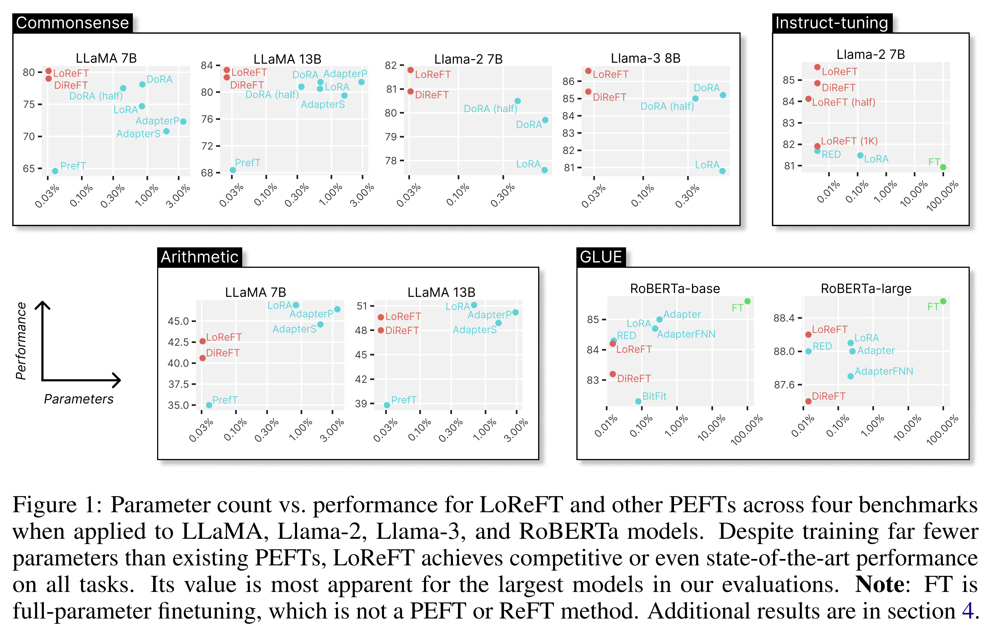
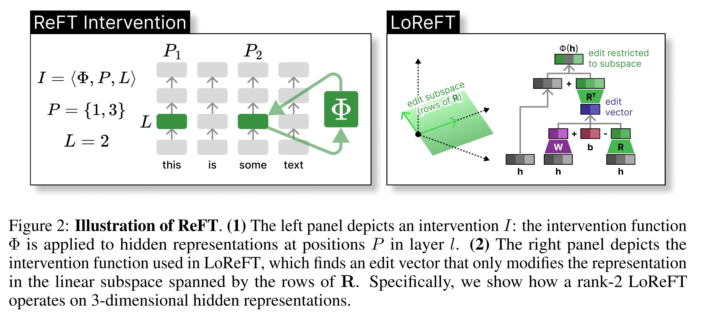
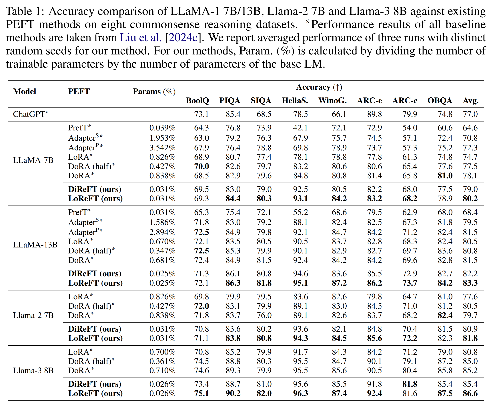
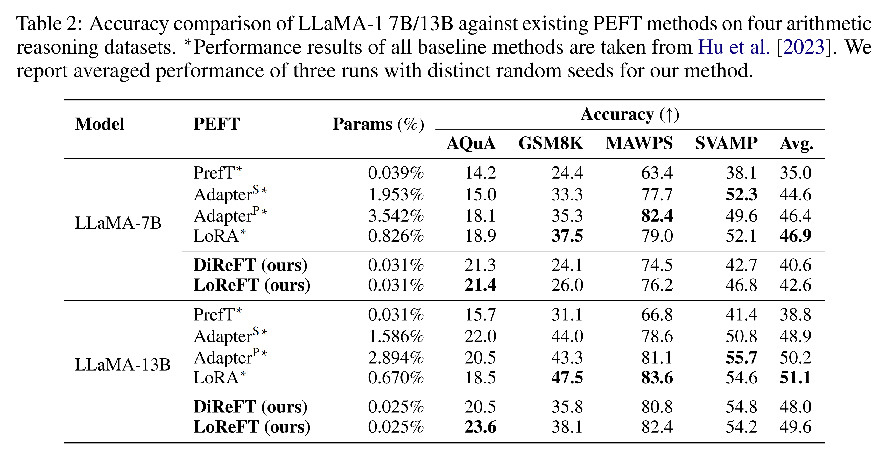
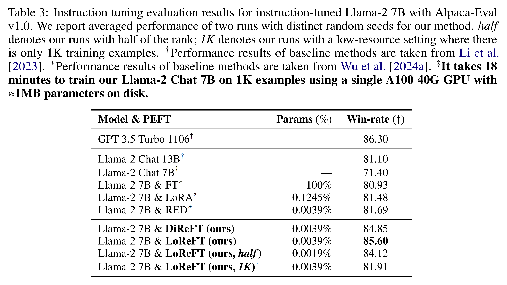
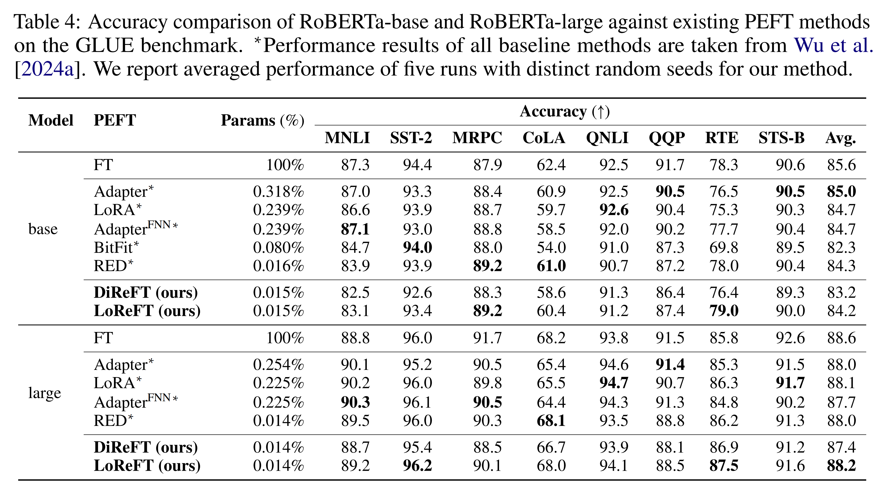

논문 및 이미지 출처 : <https://proceedings.neurips.cc/paper_files/paper/2024/file/75008a0fba53bf13b0bb3b7bff986e0e-Paper-Conference.pdf>

# Abstract

Parameter-efficient finetuning (PEFT) 방법은 large neural model 을 small *weights* 업데이트만으로 적응시키는 것을 목표로 한다. 그러나 기존의 많은 interpretability 연구들은 *representation* 이 rich semantic 정보를 인코딩한다는 것을 보여주었으며, 이는 representation 을 직접 editing 하는 것이 더 강력한 대안이 될 수 있음을 시사한다. 

저자는 이러한 가설을 검증하기 위해 **Representation Finetuning (ReFT)** 방법 계열을 개발한다. ReFT 방법은 frozen base model 위에서 작동하며 hidden representation 에 task-specific intervention 을 학습한다. 

* 저자는 ReFT 계열의 강력한 인스턴스로 Low-rank Linear Subspace ReFT (LoReFT) 를 정의하고, 일부 성능을 희생하는 대신 효율성을 증가시키는 ablation 버전을 제안한다.
* 두 방법 모두 기존 PEFT 의 drop-in replacement 가 가능하며, LoRA 대비 15×–65× 더 parameter-efficient 한 intervention 을 학습한다. 
* 저자는 LoReFT 를 8 commonsense reasoning tasks, 4 arithmetic reasoning tasks, instruction-tuning, 그리고 GLUE 에서 실험하였다. 모든 평가에서 ReFT 는 효율성과 성능의 최적 균형을 제공하며, 거의 항상 SOTA PEFT 보다 우수한 결과를 보였다.

# 1 Introduction

Pretrained language model (LM) 은 새로운 domain 이나 task 에 적응시키기 위해 자주 finetuning 된다. Finetuning 을 통해 하나의 base model 은 small in-domain data 만으로도 다양한 task 에 적응할 수 있다. 그러나 large LM 의 finetuning 은 비용이 많이 든다. Parameter-efficient finetuning (PEFT) 방법은 small weights 만 업데이트함으로써 full finetuning 의 높은 비용 문제를 해결하고자 한다. 이는 memory 사용량과 training 시간을 줄여주며, 많은 setting 에서 full finetuning 과 유사한 성능을 달성한다.

최신 SOTA PEFT 의 특징은 representation 이 아닌 *weights* 를 수정한다는 점이다. 그러나 기존 interpretability 연구는 *representations* 이 rich semantic information 을 인코딩한다는 것을 보여주었으며, 이는 weight update 보다 representation editing 이 더 강력한 대안이 될 수 있음을 시사한다. 

본 논문에서 저자는 **Representation Finetuning (ReFT)** 을 개발하고 이를 정당화하며 이러한 가설을 검증한다. 

* ReFT 방법은 model weight 를 조정하는 대신 model representation 의 일부를 조작하는 intervention 을 학습하여 inference 시 downstream task 를 해결하도록 model behaviour 를 조정한다. 
* ReFT 방법은 weight-based PEFT 의 drop-in replacement 가 가능하다.

이 접근법은 representation 에 intervention 하여 faithful causal mechanism 을 찾거나 inference 시 model behaviour 를 조정하는 LM interpretability 연구에서 영감을 받았으며, Wu et al., Turner et al., Zou et al. 의 representation-editing 연구를 일반화한 것으로 볼 수 있다.

저자는 ReFT 계열 중 강력하고 efficient instance 로 **Low-rank Linear Subspace ReFT (LoReFT)** 를 제안한다. 

* LoReFT 는 low-rank projection matrix 가 span 하는 linear subspace 내 hidden representation 에 intervention 하는 ReFT 의 parameterization 으로, Geiger et al. 과 Wu et al. 의 distributed alignment search (DAS) 방법에 직접 기반한다. 
* 또한 일부 성능을 희생하는 대신 효율성을 높인 ablation 버전인 DiReFT 를 정의한다.

저자는 ReFT 를 LLaMA 계열 model 및 small-scale LM 에 적용하여 commonsense reasoning, arithmetic reasoning, instruction-following, natural language understanding 의 네 domain 의 standard benchmark 에서 기존 PEFT 와 비교한다. LoReFT 는 LoRA 대비 15×–65× 적은 parameter 를 사용하면서도 strongest PEFT 와 비교해 commonsense reasoning, instruction-following, natural language understanding 에서 SOTA 성능을 달성하였다.

이러한 결과는 ReFT 방법이 weight 기반 PEFT 에 대한 더 효율적이고 효과적인 대안으로 부상할 가능성이 있음을 보여주며, 추가 연구 가치가 있음을 시사한다.

# 2 Related work

#### Parameter-efficient finetuning methods (PEFTs)/

PEFT 는 model 의 parameter 일부만 학습하여 downstream task 에 적응시키는 방법이다. PEFT 는 크게 세 가지 범주로 분류된다.

1. **Adapter-based methods**
   Frozen pretrained model 위에 추가 module (e.g., fully-connected layer) 을 학습한다.
   * **Series adapter** 는 LM 의 attention 또는 MLP layer 사이에 component 를 삽입한다.
   * **Parallel adapter** 는 기존 component 와 병렬로 module 을 추가한다.
     Adapter 는 기존 model weight 에 쉽게 합쳐질 수 없는 새로운 component 를 추가하기 때문에 inference 시 추가적인 부담을 초래한다.
2. **LoRA 와 DoRA**
   LoRA 와 DoRA 는 training 중 additive weight update 를 low-rank matrix 로 근사한다. 이 방법은 weight update 가 model 에 merge 될 수 있기 때문에 inference 시 추가적인 비용이 들지 않는다. 현재 가장 강력한 PEFT 로 평가된다.
3. **Prompt-based methods**
   Input (주로 prefix) 에 randomly-initialised soft token 을 추가하고, LM weight 는 frozen 상태에서 해당 embedding 만 학습한다. 그러나 이 방법은 다른 PEFT 대비 최적 성능에서 크게 뒤처지며, 상당한 inference overhead 를 초래한다. Hidden-layer activation 도 함께 tuning 하는 변형 방법이 baseline 으로 제안되었으며 더 나은 성능을 보였다.

#### Representation editing.

최근 *activation steering* 과 *representation engineering* 연구는 fixed 또는 task-specific steering vector 를 추가하거나 residual stream 에 concept erasure 를 적용함으로써 resource-intensive finetuning 없이 pretrained LM 의 generation 을 일정 수준 제어할 수 있음을 보여주었다. 이러한 성공은 pretrained LM 이 유도하는 representation 이 풍부한 semantic structure 를 포함한다는 것을 입증한다.

#### Interventional interpretability.

최근 연구는 model-internal state 에 intervention 을 가해 LM 이 다양한 behaviour 를 어떻게 구현하는지에 대한 가설을 검증해왔다. 특히 representation 의 linear subspace 에 대한 intervention 은 human-interpretable concept 이 선형적으로 인코딩된다는 점에 대한 점점 더 많은 증거를 제공한다. 이는 다음을 포함한다.

* linguistic feature (e.g., gender, number)
* logical 및 mathematical reasoning
* entity attribute
* 그 외 다양한 domain (e.g., word embedding, 추론, domain-specific concept)

이러한 결과는 representation 기반 접근이 LM interpretability 와 controllability 모두에서 중요한 역할을 함을 보여준다.

# 3 ReFT

저자는 이제 ReFT 방법 계열을 정의한다. 이를 위해 먼저 intervention 기반 model interpretability 연구에서 비롯된 핵심 motivation 을 요약한다. 이어서 이 아이디어가 Low-rank Linear Subspace ReFT (LoReFT) 로 직접 이어지는 과정을 보이고, 마지막으로 이를 일반화하여 ReFT 방법 계열을 제안한다. Appendix A 에는 일반적인 ReFT training library 의 개요가 제시되어 있다.

설명을 단순하게 유지하기 위해, target model 이 Transformer 기반 LM 이라고 가정한다. 이 LM 은 token sequence 의 contextualised representation 을 생성한다. input token sequence $x = (x_1, \dots, x_n)$ 가 주어지면, model 은 이를 representation 의 리스트 $h^{(0)} = (h^{(0)}_1, \dots, h^{(0)}_n)$ 로 embedding 한다. 이어서 $m$ 개의 layer 가 이전 hidden representation 리스트 $h^{(j-1)}$ 를 함수로 하여 $j$ 번째 hidden representation 리스트 $h^{(j)}$ 를 순차적으로 계산한다. 각 hidden representation 은 $h \in \mathbb{R}^d$ 인 vector 이다. LM 은 최종 hidden representation $h^{(m)}$ 를 사용하여 예측을 생성한다.

실험에서는 autoregressive LM 과 masked LM 을 모두 고려한다. Autoregressive LM 은 $p(x_{n+1} \mid x_1, \dots, x_n) = \text{softmax}(W h^{(m)}_n)$ 을 예측하며, masked LM 은 $p(x_i \mid x_1, \dots, x_{i-1}, x_{i+1}, \dots, x_n) = \text{softmax}(W h^{(m)}_i)$ 를 예측한다. 여기서 $W$ 는 representation 을 vocabulary space 의 logit 으로 사상하는 learned matrix 이다.

## 3.1 Motivation

Interpretability 연구에서 causal abstraction framework 은 **interchange intervention** 을 사용하여 representation 이 deep learning model 내에서 가지는 causal role 을 규명한다. Interchange intervention 은 특정 representation 을 counterfactual input 이 주어졌을 때 model 이 생성했을 값으로 고정한다. 이러한 intervention 이 model behaviour 에 어떤 영향을 주는지를 실험함으로써 representation 과 그 안에 인코딩된 concept 의 causal role 에 대한 근거를 마련한다.

특정 concept 이 representation 의 linear subspace 에 인코딩되어 있는지를 확인하기 위해 **distributed interchange intervention (DII)** 를 사용할 수 있다. input $b$ 를 처리할 때 model 의 row $i$, column $k$ 에서 생성된 hidden representation 을 $h_b$, input $s$ 를 처리할 때 같은 위치에서 생성된 representation 을 $h_s$ 라 하자. 이때 $h_b$ 에 대해 $h_s$ 를 counterfactual source representation 으로 하는 DII 는 다음과 같이 정의된다.

$$
\text{DII}(h_b, h_s, R) = b + R^\top (R h_s - R h_b) \tag{1}
$$

* 여기서 $R \in \mathbb{R}^{r \times d}$ 는 orthonormal row 를 가진 low-rank projection matrix 이며, 
* $d$ 는 representation 의 차원, 
* $r$ 은 intervention 이 이루어지는 subspace 의 차원이다.

저자는 subspace $R$ 를 distributed alignment search (DAS) 를 통해 학습한다. DAS 는 intervention 후 기대되는 counterfactual output 의 확률을 최대화하는 subspace 를 찾는다. DAS 는 높은 표현력을 가지며, model representation 내부에서 concept 을 효과적으로 localization 할 수 있다. 이는 subspace representation intervention 이 model control 을 위한 강력한 도구가 될 수 있음을 시사한다.

## 3.2 Two low-rank ReFT instantiations

#### LoReFT.

Eq. (1) 의 DII formulation 은 intervention 을 통해 model generation 을 제어하는 방법을 곧바로 제시한다. 핵심 직관은 task label 을 예측하도록 model 을 유도하는 intervention 방법을 학습할 수 있다는 것이다. 그 결과 얻어진 방법이 **Low-rank Linear Subspace ReFT (LoReFT)** 이며, 이는 다음과 같이 정의된다.

$$
\Phi_{\text{LoReFT}}(h) = h + R^\top (Wh + b - Rh) \tag{2}
$$

* 이는 Eq. (1) 과 동일하지만, learned projected source $R_s = Wh + b$ 를 사용한다는 점이 다르다. 
* 따라서 LoReFT 는 $R$ 의 row 들이 span 하는 $r$ 차원 subspace 내에서 representation 을 수정하여 $Wh + b$ 라는 선형 projection 으로부터 얻어진 값을 갖도록 한다. 

Fig. 2 는 이 연산을 시각적으로 보여준다.

* 학습되는 parameter 는 $\phi = \{R, W, b\}$ 이고, LM 의 parameter 는 frozen 상태로 유지된다. 
* $R \in \mathbb{R}^{r \times d}$ 는 orthonormal row 를 갖는 low-rank matrix 이며, 
* $d$ 는 hidden state dimension, 
* $r \leq d$ 는 subspace rank 이다. 
* 또한 $W \in \mathbb{R}^{r \times d}$ 인 linear projection 과 $b \in \mathbb{R}^r$ 인 bias vector 를 정의한다.

#### DiReFT.

추가적으로, 저자는 LoReFT 의 ablation 버전인 **DiReFT** 를 정의한다. 이는 orthogonality 제약과 difference 연산을 제거하여 training 시간을 줄인다.

$$
\Phi_{\text{DiReFT}}(h) = h + W_2^\top (W_1 h + b) \tag{3}
$$

* 여기서 $W_1, W_2 \in \mathbb{R}^{r \times d}$ 는 low-rank projection matrix 이다. 
* Eq. (3) 은 LoRA 와 유사하며, 따라서 DiReFT 는 특정 위치의 hidden representation 에 LoRA 를 직접 적용한 것으로 볼 수 있다. 
* 기존 연구의 empirical evidence 는 LoRA weight 에 orthogonal constraint 를 추가하면 성능이 향상된다는 것을 보여준다.

#### Training objective.

저자는 decoder-only 또는 encoder–decoder LM 을 이용한 generation task, 그리고 encoder-only model 의 $m$ 개 layer 를 이용한 classification task 를 고려한다. Pretrained LM 은 token sequence 에 대한 distribution $p(\cdot)$ 를 유도한다. ReFT intervention $\Phi$ 가 적용된 model 의 distribution 을 $p_\Phi(\cdot)$ 라 하고, 이때 trainable parameter 는 $\phi$ 이다. Notation 을 단순하게 하기 위해, input $x$ 에 대해 LM 이 생성한 hidden representation 을 $h(x)$, intervention 이 적용된 LM 이 생성한 representation 을 $h_\Phi(x)$ 로 표기한다.

* **Generation task.**
  Input sequence $x = (x_1, \dots, x_n)$ 이 prompt 로 주어졌을 때, 목표는 $k$ 개 token 으로 이루어진 output sequence $y = (y_1, \dots, y_k)$ 를 예측하는 것이다. 저자는 teacher-forcing 을 적용한 cross-entropy loss 를 최소화한다.

  $$
  \min_{\phi} \left\{ - \sum_{i=1}^k \log p_\Phi(y_i \mid x y_{<i}) \right\} \tag{4}
  $$

* **Classification task.**
  Single-label classification 에서는 classification head $H_\theta(\cdot)$ 를 추가한다. 이 head 는 parameter $\theta = {W_o, b_o, W_d, b_d}$ 를 가지며, final-layer ($m$) 의 first token (CLS) representation $h^{(m)}_1$ 을 입력받아 class 분포를 출력한다.

  $$
  H_\theta(\cdot \mid h) = \text{softmax}\left(W_o \big(\tanh(W_d h^{(m)}_1 + b_d)\big) + b_o\right) \tag{5}
  $$

  학습되는 parameter 는 head 의 parameter 와 intervention funtion $\Phi$ 의 parameter 이다. 최종적으로 target class $y$ 에 대한 cross-entropy loss 를 최소화한다.

  $$
  \min_{\phi, \theta} \left\{ - \log H_\theta(y \mid h_\Phi(x)) \right\}
  \tag{6}
  $$

# 3.3 The ReFT family of methods

앞서 정의한 intervention 함수들을 일반화하면, intervention 기반 representation finetuning 방법들의 계열을 정의할 수 있다. 먼저 intervention 의 일반적인 개념, 즉 model forward pass 중 hidden representation 을 수정하는 과정을 정의한다.

#### Definition 3.1.

**Intervention** $I$ 는 Transformer-based LM 이 계산한 representation 을 inference 시점에서 단일하게 수정하는 과정을 캡슐화하는 tuple $\langle \Phi, P, l \rangle$ 이다. Intervention 은 세 가지 요소로 구성된다.

1. learned parameter $\phi$ 를 갖는 **intervention function** $\Phi : \mathbb{R}^d \to \mathbb{R}^d$
2. intervention 이 적용되는 **input positions** set $P \subseteq \{1, \dots, n\}$
3. intervention 이 적용되는 **layer** $l \in \{1, \dots, m\}$

Intervention $I$ 는 다음 연산으로 구현되며, 이는 일부 representation $h$ 를 덮어쓴다.

$$
h^{(l)} \leftarrow \left( \Phi(h^{(l)}_p) \text{ if } p \in P \text{ else } h^{(l)}_p \right)_{p \in \{1, \dots, n\}}
\tag{7}
$$

Intervention 은 $h^{(l)}$ 이 계산된 직후 적용되므로, 이후 layer 들 $h^{(l+1)}, \dots, h^{(m)}$ 의 representation 에 영향을 준다. Fig. 2 는 intervention 의 개략적인 구조를 보여준다.

이제 ReFT 는 서로 겹치지 않는 intervention 집합으로 정의된다.

#### Definition 3.2.

ReFT 방법은 $f$ 개의 intervention 으로 이루어진 집합 $I = \{ I_1, \dots, I_f \}$ 이다. 동일한 layer $l_j = l_k$ 에서 작동하는 두 intervention $I_j, I_k \in I$ 가 존재할 경우, 그들의 intervention 위치는 서로 겹치지 않아야 한다. 즉, $P_j \cap P_k = \varnothing$ 이어야 한다. 모든 intervention fubctions 의 parameter $(\phi_1, \dots, \phi_f)$ 는 서로 독립적이다.

따라서 ReFT 는 model forward pass 중 hidden representation 에 intervention 을 수행하는 일반적인 framework 이다.

# 4 Experiments

저자는 기존 PEFT 와 비교하여 ReFT 의 성능을 평가하기 위해 네 가지 다양한 NLP benchmark 에서 20 개 이상의 dataset 을 대상으로 실험을 수행한다. 목표는 LoReFT 와 DiReFT 가 서로 다른 시나리오에서 어떻게 작동하는지를 종합적으로 보여주는 것이다.

실험은 masked LM 과 autoregressive LM 모두에 대해 수행하며, 규모는 RoBERTa-base (125M parameter) 부터 LLaMA (13B parameter) 까지 다양하게 포함된다. Baseline 으로는 prefix-tuning, adapter-tuning (Series Adapter 와 Parallel Adapter), BitFit, RED, LoRA, DoRA 를 포함한다. 비교는 성능과 parameter efficiency 모두에 초점을 둔다. 비교 시, 가능하다면 기존 연구에서 보고된 hyperparameter-tuned score 를 사용한다.

저자의 base LM 은 memory 절약을 위해 `torch.bfloat16` 으로 로드된다. 모든 실험은 single GPU (NVIDIA A100 40G/80G 또는 RTX 6000) 에서 수행되었다. Baseline 방법들의 성능 결과는 Liu et al. 의 연구에서 가져왔으며, hyperparameter tuning 이후 얻어진 best 성능을 반영한다.

## 4.1 Hyperparameter configuration

실험을 위해서는 몇 개의 intervention 을 학습할지, 그리고 어떤 layer 와 input position 에 intervention 을 적용할지를 결정해야 한다. 저자는 prompt 의 고정된 개수의 $p$ 개 prefix position 과 $s$ 개 suffix position 에 intervention 을 학습하는 방식을 제안한다. 구체적으로 네 가지 hyperparameter 를 조정한다.

1. intervention 을 적용할 prefix position 의 개수 $p$ (즉, 위치 ${1, \dots, p}$)
2. intervention 을 적용할 suffix position 의 개수 $s$ (즉, 위치 ${n-s+1, \dots, n}$)
3. intervention 을 적용할 layer 집합 $L$
4. 동일한 layer 내 서로 다른 position 에 대해 intervention parameter $\phi$ 를 공유할지 여부

이 방식은 hyperparameter search space 를 단순화한다. LoRA 와 비교했을 때 추가되는 고려사항은 intervention 을 적용할 위치뿐이다. 수정되는 position 의 개수가 고정되어 있으므로, LoReFT 와 DiReFT 의 추가 inference cost 는 prompt 길이에 따라 증가하지 않고 일정하다.

주어진 positions $P = \{1, \dots, p\} \cup \{n-s+1, \dots, n\}$ 에 대해, untied 와 tied variant 는 다음과 같이 정의된다.

* Untied variant:

$$
I_{\text{untied}} = \{ \langle \Phi, \{p\}, l \rangle \mid p \in P, l \in L \}
$$

* Tied variant:

$$
I_{\text{tied}} = \{ \langle \Phi, P, l \rangle \mid l \in L \}
$$

추가적으로, LoReFT 와 DiReFT 를 길이 $n$ 의 prompt 에 적용할 때 $n < p+s$ 인 경우,

* $p \leftarrow \min(p, \lfloor n/2 \rfloor)$
* $s \leftarrow \min(s, \lceil n/2 \rceil)$

로 조정하며, $I_{\text{untied}}$ 에서 잘린 intervention 은 적용하지 않는다. 또한 neural network training hyperparameter 도 함께 조정한다.

저자의 접근은 기존 연구와 달리 hyperparameter tuning 을 test set 에 직접 최적화하지 않고, task 의 test set 과 겹치지 않는 development set 에서만 수행한다. 각 benchmark 별 hyperparameter tuning 절차는 Appendix D.1 에 기술되어 있다.

## 4.2 Commonsense reasoning

저자는 Hu et al. 의 실험 설정을 재현하여 LLaMA-1 7B/13B, LLaMA-2 7B, 그리고 LLaMA-3 8B 에 대해 여덟 개 commonsense reasoning task 를 결합한 dataset (COMMONSENSE170K) 으로 finetuning 을 수행한다. 각 task 의 test set 에 대한 점수를 개별적으로 보고하며, Hu et al. 에서 benchmark 된 PEFT 와 Liu et al. 이 동일하게 수행한 DoRA 실험 결과와 비교한다.

#### Datasets.

Benchmark 는 8 commonsense reasoning datasets 로 구성된다: BoolQ, PIQA, SIQA, HellaSwag, WinoGrande, ARC-e, ARC-c, OBQA. 각 예제는 multiple-choice 문제 형태로 주어지며, model 은 rationale 없이 직접 정답을 생성해야 한다. Prompt template 은 Hu et al. 과 동일하게 사용하되, 추가로 문자열 정규화(whitespace 제거)를 적용하였다.

#### Hyperparameter tuning.

* 저자는 test set 결과를 기반으로 hyperparameter selection 을 수행하지 않는다. 
* 대신 GSM8K training set 으로부터 생성한 development set 에서 가장 성능이 좋은 model 의 hyperparameter 설정을 그대로 사용한다. 
* 단, COMMONSENSE170K training set 은 GSM8K 보다 20 배 이상 크기 때문에 epoch 수는 절반(12 → 6) 으로 줄였다. 
* 이를 통해 관련 hyperparameter 를 효과적으로 조정하고, 동시에 domain 이 다른 상황에서 설정의 robustness 를 검증할 수 있다.

#### Results.

결과는 Tab. 1 에 제시된다. LoReFT 는 commonsense reasoning task 전반에서 SOTA 성능을 기록하며, 다른 모든 방법들을 큰 차이로 능가한다. DiReFT 는 compute-efficient 하면서도 LoReFT 보다 약간 낮은 성능을 일관되게 보였다.

## 4.3 Arithmetic reasoning

앞선 실험과 유사하게, 저자는 Hu et al. 의 실험 설정을 따라 LLaMA-1 7B 및 13B 를 LM-generated chain-of-thought step 이 포함된 일곱 개 arithmetic reasoning task 로 구성된 dataset (MATH10K) 에 대해 finetuning 하였다. 그리고 네 개 task 의 test set 에서 점수를 보고한다. 평가에서는 최종 numeric 또는 multiple-choice answer 의 correctness 만 측정한다.

#### Hyperparameter tuning.

Commonsense reasoning benchmark 와 동일한 hyperparameter 설정을 사용하되, training 은 12 epoch 으로 진행하였다. 또한 3 epoch 결과도 함께 보고한다.

#### Datasets.

Benchmark 는 네 개의 math word problem dataset 으로 구성된다: AQuA, GSM8K, MAWPS, SVAMP. Model 은 최종 답을 생성하기 전에 chain-of-thought reasoning 을 수행해야 한다. Prompt template 과 hyperparameter 설정은 이전 commonsense reasoning 실험과 동일하게 사용하였다.

#### Results.

결과는 Tab. 2 에 보고된다. 

* LoReFT 와 DiReFT 는 arithmetic reasoning task 에서 LoRA 와 adapter 에 비해 성능이 낮지만, prefix-tuning 보다는 더 좋은 성능을 보였다. 
* 저자의 결과는 ReFT 가 single-step commonsense reasoning task 보다는 chain-of-thought reasoning 에서 더 어려움을 겪는다는 것을 시사한다. 
  * 이는 generation 길이가 길어질수록 intervention 의 효과가 감소한다는 점, 그리고 task 자체의 난이도가 높다는 점 때문일 수 있다.
* 또한 ReFT 는 7B 모델보다 13B 모델에서 더 나은 성능을 보였으며, 이는 저자의 방법이 model 크기에 따라 잘 scale 됨을 나타낸다. 
* 전반적으로 arithmetic reasoning 결과는 변동성이 크며, 모든 task 에서 뚜렷하게 우세한 단일 방법은 존재하지 않았다.

## 4.4 Instruction-following

Base LM 은 human prompt 를 따르기 위해 instruction finetuning 이 필요하다. 저자는 Wu et al. 의 실험 설정을 따라 LLaMA-2 7B 를 Ultrafeedback dataset 으로 finetuning 하였다. 비교 대상은 full parameter finetuning, LoRA, RED 이다. 평가에는 **Alpaca-Eval v1.0** 을 사용하며, 이는 text-davinci-003 과의 win-rate 를 GPT-4 annotator 로 계산한다. Prompt template 은 Taori et al. 과 동일하게 사용한다.

#### Datasets.

Ultrafeedback 은 고품질 instruction dataset 으로, 다양한 model (e.g., ChatGPT, Bard) 의 candidate response 들을 scoring 하여 생성된다. Score 는 instruction-following, truthfulness, honesty, helpfulness 의 가중합으로 계산된다. 일부 best-performing chat model (e.g., UltraLM-13B) 은 Ultrafeedback 으로 finetuning 되었다.

#### Hyperparameter tuning.

저자는 test-set hill-climbing 을 방지하기 위해, Alpaca-52K (unseen instruction-following dataset) 만을 사용하여 LLaMA-7B 기반으로 hyperparameter tuning 을 수행한다. 그 후 best-performing model 의 hyperparameter 설정을 사용하여 Ultrafeedback finetuning 을 진행한다. Hyperparameter tuning 과정에서는 빠른 검증을 위해 GPT-4 turbo annotator 와 Alpaca-Eval v1.0 을 사용하였으며, 이는 GPT-4 judge 로 과적합되는 것을 방지한다.

#### Results.

결과는 Tab. 3 에 제시된다. 

* 동일한 parameter 수 조건에서, LoReFT 는 LLaMA-2 7B 를 기반으로 RED 및 다른 모든 finetuning 방법 (full finetuning 포함) 보다 우수한 성능을 보였으며, GPT-3.5 Turbo 1106 과의 win-rate 차이를 1% 이내로 좁혔다. 
* 또한 parameter 수를 절반으로 줄이거나 data 의 1/64 만 사용한 경우에도 LoReFT 는 다른 finetuning 방법보다 더 나은 성능을 기록하였다. 
  * 이는 LoReFT 가 long-form text generation 에서도 성공할 수 있음을 보여준다.
* DiReFT 는 LoReFT 보다 다소 낮은 성능을 보였으나 여전히 매우 경쟁력이 있었다.

## 4.5 Natural language understanding

저자는 GLUE benchmark 에서 기존 PEFT 와 비교하여 LoReFT 를 평가한다. 이 실험은 LoReFT 가 small-scale LM 에서도 잘 작동하며, text generation 뿐 아니라 classification task 를 위한 representation 개선에도 효과적임을 보여준다.

실험에서는 RoBERTa-base (125M) 와 RoBERTa-large (350M) 를 GLUE 에 대해 finetuning 한다. GLUE 는 sentiment classification, natural language inference 등 다양한 domain 을 포함하는 sequence classification benchmark 이다.

평가는 Wu et al. 의 설정을 따른다. 즉, GLUE validation set 을 random seed 로 두 부분으로 나누고, in-training validation accuracy 가 가장 높은 model 을 선택하여 나머지 절반 held-out set 에서 test accuracy 를 측정한다.

#### Hyperparameter tuning.

각 task 별로 hyperparameter tuning 을 따로 수행한다. 이는 PEFT 의 표준 절차이다. Random seed 에 overfitting 되는 것을 피하기 위해, constant seed 로 hyperparameter 를 tuning 하고, 추가로 네 개 unseen seed 를 포함해 총 다섯 개 seed 에 대해 평균 결과를 보고한다. Appendix D.1 에 tuning 실험이 설명되어 있다.

#### Results.

결과는 Tab. 4 에 제시된다. 

* LoReFT 는 두 model 규모에서 모두, RED (해당 task 에서 가장 parameter-efficient 한 기존 PEFT) 와 parameter matched 조건으로 비교했을 때 유사한 성능을 달성하였다. 
* 반면, DiReFT 는 대부분의 PEFT 보다 낮은 성능을 보였으며, 이는 small LM 환경에서는 LoReFT 가 더 적합한 선택임을 시사한다. 
* 표준편차를 포함한 전체 결과는 Tab. 13 에 제시된다. 추가적으로 VeRA 와의 비교 결과는 Appendix D.3 에 보고된다.

# 5 Limitations

저자는 자원이 제한적이었기 때문에 주로 LLaMA 계열 model 에 초점을 맞추었다. 향후 연구에서는 다른 model 계열뿐 아니라 LLaVA 와 같은 vision–language model 에서도 ReFT 의 효과를 탐구할 계획이다. 또한 ReFT 의 capability 는 아직 충분히 탐구되지 않았다. 그 이유는 hyperparameter 탐색 공간이 매우 넓기 때문이며, 저자는 이를 자동화하는 방법에 관심을 가지고 있다. Appendix G.2 에서는 few-shot setting 에서 ReFT 를 활용한 LM personalization 에 대한 초기 실험을 제시한다.

또한 ReFT 가 왜 작동하는지에 대한 이해도 필요하다. Appendix F.1, F.2 에서는 memorisation 중심의 초기 실험을 포함하였다. 더불어 학습된 orthogonal subspace 들이 추가적인 적응 없이 서로 결합될 수 있는지 여부도 탐구 중이다. Appendix G.1 에서는 이에 대한 고무적인 초기 결과가 보고되어 있다.

# 6 Conclusion

저자는 PEFT 에 대한 강력한 대안으로 **LoReFT** 를 제안하며, 이 방법의 ablation 버전인 **DiReFT** 를 정의한다. DiReFT 는 일부 성능을 희생하는 대신 효율성을 높인다. 전반적으로 LoReFT 는 네 가지 domain benchmark 에서 강력한 성능을 달성하면서도 LoRA 대비 15×–65× 더 효율적이다. 특히 commonsense reasoning, instruction-following, natural language understanding 에서 가장 강력한 기존 PEFT 를 능가하며 새로운 SOTA 성능을 기록한다.

또한 저자의 방법은 일반적인 framework 인 ReFT 로 기술될 수 있음을 보였다. ReFT 는 기존 PEFT 보다 더 강력하고, 더 parameter-efficient 하며, 더 interpretable 한 새로운 finetuning 접근 방식이다.

