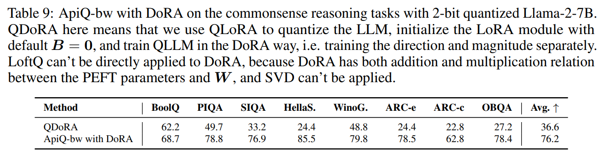

논문 및 이미지 출처 : <https://arxiv.org/pdf/2402.05147>

# Abstract

memory-efficienct finetuning 은 Large Language Models (LLMs) 의 크기가 커짐에 따라 많은 주목을 받고 있으며, 특히 GPU memory 제한과 full finetuning 에 비해 우수한 효율성 때문에 관심이 높아지고 있다. 하지만 QLoRA 와 같은 현재의 memory-efficient finetuning 전략들은 다양한 bit-width quantization 과 multifaceted task 에서 일관되지 않은 성능을 보인다. 이는 주로 quantization 과정이 보존된 knowledge 에 부정적인 영향을 미쳐 catastrophic forgetting 을 야기하고, pretrained models 의 finetuning 활용성을 저해하기 때문이다.

본 연구에서는 **ApiQ** 라는 novel quantization framework 을 제안한다. ApiQ 는 LoRA components 의 initialization 과 LLMs 의 weight quantization 을 동시에 수행함으로써, quantization 으로 손실된 정보를 복원한다. 이를 통해 original LLM 의 activation precision 을 유지하는 동시에, shallower layer 에서 deeper layer 로의 error propagation 을 줄인다. 다양한 LLM 에 대해 여러 language tasks 와 다양한 bit-width 로 종합 평가한 결과, ApiQ 는 quantization 시 발생하는 activation error 를 최소화하여, 일관적으로 더 나은 finetuning 성능을 달성함을 보였다.

# 1 Introduction

Large language models (LLMs) 는 광범위한 분야와 애플리케이션에서 큰 성공을 거두고 있다. 최근에는 50B 넘는 parameters 를 포함하는 LLM 이 등장할 정도로 규모와 복잡성이 기하급수적으로 확장되고 있으며, 이렇게 커진 모델을 효율적으로 downstream task 에 적합하게 만드는 것은 상당히 까다로운 과제다. 전통적으로는 pretrained model 의 모든 parameters 를 업데이트하는 full finetuning 방식이 널리 쓰여 왔는데, 이는 여러 SOTA 결과를 달성했음에도, GPU memory 가 제한적인 환경에서 실용성이 떨어진다. 이는 특히 점점 커지는 LLM 에 대해, model weights 와 optimizer states 를 모두 GPU memory 에 적재해야 하는 부담에서 기인한다.

LLMs fine-tuning 의 막대한 메모리 요구사항을 완화하기 위해, parameter-efficient finetuning (PEFT) 이라는 방법이 제안되었다. 이는 LLM 의 대부분의 parameters 는 그대로 두고, 일부분만 학습 가능하게 만들어 finetuning 하는 기법이다. 이 방식의 가장 큰 장점은, trainable parameters 의 양에 비례해 증가하는 optimizer state 의 GPU memory requirements 가 크게 줄어든다는 점이다. 게다가 LLM weights 를 적재하는 데 필요한 GPU memory 를 더 줄이기 위해, high-precision weight values 를 discrete values 로 변환해주는 다양한 model compression 기법이 개발되었다. 이러한 quantization 기술은 원래 memory-limited 환경에서 LLM 을 inference 용도로 배포하기 위해 연구되었으나, 최근에는 LoRA 같은 PEFT 방법과 결합한 QLoRA 가 제안되어 finetuning 시에도 GPU memory usage 을 효과적으로 줄이는 데 성공했다.

그러나 QLoRA 는 LLM 의 quantization 과 동일한 문제를 안고 있다. 즉, quantization error 로 인해 full-precision LLM 에서 학습된 지식이 왜곡되며, lower-bit quantizations 에서 이 왜곡이 심해져 catastrophic forgetting 으로 이어진다. 최근 Li et al. [2023] 와 Guo et al. [2023] 는 LoRA components 를 전략적으로 초기화하여 original weight states 를 유지함으로써 quantization error 를 줄이는 방법을 제안했고, 이를 통해 lower-bit 로 quantized 된 LLMs (QLLMs) 의 finetuning 에서 상당한 성공을 거두었다. 다만 이들은 per-linear-layer bias 로 weight states 를 보존하는 데 집중했기 때문에, layers 를 거치며 error 가 누적되는 문제가 남는다.

본 논문에서는 QLoRA 와 유사한 two steps 로 LLM 을 적응시키는, activation-preserved initialization of QLLM (**ApiQ**) 이라는 efficient quantization framework 을 새롭게 소개한다. quantization step 에서 ApiQ 는 full-precision LLM 의 weight 대신 activation 을 보존하는 접근을 취하는데, 이를 위해 LoRA 의 components 와 LLM 의 weights 를 함께 최적화하여 quantize 한다. 이 방식은 QLLM 이 산출하는 output 이 full-precision LLM 의 output 과 일치하도록 만들어, 대응하는 layer 간 activation 을 aligning 함으로써 quantization error 를 효과적으로 완화한다. 그 결과, 이전 layer 에서 발생한 quantization errors 가 상당 부분 보정된다. 이후 finetuning 단계에서는 fixed QLLM 에 LoRA modules 만 학습하여 downstream task 를 수행함으로써 GPU memory requirements 를 크게 줄일 수 있다.

본 논문의 주요 기여사항은 다음과 같다:

- QLLM 을 finetuning 할 때 발생하는 문제점을 심층 분석한다 (Sec. 3).  
- LLM 의 quantization 과 동시에 PEFT parameters 를 초기화하여, full-precision LLM 의 activation 을 보존하는 ApiQ 를 제안한다 (Sec. 4).  
- ApiQ 는 post-training quantization (PTQ) 최신 기법보다도 우수한 quantization 성능을 달성한다 (Sec. 5.1).  
- 5 LLMs 와 5 downstream tasks 에 대해 광범위한 실험을 수행한 결과, ApiQ 는 다양한 bit levels 에서 all baselines 를 꾸준히 능가한다 (Sec. 5.3 및 Fig. 1).

# 2 Preliminaries

#### GPU memory allocation

GPU memory 의 할당과 활용은 모델을 학습할 때, 일반적으로 Fig. 2 의 Llama2-7B finetuning 예시에 나타난 세 가지 주요 메커니즘으로 요약된다. 1) full finetuning 의 경우, model weights 를 저장하기 위해 GPU memory 의 상당 부분이 할당된다. 예를 들어, 대략 7B parameters 를 BFloat16 format 으로 사용하면 약 12.6GB 가 필요하다. 2) trainable parameters 와 연관된 optimizer states 가 GPU memory 의 상당 부분을 차지한다. 예컨대 Adam 을 optimizer 로 사용하면, first 및 second moments 를 GPU memory 에 저장해야 하므로 trainable parameters 자체가 차지하는 메모리보다 두 배가량 더 필요하다. model weights 와 optimizer states 를 위한 메모리 할당은 학습 과정 내내 변하지 않으며, 일정하게 유지된다. 3) **activations** 의 임시 저장으로, 즉, model 각 layer 를 거칠 때마다 생성되는 output 으로, backward pass 시 gradient computation 을 위해 메모리에 보관된다. gradient computation 이 끝난 뒤 이 activations 은 삭제된다. PyTorch 와 같은 현대적인 training framework 는 이러한 gradient computation 및 activation 삭제 과정을 순차적으로 진행하여 메모리를 효율적으로 사용한다. memory usage 이 가장 크게 치솟는 시점은 보통 gradient computation 이 시작될 때나 optimizer states 를 업데이트할 때다.

#### Memory-efficient finetuning

GPU memory constraints 및 커져가는 LLMs size 에 대응하기 위해, finetuning 시 memory efficiency 를 높이는 다양한 전략이 개발되었다. 예컨대 activation memory 부담을 줄이기 위해 선택적으로 activation 을 보관하거나 필요 시 on-demand recomputation 하는 기법이 사용된다. 또한, optimizer state 에 필요한 메모리를 줄이기 위해 pretrained LLM 을 고정한 채, 소수의 trainable parameters 만 도입하는 접근도 제안되었다. 대표적인 예인 LoRA 는 linear layer 의 pretrained weight $W \in \mathbb{R}^{d_1 \times d_2}$ 를 다음처럼 변형한다: $W' = W \;+\; \frac{\alpha}{r} \, A B^\top$, 여기서 $A \in \mathbb{R}^{d_1 \times r}$, $B \in \mathbb{R}^{d_2 \times r}$, $r \ll d_1$, $r \ll d_2$, $\alpha$ 는 scalar 이다. smaller bottleneck dimension $r$ 을 도입하면, Fig. 2 에 보이듯 optimizer 에 필요한 메모리를 예를 들어 26.4GB 에서 5.3GB 로 크게 줄일 수 있다. LoRA 의 memory usage 를 더 줄이기 위해서는 $W$ 를 16-bit 대신 4-bit 등으로 quantizing 하는 방법을 사용할 수 있는데, QLoRA 에서 제안된 것처럼 4-bit quantization 을 적용하면 model weights 를 저장하는 데 필요한 메모리가 12.6GB 에서 4.6GB 로 상당히 줄어든다.

#### Quantization

Quantization 은 high-precision values 를 discrete levels 로 변환하는 과정이다. 본 연구에서는 하드웨어 지원과 효율성이 뛰어난 uniform affine quantization 에 주목한다. 이는 pretrained weight 를 다음과 같이 quantizing 한다:

$$
\begin{equation}
    W_q \;=\; \text{clamp}\bigl(\lfloor\frac{W}{s}\rceil + z,\; 0,\; 2^b - 1\bigr),
\end{equation}
$$

여기서 scale factor $s = \frac{\max(W) - \min(W)}{2^b - 1}$, zero-point $z = -\bigl\lfloor \frac{\min(W)}{s}\bigr\rceil$, $b$ 는 bit-width, $\lfloor \rceil$ 은 round-to-nearest operation 이다. 모델 로딩 시에는 줄어든 bit 형식의 $W_q$ 와 $z$, 그리고 Float16 형식의 $s$ 만 GPU 로 가져오면 된다. forward pass 에서는 다음과 같이 de-quantize 하여 activation 계산에 사용한다: $Q \;=\; s \,\bigl(W_q - z\bigr).$

# 3 Challenges of finetuning QLLM

QLoRA 는 fixed pretrained weights 를 lower-bit format 으로 GPU 에 로드하고, finetuning 시 adapters 의 minimal parameters 만 학습하도록 하는 전략을 사용한다. 이를 통해 model weights 와 optimizer states 가 차지하는 메모리를 Fig. 2 에 보이듯 약 39GB 에서 10GB 로 크게 줄일 수 있으며, 이로써 보다 제한된 컴퓨팅 자원에서도 LLM 을 finetuning 할 수 있게 된다. 다만 이러한 방식은 quantization 에 기인한 몇 가지 문제점을 야기한다.

## 3.1 QLLM breaks down the starting point

LLMs 는 광범위하게 적용 가능한 distributed representations 를 학습해, downstream learning 에서 task-specific representations 를 효과적으로 압축해내는, 즉 training starting point 로서 강력한 기반을 제공하는 것으로 알려져 있다. Liao et al. [2023b] 는 finetuning 초기부터 full finetuning 과 유사한 성능을 내려면, modified weight $W'$ 와 original weight $W$ 간의 차이가 매우 작도록 (i.e., $\lVert W' - W \rVert \rightarrow 0$) 유지하는 것이 핵심이라고 주장한다.

LoRA 는 $B = 0$ 로 초기화하여, training start 시 $W' = W$ 가 되도록 이 원칙을 준수한다. 반면 QLoRA 는 $A, B$ 에 대해 LoRA 의 default initialization 을 그대로 따른다. 따라서 학습 초기에는 $W' = Q + AB^\top = Q$ 가 되는데, quantization 의 round-to-nearest 및 clipping operations 로 인해 $Q$ 는 original $W$ 와 달라져 starting point 가 왜곡된다. 이 deviation, 즉 $\lVert \delta W \rVert = \lVert W - W' \rVert$ 은 lower-bit quantization 일수록 커질 것으로 예상된다.

최근 Li et al. [2023] 와 Guo et al. [2023] 는 QLoRA 의 $Q, A, B$ 를 다음 optimization problem 으로 풀어 초기화하는 방식을 제안했다:

$$
\begin{equation}
    \min_{Q, A, B} \;\lVert W - (Q + AB^\top)\rVert.
\end{equation}
$$

이 방법의 핵심 목표는 model 의 initial state (starting point)가 최대한 original $W$ 에 가깝도록 $Q, A, B$ 를 설정하는 것이다. Fig. 3 (Left) 에서 보이듯, LoftQ 는 이렇게 함으로써 weight error 를 크게 줄였다.

## 3.2 Accumulative quantization error

Hu et al. [2022] 의 연구에서는 query 와 value projection layers 에만 LoRA module 을 적용해도 full finetuning 수준의 성능을 달성할 수 있다고 강조한다. 반면 Dettmers et al. [2023a] 는 QLLM 에 all linear layers 에 LoRA modules 을 적용해야 유사한 결과를 얻을 수 있다고 주장한다.

저자는 QLoRA 의 결론을 확장하기 위해, DeBERTa-v3-base 와 Llama-2-7B 에 대해 각각 MNLI 와 WikiText-2 datasets 를 사용해 finetuning 실험을 진행했다. Tab. 1 의 결과에서 볼 수 있듯, QLoRA 는 일부가 아니라 all linear layers 에 LoRA module 을 적용했을 때 가장 우수한 성능을 낸다. 이는 quantization 으로 인해 각 linear layer 에서 learned information 이 일부 손실되며, 이를 보완하고 original learned information 을 복원하기 위해서는 각 linear layer 마다 LoRA module 을 적용해야 함을 시사한다.

게다가 quantization errors 는 layer 를 거듭하면서 누적된다. two consecutive linear layers $W_0$ 와 $W_1$, 그리고 이들의 inputs/outputs $X_0, X_1, X_2$ 를 가정하자. 

QLoRA quantization 을 적용했을 때 first layer 의 activation error 는 $\lVert X_1 - X_1^q \rVert = \lVert X_0 W_0 - X_0 Q_0 \rVert = \lVert X_0 W_0 - X_0 (W_0 - \delta W_0) \rVert = \lVert X_0 \delta W_0 \rVert$ 이며, 여기서 $\delta W_0$ 는 quantization error 다. 

second layer 의 error 는 $\lVert X_2 - X_2^q \rVert\ = \lVert X_0 W_0 \delta W_1 + X_0 \delta W_0 W_1 - X_0 \delta W_0 \delta W_1 \rVert$

이 현상은 shallow layer 에서 발생한 quantization error 가 deeper layer 로 전달되어, 특히 deeper LLM 에서는 영향이 커질 수 있다. 이를 보완하려면 각 quantized linear layer 에 적절한 시점에 LoRA module 을 적용해 error 를 보상해줘야 한다.

LoftQ 는 $\delta W = W - (Q + AB^\top)$ 를 줄여 quantization error 를 완화하지만, error propagation 문제 자체는 여전히 남아 있다. Tab. 1 의 결과에서도, all LoRA modules 을 학습했을 때와 일부만 학습했을 때 성능 차이가 여전히 크며, 특히 lower-bit quantization 일수록 그 격차가 더 벌어진다. 이는 quantization error 를 줄이는 것뿐 아니라, layer 간 propagation 을 적절히 관리하는 것 또한 중요함을 보여준다.

## 3.3 SVD is not a universal solution

Li et al. [2023], Guo et al. [2023] 는 다음과 같은 iterative algorithm 으로 Eq. (2) 를 풀어,  

$$
A^{(t)}, B^{(t)} \leftarrow \text{SVD}\bigl(W - Q^{(t-1)}\bigr) \quad,\quad Q^{(t)} \leftarrow f\bigl(W - A^{(t)} B^{(t)\top}\bigr),
$$

여기서 $f$ 는 다음과 같은 sequential quantization / de-quantization function 이:

$$
\begin{equation}
    Q = f(W) = s \cdot \Bigl( \text{clamp}\bigl(\lfloor \frac{W}{s} \rceil + z, 0, 2^b -1\bigr) - z\Bigr)
\end{equation}
$$

이 알고리즘은 calibration data 없이도 효과적이지만, LoRA 의 variant 인 DoRA 같은 다른 PEFT 방식에도 쉽게 적용할 수 있는 것은 아니다. 이 알고리즘은 PEFT parameter 와 $W$ 의 관계가 단순 덧셈 구조여야 하며, (IA)$^3$, Adapter, HiWi 등의 PEFT 방법에는 이 형태가 적용되지 않는 경우가 많다.

결론적으로, QLLM 을 efficiently finetuning 하기 위해서는 starting point 보존, layer 간 누적되는 quantization error 의 propagation 완화, 다양한 PEFT 방법에 범용적으로 적용 가능한 알고리즘 설계가 모두 필요하다.

# 4 Method: ApiQ

본 섹션에서는 finetuning QLLM 에서 발생하는 앞서 언급된 문제들을 해결하기 위해, **ApiQ** (Activation-preserved initialization of QLLM) 라는 새로운 quantization framework 을 제안한다. ApiQ 의 핵심 목표는 모델의 starting point 를 유지하면서, network 전체에서 누적되는 quantization error 의 영향을 효과적으로 최소화하는 것이다.

## 4.1 Activation-preserved initialization

ApiQ 는 기존 연구처럼 weight error 가 아닌 **activation error** 를 최소화하도록 설계된 quantization 방법이다. ApiQ 의 core optimization problem 은 다음과 같이 정의된다:

$$
\begin{equation}
    \argmin_{Q, A, B} \bigl\lVert\,XW - X^q \,\bigl(Q + AB^\top\bigr)\bigr\rVert
\end{equation}
$$

이때 pretrained weight $W \in \mathbb{R}^{d_1 \times d_2}$ 는 optimization 중에 고정된다. quantized weight $Q \in \mathbb{R}_b^{d_1 \times d_2}$ 는 $b$-bit format 으로 표현되며, $A \in \mathbb{R}^{d_1 \times r}$ 와 $B \in \mathbb{R}^{d_2 \times r}$ 는 trainable low-rank matrix 다. $X \in \mathbb{R}^{n \times t \times d_1}$ 는 해당 linear layer 의 input (batch size = $n$, sequence length = $t$) 이며, $XW$ 는 linear layer 의 output 또는 activation 이다. 반면 $X^q \in \mathbb{R}^{n\times t \times d_1}$ 는 quantized linear layer 의 input 으로, LLM 의 first linear layer 에서는 $X$ 와 동일하지만, subsequent layers 에서는 nearest shallower quantized layer 의 output 을 물려받는다.

LoftQ 와 LQ-LoRA 의 핵심 차이점은 ApiQ 는 서로 다른 layers 의 input order 를 따라 각 linear layer 에 대해 sequential optimization 을 요구한다는 점이다. 이는 $X_q$ 가 이전 layer 로부터 유도되기 때문이다. 예를 들어 Llama-2 의 각 transformer block 에서는, key, query, value projection layer 들부터 optimizing 을 시작한 다음 output projection layer 로 넘어가고, 그 뒤 gate 와 up projection layer, 마지막으로 down projection layer 순으로 진행한다.

ApiQ 는 크게 두 가지 이점을 갖는다. 1) quantized linear layer 의 output 이 original output 과 최대한 일치하도록 하여, model starting point 를 보존한다. 2) shallower layer 에서 발생한 quantization error 가 deeper layer 로 전파되는 것을 완화한다. 이는 매번 quantized layer 의 output 이 original output 과 가깝도록 유지함으로써, network 를 따라가며 quantization error 를 점진적으로 줄여나가는 방식으로 이루어진다. 이러한 메커니즘은 LoftQ 나 LQ-LoRA 에는 없으며, ApiQ 가 QLLMs 의 quantization error 를 보다 효과적으로 관리하고 줄이는 데 있어 독특한 이점을 갖게 하는 요인이다.

## 4.2 Block-wise ApiQ

Eq. (4) 는 layer-by-layer 방식으로 ApiQ 를 적용한다는 점에서 **layer-wise ApiQ (ApiQ-lw)** 라고 부른다. 또 다른 방법으로, entire transformer block 을 동시에 optimizing 하는 방법이다:

$$
\min_{Q_s, A_s, B_s} \bigl\lVert F(W_s,\, X) - F(Q_s,\; A_s,\; B_s,\; X_q) \bigr\rVert
$$

여기서 $F$ 는 transformer block 의 mapping function 이며, $W_s$ 는 해당 block 의 linear layers 의 all weights 를, $X$ 는 이 block 의 input, $Q_s$ 는 그에 대응하는 quantized weights 를 나타낸다. $A_s$ 와 $B_s$ 는 block 내 all low-rank matrices, $X^q$ 는 quantized block 의 input 및 이전 quantized block 의 output 이다. 

**Block-wise ApiQ (AnpiQ-bw)** 는 sequential optimization 이 필요하지만, block-by-block bias 로 진행되므로, first transformer block 을 먼저 optimizing 한 다음 second block 을 optimizing 한다.

ApiQ-bw 는 ApiQ-lw 의 이점을 유지하면서 두 가지 추가적인 장점을 제공한다. 1) ApiQ-bw 는 entire block 을 one step 에 quantization 하기 때문에 ApiQ-lw 보다 시간 효율성이 더 높다. 2) ApiQ-bw 는 모든 linear layer 에 대해 수정이 필요 없이 더 넓은 범위의 PEFT 방법들과 호환된다. $A_s$ 와 $B_s$ matrices 는 LoRA 의 low-rank matrices 일 필요가 없으며, DoRA, (IA)$^3$, HiWi, Adapter 와 같은 다른 PEFT 방법에서 trainable parameters 로 설정될 수 있다.

## 4.3 Gradient-based optimization

Eq. (4) 를 효율적으로 풀기 위해, ApiQ 는 일반적인 neural network training 과 유사한 gradient-based 알고리즘을 사용하며, quantized weight $Q$ 와 low-rank matrices $A, B$ 를 함께 최적화한다.

기존 Eq. (3) 의 $f$ 는 trainable parameters 가 없는 static function 이었다. 하지만 기존의 learnable quantization 연구에서 영감을 받아, ApiQ 는 각 weight matrix 에 대해 $\gamma$ 와 $\beta$ 라는 two trainable parameters 를 도입해 quantization 과정의 clipping 범위를 제어한다:

$$
s = \frac{\sigma(\gamma)\,\max(W) - \sigma(\beta)\,\min(W)}{2^b \;-\;1} \quad z = -\Bigl\lfloor \frac{\sigma(\beta)\,\min(W)}{s} \Bigr\rceil
$$

여기서 $\sigma$ 는 sigmoid function 으로, clipping 범위를 지나치게 크게 잡는 것을 방지한다. 저자는 $\gamma = \beta = 4 \ (\sigma(4)\approx 0.98)$ 를 초기값으로 설정하여, quantization 초기 단계에서 original clipping 범위를 유지하도록 한다.

Algorithm 1 은 one linear layer 에 대한 optimization 을 간단히 나타낸다. 이 과정에서 $A, B$ 와 $\Theta = \{\gamma, \beta\}$ 만 학습된다. quantization function $f$ 에는 round-to-nearest operation 이 포함되어 있으므로, $\Theta$ 의 update 를 위해 straight-through estimator 를 사용한다. ApiQ-lw (layer-wise) 알고리즘은 memory-efficient 를 위해 각 layer 를 sequentially optimizing 을 하는데, 이는 model inference 가 가능한 어떤 GPU 에서든 ApiQ-lw 로 model 을 quantize 할 수 있음을 의미한다. 각 layer 에서 생성되는 output $Y$ 와 $Y^q$ 는 다음 layer 의 quantization optimizing 시 input 으로 사용되어, efficient quantization 을 가능하게 한다.

ApiQ-bw (block-wise) 는 ApiQ-lw 와 거의 동일한 알고리즘을 사용하되, 단지 $y$ 및 $y_q$ 가 linear layer 대신 transformer block 의 output 이란 점만 다르다. ApiQ-bw 는 ApiQ-lw 보다 시간 효율이 더 좋지만, transformer block 내 여러 layer 의 activation 을 더 많이 캐싱해야 하므로 GPU memory 는 약간 더 필요하다.

#### Preliminary experiments

Fig. 4 에서 ApiQ 는 QLoRA 와 LoftQ 에 비해 activation error 를 큰 차이로 줄이며, 특히 lower-bit quantization 일수록 더욱 뚜렷하다. 흥미롭게도, 저자의 목표가 activation error 를 최소화하는 것임에도 불구하고, ApiQ 의 weight error 는 대부분의 layer 에서 가장 작다, Fig. 3 에서 확인할 수 있다. 

activation 및 weight errors 를 모두 minimizing 하는 dual effectiveness 는 quantization 에 대한 ApiQ 의 포괄적인 특성을 강조한다. ApiQ 의 효과에 대한 추가 증거는 Tab. 1 에서 확인할 수 있는데, 여기서 ApiQ 는 다양한 trainable LoRA positions 에 대해 가장 작은 성능 차이를 보인다. 일부 경우에는 attention position 에서만 LoRA modules 를 training 해도 가장 좋은 결과를 얻을 수 있으며, 이는 LoRA 의 원래 발견과 유사하다. 이로 인해 ApiQ 가 quantization error 의 누적 효과를 해결하고 완화하는 데 특히 능숙하다는 것을 시사한다.

# 5 Experiments

이 섹션에서는 DeBERTa-v3, RoBERTa, Llama-2, Mistral 을 quantizing 하여 ApiQ 의 성능을 평가한다. 저자는 language understanding, language modeling, arithmetic reasoning, commonsense reasoning 과 같은 다양한 task 에 대해 테스트한다. 

QLoRA, LoftQ, LQ-LoRA 처럼 ApiQ 도 two steps (quantization step 과 finetuning step) 으로 구성된다. quantization step 에서는 초기값 $Q, A, B$ 를 적절히 설정해 starting point 를 보존하고 quantization error 의 propagation 을 완화한다. 이후 finetuning step 에서는 $Q$ 를 lower-bit 상태로 고정한 채, $A$ 와 $B$ 를 half-precision (BFloat16) 으로 학습한다.

#### Implementation details

Algorithm 1 에 따르면, ApiQ 의 quantization 과정에는 calibration dataset 이 필요하다. 저자는 WikiText-2 training set 에서 임의로 128 sentences 를 sampling 해 사용한다. 또한, 저자와 동일한 baseline 들을 따라, all linear layers 에 LoRA modules 를 통합한다. 

기본적으로 quantization 의 group/block size 는 64 로 설정하며, optimizer 로는 AdamW 를 사용해 $A$, $B$ 와 $\Theta$ 를 업데이트한다.

#### Baselines

- **Full finetuning (Full FT), LoRA** [Hu et al., 2022]: finetuning 의 upper bound 로 간주  
- **QLoRA** [Dettmers et al., 2023a], **GPTQ-LoRA** [Frantar et al., 2022]: pretrained weights 에 대해 각각 NF-quantization, uniform quantization 을 적용하고, LoRA 를 기본 초기화로 사용. 두 방법 모두 memory-efficient 이지만 starting point 에 왜곡이 발생한다.  
- **LoftQ** [Li et al., 2023], **LQ-LoRA** [Guo et al., 2023]: $Q, A, B$ 를 초기화하여 initial weight state 를 보존하는 기법. ApiQ 와의 비교를 위한 strong baseline 이다.

## 5.1 Quantization quality

Sec. 4 에서 저자는 ApiQ 가 quantization 후 weight 및 activation error 측면에서 우수한 quantization quality 를 보임을 보였다. 여기서는 ApiQ 를 post-training quantization (PTQ) 방식으로 간주하고, 다른 PTQ 방법과 비교해 language modeling task 에서 평가한다.  

먼저, WikiText-2 test set 와 C4 validation set 를 대상으로 QLoRA, LoftQ, ApiQ 를 비교했다. 

모든 방법에서 quantization group size=64, LoRA rank $r=64$ 로 설정한다. Tab. 2 에서 보이듯, ApiQ-bw 와 ApiQ-lw 는 여러 bit levels 에서 best 및 second-best perplexity 를 달성한다. 특히 lower bit levels 일수록 ApiQ 와 다른 방법들의 격차가 커진다.

다음으로, ApiQ 를 round-to-nearest quantization (RTN), GPTQ, AWQ, OmniQuant 등 기존 PTQ 방법과 비교한다. Tab. 2 에서 ApiQ-bw 가 ApiQ-lw 보다 더 좋은 성능을 보여, 본 실험에서는 ApiQ-bw 만을 포함한다. 여기서 저자의 목표는 단순히 기존 PTQ 방법을 능가하는 것이 아니라, LoRA components 를 FP16 format 으로 저장하여 (i.e., parameter 당 average bit-width 증가) quantization 난이도를 완화할 수 있는 새로운 PTQ 방식을 제안하는 데 있다.  

Tab. 3 에서 보듯이, ApiQ-bw 는 지속적으로 smallest perplexity 를 제공하며, lower-bit levels 에서 더 큰 이점을 보인다. ApiQ-bw 는 OmniQuant 와 LoRA 의 new initialization 을 결합한 것으로 볼 수 있다. OmniQuant 는 Algorithm 1 과 유사한 quantization 알고리즘을 사용하지만 LoRA parameters 는 사용하지 않는다. 그럼에도 불구하고, ApiQ-bw 는 OmniQuant 보다 뛰어난 성능을 보이며, LoRA modules 를 초기화하고 LLM weights 를 quantize 하는 방식이 효과적임을 강조한다.

중요한 질문이 발생한다: ApiQ 는 quantization 에 내재된 information loss 를 어떻게 보완하는가? Fig. 5 에서 $Q, A, B$ 의 히스토그램은 이 과정에 대한 통찰을 제공한다. uniform quantization 은 $W$ 의 center 에 가까운 많은 값들이 동일한 값으로 mapping 되어 quantization error 를 초래한다. ApiQ 는 이 중요한 영역에서 $AB^\top$ 을 center 에 배치하여 이를 해결한다. 또한, ApiQ 의 $A$ 와 $B$ 의 distribution span 은 $W$ 와 LoftQ 에 비해 상당히 좁으며, 이는 $A$ 와 $B$ 를 추가로 quantize 하여 각 parameter 의 overall bit-width 를 줄일 가능성을 시사한다.

## 5.2 Quantization efficiency

여기서는 ApiQ 와 다른 baseline 간의 quantization 소요 시간 및 GPU memory usage 을 비교한다. 구현 절차는 Appendix §A.1 에 있으며, 한 번 quantized 된 LLM 은 이후 여러 downstream task 에 대해 재사용할 수 있다.

Tab. 4 에서 GPTQ 는 가장 적은 시간과 GPU memory 를 요구하므로, 가장 효율적인 PTQ 방법으로 나타난다. ApiQ-lw 는 GPU memory usage 면에서 GPTQ 와 유사하지만, layer-by-layer sequential optimization 때문에 시간이 더 오래 걸린다. OmniQuant 와 마찬가지로, ApiQ-bw 는 transformer block 내 activations 를 더 많이 캐싱해야 하므로 ApiQ-lw 보다 GPU memory 를 더 쓰지만, block 단위로 quantize 하므로 시간 효율이 크게 향상된다. LoftQ 는 SVD 과정 때문에 가장 많은 GPU memory 를 소모한다. 전반적으로 ApiQ 의 quantization 은 요구 자원이 합리적인 수준이며, finetuning 에 필요한 자원보다 훨씬 적다.

## 5.3 Finetuning results

#### Natural language understanding

DeBERTa-v3-base 와 RoBERTa-large 를 GLUE tasks 에 대해 finetuning 한 결과를 Tab. 5 에 제시한다. 동일한 bit level 에서 ApiQ 는 평균적으로 all baselines 보다 우수하다. 특히 3-bit quantization 시에는 full finetuning 보다 낫거나 비슷한 성능을 보여준다.

#### Language modeling

Llama-2-7B, Llama-2-13B, Mistral-7B-v0.1 을 WikiText-2 training set 으로 finetuning 하고, validation set 의 perplexity 를 Tab. 6 에 보고한다. 모든 bit level 에서 ApiQ-bw 가 지속적으로 최상의 결과를 내며, ApiQ-lw 가 근소하게 뒤따른다. lower bit levels 일수록 이 격차가 더 커진다. Llama-2-13B 의 경우, 3-bit 와 4-bit 에서는 ApiQ 가 LoRA (Float16) 보다도 좋은 결과를 보인다.

#### Arithmetic reasoning (single-task)

Llama-2 와 Mistral 를 GSM8K training set 으로 finetuning 하고, test set 의 accuracy 를 Tab. 6 에 나타냈다. WikiText-2 결과와 마찬가지로, ApiQ-bw 와 ApiQ-lw 는 모든 bit levels 에서 각각 1, 2 위의 정확도를 기록하며, 3-bit 와 4-bit 에서는 LoRA 에 비해 비슷하거나 더 나은 성능을 보인다.

#### ApiQ-lw or ApiQ-bw

ApiQ-lw 는 quantization 시 GPU memory 를 덜 사용하지만 (Sec. 5.2), layer-by-layer 최적화 방식으로 인해 시간이 더 걸린다. Sec. 5.1 의 quantization quality, Sec. 5.2 의 quantization efficiency, 그리고 앞서 논의된 finetuning 결과를 종합하면, 일반적으로 ApiQ-bw 를 권장하며, 이하 실험에서는 ApiQ-lw 는 생략한다.

#### Arithmetic reasoning

앞선 실험과 달리, 여기서는 task 별로 QLLM 을 따로 finetuning 하는 대신, single QLLM 을 여러 tasks 에 대해 finetuning 하는 설정을 따른다. 즉, Llama-2 를 Math10K 에 대해 finetuning 하고, AQuA, GSM8K, MAWPS, SVAMP test set 에서 성능을 평가한다. 이는 실제 환경에서 LLM 이 여러 tasks 에 공통적으로 활용되는 시나리오에 더 가깝다.

Tab. 7 에서 보듯, ApiQ-bw 는 대부분의 bit levels 에서 all quantization baselines 보다 일관적으로 높은 성능을 보인다. 다만 4-bit level 에서는 ApiQ 가 QLoRA 대비 약간 낮은 (Llama2-7B : 53.5 vs 53.7, 13B : 59.0 vs 59.5) 결과를 나타낸다. 그러나 QLoRA 는 3-bit 와 2-bit 에서 성능이 극단적으로 낮아 (<3% accuracy), ApiQ-bw 가 전반적으로 우수함을 확인할 수 있다.

#### Commonsense reasoning

Commonsense reasoning 에 대한 QLLM 의 능력을 평가하기 위해, BoolQ, PIQA, SIQA, HellaSwag, WinoGrande, ARC-e, ARC-c, OBQA 등 8 tasks 에 대해 실험했다. 여러 arithmetic reasoning tasks 와 마찬가지로, Hu et al. [2023] 의 설정을 따라 single QLLM 을 이 tasks 의 training sets 를 결합한 데이터로 finetuning 하고, 각 test set accuracy 를 측정했다.

Tab. 8 에서 확인할 수 있듯, ApiQ-bw 는 average accuracy 측면에서 일관적으로 가장 높은 성능을 보인다. 4-bit quantization 시, ApiQ-bw 만이 Float16 으로 학습한 LoRA 에 근접한 성능을 낸다. 2-bit quantization 에서는 GPTQ-LoRA 나 LoftQ 와 비교해 average accuracy 를 10% p 이상 높이는 압도적 성능을 보여준다.

# 6 Discussion

#### ApiQ-bw for other PEFT

Sec. 4.2 에서 논의했듯, ApiQ-bw 는 block-by-block quantization 방식으로 인해 다른 PEFT 방법에도 쉽게 적용 가능하다. 여기서는 최근 LoRA 의 변형인 DoRA 에 ApiQ-bw 를 적용하고, Tab. 9 와 Tab. 10 에 finetuning 결과를 제시한다. 그 결과, ApiQ-bw + DoRA 는 QDoRA 대비 월등히 높은 성능을 보이는데, commonsense reasoning 에서는 평균 76.2 대 36.6, arithmetic reasoning 에서는 46.4 대 1.4 의 정확도를 기록한다.

#### Performance vs. LoRA rank

Fig. 6 은 서로 다른 LoRA rank 에 대해 다양한 방법이 보이는 영향을 나타낸다. ApiQ 는 LoRA rank 에 민감하지 않으며, 이는 ApiQ 가 더 parameter-efficient 한 finetuning 방법일 수 있음을 시사한다.

#### Why ApiQ works so well

이제 ApiQ 가 효과적인 이유를 간단히 살펴본다. 1) ApiQ 의 activation error 가 작다는 점이다. LoftQ 나 QLoRA 와 비교했을 때 ApiQ 의 activation error 는 훨씬 더 작다. Tab. 2 에서 확인할 수 있듯, ApiQ 는 훨씬 낮은 perplexity 를 달성한다. activation error 를 줄인다는 것은, full-precision LLM 이 학습한 지식을 잘 보존함을 의미하므로, downstream task 의 transfer learning 을 원활하게 한다.

그러나 smaller activation error 만이 better finetuning 결과를 보장하는 유일한 이유는 아니다. 예를 들어, Tab. 2 에서 LoftQ 는 2-bit quantized Llama-2-7B 에 대해 1000 이 넘는 perplexity 를 기록하지만, Tab. 3 에서 GPTQ 는 2-bit 에서 20.85 라는 훨씬 낮은 perplexity 를 달성한다. 그럼에도 4-bit 환경에서 GPTQ-LoRA 의 finetuning 결과는 LoftQ 보다 낮은 성능을 보이는데 (e.g., arithmetic reasoning 에서 39.9 대 45.6, commonsense reasoning 에서 36.8 대 67.0), 이는 작은 perplexity 가 항상 좋은 finetuning 결과로 이어지지는 않음을 의미한다.

그리고 또 다른 이유로는 2) $A$ 및 $B$ 의 better initialization 으로 가정한다. default initialization $B=0$ 는 constant value 이기 때문에 학습에 불리할 수 있다. ApiQ 와 LoftQ 에서는 $A, B$ 를 유사한 Gaussian distribution 으로 초기화 (Fig. 5 참조) 하며, 이는 학습에서 더 좋은 결과를 낸다고 알려져 있다.

# 7 Related work

#### Large language models

web-scale data 로 학습된 large language models (LLMs) 은 masked word prediction 이나 next-word prediction 과 같은 일반적 과제를 통해 다양한 downstream task 로 지식을 전달하는 데 핵심 역할을 한다. 실제로 LLM 의 규모가 커질수록 성능이 꾸준히 향상되는 경향이 확인되어, 현재는 50B 가 넘는 parameters 를 갖춘 모델까지 등장했다. 또한 instruction-finetuned LLM 은 zero-shot 이나 in-context learning 과 같은 탁월한 기능을 보여준다.

이처럼 진전이 있었음에도, transfer learning 은 여전히 새로운 task 환경에 모델을 효과적으로 적용하는 주된 방법이다. 그러나 LLM 의 규모가 커지면서 GPU memory 같은 자원 요구 사항이 전례 없이 커졌고, 이로 인해 효율적인 적응 전략이 필요해졌다. ApiQ 는 LLM 의 weights 를 lower-bit format 으로 로드하고 trainable parameters 를 줄임으로써 finetuning 시 필요한 GPU memory 를 감소시킨다. 게다가 QLoRA 와 그 variants 에 비해 ApiQ 는 2, 3 bit 같은 매우 lower-bit quantization 에서도 좋은 성능을 보여, 추가적인 GPU memory 절감을 가능케 한다.

#### Post-training quantization (PTQ)

PTQ 는 high-precision LLM 의 weight 를 discrete values 로 변환해 메모리를 절약하는 방식으로, LLM 의 규모가 커짐에 따라 다양한 PTQ 방법들이 제안되어 왔다. 이는 inference 중에 적은 메모리를 사용하면서도 full-precision LLM 의 성능을 최대한 유지하고자 한다. 다만 PTQ 는 LLM 을 새로운 task 에 맞춰 적응시키는 것이 아니라, 이미 학습된 모델의 성능을 유지하는 것이 주목적이며, bit-width 가 매우 낮아지면 성능이 크게 저하된다. 반면 ApiQ 는 사실상 PTQ 의 역할도 수행할 수 있으면서, lower-bit 에서도 full-precision 의 성능을 유지하거나 LLM 의 task 적응력을 높이기 위한 방법으로 활용된다.

#### Quantization-aware training (QAT)

QAT 는 model parameter 의 precision 을 줄이면서도 성능 손실을 최소화하기 위해, quantization 효과를 고려하며 모델을 학습하는 기법이다. LLM 을 downstream task 에 적응하기 위해 QAT 를 적용할 수도 있지만, quantization 과 full finetuning 을 동시에 진행해야 하므로 메모리가 많이 들고, full finetuning 중 straight-through estimator 같은 기법이 요구되어 학습이 불안정해질 수 있다. 이와 달리 ApiQ 는 quantization 과정과 finetuning 과정을 분리하여, finetuning 을 더 안정적이고 효율적으로 만든다.

#### Knowledge distillation

Knowledge distillation 은 small models (student model) 가 large complex models (teacher model)의 지식을 전달받아 성능을 높이는 기법이다. ApiQ 는 layer-wise knowledge distillation 에 비유할 수 있는데, 여기서 teacher 는 full-precision LLM 이고, student 는 QLLM 이다. 다만 ApiQ 는 지식을 전수받기 위해 128 calibration sentences 만 사용하므로 훨씬 fewer samples 로도 충분하며, 각 layer (or block) 단위로 distillation 을 한 번만 수행해 GPU memory 소모도 크지 않다.

# 8 Conclusion

본 논문에서는, LLM 의 weight quantization 와 LoRA component 의 초기화를 동시에 수행해 quantization 시 발생하는 activation error 를 줄이는 ApiQ 라는 novel framework 를 제안했다. 다양한 encoder-only 및 decoder-only model 에 대해 5 tasks 를 수행한 폭넓은 실험에서, ApiQ 는 LLM 의 적응(Adapting LLM)에 탁월한 효과를 보였다. 특히 lower-bit quantization 과 larger models 에 대해 strong baselines 보다도 우수한 성능을 달성했다. 추가 실험 결과, ApiQ 는 순수한 PTQ 방식으로도 활용될 수 있음을 확인했다.

# Limitations

ApiQ 가 인상적인 finetuning 결과를 보여주긴 하지만, 구현상의 몇 가지 제약이 따른다. LoftQ 와 달리, ApiQ 는 $W$ 의 clipping 범위를 결정하고 $A, B$ 를 초기화하기 위해 calibration dataset 이 필요하다. 이는 Tab. 4 에서 보이듯 quantization 에 더 많은 시간을 소모하는 단점이 있다. 하지만 한 번 quantized 한 LLM 을 다양한 downstream task 에 재사용할 수 있고, quantization 에 필요한 시간과 메모리가 finetuning 보다 훨씬 적으므로 수용할 만한 수준이라 판단된다.

또한 저자는 시간과 자원 한계로 인해 5 models 와 제한된 수의 tasks 에 대해서만 ApiQ 를 평가했다. 따라서 다른 task 나 LLM 에도 일반적으로 효과가 있는지는 확신할 수 없으며, 향후 더 많은 task 와 모델에 적용해 일반성을 입증하고자 한다. 마지막으로 PTQ 결과 (Sec. 5.1) 에서, ApiQ 는 baseline 과 정확히 동일한 parameter 당 bit 수를 사용하지 않았기 때문에 직접적인 비교가 공정하지 않을 수 있다. 본 연구의 주안점이 finetuning 에 있고, PTQ 결과는 새로운 PTQ 방법을 제안함으로써 관심을 환기하기 위한 것이다.