논문 및 이미지 출처 : <https://arxiv.org/pdf/2402.09353>

# Abstract

널리 사용되는 parameter-efficient finetuning (PEFT) 방법 중, LoRA 와 그 변형들은 추가적인 inference costs 를 피할 수 있다는 이유로 큰 인기를 얻었다. 그러나 이러한 방법들과 full fine-tuning (FT) 사이에는 여전히 종종 정확도 차이가 존재한다.

본 연구에서는 FT 와 LoRA 간의 본질적인 차이를 조사하기 위해 novel weight decomposition 분석을 처음으로 도입한다.

FT 의 학습 능력을 모방하려는 목표로, 저자는 Weight-Decomposed Low-Rank Adaptation (DoRA) 를 제안한다. 

- DoRA 는 pretrained weight 를 magnitude 와 direction 의 two components 로 분해하여 fine-tuning 을 수행하며, 특히 trainable parameters 수를 최소화하기 위해 directional updates 에 LoRA 를 활용한다.
- DoRA 를 통해 LoRA 의 학습 능력과 훈련 안정성을 모두 향상시키면서도 추가적인 inference overhead 는 피할 수 있다.
- DoRA 는 commonsense reasoning, visual instruction tuning, image/video-text understanding 과 같은 다양한 downstream task 에서 LLaMA, LLaVA, VL-BART 를 fine-tuning 하는 데 LoRA 를 지속적으로 능가한다.

# 1. Introduction

대규모 일반 도메인 dataset 으로 사전 학습된 모델들은 놀라운 일반화 능력을 보여주며, NLP task 부터 multi-modal tasks 까지 다양한 응용 분야에 큰 혜택을 제공하고 있다. 

이러한 일반 모델을 특정 downstream task 에 맞게 조정하기 위해 full fine-tuning (FT) 이 일반적으로 사용되며, 이는 모든 model parameter 를 재학습하는 것을 포함한다. 그러나 model 과 dataset 의 크기가 확장됨에 따라 전체 모델을 fine-tuning 하는 데 드는 비용이 지나치게 커지고 있다.

이를 해결하기 위해, parameter-efficient fine-tuning (PEFT) 방법들이 도입되었다. 

이 중 LoRA 는 모델 아키텍처를 변경하지 않고도 간단하면서도 효율적인 방법으로 주목받고 있다. 그러나 LoRA 와 FT 사이에는 여전히 학습 능력의 차이가 존재하며, 이는 주로 trainable parameters 수의 제한 때문으로 여겨지며 다른 근본적인 원인에 대한 탐구는 이루어지지 않았다.

Weight Normalization 에서 영감을 받아, 저자는 model weight 를 magnitude 와 direction 구성 요소로 재구성하여 weight decomposition 분석을 도입했다. 이 분석을 통해 LoRA 와 FT 가 뚜렷하게 다른 업데이트 패턴을 보인다는 것을 발견했으며, 이러한 차이가 각 방법의 학습 능력을 반영한다고 추측했다.

이러한 발견을 바탕으로, 저자는 Weight-**D**ecomposed L**o**w-**R**ank **A**daptation (DoRA) 를 제안한다. 

DoRA 는 pretrained weight 를 magnitude 와 direction 구성 요소로 분해한 뒤, 두 구성 요소를 모두 fine-tuning 한다. direction 구성 요소는 parameter 수가 많기 때문에 LoRA 를 활용하여 효율적인 fine-tuning 을 가능하게 한다.

DoRA 는 실험적 및 수학적으로 FT 와 유사한 학습 행동을 보이며, FT 와 유사한 학습 능력을 가지는 것으로 입증되었다. 

NLP, Vision-Language task 에 걸쳐 다양한 backbone model 에서 DoRA 의 유효성을 검증했다. 

실험 결과, DoRA 는 추론 효율성을 희생하지 않으면서 LoRA 를 일관되게 능가했다. 예를 들어:  

- **Commonsense Reasoning**: LLaMA-7B/13B 에서 +3.7/+1.0, LLaMA2-7B 에서 +2.9, LLaMA3-8B 에서 +4.4 향상.
- **Visual Instruction Tuning**: LLaVA-7B 에서 +0.6 향상.
- **Image/Video-Text Understanding**: VL-BART 에서 +0.9/+1.9 향상.

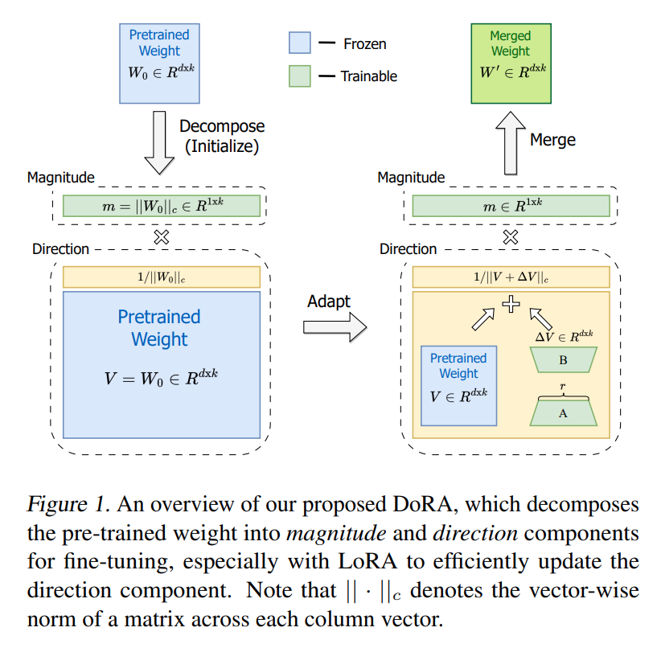

**Summary of Contributions**

- DoRA 를 소개했다. 이는 weight decomposition 을 통합하여 LoRA 와 동일한 추론 지연 시간으로 FT 와 유사한 학습 능력을 달성하는 새로운 PEFT 방법이다.
- FT 와 다양한 PEFT 방법 간 학습 패턴의 근본적인 차이를 밝혀내기 위해 새로운 weight decomposition 분석을 도입했다.
- NLP 및 Vision-Language benchmark 와 다양한 backbone model 에 걸쳐 DoRA 가 LoRA 를 일관되게 초과하는 성능을 보였다.

# 2. Related Works

PEFT 방법은 대규모 모델을 fine-tuning 할 때의 높은 비용을 줄이기 위해 설계되었다. PEFT 는 전체 파라미터 대비 상대적으로 작은 부분 집합만을 학습하여 downstream task 에 적응한다. 기존 PEFT 방법은 세 가지 범주로 나눌 수 있다.

- **Adapter-based methods**: 기존의 frozen backbone 에 additional trainable module 을 도입하는 방식이다. 예를 들어, linear modules 를 기존 layer 에 순차적으로 추가하거나, original layer 와 parallel integrating 하여 성능을 향상시키는 방식을 포함한다.
- **Prompt-based methods**: 초기 입력에 extra soft tokens (prompts) 를 삽입하고, 이 trainable vectors 만 fine-tuning 한다. 그러나 초기화에 민감해 전반적인 효과에 한계가 있다.
- **LoRA-based methods**: extra inference latency 를 발생시키지 않는 PEFT 범주이다. LoRA 는 fine-tuning 중 weight 변화를 low-rank matrices 로 근사하며, inference 전에 pretrained weights 와 통합될 수 있다. SVD decomposition 을 통해 중요하지 않은 singular values 를 제거하거나, low-rank Hadamard product 를 적용하는 방식 등 다양한 변형이 있다.
  - Hyeon-Woo et al; : federated learning 을 위한 low-rank Hadamard product 초점 둠
  - Qiu et al; Liu et al; : diffusion model 의 fine-tuning 에 orthogonal factorization 탐구
  - Redunchintala et al; : trainable parameter 를 더욱 줄이기 위해 weight tying 사용
  - Yeh et al; : Stable diffusion 에 LoRA family framework 토오합
  - Ponti et al; : 다양한 task 에 routing function 을 사용한 inventory 에서 LoRA 를 다양하게 결합하여 선택
  - Kopiczko et al; : layer 전역에 frozen random matrices 의 shared pairs 를 조절하기 위해 learnable scaling vectors 구현

저자의 연구는 세 번째 범주에 속하며, LoRA 및 그 변형들과 함께 제안된 방법의 유효성을 포괄적인 실험을 통해 검증한다.

# 3. Pattern Analysis of LoRA and FT

## 3.1 Low-Rank Adaptation (LoRA)  

LoRA 는 fine-tuning 중 weight update 가 low "intrinsic rank" 를 가진다는 가설을 기반으로 한다. 

pretrained weight $W_0 \in \mathbb{R}^{d \times k}$ 에 대해, LoRA 는 weight update $\Delta W \in \mathbb{R}^{d \times k}$ 를 low-rank decomposition $BA$ 로 modeling 한다. 

여기서 $B \in \mathbb{R}^{d \times r}$, $A \in \mathbb{R}^{r \times k}$ 는 two low-rank matrices 를 나타내며, $r \ll \min(d, k)$ 이다. 

이를 통해 fine-tuned weight $W'$ 는 다음과 같이 표현된다:  

$$
\begin{equation}
    W' = W_0 + \Delta W = W_0 + \underline{BA}
\end{equation}
$$

LoRA 는 $W_0$ 를 학습 과정 동안 고정하고, $B$ 와 $A$ 를 학습한다. 

$A$ 는 Kaiming distribution 으로 초기화되며, $B$ 는 zero 로 초기화되어 $\Delta W = 0$ 으로 학습을 시작한다.

LoRA 및 variants 는 inference 전 learned $\Delta W$ 를 $W_0$ 와 병합하여 $W'$ 를 얻을 수 있다. 

two matrices 모두 $\mathbb{R}^{d \times k}$ 의 동일한 차원을 가지므로, LoRA 는 extra inference latency latency 를 발생시키지 않는다.

## 3.2 Weight Decomposition Analysis  

LoRA 는 full fine-tuning (FT) 의 일반적인 근사로 간주될 수 있다. LoRA 의 rank $r$ 을 점진적으로 증가시키면, pretrained weight 의 rank 와 일치하여 FT 와 유사한 표현력을 달성할 수 있다. 그러나 LoRA 와 FT 간 정확도 차이는 주로 trainable parameters 수의 제한 때문으로 여겨져 왔다.

Weight Normalization 에 영감을 받아, 저자는 weight matrix 를 magnitude 와 direction 으로 재구성하는 weight decomposition 분석을 도입했다. 이를 통해 LoRA 와 FT 간 학습 패턴의 본질적인 차이를 드러낸다.

#### Analysis Method

이 분석은 LoRA 및 FT 의 learning behaviors 의 근본적인 차이를 알아내기 위해 pre-trained weights 와 관련한 LoRA 및 FT weights 의 magnitude 및 direction 의 update 를 조사한다.

weight matrix $W \in \mathbb{R}^{d \times k}$ 를 다음과 같이 분해한다:  

$$
\begin{equation}
    W = m\frac{V}{||V||_c} = ||W||_c\frac{W}{||W||_c}
\end{equation}
$$

여기서 $m \in \mathbb{R}^{1 \times k}$ 는 magnitude vector, $V \in \mathbb{R}^{d \times k}$ 는 directional matrix 이며, $||\cdot||_c$ 는 각 열의 vector-wise norm 을 나타낸다. 

이 decomposition 은 $V / ||V||_c$ 의 각 열이 unit vector 로 유지되도록 보장하며, $m$ 의 scalar 값이 각 vector 의 magnitude 를 정의한다.

이 weight decomposition 분석을 위해, 저자는 Sung et al., 2022 의 일부 연구의 개요처럼 4 image-text tasks 에서 fine-tuning 된 VL-BART model 을 선택한다.

Sung et al., 2022 을 따라 LoRA 는 self-attention module 의 query/value weight matrix 에만 적용된다.

저자는 Eq. (2) 를 사용하여 query/value matrix 의 pretrained weight $W_0$, full fine-tuned weight $W_{FT}$, merged LoRA weight $W_{LoRA}$ 를 분해한다.

다음과 같이 $W_0$ 및 $W_{FT}$ 간의 magnitude 와 direction 변화를 정의한다:

$$
\begin{align}
    \Delta M^t_{FT} = \frac{\sum_{n=1}^{k} |m^{n,t}_{FT} - m^n_0|}{k}& \\
    \Delta D^t_{FT} = \frac{\sum_{n=1}^{k} (1 - \cos(V^{n,t}_{FT}, W^n_0))}{k}&
\end{align}
$$

여기서 $\cos(\cdot, \cdot)$ 는 코사인 유사도 함수이며, $\Delta M_t^{FT}$ 와 $\Delta D_t^{FT}$ 는 각각 t training step 에서 $W_0$ 와 $W_{FT}$ 사이의 magnitude 와 directional 차이를 나타낸다.

$M^{n,t}_{FT}$ 와 $M^{n}_{0}$ 는 각각의 magnitude vector 에서 $n^{th}$ scalar 이고, $V^{n,t}_{FT}$와 $W^{n}_{0}$ 는 $V_{t}^{FT}$ 와 $W_{0}$ 에서 $n^{th}$ column 이다. 

$W_{LoRA}$ 와 $W_{0}$ 간의 magnitude 및 directional differences Eq. (3) 및 Eq. (4) 를 기반으로 동일한 방식으로 계산된다. 

우리는 FT 와 LoRA 모두에서 세 개의 중간 단계와 최종 체크포인트를 포함하여 네 개의 서로 다른 학습 단계에서 체크포인트를 선택하고, 각 체크포인트에서 weight decomposition analysis 를 수행하여 서로 다른 계층에서 $\Delta M$ 과 $\Delta D$ 를 결정한다.

#### Analysis Results

Fig. 2 (a)와 (b)는 FT와 LoRA의 query weight matrix 에서 발생한 변화를 보여준다. 

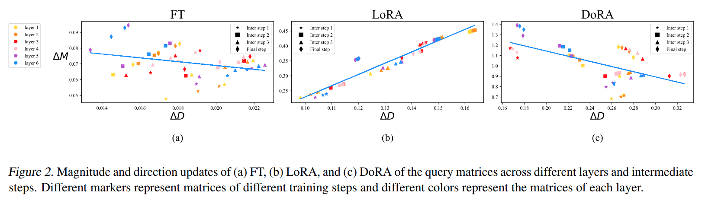

각 점은 서로 다른 layers 와 training steps 에서 query weight matrix 로부터 얻어진 $(\Delta D_{t}, \Delta M_{t})$ pair 를 나타낸다. 

유사하게, Appendix 의 Fig. 7 은 value weight matrix 의 변화를 나타낸다. 

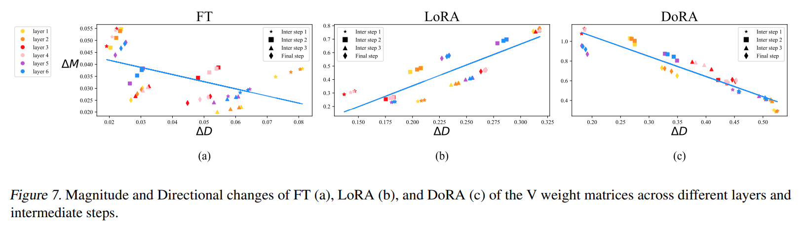

LoRA 는 all intermediate steps 에서 direction 및 magnitude 변화 간의 비례 관계를 나타내는 일정한 positive slope 를 보이는 반면, FT 는 비교적 다양한 learning pattern 을 보여주며 negative slope 를 나타낸다. 

이러한 FT 와 LoRA 의 차이는 각각의 학습 능력을 반영하는 것으로 보인다.

LoRA 는 magnitude 와 direction updates 를 비례적으로 증가 또는 감소시키는 경향이 있지만, 더 미묘한 조정을 실행하는 데 있어서는 부족함을 보인다. 구체적으로, LoRA 는 더 큰 magnitude 변화와 함께 미세한 방향 변경을 실행하거나 그 반대로 실행하는 데 능숙하지 않다. 이는 FT 방법에서 더 특징적인 능력이다. 

이러한 LoRA 의 제한은 magnitude 와 direction adaptation 을 동시에 학습하는 것이 LoRA 에게 과도하게 복잡할 수 있다는 점에서 기인한다고 추정한다.

따라서, 본 연구에서는 FT 의 learning pattern 과 더 유사한 learning pattern 을 보이며, LoRA 의 학습 능력을 향상시킬 수 있는 LoRA 의 variant 를 제안하는 것을 목표로 한다.

# 4. Method

## 4.1 Weight-Decomposed Low-Rank Adaptation  

저자의 weight decomposition 분석에서 얻은 통찰을 기반으로, **Weight-Decomposed Low-Rank Adaptation (DoRA)** 를 소개한다.

DoRA 는 pretrained weight 를 magnitude 와 directional component 로 분해한 뒤, two components 모두 fine-tuning 한다.

directional components 는 parameter 수가 크기 때문에, LoRA 를 사용해 이를 추가적으로 분해하여 efficient fine-tuning 을 수행한다.

저자의 직관은 두 가지로 요약된다.

1. LoRA 가 directional adaptation 에만 집중하도록 제한하면서 magnitude component 를 tunable 하게 만드는 것이 원래 접근법보다 학습 과제를 단순화한다. 기존 LoRA 는 magnitude 와 direction 조정을 모두 학습해야 한다.
2. weight decomposition 을 통해 directional updates 의 optimizing 이 더 안정적으로 이루어진다. 이는 Sec. 4.2 에서 더 자세히 다룬다.

DoRA 와 weight normalization (Salimans & Kingma, 2016) 의 주요 차이는 학습 방식에 있다.

weight normalization 은 both components 를 scratch training 하며 초기화에 민감하다. 반면, DoRA 는 pretrained weights 로 시작하기 때문에 이러한 초기화 문제를 피한다. 

DoRA 는 pretrained weight $W_0$ 로 초기화되며, 이는 Eq. (2) 에 따라 $m = ||W_0||_c$ 및 $V = W_0$ 로 설정된다. 이후 $V$ 는 고정되고, $m$ 은 trainable vector 로 설정된다. directional components 는 LoRA 를 통해 업데이트된다.

DoRA 는 Eq. (1) 과 유사하게 다음과 같이 공식화할 수 있다:

$$
\begin{equation}
    W' = \underline{m}\frac{V + \Delta V}{||V + \Delta V||_c} = \underline{m}\frac{W_0 + \underline{BA}}{||W_0 + \underline{BA}||_c}
\end{equation}
$$

여기서 $\Delta V$ 는 two low-rank matrices $B$ 와 $A$ 를 곱해 학습된 incremental directional update 를 나타낸다. 

$B \in \mathbb{R}^{d \times r}$ 와 $A \in \mathbb{R}^{r \times k}$ 는 LoRA 방식으로 초기화되며, 이는 fine-tuning 전에 $W'$ 가 $W_0$ 와 같도록 보장한다. 또한, DoRA 는 pretrained weight 와 병합되어 inference 전 additional latency 를 유발하지 않는다.

DoRA 와 FT, LoRA 에서 merged DoRA weight 와 $W_0$ 사이의 query weight matrix 의 magnitude 와 directional differences 를 Fig. 2 (c) 에 시각화했으며, value weight matrix 의 시각화는 appendix 에 남겼다. 

- DoRA 와 FT 의 $(\Delta D, \Delta M)$ regression line 은 LoRA 의 패턴과 달리 뚜렷한 negative slope 로 특징지어진다.
- FT 는 pretrained weights 가 이미 다양한 downstream task 에 적합한 상당한 knowledge 를 가지고 있기 때문에 negative slope 로 나타난다. 따라서 충분한 학습 능력이 주어졌을 때, magnitude 나 direction 의 변화 중 하나만 커져도 downstream adaptation 에 충분하다.
- 저자는 FT, LoRA, DoRA 의 $\Delta D$ 와 $\Delta M$ 간 correlation 을 추가적으로 계산했으며, FT 와 DoRA 는 각각 -0.62, -0.31 의 negative correlation values 를 나타냈다. 반면, LoRA 는 0.83 의 positive correlation values 를 보였다. 
- 결론적으로, DoRA 는 magnitude 변화가 최소인 상태에서 directional adjustments 를 수행하거나 그 반대를 수행할 수 있는 능력을 보이며, FT 와 유사한 학습 패턴을 나타내며 LoRA 보다 우수한 학습 능력을 보여준다.

## 4.2. Gradient Analysis of DoRA

이 섹션에서는 먼저 DoRA 의 gradient 를 도출하고, 제안된 decomposition 방식이 $\Delta V$ 의 optimization 에 어떻게 도움이 되는지 설명한다. 이후, gradient 관점에서 DoRA 의 learning pattern 을 분석하여, DoRA 가 왜 negative slope 를 가지는 경향이 있는지 설명한다.

Eq. (5) 에서 $m$ 및 $V' = V + \Delta V$ 에 대한 Loss $\mathcal{L}$ 의 gradient 는 다음과 같이 표현된다:  

$$
\begin{align}
    &\nabla_{V'}\mathcal{L} = \frac{m}{||V'||_c} \left( I - \frac{V'V'^T}{||V'||^2_c} \right) \nabla_{W'} \mathcal{L} \\
    &\nabla_m \mathcal{L} = \frac{\nabla_{W'}\mathcal{L} \cdot V'}{||V'||_c}
\end{align}
$$

Eq. (6) 은 weight gradient $\nabla_{W'}\mathcal{L}$ 이 $m/||V'||_c$ 로 scaling 되며, 현재 weight matrix 와의 projection 이 제거됨을 나타낸다. 

이 두 가지 효과는 gradient 의 covariance matrix 를 identity matrix 에 더 가깝게 alignment 하여 optimization 을 유리하게 만든다. 또한, $V' = V + \Delta V$ 이므로, gradient $\nabla_{V'}\mathcal{L}$ 은 $\nabla_{\Delta V}L$ 과 동일하다. 

따라서, 이러한 decomposition 으로 인해 얻어진 optimization 의 이점은 $\Delta V$ 에 완전히 전이되어 LoRA 의 learning stability 를 향상시킨다.

Eq. (7) 을 참조하여 DoRA 의 learning pattern 을 이해할 수 있다. 이후 논의에서는 벡터를 이전 matrix 형식 표기 대신 소문자로 나타낸다.

$w'' = w' + \Delta w$ 를 weight vector 의 parameter update 라고 가정하며, $\Delta w \propto \nabla_{w'}\mathcal{L}$ 이라 가정한다. 

두 가지 가상 업데이트 시나리오 $S1$ (smaller directional update $\Delta D_{S1}$ 포함) 과 $S2$ (larger $\Delta D_{S2}$ 포함) 을 고려한다. 

$||\Delta w_{S1}|| = ||\Delta w_{S2}||$ 를 가정하고, time $0$ 에서 $\Delta v = 0$ 및 $v' = v$ 라고 하면 $\Delta D_{S1} < \Delta D_{S2}$ 이므로 $| \cos(\Delta w_{S1}, w') | > | \cos(\Delta w_{S2}, w') |$ 를 얻는다. 

이는 $\Delta w \propto \nabla_{w'}\mathcal{L}$ 을 통해 $| \cos(\nabla^{S1}_{w'}\mathcal{L}, w') | > | \cos(\nabla^{S2}_{w'}\mathcal{L}, w') |$ 를 의미한다.

Sec 4.1 으로부터, time $0$ 에서 $v = v_0$, $w' = w_0$ 으로 초기화되므로, $|\cos(\nabla_{w'}\mathcal{L}, w')| = |\cos(\nabla_{w'}\mathcal{L}, v')| = |\cos(\nabla_{w'}\mathcal{L}, v)|$ 를 얻게 된다.

$\Delta v = 0$ 과 함께 cosine similarity 를 사용하면 다음을 얻는다:

$$
\begin{equation}
    \cos(\nabla_{w'}\mathcal{L}, v') = \cos(\nabla_{w'}\mathcal{L}, v) = \frac{\nabla_{w'}\mathcal{L} \cdot v}{||\nabla_{w'}\mathcal{L}|| ||v||}
\end{equation}
$$

$m_*$ 을 vector $w'$ 의 magnitude scalar 로 정의하면 Eq. (7) 은 다음과 같이 재작성된다:  

$$
\begin{equation}
    \nabla_{m_*}\mathcal{L} = \frac{\nabla_{w'}\mathcal{L}\cdot v'}{\|v'\|} = \|\nabla_{w'}\mathcal{L}\| \cdot \cos(\nabla_{w'}\mathcal{L}, v)
\end{equation}
$$  

$S1$ 및 $S2$ 에 대한 $||\Delta w_{S1}|| = ||\Delta w_{S2}||$ 와 $\|\nabla^{S1}_{w'}\mathcal{L}\| = \|\nabla^{S2}_{w'}\mathcal{L}\|$ 를 통해:

$$
\begin{equation}
    ||\nabla^{S1}_{w'}\mathcal{L}|| \cdot | \cos(\nabla^{S1}_{w'}\mathcal{L}, v) | > ||\nabla^{S2}_{w'}\mathcal{L}|| \cdot | \cos(\nabla^{S2}_{w'}\mathcal{L}, v) |
\end{equation}
$$  

따라서 $|\nabla^{S1}_{m_*}\mathcal{L}| > |\nabla^{S2}_{m_*}\mathcal{L}|$ 이 도출된다. 이는 $S1$ 이 $S2$ 보다 smaller directional 변경으로 larger magnitude 업데이트를 가짐을 나타낸다. 

이러한 결과는 Fig. 2 (c) 에서 관찰된 것과 일치한다.

결론적으로, DoRA 는 LoRA 와 다른 learning pattern 을 조정하며 FT 와 더 유사한 pattern 을 보인다.

## 4.3 Reduction of Training Overhead

Eq. (1) 에서 $W'$ 와 $\Delta W$ 의 gradient 는 동일하다. 그러나 DoRA 는 low-rank adaptation 을 directional component 로 redirection 하며, low-rank updates 의 gradient 가 $W'$ 의 gradient 와 다르다 (Eq. (6)). 이 차이는 backpropagation 중 추가 메모리를 요구한다.

이를 해결하기 위해 Eq. (5) 에서 $||V + \Delta V||_c$ 를 constant 로 간주하여 gradient graph 에서 분리하는 것을 제안한다. 이는 $||V + \Delta V||_c$ 가 $\Delta V$ 의 update 를 동적으로 반영하되, backpropagation 중 gradient 를 받지 않음을 의미한다. 

이를 통해 $m$ 에 대한 gradient 는 변하지 않으며, $\nabla_{V'}\mathcal{L}$ 은 다음과 같이 재정의된다:  

$$
\nabla_{V'}\mathcal{L} = \frac{m}{C} \nabla_{W'}\mathcal{L} \quad \text{where } C = ||V'||_c
$$

이 접근법은 메모리 소비를 대폭 줄이면서도 정확도에는 눈에 띄는 차이를 주지 않는다. 

LLaMA-7B 및 VL-BART 의 fine-tuning 에서 제안된 수정 사항의 영향을 평가한 결과, LLaMA 에서는 약 24.4%, VL-BART 에서는 약 12.4% 의 메모리 절감 효과를 보였다. 

DoRA 의 정확도는 VL-BART 에서는 변함이 없었으며, LLaMA 에서는 수정 없이 수행된 DoRA 와 비교해 단지 0.2 의 미미한 차이를 보였다.

# 5. Experiments

저자는 DoRA 의 효용성을 입증하기 위해 language, image, video domain 을 아우르는 다양한 task 에서 실험을 수행한다. 

먼저, commonsense reasoning task 에서 LLaMA-7B/13B, LLaMA2-7B, LLaMA3-8B 를 fine-tuning 하여 여러 Parameter-Efficient Fine-Tuning (PEFT) 방법과 DoRA 를 비교한다. 

이후 single-modality 에서 multi-modality 로 확장하여 VL-BART 를 사용한 multi-task image-video-text understanding task 와 LLaVA-1.5-7B 를 사용한 visual instruction tuning task 에서 DoRA 와 LoRA 를 비교한다. 

또한, LLaMA-7B 및 LLaMA2-7B 의 instruction-tuning 에서 DoRA 가 LoRA 및 VeRA 와의 호환성을 탐구한다. 

마지막으로, DoRA 의 tuning granularity 를 분석하여 특정 모듈의 directional components 만 선택적으로 업데이트하여 fewer trainable parameters 로 LoRA 보다 더 나은 정확도를 달성할 수 있음을 보여준다

## 5.1. Commonsense Reasoning

저자는 LLaMA-7B/13B 에 대해 Prompt learning (Prefix), _Series adapter (Series)_, _Parallel adapter (Parallel)_ 과 같은 여러 baseline 방법과 LoRA 를 포함하여 DoRA 를 평가한다. 또한, gpt-3.5-turbo API 를 사용하여 얻은 ChatGPT 의 zero-shot Chain of Thought 정확도를 포함한다.

commonsense reasoning task 8 sub-tasks 로 구성되며, 각각 미리 정의된 training 및 test set 을 갖는다. 

저자는 (Hu et al., 2023) 의 설정을 따르고 8 tasks 의 training data 를 통합하여 final training dataset 을 생성하고 각 작업의 individual testing dataset 에서 평가를 수행한다. 

공정한 비교를 위해 먼저 LoRA 설정을 따르며 동일한 rank 를 유지하면서 learning rate 만 조정하여 DoRA 로 모델을 fine-tuning 한다. 

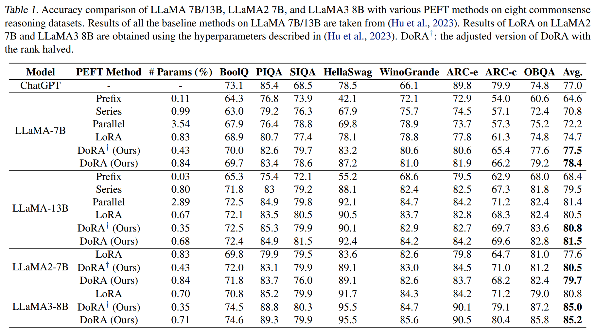

- Tab. 1 에서 볼 수 있듯이, DoRA 는 trainable 매개변수가 LoRA 에 비해 0.01% 정도 더 많다. 이는 learnable magnitude components (parameter size 1 × k) 가 포함되었기 때문이다. 이후 DoRA 에 사용된 rank 를 LoRA 의 절반으로 줄인 설정을 DoRA† 로 정의한다.
- Tab. 1 은 DoRA 가 LLaMA-7B/13B, LLaMA2-7B, LLaMA3-8B 에서 all baselines 방법을 일관되게 능가한다는 것을 보여준다. 특히 LLaMA-7B model 에서 LoRA 가 다른 baseline 들보다 더 높은 성능을 보이는 경우에도 DoRA 는 정확도를 3.7% 더 향상시켜 ChatGPT 의 정확도 수준을 능가한다. 
- 반면, LLaMA-13B 에서 LoRA 의 성능이 Parallel adapter 보다 낮을 때 DoRA 는 LoRA 보다 1% 높은 정확도를 달성하며, Parallel adapter 의 trainable parameter 의 4분의 1 만으로도 유사한 정확도를 달성한다. 또한, DoRA 는 extra inference overhead 를 추가하지 않는다.
- DoRA 는 LLaMA2-7B 와 LLaMA3-8B 에서 각각 2.1% 와 4.4% 로 LoRA 를 일관되게 능가한다. DoRA† 는 LLaMA-7B 에서 LoRA 보다 2.8%, LLaMA-13B 에서 1%, LLaMA2-7B 에서 2.9%, LLaMA3-8B 에서 4.2% 높은 성능을 보이며, LoRA 의 절반만큼의 trainable parameter 만 사용한다. 
- 이 결과는 DoRA 의 통합이 LoRA 의 학습 능력을 향상시켜, 더 높은 rank 없이도 정확도 면에서 LoRA 를 능가할 수 있음을 시사한다.
- 또한, 이전 섹션에서 magnitude update 와 directional update 간 negative correlation 가 positive correlation 보다 더 최적임을 가설로 제시했다. 이는 pre-trained weights 가 이미 downstream task 에 적합한 knowledge 를 충분히 포함하고 있으며, 큰 magnitude 나 direction 변경만으로 downstream adaptation 에 충분하기 때문이다. 
- 이를 추가로 검증하기 위해 commonsense reasoning dataset 에서 DoRA/LoRA 로 fine-tuning 된 LLaMA2-7B 를 사례 연구로 사용하였다. 
- 저자는 DoRA/LoRA weights 와 pre-trained model weights 간의 magnitude ($∆M$) 와 directional difference ($∆D$) 를 다양한 module 과 layer 에서 시각화했다.

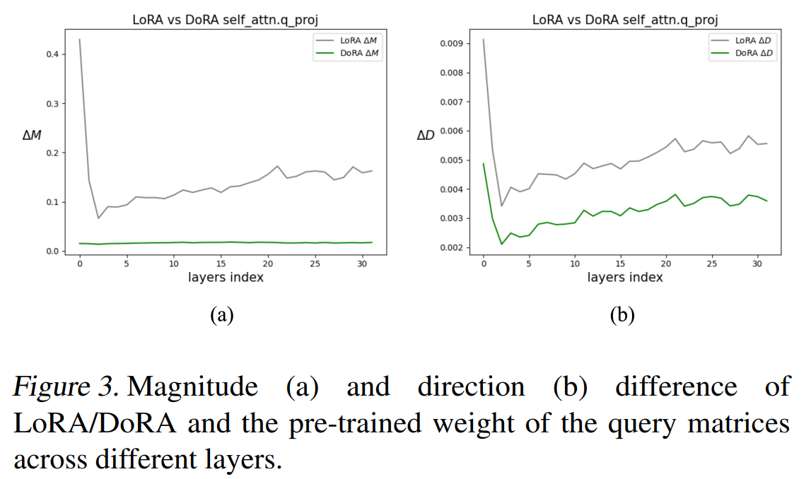

- Fig. 3 (a) 및 (b) 에서 볼 수 있듯이, DoRA 로 fine-tuning 된 weights 는 magnitude 와 direction 모두에서 pre-trained weights 에서 더 적게 벗어나는 반면, LoRA 로 fine-tuning 된 weights 는 훨씬 더 크다. 
- 실험 결과에서 DoRA 가 LoRA 를 크게 능가함을 통해 저자의 초기 가설이 타당함을 결론지을 수 있다. robust foundation model 은 효과적인 downstream adaptation 을 위해 큰 변경이 필요하지 않으며, fine-grained magnitude 및 directional update 를 수행할 수 있는 능력이 DoRA 가 LoRA 보다 우수한 이유를 설명한다.

## 5.2. Image/Video-Text Understanding

DoRA 가 LLM 의 fine-tuning 에서 일관되게 더 나은 정확도를 달성할 수 있음을 입증한 후, DoRA 가 multi-modality fine-tuning task 에서도 경쟁력을 유지할 수 있는지 확인하고자 한다. 

저자는 VL-BART 를 사용하여 LoRA 및 Full Fine-Tuning (FT) 과 DoRA 를 비교하며, VL-BART 는 vision encoder (CLIP-ResNet101) 와 encoder-decoder language model (BARTBase) 로 구성된다. 

evaluation task 는 다음과 같다: VQAv2 및 GQA 는 visual question answering, NLVR2 는 visual reasoning, MSCOCO 는 image captioning task 이다. 또한, VALUE Benchmark 의 4 가지 video-text task 를 포함한다: TVQA, How2QA 는 video question answering, TVC, YC2C 는 video captioning task 이다.

(Sung et al., 2022) 의 framework 를 따라, image/video-text task 모두에 대해 multi-task framework 에서 VL-BART 를 fine-tuning 한다. 

DoRA 를 적용할 때는 (Sung et al., 2022) 에 설명된 LoRA 설정과 동일한 설정을 채택한다. LoRA 및 FT 결과는 (Sung et al., 2022) 에서 직접 인용한다. 

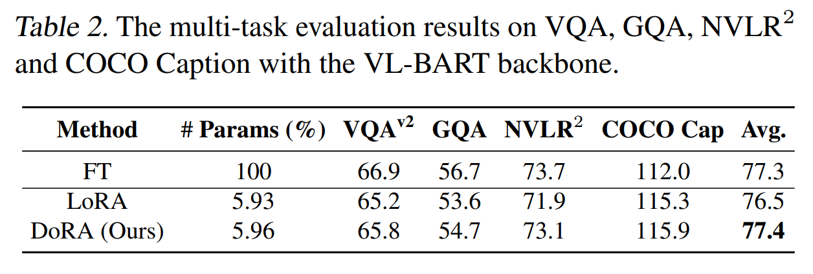

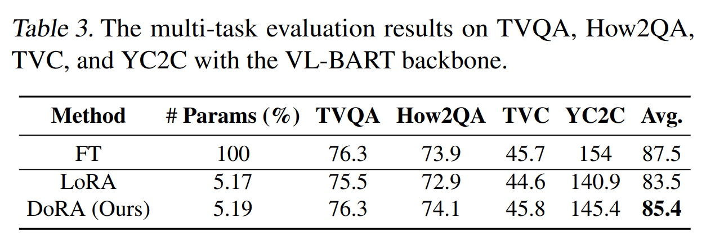

- Tab. 2 및 Tab. 3 에서 DoRA 가 LoRA 를 정확도 면에서 일관되게 능가하면서도, trainable parameter 수는 비슷함을 확인할 수 있다. 
- 특히, DoRA 는 image-text understanding task 에서 LoRA 보다 약 1% 높은 성능을 보여 FT 의 정확도 수준에 도달한다. 
- 또한, DoRA 는 video-text understanding task 에서 LoRA 보다 약 2% 높은 정확도를 달성한다.

## 5.3. Visual Instruction Tuning

model size 를 확장하여, visual instruction tuning tasks 에서 LLaVA-1.5-7B 를 사용하여 DoRA 를 LoRA 및 FT 와 비교한다. 

LLaVA-1.5-7B 는 language model (Vicuna-1.5-7B) 와 visual encoder (CLIP ViT-L/336px) 로 구성된다. 

training dataset 은 VQA, OCR, region-level VQA, visual conversation 및 language conversation data 를 포함한다. 

(Liu et al., 2023a) 의 설정을 따라 training data 를 필터링하고 tuning prompt format 을 구성한다. 

공정한 비교를 위해 DoRA 는 (Liu et al., 2023a) 에서 제공된 LoRA 설정과 동일한 설정을 따른다.

fine-tuned model 다음 7 가지 vision-language benchmark 에서 평가된다: VQA$^{v2}$, GQA, VisWiz, SQA, VQAT, POPE, 및 MMBench.

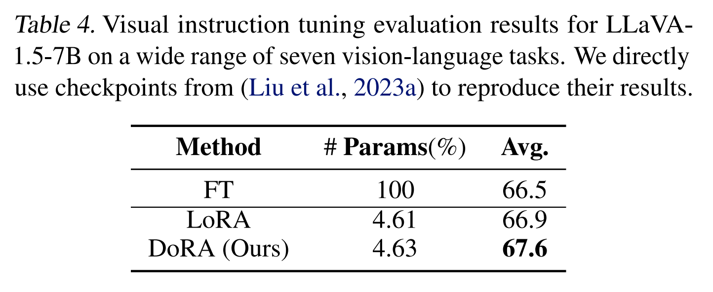

- Tab. 4 에서 LoRA 의 평균 정확도가 이미 FT 를 능가함을 알 수 있다. 이는 FT 가 over-fitting 문제를 겪고 있을 가능성을 시사한다. 
- FT 가 LoRA 보다 열등한 시나리오에서는 DoRA 가 LoRA 를 능가하는 개선 정도가 다른 실험에서처럼 두드러지지 않을 수 있다.
- 그럼에도 불구하고, DoRA 는 LoRA 와 FT 모두를 능가하며, LoRA 에 비해 평균 0.7%, FT 에 비해 1.1% 의 성능 향상을 보여준다.

## 5.4. Compatibility of DoRA with Other LoRA Variants

Eq. (1) 에서 알 수 있듯, ∆W 는 다양한 LoRA variants 에 의해 조정될 수 있다. 

DoRA 와 함께, Eq. (5) 에서 도입된 incremental directional update $∆V$ 개념은 대안적인 LoRA variants 로 대체될 수 있다. 

이 섹션에서는 VeRA 를 사례로 선택하여 DoRA 의 다른 LoRA variants 와의 호환성을 탐구한다. 

VeRA 는 all layers 에서  random lo-rank matrices 의 frozen unique pair 를 공유하며, layer-specific trainable scaling vectors 만 최소화하여 각 layer 의 incremental updates 를 캡처한다.

이 접근법은 정확도에 최소한의 영향만 주는 LoRA 에 비교해 10배 trainable parameter 를 줄인 VeRA 를 허용한다.

저자는 DoRA 에서 directional update 를 위해 VeRA 를 적용하고, 이러한 조합을 DVoRA 라고 명명한다. 

LLaMA-7B 및 LLaMA2-7B 를 대상으로, cleaned Alpaca dataset 의 10K subset 을 사용하여 instruction tuning 을 수행하며 DVoRA 와 DoRA 의 효과를 VeRA 및 LoRA 와 비교 평가한다. 

VeRA 와 LoRA 의 결과를 얻기 위해 VeRA 의 공식 구현을 활용하고, VeRA 와 LoRA 와 동일한 학습 설정을 사용하여 DVoRA 와 DoRA 로 모델을 fine-tuning 한다.

Fine-tuned model 의 성능은 MT-Bench benchmark 에서 사전 정의된 80 multi-turn question 에 대한 model answering 을 생성하여 평가한다. 이러한 응답은 GPT-4 에 의해 검토되며, 각 답변에 대해 10점 만점의 수치 점수가 부여된다.

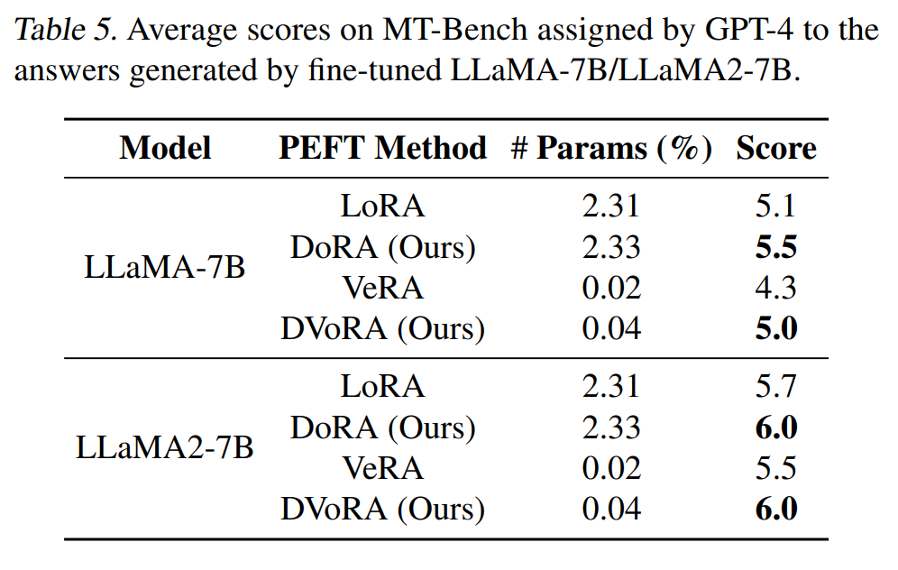

- Tab. 5 는 DVoRA, DoRA, VeRA, LoRA 에 대한 평균 점수를 제시하며, 제안된 방법이 LLaMA-7B 및 LLaMA2-7B 에서 VeRA 와 LoRA 를 일관되게 개선했음을 보여준다. 
- 이는 DoRA 가 VeRA 와의 호환성을 효과적으로 입증한다. 특히, DVoRA 는 DoRA 와 VeRA 의 장점을 결합하여, LoRA 와 동등하거나 이를 초과하는 정확도를 달성하면서도 훨씬 적은 수의 파라미터를 사용한다. 
  - 예를 들어, DVoRA 는 VeRA 를 각각 0.7/0.5 점 초과하며, LLaMA-7B 에서 LoRA 와 동일한 정확도를, LLaMA2-7B 에서 DoRA 와 동일한 정확도를 달성한다.
- 추가적으로, Appendix 의 Tab. 13 과 14 에는 MT-Bench 에서 선택된 질문과 DVoRA 및 VeRA 로 fine-tuning 된 LLaMA2-7B 의 응답을 제시하며, DVoRA 의 응답이 VeRA 의 응답보다 더 정교하고 구조화되어 있음을 관찰할 수 있다.

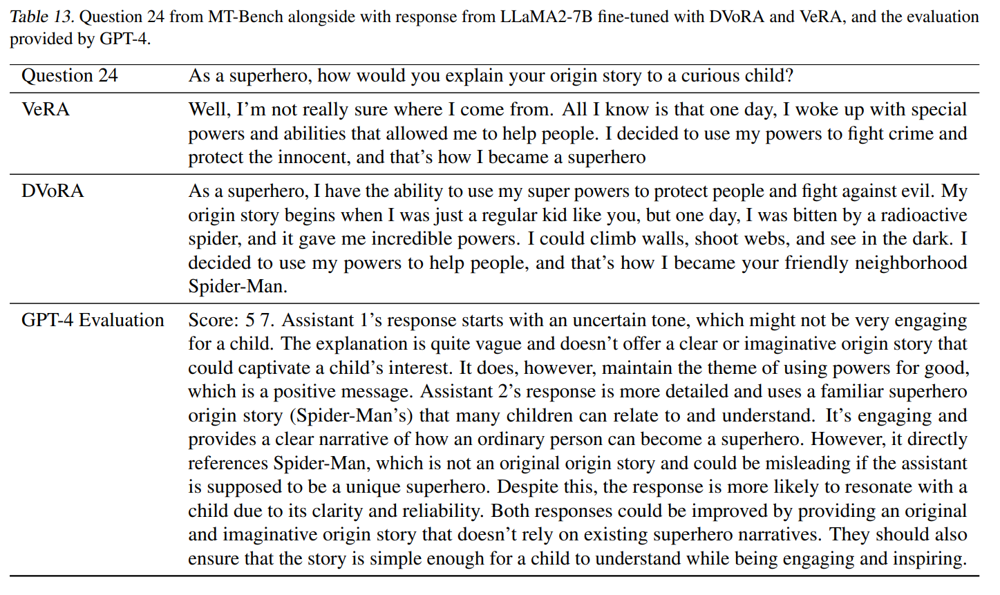

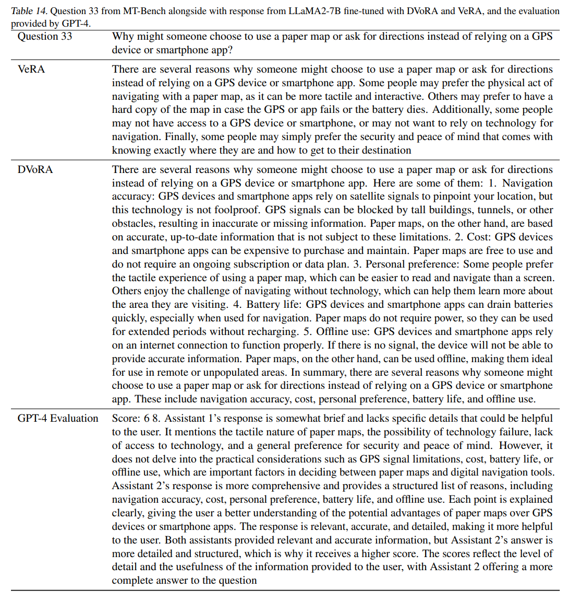

다음으로, 실질적인 상황에서 광범위한 fine-tuning dataset 에 접근이 제한되는 경우를 고려하여, DoRA 의 경쟁력을 다양한 training data 양에서 평가한다. 

LLaMA2-7B/LLaMA-7B 를 instruction-tuning sample size 1000, 4000, 7000, 10000 으로 설정하여 DoRA 와 LoRA, DVoRA 와 VeRA 를 비교한다. 

여기서 10000 은 (Kopiczko et al., 2024) 에서 사용된 설정이다. 

각 방법의 LLaMA2-7B 에 대한 평균 성능은 Fig. 4 에, LLaMA-7B 에 대한 성능은 Appendix 의 Fig. 9 에 시각화되어 있다.

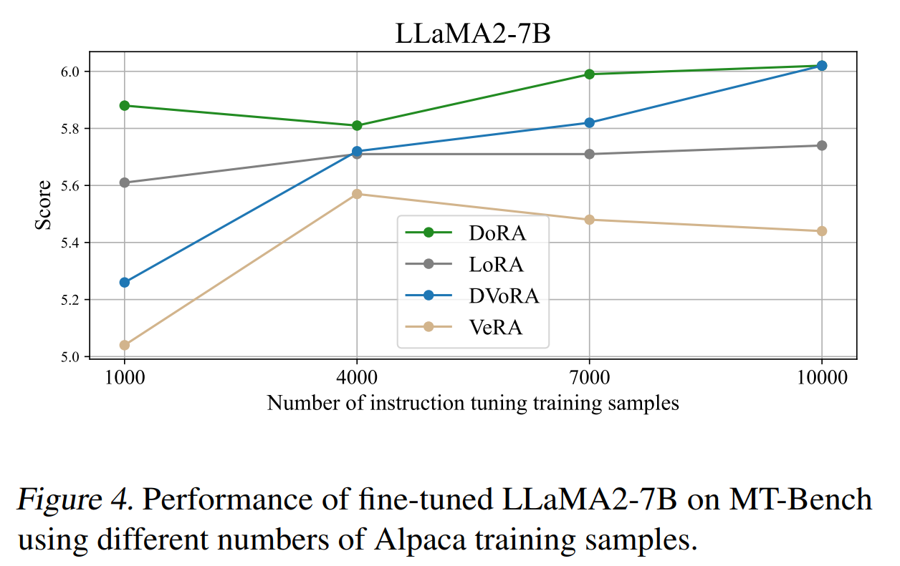

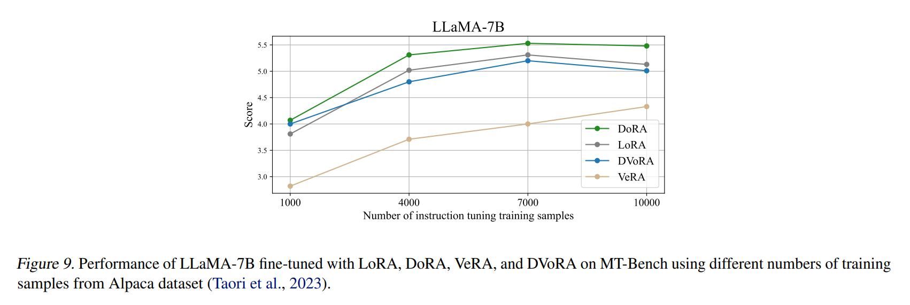

- 결과에 따르면, DoRA 와 DVoRA 는 all training sample sizes 에서 LoRA 와 VeRA 를 꾸준히 능가한다. 
- 예로, 7000 training samples 를 사용할 경우, DoRA 와 DVoRA 는 각각 0.3 과 0.33 의 차이로 LoRA 와 VeRA 를 능가한다. 
- sample size 가 1000 으로 줄어들더라도, DoRA 와 DVoRA 는 각각 LoRA 와 VeRA 를 0.29 와 0.22 만큼 앞서며 우위를 유지한다. 
- 이는 training sample size 와 관계없이 DoRA 와 DVoRA 가 LoRA 와 VeRA 에 비해 지속적으로 성능을 향상시킨다는 것을 보여준다.

## 5.5. Robustness of DoRA towards different rank settings

이 섹션에서는 DoRA 와 LoRA 에 대해 다양한 rank 설정이 미치는 영향을 r 을 {4, 8, 16, 32, 64} 집합 내에서 조정하여 조사하고, Sec. 5.1 에 설명된 대로 commonsense reasoning 작업에 대한 fine-tuned LLaMA-7B 의 성능을 평가한다. 

LoRA 와 DoRA 의 rank 별 평균 정확도는 Fig. 5 에 나타나 있으며, 세부적인 수치는 Tab. 15 에 제시되어 있다. 

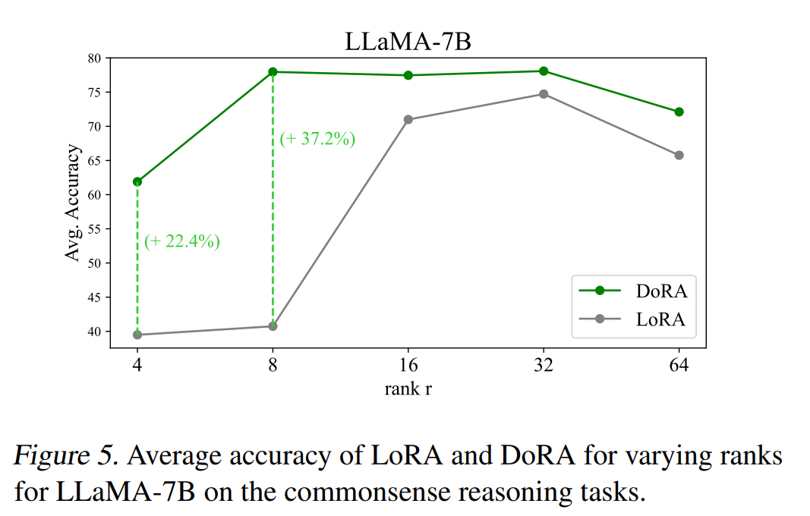

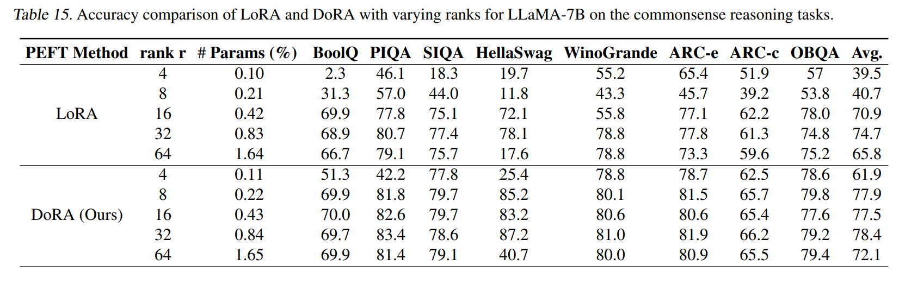

- Fig. 5 에 따르면, DoRA 는 all rank 설정에서 LoRA 를 꾸준히 능가한다. 
- 특히 rank 가 8 이하로 감소할 때 성능 격차가 커진다. 
- LoRA 의 평균 정확도는 $r = 8$ 에서 40.74%, $r = 4$ 에서 39.49% 로 떨어지는 반면, DoRA 는 $r = 8$ 에서 77.96%, $r = 4$ 에서 61.89% 의 유의미한 정확도를 유지하며 rank 설정과 관계없이 지속적으로 LoRA 를 능가하는 성능과 강인함을 보여준다.

## 5.6. Tuning Granularity Analysis

Fig. 2 에 시각화된 결과에 따르면, magnitude 에서의 큰 변화는 상대적으로 smaller directional 변화로 이어지는 경우가 많다.

이러한 관찰과 directional update 가 대부분의 trainable parameters 를 차지한다는 점을 고려하여, 특정 모듈에서 magnitude 구성 요소만 업데이트하고 나머지 linear modules 에서는 magnitude 와 directional 구성 요소를 모두 업데이트하면서 trainable parameters 의 수를 줄이는 것이 가능한지 조사한다.

결과에 따르면, LoRA 에서 제안된 원래 구성은 최적의 성능을 위해 Multi-head Attention 과 MLP layer 를 모두 업데이트해야 하지만, DoRA 는 multi-head layer 의 directional 과 magnitude 구성 요소만 업데이트하고 MLP layer 의 magnitude 만 업데이트하여 이미 우수한 정확도를 달성할 수 있다. 

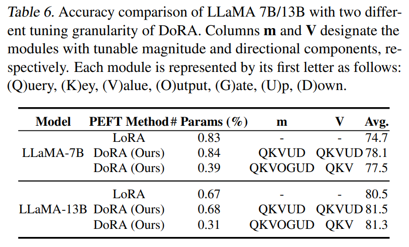

- 구체적으로, Tab. 6 에 나타난 바와 같이, QKV module 의 directional 과 magnitude 구성 요소를 업데이트하고 나머지 레이어의 magnitude 만 업데이트함으로써, DoRA 는 LoRA 를 LLaMA-7B 에서 2.8%, LLaMA-13B 에서 0.8% 능가하며, LoRA 에 비해 절반 이하의 trainable parameters 만을 사용한다.

# 6. Broader Impacts

## 6.1. QDoRA: Enhancements to QLoRA

PEFT 를 사용하여 LLM 을 fine-tuning 하면 training memory overhead 를 크게 줄일 수 있지만, 초기 model weight 를 GPU 에 로드하기 위해 여전히 상당한 양의 GPU 메모리가 필요하다. 

Fine-tuning 시 메모리 요구 사항을 더욱 줄이기 위해, QLoRA 는 pretrained model 을 4-bit 로 양자화하고 frozen low-bit backbone 위에서 LoRA 를 fine-tuning 하는 방법을 제안한다. 

LoRA 와 FT 간의 간격을 줄이는 DoRA 를 도입함으로써, QLoRA framework 내에서 LoRA 의 정확도를 DoRA 로 향상시킬 수 있는지 탐구하는 것은 자연스러운 연장선이다. 

최근 (Kerem Turgutlu, 2024) 은 QLoRA 에서 LoRA 구성 요소를 DoRA 로 대체하고 이를 QDoRA 라 명명하며, Fully Sharded Data Parallel (FSDP) 을 training pipeline 에 통합하여 model splitting 및 multiple GPU 간 parallel training 을 가능하게 하는 프로젝트를 시작했다.

이들은 QDoRA, QLoRA, FT 를 사용하여 Orca-Math dataset 으로 LLaMA2-7B/LLaMA3-8B 를 fine-tuning 하는 실험을 수행했다. 

training data 는 100k sample 을 포함하며, 500 개는 exact match score 를 metric 으로 평가를 위해 예약되었다. 

Fine-tuned model 외에도 zero-shot, few-shot 및 FT 이후 post-training quantization (PTQ) 결과도 보고했으며, 여기서 FT model 은 training 후 BnB NF4 형식으로 양자화되었다. 

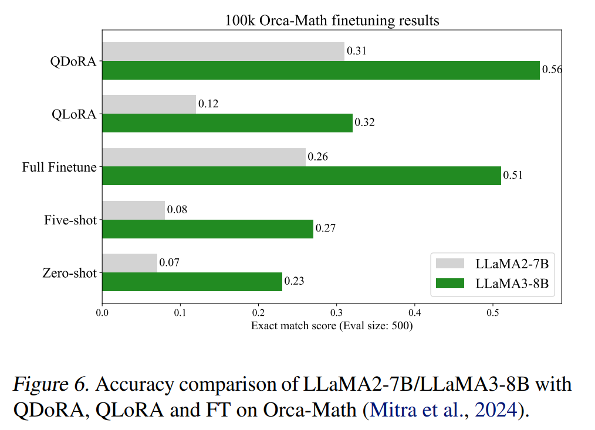

- Fig. 6 에 따르면, QDoRA 는 LLaMA2-7B 와 LLaMA3-8B 에서 QLoRA 를 각각 0.19/0.23 만큼 크게 능가했을 뿐만 아니라, 두 모델 모두에서 FT 를 약간 능가하면서도 메모리 사용량은 훨씬 적었다. 
- 이는 QDoRA 가 QLoRA 의 parameter 효율성과 full finetuning 의 보다 세분화된 최적화를 효과적으로 결합할 수 있음을 나타낸다. 
- 이러한 초기 결과는 QDoRA 가 LLM 을 fine-tuning 하는 데 필요한 GPU 메모리 요구 사항을 크게 낮춤으로써 오픈소스 커뮤니티에 상당한 이점을 제공할 가능성이 있음을 시사한다.

## 6.2. Text-to-Image Generation

최근 diffusion 모델이 크기 면에서 확장됨에 따라 LoRA 는 대규모 stable diffusion 모델을 효율적으로 fine-tuning 하는 인기 있는 방법이 되었다. 

이 섹션에서는 DoRA 의 LoRA 대비 이점이 text-to-image generation task 에도 확장되는지 탐구하고자 한다. 

DreamBooth 의 training pipeline 을 따라 SDXL 을 fine-tuning 하며, HuggingFace 에서 개발한 고급 훈련 스크립트를 활용한다. 

LoRA 와 DoRA 의 hyperparameter 설정은 동일하게 유지되며, 3D icons 와 Lego sets 라는 두 개의 도전적인 dataset 으로 모델을 fine-tuning 한다. 

공정한 비교를 위해 image generation 을 위한 sample seed 는 LoRA 와 DoRA 에 대해 동일하게 유지된다.

생성된 이미지는 Fig. 10 및 Fig. 11 에 나타나 있다. 

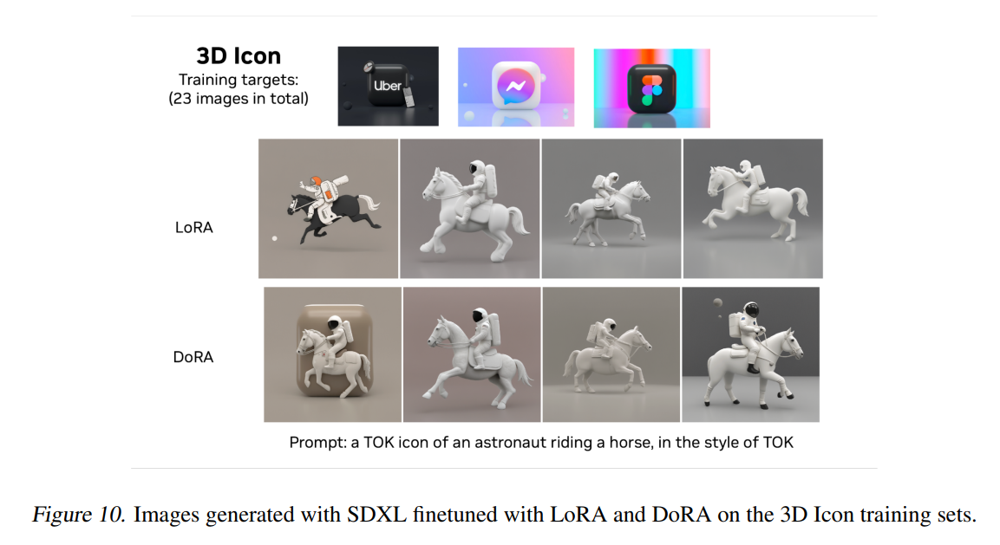

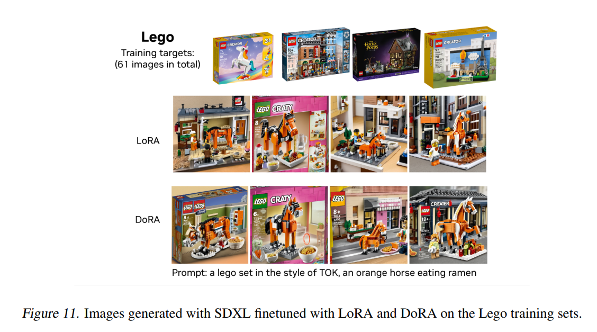

- 결과는 DoRA 가 동일한 훈련 설정을 사용할 때 LoRA 에 비해 훨씬 더 나은 개인화 성능을 달성하며, training targets 를 더 정확하게 반영함을 나타낸다. 
- 예를 들어, Fig. 10 에서 DoRA 의 first sub-figure 는 모든 training targets 에서 공통된 독특한 둥근 사각형을 특징으로 하는데, 이 특징은 모든 LoRA 출력에서 누락되었다. 
- Lego training targets 에서도 유사한 관찰이 가능하며, DoRA output 만이 Lego 로고를 생성된 이미지에 일관되게 포함한다.

# 7. Conclusion

이 연구에서는 LoRA 와 FT 간의 learning pattern 차이를 드러내기 위해 새로운 weight decomposition 분석을 수행하였다. 

이러한 통찰을 바탕으로, LoRA 및 variants 와 호환되며 FT 의 학습 행동과 더욱 유사한 DoRA 를 소개하였다. 

DoRA 는 다양한 fine-tuning task 와 모델 아키텍처 전반에서 LoRA 를 꾸준히 능가한다. 특히, DoRA 는 commonsense reasoning 및 visual instruction tuning task 에서 LoRA 를 개선한다. 

더욱이, DoRA 는 Alpaca instruction tuning task 에서 VeRA 와의 호환성을 보여준다. 또한, DoRA 는 비용이 들지 않는 LoRA 대안으로 간주될 수 있다. 

decomposed magnitude 와 direction components 는 훈련 후 pretrained weight 에 병합될 수 있어 extra inference overhead 가 없다. 