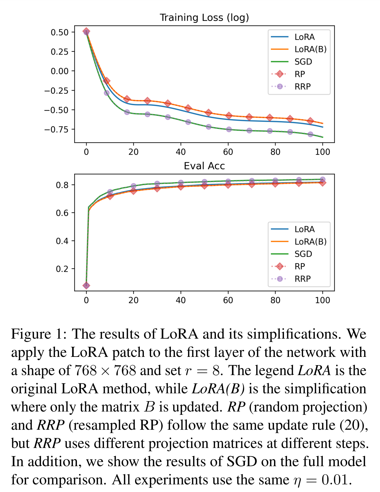
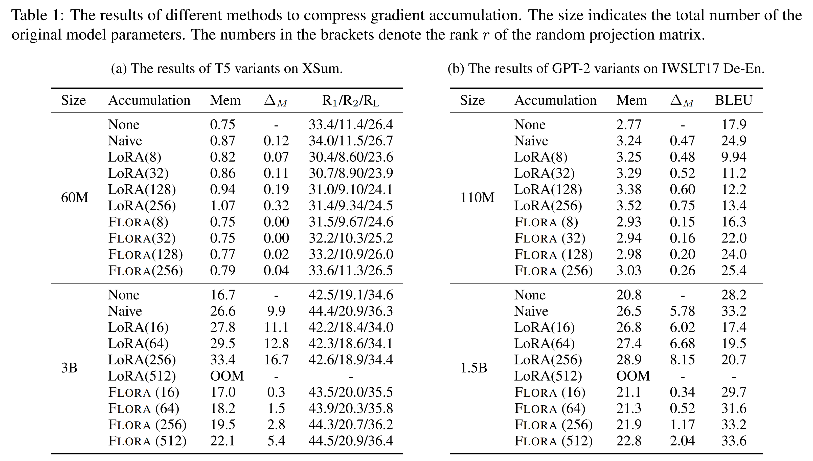

논문 및 이미지 출처 : <https://arxiv.org/pdf/2402.03293>

# Abstract

large neural network가 다양한 tasks를 수행하는 데 있어 놀라운 능력을 보여주지만, 학습을 위해 optimizer states를 저장하는 데 과도한 메모리를 사용한다. 

이를 완화하기 위해, Low-Rank Adaptation (LoRA)은 fewer parameters 를 학습하여 optimizer states를 줄이는 방법을 제안한다. 

하지만 LoRA는 overall weights update matrix 를 low-rank 로 제한하여 모델 성능에 제약을 준다. 

본 연구에서는 LoRA 의 동작 원리를 조사하여, LoRA 가 random projection 으로 근사될 수 있음을 확인했다. 

이러한 관찰에 기반해, 저자는 FLORA를 제안한다. 

이는 projection matrices를 resampling하여 high-rank updates 를 달성하면서도 optimizer states의 sublinear space complexity를 유지한다. 

저자는 다양한 tasks와 model architecture에 걸쳐 실험을 수행하여 FLoRA의 효과를 검증했다.

# 1. Introduction

Gradient-based optimization은 DNN training 을 가능하게 한다. 

가장 단순한 형태로, Stochastic Gradient Descent (SGD)는 model parameters를 noisy 가 포함된 negative gradient estimation 을 사용해 업데이트한다. 

더 고급 방법들은 다양한 gradient statistics 를 추적해 학습을 안정화하고 가속화한다. 

- momentum 기법은 variance reduction 및 damping 을 위해 gradient exponential moving average 를 추적한다. 
- 한편, gradient accumulation 은 최근 few batches 에서 gradient average 를 계산하여 larger effective batches 를 시뮬레이션함으로써 variance 를 줄인다.
- 두 경우 모두 정보 저장을 위해 model size와 동일한 additional memory buffer  필요하다.

그러나 이러한 linear space complexity 은 현대 DNN 에서 문제가 된다. 

- GPT-3 및 Stable Diffusion 은 momentum 이 적용되는 Adam 으로 학습된다. 
- parameter set 의 각 scalar 에 대해 Adam은 two additional variables (i.e., first- 및 second-momentum estimates) 를 유지하는 데, 3x memory usage 가 발생한다. 
- 예로, largest GPT-3 은 175B parameters 를 가지며 700GB 의 메모리가 필요하다. 
- Adam은 optimizer states를 위해 additional 1.4TB memory 가 필요하다. 
- 이러한 과도한 memory usage는 확장성 문제를 제기한다.

일부 연구는 일부 parameters 만 학습하여 메모리를 절약하려고 한다. 

- Low-Rank Adaptation (LoRA)은 parameter matrices 를 low-rank patches 로 업데이트하여 training parameters 수를 줄인다. 
- 이 방식은 momentum과 gradient accumulation의 크기도 크게 줄인다. 
- 하지만, LoRA는 weight update 를 low-rank 형태로 제한하여 model parameters 의 optimization space 을 제한한다.

다른 연구들은 fewer memory 를 사용하는 new optimizer 기법을 설계하고 있다. 

- Adafactor 는 generalized Kullback–Leibler divergence 의 닫힌 형태의 해를 활용하여 Adam 의 second-momentum estimate 를 재구성한다. 
- $\mathbb{R}^{n \times m}$ 에서 matrix optimization 을 위해, Adafactor 는 memory 를 $O(nm)$ 에서 $O(n + m)$ 으로 줄여 model size에 대한 second momentum estimate 의 space complexity를 sublinear로 만든다. 
- 그러나 Adafactor는 sublinear를 달성하기 위해 momentum 기법을 제거하며, 이로 인해 momentum의 variance reduction와 damping 효과가 희생된다(Rae et al., 2021). 
- 또한, gradient accumulation에 필요한 메모리는 줄이지 못한다.

본 연구에서는 sublinear memory로 gradient accumulation과 momentum computation을 수행하는 new optimization 기법인 FLORA를 제안한다. 

- 저자의 직관은 LoRA를 조사하고, LoRA updates 가 random projection에 의해 지배된다는 것을 관찰한 데서 시작한다. 
- FLORA는 이러한 compression 기법을 original weight matrices 의 업데이트에 직접 적용한다. 
- FLORA는 random projection을 resampling하여 LoRA의 low-rank 제한을 완화할 수 있다. 
- 더욱이, FLoRA은 compressed gradient accumulation과 momentum 만을 저장하므로 optimizer states의 memory usage를 sublinear level 로 줄일 수 있다. 
- 다양한 tasks와 model architecture에 걸쳐 실험을 수행한 결과, FLoRA은 Adafactor를 base optimizer로 사용했을 때, uncompressed full-matrix update 와 유사한 성능을 보였으며, LoRA 와 같은 다른 compression 기법보다 훨씬 뛰어난 성능을 나타냈다. 
- 흥미롭게도, FLORA의 space complexity은 LoRA와 같은 차수이지만, 실제로는 smaller constant 를 가져 LoRA보다 fewer memory 를 사용한다.

# 2. Approach

## 2.1. Dynamics of low-rank adaptation (LoRA)

pre-trained weight matrix $W \in \mathbb{R}^{n \times m}$ 를 업데이트하기 위해, LoRA 는 $B \in \mathbb{R}^{n \times r}$ 과 $A \in \mathbb{R}^{r \times m}$ 을 parameterizing 한다. ($r \ll \min\{n, m\}$)

LoRA 를 적용 후, forward pass 는 다음과 같이 된다:

$$
\begin{equation}
    y = (W + BA)x = Wx + BAx,
\end{equation}
$$

- $x \in \mathbb{R}^{m}$ : current layer 의 input
- $y \in \mathbb{R}^{n}$ : next layer 의 pre-activation value
- LoRA updates가 시작될 때, $BA$ 는 original weights $W$ 를 변경하지 않아야 한다. 
- 일반적인 방법은 matrix $B$ 를 all-zero matrix 로 초기화하고, $A$ 를 normal distribution 으로 초기화하는 것이다.

back-propagation 중 matrix $W$ 의 gradient 는 다음과 같이 주어진다:

$$
\begin{equation}
    \nabla_W \mathcal{L} = \frac{\partial L}{\partial y} x^\top,
\end{equation}
$$

- $\frac{\partial \mathcal{L}}{\partial y} \in \mathbb{R}^{n}$ : $y$ 에 대한 partial derivative
- LoRA는 $A$ 와 $B$ matrix 에 대한 gradient 만 계산하며, 이는 다음과 같이 주어진다:

$$
\begin{align}
    &\frac{\partial \mathcal{L}}{\partial A} = B^\top \frac{\partial L}{\partial y} x^\top = B^\top (\nabla_W \mathcal{L}) \\
    \text{and} \qquad &\frac{\partial \mathcal{L}}{\partial B} = \frac{\partial \mathcal{L}}{\partial y} x^\top A^\top = (\nabla_W \mathcal{L}) A^\top.
\end{align}
$$

저자의 관찰한 바에 따르면, Eq. (3) 과 (4) 에서 LoRA 는 본질적으로 original gradient를 lower dimension 으로 down-projects 한다. 

실제로, LoRA는 well-known random projection method 를 복원하는 것으로 나타났다. 

이를 다음 정리로 공식화할 수 있다.

#### Theorem 2.1

LoRA 가 매 step $t$ 에서 SGD 로 업데이트하는 matrix $A$ 와 $B$ 를 다음과 같이 정의하자:

$$
\begin{align}
    &A_{t+1} \leftarrow A_t - \eta B_t^\top (\nabla_W \mathcal{L}_t) \\
    &B_{t+1} \leftarrow B_t - \eta (\nabla_W \mathcal{L}_t) A_t^\top,
\end{align}
$$

- $\eta$ : learning rate
- 저자는 training 중 모델이 Euclidean ball 내에 머무른다는 것을 의미하는 $\sum_{t=0}^T \|\nabla_W \mathcal{L}_t\|_F \leq L$ 을 가정한다. 
- 이 경우, $A_t$ 와 $B_t$ 의 동작은 다음과 같이 주어진다:

$$
\begin{equation}
    A_T = A_0 + \eta A_0 f_A(T), \quad B_T = \eta f_B(T) A_0^\top,
\end{equation}
$$

- $f_A(t) \in \mathbb{R}^{m \times m}$ 및 $f_B(t) \in \mathbb{R}^{n \times m}$ 의 형태는 증명에서 표현된다.
- 특히, $\|f_A(t)\|_2 \leq \frac{\eta L^2 \left(1 - (\eta^2 L^2)^t\right)}{1 - \eta^2 L^2}$ 이 모든 $t$ 에 대해 성립한다.

#### Proof

**Lemma 1**

$f_A(t)$ 와 $f_B(t)$ 의 형태를 먼저 구해야 한다. 이를 다음 lemma 에서 유도된다.

**Lemma A.1**

$t = 0$ 일 때, $f_A(0) = f_B(0) = 0$ 이다. 

$t \geq 1$ 일 때, $f_A(t)$ 와 $f_B(t)$ 는 다음과 같이 반복적으로 구할 수 있다:

$$
\begin{align*}
    &f_A(t) = -\eta \sum_{i=0}^{t-1} f^\top_B(i) (\nabla_W \mathcal{L}_i) \tag{25} \\
    &f_B(t) = -\sum_{i=0}^{t-1} (\nabla_W \mathcal{L}_i) (\eta f^\top_A(i) + I). \tag{26}
\end{align*}
$$

**Proof:**

귀납법으로 증명한다. 

- base case $t = 0$ 일 때, $f_A(0) = f_B(0) = 0$ 임을 쉽게 확인할 수 있다. 
- $A_t = A_0 + \eta A_0 f_A(t)$ 및 $B_t = \eta f_B(t) A_0^\top$ 가 functions $f_A$ 와 $f_B$ 로 1 ... $t$ 까지 성립한다고 가정한다. 
- 그렇다면 $t + 1$ 일 때 다음을 얻는다:

$$
\begin{align*}
    A_{t+1} &= A_t - \eta B_t^\top (\nabla_W \mathcal{L}_t) \tag{27} \\
    &= A_0 + \eta A_0 f_A(t) - \eta^2 A_0 f^\top_B(t) (\nabla_W \mathcal{L}_t) \tag{28} \\
    &= A_0 + \eta A_0 \left( f_A(t) - \eta f^\top_B(t) (\nabla_W \mathcal{L}_t) \right) \tag{29} \\
    &= A_0 + \eta A_0 (f_A(t+1)), \tag{30}
\end{align*}
$$

- $f_A(t+1) = f_A(t) - \eta f^\top_B(t) (\nabla_W \mathcal{L}_t) = -\eta \sum_{i=0}^{t} f^\top_B(i) (\nabla_W \mathcal{L}_i)$ 가 마지막 줄에 성립한다.

마찬가지로,

$$
\begin{align*}
    B_{t+1} &= B_t - \eta (\nabla_W \mathcal{L}_t) A_t^\top \tag{31} \\
    &= \eta f_B(t) A_0^\top - \eta (\nabla_W \mathcal{L}_t) (\eta f^\top_A(t) + I) A_0^\top \tag{32} \\
    &= \eta \left( f_B(t) - (\nabla_W \mathcal{L}_t) (\eta f^\top_A(t) + I) \right) A_0^\top \tag{33} \\
    &= \eta f_B(t+1) A_0^\top, \tag{34}
\end{align*}
$$

- $f_B(t+1) = f_B(t) - (\nabla_W \mathcal{L}_t) (\eta f^\top_A(t) + I) = -\sum_{i=0}^{t} (\nabla_W \mathcal{L}_i) (\eta f_A(i)^\top + I)$ 가 마지막 줄에 성립한다.

**Proof of Theorem 2.1**

$a_t := \frac{\eta L^2 \left( 1 - (\eta^2 L^2)^t \right)}{1 - \eta^2 L^2}$ 로 정의한다.  저자는 귀납법을 통해 $\| f_A(t) \| \leq a_t$ 임을 증명한다. 

- base case $t = 0$ 일 때, $\| f_A(0) \| = 0 \leq a_0$ 임은 자명하다. 
- 이제 $t - 1$ 까지 $\| f_A(i) \| \leq a_i$ 가 성립한다고 가정하자. 
- $a_t$ 는 단조 증가하므로 $i \leq t - 1$ 일 때 $\| f_A(i) \| \leq a_{t-1}$ 임을 알 수 있다. 

Lemma A.1을 사용하여,

$$
\begin{align*}
    f_A(t) &= -\eta \sum_{i=0}^{t-1} f^\top_B(i) (\nabla_W \mathcal{L}_i) \tag{35} \\
    &= -\eta \sum_{i=1}^{t-1} \sum_{j=0}^{i-1} (\eta f_A(j) + I) (\nabla_W \mathcal{L}_j)^\top (\nabla_W \mathcal{L}_i). \tag{36}
\end{align*}
$$

norm 을 취하면 다음을 얻는다:

$$
\begin{align*}
    \|f_A(t)\|_F &= \left\| \eta \sum^{t-1}_{i=1} \sum^{i-1}_{j=0}(\eta f_A(j) + I) (\nabla_W \mathcal{L}_j)^\top (\nabla_W \mathcal{L}_i) \right\|_F \tag{37} \\
    & \leq \eta^2 \left\| \sum^{t-2}_{j=0} (f_A(j)) (\nabla_W \mathcal{L}_j)^\top \sum^{t-1}_{i=j+1} (\nabla_W \mathcal{L}_i) \right\|_F + \eta \left\| \sum^{t-1}_{i=1} \sum^{i-1}_{j=0}(\nabla_W \mathcal{L}_j)^\top (\nabla_W \mathcal{L}_i) \right\|_F \tag{38} \\
    & \leq \eta^2 L \left\| \sum^{t-2}_{j=0} (f_A(j)) (\nabla_W \mathcal{L}_j)^\top \right\|_F + \eta L^2 \tag{Lemma A.2} \\
    & \leq \eta^2 L^2 a_{t-1} + \eta L^2 \tag{Lemma A.3} \\
    & = \eta^2 L^2 \frac{\eta L^2 - (\eta^2L^2)^t}{1 - \eta^2L^2} + \eta L^2 \tag{39} \\
    & = \frac{\eta L^2 - (\eta^2L^2)^{t+1}}{1 - \eta^2L^2} \tag{40} \\
    &=a_t. \tag{41}
\end{align*}
$$

그러므로, 모든 $t$ 에 대해 $\| f_A(t) \| \leq \| f_A (t) \|_F \leq a_t$ 를 얻는다.

**Lemma A.2**

만약 $\| \sum_{k=0}^{t-1} (\nabla_W \mathcal{L}_j)^\top \|_F \leq L$ 이면, 매 $t$ 에 대해 다음이 성립한다:

$$
\left\| \sum_{i=1}^{t-1} \sum_{j=0}^{i-1} (\nabla_W \mathcal{L}_j)^\top (\nabla_W \mathcal{L}_i) \right\|_F \leq L^2 \tag{42}
$$

**Proof:**

간단하게 하기 위해 $G(k) := \nabla_W \mathcal{L}_k$ 로 정의한다. 제곱을 취하면,

$$
\begin{align*}
    &\left\| \sum_n \sum_{m=1}^n G(m)^\top G(n) \right\|^2_F \tag{43} \\
    = &\sum_{i,j} \sum_n \sum_{m=1}^n [G(m)^\top G(n)]_{i,j}^2 \tag{44} \\
    = &\sum_{i,j} \sum_n \sum_{m=1}^n \left( \sum_k [G(m)]_{k,i} [G(n)]_{k,j} \right)^2 \tag{45} \\
    \leq &\left( \sum_m \sum_i \sum_k [G(m)]_{k,i}^2 \right) \left( \sum_{m=n}^{t-1} \sum_j \sum_k [G(n)]_{k,j}^2 \right) \tag{Cauchy-Schwarz} \\
    \leq &\left( \sum_m \sum_i \sum_k [G(m)]_{k,i}^2 \right)^2 \tag{46} \\
    = &\left( \sum_i \sum_k \left( \sum_m [G(m)]_{k,i} \right)^2 \right)^2 \tag{47} \\
    \leq &\left\| \sum_m G(m) \right\|^4_F \tag{48} \\
    \leq &L^4, \tag{49}
\end{align*}
$$

따라서, 양변에 제곱근을 취하면 증명이 완료된다.

**Lemma A.3**

만약 $\| f_A(k) \|_F \leq a_k$ 가 all $k < t$ 에 대해 성립하면, 매 $t$ 에 대해 다음이 성립한다:

$$ \left\| \sum_{k=0}^{t-1} f_A(k) (\nabla_W \mathcal{L}_k)^\top \right\|_F \leq a_{t-1} L \tag{50} $$

**Proof:**

간단하게 하기 위해 $A(k) := f_A(k)$ 및 $G(k) := \nabla_W \mathcal{L}_k$ 로 정의한다. 제곱을 취하면,

$$
\begin{align*}
    &\left\| \sum_{k=0}^{t-1} A(k) G(k)^\top \right\|^2_F \tag{51} \\
    = &\sum_{k=0}^{t-1} \sum_i \sum_j [A(k) G(k)^\top]_{i,j}^2 \tag{52} \\
    = &\sum_{k=0}^{t-1} \sum_i \sum_j \left( \sum_l [A(k)]_{i,l} [G(k)]_{j,l} \right)^2 \tag{53} \\
    = &\sum^{t-1}_{k=0} \left( \sum_i \sum_l [A(k)]_{i,l}^2 \right) \left( \sum_j \sum_l [G(k)]_{j,l}^2\right) \tag{Cauchy-Schwarz} \\
    \leq &\left( \max_{0 \leq k < t} \sum_i \sum_l [A(k)]_{i,l}^2 \right) \sum_{k=0}^{t-1} \left( \sum_j \sum_l [G(k)]_{j,l}^2 \right) \tag{54} \\
    \leq &\left( \max_{0 \leq k < t} \sum_i \sum_l [A(k)_{i,l}]^2 \right) \left( \sum_j \sum_l ( \sum_{k=0}^{t-1} [G(k)]_{j,l} )^2 \right) \tag{55} \\
    = &\left( \max_{0 \leq k < t} \| A(k) \|^2_F \right) \left\| \sum_{k=0}^{t-1} G(k) \right\|^2_F \tag{56} \\
    \leq &a_{t-1}^2 L^2, \tag{57}
\end{align*}
$$

따라서, 양변에 제곱근을 취하면 증명이 완료된다.

---

Theore 2.1 은 LoRA updates 의 SGD 동작을 설명한다. 

일반성을 잃지 않고, $T$ step 후 $A$ 와 $B$ 의 total change 를 각각 $\Delta A$ 와 $\Delta B$ 로 나타낸다. 

그러면 fine-tuned forward function 은 다음과 같이 표현된다:

$$
\begin{align}
    &W + (B_0 + \Delta B)(A_0 + \Delta A) \\
    = &W + B_0 A_0 + B_0 \Delta A + \Delta B A_0 + \Delta B \Delta A \\
    = &W + \Delta B A_0 + \Delta B \Delta A,
\end{align}
$$

- $B_0 = 0$ 은 matrix $B$ 의 초기화 때문이다. 
- 최종 표현은 LoRA weights 를 two parts 로 분리한다. 
- 여기서 first part 가 overall weights change 에서 중요한 역할을 한다는 것을 알 수 있다.

#### Observation 2.2

learning rate 가 작을 때, 다음과 같이 근사할 수 있다:

$$
\begin{equation}
    W + (B_0 + \Delta B)(A_0 + \Delta A) \approx W + \Delta B A_0.
\end{equation}
$$

- 이는 Theore 2.1 에서 주어진 $B_0$ 와 $A_0$ 를 확장함으로써 볼 수 있다. 
- 구체적으로, 다음과 같은 식을 얻는다:

$$
\begin{align}
    &W + \Delta B A_0 + \Delta B \Delta A \\
    = &W + \eta f_B(t) A_0^\top A_0 + \eta^2 f_B(t) A_0^\top A_0 f_A(t).
\end{align}
$$

- 저자의 통찰은 learning rate 가 크지 않을 때, third term 의 크기가 작아진다는 것이다. 
- 이는 Theore 2.1 에 의해 $\|f_A(t)\|_2 \leq \|f_A(t)\|_F \leq \frac{\eta L^2 \left(1 - (\eta^2 L^2)^t\right)}{1 - \eta^2 L^2}$ 이므로, $\eta \ll 1/L$ 일 때 $\lim_{t \to \infty} \eta \|f_A(t)\| \ll 1$ 이 되어, final update 에서 third term 은 second term 보다 훨씬 작아져 무시할 수 있게 된다.

## 2.2. Random projection of gradients

Observation 2.2 에 따르면, matrix $B$ 의 변화가 final weight changes 에서 지배적인 역할을 한다. 

이를 단순화하는 한 가지 방법은 matrix $A$ 를 고정하고 matrix $B$ 만 조정하는 것(이를 $\Delta \tilde{B}$ 로 표기)이다. 

이 경우 다음과 같이 된다:

$$
\begin{align}
    &W + (B_0 + \Delta B)(A_0 + \Delta A) \\
    \approx &W + \Delta B A_0 \\
    =: &W + \eta \tilde{f_B}(T) A_0^\top A_0.
\end{align}
$$

- Eq. (15) 에선 $B_0$ 가 all-zero matrix 로 초기화되었기 때문에 제거된다. 
- Eq. (16) 은 $\tilde{f_B}(T)$ 를 정의하며, 이는 Theorem 2.1 의 유도에 따 다음과 같은 업데이트 형태를 가진다:

$$
\begin{equation}
    \tilde{f_B}(t + 1) := \tilde{f_B}(t) - \nabla_W \mathcal{L}_t.
\end{equation}
$$

- 따라서, $\tilde{f_B}(t) = - \sum_i \nabla_W \mathcal{L}_i$ 가 된다. 
- 이를 Eq. (16) 에 대입하면 다음과 같이 된다:

$$
\begin{align}
    &W + \eta \tilde{f_B}(T) A_0^\top A_0 \\
    = &W - \eta \left( \sum_{t=0}^T \nabla_W \mathcal{L}_t \right) A_0^\top A_0 \\
    = &W - \eta \sum_{t=0}^T \left[ (\nabla_W \mathcal{L}_t) A_0^\top A_0 \right].
\end{align}
$$

- 즉, 저자의 유도에 따르면, **일부 근사를 통해 LoRA updates 는 gradient 에 대한 random projection 을 수행하는 것으로 볼 수 있다.** 
- 특히, 이는 random down-projects $A_0^\top$ 에 의해 gradient 를 압축한 후, up-projection $A_0$ 을 통해 이를 복원하는 방식으로 gradient  압축한다.

## 2.3. Our interpretation of LoRA

이제 저자는 LoRA updates를 gradients 의 compression 과 decompression 으로 해석하는 새로운 관점을 제시한다.

#### Compression.

LoRA는 먼저 random down-projects 을 통해 gradient 를 압축하는데, 이는 Johnson-Lindenstrauss lemma 에 기반한 다음 결과로 정당화될 수 있다.

#### Lemma 2.3 (Indyk & Motwani)

- $ϵ \in (0, 1/2]$ 및 $\delta \in (0, 1)$ 로 정의하자. 
- $A \in \mathbb{R}^{r \times m}$ 는 각 요소가 standard Gaussian distribution에서 independently sampled random matrix 이라 하자. 
- $r = cϵ^{-2} \log(\delta/2)$ 일 때, 모든 $x \in \mathbb{R}^{m}$ 에 대해 최소 $1 - \delta$ 이상의 probability 로 다음이 성립하는 constant $c$ 가 존재한다:

$$
\begin{equation}
    (1 - ϵ) \|x\| \leq (1/\sqrt{r}) \|Ax\| \leq (1 + ϵ) \|x\|.
\end{equation}
$$

- 이 lemma 는 random Gaussian matrix 에 의한 projection 이 original space 의 scaled norm 을 크게 보존한다는 것을 high probability 로 보여준다.
- LoRA의 경우, 이러한 random projection 이 gradient matrices 의 각 row 에 적용되며, 이로 인해 dimension 이 $\mathbb{R}^{n \times m}$ 에서 $\mathbb{R}^{r \times m}$ 로 축소된다. 
- 이 lemma 는 rows 의 norm structure 가 대략적으로 보존된다고 주장한다.

#### Decompression.

$A_0^\top$ 에 의한 down-projects 후, LoRA는 up-projection $A_0$ 을 통해 gradient를 복원한다. 

이는 기대값에서 original gradient를 복원한다는 것을 다음과 같이 보일 수 있다:

$$
\begin{align}
    &\mathbb{E}_{A_0} \left[ W + (\nabla_W \mathcal{L}_t) A_0^\top A_0 \right] \\
    = &W + (\nabla_W \mathcal{L}_t) \underset{{A_0}}{\mathbb{E}} \left[ A_0^\top A_0 \right]
\end{align}
$$

- $(1/r) \mathbb{E}_{A_0} [A_0^\top A_0]$ 는 identity matrix이 된다. 
- 더 나아가, rank $r$ 이 커질수록 기대값이 identity matrix 에 가까워진다. 

저자는 다음 theorem 에서 오차를 정량화한다.

#### Theorem 2.4

각 요소가 standard Gaussian distribution에서 independently sampled $R^{r \times m}$ 형태의 matrix $A$ 가 있다고 하자. 

- $ϵ, \delta \in (0, 1]$ 이라고 하자.
- $r = c \log(2m/\delta)ϵ^{-2}$ 일 때, all $i, j$ 에 대해 다음이 성립하는 constant $c$ 가 존재하며, 이때 confidence 는 최소 $1 - \delta$ 이상이다:

$$
\begin{equation}
    \left|[A^\top A - I]_{i,j}\right| \leq ϵ.
\end{equation}
$$

#### Proof

각 $A^\top A$ 의 원소에 대해, 다음을 얻을 수 있다:

$$
[A^\top A]_{i,j} = \begin{cases} 
\sum_{k=1}^r a_{k,i}^2 & \text{if} \ i = j, \\
\sum_{k=1}^r a_{k,i} a_{k,j} & \text{otherwise},
\end{cases} \tag{58}
$$

- 여기서 각 $a_{i,k}$ 는 $N(0,1)$ 을 따르는 independent random variable 이다.
- $z_{i,i} := \sum_{k=1}^r a_{k,i}^2$ 는 $\chi^2(r)$ distribution 을 따르게 된다. 
- Laurent-Massart bounds 에 따르면, 다음을 얻을 수 있다:

$$
\delta_{i,i} := \left| \frac{z_{i,i}}{r} - 1 \right| \leq 2 \sqrt{\frac{\log(2/\delta'_1)}{r}} + \frac{2 \log(2/\delta'_1)}{r} \tag{59}
$$

- 이는 최소 $1 - \delta'_1$ 의 확률로 성립한다.
- $i \neq j$ 일 때, $z_{i,j} := \sum_{k=1}^r a_{k,i} a_{k,j}$ 를 $z_{i,j} = \sum_{k=1}^r \left[( \frac{a_{k,i} + a_{k,j}}{2})^2 - ( \frac{a_{k,i} - a_{k,j}}{2} )^2\right]$ 로 재작성할 수 있다. 
- 추가적으로, $(\frac{a_{k,i} + a_{k,j}}{2})^2$ 와 $( \frac{a_{k,i} - a_{k,j}}{2} )^2$ 는 모두 i.i.d. $\chi^2(1)$ distribution 을 따른다.

다음을 정의한다:

$$ z^+_{i,j} := \sum_{k=1}^r \left( \frac{a_{k,i} + a_{k,j}}{2} \right)^2, \quad z^-_{i,j} := \sum_{k=1}^r \left( \frac{a_{k,i} - a_{k,j}}{2} \right)^2, \tag{60} $$

- $z^+_{i,j}$ 와 $z^-_{i,j}$ 는 i.i.d. $\chi^2(r)$ distribution 을 따르게 된다. 
- 그리고 $z_{i,j} = z^+_{i,j} - z^-_{i,j}$가 성립한다. 따라서, 다음을 얻을 수 있다:

$$
\begin{align*}
    \delta_{i,j} &:= \left| \frac{z_{i,j}}{r} \right| = \left| \left( \frac{z^+_{i,j}}{r} - 1 \right) - \left( \frac{z^-_{i,j}}{r} - 1 \right) \right| \tag{61} \\
    &\leq \left| \frac{z^+_{i,j}}{r} - 1 \right| + \left| \frac{z^-_{i,j}}{r} - 1 \right| \tag{62} \\
    &\leq 4 \sqrt{\frac{\log(4/\delta'_2)}{r}} + 4\frac{\log(4/\delta'_2)}{r} \tag{63}
\end{align*}
$$

- 이는 적어도 $1 - \delta'_2$ 의 확률로 성립한다.
- Eq. (59) 와 (63) 에 대해 union bound를 적용하면, all $i, j$에 대해 다음을 얻을 수 있다:

$$ \delta_{i,j} \leq 4 \sqrt{\frac{2 \log(2m/\delta)}{r}} + 4\frac{\log(2m/\delta)}{r} \tag{64} $$

- 이것은 최소 $1 - \delta$ 의 확률로 성립한다. 
- 이 조건 하에서, 더 나아가 다음을 얻을 수 있다:

$$
\begin{align*}
    \delta_{i,j} &= 4 \sqrt{\frac{2 \log(2m/\delta)}{128 \log(2m/\delta) \epsilon^{-2}}} + 4\frac{\log(2m/\delta)}{128 \log(2m/\delta) \epsilon^{-2}} \qquad (\text{Let} \ r = 128 \log(2m/\delta) \epsilon^{-2}) \\
    &= \frac{1}{2} (\epsilon + \epsilon^2) \tag{65} \\
    &\leq \epsilon, \quad (\epsilon^2 \leq \epsilon \leq 1)
\end{align*}
$$

이를 통해 $\delta_{i,j} = | [A^\top A - I]_{i,j} |$ 임을 알 수 있으며, 증명이 완료된다.

---

Theore 2.4 는 element-wise reconstruction error 를 보존하기 위해 $r$ 이 로그 스케일로만 증가하면 된다는 것을 의미하며, 이는 computation 및 memory 측면에서 효율적이다. 

또한, 로그 비율의 점근적 특성은 $m$ 이 large neural network 의 학습에 이상적인 후보가 된다.

저자는 Fashion-MNIST dataset 과 단순한 feed-forward network 를 사용한 pilots study 를 통해 LoRA 에 대한 저자의 해석을 실험적으로 검증하였다. 

저자는 $B$ 만 조정하는 LoRA 의 변형을 실험하였으며, 이를 LoRA(B) 라고 부른다. 

- Fig. 1 처럼, LoRA(B)의 성능은 original LoRA와 유사하며, 이는 Observation 2.2 와 일치하며 LoRA의 전체 업데이트가 compression 및 decompression 단계에 의해 지배된다는 것을 시사한다. 
- 또한, curves 는 random projection (RP)과 동일하며, 이는 Sec. 2.2 에서의 저자의 유도와 잘 일치한다.

## 2.4. Our method: FLORA

저자는 high-rank updates를 가능하게 하는 FLORA(**f**rom **L**oRA t**o** high-**r**ank upd**a**tes)를 제안한다. 

FLORA의 주요 인사이트 중 하나는 Eq. (20) 에서 사용된 projection matrices를 지속적으로 resampling한다는 점이다. 

따라서, weights 의 total changes 가 더 이상 low-rank 로 제한되지 않게 된다. 

또한, 저자는 메모리를 절약하기 위해 optimizer states에 random projection을 적용할 수 있다. 

FLORA가 적용될 수 있는 두 가지 일반적인 시나리오를 제시한다: (1) 과거 기록에 대한 arithmetic mean (AM), 그 구체적인 예로는 gradient accumulatiopn; (2) exponential moving average (EMA), 예로 momentum computation 이 이에 해당한다. 

저자는 FLORA의 compression 이 LoRA와 동일한 점근적 비율을 가지지만, lower constant 를 보여준다.

#### Resampling random projection matrices.

Observation 2.2 의 근사와 함께, LoRA는 fixed random projection matrices $A_0$ 를 가진 것으로 볼 수 있다. 

- 이는 $W$ 의 total changes 를 low-rank로 제한한다. 
- 하지만, Sec. 2.3 의 분석은 매 time step 에서 any random matrix 에도 적용된다.
- 따라서, FLORA 에선 total changes 를 low-rank subspace 로 제한하지 않기 위해 new random matrix 를 resampling 할 것을 제안한다. 
- 저자의 pilot study 에서, random matrix resampling(RRP) 하면 full-matrix SGD 의 성능을 거의 회복하며, original LoRA 와 Eq. (20) 에서 근사된 버전 모두를 크게 능가하는 성과를 보였다. 
- 실험 결과는 FLORA 에서 low-rank constraint 를 회피하는 것이 효과적임을 강조한다.
- 여기서 중요한 점은 LoRA에서 down projection matrices $A$ 를 resampling 할 수 없다는 것이다. 
- 이는 업데이트 동안 $A$ 와 $B$ 가 결합되기 때문에, 만약 $A$ 를 resampling 하면 이미 업데이트된 matrix $B$ 가 맞지 않게 된다. 
- 반면, FLORA 는 training 중 weight matrix $W$ 를 직접 업데이트하므로 매 time step 에서 random down-projects 을 선택하는 것이 유연하다.

#### Sublinear memory gradient accumulation.

FLORA 의 한 가지 응용은 training 중 메모리를 절약하기 위해 optimizer states 를 압축하는 것이다. 

저자는 먼저 gradient accumulation 의 예로 이를 보여준다. 

- gradient accumulation은 larger batch size를 시뮬레이션하기 위해 널리 사용된다. 
- 구체적으로, 이는 $τ$ step 동안의 gradient 의 arithmetic mean (AM) 을 계산하고 AM 으로 모델을 업데이트한다. 
- 이 방법으로, effective batch size 는 original batch size 의 $τ$ 배가 된다. 
- 그러나, accumulated gradients 를 저장하기 위해 model size 와 동일한 memory buffer 가 필요하다.

FLORA에서는 down-projects 을 통해 gradient accumulation 을 압축할 것을 제안한다. 

- accumulation sycle 내에서, 저자는 randomly down-projected space 에 accumulated gradient 만 유지한다. 
- decompression 시엔 gradient 를 위한 메모리를 재사용하여 additional overheads 를 줄일 수 있다. 
- projection matrices 의 resampling 은 accumulation cycle 이 끝날 때 발생한다. 

전체 알고리즘은 Algorithm 1 에 요약되어 있다.

#### Sublinear memory momentum.

momentum 기법은 gradient의 variance 를 줄이고 training 가속화하기 위해 현대 DNN 에 널리 사용된다. 그러나, 이는 각 parameters에 additional momentum scalar 를 유지해야 하므로, 모델이 클 경우 비용이 많이 든다. 

- FLORA에서의 compressed gradient accumulation 과 유사하게, 저자는 momentum 도 FLORA 로 압축할 수 있다. 
- 각 time step $t$ 에서, 저자는 random projection matrices $A_t^\top$ 에 의해 new gradient $G_t$ 를 down-projects 한다. 그러나, $A_t$ 가 $A_{t-1}$ 과 다를 때 momentum 을 축적하는 데 어려움이 생기는데, 이는 $G_{t-1}A_{t-1}^\top + G_tA_t^\top$ 에서 original momentum 을 복원할 수 없기 때문이다. 
  - 이 어려움은 accumulation steps 수가 유한하지 않은 all EMA 업데이트에 적용된다. 
  - 이 경우, new matrices 를 resampling하면 historical accumulation 이 손실된다.

저자는 이를 해결하기 위해 두 가지 해결책을 제안한다. 

1. distortion 을 줄이기 위해 same projection matrices 를 오랜 기간 유지한다. 
2. $M_t = M_{t-1}A_{t-1}A_t^\top$ 에 의해 old projection 에서 new projection 의 compressed momentum 을 전송할 것을 제안한다. 
   - 이는 Theore 2.4 에 기초하여 $A_{t-1}^\top A_{t-1}$ 과 $A_t^\top A_t$ 가 대략 identity matrix 임을 근거로 한다. 
   - 최종 알고리즘은 Algorithm 2 에 나와 있다. 

전체적으로, 각 weight matrix $W \in \mathbb{R}^{n \times m}$ 에 대해, 저자는 sublinear memory로 momentum term $M_t$ 를 보존한다. 

original momentum 과 비교했을 때, 저자는 메모리를 $O(nm)$ 에서 $O(nr)$ 로 줄인다. 

이 경우에 저자는 구체적으로 momentum 을 추적하지만, 저자의 알고리즘은 other EMA-based statistics 로 쉽게 확장될 수 있다.

#### Memory analysis.

- LoRA와 FLORA 모두 back-propagation 에 대한 메모리를 절약하지는 못한다는 점에 주목해야 한다. 
    - 이는 LoRA에서 $A$ 와 $B$ 의 업데이트를 위해 $\frac{\partial \mathcal{L}}{\partial W}$ 이 필요하기 때문이며, FLORA 에서도 gradient 를 compression 및 decompression 하기 때문이다. 
  - 그럼에도 불구하고, optimizer states 의 메모리만 절약해도 large model training 에 있어 매우 중요할 수 있다. 
- 저자의 FLORA 는 gradient의 AM 과 EMA 를 sublinear level 로 압축하며, 이는 LoRA와 동일한 점근적 비율을 공유한다. 
- 구현에서는 projection matrices를 유지하는 대신, 이를 생성하는 random seeds 를 저장할 수 있는데, 이는 각 요소가 간단한 연산으로 indenpendently sampling 될 수 있기 때문에 매우 효율적이다. 
  - 이는 buffer resuse 로 실제로 메모리를 더욱 절약할 수 있게 해준다. 반면, LoRA는 $A$ 와 $B$ two weight matrices 뿐 아니라 이들의 AM 이나 EMA matrices 도 유지해야 한다. 

Sec. 3 에서 실험적으로 보여주듯, FLORA 는 LoRA 보다 less memory 를 소비하면서도 high-rank updates를 촉진하며 LoRA를 크게 능가하는 성능을 발휘한다.

# 3. Experiments

## 3.1. Experiment setup

#### Models.

language model 의 뛰어난 성능을 고려하여, 실험에서는 Transformer-based model 을 사용한다. 

- 구체적으로, T5 와 GPT-2 시리즈라는 두 가지 대표 모델을 선택했다. 
- T5 시리즈에서는 T5-small 을 small models 로, T5-3B 를 large models 로 사용했다. 
- GPT-2 시리즈에서는 base 버전을 small model 로, GPT-2-XL 을 large model 로 사용했다.

#### Datasets

평가를 용이하게 하기 위해, summarization 및 translation 두 가지 conditional language modeling tasks 를 사용한다. 

- summary task 에선 T5 를 XSum dataset 으로 훈련시킨다. 
  - 각 sample 은 news article 및 그 summary 로 구성되며, 주어진 article 에 대한 summary 를 생성하는 것이 과제이다. 
  - 각 input 에서 encoder 에 “summarize:” 라는 prefix 를 추가한다.
  - source 및 target sentence 각각 512 와 128 tokens 로 잘린다.
- translation task 에선 Lin et al. (2020) 의 설정을 따르고, GPT-2 를 IWSLT-2017 독일어-영어 dataset 으로 훈련시킨다. 
  - 각 sample 은 독일어 문장과 그에 대응하는 영어 번역문으로 구성되며, 주어진 독일어 문장을 영어로 번역하는 것이 과제이다. 
  - 각 input 에선 “translate German to English: [source]. English: [target]” 이란 template 을 사용하여 훈련한다.

#### Evaluation metrics

- summary task에서는 generated summary 의 품질을 평가하기 위해 ROUGE score 를 사용한다. 
  - 여기에는 ROUGE-1, ROUGE-2, 그리고 ROUGE-L (R1/R2/RL)이 포함된다. 
- translation task 에서는 번역 품질을 평가하기 위해 가장 일반적으로 사용되는 SacreBLEU score 를 사용한다. 
  - ROUGE와 SacreBLEU score 모두에서 score 가 높을수록 생성된 텍스트의 품질이 높다.
- training process 에 대한 더 많은 통찰을 얻기 위해, JAX 프로파일링 도구 를 사용해 peak memory usage 량을 모니터링한다. 
  - 또한, accumulation 이나 momentum이 비활성화된 방법과 비교하여 과도한 메모리 $\Delta M$ 도 보여준다. 
  - 메모리는 GiB($1024^3$ bytes) 단위로 보고된다.

#### Competing methods

실험에서는 Adafactor를 base optimizer로 사용한다. 

이는 T5를 포함한 많은 Transformer 모델에서 base optimizer로 사용되며, Adam 보다 경험적으로 더 우수한 것으로 보고된다. 

저자는 Optax 에 구현된 공식 Adafactor를 사용한다.

다음 방법들을 비교한다: (1) None: gradient accumulation 이나 momentum을 사용하지 않는 baseline; (2) Naive: gradient accumulation이나 momentum을 사용하지만, training 중 전체 정보를 저장하는 단순한 구현; (3) LoRA: 오직 LoRA patches 만을 훈련하는 original LoRA 방법; (4) FLORA: gradient를 압축하고 original weights 를 업데이트할 때 복원하는 제안한 방법. 

LoRA와 FLORA에서는 attenion 과 feedforward layers 만 projection 을 적용하고, other layers (e.g., token embedding 과 vector weight)에는 단순한 절차를 따른다.

small models (T5-small 및 GPT-2 base)에서는 다양한 방법을 철저히 검토하기 위해 rank $r$ 8 to 256 까지 테스트한다. 

이는 very low dimension 에서 hidden dimension 의 절반까지를 포괄한다. 

large models (T5-3B 및 GPT-2-XL)에서는 small models 와 동일한 메모리 절약 비율을 대략 유지하기 위해 $r$ 을 16 to 512 까지 테스트한다. 

모든 실험에서는 learning rate scheduler 나 weight decay 를 적용하지 않아, 이러한 기술의 영향을 배제한다.

## 3.2. Main results

#### Gradient accumulation.

- 이 설정에서는 pre-trained model을 16 gradient accumulation step 으로 fine-tuning 한다. 
- memory usage 을 최소화하고 large models 를 적재하기 위해 물리적 batch size 는 1 로 설정된다. 
- Naive accumulation 방법을 사용하여 learning rate 를 $10^{-5}$ to $10^{-1}$ 까지 검토한 후, validation loss 를 기준으로 optimal learning rates 를 적용한다.
- LoRA 는 optimal learning rate 가 다를 수 있다고 보고된 바 있어 개별적으로 조정했다. 
- 각 실행에서는 over-fitting 을 방지하기 위해 1 epochs 동안만 모델을 fine-tuning 하며, lowest validation loss 를 기록한 checkpoint 를 기준으로 test set 에서 결과를 보고한다.

결과는 Tab. 1 에 제시되어 있다. 

- Naive gradient accumulation 은 accumulation 없이 진행한 방법보다 ROUGE score를 향상시키지만, accumulation을 저장하기 위해 model size와 유사한 memory usage이 필요하다. 
- LoRA의 경우, Adafactor의 상태가 이미 sublinear이기 때문에 이 경우 memory usage를 줄이지 못했다. 
- 실제로, 각 weight matrix 에 대해 추가로 4 low-rank matrices 를 저장하고, automatic differentiation 을 위한 additional Jacobian path 를 추가하기 때문에 memory usage 량이 증가했다.
- 반면, FLORA 는 Naive accumulation에 비해 모든 벤치마크에서 memory usage를 줄인다. 
- 또한, $r$ 가 충분히 클 경우, 저자의 방법은 전체 matrix accumulation의 성능 (ROUGE 또는 BLEU score)을 회복하고, accumulation이 활성화되지 않은 baseline을 능가한다. 
- 특히, large models (T5-3B 및 GPT-2-XL)에서는 FLORA의 memory overhead ($r = 256$)가 Naive accumulation의 30% 에 불과하지만, 성능은 비슷한 수준을 유지한다.

#### Momentum

Momentum 기법은 fine-tuning 에는 효과적이지 않으므로, 이 설정에서는 all model 을 scratch training 한다. 

- generalization 와 variance reduction 의 균형을 맞추기 위해 물리적 batch size 는 4 로 설정된다. 
- gradient accumulation 기법의 영향을 배제하기 위해 이를 비활성화했다. 
- scratch training costs 가 크기 때문에, 각 시리즈의 작은 버전만 테스트했다. 
- Gradient accumulation 설정과 유사하게, Naive momentum 방법에 대해 $10^{-5}$ to $10^{-1}$ 까지 learning rate 을 검토했다. 
- optimal learning rate은 LoRA를 제외한 모든 방법에 적용되었으며, LoRA는 다시 optimal learning rate을 가진다. hyper-parameters $\kappa$ (resampling 간격)는 FLORA의 모든 실행에서 1000 으로 설정했다. 

- Tab. 2 처럼, Naive momentum 기법은 memory usage이 더 많아지지만, 더 나은 성능을 발휘한다. 
  - Gradient accumulation 결과와 유사하게, LoRA는 optimizer states가 이미 sublinear이기 때문에 메모리를 절약하지 못한다. 
  - 또한, 전체 matrix 업데이트가 low-rank에만 국한되기 때문에 scratch training 성능이 크게 떨어진다.
- FLORA는 Naive momentum보다 메모리를 적게 사용한다. 
  - 또한, $r$ 을 증가시킬 경우, FLORA 는 Naive momentum의 성능을 회복하거나 이를 능가한다. 
  - 이는 초기화가 무작위로 이루어져도 메모리 효율적인 훈련을 달성하는 LoRA와 FLORA의 차이점을 분명히 한다.

## 3.3. In-depth analyses

#### The effect of $\kappa$ in momentum.

저자의 momentum 구현에서는 random projection matrices의 resampling frequency 를 조절하는 hyper-parameters $\kappa$ 가 있다. 

이 부분에서는 시간과 자원의 한계로 인해 T5-small 모델을 summary task의 testbed 로 사용하여 $\kappa$ 의 효과를 분석한다. 

다른 hyper-parameters 는 Sec. 3.2 과 동일하게 유지한 채 $\kappa$ 를 변화시켰다.

결과는 Tab. 3 에 나타나 있다. 

- $\kappa$ 가 1000 이하일 때, ROUGE score는 $\kappa$ 와 함께 증가한다. 
- 그러나 특정 threshold 를 초과하면 성능이 감소하기 시작한다. 
  - 이는 정보가 해당 간격 내에서 더 잘 보존되지만, 각 간격이 rank 에 의해 제한된다는 해석과 일치한다. 
  - 이러한 결과를 바탕으로 Sec. 3.2 에선 $\kappa = 1000$ 을 선택하여 보존된 정보와 momentum의 전체 rank 간의 균형을 맞췄다.

#### Optimizer with linear memory

주요 실험에서, LoRA가 memory usage를 오히려 증가시키는 역설적인 현상을 관찰했다. 

이는 Adafactor의 optimizer states가 이미 sublinear이기 때문에, LoRA가 이 경우 메모리를 절약하는 데 효과적이지 않기 때문일 가능성이 크다. 

이러한 현상을 linear-memory optimizers에서 추가로 검증하기 위해, second-momentum estimates factorize 되지 않은 Adafactor variant 를 사용해 성능을 테스트했다. 

이로 인해 Adafactor는 사실상 linear-memory optimizers가 된다. 

다른 hyper-parameters는 Sec. 3.2 과 동일하게 유지했다.

- Tab. 4 의 결과에서 볼 수 있듯이, linear-memory optimizers에서 LoRA는 $r < 128$ 일 때 저자의 FLORA보다 더 많은 메모리를 절약한다. 
- 하지만 $r = 256$ 일 때 FLORA가 더 메모리 효율적이 되는데, 이는 저자의 방법이 complexity 에서 lower constant 를 가지기 때문이다. 
- 더욱이, FLORA는 모든 설정에서 LoRA 를 2~3 ROUGE points 를 크게 능가하며, 저자의 접근 방식의 우수성을 보여준다.

## 3.4. Additional experiments

저자 응답 단계에서 몇 가지 preliminary experiments 을 추가로 수행했으며, 다음과 같은 결과를 발견했다: (1) FLORA는 ViT에서 이미지에 대해 좋은 성능을 보인다, (2) FLORA는 memory reduction 및 model quality 측면에서 동시대의 GaLore 를 능가한다, (3) FLORA 는 activation checkpointing (AC) 및 layer-wise update (LOMO) 와 결합하여 peak memory 를 추가로 줄일 수 있다.

# 4. Related work and discussion

#### Parameter-efficient fine-tuning.

large model 의 fine-tuning 에서 parameter efficiency 를 개선하기 위한 다양한 방법들이 제안되었다. 

한 가지 간단한 방법은 top layers 이나 bias vectors 같은 모델의 일부분만을 tuning 하는 것이다.

또 다른 방법은 Adapter 와 LoRA 같은 small tunable modules 를 pre-trained model 에 추가하는 것이다. 

이러한 방법들은 optimization memory 를 줄이긴 하지만, model parameters 가 제한된다는 문제점이 있다. 

예로, LoRA 의 overall weight changes 는 low-rank 로 제한된다. 

high-rank updates 를 달성하려는 시도로 ReLoRA 는 LoRA patches 를 주기적으로 reinitalization 하는 방법을 제안하지만, 제대로 작동하려면 overall weight pre-training 이 필요하여 peak memory 가 model size 에 따라 선형적으로 증가한다. 

따라서, 저자는 ReLoRA 를 sublinear-memory baseline으로 포함하지 않았다. 

이에 반해, 저자의 방법은 처음부터 직접 시작할 수 있으며, full training performance 를 달성하면서도 전체 과정에서 sublinear complexity 를 유지할 수 있다.

#### Matrix compression.

저자의 방법은 matrix compression 기법과 밀접한 관련이 있다. 

예로, PCA 또는 matrix sketching 은 SVD 를 사용해 large matrix 를 smaller matrix 로 근사한다. 

그러나 SVD 과정은 계산 비용이 많이 들고 병렬화하기 어려워 large-scale training 에는 비실용적이다. 

matrix 를 압축하는 또 다른 방법은 random projection 을 사용하는 것이며, 이는 저자의 방법의 기초가 된다. 

저자의 방법은 또한 Theorem 2.4 에 의해 정당화된 간단하고 efficient decompression procedure 를 포함하며, 이 간소화는 computation 과 memory usage 를 모두 절감한다.

#### Memory-efficient optimizers. 

optimizer states는 large-scale training 에서 memory usage에 크게 기여한다. 

memory efficient optimizer 는 memory usage 를 효과적으로 줄이는 것으로 나타났다.

저자의 방법은 이러한 방법들과 독립적으로 적용 가능하며, momentum이나 gradient accumulation을 압축하여 기존 optimizer 를 향상시킬 수 있다.

#### Memory-efficient automatic differentiation.

또한 activation checkpointing, layer-by-layer updating, mixed-precision training, randomized auto differentiation, 또는 zeroth-order optimization 같은 고급 기법을 사용해 back-propagation 의 memory usage 를 줄일 수 있다. 

기술적으로 FLORA 는 이러한 방법들과 결합되어 memory 를 더욱 절약할 수 있다. 

# 5. Conclusion

#### Summary.

이 연구에서는 gradient accumulation 과 momentum 을 위해 sublinear memory usage 를 달성하는 random projection-based FLORA 방법을 소개했다. 

또한, FLoRA 은 projection matrix 의 resampling 을 통해 LoRA 의 low-rank limitation 문제를 효과적으로 해결한다. 

실험 결과는 모델 성능을 유지하면서 메모리를 크게 절약하는 것으로 나타나, DNN 에서 random projection 의 잠재력을 강조한다.