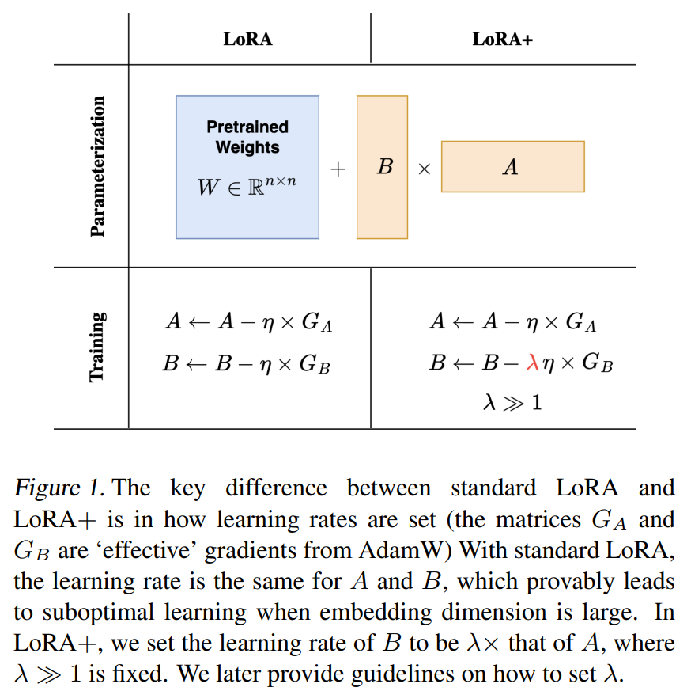
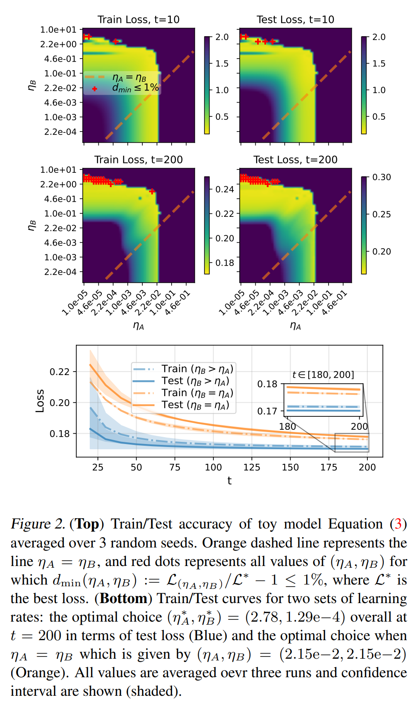
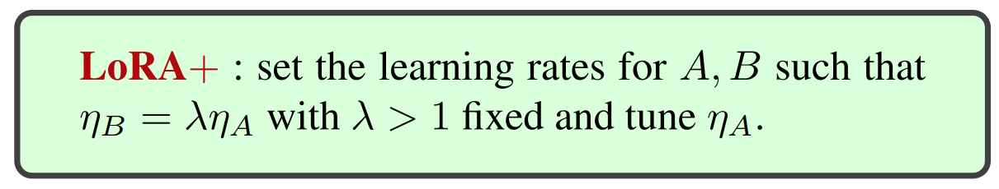
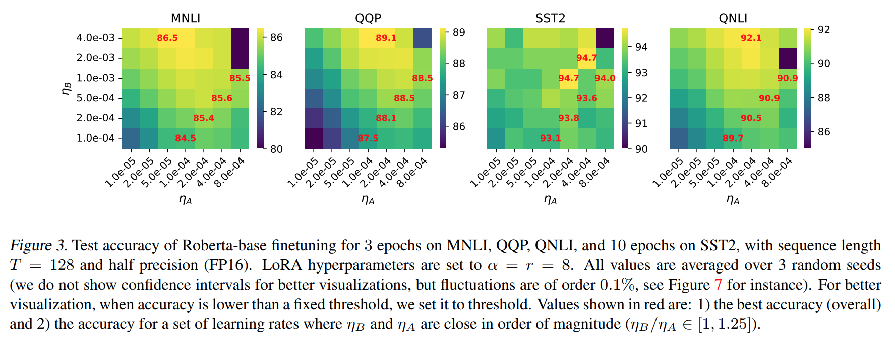
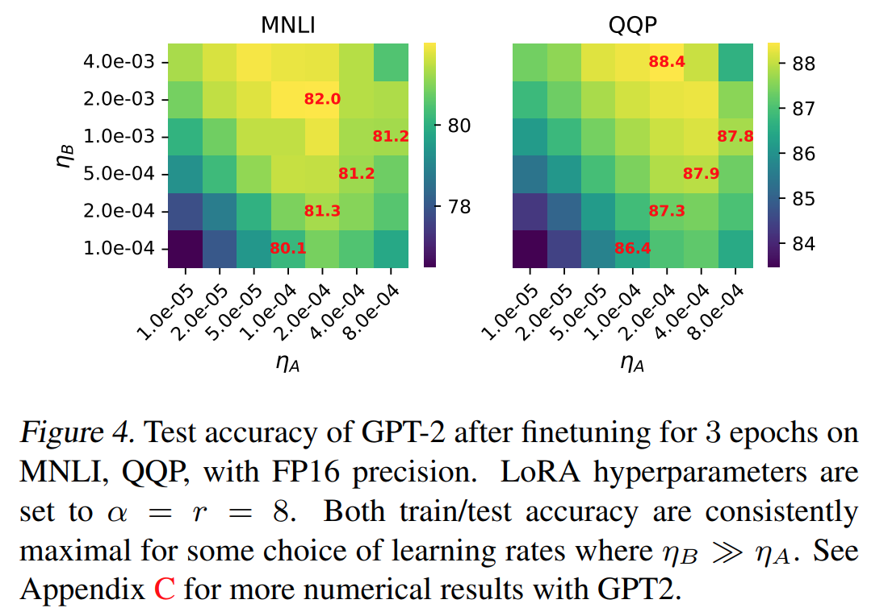
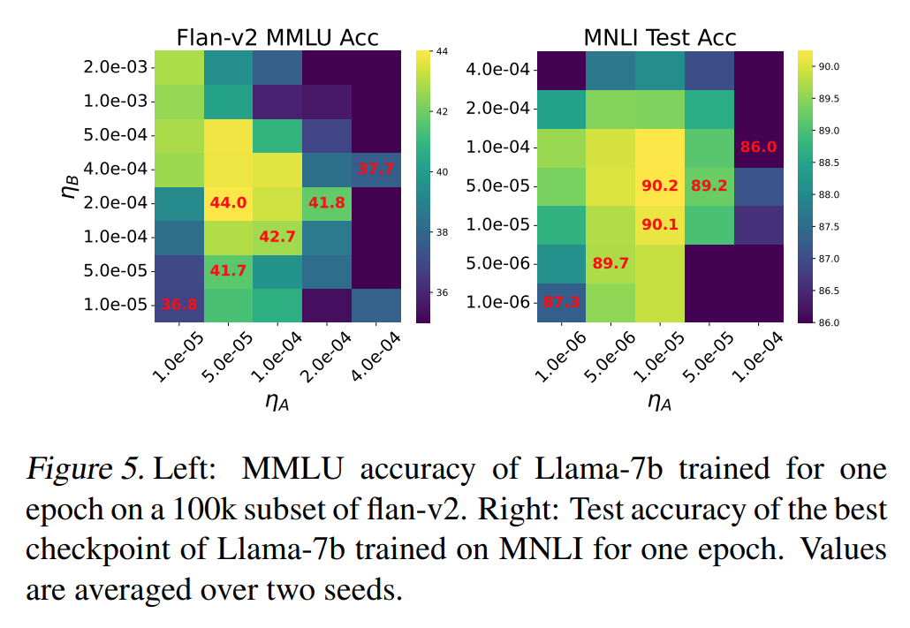
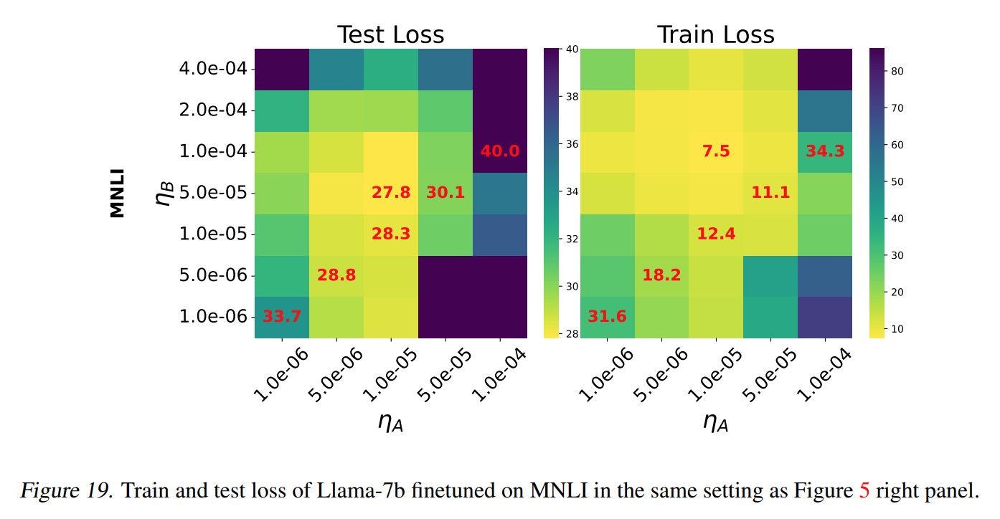
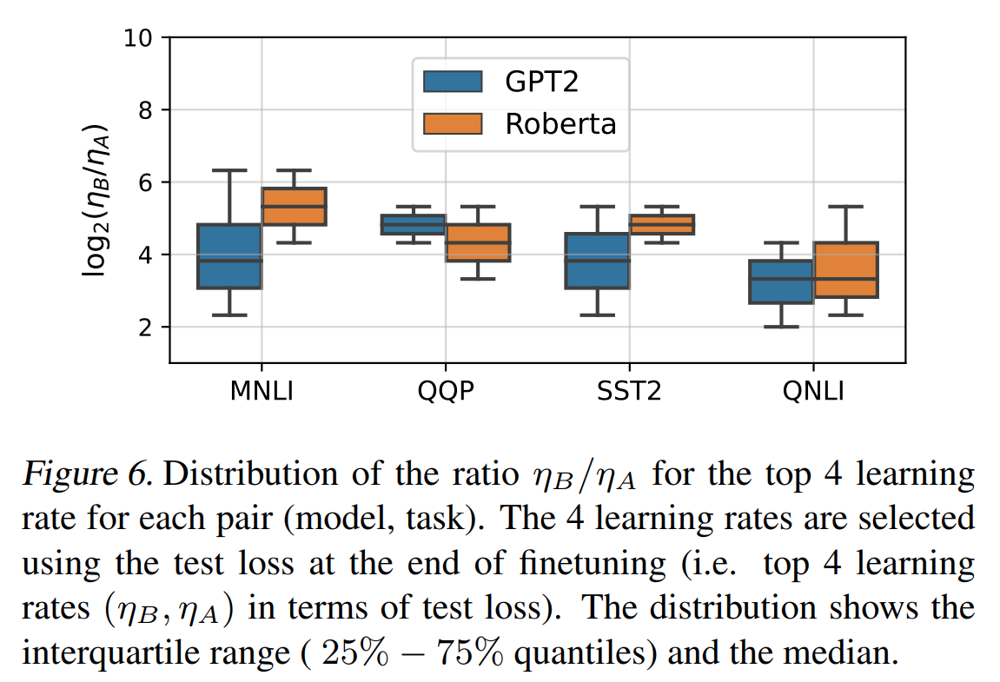
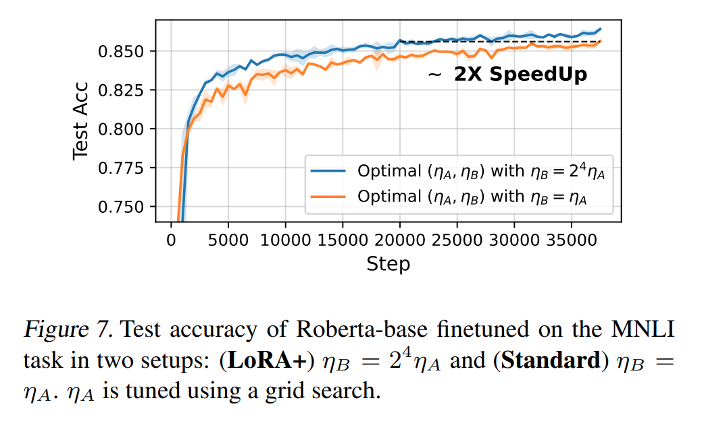

논문 및 이미지 출처 : <https://arxiv.org/pdf/2402.12354>

# Abstract

이 논문에서는 (Hu et al., 2021) 에서 처음 도입된 Low Rank Adaptation (LoRA) 가 embedding dimension 이 큰 모델을 fine-tuning 하는 데 최적화되지 않았음을 보인다. 이는 LoRA 에서 adapter matrix 인 $A$ 와 $B$ 가 동일한 learning rate 로 업데이트되기 때문이다.

large width networks 를 위한 scaling argument 를 통해 $A$ 와 $B$ 에 동일한 learning rate 를 사용하는 것은 efficient feature learning 을 허용하지 않음을 보여준다. 

이를 보완하기 위해, $A$ 와 $B$ 에 대해 well-chosen fixed ratio 로 다른 learning rate 를 설정하는 간단한 방법을 제안하며, 이를 LoRA+ 라고 부른다. 

광범위한 실험에서 LoRA+ 는 LoRA 와 동일한 계산 비용으로 성능 (1%−2% 향상)과 fine-tuning speed (약 2x SpeedUp)를 개선함을 보여준다.

# 1. Introduction

최신 state-of-the-art (SOTA) deep learning model 은 모두 공통적으로 매우 큰 수의 parameters (10 ~ 100 billions) 를 가진다. 

현재 매우 큰 language models 를 pretraining 할 수 있는 곳은 높은 비용 때문에 소수의 산업 연구소에 한정되어 있다. 그러나 많은 pretrained model 은 API(GPT-4) 또는 오픈소스 플랫폼(Llama) 을 통해 접근 가능하다. 

대부분의 사용자들은 이러한 모델을 특정 작업에 맞게 조정하기를 원하며, 이를 위해 모델을 새로운, 일반적으로 더 작은 작업에 맞게 적응시키는 fine-tuning 절차를 수행한다. 그러나 SOTA 모델의 크기 때문에 full fine-tuning (all model parameters 를 fine-tuning) 은 계산적으로 비현실적이다. 

이는 pretrained model 의 weights 를 gradient method 를 사용해 수정하는 데 높은 비용이 들기 때문이다. 게다가 이미 유용한 표현을 학습한 모델은 all parameters 의 큰 변경 없이도 충분히 적응할 수 있다. 이러한 직관에 기반해 연구자들은 pretrained weights 를 고정하고 새로 삽입된 small set parameters 만 조정하는 다양한 resource-efficient fine-tuning 방법을 제안했다.

- 이러한 방법에는 입력에 "soft prompt" 를 추가하는 prompt tuning, lightweight "adapter" layers 를 삽입하고 학습하는 adapter method, 그리고 activation vectors 를 학습된 scaling 으로 수정하는 (IA)$^3$ 가 포함된다. 
- 또 다른 자원 효율적인 방법으로는 Low Rank Adaptation (LoRA) 가 있다. 
- LoRA fine-tuning 에서는 pretrained weights 에 추가된 low rank matrix, 즉 adapter 만 학습 가능하다. 이는 어느 optimizer 로도 학습할 수 있으며, 실질적으로 일반적으로 Adam 이 사용된다. 
- low-rank adapter 를 학습함으로써 trainable parameters 의 수가 효과적으로 감소해 training cost 를 크게 줄일 수 있다. 
- LoRA 는 instruction fine-tuning 등의 작업에서 full fine-tuning 과 비교하여 동등하거나 더 나은 성능을 보이는 것으로 나타났다. 
- LoRA 의 인상적인 성능과 계산 절약은 이를 산업 표준 fine-tuning 방법으로 자리 잡게 했다.

LoRA 의 효율적인 사용은 rank 와 learning rate 같은 hyperparameter 의 신중한 선택을 요구한다. LoRA 의 rank 선택에 대한 이론적 지침은 존재하지만, learning rate 설정에 대한 원칙적인 지침은 알려져 있지 않다.

#### Related Work

Dettmers et al. (2023) 는 LoRA 의 quantized 버전(QLoRA) 을 도입해 pretrained weights 를 4-bit 까지 quantizing 하여 추가적으로 계산 비용을 절감했다. 

QLoRA 를 사용하면 Llama-65b 를 single GPU 에서 fine-tuning 하면서 full fine-tuning 과 경쟁력 있는 성능을 달성할 수 있다. 

Li et al. (2023) 은 quantized training 을 위한 더 나은 초기화를 계산하는 LoftQ 를 도입하여 LoRA training 을 개선했다. 

VeRA (Kopiczko et al., 2023) 와 같은 LoRA 의 추가 변형도 제안되었으며, 이는 random weight tied adapters 를 고정하고 internal adapter activations 의 vector scaling 을 학습하여 trainable parameters 의 수를 더욱 줄인다. 그러나 LoRA learning rate 설정에 대한 원칙적 지침은 없으며, 이는 본 연구의 초점이다.

#### Contributions

저자는 neural networks 의 scaling 이론을 통해 learning rate 을 설정하는 지침을 제공한다. 

neural networks 의 infinite width/depth 관점에서 scaling 에 관한 많은 연구가 존재한다. 접근 방식은 간단하다: neural network 의 width/depth 를 무한대로 설정하고, learning rate 이나 initialization variance 같은 학습 과정에서의 hyperparameters 선택에 따라 이 한계가 어떻게 달라지는지 이해한 후, 원하는 목표(e.g., feature learning 개선)를 달성하기 위해 이러한 hyperparameters 에 대한 원칙적인 선택을 도출한다. 

infinite-width limit 과 관련된 예로는 초기화 체제에 관한 연구나, network parameterization 을 보다 포괄적으로 다룬 연구가 있다. 이들은 infinite-width limit 에서 feature learning 을 보장하며, feature learning 을 극대화하기 위한 아키텍처 및 learning rate 에 대한 정확한 scaling 규칙을 제공한다. 

depth limit 의 예로는 초기화 전략(Schoenholz et al., 2017a; He et al., 2023; Hayou et al., 2019), block scaling(Hayou et al., 2021; Hayou, 2023; Noci et al., 2023) 및 depth parameterization(Yang et al., 2023; Bordelon et al., 2023) 등이 있다.

여기에서는 LoRA fine-tuning 에 대한 learning rate scaling 규칙을 도출하기 위해 동일한 전략을 제안한다. 보다 구체적으로, 저자는 LoRA fine-tuning dynamics 의 infinite-width limit 을 연구하고, standard LoRA 설정이 비효율적임을 보여준다. 

이를 개선하기 위해, infinite-width limit 에서 low rank adaptation 에서 feature learning 을 향상시키는 새로운 방법인 LoRA+를 도입한다. 

LoRA+의 핵심 혁신은 $A$ 및 $B$ modules (LoRA modules)에 대해 다른 learning rate 을 설정하는 것이며, 이는 Fig. 1 에서 설명된다. 

저자의 이론은 다양한 언어 모델 및 작업에 대한 광범위한 실험적 결과를 통해 검증되었다.

# 2. Setup and Definitions

이 논문의 방법론은 모델 비의존적이며 일반적인 neural network 모델에 적용할 수 있다. 다음과 같은 neural network 를 고려한다:

$$
\begin{equation}
    \left\{\begin{aligned}
        &Y_{in}(x) = W_{in}x, \\
        &Y_l(x) = \mathcal{F}_l(W_l, Y_{l-1}(x)), \quad l \in [L], \\
        &Y_{out}(x) = W_{out}Y_L(x),
    \end{aligned}\right.
\end{equation}
$$

여기서 $x \in \mathbb{R}^d$ 는 input, $L \geq 1$ 은 network depth, $(\mathcal{F}_l)_{l \in [L]}$ 은 layers 를 정의하는 mapping, $W_l \in \mathbb{R}^{n \times n}$ 은 hidden weights 이며 $n$ 은 network _width_, $W_{in}, W_{out}$ 은 input 과 output embedding weights 이다.

Model (1) 은 특정 작업(e.g., next token prediction)을 수행하기 위해 dataset $\mathcal{D}$ 에 대해 pretrained 된다. 

model 이 pretrained 된 이후, downstream task 에서 성능을 향상시키기 위해 fine-tuning 할 수 있다. 

제한된 GPU 와 같은 small devices 에서 이를 수행하기 위해, LoRA 와 같은 resource-efficient fine-tuning 방법은 full rank fine-tuning (또는 simple full fine-tuning) 대신 low-rank weight matrices 를 고려하여 계산 비용을 크게 줄인다.

#### Definition 1 (Low Rank Adapters (LoRA), Hu et al., 2021)

pretrained model 의 weight matrix $W \in \mathbb{R}^{n_1 \times n_2}$ 에 대해, fine-tuning 과정에서 업데이트를 다음과 같이 low-rank decomposition $W = W^* + \frac{\alpha}{r} BA$ 로 표현하여 제약을 둔다.

여기서 $B \in \mathbb{R}^{n_1 \times r}, A \in \mathbb{R}^{r \times n_2}$ 만 학습 가능하다. 

$r \ll \min(n_1, n_2)$ 이며, $\alpha \in \mathbb{R}$ 는 tunable constant 이다.

#### Scaling of Neural Networks

network width $n$ 이 증가함에 따라, initialization scheme 와 학습 방식이 numerical instability 를 방지하고 efficient learning 을 보장하도록 조정되어야 한다는 것이 잘 알려져 있다. 

예를 들어, hidden layers 의 initialization weight 의 variance 는 $n$ 이 커질수록 large pre-activation 을 방지하기 위해 $1/n$ 으로 scaling 되어야 한다 (e.g. He init (He et al., 2016)).

이러한 scaling 규칙을 도출하기 위한 원칙적인 접근법은 $n$ 이 증가함에 따라 모델의 주요 양상 (e.g., pre-activation) 의 통계적 특성을 분석하고, initialization, learning rate, architecture 를 조정하여 $n \to \infty$ 의 한계에서 바람직한 특성을 달성하는 것이다. 

본 논문에서는 이 접근법을 사용하여 LoRA 의 feature learning dynamics 를 infinite-width limit 에서 연구하고, LoRA module 의 learning rate 에 대한 scaling 규칙을 도출한다. 

neural networks 의 scaling 이론에 대한 자세한 내용은 Appendix A.1 을 참조하라.

#### Notation

이후에, width $n$ 이 증가함에 따라 점근적 행동을 설명하기 위해 다음과 같은 표기법을 사용한다.

- $c_n \in \mathbb{R}$ 와 $d_n \in \mathbb{R}^+$ 인 수열에 대해, $c_n = \mathcal{O}(d_n)$ 은 $c_n < \kappa d_n$, $c_n = \Omega(d_n)$ 은 $c_n > \kappa d_n$ (단, $\kappa > 0$) 를 의미한다.
- $c_n = \Theta(d_n)$ 은 $c_n = \mathcal{O}(d_n)$ 와 $c_n = \Omega(d_n)$ 를 모두 만족함을 의미한다.
- vector sequences $c_n = (c^i_n)_{1 \leq i \leq k} \in \mathbb{R}^k$ (단, $k > 0$) 에 대해, $c_n = \mathcal{O}(d_n)$ 는 $c^i_n = \mathcal{O}(d^i_n)$ 이 $i \in [k]$ 에 대해 모두 성립함을 의미한다.
- random variables 로 구성된 sequence $c_n$ 의 경우, convergence 는 second moment ($L_2$ norm) 에서의 수렴으로 이해된다.

# 3. An Intuitive Analysis of LoRA

저자의 직관은 단순하다: matrices $A$ 와 $B$ 는 "transposed" 형태를 가지고 있으며, two matrices 에 대해 동일한 learning rate 를 설정해야 하는지에 대한 의문이 자연스럽게 생긴다. 

실제로, 대부분의 최신 SOTA 모델은 large width (embedding dimension) 를 가지고 있다. 따라서 width 가 무한대로 증가할 때의 training dynamics 를 연구하는 것이 타당하다.

## 3.1. LoRA with a Toy Model

다음과 같은 linear model 을 고려한다:

$$
\begin{equation}
    f(x) = (W^* + ba^\top)x,
\end{equation}
$$

여기서 $W^* \in \mathbb{R}^{1 \times n}$ 은 pretrained weights, $b \in \mathbb{R}$, $a \in \mathbb{R}^n$ 은 LoRA weights, $x \in \mathbb{R}^n$ 은 model input 이다. 

이 설정은 Definition 1 에서 $n_1 = 1$, $n_2 = n$, $r = 1$ 에 해당한다.

$W^*$ 는 fixed (pretraining) 상태라고 가정한다. 

목표는 loss $\mathcal{L}(\theta) = \frac{1}{2}(f(x) - y)^2$ 를 minimizing 하는 것이며, 여기서 $\theta = (a, b)$, $(x, y)$ 는 input-output datapoint 이다. 

또한, $x = \Theta_n(1)$ 로 가정하여 width 가 증가함에 따라 input coordinates 가 동일한 차수를 유지한다고 본다. 

이후에는 width $n$ 이 증가함에 따라 fine-tuning dynamics 의 동작을 분석한다.

#### Initialization.

다음과 같은 Gaussian initialization 을 고려한다: $a_i \sim \mathcal{N}(0, \sigma_a^2), \quad b \sim \mathcal{N}(0, \sigma_b^2).$

LoRA 에서는 보통 $ba^\top = 0$ 으로 초기화하여 fine-tuning 이 pretrained model 에서 시작되도록 한다. 이는 $a$ 와 $b$ 중 최소한 하나의 weight 가 $0$ 으로 초기화되어야 함을 의미한다. 

만약 둘 다 $0$ 으로 초기화된다면, 이는 saddle point 에 해당하므로 학습이 발생하지 않는다. 따라서, $a$ 와 $b$ 중 하나를 $0$ 이 아닌 값으로 초기화하고 나머지를 $0$ 으로 초기화해야 한다. 

$a$ 를 $0$ 이 아닌 값으로 초기화한다면, standard initialization (e.g., He Init (He et al., 2016), LeCun Init (LeCun et al., 2002)) 을 따르면 $\sigma_a^2 = \Theta(n^{-1})$ 으로 설정하여 $a^\top x$ 가 width 에 따라 exploding 되지 않도록 보장해야 한다. 

이는 Central Limit Theorem (CLT) 에 의해 정당화된다. 반면 $b$ 를 $0$ 이 아닌 값으로 초기화할 경우, $\sigma_b^2 = \Theta(1)$ 이어야 한다. 이를 통해 다음 두 가지 초기화 체제가 가능하다:

- `Init[1]:` $\sigma_b^2 = 0$, $\sigma_a^2 = \Theta(n^{-1})$.
- `Init[2]:` $\sigma_b^2 = \Theta(1)$, $\sigma_a^2 = 0$.

이 분석에서는 LoRA module 에 대해 이 두 초기화 체제만 고려하며, stability (위에서 논의한 대로) 가 만족된다면 다른 체제에도 결과가 적용될 수 있다.

#### Learning Rate.

일반성을 잃지 않고, $W^* = 0$ 으로 설정하여 분석을 단순화할 수 있다. 

이는 $\tilde{y} = y - W^*x$ 로 설정하여 달성할 수 있다. 

gradient 는 다음과 같다:

$$
\frac{\partial \mathcal{L}}{\partial b} = a^\top x(f(x) - y), \quad \frac{\partial \mathcal{L}}{\partial a} = b(f(x) - y)x.
$$

fine-tuning step $t$ 에서 learning rate $\eta > 0$ 를 사용하면 다음을 얻는다:

$$
\begin{aligned}
  \Delta f_t \overset{\text{def}}{=} f_t(x) - f_{t-1}(x) = - \underbrace{\eta b_{t-1}^2 U_{t-1}\|x\|^2}_{\delta^1_t} \\
  - \underbrace{\eta(a_{t-1}^\top x)^2U_{t-1}}_{\delta^2_t} + \underbrace{\eta^2 U_{t-1}^2 b_{t-1}(a_{t-1}^\top x)\|x\|^2}_{\delta^3_t}.
\end{aligned}
$$

업데이트는 세 가지 항 $(\delta_t^i)_{i \in \{1,2,3\}}$ 에 의해 구동된다. 

- 처음 two terms 는 "linear" contributions 를 나타낸다. i.e., $b$ 를 fix 하고 $a$ 를 update 하거나 그 반대를 수행할 때 발생하는 출력 변화
  - 이 terms 는 $\eta$ 에 대해 1차다. 
- third term $\delta_t^3$ 는 $a$ 와 $b$ 의 곱셈적 업데이트를 나타낸다.
  - 이는 $\eta$ 에 대해 2차다.

$n$ 이 증가함에 따라, 바람직한 속성은 $\Delta f_t = \Theta(1)$ 을 만족하는 것이다. 

직관적으로 이는 width 를 확장하더라도 feature 업데이트가 이러한 확장으로 인해 ‘영향을 받지 않는다’는 것을 의미한다 (자세한 내용은 Appendix A.1 참조). feature learning 이 scaling 에 영향을 받는 시나리오의 예로는 lazy training regime 을 들 수 있다. 

이 경우 feature updates 는 $\Theta(n^{-1/2})$ order 에 해당하며, 이는 $n \to \infty$ 인 한계에서 feature learning 이 일어나지 않음을 암시한다.

condition $\Delta f_t = \Theta(1)$ 은 update 가 width 에 따라 exploding 하지 않음을 의미하며, 이는 바람직한 속성이다.

$\Delta f_t = \Theta(1)$ 을 만족하면 3 terms $(\delta^i_t)_{i \in \{1,2,3\}}$ 중 적어도 하나가 $\Theta(1)$ 이다.

이상적으로는 $\delta^t_1$ 와 $\delta^t_2$ 가 모두 $\Theta(1)$ 이길 원한다. 그렇지 않으면 $a$ 또는 $b$ 가 효율적으로 업데이트되지 않는다는 의미가 된다. 

예로, $\delta^t_1 = o(1)$ 이라면, $n \to \infty$ 에서 model 이 $a$ 가 고정되고 $b$ 만 훈련되는 것처럼 작동한다는 것을 의미한다. $\delta^t_2 = o(1)$ 인 경우도 유사한 결론이 도출된다.

$\delta^t_1$ 와 $\delta^t_2$ 가 width 에 따라 $\Theta(1)$ 인 경우 $a$ 와 $b$ 의 parameter update 가 $f_t(x)$ 의 변화에 크게 기여함을 의미하며, 이 경우 LoRA 를 활용한 feature learning 이 _efficient_ 하다고 한다. i.e., $i \in \{1, 2\}$ 와 all $t > 1$ 에 대해 $\delta^i_t = \Theta(1)$ 을 만족해야 한다.

독자는 왜 $\delta^t_3$ 가 $\Theta(1)$ 을 요구하지 않는지 궁금할 수 있다. 저자는 $\delta^t_1$ 와 $\delta^t_2$ 가 모두 $\Theta(1)$ 일 때, $\delta^t_3$ 도 $\Theta(1)$ 임을 볼 것이다.

#### Efficiency Analysis.

model 을 learning rate $\eta = \Theta(n^c)$ ($c \in \mathbb{R}$) 를 사용하여 gradient descent 로 학습한다고 가정하고, `Init[1]` initialization 을 사용한다고 가정한다. 

training dynamics 는 주로 matrix vector product, vectors/scalars sum 등으로 구성되므로, 이는 training dynamics 에서 어떤 quantity 도 $n^\gamma$ ($\gamma \in \mathbb{R}$) order 를 가질 것임을 쉽게 알 수 있다.

training dynamics 의 모든 quantity $v$ 에 대해 $v = \Theta(n^{\gamma[v]})$ 로 쓸 수 있다. $v$ 가 vector 일 경우, all entries 가 $\Theta(n^{\gamma[v]})$ 인 경우에도 동일한 표기법을 사용한다. 

이 $\gamma$ 표기는 Appendix A 에서 공식적으로 정의되어 있다.

---

initialization 의 시작에서 $f_0(x) = 0$ 이다. 

LoRA fine-tuning 이 효율적이기 위해서는 all $t > 1$ 에 대해 $\delta_t^1 = \Theta(1)$ 및 $\delta_t^2 = \Theta(1)$ 을 만족해야 하며, 이는 다음 방정식으로 변환된다:

$$
\left\{\begin{aligned}
&c + 2\gamma[b_{t-1}] + 1 = 0 \quad (\delta_t^1 = \Theta(1)), \\
&c + 2\gamma[a^\top_{t-1}x] = 0 \quad (\delta_t^2 = \Theta(1)), \\
&\gamma[b_{t-1}] + \gamma[a^\top_{t-1}x] = 0 \quad (f_{t-1}(x) = \Theta(1)).
\end{aligned}\right.
$$

이 방정식을 풀면 $c = -1/2$ 가 되어, efficient feature learning 을 달성하려면 learning rate 가 $\eta = \Theta(n^{-1/2})$ 로 scaling 되어야 한다. 그러나 initialization 에서 $b_0 = 0$, $a^\top_0 x = \Theta(1)$ (CLT 에 의해). 

귀납적 논증을 통해 $t > 0$ 인 경우, $b_t$ 는 $\Theta(n^{-1/2})$ order 를 가지며, $a_t^\top x$ 는 $\Theta(1)$ order 를 가지며, 결과적으로 $f_t(x) = \Theta(n^{-1/2})$ 를 얻는다. 

실제로, 각 iteration 에서 $b_t$ 의 update 는 $\Theta(\eta ya_{t-1}^\top x) = \Theta(n^{-1/2})$ order 를 가지며, $a_t$ 의 update 는 $\Theta(\eta b_{t-1}yx) = \Theta(n^{-1})$ order 를 가진다. 

$f_t = \Theta(n^{-1/2})$ 이므로, $\Theta(1)$ features 를 학습한다는 점과 모순이 발생한다. 

이는 이 parameterization 으로 $\delta^t_1$ 와 $\delta^t_2$ 를 모두 $\Theta(1)$ 로 만들 수 없음을 보여준다 (`Init[2]` 의 경우에도 동일하다). 

이 결과를 다음의 Proposition 에서 형식화하며, 추가적인 기술적 세부사항은 Appendix A 를 참조한다.

#### Proposition 1 (Inefficiency of LoRA fine-tuning)

LoRA weights 가 `Init[1]` 또는 `Init[2]` 로 초기화되고, learning rate $\eta = \Theta(n^c)$ (여기서 $c \in \mathbb{R}$) 로 gradient descent 를 사용해 학습된다고 가정하자. 이 경우, 어떤 $t > 0$ 에 대해서도 $i \in \{1, 2\}$ 에 대해 $\delta^i_t = \Theta(1)$ 가 되는 것은 불가능하며, 따라서 이러한 설정에서 LoRA 를 사용한 fine-tuning 은 inefficienct 하다.

---

결론적으로, 이러한 learning rate 의 parameterization 은 efficiency 를 달성할 수 없다. 이는 실무에서 사용되는 standard LoRA fine-tuning 방식이 특히 model width 가 큰 경우 inefficiency 를 시사한다. 실제로 이는 GPT-2 에서 $n \approx 700$, LLama 에서 $n \approx 4000$ 인 경우와 같이 대부분 만족되는 특성이다. 

이 분석은 standard LoRA 설정에서 중요한 hyperparameter 가 누락되었음을 시사한다. 실제로 learning rate 를 $a$ 와 $b$ 에 대해 분리함으로써 $i \in \{1, 2, 3\}$ 에 대해 $\delta^i_t = \Theta(1)$ 를 달성할 수 있음을 보였다. 여기서 learning rate 를 $\eta_a$, $\eta_b$ 로 나타낸다.

위에서 수행한 분석은 learning rate 의 차이를 제외하면 도덕적으로 동일하다. $\eta_a = \Theta(n^{c_a})$, $\eta_b = \Theta(n^{c_b})$ 라고 하고, weights 가 `Init[1]` 로 초기화되었다고 가정하자. 위와 유사한 분석은 $f_t(x) = \Theta(1)$ 이고 $i \in \{1, 2\}$, $t > 0$ 인 경우 $\delta^i_t = \Theta(1)$ 가 되려면 all $t > 1$ 에 대해 다음이 성립함을 보여준다.

$$
\left\{\begin{aligned}
&c_a + 2\gamma[b_{t-1}] + 1 = 0 \quad (\delta_t^1 = \Theta(1)), \\
&c_b + 2\gamma[a^\top_{t-1}x] = 0 \quad (\delta_t^2 = \Theta(1)), \\
&\gamma[b_{t-1}] + \gamma[a^\top_{t-1}x] = 0 \quad (f_{t-1}(x) = \Theta(1)).
\end{aligned}\right.
$$

간단한 계산 후, $c_a + c_b = -1$ 을 얻는다. 이는 필요 조건일 뿐이다. 

다음 결과에서는 안정성 요소를 고려하여 efficient LoRA fine-tuning 을 보장하는 $\eta_a$ 와 $\eta_b$ 의 선택을 완전히 특성화한다.

#### Proposition 2 (Efficient Fine-Tuning with LoRA)

model Eq. (2) 의 경우, $\eta_a = \Theta(n^{-1})$ 및 $\eta_b = \Theta(1)$ 인 경우, all $t > 1$ 및 $i \in \{1, 2, 3\}$ 에 대해 $\delta_t^i = \Theta(1)$ 를 만족한다.

---

Proposition 2 에 대한 증명에 대한 자세한 내용은 Appendix A 를 참조하자.

결론적으로, learning rate 를 $\eta_a = \Theta(n^{-1})$ 및 $\eta_b = \Theta(1)$ 로 scaling 하면 infinite-width limit 에서 LoRA fine-tuning 의 stability ($\Delta f_t = \Theta(1)$) 와 efficiency ($\delta^i_t = \Theta(1)$ for $i \in \{1, 2\}$ and $t > 1$) 이 보장된다.

실제로 이는 $b$ 에 대한 learning rate 가 일반적으로 $a$ 의 learning rate 보다 훨씬 커야 함을 의미한다. 

이러한 특성은 $b \in \mathbb{R}^r$ 인 일반적인 $r$ 에 대해서도 유효하다. 이후, 이 scaling 이 일반적인 neural network model 에서도 유효함을 보게 될 것이다.

## 3.2. Verifying the Results on a Toy Model

이전 분석은 단순한 linear model 을 고려한다. scaling 규칙이 non-linear setting 에서도 유효한지 평가하기 위해, 다음과 같은 neural network model 을 고려한다:

$$
\begin{equation}
  f(x) = W_{\text{out}} \phi(BA\phi(W_{\text{in}}x)),
\end{equation}
$$

여기서 $W_{\text{in}} \in \mathbb{R}^{n \times d}$, $W_{\text{out}} \in \mathbb{R}^{1 \times n}$, $A \in \mathbb{R}^{r \times n}$, $B \in \mathbb{R}^{n \times r}$ 는 weights 이며, $\phi$ 는 ReLU function 이다.

이 model 은 $X \sim \mathcal{N}(0, I_d)$, $Y = \sin\left(d^{-1} \sum_{i=1}^d X_i\right)$ 에 따라 생성된 synthetic dataset 에 대해 학습된다. 자세한 내용은 Appendix C 를 참조하자.

---

- weight matrices $A$, $B$ 만 학습되며 ($W_{\text{in}}$, $W_{\text{out}}$ 는 고정), $d = 5$, $n = 100$, $r = 4$, train data size 1000, test data size 100 을 사용한다.
- training 초반 단계($t = 10$) 와 convergence 이후($t \approx 200$, learning rate 가 적절하게 설정되었을 때)에서 다양한 $\eta_A$ 와 $\eta_B$ 에 대한 train/test loss 가 Fig. 2 에 보고된다. 
- 빨간색 ‘+’ 표시는 loss 가 best loss 의 1% 범위 내에 있는 learning rate ($\eta_A, \eta_B$)을 나타내며, 점선은 learning rate 가 동일하게 설정된 경우를 나타낸다.

저자는 learning rate $\eta_B \gg \eta_A$ 인 경우에 best train 및 test losses 가 일관되게 달성된다는 것을 관찰하며, 이는 이전 섹션에서의 분석을 검증한다. 

또한 optimal learning rate ($\eta_A, \eta_B$) 가 일반적으로 안정성 경계에 가까운 것이 관찰되는데, 이는 deep networks 의 training dynamics 에서 잘 알려진 동작이다.

# 4. Stability and Feature Learning with LoRA in the Infinite Width Limit

이 섹션에서는 위에서 제시된 분석을 LoRA layers 가 포함된 일반적인 neural architectures 로 확장한다. 저자는 linear model 에 대한 분석 결과가 일반적인 neural architectures 에도 유효함을 보인다: 1) $A$ 와 $B$ 에 동일한 learning rate 를 사용하는 경우, 모델의 width 가 클 때 feature learning 이 비효율적으로 이루어진다, 2) 이 문제는 $A$ 와 $B$ 에 서로 다른 learning rate 를 설정함으로써 해결될 수 있다.

본 논문의 목적이 주로 방법론적인 만큼, 이 섹션의 이론적 결과는 분석을 엄격하고 복잡하게 만드는 기술적 가정을 생략한 물리학 수준의 엄밀성을 따른다. 모든 결과에서 LoRA 의 rank $r$ 는 고정되었으며, finetuning dynamics 는 infinite-width limit 에서 분석된다. 

이 설정은 $r \ll n$ 이며 $r$ 가 일반적으로 작은 실용적인 시나리오를 적절히 나타낸다.

#### Notation.

LoRA weights 는 $A_{ij} \sim \mathcal{N}(0, \sigma_A^2)$, $B_{ij} \sim \mathcal{N}(0, \sigma_B^2)$ 로 초기화되며, 여기서 $\sigma_A, \sigma_B \geq 0$ 이다.

또한, $\sigma_B^2 = 0$ 및 $\sigma_A^2 = \Theta(n^{-1})$ (`Init[1]`) 또는 $\sigma_B^2 = \Theta(1)$ 및 $\sigma_A^2 = 0$ (`Init[2]`) 중 하나로 가정한다.

model 내 LoRA layer 에서 $\underline{Z}$ 는 해당 layer 의 input 을, $\bar{Z}$ 는 pretrained weights 가 추가된 output 으로 나타낸다. 이를 보다 정확히 표현하면, $\bar{Z} = W^*\underline{Z} + \frac{\alpha}{r}BA\underline{Z}$ 이다.

본 분석은 LoRA _feature_ 를 포함한 여러 quantities magnitude 를 신중히 추정하는 것에 기반한다. 이를 위해 공식적인 정의를 제시한다.

#### Definition 2 (LoRA Features)

일반적인 neural architecture 와 LoRA layer (Definition 1)가 주어졌을 때, LoRA feature ($Z_A, Z_B$) 는 다음과 같이 정의된다: $Z_A = A\underline{Z}$, $Z_B = BZ_A = BA\underline{Z}$. Fine-tuning step $t$ 에서는 $Z^t_A, Z^t_B$ 로 LoRA feature 값을 나타내며, $A_t, B_t$ 로 weights 를 나타낸다.

---

LoRA layers 는 중앙에 "bottleneck" 이 있는 2-layer linear network 이며, 일반적으로 $r \ll n$ 이므로 이 bottleneck 구조는 training stability 및 efficiency 에 몇 가지 수치적 도전을 유발할 수 있다 (Definition 3 및 Definition 5 참고).

#### Finetuning Dataset

분석을 단순화하기 위해, fine-tuning dataset 이 single sample $(x, y)$ 로 구성되어 있다고 가정한다. 

목표는 all LoRA layers 에 대해 조정된 weights 가 $W^* + BA$ 로 주어진 모델에서 loss $\mathcal{L}(\theta, (x, y))$ 를 최소화하는 것이다 (여기서 $\theta = \{A, B, \text{for all LoRA layers in the model}\}$). 

training step $t$ 에서 model 의 LoRA layer 에 대해 $\underline{Z}^t$ 는 data input $x$ 에 대해 LoRA layer 로 전달된 input 을 나타낸다. 

유사하게, $d\bar{Z}^t$ 는 data point $(x, y)$ 에 대해 layer output feature $\bar{Z}$ 에 대한 loss function 의 gradient 를 나타낸다.

Sec. 3 에서 논의된 LoRA 의 stability 개념은 모든 neural network 모델로 일반화될 수 있다.

#### Definition 3 (Stability)

LoRA fine-tuning 이 안정적이라고 말하는 것은, model 내 all LoRA layers 와 모든 training steps $t$ 에 대해 $Z, Z_A, Z_B = \mathcal{O}(1)$ 을 만족하며, $n$ 이 무한대로 증가할 때도 이러한 상태가 유지되는 경우를 의미한다. 

---

Stability 는 network 내 어떤 값도 model width 가 증가함에 따라 exploding 하지 않는다는 것을 내포하며, 이는 모델을 확장하는 과정에서 바람직한 특성이다.

자연스럽게, Stability 를 보장하기 위해서는 $n$ 이 증가함에 따라 hyperparameter(initialization, learning rate) 를 scaling 해야 한다. 

initialization 에 대한 scaling 규칙은 비교적 쉽게 도출할 수 있으며, Sec. 3 에서 `Init[1]` 과 `Init[2]` 라는 두 가지 가능한 초기화 방식을 이미 논의한 바 있다.

더 중요한 점은, learning rate 를 width 와 함께 임의로 scaling 할 경우, fine-tuning 이 안정적이라 하더라도 width 가 증가함에 따라 suboptimal learning 이 발생할 수 있다는 것이다. 예를 들어, width 에 따라 learning rate 를 과도하게 축소하거나, network 를 부적절하게 parameterizing 할 경우(e.g., Neural Tangent Kernel parameterization 이 infinite width limit 에서 kernel regime 으로 이어짐, (Jacot et al., 2018)) 이러한 상황이 발생할 수 있다.

이를 고려하여, LoRA 에서 feature learning 의 개념을 정의한다.

#### Definition 4 (Stable Feature Learning with LoRA)

LoRA fine-tuning 이 stable feature learning 을 유도한다고 말하는 것은, 그것이 Stable 이며 (Definition 3), model 내 all LoRA layers 및 fine-tuning step $t$ 에 대해 $\Delta Z_B^t \overset{\text{def}}{=} Z_B^{t+1} - Z_B^t = \Theta(1)$ 을 만족하는 경우를 의미한다. 

---

비슷한 feature learning 정의가 pretraining 에 대해 (Yang and Littwin, 2023) 에서 소개된 바 있다. 이 정의는 network 가 kernel regime 에 'stuck' 하지 않도록 (갇히지 않도록) 보장하며, 이 경우 feature update 가 infinite width limit 에서 $\mathcal{O}(n^{-\epsilon})$ (일부 $\epsilon > 0$) 의 순서를 가지므로, $n \to \infty$ 에서 feature learning 이 발생하지 않음을 의미한다. 

저자들은 $\mu$-parameterization (또는 maximal update parameterization) 을 도입했으며, 이는 특정 network parameterization (initialization + learning rate scaling) 로 feature update 가 $\Theta(1)$ 을 보장한다.

여기서 정의에 stability 를 추가했지만, 원칙적으로는 $\Theta$ 대신 $\Omega$ 를 사용하여 feature learning 을 정의할 수 있다.

후자는 initialization 과 learning rate 의 부적절한 scaling 으로 인해 $\Delta Z_B^t = \Theta(n)$ 과 같은 불안정한 시나리오를 포함한다. 하지만 여기서는 stable feature learning 에 중점을 두고 이를 생략한다. 

또한 저자는 fine-tuning dynamics 만 고려하며, pretraining dynamics 는 포함하지 않는다. 그러나 분석이 pretraining 으로부터의 $W^*$ weights 에 의존하기 때문에, pretraining parameterization 이 width 증가에 따라 stability 와 feature learning 을 보장한다고 가정한다 (자세한 내용은 Appendix A 참조).

fine-tuning step $t$ 에서 다음 gradient 가 주어졌다 하자.

$$
\begin{aligned}
  &\frac{\partial \mathcal{L}_t}{\partial B} = \frac{a}{r}d\bar{Z}^{t-1} \otimes A_{t-1}\underline{Z}^{t-1} \\
  &\frac{\partial \mathcal{L}_t}{\partial A} = d\bar{Z}^{t-1}_A \otimes \underline{Z}^{t-1} = \frac{a}{r}B^\top_{t-1}d\bar{Z}^{t-1} \otimes \underline{Z}^{t-1},
\end{aligned}
$$

여기서 $u \otimes v$ 는 vectors $u, v$ 의 outer product $uv^\top$ 를 표기하며 weights 는 다음을 따라 update 된다.

$$
A_t = A_{t-1} - \eta_A g^{t-1}_A, B_t = B_{t-1} - \eta_B g^{t-1}_B,
$$

$g_A, g_B$ 는 processed gradient 들을 나타내며 (e.g., AdamW 와 같은 알고리즘에서 사용되는 normalized gradient 들), 여기서부터는 gradient 가 $\Theta(1)$ 의 entries 를 가지도록 처리된다고 가정한다. 

이는 일반적으로 실무에서 만족되며 (e.g., Adam 을 사용할 경우), 일반적인 gradient processing functions 에 대한 $\mu$-parameterization 을 도출하기 위해 (Yang and Littwin, 2023) 에서 고려되었다.

Sec. 3 에서 다룬 linear model 과 달리, LoRA feature update 는 $A, B$ weights 의 변화뿐만 아니라, model fine-tuning 할 때 update 되는 $\underline{Z}$ 와 $d\bar{Z}$ 에 의해서도 결정된다 (LoRA layers 가 여러 개 존재한다고 가정). 

individual LoRA layers 가 feature learning 에 기여하는 정도를 분리하기 위해, _single LoRA layer 만 trainable 함_을 가정하고 나머지 LoRA layer 는 모두 고정된 상태로 둔다. 

이 설정에서는, model 에서 유일한 trainable LoRA layer 의 input $\underline{Z}$ 는 고정되어 $t$ 와 함께 변하지 않으며, $d\bar{Z}$ 는 $t$ step 에 따라 변경된다 ($\bar{Z}^t = (W^* + \frac{\alpha}{r} B_t A_t)\underline{Z}$ 이기 때문에). $t$ step 이후, $Z_B$ 는 다음과 같이 update 된다.

$$
\Delta Z_B^t = \underbrace{B_{t-1} \Delta Z_A^t}_{\delta_t^1} + \underbrace{\Delta B_t Z_A^{t-1}}_{\delta_t^2} + \underbrace{\Delta B_t \Delta Z_A^t}_{\delta_t^3}
$$

Sec. 3 에서 논의된 바와 같이, $\delta_t^1$, $\delta_t^2$ term 은 하나의 weight matrix 를 고정하고 나머지 하나만 학습할 때 얻는 ‘linear’ feature update 를 나타내며, $\delta_t^3$ term 은 $A$ 와 $B$ 를 모두 update 함으로써 발생하는 복합 업데이트를 포착하는 ‘multiplicative feature update 를 나타낸다.

### Analysis of the Role of $A$ and $B$

앞서 논의된 바와 같이, $\delta_t^1 = \Theta(1)$ 및 $\delta_t^2 = \Theta(1)$ 을 보장해야 한다. 이는 두 weight matrices $A$ 와 $B$ 가 $Z_B$ 의 update 에 기여한다는 것을 의미한다. 

이것이 desirable property 인지 설명하기 위해, matrices $A$ 와 $B$ 의 변화가 LoRA feature $Z_B = BA \underline{Z}$ 에 어떻게 영향을 미치는지 분석한다.

---

$B$ 의 column 을 $(B_{:,i})_{1 \leq i \leq r}$ 로 나타내면, $Z_B$ 는 $Z_B = \sum_{i=1}^r (A\underline{Z})_i B_{:,i}$ 와 같이 표현할 수 있다.

여기서 $(A\underline{Z})_i$ 는 $A\underline{Z}$ 의 $i^{th}$ coordinate 이다. 이 decomposition 은 $Z_B$ 의 _direction_ 이 $B$ 의 column 의 weighted sum 으로 표현되며, $A$ 가 _weights_ 를 조정함을 나타낸다.

이를 바탕으로 다음과 같이 쓸 수 있다.

$$
\left\{\begin{aligned}
  &\delta_t^1 = \sum_{i=1}^r (\Delta A_t \underline{Z})_i (B_{:,i})_{t-1}, \\
  &\delta_t^2 = \sum_{i=1}^r (A_{t-1} \underline{Z})_i (\Delta B_{:,i})_{t-1},
\end{aligned}\right.
$$

여기서 $(B_{:,i})_t$ 는 time step $t$ 에서 $B$ 의 column 을 나타낸다.

$\delta_t^1$ 와 $\delta_t^2$ 가 $\Theta(1)$ 의 order 를 가진다는 것은, $A$ 와 $B$ 가 모두 충분히 업데이트되어 $(A\underline{Z})_i$ 와 $B_{:,i}$ directions 에 변화를 유도한다는 것을 의미한다. 만약 $A$, $B$ 중 하나가 효율적으로 업데이트되지 않는다면, suboptimal fine-tuning 이 될 수 있어 다음과 같은 문제가 발생할 수 있다.

1. direction $B$ 가 업데이트되지 않음.
2. direction weights $(A_{t-1} Z)$ 가 업데이트되지 않음.

예를 들어, model 이 `Init[2]` 로 초기화되었고, $B$ 가 효율적으로 업데이트되지 않는다고 가정하자. 

이 경우, $Z_B$ 의 direction 은 주로 초기화 시점의 $B$ 의 columns 에 의해 결정되는 $r$-dimension 의 vector (sub)space 에 의해 제한된다. 이러한 분석은 LoRA 에서 efficient learning 에 대한 다음 정의로 이어진다.

#### Definition 5 (Efficient Learning)

LoRA fine-tuning 이 stable (Definition 3) 하고, model 내 all LoRA layers 에 대해 all steps $t > 1$ 와 $i \in \{1, 2\}$ 에 대해 $\delta_t^i = \Theta(1)$ 이면, LoRA fine-tuning 이 효율적이라고 한다. 

---

stable feature learning (Definition 4) 을 달성하더라도 반드시 efficient learning 이 이루어진다고 할 수는 없다. 

예를 들어, $B$ 가 업데이트되지 않고 (`Init[2]` 에서 non-zero 로 고정됨), $A$ 만 업데이트되는 경우가 이에 해당한다. 

이는 단순히 $\eta_B = 0$ 으로 설정하는 것과 같다. 이는 자명한 사례이지만, $A$ 와 $B$ 에 대해 동일한 learning rate 를 사용하는 관행과 같은 inefficiency 사례도 실무에서 흔히 발생한다.

다음 theorem 에서는 Sec. 3 에서와 유사한 결론으로, $\eta_A$ 와 $\eta_B$ 의 learning scaling 에 대한 최적화를 특징짓는다.

#### Theorem 1 (Efficient LoRA (Informal))

weight matrices $A$ 와 $B$ 가 각각 learning rates $\eta_A$ 와 $\eta_B$ 로 Adam 을 사용하여 학습된다고 가정한다. 

이때, $\eta_A = \eta_B$ 인 경우 efficiency 를 달성할 수 없다. 그러나 $\eta_A = \Theta(n^{-1})$ 및 $\eta_B = \Theta(1)$ 인 경우 LoRA Fine-tuning 은 efficient 하다.

---

Theorem 1 의 결과는 efficiency 를 달성하려면 $\eta_B / \eta_A = \Theta(n)$ 여야 한다고 제안한다. 

실무적으로 이는 $\eta_B \gg \eta_A$ 를 설정해야 함을 의미하지만, fixed $\eta_B / \eta_A$ ratio 를 제공하지 않으므로 learning rate 를 조정할 때 (일반적으로 $\Theta$ 의 constant 는 다루기 힘듦) 두 가지 값 $\eta_B$ 와 $\eta_A$ 를 모두 tuning 해야 하는 2D tuning 문제로 이어져 inefficient 하다. 

따라서 fixed ratio $\eta_B / \eta_A$ 를 설정하고 $\eta_A$ (또는 $\eta_B$) 만 tuning 하는 것이 자연스럽다. 이렇게 하면 tuning process 를 1D grid search 로 줄여 standard LoRA 와 동일한 계산 비용을 달성할 수 있다. 이 방법을 LoRA+ 라고 한다.

다음 섹션에서는 광범위한 실험적 평가를 통해 이론적 결과를 먼저 검증하고, optimal pairs $(\eta_A, \eta_B)$ (테스트 정확도 관점에서) 이 일반적으로 $\eta_B \gg \eta_A$ 를 만족함을 보여준다. 그런 다음 LoRA+ 의 optimal ratio $\lambda$ 를 조사하고, standard LoRA 와 비교했을 때 일반적으로 성능을 향상시키는 경험적으로 발견된 기본 비율을 제안한다. 

Theorem 1 과 Proposition 2 의 결론은 유사하지만 증명 기술은 다르다. Proposition 2 에서는 linear model 이 gradient descent 로 학습되는 반면, Theorem 1 에서는 weight update 전에 gradient 를 정규화하는 Adam 타입의 학습 알고리즘을 사용한다. 

Theorem 1 의 공식 진술은 처리된 gradient $g_A$ 와 LoRA input $\underline{Z}$ 의 alignment 에 대한 추가 가정을 필요로 한다. 이 기술적 세부사항은 Appendix A 에서 소개되고 논의된다.

# 5. Experiments with Language Models

LoRA 를 사용하여 다양한 벤치마크에서 language models 를 fine-tuning 한 실험 결과를 보고한다. 

실험 설정 및 추가적인 실험 결과는 Appendix C 에 제공된다. 또한, 일반적으로 standard LoRA 보다 성능을 향상시키는 learning rate ratio $\lambda = \eta_B / \eta_A$ 의 default value 로 식별하였다. 

## 5.1. GLUE Tasks with GPT-2 and RoBERTa

GLUE (General Language Understanding Evaluation)는 language model 의 understanding 능력을 평가하기 위한 다양한 language tasks 로 구성된다. LoRA 를 사용하여 RoBERTa-family 의 Roberta-base 및 GPT-2 를 MNLI, QQP, SST2, QNLI task 에 대해 fine-tuning 하였다. (다른 tasks 는 데이터 크기가 작아 일반적으로 이미 fine-tuning 된 모델, 예를 들어 MNLI 를 시작 지점으로 하는 모델이 필요하다)

다양한 learning rate $\eta_A$, $\eta_B$ 를 사용하여 optimal combination 을 식별하였다. 

##### Roberta-base

Fig. 3 은 $\alpha = r = 8$ 에서 half precision (FP16) 으로 학습된 Roberta-base 의 fine-tuning 결과를 보여준다.

- 저자는 $\eta_B \gg \eta_A$ 를 만족하는 일부 learning rate 조합에서 테스트 정확도가 일관되게 최대화되며, $\eta_A$ 와 $\eta_B$ 를 동일하게 설정하는 일반적인 방식보다 더 나은 성능을 보임을 관찰한다.
- 흥미롭게도, 전체적으로 optimal learning rate choice 과 $\eta_A \approx \eta_B$ 인 경우의 optimal choice 간의 차이가 MNLI 및 QQP 와 같은 'harder' task 에서 SST2 및 QNLI 와 비교하여 더 두드러진다. 
- harder tasks 가 more efficient feature learning 을 요구하기 때문일 가능성이 높다.
- 또한, 제한된 계산 자원을 고려하여 우리는 sequence length $T = 128$ 을 사용하고 MNLI 와 QQP 를 3 epoch 만 fine-tuning 했기 때문에, MNLI 의 sequence length $T = 512$ 와 more epoch (MNLI 에 대해 30 epoch) 으로 Roberta-base 를 fine-tuning 한 (Hu et al., 2021) 에 보고된 테스트 정확도보다 낮은 값을 얻는 것이 예상된다. 

##### GPT-2

Fig. 4 는 MNLI 와 QQP 에 대해 GPT-2 를 LoRA 로 fine-tuning 한 결과를 보여준다.

- Roberta-base 에서의 결론과 유사하게, $\eta_B \gg \eta_A$ 를 만족하는 일부 $(\eta_A, \eta_B)$ 조합에서 최대 테스트 정확도가 달성됨을 관찰할 수 있다. 
- 여기에서도, 작업이 더 어려울수록 $\eta_B \gg \eta_A$ 인 경우와 $\eta_A \approx \eta_B$ 인 경우의 모델 성능 차이가 더 크게 나타난다는 것을 확인할 수 있었다.

## 5.2. Llama

이론적 결과를 추가로 검증하기 위해, Llama-7b model 을 MNLI dataset 과 flan-v2 dataset 에 대해 LoRA 를 사용하여 fine-tuning 했다. 각 실험은 두 개의 seed 에 대해 평균을 구했다.

#### Flan-v2

Llama 의 LoRA training 을 flan-v2 instruction fine-tuning dataset 에서 조사한다. 

실험의 계산 가능성을 높이기 위해 flan-v2 dataset 의 100,000 samples 로 구성된 subset 에 1 epoch 동안 training 을 진행하였다. 

best checkpoint 에 대해 매 500 steps 마다 테스트 정확도를 기록하였다. 

LoRA hyperparameters 는 $\alpha = 16$, $r = 64$ 로 설정되었다. adapters 는 모든 linear layer (embedding layers 제외)에 추가되었으며, 일정한 learning rate schedule 을 사용하였다. 

최종 모델은 MMLU 에서 평가되었다. 

Fig. 5 의 결과에 따르면, 이 벤치마크에서 $\eta_B \gg \eta_A$ 를 사용하는 것이 유리하며, optimal $\eta_B = \eta_A$ 와 비교하여 약 1.3% 의 성능 향상이 있었다. 

Appendix C 에서는 `Init[1]` 을 사용하는 경우에도 동일한 효과가 나타남을 보여준다.

#### MNLI

Fig. 5 의 오른쪽 패널은 MNLI 에서 $\alpha = 16$, $r = 8$ 을 설정하여 Llama-7b 를 LoRA 로 fine-tuning 결과를 보여준다. 

학습은 half precision 을 사용하며, 일정한 learning rate schedule 과 $T = 128$ 의 sequence length 로 진행되었다. 

MNLI 는 Llama 에게 비교적 쉬운 작업이므로, 단 1 epoch 만 fine-tuning 해도 model 이 최적의 테스트 정확도에 도달하기에 충분하다. 

Fig. 5 에 따르면, $\eta_B = \eta_A$ 는 all $\eta_B \geq \eta_A$ 에 대해 거의 최적이다. 이는 쉬운 작업에서는 efficient feature learning 이 필수적이지 않으며, $\eta_B/\eta_A \gg 1$ 이 성능을 크게 향상시키지 않는다는 직관과 일치한다. 

추가적으로, Llama 의 stable learning rates 의 magnitude 는 MNLI 에서 GPT-2 와 RoBERTa 보다 훨씬 작아, Llama 가 적은 적응을 필요로 한다는 것을 뒷받침한다. 

train 및 test loss 에 대한 유사한 플롯은 Appendix C 의 Fig. 19 에 제시되어 있다.

## 5.3. How to Set LoRA+ Ratio?

자연스럽게, optimal ratio $\lambda$ 는 아키텍처와 fine-tuning task 에 따라 ‘$\Theta$’ 에 포함된 상수를 통해 결정된다 (Theorem 1). 이는 이러한 점근적 결과의 한계점으로, 작업과 신경망 아키텍처가 constant 에 어떻게 영향을 미치는지에 대한 통찰을 제공하지 못한다. 

Fig. 6 은 (model, task) pairs 에 대해 테스트 정확도를 기준으로 상위 4번의 실행에서 $\eta_B/\eta_A$ 비율의 분포를 보여준다.

- 이는 Fig. 3 및 Fig. 4 와 동일한 실험 설정이다. 
- optimal ratio 는 model 과 task 에 민감하며, 상당한 분산을 보인다.
- Appendix C 에서의 추가 실험은 초기화 방식 (`Init[1]` vs `Init[2]`) 에 대해서도 민감하다는 것을 보여준다. 
- `Init[2]` 에서, 일반적으로 $\lambda = \eta_B/\eta_A \approx 2^4$ 로 설정하면 Roberta 성능이 향상되었다 (Fig. 7). 
- 그러나 `Init[1]` 에서는 optimal ratio 가 더 작으며, 대략 $2^2$-$2^3$ 범위에 있는 것으로 나타났다 (Appendix C 참조). 
- LLama 실험에서는 $2^1$-$2^2$ 범위의 비율이 최적인 것으로 보인다.

### 6. Conclusion and Limitations

scaling 논의를 통해 현재 실무에서 사용되는 LoRA fine-tuning 이 inefficiency 를 보였다. 

이를 해결하기 위해 LoRA adapter matrices 에 서로 다른 learning rate 을 설정하는 방법인 LoRA+ 를 제안했다. 

저자의 분석은 training speed 와 performance 측면에서 LoRA+ 의 이점을 확인하는 광범위한 실험 결과로 뒷받침된다. 

이러한 이점은 Roberta/GPT2 에서의 MNLI(e.g., SST2 와 비교) 및 LLama-7b 에서의 MMLU(e.g., MNLI 와 비교)와 같은 'hard' task 에서 더 두드러지게 나타난다.

그러나 Fig. 7 에서 보여주었듯이, optimal ratio $\eta_B/\eta_A$ 의 보다 정교한 추정은 task 및 model 에 의존적이어야 하며, 본 논문의 분석은 이 차원을 포함하지 않는다.

# A. Proofs

Proposition 1, Proposition 2, Theorem 1 및 일부 테크니컬에 대해 증명

## A.1.Scaling of Neural Networks

Scaling 은 모델의 성능을 향상시키기 위해 모델의 특정 요소 크기를 증가시키는 과정을 의미한다. 여기에는 model capacity (width, 즉 embedding dimension, 또는 depth, 즉 layer 수, 혹은 둘 다), compute (training data), training step 수 등이 포함된다. 본 논문에서는 모델 용량을 width $n$ 을 통해 확장하는 데 초점을 맞추었다. 이는 최신 SOTA 언어 및 비전 모델 대부분이 큰 width 를 가지는 점에서 동기가 부여되었다.

width $n$ 이 증가함에 따라 network initialization 방식과 learning 과정도 조정되어야 numerical instability 를 방지하고 efficient learning 을 보장할 수 있다는 점은 잘 알려져 있다.

예로, initialization variance 는 $1/n$ 으로 scale 되어야 $n$ 이 증가함에 따라 pre-activation 값이 임의로 커지는 것을 방지할 수 있다. 이러한 scaling 규칙을 도출하기 위해, $n$ 이 증가함에 따라 모델의 주요 양상 (e.g., pre-activation) 의 통계적 특성을 분석한 다음, initialization, learning rate, architecture 를 조정하여 $n \to \infty$ 의 limit 에서 원하는 특성을 달성하는 것이 원칙적인 접근법이다.

이러한 맥락에서, Yang et al. (2022) 은 Maximal Update Parameterization (또는 $\mu P$) 를 소개하였다. 이는 initialization 방식, learning rate, network architecture 에 대한 scaling 규칙 집합으로, infinite width limit 에서 stability 와 최대 feature learning 을 보장한다. Stability 는 $Y_l^i = \Theta(1)$ for all $l, i$ 로 정의되며, 여기서 asymptotic 표기법 ‘$\Theta(.)$’ 는 width $n$ 에 대한 것이다 (정확한 정의는 다음 단락 참고). Feature learning 은 $\Delta Y_{l} = \Theta(1)$ 로 정의되며, $\Delta$ 는 gradient step 이후 feature update 를 나타낸다. $\mu P$ 는 모든 training step $t$ 에서 이 두 조건을 만족하도록 보장한다.

대략적으로, $\mu P$ 는 다음을 명시한다:

- hidden weights 는 $\Theta(n^{-1/2})$ 로 초기화된 random weights 를 가져야 하며, weight update 는 $\Theta(n^{-1})$ 여야 한다.
- input weights 는 $\Theta(1)$ 로 초기화되고 weight update 역시 $\Theta(1)$ 여야 한다.
- output weights 는 $\Theta(n^{-1})$ 로 초기화되고 $\Theta(n^{-1})$ 로 업데이트된다.

이 규칙들은 infinite width limit 에서 stability 와 feature learning 을 보장하며, standard parameterization (learning rate 가 잘 조정되었을 때 feature 가 폭발하는 문제) 및 kernel parameterization (e.g., Neural Tangent Kernel parameterization, $\Delta Y_{l} = \Theta(n^{-1/2})$ 로, 즉 한계에서 feature learning 이 발생하지 않음) 과는 대조된다.

## A.2.The Gamma Function ($\gamma[.]$)

신경망의 scaling 이론에서는 모델의 특정 요소를 확장하면서 주요 양상들의 점근적 행동을 추적하는 것이 일반적이다. 예를 들어, width 를 확장하는 경우, 네트워크 내 특정 양상들이 width $n$ 이 커질수록 어떻게 행동하는지를 정량화하는 데 관심이 있으며, 이러한 경우 점근적 표기법이 자연스럽게 사용된다. 이는 (원칙적인) model scaling 의 표준 접근법으로, 지금까지 initialization, activation function, network parametrization 등에 대한 scaling 규칙을 도출하는 데 사용되었다.

`Init[1]` 및 `Init[2]` 를 사용하면, weights 가 $\Theta(n^{-\beta})$ (여기서 $\beta \geq 0$) 로 초기화된다. learning rates 또한 $n$ 에 대해 다항식으로 스케일링된다고 가정하면, preactivations, gradients, weight updates 모두 점근적으로 $n$ 에 대해 다항식을 따르게 된다. 따라서 이러한 다항식적 행동을 포착하기 위해 Gamma function 의 도입이 자연스럽다. 이를 통해 $v = \Theta(\gamma[v])$ 로 표현할 수 있다. 이제 Gamma 함수의 몇 가지 기본 연산을 소개한다.

- **Multiplication**  
two real-valued variables $v, v'$ 가 주어졌을 때, $\gamma[v \times v'] = \gamma[v] + \gamma[v']$ 이 성립한다.

- **Addition**
two real-valued variables $v, v'$ 가 주어졌을 때, 일반적으로 $\gamma[v + v'] = \max(\gamma[v], \gamma[v'])$ 이 성립한다. 이 규칙이 위배되는 유일한 경우는 $v' = -v$ 일 때이다. 그러나 $v$ 와 $v'$ 이 완벽히 상관되지 않은 랜덤 변수라면 이는 일반적으로 zero probability 이며, 이 공식을 사용하는 대부분의 상황에서는 이러한 조건이 성립한다 (아래 증명 참조).

## A.3. Proof of Proposition 1

#### Proposition 1 [Inefficiency of LoRA fine-tuning]

LoRA weights 가 `Init[1]` 또는 `Init[2]` 로 초기화되고, learning rate $\eta = \Theta(n^c)$ ($c \in \mathbb{R}$)로 gradient descent 를 통해 학습된다고 가정하자. 이 경우, all $i$ 및 $t > 0$에 대해 $\delta_t^i = \Theta(1)$ 를 만족하는 것은 불가능하며, 따라서 이 설정에서 LoRA를 사용한 fine-tuning 은 비효율적이다.

_**Proof.**_

model 이 `Init[1]` 로 초기화되었다고 가정한다. training dynamics 은 주로 linear algebra operation (matrix vector products, sum of vectors/scalars etc) 으로 구성되므로, training dynamics 의 모든 vector/scaler 크기가 $n^\gamma$ ($\gamma \in \mathbb{R}$)의 order 를 가지는 것은 자명하다 (자세한 내용은 Tensor Programs framework 참조). 

training dynamics 에서 특정 quantity $v$ 에 대해 $v = \Theta(n^{\gamma[v]})$ 로 쓸 수 있다. $v$ 가 vector 일 때, all entries 가 $\Theta(n^{\gamma[v]})$ 인 경우 동일한 표기법을 사용한다.

Efficiency 는 $i \in \{1, 2\}$ 및 $t > 1$ 에 대해 $\delta^t_i = \Theta(1)$ 를 만족하는 것으로 정의된다. 이는 $f^t(x) = \Theta(1)$ 를 all $t > 1$ 에 대해 만족함을 의미한다. 

$t > 1$ 이고 LoRA 를 사용한 학습이 efficient 하다고 가정하자. 저자는 이것이 모순으로 이어짐을 보일 것이다. Efficiency 는 all $t, i \in \{1, 2\}$ 에 대해 $\delta_t^i = \Theta(1)$ 를 요구한다. 

Appendix A.2의 기본 공식을 사용하면, 모든 $t$에 대해 다음이 성립한다.

$$
\left\{\begin{aligned}
&\gamma[\eta] + 2\gamma[b_{t-1}] + 1 &= 0, \\
&\gamma[\eta] + 2\gamma[a_{t-1}^\top x] &= 0, \\
&\gamma[b_{t-1}] + \gamma[a_{t-1}^\top x] &= 0.
\end{aligned}\right.
$$

이를 풀면 $\gamma[\eta] = -1/2$ 가 된다. i.e., LoRA fine-tuning 이 efficient 하다면 learning rate 가 $\eta = \Theta(n^{-1/2})$ 로 scaling 되어야 한다. 이제 이것이 모순을 초래함을 보인다.

Gradient update 와 Appendix A.2 의 elementary operations 을 사용하면 다음과 같은 재귀 공식을 얻을 수 있다.

$$
\left\{\begin{aligned}
&\gamma[b_t] = \max(\gamma[b_{t-1}], -1/2 + \gamma[a_{t-1}^\top x]), \\
&\gamma[a_t^\top x] = \max(\gamma[a_{t-1}^\top x], 1/2 + \gamma[b_{t-1}]).
\end{aligned}\right.
$$

- $t = 1$ 에서 시작하여, `Init[1]` 을 사용하면 $\gamma[b_1] = \gamma[\eta(a_0^\top x)y] = -1/2$ 이고, $\gamma[a_1^\top x] = \gamma[a_0^\top x] = 0$ 이다.
  - 따라서 $\gamma[b_2] = -1/2$ 이고 $\gamma[a_2^\top x] = 0$ 이다. 이는 모든 $t$ 에 대해 자명하게 성립한다. 그러나 이는 $\gamma[f_t] = \gamma[b_t] + \gamma[a_t^\top x] = -1/2$ 임을 의미하며, $\Delta f_t$ 가 $\Theta(1)$ 가 될 수 없음을 나타낸다.
- `Init[2]` 를 사용하는 경우, $\gamma[b_1] = \gamma[b_0] = 0$ 이고 $\gamma[a_1^\top] = \gamma[\eta b_0 y\|x\|^2] = -1/2 + 1 = 1/2$ 이다. 
- 재귀 공식을 사용하면 $\gamma[b_2] = 0$ 이고 $\gamma[a_2^\top x] = 1/2$ 이며, 이는 all $t$에 대해 성립한다. 이 경우 $\gamma[f_t] = 1/2$ 로, $\Delta f_t = \Theta(1)$ 를 만족하지 않는다.

두 경우 모두 모순이 발생하므로, 이 설정에서는 efficiency 를 달성할 수 없다.

## A.4.Proof of Proposition 2

#### Proposition 2 [Efficient Fine-Tuning with LoRA]

Toy model Eq. 2 의 경우, $\eta_a = \Theta(n^{-1})$ 및 $\eta_b = \Theta(1)$ 로 설정하면 all $t > 1$, $i \in \{1, 2, 3\}$에 대해 $\delta_t^i = \Theta(1)$을 만족한다.

---

_**Proof**_

이 증명은 Proposition 1 의 증명과 유사하다. 이 경우, $\delta_t^i = \Theta(1)$ 을 만족하기 위해 충족되어야 할 방정식은 다음과 같다.

$$
\left\{\begin{aligned}
  &\gamma[\eta_a] + 2\gamma[b_{t-1}] + 1 = 0 \\
  &\gamma[\eta_b] + 2\gamma[a_{t-1}^\top x] = 0 \\
  &\gamma[\eta_a] + \gamma[\eta_b] + \gamma[b_{t-1}] + \gamma[a_{t-1}^\top x] + 1 = 0,
\end{aligned}\right.
$$

여기서 Appendix A.2 의 기본 공식을 사용하였다. 간단한 계산을 통해 $\gamma[\eta_a] + \gamma[\eta_b] = -1$ 을 얻을 수 있다. Gradient update 식과 Appendix A.2 의 기본 덧셈 공식을 사용하면, $\gamma[b_t]$ 와 $\gamma[a_t^\top x]$ 를 제어하는 재귀 공식은 다음과 같다.

$$
\left\{\begin{aligned}
  &\gamma[b_t] = \max(\gamma[b_{t-1}], \gamma[\eta_b] + \gamma[a_{t-1}^\top x]), \\
  &\gamma[a_t^\top x] = \max(\gamma[a_{t-1}^\top x], \gamma[\eta_a] + \gamma[b_{t-1}] + 1).
\end{aligned}\right.
$$

$t = 1$ 에서 시작하여 `Init[1]` 을 사용한다고 가정하면, $\gamma[b_1] = \gamma[\eta_b(a_0^\top x)y] = \gamma[\eta_b]$ 이고, $\gamma[a_1^\top x] = \gamma[a_0^\top x] = 0$ 이다. 따라서, $\gamma[b_2] = \max(\gamma[\eta_b], \gamma[\eta_b] + 0) = \gamma[\eta_b],$ 그리고 $\gamma[a_2^\top x] = \max(0, \gamma[\eta_a] + \gamma[\eta_b] + 1) = \max(0, 0) = 0.$

귀납법을 통해 이는 all $t \geq 1$에 대해 성립함을 알 수 있다. 

`Init[2]` 의 경우, $\gamma[b_1] = \gamma[b_0] = 0$, $\gamma[a_1^\top x] = \gamma[-\eta_a b_0^2 y\|x\|^2] = \gamma[\eta_a] + 1$ 이다.

$t = 2$ step 에서, $\gamma[b_2] = \max(0, \gamma[\eta_b] + \gamma[\eta_a] + 1) = 0,$ 그리고 $\gamma[a_2^\top x] = \max(\gamma[\eta_a] + 1, \gamma[\eta_a] + 0 + 1) = \gamma[\eta_a] + 1$ 이며, 이는 all $t$ 에 대해 성립한다.

두 경우 모두, $\gamma[f_t] = \gamma[b_t] + \gamma[a_t^\top x] = 0$ 을 보장하기 위해 $\gamma[\eta_b] = 0$ 및 $\gamma[\eta_a] = -1$ 이어야 한다 (eq $\gamma[\eta_b] + \gamma[\eta_a] = -1$ 에서 직접적으로 도출 가능). 

결론적으로, $\eta_a = \Theta(n^{-1})$ 및 $\eta_b = \Theta(1)$ 로 설정하면 LoRA를 사용한 efficient fine-tuning 이 보장된다.

## A.5. Proof of Theorem 1

이 섹션에서는 Theorem 1 의 비형식적이지만 직관적인 증명을 제시한다. 

이 증명은 처리된 gradient $g_A$ 에 대한 다음 가정을 기반으로 한다.

#### Assumption 1

Sec. 4 와 동일한 설정에서, training step $t$ 에서 $g_A^t \underline{Z} = \Theta(n)$ 이다.

---

Assumption 1 이 실제로 타당한 이유를 살펴보기 위해, momentum 이 없는 Adam 의 단순한 경우에서 $g_A^t \underline{Z}$ 를 분석해 보자. SignSGD 는 다음과 같이 정의된다:

$$
g_A = \text{sign} \left( \frac{\partial L}{\partial A} \right),
$$

여기서 sign function 은 요소별로 적용된다. 

Training step $t$ 에서 다음을 얻는다:

$$
\frac{\partial \mathcal{L}_t}{\partial A} = \frac{\alpha}{r} B_{t-1}^\top d\bar{Z}^{t-1} \otimes \underline{Z},
$$

여기서 $S^t = \frac{\alpha}{r} B_{t-1}^\top d\bar{Z}^{t-1}$ 이므로 다음과 같이 표현할 수 있다:

$$
g_A = \text{sign}(S^t \otimes \underline{Z}) = (\text{sign}(S_i^t \underline{Z}_j))_{1 \leq i,j \leq n}.
$$

그러나 다음을 만족한다:

$$
\text{sign}(S_i^t \underline{Z}_j) = \text{sign}(S_i^t) \text{sign}(\underline{Z}_j),
$$

결과적으로

$$
g_A^t = \text{sign}(S^t) \otimes \text{sign}(\underline{Z}).
$$

따라서

$$
g_A^t \underline{Z} = (\text{sign}(\underline{Z})^\top \underline{Z}) \text{sign}(S^t) = \Theta(n),
$$

여기서 $\text{sign}(\underline{Z})^\top \underline{Z} = \Theta(n)$ 임을 사용하였다.

---

이 직관은 momentum 이 포함된 Adam 의 일반적인 변형에도 적용되며, gradient processsing function (Yang et al., 2013 에서 도입된 개념) 가 $\text{sign}(\underline{Z})$ direction 을 대략적으로 유지하는 한 성립한다. 

Tensor Program framework 를 사용하여 $g_A, \underline{Z}, d\bar{Z}$ 의 모든 구성 요소가 $n \to \infty$ 에서 iid (독립 동일 분포)로 변할 때, 이 추론을 엄밀히 증명할 수 있다. 그러나 이 접근 방식은 여러 quantities 의 복잡한 처리를 필요로 하며, 이는 본 논문의 주요 목적에 부합하지 않는 불필요한 복잡성을 초래한다고 본다.

이제 주요 주장을 증명해 보자. 

#### Theorem 1

weight matrices $A$ 와 $B$ 는 각각 learning rates $\eta_A$ 와 $\eta_B$ 를 사용하여 Adam 으로 학습되며, Assumption 1 이 Adam gradient processing function 과 함께 만족된다고 가정한다. 이 경우 $\eta_A = \eta_B$ 로는 효율성을 달성할 수 없다. 그러나 $\eta_A = \Theta(n^{-1})$ 및 $\eta_B = \Theta(1)$ 로 설정하면 LoRA Finetuning 이 효율적이다.

_**Proof**_

Sec. 4와 동일한 설정에서 $t$ step 에서 다음을 얻는다:

$$
\left\{\begin{aligned}
\delta_t^1 &= B_{t-1} \Delta Z_A^t = -\eta_A B_{t-1} g_A^{t-1} \underline{Z}, \\
\delta_t^2 &= \Delta B_t Z_A^{t-1} = -\eta_B g_B^{t-1} A_{t-1} \underline{Z}, \\
\delta_t^3 &= \Delta B_t \Delta Z_A^t = \eta_A \eta_B g_B^{t-1} g_A^{t-1} \underline{Z}.
\end{aligned}\right.
$$

여기서 주요 관찰은 $g_A^{t-1} \underline{Z}$ 의 각 항목이 Assumption 1 에서 예측되고 정당화된 대로 $\Theta(n)$ 의 순서를 갖는다는 것이다. 

$i \in \{1, 2\}$ 에 대해 $\delta_t^i = \Theta(1)$ 이고, $Z_B^t = \Theta(1)$ ($t > 1$) 을 만족하려면 다음이 성립해야 한다:

$$
\left\{\begin{aligned}
  &\gamma[\eta_A] + \gamma[B_{t-1}] + 1 = 0, \\
  &\gamma[\eta_B] + \gamma[A_{t-1} \underline{Z}] = 0, \\
  &\gamma[B_{t-1}] + \gamma[A_{t-1} \underline{Z}] = 0,
\end{aligned}\right.
$$

따라서 $\gamma[\eta_A] + \gamma[\eta_B] = -1$ 을 얻는다.

Gradient update를 통해 다음을 얻는다:

$$
\begin{aligned}
B_t &= B_{t-1} - \eta_B g_B^{t-1} \\
A_t \underline{Z} &= A_{t-1} \underline{Z} - \eta_A g_A^{t-1} \underline{Z}
\end{aligned}
$$

따라서,

$$
\begin{aligned}
\gamma[B_t] &= \max(\gamma[B_{t-1}], \gamma[\eta_B]), \\
\gamma[A_t \underline{Z}] &= \max(\gamma[A_{t-1} \underline{Z}], \gamma[\eta_A] + 1).
\end{aligned}
$$

`Init[1]` 로 모델이 초기화되었다고 가정하면, $\gamma[B_1] = \gamma[\eta_B]$ 이고, 따라서 all $t$에 대해 $\gamma[B_t] = \gamma[\eta_B]$ 이다. 또한 $\gamma[A_1 \underline{Z}] = \gamma[A_0 \underline{Z}] = 0$ (이는 $A_1 = A_0$ 이며, CLT 를 사용하여 결론을 내린다).

$A$ 와 $B$에 동일한 learning rate $\eta$ 를 사용할 경우, $\gamma[\eta] = -1/2$ 이고, 따라서 $\gamma[Z_A^{t-1}] = \gamma[A_{t-1} \underline{Z}] = 1/2$ 로 안정성 조건을 위반한다. 

`Init[2]` 의 경우에도 유사한 동작이 발생한다. 따라서 이 경우 효율성을 달성할 수 없다.

그러나 $\gamma[\eta_B] = 0$ 및 $\gamma[\eta_A] = -1$로 설정하면, $\gamma[B_t] = 0$, $\gamma[A_t \underline{Z}] = 0$, 그리고 $\delta_i^t = \Theta(1)$ ($i \in \{1, 2, 3\}, t \geq 1$) 를 얻는다. 

`Init[2]` 에서도 동일한 결과가 성립한다.

# B. Efficiency from a Loss Perspective.

Sec. 4 와 동일한 설정을 고려한다. $t$ step 에서 loss 는 다음과 같이 변화한다:

$$
\begin{aligned}
  \Delta \mathcal{L} &= \mathcal{L}((BA)_t) - \mathcal{L}((BA)_{t-1}) \\
  &\approx \langle d\bar{Z}^{t-1} \otimes \underline{Z}, (BA)_t - (BA)_{t-1} \rangle_F \\
  &= \langle d\bar{Z}^{t-1}, \Delta Z_B^t \rangle,
\end{aligned}
$$

여기서 $\langle ., . \rangle_F$ 는 $\mathbb{R}^{n \times n}$ 에서의 Frobenius inner product 이며, $\langle ., . \rangle$ 는 $\mathbb{R}^n$ 에서의 Euclidean product 이다. 

feature update 의 direction 이 $d\bar{Z}^{t-1}$ 와 상당히 상관관계를 가지므로, all $i$ 에 대해 $\delta_t^i = \Theta(1)$ 를 가지는 것이 more efficient loss reduction 을 가져올 것으로 예상된다.