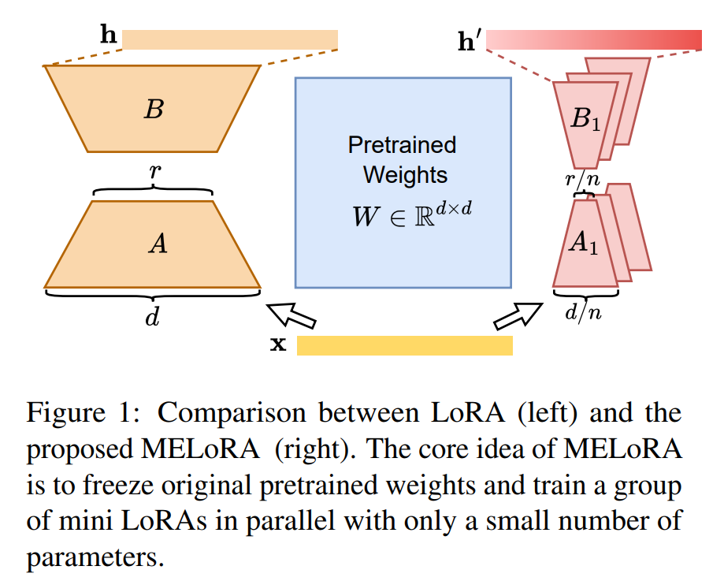
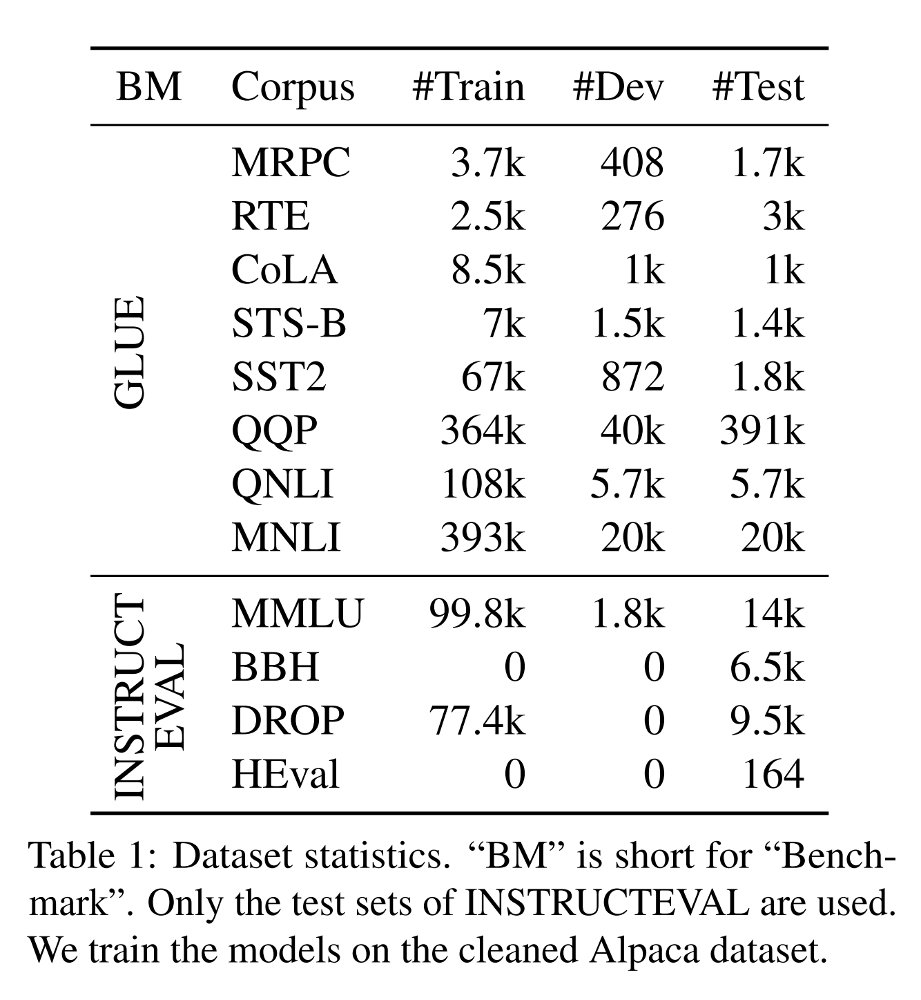
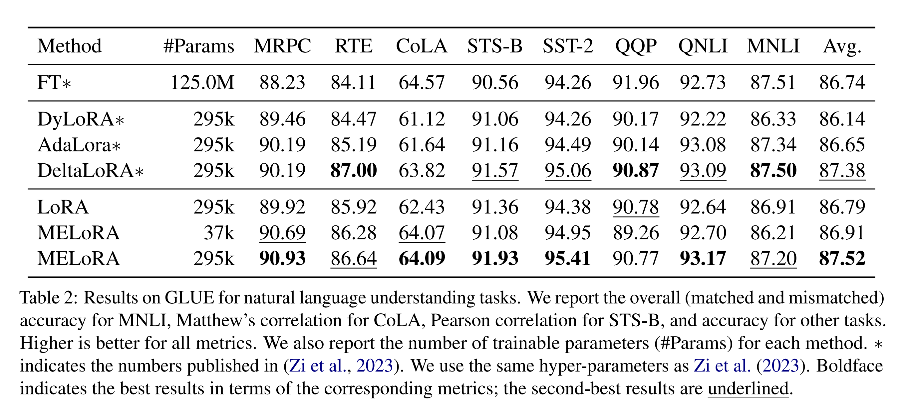
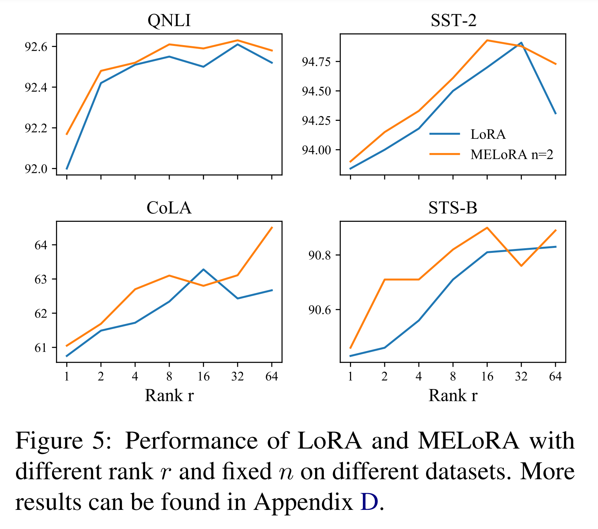

논문 및 이미지 출처 : <https://arxiv.org/pdf/2402.17263>

# Abstract

parameter-efficient fine-tuning(PEFT)은 pre-trained large language model(LLM)을 specific task 에 맞추는 데 있어 인기가 높은 방법이며, 특히 model scale 및 task deversity 증가함에 따라 그 중요성이 커지고 있다. 

low-rank adaptation(LoRA)은 adaptation process 이 본질적으로 low-dimensional 이란 아이디어에 기반하며, 즉 모델의 중요한 변화는 비교적 few parameters 로 표현될 수 있다는 것이다. 

그러나 rank 를 낮추면 all parameters 를 활용한 fine-tuning 과 비교했을 때 specific task 에서 generalization erro 가 발생할 수 있다. 

저자는 MELoRA 를 제안하는데, 이는 fewer trainable parameters 를 사용하면서도 high-rank 를 유지하여 성능 향상의 가능성을 제공하는 mini-ensemble low-rank adapter 이다. 

- 핵심 아이디어는 original pre-trained weights 를 고정하고, small parameters 만을 가진 multiple mini LoRA 를 학습하는 것이다. 
- 이는 mini LoRA 간의 다양성을 상당히 확보할 수 있어, better generalization ability 를 촉진할 수 있다. 

저자는 다양한 NLP task 에 대해 이론적 분석과 실험적 연구를 수행했다. 

실험 결과, MELoRA 는 NLU tasks 에서 LoRA 보다 8x fewer trainable parameters 로, instruction following tasks 에선 36x fewer trainable parameters 로 better performance 를 달성했음을 보여주며, MELoRA 의 효과를 입증했다.

# 1 Introduction

large language model(LLM)은 NLP 의 기본 패러다임으로 자리잡고 있다. 

fine-tuning(FT)은 specific downstream task 에 LLM 을 맞추는 일반적인 방법이다. 

그러나 model scale 및 task deversity 증가함에 따라, fully fine-tuning 은 비현실적으로 된다. 

parameter-efficient fine-tuning(PEFT)은 trainable parameters 를 줄여 memory requirements 를 완화하기 위해 제안되었다.

일반적으로 PEFT 방법의 핵심 아이디어는 adapter weights 및 prompt weights 같은 parameters 의 일부분만 업데이트하는 것이다.

low-rank adaptation(LoRA) 는 additional memory overhead 가 거의 없고 inference latency 가 없기 때문에 널리 사용되고 있다. 

- Fig. 1 (left) 처럼, LoRA 는 low-rank matrix $(A, B)$ 을 사용하여 pre-trained weights ($W$) 의 업데이트를 근사화한다. 
- rank 가 모델의 hidden dimension 보다 작기 때문에, LoRA 의 overall trainable parameters 수는 full fine-tuning 보다 훨씬 적다. 
- 상당한 계산적 이점에도 불구하고, low-rank approximation 은 full fine-tuning 과 비교할 때 performance gap 을 초래할 수 있다.

따라서 다음과 같은 중요한 과제가 제기된다: 어떻게 하면 계산적 이점을 유지하면서도 higher-rank variation 을 가능하게 할 수 있을까?

- rank 를 늘리면서도 more trainable parameters 를 도입하지 않기 위해, ReLoRA 와 COLA 는 pre-trained weights 에 multiple LoRA 를 추가한다. 
  - 이들은 이전 LoRA 를 pre-trained weights 에 병합하고 new LoRA 를 학습하면서 순차적으로 multiple LoRAs 를 쌓아간다. 
- 본질적으로, 이들은  multiple LoRAs 를 직렬로 학습하는 것이다. 
  - 그러나 LoRA modules 간에 중복이 발생할 수 있다. 
  - 따라서 이러한 방법에서 LoRA modules 의 직접 합을 사용해도 rank 가 반드시 증가한다고 보장할 수는 없다. 

본 연구에서는 단순하지만 효과적인 방법으로 multiple mini LoRAs 를 병렬로 쌓는 mini-ensemble low-rank adapter(MELoRA)를 제안하며, Fig. 1 (right)에 나타나 있다. 

- 저자는 MELoRA 가 additional parameters overhead 없이 higher-rank 를 보장한다는 것을 이론적으로 입증한다. 
- MELoRA 는 multiple mini LoRAs 를 동시적으로 diagonal 으로 연결하여 equivalent block diagonal LoRA matrix 를 구성한다.
- 각 mini LoRA 는 다른 것과 독립적이며 final rank 는 각 mini LoRA 의 rank 의 합이 된다. 
- 각 mini LoRA 의 rank 는 hidden state 의 different dimension 을 학습한다. 
- mini LoRA 의 trainable weights $A$ 와 $B$ 의 형태는 훨씬 얇아진다.

저자는 MELoRA 의 효능을 입증하기 위해 다양한 task 와 모델에 걸쳐 광범위한 실험을 수행했다. 

- RoBERTa-base 를 사용한 NLU task 와 Llama-2-7B 를 사용한 instruction following tasks 에서 평가를 수행했다. 
- 결과는 MELoRA 가 much fewer parameters 를 사용하면서도 우수한 성능을 달성함을 보여준다. 
- 예로, LoRA 의 trainable parameters 보다 36x fewer parameters 를 사용해도 MELoRA 는 all instruction following dataset 에서 LoRA 를 능가했다.

#### Contributions

- MELoRA 는 LoRA 의 위에 쌓아 higher-rank 와 better performance 를 fewer parameters 로 달성할 수 있게 하는 새로운 방법을 제안한다.
- MELoRA 는 LoRA 에 비해 higher-rank 와 유연성을 유지하면서도 복잡성을 낮춘다는 것을 이론적으로 입증했다.
- 광범위한 실험을 통해 MELoRA 가 parameters 수와 성능 면에서 LoRA 를 능가한다는 것을 보여준다.

# 2 Related Work

all parameters 를 사용하는 fine-tuning 은 모델 크기가 커지고 downstream task 이 늘어남에 따라 계산상의 어려움을 초래한다. 

이러한 문제를 해결하기 위해, 대부분의 pre-trained model parameters 는 그대로 두고, 일부 parameters 만 수정하는 parameter-efficient fine-tuning(PEFT)이 연구자들 사이에서 점점 더 많은 주목을 받고 있다. 

여러 연구들은 low inference overhead, memory efficiency, storage optimization 등의 핵심 요소를 논의한다. 

특히 LoRA 는 fine-tuning 과정에서 weights 업데이트를 근사화하기 위해 trainable low-rank matrix 을 도입한다. 

LoRA 는 구현이 간단하고 inference 중 latency 를 유발하지 않기 때문에 많은 분야에서 널리 사용된다. 

LoRA 의 기본 원칙을 확장한 여러 고급 기술들이 제안되었으며, 이러한 확장들은 크게 adaptive rank 와 cumtomized update 전략의 두 가지 범주로 나뉜다.

## 2.1 Adaptive Rank

일부 연구는 널리 사용되는 Low-Rank Adaptation (LoRA) 방법이 효과적이긴 하지만, fixed rank 를 사용하기 때문에 항상 최적이 아닐 수 있다고 주장한다. 

이들은 more important parameters 에 대해 higher-rank 를 사용하는 것이 효과적임을 강조한다. 

- AdaLoRA 는 singular value size 에 따라 rank 선택을 조정하는 adaptive approach 를 도입하며, 이는 individual singular value size 에 따라 rank 를 선택한다. 
- 결과적으로, 이 방법은 다양한 계층에서 서로 다른 rank 를 사용한다. 
- 마찬가지로, Ding et al. (2023a) 은 다른 rank 를 pruning 하는 데 도움을 주는 gate units 를 사용한다. 
- 이에 반해 Zhang et al. (2023a) 은 IncreLoRA 를 제안하며, 각 module 의 importance scores 에 따라 trainable parameters 를 training 중에 점진적으로 추가하는 adaptive parameters 할당 방법이다.

## 2.2 Customized Update Strategies

LoRA 를 개선하는 또 다른 방법은 parameters 업데이트 전략을 변경하는 것이다. 

일부 연구는 trainable parameters 수를 줄이는 데 집중하고 있다. 

- Kopiczko et al. (2023)은 all pre-trained weights 에 shared frozen random LoRA module 을 도입한다.
  - LoRA 의 $B$ 와 $A$ matrix 사이의 scaling factor 만을 학습해 trainable parameters 수를 줄인다. 
  - 이 접근법은 기존 LoRA 와 비교해 trainable parameters 수를 10x 줄인다. 
- Zhang et al. (2023b) 은 LoRA 내에서 $A$ matrix 을 고정해 trainable parameters 수를 절반으로 줄이는 방법을 제안하지만, 두 방법 모두 성능이 크게 저하되는 단점이 있다.
- QLoRA 는 4-bit 양자화를 활용해 LLM 을 효과적이고 효율적으로 fine-tuning 한다. 
- LoRAMoE 는 multiple LoRAs 를 adaptive expertise 로 사용하고 router 를 사용해 feedforward network layers 에서 이들을 gating 처리함으로써, fine-tuning data 가 LLM 에 저장된 world knowledge 를 방해할 수 있는 문제를 해결한다. 
- 다른 rank 설정에서 모델 inference 을 수행하기 위해, nested dropout 기술에서 영감을 얻어, Valipour et al. (2023)은 single training process 으로 multiple rank inference 을 가능하게 하는 dynamic parameters 업데이트 전략을 제안한다. 
- Delta-LoRA 은 low-rank matrix $A$ 와 $B$ 뿐만 아니라 two low-rank matrix $A$ 와 $B$ 의 product 의 delta 를 사용해 pre-trained weights $W$ 에도 학습을 전파한다.

계산상의 이점에도 불구하고, 현재까지 low-rank approximation 은 상당한 performance gap 을 초래한다. 

- 이러한 제한을 해결하기 위해, ReLoRA 와 COLA 는 trainable parameters 를 더 도입하지 않고도 LoRA 의 rank 를 늘리기 위해 pre-trained weights 에 multiple LoRAs 를 추가한다. 
- 이들은 이전 LoRA layers 를 pre-trained weights 에 점진적으로 병합하고, training 중에 new LoRA layers 를 쌓는다. 
- 그러나 training 중 rank 의 하한을 이론적으로 보장할 수 없다.

기존 연구와 달리, MeLoRA 는 multiple mini LoRA 를 diagonal parallel 연결해 block diagonal LoRA matrix 를 구성한다. 

이는 final rank 가 각 mini LoRA 의 rank 합이 되도록 보장한다.

# 3 Methodology

## 3.1 Preliminaries on Low-Rank Adapter

LoRA 는 weights 업데이트 $\Delta W$ 를 low-rank product $BA$ 로 분해한다. 

training 중, pre-trained weights $W$ 는 고정되어 gradient 업데이트를 받지 않으며, $A$ 와 $B$ 는 trainable parameters 를 포함한다. 

Eq. 1 에 나타나 있다:

$$
\begin{equation}
    h = W x + \Delta W x = W x + BAx,
\end{equation}
$$

- $W \in \mathbb{R}^{d×d}$, $A \in \mathbb{R}^{r×d}$, $B \in \mathbb{R}^{d×r}$, $x \in \mathbb{R}^{d}$ 및 $r \ll d$
- training stage 시작 시, $A$ 는 Gaussian initialization 을 통해 무작위로 초기화되고, $B$ 는 $BA = 0$ 이 되도록 zero matrix 로 초기화되어 점진적인 업데이트가 initialization 시 발생하지 않도록 한다.

## 3.2 Matrix Rank Theory

선형 대수에서, 여러 유용한 부등식이 matrix 의 rank 를 지배한다:

$$
\begin{equation}
    \mathcal{R}(M_1 + M_2) \leq \mathcal{R}(M_1) + \mathcal{R}(M_2),
\end{equation}
$$

$$
\begin{equation}
    \begin{aligned}
        \max(\mathcal{R}(M_1), &\mathcal{R}(M_2)) \\
        &\leq \mathcal{R}(\text{concat}(M_1, M_2)) \\
        &\leq \mathcal{R}(M_1) + \mathcal{R}(M_2),
    \end{aligned}
\end{equation}
$$

$$
\begin{equation}
    \mathcal{R}(\text{diag}_{i=0}^n M_i) = \sum_{i=1}^n \mathcal{R}(M_i),
\end{equation}
$$

- $\mathcal{R}(\cdot)$ : matrix rank 구하는 연산을 나타낸다. 
- Eq. 2 는 matrix 가 simple addition operations 를 거칠 때 하한이 없음을 보여준다. 
- Eq. 3 은 column vectors 가 linear correlations 를 보일 수 있기 때문에, concatenation 으로는 rank 가 증가하지 않음을 나타낸다. 
- 그러나 Eq. 4 에 따라, matrices 가 diagnoally concatenation 될 때, final rank 는 각 matrix 의 rank 의 합이 된다.

## 3.3 Mini-Ensemble Low-Rank Adapter

MELoRA 는 pre-trained weights 에 대해 $n$ mini LoRA 를 사용하며, 이는 Fig. 1 의 오른쪽에 나타나 있다. 

LoRA 와의 비교를 위해, 각 mini LoRA 의 rank 를 $r/n$ 으로 설정한다. 

MELoRA 는 different hidden dimensions 에 걸쳐 multiple mini LoRA 를 연결하여 다음과 같이 정의된다:

$$
\begin{equation}
    \begin{aligned}
        h &= W x + \Delta W x \\
        &= W x + (\text{concat}_{i=0}^{n} B_i A_i x_i) \\
        &= W x + (\text{diag}_{i=0}^{n} B_i A_i) x \\
        &= W x + (\text{diag}_{i=0}^{n} B_i) (\text{diag}_{i=0}^{n} A_i) x,
    \end{aligned}
\end{equation}
$$

- $A_i \in R^{r/n \times d/n}$, $B_i \in R^{d/n \times r/n}$, $x, h \in R^d$, $x_i \in R^{d/n}$ 는 $x$ 에서 분리된 feature 이며, 
- $n$ 은 연결에 사용되는 mini LoRA module 개수를 나타낸다. 
- Eq. 5 에서 도출된 바와 같이, MELoRA 는 일종의 sparse LoRA 로 간주될 수 있다. 
- Fig. 2 는 non-diagonal lines 로 $B_i$ 와 $A_i$ 에 zero 를 패딩하여 동등한 $B$ 및 $A$ matrix 를 얻는 과정을 보여준다. 
- Eq. 4 에 따르면, 동등한 $B$, $A$ 의 rank 는 각각의 $B_i$ 및 $A_i$ 의 rank 의 합이다.
- $\frac{r}{n} \ll d$ 이므로, 각각의 $B_i$ 와 $A_i$ 는 동일한 rank $\frac{r}{n}$ 을 가지며, 그 결과 동등한 rank 는 $n \times \frac{r}{n} = r$ 이다.

MELoRA 는 LoRA 와 동일한 초기화 방법을 사용하며, 각각의 $A_i$ 는 Gaussian initialization 을 거치고 $B_i$는 zero 로 초기화된다.

MELoRA 는 다음과 같은 세 가지 장점을 가진다:

1. **MELoRA 는 fewer parameters 로 higher-rank 를 유지한다.**
   - MELoRA 의 가장 두드러진 장점 중 하나는 fewer parameters 로 higher-rank 를 달성할 수 있다는 점이다. 
   - Sec. 3.2 에서 논의된 바와 같이, simple matrix 합 또는 concatenation 은 이들 사이에 잠재적인 중첩이 있을 경우 rank 를 본질적으로 증가시키지 않을 수 있다. 
   - MELoRA 에서는 $B_i$ 와 $A_i$ matrix 가 각각 n distinct columns 및 rows 가 배치되어 있어, $\text{diag}_{i=0}^{n} B_i$ 와 $\text{diag}_{i=0}^{n} A_i$ 의 rank 는 각각의 $B_i$ 와 $A_i$ 의 rank 의 합이다. 
   - Fig. 2 는 MELoRA 의 trainable parameter 수가 다음 표현식에 의해 결정됨을 보여준다: 
     - $n \times \left( \frac{d_{in}}{n} \times \frac{r}{n} + \frac{r}{n} \times \frac{d_{out}}{n} \right) = \frac{d_{out} \times r + r \times d_{in}}{n}$. 
   - same rank 를 달성할 때, LoRA 의 trainable parameter 수는 $d_{out} \times r + r \times d_{in}$ 이다. 
   - 중요한 점은, MELoRA 에서 trainable parameter 수가 LoRA 에 비해 $n$x 로 줄어들어, MELoRA 프레임워크 내에서 larger rank 를 fewer parameters 로 달성할 가능성이 있다는 것이다.
2. **MELoRA 는 more flexible rank 를 제공한다.**  
   - parameters 수의 변화 없이 rank 를 조정할 수 있는 능력은 MELoRA 의 또 다른 장점이다. 
   - 최근 dataset 에 따라 rank 의 변동이 모델 성능에 미치는 영향을 강조하고 있다. 
   - MELoRA 에서는 각 mini LoRA 의 rank $r$ 로 설정할 수도 있다. 
   - 따라서 $A \in R^{r \times \frac{d}{n}}$, $B \in R^{\frac{d}{n} \times r}$ 로 구성된 individual mini LoRA modules 이 있으며, trainable parameter 총 수는 $2 \times r \times d$ 이며, equivalent rank 는 $n \times r$ 로 표현된다. 
   - hyper-parameters $n$ 을 조정함으로써 overall parameters 수를 증가시키지 않고 equivalent rank 를 조절할 수 있다.
3. **MELoRA 는 lower complexity 를 가진다.**  
    - equal rank 조건에서 LoRA 와 MELoRA 의 complexity 를 비교할 수 있다. 
    - LoRA 에서 $A \in R^{r \times d}$, $B \in R^{d \times r}$, $A_i ∈ R^{\frac{r}{n} \times \frac{d}{n}}$, $B_i ∈ R^{\frac{d}{n} \times \frac{r}{n}}$, 및 $x \in R^d$ 일 때, LoRA 의 time complexity 는 $d^2 r + dr^2$ 인 반면, 
    - MELoRA 는 $n \left( \left( \frac{d}{n} \right)^2 \frac{r}{n} + \frac{d}{n} \left( \frac{r}{n} \right)^2 \right) = \frac{d^2 r + dr^2}{n^2}$ 이다. 
    - MELoRA 는 $n^2$x fewer operations 를 필요로 한다.

# 4 Experimental Setups

## 4.1 Baselines

MELoRA 를 LoRA 및 SOTA LoRA variants 와 비교한다:

- **LoRA**: two low-rank matrix 의 product 를 사용하여 GPU memory costs 를 줄이면서 incremental update 를 학습한다.
- **DyLoRA**: training 중 LoRA 모듈의 rank $r$ 을 랜덤하게 선택한다.
- **AdaLoRA**: incremental update 를 위한 optimal rank 를 결정하는 데 중점을 두며, 각각의 singular value size 에 따라 rank 선택을 조정하는 adaptive approach 를 사용한다. 따라서 different layers 에 대해 다른 rank 가 사용된다.
- **Delta-LoRA**: low-rank matrix $A$ 와 $B$를 update 할 뿐만 아니라, $A^{(t+1)}B^{(t+1)} − A^{(t)}B^{(t)}$ two low-rank matrix 의 product 의 delta 를 사용하여 pre-trained weights $W$ 에 학습을 전파한다.

공정한 비교를 위해, 이들의 설정을 따라 NLU 실험 결과를 재현한다.

## 4.2 Datasets

모델 성능 평가를 위해 two groups 의 dataset 을 사용한다: GLUE 와 INSTRUCTEVAL. 

통계치는 Tab. 1 에 나타나 있다.

GLUE 벤치마크는 NLU task 로, classification task, similarity, paraphrase tasks 및 NLI tasks 를 포함한다. 분류 작업, 유사성 및 패러프레이즈 작업, 자연어 inference 작업을 포함한다: MRPC, RTE, QQP, CoLA, STSB, SST-2, QNLI, MNLI

모델은 Alpaca dataset 으로 학습되고, INSTRUCTEVAL 에서 성능을 평가한다: MMLU, BBH, DROP 및 HumanEval (HEval)

## 4.3 Implementation Details

- 모든 실험에서 저자는 $W_Q$ 와 $W_V$ 만 fine0tuning 한다. 
- 모든 모델과 dataset 은 Huggingface 에서 다운로드. 
- 모든 모델은 NVIDIA A800 GPU 에서 fine-tuning 되었다. 
- 결과는 5 random seeds 의 평균을 사용한다.
- GLUE 벤치마크에서는 RoBERTa-base 를 backbone LLM 으로 사용했다. 
  - 공정한 비교를 위해, 학습 구성은 Zi et al. (2023) 에 따라 선택되었다. 
  - LoRA 와 variants 의 rank 8 로 설정했다. 
  - MELoRA 의 경우, 두 가지 설정으로 실험을 수행했다. 
    - 첫 번째로, 동일한 trainable parameters 수를 얻기 위해 MELoRA 에서 각 mini LoRA 의 rank 8 로 설정했다. 
    - 두 번째로, fewer trainable parameters 로 성능을 평가하기 위해, 각 mini LoRA 의 rank 1 으로 설정하여 실험을 진행했다. 
    - MELoRA 의 trainable parameters 수는 mini LoRA 의 rank 가 고정될 때 mini LoRA 의 수에 상관없이 일정하게 유지되므로, 저자는 parameters $n$ 을 {2, 4, 8} 의 집합에서 탐색하고 최고의 성능을 보고한다. 또한, Section 6.2 에서 $n$ 의 효과를 분석한다.
- INSTRUCTEVAL 벤치마크에서는 LLaMA-2-7B 를 backbone LLM 으로 사용하고, training dataset 으로 Alpaca 를 사용하며, 2k samples 를 무작위로 선택하여 dev set 으로 사용한다. 
  - INSTRUCTEVAL (Chia et al., 2023)을 따르며, MMLU 에 대해 5-shot direct prompting, BBH 와 DROP (dev)에 대해 3-shot direct prompting, HEval 에 대해 0-shot direct prompting 을 사용한다. 
  - training 중에는 AdamW 를 optimizer 로 사용하고, 모델을 3 epochs 동안 학습시킨다. 
  - 공정한 비교를 위해, epoch 수는 baseline 과 일치시킨다. 
  - linear learning rate schedule 을 적용하고, initial learning rate 는 $3 \times 10^{-4}$ 로 설정한다. 
  - batch size 는 128 로 설정했다. 
  - LoRA 의 rank 를 {8, 16, 32, 64, 128, 256}의 집합에서 탐색하고 최적의 성능을 보고한다. 
  - MELoRA 의 경우, rank $r$ 1 로 설정하고 mini LoRA 의 수 $n$ {8, 16, 32, 64} 의 집합에서 탐색하여 최적의 성능을 보고한다.

# 5 Results

## 5.1 Performance on GLUE

GLUE 의 모든 방법들의 결과는 Tab. 2 에 나와 있다. 

- MELoRA 가 동일한 parameter settings 하에서 7/8 GLUE dataset 에서 LoRA 보다 더 좋은 성능을 보여준다. 
- MELoRA 는 8x fewer parameters 를 사용하면서도 5/8 dataset 에서 better performance 를 달성하며, 이는 MELoRA 의 향상된 표현력과 higher-rank 를 보여준다. 
- 특히 MRPC, RTE, CoLA, SST-2 같이 training data 가 제한된 경우에서 큰 향상이 나타났다. 
- 그 이유는 MELoRA 가 multiple mini LoRA 를 연결하여 더 견고하고 generalization ability 이 향상된 것으로 생각된다. 
- MELoRA 는 또한 MNLI, QNLI, STS-B 와 같은 나머지 dataset 에서도 양호한 성능을 보여주며, MELoRA 가 다양한 설정에서 안정적이고 신뢰할 수 있음을 증명한다.

## 5.2 Performance on INSTRUCTEVAL

INSTRUCTEVAL 에서의 모든 방법들의 결과는 Tab. 3 에 나와 있다. 

- MELoRA 는 all tasks 에서 all baselines 보다 일관되게 better performance 를 보여주며, 36x fewer trainable parameters 수를 보여준다. 
- 이는 MeLoRA 가 instruction following task 에서 얼마나 효과적이고 효율적인지를 강조한다. 
- Sec. 3.3 에서 언급했듯이, MELoRA 가 fewer parameters 로 higher-rank 를 달성할 수 있기 때문이라고 생각된다.

# 6 Analysis

## 6.1 Analysis of Equivalent Rank

이 섹션에서는 equivalent rank 의 효과를 자세히 살펴본다. 

GLUE 에서는 4, 8, 16, 그리고 INSTRUCTEVAL 에서는 16, 32, 64 의 다양한 equivalent rank 에서 실험을 수행했다. 

결과는 각각 Tab. 4 와 Tab. 5 에 나와 있다.

결과에서 두 가지 관찰을 할 수 있다. 

1. MELoRA 는 all equivalent rank setting 에서 일관되게 우수하거나 유사한 성능을 달성한다. 
   - Tab. 4 와 Tab. 5 에서 MELoRA 는 2x fewer trainable parameters 를 사용하면서 대부분의 dataset 에서 최고의 성능을 보여준다. 
   - 이는 equivalent rank 가 trainable parameters 수보다 더 중요하다는 것을 의미한다. 
   - 이상적으로는 dataset 에 따라 optimal equivalent rank settings 을 탐색해야 하지만, 대부분의 경우 $n$ 을 2 로 설정하는 것이 좋은 선택이다. 
2. optimal equivalent rank 는 dataset 과 task 에 따라 다르다. 
   - GLUE 에서는 일반적으로 $n=2$ 일 때 최적의 성능을 달성하지만, INSTRUCTEVAL 에서는 $n$ 4 또는 8 로 높이는 것이 더 효과적이다. 
   - model size 와 task complexity 가 주요 요인이라고 생각된다.
     - 예로, 125M parameters 의 RoBERTa 모델은 Llama-2-7B 보다 상당히 작다. 
     - scaling laws (Kaplan et al., 2020) 에 따르면, Llama-2-7B 는 더 강력하다. 
     - 따라서 Llama-2-7B 와 같은 larger model 은 adaptation 을 위해 trainable parameters 의 상당한 증가가 필요하지 않을 수 있으며, 이는 MELoRA 가 larger model 에서 더 중요한 역할을 한다는 것을 시사한다.

MELoRA 가 LoRA 보다 higher-rank 업데이트를 수행하는지 확인하기 위해, LoRA 와 MELoRA 의 실제 rank 를 추정하기 위해 두 방법에서 0.1 을 초과하는 singular value 수를 분석했다. 

- Fig. 3 처럼, MELoRA 는 $n \times r$ setting 에서 LoRA 에 비해 현저히 더 많은 singular value 를 나타내며, 이는 MELoRA 가 multiple low-rank 업데이트를 수행하여 실제로 high-rank 업데이트를 달성했음을 시사한다.

## 6.2 Analysis of the Number of Mini LoRAs

Sec 3.3 에서 논의한 바와 같이, 각 mini LoRA 의 rank 를 고정하면 parameters 수는 변하지 않는다. 

따라서 $n$ 을 조정하여 equivalent rank 를 변경할 수 있지만, overall parameters 수를 증가시킬 필요는 없다. 

$n$ 의 효과를 분석하기 위해, $r$ 을 2 와 4 로 고정한 상태에서 4 datasets 를 대상으로 $n$ 을 변화시키며 실험을 진행했다. 결과는 Fig. 4 에 나와 있다.

결과에서 세 가지 관찰을 할 수 있다. 

1. optimal $n$ 은 dataset 에 따라 다르고, 심지어 동일한 dataset 에서도 $r$ 의 값에 따라 달라질 수 있다. 
   - 예로, $r$ 4 로 설정되었을 때 QNLI 와 SST-2 에서 optimal $n$ 은 4 였지만, CoLA 와 STSB 에서는 2 였다. 
   - 이 관찰은 specific task 이 모델의 동작에 중요한 영향을 미친다는 것을 시사한다. 
2. MELoRA 의 성능은 $r$ 의 값에 상관없이 $n$ 이 증가함에 따라 처음에는 향상되다가, 이후 감소하는 패턴을 보인다. 
   - 처음에는 $n$ 이 증가함에 따라 equivalent rank 가 높아져 성능에 유리하게 작용하지만, 지나치게 높은 equivalent rank 는 over-fitting 의 위험을 초래할 수 있다. 따라서 $n$이 너무 크면 성능이 떨어진다. 
3. 셋째, more training samples 를 가진 dataset 이나 small $r$ 경우 optimal $n$ 이 더 큰 경향이 있다. 
   - training samples 의 경우, 예를 들어 QNLI 와 SST-2 는 다른 dataset 에 비해 more training samples 를 가지고 있어 optimal $n$ 이 4 인 반면, 다른 dataset 에서는 2 였다. 
   - 이 현상은 training samples 의 풍부함을 효과적으로 활용하기 위해 higher equivalent rank 가 필요하다는 것으로 설명할 수 있다. 
   - $r$ 의 경우, SST-2 와 CoLA 에서 $r=2$일 때 최적의 $n$이 $r=4$ 일 때보다 더 크다. 
   - 이는 MELoRA 의 equivalent rank 가 $n \times r$ 로 나타나기 때문에, 특정 equivalent rank 를 달성하려면 $r$ 이 작을수록 $n$ 값이 더 커져야 하기 때문이다.

## 6.3 Analysis of the Rank of Mini LoRAs

$r$ 의 효과를 분석하기 위해, $n$ 을 1 과 2 로 고정한 상태에서 $r$을 변화시키며 4 datasets 에 대해 실험을 진행했다. 

$n$ 을 1 로 설정하면, MELoRA 는 LoRA 로 변환된다. 결과는 Fig. 5 에 나와 있다. 

- $r$ 이 증가함에 따라 성능은 처음에 향상되고 이후 안정화된다. 
- 이 관찰은 충분한 training data 가 있을 때, high-rank 와 more trainable parameters 가 성능 면에서 항상 선호된다는 것을 시사한다. 
- 그러나 high-rank 와 많은 trainable parameters 는 일반적으로 more training costs 를 의미한다. 
- MELoRA 는 all rank 설정에서 LoRA 보다 일관되게 better performance 를 보여준다. 이는 동일한 trainable parameters 수로도 MELoRA 가 더 강력하다는 것을 증명한다.

# 7 Conclusion

이 논문에서는 여러 mini LoRA 를 병렬로 쌓아 각 mini LoRA rank 가 hidden state 의 다양한 dimension 을 학습하는 새로운 parameter-efficient 인 fine-tuning 방법인 MELoRA 를 제안했다. 

MELoRA 가 more higher flexible rank 와 lower complexity 를 유지한다는 것을 이론적으로 증명했으며, 여러 dataset 에서 MELoRA 가 fewer trainable parameters 로 high-rank 와 better performance 를 달성한다는 것을 실증적으로 보여주었다.