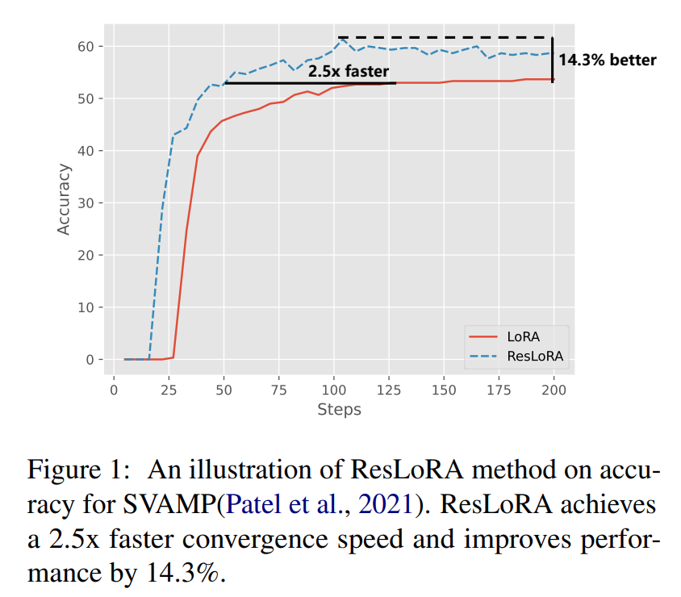
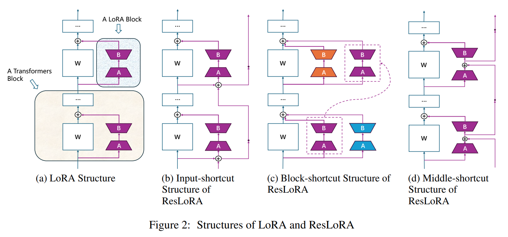
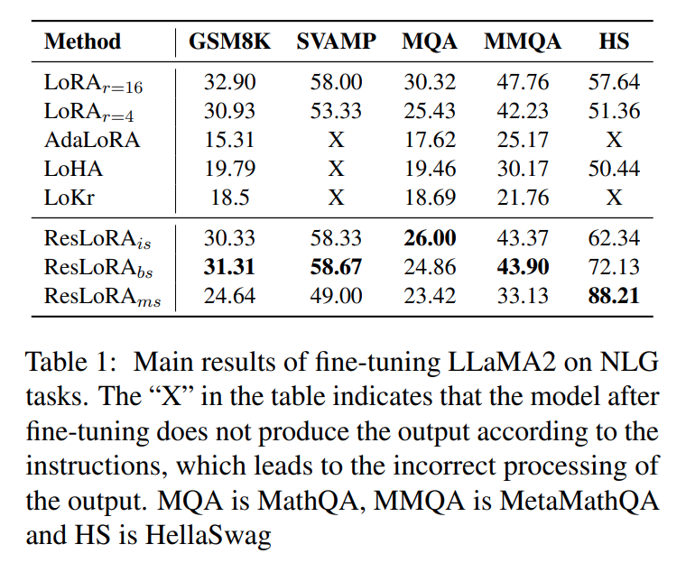
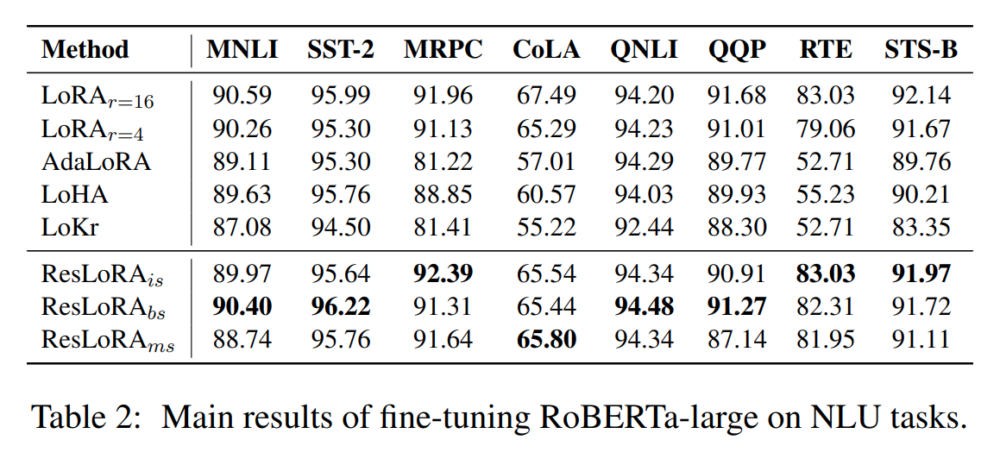
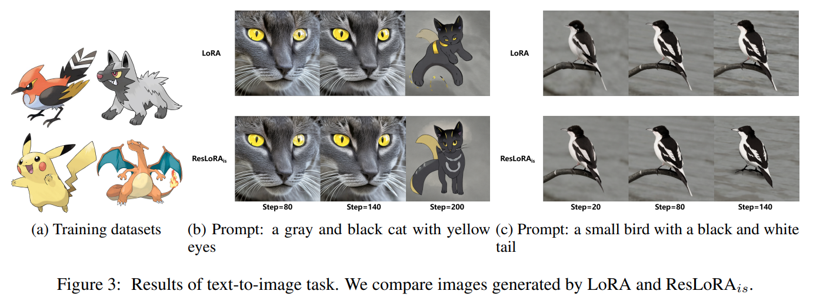
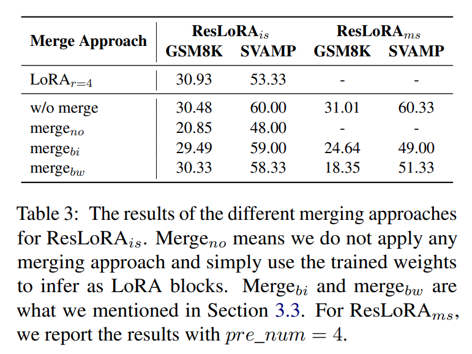
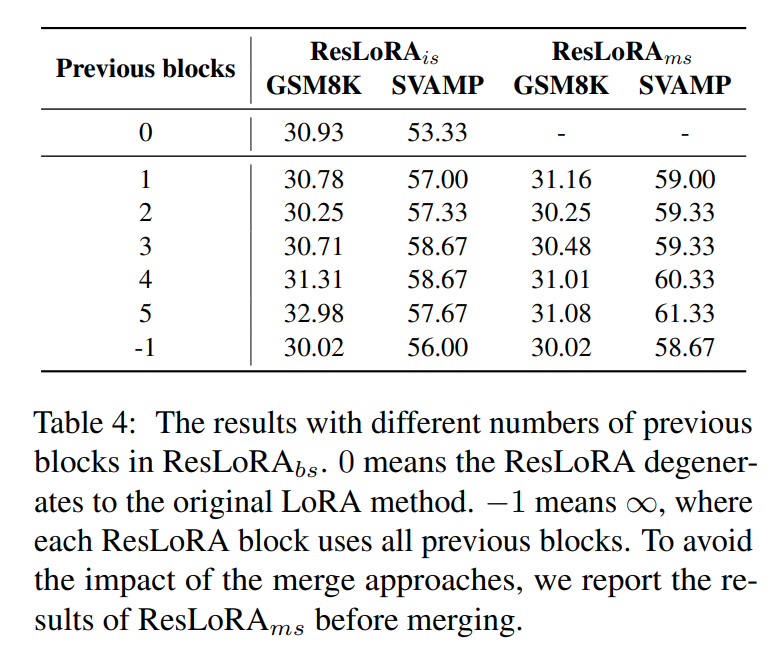
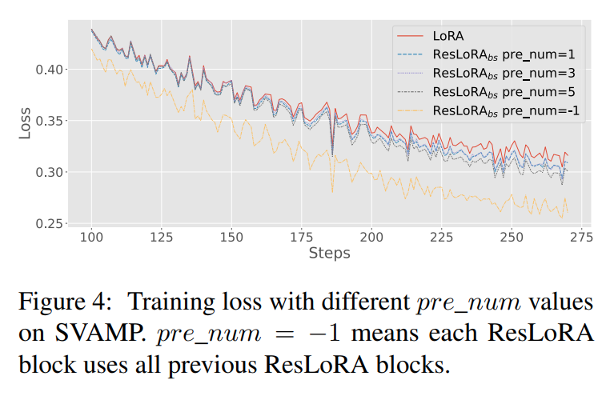
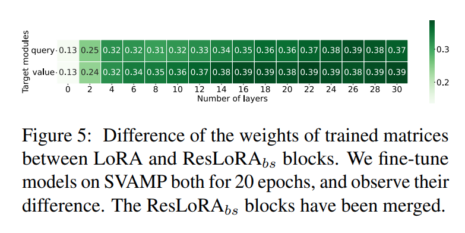

논문 및 이미지 출처 : <https://arxiv.org/pdf/2402.18039>

# Abstract

가장 널리 사용되는 parameter-efficient fine-tuning (PEFT) 방법 중 하나인 low-rank adaptation (LoRA) 는 large language models (LLMs) 를 finetune 하는 데 일반적으로 적용된다. 그러나, LoRA block 의 weight 를 효과적이고 신속하게 업데이트하는 것은 original model 의 long calculation path 로 인해 도전 과제가 된다. 

이를 해결하기 위해, 저자는 LoRA 의 개선된 프레임워크인 ResLoRA 를 제안한다. 

- training 중 residual path 를 추가하고, inference 시 이러한 extra path 를 제거하는 merging 방식을 사용함으로써, 저자의 방법은 LoRA 와 비교하여 extra trainable parameter 나 inference cost 없이 fewer training step 으로 더 나은 결과를 달성할 수 있다. 
- NLG, NLU, 그리고 text-to-image task 에서의 실험은 저자의 방법의 효과를 입증한다. 
- 저자가 알기로는, ResLoRA 는 residual path 와 LoRA 를 결합한 첫 번째 연구이다.

# 1. Introduction

최근 수년간, billions parameters 를 가진 large language models (LLMs) 는 다양한 작업에서 놀라운 성능을 보여주었다. 

특정 dataset 에 대해 LLMs 를 fine-tuning 하면 단순히 inference 시 prompt 에 instruction 을 제공하는 것보다 더 나은 성능을 얻을 수 있다. 그러나, 관련된 parameters 의 방대함 때문에 비용이 과도하게 발생하는 경우가 많다.

이 문제를 해결하기 위해 다양한 parameter-efficient fine-tuning (PEFT) 방법들이 제안되었다. PEFT 방법들은 original model 의 모든 parameters 를 고정하고, newly added modules 에서 일부 parameters 만 조정한다. 

이러한 방법 중에서 가장 널리 사용되는 것 중 하나가 low-rank adaptation (LoRA) 이다. LoRA 는 training 중에 few trainable parameters 를 가진 two matrices 를 original frozen linear layer 와 병렬로 사용하며, inference 시 이를 합친다. 

LoRA 는 병합 후 시간 및 계산 측면에서 추가 비용이 발생하지 않으며, 수학적으로도 효과가 입증되어 다양한 응용에서 사용되고 있다.

---

basic LoRA 에는 여전히 몇 가지 한계가 있다. 이전 연구들은 주로 model 의 다양한 layer 에서 LoRA module 의 rank 를 동적으로 조정하거나, original LoRA 방법과 유사한 효과를 얻기 위해 fewer trainable parameters 를 사용하는 데 중점을 두었다. 그러나, long backward path 가 LoRA block 에서 parameters updates 를 방해하는 잠재적 문제는 간과되었다.

ResNet 은 널리 효율적임이 입증된 대표적인 방법이며, Transformer model 에서 서로 다른 encoder 와 decoder block 사이에서도 사용된다. 이러한 block 의 linears 와 병렬로, LoRA block 도 original shortcut design 의 이점을 누릴 수 있다. 그러나 linears 와 달리, LoRA block 은 더 미세하다. 

하나의 LoRA block 은 single linear 에만 해당되므로, original shortcut 이 LoRA block 에 완벽히 적합하지 않다. 예를 들어 Transformer 의 encoder 를 살펴보자. 만약 query, key, 또는 value linears 에 LoRA block 을 추가한다면, 이전 gradient 는 backward 계산 시 output linear 와 Softmax function 을 반드시 거쳐야 하므로 gradient vanishing 또는 explosion 이 발생할 수 있다.

---

본 논문에서는 ResNet 의 shortcut 을 LoRA block 에 병합한 새로운 프레임워크인 ResLoRA 를 제안한다. 

다양한 residual structures 의 효율성을 검증하기 위해 세 가지 residual 구조를 제안하고, 다양한 모델과 작업에서 실험을 수행한다. 그러나, shortcut 은 비평면 구조로 인해 original network 에 직접 병합될 수 없어 LoRA 의 장점을 약화시킬 수 있다.

이를 고려하여, ResLoRA 를 original LoRA block 으로 변환할 수 있는 다양한 병합 방식을 논의하고, 이를 통해 inference 시 여전히 original module 에 병합될 수 있도록 한다. 

merging 후, 본 방법은 extra parameters 나 계산 복잡도를 도입하지 않는다. 

LoRA 와 비교했을 때, ResLoRA 는 추가 parameters 를 사용하지 않으면서도 추론 시 성능이 1% 에서 20% 까지 개선되었으며, training 중 loss 도 lower 및 faster convergence 하였다. 

또한, 본 방법은 basic LoRA 방법뿐만 아니라 LoRA 의 다른 변형에도 쉽게 적용 가능하다. 

마지막으로, 다양한 실험에서 결과의 강건성을 평가하고, 본 방법이 성능 향상을 얻을 수 있는 이유를 분석한다.

저자가 아는 한, ResLoRA 는 residual path 와 LoRA 방법을 결합한 최초의 연구이다. ResLoRA 의 효과는 Fig. 1 에 나와 있다.

#### main contribution

- **ResLoRA 프레임워크 제안**: LoRA 를 개선하는 새로운 프레임워크를 제안한다. original 방법과 비교하여 residual path 를 사용하여 training stage 에서 loss 감소 속도를 가속화하고, test dataset 에서 유의미한 성능 개선을 달성할 수 있다.
- **ResLoRA 병합 접근법 탐구**: ResLoRA 를 LoRA block 으로 변환하고, 이를 original linear 에 병합하여 inference stage 에서 비용을 추가하지 않는 병합 접근법을 제안한다. 이러한 병합 접근법 덕분에 ResLoRA 는 LoRA 방법의 다른 변형에도 쉽게 적용 가능하다.
- **다양한 모델과 작업에서 평가**: 다양한 모델과 작업에서 결과를 평가하여 개선의 강건성을 검증하고, 본 방법이 성능을 향상시키는 이유를 분석한다.

# 2. Related Works

#### Parameter-efficient fine-tuning (PEFT)

PEFT 연구는 크게 세 가지 유형으로 나뉜다. 

- 첫 번째 연구(e.g., Lester et al., 2021; Liu et al., 2023) 에서는 input sequence 에 special trainable vector 를 추가하여 input 의 길이를 늘리는 방법이다. 그러나, 이는 full-finetune 과 비교했을 때 결과에서 차이가 발생한다. 
- 두 번째 연구는 Adapter (Houlsby et al., 2019; Zhang et al., 2023b,b) 로 불리는 serialized modules 를 original modules 에 추가하여 training 및 inference stage 에서 사용한다. 
- 반면, LoRA (Hu et al., 2022) 방법은 training stage 에서 original linear layer 와 병렬로 새로운 low-rank matrix 를 추가하고, inference stage 에서 이를 original model 에 병합하므로 inference 시 추가 비용이 발생하지 않는다.

#### Low-rank training method (LoRA)

LoRA 에 관한 최근 연구는 lower cost 와 더 나은 성능을 달성하는 데 초점을 맞추고 있다. 

- 일부 연구는 DyLoRA, ReLoRA, LoHA, LoKr 와 같이 더 유연하고 적절한 rank 를 탐구한다. 
- AdaLoRA 는 LoRA block 의 중요도에 따라 서로 다른 layer 에 rank 를 동적으로 할당하는 방법을 설계하여 중요하지 않은 LoRA block 의 rank 를 줄일 수 있다. 
- 다른 연구는 AdaMix, QLoRA 와 같이 LoRA 와 다른 접근법을 결합하는 데 중점을 둔다. 
- 또한, LoRAHub 과 LoRAMoE 는 각각 다른 작업에서 fine-tune 된 여러 LoRA block 을 병합하는 방법에 중점을 둔다. 그러나, gradient propagation 의 잠재적 장애물에 초점을 맞춘 연구는 없었다.

#### Residual Network (ResNet)

ResNet 은 He et al. (2016a) 와 이전 연구(Srivastava et al., 2015) 에서 처음 소개되었다. 

이 연구는 gradient vanishing 또는 explosion 문제를 해결하고, gradient update 과정에서 수치적 안정성을 향상시켰다. 

extra shortcut path 가 extra computational cost 을 요구하기 때문에 일부 연구 (Ding et al., 2021) 는 inference stage 에서 이러한 경로를 제거하려는 시도를 했다. 

이러한 연구에서 영감을 받아, 저자는 ResNet 의 주요 아이디어를 LoRA 로 확장하여 더 빠르고 안정적인 training 단계를 달성하고, 동시에 LoRA 의 평면 구조를 유지하도록 설계된 병합 방법을 고안하여 LoRA 와 ResNet 의 장점을 동시에 유지한다.

# 3. Method

이 섹션에서는 두 가지 주요 부분으로 구성된 저자의 프레임워크를 소개한다. (1) **ResLoRA blocks** 는 LoRA blocks 에 다양한 residual paths 를 추가하며, 주로 training stage 에서 사용된다. (2) **Merging approaches** 는 residual paths 를 제거하여 ResLoRA blocks 를 LoRA blocks 로 변환하며, 주로 inference stage 에서 사용된다.

## 3.1 LoRA Blocks

저자는 LoRA 방법을 다시 살펴보는 것으로 시작한다. 

pre-trained model 의 linear layer 의 original matrix $W_n \in \mathbb{R}^{p \times q}$ 에 대해, $p$ 와 $q$ 는 각각 output 과 input 의 dimension 을 나타낸다. 

original equation 은 다음과 같이 쓸 수 있다: $h_n = W_nx_n$, 여기서 $x$ 는 input vector 를, $h$ 는 output hidden vector 를, $n$ 은 layer 의 index 를 나타낸다. 

LoRA block 은 original matrix 와 병렬로 additional block 으로 정의된다. 

LoRA block 은 down-projection $A \in \mathbb{R}^{r \times p}$ 와 up-projection $B \in \mathbb{R}^{q \times r}$ 라는 two new matrices 를 포함하며, 이는 high-rank matrix 를 low-rank matrix 로 분해하는 것을 목표로 한다.

- Training 동안 $W$ 는 freeze 되고 $A$ 와 $B$ 의 weight 만 업데이트된다. 
- Inference 동안 additional parameters 는 $W_n + B_nA_n$ 로 original parameters 에 병합되어 latency 가 발생하지 않도록 한다. 따라서 LoRA 방법은 다음과 같이 표현할 수 있다:

$$
\begin{equation}
    h_n = W_nx_n + B_nA_nx_n
\end{equation}
$$

Fig. 2a 는 LoRA blocks 의 구조를 보여준다. 

$r \ll \min(p, q)$ 이기 때문에, trainable parameters 의 수는 full fine-tuning 에 비해 크게 줄어든다.

## 3.2 ResLoRA Blocks

ResNet 에서 영감을 받아, 저자는 residual paths 를 저자의 방법에 도입했다.

다양한 구조와 메커니즘의 영향을 고려하여, 세 가지 유형의 block 을 설계하고 구현하였다. 

각각 input-shortcut (is), block-shortcut (bs), middle-shortcut (ms) 라고 한다. 

Fig. 2 는 각 유형의 구체적인 구조를 보여준다.

#### Input-shortcut structure

Input-shortcut structure 는 서로 다른 LoRA blocks 의 input vector 사이에 직접 shortcut 을 사용하는 것을 의미한다. 

구체적으로, 이전 LoRA block 의 input vector 를 현재 LoRA block 의 input vector 에 추가한다.

이 구현은 이전 input vector 를 현재 input vector 에 추가하는 original ResNet 에서 영감을 받았다. 그러나 ResNet 의 forward path 와는 달리, LoRA block 의 input 을 output 에 단순히 추가하지는 않는다. 이는 이 identity 가 LoRA blocks 의 forward path 뿐만 아니라 original linear layer 의 forward path 에도 영향을 미치기 때문이다. 

이러한 단순한 설계는 forward 단계에서 loss 값이 너무 커져 gradient 를 계산할 수 없게 되어 LoRA blocks 를 학습할 수 없게 한다. 이를 피하기 위해 저자는 LoRA blocks 간의 shortcut 만 사용한다. 따라서 input-shortcut 유형의 ResLoRA 를 사용하는 linear layer 의 output 은 다음과 같이 표현된다:

$$
\begin{equation}
    h_n = W_nx_n + B_nA_n(x_n + x_{n-1})
\end{equation}
$$

여기서 $n \in [1, L]$, $L$ 은 original model 의 layer 수를 나타낸다. 

$n = 0$ 인 경우, first layer 와 이후 layer 간의 동일한 크기 순서를 유지하기 위해 $x_{n-1} = x_n$ 으로 설정한다. 

이 유형의 전체 구조는 Fig. 2b 에서 볼 수 있다.

#### Block-shortcut Structure

Block-shortcut structure 는 input vector 가 아니라 LoRA blocks 의 weights 에 shortcut 을 추가하는 구조를 의미한다. 

Input-shortcut 구조가 residual path 의 아이디어를 구현했지만, extra forward path 는 ResLoRA blocks 를 original LoRA blocks 로 직접 변환할 수 없게 만들며, 이는 merging approaches 가 필요해져 성능 저하를 초래할 수 있다. 

LoRA 방법과 residual network 의 장점을 동시에 얻기 위해, 저자는 DenseNet 구조 와 유사한 block-shortcut 구조를 설계했다. 

현재 layer 의 input vector 에 대해, 현재 LoRA block 과 여러 이전 LoRA blocks 를 동시에 계산에 참여시킨다. 

이 forward path 는 input 에 extra forward path 를 더하지 않지만, gradient 를 middle layers 를 건너뛰어 직접 전송할 수 있게 하며, backward 계산에서 발생할 수 있는 장애물을 줄일 수 있다. 

이 구조의 output 은 다음과 같이 표현된다:

$$
\begin{equation}
    h_n = W_nx_n + \left( \sum_{k=0}^m B_{n-k}A_{n-k} \right)x_n
\end{equation}
$$

여기서 $m \in [1, L]$ 은 사용할 이전 LoRA blocks 의 수를 나타낸다. 

구체적인 구현에서, 저자는 $m$ 을 제어하기 위해 hyper-parameter `pre_num` 을 설정한다. 

또한, 각 layer 에 대해 $m = \min(m, n - 1)$ 로 설정하여 out-of-index errors 를 방지한다. 

$m$ 의 값이 다르면 다른 결과를 생성하며, 세부 사항은 Sec. 4.5 에서 제시된다. 

이 유형의 전체 구조는 Fig. 2c 에 나타나 있다.

#### Middle-shortcut Structure

Middle-shortcut structure 는 LoRA blocks 의 intermediate 결과에 shortcut 을 추가하는 구조를 의미한다. 

LoRA blocks 는 two matrices $A$ 와 $B$ 를 포함하며, $A$ 는 항상 $B$ 보다 input vector 에 더 가깝다. 

Transformer blocks 간의 기존 shortcut 덕분에, $A$ matrix 는 이러한 shortcuts 의 이점을 받을 가능성이 더 크며, gradient propagation 문제를 겪을 가능성이 적다. 따라서 저자는 $B$ matrix 가 shortcut 의 이점을 받을 수 있도록 새로운 구조를 시도한다. 

각 layer 에 대해, middle-shortcut 구조는 $A$ matrix 의 수정은 무시하고, $B$ matrix 의 shortcut 에 초점을 맞춘다. 

즉, 이전 $A$ matrix 의 output vectors 를 현재 $A$ matrix 의 output vector 에 추가한 다음, 합산된 값을 현재 $B$ matrix 로 전달한다. 이를 요약하면 다음과 같이 표현할 수 있다:

$$
\begin{equation}
    h_n = W_nx_n + B_n\left(\sum_{k=0}^m A_{n-k}x_{n-k}\right)
\end{equation}
$$

Block-shortcut 구조와 유사하게, 이 구조도 $m$ 의 값을 제어하기 위해 hyper-parameter `pre_num` 을 사용한다. 

이 유형의 전체 구조는 Fig. 2d 에 나타나 있다.

다양한 구조 유형은 input vector, LoRA blocks 의 weights, middle vector 에 shortcut 을 추가하여 최적의 구조를 찾으려 한다. 

이러한 구조의 주요 아이디어는 ResNet 과 동일하며, backward steps 에서 통과하는 modules 의 수를 줄이기 위해 shortcut 을 사용하는 것이다. 

이후 섹션에서는 다음과 같은 명명 규칙을 사용한다:

- ResLoRA$_{is}$ : Input-shortcut 유형의 ResLoRA.
- ResLoRA$_{bs}$ : Block-shortcut 유형의 ResLoRA.
- ResLoRA$_{ms}$ : Middle-shortcut 유형의 ResLoRA.

## 3.3 Merging Approaches

additional shortcut 은 ResLoRA 에 이점을 가져오지만, 몇 가지 문제가 존재한다. 

가장 중요한 문제 중 하나는 **no-plain structure** 이 생성된다는 점이다. 

저자가 plain structure 라고 부르는 original LoRA block 은 linear layer 에 직접적으로 병합될 수 있다. 이는 LoRA 가 original layer 와 independent extra forward path 를 요구하지 않기 때문이다. 

다시 말해, LoRA block 의 forward path 는 original linear layers 와 유사하다. 그러나 ResLoRA 는 다른 레이어의 ResLoRA block  간에 additional shortcut 을 사용하며, 이는 original forward path 와 동일하지 않다. 

따라서, ResLoRA block 을 LoRA block 으로 변환하기 위한 merging approaches 를 설계할 필요가 있다.

_어떻게 변환할 수 있을까?_ **block-shortcut structure** 의 경우, 현재 ResLoRA block 은 이전 ResLoRA block 의 weights 만 필요로 하며, extra forward path 가 없기 때문에 쉽게 병합할 수 있다. 

이 경우 ResLoRA 는 다음과 같이 병합된다:

$$
\begin{equation}
    W^*_n = W_n + \sum_{k=0}^m A_{n-k}B_{n-k}
\end{equation}
$$

여기서 $W^*_n$ 은 inference 중 merging 이후의 linear layer weights 를 나타낸다. 

그러나 나머지 두 구조의 경우, 직접적인 병합은 불가능하다. 이는 현재 ResLoRA block 이 이전 레이어에서 input vector 를 요구하며, extra forward path 를 생성하고 original linear layers 와 다르기 때문이다.

$x_{n-1} = \alpha x_n$ 이라고 표현할 수 있다고 가정하자, 여기서 $\alpha$ 는 scaling factor 를 나타낸다. 

previous input vectors 는 current input vector 로 쉽게 변환될 수 있으며, ResLoRA block 은 LoRA block 으로 변환될 수 있다. 

different $x_{n-1}$ 에 대해, $x_{n-1} = \alpha x_n$ 를 만족하는 different $\alpha$ 가 존재하므로, 정확한 $\alpha$ 를 얻을 수 없다. 저자의 목표는 $x_{n-1} \approx \alpha^*x_n$ 를 만족하는 $\alpha^*$ 를 찾는 것이다.

예로, block-shortcut structure 의 경우 다음 공식을 유도할 수 있다:

$$
\begin{equation}
    \begin{aligned}
        h_n &= W_nx_n + B_nA_n(x_n + x_{n-1}) \\
        &\approx W_nx_n + B_nA_n(x_n + \alpha^*x_n) \\
        &= W_nx_n + (1 + \alpha^*)B_nA_nx_n
    \end{aligned}
\end{equation}
$$

따라서, 현재 linear layer 의 new weights 는 다음과 같이 표현될 수 있다:

$$
\begin{equation}
    W^*_n = W_n + (1 + \alpha^*)B_nA_n
\end{equation}
$$

$\alpha^*$ 의 precision 는 model inference 에 매우 중요하다. 

이 요소는 model merging 이 올바르게 이루어지는지를 직접적으로 결정하기 때문이다. 

Frobenius norm 은 일반적으로 행렬의 크기를 측정할 수 있는 가장 일반적인 matrix norms 중 하나이므로 (Ford, 2014), 저자는 Frobenius norm 을 사용하여 $\alpha^*$ 값을 추정하기 위한 두 가지 접근법을 설계했다.

#### Merge Based on Input

하나의 접근법은 $x_n$ 과 $x_{n-1}$ 에 기반하여 $\alpha^*$ 를 직접 계산하는 것이다. training stage 에는, 각 layer 에 대해 가장 최근의 input vector $x_n$ 을 수집하기 위해 sliding window 를 사용한다. 

그 후 inference stage 에서, all input vectors 의 Frobenius norms 을 계산하고, 각 sliding window 에서 Frobenius norms 의 평균을 구한다. 여기서 $f_n$ 은 $n$-th layer 에서 Frobenius norms 의 평균을 나타낸다. 

이 값을 input vectors 의 크기를 나타내는 수치로 간주하며, 이 수학적 관계는 다음과 같이 표현될 수 있다:

$$
\begin{equation}
    \frac{x_n}{f_n} \approx \frac{x_{n-1}}{f_{n-1}}
\end{equation}
$$

이를 기반으로, $\alpha^*$ 는 다음과 같이 계산할 수 있다:

$$
\begin{equation}
    \alpha^* = \frac{f_{n-1}}{f_n}
\end{equation}
$$

#### Merge Based on Weights of ResLoRA Blocks

다른 접근법으로는 input vectors 대신 previous ResLoRA block 의 weights 에 기반하여 $\alpha^*$ 를 계산하는 것이다. 

만약 $x_{n-1}$ 과 $h_{n-2}$ 간의 functions 차이를 근사할 수 있다면, $h_{n-2}$ 를 $x_{n-1}$ 의 크기 순서에 대한 표현으로 간주할 수 있다. 

더 나아가 input vectors 의 영향을 무시하고 weights 의 영향에만 집중한다면, 이전 weights 의 Frobenius norms 를 $x_{n-1}$ 의 크기 순서를 나타내는 지표로 사용할 수 있다. 

여기서 $f^*_{n-2}$ 는 merging 후에 linear layer 에 해당하는 $W^*_{n-1}$ 의 weights Frobenius norms 를 나타낸다. 

따라서, $x_n$ 과 $x_{n-1}$ 사이의 관계는 다음과 같이 표현될 수 있다:

$$
\begin{equation}
    \frac{x_n}{x_{n-1}} \approx \frac{f^*_{n-1}}{f^*_{n-2}}
\end{equation}
$$

이를 기반으로 $\alpha^*$ 는 다음과 같이 계산할 수 있다:

$$
\begin{equation}
    \alpha^* = \frac{f^*_{n-2}}{f^*_{n-1}}
\end{equation}
$$

ResLoRA$_{ms}$ 에 대해서는 이러한 merging approaches 를 새로운 구조에 맞게 단순히 수정한다. 

input 기반 merge 를 위해, $\alpha^*$ 를 다음과 같이 계산한다:

$$
\begin{equation}
    \alpha^* = \sum_{k=1}^m \alpha^*_{n-k}
\end{equation}
$$

여기서 $\alpha^*_{n-k} = f_{n-k}/f_n$ 및 $f_n$ 은 $A_n x_n$ 의 weight 의 Frobenius norms 을 의미한다.

previous ResLoRA block 의 weights 에 기반한 병합의 경우, 동일한 방식으로 $\alpha$ 를 계산하고 $A$ 를 다음과 같이 병합한다:

$$
\begin{equation}
    A^*_n = A_n + \sum_{k=1}^m \alpha^*_{n-k} A_{n-k}
\end{equation}
$$

여기서 $A^*_n$ 은 merging 후 $A$ 를 나타내고, $\alpha_{n-1}$ 은 $f_{n-1}/f_n$ 을 나타낸다.

이러한 접근법을 사용함으로써 ResLoRA block 은 LoRA block 으로 변환될 수 있으며, 이는 inference stage 에서 latency 이 발생하지 않음을 의미한다. 

이후에서는 input 기반 merging 병합을 merge$_{bi}$, ResLoRA block 의 weights 에 기반한 병합을 merge$_{bw}$ 로 지칭한다.

## 3.4 Mathematics Analyse

저자의 방법이 직관적으로 backward pass 에서의 잠재적인 문제를 해결하고 model training process 을 가속화할 수 있지만, 이를 수학적으로 증명할 수 있을까? 

단순화를 위해 input-shortcut structure 를 예로 들어 설명한다. 

specific input $x$ 에 대해, $n$ 이 layer 의 index 를 나타낼 때, $B_{n-2}$ 의 weight 를 update 하려면 gradient 를 다음과 같이 계산할 수 있다:

$$
\begin{equation}
    \begin{aligned}
        \frac{\partial \mathcal{L}}{\partial B_{n-2}} =
        \frac{\partial \mathcal{L}}{\partial h_n}
        \frac{\partial h_n}{\partial x_{n-1}}
        \frac{\partial x_{n-1}}{\partial B_{n-2}}
    \end{aligned}
\end{equation}
$$

여기서 $\mathcal{L}$ 은 해당 input 에 대한 loss function 의 값이다. 

LoRA blocks 의 경우, sub-equation 은 다음과 같다:

$$
\begin{equation}
    \begin{aligned}
        \frac{\partial h_n}{\partial x_{n-1}} &= \frac{\partial h_n}{\partial x_n} \frac{\partial x_n}{\partial x_{n-1}} \\
        &= \frac{\partial (W_n x_n + B_n A_n x_n)}{\partial x_n}\frac{\partial x_n}{\partial x_{n-1}}
    \end{aligned}
\end{equation}
$$

그러나 ResLoRA 의 input-shortcut structure 에서는 sub-equation 이 다음과 같다:

$$
\begin{equation}
    \begin{aligned}
        \frac{\partial h_n}{\partial x_{n-1}} &= \frac{\partial h_n}{\partial x_n} \frac{\partial x_n}{\partial x_{n-1}} \\
        &= \frac{\partial (W_n x_n + B_n A_n x_n)}{\partial x_n} \frac{\partial x_n}{\partial x_{n-1}} \\
        &+ \frac{\partial (B_n A_n x_{n-1})}{\partial x_{n-1}}
    \end{aligned}
\end{equation}
$$

Eq.  16 과 Eq.  15 를 비교해 보면, Eq.  16 의 추가 항 앞에는 어떠한 factor 도 존재하지 않기 때문에, gradient 는 $\frac{\partial x_n}{\partial x_{n-1}}$ 에서 발생할 수 있는 vanishing 혹은 explosion 문제를 피할 수 있다. 

따라서 training stage 는 ResLoRA blocks 로부터 이점을 얻을 수 있다.

# 4. Experiments

## 4.1 Experimental Setup

ResLoRA 의 효과를 평가하기 위해 natural language generation (NLG), natural language understanding (NLU), image generation 등 다양한 model 과 task 에서 실험을 수행한다. 

각각의 task 에 대한 세부 내용은 다음 섹션에서 설명한다. 

## 4.2 Natural Language Generating

#### Models and Datasets.

LoRA 가 최근 주로 LLMs 에 사용되고 있다는 점을 고려하여, ResLoRA 실험을 위해 인기 있는 오픈소스 LLM 인 LLaMA2-7B 를 NLG 모델로 선택했다. 

수학적 및 상식적 추론 태스크를 포함한 5 가지 태스크에서 실험을 진행했으며, 이는 LLMs 의 일반적 능력을 평가하기 위한 주요 벤치마크이다. 

#### Main Results.

저자의 방법을 다양한 baseline 방법들과 비교했다. Tab. 1 은 태스크와 방법별 결과를 보여준다.  

- LoRA ($r=16$) 은 all tasks 에서 LoRA ($r=4$) 대비 유의미한 성능 향상을 보이며, 이는 higher rank 값이 이러한 tasks 에서 효과적임을 의미한다.
- Baseline 방법 중, original LoRA 방법이 가장 좋은 성능을 보였는데, 이는 LoRA 의 변형 방법들이 여러 hyper-parameter 를 도입했기 때문일 수 있다.
- LoRA 와 비교했을 때, ResLoRA$_{is}$ 와 ResLoRA$_{bs}$ 는 거의 all tasks 에서 더 나은 성능을 보였다.
  - 예를 들어, ResLoRA 세 가지 타입 모두 HellaSwag task 에서 더 높은 정확도를 달성했으며, 각각 LoRA 대비 10.98%, 20.77%, 36.85% 의 향상을 보였다.

## 4.3 Natural Language Understanding

#### Models and Datasets.

제안된 방법을 RoBERTa-large 와 함께 General Language Understanding Evaluation (GLUE) 벤치마크에서 평가한다. 

model 및 dataset 은 Hu et al. (2022) 과 동일하다.

RoBERTa 는 BERT 를 개선한 경쟁력 있는 pre-trained model 이다. 

GLUE 는 다양한 유형의 태스크를 포함하며, model 의 NLU 능력을 평가하기 위해 널리 사용된다.

#### Main Results.

Tab. 2 는 NLU tasks 의 결과를 보여준다. 결론은 NLG tasks 와 유사하다.

- LoRA ($r=16$) 은 all tasks 에서 LoRA ($r=4$) 대비 유의미한 개선을 보이며, LoRA ($r=4$) 는 all baseline 방법 중 가장 좋은 결과를 보였다.
- Baseline 방법과 비교했을 때, 제안된 방법은 거의 all tasks 에서 유의미한 성능 향상을 보였다. 
- WNLI 를 제외한 all tasks 에서 다양한 수준의 성능 향상을 확인할 수 있었다. 
- 이 실험은 NLU 태스크에 대한 제안된 방법의 일반적 적용 가능성을 입증한다.

## 4.4 Text to Image

#### Models and Datasets.

제안된 방법의 일반화를 검증하기 위해 multi-modal tasks 에서도 실험을 수행했다. 

text-to-image task 를 선택했으며, input texts 에 기반해 적절한 이미지를 생성하는 것이 목표이다. 

모델로는 인기 있는 Stable-Diffusion-v2 를 사용했으며, 이는 가장 널리 사용되는 image generation models 중 하나이다.

dataset 은 Pinkney (2022) 를 선택했으며, 이는 cartoon style 의 이미지를 포함한다. 

model 은 original style 과 크게 다른 이 cartoon style 을 학습하는 것이 목표이다.

#### Main Results.

Fig. 3 은 text-image task 의 결과를 보여준다. 

- LoRA 와 ResLoRA$_{is}$ 를 각각 사용해 trained image 를 생성하고, 훈련 과정에서 이미지를 저장했다. 
- 두 그룹의 image 모두 ResLoRA$_{is}$ 가 이후 단계에서 더 적절한 이미지를 생성하는 것이 분명하다.
- Fig. 3b 에서 ResLoRA$_{is}$ 의 200-step 결과는 이미 다리, 꼬리, 옷을 가진 생생한 만화 고양이를 보여주는 반면, 같은 단계의 LoRA 결과는 여전히 불완전한 캐릭터이다.
- Fig. 3c 에서 ResLoRA$_{is}$ 의 140-step 결과는 이미 Pokemon style 로 변환되었지만, LoRA 의 결과는 여전히 현실적인 새로 남아 목표와 부합하지 않는다.  

결론적으로, ResLoRA$_{is}$ 는 이 태스크에서 더 나은 결과와 빠른 훈련 과정을 보여준다.

## 4.5 Ablation Studies

#### Merge Approach.

Sec. 3.3 에서 ResLoRA block 을 LoRA block 으로 변환하여 inference stage 에서 extra cost 를 피하기 위한 두 가지 merge 접근법을 제안했다. 그러나 제안된 접근법은 불가피하게 정확도 저하를 초래한다. 그럼에도 불구하고, 저자의 접근법은 LoRA 및 기타 변형보다 높은 정확도를 달성한다.

Tab. 3 은 merge 이전의 원래 정확도와 merge 이후의 결과를 보여준다.

- merge 이전의 결과와 merge 접근법이 없는 경우의 결과 간의 큰 차이는 merge 접근법이 ResLoRA 에 필수적임을 확인시켜 준다. 
- 이는 training stage 에서 additional residual path 가 도입되어 training 과 inference 간에 차이가 발생하기 때문이다.
- ResLoRA$_{is}$ 의 경우 두 접근법의 계산이 다름에도 불구하고 결과는 유사하다. 
- 저자의 두 merge 접근법 모두 merge 이전 결과와 비교했을 때 약 1% 의 정확도 저하가 있었으며, merge 접근법이 없는 결과와 비교했을 때 약 10% 의 정확도 향상을 보였다. 그러나 ResLoRA$_{ms}$ 의 경우 merge 여부에 따라 큰 차이가 발생한다. 
- 이는 이전 블록이 더 많이 포함될수록 오류 누적이 증가하고 merge 가 더 어려워지기 때문일 수 있다. 따라서 merge 접근법을 계속해서 개선하는 것은 가치가 있다. 
- 두 가지 수정된 접근법 중에서 merge$_{bw}$ 는 merge$_{bi}$ 보다 더 나쁜 결과를 보였다. 

#### The Number of Previous ResLoRA Blocks.

ResLoRA$_{bs}$ 와 ResLoRA$_{ms}$ 에서는 인접한 이전 블록 하나뿐만 아니라 여러 블록을 사용하여 결과를 계산하려고 한다.

다양한 이전 블록 수의 효과를 검증하기 위해 Tab. 4 에서 결과를 비교했다.

- 테이블에서 알 수 있듯이, `pre_num` 의 값은 결과에 큰 영향을 미친다. 
- 값이 너무 크거나 작으면 유해하며, 적절한 `pre_num` 값에서 최상의 결과가 발생한다.  
- 또한, 더 많은 이전 블록을 통합하는 것이 작동 가능함을 보여준다. 이는 training 중에 더 많은 잠재적 장애물이 건너뛰어지기 때문이다.
- ResLoRA$_{ms}$ 의 결과는 ResLoRA$_{bs}$ 의 결과와 유사하다.

## 4.6 Analysis

#### Extra residual paths accelerate training.

Sec. 3.4 에서 논의된 것처럼, extra residual paths 는 training speed 를 높이고 모델의 적합성을 향상시킬 수 있다. 이 결론이 실제로 맞는지 확인하기 위해 loss curves 을 수집했다.  

Fig. 4 는 LoRA 와 ResLoRA$_{bs}$ 를 서로 다른 `pre_num` 값으로 훈련했을 때의 loss 변화를 보여준다. 여기서 `pre_num` 은 이전 ResLoRA block 의 수를 나타낸다.  

- LoRA 방법은 `pre_num = 0` 인 ResLoRA$_{bs}$ 로 간주할 수 있다. 
- 결과적으로, LoRA 방법은 가장 큰 loss 를 가지며, `pre_num = -1` 인 ResLoRA 가 가장 작은 loss 를 가진다. 
- 또한, `pre_num` 값이 증가함에 따라 loss 는 더 빠르게 감소하고, 최종적으로 더 낮은 값에 도달한다.

#### Extra residual paths produce more complex weights of LoRA matrices.

Sec. 3.4 의 수학적 추론에서 훈련 시 더 빠른 수렴이 증명되었지만, 정확도가 높은 이유는 여전히 명확하지 않다. 이를 설명하기 위해, 충분히 fine-tuning 된 후 모델의 가중치를 저장하고, 두 방법의 훈련된 행렬 차이를 비교했다. 결과는 Fig. 5 에 나타나 있다.  

- large matrices 의 높은 계산 복잡성을 고려하여, Frobenius norm 을 사용해 복잡성을 측정했다. 
- 그림에서 각 LoRA block 의 F-norm 을 합쳐진 ResLoRA$_{bs}$ block 의 F-norm 과 뺀 차이를 히트맵으로 나타냈다.
- ResLoRA block 은 LoRA block 보다 더 큰 절대값 요소를 포함하고 있음을 알 수 있다. 이는 ResLoRA 를 사용했을 때 블록이 더 충분히 학습될 수 있음을 암시한다.
- 이 점이 ResLoRA 의 더 나은 성능의 이유 중 하나일 수 있다.

# 5. Conclusion

저자는 low-rank adaptation (LoRA) 을 위한 새로운 개선된 프레임워크 ResLoRA 를 개발했다. 

ResLoRA 는 training 중 residual paths 를 추가하고, inference 시 이러한 paths 를 제거하기 위해 merging approaches 를 사용한다. 

extra trainable parameters 없이 ResLoRA 는 기존 LoRA 및 다른 baseline 방법에 비해 fewer training steps 에서 더 나은 결과를 얻을 수 있다. 

저자는 세 가지 유형의 ResLoRA 구조를 NLG, NLU, text-to-image 작업에 대해 실험했으며, 대부분의 작업에서의 결과는 저자의 방법의 효과를 입증한다.

### Limitations

이 섹션에서는 저자의 방법의 몇 가지 한계를 논의하고, 향후 연구를 위한 몇 가지 제안을 제공한다.

1. **높은 훈련 비용**  
   extra trainable parameters 를 추가하지 않더라도, 저자의 방법의 훈련 비용은 standard LoRA 보다 높다. ResLoRA 는 하나의 블록에서 계산할 때 이전 블록들을 사용해야 하기 때문이다. 사용되는 이전 블록이 많을수록 비용이 더 높아진다. 따라서 훈련 비용과 성능 간의 균형을 맞추는 것이 중요하다.

2. **inference 시 손실 없는 merging 부재**  
   inference 중 저자는 extra residual paths 를 제거하기 위해 merging approaches 를 적용한다. 그러나 저자가 제안한 merging approaches 중 어느 것도 손실 없는 merging 을 달성하지 못하며, 이는 모델의 최종 성능에 영향을 미친다. 더 효율적인 merging 방법을 설계하는 것이 바람직하다.

3. **다른 방법들과의 통합 가능성**  
   저자의 작업은 residual paths 와 LoRA 를 결합한 첫 번째 연구다. 이전에 Zhang et al. (2023a), Dettmers et al. (2023), Lialin et al. (2023) 과 같은 많은 가치 있는 연구들이 제안되었다. ResLoRA 와 다른 방법들 간에는 근본적인 충돌이 없으므로, 이 방법들을 통합하는 것이 가능하다. 저자는 이러한 통합을 향후 연구 과제로 남겨둔다.