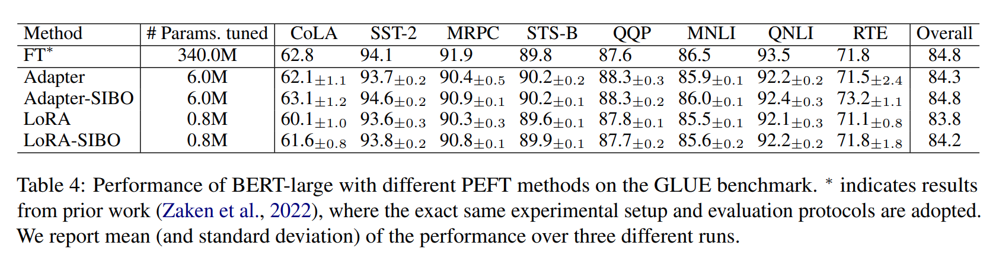
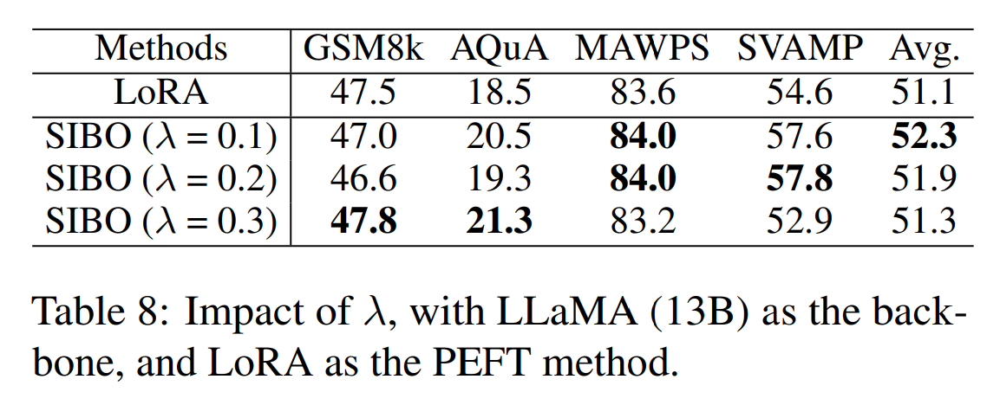

논문 및 이미지 출처 : <https://arxiv.org/pdf/2402.11896>

# Abstract

대규모 언어 모델(LLMs)의 모든 파라미터를 미세 조정(fine-tuning)하려면 상당한 계산 능력과 긴 시간이 필요하다. Adapter tuning 및 LoRA 와 같은 최신 parameter-efficient fine-tuning (PEFT) 기술의 발전은 이러한 LLM 의 파라미터 중 일부만 조정할 수 있도록 한다. 

동시에, over-smoothing 문제는 이러한 Transformer-based LLM 의 효과를 감소시켜 downstream tasks 에서 성능이 최적화되지 못하는 결과를 초래한다는 점이 지적되어 왔다. 

본 논문에서는 initial residual 을 주입하여 PEFT 를 강화하는 **SIBO** (SImple BOoster) 를 제안한다. 

- SIBO 는 간단하고 최신 PEFT 기술에 쉽게 확장 가능하며, over-smoothing 을 완화하고 성능을 향상시킨다. 
- 22 benchmark dataset 에서의 광범위한 실험은 SIBO 가 다양한 강력한 baseline 의 성능을 크게 향상시킴을 보여주었으며, 기존 PEFT 방법에 비해 산술 추론 및 상식 추론 과제에서 각각 최대 15.7% 및 23.5% 의 성능 향상을 달성했다.

# 1. Introduction

많은 Transformer-based large language models (LLMs) 은 상당한 깊이를 가지고 있다. 

예를 들어, BERT-large 는 24 layer 를 가지고 있으며, LLaMA-7B 는 32 layer, LLaMA-65B 는 80 layer 를 가지고 있다. 그러나 이러한 깊이는 도전 과제를 제시한다: Deep Transformers 는 over-smoothing 문제에 직면하는 경향이 있다. 

Brunner et al. (2019) 에서 자세히 설명된 바와 같이, 이 문제는 Transformers 의 deeper layer 에서 나타나며, token representation 이 점점 더 균일성으로 수렴하게 된다. 

Over-smoothness 는 Transformer training 의 확장성, 특히 depth 측면에서 방해가 될 뿐만 아니라, model size 를 확장하는 효과를 제한한다. 그 결과, 모델을 확장하면 종종 성능 향상이 미미하거나, 경우에 따라 정확도가 감소하기도 한다.

한편, LLMs 의 full-model fine-tuning 의 주요 단점은 original model 의 모든 파라미터를 업데이트해야 한다는 점이다. 이는 BERT-large 나 RoBERTa-large 와 같은 모델에서는 비교적 작은 제한 사항이지만, billions 의 trainable parameters 를 포함하는 LLaMA 와 같은 larger model 에서는 주요 장애물로 발전한다. 

많은 접근법들이 이 문제를 해결하기 위해 파라미터의 일부만 업데이트하거나 new tasks 에 맞춘 lightweight external modules 를 추가하는 방법을 탐구해왔다. 

이러한 전략들은 각 task 마다 pre-trained model 과 함께 상대적으로 적은 수의 task 별 파라미터를 저장하고 로드해야 한다. full-model fine-tuning 에 대한 이러한 매력적인 대안들은 parameter-efficient fine-tuning (PEFT) 이라고 불리며 (Houlsby et al., 2019), LLMs 배포의 실현 가능성을 크게 향상시킨다.

몇몇 접근법들이 over-smoothing 문제를 다루기 위해 제안되었지만, 예를 들어 "uniform tokens" 을 피하기 위해 특별히 설계된 regularization 을 추가하거나, all layers 의 reprensetation 을 융합하는 방법 등이 있지만, PEFT 방법을 통해 over-smoothing 문제를 완화하려는 방법은 아직 제안되지 않았다. 

대부분의 사용 사례에서 모델에 대한 내부 수정이 불가능한 LLMs 시대에, PEFT 기술을 통해 over-smoothing 문제를 해결하는 것은 매우 중요하다.

#### Challenge and present work.

over-smoothing 에 대한 기존의 해결책은 model architecture 의 변경을 포함하며, 따라서 parameter-efficient 하지 않기 때문에, PEFT 기술을 효과적으로 해결할 수 있는 방법은 무엇일까? 

over-smoothing 문제에 기여할 수 있는 두 가지 주요 요인은 다음과 같다: 1) model encoding layer 내의 redundancy, 2) deeper layer 의 효과적인 최적화를 방해하는 suboptimal training process. 

첫 번째 문제를 해결하기 위한 직관적이고 논리적인 해결책은 encoder 의 layer 수를 줄이는 것이다. 그러나 이 접근법은 성능 저하를 초래할 수 있다. 

두 번째 문제를 해결하기 위해, 이전의 접근법들 (Gong et al., 2021; Zhou et al., 2021; Shi et al., 2022) 은 parameter-efficient 하지 않아서 LLMs 에의 적용이 제한적이었다.

기존의 PEFT 기술과 함께 over-smoothing 을 완화하기 위한 유연하면서도 간단한 plug-and-play framework 를 고안하기 위해, 저자의 아이디어는 PEFT input 에 initial residual 을 주입하는 것이다. 

이 initial residual connection 은 각 token 의 final reprensetation 이 최소한의 input layer 의 feature 를 유지하도록 보장하여, final token representation 의 균일성을 줄이는 것을 목표로 한다. 

저자는 이 새로운 프레임워크를 SIBO, 즉 _SI_mple _BO_oster 라고 명명했으며, 이는 특히 Adapter 와 LoRA 에 설계된 PEFT 기술을 향상시키기 위한 것이다. 

실증적으로, 산술 추론 과제에서 SIBO 는 Adapter 와 LoRA 를 각각 최대 15.7% 와 13.6% 향상시켰다. 상식 추론 과제에서는 Adapter 대비 최대 7.6%, LoRA 대비 23.5% 향상을 보였다.

# 2. Preliminaries

다음에서는 두 가지 인기 있는 PEFT 기술의 요약을 제시한다: adapters 와 reparametrization-based methods.

#### Adapters.

Adapters 는 parallel adapters 와 serial adapters 라는 두 가지 뚜렷한 범주로 나뉜다. 

Parallel adapters 는 core model 의 다양한 layer 옆에 additional learnable module 을 통합한다. 

반대로, serial adapters 는 Transformer model 의 특정 layer 사이에 이러한 module 을 순차적으로 삽입한다. 

예를 들어, Transformer model 의 attention 및 feed forward layers 후에 fully connected networks 을 추가하는 것이다. 본 연구에서는 다음과 같은 일반적인 형식을 가진 고전적인 serial adapter 에 초점을 맞춘다:

$$
\begin{equation}
    h \leftarrow h + f(hW_{down})W_{up},
\end{equation}
$$

여기서 $h \in \mathbb{R}^{1 \times d}$ 는 adapter 이 삽입되기 전의 앞선 layer 의 output 을 나타낸다. 따라서 $h$ 는 adapter 의 input 으로 사용된다. 

이는 먼저 $W_{down} \in \mathbb{R}^{d \times r}$ 을 통해 lower dimension $r$ 로 down-projection 된 후, $W_{up} \in \mathbb{R}^{r \times d}$ 을 통해 original dimension $d$ 로 up-projection 된다. 

function $f(\cdot)$ 는 non-linear function 을 나타낸다.

#### Reparameterization-based methods.

이러한 방법들은 low-rank 전략을 통해 network weights 를 수정하도록 설계되었다. 

이 기술은 성능을 저해하지 않으면서 tunable parameters 의 수를 효과적으로 줄인다. 예를 들어, Low-Rank Adaptation (LoRA) 은 pre-trained weight matrix $W \in \mathbb{R}^{d \times d}$ 에 대한 update $\Delta W$ 를 low-rank decomposition 을 통해 근사한다:

$$
\begin{equation}
    h \leftarrow h(W + s \cdot W_{down}W_{up}),
\end{equation}
$$

여기서 $h \in \mathbb{R}^d$ 는 앞선 layer 의 output 이며, $W \in \mathbb{R}^{d \times d}$ 는 MLP 또는 attention layers 에 해당하는 pre-trained weight matrix 이다. 

matrices $W_{down} \in \mathbb{R}^{d \times r}$ 및 $W_{up} \in \mathbb{R}^{r \times d}$ 는 업데이트를 근사하기 위한 low rank matrices 이며, 즉 $\Delta W \approx W_{down}W_{up}$ 이다. 

여기서 $r \ll d$ 는 LoRA 에 중요한 hyperparameter 이며, scalar $s \geq 1$ 는 adjustable hyperparameter 이다.

# 3. Methodology

이 섹션에서는 먼저 PEFT 기술에서의 over-smoothing 문제를 분석하고, 그 다음으로 제안된 프레임워크인 SIBO 를 제시한다.

## 3.1 Over-smoothing in PEFT

graph neural networks 에서 유래된 _over-smoothing_ 용어는 반복적인 aggregation layers 에서 동일한 adjacency matrix 를 사용하는 것에서 비롯된 node reprensetation 의 homogeneity 증가로 인한 성능 저하를 의미한다. 

Shi et al. (2022) 는 language model 에서도 over-smoothing 현상이 나타남을 확인했는데, 이는 input sentence 의 different tokens 가 more layers 가 쌓일수록 점점 더 유사한 reprensetation 을 가지게 되어, deep Transformer model 의 효과를 감소시킨다.

몇몇 전략들이 over-smoothing 을 완화하기 위해 제안되었지만, 이들은 PEFT 기술을 위해 설계되지 않아 LLMs 에의 적용이 덜 실용적이다. 

특히, 저자는 adapters 와 LoRA 를 포함한 널리 채택된 PEFT 기술에서도, 특히 deeper layer 에서 over-smoothing 을 관찰했다. 

저자의 분석에서, over-smoothing 은 같은 문장 내 tokens 간의 유사성을 평가하는 token-wise cosine similarity 를 통해 감지할 수 있다. $m$ tokens 로 구성된 sentence $(h_1, h_2, \dots, h_m)$ 에 대해, token-wise cosine similarity 는 다음과 같이 계산된다:

$$
\begin{equation}
    \frac{1}{m(m - 1)} \sum_{i \neq j} \frac{h_i^\top h_j}{\|h_i\|_2 \|h_j\|_2},
\end{equation}
$$

여기서 $\|\cdot\|_2$ 는 Euclidean norm 이다. 

Fig. 1 과 Fig. 2 에서 볼 수 있듯이, adapters 와 LoRA 모두에서 backbone language model 의 layer depth 가 증가함에 따라 token-wise similarity 가 꾸준히 증가한다. 

따라서, over-smoothing 문제는 PEFT 기술을 통해 adaptation 된 pre-trained language models 에서도 지속된다. 따라서 PEFT methods 의 over-smoothing 을 완화하면서도 효율성을 유지하는 일반적인 프레임워크를 고안하는 것이 필수적이다.

## 3.2 Initial residual integration

PEFT 을 위한 범용 plug-and-play 향상을 달성하기 위해, 저자는 PEFT module 의 입력부터 시작하여 pre-trained model 의 각 layer input 에 initial residual 을 주입한다.

pre-trained model 의 입력으로 작용하는 initial token reprensetation 을 $h_0 \in \mathbb{R}^d$ 로 나타낸다. 

$h_0$ 에서 initial residual 을 통합함으로써, 각 token 의 final reprensetation 이 input layer 의 information 중 적어도 $\lambda$ 부분을 보존하도록 보장한다. 

여기서 $0 < \lambda < 1$ 은 여러 레이어가 관여할 때 중요한 요소이다. 

실질적으로, 저자는 $\lambda$ 를 hyperparameter 로 취급하며, 0.2 와 같은 합리적인 값으로 설정함으로써, final token reprensetation 이 input token feature 의 상당 부분을 통합하여 layer 전반에 걸쳐 over-smoothness 를 줄이도록 한다. 

Appendix A 에서 이론적 분석을 제시한다. 다음으로, 저자가 제안한 프레임워크인 SIBO 가 Adapter 와 LoRA, 두 가지 가장 인기 있는 PEFT 기술에 어떻게 적용될 수 있는지를 설명한다.

#### Adapter-SIBO.

Adapter 에 initial residual 주입을 구현하는 것은 간단하다. 

Fig. 3(a) 에서와 같이, SIBO 는 Transformer layer 내의 adapter 의 입구 지점 (즉, 앞선 layer 의 output 과 adapter 의 input) 에 initial token reprensetation $h_0$ 를 hidden state $h$ 에 추가한다. 

이 과정은 다음과 같은 기본적인 vector addition 연산을 통해 실행된다:

$$
\begin{equation}
    \begin{aligned}
        h \leftarrow &\tilde{h} + f(\tilde{h} W_{down})W_{up} \\
        &\text{s.t. } \tilde{h} = (1 - \lambda)h + \lambda h_0,
    \end{aligned}
\end{equation}
$$

여기서 $0 < \lambda < 1$ 은 initial residual 의 강도를 조절하는 hyperparameter 이다.

#### LoRA-SIBO.

각 Transformer layer 의 각 LoRA module 에서, update $\Delta W$ 의 input 은 앞선 layer 의 hidden state $h$ 만을 사용하며, $\Delta W$ 는 low-rank matrices 으로 근사된다. 

LoRA-SIBO 에서는 $\Delta W$ 의 input 에 대한 수정을 도입하여, 이는 다음과 같이 $h$ 와 $h_0$ 의 조합이 된다:

$$
\begin{equation}
    \begin{aligned}
        h \leftarrow &hW + s \cdot \tilde{h} W_{down}W_{up} \\
        &\text{s.t. } \tilde{h} = (1 - \lambda)h + \lambda h_0.
    \end{aligned}
\end{equation}
$$

# 4. Experiments

## 4.1 Datasets

저자의 연구는 다음과 같이 세 가지 구별된 문제 영역으로 분류된 22 benchmark dataset 에 대한 철저한 실증적 검사를 포함한다.

#### Arithmetic reasoning.

1. GSM8K: 숙련된 문제 작성자가 만든 언어적으로 다양한 초등학교 수학 단어 문제.
2. AQuA: 자연어 설명이 포함된 대수 단어 문제.
3. MAWPS: 다양한 복잡성을 가진 산술 및 대수 단어 문제.
4. SVAMP: 기존 문제 세트를 약간 수정하여 만든 4학년까지의 학생을 대상으로 한 산술 단어 문제.

PEFT 기술은 supervised fine-tuning (SFT) 설정을 채택하며, 여기서 감독은 GSM8K, AQuA, MAWPS 의 training sets 를 포함하는 Math10K 에서 파생된다. pre-trained model 은 Math10K 의 예제를 통해 그들의 스타일과 특성을 복제하도록 fine-tuning 된다.

#### Commonsense reasoning.

1. BoolQ: 자연스럽고 제한되지 않은 환경에서 유래한 Yes/No 질문.
2. PIQA: 두 가지 가능한 해답을 해결하기 위해 물리적 상식이 필요한 질문.
3. SIQA: 인간 행동의 사회적 함의를 이해하는 데 중점을 둔 질문.
4. HellaSwag: 주어진 맥락을 완성하기 위한 다양한 결말을 가진 상식적 자연어 추론 질문.
5. WinoGrande: 적절한 옵션을 선택하기 위해 상식적 추론이 필요한 이진 선택형 빈칸 채우기 과제.
6. ARC-c 및 ARC-e: 다중 선택 형식의 실제 초등학교 수준 과학 질문을 포함하는 ARC 데이터셋의 Challenge 및 Easy 세트.
7. OBQA: 다단계 추론, 추가적인 상식 및 일반 상식 지식, 그리고 포괄적인 텍스트 이해를 필요로 하는 질문.

SFT 를 수행하기 위해, 저자는 상식적 추론 능력을 향상시키기 위해 맞춤화된 Commonsense170K 라는 training sets 를 사용한다. 이는 위의 여덟 상식적 추론 데이터셋의 training sets 를 포함한다. 

산술 및 상식적 추론에 대한 데이터셋 요약은 Tab. 1 에 제시되어 있다.

#### GLUE.

General Language Understanding Evaluation Benchmark 는 다양한 natural language understanding tasks 를 위한 8 corpus 를 포함한다: CoLA, SST-2, MRPC, STS-B, QQP, MNLI, QNLI, 그리고 RTE.

## 4.2 Implementations

#### Arithmetic and commonsense reasoning.

저자는 natural language generation tasks 를 위해 설계된 foundational models 로 LLaMA (7B, 13B) 와 GPT-J (6B) 를 사용한다. 

저자는 baselines 로 Adapter 와 LoRA 를 선택하고, experimental setup 과 hyperparameters 에 대해서는 이전 연구 (Hu et al., 2023) 를 따랐다. 

특히, Adapter 에 대해서는 bottleneck size 가 256 인 feed-forward layers 에 통합하였고; LoRA 에 대해서는 multi-head attention 과 feedforward layers 에 rank 32 로 통합하였다. 

Adapter-SIBO 와 LoRA-SIBO 에 대해서는, initial residual 을 feed-forward layers 의 modules 에만 주입하고, vanilla Adapter 와 LoRA 에서 다른 설정을 유지하면서 $\lambda \in \{0.1, 0.2, 0.3\}$ 을 경험적으로 선택하였다. experimental setup 에 대한 더 자세한 내용은 Appendix D 에서 확인할 수 있다.

#### GLUE.

저자는 backbone 으로 BERT-large 를 사용한다. 최근에 더 큰 모델들이 GLUE benchmark 에서 BERT 를 능가했지만, BERT 는 그 효율성 때문에 계속 선호되고 있다. 

더욱이, BERT 에 대한 full-model finetuning (FT) 은 비교적 용이하여, FT 와 PEFT 기술 간의 직접적인 비교가 가능하다. 

Adapter 에 대해서는, multi-head attention 과 feed-forward layers 후에 adapter layers 를 추가하는 typical setting 을 적용하였고; LoRA 에 대해서는, 이전 연구를 따르며, weights $W_q$ 와 $W_v$ 에 rank 8 로 적용하였다. 

Adapter-SIBO 에 대해서는, self-attention layers 후의 adapter modules 에 initial residual 을 주입하였고; LoRA-SIBO 에 대해서는, 모든 LoRA modules 에 initial residual 을 주입하였다. 

두 SIBO 접근법 모두에 대해서는, 다른 hyperparameters 를 설정하기 위해 이전 연구를 따르면서 $\lambda \in \{0.1, 0.2, \dots, 0.7\}$ 을 경험적으로 선택하였다.

## 4.3 Performance comparison

저자는 세 가지 문제 영역에서 baselines 와 비교하여 SIBO 의 성능을 평가한다.

#### Arithmetic reasoning.

저자는 pre-trained LLaMA 와 GPT-J model 에 PEFT 를 Math10K dataset 을 사용하여 수행함으로써, SIBO 를 사용한 Adapter 와 LoRA 의 성능을 SIBO 없이 수행한 경우와 비교한다. 그 후, fine-tuned model 을 네 가지 수학 추론 데이터셋의 테스트 세트에 대해 테스트한다. 

표준 참조로 GPT-3.5 모델과도 비교하는데, 이 모델은 zero-shot Chain of Thought (CoT)를 사용한다.

Tab. 2 에서 보고된 바와 같이, 175B-parameter GPT-3.5 model 은 다른 LLMs 보다 우수한 정확도를 보여준다.

- 그럼에도 불구하고, LLaMA (13B)에 LoRA-SIBO 를 적용한 경우, GPT-3.5 와 유사한 성능 수준에 도달했으며, 그 차이는 작다. 
- SIBO 없이 수행한 경우와 비교할 때, SIBO 는 LLaMA (13B) 에서 2.3%–2.7%, LLaMA (7B) 에서 1.1%–1.3% 의 유의미한 성능 향상을 달성했다. 
- 7B model 에서의 작은 향상은 layer 수가 적은 small model 에서 over-smoothing 문제가 덜 두드러지기 때문으로, deeper model 에서 over-smoothing 문제를 해결할 필요성을 간접적으로 강조한다. 
- 한편, SIBO 는 상대적으로 약한 GPT-J 에서 최대 15.7%의 향상을 달성하여, LLaMA (7B)와의 격차를 크게 줄였다.
- 더욱이, 저자는 SIBO 가 in-distribution 과 out-of-distribution 시나리오 모두에서 향상을 이루는 것을 관찰했다. 
- fine-tuning 에 사용된 데이터셋인 Math10K 는 GSM8K, AQuA, MAWPS 의 훈련 세트를 포함하며, SVAMP 는 제외한다. 
- SIBO 는 in-distribution 설정에서 처음 세 데이터셋에 대한 PEFT 방법의 성능을 향상시킬 뿐만 아니라, out-of-distribution 시나리오인 SVAMP 에도 향상을 확장하여, 저자의 방법론의 강건성과 일반화 가능성을 입증한다는 것을 관찰할 수 있다.

#### Commonsense reasoning.

다음으로, 저자는 상식적 추론 task 에서 SIBO 의 성능을 조사한다. Tab. 3 은 GPT-J (6B)에 적용된 PEFT 방법들의 비교 분석을 제시한다. 

SIBO 는 Adapter 와 LoRA 의 성능을 여덟 개의 다양한 corpus/task 에서 일관되게 그리고 유의미하게 향상시켰으며, 평균 향상 범위는 7.6% 에서 23.5% 사이이다.

#### GLUE.

마지막으로, 저자는 backbone model 로 BERT-large 를 사용하여 Tab. 4 에 GLUE 벤치마크 결과를 제시한다. 

SIBO 는 여덟 개의 다양한 dataset/task 에서 vanilla PEFT 방법을 지속적으로 능가한다. 

특히, Adapter-SIBO 의 효과는 full-model finetuning (FT)과도 맞먹는다. 

## 4.3 Performance comparison

저자는 세 가지 문제 영역에서 baselines 와 비교하여 SIBO 의 성능을 평가한다.

#### Arithmetic reasoning.

저자는 pre-trained LLaMA 와 GPT-J 모델에 PEFT 를 Math10K dataset 을 사용하여 수행함으로써, SIBO 를 사용한 Adapter 와 LoRA 의 성능을 SIBO 없이 수행한 경우와 비교한다. 

그 후, fine-tuned model  네 가지 수학 추론 데이터셋의 test set 에 대해 테스트한다. 표준 참조로 GPT-3.5 model (text-Davinci-003 버전)과도 비교하는데, 이 모델은 zero-shot Chain of Thought(CoT)를 사용한다.

- Tab. 2에서 보고된 바와 같이, 175B-parameter GPT-3.5 모델은 다른 LLMs 보다 우수한 정확도를 보여준다. 
- 그럼에도 불구하고, LLaMA (13B)에 LoRA-SIBO 를 적용한 경우, GPT-3.5와 유사한 성능 수준에 도달했으며, 그 차이는 작다. 
- SIBO 없이 수행한 경우와 비교할 때, SIBO 는 LLaMA (13B)에서 2.3%–2.7%, LLaMA (7B)에서 1.1%–1.3%의 유의미한 성능 향상을 달성했다. 
- 7B 모델에서의 작은 향상은 레이어 수가 적은 작은 모델에서 over-smoothing 문제가 덜 두드러지기 때문으로, deeper model 에서 over-smoothing 문제를 해결할 필요성을 간접적으로 강조한다. 
- 한편, SIBO 는 상대적으로 약한 GPT-J 에서 최대 15.7%의 향상을 달성하여, LLaMA (7B)와의 격차를 크게 줄였다.

---

- 더욱이, 저자는 SIBO 가 in-distribution 과 out-of-distribution 시나리오 모두에서 향상을 이루는 것을 관찰했다. fine-tuning 에 사용된 데이터셋인 Math10K 는 GSM8K, AQuA, MAWPS 의 훈련 세트를 포함하며, SVAMP 는 제외한다. 
- SIBO 는 in-distribution 설정에서 처음 세 데이터셋에 대한 PEFT 방법의 성능을 향상시킬 뿐만 아니라, out-of-distribution 시나리오인 SVAMP 에도 향상을 확장하여, 저자의 방법론의 강건성과 일반화 가능성을 입증한다는 것을 관찰할 수 있다.

#### Commonsense reasoning.

다음으로, 저자는 상식적 추론 task 에서 SIBO 의 성능을 조사한다. 

Tab. 3은 GPT-J (6B)에 적용된 PEFT 방법들의 비교 분석을 제시한다. 

SIBO 는 Adapter 와 LoRA 의 성능을 여덟 개의 다양한 corpus/task 에서 일관되게 그리고 유의미하게 향상시켰으며, 평균 향상 범위는 7.6% 에서 23.5% 사이이다.

#### GLUE.

마지막으로, backbone model 로 BERT-large 를 사용하여 Tab. 4 에 GLUE 벤치마크 결과를 제시한다. 

SIBO 는 여덟 개의 다양한 dataset/task 에서 vanilla PEFT 방법을 지속적으로 능가한다. 

특히, Adapter-SIBO 의 효과는 full-model finetuning (FT)과도 맞먹는다.

## 4.4 Analyses

이 섹션에서는 먼저 Adapter 와 LoRA 를 위한 initial residual 의 최적 배치를 분석한다. 

그 다음, 저자가 도입한 유일한 hyperparameter 인 $\lambda$ 의 영향을 검토한다. 

이어서, SIBO 로 인한 overhead 를 탐구한다. 

마지막으로, initial residual 이 over-smoothing 문제를 완화하는 역할을 시각화하고, 사례 연구를 제시한다. 

이 연구들에서는 BERT-large 를 backbone 으로 사용하여 CoLA 와 STS-B dataset 을 활용한다.

#### Placement.

이 섹션에서는 PEFT module 을 위한 initial residual 의 배치를 조사한다. 

Adapter 의 경우, 각 Transformer layer 는 attention layer (ATT)와 feed-forward layer (FFN) 후에 각각 two adapter modules 를 사용한다. 

initial residual 을 주입하기에 더 적합한 위치는 어디일까? 

- Tab. 5 에 나타난 바와 같이, initial residual 을 ATT 위치에만 주입하는 경우 FFN 위치에 주입하는 경우와 거의 동일한 성능을 달성한다. 
- 그러나 ATT 와 FFN 모두에 initial residual 을 주입하면 성능이 약간 저하된다. 
- 이는 Transformer layer 당 한 번의 initial residual 주입이 충분하며, 과도한 주입은 노이즈를 유발할 수 있음을 시사한다.

LoRA 의 경우, 각 module 은 두 가지 유형의 파라미터로 구성된다: frozen pre-trained weights 와 learnable low-rank matrices. 

저자는 initial residual 을 두 가지 모두에 주입해야 하는지, 아니면 learnable low-rank matrices 에만 주입해야 하는지를 탐구했다. 

Tab. 6 은 initial residual 을 learnable low-rank matrices 에만 주입하는 것이 더 나은 결과를 가져옴을 보여준다. 

가능한 이유는 frozen weights 가 layer 의 hidden state 와 initial residual 과 잘 통합되지 않기 때문이다.

#### Impact of $\lambda$.

SIBO 는 hidden state 와 initial residual 간의 trade-off 를 균형 있게 조절하는 하나의 새로운 hyperparameter 인 $\lambda$ 만 도입한다. 

$\lambda$ 의 선택은 final token representation 에서 input features 의 최소 부분을 보존함으로써 over-smoothing 문제를 직접적으로 완화한다. 따라서 저자는 $\lambda$ 의 optimal value 를 0.1 에서 0.7 사이로 변동시키며 조사했다. 

- Fig. 4 에 나타난 바와 같이, Adapter 의 경우 $\lambda$ 값이 낮은 0.2 가 일반적으로 더 효과적이다. 
- 여러 개의 stacked layers 에 걸쳐 각 token 의 final representation 이 input layer 의 $\lambda$ 만큼의 부분을 유지하도록 보장하는 것이 중요하지만, 이 비율이 너무 크면 Adapter 의 학습 능력이 저해될 수 있다. 
- LoRA 의 경우, hidden state 가 pre-trained weights 와 low-rank matrices 모두에 입력되므로 $\lambda$ 비율의 효과가 자연스럽게 "절반으로 줄어든다". 
- 다시 말해, LoRA 의 $\lambda$ 값 0.6은 Adapter 의 $\lambda$ 값 0.3과 대략적으로 동일하다.
- 따라서 LoRA 에서의 최적 $\lambda$ 값은 Adapter 보다 크며, 약 0.6–0.7 근처에서 발생한다.

$\lambda$ 를 선택하는 노력에도 불구하고, 저자의 접근법은 실용적이고 자원 절약적이다. BERT 와 같은 small model 의 경우, $\lambda$ 의 다양한 값을 광범위하게 튜닝하는 것이 가능하다. 

반면, LLaMA (13B)와 같은 larger model 의 경우, $\lambda \in \{0.1, 0.2, 0.3\}$ 의 더 작은 범위를 고려하여 튜닝했으며, 이는 Tab. 7 과 Tab. 8 에 나타난 바와 같이 다양한 task 에서 여전히 유의미한 향상을 가져왔다. 

특히, 많은 non-optimal value $\lambda$ 들도 여전히 유의미한 성능 향상을 가져올 수 있어, 광범위한 hyperparameter tuning 없이도 SIBO 의 효능과 강건성을 강조한다.

#### Complexity.

SIBO 는 매우 효율적이며, extra parameter 를 도입하지 않고 각 Transformer layer 에서 initial residual vector 와의 합산 연산만 추가한다. 

그 효율성을 입증하기 위해, 저자는 fine-tuning 및 testing 시 floating point operations (FLOPs)와 wall-clock time 을 비교했다. 

Tab. 9에 나타난 바와 같이, initial residual vectors 를 합산하는 overhead 는 FLOPs 를 거의 증가시키지 않는다. 

또한, wall-clock time 은 initial residual 을 포함하지 않는 vanilla PEFT 방법과 거의 동일하여, SIBO 의 단순성과 효율성을 강조한다.

#### Visualizations of over-smoothing.

본 연구의 주장은 initial residual 을 사용하여 over-smoothing 을 완화하는 것이다. 

SIBO 가 over-smoothing 을 효과적으로 줄이는지 확인하기 위해, 저자는 SIBO 와 함께 또는 없이 PEFT 방법을 적용한 후 language model 의 last 5 layers 에서 정의된 Eq. 3 의 token-wise cosine similarity 를 비교하는 실험을 수행했다. 

Figs. 5와 6 에서 관찰된 바와 같이, SIBO 가 Adapter 와 LoRA 와 함께 적용될 때 token-wise similarity 가 일반적으로 감소한다. 

본질적으로, SIBO 는 oversmoothing 의 정도를 줄여 better task performance 를 이끌어냈다.

#### Qualitative case study.

마지막으로, 저자는 사례 연구에서 정량적 발견을 정성적 분석으로 보완한다. 

Tab. 10 은 SVAMP 에서 샘플링된 질문을 제시하며, ChatGPT 3.5 와 다양한 PEFT 방법을 사용한 LLaMA (13B)의 응답을 보여준다.

- ChatGPT 는 일반적으로 강건하지만, 이번 경우에는 올바르지 않은 답변을 제공했다. 
- 유사하게, Adapter 와 LoRA 로 생성된 답변도 주로 `cracker` 와 `snack` 의 관련 개념을 초기 단계에서 혼동하여 오류가 발견되었다. 
- 반면, LoRA-SIBO 는 reasoning 의 초기 단계에서 두 개념을 올바르게 구분함으로써 향상을 보였다. 
- Adapter-SIBO 는 두 개념에 대한 명확성을 유지하여 모든 방법보다 우수한 성능을 보였으며, 올바른 답변을 이끌어냈다. 
- 이러한 향상은 over-smoothness 를 해결함으로써 단어 구별 능력을 향상시키고, `cracker` 와 `snack` 과 같이 밀접하게 관련된 개념 간의 명확한 구분을 제공하여 전반적인 성능을 향상시키는 이점을 강조한다. 
- 더욱이, Adapter-SIBO 와 LoRA-SIBO 의 응답은 vanilla Adapter 와 LoRA 의 응답보다 더 상세하고 높은 품질을 보인다.

# 5. Related work

저자는 pre-trained language model 의 parameter-efficient fine-tuning (PEFT)에 대한 논의에 집중한다. 현재 세 가지 주요 범주의 방법이 존재하는데, 이는 prompt-based learning, adapters, reparametrization methods 를 포함한다. 그러나 기존의 어떤 접근법도 over-smoothing 문제를 완화하도록 설계되지 않았다.

#### Prompt-based learning.

Prompt-based learning 은 이상적인 discrete (hard) prompt 의 식별을 continuous (soft) prompt 의 최적화로 확장한다. 

- Lester et al. (2021)은 prompt tuning 의 개념을 도입했는데, 이는 trainable tensor 를 input embeddings 의 prefix 로 부착하는 것을 포함한다. 
- 유사하게, Li 와 Liang (2021)은 all layers 에 걸쳐 soft prompts 를 hidden states 에 통합하는 prefix tuning 이라는 독립적인 방법을 개발했다. 
- 또 다른 기법인 Intrinsic Prompt Tuning 은 soft prompt 를 압축 및 해제하기 위해 autoencoder 를 활용하지만, 이는 sequence length 를 제한하는 대가를 치른다.

#### Adapters.

Adapters 는 parallel adapters 와 serial adapters 의 두 가지 형태로 존재한다. 

- Parallel adapters (He et al., 2021)는 core model 의 다양한 layer 옆에 agdditional learnable module 을 통합한다. 
- 다른 전략인 Ladder Side-Tuning (Sung et al., 2022)은 ladder 와 유사한 간소화된 auxiliary network 를 개발하는 데 중점을 둔다. 
- 이 auxiliary network 는 direct shortcut pathways, 즉 ladder 를 통해 main network 로부터 intermediate activations 을 수신한다. 
- 반대로, serial adapters 는 특정 layer 사이에 이러한 module 을 순차적으로 삽입한다. 
- Houlsby et al. (2019)은 Transformer model 의 attention 과 feed-forward layers 후에 fully connected networks 을 추가했다. 
- Pfeiffer et al. (2020)은 self-attention layer 후에 adapter 를 삽입하는 것이 transformer block 당 two adapters 를 사용하는 것과 유사한 성능을 낼 수 있음을 입증했으며, 
- AdaMix Wang et al. (2022)은 mixture-of-experts 접근법에서 여러 serial adapters 를 사용한다. 
- Compacter (Karimi Mahabadi et al., 2021)는 Kronecker product, low-rank matrices, layer 간 parameter sharing 을 활용하여 adapter weight 생성을 통해 계산 복잡성을 줄이면서도 성능을 유지한다.

#### Reparametrization-based methods.

Reparametrization-based methods 는 low-rank approximation 을 통해 network weights 를 수정하도록 설계되었다. 

이 기술은 high-dimensional matrices 의 reprensetation 능력을 저해하지 않으면서 trainable parameters 의 수를 효과적으로 최소화한다. 

- Intrinsic SAID 의 연구는 low-rank framework 내에서 fine-tuning 의 필수 차원성을 조사한다. 반면, LoRA 는 low-rank decomposition 을 통해 pre-trained weight matrix 에 대한 업데이트를 모델링한다. 
- 이에 기반하여, Edalati et al. (2022)은 그들의 방법에 Kronecker product 를 통합하여 LoRA 의 matrix decomposition 기능을 향상시켰다.

# 6. Conclusion

저자는 large pre-trained language models 를 위한 parameter-efficient fine-tuning (PEFT) 기술을 향상시키기 위한 새로운 프레임워크인 SIBO, 즉 _SI_mple _BO_oster 를 제시한다. 

저자의 핵심 아이디어는 over-smoothing 문제를 완화하는 데 중점을 두고 있으며, 이는 pre-trained model 의 특정 위치에 다양한 PEFT module 에 initial residual 을 주입함으로써 달성된다. 

SIBO 는 간단하고 Adapter 와 LoRA 를 포함한 다양한 state-of-the-art PEFT 방법에 쉽게 확장 가능하다. 

세 가지 문제 영역에 걸친 22 benchmark dataset 에 대한 광범위한 실험은 SIBO 가 over-smoothing 을 효과적으로 완화하고 기존 PEFT 기술의 성능을 크게 향상시킨다는 것을 입증한다.

# 7. Limitations

저자의 방법은 간단하고 효과적이지만, 하나의 한계가 있다: hyperparameter $\lambda$ 의 최적 값을 선택하는 데 시간과 계산 자원이 필요하다. 

이 비용은 특히 medium-sized models 에 대해 새로운 hyperparameter 하나만 도입했기 때문에 관리 가능하다. 그러나 매우 큰 모델의 경우, 이는 금지될 수 있다. 

실행 가능한 해결책은 이 hyperparameter 를 continuous learnable parameters 로 변환하여, 모델이 initial residual 의 최적 가중치를 자율적으로 결정할 수 있도록 하는 것이다.