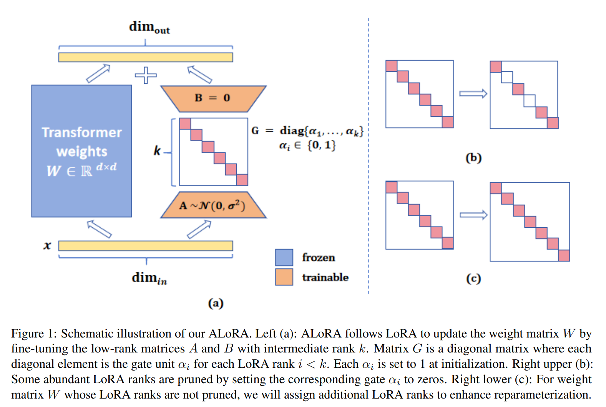
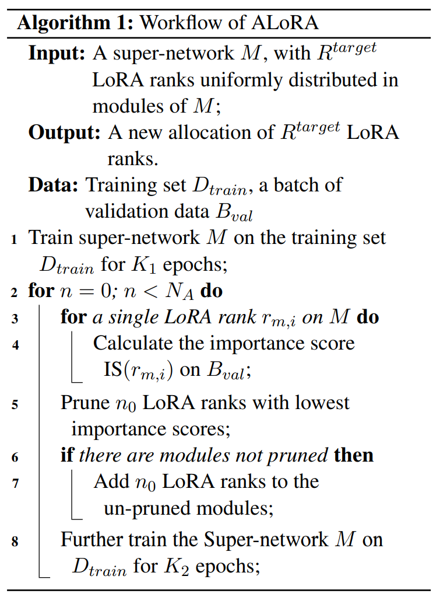
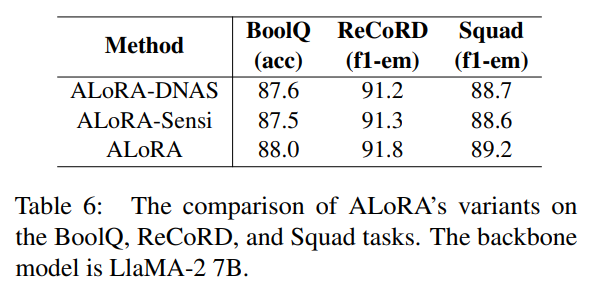
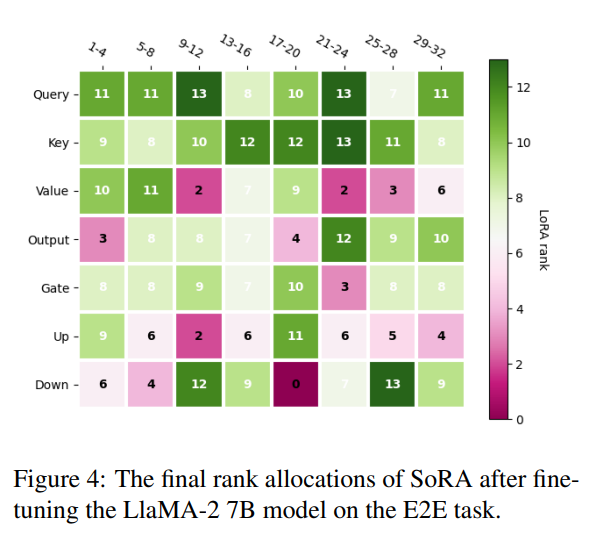

논문 및 출처 : <https://arxiv.org/pdf/2403.16187>

### Abstract

Parameter-efficient fine-tuning (PEFT)은 large language model(LLM)의 시대에서 그 효과와 효율성으로 널리 연구되고 있다. 

Low-rank adaptation (LoRA)은 인기 있고 대표적인 방법으로 주목할 만한 성능을 입증했지만, LoRA 는 fixed intrinsic rank 로 구현되어 있으며, 이는 downstream task 에 suboptimal 일 수 있다.

downstream task 에 더 유연하게 적응할 필요성을 인식하고, 저자는 LoRA 의 방법론을 확장하여 adaptation process 에서 intrinsic rank 를 동적으로 조정할 수 있는 혁신적인 접근법인 **Allocating LoRA (ALoRA)** 를 제안한다. 

- 먼저, 저자는 각 LoRA rank 의 importance 를 효과적으로 추정할 수 있는 새로운 방법인 **AB-LoRA** 를 제안한다. 
- AB-LoRA 에 의해 안내되어, 저자는 불필요하거나 부정적인 영향을 미치는 LoRA rank 를 점차적으로 pruning 하고, pruned LoRA budget 을 higher rank 가 필요한 importance Transformer module 에 할당한다. 
- 저자는 다양한 task 에 대해 실험을 수행했으며, 실험 결과 **ALoRA** 방법이 유사한 tunable parameters 로 최근의 baseline 보다 우수한 성능을 발휘함을 입증한다.

### 1 Introduction

large language model(LLM)은 다양한 NLP task 에서 SOTA 를 달성하고 있다. 

또한, LLM 은 question answering in special domains, reasoning, math, safety, instruction following 같은 evaluation tasks 에서 강력한 성능을 보인다. 

LLM 이 일반적인 task solvers 로 자리 잡았음에도 불구하고, fine-tuning 은 여전히 efficient LLM inference 와 LLM 이 생성한 contents style 을 조정하는 데 중요한 역할을 한다. 

이처럼 large model 의 all parameters 를 사용한 fine-tuning 은 많은 GPU memory 와 계산을 요구하므로 부담스럽다. 

따라서 parameter efficient fine-tuning(PEFT)은 tunable parameters 가 full LLM 의 1% 미만이므로 주목받고 있으며, 계산 비용도 크게 감소된다. 

많은 PEFT 방법들은 다양한 model 및 task 에서 유효성이 입증되어, entire parameters 를 사용하는 fine-tuning 과 유사한 성능을 발휘한다.

- 이 PEFT 방법 중, low-rank adaptation 을 기반으로 한 reparameterization 방법인 LoRA 는 현재 가장 효율적이고 효과적인 방법 중 하나로 간주된다. 
- 특히 LoRA 는 open-source LLM 이 보편화된 이후로 더욱 인기를 끌고 있다. 
- LoRA 는 model parameter changes 의 adaptation 을 위해 intrinsically low-dimensional 및 low-rank decomposition 의 matrix 를 optimizing 함으로써 adaptation 을 수행한다.
- LoRA parameter 는 weight matrices 의 reparameterization 형태로 존재하기 때문에, original LLM 에 합쳐질 수 있고 forward propagation latency 를 초래하지 않는다.

LoRA 는 효과적이며 Hu et al. (2021) 의 original setting 도 안정적인 성능을 발휘하지만, downstream task 에 대한 잠재력을 완전히 활용하는 방법은 아직 명확하지 않다. 

1. Transformer block 의 각 model weights 에 대한 intrinsic rank 를 결정하는 방법이 불분명하다. 
2. 또한, query, key, value matrix 에 동일한 LoRA rank 를 설정하는 것이 합리적인지 의문이다. 
3. 실제로 optimal LoRA rank setting 은 backbone model 과 task 등 여러 요인에 따라 달라질 것이다.

downstream task adaptation 성능을 향상하기 위해, 저자는 **Allocating LoRA (ALoRA)** framework 를 제안한다(Fig. 1 참조). 

1. 각 Transformer weights 에 same rank size 로 초기화된 LoRA module 을 설정하고, all rank gates 는 1 로 설정된다. 
2. fine-tuning 동안 저자는 다음을 통해 LoRA rank 를 재할당한다: 
   - (a) abundant 또는 negative contributions LoRA rank 를 식별하여, 해당 rank gates 를 0 으로 설정하여 pruning 하고, 
   - (b) pruned rank budget 을 important model weights 에 할당한다. 

LoRA rank 의 contribution score 를 효율적이고 정확하게 계산하기 위해, 저자는 새로운 방법인 **AB-LoRA** 를 제안한다. 

- 이 방법은 re-training 이 필요 없으며, initialization 또는 training 중에 higher LoRA rank budget 을 요구하지 않는다.

저자는 sentiment classification, natural language inference, question answering, natural language generation under constraint 및 instruction tuning 을 포함한 다양한 task 에서 광범위한 실험을 수행하여 저자의 방법의 효과를 입증한다. 

특히, 저자의 방법은 similar tunable parameters budget 을 가진 strong PEFT baseline 을 지속적으로 능가하며, 특히 최근 LoRA variants 보다 우수한 성능을 발휘한다. 

또한 (a) AB-LoRA 방법이 각 LoRA rank 의 contribution 을 실제로 반영할 수 있음을 보여주고, (b) 다른 LoRA rank budget 및 backbone model 과도 작동할 수 있음을 보여주는 분석을 수행했다.

#### contributions

- 저자는 각 LoRA rank 의 importance 를 추정하는 새로운 방법인 **AB-LoRA** 를 제안한다.
- **AB-LoRA** 를 기반으로, LoRA rank 를 model weights 에 할당하고 adaptation process 을 향상시키는 **ALoRA** framework 를 제안한다.
- 광범위한 실험 및 분석을 통해 **ALoRA** framework 가 실용적이며, similar parameter budget 으로 baseline 을 능가함을 입증한다.

# 2 Related works

## 2.1 Parameter-efficient fine-tuning (PEFT) methods

Parameter-efficient fine-tuning (PEFT)은 large pre-trained backbone model 을 fine-tuning 할 때, 모델의 대부분의 parameters 는 그대로 두고, 일부만 optimizing 하는 접근법이다. 

- PEFT 방법 중 일부는 backbone model 에 additional neural module 또는 parameters 를 삽입하는 방식이다. 
  - 대표적인 연구로 Adapter, Prefix tuning, Prompt tuning, P-tuning V2 가 있다. 
- 다른 접근법으로는 specific parameters 를 tuning 하거나 pruning 가능하게 지정하는 방법도 있다. 
- reparameterization-based method 가 많은 관심을 끌고 있으며 이러한 접근법은 optimization 중에 adaptive parameters 를 low-rank 및 parameter efficient forms 로 변환한다. 
  - 이 유형의 PEFT 방법은 intrinsic dimension 과 밀접하게 관련되어 있으며, pre-trained model 의 full parameter fine-tuning process 를 low-dimensional subspace 내에서 optimizing 할 수 있음을 나타낸다. 
  - 직관적으로, well-trained model 은 downstream task adaptation 을 위해 크게 변경될 필요가 없다. 또한 다양한 NLP task 에서 shared  common intrinsic subspace 를 찾을 수 있는지에 대해 연구되었다. 
- LoRA 는 이러한 연구에서 영감을 받아 model tuning 중 weight changes 가 low intrinsic rank 임을 가정하고, original weight matrix changes 를 low-rank decomposition 으로 optimizing 한다. 

PEFT 방법은 특히 open-source large language model 의 보편화와 이러한 모델을 instruction tuning 에 적용하는 다양한 시나리오에서 널리 사용되고 있다.

#### 2.2 LoRA 방법과 그 변형들

LoRA 는 상대적으로 작은 pre-trained backbone model 과 large language model 에 모두 적용했을 때, 효과적이고 안정적인 결과를 나타낸다. 

그럼에도 불구하고, 각 Transformer model weights $m$ 에 대해 optimal rank $r_m$을 선택하는 데 여전히 개선의 여지가 있다. 

rank $r$ 은 discrete value 를 가지므로 이를 변경하면 model structure 를 직접적으로 변경된다. 

optimal rank selection 은 backbone model, task, 나아가 Transformer model weights 에 따라 달라질 수 있다. 

$r_m$ 가 크면 training time 과 computation resources 를 낭비할 수 있고, $r_m$ 을 점진적으로 작게 설정하면 model performance 가 저하될 수 있다. 

이러한 제한점은 LoRA 의 적응 전략을 업그레이드할 필요성을 강조한다.

이 방향을 탐구하는 연구들이 이미 일부 존재한다. 

- AdaLoRA 는 LoRA 의 low-rank multiplication 을 singular value decomposition(SVD) 형태로 표현하고, sensitivitybased importance score 를 통해 most important ranks 를 식별한다. 
- SoRA 는 $l_0$ norm 을 부과하여 abundant LoRA rank 를 pruning 하고, proximal gradient descent 로 optimizing 한다. 
- SaLoRA 는 Lagrange multiplier method 를 사용해 LoRA rank 를 pruning 한다. 

이러한 최근 연구에도 불구하고, 저자는 LoRA rank allocation 에 대해 여전히 해결해야 할 문제가 있다고 본다. 

- (a) 현재 연구들은 각 $r_m$ 에 대해 large value 를 초기화하고, pre-defined budget 을 충족하기 위해 특정 heuristics 을 사용해 rank 수를 pruning 한다. 
  - 이 학습 과정은 additional GPU memory 소비를 필연적으로 요구한다. 또한 각 model weights 에 대한 최대 LoRA rank 크기는 제한되어 있어, LoRA rank allocation 에 대한 해결 공간이 제한된다.
- (b) 현재 연구들은 heuristic importance scores 에 의존하며, 이는 각 LoRA rank 의 기여를 신뢰성 있게 반영하지 못할 수 있다. 

저자의 연구는 위 문제를 해결함으로써 기존 문헌을 보완한다.

---

# 3 Methods

## 3.1 Preliminaries

#### Transformer model

현재 대부분의 open-source language model 및 large language model 은 stacked Transformer structure 를 채택하고 있다.

각 Transformer block 은 주로 two sub module 로 구성된다: multi-head self-attention (MHA) layer 과 fully connected feed-forward (FFN) layer.

MHA 는 다음과 같이 주어진다:

$$
\begin{equation}
    x' = MHA(xW^Q, xW^K, xW^V)W^O,
\end{equation}
$$

- $MHA()$ : multihead attention
- $x \in \mathbb{R}^{l \times d}$ : input tensor
- $W^O \in \mathbb{R}^{d \times d}$ : output projection layer(output module)
- $W^Q, W^K, W^V \in \mathbb{R}^{d \times d}$ : 각각 query, key, value module
- $l$ : sequence length
- $d$ : hidden dimension

FFN module 은 linear transformation 과 ReLU 또는 GELU 같은 activation function 으로 구성된다. 

LlaMA-2 모델의 FFN module 을 예로 들면:

$$
\begin{equation}
    x' = (g(xW^G) * xW^U)W^D,
\end{equation}
$$

- $W^G, W^U \in \mathbb{R}^{d \times d'}$ : 각각 Gate 및 Up module
- $W^D \in \mathbb{R}^{d' \times d}$ : down module
- $d'$ : 일반적으로 $d$ 보다 크다.
- 편의상 Transformer block 의 module 수를 $N_{mod}$ 로 나타낸다. 
  - 따라서 LlaMA-2 에서 $N_{mod} = 7$ 이다.

task 의 training set 를 $\mathcal{D}_{train} = (x_m, y_m), m = 1, 2, ..., M$ 이라 하며, 여기서 $M$ 은 sample 수를 나타낸다. 

이 연구에서는 input $x_m$ 과 target $y_m$ 이 모두 text sequence 인 경우만 고려한다. 

LLM 의 language modeling head 가 inference 중 $y_m$ 을 decoding 할 것으로 기대하며, 범주형 또는 수치 값을 예측하기 위한 additional linear prediction head 는 고려하지 않는다.

### 3.2 Formulation

본 논문의 목적은 주어진 LoRA parameter budget $R^{target} = \sum_{m=1}^{N_{mod}} r_{m}^{target}$ 내에서 specific downstream task 에 적합하게 LLM 을 efficient fine-tuning 하는 것이다.

- 기존 연구에선 LoRA module 을 pre-defined large maximum rank rank $r_{max}$ 로 초기화하여 불필요한 GPU memory 를 소모하게 한다. 
- 이에 비해, 저자는 각 LoRA module 을 rank $r_{m}^{init} = R^{target} / N_{mod}$ 로 초기화한다. 
  - 즉, initialization 시 LoRA rank budget 을 이미 충족시킨다. 
  - 또한, fine-tuning 성능을 향상시키기 위해 LoRA rank 를 재분배한다.
- LoRA module 의 rank allocation 을 조정하기 위해, 각 module $m$ 에 대해 LoRA rank $r_m$ 의 gate units $\alpha_i \in \{0, 1\}$ ($i = 1, 2, ..., r_m$) 을 삽입한다. 
- SVD structure 를 모방하여, ALoRA 의 forward propagation 은 다음과 같이 표현된다.

$$ z = xW^A_m G_m W^B_m, $$

$$
\begin{equation}
    G_m = diag(\alpha_{m,1}, \dots, \alpha_{m,r_m}),
\end{equation}
$$

- $diag()$ : diagonal matrix
- $W^A_m \in \mathbb{R}^{d \times r_m}$, $W^B_m \in \mathbb{R}^{r_m \times d}$
- initialization 시 gate units 은 모두 1 로 설정된다.

기존 문헌과는 다르게 저자는 LoRA allocation 문제를 neural architecture search(NAS) 문제로 접근한다. 

- gate units $\alpha_i$ 는 architecture parameter (set $\Theta$ 로 표기)로 간주하며, all non-zero gate units 을 가진 network 는 super-network $M$ 으로 정의하고, down-projection 과 up-projection matrices 에 포함된 parameters 를 $\Omega$ 로 표기한다. 
- optimization objective 는 다음과 같다.

$$
\begin{equation}
    \begin{aligned}
        &\min_{\Theta} \mathcal{L}(\mathcal{D}_2, \Omega^*, \Theta), \\
        &\text{s.t.} \ \Omega^* = \arg \min_{\Omega} \mathcal{L}(\mathcal{D}_1, \Omega, \Theta),
    \end{aligned}
\end{equation}
$$

- $\mathcal{D}_1$ 및 $\mathcal{D}_2$ : training dataset $\mathcal{D}_{train}$ 을 분할한 것
- $\mathcal{L}()$ : loss function
  - 이 연구에서는 cross-entropy loss 를 사용한다. 
- 위의 optimization 문제를 해결하는 것은 $\alpha_i$ 가 discrete values 를 가지므로 non-differentiability 으로 인해 어렵다. 
- 따라서, differentiable neural architecture search (DNAS) 방법에 따라 $\alpha_i$ 를 (0, 1) 사이의 continuous value 로 완화하고, Eq. 3 은 다음과 같이 변환된다.

$$
\begin{equation}
    \begin{aligned}
        &z = W^B_m G_m' W^A_m x, \\
        &G_m' = diag(\alpha_{m,1}', \dots, \alpha_{m,r_m}'), \\
        &\alpha_{m,i}' = 2 * \text{Sigmoid}(a_{m,i}'), \ a_{m,i}' \in \mathbb{R}, \\
    \end{aligned}
\end{equation}
$$

- $a_{m,i}'$ : zero value 로 초기화

이 설정으로 Eq. 4 는 differentable 해지며, bi-level optimization 방법으로 최적화될 수 있다.

### 3.3 Our novel AB-LoRA method

DNAS 설정 하에서는 architecture weight $\alpha_i'$ 를 LoRA rank $i$ 의 importance scores 로 간주하여, 이를 바탕으로 abundant LoRA rank 를 pruning 할 수 있다. 

하지만, 문헌에 따르면 architecture weights 는 final LoRA allocation 성능을 신뢰성 있게 반영하지 않는다. 

이러한 관찰에 따라, 저자는 DNAS style 의 architecture search 를 간단하면서도 효과적으로 수정한 AB-LoRA 방법을 제안한다. 

- architecture weight 값에 의존하는 대신, LoRA rank 의 importance 를 그 rank 가 super-network 성능에 얼마나 기여하는지로 직접 평가하는 것이다.
- AB-LoRA 핵심 각 LoRA rank 의 importance scores 를 계산하는 것으로, 이는 super-network 성능에 대한 contributions 를 측정한 것이다. 
  - complete super-network 를 $M$ 이라고 할 때, $M$ 은 training set 에서 수렴할 때까지 학습된다. 
  - 이제, all other LoRA ranks 를 유지하면서 single LoRA $r$ 을 zeroing out 하여 얻은 modified super-network 를 고려한다. 
  - 이 new super-network 를 $M_{\setminus r}$ 로 표기한다. 
  - 또한, 오직 LoRA rank $r$ 만 남기고 all other LoRA ranks 를 zeroed out 한 super-network 를 $M_r$ 로 표기한다. 
- 3 versions super-network 를 동일한 validation data batch $B_{val}$ 에서 평가한다. 
- fixed validation data 의 model $M$ 의 metric score function 을 $S(M)$ 로 표기한다. 

그러면 LoRA rank $r$ 의 importance scores 는 다음과 같이 주어진다.

$$
\begin{equation}
    IS(r) = S(M) - S(M_{\setminus r}) + S(M_r).
\end{equation}
$$

- 위 식에서 $S(M)$ 은 constant term 으로 간주할 수 있다. 따라서 Eq 는 다음과 같이 단순화된다.
  - $CS(o) = -S(M_{\setminus r}) + S(M_r).$
- 직관적으로, $M_{\setminus r}$ 에서 특정 LoRA rank 를 제거했을 때 성능이 크게 하락하는 경우, 해당 rank 는 중요한 역할을 한다고 볼 수 있다. 반면, $M_r$ 에서 성능을 대부분 유지하는 rank 는 important task-related knowledge 를 포함하고 있다고 간주해야 한다. 
- 실험에서는, accuracy 또는 F1 같은 metrics 를 널리 적용되기 때문에 ((a), (b)) cross-entropy(CE) loss 의 negative 를 $S()$ 로 설정한다.
  - (a) super-network 가 single operations 만 masking 하는 경우 변경되지 않을 수 있음
  - (b) generative language model fine-tuning 의 경우 적합하지 않음

### 3.4 The complete process of ALoRA

Eq. 6 에서 제시한 importance scores 의 지침을 바탕으로 ALoRA framework 의 whole working process 를 정의할 수 있다. 

LoRA rank allocation 의 working process 는 다음의 직관을 따른다. 

- (a) LoRA rank 의 pruning 및 allocation 은 성능 저하를 피하기 위해 점진적으로 수행된다. 
- (b) specific Transformer module 에서 high importance scores 를 받은 LoRA rank 가 pruning 되지 않은 경우, 해당 module 은 중요한 것으로 간주되며 additional LoRA rank allocation 이 필요할 수 있다.

---

- ALoRA framework 는 AB-LoRA 방법에 중심을 두며, super-network 는 먼저 $K_1$ epoch 동안 training set 에서 학습된다. 
- 이후 architecture parameter 를 고정하고 model parameters 만 학습한다. 
  - bi-level optimization 은 필요하지 않으므로 training time 이 절약된다. 
- 그 후, 각 LoRA rank 에 대해 dev set 의 sample batch $B_{val}$ 에서 importance scores 를 평가한다. 
- lowest importance scores $n_A$ LoRA rank 는 해당 gate units 을 0 으로 만들어 pruning 된다. 
- 또한, specific Transformer module 에서 pruning 되지 않은 LoRA rank 가 있을 경우, additional parameter budget 을 해당 module 에 할당하여 적응을 강화한다. 
- pruning 및 adding operations 후, modified super-network 는 $K_2$ epoch 동안 tuning 하여 성능을 회복한다.
- 이 과정은 $N_A$ 번 반복된다.

# 4 Experiments

## 4.1 Baselines

ALoRA framework 를 현재 SOTA PEFT baseline 방법들과 비교한다.

**Adapter-based tuning**  
다음의 adapter tuning 방법들을 baseline 으로 사용한다:  

(1) Houlsby-Adapter;  
(2) Parallel-Adapter;  
(3) AdapterDrop;  
(4) LST;  
(5) Learned-Adapter.

**Prompt-based tuning**  
Prompt-based tuning 방법으로는 (a) P-tuning v2; (b) SPT 와 비교한다.

**LoRA and its variants**
다음의 LoRA 변형들을 baseline 으로 사용한다:  
(a) LoRA;  
(b) AdaLoRA;  
(c) SoRA;  
(d) SaLoRA.

**Other PEFT methods**  
다음의 PEFT 방법도 비교한다: (1) SSP, 이는 다양한 PEFT 방법을 결합한 것이다.

이 baseline 들은 opensourced codes 를 사용하여 구현된다. 

## 4.2 Datasets and evaluation metrics

저자의 접근법을 다음의 dataset 에서 baseline 과 비교한다:  
(a) 4 benchmark question-answering tasks: SQUAD 및 SuperGLUE benchmark 에서 3 tasks (BoolQ, COPA, ReCoRD);  
(b) GLUE benchmark 에서 3sentence level tasks (SST-2, RTE, QNLI);  
(d) Alpaca dataset 을 사용한 instruction tuning 과 LLM 의 instruction tuning 품질을 평가하기 위한 MT-Bench.

## 4.3 Experiment Settings

**Computing infrastructures**  
모든 실험은 NVIDIA A40 (48GB) GPU 에서 실행된다.

**Pretrained backbones**  
주요 실험에서는 최근 공개된 LlaMA-2 7B 모델을 pre-trained backbone model 로 사용한다. 

ablation study 에선 GPT2-large model 과 RoBERTa-large model 도 사용한다.

**Prediction heads**  
LlaMA-2 7B 를 fine-tuning 할 때는 supervised fine-tuning (SFT) 설정만 고려하며, 이는 prompt 나 instruction 을 받았을 때 language modeling head(LM head)를 사용하여 예측을 생성하는 것이다. 

inference 중 decoding 에는 beam search 를 사용하며, beam size 는 5 로 설정한다.

**Hyper-parameters for ALoRA**  
실험에서, 별도의 언급이 없는 한 $R^{target}$을 $8 \times N_{mod}$ 로 설정하며, 초기에는 all Transformer model weights 에 LoRA module 이 rank $r_{m}^{init} = 8$ 로 할당된다. 

- 이 설정에서 ALoRA 는 initialization 시 LoRA rank budget 을 충족하며, training 및 inference 중에도 이를 유지한다. 
- $n_A$ 는 $1 * N_{mod}$ 로 설정된다. 
- ALoRA 의 workflow 에 따라 training 시 $B_{val}$ 의 batch size 는 32, $K_1$ 은 1 epoch, $K_2$ 는 0.25 epoch 으로 설정되며, 최대 $N_A = 8$ 번의 LoRA rank allocation 절차를 수행한다.

**Reproducibility**  
각 task 는 5 random seeds 에서 실행되며, 각 task 의 test set 에 대해 중간 성능을 보고한다.

## 4.4 Main results

3 classification tasks 와 4 question-answering tasks 에 대한 실험 결과는 Tab. 1 에 제시되어 있다. 

- Tab. 1 의 2, 3 column 에는 tunable parameter 의 초기 및 최종 수가 나타나 있다. 
- Tab. 1 은 ALoRA 방법이 모든 7 tasks 에서 baseline 방법보다 더 나은 성능을 보이며, training 및 inference process 에서 비교적 적거나 동일한 수의 tunable parameter 를 사용함을 보여준다. 
- 특히, ALoRA 는 초기 및 최종 LoRA parameter 가 비슷한 AdaLoRA, SoRA, SaLoRA 를 능가하는 성능을 기록한다. 
  - 이러한 결과는 ALoRA 가 better downstream task adaptation 을 위해 LoRA parameter 를 더 잘 할당할 수 있음을 입증한다.

E2E benchmark 에 대한 결과는 Tab. 2 에 보고된다. 

- 이 결과는 E2E task 에서 ALoRA 방법이 BLEU, ROUGE-L, METEOR 점수에서 LoRA 및 SoRA 보다 더 나은 성능을 기록함을 보여준다.

LlaMA-2 7B 가 Alpaca dataset 에서 ALoRA 와 SoRA 로 fine-tuning 된 후, 80 instructions 를 포함하는 MT-Bench 를 test set 로 사용한다. 

GPT-4 가 제공한 평균 점수는 Tab. 3 에 제시되어 있으며, GPT-4 의 답변을 정답으로 간주하여 계산한 ROUGE-L score 도 함께 나타나 있다. 

- 이전 실험들 (Tab. 1 및 2)과 일관되게, ALoRA 방법은 GPT-4 평가 점수 및 ROUGE-L 에서 SoRA 방법보다 더 나은 성능을 보이며, ALoRA 가 LLM 의 instruction tuning 품질을 향상시킬 수 있음을 입증한다.

# 4.5 Ablation studies and analysis

#### Analysis of Training Efficiency

지금까지 ALoRA 가 다양한 task 에서 LoRA 와 SoRA 를 능가할 수 있음을 입증했다. 

이러한 성능 우위가 상당한 시간 또는 메모리 비용을 요구하는지 의문을 가질 수 있다. 

E2E benchmark 에서 LlaMA-2 7B 를 fine-tuning 할 때 ALoRA, SoRA, LoRA 의 최대 GPU memory usage, training speed, training time costs 를 비교했다. 

- Tab. 4 에서 확인할 수 있듯이, ALoRA 는 larger LoRA rank 로 초기화하지 않으므로 training 중 memory costs 가 SoRA 보다 적게 든다. 
- 또한, early stopping 조건에서 ALoRA 의 총 training time costs 는 SoRA 및 LoRA 와 비슷한 수준을 유지한다.

#### Ablation study of ALoRA framework

ALoRA framework 의 다음과 같은 variants 를 고려한다:  
(a) 새로운 AB-LoRA 방법을 사용하지 않고, Eq. 4 의 optimization 절차를 따르며, importance scores 로 architectural weights $\alpha'_{m,i}$ 를 사용하는 variant. 이는 ALoRA-DNAS 로 표시된다.  
(b) importance measurement 로 Zhang 의 sensitivity-based metric 을 사용하는 변형 (ALoRA-Sensi). 

BoolQ, ReCoRD, SQUAD task 에 대한 실험 결과는 Tab. 6 에 보고된다. 

- 결과에 따르면, ALoRA 는 two variants 보다 우수한 성능을 기록하며, AB-LoRA 방법이 LoRA rank 를 할당하는 데 더 나은 지침을 제공함을 보여준다.

#### Visualization of the final rank allocations

여기서 E2E task 에서 ALoRA 의 training process 가 끝난 후 final LoRA rank allocation 을 Fig. 3 에 시각화한다. 

또한, Fig. 4 에서 SoRA 방법에 의한 LoRA rank allocation 과 비교한다. 

- Fig. 3 에서 확인할 수 있는 바와 같이 (a) query 및 key module 에 more LoRA rank budget 이 할당되며, self-attention 의 value 와 output module 은 덜 강조된다. (b) Transformer block 의 feed-forward layer 는 less LoRA rank 를 요구하며, 이는 이 layer 가 일반적인 language knowledge 를 저장하는 반면, attention module 은 ALoRA fine-tuning 후 more task-specific knowledge 를 포함하게 된다는 것을 시사한다. 
- ALoRA 의 할당과 비교했을 때, SoRA 는 Down module 에 more rank budget 을 할당하여 불균형적인 할당을 초래한다.

#### Comparisons under different LoRA rank budgets

주요 실험에서는 target LoRA rank budget 을 $R^{target} = 8 \times N_{mod}$ 로 설정했다. 

이제 이 budget 을 $1, 2, 4, 8, 16, 32, 64, 128$ 배수로 다양하게 설정하고, BoolQ 와 E2E task 에서 ALoRA, SoRA, LoRA 의 성능을 확인한다. 

실험 결과는 Fig. 2(a) 와 2(b)에 제시되어 있다. 

- 결과에 따르면, LoRA rank budget 이 달라짐에도 불구하고, ALoRA 는 Transformer module 에 LoRA rank 를 적절히 할당하여 LoRA 와 SoRA 보다 일관되게 우수한 성능을 발휘한다.

#### Ablation on the pretrained backbones

주요 실험은 LlaMA-2 7B 모델에서 수행되었다. 

저자의 방법의 광범위한 적용 가능성을 증명하기 위해, RoBERTa-large 와 GPT2-large model 에서도 실험을 진행했다.

결과는 Tab. 7 과 8 에 보고되어 있다. 

- 이 두 backbone 에서도, 저자의 방법이 baseline 방법들보다 우수한 성능을 발휘함을 확인할 수 있다.

# 5 Conclusion

이 연구는 **Allocating Low-Rank Adaptation (ALoRA)**, 즉 large language model 의 parameter-efficient fine-tuning 을 위한 혁신적인 방법을 제시한다. 

different Transformer module 의 adpatation 이 different rank 를 가질 수 있다는 가설을 바탕으로, fine-tuning 과정에서 LoRA rank 를 할당하는 new workflow 를 도입했다. 

1. 저자는 LoRA rank 의 importance 를 정확하게 평가하기 위해 **AB-DNAS** 라는 새로운 방법을 제안한다. 
2. AB-DNAS 방법을 통해, 특정 module 에서 rank 를 pruning 하고 impoprtant module 에 more rank 를 할당하는 절차를 도입한다. 따라서 initial rank 를 더 크게 설정할 필요가 없다.

이 방법은 구현이 용이하며, 기존의 다른 모델에도 적용할 수 있다. 

다양한 task 에서의 실험은 ALoRA 가 baseline 방법보다 우수한 성능을 발휘함을 입증한다.