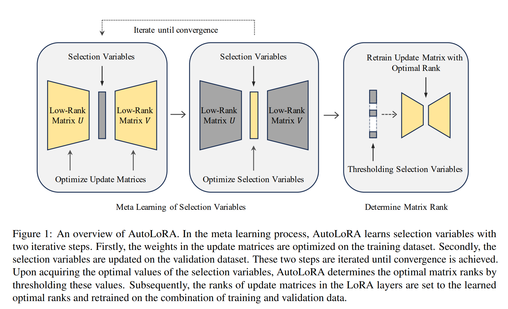
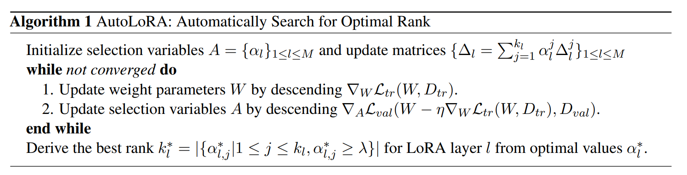
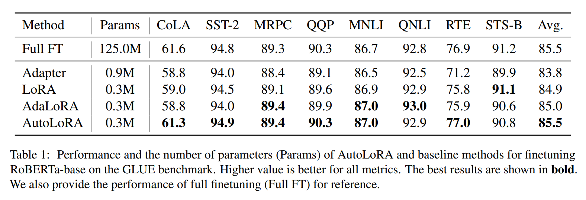
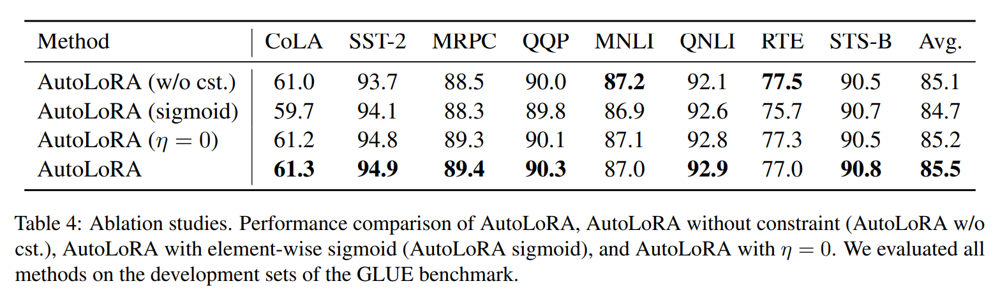
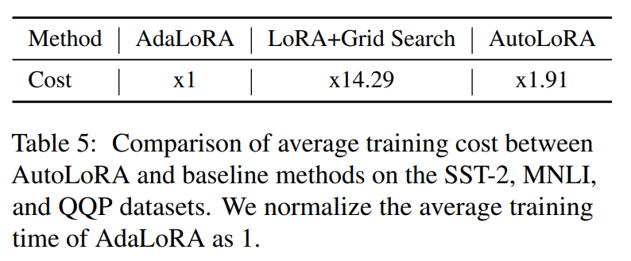

논문 및 이미지 출처 : <https://arxiv.org/pdf/2403.09113>

# Abstract

large-scale pre-training 후 specific task 에 맞춘 fine-tuning 은 다양한 NLP task 에서 큰 성공을 거두었다. 

그러나 large-scale pre-trained model 의 all parameters 를 fine-tuning 하는 것은 상당한 computational 및 memory 부담을 초래한다. 

이를 해결하기 위해 여러 efficient fine-tuning 방법이 개발되었으며, 그중에서도 **LoRA** 는 frozen pre-trained weights 에 low-rank incremental update matrices 를 적용하는 방식으로 특히 효과적임이 증명되었다. 

그럼에도 불구하고 LoRA 의 각 layer 에 uniform rank 를 할당하는 방식과 best rank 를 찾기 위한 포괄적인 탐색은 high computation costs 와 suboptimal efficient fine-tuning 성능을 초래한다.

이를 해결하기 위해, 저자는 각 LoRA layer 의 optimal rank 를 자동으로 식별하는 meta-learning-based **AutoLoRA** framework 를 제안한다. 

- AutoLoRA 는 low-rank update matrix 의 각 rank-1 matrix 에 해당 matrix 가 폐기되어야 하는지를 결정하는 selection variable 을 연관시킨다. 
- 이러한 selection variable 을 학습하기 위한 meta-learning 방법을 개발했으며, optimal rank 는 이러한 변수의 값을 thresholding 으로 설정하여 결정된다. 
- NLU, NLG 및 sequence labeling 에 대한 포괄적인 실험은 AutoLoRA 의 효과를 입증한다.

# 1 Introduction

**Large Language Models (LLMs)** 는 NLU 부터 NLG 까지 다양한 NLP task 에서 SOTA 를 보여주었다. 

이는 주로 방대한 양의 unlabeled texts 에 대한 initial pre-training 과 specific downstream task 에 대한 fine-tuning 이라는 two stage process 덕분이다. 

하지만 모델이 커지면서, 예로 **RoBERTa-large** 의 355M parameters 에서 **GPT-3** 의 175B parameters 로 전환되는 경우, fine-tuning 은 계산 비용이 매우 비싸진다.

이 문제를 해결하기 위해 많은 efficient fine-tuning 방법이 개발되었다. 

- 예로, **Adapters** 는 pre-trained network 에 lightweight layers (adapter)를 삽입하고, fine-tuning 시 이 adapters 만 업데이트하며 pre-trained layers 는 frozen 상태로 유지한다. 
  - 그러나 이 방법은 inference 시 additional computation overhead 를 초래한다는 한계가 있다. 
- 또 다른 접근 방식인 **prefix tuning** 는 trainable prefix parameter 를 input sequence 앞에 붙이고 pre-trained model parameters 를 frozen 상태로 유지한다. 
  - 하지만 prefix 의 optimal length 를 결정하는 것은 까다로울 수 있다. 
  - too short prefix 는 충분한 정보를 캡처하지 못할 수 있고, too longer prefix 는 input sequence 의 maximum length 를 크게 줄일 수 있다.
- 이를 해결하기 위해, **LoRA** 는 pre-trained weight matrices 에 low-rank incremental update matrices 를 추가하는 방식을 제안했다. 
  - fine-tuning 중에는 incremental matrices 만 학습되고 pre-trained weights 는 frozen 상태로 유지된다. 
  - low-rank parameterization 은 fine-tuning parameter 수를 크게 줄인다.

비록 inference costs 를 증가시키지 않고 parameter efficient fine-tuning 을 달성했지만, LoRA 에는 두 가지 한계가 있다. 

1. different layer 의 update matrix 가 same rank 를 공유하여 layer 간의 상이한 특성을 고려하지 않는다. 
   - pre-trained model 의 layers 는 downstream task 에 따라 different importances 를 가지며, 각 layer 는 다르게 적응되어야 한다. 
   - all layers 에 uniform rank 를 사용하는 것은 이러한 목표를 저해하여 일부 layers 는 under-parameterization(suboptimal fine-tuning 성능)되고, 다른 layers 는 over-parameterization(inefficiency)된다. 
2. LoRA 에서 optimal rank 를 얻기 위해서는 광범위한 manual hyper-parameter search 가 필요하며, 이는 time-consuming 및 scalability 문제를 야기한다.

이러한 LoRA 의 한계를 해결하기 위해, 저자는 각 LoRA layer 의 optimal rank 를 자동으로 결정하는 **AutoLoRA** framework 를 소개한다. 

- AutoLoRA 에서는 먼저 update matrix 을 LoRA 방법론과 일치하게 two low-rank matrices(rank $k$)의 곱으로 분해한다. 
  - 이 곱은 $k$ rank-1 matrices 의 summation 으로 표현될 수 있다. 
- 각 rank-1 matrix 에 대해 저자는 continuous trainable selection variable $\alpha \in [0, 1]$ 을 할당하여, 이 matrix 는 summation 에서 차지하는 relative importance 을 나타낸다. 
- training 후, $\alpha$ 가 0 에 가까우면 해당 rank-1 matrix 는 summation 에서 제거된다. 
  - 이러한 selection variables 는 update matrix 의 rank 를 효과적으로 제어한다.
  - training data 를 기반으로 $\alpha$ 를 직접 학습하면 over-fitting 이 발생할 수 있으며, 이런 learned network 는 generalization ability 가 부족하다. 
- 이를 완화하기 위해, 저자는 $\alpha$ search process 를 meta-learning 문제로 공식화하였다. 
  1. 먼저, training dataset 에서 rank-1 matrix 의 weight 를 fine-tuning 한다. 
  2. $\alpha$ values 를 최적화하여 validation dataset 에서 loss 를 minimizing 한다. 
  - 이 two stage 를 반복하여 수렴할 때까지 진행한다. 
  - 이후, 학습된 $\alpha$ values 을 thresholding 으로 설정하여 각 LoRA layer 의 optimal rank 를 도출한다. 
  - optimal rank 가 식별된 후, low-rank update matrix 의 weights 는 training 및 validation data 를 결합하여 다시 학습된다.

AutoLoRA 방법의 개요는 **Fig. 1**에서 설명된다.

**summarization**

- 저자는 manually tuning 의 부담을 덜고 LoRA 처럼 각 layer 의 update matrix 의 optimal rank 를 자동으로 결정할 수 있는 **AutoLoRA** 라는 meta-learning-based approach 를 제안
- NLU 및 NLG task 에서 **AutoLoRA** 의 유효성을 입증하는 광범위한 실험을 수행하였다.

# 2 Related Works

## 2.1 Parameter Efficient Finetuning Methods

pre-trained model 을 efficient fine-tuning 하기 위한 다양한 방법이 개발되었다. 

이러한 방법들은 large-scale pre-trained model 에서 대부분의 parameter 는 frozen 한 채, small subset weights 만 업데이트한다. 

Aghajanyan et al. (2021)에 따르면, large-scale pre-trained model 의 weight matrices 는 small intrinsic dimension 을 가지는 경향이 있어, low-dimensional reparameterization 을 통해 pre-trained model 을 fine-tuning 할 수 있는 이론적 직관을 제공한다. 

이러한 방법들이 경우에 따라 full fine-tuning 성능보다 뛰어날 수 있으며, 특히 limited training data 의 downstream task 에서 그러하다.

- 일부 efficient fine-tuning 방법은 pre-trained model 의 parameter 는 frozen 한 채, trainable prompt 만 업데이트한다.
  - 예로, **Prompt-tuning** 은 specific downstream task 을 수행하기 위해 language model 에 "soft prompts" 를 학습한다.
  - **Prefix-tuning** 은 NLG task 을 위해 continuous task-specific vectors 의 sequence 를 optimizing 한다
  - **P-tuning** 은 GPT 를 NLU task 에 fine-tuning 하기 위해 continuous prompt embedding 을 생성하는 small neural network 를 optimizing 한다.
  - **LLaMA-Adapter** 는 **LLaMA** model 에 대해 trainable prompt 를 학습한다. 
  - 하지만 proper prompt length 를 선택하는 것은 까다롭다. 
  - prompt 가 너무 짧으면 충분한 정보를 담지 못하고, prompt 가 너무 길면 input sequence 의 길이가 크게 줄어들 수 있다.
- 또 다른 연구는 pre-trained model 에 trainable module 을 삽입하여 fine-tuning 하는 방식이다. 
  - 예로, **Adapter** 는 pre-trained Transformer model 에 additional trainable adapter layer 를 삽입하는 방식을 제안한다. 
  - **IA3** 는 pre-trained model 에서 activation function 의 output 을 trainable vector 로 곱한다. 
  - **Compacter** 는  hypercomplex multiplication layers 를 pre-trained model 에 삽입하여 Adapters 보다 더 효율적인 방식을 제공한다. 
  - 이러한 방법들은 inserted modules 를 계산해야 하기 때문에 additional inference overhead 를 초래한다.
- **AdaLoRA** 는 LoRA 가 all LoRA layers 에 update budgets 를 고르게 분배하는 문제를 해결하기 위해, importance scores 에 따라 adaptive budget 을 할당한다. 
  - 그러나 importance scores 와 update matrix 가 동일한 training data 에서 학습되기 때문에, over-fitting 위험이 증가한다.

## 2.2 Meta Learning

다양한 meta-learning 방법들이 minimal training data 로 new task 에 모델을 더 잘 적응시키기 위해 제안되었다.

- 예로, **Model-Agnostic Meta-Learning (MAML)** 은 few gradient descent steps 로 small data 로 new task 에 fast adaptation 할 수 있도록 model weights 를 학습하는 gradient-based meta-learning 방법이다. 
- **Meta-SGD** 는 MAML 의 확장판으로, model weights 뿐만 아니라 new task 에 fast adaptation 하도록 learning speed 도 optimizing 한다. 
- **Reptile**  MAML 의 대안으로, meta parameter 의 초기값을 specific task 에서 학습된 model weights 로 반복적으로 이동시키는 first-order meta-learning algorithm 이다.
  - 이는 second-order gradient computation 을 피한다. 
- 이들 방법과는 다르게, 저자의 meta-learning-based method 은 LoRA 의 matrix ranks 를 조정하기 위해 사용된다.

# 3 Preliminaries

LoRA 에서, downstream model 의 layer $l$ 에서 weight matrix $W_l \in \mathbb{R}^{m_l \times n_l}$ 은 $W_l = \widetilde{W}_l + \Delta_l$ 로 parameterization 된다. 

- $\widetilde{W}_l$ : pre-trained model 의 layer $l$ 에서의 weight matrix 
- $\Delta_l$ : incremental update matrices
  - 이는 two low-rank matrices 의 곱으로 parameterization: $\Delta_l = U_l V_l$
    - $U_l \in \mathbb{R}^{m_l \times k_l}$ 및 $V_l \in \mathbb{R}^{k_l \times n_l}$
- $k_l$ 은 $m_l$ 과 $n_l$ 보다 훨씬 작은 $\Delta_l$ 의 rank

동등하게, $\Delta_l$ 은 $k_l$ rank-1 matrices 의 summation 으로 표현될 수 있다:

$$
\begin{equation}
    \Delta_l = \sum_{j=1}^{k_l} \Delta^j_l,
\end{equation}
$$

- $\Delta^j_l$ 은 $U_l$ 의 $j$-th column 과 $V_l$ 의 $j$-th row 의 outer-product

# 4 Method

## 4.1 Overview

**AutoLoRA** 에선 LoRA 에서 수동으로 지정했던 rank $k_l$ 을 자동으로 결정하는 것을 목표로 한다. 

- 이를 위해 update matrix 의 각 rank-1 matrix 에 selection variable 을 연결하고, update matrix 을 rank-1 matrix 들의 weighted sum 으로 reparameterization 한다. 
- meta-learning-based method 를 개발하여 이러한 selection variable 을 학습한다. 
- training 후, selection variable 의 value 가 zero 에 가까우면 해당 rank-1 matrix 는 제거된다. 
- 이 방식으로, selection variable 을 기반으로 각 update matrix 의 optimal rank 를 결정할 수 있다. 

**AutoLoRA** algorithm 의 개요는 **Algorithm 1**에 나와 있다.

## 4.2 Reparameterize Update Matrices

Eq. (1) 에서 각 rank-1 matrix $\Delta^j_l$ 에 selection variable $\alpha^j_l \in [0, 1]$ 을 연결하고, $\Delta_l$ 을 rank-1 matrices 의 weighted sum 으로 reparameterization 한다:

$$
\begin{equation}
    \Delta_l = \sum_{j=1}^{k_l} \alpha^j_l \Delta^j_l.
\end{equation}
$$

- $\alpha^j_l$ 은 $\Delta^j_l$ 의 importance 로 해석될 수 있다. 
  - 만약 $\alpha^j_l$ 이 0 에 가까우면, $\Delta^j_l$ 은 $\Delta_l$ 에서 제거되어, $\Delta_l$ 의 rank 가 1 줄어든다. 
  - 즉, $\Delta_l$ 의 rank 는 $\{ \alpha^j_l \}_{j=1}^{k_l}$ 에서 non-zero values 의 수와 동일하다. 
- 이러한 selection variable 을 data 에 맞게 학습함으로써, 저자는 $\Delta_l$ 의 rank 를 자동으로 결정할 수 있다. 
- 저자는 $\{ \alpha^j_l \}_{j=1}^{k_l}$ 의 summation 이 1 이 되도록 제약을 추가한다: $\sum_{j=1}^{k_l} \alpha^j_l = 1$. 
- 이 constraint 는 $\{ \alpha^j_l \}_{j=1}^{k_l}$ 의 optimization 을 어렵게 만든다.

이 문제를 해결하기 위해, $\{ \alpha^j_l \}_{j=1}^{k_l}$ 을 directly optimizing 하는 대신 softmax 를 사용하여 이를 parameterization 한다:

$$
\begin{equation}
    \alpha^j_l = \frac{\exp(\beta^j_l)}{\sum_{i=1}^{k_l} \exp(\beta_{i_l})},
\end{equation}
$$

그리고 unconstrained variables $\{ \beta^j_l \}_{j=1}^{k_l}$ 를 학습한다.

## 4.3 Learn Selection Variables

$A = \{ \alpha^j_l | 1 \le j \le k_l, 1 \le l \le M \}$ 로 all selection variables 을 정의하며, 여기서 $M$ 은 pre-trained model 의 layer 수이다. 

저자는 $A$ 를 학습하기 위한 meta-learning-based method 을 제안한다. 

- $\mathcal{L}_{tr}$ 을 downstream task 의 training loss 로 정의하고, 이는 training dataset $D_{tr}$ 에서 정의된다. 
- downstream model 에서 layer $l$ 의 weight parameters $W_l = \widetilde{W}_l + \Delta_l$ 일 때, $W_l$ 에 대한 one-step gradient descent update 를 먼저 수행한다:

$$
\begin{equation}
    \widehat{W}_{l} = W_l - \eta \nabla_{W_l} \mathcal{L}_{tr} (\{ W_l \}_{l=1}^{M}, D_{tr}),
\end{equation}
$$

- $\eta$ : learning rate
- 이후 validation dataset $D_{val}$ 에서 $\{ \widehat{W}_l \}_{l=1}^{M}$ 을 평가한다. 
- validation loss $\mathcal{L}_{val}(\{ \widehat{W}_l \}_{l=1}^{M}, D_{val})$ 은 $A$ 의 function 이다.
  - 이는 $\mathcal{L}_{val}$ 이 $A$ 에 의존하는 $\{ \widehat{W}_l \}_{l=1}^{M}$ 에 의존하기 때문이다. 
- 저자는 validation loss 을 minimizing 함으로써 $A$를 optimizing 한다:

$$
\begin{equation}
    \min_A \mathcal{L}_{val}(\{ \widehat{W}_l \}_{l=1}^{M}, D_{val}).
\end{equation}
$$

저자는 이 문제를 해결하기 위해 approximate gradient-based algorithm 을 사용한다. 

Eq. (4) 와 Eq. (5) 의 $W$ 와 $A$ 의 업데이트는 수렴할 때까지 반복적으로 수행된다.

## 4.4 Determine Matrix Rank

optimally learned selection variables $A^*$ 을 기반으로 각 update matrix 의 rank 를 결정한다. 

- 각 layer $l$ 에 대해, $\{ \alpha^j_l \}_{j=1}^{k_l}$ 에서 $\alpha^j_l \ge \lambda$ 를 만족하는 entries 수를 센다. 
  - 이 수가 $\Delta_l$ 의 optimal rank 가 된다. 
- 저자는 $\lambda$ 를 $\lambda = 1 / k_l$ 로 설정한다. 
  - 이 thresholding 는 자동으로 결정된 rank 가 최소한 1 이 되도록 보장한다.

## 4.5 Retrain Update Matrices

Sec. 4.4 의 thresholding setting 은 discrepancy 를 초래한다. 

- Sec. 4.3 에서 update matrix 를 학습할 때는 all rank-1 matrices 를 사용하여 예측하지만, thresholding setting 후에는 일부 rank-1 matrices 가 제거되어 성능에 영향을 미칠 수 있다. 
- 이러한 discrepancy 를 해소하기 위해 저자는 update matrix 을 다시 학습한다. 
- 구체적으로, 각 update matrix 의 rank 를 Sec. 4.4 에서 결정된 optimal value 로 설정한 후, training dataset 과 validation dataset 의 조합에서 fine-tuning loss 를 minimizing 하여 다시 학습한다.

# 5 Experiments

## 5.1 Experimental Setup

- 이번 연구에서 사용된 baseline 방법에는 Adapter, LoRA, 그리고 AdaLoRA 가 포함된다. 
- 저자는 RoBERTa-base model, RoBERTa-large model, 그리고 GPT2-medium model 을 fine-tuning 하여 NLU, NLG, 그리고 sequence labeling dataset 에서 AutoLoRA 의 효능을 조사한다.

---

- Transformer model 은 multiple stacked Transformer block(layer)으로 구성되며, 각 block 은 Multi-head Attention(MHA) module 과 fully connected neural netwrok 를 포함한다.
- MHA module 의 각 head 는 query projection layer, key projection layer, 그리고 value projection layer 를 포함한다. 
- LoRA 의 standard setting 을 따르기 위해, 저자는 query 와 value projection layer 만을 trainable LoRA layer 로 선택하고 other layer 는 고정한다. 
- RoBERTa-base 와 GPT2-medium 은 각각 12 Transformer layers 를 가지며, 이는 24 trainable LoRA layers 를 생성한다. 
- RoBERTa-large model 은 24 Transformer layers 를 가지고 있어 48 trainable LoRA layers 가 있다.

---

- selection variable $\alpha_l$ 의 initial dimension 을 각 layer 에 대해 8 로 설정하며, 즉 $k_l = 8$ 이다. 
- LoRA baseline 의 각 layer 에 대한 rank 는 4 로 설정하여 AutoLoRA 와 유사한 수의 trainable parameter 를 만든다. 
- AutoLoRA 와 baseline 방법 모두에 대해 AdamW 를 optimizer 로 사용한다. 
- NLU 와 NLG task 의 batch size 는 16 으로, sequence labeling task 의 batch size 는 32 로 설정한다. 
- Eq. (4) 에서 weight parameter $W$ 를 최적화하기 위한 learning rate 는 $1e^{-4}$ 로, Eq. (5) 에서 selection variable $A$ 를 optimizing 하기 위한 learning rate 은 $1e^{-3}$ 로 설정한다. 
- 모든 실험은 NVIDIA A100 GPU 에서 수행되었으며, 저자의 구현은 Pytorch, HuggingFace Transformers , 그리고 Betty library 를 기반으로 한다.

## 5.2 Experiments on Natural Language Understanding Tasks

- 저자는 AutoLoRA 의 NLU task 성능을 평가하기 위해 GLUE 벤치마크 의 8 datasets 에서 광범위한 실험을 수행한다. 
- GLUE 벤치마크는 language acceptability evaluation, sentiment analysis, sentence similarity measurement, 및 natural language inference 을 위한 single sentence classification, sentence pair classification, 및 regression tasks 를 포함한다. 
- SST-2, MRPC, QQP, MNLI, QNLI, RTE task 의 evaluation metrics 로는 accuracy 를 사용하고, CoLA task 에는 Matthew correlation 을, STS-B task 에는 Spearman correlation 을 사용한다. 
- GLUE 벤치마크의 test set 은 공개되지 않기 때문에, 이전 연구를 따르며, GLUE training set 에서 RoBERTa-base model 을 fine-tuning 하고 GLUE dev set 에서 평가한다. 
- original training set 를 1:1 비율로 new training set 과 validation set 으로 나누어, 이들을 각각 Eq. (4) 와 (5) 에서 $D_{tr}$ 와 $D_{val}$ 로 사용한다. 
- baseline 방법들은 original training set 에서 훈련되며, 저자의 방법이 baseline 보다 더 많은 data 를 부당하게 사용하지 않음을 주의해야 한다.

- Tab. 1 은 GLUE dev set 에서 AutoLoRA 의 성능을 baseline 방법들과 비교하여 보여준다. 
- AutoLoRA 는 6/8 datasets 에서 최고의 성능을 달성하였으며, 평균 성능은 85.5 로 all baseline 방법을 초과하였다. 
- AutoLoRA 가 평균적으로 LoRA 를 초과 달성하므로, AutoLoRA 가 learned optimal rank 가 LoRA 에서 수동으로 조정된 rank 보다 더 우수하다는 결론을 내릴 수 있다. 
- 이 이유는 두 가지이다. 
  1. AutoLoRA 는 different layer 에 different rank 를 허용하여, different layer 가 다양한 특성을 갖고 tunable parameter 의 양이 layer 별로 다르게 필요하다는 점을 충분히 고려한다. 반면, LoRA 는 all layers 에 same rank 를 균일하게 사용하여 layer 간의 차이를 고려하지 않는다. 
  2. AutoLoRA 는 validation data 에서 fine-tuning 성능을 극대화하기 위해 continuous selection variable 을 학습하며, 이는 rank 구성의 포괄적인 탐색을 가능하게 한다. 반대로, LoRA 는 limitied rank 구성 수를 가진 discrete space 에서 rank 를 수동으로 조정한다.
- 더욱이, AutoLoRA 는 평균적으로 AdaLoRA baseline 보다 우수한 성능을 보인다. 
  - 그 이유는 AdaLoRA 가 single dataset 을 사용하여 rank-1 matrix 와 그 importance scores 를 동시에 학습하는데, 이는 over-fitting 으로 이어질 수 있다. 
  - 반면, 저자의 방법은 training dataset 을 two disjoint sets 으로 나누어 one set 에서 rank-1 matrix 를 학습하고 other set 에서 selection variable 을 optimizing 하여 over-fitting 에 더 강한 저항력을 보인다.
- 또한, RoBERTa-base model 을 full fine-tuning 한 결과도 제시한다. 
  - 결과는 AutoLoRA 가 full fine-tuning 방법과 동등한 성능을 달성하면서도 fewer parameters 를 사용함을 보여준다.

저자는 AutoLoRA 의 효능을 larger pre-trained model 에 대해서도 조사하였다. 

구체적으로, AutoLoRA 를 사용하여 RoBERTa-large model 을 MRPC, QQP, SST-2 dataset 에서 fine-tuning 하였다. 

RoBERTa-large model 은 355M parameters 를 포함하고, RoBERTa-base 는 125M parameters 만 포함한다. 

- Fig. 2 에서 AutoLoRA 의 성능은 all dataset 에서 baseline 방법들을 초과 달성하여, 다양한 크기의 pre-trained model 을 fine-tuning 하는 데 있어 AutoLoRA 의 강력한 효과를 입증한다. 

## 5.3 Experiments on Natural Language Generation Tasks

NLU task 외에도 AutoLoRA 의 효과를 NLG task 에서 평가한다. 

실험은 E2E 와 WebNLG 두 datasets 에서 수행되었다. 

- E2E dataset 은 약 50,000 data-sentence pairs 로 구성되어 있으며, restaurant domain 에 해당한다. 
  - restaurant data record 를 바탕으로 text description 을 생성하는 작업이다. 
- WebNLG dataset 은 DBpedia 에서 추출된 10,000 data-sentence pairs 를 포함하며, 데이터는 (subject, property, object) 형태의 triplet 으로 구성되어 있다. 
  - 이 데이터의 text 를 생성하는 작업이 주어진다. 
- E2E dataset 의 metric 으로 BLEU, NIST, METEOR, ROUGE-L, CIDEr 를 사용하고, WebNLG dataset 에선 BLEU, METEOR, TER 를 metric 으로 사용한다. 
- AutoLoRA 는 GPT-medium model 을 fine-tuning 하는 데 적용되었다.

- Tab. 2 는 E2E test set 과 WebNLG test set 에서 AutoLoRA 의 성능을 보여준다. 
- AutoLoRA 는 E2E dataset 의 all 5 metrics 에서 최고의 성능을 달성하였고, WebNLG dataset 에서도 3 metrics 모두에서 baseline 방법들과 동등하거나 이를 초과한다. 
- 이는 AutoLoRA 의 NLG task 을 위한 pre-trained model fine-tuning 에서의 효과성을 입증한다. 
- AutoLoRA 가 LoRA 와 AdaLoRA 를 초과 달성하는 이유는 Sec. 5.2 의 설명과 유사하다. 
- 또한, AutoLoRA 는 full fine-tuning 방법과 동등한 성능을 달성하면서도 parameter 수는 현저히 적다.

## 5.4 Experiments on Sequence Labeling

이 Section 에선 AutoLoRA 를 sequence labeling task 에 평가한다. 

- GLUE task 와는 달리, entire sentence 의 classification 수행 (global semantices capturing 에 focusing), sequence labeling 은 sentence 의 각 token 에 대해 classification 을 수행하며(local context capturing 에 focusing), BioNLP dataset 에서 실험을 수행하였다. 
- 이 dataset 은 DNA, RNA, protein 같은 생물학적 개체를 포함하는 NER dataset 이다. 
- F1 scores 를 metric 으로 사용한다. 
- AutoLoRA 는 이 task 를 위해 RoBERTa-base model 을 fine-tuning 하는 데 적용되었다.

- Tab. 3 은 BioNLP test set 에서 AutoLoRA 의 성능을 baseline 방법들과 비교하여 보여준다.
- AutoLoRA 는 F1 score 측면에서 all baseline 방법을 초과 달성하였다. 
- 그 이유 분석은 Sec. 5.2 설명과 유사하다. 
- NLU 및 NLG task 에서의 이전 발견과 일치하게, AutoLoRA 는 sequence labeling 을 위한 pre-trained model 을 효과적으로 fine-tuning 할 수 있다.

## 5.5 Ablation Studies

이 Section 에선 저자의 방법에서 individual module 의 효과성을 조사하기 위해 ablation study 를 수행한다. 

연구는 GLUE 벤치마크에서 수행되었다.

#### No Constraints.

저자는 Sec. 4.2 에서 sum-to-one constraint 의 효과를 조사하기 위해 AutoLoRA 에서 constraint 를 제거하여 실험한다. 

구체적으로, meta-learning 과정에서 constraint 없이 optimal discrete ranks 를 얻기 위해 thresholding $\lambda = \sum_{j=1}^{k_l} \alpha_j^l/k_l$ 를 직접 사용한다 (AutoLoRA w/o cst.).

- Tab. 4 의 결과는 AutoLoRA 가 이 ablation setting 에서 평균적으로 더 우수한 성능을 보임을 나타내며, 이는 sum-to-one constraint 효과성을 나타낸다. 
- 이러한 constraint 을 추가하면 selection variable 이 rank-1 matrices 의 relative importance 을 더 잘 나타내어 less important rank-1 matrices 의 정확한 pruning 을 촉진할 수 있다.

#### Element-wise Sigmoid.

저자는 selection variable 에 element-wise sigmoid operations 를 적용한 ablation setting 과 AutoLoRA 를 비교하여 sum-to-one constraint 의 효과성을 추가로 조사한다. 

- 구체적으로, 각 $\alpha_j^l$ 에 대해 sigmoid 를 사용하여 meta-learning process 에서 value [0, 1] 로 제한하고, thresholding 0.5 를 사용하여 discrete rank 를 얻는다 (AutoLoRA sigmoid). 
- Tab. 4 의 결과는 AutoLoRA 가 이 ablation setting 에서 평균적으로 더 우수한 성능을 보임을 나타낸다. 
- 이 ablation setting 에서 $\alpha_j^l$ 는 더 이상 rank-1 matrices 의 relative importance 을 직접 나타내지 않으므로 appropriate thresholding 을 선택하기 어려워진다.

#### Meta Learning.

algorithm 1 에서 $\eta = 0$ 으로 설정하여 meta-learning framework 의 효과성을 조사한다. 

이 ablation setting 은 training dataset 의 two different splits 에서 two optimization stage 를 번갈아 수행하는 대체 학습 방법으로 해석될 수 있다. 

Tab. 4 의 결과는 AutoLoRA 가 AutoLoRA ($\eta = 0$) 보다 평균적으로 더 우수한 성능을 보이며, 이는 meta-learning 전략의 효율성을 입증한다.

## 5.6  Qualitative Analysis

Fig. 3 은 QQP, MNLI, E2E dataset 에 대해 AutoLoRA 가 결정한 optimal rank 를 보여준다.

- QQP 와 MNLI dataset 에는 RoBERTa-base backbone 을 사용하고, E2E dataset 에는 GPT2-medium backbone 을 사용하였다. 
- 이 Fig 에서 column $i$ 는 pre-trained model 의 $i$-th Transformer block 에 해당하며, 각 row 는 dataset 과 layer type (query projection layer 및 value projection layer)에 해당한다. 
- AutoLoRA 가 learned optimal rank 는 different layer 에 대해 다양한 값을 가진다. 
- 이는 Sec. 1 에서 논의된 가설과 일치하며, different layer 는 different matrix ranks 를 필요로 한다. 
- 기본 LoRA 는 이러한 차이를 무시하고 all layer 에 same rank 를 균일하게 사용하여 성능이 저하된다. 
- 저자의 방법은 이러한 layer-specific rank 를 학습하기 위한 computationally efficient mechanism 을 제공하며, 이는 grid search 보다 less time 을 소요한다 (Sec. 5.7).

## 5.7 Computation Costs

Tab. 5 는 SST-2, MNLI, QQP dataset 에서 AutoLoRA 와 두 baseline 방법의 average training cost 를 보여준다.

- AdaLoRA 의 average training time 을 1 로 정규화하였다. 
- LoRA 에선 16 rank 를 조정하기 위해 grid search 를 사용하였다. 
- 결과에서 알 수 있듯이, 저자의 방법은 LoRA 에서 rank 의 grid search 를 수행하는 것보다 훨씬 더 효율적이다. 
- grid search 는 discrete space 에서 수행된다. 
- 각 rank 구성에 대해 LoRA 는 scratch learning 을 해야 하므로 매우 시간이 많이 소요된다. 
- 반면, 저자의 방법은 경량 방법을 통해 continuous space 에서 search 하여 수행하여 많은 구성을 효율적으로 탐색할 수 있다. 
- AdaLoRA 와 비교할 때, 저자의 방법은 Tab. 1, 2, 3 에서 보여준 바와 같이 computational cost 를 크게 증가시키지 않으면서도 성능이 훨씬 더 우수하다.

# 6 Conclusions and Future Work

본 논문에서는 AutoLoRA 를 소개하며, 이는 LoRA layer 의 optimal rank 를 automatically search 를 위해 설계된 meta-learning-based framework 이다. 

저자의 방법은 LoRA update 의 각 rank-1 matrix 와 selection variable 을 연관시키고, ran-tuning 문제를 meta-learning 을 통해 selection variable 을 최적화하는 것으로 공식화한다. 

thresholding 을 적용하여 continupis selection variable 에서 discrete rank value 를 도출하고 thresholding 으로 발생하는 gap 을 줄이기 위해 retraining 한다.

포괄적인 실험에서 NLP task 전역에 AutoLoRA 의 효과성을 보여준다.

LoRA 방법과 유사하게, AutoLoRA 의 LoRA layers 는 수동으로 지정되며, 이는 suboptimal 일 수 있다.

# 7 Limitations

AdaLoRA 와 같은 다른 rank search 기술과 비교할 때, 저자의 방법은 일부 additional computation 및 memory overhead 를 초래한다. 

그러나 Tab. 5 에서 보여준 바와 같이, training costs 의 증가는 상대적으로 미미하다. 

또 다른 한계는 LLaMA 및 LLaMA-2 같은 최신 LLMs 에서 우리 방법을 평가하지 않았다는 점이다. 

이러한 LLM 은 이전 모델에 비해 더 강력하므로, AutoLoRA 를 적용하는 것이 유망하다. 