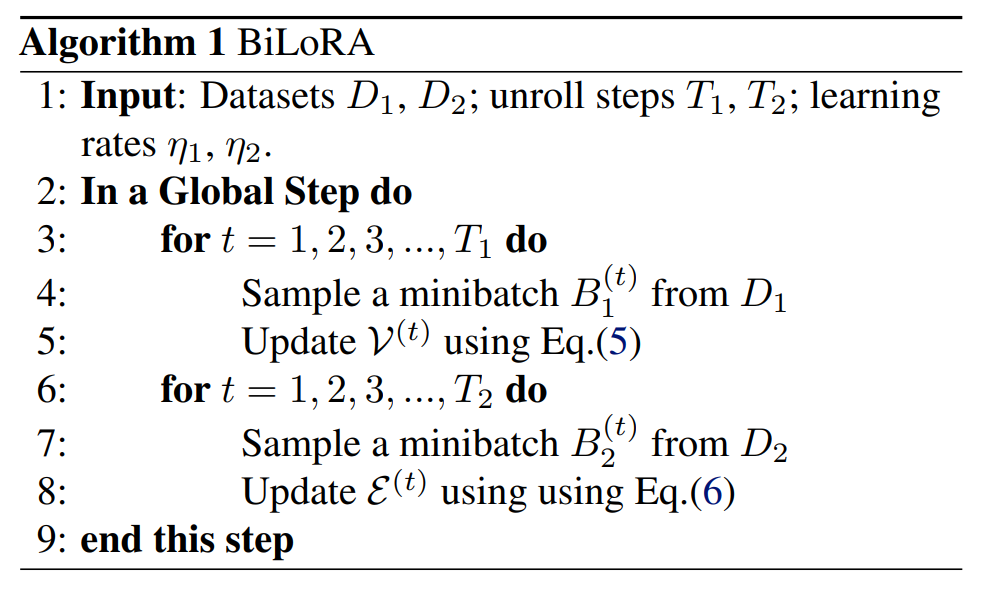
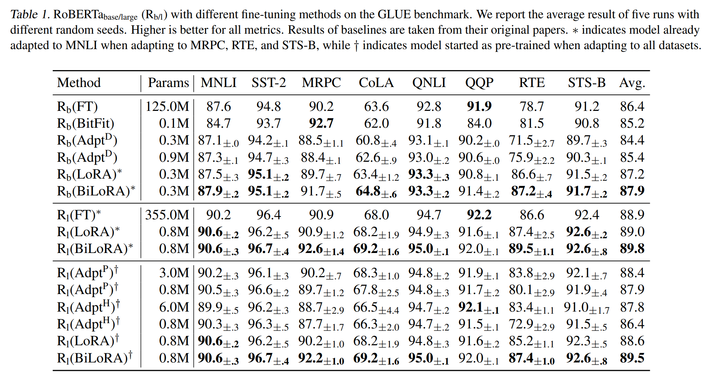
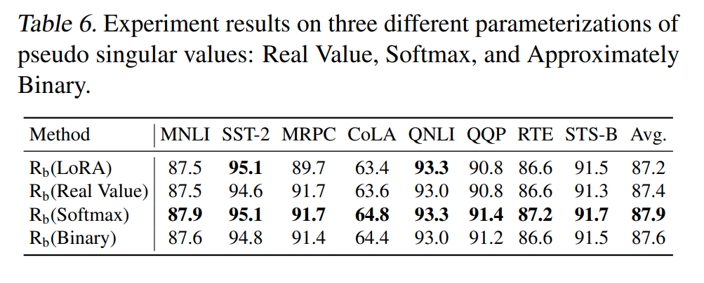
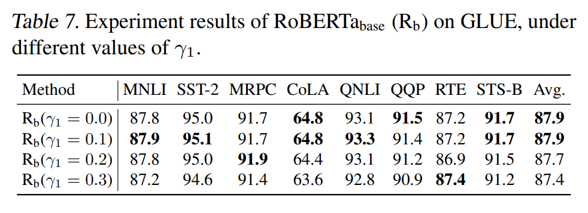
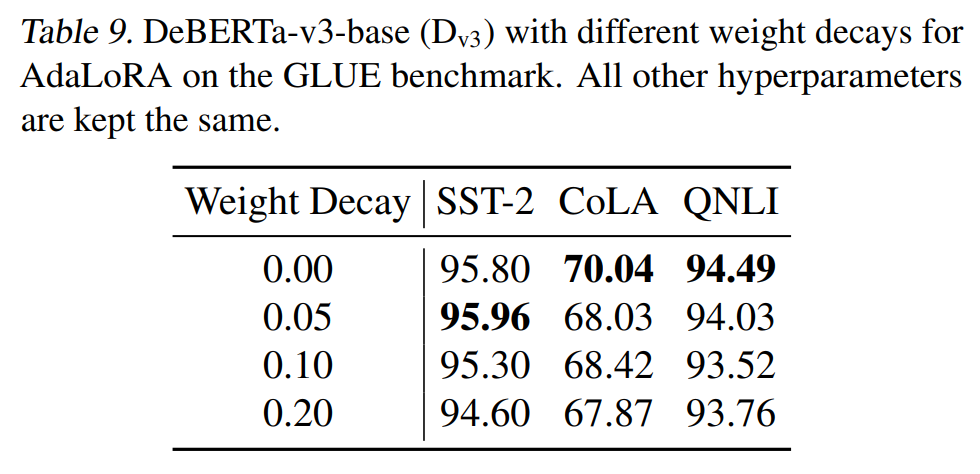
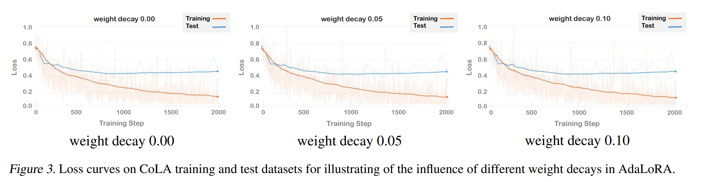

논문 및 이미지 출처 : <https://arxiv.org/pdf/2403.13037>

# Abstract

Low-rank adaptation (LoRA)는 large-scale pre-trained model 을 downstream task 에 맞춰 fine-tuning 하는 데 널리 사용되는 방법으로, low-rank incremental matrices 를 학습한다. 

LoRA 와 그 variants 는 full fine-tuning 방법에 비해 trainable parameter 수를 효과적으로 줄이지만, 종종 training data 에 over-fitting 되어 test data 에서 sub-optimal generalization 을 보인다. 

이를 해결하기 위해, 저자는 bi-level optimization (BLO) 을 기반으로 한 over-fitting 방지 fine-tuning 접근 방식인 BiLoRA 를 도입한다. 

- BiLoRA 는 low-rank incremental matrices 를 parameterizing 하기 위해 pseudo singular value decomposition 를 사용하고, pseudo singular vectors 와 values 의 학습을 two different training data subsets 로 나눈다. 
- 이 split 은 BLO framework 의 separate level 에 내재되어 있으며, single dataset 에 over-fitting 될 위험을 줄여준다. 
- NLU 와 NLG 를 아우르는 10 datasets 에서 테스트되었으며, 다양한 large-scale pre-trained model 에 적용한 결과, BiLoRA 는 유사한 trainable parameter 수를 사용하면서도 LoRA 방법과 다른 fine-tuning 접근 방식보다 훨씬 더 나은 성능을 보였다.

# 1. Introduction

large-scale language models(LLMs)은 다양한 NLP 에서 놀라운 성능을 입증했다. 

LLM 을 real-application 에 적용하는 일반적인 방법은 extensive dataset 에 initial pre-training 후, specific downstream task 에 맞춘 fine-tuning 으로 이루어진다. 

그러나 LLM 의 크기가 커짐에 따라, 모델의 all parameters 를 업데이트하는 full fine-tuning 은 상당한 계산 비용을 초래한다. 

또한, 이러한 pre-trained model 의 extensive parameter 수는 fine-tuning 과정에서 over-fitting 의 위험을 높인다. 

이러한 문제를 해결하기 위해, 다양한 Parameter-Efficient Fine-Tuning (PEFT) 방법이 개발되어, fine-tuning 해야 하는 parameter 수를 minimizing 하면서도 모델의 성능을 유지하는 것을 목표로 하고 있다.

---

Low-Rank Adaptation (LoRA) 는 low-rank update matrices(LRUMs)을 pre-trained weight matrices 에 도입하는 PEFT 방법 중 하나이다. 

- 이 LRUMs 는 two smaller matrices 의 곱으로 간결하게 표현된다. 
- fine-tuning 과정에서 LRUMs 만이 조정되며, original pre-trained weight 는 변경되지 않는다. 
- LoRA 와 variants 인 AdaLoRA 는 전통적인 full fine-tuning 과 비교했을 때 trainable parameter 수를 효과적으로 줄이지만, 저자의 종합적인 실험 결과에 따르면 이러한 방법들도 여전히 over-fitting 의 경향이 있다. 

Fig. 1 은 이러한 경향을 설명하는 예시를 제공한다.

- fine-tuning 이 진행됨에 따라 LoRA 와 AdaLoRA 모두에서 training loss 와 test loss 간의 격차가 더 커지는 것을 관찰할 수 있다. 
- 일정 횟수 이상의 iteration 이후, test loss 가 증가하는 반면 training loss 는 계속 감소하는 것을 확인할 수 있는데, 이는 LoRA 와 AdaLoRA 가 training data 에 over-fitting 되는 경향을 명확히 보여준다.

---

전통적인 LoRA 방법의 한계를 극복하기 위해, 저자는 bi-level optimization (BLO)를 통해 over-fitting 을 방지하는 novel fine-tuning 방법인 BiLoRA 를 소개한다. 

- bi-level optimization 는 two nested optimization 문제로 구성: 
  - lower level 의 optimal variables 는 upper level 의 objective function 에 대한 input 으로 사용되고, upper level 에서의 non-optimal variables 는 lower level 의 objective function 에 대한 input 으로 사용된다. 
  - BiLoRA 에선 각 low-rank update matrices 를 $\Delta W = P \Lambda Q$ 로 parameterizing 하며, 이는 singular value decomposition 와 유사하다. 
- $\Lambda$ 를 singular value matrix 로 근사하기 위해 $P$ 와 $Q$ 의 orthogonal 를 보장하는 regularization 을 적용한다. 
  - 저자의 공식화의 lower level 에서, 저자는 training dataset $D$ 의 subset $S$ 에 대한 fine-tuning loss 를 minimizing 하여 $\{P, Q\}$ matrices 를 학습한다. 
    - 이 phase 에선 $\Lambda$ 가 고정된다. 
    - 결과적으로 learned optimal matrices, 즉 $\{P^*(\Lambda), Q^*(\Lambda)\}$ 는 $\Lambda$ 에 직접적으로 의존한다. 
  - 그 후, upper level 에서 저자는 $\{P^*(\Lambda), Q^*(\Lambda)\}$ 를 dataset $D \setminus S$ 의 나머지 부분에 대해 평가한다. 
  - 이 validation loss 는 $\Lambda$ 의 learning process 를 이끌며, 이 loss 를 minimizing 한다. 
- $\{P, Q\}$ 와 $\Lambda$의 learning process 를 data 의 서로 다른 subset 과 optimization problem 의 다른 수준로 분할함으로써, BiLoRA 는 specific dataset 에 대한 over-fitting 을 효과적으로 완화한다.

---

BiLoRA 의 over-fitting 방지 메커니즘은 Differentiable Architecture Search (DARTS) 의 잘 확립된 방식에서 영감을 받았다. 

- 일반적으로, search space 에서 candidate operations (e.g., convolution, pooling)의 weight parameters 는 training dataset 을 사용하여 학습되고, 아키텍처는 이러한 tasks 를 final model 에 선택하는 learnable scores 로 특성화하여 별도의 validation set 을 사용해 학습된다. 
  - 이 접근 방식은 training data 에 over-fitting 되는 것을 방지한다. 
  - 만약 아키텍처도 training set 을 사용해 학습된다면, 이는 all candidate operations 를 포함시켜 training data 를 철저히 맞추는 overly complex model 을 초래할 가능성이 크다. 
  - 하지만 이러한 모델은 test data 에 적용될 때 generalization 성능이 떨어지며, 이는 training dataset 의 특성에 과도하게 맞춰진 결과이다. 
- LoRA framework 에서는 pseudo singular value 을 'architecture' 로, pseudo singular vectors 를 candidate operations 에 비유할 수 있다. 
  - update matrices 의 SVD 형태를 $\Delta W = P \Lambda Q$ 로 나타내면, 이를 $\Delta W = \sum_{i=1}^{r} \Lambda_{ii} P_i Q_i^\top$ 로 다시 쓸 수 있으며, 이는 $r$ rank-1 matrices 의 가중합을 나타낸다. 
  - 각 matrix 는 left and right singular vectors ($P_i$ 및 $Q_i$) pairs 에 의해 형성되며, $\Lambda_{ii}$ 라는 singular value 에 의해 가중된다. 
- 이 맥락에서, 각 rank-1 matrix $P_i Q_i^\top$ 은 'candidate operations' 으로 볼 수 있다. 
  - 해당 singular value $\Lambda_{ii}$ 는 $P_i Q_i^\top$ 의 weight 를 조정하는 'architecture' variable 로 작동한다. 
- 기존 LoRA 방법들처럼 single dataset 에서 loss function 을 minimizing 하여 'architecture' $\Lambda$ 와 'candidate operations' 인 $\{P,Q\}$ 를 동시에 최적화할 때 over-fitting 이 발생한다. 
- 반면, BiLoRA 접근 방식은 DARTS 의 올바른 구현과 일치한다. 
  - BiLoRA 는 'architecture' $\Lambda$ 를 training data 의 subset 인 'validation set' 을 사용해 최적화하고, 'candidate operations' 인 $\{P,Q\}$ 는 training data 의 다른 subset 에서 학습된다. 
  - 따라서 BiLoRA 은 over-fitting 에 더 강하다.

**Contributions**

- 저자는 LoRA 와 variants 에서 over-fitting 을 완화하기 위한 novel bi-level optimization 접근 방식을 도입했다. 
  - 기존 방법들이 전체 incremental matrices 를 single dataset 에서 훈련하는 것과 달리, 저자의 접근 방식은 서로 긴밀하게 연결된 different optimization problem 의 different levels 에서 distinct parameter subsets 의 학습을 분할한다. 
  - 이 전략은 single dataset 에 over-fitting 되는 것을 효과적으로 줄인다.
- BiLoRA 의 효능은 RoBERTa, DeBERTa, GPT2 같은 주요 pre-trained model 을 활용해 NLU 및 NLG 를 아우르는 10 datasets 에서 검증되었다. 
  - LoRA, AdaLoRA 및 기타 fine-tuning 방법과 비교했을 때, 저자의 접근 방식은 trainable parameter 수를 비슷하게 유지하면서도 더 우수한 성능을 보여준다.

# 2. Related Work

#### Low-Rank Adaptation.

Li et al. (2018) 과 Aghajanyan et al. (2020) 은 널리 사용되는 pre-trained model 이 very los intrinsic dimension 을 가지고 있으며, reduced dimensionality 의 reparameterization 을 사용하여 유사한 fine-tuning 성능을 달성할 수 있음을 보여주었다. 

이는 low-rank adaptation (LoRA)이 LLMs 의 fine-tuning 을 위해 도입되는 영감을 제공했다. 

LoRA 는 frozen pre-trained weights 에 low-rank matrix 로 incremental updates 를 도입한다.

update matrices 를 two low-rank matrices 의 곱으로 reparameterization 함으로써, LoRA 는 trainable parameters 를 크게 줄이면서도 full fine-tuning 보다 성능을 유지하거나 개선한다. 

여러 방법이 LoRA 의 time/memory efficiency 와 성능을 개선하기 위해 제안되었다. 

- DyLoRA 는 learned representation 을 동적으로 정렬하여 multiple rank 로 low-rank updates 를 최적화한다. 
- QLoRA 는 LLMs fine-tuning 을 위한 메모리 장벽을 낮추기 위해 memory footprint 를 줄이는 여러 전략을 도입했다. 
- LoraHub 는 new task 에서 few examples 만 사용하여 다양한 task 에서 훈련된 LoRA module 을 효율적으로 결합하는 데 초점을 맞추고 있다. 
- AdaLoRA 는 모듈의 중요도에 따라 parameter budget 을 적응적으로 할당하여 specific budget setting 에서 fine-tuning 성능을 개선한다. 
  - 이는 singular value decomposition 의 형태로 incremental updates 를 reparameterization 하며, training 중에 importance scores 에 따라 singular value 을 iteratively pruning 한다.

이러한 기존 방법들과 달리, 저자는 singular value 과 singular vectors 를 two different optimization levels 에서 separately training 함으로써 single dataset 에 over-fitting 위험을 효과적으로 완화한다.

#### Bi-level Optimization (BLO).

bi-level optimization(BLO)는 meta-learning, hyper-parameter optimization, neural network architecture search, reinforcement learning 등 다양한 머신 러닝 방법을 공식화하는 데 많은 주목을 받았다. 

BLO 를 다양한 머신 러닝 문제에 적용하는 것 외에도, 이 specific optimization problem 를 해결하기 위한 다양한 알고리즘이 제안되었다. 

Bayesian optimization 같은 zeroth-order methods, hypergradients 기반의 first-order algorithms 등이 있다.

Gradient-based BLO 는 많은 trainable parameters 를 가진 high-dimensional problems 로 확장하는 데 효율적이다. 

저자는 gradient-based BLO 의 적용 범위를 확장하고 LoRA 의 generalization 성능을 향상시키기 위한 효율적인 훈련 framework 를 구축했다.

# 3. Methods

저자는 BiLoRA(Fig. 2)라는 novel bi-level optimization 기반의 LoRA style fine-tuning framework 를 제안한다. 

AdaLoRA 와 유사하게, BiLoRA 에서 incremental matrices 은 trainable pseudo singular vectors $\mathcal{V}$ 와 pseudo singular value $\mathcal{E}$ 로 이루어진 pseudo SVD 형태로 reparameterization 된다. 

저자는 training dataset 을 two non-overlapping subset $D_1$ 과 $D_2$ 로 나눈다. 

- lower level 에서, 저자는 $\mathcal{E}$ 를 고정한 상태에서 $\mathcal{V}$ 를 $D_1$ 에서 훈련한다.
  - optimal solution $\mathcal{V}^*(\mathcal{E})$ (이는 $\mathcal{E}$ 의 functional) 는 upper level 로 전달된다. 
- upper level 에서는 $D_2$ dataset 을 사용해 $\mathcal{E}$ 를 훈련하며, 업데이트된 $\mathcal{E}$ 는 다시 lower level 로 전달된다. 
- two levels 의 optimization problem 은 수렴할 때까지 반복적으로 해결된다.

## 3.1. Parameterization of Low-Rank Incremental Matrices

(Zhang et al., 2023) 을 따르며, low-rank incremental matrices $\Delta W$ 를 SVD 를 모방한 형태인 $\Delta W = P \Lambda Q$ 로 reparameterization 한다. 

- diagonoal matrix $\Lambda$ 는 _pseudo singular value_ 를 포함하고, approximately orthogonal matrices $P$ 와 $Q$ 는 각각 _pseudo left/right singular vectors_ 를 나타낸다. 
- 저자는 incremental matrices 를 $k$ 로 indexing 하여, $k=1, \ldots, n$ 에서 $\Delta W_k = P_k \Lambda_k Q_k$ 로 나타내며, 
  - $n$ : LoRA layer 수
- $\Delta W_k$ 의 $i$-th singular value 를 $\lambda_{k,i}$ , low-rank matrix 의 rank 를 $r$ 로 나타낸다. 
- 저자는 parameter sets 를 $\mathcal{P} = \{P_k\}_{k=1}^{n}$, $\mathcal{E} = \{\Lambda_k\}_{k=1}^{n}$, $\mathcal{Q} = \{Q_k\}_{k=1}^{n}$, 그리고 $\mathcal{V} = \{P, Q\}$ 로 정의한다. 
- $P_k$ 와 $Q_k$ 가 approximately orthogonal 하기 위해, AdaLoRA 에서 사용된 다음의 regularization 항을 적용한다:

$$
\begin{equation}
  R_1 = \sum_{k=1}^{n} \left( \|P_k^T P_k - I \|_F^2 + \|Q_k Q_k^T - I \|_F^2 \right), 
\end{equation}
$$

- $I$ : identity matrix
- $\| \cdot \|_F$ : Frobenius norm

#### Parameterization of Pseudo Singular Values. 

저자는 $\Lambda$ 에서 pseudo singular value 을 세 가지 특정 형태로 reparameterization 한다.

- **Real-Value**: all pseudo singular values 는 아무 constraint 없이 Real-Value 를 가진다.
- **Softmax**: real vector $v$ 가 주어졌을 때, 저자는 이에 softmax 연산을 적용한다. $softmax(v)$ 는 pseudo singular value 로 사용된다. 이 values 는 모두 합하여 1 이 되며, 각 singular vector pair 의 기여도를 나타낸다.
- **Approximately Binary**: real vector $v$ 에 대해, element-wise sigmoid 연산을 적용하여 $v$ 의 값을 $(0, 1)$ 범위로 변환한다. 그런 다음, element-wise entropy regularization term 을 사용하여 $sigmoid(v)$ values 가 0 또는 1 에 가깝도록 유도한다. 이 regularization term 은 다음과 같이 정의된다:

$$
\begin{equation}
  R_2(\mathcal{E}) = \sum_{k=1}^{n} \sum_{i=1}^{r} \lambda_{k,i} \log \lambda_{k,i} + (1 - \lambda_{k,i}) \log (1 - \lambda_{k,i}).
\end{equation}
$$

이 설정은 각 singular vector pair 에 대응하는 singular value 를 0 또는 1 로 자동으로 할당하여, singular vector pair 의 중요도를 높이거나 낮춘다.

## 3.2. A Bi-level Optimization Framework

BiLoRA 은 bi-level optimization 에 기반을 두고 있으며, pseudo singular vector matrices $\mathcal{V}$ 와 이에 대응하는 pseudo singular value matrix $\mathcal{E}$ 를 각각 lower level 과 upper level 에서 trainable parameters 로 설정한다.

#### Lower Level.

lower level 에서 저자는 first dataset $D_1$ 과 low-rank incremental matrices $\{\Delta W_k\}_{k=1}^{n}$ 을 기반으로 loss function $C$ 를 minimizing 하면서 pre-trained model 의 LoRA fine-tuning 을 수행한다. 

- $C$ 계산은 각 input example $x$ 에 대해 $W_0 x + \Delta W x = W_0 x + P \Lambda Q x$ 의 forward pass 를 포함한다. 
  - $W_0$ : pre-trained model 의 weight matrix
  - $R_1$ 은 $P$ 와 $Q$ 의 approximate orthogonal 를 촉진하기 위해 Eq. (1) 에 적용된다. 
- overall training objective 는 $L_1 = C(\mathcal{V}, \mathcal{E}; D_1) + \gamma_1 R_1(\mathcal{V})$ 이며, 
  - $\gamma_1$ : trade-off parameter
- 이 level 에선 $\mathcal{E}$ 를 고정한 상태에서 $\mathcal{V}$ 만 training 하며, $\mathcal{E}$ 는 upper level 에서 업데이트된다. 
- 결과적으로, lower level 은 다음과 같은 문제를 해결하는 것으로 귀결된다:

$$
\begin{equation}
  \mathcal{V}^*(\mathcal{E}) = \argmin_\mathcal{V} \ C(\mathcal{V}, \mathcal{E}; D_1) + \gamma_1 R_1(\mathcal{V}).
\end{equation}
$$

$\mathcal{V}^*(\mathcal{E})$ 는 $C$ 가 $\mathcal{E}$ 에 의존하기 때문에 $\mathcal{V}^*$ 도 $\mathcal{E}$ 에 의존한다.

#### Upper Level.

upper level 에선, optimally learned $\mathcal{V}^*(\mathcal{E})$ 와 unlearned pseudo singular
values $\mathcal{E}$ 로 reparameterized incremental matrices 를 사용하여 second dataset $D_2$ 에서 fine-tuned model 을 검증한다. 

- 이로 인해 $\mathcal{E}$ 의 function 인 validation loss $C(\mathcal{V}^*(\mathcal{E}), \mathcal{E}; D_2)$ 가 생긴다. 
- 저자는 이 loss 을 minimizing 함으로써 $\mathcal{E}$ 를 학습한다. 
- 선택적으로, Eq. (2) 에 있는 regularization term $R_2$ 를 사용하여 $\mathcal{E}$ 의 pseudo singular value 이 Approximately Binary 되도록 유도할 수 있다. 
- overall objective function 는 $L_2 = C(\mathcal{V}^*(\mathcal{E}), \mathcal{E}; D_2) + \gamma_2 R_2(\mathcal{E})$ 이며, 
  - $\gamma_2$ : trade-off parameter
- 이 level 은 다음 optimization problem 를 해결하는 것으로 귀결된다:

$$
\begin{equation}
  \min_\mathcal{E} C(\mathcal{V}^*(\mathcal{E}), \mathcal{E}; D_2) + \gamma_2 R_2(\mathcal{E}).
\end{equation}
$$

#### A Bi-level Optimization Framework.

이 two interdependent levels optimization problems 를 통합하면 다음과 같은 bi-level optimization framework 를 얻는다:

$$
\begin{aligned}
  &\min_\mathcal{E} C(\mathcal{V}^*(\mathcal{E}), \mathcal{E}; D_2) + \gamma_2 R_2(\mathcal{E}) \\
  \text{s.t.} \quad &\mathcal{V}^*(\mathcal{E}) = \argmin_\mathcal{V} C(\mathcal{V}, \mathcal{E}; D_1) + \gamma_1 R_1(\mathcal{V})
\end{aligned}
$$

이 optimization problems 의 two levels 은 서로 상호 의존적이라는 점에 유의해야 한다. 

lower level 의 output 인 $\mathcal{V}^*(\mathcal{E})$ 는 upper level 의 input 이 되며, upper level 의 optimization variable $\mathcal{E}$ 는 lower level 의 input 이 된다. 

이 two interconnected problems 를 공동으로 해결함으로써, pseudo singular vectors 와 values 을 end-to-end 로 학습할 수 있다.

#### Optimization Algorithm.

저자는 이 bi-level optimization 문제를 해결하기 위해 gradient-based optimization algorithm 을 사용한다. 

overall optimization algorithm 은 Algorithm 1 에 요약되어 있다. 

구체적으로, lower level 에선 pseudo singular vector matrices $\mathcal{V}$ 에 대해 preset $T_1$ steps 동안 gradient descent 를 수행하여 $\mathcal{V}^*(\mathcal{E})$ 의 optimal solution 를 근사한다. 

initial $\mathcal{V}$ 를 $\mathcal{V}^{(0)}$ 로 하고 learning rate 를 $\eta_1$ 로 설정하면, gradient descent 단계는 다음과 같이 공식화할 수 있다:

$$
\begin{equation}
  \mathcal{V}^{(t)} = \mathcal{V}^{(t-1)} - \eta_1 \frac{d L_1}{d \mathcal{V}^{(t-1)}}, \quad \text{for } t = 1, 2, 3, \ldots, T_1. \tag{5}.
\end{equation}
$$

- 저자는 $\mathcal{V}^*(\mathcal{E}) \approx \mathcal{V}^{(T_1)}$ 를 upper level 의 overall objective function 에 대입하여 approximate objective function $\hat{L}_2 = C(\mathcal{V}^{(T_1)}, \mathcal{E}; D_2) + \gamma_2 R_2(\mathcal{E})$ 를 얻는다. 
- 그런 다음, pseudo singular value $\mathcal{E}$ 에 대해 preset $T_2$ steps 동안 gradient descent 를 수행하여 $\hat{L}_2$ 를 minimizing 한다. 
- initial $\mathcal{E}$ 를 $\mathcal{E}^{(0)}$ 로 하고 learning rate 를 $\eta_2$ 로 설정하면, gradient descent step  은 다음과 같이 공식화할 수 있다:

$$
\begin{equation}
  \mathcal{E}^{(t)} = \mathcal{E}^{(t-1)} - \eta_2 \frac{d \hat{L}_2}{d \mathcal{E}^{(t-1)}}, \quad \text{for } t = 1, 2, 3, \ldots, T_2.
\end{equation}
$$

- 이 steps 는 one global optimization step 을 구성한다. 
- 저자는 lower level 과 upper level 간의 iterative global steps 를 통해 이 bi-level optimization 문제를 해결하여 수렴할 때까지 진행한다. 
- chain rule 을 따를 때, upper level 의 hypergradient 는 다음과 같이 계산할 수 있다:

$$
\begin{equation}
  \frac{d \hat{L}_2}{d \mathcal{E}} = \frac{\partial \hat{L}_2}{\partial \mathcal{E}} + \frac{\partial \mathcal{V}^{(T_1)}}{\partial \mathcal{E}} \times \frac{\partial \hat{L}_2}{\partial \mathcal{V}^{(T_1)}}.
\end{equation}
$$

# 4. Experiments

저자는 BiLoRA 의 downstream 성능을 RoBERTa, DeBERTa 및 GPT-2 에서 평가하고, LoRA, AdaLoRA 및 기타 baseline 모델들과 비교했다. 

- 실험은 NLU 부터 NLG 까지 다양한 tasks 를 포함했다. 
- 특히, RoBERTa 와 DeBERTa 는 GLUE 벤치마크 에서 평가하였고, GPT-2 는 E2E NLG 에서 평가했다. 
- DeBERTa-xxlarge(1.5B)를 사용하여 방법의 확장 성능을 평가했다. 
- 모든 실험은 NVIDIA A100 을 사용하여 진행했다.

## 4.1. Baselines

저자는 LoRA 와 AdaLoRA 와 동일한 baselines 와 비교했으며, 이전 연구에서 보고된 결과를 사용했다. 

또한, LoRA 와 AdaLoRA 를 baselines 로 삼아 BiLoRA 의 효과성을 평가했다. 

- **Full Fine-Tuning (FT)** 은 일반적으로 사용되는 적응 방법이다. 
  - 모델은 pre-trained weight 와 bias 로 초기화되고, all model parameters 는 gradient update 의 대상이 된다. 
  - 저자는 GPT-2 에 대한 이전 연구에서 보고된 simple variant 도 포함했는데, 이는 last two linear layers 만 tuning 하고 나머지는 고정한다. 
- **Bias-only or BitFit** 은 bias vectors  만 훈련하고 나머지는 고정하는 효과적인 PEFT 방법이다.
- **Prefix-embedding tuning (PreEmbed)** 은 input token 내에 specialized tokens 를 도입하며, 일반적으로 model vocabulary 에 속하지 않는 trainable word embeddinbgs 을 featuring 한다.
- **Prefix-layer tuning (PreLayer)** 은 각 Transformer layers 이후의 activations 를 학습하여 이전 층에서 계산된 activations 를 trainable parameters 로 교체하는 방법이다. 
  - 이 방법은 prefix-embedding tuning 의 확장으로 볼 수 있다. 
- **Adapter tuning** 은 MLP module 이나 self-attention module 과 같은 neural module 사이에 layer adapter 를 삽입한다. 저자는 LoRA 같이 4 types adapter 를 사용했다: 
  - Adapter$^L$ 은 MLP module 후와 LayerNorm 이후에만 adapter layer 를 적용하며, 
  - Adapter$^D$ 는 효율성을 높이기 위해 일부 adapter layer 를 생략한다.
  - Adapter$^H$ 는 adapter layer 내에 nonlinearity two fully connected layers 를 포함한다.
  - Adapter$^P$ 는 Adapter$^L$ 과 유사하지만 multiple source tasks 의 knowledge 를 결합하기 위해 novel two-stage transfer learning 전략을 도입한다.
- **LoRA** 는 pre-trained weight matrices 에 trainable incremental update matrices 를 추가한다. 
  - LoRA 의 실험 설정을 따르며, 공정한 비교를 위해 BiLoRA 를 $W_q$ 및 $W_v$ matrices (self-attention module 의 query 및 value weight matrices)에 적용했다. 
- **AdaLoRA** 는 SVD-based adaptation 및 rank-allocation 을 제안하며, incremental matrices 를 singular value decomposition 형태로 공식화하고 importance scores 에 따라 rank budget 을 할당한다.

## 4.2. Natural Language Understanding

NLU task 를 위해, 저자는 RoBERTa 와 DeBERTa 에 대해 General Language Understanding Evaluation (GLUE) 벤치마크에서 실험을 진행했다. 

#### Implementation Details.

저자의 구현은 Huggingface Transformers 및 Betty 를 기반으로 한다. 

Betty 는 large-scale multilevel optimization (MLO) 문제를 해결하기 위한 소프트웨어 라이브러리이다. 

구체적으로, 저자는 Huggingface Transformers 로 RoBERTa 와 DeBERTa 모델을 로드하고, Betty 를 사용하여 저자의 bi-level optimization framework 를 구축한다.

#### Experimental Settings.

- LoRA 를 따르며, GLUE 의 dev set 을 test data 로 사용했다. test set 은 공개되지 않았다. 
- 저자는 training set 을 two dataset 으로 나누었으며, 8:2 비율로 lower-level 및 upper-level dataset 으로 각각 활용했다. 
- all tasks 에 대해 이 fixed ratio 를 유지했다. 
- singular value 는 별도로 명시되지 않는 한 Softmax 로 reparameterization 되었고, lower level 에 $R_1$ 이 regularizer 로 추가되었다. 
- RoBERTa base/large 에 대해서는 LoRA 와 동일한 실험 설정을 유지했다. 
- DeBERTa-v3-base 에 대해서는 AdaLoRA 와 유사한 실험 설정을 유지하되, lower parameter budget 을 유지했다. 
- 또한, sequence length, 총 batch size, LoRA rank 및 LoRA alpha 같은 hyper-parameter 는 필요한 경우 LoRA/AdaLoRA 와 정확히 동일하게 유지했다. 
- 이러한 실험 설정은 all baselines 와의 공정한 비교를 가능하게 한다. 

#### Main Results.

LoRA 와 마찬가지로 MNLI 의 overall (match 및 mismatch) accuracy, CoLA 의 Matthew correlation, STS-B 의 Pearson correlation, 그리고 other tasks 의 accuracy 를 보고한다. 

Tab. 1 은 GLUE dev set 에서 RoBERTa base/large 의 결과를 보여준다. 

- 동일한 수의 trainable parameters 를 사용하여 all datasets 에서 LoRA 를 초월한다. 
- 대부분의 dataset 에서 baselines 와 비교하여 더 나은 성능을 발휘하거나 동등한 성능을 보인다. 
- BiLoRA 의 avg acc 는 all baselines 를 현저히 초과한다. 

Tab. 2 는 GLUE dev set 에서 DeBERTa-v3-base 의 결과를 보여준다. 

- BiLoRA 는 동일하거나 less trainable parameter 로 all baselines 를 초과한다. 
- BiLoRA 가 baselines 에 비해 달성한 개선은 two distinct sub-dataset 에서 pseudo singular vectors 와 values 를 훈련하는 bi-level learning 메커니즘 덕이다. 
- 그 결과, 특정 dataset 에 대한 over-fitting 위험을 효과적으로 완화하고 better generalization 성능을 낸다. 
- 반대로, baselines 는 all parameters 를 동일한 dataset 에서 훈련하여 이 dataset 에 대한 over-fitting 을 초래한다. 
- 이는 CoLA, RTE, MRPC 같은 small dataset 에서 over-fitting 이 더 자주 발생하는 경향이 있다는 점에서, BiLoRA 가 baselines 보다 더 큰 차이로 성능을 발휘하는 것으로 입증된다.

## 4.3. Natural Language Generation

NLG tasks 에 대해서는 Prefix-Tuning 과 LoRA 의 설정을 따라 GPT-2 에서 LoRA 및 다른 fine-tuning 방법과 직접 비교했다. 

E2E NLG 챌린지에서 GPT-2 medium 과 large 를 평가했다. 

#### Implementation Details.

저자의 구현은 Huggingface 의 GPT-2 fine-tuning code 와 Betty 를 기반으로 한다. 

구체적으로, 저자는 Huggingface code 를 사용하여 GPT-2 모델을 로드하고, Betty 를 통해 저자의 bi-level optimization framework 를 구축했다.

#### Experimental Settings.

- BiLoRA 에선 training set 와 validation set 을 각각 lower level 및 upper level dataset 로 사용하고, test set 에서 성능을 보고한다. 
- singular value 은 특별한 언급이 없는 한 Softmax 로 reparameterization 했다. 
- LoRA 와 동일한 실험 설정을 유지했다. 
- 구체적으로, sequence length, batch size, LoRA rank, LoRA alpha, Label smoothing 같은 hyper-parameter 를 LoRA 와 정확히 동일하게 유지했다. 
- 이러한 실험 설정은 LoRA 및 기타 fine-tuning 방법과의 공정한 비교를 가능하게 한다.

#### Main Results

Tab. 3 과 Tab. 4 는 E2E test set 에서 GPT-2 medium/large 의 결과와 WebNLG 및 DART test set 에서 GPT-2 medium 의 결과를 보여준다. 

- BiLoRA 은 all metrices 에서 GPT-2 M 및 GPT-2 L 에 대해 LoRA 와 다른 방법을 초과한다. 
- 결과는 NLG downstream tasks 에서 BiLoRA 의 효과성과 다양한 모델 및 작업 유형에 대한 generalization 능력을 입증한다.

## 4.4. Analysis

#### Scaling Up to DeBERTa-XXL.

저자는 DeBERTa-v2-xxlarge(1.5B)를 사용하여 BiLoRA 의 확장 성능을 평가했다. 

이 연구는 LoRA 와 동일한 실험 설정을 유지하는 데 필요한 computation resource 제약으로 인해 GLUE 벤치마크의 3 dataset 에서 수행되었다. 

- BiLoRA 가 LoRA 및 full fine-tuning (FT)과 비교하여 더 나은 또는 동등한 성능을 달성함을 보여주며, 이는 BiLoRA 가 parameter 가 매우 많은 모델을 fine-tuning 할 때 better generalization 을 제공함을 나타낸다.

#### Ablation Studies on Pseudo Singular Values.

Sec. 3.1 에서 저자는 pseudo singular value 을 reparameterization 하는 세 가지 방법: Real Value, Softmax, Approximately Binary 를 소개했다. 

저자는 다른 실험 설정을 동일하게 유지한 채 이 3 reparameterization 방법을 사용하여 실험을 진행했다. 

GLUE dataset 에서 RoBERTa 의 성능을 테스트했다. 

- Softmax reparameterization 가 최고의 성능을 보이며, Approximately Binary 가 근소한 차이로 2 위를 차지함을 보여준다. 
- Softmax 와 Approximately Binary 는 singular value 이 positive values 여야 한다는 제약을 충족하기 때문에 Real Value 보다 성능이 우수하다. 
- Approximately Binary 는 값이 0 또는 1 에 가까워야 한다는 강한 제약을 부과하기 때문에 Softmax 보다 약간 낮은 성능을 보인다. 
- 이러한 제약은 reparameterization representation 을 제한한다. 
- 또 다른 관찰은 3 reparameterization 방법 모두에서 BiLoRA 가 LoRA 를 초과하며, 이는 BiLoRA 가 pseudo singular value 을 표현하는 다양한 방법에 대해 강인하다는 것을 보여주고, 따라서 best  reparameterization 를 선택하기 위한 광범위한 조정이 필요하지 않음을 나타낸다. 
- 저자는 또한 BiLoRA 와 AdaLoRA 의 singular value distribution 를 Fig. 5 에 제공한다. 

#### Ablation Study on Orthogonality-Promoting Regularization.

저자는 orthogonality-promoting regularizer $R_1$ 에 연관된 trade-off parameter $\gamma_1$ 가 BiLoRA 의 성능에 미치는 영향을 조사했다. 

- 이는 RoBERTa-base 에 대해 수행되었으며, Tab. 7 결과는 BiLoRA 이 다양한 $\gamma_1$ values 에 대해 견고하다는 것을 보여준다. 
- 이는 BiLoRA 이 hyper-parameter 를 광범위하게 조정할 필요가 없음을 의미한다. 
- 또한, 저자는 singular vectors 의 orthogonal 를 설명하고, 견고성의 이유를 Fig. 6 및 7 에 보여준다.

#### Computation Costs.

Tab. 8 은 LoRA 와 BiLoRA 의 training time 을 보여준다. 

- BiLoRA 의 총 training time 은 8 dataset 에서 LoRA 보다 낮다. 
- 이는 BiLoRA 가 LoRA 보다 much fewer training epochs 로 수렴하기 때문이다. 
- pseudo singular value 의 Softmax reparameterization 에서 각 값은 평균이 $1/r$ 인 값으로 초기화되며, 이는 Real-Value 보다 크고, 전체 $\Delta W$ 의 크기를 증가시켜 훈련 과정에서 larger learning rate 를 허용한다. 
- bi-level optimization framework 는 training stability 에 영향을 미치지 않으면서 two levels 간의 iteratively optimizing 을 통해 이러한 larger learning rate 를 효과적으로 수용한다. 
- 이렇게 larger learning rate 를 사용함으로써, 비록 bi-level optimization 이 각 training steps 에서 더 오랜 시간이 걸리더라도, low-rank matrix training 을 위해 much fewer training steps  필요로 하여 총 training time 을 줄인다.

#### Other Methods Targeting Overfitting.

over-fitting 을 완화하기 위해 일반적으로 사용되는 몇 가지 실험 설정이 있다. 

AdaLoRA 의 경우, 두 가지 유망한 방법은 weight decay 를 증가시키고 보다 aggressive rank pruning setting 을 채택하는 것이다. 

- AdaLoRA 에 weight decay 를 증가시키는 것이 전체 성능의 감소를 초래함을 보여준다. 
- 저자는 rank pruning setting 의 효과를 추가로 조사하고 Fig. 3 에서 loss curves 를 통해 결과를 설명했다. 
- 두 실험 결과와 loss curves 는 이 두 가지 접근 방식이 over-fitting 문제를 효과적으로 해결하지 못하며 모델의 generalization 능력을 향상시키지 못함을 나타내어, BiLoRA 가 이 측면에서 over-fitting 을 완화하는 새로운 효과적인 방법임을 필요로 한다.

위의 결과들은 BiLoRA 가 훈련 성능을 향상시키면서 overall training time 을 줄인다는 것을 공동으로 입증한다.

이러한 결과는 BiLoRA 의 효과성을 뒷받침한다.

# 5. Conclusion and Future Work

저자는 LoRA 방법의 성능을 향상시키기 위해 over-fitting 문제를 다루는 novel bi-level optimization framework 인 BiLoRA 를 제안한다. 

- low-rank incremental matrices 의 SVD reparameterization 형식을 활용하여, BiLoRA 은 서로 다른 sub-dataset 에서 pseudo singular vectors 와 singular value 을 different optimization levels 에서 separate training 한다. 
- - 이러한 방법은 over-fitting 을 효과적으로 완화하면서 총 training time 을 줄이며, NLU 와 NLG task 에 대한 광범위한 실험에서 입증되었다.

BiLoRA 은 향후 연구를 위한 여러 잠재적인 방향을 열어준다: 1) pseudo singular value 의 reparameterization 형식은 automated rank selection 을 지원하도록 더 발전될 수 있다. 2) 저자의 bi-level optimization framework 는 fine-tuned model 의 generalization 능력을 향상시키며, 이와 관련하여 더 심층적인 이론적 분석을 장려한다. 