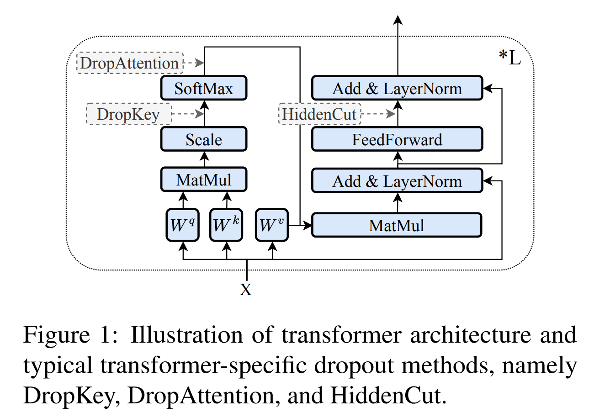
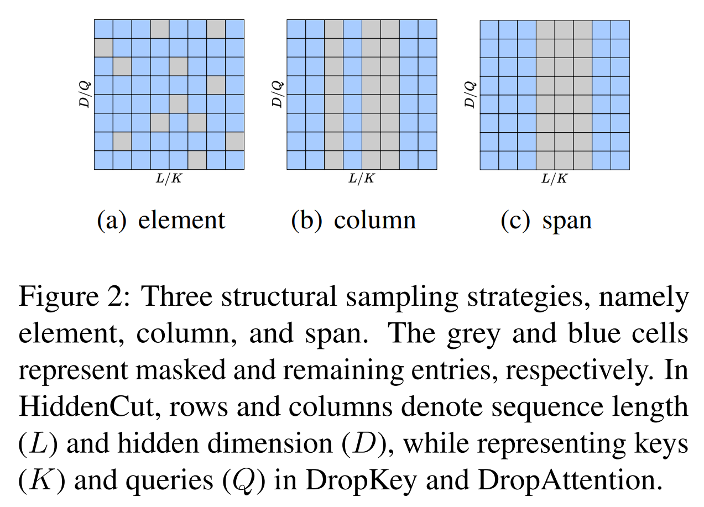
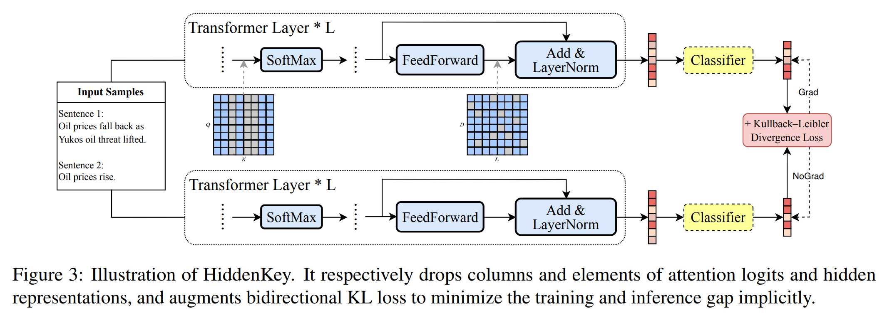

논문 및 이미지 출처 : <https://arxiv.org/pdf/2403.00812>

# Abstract

뛰어난 성능을 가진 large-scale language models(LLMs)은 수많은 NLP 에서 필수적인 요소로 자리 잡았으며, parameter-efficient fine-tuning, 특히 LoRA 는 model customizing 을 위한 lightweight approach 로 인기를 끌고 있다. 

한편, 초기에는 all parameters 를 업데이트하는 full fine-tuning 을 위해 설계된 다양한 dropout 방법들은 excessive parameter redundancy 와 관련된 overfitting 을 완화해준다. 

이에 따라, LoRA 와 같이 trainable parameter 가 매우 적은 상황에서 기존 dropout 방법의 효과와 잠재적 모순이 발생할 수 있지만, 이는 대부분 간과되었다. 

- 이를 해결하기 위해, 먼저 parameter-efficient 인 LoRA 도 overfitting 에 취약하다는 것을 확인했다. 
- 이후, transformer-specific dropout 방법들을 다시 검토하고, 이들의 수학적 및 실험적 동등성과 차이점을 확인했다. 
- 이러한 비교 분석을 바탕으로, dropping position, structure pattern 및 compensation measure 에 기반한 이 방법들을 통합적으로 조사할 수 있는  unified framework 를 제안했다. 
- 이 framework 를 통해, limited trainable parameter 가 있는 상황에서 이들 방법의 new preferences 와 performance comparisons 를 밝혔다. 
- 또한, 이 framework 를 통해 가장 유리한 측면들을 결합한 novel dropout 방법인 HiddenKey 를 제안했다.
- multiple models 와 task 에서 HiddenKey 의 뛰어난 우수성과 충분성을 확인한 실험을 통해, HiddenKey 는 LLMs 의 high-performance parameter-efficient fine-tuning 을 위한 최적의 접근 방식으로 부각되었다.

# 1 Introduction

최근 GPT-4, PaLM 2, LLaMA 2 같은 transformer models 는 billions parameter 로 확장되어 놀라운 성능 향상을 이루어냈다. 

이러한 모델을 downstream tasks 에 맞추어 커스터마이징할 때, parameter-efficient fine-tuning(PEFT) 은 lightweight method 으로 널리 채택되었다. 

이 방법은 대부분의 parameters 를 고정한 채, trainable parameter 를 추가하거나 일부만 업데이트한다. 

이러한 방법들 중에서 LoRA 는 high effectiveness, robustness and generality 덕에 가장 인기를 얻었다.  

---

이와 동시에, dropout 은 excessive parameter redundancy 으로 인한 overfitting 을 완화하기 위해 널리 사용되었다. 

dropout 의 variants 는, 예로 DropKey, DropAttention, HiddenCut 등이 transformer 에서 우수한 성능을 보여주었다. 

이들은 각각 주어진 확률로 attention logits, weights, hidden representations 을 randomly deactivate 한다. 

하지만 이러한 방법들은 all parameters 가 업데이트되는 full fine-tuning 시나리오에서만 효과가 검증되었으며, 이는 쉽게 excessive redundancy 을 유발할 수 있다. 

LoRA-based PEFT 시나리오에서는 trainable parameter 가 매우 제한적이므로, dropout 이 효과적이지 않을 가능성이 있다. 

게다가, 위에서 언급한 방법들은 독립적으로 제안되었으며, 이들을 체계적으로 통합할 명확한 가이드라인이 부족하여 종합적인 비교 분석과 더 효과적인 dropout 방법의 개발을 저해하고 있다.  

---

본 연구에서는 먼저 광범위한 실험을 통해 LoRA 도 쉽게 overfitting 에 취약하다는 것을 확인했다. 이는 이후 분석의 전제가 된다. 

- Fig. 5 처럼, rank 와 trainable parameter 가 증가할수록 모델 성능은 처음에 향상되다가 점차적으로 overfitting 으로 인해 저하된다. 
- Sec. 4 에서 제공된 추가 실험 결과들은 이 overfitting 취약성이 dropout 방법으로 개선될 수 있음을 확인해준다. 
- 또한, 위에서 언급한 transformer-specific dropout 방법들을 수학적으로 그리고 실험적으로 비교했다. 
- 처음으로 DropKey 와 DropAttention 이 동일한 forwarding process 를 공유하는 반면, gradient stopping 연산자가 DropAttention 의 backpropagation 에 gradient noise 를 도입하여 training stability 와 performance 를 저해한다는 것을 발견했다.  

이 비교 분석을 바탕으로, dropout 방법의 세 가지 핵심 차원을 식별하고 dropping position, structure pattern 및 compensation measure 에 따라 unified framework 를 도출했다. 

1. 이 framework 를 통해, LoRA 시나리오에서 이러한 방법들의 new preferences 를 실험적으로 밝혀냈다. 
   - 예로, span-wise HiddenCut 은 trainable parameter 가 제한되어 있기 때문에 더 이상 element-wise 방법보다 우수하지 않다는 것을 확인했다. 
2. 이 framework 는 서로 다른 방법들 간의 종합적인 비교를 가능하게 한다. 
   - 실험적으로는 DropKey 가 가장 좋은 성능을 보였고 HiddenCut 이 그 뒤를 따랐으며, DropAttention 은 gradient noise 로 인해 최악의 성능을 보였다. 
   - 대안적인 compensation measure 으로는 Bidirectional Kullback-Leibler (KL) divergence loss 가 일관되게 성능 향상을 가져왔으며, Jensen-Shannon (JS) consistency regularization loss 는 효과를 보이지 않았다.  

이 framework 를 바탕으로, 저자는 HiddenKey 라는 new dropout 방법을 도출했다.

- HiddenKey 는 attention logits 을 column-wise 로, hidden representations 을 element-wise 로 각각 drop 하고, vanilla loss 에 KL loss 를 추가한다. 
- 이 방법은 NLU 와 NLG task 모두에서 multiple models 에 걸쳐 일관되게 우수한 성능을 보여주었으며, 특히 dropout 방법이 NLG task 에 미치는 영향을 거의 간과했던 점을 보완한다. 
- input 및 output dropout 과 결합해도 추가적인 보완 효과는 제공되지 않아, 저자의 방법이 충분함을 입증했다. 
- 따라서 HiddenKey 는 NLU 와 NLG task 모두에서 LLM 의 high-performance parameter-efficient fine-tuning 을 위한 더 나은 방법으로 두각을 나타낸다.  

**Summary**  

- 다양한 dropout 방법과 LoRA 간의 잠재적 모순을 탐구하기 위한 최초의 종합적인 조사를 제시했다.  
- 세 가지 전형적인 transformer-specific dropout 방법을 이론적, 실험적으로 비교하고, dropout 방법 설계의 핵심 차원을 도출했다.  
- 기존 dropout 방법들을 구현할 수 있는 unified framework 를 제안하였으며, 이를 통해 이러한 방법들의 new preferences 와 성능 비교를 발견했다.
- LoRA 의 overfitting 취약성을 완화하는 데 탁월한 효과와 충분성을 보이는 HiddenKey 라는 new dropout 방법을 제안했다.

# 2 Preliminaries

이 섹션에서는 Fig. 1 에 나타난 3 transformer-specific dropout methods 를 재검토하여 이후 분석의 기초를 마련한다.

#### DropAttention.

DropAttention 은 self-attention 메커니즘을 위해 특별히 설계된 첫 번째 dropout 방법이다. 

- 이는 attention weights 의 요소나 key columns 를 randomly masking 하여, specific patterns 에 overfitting 하는 대신 multiple contextualized features 를 활용하도록 유도한다. 
- Eq. 1 과 2 에 따라, traditional regularization 대신 normalized rescaling 을 사용하여 attention weights 의 합이 1 이 되도록 보장하며, 이는 multiple NLP classification tasks 에서 더 나은 성능을 달성한다.

$$
\begin{align}
    &\bar{w}_j = m \cdot w_j, \quad m \sim \text{Bernoulli}(p), \\
    &w'_j = \frac{\bar{w}_j}{\text{NoGrad}\left(\sum_{j=0}^{l-1} \bar{w}_j\right)},
\end{align}
$$

- $p$, $l$, $w_j$, $\bar{w}_j$, $w'_j$ 는 각각 dropout rate, sequence length, original, masked 및 rescaled attention weight 이다.
- NoGrad() 와 Bernoulli() 는 각각 gradient stopping 연산자와 Bernoulli distribution 에서 sampling 됨을 의미한다.

#### DropKey.

softmax 전에 dropout 을 적용하는 방식인 DropKey 는 attention weights 대신 attention logits $g_j$ 를 기본 단위로 사용한다 (Eq. 3). 

이후의 softmax() 는 weights 의 합이 1 이 되도록 보장하므로, rescaling 은 더 이상 필요하지 않다.

$$
\begin{equation}
    g'_j = m + g_j, \quad m = 
    \begin{cases} 
    0, & \text{with probability } 1 - p \\
    -\infty, & \text{with probability } p 
    \end{cases}
\end{equation}
$$

#### HiddenCut.

반면, HiddenCut 은 feed-forward module 에서 hidden representations 의 co-adaptation 을 방지하는 데 중점을 둔다. 

핵심 아이디어는 more semantic information 을 포함할 수 있고 복원하기 더 어려운 single contiguous span 을 자르는 것이다. 

또한 JS loss 를 적용하여, perturbed representations 가 inference representation 과 최대한 가깝도록 유도한다.

# 3 Method

먼저, 위에서 언급한 방법들을 비교 분석한다. 

이들의 유사성과 차이점을 바탕으로 dropping position, structure pattern, compensation measure 에 따라 unified framework 를 제안한다. 

마지막으로, 이 framework 를 바탕으로 HiddenKey 라는 new dropout 방법을 도출하며, 이는 실험적으로 뛰어난 성능을 보인다.

## 3.1 Mathematical and Empirical Comparison

#### Equivalent Forwarding between DropKey and DropAttention.

DropKey 와 DropAttention 은 세부 사항이 다름에도 불구하고, 이들의 forwarding 계산이 수학적으로 동등하다는 것을 보여준다. 

$g_u$ 와 $g_m$ 은 각각 unmasked 및 masked attention logits 을, $w_u$ 와 $w_m$ 은 이에 대응하는 attention weights 를 나타낸다. 

DropKey 의 경우 다음과 같이 정의된다:

$$
\begin{align}
    &g'_m := -\infty, \quad g'_u := g_u, \quad w'_m = 0, \\
    &w'_u = \frac{\exp(g'_u)}{\sum_{i=0}^{l-1} \exp(g'_i)},
\end{align}
$$

반면, DropAttention 의 경우 다음과 같다:

$$
\begin{equation}
    w'_m := 0, \quad w'_u = \frac{\exp(g_u)}{\sum_{i=0}^{l-1} \exp(g_i)} \cdot \frac{1}{\sum_{i=0}^{l-1} w_i}.
\end{equation}
$$

Appendix C 의 Eq. 13 에 의해 증명된 바와 같이, Eq. 5 와 Eq. 6 은 서로 엄밀히 동일하다. 

따라서 DropKey 의 final attention weights (i.e., $w'_u$ 와 $w'_m$)는 DropAttention 과 동일하며, 이후의 계산도 동일하다. 

특히, normalized rescaling 은 이 두 방법이 forwarding pass 에서 동등성을 확립하는 데 필수적인 역할을 하며, 이는 이 두 방법 간의 차이를 줄인다.

#### Variation in Back-Propagation between DropKey and DropAttention.

동일한 forward pass 덕분에, DropKey 와 DropAttention 에 대해 $\frac{\partial O}{\partial w'_u}$ 와 $\frac{\partial O}{\partial w'_m}$ 의 값은 동일하게 유지된다. 

- $O$ : objective function
- 또한, attention logits 이전의 계산이 동일하므로, back-propagation 분석은 각각 $g_u$ 와 $g_m$ 에 대한 $w'_u$ 와 $w'_m$ 의 4 partial derivatives 에 집중된다. 
- DropKey 의 경우 다음과 같다:

$$
\begin{equation}
    \frac{\partial w'_u}{\partial g_u} = \exp(g_u) \cdot \frac{\sum_{i=0, \neq m}^{l-1} \exp(g_i) - \exp(g_u)}{\left(\sum_{i=0, \neq m}^{l-1} \exp(g_i)\right)^2}.
\end{equation}
$$

DropAttention 과 NoGrad() 의 경우 다음과 같다:

$$
\begin{align}
    &\frac{\partial w'_u}{\partial g_m} = - \frac{\exp(g_u) \cdot \exp(g_m)}{\sum_{i=0}^{l-1} \exp(g_i) \cdot \sum_{i=0, \neq m}^{l-1} \exp(g_i)}, \\
    &\frac{\partial w'_u}{\partial g_u} = \frac{\exp(g_u) \cdot \sum_{i=0, \neq u}^{l-1} \exp(g_i)}{\sum_{i=0}^{l-1} \exp(g_i) \cdot \sum_{i=0, \neq m}^{l-1} \exp(g_i)}.
\end{align}
$$

- 다른 partial derivatives 의 경우, dropping 연산으로 인해 gradient flow 가 중단된다. 
- DropKey 와 DropAttention 에서 attention logits 과 weights 의 해당 요소들이 masking 될 때, $g_u$ 에 대한 $w'_u$ 의 derivative 는 proportional relation 을 가지며, 이는 Eq. 10 에 나타나 있으며 Eq. 14 에 의해 증명된다. 
- $k$ 는 항상 1 보다 작으며, $g_m$ 이 증가함에 따라 지속적으로 감소한다. 
  - 즉, NoGrad() 가 적용된 DropAttention 과 비교했을 때, DropKey 는 large attention logit $g_m$ 이 삭제될 때 gradient 를 적응적으로 줄일 수 있다. 
  - 이는 DropKey 가 dropping-dependent compensation capability 를 제공하여 training process 를 안정화할 수 있음을 의미한다. 
- NoGrad() 가 적용된 DropAttention 의 경우, $g_m$ 에 대한 $w'_u$ 의 partial derivatives 은 0 이 아니며, $g_u$ 에 대한 partial derivatives 은 $w_m$ 이 masking 되고 $g_m$ 이 계산에 사용되지 않더라도 $g_m$ 의 값에 따라 달라진다. 
  - 이는 larger dropout rate 가 more gradient noise 를 유발할 수 있음을 암시하며, 이는 Sec. 4 에서 열등한 성능으로 추가 검증된다. 
- 반면, NoGrad() 가 없는 DropAttention 은 DropKey 와 동일한 back-propagation 을 공유하므로 동일한 동작을 보인다. 
  - 따라서 특별히 언급하지 않는 한, 저자는 NoGrad() 가 적용된 DropAttention 을 DropAttention 이라고 부르며, NoGrad()가 적용되지 않은 DropAttention 은 간단히 DropKey 에 포함시킨다.

$$
\begin{equation}
    \left( \frac{\partial w'_u}{\partial g_u} \right)^\text{DropKey} = k \cdot \left( \frac{\partial w'_u}{\partial g_u} \right)^\text{DropAttention},
\end{equation}
$$

$$
k = \frac{1 - \frac{\exp(g_u)}{\sum_{i=0, \neq m}^{l-1} \exp(g_i)}}{1 - \frac{\exp(g_u)}{\sum_{i=0}^{l-1} \exp(g_i)}}.
$$

#### Comparison with HiddenCut.

이 방법들의 공통점은 specific type data 를 선택하고, 어떤 patterns 를 masking 할지 결정하며, training 과 inference phases 간의 gap 을 줄이는 방법을 고려해야 한다는 점이다. 

반면, 이들의 차이점은 두 가지로 나뉜다. 

1. 이들의 distinct dropping positions 와 patterns 는 different rescaling opterators 를 도입
   - HiddenCut 은 vanilla dropout 과 동일하게, training 과 test 간의 일관된 scaling 을 위해 hidden representations 을 $1/(1 - p)$ 로 증폭한다. 
   - 반면, DropAttention 은 normalized rescaling 을 채택한다. 
   - 이후 softmax() 로 인해, DropKey 는 더 이상 어떤한 rescaling 방법도 사용하지 않는다. 
2. DropAttention 과 DropKey 는 value vector 의 weighed summation 에 사용되는 weight matrices 에 대한 연산으로 간주될 수 있다. 
   - 반면, HiddenCut 은 hidden representations 에 직접 작동한다.

요약하면, 이러한 방법들의 비교 분석은 이들의 유사점과 차이점을 강조하며, dropout 방법을 설계하기 위한 핵심 차원을 확인하게 한다: dropping position, structure pattern, compensation measure.

이 요소들은 이후 분석을 위해 저자의 unified framework 에 포함된다.

## 3.2 A Unified Framework

위의 비교 분석을 바탕으로, 저자는 dropout 방법에 대한 세 가지 핵심 차원을 확인한다. 여기서 이들을 더 자세히 설명하고, 아래에서 이 차원을 따라 각 dropout 방법을 구체화한다.

#### Dropping Position.

better generalization 을 위해, strong model 은 noise-resilient features 를 학습해야 한다. 

따라서 noise 를 주입할 위치를 결정하는 dropping position 은 dropout 방법을 설계할 때 중요한 고려 사항으로 떠오른다. 

- 예로, input 을 drop 하면 data augmentation 처럼 작용하고, output 을 drop 하면 sub-classifiers 의 ensemble 을 유도하며, intermediate representation 을 drop 드롭하면 neighboring neurons 의 co-adaptation 을 방해한다. 
- Fig. 1 의 transformer layer 의 경우, DropKey, DropAttention, HiddenCut 은 각각 attention logits, weights, hidden representations 을 drop 하여 self-attention 메커니즘과 feed-forward module 을 포함한다. 
- 추가적으로, 동일한 dropping position 는 full fine-tuning 과 LoRA 시나리오에서 다르게 동작할 수 있다. 
  - full fine-tuning 에선 dropping position 에 있는 weights 가 noise 에 대한 내성을 향상시키기 위해 직접적으로 조정된다. 
  - 그러나 LoRA 에선 이 adaptation 이 더 암묵적이다. 왜냐하면 dropping position 과 직접적으로 관련된 weights 는 고정되기 때문이다. 
- 구체적으로, LoRA 는 일반적으로 key 및 value projection matrices 에 적용되며, attention logits 과 weights (i.e., DropAttention 및 DropKey 의 dropping position)에 영향을 미치기 위해 multiple intermediate calculations (e.g, softmax)를 필요로 하며, hidden representations 의 경우 inter-module computation 까지 요구한다. 
  - 이 차이는 기존 dropout 방법의 LoRA 시나리오에서의 효과에 영향을 미칠 수 있다.
  - 특히, distinct dropping positions 이 반드시 차이가 나타나는 것은 아니다. 
  - 특정 경우, Sec. 3.1 에서 논의 했듯, different positions 는 similar features 가 나타날 수도 있다.

#### Structural Pattern.

structure pattern 은 units deactivated randomly 을 의미하며, neuron 의 co-adaptation 이 어떻게 방해되는지를 결정하고, 이 units 가 학습하는 semantic information 에 영향을 미친다. 

- 예로, Fig. 2(b) 처럼 DropKey 에서 column pattern 이 채택될 경우, 각 value vector 는 masked key columns 에 의해 output vectors 가 최소한의 영향을 받도록 가능한 많은 contextual information 을 가지려고 한다. 
- different patterns 는 recovery difficulty 도 달라지며, 일반적으로 span pattern 이 column pattern 보다 더 어렵고, element pattern 은 가장 간단하다. 
- limited trainable parameters 를 고려할 때, LoRA 는 complex patterns 를 도입하는 강한 방해 요소를 처리하는 데 어려움을 겪을 수 있다. 
- 따라서 LoRA 는 full fine-tuning 과 다른 structure pattern 에 대한 선호도를 보일 수 있으며, 다른 optimal patterns 가 위치에 따라 필요할 수 있다. 

#### Compensation for Training and Inference Gap.

better performance 및  deterministic outputs 을 위해, dropout 은 기본적으로 inference 에서 비활성화된다. 

그러나 이는 training stage 와 일치하지 않으며 실제 성능과 이상적 성능 사이에 gap 을 초래할 수 있다. 

따라서 또 다른 중요한 고려 사항은 training 과 inference 간의 gap 을 어떻게 줄일 것인가이다. 

- 각 방법과 관련된 rescaling 외에도, R-drop 은 Eq. 11 에 나오는 bidirectional KL divergence loss 를 활용하여 output distributions 가 more dropout-insensitive 하도록 하여, gap 를 암묵적으로 최소화한다. 
- 또는, HiddenCut 은 이를 Eq. 12 에 나오는 JS loss 로 대체한다. 
- LoRA 는 tunable parameters 가 거의 없기 때문에, 최적의 성능에 도달하기 위해 더 쉽게 최적화된다. 
  - 이 compressed optimization space 는 일부 기존의 방식들을 비효율적으로 만들 수 있으며, 이는 이후 Section 에서 검증된다.

$$
\begin{align}
    &\mathcal{L}_{KL} = \frac{1}{2}(D_{KL}(P_1 \parallel P_2) + D_{KL}(P_2 \parallel P_1)),\\
    &\mathcal{L}_{JS} = D_{KL}(P_1 \parallel \bar{P}),
\end{align}
$$

- $P_1$, $P_2$, $\bar{P}$ 는 각각 동일한 input 에 대해 training stage 에서 two different output distributions 와 inference stage 의 one distribution 을 나타낸다. 
- 대칭성을 위해 KL loss 은 bidirectional distances 를 계산하고, JS loss 는 inference distribution 을 기준으로 사용한다.

## 3.3 HiddenKey

제안된 unified framework 는 각 차원에서의 중요한 선택과 그 상호 영향을 분석할 수 있게 할 뿐만 아니라, new dropout 방법을 설계하는 데에도 도움을 준다. 

Fig. 3 에서 보이는 바와 같이, 저자는 attention 메커니즘에서 attention logits 을 column-wise 로 drop 하고 feed-forward module 에선 hidden representations 을 element-wise 로 drop 하는 "**HiddenKey**" 를 제안한다. 

- training 및 inference 간의 gap 을 최소화하기 위한 compensation measure 으로, two forward passes 를 병렬로 수행하여 extra KL loss 를 적용하여 output distribution 의 similarity 를 강화한다. 
- classification tasks 의 경우, classifier 에 의해 생성된 representation 이 사용되며, regression tasks 에선 last transformer layer 에 의해 생성된 representation 이 사용된다. 
- 또한, 다양한 task 와 model 에 대한 모든 앞서 언급된 방법들에 대한 HiddenKey 의 우월성은 아래에서 광범위하게 분석될 것이다.

# 4 Experiments

## 4.1 General Setup

#### Models and Datasets.

저자는 LoRA 를 사용하여 여러 task 와 model 에 대한 포괄적인 분석을 수행한다. 

- 모델은 RoBERTa-large 와 GPT2-Medium 에서 시작하여 LLaMA2-7B 로 확장된다. 
- NLU 와 NLG task 모두를 포함한다. 
- NLU task 를 위해 GLUE 벤치마크의 6 datasets 를 활용한다: SST2, RTE, MRPC, STS-B, CoLA, QNLI.
  - 이 dataset 은 single sentence, similarity, paraphrase 및 inference 를 포함하여 다양한 task 및 size 를 커버하기 위해 선택되었다. 
- NLG task 에서는 Hu et al. (2021) 을 따라 E2E 와 WebNLG 에 초점을 맞춘다. 

#### Baseline.

광범위한 인기로 인해, 저자는 vanilla LoRA 를 baseline 으로 사용하고 대부분의 설정을 유지한다. 

특히, key 및 value projection matrices 에 대해 8 rank 및 16 scalar 를 적용한 low-rank decomposition 이 이루어진다. 

이로 인해 RoBERTa-large model 에선 0.79M 의 trainable parameters 가 발생하며, 이는 full parameters 의 0.22% 에 해당한다. 

비교적으로, GPT2-Medium 의 경우는 0.39M 및 0.11%, LLaMA2-7B 의 경우는 4.19M 및 0.06% 이다.

## 4.2 Main Results

저자는 먼저 RoBERTa-large 를 사용하여 4 NLU datasets 에서 실험을 수행하고, 결과를 Tab. 1 과 Fig. 4 에 제시한다. 

- 일반적으로 거의 모든 방법이 baseline 보다 큰 폭으로 성능을 초과한다. 
  - 이는 limited trainable parameter 에도 불구하고 LoRA 가 여전히 over-fitting 에 시달리며, 이러한 transformer-specific dropout 방법이 이 문제를 완화할 수 있음을 보여준다. 
- 저자는 LoRA 의 limited trainable parameter 가 여전히 상대적으로 큰 모델 용량을 가능하게 한다고 주장한다. 다음 두 가지 측면에서 기인할 수 있다:
  1. 비록 비율은 미미하지만, tunable parameter 수는 foundation model 의 크기가 크기 때문에 여전히 중요하다. 앞서 언급했듯이, whole model 의 0.22% 에 해당하는 0.79M 의 tunable parameter 가 여전히 존재한다.
  2. foundation model 과 결합됨으로써 이러한 parameter 의 representation 이 극대화되어, Hu et al. (2021) 의 놀라운 성과로 입증된다. 이러한 excessive model capacity 는 trainable parameter 의 비율이 미미함에도 불구하고 over-fitting 에 취약하게 만든다.

---

다양한 dropping position 는 distinct structure pattern 을 선호한다. 

- Tab. 1 처럼, DropKey 의 optimal structure 는 "column" 으로, 이는 specific keys 를 all queries 에 비활성화하여 value vectors 의 co-adaptation 을 깨뜨리고 better performance 를 달성한다. 
- 반면, Li et al. (2023) 은 multiple CV task 에서 structure pattern 의 비효율성을 확인하였다. 
  - 이러한 차이는 NLP task 가 more semantically explicit token segmentation 을 가지는 반면, CV task 에선 이러한 특성이 결여되어 있기 때문일 수 있다. 
- 비교적으로, HiddenCut 은 multi-head self-attention module 의 multiple representation sequences 대신 하나의 representation sequence 만을 가진다. 
  - 따라서 "column" 및 "span" mode 는 too much information 을 지울 수 있으며, 특히 emotional 및 negation 같은 의미적으로 중요한 표현이 masking 될 경우 더욱 그렇다. 
  - 이는 excessive noise 를 유발하고 more limited LoRA 시나리오에서  incorrect inputlabel pairs 를 초래할 수 있으며, element-wise HiddenCut 이 평균적으로 더 나은 성능을 달성하는 이유를 설명한다.

이러한 dropout 방법들은 LoRA 시나리오에서 서로 다른 특성을 보이며, different positions 를 결합하면 추가적인 개선을 이끌어낼 수 있다.

- 구체적으로, small dropout rate 에서 모든 방법은 매우 유사하게 성능을 발휘하며, baseline 주위에서 변동한다. 
  - 그러나 dropout rate 가 증가함에 따라, DropKey 는 4 dataset 에 일관되게 가장 좋은 성능을 달성하며, HiddenCut 이 그 뒤를 따른다. 
  - 이는 부분적으로 DropKey 가 LoRA 에 더 가까운 위치에 있기 때문일 수 있다. 
- 반면, DropKey 와 유사한 dropping position 과 동일한 forwarding pass 를 가지면서도 DropAttention 은 최악의 결과를 낸다. 
  - 이는 Sec 3.1 에서의 이전 분석을 확인하며, NoGrad() operator 가 backpropagation 에서 larger gradient noise 를 유발하고 dropout rate 이 증가함에 따라 성능 저하가 빠르게 진행됨을 나타낸다. 
- 최상의 성능을 고려하여, 저자는 element-wise HiddenCut 과 column-wise DropKey 를 결합한 HiddenKey$^−$ 를 추가로 시도하였다. 
  - 평균적으로 이는 single dropout 메커니즘보다 추가적인 개선을 달성한다. 
  - DropAttention 을 결합하려고 했지만, 이는 어떤 이점도 가져오지 않았다.

training 과 inference stage 간의 gap 을 좁히기 위한 보상 조치로서, KL loss 는 일관되게 JS loss 보다 더 나은 성능을 달성한다. 

- 구체적으로, HiddenKey$^-$ (i.e.,, additional loss 없이 HiddenKey) 와 비교했을 때, KL loss 의 도입은 all datasets 에서 항상 추가 성능 향상을 제공한다. 
- 반면, JS loss 는 결과에 명확한 영향을 미치지 않으며, 심지어 Chen et al. (2021)은 full fine-tuning setting 에서 그 효과를 주장한다. 
- 이러한 차이는 more capacity-limited LoRA 시나리오와 뛰어난 dropout 방법이 결합하여 augmented loss 에 대한 potential improvement space 를 압축하기 때문일 수 있다. 
- 따라서 검증된 우수성 덕분에 KL loss 은 제안된 framework 의 세 번째 차원에 따라 HiddenKey 에 통합된다. 
- 각 차원에서의 최적 관행 덕분에, HiddenKey 는 위의 all methods 와 datasets 에서 지속적으로 가장 좋은 성능을 달성한다. 

## 4.3 Complementarity with Input and Output Dropout

DropKey, DropAttention, HiddenCut 외에도, input embedding sequence 에 대한 cutoff 가 data augmentation 을 위해 적용되며, output representations 에해나 대한 standard dropout 이 more robust classifier 를 위해 사용된다. 

dropout 이 entire model 에 미치는 영향을 포괄적으로 탐색하기 위해, 이러한 방법들이 transformer-specific dropout 을 더욱 향상시킬 수 있는지를 추가로 조사한다. 

- Tab. 1 의 결과에 따르면, 이 방법들 중 어느 것도 HiddenKey$^-$ 에 대해 all dataset 에서 일관된 개선을 이루지 못하며, 두 방법 모두 평균 성능이 약간 감소한다. 
- 이는 HiddenKey 가 dropout 방법을 통해 달성한 성능 향상을 주로 포착했음을 나타내며, input 이나 output 을 drop 하는 것은 지속적인 complementarity 을 제공하지 않는다. 
- 이러한 충분성은 LoRA 시나리오에서 HiddenKey 만으로도 fine-tuning 이 충분하다는 것을 암시한다.

## 4.4 Superiority on More NLU and NLG Tasks

#### More NLU Datasets. 

HiddenKey 를 CoLA 와 QNLI 라는 두 개의 추가 NLU dataset 에 일반화한다. 

Tab. 4 에 나타난 바와 같이, HiddenKey 는 two datasets 모두에서 baselines 에 비해 각각 1.95 및 0.81 의 성능 향상을 지속적으로 달성하여 NLU task 에서의 우수성을 재확인한다.

#### NLG datasets.

Hu et al. (2021) 을 따르며, NLG task 에서 GPT2-Medium 을 실험한다. 

Tab. 2 에서 HiddenKey 는 E2E NLG Challenge dataset 의 all 5 metrics 에서 full fine-tuning, LoRA baseline 및 다른 dropout 방법을 지속적으로 초월한다. 

유사하게, Tab. 3 에선 WebNLG dataset 의 "All", "Seen", "Unseen" subset 에서 HiddenKey 가 BLEU, METEOR 및 TER metric 에서 all other methods 에 대해 7/9 의 승리를 거두었다. 

따라서 HiddenKey 는 NLU task 에서 보여준 것처럼 NLG task 에서도 다양한 metric, dataset 및 subset 에서 성능 향상을 나타낸다.

## 4.5 Performance Boost on LLMs

LLM 의 우세함에 따라, HiddenKey 의 적용을 LLaMA2-7B 같은 가장 인기 있고 오픈 소스인 LLM 으로 확장한다. 

- Tab. 5 에서 HiddenKey 로 fine-tuning 된 모델이 RTE 및 MRPC dataset 에서 HiddenKey 없이 fine-tuning 된 모델보다 큰 폭으로 성능을 초과한다는 것을 보여준다. 
- 유사하게, HiddenKey 는 E2E NLG dataset 에서도 all metrics 에서 baseline 에 비해 지속적으로 중요한 우수성을 나타낸다. 
  - 이는 HiddenKey 가 다양한 task 에서 LLM 과 잘 작동할 수 있음을 나타낸다.

## 4.6 Ablation Study

저자의 framework 를 기반으로 HiddenKey 의 구성 요소를 제거하여 각 차원의 필요성을 입증한다. 

- Tab. 1, 2, 3 처럼, HiddenKey$^-$ 가 NLU 및 NLG task 모두에서 이전 방법과 baseline 에 비해 상당한 성능 향상을 보이는 것은 LoRA 시나리오에서 over-fitting 에 대한 취약성을 완화하는 데 있어 dropping position 와 pattern 의 중요성을 나타낸다. 
- 또한, HiddenKey 는 HiddenKey$^-$ 보다 일관되게 우수한 성능을 보이며, 적절한 보상 조치의 중요성을 강조한다. 

# 5 Conclusion

저자는 LoRA 의 limited trainable parameters 와 over-fitting 에 연관된 excessive parameter redundancy 간의 가능한 모순을 조사한다. 

LoRA 의 over-fitting 경향성을 확인한 후, 기존 dropout 방법을 이론적으로 및 경험적으로 분석하고, 철저한 비교를 위한 unified framework 를 소개한다. 

이는 또한 new dropout 방법인 HiddenKey 를 도출하는 데 도움을 준다. 

여러 모델과 dataset 에서의 우수성과 충분성을 바탕으로, HiddenKey 는 LoRA 기반 시나리오에서 over-fitting 을 완화하기 위한 추천 dropout 방법으로 자리잡을 만하다.

# 6 Limitation

이 연구의 주요 한계는 bidirectional Kullback-Leibler (KL) divergence loss 로 인해 발생하는 잠재적으로 log training time 이다.

구체적으로, KL loss 의 계산은 two forwarding passes 의 output distribution 을 요구한다. 

저자의 구현에서는 Fig. 3 에서 보여주듯이, two branches 중 하나에서만 backpropagation 를 수행하여 original training process 에 비해 약 50% longer training time 을 초래한다. 

그러나 저자는 two forwarding passes 를 multiple process 로 병렬화함으로써 이를 크게 줄일 수 있다고 주장한다. 

또는 two branches 를 동시에 또는 순차적으로 backpropagation 하고, 그 후 gradient update 를 병합할 수 있다. 

이 파이프라인은 same sample batch 를 두 번 사용하는 것으로 간주될 수 있으며, 이로 인해 반복 횟수를 대략 절반으로 줄이고 유사한 total training time 을 초래할 수 있으며, 이는 향후 작업으로 남겨둔다. 

또한 training cost 는 일회성이며, KL loss 의 도입은 모델의 성능을 상당히 향상시킬 수 있어 성능이 중요한 시나리오에 매우 유익하다. 

반면, training cost 에 민감한 시나리오에서는 HiddenKey$^-$ (i.e., KL loss 없이 HiddenKey) 만으로도 baseline 을 초과할 수 있다. 

따라서 잠재적인 training time 증가에도 불구하고, HiddenKey 와 HiddenKey$^-$ 는 다양한 시나리오에 대한 유용한 선택지를 제공한다고 주장한다.

# C Mathematical Proofs

다음과 같이 DropKey 와 DropAttention 의 $w'_{u}$ 의 수학적 동등성을 증명한다:

$$
\begin{equation}
    \begin{aligned}
        &\frac{\exp(g_u)}{\sum_{i=0}^{l-1} \exp(g_i)} \cdot \frac{1}{\sum_{i=0}^{l-1} w_i} \\
        =&\frac{\exp(g_u)}{\sum_{i=0}^{l-1} \exp(g_i)} \cdot \frac{1}{1 - w_m}\\
        =&\frac{\exp(g_u)}{\sum_{i=0}^{l-1} \exp(g_i)} \cdot \frac{1}{1 - \frac{\exp(g_m)}{\sum_{i=0}^{l-1} \exp(g_i)}} \\
        =&\frac{\exp(g_u)}{\sum_{i=0}^{l-1} \exp(g_i) - \exp(g_m)}\\
        =&\frac{\exp(g_u)}{\sum_{i=0, \neq m}^{l-1} \exp(g_i)}\\
        =&\frac{\exp(g'_{u})}{\sum_{i=0}^{l-1} \exp(g'_{i})}
    \end{aligned}
\end{equation}
$$

DropKey 와 DropAttention 간의 $\frac{\partial w'_{u}}{\partial g_u}$ 의 proportional relationship 는 다음 방정식으로 유도할 수 있다:

$$
\begin{equation}
    \begin{aligned}
        & \frac{(\frac{\partial w'_{u}}{\partial g_u})^\text{DropKey}}{(\frac{\partial w'_{u}}{\partial g_u})^\text{DropAttention}} \\
        =&\frac{\exp(g_u) \cdot (\sum_{i=0, \neq m}^{l-1} \exp(g_i) - \exp(g_u))}{(\sum_{i=0, \neq m}^{l-1} \exp(g_i))^2} \\
        &\cdot \frac{\sum_{i=0}^{l-1} \exp(g_i) \cdot \sum_{i=0, \neq m}^{l-1} \exp(g_i)}{\exp(g_u) \cdot \sum_{i=0, \neq u}^{l-1} \exp(g_i)} \\
        =&\frac{\sum_{i=0, \neq m}^{l-1} \exp(g_i) - \exp(g_u)}{\sum_{i=0, \neq m}^{l-1} \exp(g_i)}\\
        &\cdot \frac{\sum_{i=0}^{l-1} \exp(g_i)}{\sum_{i=0, \neq u}^{l-1} \exp(g_i)}\\
        =&\frac{1 - \frac{\exp(g_u)}{\sum_{i=0, \neq m}^{l-1} \exp(g_i)}}{1 - \frac{\exp(g_u)}{\sum_{i=0}^{l-1} \exp(g_i)}}
    \end{aligned}
\end{equation}
$$

$k$ 를 Eq. 14 의 결과로 두면, 다음과 같이 얻어진다:

$$
\begin{equation}
    \begin{aligned}
        k &< \frac{1 - \frac{\exp(g_u)}{\sum_{i=0, \neq m}^{l-1} \exp(g_i) + \exp(g_m)}}{1 - \frac{\exp(g_u)}{\sum_{i=0}^{l-1} \exp(g_i)}} \\
        & = 1
    \end{aligned}
\end{equation}
$$