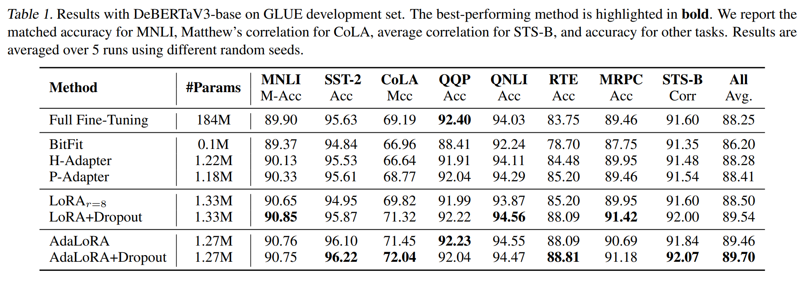
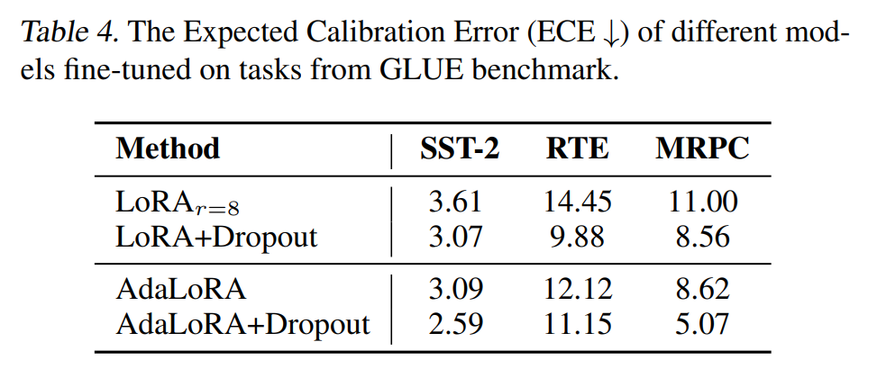
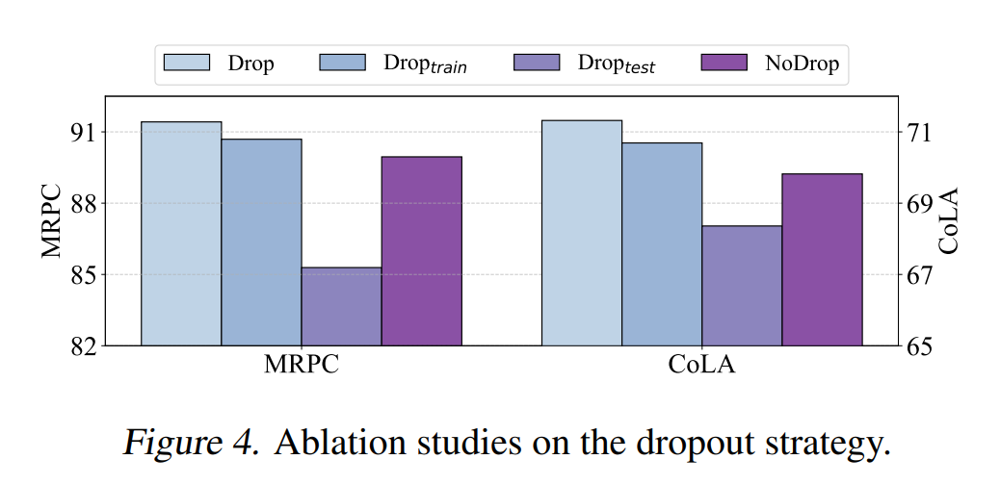

논문 및 이미지 출처 : <https://arxiv.org/pdf/2404.09610>

# Abstract

LoRA 로 대표되는 parameter-efficient fine-tuning (PEFT) 은 large-scale pre-trained model 을 downstream task 에 적응시키는 데 중요한 역할을 한다. 

그러나 LoRA 계열 모델을 fine-tuning 하는 경우에도 training dataset 에 over-fitting 할 위험이 있으며, LoRA-based PEFT 방법에서 over-fitting 을 제어할 이론적 지침과 실질적 메커니즘이 여전히 부족하다. 

본 논문에서는 learnable low-rank matrices 에 random noises 를 도입하고 parameter sparsity 를 증가시키는 방식으로 LoRA-based 방법에 LoRA Dropout 메커니즘을 제안한다. 

- 이 LoRA Dropout 메커니즘이 sparsity regularization 관점에서의 이론적 메커니즘을 설명하고, 이 framework 에서 generalization error bound 하에 제공한다. 
- 이론적 결과는 appropriate sparsity 가 empirical 및 generalization risks 간의 gap 을 좁히고 over-fitting 을 제어하는 데 도움이 된다는 것을 보여준다. 
- 또한, LoRA Dropout framework 를 기반으로 test-time ensemble strategy 를 도입하고, ensemble method 가 error bound 를 추가로 압축할 수 있으며 inference 시 더 나은 성능을 낼 수 있다는 이론적 증거를 제공한다. 
- 다양한 NLP task 에 대한 광범위한 실험을 통해, LoRA Dropout framework 가 모델의 accuracy 및 calibration 을 개선하는 데 효과적임을 실질적으로 검증한다.

# 1. Introduction

최근 Pre-trained Language Models (PLMs) 은 model parameter scale 이 급속히 성장하면서 다양한 NLP 에서 점점 더 우수한 성능을 보여주고 있다. 

그러나 model capacity 및 complexity 가 증가함에 따라, PLM 을 specific downstream task 에 맞추는 것은 완전한 fine-tuning 이 상당한 계산 자원을 필요로 한다는 과제를 안고 있다. 

따라서 new fine-tuning 패러다임인 parameter-efficient fine-tuning(PEFT)이 등장했으며, 이는 PLM 을 최소한의 파라미터 조정으로 최적화하고 specific downstream task 에 적응시키는 것을 목표로 한다.

---

PEFT 연구 중에서 Low-Rank Adaptation (LoRA) 방법과 그 variants 는 가장 효과적이고 널리 채택되고 있다.

- LoRA 의 기본 아이디어는 일부 zero-initialized delta weight matrices 만이 fine-tuning 과정에서 최적화되며, original pre-trained parameter 는 수정되지 않는다는 것이다. 
  - parameter efficiency 를 개선하기 위해, LoRA 는 delta weight matrices 을 two low-rank matrices 의 곱으로 분해한다.
  - 그러나 LoRA 계열 방법의 경우, low-rank decomposition 에서 proper rank 를 선택하는 것이 여전히 중요한 과제이다. 
  - pre-training 과 downstream task 간의 semantic shift 를 better adapting 을 위해, 이들 모델은 일반적으로 충분한 표현력을 보장하기 위해 비교적 high rank 를 유지하려는 경향이 있다. 
- 그러나 excessively high rank 는 모델의 자유도를 증가시키고, downstream task 에 over-fitting 될 위험을 높인다. 이러한 과제를 극복하고 appropriate parameter budget 을 선택하기 위해, LoRA 의 variants 중 하나인 AdaLoRA 는 matrix decomposition 의 pseudo-singular values 를 학습하여 fine-tuning parameters 를 자동으로 선택하는 방법을 제안한다. 
  - 그러나 이 parameter selection 방법은 실제로 training set 의 parameter 에 대한 gradient 에 크게 의존하므로, 모델이 training data 에 over-fitting 될 위험이 더욱 커진다. 

Fig, 1 에서 보여지듯이, LoRA 와 AdaLoRA 모두 fine-tuning 과정에서 training 손실과 테스트 손실 간의 간극이 커진다. 사실, 우리가 아는 한, LoRA-based PEFT 방법에서 over-fitting 을 제어할 이론적 지침과 실질적 메커니즘은 여전히 부족하다.

이 논문에서는, DNN 에서 흔히 사용되는 Dropout regularization 기법 에 영감을 받아, LoRA-based model 을 fine-tuning 할 때 over-fitting 위험을 제어하기 위해 LoRA learnable parameters 에 Dropout regularization framework 를 도입한다. 

- tunable parameters 에 random noises 를 도입하고 sparsity 를 증가시킴으로써, 저자의 framework 는 LoRA-based model 의 downstream task 에 대한 generalization ability 을 향상시킬 수 있다. 
- 또한, 이 dropout framework 에 대한 더 깊은 통찰을 얻기 위해, 저자는 다음과 같은 중요한 질문에 답한다:

*LoRA parameter 의 random dropout 을 통해 training data 에 대한 over-fitting 완화의 이론적 메커니즘은 무엇인가?*

- 저자는 LoRA dropout 하에서의 training process 를 sparse fine-tuning 의 관점에서 modeling 하여 theoretical framework 를 구축하고, LoRA dropout 을 사용한 fine-tuning 이 sparsity regularization 이 포함된 optimization problem 으로 볼 수 있음을 보여준다. 
- 더 나아가, 저자는 이 sparsity regularization framework 하에서 generalization error bound 를 제공한다. 
- 이 generalization error bound 를 통해, fine-tuning 동안 LoRA tunable parameters 에 appropriate sparsity 를 도입하면 empirical risk minimization 과 adaptation function 의 complexity 사이의 균형을 맞추고, 그 결과 empirical 및 generalization risks 간의 gap 을 좁혀 training data 에 대한 over-fitting 을 제어할 수 있음을 밝힌다.
- fine-tuning 기간 동안 LoRA dropout 이 over-fitting 을 제어할 수 있는 능력 외에도, 저자는 inference stage 에서 모델 성능을 더욱 향상시키기 위해 test-time ensemble method 을 제안한다. 
- test 중 dropout 을 활성화함으로써, 저자는  different parameter dropouts 를 가진 모델로 구성된 ensemble classifier 를 얻는다. 
- 이론적 증거는 ensemble classifier 가 generalization error bound 를 추가로 압축하고, test-time accuracy 를 이끌 수 있음을 보여준다.

#### Summary

본 논문에서 저자는 LoRA-based model 의 downstream task 에 대한 generalization ability 을 증진하기 위해 이론적으로 근거한 dropout framework 를 제안한다. 

- 구체적으로, 저자는 sparsity regularization 를 통해 empirical risk minimization 와 adaptation function class 의 complexity 사이의 균형을 맞추는 LoRA dropout 의 generalization error bound 에 대한 이론적 분석을 제공한다. 
- LoRA dropout framework 를 기반으로, 저자는 inference stage 에서의 ensemble strategy 를 제안한다. 
- 이 전략이 tighter error bound 를 가진 ensemble model 을 형성하고, 모델의 test-time generalization ability 을 더욱 향상시킬 수 있음을 보여준다. 
- 광범위한 NLP task 에서의 실험을 통해, 저자는 LoRA Dropout 의 정확도와 보정을 향상시키는 데 효과적임을 검증한다.

# 2. Related Work

## 2.1. Parameter-Efficient Fine-Tuning (PEFT)

model size 와 complexity 가 증가함에 따라, pre-trained language model(PLMs) 은 다양한 NLP task 에서 강력한 성능을 보이지만, PLM 을 downstream task 에 효율적으로 적응시키는 것이 점점 더 어려워지고 있다. 

PEFT 는 few additional parameters 또는 pre-trained parameters 의 subset 만을 fine-tuning 함으로써 이 문제를 해결하고자 한다. 

현재 주류 PEFT 접근 방식은 크게 3 categories 로 나눌 수 있다.

- **Additive Fine-tuning** 은 additional layers 나 learnable prompts 를 도입하여 extra tunable parameters 를 추가하는 방식에 중점을 둔다. 
- **Partial Fine-tuning** 은 pre-trained parameters 의 subset 을 선택해 fine-tuning 한다. 
- **Reparameterization Fine-tuning** 은 learnable parameter 수를 최소화하기 위해 low-rank representations 를 채택한다. 

이 논문에서는 가장 효과적이고 널리 채택된 방법인 LoRA 와 그 variants 를 중점적으로 다룬다. 

- LoRA 는 learnable delta weight 를 two low-rank matrices 의 곱으로 분해한다. 
- decomposition 의 rank 는 LoRA 에서 필수적이다. 
- small rank 는 representation 이 부족할 수 있고, large rank 는 over-fitting 을 초래할 수 있다. 
- LoRA 의 variants 중 하나인 AdaLoRA 는 pseudo-SVD 방법을 통해 delta weight 를 분해하고 importance scores 를 통해 parameters 를 선택하는 방법을 제안한다. 
- 그러나 이 선택 방법도 training set 의 gradient 에 의존하므로 over-fitting 의 추가 위험을 초래할 수 있다. 

본 연구에서는 LoRA 계열 PEFT 방법에서 over-fitting 을 제어할 이론적 지침과 실질적 메커니즘이 부족한 점을 보완하기 위해 이론적으로 근거한 dropout framework 를 제안한다.

## 2.2. Dropout Regularization

dropout 메커니즘은 DNN 에서 over-fitting 을 방지하기 위한 잘 알려진 기법이다. 

standard dropout 에선 training 중 network 의 각 neuron 이 일정한 확률로 network 에서 제외된다. 이후 다양한 dropout 기법이 도입되었다. 

- Dropconnect 은 neuron output 대신 model weights 를 일정 확률로 0 으로 설정한다. 
- Gaussian dropout 는 standard dropout 에서 Bernoulli noises 를 Gaussian noises 로 대체한다. 
- specific model structure 에 대한 dropout 방법도 제안되었다. 
  - 예로, Spatial dropout 은 CNN 에 사용되며, Recurrent dropout 은 RNN 에 사용된다. 
- 한편, dropout 이 over-fitting 을 억제하는 이론적 요소를 탐구한 연구도 진행되었다. 
  - 일부 연구는 dropout 을 통해 model 이 가능한 sub-network 의 ensemble 에 대한 기하학적 평균을 학습한다고 보고 있다. 
  - 일부 연구는 dropout 을 Bayesian 관점에서 바라보고, dropout 이 있는 model 을 파라미터에 대한 posterior 를 근사하는 Bayesian model 로 해석할 수 있다고 주장한다.
- 그러나 dropout 기법에 대한 광범위한 연구에도 불구하고, low-rank decomposition 의 delta weight matrices 에서 fine-tuning 이 일어나는 LoRA-based PEFT 모델에 dropout 을 적용하는 실질적 또는 이론적 연구는 거의 없다.

# 3. Proposed LoRA Dropout Framework

## 3.1. Background: Low Rank Adaptation (LoRA)

LoRA Dropout 을 소개하기 전에, PEFT 에서 사용되는 LoRA 방법을 간단히 리뷰한다. 

downstream task 에 fine-tuning 할 때, pre-training stage 에서 얻은 knowledge 를 유지하기 위해 LoRA 는 pre-trained parameters $W_0 \in \mathbb{R}^{n_1 \times n_2}$ 를 수정하지 않고, zero-initialized delta weight matrix $\Delta W$ 를 업데이트한다. 

이때의 forward pass 는 다음과 같다:

$$
\begin{equation}
  h = W_0 x + \Delta W x = W_0 x + BAx.
\end{equation}
$$

tunable parameter 수를 제어하기 위해, 위의 식에서 delta weight matrix $\Delta W$ 는 two low-rank matrices $A \in \mathbb{R}^{r \times n_2}$ 와 $B \in \mathbb{R}^{n_1 \times r}$ 의 곱으로 분해되며, 여기서 $r \ll \{n_1, n_2\}$ 이다.

## 3.2. LoRA Dropout

dropout 메커니즘은 over-fitting 제어에 뛰어난 성능을 보여준 바 있다. 

본 연구에서는 LoRA-based PEFT 방법에서 generalization ability 을 높이기 위해 LoRA Dropout framework 를 도입한다. 

구체적으로, Eq. (1) 에서 설명된 LoRA module 에 대해, learnable low-rank parameter matrices 의 rows 및 columns 를 randomly drop 한다:

$$
\begin{equation}
  \begin{aligned}
    &\hat{A} = A \cdot \text{diag}(m_A), m_A \sim \text{Bern}(1 - p); \\
    &\hat{B} = (B^\top \cdot \text{diag}(m_B))^\top, m_B \sim \text{Bern}(1 - p),
  \end{aligned}
\end{equation}
$$

- $m_A \in \mathbb{R}^{n_2}$ 와 $m_B \in \mathbb{R}^{n_1}$ : Bernoulli distribution 의 sampled mask vectors
- $p$ : parameters 가 drop 될 확률
- low-rank matrices 의 rank dimension 에 dropout 을 적용하는 것은 LoRA 의 표현력을 크게 저하시킬 수 있으므로, input/output dimension 에만 dropout 을 적용한다. 
- 또한, rank dimension 에서 dropout 을 수행하면 LoRA matrices 의 곱의 sparsity 가 증가하지 않으며, 이후 이론적 근거에서 설명할 sparsity 의 중요성에 따라 이와 같은 방식으로 dropout 을 적용한다.

dropout 이 적용된 이후의 forward pass 는 다음과 같다:

$$
\begin{equation}
  \hat{h} = W_0 x + \hat{B} A \hat{x}.
\end{equation}
$$

- 저자의 dropout 방법은 original LoRA 뿐만 아니라, low-rank matrix decomposition 을 사용하는 LoRA-based variants 에도 동일하게 적용될 수 있다. 
- 예로, AdaLoRA 는 다음과 같은 quasi-SVD 방법으로 delta weight 를 분해한다:

$$
\begin{equation}
  \Delta W = P \Lambda Q,
\end{equation}
$$

- $P \in \mathbb{R}^{n_1 \times r}$ 및 $Q \in \mathbb{R}^{r \times n_2}$ : left/right singular vectors
- $\Lambda \in \mathbb{R}^{r \times r}$ : singular values 을 포함하는 diagonoal matrix

AdaLoRA 에 LoRA Dropout 을 적용하는 방법은 간단히 다음과 같다:

$$
\begin{equation}
  \begin{aligned}
    &\hat{P} = (P^\top \cdot \text{diag}(d_P))^\top, d_P \sim \text{Bern}(1 - p), \\
    &\hat{Q} = Q \cdot \text{diag}(m_Q), m_Q \sim \text{Bern}(1 - p).
  \end{aligned}
\end{equation}
$$

- Dropout 은 $\Lambda$ matrix 에 적용되지 않는다. 
  - 이는 rank 가 감소하여 표현력을 저하시킬 수 있기 때문이다. 
  - 또한 $\Lambda$ 는 AdaLoRA 알고리즘에 의해 실제로는 minor compositions 를 걸러내기 때문에, 추가적인 dropout 을 적용하지 않는다. 
- dropout 후의 delta weight matrix 은 다음과 같다:

$$
\begin{equation}
  \Delta \hat{W} = \hat{P} \Lambda \hat{Q}.
\end{equation}
$$

Fig, 2 에서는 LoRA 및 AdaLoRA 방법에 LoRA Dropout framework 를 통합을 제공한다.

## 3.3. Training Objective

모델의 LoRA module 에서 나온 all dropout vectors 의 concatenation 을 $m$ 으로, dropout 후의 LoRA parameters 를 $\Delta \theta(m)$ 으로, pre-trained model 의 original parameters 를 $\theta^0$ 로 나타내자. 

여러 dropout instances 하에서 효과적인 모델을 얻기 위해, 저자는 $N$ different dropout instances 에 대한 multiple losses 의 평균으로 training objective 를 정의한다:

$$
\begin{equation}
  \mathcal{L}(x) = \frac{1}{N} \sum_{r=1}^{N} \ell \left( x; \theta^0 + \Delta \theta(m_r) \right), m_r \sim \text{Bern}(1 - p).
\end{equation}
$$

## 3.4.  Test-time Ensemble

inference time 에서 모델의 성능을 더욱 향상시키기 위해, MC dropout 메커니즘에 영감을 받아 test-time ensemble method 을 제안한다. 

- 일반적인 dropout 은 test-time deactivated 이지만, 저자의 ensemble strategy 은 inference time 에 different dropouts 하에서 model outputs 를 집계하여 final output 을 얻는다. 
- 이는 parameter distribution 으로부터 model 을 sampling 하고 aggregating 하는 Monte Carlo 방법으로 볼 수 있다. 
- 구체적으로, dropout $m_r$ 하에 LoRA parameter 를 사용한 모델을 $\mathcal{M}(\theta^0 + \Delta \theta(m_r))$ 로 나타내면, ensemble model 의 output $o$ 는 다음과 같다:

$$
\begin{equation}
  o(x) = \frac{1}{N} \sum_{r=1}^{N} o_r(x) = \frac{1}{N} \sum_{r=1}^{N} \mathcal{M}(x; \theta^0 + \Delta \theta(m_r)),
\end{equation}
$$

- $N$ : dropout instances 수
- 이 ensemble strategy 가 test-time 성능을 향상시킬 수 있는 방법에 대한 이론적 분석을 Sec. 4.3 에서 제공한다.

결론적으로, LoRA-based 방법과 LoRA Dropout 을 활용한 pre-trained model fine-tuning 의 overall training 및 testing procedure 를 Alg. 1 에 요약한다.

# 4. Theoretical Resul

이 섹션에서는 제안한 방법의 fine-tuning 부터 inference 에 이르는 이론적 결과를 제시한다. 

- 먼저, LoRA Dropout 을 사용한 fine-tuning 을 model sparsity regularization 하의 optimization problem 로 modeling 한다. 
- 그런 다음, sparsity regularization framework 하에서 generalization error bound 를 제안하고, LoRA Dropout fine-tuning 에서 over-fitting 과 under-fitting 간의 trade-off 에 대한 이론적 메커니즘을 밝힌다. 
- inference stage 에선 test-time LoRA Dropout ensemble 을 통해 better test-time generalization ability 을 보장하는 tighter error bound 를 증명한다.

## 4.1. LoRA Dropout Fine-Tuning Through the Lens of Sparse Regularizat
loss function
$\theta^0 \in \mathbb{R}^d$ 로 reparameterization 된 pre-trained model $\mathcal{M}^0$ 이 있다고 가정한다. 

- LoRA 같은 방법은 $\mathcal{M}^0$ 을 LoRA Dropout 전략으로 조정하여, LoRA matrices 의 input 과 output sizes 에서 probability $p$ 로 random neuron 을 sampling 하여 zeros 로 masking 한다.
  - upated delta $\Delta \theta$ 는 각 entry 가 $1 - (1 - p)^2 = 2p - p^2$ 의 확률로 zero 가 되는 natural sparsity property 를 가진다.
  - (Fu et al., 2023) 에 영감을 받아, 이 fine-tuning procedure 를 model sparsity regularization 와 함께 optimization problem 로 modeling 한다. 
- $\theta = \theta^0 + \Delta \theta$ 를 fine-tuned model parameters 로 나타내자.
  - $\Delta\theta$ 는 LoRA Dropout 의 LoRA reparameterization 로 실현됨.
- $d \in \{0, 1\}^d$ 를 LoRA matrices 의 생산에 적용된 dropout instance (i.e., $\Delta\theta$) 로, $d \sim \text{Bern}(2p - p^2)$ 라고 가정한다. 
  - 1 은 해당 entry 가 0 으로 drop 됨을 나타냄
- fine-tuning 은 다음과 같이 공식화할 수 있다:

$$
\begin{equation}
  \begin{aligned}
    &\min_{\Delta \theta} \mathcal{L}(\theta^0 + \Delta \theta), \\
    \quad \text{s.t.} \quad &\mathbb{E}_{d \sim \text{Bern}(2p - p^2)} \|d \odot \Delta \theta\|_2^2 = 0.
  \end{aligned}
\end{equation}
$$

- 이 condition 은 $\Delta \theta$ 의 sparsity 을 나타낸다. 
- Lagrange duality 에 의해 problem (9) 는 다음 문제와 동등하다:

$$
\begin{equation}
  \hat{\mathcal{L}} = \min_{\Delta \theta} \max_{\lambda} \mathcal{L}(\theta^0 + \Delta \theta) + \lambda \mathbb{E}_{d \sim \text{Bern}(2p - p^2)} \|d \odot \Delta \theta\|_2^2.
\end{equation}
$$

따라서 저자는 다음과 같은 regularized optimization problem 를 공식화한다:

$$
\begin{equation}
  \mathcal{L}_{\lambda} = \min_{\Delta \theta} \mathcal{L}(\theta^0 + \Delta \theta) + \lambda \mathbb{E}_{d \sim \text{Bern}(2p - p^2)} \|d \odot \Delta \theta\|_2^2 \leq \hat{\mathcal{L}}.
\end{equation}
$$

- $\lambda$ : arbitrary hyper-parameter
- 이 optimization problem 은 problem (9) 의 optima 와 동등한 $\hat{\mathcal{L}}$ 에 의해 upper bound 된다.

## 4.2. Generalization Analysis

이 Section 에서 sparsity-regularized algorithm 의 stability analysis 를 통해 Eq. (11) 을 optimizing 하는 LoRA Dropout fine-tuning 의 generalization error bound 를 분석한다. 

- stability 은 ML 에서 광범위하게 연구되어 왔으며 , random algorithm 의 generalization error bound 를 분석하는 중요한 속성으로 입증되었다. 
- 여기선 Pointwise Hypothesis Stability (PHS) 을 사용하여 optimal model 이 training samples 를 제거한 후의 perturbation 을 분석한다.
- (Charles & Papailiopoulos, 2018) 를 따라, entire training dataset 을 $S = \{x_i\}_{i=1}^n$ 로, $x_i$ sample 을 제거한 dataset 을 $S^i = S - \{x_i\}$ 로 나타낸다. 
- removal 이 uniform distribution 으로 sampling 된다 가정한다. 또한 loss function $\ell$ 과 dataset $S$ 에 대해 optimal model parameters 를 $\theta_{\ell}(S)$ 로 나타낸다.

#### Definition 4.1 (Pointwise Hypothesis Stability)

$\theta$ 가 loss function $\ell$ 에 대해 learning algorithm $\mathcal{M}$ PHS $\beta$ 를 가진다고 할 때, 다음이 성립한다:

$$
\begin{equation}
  \mathbb{E}_{S,i \sim U(n)} \left|\ell(x_i; \theta_{\ell}(S^i)) - \ell(x_i; \theta_{\ell}(S)) \right| \leq \beta,
\end{equation}
$$

- $\ell(x_i; \theta)$ : model parameter $\theta$ 에서 sample $x_i$ 의 loss

여기서는 LoRA Dropout framework 의 PHS upper bound 를 제시한다.

#### Proposition 4.2 (PHS Upper Bound of LoRA Dropout)

- 다음을 가정해보자.
  - LoRA Dropout algorithm $\mathcal{M}$ 의 loss function $\mathcal{L}_{\lambda}$ 가 $\eta$-Lipschitz 이다.
  - $\theta_{\mathcal{L}_{\lambda}}(S^i)$ 가 $\theta_{\mathcal{L}_{\lambda}}(S)$ 와 가깝다. 
  - 또한 $\theta_{\mathcal{L}_{\lambda}}(S)$ 의 Hessian matrix $\nabla^2 \mathcal{L}(\theta_{\mathcal{L}_{\lambda}}(S))$ 이 positive-semidefinite 이다.
  - singular value decomposition $U \text{diag}(\Lambda) U^{-1}, \Lambda = \{\Lambda_1, \dots, \Lambda_m\}$ 이고 $\Lambda_{\min} = \min\{\Lambda_1, \dots, \Lambda_m\}$ 이다. 
- 그럼 $S$ 에 대한 LoRA Dropout algorithm optimizing $\mathcal{L}_\lambda$ 는 아래 식의 PHS upper bound 을 가진다.

$$
\begin{equation}
  \begin{aligned}
    \mathbb{E}_{S,i \sim U(n)} \left|\mathcal{L}_{\lambda}(x_i; \theta_{\mathcal{L}_{\lambda}}(S^i)) - \mathcal{L}_{\lambda}(x_i; \theta_{\mathcal{L}_{\lambda}}(S))\right| \\ \leq \frac{2\eta^2}{(\Lambda_{\min} + 2\lambda(2p - p^2))n}.
  \end{aligned}
\end{equation}
$$

#### Proof Sketch

먼저 Lemma A.1 에서 $\ell_2$-regularizer 항을 가진 arbitrary optimization algoritm 의 PHS upper bound 을 분석한다. 

그런 다음, 저자의 LoRA Dropout training objective 를 weighted $\ell_2$-regularizer 와 유사한 문제로 공식화하고, Lemma A.1 에 이를 적용하여 증명을 완료한다.

#### Lemma 4.3

어떠한 learning algorithm $\mathcal{M}$ 이 parameter $\theta$ 를 가지고 있으며, $0 ≤ |\ell(x)−\ell(x')| \leq C, \forallx, x'$ 를 만족하는 bounded loss function $\ell$ 이 있다고 하자. 

만약 $\mathcal{M}$ 이 PHS $\beta$ 를 가진다면, probability $1 − \delta$ 로 다음이 성립한다:

$$
\begin{equation}
  R(\mathcal{M}, S) \leq \hat{R}(\mathcal{M}, S) + \sqrt{\frac{C^2 + 12Cn\beta}{2n\delta}},
\end{equation}
$$

- $R(\mathcal{M}, S) = \mathbb{E}_{x}\ell(x; \theta)$ : empirical risk
- $\hat{R}(\mathcal{M}, S) = \frac{1}{n}\sum_{i=1}^{n} \ell(x_i; \theta)$ : algorithm $\mathcal{M}$ 이 dataset $S$ 에서 실행된 generalization risk
- 이는 better algorithm stability 가 adaptation function class 의 complexity 을 감소시킨다는 것을 나타낸다. 
- 따라서 Proposition 4.2 에서 제시된 LoRA Dropout 알고리즘의 PHS upper bound $\beta$ 를 Lemma 4.3 에 적용하면 다음과 같은 LoRA Dropout framework 의 generalization error bound 를 설명하는 정리를 얻을 수 있다.

#### Theorem 4.4 (LoRA Dropout Generalization Error Bound)

- LoRA Dropout rate $p$ 와 sparsity regularization strength $\lambda$ 가 주어졌을 때, LoRA Dropout algorithm 이 $\eta$-Lipschitz loss function $\mathcal{L}_\lambda$ 를 가지고, $\theta_{\mathcal{L}_\lambda}(S^i)$ 가 $\theta_{\mathcal{L}_\lambda}(S)$ 에 가깝다고 가정한다. 
- 또한 $\theta_{\mathcal{L}_\lambda}(S)$ 에서의 Hessian matrix $\nabla^2 \mathcal{L}(\theta_{\mathcal{L}_\lambda}(S))$ 이 positive-semidefinite 이며, singular value decomposition 이 $U \text{diag}(\Lambda) U^{-1}$ 로 이루어지고, $\Lambda = \{\Lambda_1, \cdots, \Lambda_m\}$ 이며 $\Lambda_{\min} = \min\{\Lambda_1, \cdots, \Lambda_m\}$ 일 때,
- constant $C$ 에 대해 probability $1 - \delta$ 로 다음이 성립한다:

$$
\begin{equation}
  R(\mathcal{M}, S) \leq \hat{R}(\mathcal{M}, S) + \sqrt{\frac{C^2 + \frac{24C\eta^2}{\Lambda_{\min} + 2\lambda(2p - p^2)}}{2n\delta}}.
\end{equation}
$$

- 이 정리는 LoRA Dropout 의 over-fitting 과 under-fitting 간의 trade-off 에 대한 이론적 메커니즘을 설명한다. 
- theorem 은 adaptation function class 의 complexity (i.e., empirical risk 및 generalization risk 간의 차이)가 dropout rate 가 작아질수록 커진다는 것을 보여준다. 
- 특히 Dropout 없이 traditional LoRA 를 적용하면 그 차이가 가장 커지며, 이는 LoRA fine-tuning 에서 over-fitting 위험이 크다는 것을 나타낸다. 
- 그러나 dropout rate 가 너무 커져 1 에 가까워지면 fine-tuning 을 수행하지 않는 것과 동일하게 되어 empirical risk 가 증가하고, 모델이 training data 에 대해 under-fitting 된다. 
- 따라서 appropriate dropout 메커니즘은 empirical risk minimization 과 adaptation function class 의 complexity 간의 trade-off 를 이론적으로 균형을 맞출 수 있어, data 로부터 충분히 학습하면서 test-time 성능을 향상시킬 수 있다.

## 4.3. Error Bound of LoRA Dropout Ensemble Classifier

inference stage 에서는 multiple test-time dropout instances 를 ensemble 하여 LoRA Dropout 의 error bound  더 엄격하게 제어하고자 한다. 

이 Section 에선 ensemble 이 어떻게 error bound 를 줄이는지에 대한 이론적 분석을 제공한다. 

- fine-tuning phase 에서 저자는 다양한 dropout instances 하에서 gradient steps 를 누적하여 Eq.(11)을 optimizing 한다
  - 이 fine-tuning procedure 는 본질적으로 parameters $\theta$ 의 distribution $\mathcal{D}$ 에 대한 generalization risk optimizing 이다.
  - 즉, $E_{\theta \sim \mathcal{D}}E_{(x, y)}\mathcal{L}_\lambda(M(x; \theta), y)$ 이다. 
  - 여기서 $\mathcal{M}(x; \theta)$ 는 input $x$ 가 주어졌을 때 model $\mathcal{M}$ 의 output 을 나타낸다. 
- inference stage 에서, test-time ensemble strategy 를 사용하면 parameters $\theta$ 의 distribution $\mathcal{D}$ 에서 model output 을 집계하여 final predictions 를 수행하는데, 이는 ensemble classifier 이며, 그 error 는 $E_{(x, y)}\mathcal{L}_\lambda(E_{\theta \sim \mathcal{D}}\mathcal{M}(x; \theta), y)$ 가 된다. 

다음 theorem 은 ensemble classifier 와 함께 더 엄격한 generalization error bound 를 설명한다.

#### Theorem 4.5 (Error Bound of Test-time LoRA Dropout Ensemble)

loss function $\mathcal{L}_\lambda$ 가 model $\mathcal{M}$ 의 output layer 전 final activation $h$ (e.g., softmax) 에 대해 convex 하다면, 다음이 성립한다:

$$
\begin{equation}
  E_{(x, y)}\mathcal{L}_\lambda(E_{\theta \sim \mathcal{D}}\mathcal{M}(x; \theta), y) \leq E_{\theta \sim \mathcal{D}}E_{(x, y)}\mathcal{L}_\lambda(\mathcal{M}(x; \theta), y).
\end{equation}
$$

#### Proof Sketch

- parameter $\theta$ 에 대한 expectation 을 취하는 것은 특정 distribution 에서 final hidden activation $h \in \mathbb{R}^d$ 에 대한 expectation 을 취하는 것과 동일하다. 
  - 그런 다음, $h \in \mathbb{R}^d$ 에 대한 convex condition 하에 Jensen inequality 을 적용하면 부등식이 성립한다. 
  - 자세한 증명은 Appendix A.2 를 참조하자. 
- 또한 LLM training 또는 fine-tuning 시나리오의 대부분의 경우, 저자는 loss function 로 cross-entropy 를, final output layer 로 softmax 를 사용한다.
  - 이 function 들은 $\mathbb{R}^d$ space 에서 convex 하다
- 따라서 이 inequality 는 LoRA Dropout ensemble classifier 의 generalization error (i.e., LHS (16)) 가 training generalization error (i.e., RHS (16)) 보다 크지 않다는 것을 의미한다.
  - 이는 LoRA Dropout fine-tuning 에서 제시된 error bound 를 더 줄이고 test-time better generalization ability 을 보일 수 있음을 시사한다.

요약하면, Theorem 4.4 및 4.5 는 제안된 실용적 framework 의 전체 이론적 구조를 설명한다. 

fine-tuning phase 에선 empirical risk minimization 과 adaptation complexity 의 trade-off 를 맞추어 generalization error 를 제어하기 위해 LoRA Dropout 을 적용하고, 

inference stage 에선 multiple dropout instances 를 적용하여 tighter error bound 를 갖춘 ensemble classifier 를 완성하여 test-time generalization ability 을 더욱 향상시킨다.

# 5. Experiments

#### Baselines

저자는 다음의 최신 PEFT 방법들과 LoRA Dropout 을 비교하였다.

- **Full fine-tuning** : 모델 내의 all pre-trained parameters 가 학습되고 최적화된다.
- **BitFit** : model parameters 의 bias vectors 만 fine-tuning
- **H-Adapter** : adapter 가 MLP 와 self-attention module 사이에 삽입
- **P-Adapter** : adapter layers 는 MLP 또는 LayerNorm layer 뒤에만 적용된다.
- **LoRA** : LoRA 는 learnable delta parameter matrix 를 two low-rank matrices 로 분해하여 parameter efficiency 를 개선
- **AdaLoRA** : AdaLoRA 는 sensitivity-based importance scores 에 따라 LoRA 의 rank 를 gradually pruning 하여 adaptive parameter budget 을 도입

baselines 와 비교할 때, 모든 방법에 대해 tunable parameter budget 을 일치시킨다.

저자는 LoRA 와 AdaLoRA 의 baselines 를 따르는 hyper-parameter setting 을 선택하고, 저자 모델에만 해당하는 hyper-parameter 를 조정한다.

## 5.1. Natural Language Understanding

#### Settings

이전 연구를 따르며, 평가를 위해 General Language Understanding Evaluation (GLUE) 벤치마크를 사용한다. 

저자의 실험은 GLUE 벤치마크의 8 tasks 로 구성된다. 

all model 은 DeBERTaV3-base pre-trained model 에서 fine-tuning 된다.

#### Results

GLUE 벤치마크에서 다양한 모델의 결과는 Tab. 1 에 나타나 있다. 

- LoRA 시리즈 모델이 저자의 LoRA Dropout framework 와 함께 다른 baselines 보다 일관되게 우수한 성능을 보이며, 8 NLU tasks 에서 전체적으로 최고 성능을 달성함을 확인할 수 있다. 
- 또한, original LoRA 및 AdaLoRA 모델과 비교할 때, 저자의 dropout 방법을 적용한 모델이 항상 우수한 성능을 달성하여, 제안한 LoRA Dropout framework 가 LoRA-based model 의 over-fitting 을 제어하고 downstream task 에서 generalization ability 을 개선하는 데 도움이 됨을 나타낸다.

## 5.2. Question Answering

#### Settings

저자는 SQuAD (Stanford Question Answering Dataset) 벤치마크에서 question-answering task 를 수행하며, SQuAD v1.1 과 SQuAD v2.0 의 두 버전을 사용한다. 

DeBERTaV3-base model 을 base pre-trained models 로 사용하며, 각 모델의 Exact Match 와 F1 scores 를 보고한다.

#### Results

SQuAD 벤치마크에서 다양한 모델의 결과는 Tab. 2 에 나타나 있다. 이 결과는 Tab. 1 에서 얻은 결론을 추가로 검증한다. 

- LoRA Dropout 방법은 baselines (i.e., LoRA 및 AdaLoRA) 이 two SQuAD 벤치마크에서 더 나은 성능을 달성하도록 돕는다. 
- 또한, learnable parameter budget (i.e., adapter 의 hidden dimension 및 LoRA module 의 rank)을 다양하게 조정해보았을 때, LoRA Dropout 이 다양한 parameter budget 에서 일관되게 우수한 성능을 보임을 확인할 수 있어 그 효과성을 드러낸다.

## 5.3. Instruction Tuning

#### Settings

저자는 모델의 instruction-following ability 를 테스트하기 위해 instruction tuning 을 수행한다. 

구체적으로, LLaMA2-7B 를 pre-trained base model 로 선택하고 Alpaca-clean dataset 에서 original LoRA 방법과 LoRA Dropout 이 적용된 LoRA 를 fine-tuning 한다. 

MMLU 벤치마크를 사용하여 각 모델을 평가한다.

#### Results

Tab. 3 에서 0-shot setting 에서 MMLU 벤치마크의 정확도를 보고한다. 

- 결과를 통해, fine-tuned LoRA model 이 original pre-trained LLaMA2-7B 모델보다 성능이 낮음을 확인할 수 있다. 
- 이는 LoRA 가 fine-tuning dataset 에서 over-fitting 되어 평가 벤치마크에서 잘 일반화되지 못함을 나타낸다. 
- 그러나 저자의 dropout framework 가 적용된 LoRA 는 두 모델보다 훨씬 더 나은 정확도를 달성하여, 다시 한번 LoRA Dropout 이 over-fitting 을 제어하는 능력을 입증한다. 

## 5.4. Confidence Calibration

#### Settings

large-scale pre-trained model 은 종종 overconfidence 를 보이기 때문에, 각 모델의 confidence calibration 을 평가한다. 

이는 model reliability 를 평가하는 효과적인 분석 방법으로 작용한다. 

구체적으로, Expected Calibration Error (ECE) 를 사용하여 calibration performance 를 측정하고, DeBERTaV3-base model 을 기반으로 GLUE 벤치마크의 few tasks 에서 다양한 fine-tuning model 의 confidence calibration 을 평가한다.

#### Results

dev set 에서 best performanmce 를 달성할 때 각 모델의 ECE 결과를 Tab. 4 에 보고하며, RTE task 에서 fine-tuning 된 다양한 model 의 ECE curve 는 Fig. 3 에 제공한다. 

- 결과에 따르면, LoRA Dropout 은 base model 에 비해 ECE 를 일관되게 감소시켜 better-calibrated models 를 만든다. 
- 한 가지 가능한 설명은 LoRA Dropout 이 Bayesian 관점에서 MC Dropout 의 변형으로 볼 수 있다는 것이다. 
- training 중에 parameter 를 무작위로 dropping 하여 주어진 downstream task 에 대한 posterior weight distribution 을 추정하게 되어, 모델이 일종의 Bayesian neural network 가 되어 good calibration 성능을 달성하는 것으로 알려져 있다.

## 5.5. Ablation Studies and Sensitivity Analysis

#### Effect of Train/Test Dropout

MRPC 및 CoLA dataset 에서 training 및 test 중 dropout 의 효과를 실험하고, 결과를 Fig. 4 에 나타낸다. 

- LoRA Dropout(LoRA Dropout framework 를 Drop 으로 표시됨)을 다음과 같은 variants 와 비교하였다:
  - Drop$_{train}$ 은 dropout 으로 training 하고 dropout 없는 ensemble 로 testing
  - Drop$_{test}$ 는 dropout 없이 training 하고 dropout instance 로 dropout ensemble 로 testing
  - NoDrop 은 LoRA Dropout 이 없는 모델을 나타낸다. 
- Drop$_{test}$ 의 나쁜 성능에서 fine-tuning 중 dropout 을 수행하는 것의 중요성을 확인할 수 있다. 
- 이는 test dropout 이 training 중 학습된 parameter 의 hidden semantic structure 를 깨뜨릴 수 있기 때문에, vanilla NoDrop 모델보다 성능이 더 떨어진다. 
- dropout 을 통해 test-time ensemble strategy 의 효과를 Drop 과 Drop$_{train}$ 간의 감소를 통해 검증할 수 있으며, 이는 ensemble strategy 이 error bound 를 더욱 압축할 것이라는 이론적 유도와 일치한다.

#### Effect of Dropout Rate

MRPC dataset 에서 dropout rate $p$ 의 효과를 실험하고, 결과를 Fig. 5 에 나타낸다. 

- dropout rate 가 증가함에 따라 성능이 처음에는 개선되었다가 이후 감소한다. 
  - 이는 proper dropout rate 가 empirical risk minimization 와 adaptation function 의 complexity 를 균형 있게 도와준다는 Sec. 4.2 의 이론적 유도와 일치한다. 
- small dropout rate 은 sufficient sparsity 를 도입하지 못하고 over-fitting 을 초래할 수 있으며, excessively large dropout rate 는 trainable parameter 가 너무 적어져 adapter 의 표현력을 잃게 만든다.

#### Effect of Number of Sampled Dropout Instances

MRPC dataset 에서 dropout instance 수 $N$ 의 효과를 실험하고, 결과를 Fig. 5 에 나타낸다. 

- 결과에서 samples 수가 증가함에 따라 모델 성능이 개선되는 것을 알 수 있다. 
- 이는 more dropout instances 를 training 중 도입하고 test-time ensemble 에서 더 많은 모델이 집계되어 parameter distribution 에 대한 output 의 보다 정확한 추정을 가능하게 하기 때문이다.
- 하지만 sample 수가 증가하면 training 및 inference costs 도 증가하므로, accuracy 및 computational cost 간의 적절한 균형을 위해 적절한 $N$ 을 선택하는 것이 필요하다.

# 6. Conclusions and Future Work

downstream task 에서 over-fitting risk 를 관리하기 위해, 본 논문에서는 LoRA-based PEFT 방법을 위해 이론적으로 기반한 LoRA Dropout framework 를 제안한다. 

sparsity 관점에서의 이론적 분석은 LoRA Dropout 이 도입하는 sparsity 이 empirical 및 generalization risk 간의 관계를 tighten 하고 over-fitting 을 제어하는 데 도움이 된다는 것을 보여준다. 

LoRA Dropout 을 기반으로 한 test-time ensemble strategy 이 제안되며, 이는 error bound 를 더욱 압축할 것이라는 이론적 근거가 제시된다. 

다양한 task 와 PLM 에서 실험을 수행한 결과, model accuracy 및 calibration 을 개선하는 데 효과적임을 입증하였다.

---

비록 유망한 결과가 있지만, 여전히 몇 가지 한계를 지적하고자 한다. 

LoRA Dropout 은 LoRA 에 비해 additional tunable parameters 를 도입하지 않지만, training 및 test 중 multiple dropout instance 를 sampling 하는 것은 상당한 time overhead 를 초래한다.

# Appendix A

## A.1 Proof of Proposition 4.2

먼저 $\ell_2$-regularizer 을 가진 optimization problem 의 pointwise hypothesis stability 를 설명하는 Lemma 를 증명한다. 

이는 local optima 의 특정한 형태를 설명하는 constant 와 관련된 upper bound 를 제공한다. 

기호는 본문에서 사용된 것과 동일하다. 

우선 $\mathcal{L}(\theta) = \frac{1}{n} \sum_{i} \mathcal{L}(x_i; \theta)$ 라 하자.

#### Lemma A.1.

다음 loss function 을 최적화하는 learning algorithm $\mathcal{M}$ 을 고려하자:

$$
\min_{\theta} \mathcal{L}_\lambda(\theta) := \min_{\theta} \mathcal{L}(\theta) + \lambda ||\theta - \theta^0||_2^2.
$$

- loss function $\mathcal{L}$ 이 $\eta$-Lipschitz 이고, $\theta_{\mathcal{L}_\lambda}(S)$ 가 $\theta_{\mathcal{L}_\lambda}(S^i)$ 에 가깝다고 하자. 
- 또한 $\theta_{\mathcal{L}_\lambda}(S)$ 에서의 Hessian matrix $\nabla^2 \mathcal{L}(\theta_{\mathcal{L}_\lambda}(S))$ 가 positive-semidefinite 이고, singular value decompotition 가 $U \text{diag}(\Lambda) U^{-1}$ 로 주어지며, $\Lambda = \{\Lambda_1, \cdots, \Lambda_m\}$ 이고 $\Lambda_{\min} = \min \{\Lambda_1, \cdots, \Lambda_m\}$ 이라고 하자. 
- 그러면 $\mathcal{M}$ 은 다음과 같은 pointwise hypothesis stability $\beta = \frac{2\eta^2}{(\Lambda_{\min} + 2\lambda)n}$ 을 가진다:

$$
\mathbb{E}_{S, i \sim U(n)} |\mathcal{L}_\lambda(x_i; \theta_{\mathcal{L}_\lambda}(S^i)) - \mathcal{L}_\lambda(x_i; \theta_{\mathcal{L}_\lambda}(S))| \leq \frac{2\eta^2}{(\Lambda_{\min} + 2\lambda)n}.
$$

#### Proof.

편의를 위해 $\theta_{\mathcal{L}_\lambda}(S)$ 를 $\hat{\theta}$ 로 표기하고, $\Delta \hat{\theta} := \hat{\theta} - \theta$ 로 표기한다. 

local optima $\hat{\theta}$ 에서의 $\mathcal{L}_\lambda$ 의 second-order Taylor expansion 을 고려하면, $\nabla \mathcal{L}_\lambda(\hat{\theta}) = 0$ 이 성립한다. 

$\hat{\theta}$ 에 가까운 $\forall v$ 에 대해 다음을 얻는다:

$$
\begin{aligned}
  \mathcal{L}_\lambda(v) &= \mathcal{L}_\lambda(\hat{\theta}) + (v - \hat{\theta})^\top \nabla_{\mathcal{L}_\lambda}(\hat{\theta}) + \frac{1}{2} (v - \hat{\theta})^\top \nabla^2 \mathcal{L}_\lambda(\hat{\theta})(v - \hat{\theta}) \\ 
  &= \mathcal{L}_\lambda(\hat{\theta}) + \frac{1}{2} (v - \hat{\theta})^\top \nabla^2 \mathcal{L}_\lambda(\hat{\theta})(v - \hat{\theta}).
\end{aligned}
$$

따라서 다음을 얻는다:

$$
\begin{aligned}
  \mathcal{L}_\lambda(v) - \mathcal{L}_\lambda(\hat{\theta}) &= \frac{1}{2} (v - \hat{\theta})^\top \nabla^2 \mathcal{L}_\lambda(\hat{\theta})(v - \hat{\theta}) \\
  &= \frac{1}{2} (v - \hat{\theta})^\top \nabla^2_{\hat{\theta}} ( \mathcal{L}(\hat{\theta}) + \lambda ||\hat{\theta} - \theta^0||_2^2 ) (v - \hat{\theta})\\
  &= \frac{1}{2} (v - \hat{\theta})^\top ( \nabla^2 \mathcal{L}(\hat{\theta}) + 2\lambda I) (v - \hat{\theta})\\
  &= \frac{1}{2} (v - \hat{\theta})^\top( U \text{diag}(\Lambda) U^{-1} + 2\lambda I) (v - \hat{\theta})\\
  &= \frac{1}{2} (v - \hat{\theta})^\top( U (\text{diag}(\Lambda) + 2\lambda I) U^{-1} ) (v - \hat{\theta})\\
  &= \frac{1}{2} (v - \hat{\theta})^\top(U \text{diag}(\sqrt{\Lambda_1 + 2\lambda}, \cdots, \sqrt{\Lambda_d + 2\lambda}) U^{-1}U \text{diag}(\sqrt{\Lambda_1 + 2\lambda}, \cdots, \sqrt{\Lambda_d + 2\lambda})U^{-1})(v - \hat{\theta}) \\
  &= \frac{1}{2} || U \text{diag}(\sqrt{\Lambda_1 + 2\lambda}, \cdots, \sqrt{\Lambda_d + 2\lambda} U^{-1})(v - \hat{\theta}) ||_2^2\\
  &\geq \frac{1}{2} (\Lambda_{\min} + 2\lambda) ||v - \hat{\theta}||_2^2. \qquad (A.1)
\end{aligned}
$$

이 부등식은 $U$ 의 orthogonality 로 인해 성립하며, 이는 vector $v - \hat{\theta}$ 의 크기를 변경하지 않고, minimum singular value $\Lambda_{\min}$ 에 의해 least scale 된다는 의미이다.

이후 $\mathcal{L}_\lambda(\theta)$ 를 정의하여, $\hat{\theta}$ 에 가까운 $\forall u, v$ 에 대해 다음을 얻는다:

$$
\begin{aligned}
  \mathcal{L}_\lambda(u) - \mathcal{L}_\lambda(v) &= \left(\frac{1}{n} \sum_k \mathcal{L}(x_k; u) + \lambda ||u - \theta^0||_2^2 \right) - \left( \frac{1}{n} \sum_k \mathcal{L}(x_k; v) + \lambda ||v - \theta^0||_2^2 \right) \\
  &=\left( \frac{1}{n} \sum_{k \neq i} \mathcal{L}(x_k; u) + \lambda ||u - \theta^0||_2^2 \right) - \left( \frac{1}{n} \sum_{k \neq i} \mathcal{L}(x_k; v) + \lambda ||v - \theta^0||_2^2 \right) + \frac{\mathcal{L}(x_i; u) - \mathcal{L}(x_i; v)}{n} \\
  &=(1 - \frac{1}{n}) \left( \frac{1}{n - 1} \sum_{k \neq i} \mathcal{L}(x_k; u) + \lambda ||u - \theta^0||_2^2 \right) - (1 - \frac{1}{n}) \left( \frac{1}{n - 1} \sum_{k \neq i} \mathcal{L}(x_k; v) + \lambda ||v - \theta^0||_2^2 \right) + \\
  &\frac{\lambda \left( ||u - \theta^0||_2^2 - ||v - \theta^0||_2^2 \right)}{n} + \frac{\mathcal{L}(x_i; u) - \mathcal{L}(x_i; v)}{n} \\
  &=\underbrace{(1 - \frac{1}{n}) \left[ \left( \frac{1}{n - 1} \sum_{k \neq i} \mathcal{L}(x_k; u) + \lambda ||u - \theta^0||_2^2 \right) - \left( \frac{1}{n - 1} \sum_{k \neq i} \mathcal{L}(x_k; v) + \lambda ||v - \theta^0||_2^2 \right) \right]}_{(*)} +\\
  &\frac{\mathcal{L}_\lambda(x_i; u) - \mathcal{L}_\lambda(x_i; v)}{n}. \qquad (A.2)
\end{aligned}
$$

- $u = \theta_{\mathcal{L}_\lambda}(S^i)$, $v = \theta_{\mathcal{L}_\lambda}(S)$ 라고 하면, $u$ 는 $x_i$ 를 제외한 dataset 의 empirical loss 를 최소화하므로 Eq. (A.2) 의 $(*)$ 는 0 보다 작다. 

따라서 다음을 얻는다:

$$
\mathcal{L}_\lambda(\theta_{\mathcal{L}_\lambda}(S^i)) - \mathcal{L}_\lambda(\theta_{\mathcal{L}_\lambda}(S)) \leq \frac{\mathcal{L}_\lambda(x_i; \theta_{\mathcal{L}_\lambda}(S^i)) - \mathcal{L}_\lambda(x_i; \theta_{\mathcal{L}_\lambda}(S^i))}{n}
$$

(A.1) 의 부등식을 고려하면, 다음을 얻는다:

$$
\frac{1}{2} (\Lambda_{\text{min}} + 2\lambda) ||\theta_{\mathcal{L}_\lambda}(S^i) - \theta_{\mathcal{L}_\lambda}(S)||_2^2 \leq \frac{\mathcal{L}_\lambda(x_i; \theta_{\mathcal{L}_\lambda}(S^i)) - \mathcal{L}_\lambda(x_i; \theta_{\mathcal{L}_\lambda}(S^i))}{n} \tag{A.3}
$$

$\mathcal{L}_\lambda$ loss function 이 $\eta$-Lipchitz 라는 점에서 다음을 얻는다:

$$
|\mathcal{L}_\lambda(x_i; \theta_{\mathcal{L}_\lambda}(S^i)) - \mathcal{L}_\lambda(x_i; \theta_{\mathcal{L}_\lambda}(S))| \leq \eta ||\theta_{\mathcal{L}_\lambda}(S^i) - \theta_{\mathcal{L}_\lambda}(S)||. \tag{A.4}
$$

(A.4) 를 (A.3)에 대입하면, 다음을 얻는다:

$$
\begin{aligned}
  \frac{1}{2} (\Lambda_{\text{min}} + &2\lambda) ||\theta_{\mathcal{L}_\lambda}(S^i) - \theta_{\mathcal{L}_\lambda}(S)||_2^2 \leq \frac{\eta ||\theta_{\mathcal{L}_\lambda}(S^i) - \theta_{\mathcal{L}_\lambda}(S)||}{n} \\
  &\Rightarrow ||\theta_{\mathcal{L}_\lambda}(S^i) - \theta_{\mathcal{L}_\lambda}(S)|| \leq \frac{2\eta}{(\Lambda_{\text{min}} + 2\lambda)n}. \tag{A.5}
\end{aligned}
$$

(A.5) 를 (A.4)에 대입하면, 다음을 얻는다:

$$
|\mathcal{L}_\lambda(x_i; \theta_{\mathcal{L}_\lambda}(S^i)) - \mathcal{L}_\lambda(x_i; \theta_{\mathcal{L}_\lambda}(S))| \leq \frac{2\eta^2}{(\Lambda_{\text{min}} + 2\lambda)n}. \tag{A.6}
$$

이는 모든 $i$ 와 $S$ 에 대해 성립하므로, 다음을 얻는다:

$$
\mathbb{E}_{S, i \sim U(n)} |\mathcal{L}_\lambda(x_i; \theta_{\mathcal{L}_\lambda}(S^i)) - \mathcal{L}_\lambda(x_i; \theta_{\mathcal{L}_\lambda}(S))| \leq \frac{2\eta^2}{(\Lambda_{\text{min}} + 2\lambda)n}.
$$

이 Lemma 를 바탕으로, 저자는 Eq. (11) 의 optimization objective 를 분석하고 Proposition 4.2 를 다음과 같이 증명한다.

**Proposition A.2 (LoRA Dropout 의 PHS 상한)**  

만약 LoRA Dropout algorithm $\mathcal{M}$ 의 loss function $\mathcal{L}_\lambda$ 가 $\eta$-Lipchitz 을 만족하고, $\theta_{\mathcal{L}_\lambda}(S^i)$ 가 $\theta_{\mathcal{L}_\lambda}(S)$ 와 가까우며, $\theta_{\mathcal{L}_\lambda}(S)$ 의 Hessian matrix $\nabla^2 \mathcal{L}(\theta_{\mathcal{L}_\lambda}(S))$ 이 positive-semidefinite 이고, singular value decomposition $U \text{diag}(\Lambda) U^{-1}$, $\Lambda = \{\Lambda_1, \cdots, \Lambda_m\}$ 과 $\Lambda_{\text{min}} = \min \{\Lambda_1, \cdots, \Lambda_m\}$ 을 따른다면, LoRA Dropout algorithm 이 $S$ 에 대해 $\mathcal{L}_\lambda$ 를 최적화하는 경우 pointwise hypothesis stability 의 upper bound 는 다음과 같다:

$$
\mathbb{E}_{S,i \sim U(n)} \left| \mathcal{L}_\lambda \left( x_i ; \theta_{\mathcal{L}_\lambda}(S^i) \right) - \mathcal{L}_\lambda \left( x_i ; \theta_{\mathcal{L}_\lambda}(S) \right) \right| \leq \frac{2\eta^2}{(\Lambda_{\text{min}} + 2\lambda(2p - p^2)) n}.
$$

#### Proof.

Eq. (11) 에서 sparsity regularization 이 적용된 loss function 를 고려하면 다음을 얻는다:
$$
\begin{aligned}
  \mathcal{L}_\lambda(\theta) &= \mathcal{L}(\theta) + \lambda \mathbb{E}_{d \sim \text{Bern}(2p - p^2)} ||d \odot (\theta - \theta^0)||_2^2\\
  &= \mathcal{L}(\theta) + \lambda \mathbb{E}_{d \sim \text{Bern}(2p - p^2)} \sum_i d_i^2 (\theta_i - \theta^0_i)^2 \\
  &= \mathcal{L}(\theta) + \lambda \sum_i (\theta_i - \theta^0_i)^2 \mathbb{E}_{d_i \sim \text{Bern}(2p - p^2)} d_i^2\\
  &= \mathcal{L}(\theta) + \lambda \sum_i (\theta_i - \theta^0_i)^2(2p - p^2)\\
  &= \mathcal{L}(\theta) + \lambda(2p - p^2) ||\theta - \theta^0||_2^2.
\end{aligned}
$$

위의 결과를 Lemma A.1 에 대입하면, regularization coefficien 를 $\lambda(2p - p^2)$ 로 대체할 수 있으며, LoRA Dropout algorithm 의 pointwise hypothesis stability 는 다음과 같이 얻는다:

$$
\mathbb{E}_{S,i \sim U(n)} \left| \mathcal{L}_\lambda \left( x_i ; \theta_{\mathcal{L}_\lambda}(S^i) \right) - \mathcal{L}_\lambda \left( x_i ; \theta_{\mathcal{L}_\lambda}(S) \right) \right| \leq \frac{2\eta^2}{(\Lambda_{\text{min}} + 2\lambda(2p - p^2)) n}.
$$

## A.2. Proof of Theorem 4.5

#### Theorem A.3 (Error Bound of Bayes LoRA Dropout Ensemble)

만약 loss function $\mathcal{L}_\lambda$ 가 model parameters $\theta$ 에 대해 convex 하다면, 다음이 성립한다:

$$
\mathbb{E}_{(x, y)} \mathcal{L}_\lambda \left( \mathbb{E}_{\theta \sim \mathcal{D}} \mathcal{M}(x; \theta), y \right) \leq \mathbb{E}_{\theta \sim \mathcal{D}} \mathbb{E}_{(x, y)} \mathcal{L}_\lambda \left( \mathcal{M}(x; \theta), y \right). \tag{A.7}
$$

#### Proof.

$$
\begin{align*}
  \mathbb{E}_{(x, y)} \mathcal{L}_\lambda \left( \mathbb{E}_{\theta \sim \mathcal{D}} \mathcal{M}(x; \theta), y \right) &\leq \mathbb{E}_{(x, y)} \mathbb{E}_{\theta \sim \mathcal{D}} \mathcal{L}_\lambda \left( \mathcal{M}(x; \theta), y \right) \tag{A.8} \\
  &= \mathbb{E}_{\theta \sim D} \mathbb{E}_{(x, y)} \mathcal{L}_\lambda \left( \mathcal{M}(x; \theta), y \right). \tag{A.9}
\end{align*}
$$

여기서 (A.8) 은 $\mathcal{L}_\lambda$ 가 parameters $\theta$ 에 대해 convex 하다는 점에서 Jensen inequality 에 의해 성립한다.