논문 및 이미지 출처 : <https://arxiv.org/pdf/2404.02948>

# Abstract

Large Language Models (LLMs) 을 parameter-efficiently fine-tune (PEFT) 하기 위해, low-rank adaptation (LoRA) 방법은 모델 변화 $\Delta W \in \mathbb{R}^{m \times n}$ 을 two matrices $A \in \mathbb{R}^{m \times r}$ 및 $B \in \mathbb{R}^{r \times n}$ 의 곱으로 근사한다. 

여기서 $r \ll \min(m, n)$ 이며, $A$ 는 Gaussian noise 로 초기화되고, $B$ 는 zero 로 초기화된다. 

LoRA 는 original model $W$ 를 고정하고 "Noise & Zero" adapter 를 업데이트하는데, 이는 slow convergence 로 이어질 수 있다. 

이러한 한계를 극복하기 위해, Principal Singular values and Singular vectors Adaptation (PiSSA) 를 제안한다.

- PiSSA 는 LoRA 와 동일한 아키텍처를 공유하지만, adapter matrices $A$ 및 $B$ 를 original matrix $W$ 의 principal components 으로 초기화하며, 나머지 성분은 fine-tuning 동안 고정되는 잔여 행렬 $W^\text{res} \in \mathbb{R}^{m \times n}$ 에 저장한다. 
- LoRA 와 비교했을 때, PiSSA 는 "residual" parts 를 고정하면서 principal components 을 업데이트하여 faster convergence 와 향상된 성능을 제공한다. 
- 184M 에서 70B 까지의 12개 model, 5개의 NLG 및 8개의 NLU task 에 걸친 PiSSA 와 LoRA 의 비교 실험에서, PiSSA 는 동일한 실험 환경에서 LoRA 를 일관되게 능가했다. 
- GSM8K benchmark 에서, PiSSA 로 fine-tune 된 Mistral-7B 는 72.86% 의 정확도를 달성하여, LoRA 의 67.7% 를 5.16% 초과했다. 
- 동일한 아키텍처를 사용하기 때문에, PiSSA 는 양자화를 통해 fine-tuning 의 메모리 요구 사항을 추가로 줄이는 데도 호환 가능하다. 
- QLoRA 와 비교했을 때, QPiSSA (4-bit quantization 이 적용된 PiSSA) 는 초기 단계에서 더 작은 양자화 오류를 나타낸다. 
- GSM8K 에서 LLaMA3-70B 를 fine-tune 할 때, QPiSSA 는 86.05% 의 정확도를 달성하여, QLoRA 의 81.73% 를 초과했다. 
- fast SVD 기법을 활용하여, PiSSA 는 몇 초 만에 초기화될 수 있으며, LoRA 에서 PiSSA 로 전환하는 데 드는 비용은 무시할 수 있을 정도로 적다.

# 1. Introduction

LLMs 의 fine-tuning 은 다양한 작업에서 성능을 향상시키는 데 매우 효과적인 기술이다. 

예로, 모델이 지침을 따르도록 하고, 바람직한 행동을 학습하며, 바람직하지 않은 행동을 제거하는 데 활용된다. 그러나 very large models 에 대한 fine-tuning 과정은 막대한 비용이 수반된다. 

예로, LLaMA 65B parameter model 의 일반적인 16-bit fine-tuning 은 780GB 이상의 GPU memory 를 필요로 하며, GPT-3 175B 의 VRAM 소비량은 1.2TB 에 달한다. 이러한 이유로, parameter 및 memory usage 를 줄이기 위한 다양한 parameter-efficient fine-tuning(PEFT) 방법이 제안되었다. 

PEFT 방법 중에서도 additional inference latency 없이 full fine-tuning 성능을 유지할 수 있는 Low-Rank Adaptation(LoRA) 이 널리 사용되고 있다.

---

LoRA 는 fine-tuning 동안 parameter matrices 에서 발생하는 변화를 low-rank properties 를 가진다고 가정한다. 

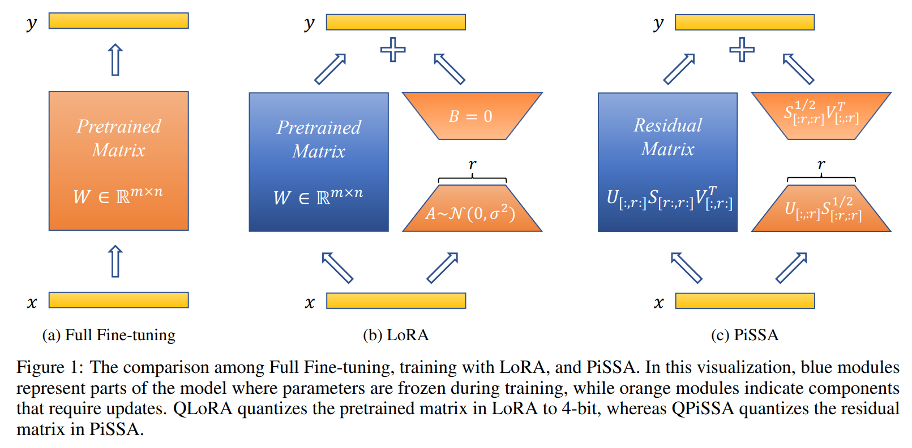

- Fig. 1b 에 나타난 바와 같이, pre-trained weight matrix $W \in \mathbb{R}^{m \times n}$ 에 대해, LoRA 는 update 를 low-rank decomposition $\Delta W = AB$ 로 대체하며, $A \in \mathbb{R}^{m \times r}$ 및 $B \in \mathbb{R}^{r \times n}$ 는 $r \ll \min(m, n)$ 을 만족한다. 
- $Y = XW$ 에 대해 modified forward pass 는 다음과 같다:

$$
\begin{equation}
    Y = X(W + \Delta W) = X(W + AB),
\end{equation}
$$

- 여기서 $X \in \mathbb{R}^{b \times m}$, $Y \in \mathbb{R}^{b \times n}$ 이며, $b$ 는 input data 의 batch size 이다. 
- LoRA 는 $A$ 를 random Gaussian 으로, $B$ 를 zero 로 초기화하여 $AB = 0$ 이 training 초기에 model output 을 변경하지 않도록 한다. 
- LoRA 는 original matrix $W$ 에 대한 gradient 계산 또는 optimizer states 유지가 필요 없으며, 대신 $A, B$ 라는 훨씬 더 작은 low-rank matrices 를 최적화한다. 
- 이를 통해 trainable parameter 수를 10,000배 줄이고 GPU memory usage 를 3배 줄일 수 있다. 게다가 LoRA 는 종종 full parameter fine-tuning 과 유사하거나 더 나은 성능을 달성하며, 이는 full parameters 의 일부만 fine-tuning 해도 downstream task 에 충분함을 시사한다. 
- LoRA 는 또한 pre-trained matrix $W$ 의 양자화를 통합하여 average memory requirements 를 16배 줄일 수 있다. 이와 동시에 adapter 는 높은 정밀도의 weight 를 사용할 수 있어 양자화가 LoRA 의 성능에 큰 영향을 미치지 않는다.

Eq. (1)에 따르면, $A$와 $B$에 대한 gradient 는 $\frac{\partial L}{\partial A} = X^T \left(\frac{\partial L}{\partial Y}\right) B^T$ 및 $\frac{\partial L}{\partial B} = A^T X^T \left(\frac{\partial L}{\partial Y}\right)$ 이다.

LoRA 는 동일한 input $X$ 에 대해 초기에는 output $Y$ 를 변경하지 않으므로, gradient magnitude 는 주로 $A$ 와 $B$ 의 값에 의해 결정된다. 

LoRA 에서는 $A$ 와 $B$ 가 Gaussian noise 와 zero 로 초기화되기 때문에 gradient 가 매우 작아질 수 있어 fine-tuning 과정에서 수렴이 느릴 수 있다. 이는 LoRA 가 초기 지점에서 많은 시간을 낭비하는 현상으로 나타난다.

---

저자의 Principal Singular values and Singular vectors Adapter (PiSSA) 는 $\Delta W$ 의 근사에 집중하는 LoRA 와 후속 모델들과 달리, $W$ 자체를 대상으로 한다. 

- 저자는 matrix $W$ 에 대해 singular value decomposition (SVD) 을 적용한다. 
- singular value magnitude 에 따라 $W$ 를 two parts 로 나눈다: few largest singular values 로 구성된 principal low-rank matrix $W^\text{pri}$ 와, remaining smaller singular value (많은 양을 가지며 long-tail distribution 을 나타낼 가능성이 있음)로 구성된 residual matrix $W^\text{res}$. 
- principal matrix $W^\text{pri}$ 는 $A \in \mathbb{R}^{m \times r}$ 와 $B \in \mathbb{R}^{r \times n}$ 의 곱으로 표현되며, $r \ll \min(m, n)$ 이다. 
- Fig. 1c 에 나타난 바와 같이, $A$ 와 $B$ 는 principal singular value 및 singular vector 를 기반으로 초기화되며, 학습 가능하다. 
- 반면, $W^\text{res}$ 는 residual singular value 및 singular vector 의 곱으로 초기화되며, fine-tuning 동안 고정된다. 

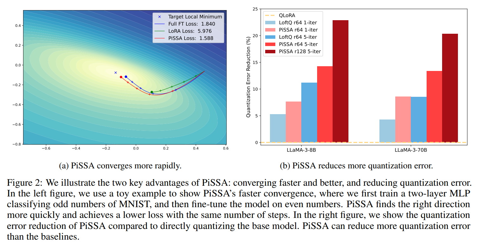

principal singular vectors 는 matrix $W$ 에서 가장 큰 stretching 또는 영향을 가지는 방향을 나타내므로, 이러한 principal components 을 직접 fine-tuning 하면 데이터를 더 빠르고 잘 맞출 수 있다 (Fig. 2a). 
- 또한, PiSSA 의 loss 및 gradient norm cures 는 실험에서 full parameter fine-tuning 과 유사한 경향을 보이며 (Fig. 4), principal components fine-tuning 이 full matrix fine-tuning 의  동작을 어느 정도 일치시킨다는 것을 나타낸다.
- principal components $W^\text{pri}$ 는 adapter 에서 유지되며 높은 정밀도를 가지므로, frozen part $W^\text{res}$ 에 양자화를 적용할 때, whole $W$ 를 양자화하는 QLoRA 와 비교하여 양자화 오류를 크게 줄일 수 있다 (Fig. 2b). 따라서 PiSSA 는 양자화와 완벽히 호환되며, LoRA 를 대체할 수 있는 plug-and-play 방식의 솔루션으로 활용될 수 있다.

# 2. Related Works

billions parameter 를 가진 LLMs 의 복잡성과 계산 요구는 특정 downstream task 에 이를 적응시키는 데 있어 상당한 장애물을 제시한다. 

PEFT 는 fine-tuning 에 필요한 parameter 및 memory requirements 를 최소화하면서도 full fine-tuning 에 가까운 성능을 달성하여 매력적인 솔루션으로 등장했다. 

PEFT 는 부분 fine-tuning, soft prompt fine-tuning, non-linear adapter fine-tuning, 그리고 low-rank adapter 기반 fine-tuning 등의 전략을 포함한다.

- **LoRA** 는 trainable adapters 를 linear layer 에 주입하며, fine-tuning 이후 이러한 adaptation 을 standard model structure 로 재구성할 수 있어, 모델의 원래 아키텍처를 유지하면서 efficient fine-tuning 을 가능하게 한다는 점에서 널리 채택되었다. 
- LoRA 를 따른 **AdaLoRA** 는 model 각 layer 에 필요한 rank size 를 동적으로 학습한다. 
- **DeltaLoRA** 는 adapter layer 의 parameter 를 사용하여 model 의 original weights 를 업데이트하며, LoRA representation 을 향상시킨다.
- **LoSparse** 는 LoRA 를 통합하여 pruning 으로 인해 지나치게 많은 expressive neurons 가 제거되는 것을 방지한다. 
- **DoRA** 는 $\Delta W$ 의 scale 을 학습하기 위해 magnitude component 를 도입하고, 기존 $AB$ 를 $\Delta W$ 의 direction components 로 활용한다.

LoRA 와 그 후속 모델들이 weight 업데이트의 low-rank 근사를 학습하는 데 초점을 맞추는 반면, 저자의 **PiSSA** 접근법은 모델의 필수적이지만 low-rank 인 부분을 직접 tuning 하고, noisier 하고 high-rank 이며 비본질적인 부분은 고정시킨다. 

PiSSA 는 LoRA 와 철학적으로는 다르지만, LoRA 의 구조적 장점 대부분을 공유하며 이러한 방법들로 확장하여 성능을 향상시킬 수 있다.

- **QLoRA** 는 LoRA 를 4-bit NormalFloat (NF4) 양자화와 Double Quantization 및 Paged Optimizers 와 통합하여, 65B parameter model 을 single 48GB GPU 에서 fine-tuning 할 수 있도록 하며, full 16-bit fine-tuning 작업의 성능을 유지한다.
- **QA-LoRA** 는 low-bit 양자화에서 자유도를 높이기 위해 group-wise operators 를 도입한다. 
- **LoftQ** 는 QLoRA 의 양자화 오류 행렬을 분해하고 principal components 을 adapter 로 유지하여 양자화 오류를 줄인다. 저자의 PiSSA 접근법은 양자화 기술과도 결합될 수 있으며, QLoRA 와 LoftQ 에 비해 양자화 오류를 크게 줄일 수 있음을 발견했다.

# 3. PiSSA: Principal Singular Values and Singular Vectors Adaptation

이 섹션에서는 Principal Singular values and Singular vectors Adaptation (PiSSA) 방법을 공식적으로 제시한다. 

PiSSA 는 self-attention 및 multilayer perceptron (MLP) layers 내의 matrix $W$ 에 대해 singular value decomposition(SVD) 을 수행한다. 

matrix $W \in \mathbb{R}^{m \times n}$ 의 (economy size) SVD 는 $W = USV^T$ 로 주어지며, 여기서 $U \in \mathbb{R}^{m \times \min(m, n)}$, $V \in \mathbb{R}^{n \times \min(m, n)}$ 는 orthonormal columns 를 가진 singular vectors 이고, $V^T$ 는 $V$ 의 transpose 이다. 

$S = \text{diag}(s) \in \mathbb{R}^{\min(m,n) \times \min(m,n)}$ 에서 $\text{diag}(s)$ 연산은 $s$ 를 diagonal matrix $S$ 로 변환하며, $s \in \mathbb{R}^{\min(m,n)}_{\geq 0}$ 는 내림차순으로 정렬된 singular values 를 나타낸다. 

top $r$ singular values $s_{[:r]}$ 가 remaining singular values $s_{[r:]}$ 보다 훨씬 큰 경우, $W$ 의 intrinsic rank 를 $r$ 로 나타낼 수 있다. 따라서 $S$ 와 $U$, $V$ 는 twi groups 로 나눌 수 있다: principal singular values 와 vectors—$\{U_{[:, :r]}, S_{[:r, :r]}, V_{[:, :r]}\}$, 그리고 residual singular values 와 vectors—$\{U_{[:, r:]}, S_{[r:, r:]}, V_{[:, r:]}\}$. 

여기서 matrix slicing 표기법은 PyTorch 에서 사용하는 표기법과 동일하며, $[:r]$ 는 처음 $r$ dimensions 를 나타낸다. 

principal singular values 와 vectors 는 다음과 같이 정의된 injected adapter 의 초기화를 위해 사용된다:

$$
\begin{align}
    A = U_{[:, :r]} S^{1/2}_{[:r, :r]} \in \mathbb{R}^{m \times r}, \\
    B = S^{1/2}_{[:r, :r]} V^T_{[:, :r]} \in \mathbb{R}^{r \times n}.
\end{align}
$$

residual singular values 와 vectors 는 fine-tuning 중 고정되는 residual matrix 를 구축하는 데 사용된다:

$$
W^{\text{res}} = U_{[:, r:]} S_{[r:, r:]} V^T_{[:, r:]} \in \mathbb{R}^{m \times n}.
$$

Eq. (5) 에서 나타나듯이, $AB$ 와 residual matrix 를 통합하면 fine-tuning 초기에 pre-trained model 의 전체 성능을 보존할 수 있다:

$$
Y = XW = X(W^{\text{res}} + W^{\text{pri}}) = X(W^{\text{res}} + AB).
$$

LoRA 와 마찬가지로, $A$ 와 $B$ 의 gradient 는 다음과 같이 주어진다: $\frac{\partial L}{\partial A} = X^T (\frac{\partial L}{\partial Y}) B^T, \quad \frac{\partial L}{\partial B} = A^T X^T (\frac{\partial L}{\partial Y}).$

$s_{[:r]}$ 의 요소들이 $s_{[r:]}$ 의 요소들보다 훨씬 크기 때문에, trainable adapter $W^{\text{pri}} = AB$ 는 $W$ 의 가장 중요한 directions 를 포함한다. 이상적인 경우, training $AB$ 은 fewer parameters 를 사용하면서도 entire model 을 fine-tuning 하는 과정을 반영한다. 

모델의 가장 중요한 부분을 직접 fine-tuning 할 수 있는 능력은 PiSSA 가 더 빠르고 더 나은 수렴을 가능하게 한다. 반면, LoRA 는 adapter $A$ 와 $B$ 를 Gaussian noise 와 zero 로 초기화하고 $W$ 를 고정한다. 이로 인해 fine-tuning 초기 단계에서 gradient 가 작거나 무작위 방향으로 나타나, gradient descent 단계가 낭비될 가능성이 있다. 또한, 초기화가 열악할 경우, suboptimal local minimum points 에 도달하여 generalization 성능이 저하될 수 있다.

PiSSA 는 LoRA 와 동일한 아키텍처를 공유하므로 LoRA 의 대부분의 장점을 상속받는다. 여기에는 trainable parameter 수를 줄이면서 model 을 fine-tuning 할 수 있는 능력, forward propagation 중 메모리 소비를 줄이기 위해 residual model 을 양자화하는 능력, 쉬운 배포 등이 포함된다. 

adapter 의 간단한 선형 구조는 trainable matrices 와 pre-trained weights 를 배포 시 통합하는 것을 용이하게 하며, fully fine-tuned model 의 original inference speed 를 유지한다. 

Fast SVD 기술을 사용하여 PiSSA 는 몇 초 만에 초기화를 완료할 수 있었으며 (Tab. 4 참조), 이는 무시할 수 있는 비용이다.

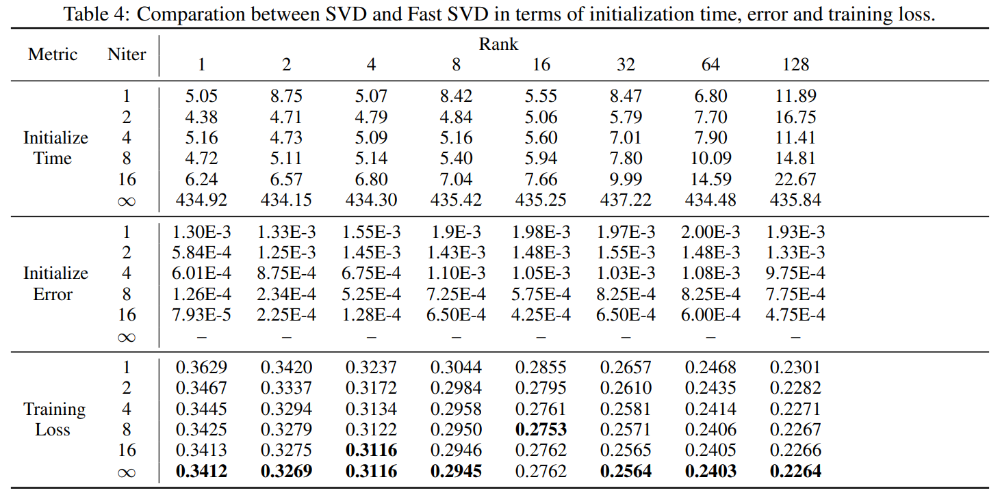

저장 효율성을 위해, dense parameter matrix $\Delta W$ 를 저장하지 않고 low-rank matrices, $\Delta A$ 와 $\Delta B$ 만 저장하도록 선택할 수 있다. 

Appendix C 에 나타나 있듯이, $\Delta A$ 와 $\Delta B$ 만 활용하여 original pre-trained models 과 원활하게 통합할 수 있다. 마지막으로, 하나의 pre-trained model 는 다양한 PiSSA 또는 LoRA 절차에 의해 fine-tuning 된 여러 $\Delta A$, $\Delta B$ 를 수용할 수 있어, pre-trained model 을 다양한 downstream application 에 빠르게 적응시킬 수 있다.

# 4. QPiSSA: PiSSA with Quantization

Quantization 은 matrix 의 값 범위를 여러 연속적인 구역으로 나누고, 각 구역에 속하는 모든 값을 동일한 "quantized" 값으로 매핑하는 기법이다. 이 기법은 forward propagation 의 메모리 소비를 줄이는 데 효과적이지만, backpropagation 에서는 성능이 저하된다. 

한편, LoRA 는 backward 메모리 요구량을 크게 줄이므로 LoRA 와 quantization 을 함께 사용하는 것이 매우 적합하다. 이 경우 base model 은 memory efficient forward propagation 을 위해 quantized 되고, LoRA adapters 는 정확한 backward parameter update 를 위해 full precision 으로 유지된다.

이전 대표적인 연구인 QLoRA 는 base model 을 Normal Float 4-bit (NF4) 로 quantized 하고, full-precision $A$ 와 $B$ 를 Gaussian-Zero initialization 로 설정한다. 

따라서, overall error 는 다음과 같이 표현된다:

$$
\text{Quantization Error of QLoRA} = ||W - (\text{nf4}(W) + AB)||_* = ||W - \text{nf4}(W)||_*,
$$

여기서 $||M||_*$ 는 nuclear norm (또는 trace norm) 으로, 다음과 같이 정의된다:

$$
||M||_* = \text{trace}\left(\sqrt{M^*M}\right) = \sum_{i=1}^{\min\{m,n\}} \sigma_i(M),
$$

$\sigma_i(M)$ 는 $M$ 의 $i^{th}$ singular value 를 나타낸다. 

위 식에서 알 수 있듯이, QLoRA 의 quantization error 는 base model 을 직접 quantized 하는 것과 동일하다.

반면, QPiSSA 는 base model 이 아니라 residual model 을 quantized 한다. 따라서, QPiSSA 의 오류는 다음과 같이 표현된다:

$$
\text{Quantization Error of QPiSSA} = ||W - (\text{nf4}(W^{\text{res}}) + AB)||_* = ||W^{\text{res}} - \text{nf4}(W_{\text{res}})||_*.
$$

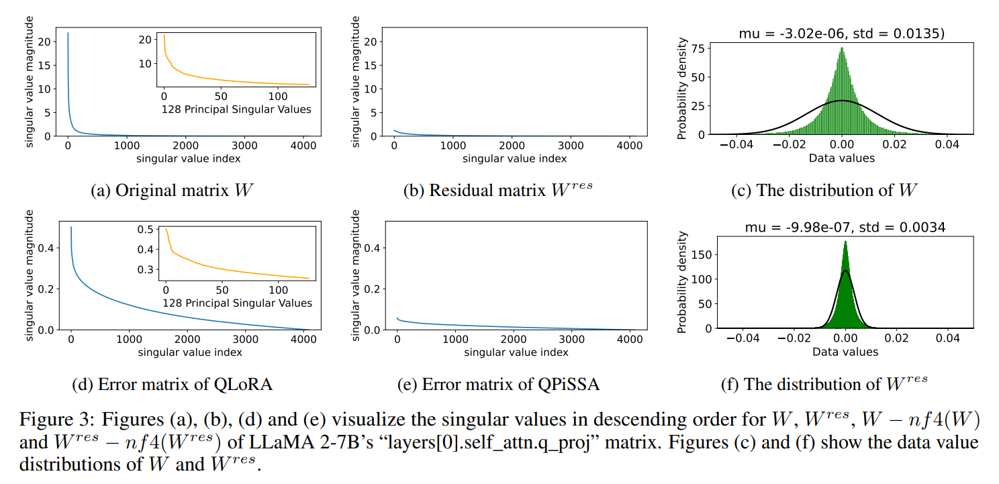

Residual model 은 large singular value components 를 제거했으므로, $W^{\text{res}}$ 는 $W$ 보다 더 좁은 분포를 가진다(Fig. 3a 와 Fig. 3b 에서 $W$ 와 $W^{\text{res}}$ 의 singular value distribution). 

또한, Fig. 3c 와 Fig. 3f 에서는 $W$ 와 $W^{\text{res}}$ 의 값 분포를 비교하여, $W^{\text{res}}$ 가 훨씬 Gaussian-like 하며 smaller standard deviation 을 확인할 수 있다. 이는 $W^{\text{res}}$ 에 NF4 를 적용하는 것이 $W$ 에 적용하는 것보다 더 적합하다는 것을 나타낸다.

이 두 가지 요인은 QPiSSA 가 QLoRA 보다 훨씬 낮은 quantization error 를 달성하도록 한다 (Fig. 3d 와 Fig. 3e 참조).

Quantization error 를 줄이는 장점 외에도, QPiSSA 의 gradient direction 은 PiSSA 와 유사하므로, QLoRA 에 비해 훨씬 더 우수한 fine-tuning 성능을 제공한다.

# 5. Experiments

실험은 NVIDIA A800-SXM4(80G) GPU 에서 수행되었다. 

본 실험에서는 Alpaca 구현 전략을 채택하여, AdamW optimizer, batch size 128, learning rate 2e-5, cosine annealing schedule, warmup ratio 0.03 을 사용하였고, weight decay 는 적용하지 않았다. 

QLoRA 의 Sec. B.3 에서 논의된 바와 같이, instruction-following dataset 의 response 에 대해서만 loss 를 계산하였다. 

모든 실험에서 `lora_alpha` 는 항상 `lora_r` 와 동일하게 설정되었고, `lora_dropout` 은 0 으로 설정되었으며, adapter 는 base model 의 all linear layer 에 통합되었다. 

LoRA 와 PiSSA 에서는 base model 과 adapter 모두에 Float32 계산 방식을 사용하였고, QLoRA, LoftQ, QPiSSA 에서는 base model 에 4-bit NormalFloat 을, adapter 에는 Float32 를 사용하였다. 

full parameter fine-tuning 에는 BFloat16 을 사용하여 자원을 절약하였다 (Tab. 5 참조).

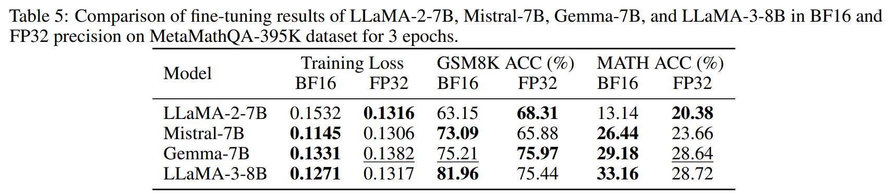

## 5.1 Evaluating the Performance of PiSSA on both NLG and NLU Tasks

Tab. 1 은 PiSSA, LoRA, full parameter fine-tuning 의 natural language generation (NLG) task 에서의 성능 비교를 보여준다. 

- LLaMA 2-7B, Mistral-7B-v0.1, Gemma-7B 를 MetaMathQA dataset 으로 fine-tuning 하여 GSM8K 와 MATH validation set 에서 수학 문제 해결 능력을 평가하였다.
- 추가로, CodeFeedback dataset 으로 model 을 fine-tuning 하고, HumanEval 과 MBPP dataset 을 사용하여 코딩 능력을 평가하였다. 
- 또한, WizardLM-Evol-Instruct dataset 으로 학습하고, MT-Bench dataset 을 통해 대화 능력을 테스트하였다. 
- 모든 실험은 100K data point 를 포함한 subset 을 사용하여 수행되었으며, 학습 오버헤드를 줄이기 위해 단 1 epoch 만 학습되었다.

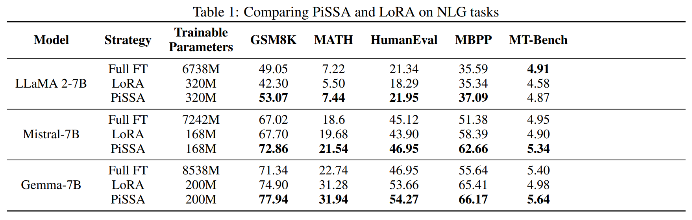

- Tab. 1 에 따르면, 모든 model 과 task 에서 PiSSA 를 사용한 fine-tuning 은 LoRA 를 사용한 fine-tuning 을 일관되게 능가하였다. 예로, LLaMA, Mistral, Gemma 를 PiSSA 로 fine-tuning 한 결과 수학 task 에서 각각 10.77%, 5.26%, 3.04% 의 성능 향상을 보였다. 
- 코딩 task 에서는 각각 20%, 6.95%, 1.14% 의 향상이 있었다. 
- MT-Bench 에서는 6.33%, 8.98%, 13.25% 의 성능 향상이 관찰되었다. 특히, PiSSA 를 사용하여 Gemma 의 trainable parameter 의 단 2.3% 로 fine-tuning 한 경우, 코딩 task 에서 full parameter fine-tuning 을 15.59% 초과하는 성능을 달성하였다. 
- 추가 실험에서는 이러한 성능 향상이 다양한 training data 와 epoch (Sec. 5.2), 4-bit 및 full precision (Sec. 5.3), 다양한 모델 크기 및 유형 (Sec. 5.4), trainable parameter 의 비율 변화 (Sec. 5.5) 에서도 강건함을 보여주었다.

---

또한, PiSSA 의 natural language understanding (NLU) 능력을 RoBERTa-large 와 DeBERTa-v3-base 를 사용하여 GLUE benchmark 에서 평가하였다. 

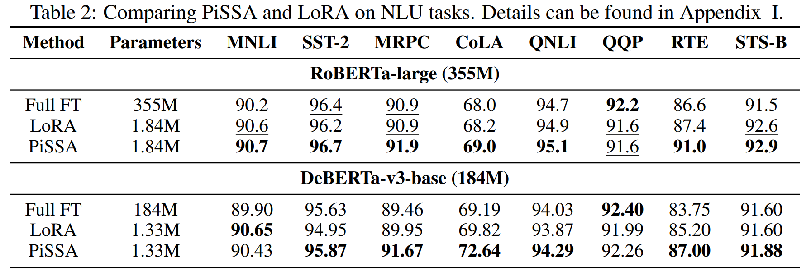

- Tab. 2 는 두 base model 을 사용하여 수행된 8 task 에 대한 결과를 보여준다. 
- PiSSA 는 16개의 실험 설정 중 14개에서 LoRA 를 능가했으며, QQP + RoBERTa 에서는 동일한 성능을 보였다. 
- 유일한 예외는 MNLI dataset 에서 DeBERTa-based model 로 수행된 실험이었다.
- training loss 를 검토한 결과, PiSSA 의 평균 손실은 final epoch 에서 0.17로, LoRA 의 0.24 보다 낮았다. 이는 PiSSA 의 fitting 능력이 LoRA 보다 여전히 강력함을 나타낸다.

## 5.2 Experiments using Full Data and More Epochs

이 섹션에서는 LLaMA 2-7B model 을 MetaMathQA-395K 전체 dataset 으로 3 epoch 동안 fine-tuning 하여, 충분한 학습 포화 상태를 보장하였다. 

training loss 와 gradient norm 을 시각화하여 빠른 수렴을 보여주었으며, 1000 steps 마다 GSM8K dataset 에서 평가하여 PiSSA 가 LoRA 대비 우수한 성능을 가지는 것을 증명하였다. 

결과는 Fig. 4에 나타나 있다.

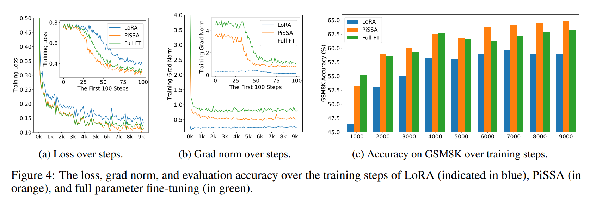

- Fig. 4a 에 따르면, PiSSA 의 loss 는 처음 100 steps 동안 빠르게 감소하며, PiSSA 의 gradient norm (Fig. 4b)은 LoRA 에 비해 상당히 높고, full fine-tuning 과 유사한 경향을 보인다. 
- 학습 과정 내내 PiSSA 의 loss 은 LoRA 보다 낮게 유지되며, 이는 PiSSA 가 더 나은 지역 최적점에 수렴한다는 것을 나타낸다. Fig. 4c 에서 보듯이, PiSSA 는 일관되게 LoRA 보다 높은 정확도를 달성하며, 대부분의 경우 full parameter fine-tuning 을 초과한다. 이는 PiSSA 가 full fine-tuning 의 denoised 버전이기 때문이라고 가정된다. PiSSA 와 full fine-tuning 의 gradient norm 및 손실 곡선을 비교하면, full fine-tuning 의 더 큰 gradient norm 이 더 낮은 손실로 이어지지 않는다는 것을 알 수 있다. 이는 gradient norm 의 일부가 손실 감소에 유익하지 않은 noisy 방향에 소비된다는 것을 나타낸다. 이 현상은 Fig. 2a 와 일치한다.

## 5.3 Conducting 4-bit Quantization Experiments

이 섹션에서는 PiSSA, QLoRA, LoftQ 의 초기 quantization error 감소율을 비교하였다. 이 비율은 다음과 같이 정의된다: $(1 - \frac{\|W - (nf4(W^′) + AB)\|_*}{\|W - nf4(W)\|_*}) \times 100\%$

이는 base model 을 직접 quantization 하는 것과 비교하여 각 방법이 달성한 상대적 error 감소를 측정한다. 

부분 결과는 Tab. 3에, 전체 결과는 Tab. 6 에 나와 있다.

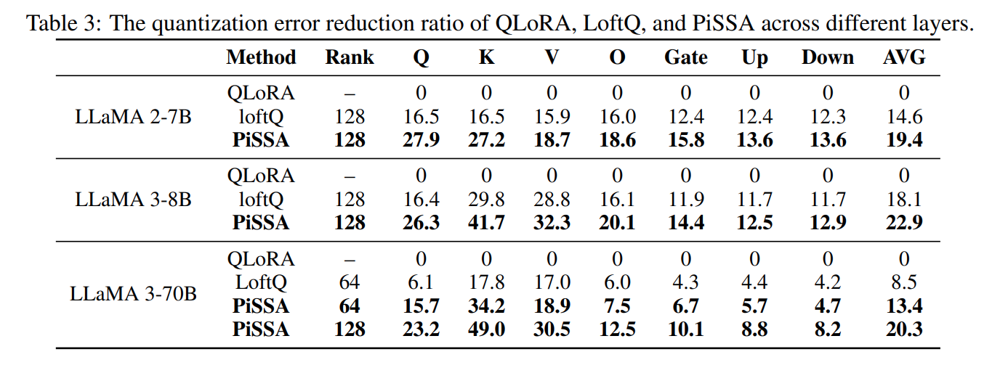

- Tab. 3 에 따르면, PiSSA 는 base model 을 직접 quantization 하는 것과 비교하여 약 20%의 quantization error 감소를 달성하였다. 이 감소는 lower-rank matrix 에서 더 두드러진다. 
- 예를 들어, LLaMA-3-70B 의 모든 “Key” projection layer 에서 49% 의 감소가 관찰되었다. 
- Tab. 3의 결과는 Sec. 4 에서 논의된 QLoRA 가 quantization error 를 감소시키지 못한다는 것을 확인시켜준다. 
- 반면, PiSSA 는 LoftQ 보다 훨씬 더 큰 quantization error 감소를 달성하였다

quantization error 감소 외에도, QPiSSA 는 QLoRA 와 LoftQ 보다 더 빠르게 수렴할 것으로 기대된다. MetaMathQA-395K dataset 으로 LoRA/QLoRA, PiSSA/QPiSSA, LoftQ, full fine-tuning 으로 LLaMA 3-8B 를 학습하였으며, GSM8K dataset 에서 손실, gradient norm, 정확도를 기록하였다.

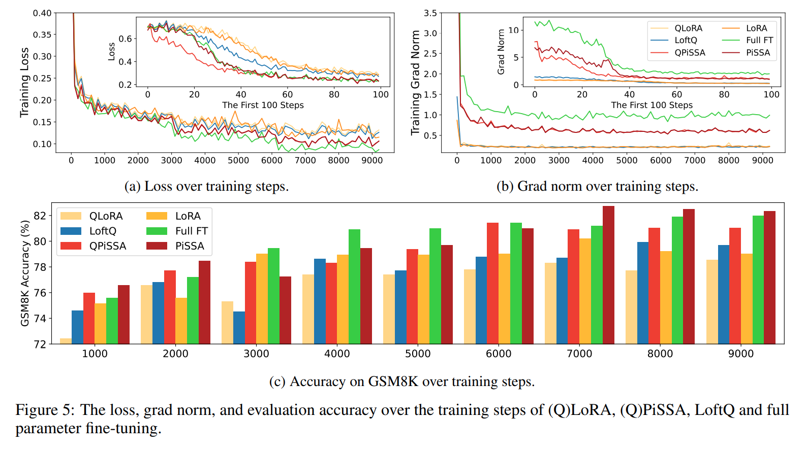

- Fig. 5 에 따르면, QPiSSA 의 손실 감소 속도는 처음 100 step 동안 PiSSA 및 full fine-tuning 보다도 빠르다. 
- LoftQ 는 quantization error 를 감소시킬 수 있지만, 손실 수렴 속도는 LoRA 와 QLoRA 보다 빠르지 않다. 이는 QPiSSA 가 quantization error 를 감소시키는 능력과 빠른 수렴 능력이 서로 독립적인 능력일 수 있음을 나타낸다. 
- 충분한 학습 이후, QPiSSA 의 손실은 LoRA/QLoRA 및 LoftQ 보다 훨씬 낮았다. gradient norm 은 LoRA/QLoRA 및 LoftQ 보다 상당히 컸다. 
- fine-tuning 성능 면에서 QPiSSA 는 QLoRA 와 LoftQ 보다 높은 정확도를 기록하였으며, full-precision LoRA 보다도 뛰어난 성능을 보였다.

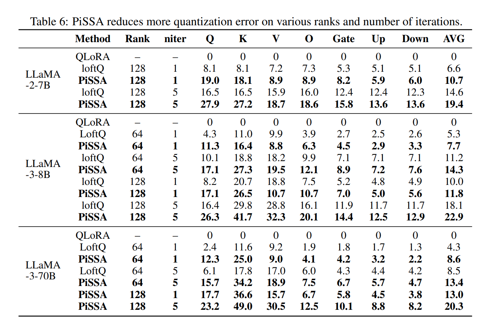

## 5.4 Experiments Across Various Sizes and Types of Models

이 섹션에서는 (Q)PiSSA 와 (Q)LoRA 를 7B 에서 70B 파라미터에 이르는 9가지 모델에서 비교하였다. 

비교 대상 모델에는 LLaMA 2-7/13B, LLaMA-3-8/70B, Mistral-7B, Gemma-7B, Qwen1.5-7B, Yi-1.5-34B, 그리고 MoE model DeepSeek-MoE-16B, Mixtral-8x7B 이 포함된다. 

이러한 모델은 MetaMathQA-100K 와 CodeFeedback-100K dataset 으로 fine-tuning 되었으며, GSM8K 와 HumanEval dataset 으로 평가되었다. 

DeepSeek-MoE-16B, Mixtral-8x7B, Yi-1.5-34B, LLaMA-3-70B 는 QPiSSA 및 QLoRA 로, 나머지 모델은 PiSSA 및 LoRA 로 fine-tuning 되었다. 

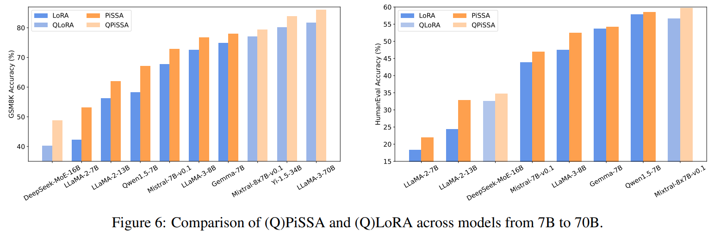

Fig. 6에서 볼 수 있듯이, (Q)PiSSA 는 (Q)LoRA 와 비교하여 다양한 크기와 유형의 모델에서 향상된 정확도를 보여주며, (Q)LoRA 대비 일관된 우위를 입증한다.

## 5.5 Experiments on Various Ranks

이 섹션에서는 PiSSA/QPiSSA 와 LoRA/QLoRA 의 rank 를 1 에서 128 까지 점진적으로 증가시키며, PiSSA/QPiSSA 가 다양한 rank 에서도 LoRA/QLoRA 를 지속적으로 능가하는지 여부를 조사하였다. 

학습은 MetaMathQA-100K dataset 으로 1 epoch 동안 수행되었으며, 검증은 GSM8K 와 MATH dataset 에서 이루어졌다. 

실험 결과는 Fig. 7에 나타나 있다.

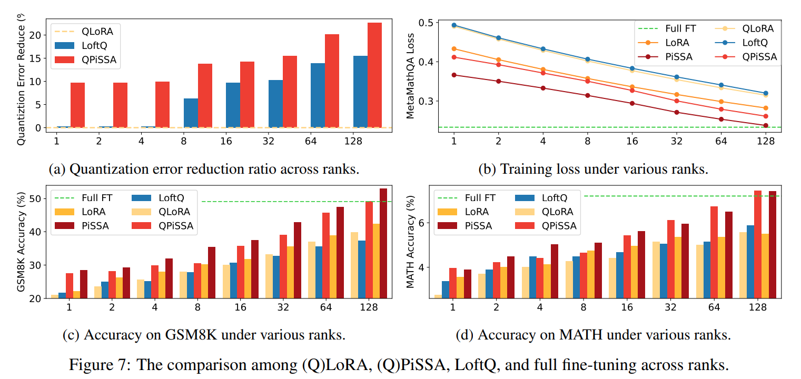

- Fig. 7a 는 다양한 rank 에서 quantization error 감소율을 보여준다. 여기서 QLoRA 는 quantization error 를 감소시키지 못하는 반면, QPiSSA 는 모든 rank 에서 LoftQ 보다 quantization error 를 지속적으로 더 많이 감소시키며, 특히 low rank 에서 현저한 우위를 보인다. 
- Fig. 7b 는 rank 가 1 에서 128 까지 증가하는 모델의 training data 에 대한 최종 손실을 보여준다. 
- 결과는 PiSSA 와 QPiSSA 가 LoRA, QLoRA, LoftQ 에 비해 training data 에 더 잘 맞는다는 것을 나타낸다. 
- Fig. 7c 와 Fig. 7d 에서는 다양한 rank 에서 fine-tuning 된 모델의 GSM8K 및 MATH 검증 데이터셋에 대한 정확도를 비교한 결과, 동일한 trainable parameter 수를 사용한 경우 PiSSA 가 LoRA 를 지속적으로 능가함을 보여준다. 
- 더욱이 rank 가 증가함에 따라 PiSSA 는 full-parameter fine-tuning 의 성능에 도달하거나 이를 초과한다.

### 6 Conclusion

이 논문은 pre-trained 모델의 weight matrix 에 singular value decomposition (SVD) 를 적용하는 PEFT 기법을 제안한다. 

SVD 를 통해 얻어진 주요 성분은 PiSSA 라는 low-rank adapter 를 초기화하는 데 사용되며, residual components 는 frozen 되어 효과적인 fine-tuning 과 parameter efficiency 를 동시에 달성한다. 

광범위한 실험을 통해 PiSSA 와 그 4-bit quantization 버전인 QPiSSA 가 NLG 와 NLU 작업 모두에서 LoRA 와 QLoRA 를 크게 능가한다는 것을 발견했다. 

이는 다양한 학습 단계, 모델 크기와 유형, 그리고 다양한 trainable parameter 양에 걸쳐 일관되게 나타났다. 

PiSSA 는 모델 내 주요 성분을 식별하고 fine-tuning 하는 방식으로 PEFT 연구에 새로운 방향을 제공하며, 이는 가장 풍부한 피자 슬라이스를 선택하고 재구성하는 과정과 유사하다. 

PiSSA 는 LoRA 와 동일한 아키텍처를 공유하므로, 기존 LoRA pipeline 에서 효율적인 대체 초기화 방법으로 매끄럽게 사용할 수 있다.

### 7 Limitation

PiSSA 에 대해 본 논문에서 다루지 않은 몇 가지 질문이 남아 있다: 1) language model 이외에, PiSSA 를 convolutional layer 에도 적용하여 vision task 의 성능을 향상시킬 수 있는가? 2) PiSSA 가 AdaLoRA 및 DyLoRA 와 같은 rank 를 적응적으로 조정하는 LoRA 개선 기술의 혜택도 받을 수 있는가? 3) PiSSA 가 LoRA 에 비해 가지는 장점에 대해 더 많은 이론적 설명을 제공할 수 있는가? 