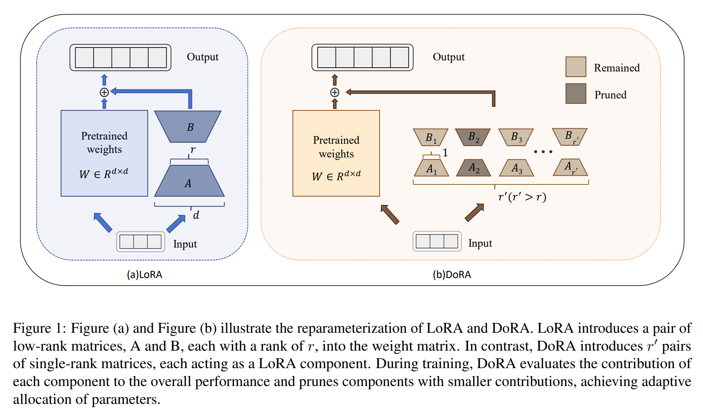
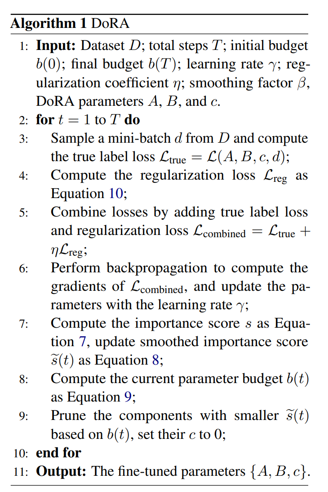
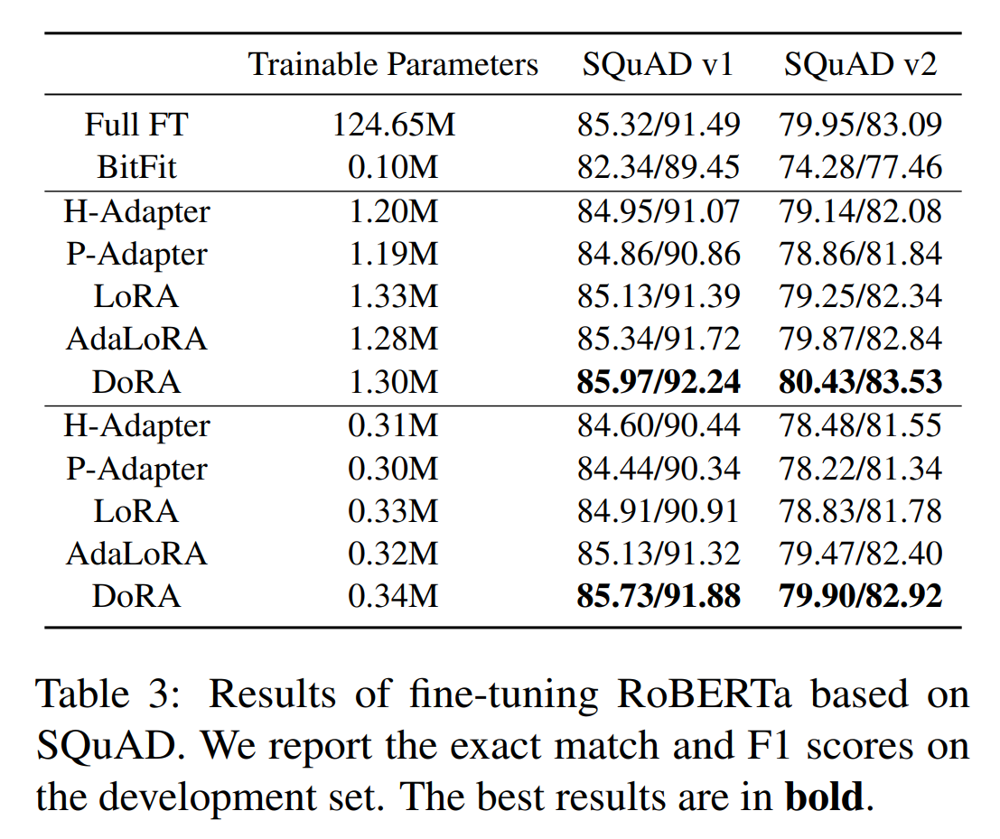
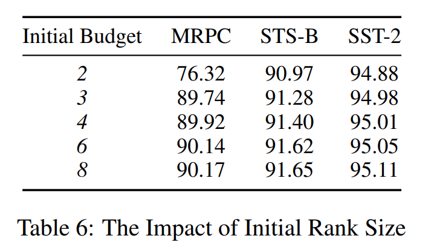

논문 및 출처 : <https://arxiv.org/pdf/2405.17357>

# Abstract

large-scale pre-trained model 의 fine-tuning 은 본질적으로 resource-intensive task 이다. 

이는 모델의 성능을 향상시킬 수 있지만, 상당한 computational costs 를 초래하여 실제 애플리케이션에 어려움을 준다. 

기존의 parameter-efficient fine-tuning(PEFT) 방법들, 예로 Low-Rank Adaptation (LoRA)은 weight matrices 간의 differential parameter budget requirements 를 무시하는 우회적인 프레임워크에 의존하며, 이는 suboptimal fine-tuning 결과를 얻을 수 있다. 

이 문제를 해결하기 위해 저자는 Dynamic Low-Rank Adaptation (DoRA) 방법을 소개한다. 

- DoRA 는 high-rank LoRA layers 을 structured single-rank components 로 분해하여, training 중 specific tasks 에 대한 importance 에 따라 parameter budget 을 dynamic pruning 하여 limited parameter budget 을 최대한 활용할 수 있게 한다. 
- 실험 결과 DoRA 는 LoRA 와 full model fine-tuning 과 비교해 경쟁력 있는 성능을 달성할 수 있으며, 동일한 storage parameter budget 내에서 다양한 strong baseline 을 능가한다.

# 1 Introduction

pre-trained language model(PLM) 은 NLP 에서 중요한 역할을 하며, 다양한 downstream task 에서 상당한 성능 향상을 제공한다. 

이러한 모델을 specific task 에 맞추기 위해서는 일반적으로 fine-tuning 을 통해 pre-trained knowledge 를 특정 요구 사항에 맞게 조정한다. 

그러나 PLM scale 이 커질수록 full model fine-tuning 에 드는 비용이 막대해지며, 이는 parameter-efficient fine-tuning(PEFT) 방법에 대한 수요를 증가시키고 더 많은 관심을 불러일으켰다.

일반적인 PEFT 방법들은 downstream task 에 적응하기 위해 extra parameters 를 도입하고 all original parameters 를 동결시킨다. 

- 예로, Low-Rank Adaptation (LoRA) 는 PLM 에 기존 fixed weight matrices 에 low-rank trainable matrices 를 포함시켜 간결한 접근 방식으로 인기를 끌고 있다. 
  - 그러나 LoRA 는 all matrices 에 trainable parameter 를 균일하게 할당하며, 일부 연구에 따르면 all weights 가 fine-tuning 성능에 동일하게 기여하지 않는다. 
  - 이는 inefficient parameter usage 로 이어질 수 있다. 
  - 따라서 optimal fine-tuning 을 위해서는 각 matrix 의 parameter budget needs 를 평가하고 limited parameters 를 전략적으로 할당할 수 있는지 여부를 고려해야 한다.
- 다행히도, AdaLoRA 같은 방법은 more nuanced parameter distribution 전략을 도입함으로써 이전 PEFT 방법의 한계를 완화할 수 있다. 
  - AdaLoRA 의 training 은 higher parameter budget 으로 시작하며, SVD(singular value decomposition) process 를 시뮬레이션하여 smaller singular values 와 해당 singular vectors 를 점진적으로 pruning 한다. 
  - 그러나 simulated SVD 에 대한 AdaLoRA 는 orthogonal regularization 에 의존하여 fine-tuning efficiency 의 추가적인 향상을 제한할 수 있다. 
  - 또한, AdaLoRA 의 pruning 전략은 오직 singular values 에만 초점을 맞추며, projection matrices 에서 사용 가능한 모든 정보를 완전히 활용하지 못하여 less-then-optimal decisions 를 내리지 못할 가능성이 있다.

이를 해결하기 위해, 본 연구는 Dynamic Low-Rank Adaptation (DoRA) 방법을 소개한다. 

- Fig. 1 처럼, DoRA 는 LoRA 와 달리, high-rank LoRA layers 를 single-rank components 의 합으로 분해하고, 각 component 가 전체 성능에 미치는 contribution 을 평가하여 fewer contribution 의 component 를 pruning 한다. 
- 이를 통해 PLM 의 모듈에 필요한 만큼의 parameter budget 을 할당하여 limited parameter budget 을 최대한 활용할 수 있게 한다. 
- 기존의 dynamic parameter allocation (e.g., AdaLoRA) 과 비교했을 때, DoRA 는 projection matrices 에서 richer information 을 기반으로 parameter budget 을 더 적절하게 할당할 수 있다.

summarization 하자면, 기여는 다음과 같다:

- 저자는 새로운 PEFT 방법인 DoRA 를 소개하며, 이는 0.3% 미만의 trainable parameter 로 full model fine-tuning 성능을 능가한다.
- DoRA 는 PLM 에서 fine-tuning task 에 중요한 역할을 하는 모듈을 효율적으로 식별하여, 이러한 주요 모듈에 more parameter budget 을 할당할 수 있다.
- DoRA 는 limited parameter budget 을 최대한 활용하며, 실험 결과 DoRA 는 동일한 limited parameter budget 하에서 multiple downstream task 에서 기준 접근법을 능가한다.

# 2 Background

BERT, GPT, Llama 같은 PLM 의 출현은 NLP 분야를 의미 있게 발전시켰다. 

extensive text datasets 로 학습된 PLM 은 복잡한 language pattern 을 포착하여 text classification, named entity recognition, machine translation 같은 다양한 NLP task 에서 우수한 성능을 가능하게 한다.

PLM 은 specific dataset 에 맞게 fine-tuning 될 수 있어 다양한 언어적 도전에 매우 유연하게 대응할 수 있다.

PLM 은 주로 Transformer architecture 를 활용하며, 이는 stacked Transformer blocks 로 구성된다.

각 block 은 two key components 로 이루어져 있다: multi-head attention(MHA) 메커니즘과 feded-forward neural network (FFN)이다. 

특히 MHA 는 text 의 contextual relationships 를 효과적으로 포착하며, 다음과 같이 주어진다:

$$
\begin{equation}
    \begin{aligned}
        \text{MHA}(x) = \text{Concatenate}(\text{head}_1(x),\\\text{head}_2(x), \dots, \text{head}_h(x)) W_o
    \end{aligned}
\end{equation}
$$

$$
\begin{equation}
    \text{head}_i(x) = \text{Softmax} \left( \frac{(x W_{q_i})(x W_{k_i})^T}{\sqrt{d_h}} \right) x W_{v_i}
\end{equation}
$$

- $x \in \mathbb{R}^{n \times d}$ : input feature
- $n$ : sequence length
- $d$ : hidden dimension
- 이 메커니즘은 $h$ self-attention head 로 구성되며, 각 head 는 정보의 서로 다른 측면을 포착한다. 
- 각 head $\text{head}_i$ 에는 3 projection matrices, 즉 query $W_{q_i}$, key $W_{k_i}$, value $W_{v_i}$ 가 있으며, 각 dimension 은 $\mathbb{R}^{d \times d_h}$ 이다. 
  - $d_h$ : 각 head 의 dimension 으로, 일반적으로 $d/h$ 로 설정
- final output 을 생성하기 위해 output projection matrices $W_o \in \mathbb{R}^{d \times d}$가 사용된다.

Attention score 는 query 와 key 의 내적을 softmax function 으로 정규화하여 계산되며, 이는 다음과 같다:

$$
\begin{equation}
    \text{Softmax}(x_i) = \frac{e^{x_i}}{\sum_{j=1}^{n} e^{x_j}}
\end{equation}
$$

- 이 score 는 sequence 의 각 position 이 other position 에 얼마만큼 attending 하는지 결정한다.\
- 그런 다음, 이 score 는 value projection result 와 곱해져 각 head 의 output 을 도출한다.
- 마지막으로 all heads 의 output 을 연결하고, output projection matrix $W_o$ 와 곱하여 final MHA output 을 형성한다.

MHA 이후, FFN 은 정보를 다음과 같이 추가로 처리한다:

$$
\begin{equation}
    \text{FFN}(x) = \text{ReLU}(x W_{f_1} + b_1) W_{f_2} + b_2
\end{equation}
$$

이 과정을 통해 self-attention 메커니즘에서 추출된 특징들 간의 더 복잡한 상호작용이 가능해진다. 

각 Transformer block 은 block 의 input 을 output 에 직접 더하는 residual connection 을 포함하고 있으며, 이는 vanishing gradient 문제를 완화하고 model layer 전반에 걸친 information flow 를 일관되게 유지한다.

# 3  Dynamic Low-Rank Adaptation

본 논문에서는 LoRA 를 사용하여 PLM 의 fine-tuning 시 limited parameter budget 을 최적화하는 방법을 제안한다. 

저자는 LoRA 와 AdaLoRA 를 기반으로 개선을 이루었으며, Tab. 1 에서 보여진다. 

DoRA 는 혁신적인 접근 방식으로 3 main strategies 를 포함하여 두드러진다: high-rank LoRA layer 을 multiple single-rank LoRA components 의 조합으로 보는 decomposition strategy, 이러한 component 의 model performance 에 대한 contribution 에 따라 조정하는 dynamic rank allocation 메커니즘, 그리고 pruning process 전반에 걸쳐 안정성을 보장하는 regularization penalty 이다. 

전체 알고리즘은 Algorithm 1 에 나와 있다.

## 3.1 Parameterization

DoRA 는 LoRA 기술을 기반으로 하고 이를 개선하여 PLM 을 위한 새로운 관점을 제시한다. 

standard LoRA layer 은 다음과 같이 정의된다:

$$
\begin{equation}
    W = W_0 + \Delta W = W_0 + AB
\end{equation}
$$

- $W$ : fine-tuning 후의 weight matrices
- $W_0$ : original weight matrices
- $A, B$ : LoRA 가 도입한 low-rank matrices

반면 DoRA 는 이 구성을 다음과 같이 재해석한다:

$$
\begin{equation}
    W = W_0 + \sum_{i=1}^{r'} \Delta W_i = W_0 + \sum_{i=1}^{r'} A_i B_i c_i
\end{equation}
$$

- $r'$ : LoRA component 개수
- LoRA component 는 $A_i$, $B_i$, 그리고 $c_i$ 로 이루어진 triplet
  - $A_i$ 와 $B_i$ 는 각각 $d \times 1$ 및 $1 \times d$ size 의 single-rank matrices
  - $c_i$ : component 가 pruning 될 경우 0 으로 설정되는 scalar

## 3.2 Importance Scoring

각 LoRA component 의 importance 평가를 을 위해, 각 $\Delta W_i$ 의 contribution 을 정량화하는 importance scoring 메커니즘을 사용하며, 이는 다음과 같이 주어진다:

$$
\begin{equation}
    \begin{aligned}
        s_i = \|\Delta W_i\|_F / \|\sum_{j=1}^{r'} \Delta W_j \|_F \\
        = \|A_i B_i c_i\|_F / \|\sum_{j=1}^{r'} A_j B_j c_j \|_F
    \end{aligned}
\end{equation}
$$

- $\|x\|_F$ : Frobenius norm 으로, matrix 내의 all elements 의 제곱합의 제곱근을 계산하는 척도다.  

Frobenius norm 을 사용함으로써 각 LoRA component 가 해당 LoRA layer 의 total update magnitude 에 기여하는 proportion 을 측정할 수 있다. 

- 이 metric 은 특정 component 가 pruning 될 경우, LoRA layer 의 total update 에 미칠 잠재적인 영향을 추정하는 데 유용하다. 
- total update magnitude 에 대한 영향이 작은 component 는 pruning 우선순위에 놓이며, 이로 인해 pruning 과정이 성능에 최소한의 영향을 미치도록 보장한다.

이전 방법과 비교했을 때, 저자는 $c_i$ 대신 $\|\Delta W_i\|_F$ 를 사용하여 component 의 importance 를 평가한다.

- 이로 인해 $A_i$ 와 $B_i$ 의 정보를 포함하여 component 의 importance 를 더 종합적으로 평가할 수 있다.  
- 또한, importance scores 의 정확성을 높이기 위해, exponential moving average 을 적용하여 importance scores 를 smoothing 하는 방법을 사용한다. 
- time $t$ 에서 $i$-th LoRA component 의 smoothed importance scores $\tilde{s}_i(t)$ 는 current importance scores $s_i$ 와 previous scores 를 factor $\beta$ 로 조정하여 혼합한 값으로 나타난다:

$$
\begin{equation}
    \tilde{s}_i(t) = \beta \cdot \tilde{s}_i(t-1) + (1 - \beta) \cdot s_i
\end{equation}
$$

## 3.3 Parameter Scheduling and Pruning Strategy

parameter budget 은 각 LoRA layer 에서 평균적으로 사용하는 LoRA component 의 수를 의미한다. 

- 이는 initial parameter budget $b^{(0)} = r'$ 에서 시작하며, 이는 eventual target budget $b^{(T)} = r$ 보다 높게 설정된다.
  - $r'$ 과 $r$ : hyper-parameter
- $r'$ 을 $r$ 보다 크게 설정하면 DoRA 가 더 광범위한 parameter allocations 을 탐색할 수 있어 optimal distribution 을 찾는 데 도움이 된다.  

DoRA 는 gentle pruning 전략을 채택한다. 

- pruned $A_i$, $B_i$, 및 $c_i$ triplet 에 대해, $c_i$ 를 0 으로 설정하는 방식으로만 pruning 이 수행되며, $A_i$ 와 $B_i$ 는 그대로 유지된다. 
- 이후의 training 에서, $c_i$ 가 backpropagation 에 의해 non-zero value 으로 업데이트되고 다시 pruning 되지 않으면, pruned triplet 은 복원될 수 있다.  

---

- DoRA 는 training first $t_i$ step 까지 pruning 를 수행하지 않고 warm up 한다.
  - $i$ : initial steps
- 이후, lower importance scores components 를 남은 components 가 budget $b^{(T)}$ 에 도달할 때까지 pruning 하여 cubic decrement pattern 을 따른다.
- 그 이후, last $t_f$ steps 의 component distribution 은 고정한다.
  - $f$ : final steps

overall budget scheduler 는 다음과 같이 주어진다.

$$
\begin{equation}
    b(t) =
    \begin{cases} 
    b^{(0)} & \text{if } 0 \le t < t_i, \\
    b^{(0)} - \frac{(b^{(0)} - b^{(T)})}{b^{(0)}} \cdot \left(\frac{t - t_i}{t_f - t_i}\right)^3 & \text{if } t_i \le t \le T - t_f, \\
    b^{(T)} & \text{if } t > T - t_f.
    \end{cases}
\end{equation}
$$

## 3.4 Dimensional Equilibrium Modulator

DoRA 는 Frobenius norm 을 사용하여 component pruning 하며, smaller norms component 를 우선적으로 선택한다. 

그러나 대부분의 elements 가 zero 에 가까우면서 일부는 high value 를 가지는 component 는 상대적으로 low Frobenius norm 을 가지게 되어, pruning 대상으로 선택될 수 있다. 

이러한 상황은 total update $\Delta W$ 의 일부 dimension 에 큰 변화를 초래할 수 있으며, 이는 gradient explosion 과 유사한 영향을 미쳐 model stability 및 fine-tuning performance  악영향을 미칠 수 있다.  

이를 방지하기 위해, 저자는 Dimensional Equilibrium Modulator (DEM) loss 를 도입하여 component 의 variance 을 다음과 같이 페널티화한다:

$$
\begin{equation}
    R = \frac{1}{n} \sum_{i=1}^{n} (\text{Var}(A_i) + \text{Var}(B_i))
\end{equation}
$$

- $\text{Var}(A_i)$ 와 $\text{Var}(B_i)$ : 각각 $A_i$ 와 $B_i$ 의 variance
- $n$ : component 수
- DEM 은 component 내부 element 의 uniform distribution 을 장려하여, 일부 dimensions 의 불균형한 영향이 발생하는 것을 방지하고, model pruning 에 의한 perturbations 를 줄여 model stability 를 높인다.

# 4 Experiments

## 4.1 Experimental Setup

저자는 natural language understanding (NLU), question asnwering (QA), 그리고 text generation (summarization) task 에서 DoRA 와 기존 baselines 를 비교하여 성능을 평가한다. 

- NLU 및 QA task 를 위해 RoBERTa 와 Bart 를 각각 foundation model 로 선택하였고, summarization tasks 에도 사용하였다. 
- RoBERTa 는 BERT architecture 의 최적화된 버전으로, extended training, larger dataset, 그리고 parameter 의 fineer tuning 을 통해 다양한 NLU task 에서 성능을 크게 향상시킨다. 
- Bart 는 text generation task, 특히 summarization 을 위해 특별히 설계된 Transformer-based sequence-to-sequence pre-trained model. 
  - 이는 bidirectional 및 autoregressive Transformer architecture 를 결합하여 다양한 generation tasks 를 효과적으로 처리한다.

저자는 여러 standard dataset 에서 성능을 테스트하였다: NLU task 을 평가하기 위해 GLUE(General Language Understanding Evaluation) dataset 을 사용하고, QA task 를 위해 SQuAD(Stanford Question Answering Dataset)을, text summarization 을 위해 Xsum 을 사용하였다. 

- GLUE 는 sentiment analysis 및 text entailment 같은 다양한 task 를 포함한 NLU system training 및 testing 을 위한 dataset 이다.
- SQuAD 는 Wikipedia arcicles 의 생성된 질문과 그에 대한 답변으로 구성된 question answering dataset
- Xsum 은 극단적인 information compression conditions 에서 single-sentence summarization 을 생성하는 것을 목표로 하는 extreme summarization tasks 를 위한 테스트 환경을 제공한다.

저자는 LoRA, AdaLoRA, Adapter Tuning, BitFit, 그리고 full model fine-tuning 을 포함한 여러 주류 fine-tuning 방법을 baseline 으로 선택하였다. 

- LoRA 는 pre-trained matrices 에 low-rank matrices 를 추가하여 model weights 를 fine-tuning 한다;
- AdaLoRA 는 adaptive adjustment 메커니즘을 추가한 LoRA 의 개선판이다. 
- Adapter Tuning 은 PLM 에 lightweight network modules 를 삽입하여 fine-tuning 한다. 
- BitFit 은 PLM 에서 bias parameters 만 조정한다. 
- full model fine-tuning 은 all model weights 를 포괄적으로 조정하는 전통적인 방법이다.

저자는 5 random seeds 를 기반으로 평균 결과를 보고하며, 이는 Tab. 2, Tab. 3, Tab. 4 에 나타나 있다.

## 4.2 Results

저자는 GLUE 벤치마크의 subtasks 에서 DoRA 와 baselines 의 성능을 조사하며, two different parameter budget 시나리오에서 실험을 수행한다.

- Tab. 2 처럼, adaptive parameter allocations 전략을 사용하는 DoRA 와 AdaLoRA 는 uniform parameter distribution 을 사용하는 all baselines 을 초과 달성하여, adaptive parameter allocations 의 놀라운 효과를 입증한다. 
- GLUE 벤치마크 전반에 걸쳐, DoRA 는 LoRA 에 비해 0.84% 및 0.88%, AdaLoRA 에 비해 0.59% 및 0.45% 의 성능 향상을 보여주어, multiple tasks 에서 DoRA 의 adaptive parameter allocations 전략의 넓은 적용 가능성과 효율성을 추가로 입증한다.
- 특히 주목할 만한 것은 DoRA 의 CoLA dataset 에서의 성능으로, 여기서 가장 높은 개선을 보여주며, two parameter budgets 에서 highest performance baseline 방법을 1.48% 및 1.73% 초과 달성하였다. 
  - 이는 DoRA 가 linguistic acceptability task 를 처리하는 데서의 장점을 강조하며, 도전적인 NLP task 을 처리하는 데 있어 효율성을 보여준다. 
  - 그러나 DoRA 는 MNLI task 에서 AdaLoRA 에 비해 약간 뒤처지는 성능을 보였으며, 이는 MNLI 가 GLUE 에서 largest dataset 으로  high task complexity 를 가지고 있음을 나타내며, large-scale complexity tasks 를 처리할 때 adaptive parameter allocations 전략의 추가 최적화가 필요함을 시사한다.
- DoRA 는 full model fine-tuning 의 성능을 0.34M 의 parameter 로 초과 달성하며, 이는 full model fine-tuning 의 0.3% 도 안 되는 수치로, limited parameter budget 을 효과적으로 활용하는 DoRA 의 능력을 강조한다. 
- SQuAD 와 Xsum 에 대한 실험에서도 유사한 결과가 관찰되었으며, DoRA 는 두 가지 parameter 설정에서 all baseline PEFT 방법을 초과 달성하였다. 

# 5 Analysis and Discussion

## 5.1 Effectiveness of DEM

DEM 의 효과를 검증하기 위해, STS-B, CoLA, SST-2 dataset 에서 DEM 을 사용한 fine-tuning 과 사용하지 않은 경우를 비교하였다. 

DEM 을 사용하지 않은 경우는 hyper-parameter regularization coefficient $\eta$ 를 0 으로 설정한 것이다. 

결과는 Tab. 5 에 나타나 있다. 

- DEM 을 활성화하면 LoRA component 의 distribution 에 penalty 를 부여하여 uniform weight distribution 을 유도하고, pruning 으로 인해 few dimensions 에서 total update $\Delta W$ 의 극단적인 변화를 방지한다. 
- DEM 이 활성화된 상태에서의 fine-tuning 이 더 높은 결과를 달성하여 DEM 의 효과성을 입증한다.

## 5.2 Parameter Allocation Preference

DoRA 가 PLM 에서 핵심 모듈을 식별할 수 있는지를 검증하기 위해, final budgets $b^{(T)}$ 를 2, 4, 8, 16 으로 설정하고, final budgets 의 1.5배를 initial budget $b^{(0)}$ 로 하여 SST-2 dataset 에서 fine-tuning 실험을 수행하였다. 

결과는 Fig. 2 에 나타나 있다. 

- intermediate layer 에서 query 와 key matrices 는 more parameter budget 이 할당되는 반면, value matrices 은 fewer budget 이 할당된다. initial output metrices 는 more budget 을 받는다.
- FFN 에는 Fig 에서 $W_{f_2}$ 로 표현된 lower projection matrices 가 특히 last few layers 에서 very few budgets 가 할당된다. 
- DoRA 는 네 가지 구성에서 동일한 parameter allocations 경향을 보이며, PLM 에서 핵심 모듈을 일관되게 식별하고 그에 따라 more parameter budget 을 할당할 수 있음을 보여준다.

## 5.3 Impact of Initial Budget

MRPC, STS-B, SST-2 dataset 에서 initial budget $b^{(0)}$ 의 영향을 조사하였다. 

다양한 initial budget 에서 시작하여 model 을 fine-tuning 한 후, 일관된 final budgets $b^{(T)}$ 를 2 로 pruning 하였다.

결과는 Tab. 6 에 나타나 있다. 

- first row 는 initial budget 이 2 일 때 final budgets 과 일치하여, model pruning 가 수행되지 않았음을 의미한다.
- 흥미롭게도, higher initial parameter budget 의 final parameter budget 을 일정하게 유지하면 모델 성능이 향상된다는 결과를 보였다. 
- 저자는 이러한 개선을 initial parameter budget 이 wider exploration space 를 제공하여 DoRA 가 pruning 중 essential parameters 를 보존할 가능성을 높이고, 모델의 최종 성능을 최적화하는 데 기여한다고 설명한다.

# 6 Related Work

PEFT 는 PLM 의 실제 응용 프로그램에서 fine-tuning 에 중요하다. 

이러한 기술은 주로 모델의 일부 parameters 를 업데이트하거나 small sacle new parameters 를 도입하여 자원의 효율적 사용을 가능하게 한다. 

이러한 접근 방식은 계산 자원이 제한된 상황에서 특히 유용하다. 

기존 PEFT 방법은 일반적으로 Addition-based methods, Specification-based methods, reparameterization-based methods 의 세 가지 범주로 나눌 수 있다.

#### Addition-based methods

Addition-based methods 은 PLM 에 extra modules 나 trainable parameters 를 추가하여 조정을 달성한다. 

예로, trainable adapter 나 soft prompt 가 있다. 

- 이러한 방법은 확장 가능하며 다양한 크기의 모델에 적용할 수 있으며, model size 가 증가함에 따라 이 방법들과 full model fine-tuning 간의 성능 차이가 줄어든다. 
- 예로 Adapter 가 있으며, 이는 조정을 위해 Transformer layer 에 small neural modules 를 삽입한다. 
- prompt-based tuning 은 original input 주위에 additional context 를 추가하여 PLM 을 자극한다.

#### Specification-based methods 

Specification-based methods 은 모델의 내부 구조를 변경하지 않고 모델 내의 few inherent parameters 를 fine-tuning 하는 데 중점을 둔다. 

이러한 접근 방식은 최적화할 parameters 의 부분을 직접 지정하여 efficient model adaptation 을 달성하며, full parameter fine-tuning 에 가까운 성능을 유지하면서 tuned parameters 수를 줄인다. 

예로는 모델의 bias terms 만 최적화하는 BitFit 과 difference vectors 를 최적화하여 sparsity 를 도입하는 Diff Pruning 이 있다.

#### Reparameterization-based methods

reparameterization-based methods 은 adaptive parameters 를 more efficient form 으로 형태로 변환하여 모델을 최적화한다. 

이러한 방법들은 종종 low-rank 가설을 기반으로 하여, computational 및 memory costs 을 줄이면서 full parameter fine-tuning 의 성능을 유지하거나 초과하는 것을 목표로 한다. 

PLM 이 downstream task 에 적응할 때 본질적으로 low-rank 이라는 이론에 기반하여 이루어진다. 

예로는 LoRA 가 있으며, 이는 weight changes 의 low intrinsic rank 가설에 따라 최적화된다.

# 7 Conclusion

본 논문에서는 PLM 의 fine-tuning 효율성을 높이기 위해 dynamic low-rank adaptation (DoRA)이라는 새로운 방법을 소개한다. 

- DoRA 는 specific task 에 대한 importance 에 따라 parameter budget 을 dynamic allocation 하여 NLP 응용 프로그램에서 상당한 개선을 보여준다. 
- 실험 결과에 따르면, DoRA 는 baselines 를 초과 달성하여 모델 최적화 노력에 대한 폭넓은 채택 가능성을 강조한다. 
- DoRA 의 혁신은 traditional uniform distribution 과 달리, contribution 에 따라 parameter budget 의 distribution 을 동적으로 조정하는 adaptive parameter allocations 전략을 채택한 데 있다. 
- 또한, DoRA 는 LoRA layers 를 처리하기 위해 component-wise decomposition 접근 방식을 사용하여 high-rank LoRA layers 를 single-rank LoRA component 의 조합으로 취급한다. 
- 이러한 component 는 full model 성능에 대한 contribution 에 따라 pruning 되며, stable pruning 를 보장하기 위해 component variance 를 줄이는 regularization penalty term 을 포함한다.

# Limitation

여러 NLP task 에서 DoRA 의 효과성을 확인하였다. 

그러나 평가가 이러한 task 에 한정되어 있으며, 기계 번역이나 multi-modal task 같은 more complex NLP 를 처리하는 데 있어서의 효능은 아직 입증되지 않았다. 

또한, 실험에 사용된 model scale 이 다소 제한적이며, large-scale language model(LLMs)에 대한 실험은 수행하지 않았다. 

이러한 한계를 해결하기 위해, 향후 연구에서는 DoRA 의 잠재력을 이러한 복잡한 NLP 분야에서 탐구할 수 있을 것이다. 
