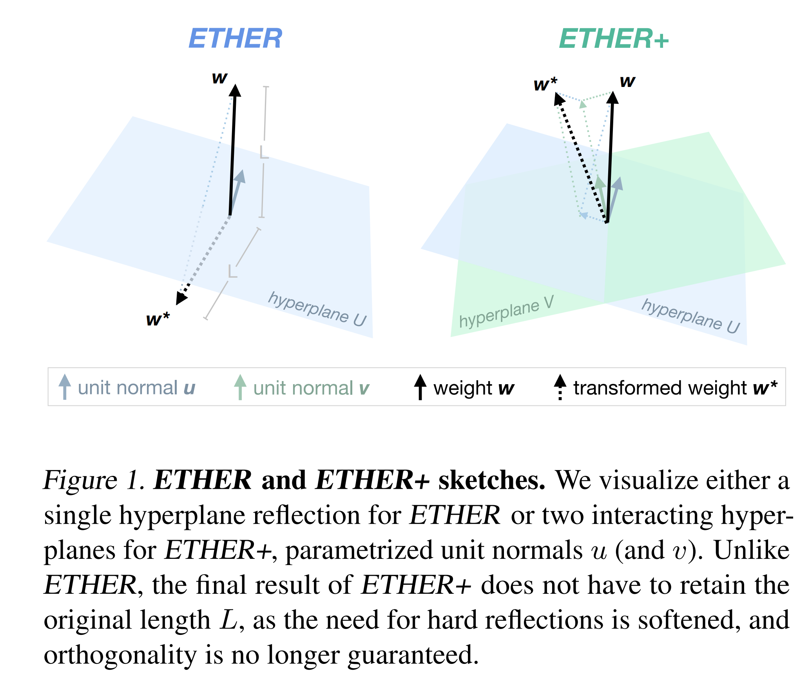
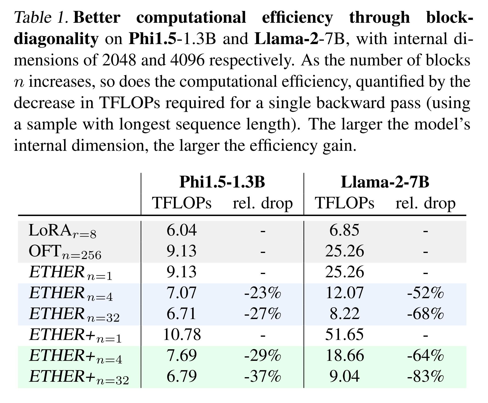
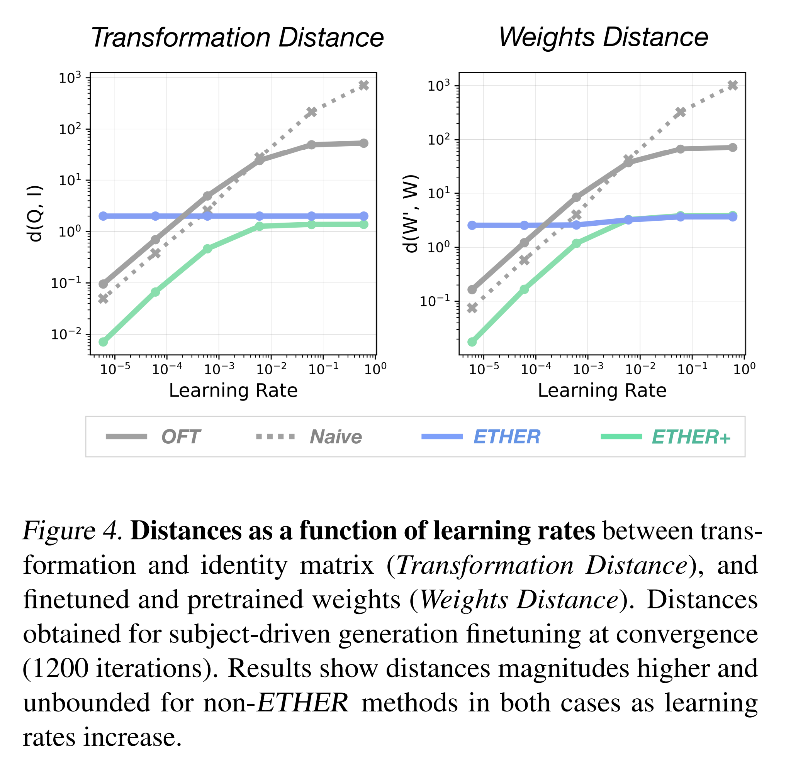
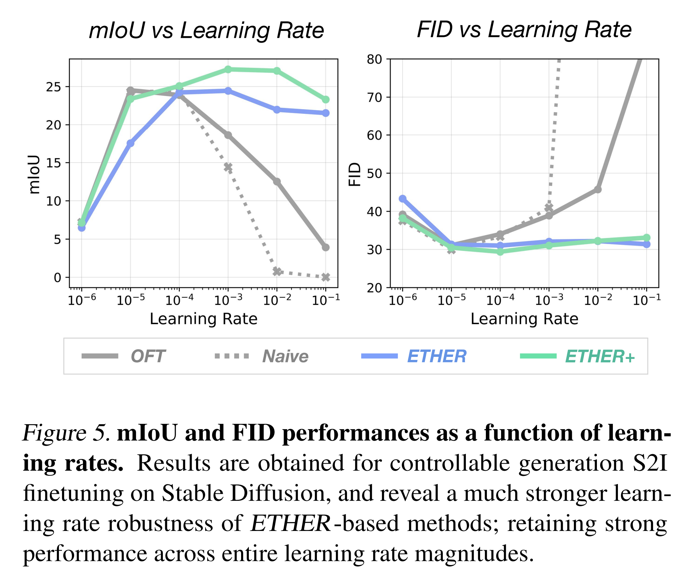
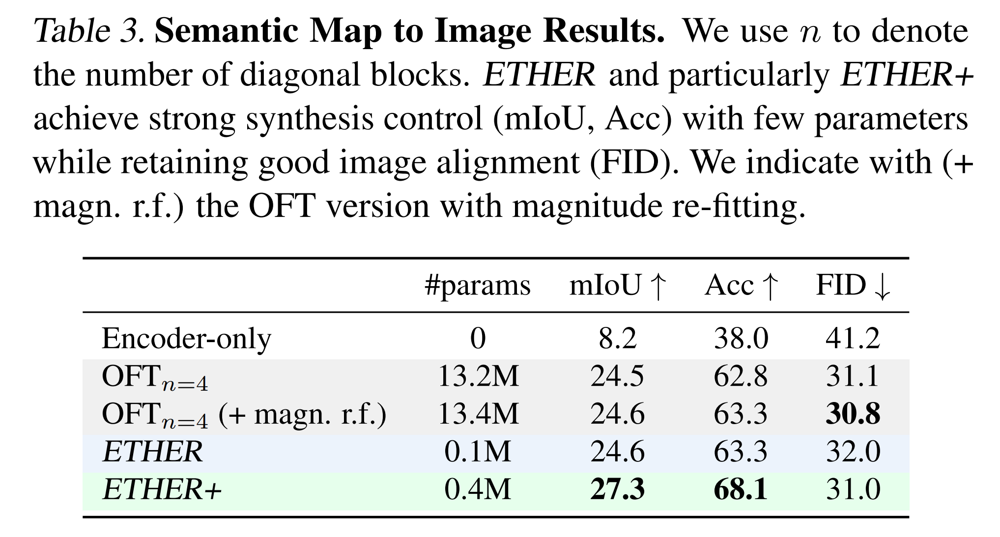
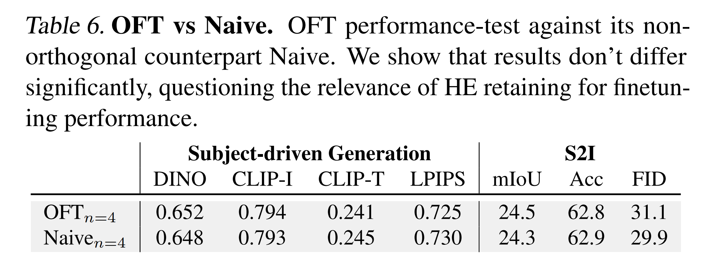
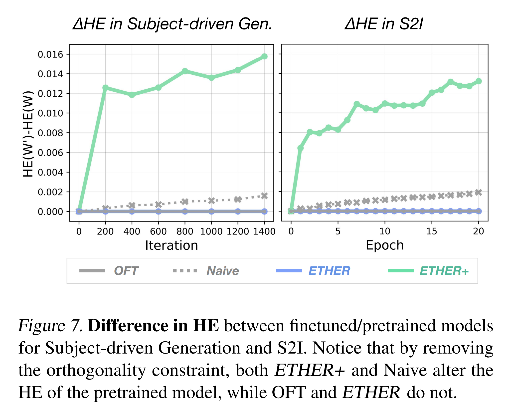

논문 및 이미지 출처 : <https://arxiv.org/pdf/2405.20271>

# Abstract

Parameter-efficient finetuning (PEFT) 은 foundation model 을 downstream task 요구사항에 맞게 적응시키면서 generalization 능력을 유지하기 위해 널리 사용되고 있다. 그러나 성공적인 adaptation 과 hyperparameter search 를 위해 추가적으로 도입되는 parameter 와 computation 의 양은 매우 빠르게 증가할 수 있으며, 특히 다수의 개별 요청을 처리하기 위해 large-scale 로 배치될 경우 폭발적으로 커질 수 있다. 효과적이고, parameter-efficient 하며, hyperparameter-robust 한 adaptation 을 보장하기 위해, 저자는 Efficient fineTuning via HypErplane Reflections 을 수행하는 ETHER transformation family 를 제안한다.

ETHER transformation 은 설계상 최소한의 parameter 만을 필요로 하며, model 성능 저하 가능성이 낮고, hyperparameter 와 learning rate 선택에 대해 strong robustness 를 보인다. 특히, 

* 저자는 ETHER 와 그 확장인 ETHER+ 를 제안하는데, 이들은 기존의 PEFT 방법들보다 훨씬 적은 parameter (LoRA 또는 OFT 대비 약 10–100 배 적음) 로도 다양한 image synthesis 및 natural language task 에서 동등하거나 더 우수한 성능을 보여주며, exhaustive 한 hyperparameter tuning 도 필요하지 않다. 
* 마지막으로, 저자는 최근 adaptation 을 위해 강조되고 있는 Hyperspherical Energy retention 에 대해 조사하고, 그 실질적인 유용성에 의문을 제기한다.

# 1. Introduction

최근 large-scale foundation model 은 generative 와 discriminative task 모두에서 뛰어난 general-purpose capability 를 보여주며, instruction following 이나 controlled image synthesis 와 같은 특수화된 task 로의 추가 adaptation 시에도 높은 flexibility 와 strong performance 를 발휘한다. 그러나 이러한 capability 는 수십억 개에 이르는 방대한 parameter 수를 수반한다. 다양한 client base 에 적합하면서도 scalable 하고 저비용으로 model adaptation 을 가능하게 하기 위해, 여러 기법들이 제안되었다.

이러한 기법은

* full finetuning,
* pretrained model 의 일부 layer 만을 tuning,
* 추가적인 learning module 을 concatenation,
* 최근에는 lightweight learnable transformation 을 이용하여 network weight 에 adapter 를 추가하는 방식

등으로 구분된다. 특히 마지막 방법은 inference latency 를 증가시키지 않으면서도 적은 adaptation parameter 와 strong performance 를 보장하는 것으로 입증되었다.

개념적으로 이러한 방법들은 smaller dataset 에 대해 finetuning 하여 downstream task 및 data 요구사항에 맞게 적응시키며, 동시에

1. 비용이 많이 드는 pretraining 을 과도하게 훼손하지 않고,
2. pretrained weight 를 catastrophic 하게 overwrite 하여 개념적·semantic drift 를 유발하지 않도록 하는 trade-off 를 추구한다. 

따라서 adaptation 과 foundation model capability 보존 간의 균형은 어렵고, 학습률과 같은 hyperparameter 의 costly tuning 을 종종 요구한다. 이 문제는 pretrained model 과 finetuned model 간의 Euclidean weight distance 보존을 시도하는 방법에서 명시적으로 다루어지며, lower learning rate 선택(더 많은 tuning iteration 비용 발생)이나 summation 기반의 tuning parameter 포함을 통해 암묵적으로 접근하기도 한다.

특히 Qiu et al. 은 Euclidean distance 로는 network ability 보존을 충분히 설명하지 못하며, 대안으로 Hyperspherical Energy (HE) 를 제안하였다. 이에 기반한 objective 는 orthogonal transformation (OFT) 를 사용하여 multiplicative weight change 를 수행하고 HE 를 제어한다. 그러나 OFT 역시 small learning rate 및 identity matrix-based initialization 과 같은 특정하고 제한적인 hyperparameter 선택을 필요로 하며, knowledge preservation 을 보장한다. 또한 OFT 는 LoRA 보다 controllable generation setting 의 finetuning 에서 더 robust 하고 stable 하지만, matrix multiplication 과 tuning parameter 수가 많아 높은 computational overhead 를 초래한다.

이에 저자는 **Efficient fineTuning via HypErplane Reflections (ETHER)** 라는 새로운 weight transformation family 를 제안한다. 

* 이는 parameter 수에서 효율적이며, model ability 를 보존하고, convergence 와 learning rate 선택에서 robust 한 특성을 가진다. 
* 기본적으로 ETHER transformation 은 tuning process 를 hyperplane 탐색 문제로 설정한다. 
* weight vector 는 orthogonal Householder transformation 에 기반하여 hyperplane 을 따라 reflection 되며, 이는 transformation neutral element 인 identity matrix 와의 distance 를 구조적으로 일정하게 유지하여 training stability 를 개선하고, model performance 저하 가능성을 줄인다. 
* 또한 Householder transformation 은 single vector 로 구성되어 block-parallel matrix multiplication 을 효율적으로 수행하면서도 성능 trade-off 가 거의 없다.

그러나 subject-driven image generation 과 같이 fine-grained subject-specific semantics 보존이 필요한 경우, ETHER 의 엄격한 distance 제한은 suboptimal 할 수 있다. 이를 위해 저자는 ETHER family 를 확장하여 **ETHER+** 를 제안한다. 

* ETHER+ 는 Householder transformation 에서 파생되었으나 orthogonality 와 constant distance 제약을 완화하고, weight vector 와 상호작용할 수 있는 multiple hyperplane 을 도입한다. 
* 그 결과 ETHER+ 는 더욱 세밀하고 fine-grained 한 adaptation 을 허용하면서도 transformation neutral element 와의 distance 가 제한적으로 유지되며, parameter-efficiency, training stability, hyperparameter robustness 와 같은 ETHER 의 장점을 그대로 보존한다.

실제로 subject-driven image generation, controlled image synthesis, natural language understanding, instruction tuning task 에서 ETHER 와 특히 ETHER+ 는 기존 방법과 비교해 few tuning parameter 로 동등하거나 더 우수한 성능을 보인다. 예를 들어 Stable Diffusion 을 controlled image synthesis 에 finetuning 할 때 OFT 대비 약 100 배 적은 parameter 로도 높은 성능을 달성한다. 

또한 다른 방법보다 learning rate 에 대해 stronger robustness 를 보여 strong performance 를 얻기 위해 필요한 hyperparameter tuning 비용이 최소화된다 (Sec. 4 참조). 마지막으로, 저자는 실험적 benchmark 결과를 통해 최근 강조되고 있는 transformation orthogonality 와 hyperspherical energy (HE) retention 의 실질적 중요성에 대해 의문을 제기하며, non-orthogonal ETHER+ 가 강력한 성능을 발휘함과 동시에 더 높은 HE 를 보여줄 수 있음을 보인다.

# 2. Related Work

#### Parameter-Efficient Finetuning (PEFT).

Pretrained model 의 PEFT 는 지난 수년간 다양한 전략으로 발전해왔다. 초기에는 finetuning protocol 과 learnable module 의 concatenation 방식이 사용되었고, 최근에는 network weight 를 efficient transformation 으로 reparametrization 하는 접근이 등장하였다. 후자의 방식은 adaptation quality, 추가 parameter, inference latency 간의 설득력 있는 trade-off 를 보여주었다.

LoRA 는 learnable low-rank matrix product 의 결과를 network weight 에 더하는 방식으로 transformation 을 수행한다. LoRA 기반으로도 다양한 변형이 제안되었는데, 예를 들어

* QLoRA 는 quantized weight 를 사용하고,
* AdaLoRA 는 dynamic rank adjustment 를 수행하며,
* VeRA 는 low-rank frozen random projection 과 trainable vector 를 결합하여 parameter 수를 줄인다.

반면 OFT 는 hyperspherical energy 를 유지하기 위해 orthogonality constraint 가 적용된 matrix multiplier 를 학습한다. 본 연구에서는 동일한 paradigm 을 유지하면서도, hyperplane reflection 을 도입하여 더 나은 parameter efficiency 와 learning rate robustness 를 달성한다.

#### Controlling Diffusion Generative Models.

Diffusion 기반 generative model 은 강력한 compositional generation 능력을 보여준다. 그중 Gal et al. 과 Ruiz et al. 은 personalized generation 을 대중화하였으며, 이는 주어진 sample 의 variation 을 생성하도록 model 을 학습시키는 방식이다. DreamBooth 를 기반으로 여러 연구들이 뒤따랐다.

ControlNet 은 semantic map, depth map, face landmark 와 같은 external signal 을 활용해 extra layer 를 추가하는 방식으로 controllability 를 보장하지만, inference latency 가 증가하는 단점이 있다. Qiu et al. 은 learnable matrix-multiplication transformation 을 직접 finetuning 하여 controllability 를 보여주었다. 본 연구는 이에 대한 대안으로 hyperplane reflection 을 통해 더 robust 하고 parameter-efficient 한 접근을 제안한다.

#### Instruction Tuning Language Models.

Large Language Model (LLM) 은 광범위한 task 에 걸쳐 강력한 generalization 능력을 보여주었지만, 기본 training objective 는 downstream task 의 요구와 일치하지 않는 경우가 많다. 이를 해결하기 위해 Instruction Tuning 은 (Instruction, Output) pair 를 추가로 활용해 LLM 을 finetuning 하여 인간의 선호와 의도를 명시적으로 align 시킨다. 이는 costly retraining 을 피하면서도 capability 와 controllability 를 강화한다.

최근에는 LoRA 기반 방법들이 제안되어 효율적으로 controllability 를 달성하고 있다. 본 연구는 이러한 흐름에 대응하여, 더 강력한 대안으로서 parameter-efficiency 와 높은 learning rate robustness 를 동시에 달성할 수 있는 방법을 제안한다.

# 3. Method

저자는 먼저 §3.1 에서 adapter 기반 PEFT 를 논의한 후, §3.2 에서 ETHER 의 핵심 개념인 hyperplane reflection 사용을 설명하고 동기를 부여한다. 이어서 §3.3 에서는 trainable control 과 adaptation 의 유연성을 높이기 위한 간단하지만 효과적인 relaxation 방식인 ETHER+ 를 제안한다. 마지막으로 §3.4 에서는 계산 효율성을 개선하기 위한 block-diagonal ETHER 를 설명한다.

## 3.1. Preliminaries

#### Parameter-Efficient Finetuning with Adapters.

가장 널리 사용되는 adapter 기반 PEFT 방식은 Low-rank Adaptation (LoRA) 이다. LoRA 는 pretrained weight $W$ 의 변화를 다음과 같이 parameterize 한다.

$$
(W + BA)^\top x + b
$$

* 여기서 $BA$ 는 two low-rank matrix 의 product 이다. 
* 즉, $W \in \mathbb{R}^{d \times f}$, $A \in \mathbb{R}^{d \times r}$, $B \in \mathbb{R}^{r \times f}$ 일 때, $r \ll \min(d, f)$ 이면 full finetuning 대비 필요한 tuning parameter 를 크게 줄일 수 있다. 
* 또한 $BA$ 는 inference 과정에서 $W$ 에 흡수될 수 있으므로 additional latency 가 발생하지 않는다.

#### Orthogonal Finetuning (OFT).

그러나 LoRA 기반 finetuning 은 상당한 weight 변화, 경우에 따라 catastrophic change 를 유발할 수 있다. 이를 방지하기 위해 Qiu et al. 은 Orthogonal Finetuning (OFT) 를 제안하였다. 이는 Hyperspherical Energy (HE) 를 유지해야 pretrained model 의 ability 가 보존된다는 가설에 기반한다. 따라서 OFT 는 model weight 에 대해 multiplicative orthogonal transformation 을 적용한다. Pairwise weight angle 을 유지함으로써 HE 를 불변으로 만든다.

이를 실제로 구현하기 위해 Qiu et al. 은 orthogonal matrix $Q$ 를 Cayley parameterization $Q = (I + S)(I - S)^{-1}$ 으로 구성하며, 여기서 $S$ 는 skew-symmetric matrix 이다. 그러나 이 방식은 determinant 가 $1$ 인 orthogonal matrix 만 생성할 수 있고, determinant 가 $-1$ 인 orthogonal matrix, 즉 reflection 은 배제된다. 이는 ETHER 의 동기와 직접적으로 연결된다.

OFT 를 parameter-efficient 하게 만들기 위해, orthogonal matrix $Q \in \mathbb{R}^{d \times d}$ 는 block-diagonal 구조로 구성되며, $d/n \times d/n$ 크기의 작은 block $Q_b$ 들로 나뉜다. 따라서 forward pass 에서의 최종 transformation 은 다음과 같이 표현된다.

$(Q^B W)^\top x + b$

* 여기서 $Q_B$ 는 block-diagonal matrix 이며, 
* trainable parameter 는 $Q_b$ 를 구성하는 matrix $R_b$ 이다. 
* $R_b$ 는 skew-symmetric matrix $S_b = \tfrac{1}{2}(R_b - R_b^\top)$ 를 형성한다. 
* Finetuning 시 $R_b$ 는 0 으로 초기화되며, 
* 이때 $Q_B|_0 = I$, 따라서 $Q_B|_0 W = W$ 가 되어 finetuning 초기에는 pretrained weight 가 그대로 유지된다.

## 3.2. ETHER: Finetuning with Hyperplane Reflections

**ETHER (Efficient fineTuning via HypErplane Reflections)** 는 weight transformation 을 hyperplane reflection 으로 설정한다. 이러한 reflection 은 Householder transformation matrix $H \in \mathbb{R}^{d \times d}$ 로 표현된다.

$$
H = I - 2uu^\top \tag{1}
$$

* 여기서 $u \in \mathbb{R}^d$ 는 hyperplane 의 unit normal vector 이며, 
* $uu^\top$ 는 그 outer product 이다.

weight vector $w \in \mathbb{R}^d$ 에 적용하면, 다음과 같이 된다.

$$
Hw = (I - 2uu^\top)w = w - 2u(u^\top w)
$$

* 이는 $w$ 의 $u$ 방향 성분을 두 배 빼내어 $u$ 로 정의된 hyperplane 에 대해 reflection 하는 과정이다.

이러한 hyperplane reflection 은 pretrained model 의 효율적인 finetuning 에 매우 적합하다. 그 이유는 transformation neutral element 인 identity matrix 와의 Frobenius distance 가 항상 일정하게 유지되기 때문이다. 이는 divergence 위험과 model performance 저하 가능성을 최소화한다. 실제로, 다음이 성립된다.

$$
\|H - I\|_F = \|I - 2uu^\top - I\|_F = 2 \cdot \|uu^\top\|_F = 2 \tag{2}
$$

위 식은 임의의 matrix $M$ 에 대해 다음이 성립한다는 사실을 이용한다.

$$
\|M\|_F = \sqrt{\text{Tr}(MM^\top)}
$$

특히 $M = uu^\top$ 이고 $u$ 가 unit length 를 가질 때, 즉 $u_1^2 + u_2^2 + \dots + u_d^2 = 1$ 을 만족하면, $(uu^\top)^\top = uu^\top$ 임을 감안하여 다음이 된다.

$$
\|uu^\top\|_F = \sqrt{\sum_{i=1}^d u_i^2} = 1
$$

따라서 finetuning 과정은 transformation neutral element 로부터의 bounded deviation 을 가지는 reflection hyperplane 의 최적 방향을 찾는 문제로 단순화된다. 이 접근은 (i) unit vector $u$ 에 해당하는 극히 적은 수의 추가 parameter 만 필요하고, (ii) divergence 위험이 최소화되므로 높은 learning rate 사용이 가능하다. 따라서 learning rate robustness 가 보장되며, 높은 learning rate 를 안정적으로 사용할 수 있어 빠른 수렴을 촉진하고, strong performance 를 달성하는 데 필요한 computation resource 를 줄인다 (e.g., Fig. 6).

흥미롭게도 이 transformation 은 orthogonal ($HH^\top = I$) 이므로, pretrained model 보존을 위해 Hyperspherical Energy control 을 강조한 OFT 의 orthogonal transformation 범주에 속한다. 그러나 OFT 는 orthogonal matrix 생성을 위해 Cayley parameterization 을 사용하며, 이는 determinant 가 $1$ 인 matrix 만 생성할 수 있다. 따라서 determinant 가 $-1$ 인 Householder matrix 는 OFT 에서 배제된다. 하지만 바로 이 Householder transformation 을 통해 높은 parameter efficiency, strong pretraining retention, learning rate robustness 가 나타난다.

더 나아가, 저자는 Hyperspherical Energy retention 의 중요성을 검증하기 위해, OFT 와 orthogonality 제약을 사용하지 않는 non-orthogonal variant (Naive) 를 비교하는 control study 를 수행하였다. 실험 결과, control 과 training stability 측면에서 유의미한 차이는 나타나지 않았으며, 이는 Qiu et al. 이 제시한 HE retention 과는 상반된 결과이다. 이러한 특성은 근본적으로 multiplicative finetuning 접근에서 비롯된 것으로 보인다. 이 발견은 Householder reflection 의 orthogonality 제약을 완화한 변형(§3.3) 을 탐구할 동기를 제공하며, 실제로 이러한 relaxation 은 좋은 성능을 유지할 뿐 아니라 더 나은 결과로 이어질 수 있음을 보여준다.

## 3.3. Relaxing Orthogonality in ETHER

앞서 설명한 바와 같이 hyperplane reflection 을 통한 finetuning 은 여러 가지 장점이 있지만, 항상 완벽한 해결책은 아니다. 특히 subject-driven generation 과 같이 더 정교한 조정이 필요한 task 에서는, 기본적으로 적용되는 transformation 의 강도와 identity 로부터의 고정된 편차가 지나치게 클 수 있다.

이를 해결하기 위해, ETHER 의 핵심 장점인 parameter efficiency 와 transformation neutral element 로부터의 bounded deviation 을 통한 learning rate robustness 를 유지하면서도 보다 세밀한 transformation 을 가능하게 하기 위해 **ETHER+ relaxation** 을 제안한다.

ETHER+ 는 다음과 같이 정의된다.

$$
H^+ = I - uu^\top + vv^\top
$$

* 여기서 $u, v \in \mathbb{R}^d$ 는 unit vector 이다. 
* 이는 Householder transformation 의 단순한 변형으로, 이제 두 개의 서로 다른 hyperplane 간의 상호작용을 허용한다(Fig. 1 참조). 
* 이 구조는 $uu^\top$ 와 $vv^\top$ 가 서로의 효과를 약화시키거나, 극한적으로 $u = v$ 일 때는 identity transformation 으로 상쇄되도록 하여 transformation 강도를 제어할 수 있게 한다.
* 또한 relaxed variant $H^+$ 는 항상 $|H^+ - I|_F \leq 2$ 를 만족하므로, transformation distance 는 여전히 bounded 하다. 즉, 다음이 된다.

$$
\max \|H^+ - I\|_F \leq \max \|H - I\|_F
$$

이는 norm 의 triangle inequality 로부터 직접적으로 도출되며,

$$
\|vv^\top - uu^\top\|_F \leq \|vv^\top\|_F + \|uu^\top\|_F = 2
$$

가 성립하기 때문이다.

새로운 transformation 은 강도가 약하므로, weight matrix $W$ 의 좌우 양쪽에 적용된다. 따라서 forward pass 는 다음과 같이 표현된다.

$$
(H^+ W \tilde{H}^+)^\top x + b
$$

결과적으로, ETHER+ 는 길이를 반드시 보존할 필요가 없는 일련의 hyperplane interaction 을 활용하여 보다 세밀한 weight 조정을 가능하게 한다. 동시에 pretrained model 로부터의 이탈 위험은 최소화되며(Fig. 3, 4, 5, 6 참조), 안정적이고 정교한 finetuning 이 가능해진다.

## 3.4. Efficient ETHER through Block-Parallelism

OFT 나 ETHER 와 같은 multiplicative finetuning 은 추가적인 matrix multiplication 으로 인한 계산 비용을 초래한다. 이를 완화하기 위해 저자는 §3.1 에서 설명한 block-diagonal OFT 와 유사하게 **block-diagonal ETHER** 를 제안한다.

Householder transformation $H$ (Eq. 1) 을 block-diagonal 형태로 분해하면,

$$
H^B = \text{diag}(H^1 \dots H^n) = I - 2
\begin{pmatrix}
\hat{u}_1 \hat{u}_1^\top & & \\
& \ddots & \\
& & \hat{u}_n \hat{u}_n^\top
\end{pmatrix}
$$

각 $i$ 번째 block-plane 은 $\hat{u}_i \in \mathbb{R}^{d/n}$ 으로 parameterize 된다. 동일한 방식은 $H^+$ 에 대해서도 적용할 수 있다. 두 경우 모두 block-diagonal formulation 은 $H$ 의 계산 비용을 줄인다. 더 중요한 점은, 각 $i$ 번째 block 이 weight matrix $W$ 의 해당 block-row 에만 영향을 미친다는 것이다.

즉, $W$ 를 $n$ 개의 sub-block $W_i \in \mathbb{R}^{d/n \times f}$ 로 분할할 수 있으며, 각 block 은 그에 대응하는 $H_i$ 에 의해 독립적으로 변환된다. 결과적으로 전체 weight transformation 은 더 작은 block-specific operation 으로 분리될 수 있고, 전체 연산량이 감소한다. 나아가 이 연산들은 완전히 block-parallel 하게 처리될 수 있으므로 training 속도가 크게 향상된다.

계산량 관점에서, $H \in \mathbb{R}^{d \times d}$ 와 $W \in \mathbb{R}^{d \times f}$ 의 full matrix multiplication 을 수행할 경우, $d(df)$ 개의 multiplication 과 $(d-1)df$ 개의 addition 이 필요하며, 이는 $O(d^2 f)$ 의 연산량이 된다. 반면 저자의 block-parallel scheme 에서는 $n$ 개의 block-specific 연산만 필요하다. 각 block 은 $d/n \times d/n$ 와 $d/n \times f$ 크기를 가지므로,

* multiplication: $n \cdot \frac{d}{n}\left(\frac{d}{n} f\right)$
* addition: $n \cdot \left(\frac{d}{n}-1\right)\left(\frac{d}{n} f\right)$

이 필요하며, 전체 연산량은 $O\left(\frac{d^2 f}{n}\right)$ 으로 감소한다 (Tab. 1 참조).

또한 각 block 은 차원 $d/n$ 의 단일 vector 로부터 구성되므로, block 수 $n$ 이 증가하더라도 trainable parameter 의 총 개수는 일정하게 유지된다. 이는 block 수를 늘려 parameter 를 줄이려다 adaptation 성능이 눈에 띄게 저하되었던 block-diagonal OFT 와는 대조적이다. 반면 block-diagonal ETHER 의 경우 block 수가 증가해도 성능이 안정적으로 유지되며(App. D 참조), 연산 효율을 개선하면서도 성능 저하는 거의 발생하지 않는다.

# 4. Intriguing Properties of ETHER

이 절에서는 ETHER/ETHER+ 의 bounded distance 특성과 non-deteriorating 성질을 더 자세히 분석하며, high learning rate 를 안정적으로 사용할 수 있는 favorable learning rate robustness 와 빠른 수렴 특성을 강조한다. 또한 비교 기준으로 unconstrained Naive 방법을 포함하여 Qiu et al. 이 제안한 orthogonality 의 효과를 검증하고, 저자의 방법이 훨씬 강력한 robustness 를 제공함을 보인다. 마지막으로 parameter efficiency 에 대한 논의도 포함한다. 모든 실험에 대한 구현 세부 사항은 §5.1 을 참조한다.

#### Non-Deteriorating Nature.

ETHER 와 ETHER+ 는 pretrained weight matrix 에 가해질 수 있는 perturbation 이 상한을 가지며, transformation neutral element 인 identity matrix 와의 distance 를 기준으로 이를 측정할 수 있다. 따라서 두 방법을 사용한 finetuning 은 대부분의 hyperparameter 선택에서 안정적인 결과를 보장한다.

이는 Fig. 3 에서 Stable Diffusion 을 무작위로 sampling 한 transformation 으로 perturbation 했을 때의 sample 을 비교하면 쉽게 확인할 수 있다.

* ETHER 는 고정된 distance transformation (Eq. 2 참조) 을 사용하여 눈에 띄는 변화를 주지만, 여전히 semantic 은 유지한다.
* ETHER+ 는 세밀한 visual control 과 더 강력한 semantic 변화 모두를 달성할 수 있다.
* 반대로, OFT 와 같은 unbounded 방법은 perturbation 강도가 커질수록 model 의 generative ability 를 catastrophic 하게 훼손한다.

따라서 ETHER 와 ETHER+ 를 이용한 finetuning 은 훨씬 더 controlled generation setting 을 제공한다. 이는 Fig. 4 에서도 정량적으로 나타난다. 

Fig. 4 는 학습률의 함수로 수렴 시 identity matrix 와 pretrained weight 에 대한 transformation 의 distance 를 보여준다. OFT 와 Naive (orthogonality 제약이 없는 OFT) 의 경우 큰 learning rate 에서 distance 가 ETHER/ETHER+ 대비 수십\~수백 배 커지며, 이는 catastrophic deterioration 과 model collapse 로 이어진다 (App. Fig. 8 참조).

#### Learning Rate and Hyperparameter Robustness.

ETHER 와 ETHER+ 의 non-deteriorating 성질은 finetuning 과정에서 learning rate robustness 로 나타난다. divergence 와 collapse 의 위험이 최소화되므로, training stability 가 learning rate 선택에 크게 의존하지 않는다.

이는 성능 지표 (e.g., controllable image synthesis 에서 mIoU, Fig. 5) 와 model convergence (Fig. 6) 를 learning rate 에 따라 비교했을 때 확인된다.

* Non-ETHER 방법은 큰 learning rate 에서 성능이 크게 저하된다.
* 반면 ETHER+ 는 매우 다양한 learning rate 범위에서도 빠르게 수렴하며, OFT 보다 훨씬 일반적인 안정성을 보인다.

즉, 대부분의 learning rate 선택에서 좋은 성능을 보장할 수 있을 뿐 아니라, 첫 epoch 이후 이미 competitive 한 결과를 얻을 수 있다.

또한 ETHER 는 hyperparameter 도 단 하나, 즉 diagonal block 의 개수만을 도입하며, 이는 성능에 거의 영향을 주지 않는다 (§3.4 참조). 따라서 grid-search 나 지나치게 작은 learning rate 를 신중히 선택해야 하는 기존 방법과 달리, ETHER 기반 방법은 실용적으로 매우 매력적이다.

#### Parameter Efficiency.

ETHER 기반 방법의 parameter efficiency 를 좀 더 구체적으로 살펴보자. Finetuning 된 layer 의 수를 $L$, weight dimension 을 $W \in \mathbb{R}^{d \times f}$ 에 대해 $d, f$ 라 하자.

* OFT: $O\left(\frac{L d^2}{n}\right)$, 여기서 $n$ 은 diagonal block 개수
* LoRA: $O(L r(d+f))$, 여기서 $r$ 은 rank
* ETHER: $O(L d)$
* ETHER+: $O(L(d+f))$

ETHER 와 ETHER+ 는 LoRA 와 OFT 대비 최소한 rank multiplier $r$ 또는 quadratic scaling 을 제거하므로 훨씬 효율적이다.

예를 들어 Stable Diffusion 을 finetuning 할 때, ETHER 와 ETHER+ 는 OFT 대비 각각 **120 배, 30 배 적은 parameter** 를 사용하면서도 동등하거나 더 나은 성능을 달성한다.

# 5. Benchmark Experiments

저자는 Sec. 5.1 에서 generative model adaptation 을 먼저 조사하며, subject-driven image synthesis (§5.1.1) 와 controllable image synthesis (§5.1.2) 를 중심으로 최근 연구를 따른다. 이어서 Sec. 5.2 에서는 language model adaptation 을 다루며, natural language understanding (§5.2.1) 과 instruction tuning (§5.2.2) 을 분석한다. 마지막으로 Sec. 5.3 에서는 finetuning 성능에 대한 orthogonality 와 hyperspherical energy 의 중요성을 살펴본다.

## 5.1. ETHER for Image-generative Model Adaptation

diffusion 기반 generative model 에 대한 실험에서, 저자는 pretrained Stable Diffusion-v1.5 에 finetuning 방법들을 적용하며, OFT 설정을 따른다. 각 방법에 대해 best practice 와 hyperparameter 선택을 적용했으며, 구현 세부 사항은 App. C 를 참조한다.

### 5.1.1. SUBJECT-DRIVEN GENERATION

ETHER 와 ETHER+ 를 subject-driven generation 에 적용하였다. 각 subject 에 대해 30 명의 subject 와 25 개의 prompt 에 대해 generative model 을 finetuning 하였으며, 각 조합에 대해 4 장의 이미지를 생성하였다.

평가 지표:

* **Image quality**: DINO encoder, CLIP image encoder
* **Text-prompt fidelity**: CLIP text encoder
* **Image diversity**: LPIPS

**Quantitative Results.**

결과는 Tab. 2 에 제시된다. 

* Subject-driven generation 에서 ETHER 와 ETHER+ 는 image quality, text-prompt fidelity, image diversity 측면에서 경쟁력 있는 성능을 보였으며, 특히 ETHER+ 가 두드러졌다 (e.g., DINO 와 CLIP-I 점수가 OFT 의 0.652 와 0.794 대비 각각 0.666, 0.8).
* 중요한 점은, 이러한 성능을 달성하면서 tuning parameter 를 극히 일부만 사용했다는 것이다. ETHER+ 는 0.4M parameter 만 추가했으며, 이는 OFT 의 11.6M 대비 매우 적다. 
* Sec. 3 에서 가설로 제시한 바와 같이, nuanced finetuning 에서는 ETHER 의 transformation 강도가 지나치게 커서 subject-driven generation 에서 핵심 semantic concept 을 보존하기 어렵다. 
* 그 결과 image diversity 와 text-prompt fidelity 는 우수하나, image quality 는 다른 방법들보다 떨어진다(Fig. 3 참고).

### 5.1.2. CONTROLLABLE IMAGE GENERATION

이번 실험에서는 controllable generation 을 위해, Semantic Map to Image (S2I) task (ADE20K dataset) 를 대상으로 Stable Diffusion 을 finetuning 한다. ControlNet 의 trainable encoder 를 control signal 로 사용하며, Stable Diffusion 의 weight 만을 finetuning 한다. baseline 으로는 control signal encoder 만 사용하는 경우를 포함한다.

평가 지표:

* **mIoU, Accuracy**: semantic map 품질 (UperNet-101, ADE20K pretrained)
* **FID**: generated image 와 original image 유사도

또한 OFT 에 대해서는 magnitude re-fitting 을 추가 epoch 동안 적용하였다.

#### Quantitative Results.

결과는 Tab. 3 에 제시된다. 

* ETHER 와 ETHER+ 는 모두 강력한 controllability 를 보였다. 
* Subject-driven generation 과 달리, ETHER 는 OFT 와 동등한 수준의 성능을 보였으며, parameter 는 100 배 이상 적었다 (e.g., mIoU 24.6 대 24.5, parameter 0.1M 대 13.2M).
* OFT 에 magnitude re-fitting 을 도입해도 성능 향상은 제한적이었으며, 0.2M parameter 가 추가되었다. 
* 반면, subject-driven generation 의 Tab. 2 와 유사하게 controllable image synthesis 에서도 ETHER+ 는 추가적인 성능 향상을 보였다 (e.g., mIoU 27.3 vs 24.5, Accuracy 68.1 vs 62.8, OFT 대비).

또한 Fig. 5 의 robustness 와 Fig. 6 의 빠른 수렴을 고려하면, ETHER+ 는 실질적으로 매우 매력적인 finetuning 대안임을 보여준다.

## 5.2. ETHER for Language Models Adaptation

ETHER transformation family 의 language domain 적용 가능성을 평가하기 위해, 저자는 Liu et al. 과 Hu et al. 의 실험 설정을 따른다. 공정한 비교를 위해, 가장 관련성 높은 hyperparameter 에 대해 일반적인 범위에서 grid search 를 수행하였다. 구현 세부 사항은 App. C 를 참조한다.

### 5.2.1. NATURAL LANGUAGE UNDERSTANDING

ETHER 와 ETHER+ 를 GLUE benchmark 에 적용하였다. GLUE 는 다양한 English sentence understanding task 를 포함하며, inference (MNLI, QNLI, RTE), sentiment classification (SST-2), 문법 구조 판별 (CoLA), semantic similarity 및 equivalence prediction (MRPC, QQP, STS-B) 등을 다룬다. CoLA 는 Matthews correlation coefficient, MNLI 는 matched accuracy, STS-B 는 average correlation 을 사용하고, 나머지 task 는 accuracy 로 평가한다.

#### Quantitative Results.

* Tab. 4 의 결과에 따르면, ETHER 와 ETHER+ 는 기존 방법들과 비교해 훨씬 적은 parameter 로도 동등하거나 더 우수한 성능을 보였다. 
* 예를 들어, ETHER 는 RTE inference task 에서 BOFT 대비 더 높은 성능을 달성했다 (89.53 vs 88.81). MRPC equivalence prediction 에서도 93.68 vs 92.40 으로 더 우수한 결과를 보였으며, 필요한 parameter 는 BOFT 의 0.75M 대비 단 0.085M (1/9 수준)이었다. 
* 또한 ETHER+ 는 STS-B 와 overall score (90.10) 에서 최고 성능을 기록하면서도 BOFT 의 절반 이하의 parameter 만을 사용하였다. 
  * 이는 자연어 domain 에서도 ETHER transformation 이 강력하면서 parameter-efficient 한 대안임을 입증한다.

### 5.2.2. INSTRUCTION TUNING

Instruction tuning 실험에서는 Llama-2-7B 를 pretrained model 로 사용하고, Alpaca dataset 으로 한 epoch 동안 finetuning 하였다. consumer GPU 환경에서 실행하기 위해 sequence length 는 256 으로 제한하고, bfloat16 precision 을 사용하였다. 평가에서는 0-shot 성능을 측정하였다.

* **MMLU**: 57 개 task, 4 개 영역(STEM, Humanities, Social Sciences, Others)
* **ARC**: 과학 시험 문제 기반 common-sense reasoning dataset
* **TruthfulQA**: 38 개 category, 817 개 질문으로 human text imitation 의존도를 평가

**Quantitative Results.**

* Tab. 5 의 결과는 ETHER 와 ETHER+ 가 기존 finetuning 방법들을 초과 성능으로 능가하면서도 적은 parameter 를 사용함을 보여준다. 
* 예를 들어, Llama-2-7B baseline 대비 ETHER+ 는 MMLU (44.87 vs 41.81), ARC (46.50 vs 42.92) 모두에서 큰 차이를 보였다.
* ETHER 는 parameter 효율성이 가장 뛰어난 방법임에도 불구하고, VeRA ($r=64$) 나 LoRA ($r=1$) 와 같은 최근 방법보다 우수한 성능을 달성했다. 
* 흥미롭게도 VeRA 의 rank 를 256 으로 늘리면 성능이 하락했으며, LoRA $r=8$ 은 성능이 개선되었지만 parameter 가 16배 많음에도 불구하고 MMLU 에서 여전히 ETHER 에 뒤처졌다. 
* 반면, ETHER+ 는 LoRA $r=8$ 대비 parameter 수가 4배 적으면서도 모든 benchmark 에서 더 높은 성능을 기록했다.

## 5.3. Hyperspherical Energy for Effective PEFT

Qiu et al. 은 weight transformation 의 stability 와 성능을 orthogonality 및 hyperspherical energy (HE) 보존과 연결지었다. 이를 검증하기 위해, orthogonality constraint 를 제거한 OFT control baseline (Naive) 을 동일한 finetuning 설정에서 실험하였다. Tab. 6 의 결과에서 convergence 시 성능 차이는 거의 없었으며, 오히려 Cayley parameterization (matrix inverse 계산 포함) 으로 인한 overhead 만 발생했다.

또한 Fig. 4, Fig. 5 의 learning rate robustness 연구에서도 Naive 와 OFT 는 높은 learning rate 에서 차이는 있지만, 최적 작동 범위는 동일하게 유지되었다. Fig. 7 에서는 training 중 HE 가 실제로 변화함을 확인하였다.

* 반면, ETHER family 는 Euclidean distance 에 상한을 두는 방식으로 더 높은 성능과 robustness 를 보였다. 
* 특히 non-orthogonal ETHER+ 는 HE 를 Naive 보다 더 크게 변화시키면서도 성능은 오히려 더 우수하였다. 
* 이는 HE retention 의 중요성을 약화시키고, Euclidean distance 가 더 중요한 요인임을 강조한다. 
* 따라서 multiplicative finetuning setting 에서 ETHER family 는 매우 유리한 선택임을 입증한다.

# 6. Conclusions

본 논문은 parameter-efficient finetuning 을 위한 ETHER transformation family 를 소개하였다. Hyperplane reflection 의 Householder formulation 을 기반으로, ETHER 는 weight vector 를 hyperplane 에 대해 reflection 하는 unit normal vector 탐색 문제로 finetuning 을 재구성한다. 이를 통해 identity matrix (transformation neutral element) 와의 distance 를 고정하거나 상한을 두어 finetuning divergence 위험을 최소화한다.

ETHER (및 fine-grained adaptation 을 위한 relaxation 인 ETHER+) 는 다른 PEFT 방법보다 **10–100 배 적은 parameter** 를 사용하면서도, **stronger learning rate robustness** 와 **fast convergence** 를 달성한다. 따라서 ETHER transformation 은 좋은 성능을 얻기 위해 광범위한 hyperparameter search 가 필요하지 않아, 실질적인 배포 환경에서 매우 매력적인 방법이 된다.

#### Limitations.

그러나 완벽한 해결책은 아니다.

* ETHER 와 ETHER+ 는 소수의 parameter 로 강력한 결과를 보이지만, transformation 의 expressive power 를 늘리는 것은 LoRA 와 같이 rank parameter 를 조정하는 방법에 비해 직관적이지 않다.
* Multiplicative 방법은 additive 방법보다 training 중 계산 overhead 가 크다.

저자는 block-parallel scheme 을 통해 이러한 overhead 를 크게 줄였지만, multiplicative 방법은 여전히 additive 방법보다 느리다. 따라서 유사한 성능 수준을 달성할 때 parameter efficiency 와 computational overhead 사이의 trade-off 가 존재한다.
