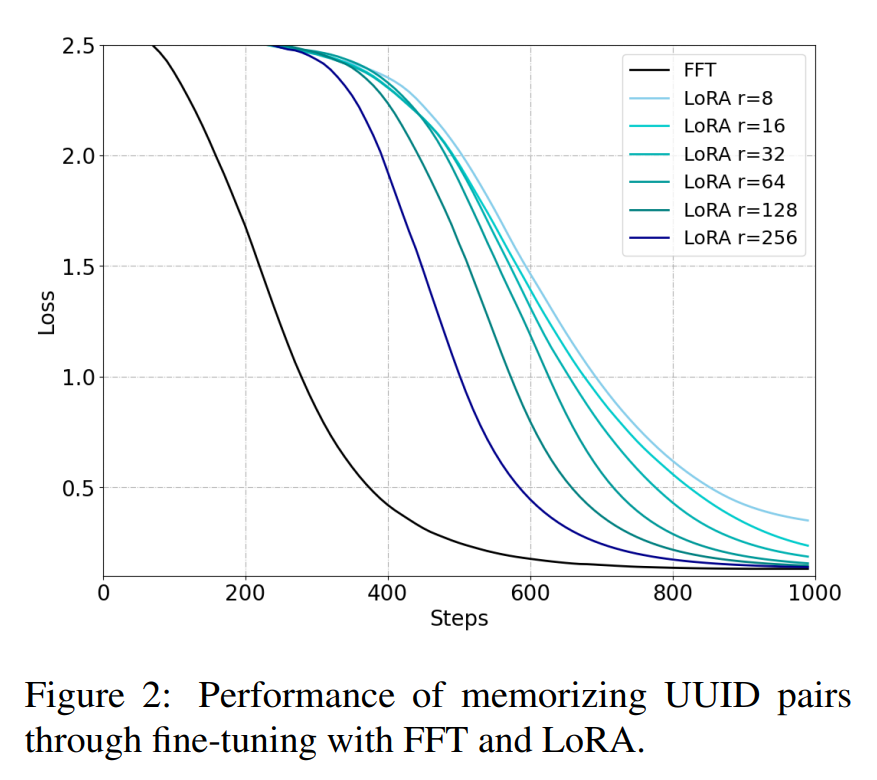
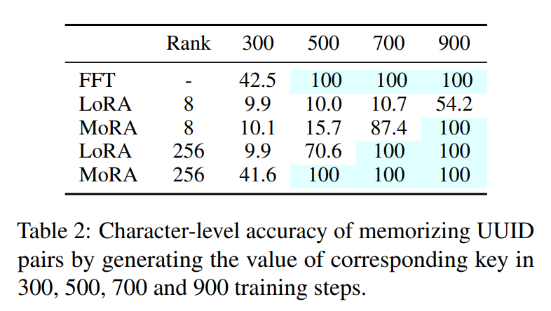
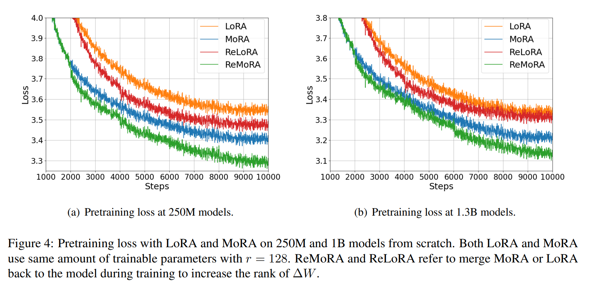

논문 및 이미지 출처 : <https://arxiv.org/pdf/2405.12130>

# Abstract

Low-rank adaptation (LoRA)는 large language models(LLMs)을 위한 인기 있는 parameter-efficient fine-tuning(PEFT) 방법이다. 

이 논문에서는 LoRA 에 구현된 low-rank updating 메커니즘이 LLM 의 new knowledge learning 및 memorize 능력을 제한할 수 있음을 시사하는 결과를 제시한다.

이러한 관찰에 영감을 받아, 저자는 MoRA 라는 새로운 방법을 제안한다. 

- MoRA 는 동일한 수의 trainable parameters 를 유지하면서 high-rank updating 를 달성하기 위해 square matrix 를 사용한다. 
- 이를 위해, input dimension 을 줄이고 output dimension 을 증가시키는 non-parameter operators 를 도입한다. 
- 또한, 이러한 operators 는 weight 를 LLMs 에 다시 병합할 수 있도록 하여, MoRA 가 LoRA 와 유사하게 배포될 수 있게 한다. 
- MoRA 는 instruction tuning, mathematical reasoning, continual pretraining, memory, 그리고 pretraining 이란 5 tasks 에 대해 종합적으로 평가. 
- MoRA 는 memory-intensive tasks 에서 LoRA 를 능가하며, other tasks 에서도 유사한 성능을 보인다.

# 1 Introduction

language model 의 크기가 증가함에 따라 parameter-efficient fine-tuning(PEFT) 이 이러한 model 을 특정 downstream task 에 맞추는 데 인기 있는 기술로 부상했다. 

full fine-tuning(FFT)과 비교했을 때, PEFT 는 model parameters 의 일부분만 수정한다. 

- 예로, 일부 연구에서 parameters 의 1% 미만을 수정하여 FFT 와 유사한 성능을 달성할 수 있으며, 이는 optimizer 의 memory requirements 를 크게 줄이고 fine-tuned model 의 storage 및 deployment 를 용이하게 한다. 
- 기존의 PEFT 방법 중에서 Low-Rank Adaptation (LoRA) 는 LLMs 에서 특히 널리 사용된다. 
- LoRA 는 low-rank matrix 를 통해 parameters 를 업데이트함으로써, prompt tuning 이나 adapter 같은 다른 PEFT 방법보다 성능을 향상시킨다.
- 이러한 matrix 는 original model parameters 에 병합될 수 있어 inference 시 additional computationalal costs 를 피할 수 있다. 
- LLMs 에 대해 LoRA 를 개선하려는 다양한 방법이 존재한다. 그러나 대부분의 방법은 GLUE 를 기준으로 효율성을 검증하며, 더 나은 성능을 달성하거나 fewer trainable parameters 를 요구하는지에 중점을 둔다. 
- 최근 방법들은 Alpaca 같은 instruction tuning task 나 GSM8K 같은 reasoning task 를 활용하여 LLMs 에 대한 성능을 더 잘 평가하려 한다. 
- 그러나 평가에 사용된 다양한 setting 과 dataset 은 이들의 발전을 이해하는 데 복잡성을 더한다.

이 논문에서는 same settings 하에서 instruction tuning, mathematical reasoning, continual pretraining 을 포함한 다양한 task 에서 LoRA 를 종합적으로 평가한다. 

- 저자는 LoRA 유사한 방법들이 이러한 task 전반에서 유사한 성능을 보이며, instruction tuning 에서는 FFT 와 비교할 때 비슷한 성능을 보이지만 mathematical reasoning 과 continual pretraining 에서는 성능이 떨어진다는 것을 발견했다. 
- 이 중 instruction tuning 은 형식과의 상호작용에 중점을 두며, knowledge 와 capacilities 는 거의 전적으로 pretraining 중에 학습된다. 
- 저자는 LoRA 가 instruction tuning 에서 response formats 를 따르기 쉽게 적응하지만, fine-tuning 을 통해 knowledge 와 capacilities 을 향상시키는 other tasks 에서는 어려움을 겪는 것을 관찰했다.

LoRA 에서 관찰된 이러한 제한의 한 가지 가능한 설명은 low-rank updating 에 의존하기 때문일 수 있다. 

- low-rank updating rank $\Delta W$ 는 특히 domain-specific knowledge 를 기억해야 하는 continual pretraining 과 같은 memory-intensive tasks 에서 FFT 의 full-rank updating 를 추정하는 데 어려움을 겪는다. 
- $\Delta W$ 의 rank 는 full-rank 보다 훨씬 작기 때문에, 이 제한은 fine-tuning 을 통해 new information 을 저장하는 능력을 제한한다. 
- 게다가, 현재의 LoRA variants 는 low-rank updating 의 본질적인 특성을 변경할 수 없다. 
- 이를 검증하기 위해, 저자는 new knowledge 를 기억하는 LoRA 의 성능을 평가하기 위해 pseudo-data 를 사용한 memorization task 를 수행했다. 
- 그 결과, LoRA 는 256 같은 large rank 에서도 FFT 보다 성능이 훨씬 떨어지는 것으로 나타났다.

이러한 관찰에 근거하여, 저자는 MoRA 라는 방법을 제안한다. 

- 이 방법은 low-rank matrix 대신 square matrix 를 사용하여 동일한 수의 trainable parameters 를 유지하면서 $\Delta W$ 의 rank 를 maximizing 한다. 
  - 예로, hidden size 가 4096 인 경우, LoRA 는 $A \in \mathbb{R}^{4096 \times 8}$ 과 $B \in \mathbb{R}^{8 \times 4096}$ 이라는 two low-rank matrix 을 사용하여 $rank(\Delta W) \leq 8$ 을 가지게 한다. 
- 동일한 parameters 수 하에서, MoRA 는 $M \in \mathbb{R}^{256 \times 256}$ 이라는 square matrix 를 사용하여 $rank(\Delta W) \leq 256$ 을 가지게 한다. 이는 Fig. 1 에 나타나 있다. 
- 특히, MoRA 는 large rank 를 가진 LoRA 보다 더 큰 용량을 보여준다. 
- $M$ 의 input dimension 을 줄이고 output dimension 을 증가시키기 위해, 저자는 대응하는 non-parameter operators 를 개발하였다. 
- 또한, 이러한 operators 와 $M$ 은 $\Delta W$ 로 대체될 수 있어 MoRA 이 LoRA 처럼 LLMs 에 병합될 수 있음을 보장한다.

저자의 기여는 다음과 같다:

1. 저자는 trainable parameters 수를 유지하면서 LoRA 에서 low-rank matrix 대신 square matrix 를 사용하여 high-rank updating 를 달성하는 새로운 방법인 MoRA 를 소개한다.
2. 저자는 square matrix 의 input dimension 을 줄이고 output dimension 을 증가시키기 위해 MoRA 의 4 types non-parameter operators 를 논의하며, 이들 operators 는 weight 가 LLMs 에 병합될 수 있음을 보장한다.
3. 저자는 MoRA 를 memory, instruction tuning, mathematical reasoning, continual pretraining, pretraining 이란 5 tasks 에 대해 평가하였다. MoRA 는 memory-intensive tasks 에서 LoRA 보다 우수한 성능을 보였으며, other tasks 에서도 유사한 성능을 달성하여 high-rank updating 의 효과를 입증하였다.

# 2 Related Work

## 2.1 LoRA

LoRA 는 다른 방법들과 비교해 넓은 적용 가능성과 강력한 성능 덕분에 LLM 의 fine-tuning 을 위한 가장 인기 있는 PEFT 방법 중 하나다. 

- LoRA 는 FFT 에서 업데이트된 weight $\Delta W$ 를 근사하기 위해 two low-rank matrix 을 사용하여 이를 decomposing 한다. 
  - 이러한 two matrices 의 rank 를 조정함으로써 LoRA 는 trainable parameters 를 수정할 수 있다. 
  - 이를 통해 LoRA 는 fine-tuning 후에도 FFT 에 비해 inference latency 없이 이 matrices 를 병합할 수 있다. 

LoRA 를 더욱 개선하기 위한 다양한 방법들이 존재하며, 특히 LLMs 에 적용되기 위해 고안되었다. 

- 예로, DoRA 는 original weight 를 magnitude 및 direction components 로 분해하고, LoRA 를 사용해 direction component 를 업데이트한다.
- LoRA+ 는 two low-rank matrices 에 대해 다른 learning rate 를 적용하여 e learning efficiency 을 향상시킨다. 
- ReLoRA 는 LoRA 를 LLM training 중에 통합하여 final $\Delta W$ 의 rank 를 증가시킨다.

## 2.2 Fine-Tuning with LLMs

LLMs 가 in-context learning 에서 인상적인 성능을 보임에도 불구하고, 특정 시나리오에서는 여전히 fine-tuning 이 필요하다. 

이러한 fine-tuning 은 크게 세 가지 유형으로 나눌 수 있다. 

1. instruction tuning 은 LLMs 를 final task 와 user preferences 에 더 잘 맞추는 것을 목표로 하며, LLMs 의 knowledge 와 capacilities 을 크게 향상시키지는 않는다.
   - 이 접근법은 다양한 tasks 를 처리하고 complex instructions 를 이해하는 과정을 단순화한다. 
2. mathematical problem solving 같은 complex reasoning tasks 를 포함하며, general instruction tuning 은 복잡하고 상징적이며 multi-step  reasoning tasks 를 처리하는 데 부족한 경우가 많다. 
   - LLMs 의 추론 능력을 향상시키기 위해, 대다수 연구는 GPT-4 같은 larger teacher models 를 활용하거나, 문제를 reasoning path 에 따라 재구성하는 등의 방법으로 이에 상응하는 training dataset 을 만드는 데 중점을 둔다. 
3. continual pretraining 은 LLMs 의 domain-specific capabilities 를 향상시키는 것을 목표로 한다. 
   - instruction tuning 과 달리, domain-specific knowledge 와 capacilities 을 증강하기 위해 fine-tuning 이 필요하다.

그러나 대부분의 LoRA variants 는 LLMs 에 대한 효율성을 검증하기 위해 주로 instruction tuning 또는 GLUE 의 text classification task 를 사용한다. 

instruction tuning 이 다른 유형의 fine-tuning 에 비해 요구하는 용량이 가장 적다는 점을 감안할 때, 이는 LoRA variants 의 효과를 정확하게 반영하지 못할 수 있다. 

이러한 방법들을 더 잘 평가하기 위해, 최근 연구들은 reasoning tasks 을 사용하여 그들의 방법을 테스트했다. 

그러나 LLMs 가 효과적으로 reasoning 을 학습하기에는 training set 이 너무 작은 경우가 많다. 

- 예로, 일부 방법은 7.5K training samples 만을 가진 GSM8K 를 사용한다. 
- 395K 의 training samples 을 가진 SOTA 방법과 비교할 때, 이 small training set 은 reasoning 에서 더 나쁜 성능을 달성하며 이러한 방법들의 효과를 평가하기 어렵게 만든다.

# 3 Analysis the Influence of Low-rank Updating

LoRA 의 핵심 아이디어는 FFT 에서의 full-rank updating 를 추정하기 위해 low-rank updating 를 사용하는 것이다. 

형식적으로, 주어진 pre-trained parameter matrix $W_0 \in \mathbb{R}^{d \times k}$ 에 대해, LoRA 는 two low-rank matrices 를 사용하여 weight update $\Delta W$ 를 계산한다:

$$
\begin{equation}
    h = W_0 x + \Delta W x = W_0 x + BAx
\end{equation}
$$

- $A \in \mathbb{R}^{r \times k}$ 및 $B \in \mathbb{R}^{d \times r}$ 는 LoRA 에서의 low-rank matrix 을 나타낸다. 
- training 시작 시 $\Delta W = 0$ 이 되도록 하기 위해, LoRA 는 A 를 Gaussian distribution 으로 초기화하고 B 는 0 으로 초기화한다. 
- $\Delta W$ 의 low-rank decomposition 으로 인해 $rank(\Delta W) \leq r$ 이다. 
- LoRA 에서의 weight update 는 FFT 의 full-rank updating 와 비교하여 상당히 low rank $r \ll \min(d,k)$ 를 가진다. 
- LoRA 는 text classification 나 instruction tuning 같은 일부 task 에서 full-rank updating 와 유사한 성능을 보인다. 
- 그러나 complex reasoning 이나 continual pretraining 같은 task 에서는 LoRA 가 성능이 떨어지는 경향이 있다.

이러한 관찰을 바탕으로, 저자는 low-rank updating 가 LLM 의 original knowledge 와 capacilities 을 활용하여 task 를 해결하기에는 용이하지만, LLM 의 knowledge 와 capacilities 을 향상시켜야 하는 task 를 처리하는 데 어려움을 겪는다는 가설을 제안한다.

이 가설을 입증하기 위해, 저자는 fine-tuning 을 통해 new knowledge 를 기억하는 데 있어 LoRA 와 FFT 의 차이를 분석한다. 

LLM 의 original knowledge 를 활용하는 것을 피하기 위해, 저자는 32 hexadecimal values 를 가진 two UUIDs 로 구성된 10K pairs 의 Universally Unique Identifiers (UUIDs)를 무작위로 생성한다. 

- 이 task 는 LLM 이 입력된 UUID 에 기반하여 대응되는 UUID 를 생성해야 한다. 
- 예로, "205f3777-52b6-4270-9f67-c5125867d358" 같은 UUID 가 주어지면, model 은 10K training pairs 를 기반으로 해당되는 UUID 를 생성해야 한다.
- 이 task 은 question-answering task 로도 볼 수 있으며, 이를 수행하기 위해 필요한 knowledge 는 전적으로 training dataset 에서 나온 것이다.

---

- training settings 에선 LLaMA-2 7B 를 base model 로 사용하며, per batch 에 1,000 pairs 를 사용하고 100 epochs 동안 training 을 진행한다. 
- LoRA 의 경우, all linear layers 에 low-rank matrix 을 적용하고 성능을 향상시키기 위해 $\{1e-4, 2e-4, 3e-4\}$ 의 learning rate 를 search 한다.
- 저자는 rank $r \in \{8, 16, 32, 64, 128, 256\}$ 에서 다양한 LoRA 실험을 수행한다. 
- FFT 의 경우, learning rate $3e-5$ 를 직접 사용한다. 
- Fig. 2 를 기반으로, 저자는 low-rank updating 가 FFT 에 비해 new knowledge 를 기억하는 데 어려움을 겪는다는 것을 관찰한다.
- LoRA 의 rank 를 지속적으로 증가시키는 것이 이 문제를 완화할 수 있지만, 그 gap 은 여전히 존재한다.

memory task 와는 대조적으로, 저자는 new knowledge 를 도입하지 않는 instruction tuning 에서 LoRA 와 FFT 간의 성능 격차도 평가한다. 

이전 결과들과 유사하게, 저자는 LoRA 가 small rank $r = 8$ 에서도 FFT 와 성능이 일치한다는 것을 Tab. 1 에서 발견한다. 

이는 LoRA 가 FFT 처럼 fine-tuning 을 통해 LLMs 의 original knowledge 를 쉽게 활용할 수 있음을 나타낸다.

# 4 Method

앞서 분석을 바탕으로, 저자는 low-rank updating 의 negative effects 를 완화하기 위한 새로운 방법을 제안한다. 

- 이 방법의 주요 아이디어는 가능한 한 많은 trainable parameters 를 활용하여 $\Delta W$ 에서 higher rank 를 달성하는 것이다. 
- pre-trained weight $W_0 \in \mathbb{R}^{d \times k}$ 를 고려할 때, LoRA 는 rank $r$ 에 대해 $(d + k)r$ 의 total trainable parameters 를 가진 two low-rank matrics $A$ 와 $B$ 를 사용한다. 
- 동일한 trainable parameters 하에서, square matrix $M \in \mathbb{R}^{\hat{r} \times \hat{r}}$ 
  - $\hat{r} = \lfloor \sqrt{(d + k)r} \rfloor$ 는 $r \ll \min(d, k)$ 이므로 highest rank 를 달성할 수 있다.

이를 실현하기 위해서는 $M$ 에 대해 input dimension 을 줄이고 output dimension 을 증가시켜야 한다. 공식적으로는,

$$
\begin{equation}
    h = W_0x + f_{decomp}(M f_{comp}(x))
\end{equation}
$$

- $f_{comp}: \mathbb{R}^k \rightarrow \mathbb{R}^{\hat{r}}$ 는 input dimension $x$ 를 $k$ 에서 $\hat{r}$ 로 줄이는 함수
- $f_{decomp}: \mathbb{R}^{\hat{r}} \rightarrow \mathbb{R}^d$ 는 output dimension 을 $\hat{r}$ 에서 $d$ 로 확장하는 함수
- 또한, 이 두 함수는 non-parameterized operators 여야 하며 dimension 에 따라 linear time 내에 실행될 것으로 예상된다. 
- 이 함수들은 또한 $M$ 을 $\Delta W$ 로 변환하기 위해 $f_{\overline{comp}}: \mathbb{R}^{\hat{r} \times \hat{r}} \rightarrow \mathbb{R}^{\hat{r} \times k}$ 와 $f_{\overline{decomp}}: \mathbb{R}^{\hat{r} \times k} \rightarrow \mathbb{R}^{d \times k}$ 에 해당하는 함수가 있어야 한다. 

어떤 $x$ 에 대해 다음을 만족해야 한다:

$$
\begin{equation}
    f_{decomp}(M f_{comp}(x)) = \Delta W x, \quad \forall x \in \mathbb{R}^k
\end{equation}
$$

- $\Delta W = f_{\overline{decomp}}(f_{\overline{comp}}(M))$
- 만약 Eq. (3)이 성립한다면, $M$ 은 $f_{comp}$ 와 $f_{decomp}$ 를 기반으로 $\Delta W$ 로 무손실 확장이 가능하다. 
- 이는 MoRA 이 LoRA 처럼 LLM 으로 다시 병합될 수 있음을 의미한다.

$ f_{comp}$ 와 $f_{decomp}$ 의 설계에서는, 저자는 이러한 함수들을 구현하기 위한 여러 방법을 탐구한다.

가장 간단한 방법 중 하나는 dimension 을 잘라내고, 그 다음에 해당 dimension 을 추가하는 것이다. 공식적으로는 다음과 같이 표현할 수 있다:

$$
\begin{equation}
    \begin{aligned}
        f_{comp}(x) &= x_{1:\hat{r}} \\
        f_{decomp}(x) &= \begin{pmatrix} x \\ 0 \end{pmatrix}
    \end{aligned}
\end{equation}
$$

그리고 이에 대응하는 $\Delta W$ 는 다음과 같다:

$$
\begin{equation}
    \Delta W = \begin{pmatrix} M & 0 \\ 0 & 0 \end{pmatrix}
\end{equation}
$$

그러나 이 방법은 compression 과정에서 상당한 information loss 를 초래하며, decompress 과정에서 0 vector 를 추가함으로써 output 의 일부만 수정하게 된다. 

이를 개선하기 위해, $M$ 의 rows 및 columns 를 공유하여 더 효율적인 compression 및 decompression 이 가능하도록 할 수 있다. 

공식적으로는 다음과 같이 표현할 수 있다:

$$
\begin{equation}
    \begin{aligned}
        f_{comp}(x) &= \begin{bmatrix}
            \sum_{j \in g_i} x_j
        \end{bmatrix}^r_{i=1} \\ 
        f_{decomp}(x) &= \begin{bmatrix}
            x_{\tilde{g'}_i}
        \end{bmatrix}^d_{i=1}
    \end{aligned}
\end{equation}
$$

- $g$ 와 $g'$ 는 각각 $M$ 에서 동일한 rows 및 columns 를 공유하는 predefined groups 를 나타낸다. 
- $j \in g_i$ 는 $j$-th dimension 이 $g$ 의 $i$-th group 에 속함을 나타낸다. 
- $\tilde{g'}$ 는 $g'_i$ 의 reverse 를 나타낸다
- $g'_i$-th group 과 연관된 $i$-th dimension 을 나타낸다.

이에 대응하는 $\Delta W$ 는 다음과 같다:

$$
\begin{equation}
    \Delta W_{i,j} = M_{\tilde{g'}_i, \tilde{g}_j}
\end{equation}
$$

- rows 및 columns 를 공유하는 것은 $r = 128$ 또는 $r = 256$ 과 같은 large rank 에 대해 효율적일 수 있다. 
- 이 경우, $\Delta W \in \mathbb{R}^{4096 \times 4096}$ 에서 $r = 128$ 일 때, $\hat{r} = 1024$ 이며 $M \in \mathbb{R}^{1024 \times 1024}$ 이므로, 오직 4 rows 또는 columns 만이 동일한 rows 또는 columns 를 공유한다. 
- 반대로, $r = 8$ 과 같이 small rank 의 경우 $\hat{r} = 256$ 이며, 이 상황에서는 average 16 rows 또는 columns 가 group 에서 동일한 row 또는 column 을 공유해야 하므로, Eq. (6) 의 compression 과정에서 상당한 information loss 가 발생해 비효율적일 수 있다.

small rank 의 성능을 향상시키기 위해, input information 를 보존하기 위해 $x$ 를 직접 compression 하는 대신 이를 reshape 한다. 

- 이 문맥에서 $f_{comp}(x) : \mathbb{R}^k \rightarrow \mathbb{R}^{n \times \hat{r}}$ 그리고 $f_{decomp}: \mathbb{R}^{n \times \hat{r}} \rightarrow \mathbb{R}^d$ 로 정의된다. 
- 이에 대응하는 $f_{comp}$, $f_{decomp}$ 및 $\Delta W$ 는 다음과 같다:

$$
\begin{equation}
    \begin{aligned}
        f_{comp}(x) &= \begin{bmatrix}
            x_{1:\hat{r}} & x_{\hat{r}:2\hat{r}} & \cdots & x_{(n-1)\hat{r}:n\hat{r}}
        \end{bmatrix} \\
        f_{decomp}(x) &= \text{concat}(x) \\
        \Delta W &=
        \begin{bmatrix}
        M & 0 & \cdots & 0 \\
        0 & M & \cdots & 0 \\
        \vdots & \vdots & \ddots & \vdots \\
        0 & 0 & \cdots & M
        \end{bmatrix}
    \end{aligned}
\end{equation}
$$

- $\text{concat}(x)$ 는 $x$ 의 rows 를 vector 로 concatenate 하는 것을 의미한다. 
- 간단히 하기 위해 위 함수들에서 padding 및 truncation operators 는 생략하였으며, $d = k$ 인 경우를 집중적으로 다룬다. 
- rows 및 columns 를 공유하는 방법과 비교했을 때, 이 방법은 $x$ 를 $\mathbb{R}^{\hat{r}}$ 대신 $\mathbb{R}^{n \times \hat{r}}$ 로 reshape 하여 additional computational overhead 가 발생한다. 
- 하지만 $M$ 의 size 가 $W_0$ 보다 훨씬 작기 때문에, 이러한 additional computation 은 rank 가 8 과 같은 경우 매우 작다. 
- 예로, rank 8 ($\hat{r} = 256$) 에서 7B model 을 fine-tuning 할 때, 이 방법은 이전 방법들보다 1.03 배 느리다.

---

RoPE 에서 영감을 받아, $f_{comp}$ 에 rotation operators 를 도입하여 이 방법을 더 개선하고 $M$ 의 표현력을 강화할 수 있다. 

rotation operators 는 다양한 $x_{i\hat{r}:(i+1)\hat{r}}$ 를 구분하도록 $M$ 을 보강한다. 

Eq.(8) 을 다음과 같이 수정할 수 있다:

$$
\begin{equation}
    \begin{aligned}
        f_{comp}(x) &=
        \begin{bmatrix}
        a_1 & a_2 & \cdots & a_{n-1}
        \end{bmatrix} \\
        \Delta W &=
        \begin{bmatrix}
        P_1 & 0 & \cdots & 0 \\
        0 & P_2 & \cdots & 0 \\
        \vdots & \vdots & \ddots & \vdots \\
        0 & 0 & \cdots & P_{n-1}
        \end{bmatrix}
    \end{aligned}
\end{equation}
$$

- $a^i$ 와 $P^i$ 는 각각 $x_{i\hat{r}:(i+1)\hat{r}}$ 와 $M$ post-rotation 에 대응되는 값을 나타낸다. 
- RoPE 에 따라, rotation 달성을 위해 $\hat{r} \times \hat{r}$ block diagonal matrix 를 사용한다. 
- 하지만, RoPE 와는 달리, 이 방법은 token position 을 구분하는 대신 $M$ 이 $x_{i\hat{r}:(i+1)\hat{r}}$ 를 구별하도록 rotation information 을 사용한다. 

$a^i$ 와 $P^i$ 는 다음과 같이 정의할 수 있다:

$$
\begin{equation}
    \begin{aligned}
        a_i &=
        \begin{bmatrix}
        R_{\theta_{1},i} & 0 & \cdots & 0 \\
        0 & R_{\theta_{2},i} & \cdots & 0 \\
        \vdots & \vdots & \ddots & \vdots \\
        0 & 0 & \cdots & R_{\theta_{\frac{\hat{r}}{2}},i}
        \end{bmatrix}
        x_{i\hat{r}:(i+1)\hat{r}} \\
        P_i &= M
        \begin{bmatrix}
        R_{\theta_{1},i} & 0 & \cdots & 0 \\
        0 & R_{\theta_{2},i} & \cdots & 0 \\
        \vdots & \vdots & \ddots & \vdots \\
        0 & 0 & \cdots & R_{\theta_{\frac{\hat{r}}{2}},i}
        \end{bmatrix}
    \end{aligned}
\end{equation}
$$

- $\theta_j = 10000^{-2(j-1)/\hat{r}}$
- $R_{\theta_j,i} \in \mathbb{R}^{2 \times 2}$ : rotation matrix:

$$
\begin{equation}
    R_{\theta_j,i} =
    \begin{bmatrix}
    \cos i\theta_j & -\sin i\theta_j \\
    \sin i\theta_j & \cos i\theta_j
    \end{bmatrix}
\end{equation}
$$

# 5 Experiments

저자는 다양한 task 에서 high-rank updating 의 영향을 이해하기 위해 MoRA 를 평가한다. 

## 5.1 Memorizing UUID Pairs

먼저, memorizing UUID pairs 에서 LoRA 와 FFT 와 MoRA 를 비교하여 high-rank updating 를 통한 개선점을 보여준다. 

Sec. 3 의 training settings 를 따르며, learning rate 은 $\{5 \times 10^{-5}, 1 \times 10^{-4}, 2 \times 10^{-4}\}$ 에서 searching 하고, Eq. 8 의 decompress 와 compress function, $M$ 의 rows 및 columns 를 공유하는 방법을 사용한다. 

two matrices $A$ 와 $B$ 대신 one matrix $M$ 을 사용하기 때문에 $M$ 을 zero 로 직접 초기화할 수 있다. 

predefined groups $g$ 와 $g'$ 에 따라, 저자는 adjacent $\hat{r}$ rows 또는 columns 를 함께 그룹화한다. 

training loss 는 Fig. 3 에 나타나 있다. 

- MoRA 는 같은 수의 trainable parameters 를 가진 LoRA 보다 상당한 개선을 보이며, high-rank updating 의 이점을 보여준다. 

다양한 training steps 에서 character-level accuracy 를 Tab. 2 에 보고한다. 

- MoRA 는 UUID pairs 을 기억하는 데 있어 LoRA 보다 fewer training steps 를 필요로 한다.
- FFT 와 비교했을 때, MoRA 는 256 rank 로 비슷한 성능을 달성할 수 있으며, 두 방법 모두 500 steps 안에 all UUID pairs 을 기억할 수 있다.

## 5.2 Fine-tuning Tasks

### 5.2.1 Setup

저자는 large language models(LLM)에서 3 fine-tuning tasks (instruction tuning, mathematical reasoning, continual pretraining)에서 MoRA 를 평가한다. 

이러한 task 에 대해, 저자는 LoRA 와 MoRA 를 테스트할 high-quality datasets 을 선택한다. 

- instruction tuning 에서는 Tülu v2 를 사용하며, 이는 여러 high-quality instruction datasets 의 혼합으로 326k filtered samples 를 포함한다. 
  - instruction 성능은 MMLU 를 사용하여 zero-shot 및 5-shots 설정에서 평가한다. 
- mathematical reasoning 에서는 MetaMath 와 395k samples 를 사용하여 mathematical reasoning 능력을 향상시키며, 추가 평가를 위해 GSM8K 및 MATH 도 사용한다.
- continual pretraining 에서는 LLM 을 biomedicine 및 finance 분야에 적응시키며, PubMed abstracts 와 finicial news 에서 데이터를 수집하고 AdaptLLM 의 data preprocessing 을 활용하여 성능을 향상시킨다. 
- continual pretraining 의 평균 성능을 보고한다.

### 5.2.2 Baselines and Implements

LoRA 와 유사한 방법 및 MoRA 의 경우, $r = 8$ 및 $r = 256$ 에서 실험을 진행하였으며, 다음 방법들을 3 tasks 에서 재현하였다: FFT, LoRA, LoRA+, AsyLoRA, ReLoRA 및 DoRA. 

- LoRA+ 는 LoRA 의 matrix $B$ learning rate 를 향상시켜 이론적 분석에 기반한 효율적인 특징 학습을 지원한다. 
  - 이에 따라 hyper-parameters $\lambda$ 를 $\{2,4\}$ 에서 searching 한다. 
- AsyLoRA 는 $A$ 와 $B$ matrices asymmetry 을 분석하며, 저자는 이들의 초기화 전략을 채택했다. 
- ReLoRA 는 training 중에 low-rank matrix 를 model 에 통합하여 $\Delta W$ 의 rank 를 증가시키는 방법을 제안한다. 
  - 저자는 merge steps ($1k, 2k$) 를 검색하고, 50 steps restarts warmup 을 사용한다. 
- DoRA 는 weight decomposition 을 활용하여 성능을 향상시킨다. 
- FFT 의 경우, 해당 dataset 에서 제안한 설정을 따른다. 
- MoRA 의 경우, Eq. 9 에 명시된 rotation operators 를 사용하여 $r = 8$ 의 compression 및 decompression 을 구현하고, $r = 256$ 의 경우 Eq. 6 에서 지정된 대로 rows 및 columns 를 공유하고 adjacent $\hat{r}$ rows 또는 columns 를 그룹화한다. 

### 5.2.3 Results and Analysis

fine-tuning 작업의 결과를 Tab. 1 에 제시한다. 

저자는 instruction tuning 의 MMLU zero-shot 및 5-shots 설정, mathematical reasoning 의 GSM8K 및 MATH, continual pretraining 의 biomedical and financial 분야 task 의 평균 성능을 보고한다. 

- MoRA 는 instruction tuning 과 mathematical reasoning 에서 LoRA 와 유사한 성능을 보인다. 
- new knowledge 를 기억하는 데 있어 high-rank updating 의 이점을 통해, MoRA 는 continual pretraining 에서 biomedical and financial 분야 모두에서 LoRA 를 능가한다. 
- LoRA variants 는 LoRA 와 비슷한 성능을 보여주며, AsyLoRA 는 instruction tuning 에서 최고의 성능을 달성하지만, mathematical reasoning 에서는 성능이 낮다.
- ReLoRA 의 경우, training 중 low-rank matrix 를 병합하는 것이 성능에 악영향을 미칠 수 있으며, 특히 256 과 같은 high-rank 에서 그렇다.
- 3 tasks 간의 차이를 고려할 때, 각 task 는 fine-tuning 능력에 대해 다른 요구를 보인다. 
- new knowledge 를 학습하지 않는 instruction tuning 의 경우, rank 8 로도 FFT 와 유사한 성능을 달성할 수 있다. 
  - mathematical reasoning 의 경우, rank 8 로는 FFT 성능을 맞추기 어렵다. 
  - 그러나 rank 를 8 에서 256 으로 증가시키면 성능 격차를 없앨 수 있다. 
- continual pretraining 의 경우, rank 256 의 LoRA 는 여전히 FFT 에 비해 낮은 성능을 보인다.

## 5.3 Pretraining

high-rank updating 의 영향을 이해하기 위해, 저자는 C4 dataset 에서 Transformer 를 scratch learning 한다. 

- model architecture 로는 LLaMA-based model 을 RMSNorm, SwiGLU 및 RoPE 와 함께 250M 및 1.3B 크기로 학습한다.
- hyper-parameters 로는 10k steps, batch size 1024, squence length 512 를 사용하며, Lialin et al.의 방법을 따르고, LoRA 와 MoRA 에 대해 $r = 128$ 의 rank 를 적용하고, LoRA-like layernorm 이나 embeddings unfreezed 를 적용하지 않은 모듈은 freezing 을 유지한다. 
- 저자는 MoRA 를 LoRA 및 ReLoRA 와 비교한다. 
  - high-rank 와 low-rank updating 의 차이를 보다 잘 보여주기 위해, ReLoRA 및 기타 방법들을 full-rank training warmup 없이 재현한다. 
- MoRA 의 경우, Eq. 6 에 명시된 대로 rows 및 columns 를 공유하여 compression 및 decompression 기능을 사용한다.
- 또한, ReLoRA 의 merge-and-reint 전략과 MoRA 를 결합하여 ReMoRA 를 정의하며, training 중에 $M$ 을 original parameters 로 병합하여 $\Delta W$ 의 rank 를 증가시킨다. 
  - 그러나 Eq. 6 에서 직접 $M$ 을 $g$ 와 $g'$ 와 병합하면 final $\Delta W$ 의 rank 는 동일한 확장 패턴으로 인해 변경되지 않는다. 
  - 이를 해결하기 위해, 병합 후 $g$ 와 $g'$ 를 변경하여 $\Delta W$ 의 rank 가 증가하도록 한다. 
- ReLoRA 와 ReMoRA 의 hyper-parameters 는 2k steps 마다 병합하고, 50 steps 동안 warmup 및 optimizer reseting 을 사용하며, jagged scheduler 를 적용한다.

pretraining loss 를 Fig. 4 에, C4 검증 dataset 에서의 대응하는 perplexity 를 Tab. 3 에 제시한다. 

- MoRA 는 동일한 trainable parameters 를 가진 LoRA 및 ReLoRA 보다 더 나은 성능을 보인다. 
- high-rank updating 의 이점을 통해 ReMoRA 는 MoRA 에 비해 ReLoRA 에서 더 많은 개선을 달성하며, 이는 ReMoRA 의 merge-and-reint 전략의 효과를 보여준다.

# 6 Analysis

## 6.1 High-rank Updating

high-rank updating 가 $\Delta W$ 의 rank 에 미치는 영향을 보여주기 위해, 저자는 250M model 에서 학습된 $\Delta W$ 의 singular spectrum 을 분석한다.

Fig. 5 에는 all layers 에서 $\Delta W_q$, $\Delta W_k$, $\Delta W_v$, $\Delta W_o$, $\Delta W_{up}$, $\Delta W_{down}$, 및 $\Delta W_{gate}$ 의 singular value 가 0.1 을 초과하는 평균 개수를 제시한다. 

- MoRA 와 ReMoRA 는 LoRA 와 ReLoRA 에 비해 유의미한 singular values 의 수가 훨씬 더 높으며, 이는 MoRA 이 $\Delta W$ 의 rank 를 증가시키는 데 효과적임을 강조한다. 
- Fig. 5 에서 나타난 singular values 의 수는 Tab. 3 에 나와 있는 perplexity 지표와 상관관계가 있음을 발견한다. 
- 또한, MoRA 는 ReLoRA 와 ReMoRA 의 merge-and-reint 전략이 없더라도 ReLoRA 보다 낮은 perplexity 를 달성하며 더 많은 유의미한 singular values 을 보인다.

## 6.2 Influence of Decompression and Compression

MoRA 에서 compression 및 decompression function 의 영향을 조사하기 위해, 저자는 다양한 방법(truncation, sharing, decoupling, rotation)을 사용하여 GSM8K 에서 성능을 보고한다.

- Tab. 4 에 따르면, truncation 는 compression 중 information loss 가 커서 가장 나쁜 성능을 보인다. 
- sharing 은 truncation 보다 더 나은 성능을 달성하지만, $r = 8$ 의 경우 많은 수의 sharing rows 또는 columns 로 인해 decoupling 및 rotation 보다 성능이 떨어진다. 
- rotation 은 decoupling 보다 더 효율적이며, rotation information 보다 square matrix 가 input information 을 구별하는 데 도움을 준다.

# 7 Conclusion

본 논문에서는 LoRA 를 통해 low-rank updating 의 영향을 분석하고, 이러한 updating 이 memory-intensive tasks 에서 어려움을 겪는다는 점을 관찰하였다. 

이는 현재 LoRA 변형의 한계로 작용한다. 이 제한을 극복하기 위해, 저자는 high-rank updating 를 위한 non-parameterized operators 를 활용하는 MoRA 방법을 제안한다. 

MoRA framework 내에서 저자는 compression 및 decompression function 의 다양한 구현 방법을 탐색하였다. 

성능 비교 결과, MoRA 는 instruction tuning 및 mathematical reasoning 에서 LoRA 와 유사한 성능을 보이며, continual pretraining 및 memory tasks 에서 우수한 성능을 보인다. 

또한, pre-training 실험을 통해 high-rank updating 의 효과를 입증하였고, ReLoRA 와 비교하여 더 나은 결과를 보여준다.