논문 및 이미지 출처 : <https://arxiv.org/pdf/2406.09044>

# Abstract

Large Language Models (LLMs)의 efficient fine-tuning 은 계산 및 메모리 비용을 줄이며 LLM 을 적응시키는 것을 목표로 한다. 

기존 LoRA 기반 접근법은 low-rank matrices 를 Gaussian distribution 과 zero values 로 초기화하고, original weight matrices 를 고정한다. 그러나 trainable model parameters 가 unguided subspace 에서 최적화될 경우, pretrained weight matrices 의 잘 학습된 subspace 와 간섭을 일으킬 수 있다. 

본 논문에서는 Minor singular component 기반 Low Rank Adaptation (MiLoRA) 를 제안한다. 이는 weight matrix 의 minor singular components 만 업데이트하고 principal singular components 는 고정하는 간단하면서도 효과적인 LLM fine-tuning 방법이다.  

관찰에 따르면 minor matrix 는 noisy 또는 long-tail information 과 관련되며, principal matrix 는 중요한 지식을 포함한다. 

- MiLoRA 는 low-rank matrices 를 principal matrix 와 직교하는 subspace 내에서 초기화하여 pretrained knowledge 를 잘 보존할 수 있도록 설계되었다. 
- fine-tuning 동안 MiLoRA 는 less-optimized subspace 를 최대한 활용하여 labeled dataset 을 학습한다. 
- commonsense reasoning, math reasoning, instruction following, visual instruction following benchmark 에서 MiLoRA 는 일관되게 우수한 성능을 보였으며, 기존 방법 대비 효율성을 유지했다.

# 1 Introduction  

LLMs 은 math reasoning 및 question answering 과 같은 다양한 작업에서 우수한 성능을 보여주었다. 이러한 모델들은 large web-scale data 에 대한 next token prediction task 로 pretrained 되고, 이후 instruction data 및 human preference data 를 활용하여 다양한 downstream tasks 에 적응된다.  

fully finetuning 은 LLM 의 잠재력을 최대한 발휘하기 위해 흔히 사용되지만, all model parameters 를 최적화하는 데는 상당한 계산 자원과 제약이 필요하다. 이는 LLM 을 다양한 시나리오에서 활용하는 데 장애가 된다.  

**Parameter-efficient finetuning (PEFT)** 은 pretrained model 을 fine-tuning 하는 데 필요한 계산 및 GPU 메모리 비용을 줄이는 것을 목표로 한다.

**Low-rank adaptation (LoRA)** 는 LLM fine-tuning 을 위한 가장 널리 사용되는 PEFT 방법 중 하나로, linear model weights 의 변화가 low-rank 구조를 따른다고 가정한다. selected weight matrix 에 대해 pretrained weights 를 고정하는 동안 two low-rank matrices 만 업데이트한다. inference 시, low-rank matrices 는 pretrained linear weights 에 병합되므로 추가적인 계산 또는 메모리 비용이 발생하지 않는다.  

최근 연구들은 LoRA 기반의 다양한 변형을 탐구했지만, 대부분의 기존 방법은 low-rank matrices 를 무작위로 초기화하고, trainable parameters 를 unguided subspace 에서 최적화한다. 이러한 전략은 중요한 pretrained features 를 덮어쓸 수 있으며, low-rank adaptation 의 성능을 저하시킬 수 있다.  

본 논문에서는 LLM fine-tuning 을 위한 Minor singular component 기반 Low Rank Adaptation (MiLoRA) 를 제안한다. MiLoRA 는 LoRA 와 유사한 프레임워크를 사용하지만, 초기화 방식이 다르다. 

구체적으로, weight matrix $W$ 는 singular value decomposition (SVD) 알고리즘을 통해 분해되며, singular value 의 크기에 따라 $W$ 를 principal matrix $W_p$ 와 minor matrix $W_m$ 으로 나눈다.

Principal matrix $W_p$ 는 large singular values 에 대응하며 pretrained knowledge 의 본질을 포착한다고 주장한다. 반면, minor matrix $W_m$ 은 small singular values 에 대응하며 noisy 또는 long-tail information 을 포함한다. 

기존 연구들에 따르면, principal low-rank approximation 은 full parameters 와 유사하거나 더 나은 성능을 달성할 수 있다.  

이러한 관찰을 바탕으로, MiLoRA 는 principal matrix $W_p$ 를 고정하고, fine-tuning 동안 minor singular components 만 적응시킨다. 

LoRA framework 에서 low-rank matrices $A$ 와 $B$ 는 minor matrix $W_m$ 으로 초기화된다. 이렇게 하면 trainable low-rank matrices 가 principal matrix 와 직교하는 subspace 에서 초기화되므로, MiLoRA 는 fine-tuning 작업에서 효과적으로 학습하면서도 pretrained knowledge 를 잘 보존하고 활용할 수 있다.  

기존 LoRA 는 pretrained model 의 역량을 유지하기 위해 $B$ 를 명시적으로 zero 로 초기화하지만, MiLoRA 는 pretrained weight matrix $W$ 가 frozen principal part $W_p$ 와 low-rank part $W_m = BA$ 으로 구성되므로 이러한 요구를 자연스럽게 충족한다.  

---
  
MiLoRA 는 commonsense reasoning, math reasoning, instruction following, visual instruction following 벤치마크에서 LoRA 대비 일관되게 더 나은 성능을 보였다. 예를 들어:  

- **Commonsense Reasoning**: LLaMA2-7B 와 LLaMA3-8B 에서 각각 +1.6 및 +1.1 향상.  
- **Math Reasoning**: LLaMA2-7B 에서 +2.0 향상.  
- **Instruction Following**: LLaMA2-7B 에서 +1.4 향상.  
- **Visual Instruction Following**: LLaVA1.5-7B 에서 +1.4 향상.  

MiLoRA 는 training 또는 inference efficiency 를 희생하지 않으면서 LoRA 대비 우수한 결과를 제공한다.

# 2. Preliminaries

## Singular Value Decomposition

주어진 matrix $W \in \mathbb{R}^{m \times n}$ 의 singular value decomposition (SVD) 는 $W = U \Sigma V^\top$ 로 나타낼 수 있다. 여기서:

- $U = [u_1, u_2, \cdots, u_m] \in \mathbb{R}^{m \times m}$ 은 left singular vector 로 구성된 matrix  
- $V = [v_1, v_2, \cdots, v_n] \in \mathbb{R}^{n \times n}$ 은 right singular vector 로 구성된 matrix  
- $\Sigma \in \mathbb{R}^{m \times n}$ 은 singular value 를 내림차순으로 포함하는 diagonal matrix

일반성을 잃지 않고, 표기를 단순화하기 위해 $m \leq n$ 로 가정한다. 

$W$ 의 SVD 는 다음과 같이 재구성할 수 있다:  

$$
\begin{equation}
    W = U \Sigma V^\top = \sum_{i=1}^m \sigma_i u_i v_i^\top,
\end{equation}
$$

여기서 $u_i$ 와 $v_i$ 는 각각 $U$ 와 $V$ 의 $i^{th}$ column  나타낸다.  

## Low-Rank Adaptation

Low-rank adaptation (LoRA) 방법은 linear weight $W \in \mathbb{R}^{m \times n}$ 의 updates 가 low-rank 형태를 따른다고 가정하며, two trainable low-rank matrices $A \in \mathbb{R}^{r \times n}$ 및 $B \in \mathbb{R}^{m \times r}$ 을 사용하여 변경 사항을 modeling 한다.

weight matrix 는 다음과 같이 분해된다:

$$
\begin{equation}
    W = W^{(0)} + \Delta W = W^{(0)} + \frac{\alpha}{r} B A,
\end{equation}
$$

여기서 $W^{(0)}$ 와 $\Delta W$ 는 각각 pretrained weight 와 weight change 를 나타낸다. 

$\alpha$ 와 $r$ 은 scaling factor 와 LoRA rank 를 나타내는 hyperparameter 이며, $r \ll \min(m, n)$ 이다. fine-tuning 동안, pretrained matrix $W^{(0)}$ 는 고정된다.  

이 접근법은 $A$ 와 $B$ matrices 가 low-rank 이므로 trainable parameters 의 수를 크게 줄인다. $B$ matrix 는 zero 로 초기화되고, $A$ matrix 는 평균이 0 인 Gaussian distribution 을 사용해 초기화된다.  

이 초기화 전략은 학습 초기에 $\Delta W = 0$ 을 보장한다. LoRA 방법은 Transformer 모델의 linear matrices 만 수정하며, low-rank matrices 는 pretrained linear matrix 에 병합되어 추론을 위해 업데이트되므로, full fine-tuning 에 비해 추가 계산 및 GPU 메모리가 요구되지 않는다. 그러나 vanilla LoRA 방법은 low-rank matrices $A$ 와 $B$ 가 무작위로 초기화되기 때문에 model parameter 를 업데이트할 optimal subspace 를 선택하지 못할 수 있다. 

이는 pretrained weight matrix 에 인코딩된 knowledge 를 손상시킬 가능성이 있다.

# 3. Methodology

제안하는 MiLoRA 는 간단하지만 효과적인 PEFT 접근법으로, weight matrices 의 minor singular components 를 선택하여 최적화한다. 

기존 연구에서는 weight matrices 의 minor singular components 가 noisy 하거나 long-tail information 을 포함하는 반면, principal singular components 는 다양한 작업에서 중요한 특징을 담당한다고 관찰했다.

MiLoRA 는 minor singular components 를 적응시켜 fine-tuning dataset 에서 효과적으로 학습하며, pretrained model 에 인코딩된 knowledge 를 유지한다.  

반면, vanilla LoRA 는 low-rank matrices 를 무작위로 초기화하므로 optimization subspace 를 제어하지 못한다. 

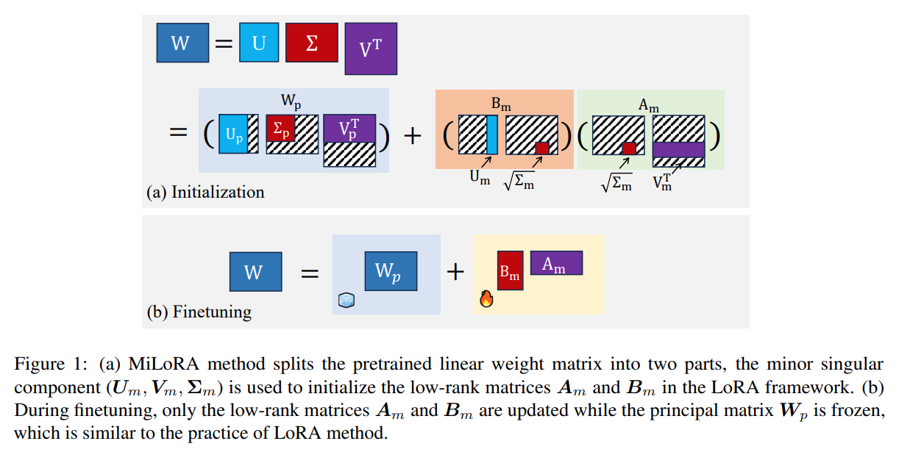

$m \leq n$ 으로 가정하면, MiLoRA 는 singular values 에 따라 각 linear weight matrix 를 two matrices 로 분할한다: principal matrix $W_p$ 와 minor matrix $W_m$ (Fig. 1 참조).

$$
\begin{equation}
    \begin{align*}
        W &= W_p + W_m \\
        &= \sum_{i=1}^{m-r} \sigma_i u_i v_i^\top + \sum_{i=m-r+1}^m \sigma_i u_i v_i^\top,
    \end{align*}
\end{equation}
$$

여기서 singular values 는 내림차순으로 정렬되어 있으며 ($\sigma_1 \geq \sigma_2 \geq \cdots \geq \sigma_m \geq 0$), $r$ 은 $W_m$ 에 포함된 minor singular values 의 수를 나타내는 hyperparameter 이다.  이 decomposition 은 matrix 형태로도 재구성할 수 있다.

$W$ 의 SVD 에서 $U$ matrix 는 $U = [U_p, U_m]$ 로 재구성되며, $U_p = [u_1, u_2, \cdots, u_{m-r}]$ 와 $U_m = [u_{m-r+1}, u_{m-r+2}, \cdots, u_m]$ 은 각각 principal 및 minor singular values 에 대응하는 왼쪽 singular vectors 이다. $V$ 와 $\Sigma$ matrices 도 유사하게 재구성될 수 있다. 

$W$ 의 SVD 는 다음과 같이 표현된다:

$$
\begin{equation}
    W = U \Sigma V^\top = U_p \Sigma_p V_p^\top + U_m \Sigma_m V_m^\top = W_p + W_m
\end{equation}
$$

fine-tuning 과정에서 pretrained weight matrix 를 전체 고정하는 대신, MiLoRA 는 principal singular components $W_p$ 를 고정하여 pretrained knowledge 를 보존한다. 

minor matrix $W_m$ 는 low-rank matrices $A_m$ 과 $B_m$ 을 초기화하는 데 사용된다 (Fig. 1 참조):

$$
\begin{equation}
    W_m = U_m \Sigma_m V_m^\top = (U_m \sqrt{\Sigma_m})(\sqrt{\Sigma_m} V_m^\top) = B_m A_m,
\end{equation}
$$

이 전략은 두 가지 이점을 제공한다:  

1. 모델이 minor singular vectors 가 span 하는 less-optimized subspace 에서 학습하도록 유도하므로, pretrained knowledge 가 포함된 principal singular components 와의 간섭을 줄인다.  
2. vanilla LoRA 와 달리, scaling factor $\alpha$ 와 initialization hyperparameters 를 조정할 필요가 없으며, rank $r$ 만 hyperparameter 로 사용한다.  

MiLoRA 는 $W_m$ 과 $W_p$ 사이의 orthogonality 에 엄격한 제약을 가하는 regularization loss 를 포함하지 않는다. 

실험 결과, 이 접근법은 fine-tuning dataset 에서 학습하면서도 pretrained knowledge 를 유지하는 데 효과적인 균형을 제공한다.  

# 4. Experiments

MiLoRA 를 다른 PEFT 방법들과 비교하기 위해, NLP 와 멀티모달 작업에서 18 dataset 을 대상으로 실험을 수행했다. 실험은 별도로 명시되지 않는 한 8 NVIDIA L40 GPUs 에서 수행되었다.  

- **LoRA**: LoRA 는 weight update $\Delta W$ 를 two trainable low-rank matrices $A$ 와 $B$ 로 재구성하며, pretrained weight $W$ 를 고정한다. $A$ 는 random Gaussian 으로, $B$ 는 zero 로 초기화되며, 초기 학습 시 $\Delta W = BA = 0$ 을 보장한다.
- **PiSSA**: PiSSA 는 LoRA 와 동일한 프레임워크를 공유하지만, pretrained weight $W$ 의 principal singular values 와 singular vectors 로 $A$ 와 $B$ 를 초기화하는 더 정교한 접근법을 사용한다. 이는 principal components 가 matrix 의 본질을 캡처하기 때문에 fully fine-tuning 을 더 잘 근사할 것으로 예상된다.  

## 4.1 Experiments on Large Language Model  

#### Models and Datasets  

MiLoRA 를 아래의 세 가지 LLM downstream 작업에서 평가 및 비교했다:  

1. **Commonsense Reasoning**: LLaMA2-7B 및 LLaMA3-7B 를 Commonsense170K dataset 으로 fine-tuning 하였다. BoolQ, PIQA, SIQA, HellaSwag, WinoGrande, ARC-e, ARC-c, OBQA 를 포함한 8개의 commonsense reasoning dataset 에서 평가를 수행했다. 작업은 multiple-choice 문제로 구성되며, validation set loss 를 기준으로 선택된 best checkpoint 의 accuracy(%) 를 보고했다.  

2. **Math Reasoning**: LLaMA2-7B 를 MetaMathQA dataset 으로 fine-tuning 하였다. GSM8K 및 MATH 의 test set 을 사용해 평가하였으며, ground truth 에 대한 exact match 비율을 보고했다.  

3. **Instruction Following**: Ultrafeedback data 를 사용해 LLaMA2-7B 를 fine-tuning 하였으며, Alpaca-Eval v1.0 으로 평가했다. text-davinci-003 과의 win-rate 을 GPT4-0613 을 annotator 로 사용하여 보고했다.  

#### Implementation Details  

모든 방법에 대해 hyperparameter 설정은 Hu et al. (2023) 에서 사용된 LLM-Adapters 설정을 따랐다.

특별한 조정 없이 rank 는 기본적으로 32 로 설정되었으며, math reasoning 에는 dataset size 를 고려하여 rank 를 64 로 설정했다.  

#### Results  

Tab. 1, Tab. 2, Tab. 3 에 commonsense reasoning, math reasoning, instruction following 작업에 대한 결과를 보고했다.  

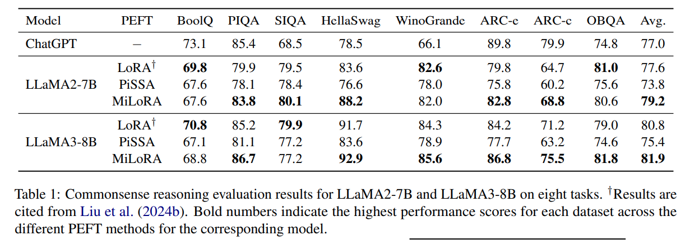

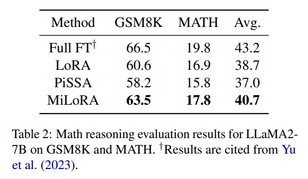

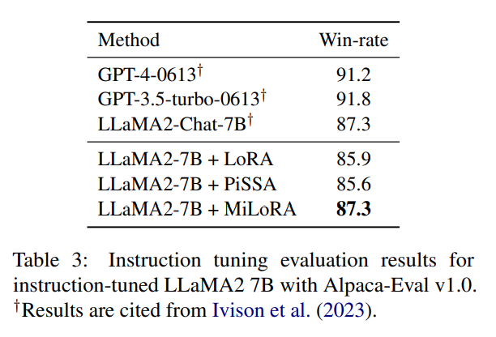

- **Commonsense Reasoning**: MiLoRA 는 LLaMA2-7B 에서 LoRA 와 PiSSA 를 각각 평균 1.6 및 5.4 점 초과했으며, LLaMA3-8B 에서는 각각 1.1 및 6.5 점 초과했다.
- **Math Reasoning**: MiLoRA 는 LoRA 와 PiSSA 대비 각각 2.0 및 3.7 점의 EM 점수를 초과했지만, fully fine-tuning 대비 평균 2.5 EM 점수 부족했다. 이는 PEFT 방법들이 fully fine-tuning 을 완전히 대체하지 못한다는 것을 시사한다.
- **Instruction Following**: MiLoRA 는 LoRA 와 PiSSA 대비 각각 1.4 및 2.7 점 높은 win-rate 을 기록하며 최상의 결과를 보였다.

## 4.2 Experiments on Vision-Language Model

#### Models and Datasets

MiLoRA 의 multi-modal fine-tuning 작업에서의 성능을 평가하기 위해 LLaVA1.5-7B 를 대상으로 실험을 수행했다. 

LLaVA1.5-7B 는 LLM, Vicuna-1.5-7B, 및 vision encoder, CLIP ViT-L/336px 으로 구성된다. 

multitask 설정에서 visual instruction tuning 작업을 수행했으며, VQA, OCR, region-level VQA, visual conversation, language conversation 데이터에서 훈련하였다. 

평가에는 VQA-v2, GQA, VizWiz, SQA, VQAT, POPE, MMBench 의 7개 multimodal benchmark 를 사용했다.  

#### Implementation Details

training data 및 prompt template 은 기존 연구에서 제공한 설정을 따랐다.

hyperparameter 설정은 공정한 비교를 위해 모든 PEFT 방법에 대해 동일한 LoRA 설정을 사용했다.  

#### Results

Tab. 4 에 실험 결과를 보고했다. 

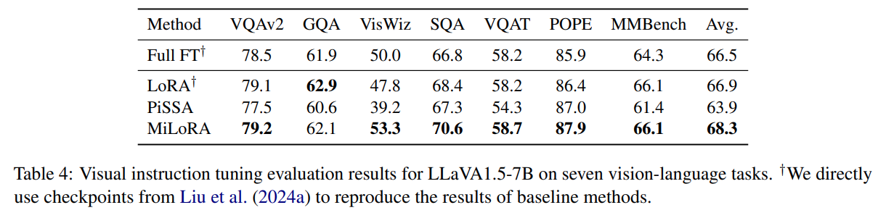

- MiLoRA 는 LoRA 와 PiSSA 대비 각각 평균 1.4 및 4.4 점 높은 accuracy 를 기록하며 최상의 결과를 보였다. 
- fully fine-tuning 이 LoRA 보다 덜 효과적임이 관찰되었다. 이로 인해 fully fine-tuning 을 근사하려는 PiSSA 와 같은 방법이 이점을 잃을 수 있다. 
- 반면, MiLoRA 는 pretrained knowledge 를 더 잘 보존하며 성능을 향상시켜 이러한 문제를 피할 수 있었다.  

# 5. Understanding MiLoRA  

본 섹션에서는 MiLoRA 를 더 깊이 이해하기 위해 추가 실험을 수행했다. 기본적으로 math reasoning 작업에서 fine-tuning 된 LLaMA2-7B 모델을 분석에 사용했다.  

## 5.1 Comparison with More PEFTs  

MiLoRA 의 효과를 추가적으로 검증하기 위해 rsLoRA, LoRA+, DoRA, AdaLoRA, LoRA-GA 와 같은 추가적인 PEFT baseline 들과 비교를 수행했다. 

Wang et al. (2024b) 에서 제안한 math 및 code 실험 설정을 따랐다. 구체적으로, LLaMA2-7B 를 MiLoRA 를 사용해 MetaMathQA 100K 및 CodeFeedback 100K dataset 에서 rank 8 로 1 epoch 동안 fine-tuning 했다. 

Tab. 5 에 결과를 보고했다.  

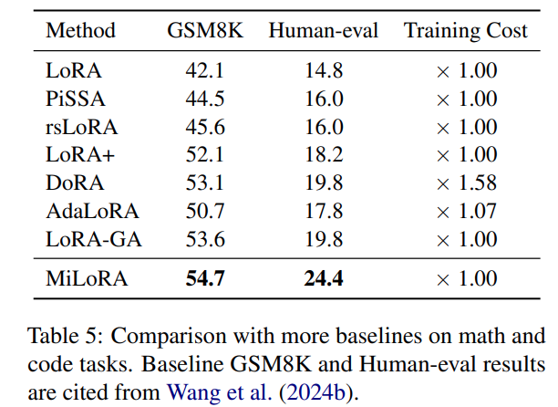

- 모든 방법의 training cost 는 math 작업에서 NVIDIA-L40 GPU 하나로 수행한 LoRA (3.58 시간) 를 기준으로 상대적으로 측정했다. 
- 결과적으로, MiLoRA 는 모든 baseline 을 일관되게 초과했으며, GSM8K 와 Human-eval 에서 각각 1.1 및 4.6 점의 성능 향상을 보였다. 
- MiLoRA 의 training efficiency 도 매우 높았다. SVD 분해 시간은 6분 미만으로 전체 training 시간에 비해 무시할 수준이었다. 따라서 MiLoRA 의 총 training 시간은 LoRA 와 일치하며, DoRA 와 AdaLoRA 는 추가적인 시간 overhead 가 요구된다.  

## 5.2 Is Minor Singular Component Adaptation Important?  

singular components size 가 fine-tuning 성능에 미치는 영향을 조사하기 위해 math reasoning 작업에서 LLaMA2-7B 모델을 사용해 실험을 수행했다. 구체적으로, MetaMathQA 395K dataset 에서 최대 sequence 길이를 512로 설정하고 1 epoch 동안 fine-tuning 을 수행했다. 

low-rank matrices $A$ 와 $B$ 를 principal, minor, 및 randomly sampled singular components 로 초기화하고 평가 결과를 Tab. 6 에 보고했다.  

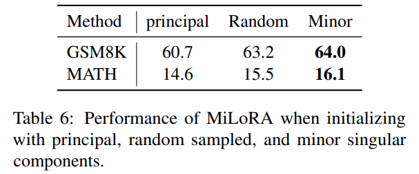

- 결과적으로, minor singular components 로 초기화했을 때 두 데이터셋 모두에서 최고의 성능을 달성했다. 이는 fine-tuning 과정에서 minor singular components 를 적응시키는 것이 중요함을 강조한다. 
- PiSSA 는 principal singular components 를 적응시키는 MiLoRA 와 유사한 접근법을 제안했으며, 이에 대한 상세 비교는 Sec. 5.5 에서 제공한다.  

## 5.3 How does the Matrix Update $\Delta W$ Compare to $W$?  

다양한 방법에서 $\Delta W$ (fine-tuning 후와 pre-trained weights 의 차이) 와 $W$ 간의 관계를 조사했다. 

Hu et al. (2021) 의 분석 방법을 따라, $\Delta W$ 의 r-dimensional subspace 에 $W$ 와 $\Delta W$ 를 투영하여 $U^\top W V$ 와 $U^\top \Delta W V$ 를 계산했다. 

여기서 $U/V$ 는 $\Delta W$ 의 left/right top $r$ singular vector matrix 이다. 

비교를 위해, $U, V$ 를 $W$ 의 top $r$ singular vectors 또는 random matrix 로 교체하여 $U^\top W V$ 를 계산했다. 

Frobenius norm 을 크기의 척도로 사용했다.  

결과는 Tab. 7 에 나와 있다.  

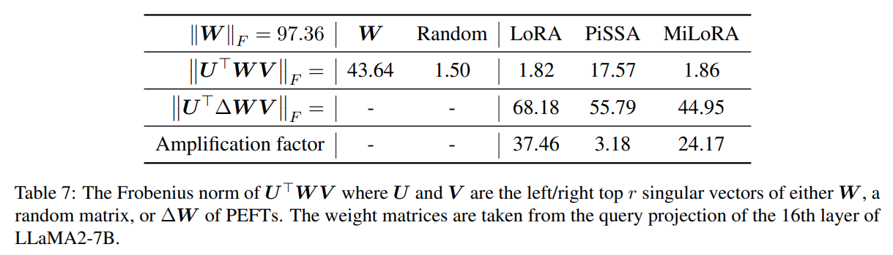

- **첫 번째 관찰**: LoRA 와 MiLoRA 의 $\Delta W$ 는 $W$ 와 비슷한 상관관계를 가지며, random matrix 보다 약간 더 강했다. 이는 $W$ 에서 강조되지 않은 방향을 증폭함을 나타낸다. 반면, PiSSA 의 $\Delta W$ 는 $W$ 와 강한 상관관계를 보였는데, 이는 PiSSA 가 principal singular components 를 직접 최적화하기 때문이다.  
- **두 번째 관찰**: 증폭 계수는 방법에 따라 크게 달랐다. MiLoRA 는 LoRA 에 비해 증폭 계수가 훨씬 작았으며, 이는 $W$ 에 이미 존재하는 특징에 대한 영향을 줄였음을 나타낸다.  

---

다양한 방법에서 $\Delta W$ 의 특징을 추가적으로 분석하기 위해, $\Delta W$ 의 top r singular vectors 로 span 된 subspace 와 $W$ 의 top, bottom, random r singular vectors 로 span 된 subspace 간의 normalized subspace similarity 를 측정했다. Grassmann distance 를 기반으로 유사성 척도를 정의했다. 

결과는 Fig. 2 에 나와 있다.

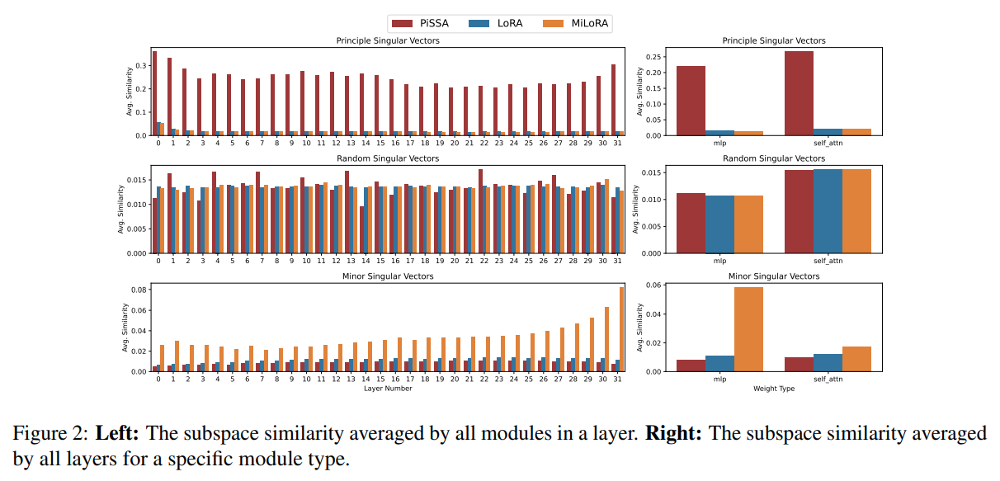

- PiSSA 는 top singular vectors 와 관련된 특징을 최적화하는 데 초점을 맞추는 반면, LoRA 와 MiLoRA 는 이러한 특징을 크게 최적화하지 않았다.  
- MiLoRA 는 주로 bottom singular vectors 와 관련된 특징을 최적화했다.  

## 5.4 MiLoRA Forgets Less than Baselines  

MiLoRA 가 baseline 보다 우수한 이유에 대한 가설은 pretrained knowledge 를 더 많이 보존한다는 것이다. 

이를 검증하기 위해, cross-entropy 를 사용해 forgetting 을 측정했다. 이는 LLM 학습 시 사용되는 일반적인 next token prediction loss 와 동일하지만, target next token 을 pretrained base 모델이 예측한 분포로 대체했다.  

LLaMA2-7B 모델을 math reasoning 작업에서 fine-tuning 한 후 WikiText-103 test dataset 에서 forgetting metric 을 평가했다. 

결과는 Tab. 8 에 나와 있다.

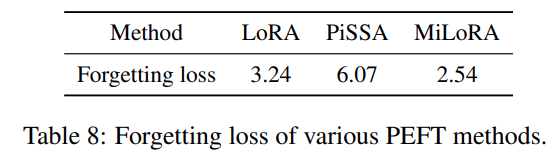

- MiLoRA 는 가장 낮은 forgetting loss 를 나타내며, pretrained knowledge 에 대한 수정이 최소화되었음을 보여준다.  
- PiSSA 의 loss 는 다른 방법들보다 유의미하게 높았다.  

## 5.5 Comparison Between MiLoRA and PiSSA

저자의 연구와 동시에 Meng et al. (2024) 은 PiSSA 라는 low-rank adaptation 방법을 제안했다. 

PiSSA 는 MiLoRA 와 유사한 프레임워크를 공유하지만, principal singular components 를 적응시킨다. 저자는 PiSSA 와 MiLoRA 가 근본적으로 다르다고 주장한다.

- **Motivation**: PiSSA 는 weight matrices 의 본질을 포착한다고 여겨지는 principal singular components 를 적응시켜 fully fine-tuning 을 근사하도록 설계되었다. 반면, MiLoRA 는 base model 의 지식을 최대한 유지하면서 새로운 작업에 적응하는 것을 목표로 한다. 이를 위해 weight matrices 의 minor singular components 를 fine-tuning 한다.  
- **Performance**: PiSSA 는 MiLoRA 와 minor singular components 를 적응시키는 방법보다 성능이 우수하다고 주장하지만, 저자는 이 주장이 실험에서 사용된 특정 hyperparameter 에 기인할 가능성이 높다고 본다. 이를 검증하기 위해, 동일한 MetaMathQA 100K 데이터셋을 사용해 PiSSA, LoRA, MiLoRA 의 성능을 PiSSA 의 hyperparameter 와 저자의 설정 모두에서 비교했다. 구체적으로, PiSSA 논문에서 최고의 성능을 기록한 rank 128 을 선택하고, 모든 설정에서 1 epoch 동안 fine-tuning 을 수행했다.  

결과는 Tab. 9 에 요약되어 있다.

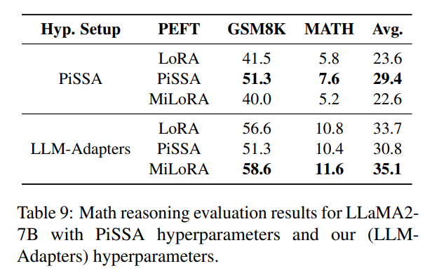

1. PiSSA 설정에서는 PiSSA 가 LoRA 와 MiLoRA 를 능가하며, 이는 PiSSA 논문의 주장과 일치한다.  
2. 모든 방법이 저자의 hyperparameter 설정에서 더 나은 성능을 보였다. 이는 저자의 설정이 더 효과적임을 시사한다. PiSSA 설정은 small learning rate (2e-5) 와 large batch size (128) 의 조합을 사용했으며, 이는 common PEFTs 에 적합하지 않을 가능성이 있다. 일반적으로 PEFT 에 optimal learning rate 는 fully fine-tuning 보다 훨씬 높다.  
3. 저자의 hyperparameter 설정에서 MiLoRA 는 가장 우수한 성능을 보였으며, LoRA 와 PiSSA 를 각각 평균 1.4 점 및 4.3 점 초과했다.

결론적으로, 적절한 hyperparameter 설정을 사용할 때 MiLoRA 는 PiSSA 보다 훨씬 우수한 성능을 달성한다.  

# 6. Related Work

## Parameter-Efficient Finetuning of LLMs

LLM 의 사전 학습 이후, 다양한 downstream 작업에 적응하기 위해 instruction 데이터나 human preference 데이터로 fine-tuning 이 수행된다. Parameter-efficient finetuning (PEFT) 은 fine-tuning 중 요구되는 계산 자원을 줄이면서 fully fine-tuning 에 근접한 성능을 목표로 하는 효과적인 접근법을 탐구한다. 기존 PEFT 방법은 adapter-, LoRA-, prompt 기반으로 분류될 수 있다.  

- **Adapter-based methods**: Transformer layer 에 추가 trainable feedforward submodules 를 삽입한다. 그러나 추론 시 추가적인 계산 비용을 초래한다.  
- **LoRA-based methods**: 선택된 linear weights 의 변화를 low-rank matrices 로 모델링한다. fine-tuning 동안 선형 matrix 에 대해 두 개의 low-rank matrices 만 최적화되며, pretrained weight matrix 는 고정된다.  
- **Prompt-based methods**: 입력 토큰에 추가적인 soft prompts 를 추가한다. 훈련 중 soft prompts 만 업데이트되며, pretrained model  파라미터는 고정된다.  

이 중 LoRA 기반 접근법은 구현이 용이하고 추론 중 추가적인 계산 overhead 가 없기 때문에 LLM fine-tuning 에 널리 사용된다.  

## LoRA and Its Variants

LoRA 는 두 개의 trainable low-rank matrices 로 weight update 를 재구성하며, pretrained weights 를 고정한다. 이 경량화된 분해로, LoRA 는 multiple tasks 간에 pretrained model 을 공유하여 저장 및 task-switching overhead 를 줄인다. 이후 연구자들은 다양한 LoRA 변형을 탐구하고 제안했다.  

- **AdaLoRA**, **ALoRA**: weight matrix 에 대한 중요도 점수에 따라 LoRA 모듈의 rank 를 적응적으로 결정한다.  
- **rsLoRA**: 적절한 scaling factor 를 적용하여 large ranks 의 성능을 향상시킨다.  
- **DoRA**: pretrained weight 를 magnitude 와 directional components 로 분해한 뒤, 두 부분을 fine-tuning 하여 성능을 향상시킨다.  
- **PiSSA**, **LoRA-GA**: principal singular components 만 업데이트하거나 low-rank 업데이트의 gradient 를 fully fine-tuning 에 맞추는 방식으로 fully fine-tuning 을 더 잘 근사하도록 설계되었다.  

# 7. Conclusion

본 논문에서는 MiLoRA 라는 간단하지만 효과적인 low-rank adaptation 방법을 제안했다. 

MiLoRA 는 pretrained weight matrices 의 minor singular components 를 적응시켜 fine-tuning 작업에서 효과적으로 학습하면서도 pretrained knowledge 를 더 잘 보존한다. 

commonsense reasoning, math reasoning, instruction-following, vision-language model 평가 benchmark 에 대한 광범위한 실험 결과, MiLoRA 는 LoRA 와 PiSSA 를 일관되게 초과하는 성능을 보였으며, training 또는 inference 효율성을 희생하지 않았다.  

# Limitations

제한된 계산 자원으로 인해, MiLoRA 는 LLaMA-family LLM 및 commonsense reasoning, math reasoning, instruction-following benchmark 에서만 평가되었다.

다른 작업 및 Mistral, Gemma 와 같은 다른 LLM 에 대한 MiLoRA 의 탐색은 미래 연구로 남겨둔다.  