논문 및 이미지 출처 : <https://aclanthology.org/2024.emnlp-main.450.pdf>

# Abstract

이 논문에서는 subspace 에서 영감을 얻은 Low-Rank Adaptation (LoRA) 방법을 제안한다. 

이 방법은 계산적으로 효율적이고, 구현이 용이하며, large language, multimodal, 그리고 diffusion models 에 손쉽게 적용 가능하다. 

먼저, 기존 LoRA weights 를 동등한 형태로 two subspaces 로 분해하고, 이들을 mixing 만 해도 성능이 향상됨을 확인한다. 

- 이러한 현상을 더 잘 이해하기 위해, 저자는 subspace 관점을 세분화하여 다시 살펴본다. 
- 분석 결과, 이러한 수정은 fixed _mixer_ 를 통해 subspaces 를 fuse 하는 것과 동일하다는 것을 보인다. 
- 더 유연하게 하기 위해, 저자는 mixer 를 original LoRA weights 와 함께 jointly learning 하는 방법을 제안하며, 이를 Mixture-of-Subspaces LoRA (MoSLoRA) 라고 명명한다. 
- MoSLoRA 는 commonsense reasoning, visual instruction tuning, subject-driven text-to-image generation 등 서로 다른 모달리티에서 LoRA 대비 일관적으로 더 뛰어난 성능을 보이며, 그 효과와 견고함을 입증한다.

# 1 Introduction

Large Language Models (LLMs), 예컨대 GPT-4, LLaMA 3, InternLM2 등은 다양한 영역에서 뛰어난 성능을 보인다. 이러한 강력한 능력은 대규모 학습 데이터와 모델 파라미터 규모 증가에서 기인한다고 알려져 있다. 하지만, 파라미터 전체를 fully fine-tuning 하려면 방대한 자원이 필요하다.

이 문제를 완화하기 위해, parameter-efficient fine-tuning(PEFT) 이 발전해 왔다. 이는 학습해야 하는 파라미터 수를 최소화하면서도 가능한 한 comparable performances 에 도달하도록 한다.

이러한 방법 중 LoRA 는 간단하면서도 효과적이라는 점에서 주목받아 왔다. LoRA 는 original weight $W_0 \in \mathbb{R}^{d_1 \times d_2}$ 에 additional low-rank branch 를 붙여 fine-tuning 하고, inference 시에는 이 업데이트를 frozen $W_0$ 에 병합하는 방식을 취한다. 

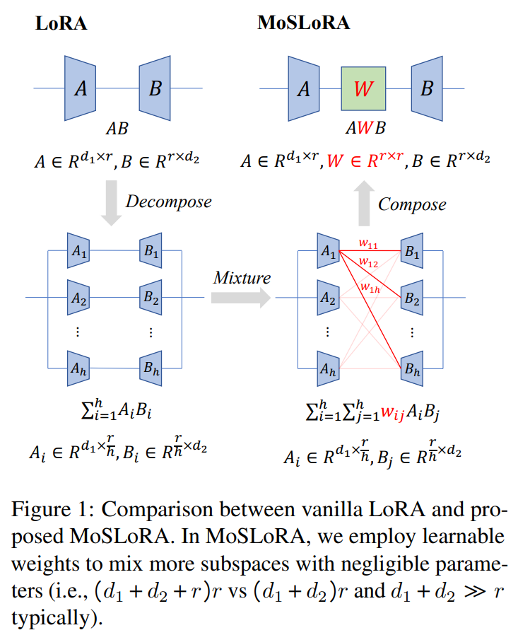

Fig. 1 과 같이, low-rank branch 는 down projection $A \in \mathbb{R}^{d_1 \times r}$ 와 up projection $B \in \mathbb{R}^{r \times d_2}$ 로 구성되며, $r \ll \min(d_1, d_2)$ 로 설정하여 학습해야 하는 파라미터를 $d_1 \times d_2$ 에서 $(d_1 + d_2)r$ 로 크게 줄인다.

본 논문에서는 먼저 LoRA weights 가 _subspace_ 들로 구성되어 있다고 보고, multi-head attention(MHA) 의 subspace 와 유사한 방식으로 rank 를 작게 쪼갠 subspace 들을 병렬로 배치하는 방식으로 해석한다. 

그리고 기존 LoRA 를 structure re-parameterization 기법을 통해 여러 subspaces 로 나누어볼 수 있음을 보여준다. 

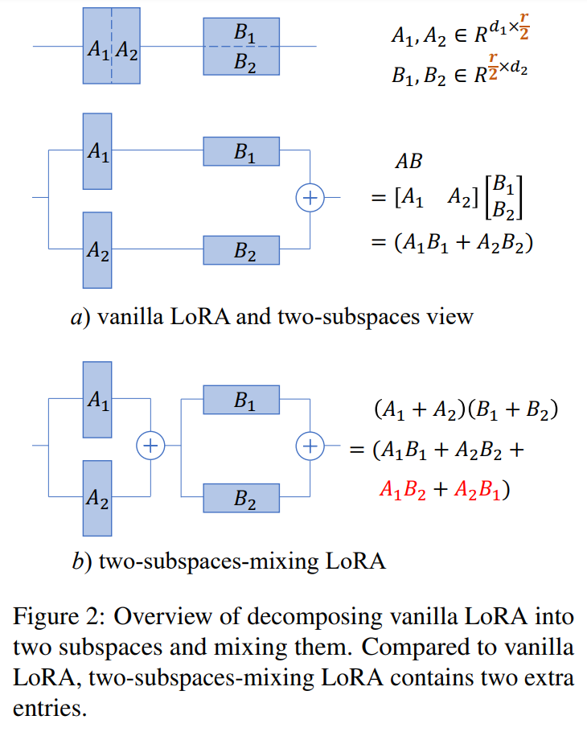

Fig. 2 는 two subspaces 로 분해하는 과정을 예시로 나타낸다. 놀랍게도, 이렇게 단순히 subspaces 두 개를 mixing 하여 학습하는 것만으로도 commonsense reasoning task 에서 성능이 향상된다는 관측을 얻었다.

이러한 관찰을 바탕으로, two subspaces 를 mixing 하는 전략을 more fine-grained view (rank=1)와 composed view 에서 재조명한다. 

- 요약하자면, 이 전략은 $A$ 와 $B$ 사이에 _mixer_ matrix 를 삽입하는 것과 동등하며, 이는 fixed butterfly factor 를 사용하는 것과 동일하다는 결론에 도달한다. 
- 한편, LoRA 는 fixed identity matrix 를 mixer 로 두는 특수 케이스로 볼 수 있다. 
- 따라서, 저자는 더 많은 subspace 들을 더 유연하게 섞을 수 있도록, learnable mixer 를 사용한 간단하면서도 효과적인 방법 MoSLoRA(Mixture-of-Subspaces LoRA) 를 제안한다. 

Fig. 1 에서 보이듯, 저자는 mixer $W$ 를 학습하여 모든 가능한 subspaces ($A_i B_j$ 등)을 fusing 하도록 한다. 

- LoRA 대비 MoSLoRA 는 파라미터가 매우 적게 추가되는데, 이는 $d_1 + d_2 \gg r$ 를 만족하기 때문이다. 
- 또한 LoRA 와 유사하게, MoSLoRA 역시 inference 시 original weight 에 병합해 추가적인 지연(latency)을 발생시키지 않는다.

저자는 제안하는 MoSLoRA 를 여러 downstream task 에서 평가했다. 구체적으로, commonsense reasoning 에서 LLaMA 3 model 에 대해 fine-tuning 을 수행하고, visual instruction tuning 에서 LLaVA-1.5 series model, 그리고 subject-driven text-to-image generation 에서는 Stable Diffusion XL(SDXL) model 로 실험을 진행했다. 

그 결과, MoSLoRA 는 all tasks 에서 LoRA 및 다른 baselines 보다 일관되게 우수한 성능을 보이며, 그 유효성과 견고함을 증명한다.

이 논문의 기여점을 요약하면 다음과 같다:

- **LoRA 의 subspaces 관점**: structure re-parameterization 를 통해 LoRA weights 를 여러 subspace 로 분해할 수 있으며, 이는 LoRA 에 대한 새로운 연구 방향을 제시한다.  
- **MoSLoRA 제안**: learnable mixer 를 사용해 subspace 들을 더 폭넓고 유연하게 융합하는 간단하면서도 효과적인 방법을 고안했다.  
- **광범위한 실험**: 다양한 downstream task 에서 제안하는 MoSLoRA 의 효과를 검증했고, 기존 방법 대비 일관된 성능 우위를 확인했다.

# 2 Preliminaries and Motivation

## 2.1 LoRA and Subspace View

model fine-tuning 때 weight update 가 low intrinsic rank 를 갖는다는 가정 하에, LoRA 는 two low-rank matrices 를 통해 weight update 를 modeling 한다. 

pre-trained weight matrix $W_0 \in \mathbb{R}^{d_1 \times d_2}$ 라 하고 임의의 입력을 $x$ 라고 할 때, LoRA 는 아래와 같이 forward pass 를 수정한다:

$$
\begin{equation}
    xW_0 + x\Delta W = xW_0 + xAB,
\end{equation}
$$

- 여기서 $A \in \mathbb{R}^{d_1 \times r}$, $B \in \mathbb{R}^{r \times d_2}$ 이고, $r \ll \min(d_1, d_2)$ 이다. 
- 보통 $A$ 는 Gaussian matrix 로 초기화하고, $B$ 는 zero matrix 로 초기화하므로, 학습 초기에는 $\Delta W$ 가 zero 가 된다. 
- training 과정에서 original weight $W_0$ 는 frozen 되고, $A$ 와 $B$ 만이 trainable parameters 가 된다. 
- training 후에는 $A, B$ 를 original weight $W_0$ 에 병합할 수 있으므로, inference 시 latency 를 추가로 발생시키지 않는다.

본 논문에서는 이러한 LoRA 를 structure re-parameterization 기법을 통해 여러 subspaces 로 분해한다. 

- 이는 smaller rank values 로 구성된 병렬 구성요소라 볼 수 있으며, multi-head attention(MHA) 의 subspace 설계와 유사한 아이디어다. 
- Fig. 2 의 (a) 부분은 two subspaces 예시를 나타낸다. 
- 구체적으로, $A$ 를 column 방향으로 $A_1$ 과 $A_2$ 로 분할하고, $B$ 를 row 방향으로 $B_1$ 과 $B_2$ 로 분할한다. 이로써 다음을 얻는다.

$$
\begin{equation}
    xAB = x[A_1  A_2]
    \begin{bmatrix}
    B_1 \\
    B_2
    \end{bmatrix}
    =
    x(A_1B_1 + A_2B_2),
\end{equation}
$$

즉 $A_1 B_1$ 과 $A_2 B_2$ 는 two subspaces 이다. 

이런 식으로 LoRA 를 two subspaces 로 나눈 경우, vanilla LoRA 는 단순히 이 two subspaces 의 합에 해당한다. 

만약 $A, B$ 를 더 많이 분할한다면, more fine-grained subspacess view 도 얻을 수 있다.

## 2.2 Mixing Two Subspaces

Fig. 2(b) 에서는 two subspaces 의 결과값을 단순 합하는 대신, subspaces 를 mix 하는 과정을 나타낸다. 

따라서 input $x$ 에 대한 전체 module output 은 아래와 같다:

$$
\begin{equation}
    \begin{aligned}
        &x(A_1 + A_2)(B_1 + B_2) \\
        = &x(A_1 B_1 + A_2 B_2 + {\color{red}A_1 B_2 + A_2 B_1} ).
    \end{aligned}
\end{equation}
$$

이는 Eq. (2) 와 비교했을 때, $A_1 B_2$ 와 $A_2 B_1$ 라는 two extra entries 를 포함한다. 즉 더 많은 정보를 modeling 할 수 있게 된다.

두 방식 (sum vs. two subspaces mixing) 을 비교하기 위해, commonsense reasoning task 에서 실험을 진행했다. 

구체적으로, LLaMA-3 8B model 을 fine-tuning 하면서 commonsense 관련 170k training samples 를 사용했고, ARC-c/e, OBQA, SIQA, WinoG., PIQA, BoolQ, HellaS. 등 총 8 dataset 에 대해 평가했다. all hyperparameters 는 동일하다.

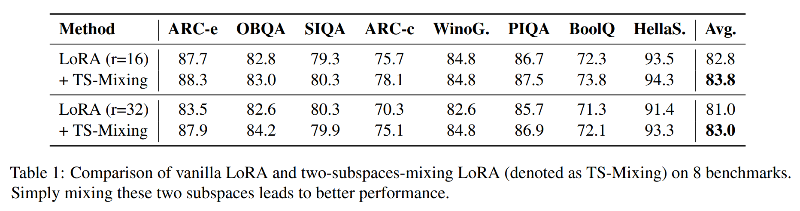

- Tab. 1 은 두 방식의 결과를 요약한 것으로, rank=8/16 설정에서 two subspaces 를 mixing 하는 방법이 vanilla LoRA 대비 더 나은 성능을 보인다(e.g., HellaSwag 에서 93.3 vs. 91.4). 
- 이는 two-subspace-mixing 이 vanilla LoRA 보다 더욱 효과적이고 견고함을 시사한다.

# 3 Methodology

## 3.1 More Fine-grained Subspace

two subspaces mixing 은 성능이 좋아진다는 점을 바탕으로, 여기서는 more fine-grained subspace (i.e., rank=1) 관점에서 two-subspaces-mixing LoRA 를 재조명한다. 

구체적으로, $A \in \mathbb{R}^{d_1 \times r}$ 와 $B \in \mathbb{R}^{r \times d_2}$ 를 각각 $r$ subspaces (rank=1) 로 분해한다:

$$
\begin{equation}
    \begin{aligned}
        A &= [A_1 A_2 \cdots A_r], \\
        B^\top &= \bigl[B_1^\top B_2^\top \cdots B_r^\top\bigr],
    \end{aligned}
\end{equation}
$$

여기서 $A_i \in \mathbb{R}^{d_1 \times 1}$, $B_i \in \mathbb{R}^{1 \times d_2}$ 이며 $1 \leq i \leq r$ 이다. 

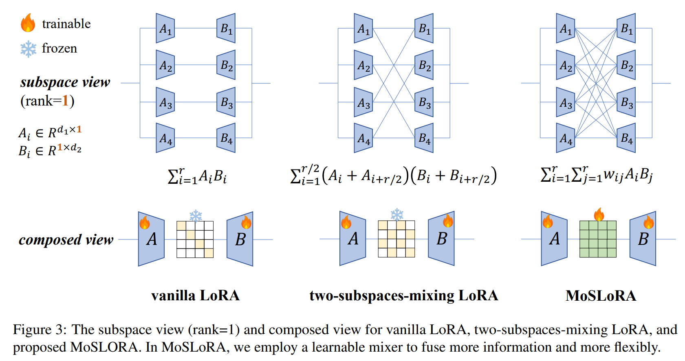

Fig. 3 에서 보이듯, 이를 통해 vanilla LoRA 를 다음과 같이 해석할 수 있다.

$$
\begin{equation}
    xAB = x\sum_{i=1}^r A_iB_i = xAI_{r\times r}B
\end{equation}
$$

여기서 $I_{r\times r} \in \mathbb{R}^{r \times r}$ 는 identity matrix. 

반면, two-subspace-mixing LoRA 는 다음과 같다.

$$
\begin{equation}
    \begin{aligned}
        &x \sum_{i=1}^{r/2} \bigl(A_i + A_{i+r/2}\bigr) \bigl(B_i + B_{i+r/2}\bigr) \\
        = &xA
        \begin{bmatrix}
        I_{r/2\times r/2} & I_{r/2\times r/2} \\
        I_{r/2\times r/2} & I_{r/2\times r/2}
        \end{bmatrix}
        B
    \end{aligned}
\end{equation}
$$

흥미롭게도, Eq. 5 및 Eq. 6 가 동일한 패러다임을 공유하는 것을 발견할 수 있다.

$$
\begin{equation}
    A {\color{red}W}B
\end{equation}
$$

여기서 $W \in \mathbb{R}^{r \times r}$ 이고, 이 $W$ 가 subspaces 를 fuse 하기 위한 **mixer** weight 라고 정의한다.

- Vanilla LoRA 에서, 이 mixer 는 **fixed identity matrix** 로서 $r$ subspaces 를 합친다.  
- Two-subspaces-mixing LoRA 에서는 mixer 가 **fixed butterfly factor** 로서 $2r$ subspaces 를 합치며, 이는 LoRA 보다 더 많다.  

따라서 저자는 모든 가능한 subspaces 를 모두 결합하기 위해 trainable mixer 를 사용하는 **MoSLoRA** 를 제안한다. 

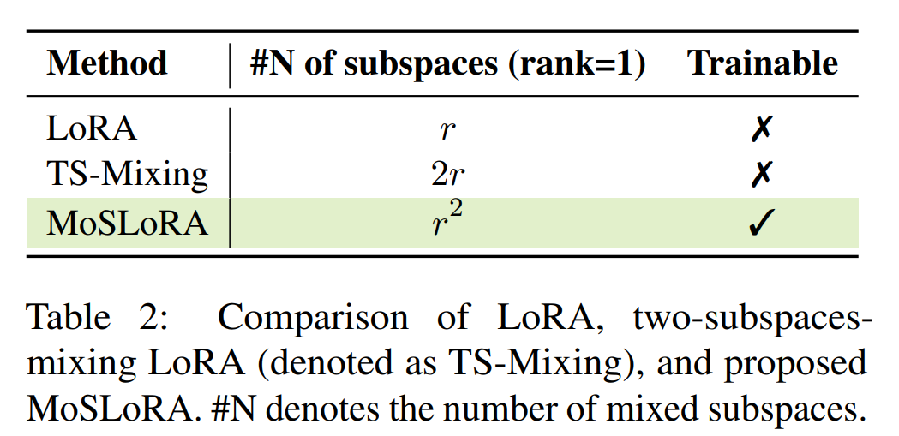

Tab. 2 에서 보이듯, MoSLoRA 는 rank=1 인 subspaces 총 $r^2$ 개의 정보를 trainable weight 로 섞어서, LoRA 보다 더 많은 subspaces 와 더 유연하게 modeling 한다.

## 3.2 Initialization Strategies for Mixer

본 논문에서 제안하는 MoSLoRA 는 trainable mixer 로 모든 가능한 subspaces 들을 융합한다. 하지만 시스템이 linear 이므로, bad initialization 은 학습을 방해할 수 있다. 

- 저자는 LoRA 의 초기화 방식을 따라 $A$ 는 _Kaiming uniform_ distribution 으로, $B$ 는 _zero_ matrix 로 초기화한다. 
- 그다음 mixer weight $W$ 에 대해서는 zero matrix, identity matrix, normal distribution, orthogonal matrix, Kaiming uniform 등 다양한 초기화를 비교했다.

Tab. 3 은 commonsense reasoning task 결과를 보여준다. 

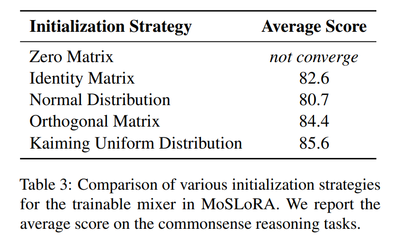

- 만약 mixer 를 zero matrix 로 초기화하면, $A, B, W$ 에 대한 gradient 가 0 이 되어 training 이 수렴하지 않았다. 
- mixer 를 identity matrix 로 초기화하고 training 하는 경우, fixed identity mixer 를 쓰는 vanilla LoRA 와 유사한 성능 (82.6 vs. 82.8) 을 보였다. 
- 반면, Kaiming uniform 와 orthogonal 은 더 높은 성능을 얻었고, 저자는 MoSLoRA 에서 mixer 초기화를 이 둘 중 하나를 사용한다.

## 3.3 Relation with Mixture-of-Experts

Mixture-of-Experts(MoE) 는 Fedus et al. (2022a); Shi et al. (2024) 등에서 제안된 방식으로, 특정 router 로 입력별 스코어를 구해 top-k expert 를 선택한다. 

이에 비해, 저자가 제안한 MoSLoRA 는 mixer 의 $w_{ij}$ 가 subspace $A_i B_j$ 의 weight 역할을 한다고 볼 수 있지만, 다음과 같은 차이가 존재한다:

1. **input-agnostic**: MoE 는 입력별로 스코어를 달리 주지만, MoSLoRA 에서는 mixer 가 입력과 무관하게 동일하게 적용된다.  
2. **all subspace update**: MoE 는 top-k expert 만 선택하여 학습하는 반면, MoSLoRA 는 subspaces 전부를 동시에 학습한다.

# 4 Experiments and Analysis

## 4.1 Commonsense Reasoning

저자는 LLaMA-3 8B instruction version model 을 commonsense reasoning question answering tasks 에 대해 fine-tuning 했다. 먼저 170k training samples 로 모델을 학습시키고, fine-tuned model 을 8 commonsense reasoning question answering benchmark 에 대해 평가했다. 

이 170k training set 은 해당 벤치마크들의 training set 합본이다. 

비교 대상으로, LoRA 이외에도 다양한 기법과 성능을 대조했다:

1) **LoKr** : $AB$ 를 Kronecker product 로 분해해서 파라미터 양을 줄이는 방법  
2) **LoHa** : vanilla LoRA 를 two LoRA branches 의 Hadamard product 로 분해  
3) **FLoRA** : Tucker decomposition-based extra core 를 추가해, original space 와의 topological structure 일관성을 유지  
4) **AdaLoRA** : pre-trained weight matrices 업데이트를 SVD 형태로 parameterizing
5) **DoRA** : pre-trained weights 를 magnitude 와 directional 로 분해해 둘 다 학습

모든 실험은 Nvidia A100 80G GPU 하나로 진행했다.

Tab. 3 결과를 바탕으로, mixer 는 Kaiming uniform 분포로 초기화했다. 정확도 이외에도, 학습된 파라미터 수와 학습 시간, GPU 메모리 등도 보고한다.

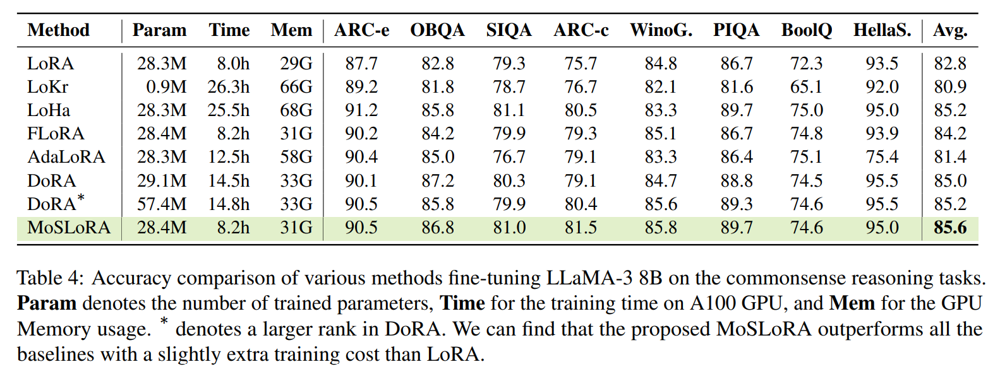

Tab. 4 는 8 benchmark 에 대한 결과다. 주요 관찰점은 다음과 같다:

- **MoSLoRA** 가 all baselines 보다 높은 성능을 보이며, subspaces mixing 의 효과를 보여준다. 예컨대 평균 스코어가 85.6 으로, LoRA 의 82.8 대비 +2.8p 이고, DoRA(r이 더 큰 경우) 대비도 우수하다.  
- MoSLoRA 는 LoRA 대비 추가 파라미터가 거의 없고(0.1M 미만), 계산 비용도 무시해도 될 수준(약 0.2시간 이하)이다. 반면, DoRA 대비 44% 학습 시간 절감, LoHa 대비 68% 학습 시간 절감이 가능하다.  
- LoKr 는 Kronecker product 를 통해 training parameters 를 줄이지만, training time 이 MoSLoRA 대비 3배 이상, GPU 메모리도 2배 필요하다. 평균 성능도 80.9 로, MoSLoRA 보다 4.7 낮다.

#### Fewer training samples

training sample 이 적을수록 성능이 어떻게 변하는지 확인하기 위해, original 170k 의 12.5% / 25% / 50% / 75% 를 무작위로 선택해 실험했다. 

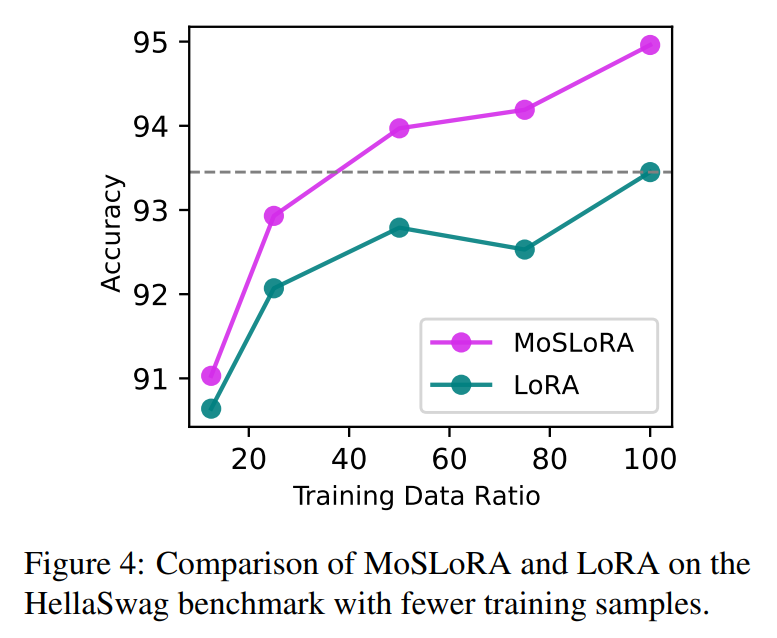

- Fig. 4 에서 확인하듯, training sample 이 늘어나면 성능이 좋아지고, 모든 설정에서 MoSLoRA 가 LoRA 보다 성능이 높다. 
- 특히 50% samples 로 학습한 MoSLoRA(83.6) 가 100% samples 로 학습한 LoRA(81.8) 보다도 1.8p 더 우수하다. 
- 또한 training samples 가 많아질수록 MoSLoRA 와 LoRA 간 격차가 커지는 모습은, 더 많은 subspace 를 mixing 해 복잡한 정보를 모델링하는 MoSLoRA 의 우수성을 보여준다.

## 4.2 Visual Instruction Tuning

멀티모달 과제에서 성능을 평가하기 위해, LLaVA-1.5 (Liu et al., 2023a) 시리즈 모델을 finetuning 했다. 이후 다양한 visual QA 벤치마크로 모델을 테스트했다. LLaVA 학습은 보통 2단계로 진행된다:

1) visual features 에서 language space 로 project 하는 two-layer MLP 를 pre-training  
2) LLM + visual encoder (optional) 에 visual instruction tuning 수행

본 논문에서는 XTuner 가 제공한 pre-trained projector 를 사용하고, LLM backbone 과 visual encoder 를 LoRA/MoSLoRA 방식으로 동시에 fine-tuning 했다. 

LLM backbone 으로는 LLaMA3 8B 와 InternLM2 7B 를 사용, 각각 opensource projector 와 결합했다. 

- visual encoder 는 ViT large 버전을 사용한다. 
- 자원 한계로, LLM + visual encoder 전체를 LoRA/MoSLoRA 방식으로 665K instruction-following data 로 학습하며, InternLM2 의 경우 4-bit QLoRA 와 결합해 QMoSLoRA(QLoRA+MoSLoRA) 로 실험했다. 
- Tab. 3 분석에 따라 mixer 는 orthogonal, Kaiming uniform 로 각각 초기화했다. 
- 4 A100 80G GPU 로 학습 시 약 20시간 소요된다.

training 후, 9 benchmark (MMBench EN/CN, SEED Bench, AI2D, SciQA, TextVQA, MathVista testmini, MM-Vet, MME) 에 대해 모델을 평가했고, VLMEvalKit 를 사용했다. MME 점수는 100으로 스케일링 후 평균을 구했다.

Tab. 5 에서 9 benchmark 결과를 확인할 수 있다. 

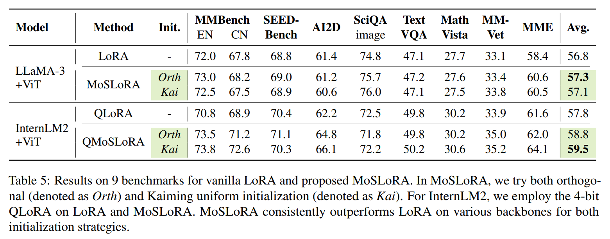

- orthogonal, Kaiming 초기화 모두에서 MoSLoRA 가 LoRA 대비 일관된 우세를 보였다. 
- 예컨대 InternnLM2+ViT 조합 시 MoSLoRA 평균 스코어가 59.5 로 LoRA 대비 +1.7p. 또한 4-bit QLoRA 와 결합한 QMoSLoRA 역시 LoRA+QLoRA 대비 우수했다. 
- 이는 MoSLoRA 가 quantization 방법들과도 양립 가능함을 보여준다. 

요약하면, 제안한 MoSLoRA 는 멀티모달 시나리오에서도 LoRA 보다 일관적으로 우수했다.

#### More finegrained ability

추가로, MMBench EN/CN 의 6개 ability score 를 정규화해 시각화했다. 

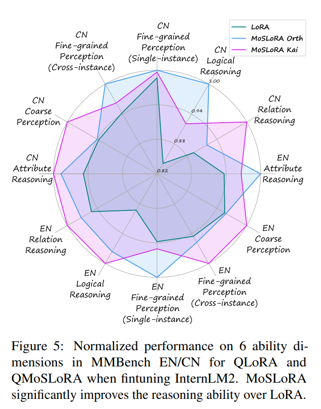

- Figure 5 에서 보면, 영어/중국어 모두 MoSLoRA 가 LoRA 보다 모든 능력에서 점수가 더 높았으며, 특히 reasoning 능력 향상이 두드러진다. 
- reasoning task 는 보통 더 복잡하고 어렵다고 알려져 있는데, 더 많은 subspace 를 mixing 하는 MoSLoRA 가 논리 추론 같은 복잡한 문제에서 장점을 가짐을 확인할 수 있다.

### 4.3 Subject-driven Generation

이 절에서는 text-to-image diffusion model 을 fine-tuning 미세조정하여 Ruiz et al., 2023 가 제안한 subject-driven generation task 를 실험한다. 

목표는 specific subject 에 해당하는 image 를 주어진 prompt 에 따라 생성하는 것이다. 구체적으로, 몇 장의 예시 이미지와 고유 identifier (e.g., "A photo of a [V] cat") 로 이루어진 text prompt 를 사용해 model 을 fine-tuning 한 후, 동일한 identifier 를 포함하는 다른 prompt 로 원하는 이미지를 생성한다.

Fig. 6 은 DreamBooth dataset 내 한 마리 고양이 예시를 보여준다.

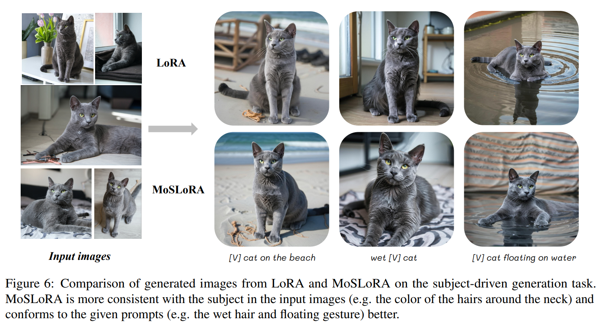

- SDXL model 을 LoRA 와 MoSLoRA 로 각각 미세조정하며, MoSLoRA 에서는 mixer 를 orthogonal matrix 로 초기화한다. 
- fine-tuning 시 learning rate 는 1e-4, batch size 는 4이며, 80G A100 GPU 한 장에서 500 step 동안 학습하는 데 약 16분이 소요된다. 
- 생성 시에는 주어진 prompt 로 50 step 을 추론한다.
- LoRA 와 비교했을 때, 제안하는 MoSLoRA 는 주어진 subject 의 세부 디테일을 더 잘 포착하고, prompt 와도 더 일관된 이미지를 생성함을 알 수 있다. 
- 예를 들어, 목 주변 털의 색이나 발바닥의 형상이 더 풍부하게 반영되며, "젖은 털" 이나 "떠 있는 자세" 와 같은 묘사에 더 부합하는 이미지를 생성한다.

#### Human evaluation

추가로, 사람이 직접 생성된 이미지를 평가하는 실험을 수행했다. 

DreamBooth dataset 에서 고양이, 개, 회색 나무늘보 인형, 캔 총 4개 subject 를 선택해 각각 SDXL model 을 fine-tuning 했다. 

이후 무작위로 8 prompts 를 선정하여 이미지를 생성하고, LoRA 와 MoSLoRA 로 생성된 이미지를 1:1 대응 짝으로 구성했다. 그리고 15명의 평가자가 모델 정보를 모르는 상태에서 이 이미지 쌍을 섞어서, win/tie/loss 로 독립 채점하게 했다.

두 가지 평가 지표로는, 1) subject similarity (generated image 속 subject 와 original image 간 유사도) 와 2) prompt consistency (prompt 와 generated image 간 일관성) 를 사용했다. 

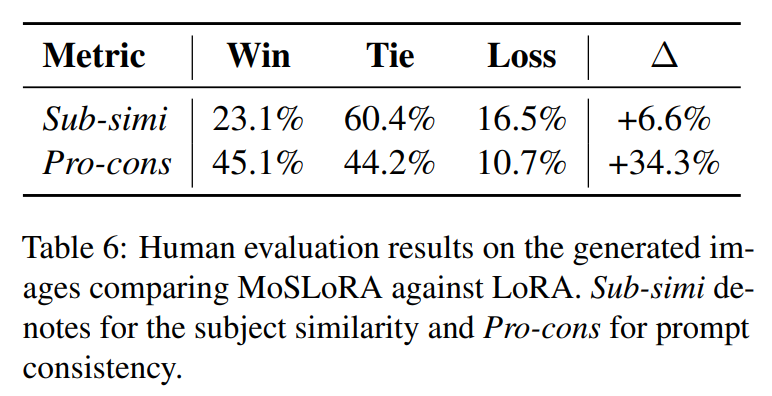

- Tab. 6 에 요약된 평균 점수에 따르면, MoSLoRA 가 두 지표 모두에서 LoRA 보다 우수하다. 
- 특히, 프롬프트 일관성 측면에서 MoSLoRA 는 평균 45.1% 의 win 비율을 기록해 LoRA 대비 34.3% 포인트 높았다. 

# 5 Related Work

## 5.1 Parameter-Efficient Fine-tuning

큰 비중의 파라미터를 전부 업데이트하지 않고, 일부만 효율적으로 조정하는 방법이 중요한 화두가 되었다. 

전형적인 PEFT 접근은 크게 아래와 같이 나뉜다:

1) adapter 기반 방식: transformer layer 사이에 작은 모듈을 삽입,  
2) prefix tuning 방식: hidden state 의 앞부분에 tunable prefix vectors 를 추가,  
3) selective 방식: 특정 부분만 골라 업데이트,  
4) low-rank adapting (LoRA) 계열: trainable low-rank branches 를 추가하여 weight update 를 근사.

이 중 LoRA 는 inference 시 원본 weight 에 병합 가능해, latency 추가가 없어 많이 연구된다. 본 논문에서는 LoRA 계열 방법에 집중한다.

### 5.2 LoRA and its Variants

LoRA 의 핵심은 merge 가능한 저랭크 branch 로 사전학습 weight 의 업데이트를 모델링하는 것이다. 이후 다양한 변형 방식이 나왔으며, 대체로 아래와 같이 구분된다:

1) _introducing training skills_ : 학습률 차등 설정, random noise 추가 등,  
2) _searching ranks_ : DyLoRA, AdaLoRA 등,  
3) _new designs for the branch_ : LoKr, LoHa, VeRA, DoRA, FLoRA 등.

한편, 본 연구와 동시발생한 FLoRA 와 MoSLoRA 를 비교하면 다음과 같은 차이가 있다:

1) _initialization methods and the corresponding motivation_ : FLoRA 는 2D Conv 등 original high-dimensional parameter spaces 를 유지하고자 core spaces 를 추가한다. MoSLoRA 는 Section 2.2 의 탐색 실험에서 관찰된 two-subspace-mixing 에 기반해, 더 복잡한 특성을 학습하도록 mixer 를 추가하고 이를 Kaiming uniform 또는 orthogonal 로 초기화한다.  
2) _analysis and derivation_ : MoSLoRA 의 mixer 설계는 subspace-mixing LoRA 를 미세하게 (rank=1 관점) 쪼개어 두 방식을 통일해, mixer 를 학습하는 아이디어다.  
3) _models and datasets_ : FLoRA 는 예컨대 Vicuna-1.5-7B 등으로 LLaVA-1.5 를 미세조정하고 VQA, GQA 등 7 benchmark 를 평가했다. 본 논문은 LLaMA3 8B, InternLM2 에 대해 MMBench EN/CN, SEED Bench 등 8 benchmark 로 시도했다. 또한 LLM 측면에서 저자는 LLaMA3 8B 실험, FLoRA 는 DeBERTaV3(He et al., 2023)에 주로 초점.

# 6 Conclusion

본 논문에서는 새로운 MoSLoRA 방법을 제안했다. 

먼저 LoRA 를 subspace 로 분해해, two-subspace-mixing 이 성능 향상에 기여함을 발견했다. 그런 뒤 rank=1 단위로 세분화해 LoRA 와 two-subspaces-mixing 모두를 고정 mixer 를 사용하는 형태로 통일했다. 

이를 확장하여 mixer 를 학습하도록 한 것이 MoSLoRA 로, 좀 더 유연하게 다수 subspace 를 섞으며, 파라미터 연산량 증가는 미미하다. 

commonsense reasoning, visual instruction tuning, subject-driven generation 등 여러 task 실험에서 MoSLoRA 가 강력하고 견고한 성능을 보였다.