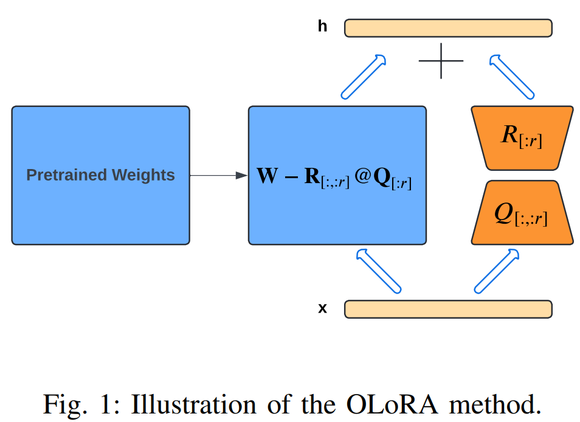
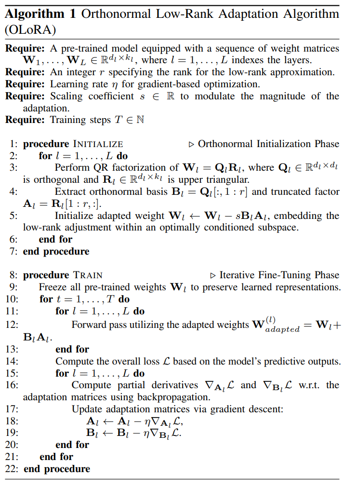
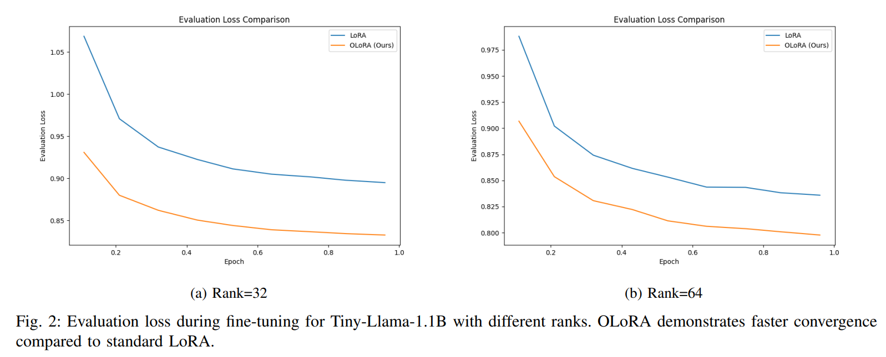
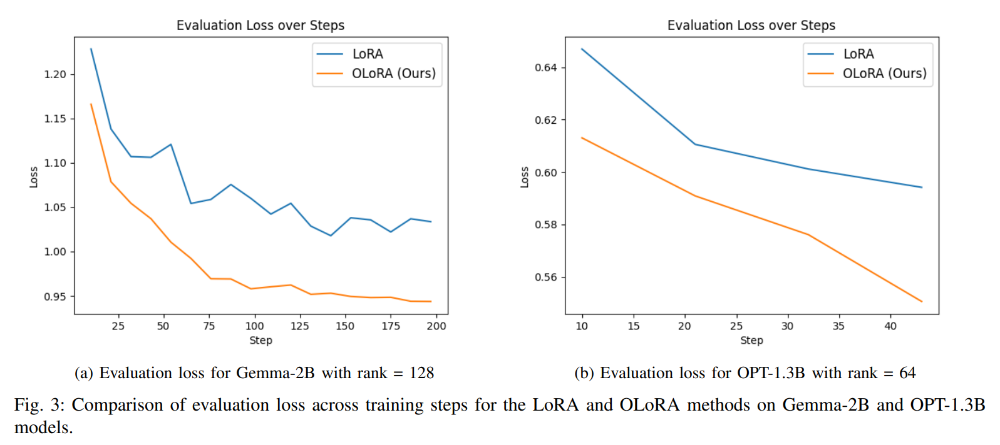
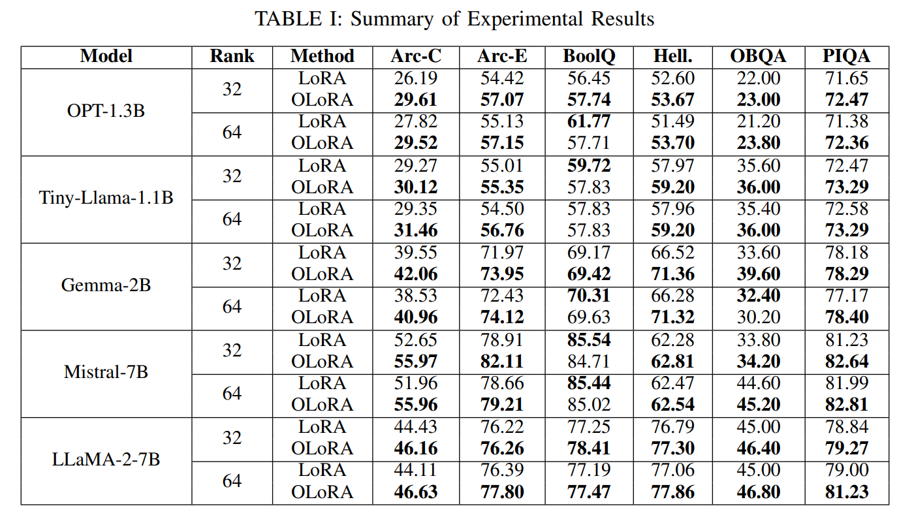

논문 및 이미지 출처 : <https://arxiv.org/pdf/2406.01775>

# Abstract

Large Language Models (LLMs)의 발전은 NLP 에서 혁신을 일으키며, 인간과 유사한 텍스트 이해와 생성을 가능하게 했다. 그러나 이 모델들을 fine-tuning 하는 데 필요한 계산 비용과 수렴 시간은 여전히 큰 도전 과제로 남아 있다. 

Low-Rank Adaptation (LoRA) 는 적은 수의 trainable parameters 로 efficient fine-tuning 기법을 제공하며 이러한 문제를 완화하는 유망한 방법으로 떠올랐다. 

본 논문에서는 LoRA 를 개선한 Orthonormal Low-Rank Adaptation (OLoRA) 를 소개한다. 

- OLoRA 는 QR decomposition 을 통해 orthonormal matrix initialization 을 도입하여 LLM 학습의 수렴을 가속화하면서도 LoRA 의 효율성(e.g., trainable parameters 수와 GPU 메모리 사용량)이라는 이점을 유지한다. 
- 실험 결과 OLoRA 는 수렴 속도뿐만 아니라 성능 면에서도 기존 LoRA 대비 향상된 결과를 보였다. 

이러한 발전은 보다 효율적이고 접근 가능한 LLM fine-tuning 가능성을 열어, 자연어 응용 분야에서의 폭넓은 채택과 혁신을 촉진할 수 있다.

# I. Introduction

Large Language Models (LLMs)은 방대한 text corpus 에서 복잡한 언어 패턴을 학습하는 능력으로 NLP 를 혁신해왔다.

GPT-3, BERT 같은 모델들은 다양한 NLP 작업에서 놀라운 범용성을 보여주었다. 그러나 이러한 대규모 모델을 특정 downstream application 에 맞게 적응시키는 것은 방대한 parameter 수로 인해 상당한 계산 자원을 요구하며 큰 도전 과제로 남아 있다.

이러한 계산 병목 문제는 parameter-efficient fine-tuning 기법에 대한 관심을 촉발했다. 

이러한 기법은 모델의 parameters 중 일부만 수정하여 대다수의 pre-trained weights 를 고정시키는 방식으로 새로운 작업에 모델을 적응시킨다. 

Low-Rank Adaptation (LoRA) 는 이 분야에서 두드러진 접근법으로, LLM 의 self-attention 및 feed-forward layers 에 low-rank matrices 를 삽입하여 parameter 사용량을 줄이면서도 경쟁력 있는 성능을 달성했다.  

LoRA 의 성공에도 불구하고, 여전히 수렴 속도와 최적화 안정성 측면에서 제한이 존재한다.

최근 연구에서는 LoRA 를 개선하기 위해 다양한 확장을 탐구해왔다. 

- 예를 들어, decoupled weight decay regularizer 를 사용하는 LoRA (DoRA), 
- adaptation matrices 의 구조를 수정한 LoRA+, 
- 그리고 메모리 사용량을 줄이고 학습 속도를 높이기 위한 quantized LoRA (QLoRA) 등이 있다.  

본 논문에서는 Orthonormal Low-Rank Adaptation (OLoRA) 라는 새로운 방법을 제안한다. 

OLoRA 는 LoRA 에서 사용하는 adaptation matrices 에 orthonormal initialization 을 도입하여 이를 개선한 기법이다. 

저자는 orthonormality 를 적용함으로써 더 나은 optimization landscape 를 제공하고, fine-tuning 과정에서 수렴을 가속화하고 안정성을 향상시킬 수 있다고 가정한다.

# II. Related Work  

## A. Adapter-Based Methods

Adapter-based methods 는 LLM 구조에 task-specific modules 를 삽입하는 방식으로 모델을 적응시킨다. 

이 모듈들은 fixed pre-trained weights 와 함께 학습되어 적은 trainable parameters 로 적응을 가능하게 한다. 

bottleneck adapters 나 parallel adapters 등 다양한 adapter 설계가 제안되었으며, 이는 parameter 효율성과 task 성능 간의 다양한 trade-off 를 제공한다.

## B. Low-Rank Factorization Techniques

Low-rank factorization techniques 는 fine-tuning 시 weight updates 가 주로 low-rank subspace 에 존재한다는 관찰을 기반으로 한다. 이는 compact representation 으로 적응에 필요한 핵심적인 변화를 효과적으로 포착할 수 있음을 시사한다.

Low-Rank Adaptation (LoRA) 는 이러한 접근법의 대표적인 예로, transformer-based LLM 의 self-attention 및 feed-forward networks 에 low-rank updates 를 삽입한다. 

LoRA 는 pre-trained weight matrix $W_0 \in \mathbb{R}^{d \times k}$ 의 변화를 low-rank decomposition 으로 캡처한다:  

$$
\begin{equation}
    W_0 + \Delta W = W_0 + BA,
\end{equation}
$$

여기서 $B \in \mathbb{R}^{d \times r}$, $A \in \mathbb{R}^{r \times k}$, 그리고 $r \ll \min(d, k)$ 이다. 

여기서 $W_0$ 는 고정되며, $A$ 와 $B$ 가 trainable adaptation matrices 이다. 따라서 adapted layer 의 forward pass 는 다음과 같이 수정된다:  

$$
\begin{equation}
    h = W_0x + \Delta Wx = W_0x + BAx.
\end{equation}
$$

일반적으로 adaptation matrix $A$ 는 Kaiming-uniform distribution 으로 초기화되며, $B$ 는 zero 로 초기화 된다.

low-rank update $\Delta W$ 는 보통 factor $\alpha / r$ 또는 $\alpha / \sqrt{r}$ 으로 scaling 함으로써 제어하며, 여기서 $\alpha$ 는 hyperparameter 이다.

이 scaling factor 는 adaptation 과정의 안정성과 수렴 특성에 영향을 끼친다.

LoRA 는 다음과 같은 이점을 제공한다:

- **Reduced Parameter Count**: 전체 fine-tuning 대비 훨씬 적은 trainable parameters 로 가능하다.
- **Task Switching Efficiency**: task-specific $BA$ matrices 를 교체하여 빠른 적응이 가능하다.

## C. Our Contribution: OLoRA

LoRA 는 효율적인 LLM 적응에서 유망한 성과를 보였지만, 수렴 속도와 최적화 동작에서 개선할 수 있는 기회가 있다고 본다. 

본 논문에서는 Orthonormal Low-Rank Adaptation (OLoRA) 를 제시한다. 

이는 adaptation matrices 에 orthonormal initialization 을 도입하여 LoRA 를 향상시킨 새로운 방법이다. 

standard LoRA 는 $\Delta W$ 를 암묵적으로 근사하는 반면, OLoRA 는 final weight matrix $W$ 를 직접 근사한다. 

이는 Intrinsic SAID, Aghajanyan et al. [2020], PiSSA 등에서 parameter optimization 에서 intrinsic dimensionality 를 활용한 연구에서 영감을 받았다.

저자는 adaptation matrices 를 orthonormal bases 로 초기화하는 것이 더 잘 조건화된 optimization landscape 를 만들 수 있어, 수렴을 가속화하고 fine-tuning 과정의 안정성을 향상시킬 수 있다고 가정한다. 

또한, OLoRA 의 orthonormal 제약이 자연스러운 gradient descent 와 연결될 수 있음을 제안하며, 데이터에서 중요한 변동 방향을 포착하는 능력에 대해 이론적인 함의를 탐구한다.

# III Method

## A. Orthonormality in Neural Networks  

neural network 에서 orthonormality 는 optimization 및 generalization 에 대한 잠재적인 이점으로 인해 점점 더 많은 관심을 받고 있다. 

연구들에 따르면, orthonormal matrices 는 다음과 같은 이점을 제공할 수 있다:

- **Improved Gradient Flow**: Orthonormal matrices 는 backpropagation 동안 gradient 의 norm 을 유지하는 데 도움이 되며, 이는 특히 deep networks 에서 수렴을 방해할 수 있는 vanishing 또는 exploding gradients 문제를 완화한다.
- **Improved Optimization Landscape**: Orthonormal matrices 가 속한 orthogonal group 은 유리한 기하학적 성질을 지니고 있으며, 이는 더 잘 조건화된 optimization landscape 를 만들어 수렴 속도를 빠르게 하고, 더 넓은 범위의 parameter 값을 탐색하도록 유도함으로써 잠재적으로 더 나은 일반화를 이끌어낼 수 있다.  

## B. OLoRA: Orthonormal Low-Rank Adaptation

pre-trained weight matrix $W \in \mathbb{R}^{m \times n}$ 를 고려해보자. 여기서 $m$ 은 output dimension, $n$ 은 input dimension 이다. 

OLoRA 는 $W$ 를 low-rank subspace 내에서 적응시키면서 orthonormal basis 의 이점을 활용한다. 

적응 과정은 다음과 같이 공식적으로 설명할 수 있다.  

$W = QR$ 이 $W$ 의 QR decomposition 이라고 할 때, 여기서 $Q \in \mathbb{R}^{m \times m}$ 는 orthogonal matrix 이고, $R \in \mathbb{R}^{m \times n}$ 은 upper triangular matrix 이다. 

$W$ 의 rank-$r$ approximation 을 다음과 같이 정의한다:  

$$
\begin{equation}
    W_r = Q_r R_r,
\end{equation}
$$

여기서 $Q_r \in \mathbb{R}^{m \times r}$ 은 $Q$ 의 first $r$ columns 로 구성되고, $R_r \in \mathbb{R}^{r \times n}$ 은 $R$ 의 first $r$ rows 로 구성된다. 

그런 다음 pre-trained weight matrix $W$ 는 factor $s$ 로 scaling 된 low rank perturbation 을 적용하여 업데이트된다:  

$$
\begin{equation}
    W' = W - s Q_r R_r,
\end{equation}
$$

training 중에는 $Q_r$ 과 $R_r$ 가 fine-tuning 되며, pre-trained weight matrix $W$ 는 고정된다. 

최종적으로 적응된 weight matrix $W_{\text{adapted}}$ 는 다음과 같이 계산된다:  

$$
\begin{equation}
    W_{\text{adapted}} = W + Q_r R_r.
\end{equation}
$$

$Q_r$ 의 orthonormal initialization 은 $W$ 의 left singular vectors (i.e., $Q$ columns) 를 사용하여 이루어지며, 이는 적응이 잘 조건화된 subspace 내에서 이루어지도록 보장한다. 

이렇게 하면 training 중에 더 빠르게 수렴하고, 안정성이 향상될 수 있다. 또한, 적응을 low-rank subspace 에 한정함으로써 전체 weight matrix 를 fine-tuning 하는 것에 비해 trainable parameters 수가 크게 줄어든다. 

rank $r$ (hyperparameter)는 적응 능력과 parameter 효율성 간의 균형을 조절한다. OLoRA 적응 과정은 신경망의 각 target layer 에 독립적으로 적용된다. 

Adapted weight matrix 는 forward propagation 에 사용되며, backpropagation 동안 gradient 는 오직 adaptation matrices 에 대해서만 계산된다. 이는 pre-trained weights 에서 학습된 knowledge 를 보존하면서 efficient fine-tuning 이 가능하게 한다.

## C. Computational Complexity Analysis

parameter-efficient fine-tuning 방법에서 중요한 측면은 계산 오버헤드이다. 

OLoRA 의 orthonormal initialization 은 전체 훈련 과정에 비해 계산 비용이 거의 없음을 보인다.

### 1) QR Decomposition Overhe

OLoRA 의 주요 추가 계산은 initialization 동안 각 layer 마다 한 번 수행되는 thin QR decomposition 에서 발생한다. 

이 decomposition 은 adaptation matrices 를 위한 orthonormal basis 를 효율적으로 찾는다. 

주어진 weight matrix $W \in \mathbb{R}^{m \times n}$ 에 대해 desired rank $r$ (여기서 $r \ll \min(m, n)$) 에 대한 thin QR decomposition 의 계산 복잡도는 $O(mnr)$ 이다.  

### 2) Amortized Analysis and Practical Implications  

QR decomposition 에는 계산 비용이 발생하지만, 이를 training LLMs 의 더 넓은 맥락에서 고려하는 것이 중요하다. 

LLM training 은 계산 집약적인 과정으로, 종종 특수한 하드웨어에서 수많은 시간 또는 며칠을 요구한다.

중요하게도, OLoRA 의 QR decomposition 은 각 layer 마다 초기화 동안 한 번만 수행된다. 반면, 훈련 과정의 핵심인 forward 및 backward pass 는 훈련의 각 step 과 epoch 마다 반복적으로 발생한다.  

따라서 QR decomposition 의 계산 비용은 training 의 많은 반복을 통해 빠르게 상쇄된다. 

training epoch 수가 증가함에 따라 이 initialization overhead 가 전체 계산 부담에 미치는 상대적 기여는 상당히 줄어든다.

이러한 상쇄 효과는 QR decomposition step 의 포함이 OLoRA 의 실제 효율성에 방해가 되지 않음을 보장하며, 특히 LLM large-scale adaptation 에 적용될 때 그 효율성을 유지한다.

# IV. Algorithmic Representation

OLoRA adaptation process 는 다음 pseudocode 로 나타날 수 있다:

## A. Theoretical Implications

OLoRA 의 orthonormal matrices 를 사용한 low-rank adaptation 은 몇 가지 이론적 장점이 있을 수 있으며, 이는 OLoRA 의 경험적 성공에 기여할 수 있다. 

이러한 가설을 확인하기 위한 추가 연구가 필요하다.  

### 1) Preservation of Spectral Properties

저자는 OLoRA 의 QR decomposition 이 original weight matrix $W$ 의 spectral properties 를 부분적으로 보존한다고 가정한다. 

$Q$ 가 orthogonal matrix 이므로, rank-$r$ approximation 인 $Q_r R_r$ 의 singular value 은 $W$ 의 singular value 의 부분집합이 된다. 

이러한 보존은 adaptation 동안 pre-trained model 의 안정성과 표현 능력을 유지하는 데 유리할 수 있다. 

original singular vaules 의 일부를 유지함으로써, OLoRA 는 model pre-training 동안 학습된 복잡한 함수들을 표현하는 능력이 급격히 변화하지 않도록 보장한다. 

이는 복잡한 표현을 학습한 LLMs 를 적응시킬 때 특히 중요하다.  

### 2) Inductive Bias for Generalization

저자는 adaptation 을 orthonormal bases 로 span 되는 low-rank subspace 로 제한하는 것이 OLoRA 에 structural inductive bias 를 도입한다고 본다. 

이 bias 는 fine-tuning 동안 데이터의 가장 중요한 변동 방향을 모델이 우선시하도록 유도한다. 

모델의 유연성을 제한함으로써, OLoRA 는 generalization 을 촉진하고 training data 에 overfitting 되는 위험을 줄인다. 

low-rank constraint 는 regularization 의 형태로 작용하며, adapted weights 가 pre-trained weights 에서 지나치게 벗어나지 않도록 방지하여, pre-training 동안 학습된 knowledge 를 보존하면서도 downstream task 에 효과적으로 적응할 수 있게 한다. 

OLoRA 와 이러한 관련 기법 간의 정확한 상호작용에 대한 추가 연구는 중요한 통찰을 제공하고 LLM 적응의 향상을 이끌어낼 수 있다.

# V. Experimental Setup

OLoRA 의 효과를 엄밀하게 평가하기 위해, 여러 language modeling task 에 대해 OLoRA 와 standard LoRA 방법 의 성능을 비교하는 일련의 실험을 수행했다. 

저자는 공정하고 일관된 비교를 보장하기 위해 LLM Adapters framework 에서 사용된 실험 방법론을 따랐다.  

## A. Models and Tasks

저자는 여러 공개된 LLM 모델들에서 OLoRA 와 LoRA 의 성능을 평가했으며, 다양한 모델 크기와 아키텍처를 포함한다:

- **Mistral-7B**: 최근 고성능의 decoder-only LLM.  
- **LLaMA-2-7B**: Meta AI 의 널리 사용되는 7-billion parameter model.  
- **Tiny Llama-1.1B**: 리소스가 제한된 환경을 위해 설계된 LLaMA 모델의 작은 변형.  
- **Gemma-2B**: 20억 파라미터 decoder-only LLM으로, 방대한 텍스트와 코드 데이터셋에서 학습됨.  
- **OPT-1.3B**: Meta AI 의 1.3-billion parameter decoder-only model.  

OLoRA 의 적응 능력을 다양한 NLP 작업에 대해 평가하기 위해, Common Sense Reasoning benchmark 에서 6 benchmark dataset  선택:

- **Arc-Challenge (Arc-C)**: 상식 추론을 요구하는 다지선다형 질문 답변 데이터셋.  
- **Arc-Easy (Arc-E)**: Arc 데이터셋의 더 간단한 하위집합.
- **BoolQ**: 예/아니오 질문 답변 작업.  
- **HellaSwag (Hell.)**: 상식적 추론을 평가하는 다지선다형 작업.  
- **OpenBookQA (OBQA)**: 초등학교 과학 지식을 바탕으로 한 질문 답변 작업.  
- **Physical IQA (PIQA)**: 물리적 상식 추론을 요구하는 다지선다형 작업.

## B. Datasets  

일관된 실험 조건을 보장하기 위해, 저자는 smaller models (Tiny Llama-1.1B, Gemma-2B, OPT-1.3B) training 시 Hu et al. [2023] 의 방법을 따랐다. 

저자는 약 50,000 questions 로 구성된 Common Sense Reasoning dataset 의 하위집합을 사용했다.

larger models (Mistral-7B, LLaMA-2-7B)에 대해서는 약 50,000 instructions 를 포함하는 Alpaca dataset 을 사용했다. 이 dataset 은 instruction-following 에 중점을 두고 있어 이러한 대규모 모델들의 능력에 적합하다.  

## C. Hyperparameter Settings

- **Rank (r)**: LoRA rank hyperparameter 의 효과를 조사하며, $r \in \{32, 64\}$ 값을 실험했다.  
- **LoRA Scaling Factor (α)**: 표준 관행에 따라, LoRA scaling factor $α$ 는 16 으로 설정했다.  
- **Learning Rate (η)**: OLoRA 는 일반적으로 standard LoRA 보다 higher learning rates 에서 더 좋은 성능을 보였다. 공정한 비교를 위해 모든 실험에서 learning rate η 를 $3 \times 10^{-4}$ 로 고정했다.
- **Training Epochs**: 모델은 한 번의 epoch 동안 훈련되었다.
- **Lora Dropout**: adaptation matrices 에 0.05 의 dropout 을 적용했다.  

## D. Computational Resources and Optimization  

모든 실험은 4x NVIDIA L4 GPU 에서 수행되었다. 

모든 훈련 실행에서는 AdamW optimizer 를 사용했으며, weight decay 는 0.1 로 설정했다.

# VI. Results and Discussion

OLoRA 의 성능을 standard LoRA 방법과 다양한 LLMs 및 downstream task 에 대해 평가했다. 

주요 평가지표는 각 작업에 대한 평가 손실로, 이는 모델이 unseen data 에 대해 일반화할 수 있는 능력을 반영한다.

또한, 수렴 속도를 조사하여 각 방법이 주어진 성능 수준에 도달하는 속도를 비교했다.

## A. Evaluation Loss and Convergence Speed

Fig. 2, 3 은 각각 Tiny-Llama-1.1B, Gemma-2B model 과 OPT-1.3B model 에 대해 두 방법의 evaluation loss curves 를 보여준다. 

두 model 과 rank setting 에 걸쳐, OLoRA 는 standard LoRA 에 비해 일관되게 더 빠른 수렴을 보였다. 이는 훈련 초기 epoch 에서 evaluation loss 이 급격히 감소하는 것으로 확인된다.

## B. Final Performance Comparison

Tab. I 는 모든 model 과 dataset 에 대해 두 방법이 달성한 최종 성능을 나타낸다. 

볼드체는 각 모델-task-rank 조합에서 더 좋은 성능을 보인 방법을 나타낸다. 결과를 살펴보면 몇 가지 주요 트렌드를 확인할 수 있다:

1) **OLoRA’s General Superiority**: 대부분의 경우(60 model-task-rank 조합 중 53), OLoRA 가 standard LoRA 보다 더 높은 최종 성능을 달성했다. 이는 OLoRA 의 orthonormal initialization 이 적응 과정을 효과적으로 유도하여 model 이 unseen data 에 대해 더 잘 일반화된다는 것을 시사한다.

2) **Rank-Dependent Performance**: OLoRA 가 LoRA 에 비해 성능 우위를 보이는 것이 항상 일관되게 나타나지는 않았다. OLoRA 는 일반적으로 rank 64 에서 더 나은 성능을 보였지만, 일부 경우에는 LoRA 가 비슷하거나 조금 더 나은 성능을 보였다. 이는 OLoRA 와 LoRA 의 상대적인 성능에 미치는 rank 의 영향이 작업이나 모델에 따라 달라질 수 있음을 나타낸다.

3) **Task-Specific Variations**: OLoRA 가 전반적으로 좋은 성능을 보였지만, 그 성능 우위는 작업에 따라 달라졌다. BoolQ task 에서는 LoRA 가 특히 low rank 설정에서 OLoRA 를 초과하는 경우가 있었다. 이는 OLoRA 의 효과가 작업에 따라 다를 수 있음을 시사하며, 특정 작업에서는 standard LoRA 접근법이 더 효과적일 수 있음을 보여준다.

4) **Model Size Influence**: model size 와 관련된 명확한 패턴은 없었다. OLoRA 는 smaller model (Tiny-Llama-1.1B, Gemma-2B)과 larger model (Mistral-7B, LLaMA-2-7B) 모두에서 강력한 성능 향상을 보였다.

우리의 연구 결과는 OLoRA 가 표준 LoRA 방법보다 일관되게 성능 개선을 보였으며, 대부분의 테스트된 설정에서 우수한 결과를 달성했다는 것을 나타낸다.

# VII. Conclusion

본 논문에서는 Orthonormal Low-Rank Adaptation (OLoRA) 를 소개했다. 이는 QR decomposition 을 통한 orthonormal initialization 의 힘을 활용하는 새로운 parameter-efficient fine-tuning 방법이다. OLoRA 는 기존의 LoRA 기법의 강점을 기반으로 하면서도 수렴 속도에서의 한계를 해결한다.

다양한 LLM 모델 5개와 6개의 NLP 벤치마크에 걸친 광범위한 실험적 평가를 통해 OLoRA 의 효과를 입증했다. 결과는 일관되게 OLoRA 가 LLM fine-tuning 의 수렴 속도를 크게 가속화하며, 종종 standard LoRA 보다 우수한 최종 성능을 달성한다는 것을 보여준다. 이는 OLoRA 의 orthonormal initialization 이 더 빠른 훈련을 촉진할 뿐만 아니라, 적응 과정을 더 유리한 parameter space 로 유도하여 unseen data 에 대해 더 잘 일반화되는 모델을 만든다는 것을 시사한다.

OLoRA 의 이점은 original weight matrix 의 주요 spectral properties 를 보존하는 능력에 뿌리를 두고 있을 가능성이 크다. adaptation matrices 를 orthonormal subspace 내에서 초기화함으로써 OLoRA 는 pre-trained model 에서 상속된 안정성 및 표현 능력을 유지한다. 또한, 내재된 low-rank constraint 는 regularization 의 역할을 하여 일반화를 촉진하고 over-fitting 의 위험을 줄인다.

결론적으로 OLoRA 는 parameter-efficient fine-tuning 을 위한 유망한 접근법을 제시하며, 실용적인 이점과 이론적 통찰을 제공한다. 수렴 가속화와 성능 향상 능력 덕분에 LLM 적응을 위한 도구 키트에서 중요한 기여를 하며, 이 강력한 모델들을 다양한 실제 응용 프로그램에서 더 쉽게 효율적으로 배포할 수 있는 길을 열어준다.