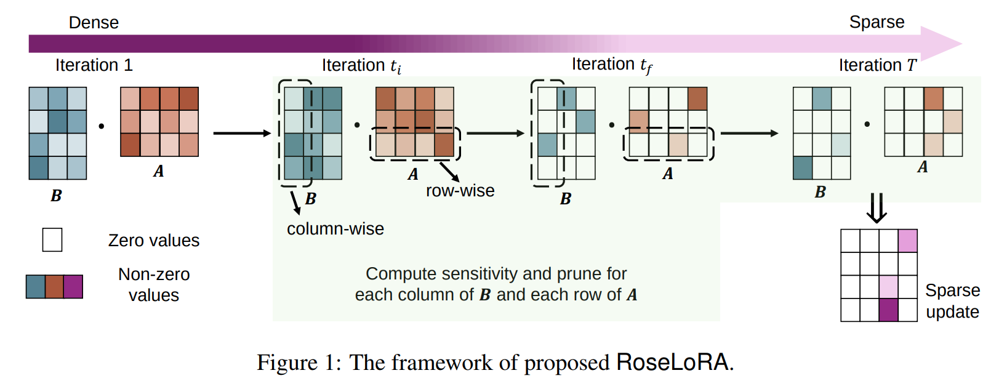
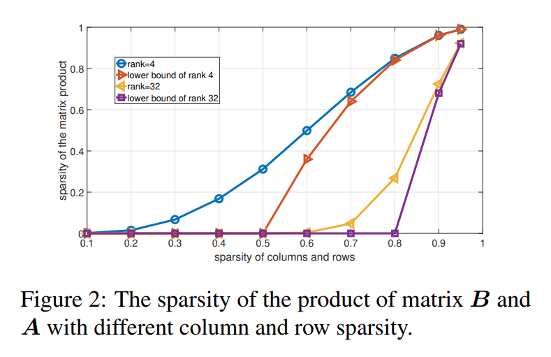
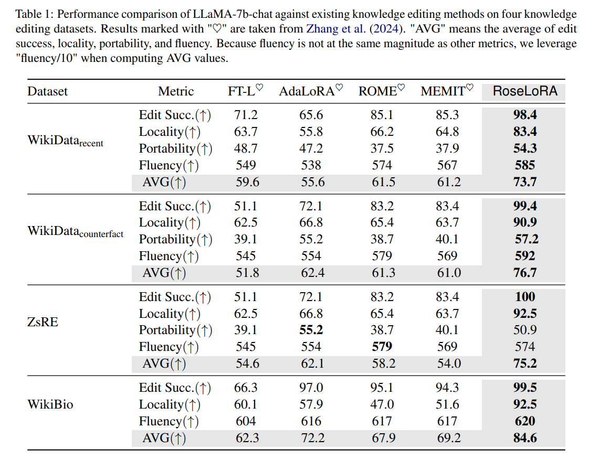
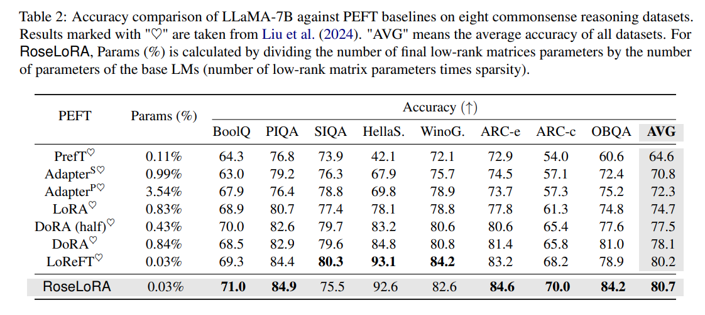
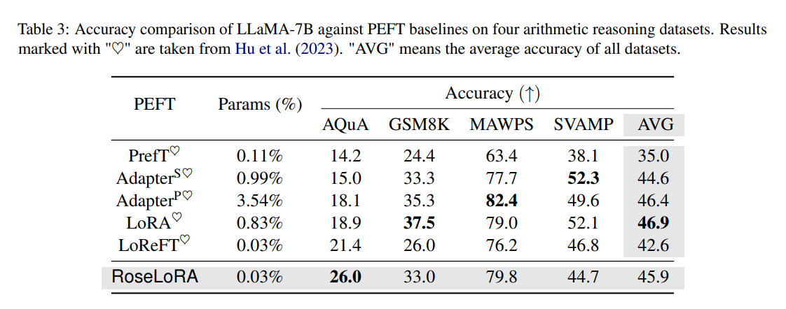
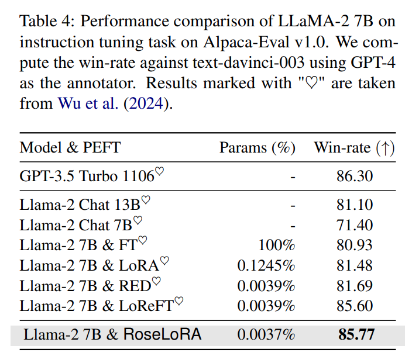
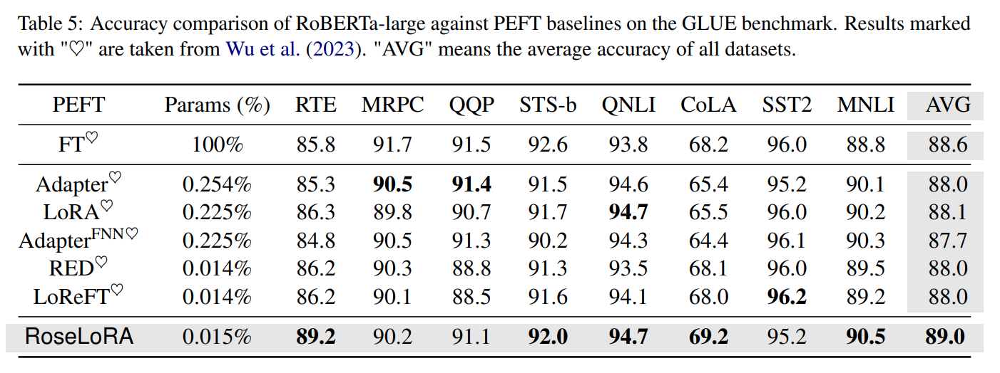
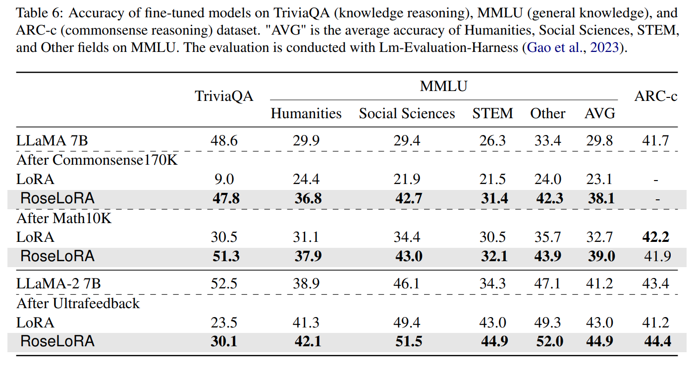
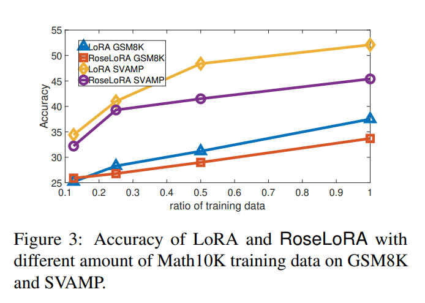

논문 및 이미지 출처 : <https://aclanthology.org/2024.emnlp-main.57.pdf>

# Abstract

large-scale corpora 에 훈련된 Pre-trained language models 은 다양한 NLP tasks 에서 strong generalizability 을 보여준다.

특정 tasks 에 대해 이러한 모델들을 Finetuning 하는건 일반적으로 all parameters update 가 동반되며, 이는 자원 집약적이다. 

Parameter-efficient finetuning (PEFT) 방법, 예컨대 널리 쓰이는 LoRA 계열은 일부 parameters 만 효율적으로 학습하기 위해 low-rank matrices 를 도입한다. 

그러나 inference 시, 이들 matrices 의 product 가 all pre-trained parameters 를 업데이트하므로, 특정 부분만 교체해야 하는 knowledge editing 같은 작업에서 복잡함이 생긴다. 

저자는 이 문제를 해결하기 위해, row 와 column-wise sparse low-rank adaptation(RoseLoRA)이라는 새로운 PEFT 방법을 제안한다. 

- RoseLoRA 는 specific task 에 important parameters 만 식별하고 업데이트하여, 효율성을 유지하면서 다른 model knowledge 를 보존한다. 
- low-rank matrices 의 product 에 sparsity constraint 를 추가하고, 이를 row 와 column-wise sparsity 로 전환함으로써, model update 를 효율적이면서도 정확하게 만든다. 
- 저자의 이론적 분석은 matrix product 에 대한 sparsity 의 하한을 보장한다. 
- 5 benchmarks 에 걸쳐 20 datasets 에서 수행된 광범위한 실험 결과, RoseLoRA 는 일반적인 fine-tuning 과 knowledge editing 작업 모두에서 기존 방법들을 능가하는 성능을 보인다.

# 1. Introduction

Pre-trained language models, general-domain corpora 에서 학습된 모델들은, natural language understanding 이나 generation 등 다양한 NLP tasks 에서 robust generalization 능력을 보인다. 그러나 이러한 pre-trained models 를 specific downstream tasks 에 추가로 맞추기 위해서는 보통 all parameters 를 업데이트하는 fine-tuning 이 필요한데0, 이는 종종 매우 많은 자원이 든다.

이 문제를 해결하기 위해, parameter-efficient fine-tuning(PEFT) 기법들이 제안되었다. 이 기법들은 small learnable parameters 를 새로 도입하고, fine-tuning 시에 해당 lightweight parameters 만 업데이트한다. 

현재 가장 널리 쓰이는 방법 중 하나인 LoRA 계열은 small parameters 로도 높은 효율성과 좋은 성능을 보여왔다. 개념적으로, LoRA 계열은 model weights 에 new low-rank matrices 를 추가하여 fine-tuning 을 수행한다. 

Adapter 같은 다른 PEFT 방법과 달리, LoRA 계열은 model architecture 를 수정하지 않아 적용이 용이하다.

LoRA 계열은 commonsense reasoning 와 arithmetic reasoning 처럼 model 이 internal knowledge 를 명시적으로 수정할 필요 없이, 텍스트를 이해하고 생성하는 능력에 주로 의존하는 task 에서 눈에 띄는 성능을 보여왔다. 하지만, 어떤 tasks 는 internal knowledge 를 업데이트해야 하는 경우가 있다. 

예컨대 knowledge editing 에서는, language model 이 new provided knowledge 를 반영하면서 동시에 existing knowledge 를 보존해야 한다. 

이런 task 에서는 LoRA 계열이 제공하는 제어 범위가 다소 거칠어, 한계가 존재한다. 구체적으로, LoRA 계열이 도입하는 low-rank matrices product 는 dense 한 형태의 matrix 이고, inference 시에는 이를 pre-trained model weights 에 더하므로 실제로 all pre-trained parameters 가 업데이트된다. 

그 결과, specific internal knowledge 만 선택적으로 수정하기가 어렵다. 이는 **“language model internal knowledge 를 편집하는 데 효과적인 PEFT 방법이 있을까?”** 라는 자연스러운 질문으로 이어진다.

이 질문에 답하기 위해, 저자는 row 와 column-wise sparse low-rank adaptation (RoseLoRA) 이라는 새로운 방법을 제안한다. 

핵심 아이디어는 specific task 에 중요하고 영향력 있는 model parameters 만 찾아 업데이트함으로써, 굳이 수정할 필요가 없는 다른 지식들은 보존하면서 효과적으로 모델을 업데이트할 수 있다는 것이다. 

- 구체적으로, RoseLoRA 는 LoRA structure 를 계승해 parameter-efficient 한 fine-tuning 을 가능케 한다. 
- 그리고 important parameters 만 선별하기 위해, low-rank matrices product 에 대해 sparsity constraint ($ℓ_0$ norm)을 부과한다. 
- 다만 이는 간단히 최적화할 수 없는 문제이다. $ℓ_0$ norm constraint 는 pruning 에서 활발히 연구되어 왔지만, 그 연구들은 보통 각 low-rank matrix 에 대해서만 sparsity 를 부과하기 때문에, two matrices product 자체가 sparse 해지는지를 보장하지 못한다. 
- 이를 해결하기 위해, 저자는 original sparsity constraint 를 row-wise 와 column-wise 의 sparsity constraint 로 전환하여 두 low-rank matrices (i.e., $B$, $A$) 에 적용한다. 그리고 two matrices product 의 sparsity 에 대한 이론적 하한을 제시한다. 
- 또한, sensitivity-based importance score 를 사용해 row 와 column-wise sparsity constraint 를 점진적으로 해결하는 방법을 제안한다.

---

knowledge editing 외에도, 제안하는 RoseLoRA 는 commonsense 와 arithmetic reasoning, instruction following, natural language understanding 같은 general tasks 에도 적용 가능하다. 

RoseLoRA 는 model 에서 few most important parameters 를 row 혹은 column-wise sparsity 로 업데이트하여, fewer modified parameters 로도 LoRA 성능에 맞먹거나 능가하는 결과를 낼 수 있다.

요약하자면, 저자의 기여는 다음과 같다.  

1) RoseLoRA 라는 새로운 PEFT 방법을 제안한다. 이는 task 에 중요한 parameters 만 탐지해 최적화함으로써, 정밀하고 효율적인 모델 업데이트를 수행하면서 기존 기법보다 변경 파라미터 수를 줄일 수 있다.
2) two low-rank matrices product 에 대한 sparsity 를 제어하기 위해, row 와 column-wise sparsity constraint 를 제안하고, RoseLoRA 의 sparsity 에 대한 이론적 lower bound 를 제시한다.  
3) 5 benchmarks, 20 hdatasets 를 대상으로 광범위한 실험을 수행한 결과, RoseLoRA 는 일반 fine-tuning 과 knowledge editing tasks 모두에서 기존 기법보다 우수한 성능을 보임을 확인했다.

# 2. Related Works

이 섹션에서는 관련 연구들을 간략히 살펴본다.

## 2.1 Parameter Efficient Fine-Tuning (PEFT)

PEFT 는 pre-trained large language models (LLMs) 에 small trainable parameters 를 주입함으로써, downstream task 에 model 을 맞추도록 한다. 

- Prefix Tuning 은 soft tokens 를 input 앞에 덧붙이고, original parameters 는 고정한 채 이들 continuous embeddings 만 학습한다. 
- 반면 Adapter 는 transformer blocks 에 small bottleneck neural network module 을 삽입한다.
- 세 번째 패러다임인 LoRA 및 variants 은 low-rank matrices 를 학습해 original model weights 의 updates 를 근사하며, SOTA 를 달성해왔다. 
  - 최근 ReFT 는 model weights 대신 model representation 에 대해 low-rank updates 를 학습하여 LoRA 에 필적하는 성능을 훨씬 fewer parameters 로 달성한다. 
  - 그러나 그 내재적 가정인  linear representation hypothesis 가 항상 유효하지 않을 수 있어, generalization ability 을 크게 저해한다. 
  - 이 연구에서는 model weights 에 대해 sparse 이면서 low-rank updates 를 학습하는 효과적인 방법을 제안하며, ReFT 와 비슷한 소수 파라미터로 더 뛰어난 성능을 시현한다.
  - 최근 연구(AdaLoRA, SoRA 등)는 LoRA 에 pruning 을 적용해 계산 효율을 높였다. 그러나 제안하는 RoseLoRA 는 이러한 방법들과는 크게 다르다. 이들 기존 연구는 model updates 의 rank 를 제어하기 위해 pruning 을 적용하지만, 여전히 all parameters 가 dense 하게 영향을 받아, RoseLoRA 처럼 정교한 업데이트를 제공하지 못한다.

## 2.2 Knowledge Editing

Knowledge editing 은 pre-traine LLM 내 오래되거나 틀린 지식을 최신 상태로 갱신하면서, existing knowledge 를 동시에 보존해야 하는 문제이다. 

초기 시도들은 parameters 를 직접 fine-tuning 했으나, original knowledge 를 심각하게 잊어버리는 문제가 있었다. 보다 정교한 편집을 위해서는 minimal parameters 만 업데이트해야 하고, 이는 sparse parameter updates 를 요구하지만 NP-hard 문제이다. 

이를 우회하기 위해, Zhu et al. (2020) 은 relaxed $L_2$ norm constraint 를 도입했으며, Huang et al. (2023); Dong et al. (2022)는 FFN layers 만 업데이트하도록 제한했다. 이는 learned knowledge 이 주로 FFN 레이어에 저장된다는 발견(Dai et al., 2021)에 기인한다.

더 나아가, locate-and-edit 패러다임은 specific knowledge 을 stored layers 를 찾아 그 parameters 만 수정한다. 하지만 (Hase et al., 2024) 는 located layers 가 아닌 다른 layers 를 업데이트해도 경쟁력 있는 편집 성능이 가능함을 보여, 이 layer 찾아내는 과정에 드는 추가 비용이 편집 효용을 얼마나 높이는지 의문을 제기했다.

대안으로, original parameters 를 수정하지 않고 외부 메모리에 새 지식을 저장하는 접근 (MEND, IKE, SERAC)도 있다. 하지만 이 방법들은 (e.g., IKE) 접근이 어려운 특정 데이터가 필요하거나 (e.g., MEND, SERAC) 추가 모델 학습이 필요해 실용성이 떨어진다. 

최근에는 LoRA 를 knowledge editing 에 적용한 연구도 있으나 (Wu et al., 2023), 이 방법들에는 앞서 언급한 sparsity 보장이 없어, 성능이 만족스럽지 않다(Zhang et al., 2024).

# 3 Preliminary

이 절에서는 먼저 low-rank adaptation(LoRA) 를 간단히 소개하고, 이어서 importance-aware pruning 을 간단히 설명한다.

## 3.1 Low-rank Adaptation

LoRA 는 pre-trained language models 의 efficient incremental update 를 two learnable low-rank matrices product 로 modeling 한다. 

구체적으로, modified weight $W$ 는 다음과 같이 표현된다:

$$
\begin{equation}
    W = W^o + \Delta = W^o + BA,
\end{equation}
$$

여기서 $W^o, \Delta \in \mathbb{R}^{d_1 \times d_2}$ 는 각각 pre-trained weight matrix 와 updated matrix 이며, $A \in \mathbb{R}^{r \times d_2}$, $B \in \mathbb{R}^{d_1 \times r}$ 이고 $r \ll \min\{d_1, d_2\}$ 이다.

fine-tuning 과정에서, pre-trained weight $W^o$ 는 freezing 하고 lightweight matrices $A$ 및 $B$ 만 업데이트한다. 

이는 다음과 같이 표현할 수 있다:

$$
\begin{equation}
    \min_{A,B} \mathcal{L}\bigl(\mathcal{D};W^o + BA\bigr),
\end{equation}
$$

여기서 $\mathcal{D}$ 는 training dataset 이다.

## 3.2 Sensitivity-based Importance Score for Pruning

importance-aware pruning 은 estimated importance scores 에 따라, 모델의 redundant model weights 를 zero 로 설정함으로써 parameters 를 선택적으로 제거하는 방법이다. 

high importance scores 의 parameters 는 남기고, 그렇지 않은 parameters 는 0 로 만든다. 이때 commonly used 한 importance metric 인 sensitivity 는, 특정 파라미터를 zero 로 만들었을 때의 training loss 변화를 근사적으로 측정한다. 

구체적으로, weight $W_{ij}$ 에 대한 sensitivity 는 해당 weight 와 gradient 의 product 로 정의된다:

$$
\begin{equation}
    I(W_{ij}) = \bigl|W_{ij} \cdot \nabla_{W_{ij}} \mathcal{L} \bigr|.
\end{equation}
$$

$t$-th iteration 에서, current mini-batch 기반으로 계산된 sensitivity 를 $I^{(t)}$ 라고 할 때, Zhang et al. (2022) smoothing 을 위해 exponential moving average 사용할 것을 제안했다:

$$
\begin{equation}
    \bar{I}^{(t)}(W_{ij}) = \beta\bar{I}^{(t-1)}(W_{ij}) + (1-\beta)I^{(t)},
\end{equation}
$$

여기서 $\beta$ 는 hyper-parameter 이다.

# 4 Methodology

selective updating 으로 pre-trained language model 을 efficient fine-tuning 하기 위해, 저자는 sparse adaptation 을 포함한 LoRA 스타일의 novel fine-tuning framework 인 RoseLoRA 를 제안한다. 

전반적인 구조는 Fig. 1 에 나타나 있다. 

저자는 two low-rank matrices 각각에 대해 row, column-wise sparsity constraints 를 도입한다. 

이를 통해, two low-rank matrices 의 sparsity lower bound 를 이론적으로 보장할 수 있음을 증명한다.

## 4.1 Row and Column-wise Sparse Low-rank Adaptation

모델이 training data 에 맞도록 minimal parameters 만 업데이트하면서, 수정할 필요가 없는 existing knowledge 를 최대한 보존하고자 한다. 

이를 위해, 널리 사용되며 성능이 검증된 LoRA 방법을 기반으로 아래와 같은 loss function 을 설정한다:

$$
\begin{equation}
    \begin{aligned}
        &\min_{A,B} \mathcal{L}\bigl(\mathcal{D};W^o + BA\bigr) \\
        &\text{s.t.}\quad \frac{\|BA\|_0}{d_1 d_2} \le\tau,
    \end{aligned}
\end{equation}
$$

- 여기서 $\tau$ 는 sparsity threshold 이다. 
- 하지만 Eq. (5) 는 다음과 같은 두 가지 어려움이 있다.  
1) $\ell_0$ optimization 자체가 NP-hard 이다. 이를 근사적으로 해결하기 위한 기법이 있지만, LoRA 처럼 complex product-based parameterization 에 직접 적용하기 어렵다. 예컨대 $BA$ 에서 어떤 항목이 0 이 되어야 하는지 안다고 해도, 실제로 $A$, $B$ 의 entries 를 어떻게 학습해야 하는지는 상당히 복잡하다.  
2) 단순히 $B$, $A$ 각각의 sparsity 를 제어한다고 해서, 그 product $BA$ 가 sparse 해진다는 보장이 없다. 이는 Example 1 에서도 설명한다.

#### Example 1.

$s(\cdot)$ 을 vector 또는 matrix 의 sparsity (i.e., zero entries 의 portion) 라고 하자.

sparse matrix $A = [a^\top; 0^{(r-1)\times d_2}]$ 및 $B = [b, 0^{d_1 \times (r-1)}]$, 여기서 $a$ 및 $b$ 는 non-zero entries 를 포함한다고 하자.

그러면 $s(A) = s(B) = \tfrac{r-1}{r}$ 로서 $r>1$ 일 때는 적당한 large sparsity 를 갖는다. 

그러나 $\text{s}(BA) = \text{s}(ba^\top) = 0$, i.e., 그 projduct 는 dense matrix 이다.

---

정리하자면, LoRA 에 sparsity 를 도입하는 것은 단순치 않다. 

이를 해결하기 위해, 저자는 $A$ 의 각 row 및 $B$ 의 각 column 의 sparsity 를 제어하기로 제안한다. 

이렇게 하면, $BA$ 의 sparsity 가 $s(A_{i*})$ 및 $s(B_{*i})$ 로부터 경계지어질 수 있다. 이에 대한 이론적 분석은 Proposition 1 에서 제시하고, 실험 결과를 Fig. 2 에서 보인다.

이를 바탕으로, Eq. (5) 의 optimization 문제를 다음과 같이 바꿀 수 있다.

$$
\begin{equation}
    \begin{aligned}
        &\min_{A,B} \mathcal{L}\bigl(\mathcal{D};W^o + BA\bigr) \\
        &\text{s.t.} \frac{\|A_{i*}\|_0}{d_2} \le \tau, \frac{\|B_{*i}\|_0}{d_1} \le \tau,\quad i=1,\dots,r.
    \end{aligned}
\end{equation}
$$

#### Proposition 1

$BA$ 의 sparsity 는 $\max\Bigl\{0,1+\sum_{i=1}^r\bigl(s(A_{i*})+s(B_{*i})-s(A_{i*})s(B_{*i})\bigr) - r\Bigr\}$ 와 동일하거나 더 크다.

## 4.2 Optimization

이제 Eq. (6) 의 optimization 문제를 어떻게 푸는지 설명한다. 

저자는 각 iteration 마다 $A$ 의 row 와 $B$ 의 column 을 sensitivity 기반으로 prune 한다. 

구체적으로, 먼저 $A$ 및 $B$ 와 관련하여 stochastic gradient decent 를 수행한다. i.e.,

$$
\begin{equation}
    \begin{aligned}
    \tilde{A}^{(t)} &= A^{(t)} - \nabla_{A^{(t)}}\mathcal{L}, \\
    \tilde{B}^{(t)} &= B^{(t)} - \nabla_{B^{(t)}}\mathcal{L},
    \end{aligned}
\end{equation}
$$

이후 Eq. (4) 를 바탕으로 sensitivity-based importance scores 를 추정한다. 

이 importance scores 를 바탕으로 $A$ 및 $B$ 를 다음과 같이 prune 한다.

$$
\begin{equation}
    \begin{aligned}
    A_{i*}^{(t+1)} &= \mathcal{T}_A\bigl(\tilde{A}^{(t)}_{i*},\bar{I}^{(t)}(A^{(t)}_{i*})\bigr),\\
    B_{*i}^{(t+1)} &= \mathcal{T}_B\bigl(\tilde{B}^{(t)}_{*i},\bar{I}^{(t)}(B^{(t)}_{*i})\bigr),
    \end{aligned}
\end{equation}
$$

$i=1,2,\dots,r$, 여기서 $\mathcal{T}_A$ 은 아래처럼 정의한다.

$$
(\mathcal{T}_A(\tilde{A}^{(t)}_{i*},\bar{I}^{(t)}(A^{(t)}_{i*})\bigl))_j
=
\begin{cases}
    \tilde{A}^{(t)}_{ij}, &  \bar{I}^{(t)}(A^{(t)}_{ij}) \text{ is top-}\tau^{(t)} \text{ in } \bar{I}^{(t)}(A^{(t)}_{i*}),\\
    0, & \text{otherwise},
\end{cases}
$$

$\mathcal{T}_B$ 도 유사하게 정의하며,

$$
(\mathcal{T}_B(\tilde{B}^{(t)}_{*i},\bar{I}^{(t)}(B^{(t)}_{*i})\bigl))_j
=
\begin{cases}
    \tilde{B}^{(t)}_{ji}, & \bar{I}^{(t)}(B^{(t)}_{ji}) \text{ is top-}\tau^{(t)} \text{ in } \bar{I}^{(t)}(B^{(t)}_{*i}),\\
    0, & \text{otherwise}.
\end{cases}
$$

여기서, $\tau^{(t)}$ 는 $t$-iteration 에 남겨둘 parameter 비율의 budget 이다. 

학습 안정성을 위해, $\tau^{(t)}$ 은 cubic strategy (Li et al., 2023c)에 따라 점진적으로 감소시킨다.

$$
\tau^{(t)} =
\begin{cases}
    1, & 1 \le t \le t_i,\\
    \tau + (1-\tau)\Bigl(1 - \frac{t-t_i}{t_f - t_i}\Bigr)^3, & t_i \le t \le t_f,\\
    \tau, & t_f \le t \le T,
\end{cases}
$$

여기서 $T$ 는 total training iterations 수, $t_i, t_f$ 는 hyper-parameters 이다.

# 5. Experiment

실험에서, 제안하는 RoseLoRA 를 평가하며 아래 질문들에 답한다.

- **RQ1)** RoseLoRA 는 knowledge editing tasks 에 어떻게 기여하는가?  
- **RQ2)** general tasks 에서 SOTA PEFT 방법들과 비교했을 때 RoseLoRA 는 어떠한 성능을 보이는가?  
- **RQ3)** model 이 existing knowledge 의 forgetting 을 RoseLoRA 는 완화하는가?  
- **RQ4)** training data 양이 달라질 때 성능에 어떤 변화가 있는가?

## 5.1 Datasets and Experiment Settings

#### Datasets.

저자는 5 benchmark 에서 실험을 수행한다:  

1) **Knowledge Editing**: WikiDatarecent, WikiDatacounterfact, ZsRE, WikiBio.  
2) **Commonsense Reasoning**: BoolQ, PIQA, SIQA, HellaSwag, WinoGrande, ARC-e, ARC-c, OBQA.  
3) **Arithmetic Reasoning**: AQuA, GSM8K, MAWPS, SVAMP.  
4) **Instruction Following**: Ultrafeedback 를 training data 로 사용하고, Alpaca-Eval v1.0 에서 평가한다.  
5) **Natural Language Understanding**: GLUE 의 8 dataset.

dataset, metrics, hyper-parameter 에 대한 자세한 내용은 부록을 참고한다.

#### Baselines.

저자의 baselines 는 task 기반으로 구성된다.

구체적으로, 각 task 에서 제안된 RoseLoRA 는 아래 domain 의 baselines 와 비교한다.

- **Knowledge Editing**: Zhang et al. (2024) 를 따라 AdaLoRA, ROME 와 FT-L, MEMIT 를 비교 대상으로 둔다. 이 방법들은 모두 추가 모델을 학습하거나 접근하기 어려운 데이터를 요구하지 않는다는 공통점이 RoseLoRA 와 유사하다. 
  
  AdaLoRA 는 LLM 의 unimportant weights 를 그대로 두어 효율적이고 정교하게 PEFT 를 달성한다. ROME 은 causal-tracing 으로 specific knowledge 을 저장한 레이어를 찾아 rank-one update 를 학습한다. FT-L 은 ROME 이 찾은 레이어를 직접 finetuning 하는 방식이다. MEMIT 은 ROME 을 확장하여, 대규모 편집을 더 효율적으로 수행하도록 했다.

- **Other four tasks**: Hu et al. (2023), Liu et al. (2024), Wu et al. (2024) 등의 선행연구를 따라 Prefix tuning, Adapters, LoRA 및 그 variants 변형(Hu et al., 2021; Zhang et al., 2023), ReFT (Wu et al., 2024) 등 대표적 PEFT 방법들과 비교한다.

## 5.2 Performance Comparison

#### Knowledge Editing

Knowledge editing task 를 수행할 때, low-rank matrices 에 additional norm constraint 를 도입하며 (부록 참조), 그 결과를 Tab. 1 에 정리했다(**RQ1**). 

- 이 표에서, 제안하는 RoseLoRA 는 평균 성능 기준으로 모든 최신 기법들을 능가하며, 가장 높은 edit 성공률과 existing knowledge 보존 능력을 보인다. 
- 또한, updated knowledge 로 올바르게 추론하는지 측정하는 portability score 에서도 RoseLoRA 가 우수한 일반화 능력을 보인다.

#### Commonsense Reasoning

Tab. 2 는 8 commonsense reasoning dataset 에 대한 결과를 요약한다(**RQ2**). 

- 이 표에 따르면 RoseLoRA 는 평균적으로 다른 최신 PEFT 방법들을 again 능가한다. 
- 8개 중 5개 데이터셋에서 1위를 차지했고, parameter 수는 LoReFT 와 동일하게 매우 작다 (PrefT, Adapter, LoRA, DoRA 에 비해 훨씬 적음)에도 불구하고 정확도가 더 높다. 이는, RoseLoRA 가 commonsense reasoning 에 중요한 LLaMA 의 파라미터만 정교하게 fine-tuning 한다는 점을 보여준다.

#### Arithmetic Reasoning

Tab. 3 은 4 arithmetic reasoning dataset 에 대한 결과(**RQ2**). 

- LoRA 가 4 dataset 평균 정확도에서 가장 높지만, 제안하는 RoseLoRA 도 거의 동일(약 97% 수준)한 정확도를 달성하면서 업데이트되는 파라미터 양은 LoRA 대비 22 배나 적다. 
- LoReFT 와 비교했을 때는 거의 비슷한 파라미터 수로 6.3% 더 나은 성능을 보인다.

#### Instruction Following

Tab. 4 는 instruction-following task 에서 RoseLoRA 와 baselines 의 성능을 보여준다. 

- Table 에서, RoseLoRA 는 fewest parameters 만 업데이트하면서도 모든 방법보다 우수한 성능을 보인다. 
- 게다가 instruction-following task 에서는 commonsense 나 arithmetic reasoning 태스크보다 fewer parameters update 로 충분함을 확인했다. 
- 이는 LLM 의 instruction-following 능력이 fewer parameter subset 에 의해 결정되는 것을 시사한다.

#### Natural Language Understanding

마지막으로, GLUE benchmark 에서(**RQ2**) 실험을 수행한 결과를 Tab. 5 에 제시한다. 

- 결과적으로, 제안하는 RoseLoRA 는 최신 기법들을 현저히 능가한다. 
- 최고 baseline 인 LoRA 는 평균 약 88.1 점(정확도)인데, RoseLoRA 는 89.0 점에 달한다. 
- RTE dataset 에서는 3.4% 의 성능 향상을 보였다. 
- full finetuning 과 비교해 봐도, RoseLoRA 가 오히려 더 나은 성능을 내는데, 이는 RoseLoRA 가 very fewer parameters 만 수정함으로써 natural language understanding task 에서 overfitting 을 방지했기 때문으로 추정된다. 
- 또한 RoseLoRA 는 decoder-only 모델뿐 아니라 encoder-only model 에도 적용 가능함을 시사한다.

## 5.3 Forgetting Test

이 절에서는 **RQ3**에 답하기 위해, fine-tuned model 이 pre-training 단계에서 learned knowledge 을 잊는지 여부를 살펴본다. 

공정한 비교를 위해, LoRA 와 RoseLoRA 를 각각 Commonsense170K, Ultrafeedback, Math10K 로 fine-tuning 한 뒤, zero-shot 설정에서 같은 프롬프트 템플릿을 사용해 평가했다. 그 결과를 Tab. 6 에 정리했다.

- Table 에 따르면, LoRA 와 비교했을 때, RoseLoRA 는 fine-tuning 이후에도 모델이 원래 알고 있던 지식을 더 많이 보존한다. 
- 예컨대, Commonsense170K dataset 으로 fine-tuning 한 뒤 LoRA 는 TriviaQA 와 MMLU 성능이 크게 하락했지만, 제안하는 RoseLoRA 는 LLaMA-2 의 원래 성능 90% 이상을 유지한다. 
- 또한 ARC-c dataset 에서는 LoRA, RoseLoRA 모두 양호한 성능을 보이는데, 이는 Commonsense170K, Ultrafeedback, Math10K 로 모델을 fine-tuning 해도 모델의 general knowledge 를 크게 잊지 않을 수 있음을 시사한다.

## 5.4 Sensitivity w.r.t. Training Data Size

이번에는 training data 양이 달라졌을 때 모델 성능이 어떻게 바뀌는지 살펴본다. 실험 결과는 Fig. 3 에 요약되어 있다. 

- 그림에서 확인할 수 있듯, training data 가 줄어들수록 LoRA 와 RoseLoRA 간 성능 격차는 작아지는 경향을 보인다. 
- 특히, Math10K data 의 12.5% 만 학습에 사용해 LLaMA 7B 를 fine-tuning 했을 때는, RoseLoRA 가 GSM8K 성능에서 LoRA 를 앞선다. 
- 결론적으로, 제안하는 RoseLoRA 는 적은 데이터 환경에서 장점이 더 부각됨을 확인할 수 있다.

# 6 Conclusion

본 논문에서는 기존 parameter-efficient fine-tuning (PEFT) 방법, 특히 LoRA 계열이 selective knowledge updates 가 필요한 작업에서 취약하면서도, 다른 일반 NLP task 에서는 여전히 효과적이어야 한다는 문제점을 다뤘다. 

이를 해결하기 위해, row 및 column 단위의 sparsity low-rank adaptation (RoseLoRA) 이라는 새로운 방법을 제안한다. 

- RoseLoRA 는 specific task 에 필요한 parameters 만 선택적으로 업데이트해, 효율성을 유지하면서 불필요한 지식 수정을 최소화한다. 
- two low-rank matrices product 에 대해 row 와 column-wise sparsity constraint 를 도입해 효율적 업데이트가 가능하도록 했으며, 이 제약 하에서 product matrix 의 sparsity 에 대한 이론적 lower bound 를 제시했다. 
- 또한, sensitivity-based importance scoring 방식을 적용해 sparsity constraint 를 만족시키도록 했다.

5 benchmark, 20 dataset 에 대한 광범위한 실험을 통해 RoseLoRA 가 일반적인 fine-tuning task 와 knowledge editing task 모두에서 기존 방법보다 우수한 성능을 보임을 확인했다. 

이는 다양한 NLP 응용에서 효과적이고 견고한 fine-tuning 솔루션임을 시사한다.

# Limitations

제안하는 RoseLoRA framework 는 sensitivity estimation 을 부드럽게 만드는 hyper-parameter $\beta$ 를 도입하는데, 이는 additional tuning 노력이 필요할 수 있다. 

다만, 실험 결과 성능이 $\beta$ 에 크게 민감하지 않아, 본 연구에서는 한 가지 고정 값으로도 좋은 결과를 얻을 수 있었다.