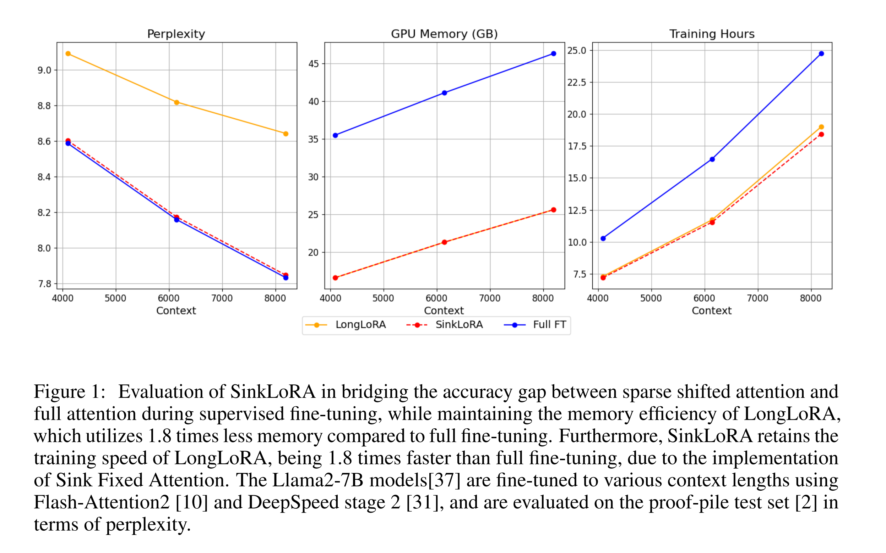
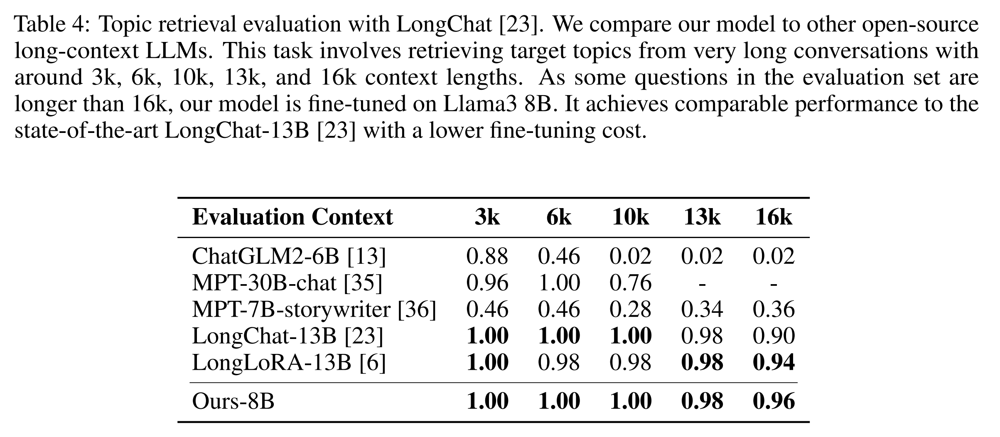
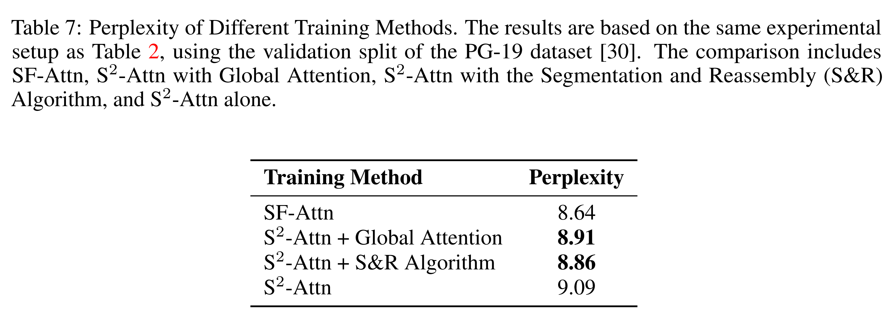
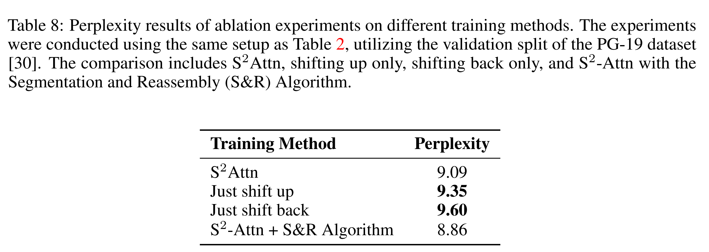
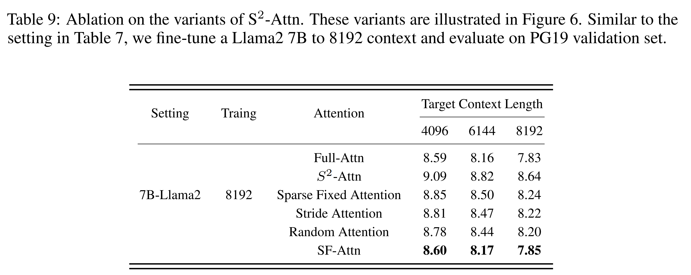

논문 및 이미지 출처 : <https://arxiv.org/pdf/2406.05678>

# Abstract

Transformer model 의 기능을 확장하여 longer sequence length 를 수용하는 것은 중요한 도전 과제가 되었다. 

이 확장은 language translation 과 long-context 처리 같은 task 를 개선하는 데뿐만 아니라, chatbot, code generation, multimedia content creation 같은 새로운 응용 프로그램을 가능하게 한다. 

주요 장애물은 self-attention 메커니즘으로, 이는 sequence length 에 대해 computation time 과 memory requirements 가 제곱적으로 증가한다. 

LongLoRA 는 Shifted Sparse Attention (S2-Attn)을 제안하여 context extension 을 효과적으로 가능하게 하고, vanilla attention 과 유사한 성능을 유지하면서 상당한 계산 절약을 제공한다. 

그러나 LongLoRA 는 여전히 vanilla attention 에 비해 효율적이지 않으며, full attention 에 비해 오직 39% 의 perplexity 개선만을 달성한다. 

이러한 비효율성은 attention head pattern 내에서 적용된 cyclic shift 가 attention head 구조에 혼란을 일으키거나 token group 간의 불필요한 information exchange 를 초래하기 때문이다. 

이를 해결하기 위해, 저자는 더 나은 work partitioning 을 특징으로 하는 SinkLoRA 를 제안한다. 구체적으로, 

- 저자는 cyclically shifted attention head groups 을 "sink attention tokens" 의 global attention 으로 un-shifted state 를 비례적으로 반환하는 segmentation 및 reassembly algorithm 을 갖춘 SF-Attn 을 개발하였으며, 이는 full attention 에 비해 92%의 perplexity 개선을 달성한다
- inference 가속화를 위해 SOTA KV cache compression algorithm 인 H$_2$O 를 적용하였다.
- 또한, 저자의 self-collected LongAlpaca-plus dataset 을 사용하여 SinkLoRA 를 supervied fine-tuning 한다. 

# 1. Introduction

Transformer model 의 기능을 향상시켜 longer sequence length 를 처리하는 것은 language translation, long-context 처리, chatbot, code generation, multimedia content creation 등 다양한 응용 분야에서 중요하다. 

주요 도전 과제는 self-attention 메커니즘으로, 이는 sequence length 에 대해 제곱적으로 증가하여 막대한 computation time 과 memory requirements 를 초래한다.

이를 해결하기 위해 여러 접근 방식이 제안되었다. 

- Longformer 와 BigBird 는 local, global, sparse attention 메커니즘을 조합하여 long-context 를 처리하며, complexity 를 $O(n)$ 으로 줄인다. 
- Reformer 는 locality-sensitive hashing (LSH)을 도입하여 similar token 을 same buckets 로 hashing 하여 attention 을 근사화하고, computational complexity 를 줄인다.
- LSG Attention 은 local, sparse, global attention 을 결합하여 long-context 를 효과적으로 처리하며 computational overhead 를 minimizing 한다.

이러한 발전에도 불구하고, 실제 응용 프로그램에서 long-context 상호작용을 관리하는 것은 여전히 큰 도전 과제이다. 

- 최근 LongLoRA 가 Position Interpolation 을 사용하여 LLaMA2의 context window 를 4096 to 32768 tokens 로 확장하였지만, GPU 나 TPU 자원을 많이 소모하지 않았다.
- 그러나 LongLoRA 의 효율성은 제한적이며, full attention 에 비해 오직 39% 의 perplexity 개선만을 달성한다. 
- 이는 attention head 구조의 혼란과 token groups 간의 불필요한 information exchange 때문이다.

이를 해결하기 위해, 저자는 더 나은 work partitioning 을 제공하는 SinkLoRA 를 제안한다. 

- SF-Attn 을 개발하여 a segmentation and reassembly algorithm 과 "sink attention tokens" 의 global attention 를 결합하여 full attention 에 비해 92% 의 perplexity 개선을 달성한다
- inference 가속화를 위해 최신 KV cache compression algorithm 인 Heavy Hitter Oracle(H$_2$O)을 적용하였다.
- 저자는 또한 self-collected LongAlpacaPlus dataset 을 사용하여 SinkLoRA 를 supervied fine-tuning 하였다. 
  - 이 dataset 은 Natural Questions, RedPajama, Book Summarization, LongQA 등 다양한 출처에서 28,000 entries 를 포함하며, long instruction tuning 을 위한 다양한 종합적인 컬렉션을 보장한다.

요약하면, 저자의 연구 기여는 다음과 같다:

- SinkLoRA 를 제시하며, 이는 LLaMA2 및 LLaMA3 의 context length 를 효율적으로 확장하는 방법으로, LongLoRA 를 완전히 업데이트하였다. 
  - 이 방법은 fine-tuning 효율성을 개선하고 flexible deployment inference 전략을 제공한다.
- SF-Attn 을 도입하며, 이는 a segmentation and reassembly algorithm 과 global attention 를 결합한 fine-tuning 방법이다. 
  - 이 방법은 구현이 쉽고 정확하며 메모리 효율적이며, computational complexity 를 증가시키지 않는다. 
  - SF-Attn 은 attention pattern 을 직접 수정하여 token groups 간의 불필요한 강조를 줄인다.
- Heavy Hitter Oracle (H$_2$O) KV caching 방법을 사용하여 computationally intensive large language models (LLMs)의 efficient deployment 를 달성한다. 
  - 이 방법은 이전에 생성된 token 의 key-value state 를 저장하여 반복적인 계산의 필요성을 크게 줄인다
  - autoregressive generation 의 latency 를 낮춘다. 
  - 이 개선은 유연하고 efficient inference 전략을 가능하게 하며, computational overhead 를 줄이면서 모델 성능을 유지한다.
- SinkLoRA 는 SOTA 와 비교하여 유리한 성능을 보인다. 
  - 저자는 PG19, Proof-pile, LongBench dataset 에서 성능을 평가하였으며, 특히 LLaMA2 7B 의 경우, SinkLoRA 는 LongLoRA 를 초과하며 LongChat-13B 와 경쟁력 있는 성능을 보인다.

# 1.1 Motivation for the Research

#### Motivation 1: Elevating Attention Scores for Initial Tokens Prior studies have demonstrated the Attention Sink phenomeno

이전 연구에서는 Attention Sink 현상이 나타난다고 보여준다. 

- 이 현상에서는 주로 sequence 의 initial tokens 가 모델의 계산 과정에서 비례적으로 high attention scores 를 받는다. 
  - 이는 이러한 tokens 는 이후 all tokens 에 대해 보이기 때문에 발생하며, 이로 인해 semantic importance 가 부족하더라도 상당한 attention 을 받는다. 
- 특히 autoregressive language model 에서 이런 현상이 두드러진다.

LongLoRA 에서 구현된 Sparse Shifted Attention 메커니즘은 이러한 initial tokens 의 high attention scores 를 이전에 low attention 을 받았던 other tokens 로 shifting 하여 initial tokens 에 대한 과도한 강조를 줄이려고 시도한다. 

이를 더 개선하기 위해, 저자는 attention pattern 을 직접 수정하는 방법을 개발할 필요가 있다. 

이 기술을 적용하면 attention scores 를 효과적으로 재분배할 수 있으며, 다양한 token groups 간에 initial tokens 에 대한 불필요한 강조를 줄일 수 있다.

#### Motivation 2: Maintaining Initial Tokens During Fine-Tuning

attention sinks 개념은 Streaming LLM 에서도 사용되어 모델의 long text 처리 능력을 향상시키는데 기여한다. 

few initial tokens (attention sinks) 와 가장 최근 tokens 의 Key-Value (KV) pairs 를 유지함으로써 model 은 extended sequence 에서도 안정적인 attention scores 와 성능을 보장한다. 

이러한 접근 방식을 fine-tuning 에서 inference 단계로 가져오는 것을 목표로 하고 있다. 

저자의 연구는 fine-tuning 과정에서 initial tokens 가 other all tokens 에 attending 하여 더 많은 attention scores 를 축적하고, 모델의 long sequence 처리 능력을 향상시키도록 수정하려 한다.

#### Motivation 3: Flexible Deployment of Inference Strategy

computationally intensive large language models (LLMs)의 efficient deployment 는 종종 Key-Value (KV) caching 에 의존한다. 

KV caching 은 이전에 생성된 tokens 의 key-value state 를 저장하여 repetitive computations 를 크게 줄이고, 따라서 autoregressive generation 의 latency 를 낮춘다. 

그러나 LongLoRA 는 inference 동안 original standard self-attention 메커니즘만을 유지한다. 

이 한계를 해결하기 위해, optional KV cache 기능을 적용할 필요가 있다. 

이 개선은 더 유연하고 efficient inference 전략을 가능하게 하며, 모델 성능을 유지하면서 computational overhead 를 줄인다.

# 2 Related Work

## 2.1 Long-context Transformers

Transformer model 을 확장하여 longer sequence length 를 처리하는 데 있어 주요 장애물은 self-attention 메커니즘이다. 

- 이는 sequence length 에 대해 제곱적으로 증가하여 computation time 과 memory requirements 이 크게 늘어난다. 
- 이 제곱 계산 부담을 해결하기 위해 more efficient sparse Transformer model 개발에 대한 연구가 진행되었다. 
  - Longformer 와 BigBird 는 local, global, sparse attention 메커니즘을 조합하여 long-context 를 관리하고 complexity 를 $O(n)$ 으로 줄인다. 
  - 이러한 모델들은 충분한 context 를 유지하면서도 계산 부하를 관리하는 균형을 이루었다. 
- $O(n \log n)$ complexity 를 달성하기 위해 몇 가지 접근 방식이 제안되었다. 
  - Fixed Window Attention 은 fixed-size window 를 사용하여 attention computation 을 limited context window 으로 제한한다. 
  - Reformer 는 similar tokens 를 same buckets 로 hashing 하는 locality-sensitive hashing (LSH)을 도입하여 attention 을 근사화하고 computational complexity 를 줄인다. 
  - LSG Attention 은 BigBird 에서 적응되어 local, sparse, global attention 을 결합하여 long-context 를 효과적으로 처리하고 computational overhead 를 최소화한다. 
  - Equipping Transformer 은 documents 의 all tokens 을 검토할 필요 없이 long document 를 효율적으로 처리할 수 있는 random access 라는 novel reading 전략을 제안한다. 
    - 이 방법은 pre-training, fine-tuning 및 inference 단계에서 유망한 결과를 보이며, extended context 를 처리하는 데 효과적임을 보여준다. 

이러한 발전에도 불구하고, 이러한 방법들이 chat applications 에서 요구되는 long-context 상호작용을 관리하는 능력에는 여전히 한계가 있다. 

이는 상호작용적이고 real-time applications 을 위한 Transformer model 의 context 처리 능력을 향상시키는 데 있어 지속적인 도전 과제를 강조한다.

## 2.2 Long-context LLMs

large language model(LLMs)의 최근 발전은 long-context input 을 처리하는 능력을 크게 확장하였다. 

- Math Word Problems (MWPs) 는 LLMs 를 사용하여 mathematical questions 를 해결하는 데에서 두드러진 성능을 보여주었다.
  - 또한, SQL query 에서 LLMs 를 활용하는 것도 resource allocation 을 최적화하는 데 유망하나, traditional relational databases 에 비해 효율성은 떨어진다. 
- LongLoRA 는 Position Interpolation 을 사용하여 Llama 2 의 context window 를 4096 to 32768 token 으로 확장하는 데 성공하였다. 
- Meta 의 Llama 3은 최대 70 billions parameter 를 가지며, computational efficiency, trust 및 safety tools, 주요 플랫폼과의 협업에서 개선을 제공하는 open-source LLM 의 중요한 발전을 나타낸다. 
- BLOOM, OPT, Falcon 같은 open-source models 은 여전히 closed-source model 과 경쟁하고 있으며, Vicuna 및 Alpaca 같은 모델은 특정 측면에서 closed-source model 에 비해 뒤처진다. 

이러한 발전에도 불구하고, long-context 상호작용을 효과적으로 관리하는 것은 여전히 중요한 도전 과제이며, long-context LLM 응용 프로그램의 complexity 를 해결하기 위한 지속적인 연구와 개발이 필요하다.

## 2.3 KV-Cache Compression

KV cache size 의 compressing 은  weight size 를 줄이는 것보다 어렵다. 왜냐하면 KV 는 model input 에 더 민감하고 의존적이기 때문이다. 

KV cache compression 을 위한 cost-effective method 는 token dropping 이다. 

이 방법은 중요도 정책을 설정하여 중요한 KV 를 유지하고 중요하지 않은 것을 제거한다. 

- Jiang et al. 과 Xiao et al. 는 current sequence position 에 근접한 tokens 를 유지하는 것이 생성에 중요하다고 제안하였다. 
  - 예를 들어, H$_2$O 와 FastGen 은 attention scores 를 기준으로 tokens 를 dropping 하여 KV cache 크기를 줄이는 방법을 제안하였다. 
- 비슷하게, SparQ 는 attention scores sparsity 를 기준으로 tokens 를 dopping 하며, pruned value cache 에서의 error 를 고려하기도 한다.

이러한 pruning methods 는 summarization tasks 및 zero-shot inference 에서 일반적으로 효과적이다. 

- Zhang et al. 과 Liu et al. 는 생성 품질을 유지하기 위해 영향력 있는 소수의 tokens, 즉 heavy-hitters 를 식별하는 것을 권장한다. 
- Ge et al. 은 서로 다른 attention head 가 서로 다른 tokens 에 우선 순위를 두며, KV 를 제거하기 위한  adaptive importance policy 를 개발하였다.

그러나 이러한 접근 방식은 pruned KV 에 포함된 context 가 완전히 폐기되기 때문에 심각한 문제를 일으킬 수 있다.

# 3 Our Method: SinkLoRA

## 3.1 Background

#### LongLoRA.

LongLoRA 는 Chen et al. (2023) 의 fine-tuning 방법론으로, large language model(LLM)의 context window size 를 효율적으로 확장하는 것을 목표로 한다. 

- LongLoRA 는 Position Interpolation 을 활용하여 LoRA 에서 도입된 low-rank adaptation 을 기반으로 하며, Shifted Sparse Attention (S2-Attn) 을 통합한다. 
- S2-Attn 은 Swin Transformer 에서 영감을 받아, total context 를 multiple groups 로 나누고 각 group 내에서 independently attention computation 을 수행한다. 
  - continuity 를 보장하기 위해, half attention head 을 half group size 만큼 shifting 한다. 
- 이 방법은 training 중 short attention spans 를 사용하여 long-context task 을 시뮬레이션하므로, computational overhead 를 크게 증가시키지 않고도 larger contexts 를 처리할 수 있게 한다. 
  - 또한 LongLoRA 는 Flash-Attention2 같은 기존 LLM optimization 기술 및 인프라와 호환되도록 설계되어 시스템 수정 없이도 유용하다. 
  - 이 접근 방식은 parameter 활용의 효율성을 강조하여, 전체 model parameters 의 작은 부분을 차지하는 learnable embedding 및 normalization layers 에 최소한의 조정만 필요하다.
  - 이러한 효율성은 larger models 로 확장하면서도 LongLoRA 의 실제적인 성능 향상을 유지하는 데 중요하다.

#### Attention Sink.
  
autoregressive large language model (LLM)에서는 initial tokens 가 task 와 semantic relevanmce 가 없이 불균형적인 high attention scores 를 받는 "attention sink" 현상이 관찰된다. 

- 이러한 initial tokens 은 semantic importance 는 부족하지만 high attention scores 를 가속화하는 경향이 있다
- 이 현상은 모델의 Softmax function 의 특성으로 인해 all tokens 의 attention score 합이 1이 되도록 보장하는 attention ap 커니즘이 사용되기 때문이다. 
- current query 와 강하게 관련된 tokens 가 몇 개밖에 없는 경우 model 은 availabe tokens 에 attention 을 분산시키는 경향이 있다. 
- LLM 의 autoregressive 특성 때문에 initial tokens 은 거의 모든 subsequent tokens 에 항상 보이므로, training 중 자연스럽게 target attention 으로 선호되며 "attention sinks" 역할을 한다. 

이 통찰력은 autoregressive models 의 attention 메커니즘에서 근본적인 어려움을 강조하며, language modeling 에서 attention distribution 전략을 개선할 수 있는 영역을 제시한다.

#### Heavy-Hitter Oracle.

Heavy-Hitter Oracle (H$_2$O) 은 language model 의 KV cache memory size 를 줄이는 문제를 해결하는 최신 기술이다. 

- 이 방법은 “Heavy Hitters” (H2) 라는 small tokens subset 이 language model 의 전체 attention scores 에 상당한 기여를 한다는 관찰을 기반으로 한다. 
- 분석 결과, 이러한 H2 tokens 는 text 내에서 자주 공존하며, text structure 의 자연스러운 결과로 나타난다. 
- 실험에서는 이러한 tokens 를 제거하면 모델 성능에 상당한 영향을 미친다는 점이 강조된다. 
- H$_2$O 접근법은 이 이해를 dynamic cache eviction policy 를 결합하여 current tokens 와 중요한 H2 tokens 의 보유를 최적화하며, efficient memory 사용을 보장하고 모델 성능에 필요한 계산 역학을 유지한다.

## 3.2 Applying Sink Fixed Attention to Improve Fine Tune Progress

### 3.2.1 Pilot study

저자의 접근 방식을 확인하기 위해, 다양한 context length 에서 여러 attention 메커니즘의 효과를 평가하는 pilot study 를 수행한다. 

- Tab. 1 에선 full attention 및 fine-tuning 과 함께 training 및 test 를 수행하여 standard baseline 을 설정하며, 이는 다양한 context length 에서 일관되게 좋은 품질을 제공한다. 

- 먼저 short attention (Sparse Shifted Attention)를 사용하여 training 을 진행했으며, 이 pattern 은 Fig. 2(a) 에 나타나 있다. 
- long-context 에 대한 self-attention module 의 높은 computational costs 을 고려하여, group window attention 에 Sink Fixed Attention (SF-Attn) 재조립을 도입했다. 
- 이 단계는 Fig. 2(b) 에 나타나 있으며, attention pattern 을 재조립하여 token 간의 continuity 와 interaction 을 개선한다 (Fig. 2(c)). 
- 이 방법은 initial tokens 가 all tokens 에 attending 하게 하여 global attention 을 제공한다. 
- 결과적으로, SF-Attn 은 Sparse Shifted Attention 에 비해 상당한 개선을 보여주며, 특히 8192 tokens 에서 perplexity 를 현저히 줄였다.

이 pilot study 의 결과는 SF-Attn 이 재조립 및 global attention 조정을 통해 성능과 computational efficiency 의 균형을 효과적으로 맞춘다는 것을 나타낸다. 

이는 large language model 의 context length 를 확장하는 데 유망한 해결책이 된다.

### 3.2.2 Sink Fixed Attention

Sink Fixed Attention 은 두 가지 주요 부분으로 구성된다: Segmentation & Reassembly Algorithm 과 Global Attention 이다.

#### Segmentation & Reassembly Algorithm.

- Fig. 4 처럼, input tensor 는 two parts 로 나뉜다. 
- second half 는 다시 two parts 로 나뉜다: 하나는 제자리에 남아있고 다른 하나는 shifting 하여 감싸진다. 
  - 이러한 parts 는 새로운 순서로 다시 결합된다. 
  - 이 재조립된 tensor 는 standard self-attention 메커니즘을 통해 처리된다. 
- 최종적으로 output tensor 는 similar splitting, shifting, 및 recombining process 를 거쳐 feed forward operation 을 수행하여 final output 을 생성한다. 
- 이 접근 방식은 attention computation 을 단순화하고 입력의 핵심 영역에 집중함으로써 모델 성능을 향상시킨다. 
- 이는 sparse shifted attention 이 fixed window attention 과 유사하게 작동하도록 만든다.

PyTorch 스타일의 코드는 algorithm 1에서 제공된다.

#### Global Attention.

- 처음 4 initial tokens 을 "sink attention tokens" 로 선택한다. 
- Llama-2-7B 및 Llama-3-8B 모델을 훈련할 때, 이 설정은 StreamingLLM 의 구조를 따른다. 
- Longformer 와 BigBird 의 global attention 전략을 사용하여, sink attention tokens 가 sequence 전역의 all tokens 에 attending 하고, sequence 의 all tokens 가 sink attention tokens 에 attending 하게 한다
- 구체적으로, Segmentation & Reassembly Algorithm 후에는 current fixed window 내의 all tokens 에 대한 attention scores map 을 shifed back version 으로 얻는다.

---

- $g$ new tokens (sink attention tokens)를 current sequence 에 추가한다. 
- 그에 따라 new adjacency matrix $B \in [0, 1]^{(N+g) \times (N+g)}$ 을 구성한다. 
- $i \in \{1, 2, \ldots, g\}$ 일 때, $B(g+i, g+j) = A(i, j) \forall i, j \in \{1, \ldots, N\}$ 을 만족하며, $B(i, :) = 1$ 과 $B(:, i) = 1$ 이 된다.

이렇게 하면, sink attention tokens 이 hidden layer 내부로 들어가기 전에 attention scores 계산에서 계속 attending 하게 된다. 

이러한 tokens 수가 $n$ 에 비해 작고 독립적이므로, combined local 및 global attention 의 complexity 는 여전히 $O(n \log n)$ 이다.

## 3.3 Applying KV Cache Algorithm to Accelerate Inference Process

이 섹션에서 H$_2$O algorithm 을 LongLoRA 에 적용한다. 

- LongLoRA codebase 는 inference stage 에서 full attention 솔루션만을 제공한다. 
- 저자는 H$_2$O aviction system 을 통합하여 KV cache value 를 메모리에서 관리하는 new class 를 생성하여 inference process 를 optimization 한다. (Fig. 3)

Tab. 2 는 proof-pile test split 의 perplexity 평가를 보여준다. 

- S2-Attn 은 Shifted Sparse Attention 을 의미하며, SF-Attn 은 Sink Fixed Attention 을 의미한다. 
- 저자는 LongAlpaca dataset 을 사용하여 Llama2 와 Llama3 의 7B 및 8B model size 에서 8k-32k context length 로 supervied fine-tuning 을 진행하였다. 
- 저자의 방법은 full attention 또는 FFT baseline 과 비교할 때 유사한 성능을 달성하면서도 더 나은 효율성을 보였다. 
- 평가에는 Sec. 4.1 의 PG19 에서 평가된 모델과 동일한 training settings 를 사용하였다.

# 4. Experiment

## 4.1 Experimental Settings

### 4.1.1 Environments

- 모든 실험은 2× A100 GPU 에서 수행되었다. 
- model training 을 위해 PyTorch 을 주요 프레임워크로 사용하며, DeepSpeed 와 Flash-Attention2 을 통합하여 성능을 최적화한다. 
- 기본적으로 DeepSpeed 는 stage 2 에서 사용되며, stage 3 은 최대 context length 와 관련된 실험에 예약된다. 
- 메모리 관리를 효율적으로 하기 위해 Peft codebase 에서 표준 기술인 Gradient checkpointing 이 사용된다. 
- 대부분의 실험은 2× A100 GPU 를 사용했지만, 7B 모델을 8192 context 크기로 fine-tuning 하는 작업에는 RTX 4090 GPU 를 사용하는 것도 가능하다.

### 4.1.2 Models

pre-trained Llama2 의 7B chat-version Llama3 의 8B 모델을 확장하여 사용한다.

### 4.1.3 Training Procedure

- model training 을 위해 Llama-2와 Llama-3 model 을 bf16 precision 으로 활성화하고, 최대 sequence length 는 요구 사항에 따라 설정된다. 
- Flash Attention 을 사용하여 효율적인 계산을 수행한다. 
- Low-rank training 이 활성화되며, model 은 batch size 1 로 훈련을 3 epochs 동안 수행하고, 평가를 위해 batch size 2 를 사용한다. 
- Gradient accumulation 은 1 step 으로 설정된다. 
- 평가 전략은 비활성화되며, model 은 512 steps 마다 저장되며 총 2 checkpoint 가 저장된다. 
- learning rate 은 2e-5로 설정되며, weight decay 는 없고, 20 steps 의 warmup phase 가 포함된다. 
- learning rate 은 warmup 이 포함된 constant schedule 에 따른다. 
- log 는 매 step 마다 기록되며, training process 는 DeepSpeed 구성 (stage2.json) 을 사용하여 tf32 precision 이 활성화된 상태에서 최적화된다.

### 4.1.4 Datasets

"LongAlpaca-Plus" dataset 은 28,000 entries 로 구성되며, LongAlpaca 의 업데이트 버전으로 다양한 출처에 중점을 두고 있다. 

- dataset 의 44% 는 Natural Questions 으로, 총 12,320 entries 이 포함되며, Natural Questions data 의 subset 에 출처를 두고 있다. 
- RedPajama 는 dataset 의 27% 를 차지하며, 7,560 entries 포함. 
- Book Summarization 은 dataset 의 18% 를 차지하며, 5,040 entries 포함.
- LongQA 는 가장 작은 부분을 차지하며 11% 로, 3,080 entries 포함. 
- 이러한 분포는 long instruction task 를 위한 다양하고 포괄적인 dataset 을 보장한다.

### 4.1.5 Metrics

#### Perplexity

Perplexity 는 NLP 에서 중요한 metric 으로, language model 의 예측 불확실성을 정량화하며, 실제 단어 sequence 에 할당된 확률과 반비례한다. 

정보 이론에서 유래된 perplexity 는 통신 시스템의 효율성을 측정하며, NLP 에서는 language model 이 language pattern 을 얼마나 잘 이해하는지를 반영한다. 

수학적으로, perplexity 는 다음과 같이 정의된다:

$$
\begin{equation}
  \text{Perplexity} = e^{-\frac{1}{N} \sum_{i=1}^{N} \log p(w_i | w_{i-1}, \ldots, w_1)}
\end{equation}
$$

- $p(x)$ : all possible sequiences $x$ 에 대한 probability distribution
- perplexity 는 초기 n-gram 부터 DNN 까지, language model 을 평가하는 데 광범위하게 사용된다. 
- 이는 모델 성능 비교, 개발 중 조정, 기계 번역 및 텍스트 생성 작업 향상에 도움을 주며, 모델 개선 및 다양한 구성의 효과성을 평가하는 데 필수적인 도구이다.

#### Passkey Retrieval

Passkey Retrieval 에서는 LongLoRA 에서 제공하는 형식을 유사하게 사용하여 passkey 를 검색한다. 

문서는 다음과 같은 구조를 따른다:

———————————————————————————————————————
꽃이 피어 있다. 나무가 크다. 강이 흐른다. 그냥 계속 가라. 앞으로 나아가라.  
($M$ 번 반복)  
중요 메모: passkey 는 84729 이다. 이 숫자를 기억하라. 84729 가 passkey 이다.  
꽃이 피어 있다. 나무가 크다. 강이 흐른다. 그냥 계속 가라. 앞으로 나아가라.  
($N$ 번 반복)  
passkey 는 무엇인가? passkey 는. . .  
———————————————————————————————————————

document length 는 $M$ 과 $N$ value 에 따라 달라진다. 

passkey 번호, 얘롷 84729 는 임의로 생성되며 각 text 마다 변경된다.

#### LongBench

LongBench 는 large language model (LLM)의 long-context understanding capabilities 을 평가하기 위해 설계된 이중 언어, 멀티태스크 벤치마크이다. 

영어와 중국어에서 extended text input 을 처리하는 모델의 성능을 평가하는 데 중점을 두며, 다음 6 task categories 를 포함하는 21 dataset 을 포함한다: single-document QA, multi-document QA, summarization, few-shot learning, synthetic tasks, code completion.

## 4.2 Main Results

#### Perplexity Result.

Tab. 2와 Tab. 3의 데이터를 분석한 결과는 다음과 같다: Tab. 2 는 proof-pile test split 에 대한 perplexity 평가를 제공하며, 3 types attention 메커니즘: Full-Attn, S2-Attn, SF-Attn 이 7B 및 8B model size 에서 사용되었다. 

- 7B-Llama2 model 에서 8192 의 training context length 를 사용했을 때, SF-Attn 메커니즘이 all target context length (4096, 6144, 8192)에서 다른 attention 메커니즘보다 일관되게 우수한 성능을 보였다. 
- 구체적으로, SF-Attn 의 perplexity 값은 각각 8.60, 8.17, 7.85 로, 더 효율적인 성능을 나타낸다. 
- 비슷하게, 같은 context length 로 훈련된 8B-Llama3 model 은 SF-Attn 메커니즘을 사용할 때 낮은 perplexity 점수를 기록한다: 4096, 6144, 8192 의 target context length 에 대해 각각 5.11, 4.86, 4.66 을 기록하였다. 
- 이는 SF-Attn 메커니즘이 Full-Attn 및 S2-Attn 보다 perplexity 에서 주목할 만한 개선을 제공함을 나타낸다.

Tab. 3은 단일 2× A100 을 사용하여 다양한 model size 에 대해 fine-tuning 할 수 있는 최대 context length 를 요약하고 있다.

Llama2와 Llama3 model 은 동일한 training settings 를 사용하여 평가되었다. 

- 7B-Llama2 model 은 평가 context length 2048, 4096, 8192, 12288, 16384 에 대해 각각 8.73, 8.55, 8.30, 8.13, 8.05 의 perplexity 결과를 보인다. 
- 8B-Llama3 model 은 같은 평가 context length 에 대해 5.11, 5.02, 4.89, 4.77, 4.72 의 perplexity 값을 기록한다.
- 이 결과들은 SF-Attn 메커니즘이 perplexity 면에서 Full-Attn 및 S2-Attn 메커니즘보다 우수하다는 것을 나타내며, 특히 larger context length 에서 더욱 두드러진다.
  - 이는 LongLoRA 프레임워크 내에서 H$_2$O algorithm 의 효율성과 효과성을 검증한다.

#### Passkey Retrieval Result.

Tab. 4와 Fig. 5의 데이터를 분석한 결과는 다음과 같다:

Tab. 4 는 LongChat 을 사용한 주제 검색 평가를 제시한다. 이 task 는 3k, 6k, 10k, 13k, 16k 의 context length 에서 very long dialog 에서 목표 주제를 검색하는 것이다. 

- 저자의 model 은 Llama3 8B 로 fine-tuning 되었으며, SOTA LongChat-13B 와 비교하여 low fine-tuning cost 로 유사한 성능을 달성한다. 
- 구체적으로, 저자의 모델은 10k 까지의 context length 에서 1.00 의 정확도를 유지하며, 13k 및 16k context length 에서는 각각 0.98 및 0.96 으로 약간 감소한다. 
- 이는 long-context retrieval tasks 를 처리하는 데 있어 모델의 강건성과 효율성을 보여준다.

Fig. 5 는 Llama2 7B, LongLoRA 7B, 그리고 32,768 context length 의 저자의 fine-tuned 7B model 간의 passkey retrieval accuracy 를 비교한다. 

- 저자의 모델은 LongLoRA 의 context length 한계인 30k 및 34k 를 초과하여 33k 또는 36k 까지 검색 정확도의 저하가 없다. 
- 이는 저자의 모델이 기존 모델보다 longer context length 를 높은 정확도로 처리할 수 있음을 나타낸다.

#### LongBench Result.

- Tab. 6 분석한 결과, GPT-3.5-Turbo 는 다양한 task 에서 다른 모델들보다 일관되게 우수한 성능을 보이며, 가장 높은 평균 점수(44.0)를 기록하였다. 
  - 이는 GPT-3.5-Turbo 의 뛰어난 전체 성능을 나타낸다. 
- 특히, Ours-7B 는 두 번째로 높은 평균 점수(38.8)를 기록하며 경쟁력 있는 성능을 보인다. 
- 구체적으로, Ours-7B 는 Code task 에서 59.2의 선도적인 점수를 기록하며, GPT-3.5-Turbo (54.1)를 초과한다.
- 이러한 강점에도 불구하고, 특히 Synthetic task 에서 Ours-7B 가 22.3 을 기록하며 GPT-3.5-Turbo 의 37.8 보다 상당히 낮은 점수를 기록하였다. 
  - 이는 모델의 Synthetic task 능력을 향상시켜 전체 성능을 더욱 높일 필요가 있음을 강조한다. 
- 전반적으로 GPT-3.5-Turbo 가 여전히 최고의 성능을 유지하고 있지만, 저자의 모델은 유망한 결과와 최적화 가능성을 보인다.

#### H$_2$O Inference Result

이 분석에서는 LLaMA-3-8B 모델에 대해 다양한 KV cache 방법의 성능과 효율성을 검토한다.

Fig. 6 은 full cache 를 사용하는 base model, H$_2$O 방법, 및 recent KV embedding 을 사용하는 "Local" 전략 간의 비교 분석을 제공한다. 평가는 OpenBookQA dataset 에서 수행되었다. 

- 주목할 점은 Heavy-Hitter Oracle (H$_2$O) 방법이 KV cache 예산이 줄어들어도 높은 정확도 수준을 유지하며 모델 성능을 보존하는 데 효과적이라는 것이다. 
- 반대로, Local 방법은 KV cache 예산이 줄어들면서 정확도가 현저히 감소한다.

Tab. 6은 다양한 KV cache 예산에 따른 LLaMA-3-8B 의 inference time 을 자세히 설명한다. 

- H$_2$O 방법은 모든 cache 예산에서 Full 방법에 비해 inference time 을 크게 줄인다. 
- 예로, 100% KV cache 예산에서 H$_2$O 방법은 inference time 을 4.7 hours (Full)에서 4.4 hours 로 단축시킨다. 
- 이 단축은 더 낮은 KV cache 예산에서 더욱 두드러지며, 제한된 자원 환경에서 H$_2$O 방법의 효율성을 강조한다.

결론적으로, H$_2$O 방법은 높은 정확도를 유지하면서 inference time 을 줄이는 최적의 균형을 제공하며, LLaMA-3-8B 같은 large language model 을 최적화하는 데 유용한 전략으로 평가된다. 

이 방법은 성능을 유지하면서 상당한 computational costs 절감을 제공할 수 있는 잠재력을 강조한다.

## 4.3 Ablation Study

#### Ablation on SF-Attn training steps.

SF-Attn 훈련 방법의 다양한 구성 요소의 효과를 평가하기 위해 일련의 ablation study 를 수행한다. 

Tab. 7 은 PG-19 dataset 의 validation split 을 사용한 다양한 훈련 방법에 대한 perplexity 결과를 제시한다.

- SF-Attn 방법만 사용했을 때 perplexity 는 8.64 로, 비교 기준을 설정하는 baseline 이 된다. 
- S2-Attn 에 global attention 을 추가했을 때는 perplexity 가 8.91 로, global attention 만으로는 성능이 크게 향상되지 않음을 나타낸다. 
- S2-Attn 과 Segmentation and Reassembly (S&R) algorithm 을 결합한 경우의 perplexity 는 8.86 으로, S2-Attn 만 사용할 때보다 약간의 개선이 있음을 보여준다. 
- 기본 S2-Attn 방법만 사용할 때는 perplexity 가 9.09로, SF-Attn baseline 보다 높아 추가적인 개선이 필요함을 나타낸다. 이러한 결과는 SF-Attn 방법이 효과적이지만, S&R algorithm 과 같은 추가 기술과 결합할 때 perplexity 에서 개선이 이루어진다는 것을 시사한다.

S&R algorithm 의 개별 구성 요소의 영향을 분석하기 위한 추가 ablation study 도 수행되었다. Tab. 8은 이러한 실험에 대한 perplexity 결과를 제공한다. 기본 S2-Attn 방법의 perplexity 는 9.09이다. 모델이 "shift up" 단계만 적용할 때는 perplexity 가 9.35로 증가하며, 이 단계만으로는 성능 향상이 부족함을 나타낸다. "shift back" 단계만 적용했을 때는 perplexity 가 9.60345459로 나타나, 이 단계만으로도 성능 향상에 충분하지 않음을 보인다. 전체 Segmentation and Reassembly algorithm 을 적용한 경우의 perplexity 는 8.86으로, 두 개의 shifting 단계를 결합했을 때의 효과를 보여준다. 이러한 ablation study 는 SF-Attn 훈련 방법의 성능 향상에 있어 S&R algorithm 의 중요성을 강조한다. "shift up"과 "shift back" 단계를 통합함으로써 S&R algorithm 이 perplexity 를 효과적으로 줄이고 모델 성능을 개선함을 나타낸다.

#### Ablation on SF-Attn Varation.

Sparse Fixed Attention (SF-Attn)과 그 variants 에 특히 초점을 맞춘 연구도 진행되었다. 

Fig. 7은 Sparse Fixed Attention, Stride Attention, Random Attention 의 다양한 attention patterns 를 보여준다.

- 이들 variants 는 token sequence 전체에 attention 을 분산시키는 다른 전략을 나타낸다. 
- Sparse Fixed Attention 은 fixed sparse pattern 을 사용하고, Stride Attention 은 stride pattern 으로 attention 을 분산시키며, Random Attention 은 randomly attention 을 할당한다.

Tab. 9 는 Llama2 7B 모델을 다양한 target context length (4096, 6144, 8192)로 fine-tuning 하고 PG19 validation set 에서 평가한 결과를 제시한다. 

성능은 다양한 attention 메커니즘 설정에 따라 측정된다. 

- 주요 관찰 사항은 Full Attention (Full-Attn) 이 일관된 성능을 보이지만 computational costs 가 많이 든다는 것이다. 
- S²-Attention (S²-Attn) 은 Full Attention 보다 약간 나은 성능을 보이며, 특히 long-context 길이에서 그렇다. 
- Sparse Fixed Attention 은 경쟁력 있는 성능을 유지하며 더 효율적이다. 
- Stride 와 Random Attention 도 잘 수행되지만 Sparse Fixed Attention 보다는 약간 낮다. 
- SF-Attention 방법은 이러한 전략 요소를 결합하여 가장 낮은 perplexity score 를 기록하며, long sequence 를 처리하는 데 가장 효율적이고 효과적인 어텐션 메커니즘임을 나타낸다.

# 5. Discussion

## 5.1 The Failure of Shift Operation

Sparse Shift Attention 의 shift task 는 Swin Transformer 에서 영감을 받아 서로 다른 token groups 간의 information exchange 을 촉진하고자 한다. 

그러나 이 접근 방식은  information leaking 문제를 야기할 수 있다.

- information leaking 문제는 shift task 는 서로 다른 segment 의 token 이 너무 자유롭게 정보를 공유하게 만들기 때문에 발생할 가능성이 높다. 
  - 모델이 sequence 의 다양한 부분에서 정보를 통합할 수 있도록 하려는 의도와는 달리, token 이 처리의 특정 단계에서 알아서는 안 되는 information 을 사전에 접근하게 된다. 
  - 이 조기 노출은 model learning process 에 혼란을 주어 over-fitting 또는 incorrect associations 를 초래할 수 있다.
- 또한, shift task 는 token groups 간의 distinct boundaries 를 흐릿하게 만들 수 있으며, 이는 model 이 각 group 내의 특정 context 를 유지하는 데 어려움을 겪게 할 수 있다. 
  - 이로 인해 모델 성능이 저하될 수 있으며, long sequence 를 정확하게 해석하고 생성하는 데 필요한 local context 의 일관성을 유지하기 어렵게 된다.

요약하자면, shift task 는 information exchange 을 개선하려는 목적을 가지고 있지만, token 이 서로 다른 segment 에서 information 을 조기에 접근하고 통합하게 함으로써 information leaking 을 초래한다. 

이는 모델이 distinct contextual boundaries 를 유지하는 능력을 저해하며, precise contextual understanding 이 필요한 task 에서 성능에 부정적인 영향을 미칠 수 있다.

## 5.2 The Success of Making Sink Attention Tokens Globally Operative

다음 섹션에서는 globally operative sink attention tokens 의 성공적인 구현 방법에 대해 설명하며, model 이 long sequence 를 효율적으로 처리할 수 있는 능력을 향상시킨다. 

sink attention token 의 성공적인 구현은 몇 가지 주요 요소에 기인할 수 있다. 

- 먼저, sequence 의 all other tokens 에 attending 할 specific tokens 를 지정함으로써 model 은 전체 sequence 에서 information 를 효과적으로 포착하고 통합할 수 있다. 
- 이 global attention 메커니즘은 very long sequence 에서도 critical information 이 손실되지 않도록 보장한다.
- 또한, sequence 의 all tokens 가 sink attention token 에 attending 함으로써 model 은 sequence context 에 대한 일관된 이해를 유지할 수 있다. 
- 이러한 bidirectional attention flow 는 model 이 여러 단계에서 important information 를 강화할 수 있도록 하여 전반적인 이해와 context 유지 능력을 향상시킨다.

이 방법을 통해 달성된 $O(n \log n)$ 의 efficient complexity 는 상대적으로 적은 수의 sink attention token 으로 인해 이 강화된 능력이 상당한 computational overhead 증가 없이 이루어진다는 것을 보장한다. 

포괄적인 attention 을 유지하면서 computational efficiency 을 확보하는 이 balance 는 이 기술을 사용하는 모델에서 개선된 성능의 주요 요소일 가능성이 높다.

요약하자면, global sink attention token 의 구현은 모델이 long sequence 에 대한 강력하고 일관된 이해를 유지하도록 하며, 처리 단계 전반에 걸쳐 critical information 이 attending 하도록 보장함으로써 광범위한 context understanding 이 필요한 task 에서 성능을 향상시킨다.

## 5.3 The Convenience of Applying KV Cache Compression Function

H$_2$O inference test 결과에서 보여지듯이, H$_2$O 방법은 KV cache 예산이 절반으로 줄어들어도 정확도를 유지할 수 있다. 

그러나 이 방법을 통해 얻은 time savings 은 상당하며, inference time 을 1.5배 줄일 수 있다. 

이 기능은 사용 가능한 computing resource 에 따라 inference 방법을 유연하게 배포할 수 있게 한다. 

정확도를 손상시키지 않고 KV cache 예산을 조정할 수 있는 능력은 large language model 을 자원이 제한된 환경에서도 효율적이고 효과적으로 활용할 수 있게 하며, 성능과 computational efficiency 을 모두 최적화한다.

## 5.4 The Good Result of Chatbot

Fig. 9 의 chat ability 비교 예제에서, 두 가지 버전의 LongLoRA 모델이 이야기와 관련된 question-answering 을 관찰할 수 있다. 

사용자의 입력은 여러 번의 실패 후, 물고기를 찾기 위해 "Blue Deep" 이라고 알려진 장소로 더 멀리 나간 노인 어부 Tom 에 관한 이야기이다. 

질문은 Tom 이 왜 그동안 한 번도 가본 적이 없는 바다로 더 멀리 나가기로 결심했는지 묻는다.

- LongLoRA-7B 모델의 응답은 Tom 의 절망감과 물고기를 잡지 못한 걱정을 중심으로, 빈 그물과 가족을 부양하려는 결심을 강조한다. 
  - 이 응답은 서사에서 설명된 Tom 의 동기 주요 요소를 정확하게 포착한다.
- 반면 SinkLoRA-7B model 은 물고기의 장기간 사라진 상황과 Tom 이 "Blue Deep" 으로 모험을 떠나기로 한 결정에 대해 더 자세한 설명을 제공한다. 
  - 또한 Tom 이 그곳에서 물고기를 찾을 희망을 언급하며, 그의 동기에 대한 보다 포괄적인 이해를 제공한다.

answering details 과 context 의 차이는 two models 간의 training 및 fine-tuning 차이에서 기인할 수 있다. 

SinkLoRA-7B model 은 더 다양한 dataset 에서 훈련되었거나 additional fine-tuning 을 통해 문맥적으로 풍부한 응답을 생성하는 데 더 나은 이해를 갖추었을 수 있다. 

이 additional training 이 모델이 더 세밀하고 자세한 답변을 제공할 수 있게 하여, 서사의 미세한 차이를 더 효과적으로 포착할 수 있게 한다.

결론적으로, two models 모두 Tom 의 주요 동기를 성공적으로 식별하지만, SinkLoRA-7B model 은 더 철저하고 문맥적으로 풍부한 설명을 제공한다. 

이 비교는 narrative-based questions 를 이해하고 정확하게 응답하는 챗 기능의 효과성을 강조하며, 모델 성능과 응답 품질 향상에 있어 광범위한 훈련과 fine-tuning 의 중요성을 강조한다.

# 6 Conclusion and Future Work

이 연구에서는 SinkLoRA 를 소개하였다. 

- SinkLoRA 는 original LongLoRA 에 대한 중요한 개선으로, long-context sequence 를 처리하는 large language model(LLM)의 효율성과 성능을 향상시키기 위해 설계되었다. 
- SinkLoRA 는 이전 모델의 한계를 해결하기 위해 Sink Fixed Attention (SF-Attn)과 Heavy-Hitter Oracle (H$_2$O) 같은 advanced KV cache compression 기술을 구현하였다. 
- 제안된 SF-Attn 방법은 attention scores 를 효과적으로 재분배하여 initial tokens 에 대한 과도한 강조를 줄이고 전체 모델 정확도를 개선한다. 
- 이 접근법은 Segmentation and Reassembly algorithm 과 결합되어 computational complexity 를 증가시키지 않고도 extended context 를 더 잘 처리할 수 있다. 
- H$_2$O KV cache compression 의 통합은 inference 를 가속화하여 SinkLoRA 를 자원이 제한된 환경에서 LLM 을 배포하는 데 매우 효율적인 솔루션으로 만든다.