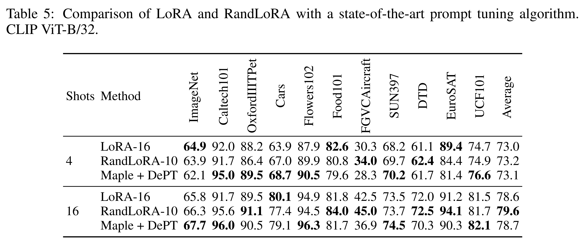
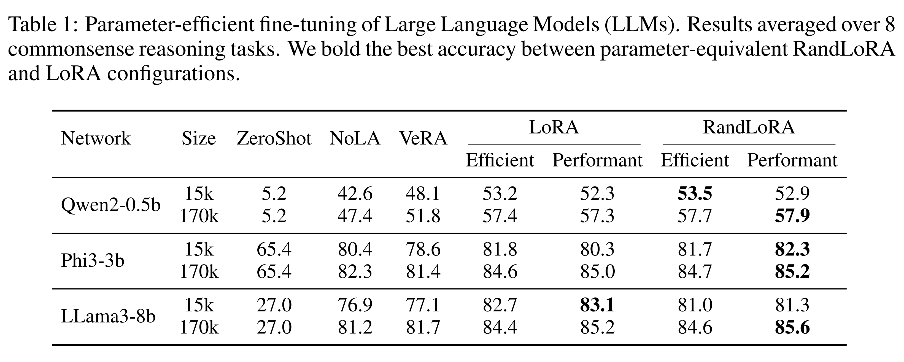
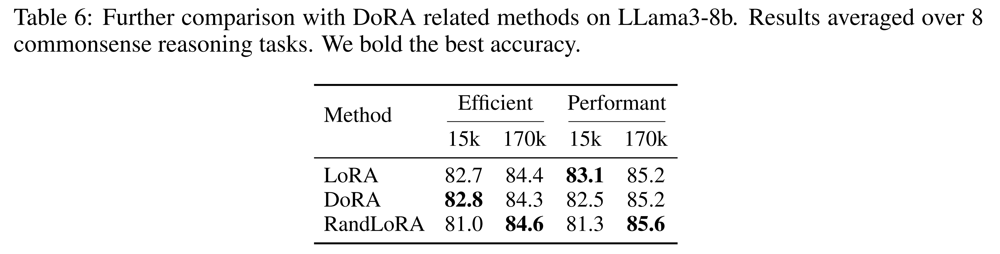
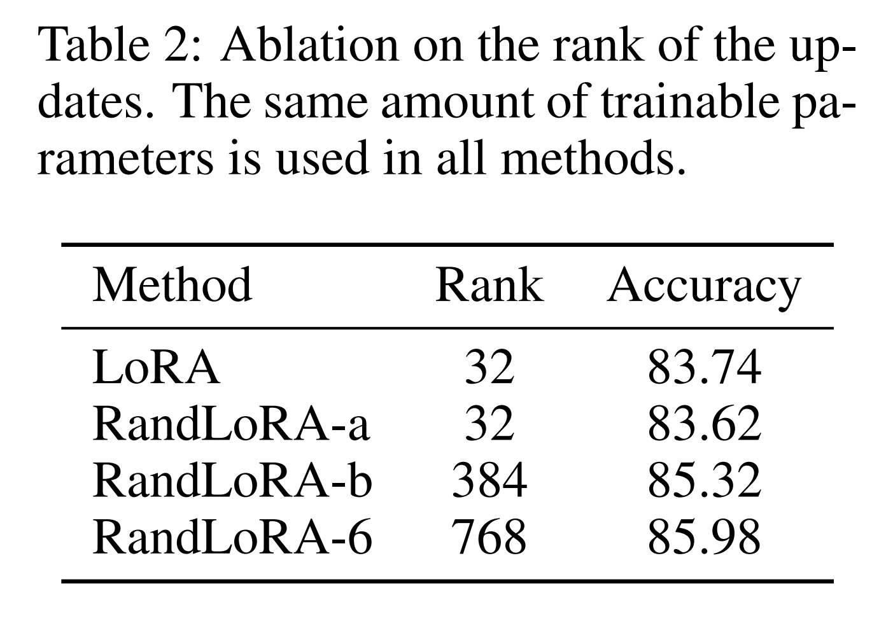

논문 및 이미지 출처 : <https://arxiv.org/pdf/2502.00987>

# Abstract

Low-Rank Adaptation (LoRA) 와 그 변형들은 large transformer networks 의 fine-tuning 성능을 유지하면서도 trainable parameters 와 memory 요구량을 줄이는 데 있어 인상적인 결과를 보여왔다. 그러나 weight update 의 low-rank 특성은 fine-tuned model 의 representation power 를 본질적으로 제한하며, 이는 복잡한 task 에서 성능 저하를 야기할 수 있다. 따라서 LoRA 와 standard fine-tuning 사이에 성능 격차가 관찰될 때, 그 원인이 trainable parameters 의 감소 때문인지 아니면 rank 부족 때문인지라는 중요한 질문이 제기된다. 

본 논문은 이 질문에 답하기 위해 **RandLoRA** 를 소개한다. 

* RandLoRA 는 low-rank, non-trainable random matrices 의 learned linear combinations 을 활용하여 full-rank update 를 수행하는 parameter-efficient 방법이다. 
* 저자의 방법은 optimization 을 fixed random matrices 에 적용되는 diagonal scaling matrices 로 제한함으로써 trainable parameters 의 수를 제한한다. 
* 이를 통해 training 과정에서 parameter 및 memory 효율성을 유지하면서도 low-rank 제한을 효과적으로 극복할 수 있다. 

Vision, language, vision-language benchmark 에 걸친 광범위한 실험을 통해, 저자는 LoRA 와 기존 random basis 방법들의 한계를 체계적으로 평가한다. 그 결과, full-rank update 가 vision 및 language task 각각에서 유리하며, 특히 vision-language task 에서 RandLoRA 는 LoRA 와 standard fine-tuning 사이의 성능 격차를 크게 줄이거나 때로는 제거함으로써 그 효율성을 입증한다.

# 1 Introduction

Large pre-trained model 은 방대한 data 를 활용하여 일반화 능력을 크게 향상시키고 다양한 task 에서 뛰어난 범용성을 보여왔다. 그러나 이로 인해 parameter 수가 급격히 증가하며, downstream task 에 대해 이러한 model 을 fine-tuning 하는 데 필요한 computation 자원 또한 크게 늘어난다. 이 문제를 해결하기 위해 parameter-efficient fine-tuning (PEFT) 접근법들이 제안되었으며, 그 중 low-rank adaptation (LoRA) 은 pre-trained model 의 low intrinsic dimensionality 에서 영감을 받아 weight update 를 two low-rank matrices 의 product 로 표현한다. 이를 통해 training 과정에서 trainable parameters 와 memory 요구량을 크게 줄일 수 있다. 또한 rank 를 조절함으로써 trainable parameters 의 수를 유연하게 설정할 수 있어, 다양한 자원 제약 환경에서 높은 flexibility 를 제공한다.

LoRA 가 parameter-efficient 환경에서 강력한 성능을 보이지만, 저자의 분석에 따르면 rank 와 learnable parameters 를 늘려도 standard fine-tuning 과의 accuracy gap 을 메우지 못하는 accuracy plateau 현상이 존재한다. 이러한 비효율적 scaling 특성은 low-rank 구조가 본질적으로 갖는 한계를 드러내며, 특히 더 많은 parameter 가 필요한 복잡한 task 에서 문제가 된다. 이상적으로는 full-rank update 를 도입하면서도 parameter-efficient 특성을 유지해야 한다. 이를 위해 저자는 **RandLoRA** 를 제안한다. 

* RandLoRA 는 non-trainable low-rank matrices 로 구성된 linearly-independent random bases 를 활용하며, random low-rank bases 의 linear combination 에 대한 scaling coefficients 만 학습한다. 
* 이로써 저자의 방법은 low memory usage 를 유지하면서 full-rank update 를 수행할 수 있다. 
* 결과적으로 RandLoRA 는 parameter efficiency 와 full-rank update 사이의 균형을 달성하며, 보다 유연하고 효과적인 fine-tuning 을 가능하게 한다.

광범위한 실험을 통해 저자는 LoRA 의 low-rank formulation 이 가지는 한계를 실증적으로 보여주며, 특히 vision-language task 에서 RandLoRA 가 유사한 parameter budget 하에서도 성능을 향상시킬 수 있음을 입증한다. 

Fig. 1 은 vision (DinoV2), vision-language (CLIP), commonsense reasoning (LLama3-8B) 에 걸친 주요 결과를 요약한다. 

* 여기서 LoRA 의 parameter count 증가가 매우 제한적인 성능 향상만을 가져오는 반면, RandLoRA 는 parameter budget 이 커질수록 LoRA 를 능가하며 full-rank update 전략 덕분에 parameter-efficient 특성을 유지한다. 
* 또한 저자의 분석에 따르면 RandLoRA 는 LoRA 와 달리 deep layer 의 activation pattern 이 standard fine-tuning 과 더 유사하며, loss landscape 시각화 결과 RandLoRA 가 도달하는 local minima 는 standard fine-tuning 과 더 가깝고 동일 parameter count 에서 항상 더 낮은 loss 로 이어진다.
* 추가적으로 저자는 sparse random bases 의 통합을 탐구했으며, 초기 결과에 따르면 sparse bases 또한 RandLoRA 의 성능을 유지한다. 
  * 이는 large transformer model 학습 시 memory 및 computation 요구량을 추가로 줄이면서도 성능을 유지할 수 있는 가능성을 보여준다.

저자의 기여는 다음과 같이 요약된다:

1. Large pre-trained model 을 fine-tuning 할 때 rank 와 trainable parameters 수의 상호작용을 분석하고, 큰 rank 가 필요할 때 LoRA 의 성능 향상 한계를 규명한다.
2. RandLoRA 를 제안한다. 이는 random basis combination 에 기반한 새로운 parameter-efficient fine-tuning (PEFT) 전략으로, LoRA 와 동일한 memory overhead 내에서 full-rank update 를 가능하게 한다.
3. Pure vision, vision-language image classification, commonsense reasoning 에 이르는 다양한 pre-trained architecture 와 task 전반에서 RandLoRA 를 철저히 평가하여 그 범용성과 효과성을 입증한다.

# 2 Related Work

## 2.1 Low Rank Adaptation of Large Models

Large language model 의 Low Rank Adaptation (LoRA) 는 fine-tuning 패러다임에 혁신을 가져와, memory 제약 환경에서도 특정 task 에 적응할 수 있게 하고 larger model 에 대한 접근을 민주화하였다. LoRA 는 처음 (Hu et al., 2022) 에 의해 소개되었으며, fine-tuning 과정의 weight update 가 full-rank update 없이도 적절한 성능에 도달할 수 있다는 관찰에 기반한다. Weight update 를 two low-rank matrices 의 product 로 factorization 함으로써, LoRA 는 large model 을 적응시키는 memory-efficient 해법을 제공한다. 또한 low-rank matrices 가 original weight matrix 크기에 병합된 이후에는 inference 시 latency 가 발생하지 않는다.

LoRA 의 성공을 기반으로 다양한 개선 방법들이 제안되었다. 

* 예를 들어, Weight-decomposed LoRA (DoRA) 는 LoRA update 를 magnitude 와 direction 성분으로 분해하여 convergence 를 개선한다. 
* AdaLoRA 와 AutoLoRA 는 specialized metrics 또는 meta-learning 을 활용하여 layer 별 필요에 맞게 rank 를 동적으로 조정하는 rank-adapted LoRA formulation 을 제안한다. 
* 또 다른 개선 방법으로는 truncated SVD 를 이용해 pre-trained weight 로부터 low-rank matrices 를 초기화하는 전략이 있으며, decomposition 전체를 fine-tuning 하는 Pissa, singular value matrix 만 fine-tuning 하는 SVFT 및 LoRA-XS 등이 있다. 
* HydraLoRA 는 low-rank decomposition 의 scaling-up matrix 를 여러 개로 분할하고 routing layer 를 추가하여 각 head 의 기여도를 선택하도록 하였다. 
* 이 formulation 은 multi-task learning 을 향상시키지만, test-time 에 pre-trained weight 로 병합하는 LoRA 의 장점을 잃게 된다. 

이러한 발전들은 LoRA 의 효율성을 집약적으로 강화하여, large language model fine-tuning 의 핵심으로 자리매김하게 하였다.

## 2.2 Parameter-Efficient Fine-Tuning (PEFT) Usning Random Bases

최근 연구들은 LoRA 의 trainable parameter 수를 더 줄이는 데 집중하고 있다. 이는 특히 low-shot application 에서 중요하며, trainable parameter 를 최소화함으로써 overfitting 을 방지하고 generalization 을 향상시킬 수 있다. 유망한 접근법 중 하나는 random bases 조합을 활용하는 것으로, 무작위로 생성된 matrices 를 제한된 수의 trainable parameter 로 조합하여 weight update 를 근사하는 방법이다.

PRANC 는 random base 전략을 개척했으며, back-propagation 을 통해 random matrices 의 weighted average 를 학습한다. 그러나 PRANC 의 방식은 각 layer 마다 여러 full-size weight matrices 를 평균하므로 memory consumption 이 크다. 이를 해결하기 위해 저자는 fixed seed 를 갖는 random number generator 를 활용하여 forward 및 backward pass 중에 random bases 를 on-the-fly 로 생성하여 memory usage 를 network 내 가장 큰 trained layer 수준으로 줄였지만, training latency 는 증가하게 된다.

PRANC 를 기반으로 NOLA 는 random bases 를 two low-rank random matrices 의 곱으로 추정하는 개선된 알고리즘을 도입하였다. 각 matrix 는 learnable scalar 로 가중된 뒤 합쳐져 matrix multiplication 이 수행된다. 이 접근은 사실상 rank-1 LoRA 를 근사하며, PRANC 대비 trainable parameters 를 크게 줄이고 training 중 memory consumption 도 감소시킨다.

동시에 VeRA 는 여러 rank-1 matrix 를 합산하는 NOLA 와 달리 single high-rank random matrix (e.g., 256 또는 1024) 를 사용하는 대안적 전략을 제안하였다. VeRA 는 또한 random bases 를 scaling 하는 독자적인 전략을 채택하며, 이는 Sec. 4 에서 저자의 방법과 연결된다. NOLA 와 VeRA 는 few-shot fine-tuning 환경에서 LoRA 와 유사한 성능을 달성하면서도 훨씬 적은 수의 parameters 를 학습한다.

## 2.3 Alternative Strategies for Parameter-Efficient Fine-Tuning

Parameter-efficient adaptation 을 위해 weight tuning 이 아닌 다른 전략도 연구되었으며, 그중 하나는 prompt tuning 이다. Context Optimization (CoOP) 은 CLIP class name 을 위한 learnable context vectors 를 도입하였고, 이후 Conditional CoOP (CoCoOP) 는 이를 instance-specific prompt 로 확장하였다. 

최근 prompt tuning 방법들인 DePT 와 PromptSRC 는 shared subspace 를 분리하거나 prompt 를 regularization 하여 knowledge preservation 을 강조한다. 그러나 prompt tuning 은 parameter-efficient 하지만 few-shot setting 을 넘어서는 generalization 에서는 한계를 가지며, data 가 증가하면 LoRA 보다 효과가 떨어질 수 있다. 따라서 본 논문에서는 prompt tuning 을 weight-tuning 과는 독립적인 접근으로 간주한다.

# 3 Motivations

문헌 조사를 통해, LoRA 개선 연구는 주로 trainable parameters 의 수를 더 줄이는 데 초점을 맞추고 있음을 확인하였다. 이는 adaptable rank 를 활용하거나, fixed 혹은 shared low-rank projection matrices 를 사용하는 방식으로 이루어진다. 그러나 moderate 이상의 parameter budget 에서는 LoRA 가 여전히 강력한 경쟁력을 유지한다.

또한 초기 연구에서는 random basis combination 이 large model 을 위한 parameter-efficient 전략으로서, 특히 few-shot 시나리오에서 매우 유망함을 설득력 있게 보여주었다. 여기에는 서로 다른 두 가지 접근이 존재한다. VeRA 는 large-rank 를 가진 단일 random base 를 사용하는 전략을 취하고, NoLA 는 small-rank random bases 를 다수 평균하는 방식을 제안한다. 두 접근법 모두 few-shot 환경에서는 LoRA 와 유사한 성능을 보이면서도 trainable parameters 수를 크게 줄이는 데 성공했다. 그러나 본 논문에서 보이듯이, 이러한 parameter 수 감소는 few-shot learning 을 넘어서는 학습에서 성능 한계로 이어져, 알고리즘의 scalability 를 제한한다.

마지막으로, LoRA 는 large model 의 fine-tuning 에 low-rank update 만으로 충분하다는 가정을 전제로 한다. 본 논문은 이 가정의 보편성을 문제 삼으며, full-rank 대안이 필요할 수 있는 시나리오를 탐구한다. 여기서 근본적인 질문이 도출된다. Parameter efficiency 는 (1) update 의 low-rank 특성에 의해 제한되는가, 아니면 (2) parameter 수가 적다는 사실에 의해 제한되는가? Parameter-efficient full-rank update 가 더 정확한 해법을 제공할 수 있는가? 본 논문은 이러한 질문에 답하고자, large transformer model 의 parameter efficiency 와 low-rank fine-tuning 사이의 균형을 탐색하며, 기존 접근법의 한계를 밝힌다.

# 4 RandLoRA—Parameter-Efficient Fine-Tuning with Full Rank

## 4.1 Weight Updates as a Sum of Low-Rank Matrices

$W_0 \in \mathbb{R}^{D \times d}$ 를 large pre-trained model 의 weight matrix 라 하자. Fine-tuning 은 특정 downstream task 에 맞도록 적응된 model 을 얻기 위해, 적절한 $\Delta W \in \mathbb{R}^{D \times d}$ 를 찾는 것을 목표로 한다. 즉, fine-tuned weight $W_0 + \Delta W$ 가 필요하다. 일반성을 잃지 않고 $d < D$ 라고 가정한다. RandLoRA 의 motivation 은 $\Delta W$ 의 singular value decomposition (SVD) 에서 비롯된다: $\Delta W = U \Sigma V^T,$. 여기서 $U \in \mathbb{R}^{D \times d}, \Sigma \in \mathbb{R}^{d \times d}, V \in \mathbb{R}^{d \times d}$ 이다. 이 decomposition 은 rank-1 matrices 의 product sum 으로 쓸 수 있다:

$$
\Delta W = \sum_{i=1}^d u_i \sigma_i v_i^T, \tag{1}
$$

* 여기서 $u_i$ 와 $v_i$ 는 각각 $U$ 와 $V$ 의 column 을 의미한다. 
* 이 맥락에서 LoRA 와 같은 low-rank update 는 $\Delta W$ 의 가장 큰 singular values 몇 개만 근사하고, 나머지 정보는 버리는 것으로 볼 수 있다.

이를 좀 더 명확히 하기 위해, LoRA 의 rank 를 $r$ 이라 하고, 단순화를 위해 $d$ 가 $r$ 로 나누어 떨어진다고 하자. 그러면 Eq. (1) 을 rank-$r$ matrices 곱의 합으로 다시 쓸 수 있다:

$$
\Delta W = \sum_{j=1}^n U_j \Sigma_j V_j^T, \tag{2}
$$

* 여기서 $U_j \Sigma_j V_j^T = \sum_{i=rj}^{r(j+1)} u_i \sigma_i v_i^T,$
* 그리고 $n = d / r$ 이다.

이 formulation 은 LoRA 가 첫 번째 low-rank partition $U_1 \Sigma_1 V_1^T$ 만을 근사하며, 나머지 $\sum_{j=2}^n U_j \Sigma_j V_j^T \approx 0$ 으로 가정함을 드러낸다. 그러나 저자는 $n-1$ 개의 나머지 항들이 pre-trained weight $W_0$ 로부터 더 큰 변화를 필요로 하는 복잡한 task-specific variation 을 포착하는 데 중요한 역할을 할 수 있다고 주장한다.

## 4.2 Parameter-Efficient Approximation of Low-Rank Matrices

LoRA 의 formulation 을 이용해 $\Delta W$ 의 더 많은 항들을 근사하려 하면, parameter efficiency 는 빠르게 사라진다. 결국 full-rank $d$ 를 위해 $Dd + d^2$ 개의 parameter 가 필요하며, 이는 original $\Delta W$ 의 $Dd$ parameter 보다 오히려 증가한다.

저자는 full-rank update 를 수행하면서도 parameter-efficiency 를 유지하기 위해, Eq. (2) 의 각 항을 low-rank random bases 를 사용해 근사하고 scaling coefficients 만 학습하는 방법을 제안한다:

$$
\Delta W = \sum_{j=1}^n B_j \Lambda_j A_j \Gamma_j, \tag{3}
$$

* 여기서 $B_j \in \mathbb{R}^{D \times r}$, $A_j \in \mathbb{R}^{r \times d}$ 는 non-trainable random matrices 이다. 
* learnable two diagonal scaling matrices $\Lambda_j \in \mathbb{R}^{r \times r}$ 와 $\Gamma_j \in \mathbb{R}^{d \times d}$ 는 각 항마다 고유하며, 보완적인 역할을 수행하여 근사 성능을 향상시킨다. 
* 구체적으로 $A_j \Gamma_j$ 는 input feature 를 low-dimensional space (rank-$r$) 로 변환하고, $\Lambda_j$ 는 compressed feature 를 scaling 한 뒤 $B_j$ 가 이를 output space 로 다시 변환한다.

$\Gamma_j$ 가 $A_j$ 의 column space 에 작용하고 각 $A_j$ 마다 고유하므로, 저자는 표현력을 잃지 않으면서 memory 사용량을 줄이기 위해 모든 항에서 공유되는 단일 $A \in \mathbb{R}^{r \times d}$ 를 사용한다. 이 경우 update 는 다음과 같이 정리된다:

$$
\Delta W = \sum_{j=1}^n B_j \Lambda_j A \Gamma_j. \tag{4}
$$

Full-rank update 를 위해 $n = d / r$ 로 설정하면, learnable parameters 의 수는 $\frac{d^2}{r} + d$ 이 된다. 주목할 점은 LoRA 와 달리 RandLoRA 에서는 learnable parameters 수가 random base 의 rank 에 **역비례**한다는 것이다. 즉, base 의 rank 를 늘리면 trainable parameters 수는 감소하면서도 full-rank 특성을 유지한다. 요약하면, RandLoRA 는 $\Delta W$ 의 개별 SVD 요소를 정밀하게 표현하는 정확성을 일부 희생하는 대신, 더 넓은 부분의 singular value decomposition 을 포착할 수 있도록 설계된 것이다.

## 4.3 Convergence Analysis

이 절에서는 RandLoRA 를 통한 weight update 가 특정 이론적 조건하에서 일반적인 행렬을 정확히 근사할 수 있음을 보이는 정리를 제시한다.

**Theorem 4.1.**
*$W$ 를 fixed $D \times d$ matrix 라 하자. 여기서 $D > d$ 이고 $\text{rank}(W) = d$ 이다. $1 \leq n \leq d$ 인 $n$ 을 고정하고 $d = nr$ 이라고 하자. 그러면 $W$ 는 SVD 를 통해 다음과 같이 분해될 수 있다:*

$$
W = \sum_{j=1}^n U_j \Sigma_j V_j^T, \tag{5}
$$

* *여기서 $U_j \in \mathbb{R}^{D \times r}$, $V_j \in \mathbb{R}^{r \times d}$ 는 각각 left/right singular vector 의 부분 행렬이고,* 
* *$\Sigma_j \in \mathbb{R}^{r \times r}$ 는 $r$ 개의 singular value 를 포함한다.*

*각 $1 \leq j \leq n$ 에 대해, $B_j$ 는 Gaussian 혹은 uniform distribution 으로부터 i.i.d 로 샘플링된 원소를 가지는 $D \times r$ random matrix, $A_j$ 는 같은 방식으로 생성된 $r \times d$ random matrix 이다. $\Lambda_j$ 는 diagonal $r \times r$ matrix, $\Gamma_j$ 는 diagonal $d \times d$ matrix 로 각각 유사하게 샘플링된다.*

다음 조건을 가정하자:

$$
\|U_j \Sigma_j V_j^T - B_j \Lambda_j A_j \Gamma_j \|_F \leq \epsilon \tag{6}
$$

*여기서 $0 < \epsilon$ 이다. 그렇다면 probability 1 로 각 $B_j \Lambda_j A_j \Gamma_j$ 는 full-rank 를 가지며,*

$$
\Bigg\| W - \sum_{j=1}^n B_j \Lambda_j A_j \Gamma_j \Bigg\|_F \leq n \cdot \epsilon. \tag{7}
$$

Theorem 4.1 의 증명에 대한 자세한 내용은 Appendix D.1 을 참고한다.

Theorem 4.1 은 $B_j \Lambda_j A_j \Gamma_j$ 가 $\Delta W$ 의 $r$-truncated singular value 를 잘 근사한다는 가정에 기반하며, 이는 예를 들어 VeRA 에서 경험적으로 확인된 바 있다. 이 경우 $\Delta W$ 는 $\sum_{j=1}^n B_j \Lambda_j A_j \Gamma_j$ 로 정확히 근사될 수 있음을 보여주며, 이는 RandLoRA formulation 의 동기를 뒷받침한다.

반면 rank-$r$ LoRA 가 달성할 수 있는 최선의 근사는 $W$ 의 $r$-truncated SVD 이다. Eckart-Young-Mirsky 정리에 따르면, $W$ 와 low-rank adaptation $BA$ 의 차이에 대한 Frobenius norm 은 다음과 같이 bound 를 갖는다:

$$
\| W - BA \|_F \geq  \Bigg\| W - \sum_{i=1}^r u_i \sigma_i v_i^T \Bigg\|_F  = \sum_{i=r+1}^d \sigma_i^2. \tag{8}
$$

따라서 LoRA 의 rank-$r$ approximation 은 $W$ 의 last $d-r-1$ 개의 squared singular value 합에 의해 제한되지만, RandLoRA 는 이러한 bound 를 가지지 않고 오직 $B_j \Lambda_j A_j \Gamma_j$ 가 $W$ 의 SVD 의 length-$r$ segment 를 얼마나 잘 근사할 수 있는지 ($\epsilon$) 에 의해만 성능이 제한된다.

# 5 Experiments

## 5.1 Experimental Settings

저자는 LoRA, NoLA, VeRA 세 가지 SOTA 방법과 RandLoRA 를 종합적으로 비교한다. 공정한 비교를 위해 LoRA, NoLA, VeRA, RandLoRA 모두에 대해 hyperparameter search 를 수행하여 최적 설정을 찾았다. 또한 General Language Understanding Evaluation (GLUE) 및 End-to-End (E2E) natural language generation benchmark 에 대한 추가 실험과 prompt-tuning 알고리즘과의 비교는 Tab. 4, 5 에 포함된다.

## 5.2 Vision: DinoV2 and CLIP's Vision Backbone

저자는 image classification 을 위해 pre-trained ViT-B/14 DinoV2 와 ViT-B/32, ViT-L/14 CLIP vision 전용 backbones 를 fine-tuning 하였다. 총 21 datasets 에 대해 fine-tuning 을 수행했으며, {1, 2, 4, 16}-shot 학습과 전체 training data 의 50% 및 100% 사용 시의 성능을 평가하였다.

RandLoRA 는 LoRA rank 32 와 동일한 parameter 수를 가지도록 rank 를 조정하였으며, random base 대안으로 VeRA 와 NoLA 도 포함하였다. DinoV2 의 경우 vision backbone 을 fine-tuning 하고 linear classifier 를 학습하였으며, CLIP 의 경우 language embedding 은 freeze 시킨 상태로 classification 을 수행하였다. Fig. 2 에 결과와 VRAM usage 가 요약된다.

* 실험 결과, LoRA 는 DinoV2 에서는 standard fine-tuning (FT) 과 비교했을 때 성능 격차가 작지만, CLIP 에서는 더 큰 격차를 보였다. 
* 동일 parameter 수를 가정할 때 RandLoRA 는 LoRA 대비 향상된 성능을 보이며 FT 와의 성능 격차를 줄였다. 
  * 이는 DinoV2 backbone 의 학습 objective 와도 관련이 있으며 (Sec. 6.1 참조), RandLoRA 가 CLIP 구조에서 LoRA 의 rank 제한을 드러내고, full-rank update 의 필요성을 보여준다. 
* 한편 VeRA 와 NoLA 는 few-shot setting 에서는 효율적이었으나, data 가 많아질수록 한계를 드러냈다.

## 5.3 Vision-Language: CLIP

이 절에서는 vision encoder 와 language encoder 모두를 학습시키는 CLIP-like transformer architectures 를 대상으로 classification dataset 에 대해 fine-tuning 을 수행한다. Dataset pool 에는 ImageNet 을 추가하여 총 22 개 classification dataset 으로 확장하였다.

RandLoRA 와 LoRA 의 효과를 다양한 규모의 model 에 대해 비교하기 위해 open-clip repository 에서 제공하는 사전 학습된 세 가지 CLIP 변형을 사용하였다: ViT-B/32 (151M parameters), ViT-L/14 (428M parameters), ViT-H/14 (1B parameters). RandLoRA 의 rank 는 Sec. 5.2 와 동일한 방식으로 조정하여 rank 32 LoRA 와 유사한 parameter 수를 유지하였다: ViT-{B/32,L/14,H/14} 에 대해 각각 RandLoRA-{6,8,10} 을 적용하였다.

Fig. 3 에 요약된 결과가 제시된다. 

* CLIP 과 같은 vision-language architecture 의 fine-tuning 은 pure vision task 보다 더 어려운 optimization 문제이므로, FT 와 LoRA 사이의 성능 격차가 더 크게 나타났다. 
* Fig. 1 에서 확인할 수 있듯, LoRA 의 rank 를 증가시켜도 이 격차는 해소되지 않았다. 
  * 이는 단순히 parameter 수를 늘리는 것만으로는 충분하지 않으며, update 의 rank 가 LoRA 성능의 근본적 한계임을 시사한다.
* 동일 parameter 수로 RandLoRA 를 실행하면 FT 와의 격차가 줄어드는 것을 확인하였다. 
  * NoLA 와 VeRA 와의 비교에서도 Sec. 5.2 와 동일한 결론을 얻었으나, 이 경우 VeRA 는 더 큰 data budget 에서 상당히 경쟁력이 있었으며, 이는 CLIP-like vision-language architecture 의 fine-tuning 에서 high-rank 의 중요성을 보여준다. 
  * 또한 RandLoRA 의 base sharing 전략 덕분에, LoRA 대비 VRAM usage 를 줄일 수 있었으며, 이는 ViT-H/14 와 같은 대규모 architecture 에서 특히 중요한 장점으로 작용한다.

## 5.4 Commonsense Reasoning

저자는 RandLoRA 를 LLM 의 commonsense reasoning task fine-tuning 에 대해 평가하였다. 총 8 개 task (Appendix C.4 참조) 를 대상으로, Qwen2 (0.5B), Phi3 (3B), Llama3 (8B) model 을 fine-tuning 하였으며, Hu et al. (2023) 을 따라 170,000 개의 full dataset 과 15,000 개 subset 두 가지 regime 으로 학습하여 data efficiency 를 평가하였다.

Tab. 1 은 RandLoRA 와 LoRA, VeRA, NoLA 를 비교한 결과를 보여준다. LoRA 는 rank-16 ("Efficient") 과 rank-32 ("Performant") 두 가지를 실험하였으며, RandLoRA 는 동일하거나 더 적은 parameter 를 사용하여 공정한 비교를 보장하였다. 상세 결과는 Appendix 15 에 제시된다.

* 결과적으로 RandLoRA 는 LoRA 와 경쟁력 있는 성능을 보였으며, 때때로 이를 능가하였다. 
* Phi3 는 강력한 zero-shot 능력 덕분에 VeRA 와 NoLA 가 적은 parameter 로도 좋은 성능을 냈다. 반면, Qwen2 와 Llama3 는 더 많은 적응이 필요하여 VeRA 와 NoLA 가 LoRA 의 성능에 도달하기 어려웠다. 
* 15k-sample regime 에서는 LoRA 와 RandLoRA 모두 trainable parameters 가 커질 경우 overfitting 이 발생하여, dropout regularization 을 적용하더라도 성능이 감소하였다. 
  * 그러나 full 170k sample 로 학습할 경우 RandLoRA 는 일관되게 LoRA 를 능가하였다.
* 또한 Llama3 에 대해 DoRA 와 비교한 결과는 Appendix 의 Tab. 6 에 제시되어 있으며, RandLoRA 는 큰 parameter budget 에서 DoRA 와 LoRA 모두를 능가하였다. 
* 반면 "Efficient" budget 에서는 DoRA 와 LoRA 가 유사한 성능을 보였다. 이러한 결과는 RandLoRA 가 특히 큰 dataset 과 parameter budget 환경에서 LLM fine-tuning 을 위한 LoRA 및 DoRA 의 강력한 대안임을 보여준다.

# 6 Discussion

## 6.1 Similarities with Fine-Tuning: Activations

저자는 LoRA 와 RandLoRA 가 fine-tuned model 의 activation 을 얼마나 잘 모방하는지 평가하기 위해 activation similarity 를 분석하였다. Centered Kernel Alignment (CKA) (Kornblith et al., 2019) metric 을 사용하여, LoRA, RandLoRA, fully fine-tuned model 의 activation 간 유사도를 측정하였다. 이 프로토콜은 각 방법이 dataset-specific activation pattern 을 얼마나 잘 포착하는지를 평가한다.

Fig. 4a 는 CLIP 과 DinoV2 vision backbones 의 self-attention layer 및 MLP layer 에 대한 CKA score 를 5 개 dataset 에 대해 평균한 결과를 보여준다. 

* 여기서 RandLoRA 는 LoRA 대비 개선된 결과를 보였다. CLIP 의 경우 LoRA 는 deeper layer 로 갈수록 CKA 가 감소하여 fine-tuned activation 과의 alignment 를 잃는다. 
* RandLoRA 는 동일한 parameter 수로 early layer 에서는 LoRA 와 유사한 alignment 를 보이지만, deeper layer 에서는 이를 개선한다.
* DinoV2 에서는 이러한 LoRA 의 CKA 감소 현상이 나타나지 않았으며, 이는 DinoV2 에서 LoRA 가 fine-tuning 과 거의 동일한 정확도를 보인 이유를 설명한다. 
  * 이러한 차이는 training objective 에서 기인하는 것으로 보인다. 
* DinoV2 의 visual objective 는 classification 에 적합한 feature 를 이미 생성하므로, weight 조정이 최소한으로 필요하고 low-rank LoRA 로도 충분하다. 
  * 그러나 CLIP 의 multimodal objective 는 vision task 에 효과적으로 적응하기 위해 더 높은 rank 를 요구한다.

## 6.2 Similarities with Fine-Tuning: Loss Landscape

저자는 standard fine-tuning, LoRA, RandLoRA 로 학습된 model 의 loss landscape connectivity 를 분석하였다. LoRA, RandLoRA, fine-tuning model 을 각각 (0,0), (1,0), (0.5,1) 위치에 두고 2D loss landscape plane 을 시각화하였다. 각 점 $(x,y)$ 에 대해, 계수 $\alpha_i$ ($\sum_{i=1}^3 \alpha_i = 1$) 를 풀어 model weight 를 보간하고, training data 의 5% subset 에 대해 loss 를 평가하였다.

* Fig. 4b 에 따르면 CLIP 의 경우 RandLoRA 는 LoRA 대비 더 깊은 loss minima 에 도달하며, 동일한 parameter 수를 학습했음에도 fine-tuning optimum 으로 가는 저손실 경로를 종종 발견한다. 
* DinoV2 의 경우 모든 optimum 이 동일한 low-loss basin 내에 존재하며, LoRA 가 이미 fine-tuning 과 가깝게 위치하여 강력한 성능을 반영한다. 
* 이러한 시각화는 LoRA 의 low-rank 구조가 특히 복잡한 task 에서 제한적임을 강조하고, RandLoRA 가 full-rank update 덕분에 LoRA 와 동일한 parameter 로도 더 깊은 minima 를 도달할 수 있음을 보여준다. 추가 dataset 에 대한 3D 시각화는 Appendix A 에 제시된다.

## 6.3 Further Studies of Full vs Low-Rank Fine-Tuning of CLIP

저자는 RandLoRA 가 CLIP fine-tuning 에서 LoRA 대비 성능 우위를 가지는 이유가 더 나은 SVD approximation 때문인지, full-rank capability 때문인지 분석하였다. 이를 위해 두 가지 rank-controlled variant 를 도입하였다.

* **RandLoRA-a**: update rank 를 $r$ 로 제한하여, multiplication 전에 bases 를 평균한다:

$$
\Delta W = \Big( \sum_{i=1}^N B_i \Lambda_i \Big) \Big( \sum_{i=1}^N A_i \Gamma_i \Big)
$$

* **RandLoRA-b**: half-rank update 를 사용하며, $N = \text{rank}(\Delta W)/r/2$ 로 설정하고 base rank 를 조정하여 RandLoRA-r 과 parameter 수를 동일하게 유지한다.

모든 variant 는 동일한 parameter 수를 학습하며, 차이는 update rank 에 있다. Tab. 2 는 CLIP ViT-B/32 에 대해 22 개 dataset 의 100% 데이터에서 accuracy 를 보여준다. 

결과적으로 update rank 가 높을수록 동일 parameter 수에서 성능이 향상되었으며, 이는 특히 CLIP fine-tuning 에서 high-rank update 의 중요성을 뒷받침한다.

## 6.4 Sparse Random Matrices

저자는 memory 및 computation 효율성을 개선하기 위해 sparse random matrices 사용을 탐구하였다. 이는 random projection 문헌과 Johnson-Lindenstrauss lemma 에서 영감을 받았다. 구체적으로 Bingham & Mannila (2001), Li et al. (2006) 의 sparse 구조를 채택하여, matrix element 를 ${-1, 0, 1}$ 로 설정하고 확률을 $\Big\{ \tfrac{1}{s}, 1-\tfrac{2}{s}, \tfrac{1}{s} \Big\}$ ($s \in [2, \sqrt{D}]$, $W \in \mathbb{R}^{D \times d}$) 로 두며 normalization 을 적용한다. Appendix C.6 은 이 formulation 이 full-rank 를 유지함을 논의한다.

Tab. 3 의 실험 결과, RandLoRA 에 sparse base 를 적용한 경우 sparsity ratio $s \in {2, 6, \sqrt{D}, 100, 200}$ 를 실험했으며, sparsity 수준은 66%\~99% 에 달했다. 

* Li et al. (2006) 과 일관되게, $\sqrt{D}$ 수준의 sparsity 가 dense matrix 와 유사한 성능을 보였으며, 이론적으로 memory 및 computation 감소 효과가 있다. 
* 그러나 sparsity 가 지나치게 높아지면 정확도가 저하되었다. 
  * 이는 compute-optimized sparse random base 를 활용한 RandLoRA 변형 가능성을 시사한다.

## 6.5 Summary of Differences with Related Random Bases Algorithms

VeRA, NoLA 는 parameter-efficient fine-tuning 을 위해 random bases 를 사용하였다. 그러나 이들은 low-rank LoRA update 를 근사하는 반면, RandLoRA 는 full-rank weight update 를 근사한다는 점에서 다르다. 다시 말해, VeRA 는 $W$ 분해에서 첫 block 만을 근사하는 반면, RandLoRA 는 모든 block 을 근사한다.

따라서 VeRA 와 NoLA 는 low-rank update 를 유지하면서 parameter efficiency 를 개선하지만, RandLoRA 는 full-rank update 가 필요한 경우를 해결한다. 더 나아가 Eq. (4) 는 RandLoRA 의 parameter 수가 유연하게 조절 가능함을 보여준다. 즉, RandLoRA 는 $r = \text{rank}(W)$ 일 때 VeRA 수준의 효율성을, $r = 1$ 일 때 full fine-tuning 수준의 parameter 를 가지면서도 full-rank 특성을 유지한다.

## 6.6 Limitations

RandLoRA 의 효과에도 불구하고, 저자는 향후 연구를 위한 세 가지 주요 한계를 확인하였다.

1. **Computation overhead**
   RandLoRA 는 weight update 계산에서 추가적인 computation overhead 를 도입하여 대규모 model 학습 시 training 시간이 증가한다 (Appendix C.6.1 참조). 그러나 Sec. 6.4 에서 제시된 ternary sparse bases 를 활용하면 개선 가능성이 있다. 향후 연구에서는 이러한 ternary sparse base 를 활용해 matmul-free matrix combination 을 탐구해야 한다. 효율적인 구현은 비용이 큰 matrix product 를 단순 aggregation 으로 대체하여 floating-point 연산을 제거하고, 최적화된 CUDA kernel 개발 시 RandLoRA 의 학습 속도를 가속화할 수 있다.

2. **Non-random, optimal bases 탐구 필요**
   Eq. (6) 의 $\epsilon$ 을 줄이기 위해 non-random optimal bases $B_i$, $A$ 를 찾는 것이 convergence 및 효율성을 개선할 수 있다. 이는 pre-trained weight decomposition 이나 실험적 접근을 통해 발견될 수 있으며, RandLoRA 향상에 유망한 연구 방향이다.

3. **LoRA 와 RandLoRA 의 hybrid 접근**
   LoRA 는 $W$ 의 주요 SVD 성분을 추정하고, RandLoRA 는 나머지 spectral information 을 효율적으로 포착하는 hybrid 방법이 가능하다. Training objective 를 조화시키는 데 어려움이 있지만, RandLoRA 를 LoRA 학습 이후 refinement 단계로 활용하는 것이 출발점이 될 수 있다.

이러한 한계들을 해결한다면, RandLoRA 는 효율적인 full-rank fine-tuning 을 위한 잠재력을 더욱 높일 수 있다.

# 7 Conclusion

본 논문은 parameter efficiency 와 low memory cost 를 유지하면서도 full-rank model update 를 가능하게 하는 RandLoRA 를 제안하였다. 저자의 분석은 pre-trained architecture 의 fine-tuning 에서 full-rank update 가 중요함을 강조하며, 동일한 parameter 수 조건에서 LoRA 보다 뛰어난 성능을 보임을 확인하였다. 이는 large model fine-tuning 에서 full-rank update 의 가치를 보여준다.

다양한 task 에 걸친 광범위한 실험을 통해 저자의 방법의 효능을 입증하였다. RandLoRA 는 random base multiplication 으로 인해 computation overhead 가 증가하지만, memory consumption 은 통제 가능하며 실제 환경에서 이를 줄일 수 있는 방안도 제시하였다.

결론적으로 RandLoRA 는 consumer-grade hardware 에서 large pre-trained model 을 fine-tuning 하기 위한 LoRA 의 실질적 대안이 될 수 있으며, 효율적이고 효과적인 model adaptation 을 위한 중요한 기여를 제공한다. 본 연구 결과는 scalable 하고 범용적인 full-rank fine-tuning 기법에 대한 향후 연구를 촉진할 것이다.

