논문 및 이미지 출처 : <https://arxiv.org/pdf/2503.18225>

# Abstract

Parameter-Efficient FineTuning (PEFT) 방법은 large-scale pretrained model 의 광범위한 활용 가능성 덕분에 최근 크게 주목받고 있다. 이러한 방법은 매우 적은 computation cost 로 downstream task 에 빠르게 적응할 수 있게 한다. 그러나 LoRA 와 같은 널리 사용되는 fine-tuning 방법은 hyperparameter 선택이나 extended training regime 에서 robustness 가 제한되어 있어, out-of-the-box 성능을 최적화하는 데 어려움이 있다. 반대로 ETHER 와 같은 bounded approach 는 더 강한 robustness 를 제공하지만, extremely low-rank adaptation 과 fixed-strength transformation 으로 제한되어 adaptation expressive power 가 줄어든다.

본 연구에서는 learnable low-rank matrix 를 normalize 및 scale 하는 새로운 fine-tuning 방법인 **Decoupled Low-rank Adaptation (DeLoRA)** 를 제안한다. 

* DeLoRA 는 transformation 의 거리를 bound 함으로써 angular learning 과 adaptation strength 를 효과적으로 분리(decouple)하여 robustness 를 강화하면서도 성능을 유지한다. 
* Subject-driven image generation, natural language understanding, instruction tuning 에 대한 평가를 통해 DeLoRA 가 기존 PEFT 방법들과 비교해 동등하거나 더 나은 성능을 보이며, 동시에 강한 robustness 를 가진다는 것을 보인다.

# 1 Introduction

Deep learning 의 급격한 발전은 특히 computer vision 과 natural language processing 분야에서 large-scale pretrained model 의 개발을 이끌었다. 그러나 billions parameters 에 달하는 이러한 model 의 거대한 규모는 특정 downstream task 에 적응하는 과정에서 computation cost 와 efficiency 측면에서 심각한 도전 과제를 제기한다. 이러한 문제를 해결하기 위해 Parameter Efficient FineTuning (PEFT) 방법이 등장하였다. PEFT 방법은 full fine-tuning 에서 요구되는 large-scale parameter update 와 달리, small learnable parameter 만을 도입하는 것이 특징이다. 대표적인 예로 adapter 와 prompt tuning 이 있다.

본 연구에서는 simplicity 와 effectiveness 로 널리 채택된 fine-tuning 방법인 LoRA 를 개선하는 데 초점을 맞춘다. 그러나 LoRA 는 그 성과에도 불구하고 hyperparameter 선택에 민감하고, extended fine-tuning 과정에서 성능 저하가 발생하는 문제가 보고되었다. ETHER 및 ETHER+ 와 같은 robust fine-tuning 방법은 이러한 한계를 일부 해결하지만, extremely low-rank adaptation 과 fixed-strength transformation 으로 제한된다. 따라서 저자는 normalization 을 통해 weight update 에 boundary 를 도입하고, angular learning 과 adaptation strength 를 분리(decouple)하는 개선된 LoRA, 즉 **DeLoRA** 를 제안한다. 이는 다양한 setting 에서의 적응성을 향상시키면서도 personalization 및 inference 단계에서의 merging capability 를 유지한다.

DeLoRA 는 두 가지 관점에서 동기부여된다. 첫째, LoRA 의 확장으로서 normalization 을 추가한 접근이며, 둘째, ETHER 의 발전형으로서 high-rank update 를 가능하게 하는 접근이다. 저자는 design choice 에 대한 ablation study 를 수행하여 LoRA 및 ETHER 대비 개선된 결과를 보인다. 또한 image generation 과 LLM adaptation 을 포함한 다양한 task 에서 DeLoRA 의 장점을 검증한다.

요약하면, 본 연구의 기여는 다음과 같다.

* LoRA 와 ETHER 의 formulation 을 면밀히 검토하고, 새로운 PEFT 방법인 DeLoRA 를 도출한다.
* DeLoRA 가 대안 대비 강화된 robustness 와 decoupling 을 제공함을 보인다.
* DeLoRA 의 formulation 을 LoRA 와 ETHER 양쪽으로부터 유도하며 ablation study 를 광범위하게 수행한다.
* Vision 및 language benchmark 에서 DeLoRA 를 평가하여 기존 PEFT 방법과 동등하거나 더 나은 성능을 입증한다.

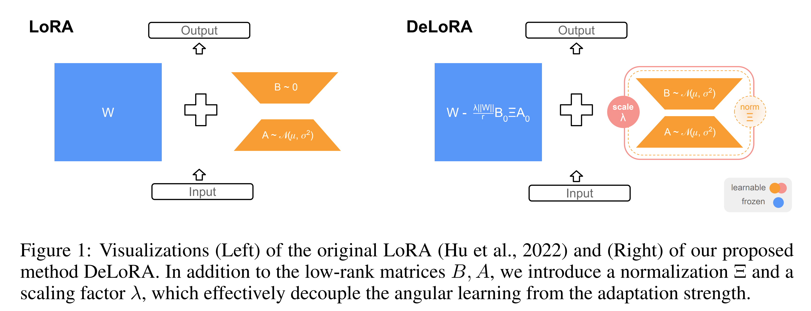

# 2 Decoupled Low-Rank Adaptation (DeLoRA)

저자의 decoupled low-rank adaptation 접근법은 weight update 에 learnable boundary 를 도입함으로써, LoRA 와 ETHER 방법의 장점을 효과적으로 결합하여 높은 expressivity 와 fine-tuning robustness 를 동시에 달성한다. 본 절에서는 (i) LoRA 와 ETHER 라는 PEFT 방법의 개요와 한계점 (Sec. 2.1) 을 설명하고, (ii) 제안하는 DeLoRA 방법을 두 관점에서 도출하는 과정을 기술하며, angular 와 magnitude component 의 분리를 목표로 하는 다른 방법인 DoRA 와의 비교 (Sec. 2.2) 를 제시한다.

## 2.1 Preliminaries: LoRA & ETHER, and Their Limitations

본 절에서는 LoRA 와 ETHER 를 상세히 검토하고, 특히 그 한계점에 초점을 맞춘다.

#### Low-rank Adaptation (LoRA).

Hu et al. 은 Low-rank Adaptation (LoRA) 를 제안했으며, 이는 fine-tuning 중 pretrained weight $W \in \mathbb{R}^{d \times f}$ 의 update 를 다음과 같이 parameterize 한다:

$$
(W + \frac{\alpha}{r} BA)^\top x + b
\tag{1}
$$

* 여기서 $A \in \mathbb{R}^{r \times d}$ 와 $B \in \mathbb{R}^{f \times r}$ 는 learnable matrix 이고, 
* $\alpha$ 는 scaling factor, 
* $r$ 은 final $BA$ matrix 의 rank 이다. 
* $r \ll \min(d, f)$ 일 때, LoRA 는 full fine-tuning 대비 필요한 parameter 수를 크게 줄인다. 
* 또한 $BA$ matrix 는 inference 시 $W$ 에 통합될 수 있어 추가적인 latency 가 발생하지 않는다.

그러나 LoRA 는 hyperparameter 선택에 매우 민감하며, over-training 시 성능 저하가 발생하는 것으로 알려져 있다. 따라서 충분히 높은 learning rate 와 pretrained weight 의 catastrophic overwriting 을 피하는 사이에서 균형을 맞추기 위해 세심한 tuning 과 반복적 실험이 필요하다. 저자가 제안하는 DeLoRA 는 weight update 에 boundary 를 도입하여 이러한 문제를 완화하고, 넓은 learning rate 범위에서 robust 한 성능을 제공한다.

#### Finetuning with Hyperplane Reflections (ETHER).

efficiency 와 robustness 를 동시에 달성하기 위해 Bini et al. 은 bounded transformation 을 사용하는 fine-tuning 방법인 ETHER 와 ETHER+ 를 제안하였다. ETHER (Eq. (2) 의 왼쪽) 와 ETHER+ (오른쪽) 는 각각 pretrained weight 에 작용하는 multiplicative transformation $H$ 또는 $H^+$ 를 도입한다:

$$
(HW)^\top x + b, \quad (H^+ W \tilde{H}^+ )^\top x + b. \tag{2}
$$

* 여기서, $H = I - 2uu^\top, \quad H^+ = I - uu^\top + vv^\top, \quad \tilde{H}^+ = I - \tilde{u}\tilde{u}^\top + \tilde{v}\tilde{v}^\top$ 이고, 
* $u, v, \tilde{u}, \tilde{v}$ 는 unit vector 이다. 이들은 identity transformation 과의 거리에서 bounded 되며, 다음을 만족한다.

$$
\| H - I \|_F = 2, \quad \| H^+ - I \|_F \leq 2 \tag{3}
$$

* 여기서 $| \cdot |_F$ 는 Frobenius norm 을 나타낸다. 
* 이러한 transformation distance 상한은 catastrophic overwriting 을 유발하는 weight 변화를 방지한다.

그러나 transformation distance 에 일정한 boundary 를 강제하는 것은 fine-tuning 성능을 제한할 수 있다. 이는 boundary 가 해당 layer 또는 pretrained model 을 주어진 task 에 적응시키기에는 지나치게 엄격할 수 있기 때문이다. 또한 Eq. (2) 의 formulation 을 residual form 으로 다시 쓰면, weight update 가 본질적으로 low-rank 로 제한됨을 보일 수 있으며, 이는 fine-tuning capacity 를 제한한다.

DeLoRA 에서는 LoRA matrix 에 normalization 과 scaling factor 를 도입하여, ETHER 와 유사한 robustness 를 달성하면서 boundary 와 rank 를 동시에 제어할 수 있음을 보인다. 이를 통해 model expressivity 와 성능이 향상된다.

## 2.2 DeLoRA

LoRA 와 ETHER 는 각각 parameter efficiency 와 robustness 라는 중요한 특성을 지니지만, 동시에 뚜렷한 한계도 존재한다. 저자가 제안하는 PEFT 방법인 DeLoRA 는 두 접근법의 장점을 종합하여 이러한 한계를 해결한다. 이와 같은 관점에서, DeLoRA 는 ETHER 의 robustness 특성을 도입한 LoRA 의 확장으로 볼 수도 있고, LoRA 의 expressive paradigm 을 채택한 ETHER 의 개선형으로 볼 수도 있다. 본 절에서는 두 가지 관점에서 DeLoRA 의 도출 과정을 제시한 뒤, 제안하는 DeLoRA formulation 을 간결하게 요약한다.

#### Deriving DeLoRA from LoRA.

Learning rate 에 대한 robustness 를 달성하기 위해 먼저 LoRA 의 Eq. (1) 을 살펴보면, weight update $\Delta W$ 의 norm 은 $\Delta BA$ 에 비례하며, 이는 다시 learning rate 에 비례한다. 즉, training step 마다 update strength 가 learning rate 에 의해 직접적으로 결정되며, 높은 learning rate regime 에서는 catastrophic overwriting 을 유발할 수 있다. 이를 완화하기 위해 normalization term 을 도입한다. 우선 $BA$ matrix 를 rank-1 component 의 합으로 분해한다:

$$
BA = \sum_{i=1}^r b_i a_i^\top \tag{4}
$$

**Controllable Boundary.** 

ETHER 와 유사하게, 각 rank-1 entry 를 정규화하여 각 single rank-1 component 의 Frobenius norm 이 1 이 되도록 한다. 이를 다음과 같이 도입할 수 있다:

$$
\sum_{i=1}^r \frac{b_i a_i^\top}{\|b_i\|\|a_i\|} = B \, \Xi \, A \tag{5}
$$

* 여기서 $\Xi$ 는 diagonal matrix, 
* $\Xi_{i,i} = \frac{1}{|b_i||a_i|}$ ($i = 1, \dots, r$), $\Xi_{i,j} = 0$ ($i \neq j$) 이다. 

따라서 pretrained weight 에 대한 final update distance 는 다음과 같이 bound 된다:

$$
\| B \Xi A \| = \Big\| \sum_{i=1}^r b_i a_i^\top \Big\| \leq \sum_{i=1}^r \Big\| b_i a_i^\top \Big\| = r
\tag{6}
$$

여기서 중요한 점은, boundary 가 사용된 learning rate 와 무관하다는 것이다.

다음으로, boundary 를 제어하고 rank 의존성을 제거하기 위해 $B \Xi A$ 를 $\frac{\lambda}{r}$ 로 scaling 한다:

$$
\Big\|\frac{\lambda}{r} B \Xi A\Big\| \leq \lambda. \tag{7}
$$

* 이제 boundary 는 $\lambda$ 로 표현되며, 
* pretrained network 또는 특정 task 에 더 잘 맞도록 임의로 선택할 수 있다. 
* 더 나아가 유연성과 layer-specific boundary 를 가능하게 하기 위해 각 $\lambda$ 를 learnable 로 두어 fine-tuning 과정에서 그 값이 적응되도록 한다.

따라서 저자는 angular learning (normalized $B \Xi A$ matrix) 과 adaptation strength (boundary $\lambda$) 를 효과적으로 분리(decouple)한다. 또한 각 fine-tuned matrix 에 single learnable parameter $\lambda$ 를 추가하는 것은 전체 trainable parameter 수와 training 속도 측면에서 무시할 수 있는 수준의 overhead 만 발생시킨다.

**Weights-norm Scaling.** 

기존 연구들에서는 Stable Diffusion 과 같은 image generative model 을 fine-tuning 할 때, multiplicative fine-tuning 방법이 additive 방법보다 더 강한 성능을 보인다고 보고하였다. 저자는 이러한 현상이 multiplicative 방법이 pretrained weight $W$ 에 상대적인 update 를 유도하기 때문이라고 주장한다. 즉, update 가 본질적으로 layer-specific 하게 이루어진다는 것이다. 이는 특히 다양한 layer 를 동시에 적응시켜야 하는 경우(e.g., Stable Diffusion adaptation, Fig. 3 참조) 중요하다. 이를 모방하기 위해 저자가 제안하는 additive 방식의 DeLoRA 에서는 pretrained weight 의 norm 을 scaling factor 로 도입한다. 이는 다음과 같이 표현된다:

$$
\Delta W = \frac{\lambda \|W\|}{r} B \Xi A \tag{8}
$$

Stable Diffusion fine-tuning task 에 대한 ablation study 결과, 이러한 scaling 이 실제로 성능 향상을 이끈다는 것을 실증적으로 확인하였다 (Sec. 3.2 참조).

**Initialization.** 

Fine-tuning 을 pretrained model 로부터 시작할 때, DeLoRA 의 normalization 연산은 LoRA 의 $B$ matrix zero-initialization 을 단순히 따를 수 없다. Preliminary experiment 에 따르면, 분모가 0 이 되는 것을 피하기 위해 작은 $\epsilon$ 을 도입하면 때때로 불안정한 결과가 발생한다. 따라서 저자는 기존 연구를 따라, frozen pretrained weight 에 kaiming-random initialization 한 matrix 의 사본을 빼는 방식으로 초기화를 수행한다:

$$
W = \bar{W} - \Big( \frac{\lambda \|W\|}{r} B \Xi A \Big)_0 \tag{9}
$$

* 여기서 $\bar{W}$ 는 original pretrained matrix 이고, 
* $(\frac{\lambda |W|}{r} B \Xi A)_0$ 는 time 0 에서의 update matrix 를 의미한다.

#### Deriving DeLoRA from ETHER.

지금까지는 LoRA 로부터 DeLoRA 를 도출하는 과정을 보였다. 다른 한편으로는, LoRA 의 특성을 ETHER 에 도입함으로써 DeLoRA 를 유도할 수도 있다. 이는 각 구성 요소의 이론적 기여를 이해하는 데 유용하다. 또한 Sec. 3.2 에서 DeLoRA 의 모든 innovation 을 정량적으로 ablation 한다.

**Controllable Boundary.** 

ETHER 및 ETHER+ 의 주요 한계 중 하나는 fixed boundary 이며, 이는 pretrained model 에 맞게 적응될 수 없다 (Sec. 2.1 참조). 이를 해결하기 위해 scaling parameter $\lambda$ 를 다음과 같이 도입한다:

$$
H = I - \lambda uu^\top, \quad H^+ = I - \frac{\lambda}{2} uu^\top + \frac{\lambda}{2} vv^\top \tag{10}
$$

따라서 $H$ 와 $H^+$ 의 identity matrix 로부터의 거리는 각각 $|H - I|_F = \lambda$, $|H^+ - I|_F \leq \lambda$ 가 된다. Sec. 3.2 에서 보이듯, controllable bound 를 도입하는 것이 성능 향상에 가장 큰 기여를 한다.

**Increasing the rank.** 

Appendix A 에서 보이듯, ETHER 와 ETHER+ 는 각각 rank-1, rank-4 update 로 제한된다. Rank 를 임의로 제어하기 위해, 저자는 ETHER+ 의 $H^+$ parameter 를 $ \hat{H}$ 로 확장하여 임의 개수의 weight reflection 연산을 허용한다:

$$
\hat{H} = I - \sum_{i=1}^{r/2} u_i u_i^\top + \sum_{i=1}^{r/2} v_i v_i^\top \tag{11}
$$

이를 다시 쓰면, $u, v$ unit vector 를 각각 two rank-$\tfrac{r}{2}$ matrix 로 모아 다음과 같이 표현할 수 있다:

$$
\hat{H} = I - U \Sigma U^\top + V \Theta V^\top \tag{12}
$$

* 여기서 $\Sigma$ 와 $\Theta$ 는 diagonal normalization matrix 로, 
* $\Sigma_{i,i} = \tfrac{1}{|u_i|^2}$, $\Theta_{i,i} = \tfrac{1}{|v_i|^2}$ 이다. 

이로써 $u, v$ 가 unit vector 가 되도록 정규화된다. 따라서 identity matrix 와의 거리는 다음과 같이 bound 된다:

$$
\|\hat{H} - I\| = \Big\| \sum_{i=1}^{r/2} u_i u_i^\top - \sum_{i=1}^{r/2} v_i v_i^\top \Big\|  \leq \sum_{i=1}^{r/2} \|u_i u_i^\top\| + \sum_{i=1}^{r/2} \|v_i v_i^\top\| = r \tag{13}
$$

앞서와 마찬가지로, boundary 와 rank 의존성을 제거하기 위해 scaling factor $\tfrac{\lambda}{r}$ 을 도입한다:

$$
\hat{H} = I - \frac{\lambda}{r} U \Sigma U^\top + \frac{\lambda}{r} V \Theta V^\top \tag{14}
$$

**U,V Relaxation.** 

마지막으로, $U \Sigma U^\top$, $V \Theta V^\top$ 를 각각 distinct trainable matrix $B \Xi A$, $D \Phi C$ 로 치환하여 $\hat{H} = I - \frac{\lambda}{r}(B \Xi A - D \Phi C)$ 를 얻는다. 이는 저자가 제안하는 DeLoRA 방법의 multiplicative analog 와 유사한 형태를 보인다. 이 변형 또한 ablation study 에 포함되며, Sec. 3.2 의 실험에서 저자는 weight-norm scaling update 와 결합된 DeLoRA 가 multiplicative fine-tuning 수준의 강력한 성능을 달성함을 보인다.

#### DeLoRA formulation

요약하면, 저자가 제안하는 DeLoRA fine-tuning 방법은 normalized low-rank matrix $B \Xi A$ 와 scaling factor $\lambda$ 를 학습하고, pretrained weight 를 다음과 같이 update 한다:

$$
\Big( W + \frac{\lambda \| \bar{W} \|}{r} B \Xi A \Big)^\top x + b \tag{15}
$$

* 여기서 $\bar{W}$ 는 pretrained weight 의 norm 이다. 
* 이 formulation 은 learnable fine-tuning update 를 $\lambda |\bar{W}|$ 크기의 ball 내에 제약함으로써, transformation strength 와 angular learning 을 분리(decoupling)한다.

좀 더 구체적으로, 핵심 구성 요소는 다음과 같다:

* **Normalization:** $\Xi$ 는 $r$ 차원의 diagonal matrix 로, LoRA 의 inner low-dimensional bottleneck 을 정규화한다 (Eq. (5)). 이때 $B \Xi A$ 의 Frobenius norm 은 $r$ 로 bound 된다 (Eq. (6)).
* **Scaling Factors:**
  * (i) $1/r$ 은 boundary dimensionality 의 rank 의존성을 제거한다.
  * (ii) $|\bar{W}|$ 는 weight update 를 pretrained weight 에 비례하도록 만든다.
  * (iii) $\lambda$ 는 adaptation strength 를 제어하고, layer-specific boundary adaptation 을 가능하게 한다 (Eq. (7)).
* **Initialization:** Pretrained initialization 은 초기 fine-tuning adaptation matrix 를 frozen copy 로 pretrained weight 에 merge 하는 방식으로 이루어진다 (Eq. (9)).

#### DoRA vs DeLoRA discussion.

DoRA 역시 angular component 와 magnitude component 의 분리를 목표로 하며, 다음과 같은 weight update formulation 을 사용한다: $W' = m \, \frac{W + \Delta W}{\| W + \Delta W \|}$

DoRA 와 저자가 제안하는 방법의 주요 차이점은 두 가지로 요약할 수 있다:

1. DoRA 는 normalization 과 scaling 연산을 fully fine-tuned weight 에 적용한다.
2. 이러한 연산이 weight matrix 의 column space 에서 수행된다. 이는 저자의 접근법과 본질적으로 다르다.

반대로, DeLoRA fine-tuning 은 두 가지 중요한 장점을 갖는다:

1. Normalization 과 scaling 연산을 weight update $\Delta W$ 에 직접 적용하여 pretrained model 로부터의 divergence 를 보다 효과적으로 방지한다.
2. Column space 대신 inner low-dimensional space 를 정규화함으로써 Frobenius-norm boundary 를 암묵적으로 강제하여 divergence 에 대한 수학적 보장을 제공한다.

이로 인해 (i) 특이한 training dynamics 가 발생하며 (Fig. 3 에서 DoRA 와 LoRA 는 유사한 behavior 를 보이는 반면 DeLoRA 는 다른 양상을 보인다), (ii) robustness 성능 (Fig. 2) 에 의해 뒷받침되는 향상된 decoupling 을 달성한다.

더 나아가, 이론적으로는 DeLoRA 의 learnable boundary 가 무한한 Frobenius norm 을 허용할 수 있음에도 불구하고, 실제 fine-tuning 과정에서 pretrained weight 로부터의 divergence 는 발생하지 않는다 (Appendix D 참조). 이는 fine-tuning 중 DeLoRA 의 learnable boundary 가 효과적으로 값을 조정하여 divergence 를 회피한다는 것을 보여주며, 이러한 특성은 DoRA 에서는 관찰되지 않는다.

# 3 Experiments

본 절에서는 제안하는 DeLoRA 방법을 image generation, natural language understanding, instruction tuning task 에 대해 평가한다. 먼저 각 task 와 그 중요성에 대해 설명한다. 이후 저자의 design choice 를 정당화하기 위해 DeLoRA 의 핵심 innovation 을 검증하는 포괄적인 ablation study 를 제시한다. 마지막으로 DeLoRA 가 LoRA 및 다른 state-of-the-art 방법들의 성능을 동등하거나 초과할 뿐 아니라, 우수한 robustness 를 보임을 입증한다. 이러한 안정성 향상은 특히 (i) learning rate 선택에 대한 민감성 감소, (ii) extended fine-tuning 동안 성능 유지 측면에서 뚜렷하게 나타난다.

## 3.1 Tasks

#### Subject-driven Image Generation.

Qiu et al., Bini et al. 을 따라, DreamBooth setting 에서 제안하는 방법의 효과를 평가한다. 구체적으로는 Stable Diffusion 을 fine-tuning 하여 주어진 이미지 집합에 나타난 subject 를 prompt 에 따라 재구성한다. 

* Dataset 은 Ruiz et al. 에서 제시된 것으로, 총 30 개 subject 와 각 subject 당 25 prompts 로 이루어진다. 
* Task 는 Stable Diffusion 을 fine-tuning 하여 주어진 subject 를 prompt 가 정의하는 맥락에 맞게 생성하는 것이다. Fig. 7, 왼쪽에 예시를 제시한다. 
* Fine-tuning 후, 각 image-prompt 조합에 대해 4 images 를 생성하고, 생성된 이미지의 subject-fidelity 를 DINO 와 CLIP 을 사용하여 측정한다. 
* 점수는 생성된 이미지와 실제 이미지의 유사성을 의미하며, subject 고유 특성에 더 민감한 DINO score 가 더 중요한 지표로 사용된다.

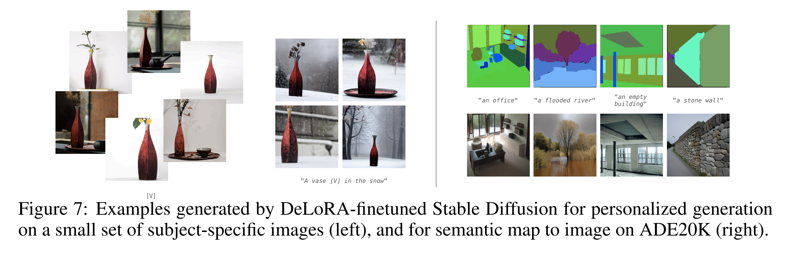

#### Semantic Map to Image.

Qiu et al., Bini et al. 을 따라, 주어진 segmentation map 에 기반하여 현실적인 이미지를 생성하도록 Stable Diffusion 을 fine-tuning 하는 능력을 평가한다. 

* 생성된 이미지는 segmentation map 이 제공하는 공간 구조를 최대한 충실히 따라야 한다. Fig. 7 오른쪽에 segmentation map 과 대응하는 생성 이미지 예시를 제시한다. 
* Control signal 로는 ControlNet 의 pretrained encoder 를 사용한다. 
* Training 및 evaluation 에는 ADE20K dataset 의 semantic map 과 이미지를 사용한다. 
* Training 후, ADE20K validation set 의 2000 segmentation masks 에 대해 이미지를 생성하고, UperNet-101 로 예측된 semantic map 기준 mean Intersection-over-Union (mIoU) 과 accuracy 를 보고한다. 이 task 는 저자의 방법 설계 결정에 대한 ablation 용도로만 사용한다.

#### Natural Language Understanding.

저자는 DeLoRA 가 small-scale language model 을 적응시키는 성능을 평가하기 위해, pretrained RoBERTa-base model 을 GLUE benchmark 에서 fine-tuning 및 평가한다. 

* GLUE task 는 NLU 성능을 측정하는 데 널리 사용되며, inference (MNLI, QNLI, RTE), sentiment classification (SST-2), 영어 문법 구조 식별 (CoLA) 등을 포함한다. 
* CoLA 는 Matthews correlation coefficient, MNLI 는 matched accuracy, STS-B 는 average correlation 으로 평가되며, 나머지 task 는 accuracy 로 평가된다. 
* Validation set 평가를 위해 Wu et al. 의 setup 을 따라 validation set 을 미리 정의된 seed 로 두 subset 으로 나누어 하나는 model selection, 다른 하나는 evaluation 에 사용한다. 세부 내용은 Sec. 3.3 에서 제공한다.

#### Instruction Tuning.

저자는 DeLoRA 가 LLM 을 user-given instruction 에 맞게 적응시키는 효과를 평가하기 위해, LLaMA-2-7B 를 Alpaca dataset 으로 fine-tuning 한다. Bini et al. 을 따라 instruction-tuned model 의 zero-shot 성능을 네 가지 task 에서 평가한다:

1. **MMLU:** 57 tasks 로 구성된 Massive Multitask Language Understanding benchmark (STEM, Humanities, Social Sciences 등 다양한 분야 포함).
2. **ARC:** 초등학교 수준의 과학 문제 7000 개 이상을 포함하는 AI2 Reasoning Challenge.
3. **TruthfulQA:** 38 개 카테고리(건강, 법, 금융, 정치 등)에서 흔한 오개념을 포함한 817 개 질문으로 구성. TruthfulQA 는 single-true 와 multi-true 두 가지 sub-task 를 포함한다.
   * *Single-true:* 제공된 답 중 정확히 하나만 정답이며, model 은 이를 선택해야 한다.
   * *Multi-true:* 여러 답이 정답일 수 있으며, model 은 정답에는 높은 확률을, 오답에는 낮은 확률을 할당해야 한다.

## 3.2 Ablation of DeLoRA Deign Choices

본 절에서는 LoRA 와 ETHER+ 가 DeLoRA 로 변환되는 과정에서 적용된 점진적 design choice 들을 ablation 하여, subject-driven generation 과 semantic map-to-image task 에서 평가한다.

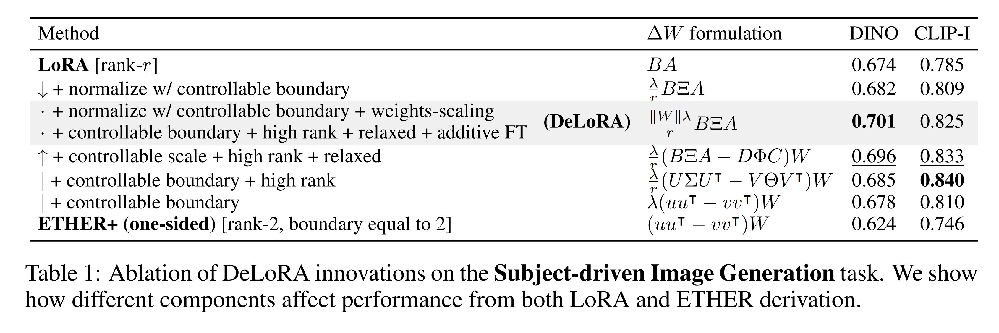

* **LoRA derivation (top-down, Tab. 1, 2):** Normalization 과 controllable boundary, pretrained matrix 기반 weight scaling 을 도입하면 성능이 향상됨을 보인다.
* **ETHER+ derivation (bottom-up, Tab. 1, 2):** Controllable scale, higher-rank formulation, relaxed learnable matrix, additive fine-tuning transformation 을 도입하면 단계적으로 성능이 개선됨을 확인한다.
* **Subject-driven image generation 결과 (Tab. 1):** 본 ablation 에서는 Ruiz et al. 의 설정을 소규모 버전으로 재현하여, 3 개 subject 를 대상으로 각 25 개 prompt (데이터의 10%) 를 fine-tuning 하였다.
  * 모든 변형 중, controllable boundary 를 ETHER+ (one-sided) 에 도입했을 때 가장 큰 영향이 나타났으며, DINO score 는 0.624 → 0.678, CLIP score 는 0.746 → 0.810 으로 상승하였다. 이는 Bini et al. 이 지적한 바와 같이, ETHER+ (one-sided) 의 성능 저하 원인이 adaptation strength 부족임을 보여준다.
  * LoRA 기반 실험에서는 weight-norm scaling 이 성능에 가장 큰 기여를 했으며, DINO score 는 0.682 → 0.701, CLIP score 는 0.809 → 0.825 로 상승하였다.
  * 또한 weight-norm scaling 을 제외한 DeLoRA 는 multiplicative counterpart 에 비해 성능이 뒤처짐을 확인하였다.
* **Semantic Map to Image ablation study:** ADE20K dataset 에 대해 Stable Diffusion 을 bfloat16 precision 으로 10 epoch 동안 fine-tuning 하며 소규모 grid search 를 수행하였다. 결과는 Tab. 2 에 제시된다.

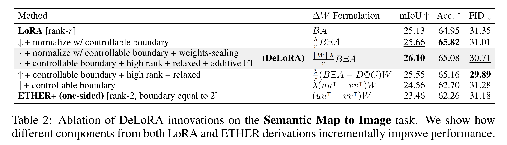

* DeLoRA 는 다양한 변형 중 가장 높은 controllability 를 보였다.
* 또한 ETHER+ 의 rank 를 증가시켰을 때 Accuracy 가 향상되는 것을 관찰하였으며, 이는 rank 제한이 성능 저하의 요인 중 하나였음을 시사한다.

## 3.3 Benchmark Results

#### Subject-Driven Image Generation.

결과는 Tab. 3 에 제시된다. 

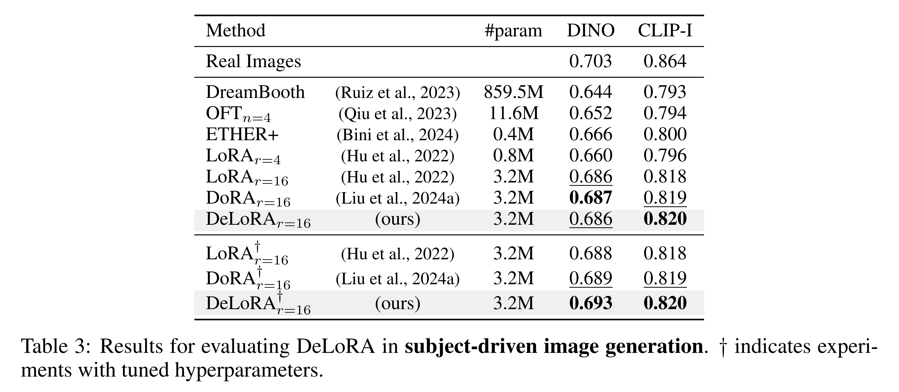

종합적인 benchmark 성능 비교를 위해, 저자는 Bini et al. (2024) 에서 보고된 low-rank 결과를 참고하고, LoRA, DoRA, DeLoRA 방법을 동일한 rank 에서 실행 및 평가하였다. 

각 방법에 대해 ablation study 와 동일한 3 개 subject 를 사용하여 grid search 로 최적 hyperparameter 를 탐색한 후, 전체 30-subject benchmark 에서 세 가지 서로 다른 seed 로 평가하였다. 최적 결과와 평균 결과를 Tab. 3 에 보고한다. 

* 결과적으로 LoRA, DoRA, DeLoRA 모두 DINO 및 CLIP-Image 기준으로 유사한 평균 성능을 보였으며, low-rank baseline 보다 우수하였다. 
* 이는 DeLoRA 가 ETHER+ 의 robustness 특성과 우수한 성능을 효과적으로 결합할 수 있음을 보여준다.

#### Natural Language Understanding.

결과는 Tab. 4 에 제시된다. 

GLUE validation set 의 올바른 평가를 위해 Wu et al. (2024a;c) 의 설정을 따라 validation set 을 미리 정의된 seed 로 두 subset 으로 나누고, 첫 번째 subset 으로 hyperparameter 를 tuning 하며, 두 번째 subset 으로 방법의 성능을 평가하였다. 

공정한 비교를 위해 동일한 seed 를 사용하였다. 또한 LoRA 의 구현과 비교하기 위해, DeLoRA 는 rank 8 의 Q, V attention layer 에 단순히 적용하였다. 이는 더 많은 layer 에 low-rank module 을 적용하는 경우보다 sub-optimal 일 수 있다. 그럼에도 불구하고, DeLoRA 는 CoLA, QNLI, STS-B 에서 더 나은 성능을 기록했으며, 전체 평균 점수 또한 모든 baseline 대비 유의미하게 더 우수하였다. 이는 DeLoRA 가 NLU task 에서 language model 을 적응시키는 데 효과적임을 입증한다.

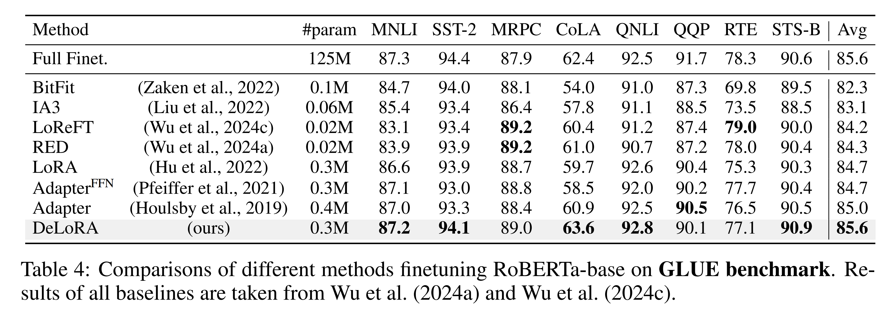

#### Instruction Tuning.

결과는 Tab. 5 에 제시된다. 

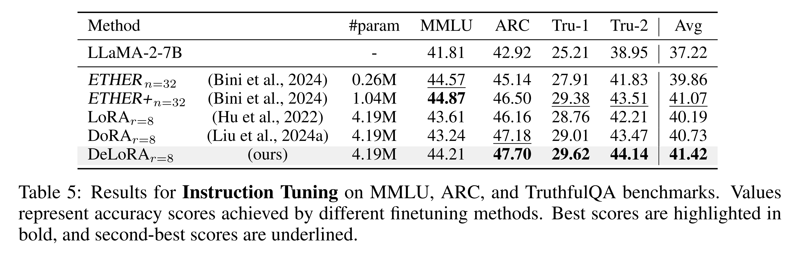

* DoRA 와 DeLoRA 를 제외한 모든 방법의 결과는 Bini et al. (2024) 에서 보고된 것을 사용하였다. 
* DoRA 와 DeLoRA 의 경우, Bini et al. (2024) 과 동일한 설정으로 grid search 를 수행하였다. 
* 결과적으로 DeLoRA 는 4 개 task 중 3 개에서 최상의 결과를 보였으며, 평균 성능에서도 최적의 성능을 달성하였다. 
* MMLU task 에서는 ETHER 및 ETHER+ 가 다른 방법을 초과했지만, 다른 task 에서는 성능이 낮아 평균 성능에서 DeLoRA 에 미치지 못하였다. 
* 이는 ETHER 계열 방법이 rank 제한으로 인해 표현력(capacity) 에 제약을 받기 때문으로 보인다.

## 3.4 Insights

본 절에서는 DeLoRA 와 다른 fine-tuning 방법을 비교하여 (i) learning rate robustness 특성, (ii) prolonged training setting 에서의 training dynamics 를 분석한다. 이후 (iii) pretrained model 의 weight norm 이 어떻게 다른지를 분석하여, DeLoRA 의 weights-norm scaling 효과를 더 깊이 이해한다.

#### Learning Rate Robustness.

Sec. 3 의 Subject-driven Generation task 환경에서 learning rate robustness 분석을 수행하였다. 

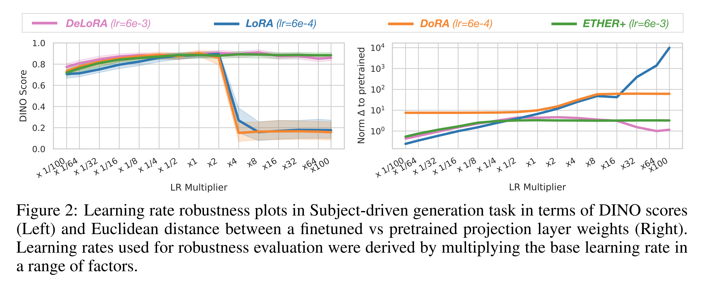

DINO score (Fig. 2, Left) 와 attention module 내 projection layer 의 fine-tuned weight 와 pretrained weight 간 Euclidean distance (Fig. 2, Right) 를 다양한 방법에 대해 보고한다. 

* Learning rate 는 각 방법의 base learning rate 를 기준으로 배수를 적용하였다. 
* 분석 결과, DeLoRA 는 성능을 유지하면서도 ETHER+ 와 동일한 수준의 robustness 를 달성하는 반면, LoRA 와 DoRA 는 base learning rate 의 4배에서 성능이 급격히 저하되었다. 
* LoRA 의 경우 높은 learning rate 에서 update distance 가 크게 증가했으며, DoRA 는 8배 이후 더 이상 발산하지 않는 경향을 보였는데, 이는 magnitude control 덕분으로 보인다. 그러나 이 경우에도 성능 향상으로 이어지지는 않았다.

#### Finetuning Regime and Prolonged Training.

Fine-tuning 과정에서 fine-tuned weight matrix (merge 이후) 와 pretrained weight matrix 간 Euclidean distance 를 측정하여 weight update 의 거동을 분석하였다. 이는 fine-tuned weight matrix 가 pretrained weight 로부터 얼마나 빠르고 많이 이동하는지를 정량적으로 보여준다. 

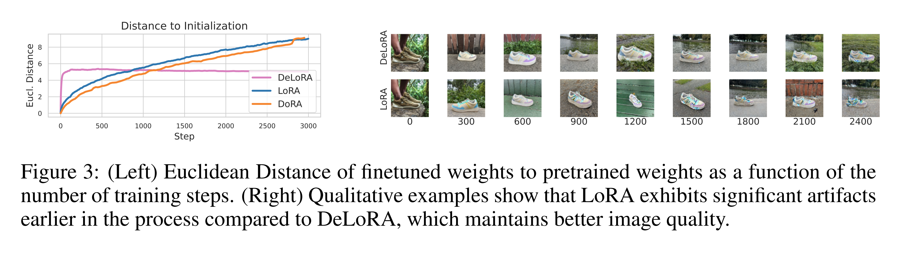

Fig. 3 (Left) 는 Stable Diffusion Unet self-attention layer 의 out-projection matrix 에 대한 분석을 제시한다. 

* LoRA 와 DoRA 는 학습 동안 pretrained weight 로부터 계속 멀어지며, 일시적으로 optimal regime 을 거치지만 결국 overshooting 하여 divergence regime 으로 빠졌다 (대체로 1000\~1400 step 사이에서 성능이 가장 높음). 
* 반면 DeLoRA 는 빠르게 pretrained weight 로부터 멀어지다가 boundary 에 도달한 후 더 이상 발산하지 않는 독특한 거동을 보였다. 
  * 이는 catastrophic overwriting 을 피하며 prolonged training robustness 를 달성하게 한다. 

Fig. 3 (Right) 및 Appendix E 에 qualitative example 을 제시하였다. 

* 또한 boundary parameter $\lambda$ 를 조정함으로써 최대 이동 가능 범위를 제어할 수 있어, fine-tuning robustness 수준을 손쉽게 조절할 수 있다.

#### Weights Norms Heterogeneity.

Fig. 4 는 Stable Diffusion v1.5 의 U-Net 내 서로 다른 attention block 의 weight matrix 에 대해 column norm 의 평균을 나타낸다. 

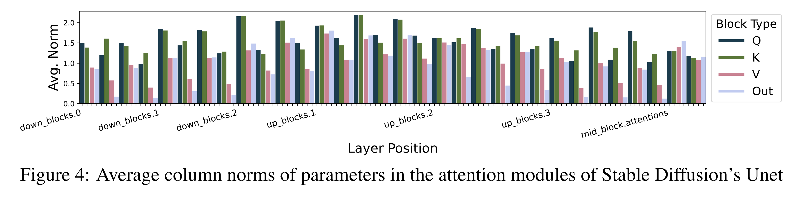

* 이를 통해 Sec. 2 에서 도입한 weights-norm scaling 의 효과를 강조한다. 결과적으로, 서로 다른 module 및 U-Net 내 위치에 따라 weight norm 에 체계적인 차이가 존재함을 발견하였다. 
* 이는 pretrained model 내부의 이질성이 존재하며, fine-tuning 방법이 이를 고려해야 함을 시사한다. 
* 저자가 제안한 scaling 은 이러한 차이를 반영하는 한 가지 방법이며, layer-wise 차이를 더욱 정교하게 반영하는 방법을 탐구하는 것이 향후 연구의 흥미로운 방향이다.

# 4 Related Work

Parameter-efficient fine-tuning (PEFT) 은 활발히 연구되고 있는 분야로, adapter, prompt-/prefix-tuning 과 같은 방법부터, BitFit, FourierFT, LayerNorm Tuning 과 같은 특수화된 방법까지 포함한다. 본 논문에서는 Hu et al. (2022) 에 의해 처음 제안된 low-rank adapter 기반 LoRA 를 개선한 새로운 PEFT 방법을 제안하므로, 관련 연구 검토는 주로 LoRA variants 에 초점을 맞추고, 일반적인 PEFT 방법에 대해서는 최근 survey 를 참조한다.

LoRA 는 large model fine-tuning 방법으로 널리 사용되며, low-memory footprint 와 추가 inference cost 가 없다는 장점을 가진다. Full fine-tuning 대비 catastrophic forgetting 에 덜 취약하다는 점도 보고되었다.

그러나 full fine-tuning 대비 downstream task 에서 성능이 뒤처지는 점 외에도, LoRA 의 여러 한계가 지적되었고 이를 해결하려는 연구가 진행되었다. 

* 예를 들어, Lialin et al. (2023), Zi et al. (2023), Xia et al. (2024), Ren et al. (2024) 은 memory efficiency 를 유지하면서도 low-rank 제약을 극복하는 방법을 제안하였다. 
* VeRA 는 original LoRA 구조를 유지하면서도 layer 간 공유되는 randomly initialized matrix 만 scaling 하여 trainable parameter 를 더 줄였다. 
* Layer 차이를 고려하기 위해 Zhang et al. (2023b), Ding et al. (2023), Zhang et al. (2024), Liu et al. (2024c) 은 layer 별로 rank 를 동적으로 조절하는 방법을 제시하였다. 

본 연구에서는 rank 를 변경하지 않고, layer 별로 LoRA matrix 의 scaling 을 동적으로 조절하는 방법을 제안하여 layer-adaptive method 의 필요성을 강조한다.

* PiSSA 와 MiLoRA 는 LoRA 의 initialization 을 개선하면 성능 향상과 더 빠른 수렴을 달성할 수 있음을 보였다. 
* Zhu et al. (2024) 와 Hayou et al. (2024) 는 LoRA matrix 가 optimal initialization 및 learning rate 관점에서 다르게 작동함을 보였다. 

본 연구는 이러한 결과와 보완적이며, LoRA 처리 방식을 동일 adapter 내부가 아닌 model 내 서로 다른 layer 관점에서 구분해야 한다고 주장한다.

* DoRA 역시 angular component 와 magnitude component 의 분리를 목표로 하며, full updated weight matrix $W + \Delta W$ 를 column space 상에서 normalization 및 scaling 하여 fine-tuned matrix 의 singular column 을 제어한다. 
* 반면 저자는 각 $\Delta W$ update matrix 의 inner $r$-dimensional space 를 정규화하는 접근을 제안한다.

# 5 Conclusions

본 연구에서는 LoRA 의 controllable rank 와 ETHER 의 bounded update 라는 장점을 결합하여 각자의 한계를 보완하는 새로운 parameter-efficient fine-tuning 방법인 **DeLoRA** 를 제안하였다. 저자는 low-rank update 를 normalization 및 scaling 함으로써 angular learning 과 adaptation strength 를 효과적으로 분리(decouple)할 수 있음을 보였으며, 이를 통해 경쟁력 있는 성능과 향상된 robustness 를 달성하였다.

DeLoRA 의 장점을 보이는 것에 그치지 않고, LoRA 와 ETHER 두 관점에서의 도출 과정을 상세히 제시하고, 점진적으로 도입된 innovation 각각에 대한 ablation 을 수행하였다. 또한 learning rate 변화와 extended training 상황에서의 DeLoRA robustness 를 분석하여, pretrained weight 로부터의 divergence 를 방지하는 데 decoupled update 메커니즘이 핵심적임을 입증하였다.

이러한 결과는 현행 PEFT 접근법의 주요 한계를 해결하면서 pretrained model 을 적응시키는 데 있어 중요한 관점을 제공한다.

# Appendix

## A ETHER and ETHER+ Low-Rank Limitation

ETHER 와 ETHER+ 의 경우, 적용되는 transformation matrices $I - uu^\top$ 이 full-rank 라 하더라도, pretrained layer 에 대한 final weight update 는 low-rank 로 제한된다. 이는 변환 결과를 residual form 으로 다시 쓰는 방식으로 확인할 수 있다.

**ETHER:**

$$
\begin{aligned}
  HW &= (I - 2uu^\top)W \\ 
  &= W - 2uu^\top W
\end{aligned}
$$

오른쪽 두 번째 항은 pretrained matrix $W$ 에 rank-1 변환을 곱한 형태이므로, $u$ 에 의해 결정되는 learnable weight update 는 rank-1 으로 제한된다.

**ETHER+:**

$$
\begin{aligned}
  &H^+ W \tilde{H}^+ \\
  &= (W - uu^\top W + vv^\top W)\tilde{H}^+ \\
  &= W - uu^\top W + vv^\top W - (W - uu^\top W + vv^\top W)\tilde{u}\tilde{u}^\top + (W - uu^\top W + vv^\top W)\tilde{v}\tilde{v}^\top
\end{aligned}
$$

오른쪽 항에 등장하는 rank-1 residual matrix 들은 최종적으로 rank-4 update 를 유도한다.

이 단순한 수학적 유도 과정은 ETHER 와 ETHER+ 방법이 본질적으로 low-rank 로 제한됨을 보여주며, 이는 두 방법의 expressivity 와 learning capacity 를 제약하는 요인이 된다.

## D Robustness Ablation on DeLoRA's Boundary and Angles

저자는 DeLoRA 의 설정에 대해 추가적인 ablation 을 수행하였다. 구체적으로 Sec. 3.4 와 동일한 robustness 분석을 반복하되, scaling term $\lambda$ (boundary 에 영향을 줌) 와 weight $BA$ (angular component) 의 learning rate 를 변화시켰다. 그 결과, 모든 설정에서 수렴이 이루어졌으며, 이는 DeLoRA 의 robustness 특성을 추가적으로 입증한다.

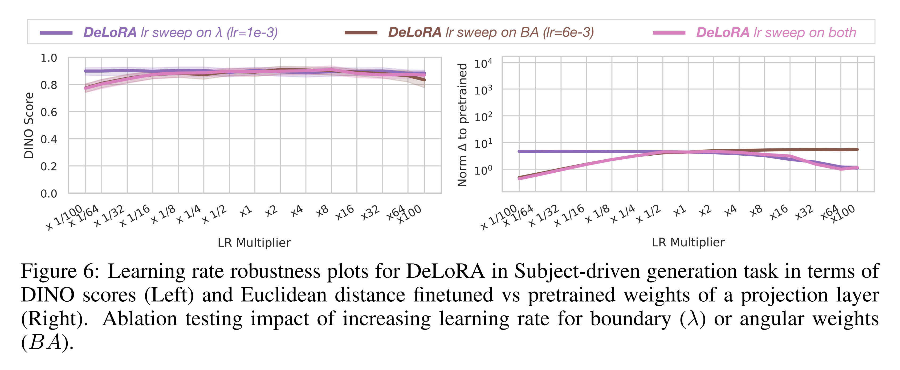
