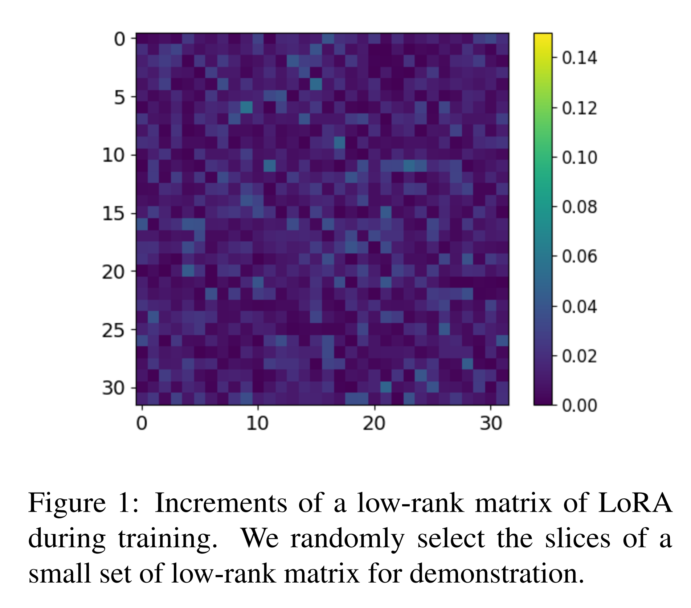

논문 및 이미지 출처 : <https://aclanthology.org/2025.acl-long.503.pdf>

# Abstract

Low-rank adaptation (LoRA) 는 large language models (LLMs) 를 효율적으로 적응시키기 위해 two low-rank matrix 를 finetuning 하여 trainable parameter 수를 줄이는 방식으로 개발되었다. 그러나 기존 연구에 따르면 이러한 matrix 의 많은 weight 가 중복되어 있어 parameter 활용에 비효율성이 존재한다. 이러한 한계를 해결하기 위해 저자는 Dense Low-Rank Adaptation (**DenseLoRA**) 를 제안한다. DenseLoRA 는 LoRA 와 비교하여 더 나은 성능을 달성하면서 parameter 효율성을 향상시키는 새로운 접근법이다.

* DenseLoRA 는 representation fine-tuning 개념에 기반하며, 하나의 Encoder-Decoder 를 도입하여 모든 adaptation layer 의 hidden representation 을 adaptation 전에 정제하고 압축한다. 
* LoRA 가 two redundancy low-rank matrix 에 의존하는 것과 달리, DenseLoRA 는 dense low-rank matrix 를 통해 LLMs 를 적응시켜 parameter 활용도와 adaptation 효율성을 향상시킨다.

DenseLoRA 는 다양한 benchmark 에서 평가되었으며, LLaMA3-8B 에서 trainable parameter 가 0.01% 에 불과함에도 83.8% accuracy 를 달성하였다. 반면 LoRA 는 0.70% 의 trainable parameter 로 80.8% accuracy 를 보였다. 추가적으로 저자는 DenseLoRA 의 각 구성 요소가 전체 model 성능에 미치는 영향을 체계적으로 평가하기 위한 광범위한 실험을 수행하였다.

# 1 Introduction

Large language models (LLMs) 는 방대한 general-domain dataset 으로 pre-training 되어 다양한 downstream task 에서 뛰어난 generalization 능력을 보여주었다. LLMs 를 새로운 task 에 적응시키는 일반적인 방법은 full fine-tuning 으로, model 의 모든 parameter 를 재학습하는 방식이다. 그러나 LLMs 의 규모가 커질수록 모든 parameter 를 완전히 finetuning 하는 것은 계산 및 memory cost 가 급격히 증가하여, 특히 resource 가 제한된 환경에서는 비현실적이 된다.

이 문제를 해결하기 위해 연구자들은 parameter-efficient fine-tuning (PEFT) 을 탐구하였다. PEFT 는 model 의 대부분을 고정한 채 task-specific parameter 의 small subset 만 finetuning 하는 방식으로, trainable parameter 수를 크게 줄이면서도 full fine-tuning 과 유사한 성능을 달성한다. 이러한 방법들 중에서 low-rank adaptation (LoRA) 는 LLMs 의 architecture 를 유지하면서 inference efficiency 도 보존하기 때문에 특히 효과적인 방법으로 부각되었다. LoRA 는 LLMs 의 adaptation weight 가 low "**intrinsic rank**" 를 가진다는 가정에 기반하며, 이를 low-rank matrix 로 근사하여 효율적으로 update 한다.

그러나 LoRA 는 한계가 존재한다. 실증적 연구에 따르면 LoRA 의 low-rank matrix 내의 상당 부분 weight 가 adaptation 동안 활성화되지 않아 redundancy 가 발생한다. 

Fig. 1 에서 보듯이, 많은 parameter 가 거의 0 에 가까운 증가만을 보여주며, 이는 이들 weight 가 adaptation 에 의미 있는 기여를 하지 않음을 나타낸다. 최근 LoRA variant 들은 영향력이 큰 weight 를 선택적으로 식별하여 이러한 비효율성을 해결하려 하지만, 여전히 전통적인 low-rank adaptation framework 에 제약을 받는다. 이는 근본적인 연구 질문을 제기한다:

*"더 적은 trainable parameter 로도, denser 구조를 활용하여 효율성을 높이고 성능을 향상시키는 low-rank adaptation 방법을 개발할 수 있는가?"*

이 질문에 답하기 위해 저자는 단순히 weight matrix 를 수정하는 데 의존하기보다 hidden representation 자체를 정제하는 접근을 탐구한다. Representation fine-tuning 기법에서 영감을 받아, expressivity 를 강화하면서도 효율성을 유지하는 것을 목표로 한다. 이러한 통찰을 바탕으로 저자는 **Dense Low-Rank Adaptation (DenseLoRA)** 를 제안한다. DenseLoRA 는 low-rank adaptation 과 representation fine-tuning 을 결합하여 LLMs 의 adaptation 효율을 향상시키는 새로운 framework 이다.

* 구체적으로, DenseLoRA 는 adaptation 이전에 hidden representation 을 정제하고 압축하여 dense low-rank matrix 로 더 efficient adaptation 을 수행한다. 
* DenseLoRA 에서는 Encoder module 이 모든 adaptation layer 의 hidden representation 을 정제하고 압축하여 task 와 관련된 필수 정보를 보존한다. 
* 이어서 dense low-rank matrix 가 각 layer 의 압축된 representation 을 적응시키며, 마지막으로 Decoder module 이 정제된 representation 을 재구성하여 pre-trained model 과 원활히 통합한다. 
* 주목할 점은 Encoder 와 Decoder 가 모든 adaptation layer 에서 공유된다는 점으로, 이는 효율성을 높이고 redundancy 를 줄인다. 
* LoRA 가 two redundancy matrix 에 의존하는 것과 달리, DenseLoRA 는 dense 하고 small matrix 를 활용하여 더 효율적이고 compact 한 adaptation 을 달성한다. 
  * 이로 인해 trainable parameter 가 크게 줄어들면서도 pre-trained weight matrix $W_0$ 의 효과적인 low-rank adaptation 이 가능하다.

저자의 주요 기여는 다음과 같이 요약된다:

* DenseLoRA 를 제안한다. 이는 dense 하고 작은 matrix 를 활용하여 low-rank adaptation 을 향상시키는 새로운 PEFT 방법으로, redundancy 를 줄이면서 효율적인 parameter update 를 가능하게 한다.
* Low-rank adaptation 과 representation fine-tuning 을 통합하여 DenseLoRA 가 model 의 expressivity 를 강화하면서도 계산 효율성을 유지할 수 있게 한다.
* 다양한 task 에서 DenseLoRA 의 성능을 평가하기 위한 광범위한 실험을 수행하였다. 특히 DenseLoRA 는 trainable parameter 가 0.01% 에 불과함에도 83.8% accuracy 를 달성하였으며, LoRA 가 0.70% parameter 로 80.8% accuracy 를 기록한 commonsense reasoning task 에서 이를 능가하였다. 추가적으로 각 구성 요소가 성능에 미치는 영향을 심층적으로 분석하였다.

# 2 Background

## 2.1 Low-Rank Adaptation (LoRA)

LoRA 의 핵심 가설은 fine-tuning 과정에서 weight update 가 low "intrinsic rank" 를 가진다는 것이다. 이 관찰에 기반하여 LoRA 는 LLMs 의 pre-trained weight 를 고정한 채, two trainable low-rank matrices 의 곱을 활용하여 이 weight 를 점진적으로 update 한다. 이 접근법은 trainable parameter 수를 크게 줄이면서도, 여러 benchmark 에서 full fine-tuning 과 유사한 성능을 달성함이 입증되었다.

LoRA 의 adaptation 과정을 수식으로 설명하면, pre-trained weight matrix $W_0 \in \mathbb{R}^{d \times k}$ 라 하자. LoRA 는 $W_0$ 를 직접 update 하지 않고, two low-rank matrix 를 사용하여 점진적인 update 를 적용한다. 즉, $\Delta W = BA$

여기서 $B \in \mathbb{R}^{d \times r}$, $A \in \mathbb{R}^{r \times k}$ 이며, rank $r$ 은 $d$ 와 $k$ 보다 훨씬 작다 (i.e., $r \ll \min(d, k)$). 이로써 full fine-tuning 대비 trainable parameter 수를 크게 줄일 수 있다. 이러한 점진적 update 를 통해 적응된 hidden representation $\hat{h} \in \mathbb{R}^d$ 는 다음과 같이 표현된다:

$$
\hat{h} = (W_0 + \Delta W)h = W_0h + BAh \tag{1}
$$

* 여기서 $h \in \mathbb{R}^k$ 는 adaptation 이전의 hidden representation 을 의미한다. Fine-tuning 동안 $W_0$ 는 고정된다. 
* 안정적인 fine-tuning 을 위해 matrix $A$ 는 uniform Kaiming distribution 으로 초기화되며, 
* $B$ 는 0 으로 초기화되어 fine-tuning 시작 시 $\Delta W = 0$ 이 되도록 한다.

Eq.(1) 에서 보듯이, inference 시 LoRA 는 $W_0$ 와 $\Delta W$ 를 병합할 수 있다 (i.e., $W' = W_0 + \Delta W$). 이 특성 덕분에 LoRA 는 original model 과 비교했을 때 additional inference latency 를 유발하지 않는다.

## 2.2 Representation Fine-tuning

최근 여러 연구에서 representation fine-tuning 기법이 탐구되었다. 이 방법은 model weight 를 적응시키는 대신 hidden representation 을 직접 정제하여, weight matrix 를 수정하지 않고도 task-specific 조정을 가능하게 한다.

예를 들어, Red 는 hidden representation 을 정제하기 위해 two learnable component 를 도입하였다: scaling vector $l_{\text{scaling}} \in \mathbb{R}^d$ 와 bias vector $l_{\text{bias}} \in \mathbb{R}^d$. 

이 과정은 다음과 같이 수학적으로 표현된다:

$$
\hat{h} = l_{\text{scaling}} \odot h + l_{\text{bias}} \tag{2}
$$

* 여기서 $\odot$ 는 Hadamard product 를 의미하며, $h \in \mathbb{R}^d$ 는 hidden representation 을 나타낸다.

# 3 Methodology

기존 low-rank adaptation 방법의 비효율성을 해결하기 위해, 저자는 Dense Low-Rank Adaptation (DenseLoRA) 라는 새로운 framework 을 제안한다. 

DenseLoRA 는 low-rank adaptation 과 representation fine-tuning 을 통합하여, vanilla LoRA 에서 관찰된 redundancy 문제를 극복한다. DenseLoRA 는 dense 하면서 small low-rank matrix 를 사용하여 parameter 활용을 더욱 효율적으로 만든다. 구체적으로, DenseLoRA 는 구조화된 3 단계 과정을 따른다:

1. **Encoder** 가 hidden representation 을 정제하고 압축한다.
2. **Dense low-rank adaptation module** 이 model 을 적응시킨다.
3. **Decoder** 가 정제된 representation 을 재구성하여 pre-trained model 과 원활히 통합한다.

이러한 구조적 접근은 two redundancy low-rank matrix 에 의존하는 vanilla LoRA 와 차별화된다.

## 3.1 DenseLoRA Architecture

이 3 단계 adaptation 과정을 구현하기 위해 DenseLoRA 는 Encoder-Decoder mechanism 과 low-rank adaptation 을 통합한 새로운 architecture 를 도입한다. 이 architecture 는 adaptation 이전에 hidden representation 을 정제하고 압축하여 redundancy 를 줄이고 trainable parameter 수를 크게 낮추면서도 model 의 expressivity 를 유지한다. 핵심은 fully connected neural networks 로 구현된 Encoder-Decoder mechanism 이며, 이는 다음 세 단계를 거친다:

* **Compression:** *Encoder* 는 weight $W_e \in \mathbb{R}^{r \times k}$ 를 사용하여 hidden representation $h \in \mathbb{R}^k$ 를 lower-dimension representation 으로 정제 및 압축한다. 이어서 activation function $\sigma(\cdot)$ 를 적용하여 압축된 representation $h' \in \mathbb{R}^r$ 를 생성한다.
* **Adaptation:** Downstream task 에 맞게 fine-tuning 하기 위해 dense low-rank matrix $M \in \mathbb{R}^{r \times r}$ 가 $h'$ 에 적용된다. 이 단계에서 pre-trained weight matrix $W_0$ 는 고정된 상태로 유지된다.
* **Reconstruction:** Decoder 는 weight $W_d \in \mathbb{R}^{d \times r}$ 를 사용하여 adapted representation 을 original hidden dimension 으로 재구성하며, activation function 이 뒤따른다. 이 과정은 adapted representation 이 pre-trained model 과 원활히 통합되도록 하여 expressivity 를 보존하면서도 효율성을 유지한다.

DenseLoRA 의 전체 adaptation 과정은 frozen pre-trained weight $W_0$ 와 정제 및 적응된 hidden representation 을 결합하여 다음과 같이 수식화된다:

$$
\hat{h} = W_0 h + \text{Decoder}(M \cdot \text{Encoder}(h)) \tag{3}
$$

Parameter 효율성을 강화하기 위해 DenseLoRA 는 하나의 Encoder-Decoder 를 모든 adaptation layer 에서 공유한다. 이 전략은 redundancy 를 줄이고 trainable parameter 수를 크게 낮춘다. 동시에 layer-specific adaptability 를 유지하기 위해, DenseLoRA 는 각 adaptation layer 마다 고유한 low-rank matrix $M \in \mathbb{R}^{r \times r}$ 를 fine-tuning 한다.

Encoder 와 Decoder 의 변환 과정은 다음과 같이 표현된다:

$$
h' = \text{Encoder}(h) = \sigma(W_e h) \tag{4}
$$

$$
\hat{h} = \text{Decoder}(h') = \sigma(W_d^T h') \tag{5}
$$

## 3.2 Parameter Analysis

**Initialization Strategies:** DenseLoRA 는 안정적이고 효율적인 학습을 위해 Shared Matrices 와 Unique Matrices 두 가지를 사용한다.

* **Shared Matrices:** $W_e \in \mathbb{R}^{r \times k}$ 와 $W_d \in \mathbb{R}^{d \times r}$ 는 모든 adaptation layer 에서 공유된다. $W_e$ 는 Kaiming initialization 으로 초기화되고, $W_d$ 는 0 으로 초기화되어 첫 forward pass 시 output 에 영향을 주지 않는다.
* **Unique Matrices:** 각 adaptation layer 마다 고유한 $M \in \mathbb{R}^{r \times r}$ 가 존재하며, 이는 $W_e$ 와 동일하게 Kaiming initialization 으로 초기화된다.

이와 같이 Shared Matrices 는 parameter 효율성을 제공하고, Unique Matrices 는 layer-specific adaptability 를 제공하여 fine-tuning flexibility 와 계산 비용 간의 균형을 이룬다.

**Parameter Count:** DenseLoRA 는 LoRA variant 대비 trainable parameter 수를 크게 줄여 LLMs 를 효율적으로 fine-tuning 할 수 있다. LLMs 의 adaptation layer 수를 $l$, input/output dimension 을 각각 $k$, $d$ 라 하자. 방법별 parameter 수는 다음과 같다:

* **Full Fine-Tuning (FFT):** $|\Theta| = l \times d \times k$
* **LoRA:** $|\Theta| = l \times (d + k) \times r$, 여기서 $r \ll \min(d, k)$
* **DenseLoRA:** $|\Theta| = (d + k + l \times r) \times r$, 여기서 $r \ll \min(d, k)$

실제 LLM 환경에서의 trainable parameter 비교:

* **LLaMA2-7B** ($r = 16$): LoRA 는 약 28M parameter 가 필요하지만, DenseLoRA 는 0.9M 으로 줄어들어 **30× 감소**한다.
* **LLaMA3-8B** ($r = 16$): DenseLoRA 는 LoRA 대비 유사한 수준의 감소를 유지하며, model 규모가 커져도 scalability 가 유지됨을 확인할 수 있다.

이 결과는 DenseLoRA 가 trainable parameter 수를 크게 줄여, LLMs fine-tuning 에 있어 높은 scalability 와 계산 효율성을 갖춘 방법임을 보여준다.

# 4 Experiments

이 절에서는 DenseLoRA 의 효과를 다양한 task 에 걸쳐 평가하기 위해 광범위한 실험을 수행한다. 저자의 평가는 체계적인 접근을 통해 포괄적인 분석을 보장한다.

먼저, LLaMA2-7B 와 LLaMA3-8B 를 commonsense reasoning task 에서 fine-tuning 하여 DenseLoRA 를 LoRA 및 그 variant 와 비교한다. 다음으로, arithmetic reasoning 으로 분석을 확장하여 LLaMA3-8B model 을 fine-tuning 한다. 또한 제한된 데이터 환경에서 DenseLoRA 의 성능을 평가하기 위해 원래 training data 의 일부 subset 을 sampling 하여 model 성능에 미치는 영향을 분석한다. 더 나아가, transformer architecture 내의 어떤 weight matrix 가 DenseLoRA 로부터 가장 큰 이점을 얻는지를 분석하여 최적의 tuning granularity 를 탐구한다. 마지막으로, Encoder 와 Decoder component 를 fine-tuning 하는 효과를 조사하고, DenseLoRA 의 adaptation matrix $M$ 을 LoRA 의 $A$, $B$ 와 비교하여 DenseLoRA 의 작동 원리를 심층적으로 분석한다.

## 4.1 Commonsense Reasoning

DenseLoRA 의 commonsense reasoning task 성능을 평가하기 위해, 저자는 170k 개의 training sample 로 구성된 dataset 을 사용하여 LLaMA2-7B 와 LLaMA3-8B 를 fine-tuning 하였다. 이 sample 은 8 개의 commonsense reasoning benchmark training set 에서 추출되었다 (세부 사항은 Appendix A.1 참고):

1. BoolQ
2. PIQA
3. SIQA
4. HellaSwag
5. WinoGrande
6. ARC-c 및 ARC-e
7. OBQA

모든 실험은 4 대의 Nvidia 24GB 3090 GPU 를 사용하였으며, training hyperparameter 는 Appendix A.2 에 제시된다.

비교 분석을 위해 저자는 DenseLoRA 를 여러 LoRA variant 방법과 비교하였다:

1. **ChatGPT:** GPT-3.5-turbo 에 zero-shot chain-of-thought 접근을 적용
2. **LoRA:** two low-rank matrix $AB$ 를 통해 weight matrix update
3. **LoKr:** Kronecker product 를 활용하여 weight matrix decomposition 을 수행, trainable parameter 를 크게 감소
4. **NoRA:** SVD 기반 dual-layer nested 구조를 사용하여 원래 matrix 의 knowledge 를 활용하면서 tunable parameter 를 줄임
5. **VeRA:** 모든 layer 에 걸쳐 shared low-rank matrix 한 쌍을 사용하고 작은 scaling vector 를 fine-tuning
6. **AdaLoRA:** SVD 를 통해 pre-trained weight 를 fine-tuning
7. **DoRA:** pre-trained weight 를 magnitude 와 direction component 로 분해하여 fine-tuning

**Main results.** Tab. 1 은 LLaMA2-7B 와 LLaMA3-8B 에 대해 rank (16, 32, 64) 별 commonsense reasoning task 결과를 보여준다. 주요 발견은 다음과 같다:

1. **Excellent Performance:** DenseLoRA 는 LLaMA3-8B 에서 평균 85% accuracy 를 달성하여, LoRA (80.8%) 대비 4.1% 더 높은 성능을 보였다. 동시에 LoRA 가 사용한 trainable parameter 의 10% 만을 사용하였다. 특히 DenseLoRA 는 trainable parameter 가 단지 0.01% 임에도 불구하고 83.8% accuracy 를 유지하여, trainable parameter 를 70 배 줄이면서도 LoRA 를 능가하였다. 이는 DenseLoRA 가 최소한의 adaptation overhead 로도 높은 accuracy 를 달성할 수 있음을 보여준다.

2. **Parameter Efficiency:** 다른 parameter-efficient LoRA variant (VeRA, LoKr, NoRA) 와 비교했을 때, DenseLoRA 는 더 높은 accuracy 를 달성하였다. 예를 들어, DenseLoRA 는 83.8% accuracy 를 기록하여 LoKr 보다 2.9% 높았다. LoKr 는 Kronecker product 로 training parameter 를 줄이지만, LoRA 보다 더 많은 계산 자원 (training 시간 및 GPU memory) 이 필요하다. 반면 DenseLoRA 는 LoRA 와 유사한 계산 비용을 유지하면서 더 나은 성능을 제공하므로, 실용성이 더 높다.

3. **Rank Robustness:** DenseLoRA 는 rank 설정 (16, 32, 64) 에 걸쳐 높은 accuracy 를 유지하며, rank 가 증가할수록 평균 accuracy 도 일관되게 향상되었다. 예를 들어, rank 16 에서 DenseLoRA 는 LoRA 의 trainable parameter 의 1/70 만 fine-tuning 하면서도 LoRA 보다 높은 성능을 달성하였다. Rank 64 에서 DenseLoRA 의 trainable parameter 는 0.06% 로 증가하였으며, 85% accuracy 를 달성하여 LoRA (80.8%) 를 능가하고 DoRA (85.2%) 에 근접하였다.

# 4.2 Arithmetic Reasoning

DenseLoRA 의 arithmetic reasoning task 효과성을 평가하기 위해, 저자는 LLaMA3-8B 를 Math10K dataset 에서 fine-tuning 하고, 네 개의 다른 dataset 에 대해 성능을 평가하였다:

1. GSM8K,
2. AQUA,
3. AddSub,
4. SVAMP.

Dataset 의 세부 사항은 Appendix A.1 에 제시된다. 실험은 1 대의 Nvidia 24GB 3090 GPU 에서 수행되었으며, hyperparameter 는 Appendix A.2 에 제시된다.

Tab. 2 는 4 개 arithmetic reasoning benchmark 결과를 보여주며, DenseLoRA 가 훨씬 적은 trainable parameter 로도 강력한 성능을 달성함을 입증한다. 특히:

* Rank = 32 일 때, DenseLoRA 는 단지 0.02% 의 trainable parameter 로 LoRA (0.7%) 대비 **35× 감소**를 이루면서도 더 나은 성능을 보였다.
* Rank = 64 일 때, DenseLoRA 는 0.06% 의 trainable parameter 로 58.5% accuracy 를 달성하여, LoRA (56.9%, 0.7% parameter) 를 능가하였다.

이 결과는 DenseLoRA 가 다양한 reasoning task 에서도 parameter 효율성과 적응력을 유지함을 추가적으로 검증한다.

---

# 4.3 Low Resources Performance

DenseLoRA 의 parameter 효율성 평가를 기반으로, 저자는 이제 low-resource 조건에서의 성능을 분석하였다. 170k 개 commonsense reasoning training dataset 중 10%, 20%, 40%, 60%, 80% 를 무작위 sampling 하였으며, LLaMA3-8B ($\text{rank} = 32$) 를 사용하여 실험을 반복하였다. Fig. 3 은 training sample 크기와 성능의 관계를 보여주며, 구체적인 수치는 Appendix B.1 에 제시된다.

주목할 점은 DenseLoRA 가 모든 sample 크기에서 LoRA 를 일관되게 능가한다는 것이다. 이는 DenseLoRA 가 제한된 데이터 환경에서도 효과적으로 generalize 할 수 있음을 보여준다. 예를 들어, DenseLoRA 가 전체 dataset 의 단지 10% 로 학습했을 때도 81.1% accuracy 를 기록하여, 전체 dataset 으로 학습한 LoRA 보다 0.3% 높은 성능을 보였다. Training sample 수가 증가할수록 DenseLoRA 와 LoRA 간 성능 격차는 더 커지며, 이는 DenseLoRA 가 적은 데이터로도 복잡한 패턴을 효과적으로 학습할 수 있음을 보여준다.

---

# 4.4 Tuning Granularity Analysis

이번 절에서는 DenseLoRA 가 transformer 의 어떤 weight module 에 적용될 때 가장 큰 효과를 발휘하는지를 평가한다. 각 module 은 다음과 같이 표기된다:

* (Q) Query
* (K) Key
* (V) Value
* (O) Output
* (G) Gate
* (U) Up
* (D) Down

저자는 LLaMA3-8B ($\text{rank} = 32$) 를 사용하여 commonsense reasoning training sample 에 대해 실험을 수행하였다. 결과는 Tab. 3 에 제시된다. 주요 관찰점은 다음과 같다:

* 원래 LoRA 설정 (Hu et al.) 과 일관되게, Multi-head Attention 과 MLP layer 를 모두 tuning 할 때 성능이 가장 높게 나타났다.
* 특히, MLP layer 를 tuning 하는 것이 Multi-head Attention layer 를 tuning 하는 것보다 효과적이었다.
* DenseLoRA 를 QKV module 에 적용했을 때, 평균 accuracy 는 82.3% 였다. 그러나 UD module 에 적용했을 경우 accuracy 는 83.8% 로 상승하여 QKV 설정을 능가하였다.
* 흥미롭게도, QKV module 을 tuning 하지 않고 UD module 만 DenseLoRA 로 tuning 했을 때도 accuracy 는 83.8% 로 유지되었다.

이러한 결과는 DenseLoRA 가 LoRA 보다 훨씬 효율적이며, 훨씬 적은 trainable parameter 로도 우수한 성능을 달성할 수 있음을 보여준다.

# 4.5 Robustness of Rank

저자는 LLaMA3-8B 를 사용하여 commonsense reasoning task 에 대해 rank = 128, 256, 512 설정에서 DenseLoRA 를 평가하였다. 해당 성능은 Fig. 4 에 제시된다. 주목할 점은, rank = 256 에서 0.31% 의 parameter 만 fine-tuning 했음에도 DenseLoRA 는 LoRA (80.8%) 와 DoRA (85.2%) 를 능가하며 85.5% 의 성능을 기록하였다. 따라서 DenseLoRA 의 성능은 fine-tuning 되는 parameter 수를 늘림으로써 추가적으로 향상될 수 있다.

---

# 4.6 Understanding the DenseLoRA

DenseLoRA 의 경험적 장점을 입증한 후, 이제 내부 메커니즘을 분석하여 DenseLoRA 의 강점을 더 잘 이해하고자 한다. 이를 위해 LLaMA3-8B (rank = 32) 를 사용하여 commonsense reasoning task 에 대한 심층 실험을 수행하였다. 분석은 두 가지 주요 질문에 초점을 맞춘다:

1. Representation fine-tuning module (i.e., Encoder 와 Decoder module) 의 효과는 어떠한가?
2. DenseLoRA 의 adaptation matrix $M$ 은 LoRA 의 $A$, $B$ 와 비교하여 어떠한가?

---

**Effectiveness of Encoder and Decoder:**

Representation fine-tuning module 의 역할을 탐구하기 위해, 저자는 Encoder 와 Decoder component 의 두 가지 변형을 평가하였다:

1. **Freeze:** Encoder 와 Decoder 의 parameter 를 고정하여 학습 동안 업데이트하지 않는다. 이는 trainable parameter 수를 크게 줄이며, 개념적으로 VeRA 와 유사하다. DenseLoRA 와 유사한 수준의 trainable parameter 를 유지하기 위해 rank 를 128 로 설정하였다.
2. **Only Matrix:** 이 변형은 activation function 을 제거하여 matrix transformation 만 남기고, activation function 이 representation fine-tuning 에 기여하는지를 평가한다.

Tab. 4 는 DenseLoRA 와 이 variant 들의 실험 결과를 보여준다. 결과는 Encoder 와 Decoder component 가 LLMs 의 효과적인 fine-tuning 에 핵심적임을 강조한다. 또한 activation function 을 제거한 Only Matrix variant 는 성능이 감소하였으며, 이는 activation function 이 단순한 보조 요소가 아니라 representation fine-tuning 을 강화하는 데 필수적인 역할을 한다는 것을 시사한다.

---

**Dense Matrix M:**

DenseLoRA 의 dense matrix 표현이 LoRA 대비 가지는 장점을 검증하기 위해, 저자는 동일한 adaptation module 과 layer 에서 학습 중 $\Delta M$ 과 $\Delta A$, $\Delta B$ 를 비교하였다. $A$ 와 $B$ 는 $M$ 보다 훨씬 크므로, $M$ 의 크기에 맞도록 $A$ 와 $B$ 의 slice 를 무작위로 선택하였다.

Fig. 5 는 $M$ 의 점진적 update 를 보여주며, $A$, $B$ 와의 상세 비교는 Appendix B.3 에 제시된다. 그림에서 관찰된 바와 같이, $M$ 은 대부분의 parameter 가 적극적으로 adaptation 과정에 기여하는 **dense update pattern** 을 보였다. 반대로 $A$ 와 $B$ 는 대부분의 parameter 가 변하지 않거나 최소한으로만 수정되는 **sparse update** 를 보였다.

이러한 결과는 DenseLoRA 가 compact 한 adaptation matrix 를 효과적으로 활용하면서도 강력한 성능을 유지하여, parameter 효율성이 매우 높음을 보여준다.

# 5 Related Works

**Parameter-Efficient Fine-Tuning (PEFT):**
PEFT 는 LLMs 의 대부분 parameter 를 고정한 채 제한된 수의 parameter 만 fine-tuning 하는 널리 사용되는 전략이다. 이 접근법은 기존 model parameter 의 일부만 finetuning 하거나 model 에 새로운 parameter 를 추가하는 방식으로 이루어진다. 이러한 방법은 LLMs 의 full fine-tuning 에서 발생하는 높은 계산 비용을 줄이도록 설계되었다. 기존 PEFT 방법은 크게 네 가지 유형으로 분류된다.

* **Adapter-based methods:** LLMs 의 기존 layer 사이에 adapter layer 를 삽입하는 방식이다.
* **Prompt-based methods:** Model 의 내부 weight 를 수정하는 대신 학습 가능한 soft token (prompt) 을 input 에 삽입하는 방식이다. 그러나 이러한 방법은 model 의 input 또는 architecture 를 변경하므로 다른 fine-tuning 방법 대비 inference latency 가 증가한다.
* **Low-rank methods (예: LoRA):** Model update 의 low-rank 성질을 활용하여 parameter 효율성을 높이는 방법이다.

**Low-Rank Adaptation (LoRA):**
LoRA 는 fine-tuning 동안 weight increment 를 two small matrix 로 근사하여 parameter 효율성을 개선한다. 최근에는 더 효율적인 LoRA variant 가 제안되었다. 예를 들어, **AdaLoRA** 는 SVD 를 적용하여 중요도가 낮은 singular value 를 제거함으로써 update 효율성을 개선한다. **DoRA** 는 pre-trained weight 를 magnitude 와 direction component 로 분해하여 direction update 에만 집중할 수 있도록 한다. 또 다른 방법인 **VeRA** 는 layer 간 공유되는 frozen random matrix 와 scaling vector 를 활용하여 전통적인 LoRA 대비 trainable parameter 수를 크게 줄인다.

**Representation Fine-tuning:**
Interpretability 연구에 따르면 LLMs 의 hidden representation 은 풍부한 semantic 정보를 담고 있다. 이에 따라 representation fine-tuning 이 새로운 형태의 PEFT 방법으로 주목받고 있다. 예를 들어, **RED** 는 intermediate layer 의 representation 을 scaling 및 biasing 연산으로 수정하여 trainable parameter 수를 크게 줄였다.

저자의 접근법은 low-rank adaptation 과 representation fine-tuning 을 통합한 것으로, 기존 PEFT 방법과 차별화되며 더 우수한 성능을 달성한다.

---

# 6 Conclusion

저자는 LoRA 의 weight redundancy 문제를 해결하기 위해 Dense Low-Rank Adaptation (DenseLoRA) 를 제안하였다. DenseLoRA 는 trainable parameter 수를 크게 줄이면서도 LoRA 를 능가하는 성능을 보였다. DenseLoRA 는 모든 layer 에 걸쳐 공유되는 Encoder 와 Decoder 를 활용하여 adaptation 전에 hidden representation 을 정제하고 압축한다. two redundancy low-rank matrix 에 의존하는 대신, DenseLoRA 는 dense low-rank matrix 로 LLMs 를 fine-tuning 하여 parameter 활용 효율성을 향상시킨다.

다양한 benchmark 에서 DenseLoRA 의 효과성을 평가한 결과, DenseLoRA 는 LoRA 와 유사하거나 더 나은 성능을 보이면서도 trainable parameter 는 LoRA 의 1/70 만 필요했다. DenseLoRA 는 기존 LoRA 와 비교하여 model 성능을 유지하거나 향상시키면서도 더욱 효율적인 low-rank adaptation 방법을 제시한다.

---

# 7 Limitations

본 논문에서는 DenseLoRA 를 LLaMA2-7B 와 LLaMA3-8B 를 fine-tuning 하여 commonsense reasoning task 와 arithmetic reasoning task 에 대해 실험하였다. 그러나 DenseLoRA 를 활용할 수 있는 task 범위는 훨씬 넓다. 예를 들어, image generation task, visual instruction tuning task 등은 아직 탐구되지 않았다. 저자는 향후 연구에서 이러한 task 들에도 DenseLoRA 를 적용할 예정이다.
