논문 및 이미지 출처 : <https://arxiv.org/pdf/2409.14396>

# Abstract

large-scale pre-trained model 의 fine-tuning 은 연산 및 메모리 비용 측면에서 지나치게 비싸다. Low-Rank Adaptation (LoRA) 는 인기 있는 Parameter-Efficient Fine-Tuning (PEFT) 기법으로, low-rank matrices 만을 최적화함으로써 효율적인 해결책을 제공한다. 최근 LoRA 의 성능을 개선하려는 다양한 시도가 있었지만, LoRA optimization space 과 full parameter space 사이의 관계는 종종 간과된다. LoRA 공간에서의 loss landscape 이 평평해 보이더라도, full parameter space 에서는 여전히 날카로운 방향을 가질 수 있어 generalization 을 저해할 수 있다.

저자는 이러한 문제를 해결하기 위해 full parameter space 에서 flat region 에 위치한 low-rank adaptation 을 식별하는 것을 목표로 하는 **Flat-LoRA** 를 제안한다. 

- 기존의 sharpness-aware minimization 접근법은 연산 및 메모리 비용이 많이 들기 때문에, 저자는 training efficiency 를 유지하기 위해 Bayesian expectation loss objective 를 채택한다. 
- 추가적으로, 성능 향상을 위해 정교한 random perturbation 생성 전략을 설계하고, random seed 를 이용해 memory overhead 를 신중히 관리한다.

수학적 추론, 코딩 능력, 대화 생성, instruction following, 텍스트-이미지 생성 등 다양한 작업에 대한 실험 결과, Flat-LoRA 는 in-domain 과 out-of-domain generalization 을 모두 향상시킨다.

# 1. Introduction

pre-training 후 fine-tuning 하는 방식은 현대 머신러닝에서 지배적인 패러다임이 되었으며, pre-trained model 의 다양한 능력을 활용해 최첨단 성능을 달성한다. 그러나 이러한 model 들의 크기가 방대하여 all parameters 를 fine-tuning 하는 것은 자원 소모가 크다. 최근에는 이 문제를 해결하기 위해 Low-Rank Adaptation (LoRA) 이 제안되었다. LoRA 는 low-rank matrices 만 fine-tuning 하며, training 후에는 이를 pre-trained weights 에 병합함으로써 추론 시에는 extra overhead 가 발생하지 않는다. 이 방식은 학습해야 할 파라미터 수를 크게 줄이며, 학습과 저장 요구 사항을 모두 줄여준다.

LoRA 성능을 향상시키기 위한 여러 방법들이 제안되었다:

* adaptive rank allocation,
* 방향 및 크기의 분리된 최적화,
* 개선된 초기화 전략 등.

이러한 방법들이 제공하는 가능성에도 불구하고, 대부분은 LoRA 의 optimization space 과 original full parameter space 사이의 연결을 간과한다. 본질적으로 LoRA 는 lower-dimensional space 에 최적화를 제한하며, 이 제한된 공간에서의 해가 full parameter space 과 어떻게 연결되는지가 성능에 중요하다. 왜냐하면 추론 시에는 결국 merged weights 가 사용되기 때문이다.

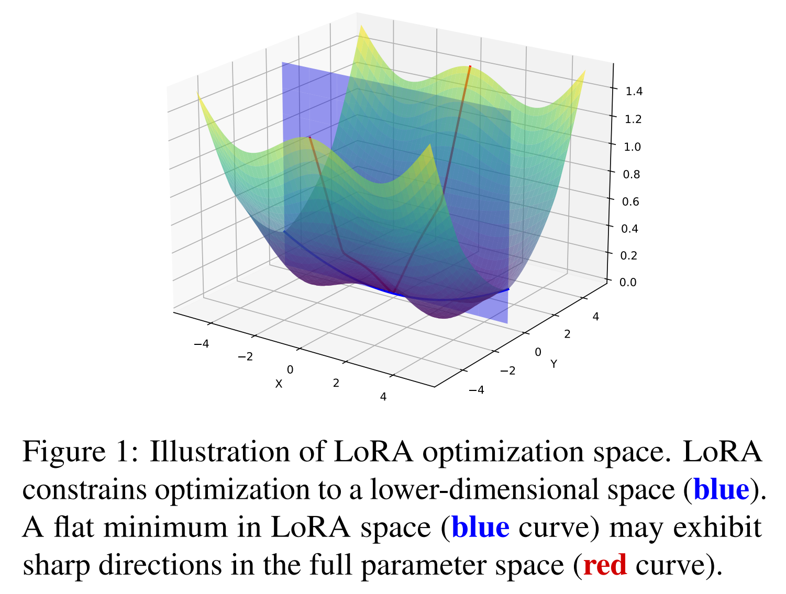

Fig. 1 에서 보여주듯이, LoRA 공간에서의 flat minimum 도 full parameter space 의 관점에서는 여전히 sharp direction 을 가질 수 있으며, 이는 성능 저하로 이어질 수 있다. Fig. 6 은 이러한 현상을 추가로 보여주며, LoRA 가 찾은 minima 가 full parameter space 에서는 sharpness 를 가진다는 것을 시각적으로 나타낸다.

Flat minima 는 일반적으로 generalization 을 향상시키고, training 및 test data 간 distribution 차이에 대한 강건성을 높이는 것으로 여겨진다. 이러한 이해는 Sharpness-Aware Minimization (SAM) 을 고안하게 했으며, 이는 min-max 문제로 정식화되어 state-of-the-art generalization 을 달성하였다. SAM 을 LoRA 에 통합한 방법(LoRA-SAM) 은 large-scale model fine-tuning 에 유망하긴 하지만, 여러 문제가 존재한다:

1. LoRA-SAM 은 제한된 공간에서의 loss landscape 의 sharpness 만 최적화할 수 있어, generalization 을 효과적으로 향상시키지 못할 수 있다 (Sec. 3.2).
2. SAM 은 additional gradient step 을 요구하여 training cost 를 두 배로 증가시켜, large-scale model 에는 비실용적이다.
3. full parameter space 에서 sharpness 를 계산하려면 all weights 에 대해 gradient 를 계산하고 perturbation 을 저장해야 하므로, parameter-efficient fine-tuning 의 원칙과 모순된다.

이러한 문제를 해결하기 위해, 저자는 loss landscape 를 부드럽게(smooth) 하여 full parameter space 에서 flat minima 를 찾기 위해 Bayesian expectation loss objective 를 도입한다. 제안된 방법인 **Flat-LoRA** 는 random seed 로 저장할 수 있는 efficient random weight perturbation 을 활용한다. 

- SAM 과 달리, Flat-LoRA 는 additional gradient step 이나 extra model weight copy 가 필요 없어 시간과 메모리 측면에서 효율적이다. 
- 또한, weight magnitude 와 model width scaling 을 고려한 refined perturbation 생성 전략을 도입함으로써 generalization 성능을 향상시킨다.

저자의 주요 기여는 다음과 같다:

* low-rank adaptation 이 full parameter space 에서 더 날카로운 loss landscape 를 가질 수 있다는 점을 발견하고, 이를 완화하기 위해 Flat-LoRA 를 제안한다.
* 저자는 설계된 random weight perturbation 과 함께 Bayesian expectation loss 를 사용하여 flat minima 를 추구하며, 기존 방법들과 무리 없이 통합되면서도 계산 및 메모리 효율성을 유지한다.
* 수많은 NLP 및 CV 작업에 걸친 광범위한 실험을 통해 Flat-LoRA 가 in-domain 과 out-of-domain generalization 을 모두 효과적으로 향상시킴을 입증한다.

# 2. Related Work

## 2.1. Flat Minima and Generalization

local minima 의 flatness 와 generalization 간의 연관성은 오랫동안 주목을 받아왔다. 최근에는 generalization 을 향상시키기 위해 flat minima 를 찾으려는 다양한 시도가 이어졌다:

* Entropy-SGD 는 local entropy 를 최소화함으로써 flat regions 를 탐색한다.
* SmoothOut 은 sharp minima 를 부드럽게 만드는 방법을 제안한다.
* Sharpness-Aware Minimization (SAM) 은 min-max 문제로 정식화되어, 손실이 균일하게 낮은 이웃 영역에 위치한 파라미터를 찾도록 하여 다양한 작업에서 SOTA generalization 향상을 달성하였다.

하지만 SAM 은 일반적인 학습보다 training time 을 두 배로 증가시키기 때문에 large-scale training 에는 적용이 어렵다.

또 다른 flat minima 탐색 방법은 random weight perturbation (RWP) 하에서 Bayesian training loss 의 기대값을 최소화하는 것이다. 이 방법은 효율적이며 additional gradient step 을 요구하지 않는다. 예를 들어:

* Gaussian model perturbation 을 이용한 regularization 방식이 제안되었으나, 다수의 noise sampling 시 비효율적이다.
* filter-wise random Gaussian perturbation 은 loss function 의 smoothness 와 generalization 간의 관계를 활용해 flat minima 를 회복한다.
* adaptive perturbation 생성 전략과 mixed loss objective 를 사용하는 방식도 제안되었다.
* fine-tuning 전 또는 중에 small random noise 를 주입하면 generalization 이 향상될 수 있음도 보고되었다.

그러나 이러한 방식들을 parameter-efficient fine-tuning 에 적용할 때는 추가적인 메모리 비용을 신중히 고려해야 한다.

## 2.2. Low-rank Adaptation and Variants

최근 연구들은 deep neural networks (DNNs) 의 최적화에 필요한 intrinsic dimension 이 전체 파라미터 수보다 훨씬 낮다는 것을 보여주었다. 이러한 low-dimensional 특성은 adversarial training 에서의 overfitting 완화에도 활용되었다.

LoRA 는 fine-tuning 중 각 layer 의 가중치 변화를 모델링하기 위해 low-rank matrices 를 사용하며, 학습 가능한 파라미터 수를 크게 줄여 학습 및 저장 측면에서 메모리 부담을 완화시킨다. 추론 시 extra overhead 가 발생하지 않으면서 강력한 성능을 보여주기 때문에, 현재는 가장 널리 사용되는 방식이다.

LoRA 성능 향상을 위한 여러 변형 기법이 제안되었다:

* **AdaLoRA**: singular value decomposition (SVD) 를 통해 중요하지 않은 weight 를 동적으로 제거하여 중요한 부분에 더 많은 rank 를 할당함.
* **DoRA**: weight update 를 방향과 크기로 분해하여 최적화를 향상시킴.
* **LoRA+**: two LoRA matrices 에 서로 다른 learning rate 를 사용하여 수렴 속도 개선.
* **PiSSA**: original matrix $W$ 의 SVD 분해를 이용하여 초기화를 제공.
* **LoRA-GA**: 학습 초기 단계에서 LoRA 의 gradient 를 full fine-tuning 의 gradient 와 정렬하도록 함.
* **LoRA-Pro**: 각 gradient step 을 full fine-tuning 과 정렬되도록 함.
* **BAR**: LoRA 최적화처럼 scale-invariant 한 문제에 적합하도록 설계된 resource-efficient SAM variant.

저자의 방법은 full parameter space 에서 loss landscape 의 sharpness 를 최적화하는 방식으로 LoRA 를 향상시키며, 기존 기법들과는 독립적으로 적용될 수 있는 정교한 보완 방식이다.

# 3. Method

이 섹션에서는 다음을 순차적으로 다룬다:

* Low-Rank Adaptation (LoRA) 에 대한 간단한 복습
* full parameter space 에서의 loss landscape flatness 를 고려한 LoRA 최적화 목적 함수 제안
* generalization 향상을 위한 random perturbation 생성 전략 설명

## 3.1. LoRA: Low-Rank Adaptation

DNN 의 optimization 은 full parameters 보다 smaller dimension subspace 에서 이루어진다는 연구 결과에 기반하여, LoRA 는 각 layer 의 weights $W \in \mathbb{R}^{m \times n}$ 의 변화 $\Delta W$ 를 다음과 같이 low-rank 행렬로 모델링한다: $\Delta W = BA$

여기서 $B \in \mathbb{R}^{m \times r}$, $A \in \mathbb{R}^{r \times n}$, $r \ll \min{m, n}$ 이다. 단순화를 위해 scaling factor $s = \alpha / r$ 은 생략하며, 이는 $A$, $B$ 에 병합할 수 있다.

original output $h = Wx$ 일 때, 수정된 forward 연산은 다음과 같다:

$$
\begin{equation}
    h = Wx + \Delta W x = (W + BA)x.
\end{equation}
$$

* 초기화 시, $A$ 는 보통 Kaiming distribution 으로 초기화되며 $B$ 는 0 으로 설정된다.
* training 중에는 pre-trained weight $W$ 는 고정되며, low-rank matrics $A$, $B$ 만 학습된다.
* 추론 시에는 $\Delta W$ 가 $W$ 에 병합되므로, 추가적인 계산 및 메모리 비용은 발생하지 않는다.

## 3.2. LoRA with a Flat Landscape

기존 연구들은 주로 rank-$r$ matrix space $\mathcal{M}_r = \{\Delta W \in \mathbb{R}^{m \times n} \mid \text{rank}(\Delta W) \leq r\}$ 내에서의 성능에 집중해왔다. 하지만 저자는 full parameter space 에서의 loss landscape flatness 를 고려해야 한다고 주장한다 (single LoRA modulle 을 고려).

기존 SAM 기반 LoRA (LoRA-SAM) 최적화는 다음과 같이 정의된다:

$$
\begin{equation}
    \min_{A, B} \max_{\|(\varepsilon_A, \varepsilon_B)\| \leq \rho} \mathcal{L}(W + (B + \varepsilon_B)(A + \varepsilon_A)),
\end{equation}
$$

* $\mathcal{L}$ 은 specific task 에 대한 loss objective,
* $\varepsilon_B \in \mathbb{R}^{m\times r}$, $\varepsilon_A \in \mathbb{R}^{r\times n}$ 는 low-rank matrices 에 대한 perturbation 이며,
* $\|(\varepsilon_A, \varepsilon_B)\|$ 은 weight perturbation 의 norm ($\ell_2$-norm),
* $\rho$ 는 neighborhood radius

하지만, 이는 LoRA parameters 내에 정의된 optimization space 의 특성에만 초점을 두어 제한적이다. 추론 중, low-rank adaptation $\Delta W$ 는 per-trained weights $W$ 에 병합되므로, LoRA space 에만 수행되는 이 솔루션은 generalization 이 제한된 Fig. 1 처럼 full parameter space 는 여전히 sharp region 일 수도 있다. 

더 정확하게, first-order Taylor Expansion 를 사용하여 Eq. 2 의 inner maximum problem 에 대해 근사할 경우, $W$ 에 미치는 weight perturbation 은 다음과 같이 근사된다:

$$
\begin{equation}
    \begin{align*}
        \varepsilon_W &= B\varepsilon_A + \varepsilon_B A + \varepsilon_B \varepsilon_A \\
        &=c [BB^\top (\nabla_W L) + (\nabla_W L)A^\top A] \\
        &\quad + c^2 (\nabla_WL)A^\top B^\top (\nabla_WL),
    \end{align*}
\end{equation}
$$

* 여기서 $\nabla_WL$ 은 full parameter weights $W$ 의 gradient,
* $c = \rho / \sqrt{\|B^\top(\nabla_WL)\|^2_F + \|(\nabla_WL)A^\top\|^2_F}$ 은 scalinf factor,
* $\|\cdot\|_F$ 은 Frobenius form 이다.

주목할 점은, $B$ 는 Hu et al. (2022) 에 의하여 0 으로 초기화되며, training 중 작다고 가정하면 Eq. 3 은 다음과 같이 단순화 된다.

$$
\begin{equation}
    \varepsilon_W \approx c(\nabla_WL)A^\top A.
\end{equation}
$$

* 저자는 또한 Appendix B 에서 경험적으로 검증하였다.
* Eq. 4 는 LoRA-SAM 이 $A$ 가 span 화는 column space 안에서만 sharpness 를 최적함을 의미한다.
* Tab. 6 에서 입증하듯, SAM 의 sharpness optimization 을 LoRA parameters 에 적용하는 것이 full parameter space 에 적용하는 것에 비해 일반화 성능이 저하된다.

그러므로, full parameter space 내의 loss landscape 에 대해 고려하는 것이 중요하며, merged weights dmf flat region 내에 배치하는 low-rank adaptation 식별이 중요하다.

이 목표를 달성하기 위해, 저자는 flat loss objective 를 제안한다.

$$
\begin{equation}
    \min_{A, B} \max_{\|\varepsilon_W\|_F \leq \rho} \mathcal{L}(W + BA + \varepsilon_W),
\end{equation}
$$

* 여기서 $\varepsilon_W \in \mathbb{R}^{m\times n}$ 은 full parameters 의 adversarial perturbation 이다.

하지만, SAM 을 full weight space 의 sharpness optimizing 에 바로 적용하면 다음과 같은 단점이 있다:

1. large models 에서 training cost 두배 증가
2. PEFT 원칙을 배반하는 restoring perturbation 에 대한 weights 를 복사 저장 필요

time 및 memory efficiency 를 유지하면서 flatter loss landscape 에 달성하기 위해, 저자는 Eq. 5 의 maximization 문제를 expectation 으로 완화하여, 다음과 같은 Bayesian expected loss objective 로 도출하는 것을 제안:

$$
\begin{equation}
    \min_{A, B} \mathbb{E}_{(\varepsilon_W)_{i,j} \sim \mathcal{N}(0, \sigma^2)} \left[ \mathcal{L}(W + BA + \varepsilon_W) \right].
\end{equation}
$$

* 여기서 $\sigma^2$ 는 noise variance
* 이 expected loss 는 다음 Lemma 에서 보이듯, full parameter space 의 loss function 을 smooth 하여, flatter minima 수렴을 유도

**Lemma 3.1 (Bisla et al.)**

$\ell_2$-norm 하의 $W$ 에 관하여 loss function $L(W)$ 가 $\alpha$-Lipschitz continuous 이고 $\beta$-smooth 함을 가정한다. smoothed function $\mathbb{E}_{(\varepsilon_W)_{i,j} \sim \mathcal{N}(0, \sigma^2)} L(W+\varepsilon_W)$ 은 $W$ 에 관하여 $\min\{\frac{\alpha}{\sigma}, \beta\}$ 이다.

---

Eq. 6 을 최적화하기 위해, 각 optimization step 마다 noise matrix $\varepsilon_W$ 를 샘플링하고 이에 따른 perturbed gradient 를 계산하여 low-rank matrices $A$, $B$ 를 optimizing 한다. merged model weights 를 기반으로 생성된 noise perturbation 은 SAM 에서 요구된 additional gradient step 을 제거한다. 실제로, 저자는 점진적으로 perturbation strength 를 증가시켜 flatter minima 를 점진적으로 회복하여 더 나은 성능을 얻을 것을 권장한다.

## 3.3. Effective Random Perturbation Generation

이제 저자는 sharpness optimizing 및 generalization 향상을 위한 random weight perturbation 생성 방법을 설명한다.

$W' = W + BA$ 를 놓고, input dimension $n$ 및 output dimension $m$ 에 대한 linear layer 에서 merged weight matirx $W' \in \mathbb{R}^{m\times n}$ 라 하자. 저자의 설계는 두 측면을 고려한다.

* **Filter structure**: 저자는 filter (Bisla et al., 2022) 에 의한 weight perturbation 을 생성하는 것을 목표로, input $x\in\mathbb{R}^n$ 을 처리하는 $m$ filters $W' = (W'_{1,:}, W'_{1,:}, \dots, W'_{m,:},)$ 가 있다. larger norm filters 내의 각 요소들을 larger strength perturbation 을 받아야 한다.
* **input dimension**: random weight perturbation 에 의한 forward pass 중 variance 가 input dimension 에 독립적이도록 하기 위해, 각 요소에 추가된 noise 의 variance 를 $1/n$ factor 로 scaling 한다. 여기서 $n$ 은 input dimension 이다.

이로부터 perturbation $\varepsilon_W$ 는 다음과 같이 샘플링된다:

$$
\begin{equation}
    (\varepsilon_W)_{i,j} \sim \mathcal{N} \left( 0, \frac{\sigma^2}{n} \|W'_{i,:}\|_2^2 \right),
\end{equation}
$$

* 여기서 $\sigma$ 는 perturbation strength 를 제어하는 hyperparameter.

Fig. 2 는 LoRA 와 Flat-LoRA 의 비교 그림이다.

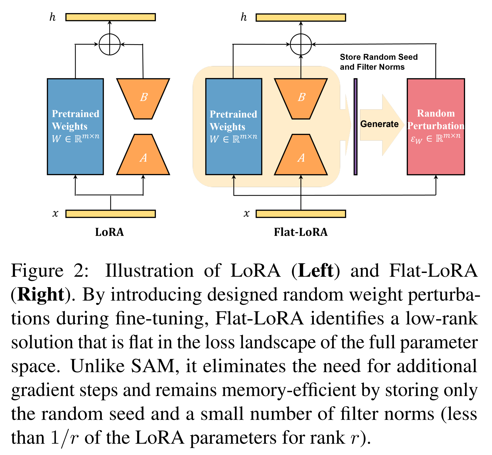

이제 activation 에 도입된 random weight perturbation 의 영향을 분석하기 한다. input $x \in\mathbb{R}^{n}$ 가 주어지고 $x$ 가 각 요소는 동일한 variance $\text{var}[x_i]$ 와 expectation $\mathbb{E}[x_i]$ 를 가진 random vector 라 가정하에, 다음을 가진다:

$$
\begin{equation}
    \text{var}[W'_{j,:}x] = \|W'_{j,:}\|^2_2 \cdot \text{var}[x_i].
\end{equation}
$$

random weight perturbation $\varepsilon$ 이 주입된 후, 다음을 같는다:

$$
\begin{equation}
    \begin{align*}
        &\text{var}\left[(W' + \varepsilon_W)_{j,:}x\right] \\
        &= \|W'_{j,:}\|^2_2 \cdot \text{var}[x_i] + \sum^n_{i=1}\text{var}[\varepsilon_{W_{j,i}} x_i] \\
        &= \|W'_{j,:}\|^2_2 \cdot \text{var}[x_i] + n\cdot\frac{\sigma^2}{n}\|W'_{j,:}\|^2_2\cdot(\text{var}[x_i] + \mathbb{E}^2[x_i]) \\
        &= (1+\sigma^2)\|W'_{j,:}\|^2_2 \cdot \text{var}[x_i] + \sigma^2\|W'_{j,:}\|^2_2\cdot\mathbb{E}^2[x_i].
    \end{align*}
\end{equation}
$$

random weight perturbation $\varepsilon_W$ 의 주입은 forward activation variance 를 $1 + \sigma^2$ factor 만큼 증가시키며, $\mathbb{E}[x_i]$ 에 의해 결정된 bias term 을 동반한다. 이 증폭된 variance 는 sharp local minima 에서 벗어나는 것을 촉진한다. Noise generation 과정에서 scaling factor $1/n$ 을 포함함으로써, variance 증가가 input dimension $n$ 에 독립적이 되며, 이는 다음과 같이 공식화된다:

**Proposition 3.2**

input $x\in\mathbb{R}^n$ 이 모든 요소에 대해 동일한 variance 와 mean 을 가질 때, Eq. 7 에 따라 random weight perturbation 을 주입하면 output variance 가 input dimension $n$ 에 독립적으로 증가한다.

---

또한, 저자는 layer normalization 의 존재로 이 variance 가 network forward propagation 중 지수적으로 증가하지 않음을 언급한다.

#### Storing random seed for memory efficiency.

memory cost 는 PEFT 에서 중요하다. Eq. 6 을 최적화하려면 random perturbation $\varepsilon_W$ 를 생성하고, gradient $\nabla_W L(W + BA + \varepsilon_W)$ 를 계산해야 한다. large-scale model 에서 full weight perturbation 을 저장하는 것은 부담스럽지만, 다음 두 가지 정보만 저장하면 충분하다:

* random generator 의 seed
* filters norm: $\{\|W'_{1,:}\|_2^2, \|W'_{2,:}\|_2^2, \dots, \|W'_{m,:}\|_2^2\}$

이 방식은 필요 시 $\varepsilon_W$ 를 재구성할 수 있으며, SAM 이 full parameter space 에서 sharpness 를 optimizing 할 때 full perturbation copy ($\mathcal{O}(m\times n)$) 를 저장해야 하는 것과 달리, 최소한의 memory overhead (i.e., $\mathcal{O}(m)$) 만 요구한다.

#### Simple approach for mixed precision training.

Mixed-precision training 은 large-scale application 에서 흔히 사용되며, perturbation injection 을 precision casting 중에 memory-efficient 하게 통합할 수 있게 한다. 이 training mode 는 FP32 와 FP/BF16 weight copy 를 모두 유지하므로, forward propagation 전에 half-precision auto-cast 단계에서 perturbation 을 주입하여 perturbation 이나 filter norm 을 저장할 필요를 제거한다. 그러나 저자의 주요 접근법인 filter norm 과 random seed 를 통해 perturbation 을 저장하는 방식은 mixed-precision training 에 독립적으로 작동하므로 더 다재다능하다.

# 4. Experiments

이 섹션에서, 저자는 Flat-LoRA 의 performance 를 다양한 task 에서 평가한다: natural language understanding, image classification, dialogue generation, mathematical reasoning, coding abilities, 그리고 text-to-image generation. 

이어서 out-of-domain generalization 능력의 향상을 보여주고, ablation study 와 논의를 진행한다.

## 4.1. Natural Language Understanding

#### Setting.

* 저자는 T5-Base model 을 GLUE benchmark 의 여러 dataset (MNLI, SST, CoLA, QNLI, MRPC) 에 대해 fine-tuning 한다. 
* Performance 는 development set 에서 accuracy 를 주요 metric 으로 평가한다. LoRA 는 rank 8 과 LoRA alpha 16 을 사용한다.
* Model 은 cosine learning rate schedule 로 10 epoch 동안 fine-tuning 하며, MNLI 와 QNLI 는 예외적으로 1 epoch 를 사용한다. 
* LoRA fine-tuning 의 learning rate 는 0.0005, full fine-tuning 은 0.0001 로 설정한다. 
* Random perturbation strength $ \sigma $ 는 cosine-increasing strategy 로 0.05 로 설정한다. 
* Mean 과 standard deviation 은 3 번의 독립적인 trial 에 대해 계산된다.

#### Results.

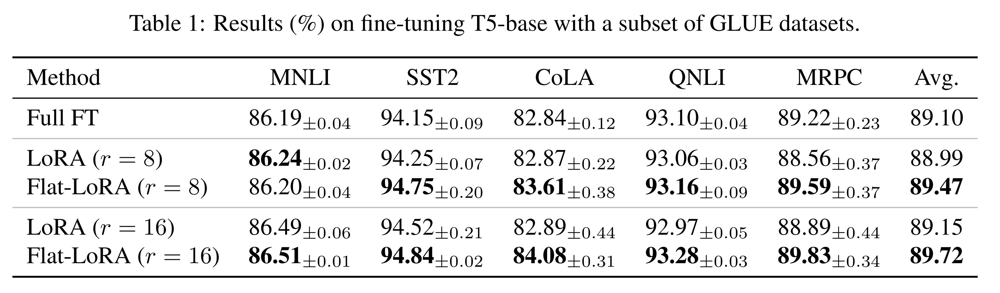

Tab. 1 에서 보듯이, 

* Flat-LoRA 는 rank 8 과 16 에서 LoRA 를 일관되게 능가하며, 각각 평균 performance 향상 0.48% 와 0.57% 를 달성한다. 
* 특히 CoLA 와 MRPC 와 같은 작은 dataset 에서 각각 1.19% 와 0.94% 의 향상이 두드러진다 (rank 16 기준). 
* 이는 작은 dataset 이 overfitting 에 더 취약하며, Flat-LoRA 가 이 문제를 효과적으로 완화하여 LoRA 에 비해 더 큰 performance 향상을 가져온다.

## 4.2. Image Classification

#### Setting.

* 저자는 CLIP ViT-B/32 model 을 5 개의 image classification task (CIFAR10/100), Cars, SVHN, DTD 에 대해 fine-tuning 한다. 
* 모든 input image 는 224×224 크기로 resize 되고 classification head 는 freeze 된다. 
* LoRA 는 rank 8 과 16 을 사용하며, model 은 cosine annealing schedule 로 10 epoch 동안 fine-tuning 한다. 
* Learning rate 는 LoRA 와 Flat-LoRA 에 대해 0.0005, full fine-tuning 에 대해 0.0001 로 설정하며, weight decay 는 0.1 로 설정한다. 
* Flat-LoRA 의 perturbation strength $\sigma$ 는 cosine-increasing strategy 로 0.15 로 설정한다. 
* Mean 과 standard deviation 은 3 번의 독립적인 trial 에 대해 계산된다.

#### Results.

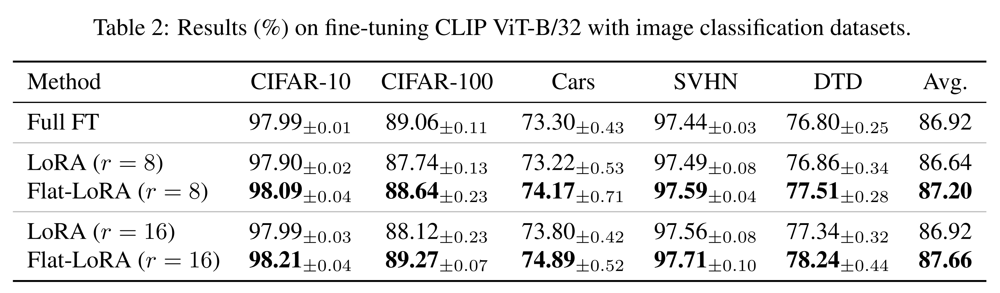

Classification accuracy 로 performance 를 측정하며, 결과는 Tab. 2 에 보고된다. 

* Flat-LoRA 는 rank 8 과 16 에서 LoRA 를 크게 능가하며, 각각 평균 향상 0.56% 와 0.74% 를 달성한다. 
* 특히, rank 8 의 Flat-LoRA 는 rank 16 의 LoRA 와 full fine-tuning 을 0.28% 초과한다. 
* 이러한 결과는 full parameter space 에서 loss landscape 의 sharpness 를 최적화하는 효과를 확인한다.

## 4.3. Large Language Model

#### Setting.

Flat-LoRA 의 scalability 를 평가하기 위해, 저자는 large language model 에서 실험을 진행한다. 

* 구체적으로, Llama 2-7B 를 chat, math, code 3 개 task 에 대해 fine-tuning 한다. 
* Learning rate 는 5e-4 로 설정하고, warmup ratio 0.03 을 가진 cosine learning rate scheduler 를 사용한다. 
* LoRA rank 는 8, LoRA alpha 는 16 으로 설정하며, training epoch 는 2 로 설정한다. 
* Backbone 은 BF16 precision 을 사용하며, LoRA module 의 parameter 는 FP32 precision 으로 설정한다. 
* Chat task 에서는 WizardLM 에서 fine-tuning 하고 MT-Bench dataset 에서 test 한다. 
* Math task 에서는 MetaMathQA 에서 fine-tuning 하고 GSM8K evaluation set 에서 평가한다.
* Code task 에서는 CodeFeedback 에서 fine-tuning 하고 HumanEval 에서 평가한다. 
* Training 은 chat task 에 52K sample, math 와 code task 에 100K sample 을 사용한다. 
* Random perturbation strength $\sigma$ 는 cosine-increasing strategy 로 0.05 로 설정한다.

#### Results.

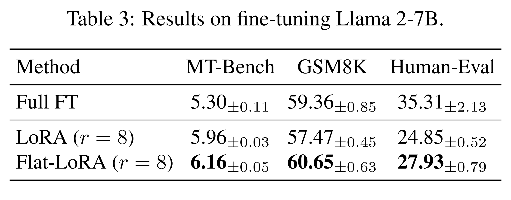

Chat task 의 performance 는 GPT-4 로 first-turn score 를, math task 는 accuracy 로, code task 는 PASS@1 metric 으로 측정한다. Tab. 3 의 결과에서, 

* Flat-LoRA 는 LoRA 의 performance 를 크게 향상시키며, MT-Bench dataset 에서 +0.20, GSM8K dataset 에서 +3.18%, Human-Eval dataset 에서 +3.08% 의 향상을 달성한다. 
* 특히, 이러한 향상은 T5-base 나 CLIP ViT-B/32 와 같은 작은 model 에서 관찰된 것보다 훨씬 크며, large-scale model 에서 flat minima 를 추구하는 중요성을 강조한다. 
* 또한, 저자가 채택한 baseline 은 이전 연구보다 상당히 강력하다; 예를 들어, GSM8K dataset 에서 LoRA 는 57.47% (저자의 결과) 대 42.08% 를 달성한다. 
* 이러한 강력한 baseline 에도 불구하고, Flat-LoRA 는 standard LoRA 에 비해 상당한 accuracy 향상을 제공하며 generalization 개선의 효과를 입증한다.

## 4.4. Text-to-Image Generation

#### Setting.

저자는 SDXL model 을 Dreambooth pipeline 과 HuggingFace 에서 구현된 script 를 사용하여 fine-tuning 한다. 

* Fine-tuning dataset 인 3D Icons1 은 23 training image 를 포함하며, 모두 square 를 가진다. 
* Model 은 constant learning rate 0.0001 로 500 step 동안 fine-tuning 한다. 
* Batch size 는 1 로 설정한다. 
* LoRA rank 와 alpha 는 4 로 설정한다. 
* Flat-LoRA 의 random perturbation strength $\sigma$ 는 0.1 로 설정한다. 
* 다른 hyperparameter 는 default value 로 설정한다.

#### Results.

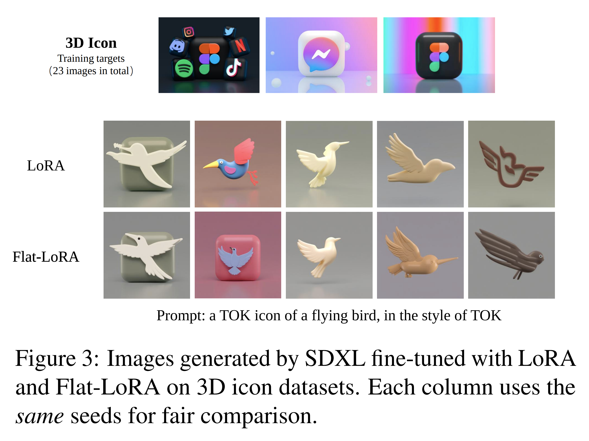

Fig. 3 에서 보듯이, 

* Flat-LoRA 는 LoRA 보다 더 나은 personalization 을 보이며 generation ability 를 더 잘 유지한다. 
* 예를 들어, 두 번째 column 에서 Flat-LoRA 가 생성한 image 는 training image (top row) 에 있는 “icon” feature 와 더 밀접하게 일치하는 distinctive square 를 bird 뒤에 포함한다. 
* 또한, Flat-LoRA 는 eye concept 을 더 효과적으로 보존하며, LoRA 가 생성한 bird 는 column 1, 3, 5 에서 eye 가 누락된 반면, Flat-LoRA 는 이를 유지한다.

## 4.5. Out-of-Domain Generalization

Flat minima 는 training 과 test data 간의 distributional shift 를 더 잘 수용하여 out-of-domain generalization 을 향상시킨다고 알려져 있다. 이 특성은 다양한 application 을 위해 설계된 pretrained vision 및 language model 에서 특히 중요하다. 아래에서, 저자는 Flat-LoRA 의 이 특성을 상세히 탐구한다.

#### Corruption datasets.

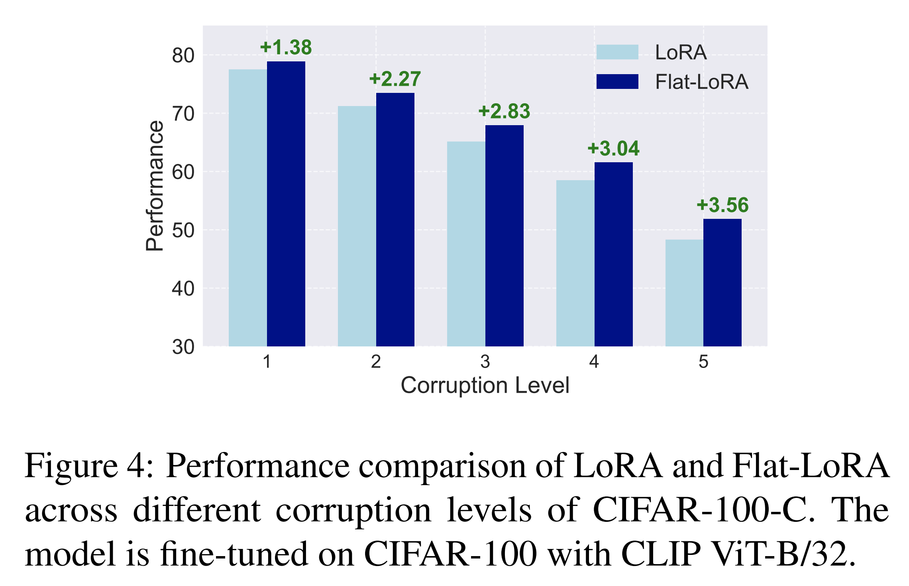

저자는 image classification task 에 초점을 맞춰 data distribution shift 하에서 Flat-LoRA 의 robustness 를 평가한다. 

* 구체적으로, CLIP ViT-B/32 를 CIFAR-100 에서 fine-tuning 하고 corrupted CIFAR-100-C 에서 model 을 평가한다. 
* Corruption severity 의 다양한 수준에 걸친 결과는 Fig. 4 에 제시된다. 
* Flat-LoRA 는 LoRA 를 일관되게 능가하며, corruption severity 가 증가함에 따라 performance 향상이 커진다: level 1 에서 +1.38%, level 5 에서 +3.56%. 
* 이 결과는 Flat-LoRA 가 식별한 flatter minima 가 LoRA 에 비해 out-of-domain generalization 을 향상시킨다는 것을 보여준다.

#### Instruction following.

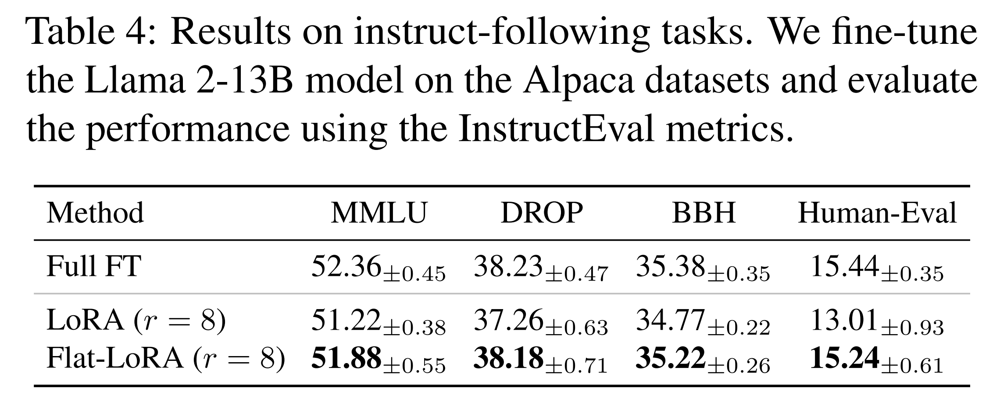

저자는 Llama 2-13B model 을 Alpaca dataset 에서 fine-tuning 한다. 이 dataset 은 실세계의 variability 를 모방하여 model 이 test time 에서 unseen 또는 shifted distribution 을 처리할 수 있도록 준비한다. 

* Model 은 InstructEval, instruction-following benchmark 에서 Chia et al. (2023) 이 제공한 official code 를 사용하여 평가된다. 
* 실험 설정은 Ren et al. (2024) 를 따른다. 
* Tab. 4 의 결과에서, Flat-LoRA 는 LoRA 를 일관되게 능가한다. 특히 DROP 과 Human-Eval 에서의 향상이 두드러지며, 각각 +0.71% 와 +1.83% 를 달성한다.

## 4.6. Integration with Other Methods

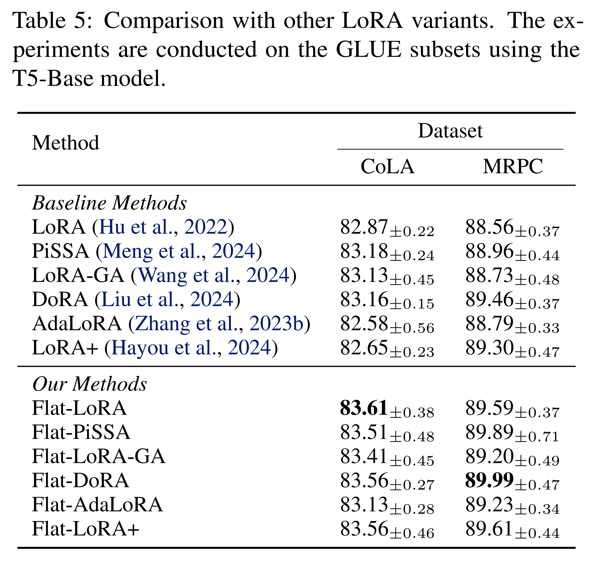

이 섹션에서, 저자는 Flat-LoRA 를 최근 제안된 LoRA variant (PiSSA, LoRA-GA, DoRA, AdaLoRA, LoRA+) 와 비교한다. 실험은 T5-base model 을 사용하여 CoLA 와 MRPC dataset 에 대해 LoRA rank 8 로 수행된다. 결과는 Tab. 5 에 제시된다. 

* Flat-LoRA 는 두 dataset 에서 이전 방법들을 각각 0.53% 와 0.13% 초과하여 일관되게 능가한다. 
* 또한, flat loss objective 는 이전 접근법들과 원활히 통합되어 두 dataset 에서 각각 0.91% 와 0.93% 의 일관된 향상을 가져온다. 
* 이러한 향상은 Tab. 7 에서 보듯이 최소한의 추가 cost 로 달성된다. 이는 저자의 접근법의 scalability 와 full parameter space 의 sharpness 를 고려하는 효과를 강조한다.

## 4.7. Ablation Studies and Discussion

#### Results under different LoRA ranks.

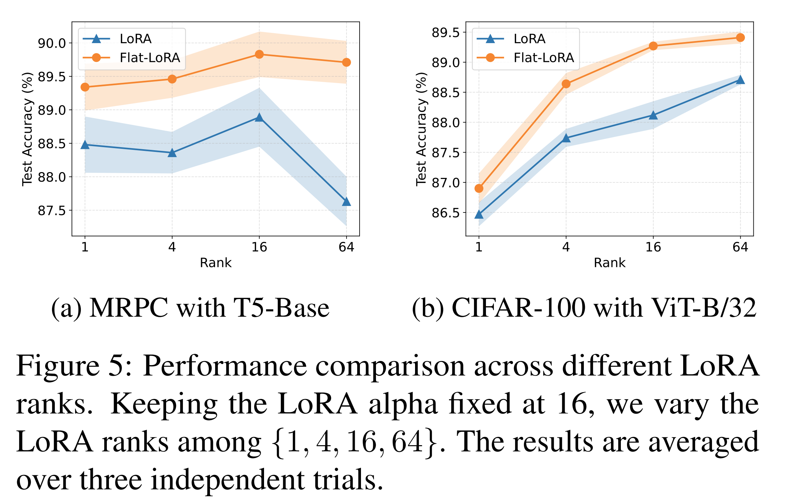

Sec. 4.1 과 4.2 의 설정을 따라, 저자는 다양한 LoRA rank 에서 Flat-LoRA 의 performance 를 평가한다. 결과는 Fig. 5 에 제시된다. 

* Flat-LoRA 는 다양한 LoRA rank 에서 LoRA 를 일관되게 능가하며, MRPC 에서 +1.10%, CIFAR-100 에서 +1.15% 의 향상을 달성한다. 
* 심지어 LoRA rank 1 에서, 일반적으로 underfitting 이 발생하는 상황에서도, Flat-LoRA 는 LoRA 에 비해 상당한 performance 향상을 제공한다. 이는 full parameter space 의 sharpness 를 고려하는 중요성을 강조한다. 
* 또한, LoRA rank 가 증가함에 따라, 특히 3.7k data point 를 가진 작은 dataset 인 MRPC 에서 LoRA 의 performance 가 overfitting 으로 인해 저하될 수 있다. 
* Flat-LoRA 는 flatter minima 를 식별하여 이 overfitting 문제를 효과적으로 완화하여 더 나은 generalization 을 제공한다. 
* 따라서 저자는 Flat-LoRA 가 LoRA fine-tuning performance 를 rank 가 낮아 full parameter space 에서 제한된 정보가 탐구되는 underfitting scenario 뿐만 아니라, overfitting 위험이 더 두드러진 높은 LoRA rank 상황에서도 향상시킨다고 결론짓는다.

#### Comparison with SAM.

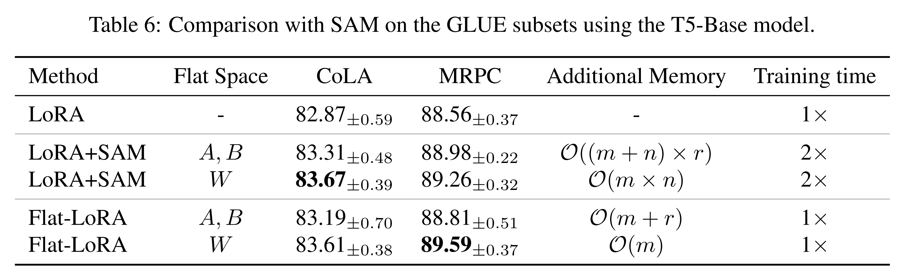

저자는 Flat-LoRA 를 SAM 과 LoRA 를 통합한 경우와 비교하며, 서로 다른 flat space 에서 SAM 의 sharpness optimization 을 적용한다: full parameter space ($W$) 와 LoRA parameter ($A, B$). 

Sec. 4.1 에서 설명한 설정을 따라, perturbation radius $\rho$ 를 {0.001, 0.003, 0.005, 0.01, 0.05, 0.1, 0.2, 0.5} 에 대해 평가하며, full parameter space ($W$) 에 적용할 때 $\rho = 0.05$ 가 최적 performance 를 제공하고, LoRA parameter ($A, B$) 에 적용할 때 $\rho = 0.003$ 이 최적임을 발견한다. 

Tab. 6 의 결과에서, 

* SAM 을 full parameter space ($W$) 에 적용하는 것이 LoRA parameter ($A, B$) 에 적용하는 것보다 일관되게 우수하며, CoLA 에서 +0.36%, MRPC 에서 +0.28% 의 향상을 달성한다. 
* 그러나 SAM over $W$ 는 adversarial weight perturbation 을 저장하기 위해 추가 memory overhead $\mathcal{O}(m \times n)$ 를 초래하여 parameter-efficient training 에 비실용적이다. 
* 반면, Flat-LoRA 는 $W$ 에 적용된 SAM 과 비슷하거나 더 나은 performance 를 달성하면서 추가 memory $\mathcal{O}(m)$ 만 요구한다. 
* 또한, Flat-LoRA 는 vanilla LoRA 의 training efficiency (1×) 를 유지하며, SAM 기반 접근법은 추가 gradient 계산으로 인해 training time 을 두 배 (2×) 증가시킨다.

#### Memory and time costs.

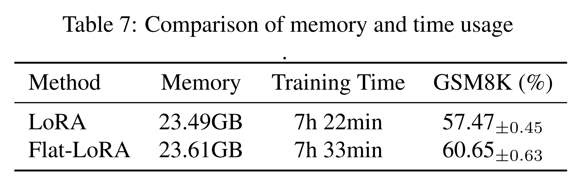

Tab. 7 에서, 저자는 Llama 2-7B model 을 사용하여 MetaMathQA dataset 을 fine-tuning 한 memory 와 time usage 를 보고한다. 

* Training 설정은 Sec. 4.3 과 동일하며, micro-batch size 2 를 사용하고 NVIDIA GeForce RTX 4090 GPU 에서 실행한다. 
* Flat-LoRA 는 기본 random seed approach 를 기반으로 구현된다. Flat-LoRA 는 LoRA 에 비해 최소한의 overhead 를 추가하며, 추가 memory 0.12GB 와 training time 11 분만 증가한다. 
* 이 결과는 Flat-LoRA 가 LoRA training 에 거의 추가 overhead 없이 편리하게 통합될 수 있음을 강조한다.

#### Landscape visualization.

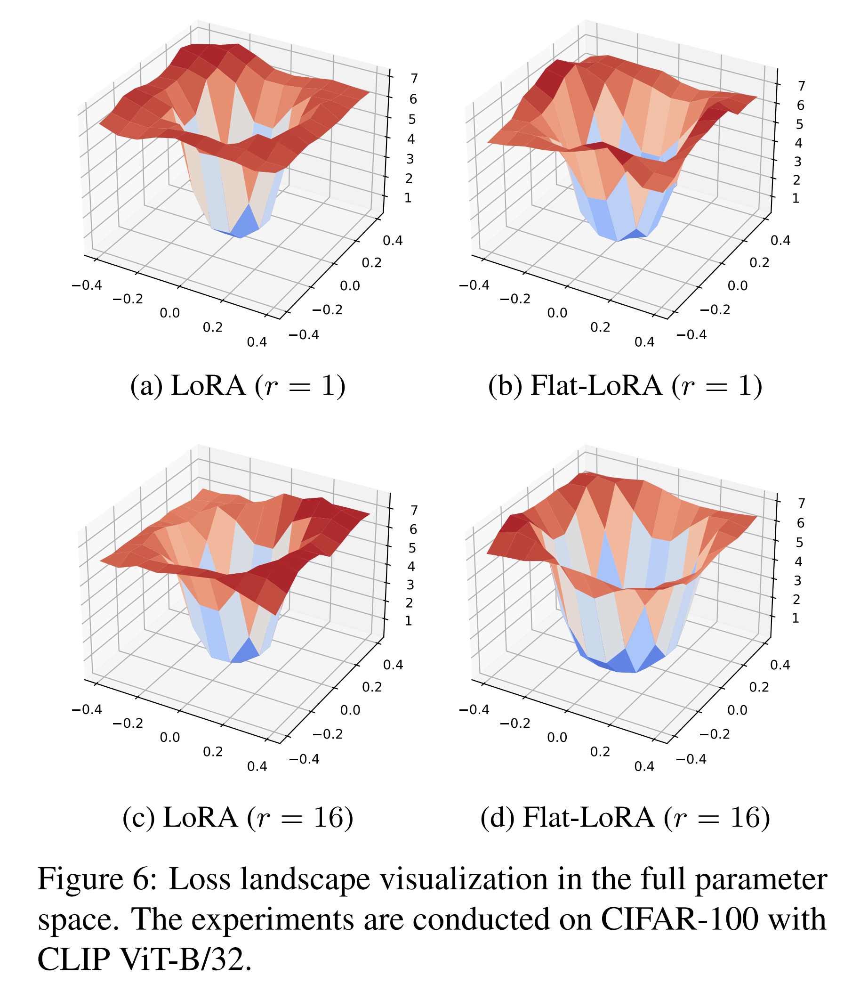

Fig. 6 에서, 저자는 LoRA 와 Flat-LoRA 의 loss landscape surface 를 rank 1 과 16 에서 시각화한다. 

* Li et al. (2018b) 가 제안한 technique 를 따라, full parameter space ($W$) 에서 random “filter-normalized” direction 을 따라 loss surface 를 그린다. 
* LoRA 와 Flat-LoRA 모두 merged weight 를 visualization 에 사용한다. 결과는 Flat-LoRA 가 두 rank 에서 LoRA 에 비해 상당히 flatter loss landscape 를 달성함을 보여준다. 
* 특히 LoRA rank 가 낮을 때, 해당 loss landscape 는 더 sharp 하며, full parameter space 에서 sharpness 를 최적화하는 중요성을 강조한다.

# 5. Conclusion

저자는 Flat-LoRA 를 제시하며, 이는 full parameter space 에서 loss landscape 의 sharpness 를 최적화하는 효율적인 low-rank adaptation 방법이다. additional computation 및 memory overhead 를 부과하는 conventional sharpness-aware minimization 접근법과 달리, 저자는 Bayesian expectation loss objective 를 사용하여 flat minima 를 추구하고, random weight perturbation 의 refined generation scheme 을 설계하여 efficiency 를 유지한다. Neural language processing 과 computer vision 에 걸친 광범위한 실험은 Flat-LoRA 가 in-domain 및 out-of-domain generalization 을 향상시키는 효과를 입증한다.