논문 및 이미지 출처 : <https://arxiv.org/pdf/2110.04366>

# Abstract

Large pretrained language model 을 downstream task 에 fine-tuning 하는 것은 NLP 에서 사실상 표준 학습 패러다임이 되었다. 그러나 기존 접근법은 pretrained model 의 모든 parameter 를 fine-tuning 하므로, model 크기와 task 수가 증가할수록 계산 비용이 과도하게 커진다. 최근 연구에서는 전체 parameter 가 아닌 일부 (extra) parameter 만 fine-tuning 하면서도 strong performance 를 달성하는 다양한 parameter-efficient transfer learning 방법이 제안되었다. 그러나 이러한 방법의 성공에 필요한 핵심 요소와 서로 간의 연관성은 명확히 이해되지 않았다.

이 논문에서 저자는 SOTA parameter-efficient transfer learning 방법의 설계를 분해하여, 이들 간의 연결을 확립하는 unified framework 를 제시한다. 구체적으로, 저자는 이를 pretrained model 의 specific hidden state 에 대한 modification 으로 재구성하고, modification 을 계산하는 function 이나 modification 을 적용하는 위치와 같은 다양한 design dimension 을 정의한다.

Machine translation, text summarization, language understanding, text classification benchmark 에 대한 포괄적인 실험 연구를 통해, 저자는 unified view 를 활용하여 기존 방법에서 중요한 design choice 를 식별한다. 더 나아가, 제안된 unified framework 는 서로 다른 접근법 간 design element 의 전이를 가능하게 하고, 그 결과 저자는 기존 방법보다 더 적은 parameter 를 tuning 하면서도 더 효과적인 새로운 parameter-efficient fine-tuning 방법을 제안한다. 이 방법은 네 가지 task 모두에서 전체 parameter 를 fine-tuning 하는 것과 견줄 만한 성능을 달성한다.

# 1 INTRODUCTION

Pre-trained language model (PLM) 에서의 transfer learning 은 이제 natural language processing 에서 보편적 패러다임이 되었으며, 많은 task 에서 strong performance 를 보여준다. 일반적인 방법은 범용 PLM 을 downstream task 에 적응시키기 위해 model parameter 전체를 fine-tuning 하는 것(*full fine-tuning*)이다. 그러나 이 경우 task 별로 fine-tuned model parameter 의 별도 복사본이 필요하므로, 많은 수의 task 를 수행하는 model 을 서비스할 때 비용이 과도하게 커진다. 이 문제는 PLM 의 크기가 수억 단위 - 수천억 단위, 심지어 수조 단위 parameter 로 커지고 있다는 점에서 더욱 두드러진다.

이 문제를 완화하기 위해, pretrained parameter 대부분은 고정한 채 few extra parameter 만 업데이트하는 몇 가지 lightweight 대안이 제안되었다. 

* 예를 들어, adapter tuning 은 pretrained network 의 각 layer 에 adapter 라 불리는 small neural module 을 삽입하고, fine-tuning 시 adapter 만 학습한다. 
* 또한 textual prompt 를 통해 PLM 을 제어하는 prompting 방법의 성공에서 영감을 받아, *prefix tuning* 과 *prompt tuning* 은 input 이나 hidden layer 에 additional tunable prefix token $l$ 을 붙이고, downstream task 에 대한 fine-tuning 시 이 soft prompt 만 학습한다. 
* 최근 Hu et al. (2021) 은 parameter update 를 근사하기 위해 low-rank matrix 를 학습한다. 

이러한 방법들은 Fig. 1 에 도식화되며, 모두 원래 model parameter 의 1% 미만만 업데이트하면서도 full fine-tuning 에 필적하는 성능을 다양한 task 에서 보이는 것으로 보고되었다.

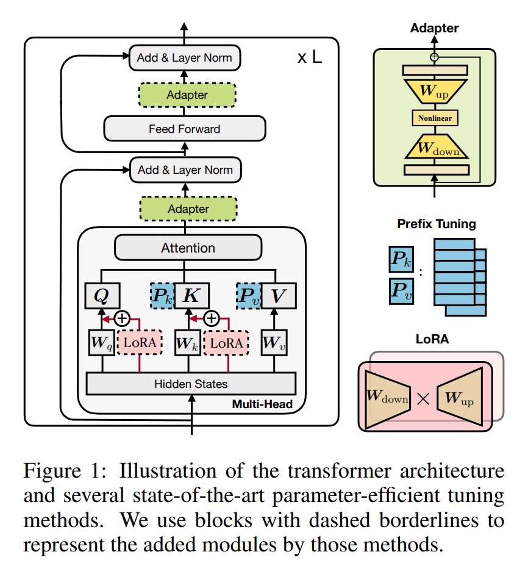

Parameter 절약 외에도, parameter-efficient tuning 은 catastrophic forgetting 없이 빠르게 새로운 task 에 적응할 수 있게 하고, distribution 밖 평가에서 better robustness 를 보이는 경우도 많다. 그러나 이러한 parameter-efficient tuning 방법의 성공에 기여하는 중요한 요소는 충분히 이해되지 않았으며, 서로 간의 연결도 여전히 불분명하다.

이 논문에서 저자는 세 가지 질문에 답하고자 한다:

1. 이러한 방법들은 어떻게 연결되는가?
2. 이러한 방법들은 효과성을 좌우하는 공통적인 design element 를 공유하는가? 공유한다면 무엇인가?
3. 각 방법의 효과적인 요소를 다른 방법으로 전이시켜 더 효과적인 변형을 만들 수 있는가?

이 질문에 답하기 위해, 저자는 먼저 prefix tuning 의 대안적 형태를 도출하여 prefix tuning 이 adapter 와 밀접한 관련이 있음을 보인다 (Sec. 3.1). 이를 바탕으로, 저자는 앞서 언급한 방법들을 frozen PLM 의 hidden representation 을 수정하는 다양한 방식으로 보는 unified framework 를 고안한다 (Sec. 3.2). 제안된 unified framework 는 modification 수행에 사용되는 function, modification 이 적용되는 position, modification 통합 방식 등 공통된 design dimension 에 따라 기존 방법을 분해한다. 이 framework 는 approach 간 design choice 전이를 가능하게 하여, 예를 들어 multi-head adapter 와 같은 새로운 변형을 제안할 수 있게 한다 (Sec. 3.3).

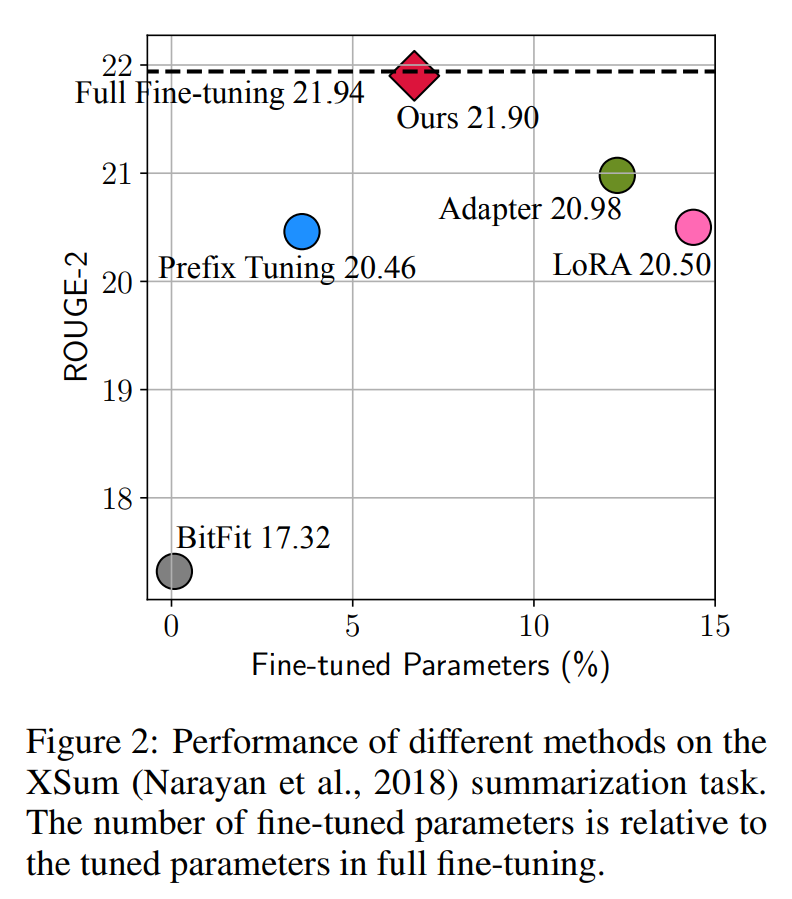

실험에서 저자는 기존 parameter-efficient tuning 방법들이 high-resource 및 challenging task 에서는 여전히 full fine-tuning 에 뒤처짐을 먼저 보인다 (Sec. 4.2, Fig. 2). 이후 unified framework 를 활용하여 핵심 design choice 를 식별하고, 제안된 변형을 실증적으로 검증한다 (Sec. 4.3–4.6). Text summarization, machine translation (MT), text classification, general language understanding 을 포함한 네 가지 NLP benchmark 에서 수행된 실험은, 제안된 변형이 기존 방법보다 적은 parameter 를 사용하면서도 더 효과적이며, 네 가지 task 모두에서 full fine-tuning 결과와 동등한 성능을 달성함을 보여준다.

# 2 Preliminaries

## 2.1 Recap of the Transformer Architecture

Transformer model 은 현재 대부분의 SOTA PLM 의 기반이 되는 architecture 이다. 이 절에서는 완결성을 위해 해당 model 의 수식을 다시 정리한다. Transformer model 은 $L$ 개의 block 이 쌓여 구성되며, 각 block (Fig. 1) 은 두 가지 유형의 sub-layer 를 포함한다: multi-head self-attention 과 fully connected feed-forward network (FFN).

전통적인 attention function 은 query $Q \in \mathbb{R}^{n \times d_k}$ 와 key-value pair $K \in \mathbb{R}^{m \times d_k}, V \in \mathbb{R}^{m \times d_v}$ 를 다음과 같이 mapping 한다:

$$
\text{Attn}(Q, K, V) = \text{softmax}\left(\frac{QK^T}{\sqrt{d_k}}\right)V,
$$

* 여기서 $n$ 과 $m$ 은 각각 query 와 key-value pair 의 개수이다. 
* Multi-head attention 은 $N_h$ 개의 head 에 대해 병렬적으로 attention function 을 수행하며, 
* 각 head 는 $W_q^{(i)}, W_k^{(i)}, W_v^{(i)} \in \mathbb{R}^{d \times d_h}$ 로 개별적으로 parameter 화되어 input 을 query, key, value 로 projection 한다.
* $m$ vectors $C \in \mathbb{R}^{m \times d}$ 에 대해 attention 을 수행하고자 할 때, query vector $x \in \mathbb{R}^d$ 를 input 으로 multi-head attention (MHA) 의 출력은 다음과 같다:

$$
\begin{align*}
    \text{MHA}(C, x) = \text{Concat}(\text{head}_1, \cdots, \text{head}_h)W^o, \\
    \text{head}_i = \text{Attn}(xW_q^{(i)}, CW_k^{(i)}, CW_v^{(i)}),
\end{align*}\tag{2}
$$

* 여기서 $W^o \in \mathbb{R}^{d \times d}$ 이다. 
* $d$ 는 model dimension 이며, 
* MHA 에서 $d_h$ 는 일반적으로 $d/N_h$ 로 설정되어 parameter 절약을 가능하게 한다. 이는 각 attention head 가 lower-dimensional space 에서 동작함을 의미한다.
* 다른 중요한 sub-layer 는 fully connected feed-forward network (FFN) 으로, 이는 ReLU activation function 사이에 two linear transformation 으로 구성된다:

$$
\text{FFN}(x) = \text{ReLU}(xW_1 + b_1)W_2 + b_2, \tag{3}
$$

* 여기서 $W_1 \in \mathbb{R}^{d \times d_m}, W_2 \in \mathbb{R}^{d_m \times d}$ 이다. 
* Transformer 는 일반적으로 큰 $d_m$ 을 사용하며, 예를 들어 $d_m = 4d$ 와 같다. 
* 마지막으로 residual connection 이 사용되고 layer normalization (Ba et al., 2016) 이 뒤따른다.

## 2.2 Overview of Previous Parameter-Efficient Tuning Methods

아래에서는 Fig. 1 과 함께 SOTA parameter-efficient tuning 방법들을 소개한다. 특별히 명시되지 않는 한, 이들 방법은 추가된 parameter 만 tuning 하며 PLM 의 parameter 는 고정된다.

#### Adapters

Adapter 접근법은 transformer layer 사이에 작은 module (adapter) 을 삽입한다. Adapter layer 는 일반적으로 $W_{\text{down}} \in \mathbb{R}^{d \times r}$ 를 사용한 down-projection 으로 입력 $h$ 를 bottleneck dimension $r$ 의 더 낮은 차원 공간으로 projection 한 뒤, 비선형 activation function $f(\cdot)$ 를 거쳐 $W_{\text{up}} \in \mathbb{R}^{r \times d}$ 로 up-projection 한다. Adapter 는 residual connection 으로 둘러싸여 최종적으로 다음과 같은 형태를 가진다:

$$
h \leftarrow h + f(hW_{\text{down}})W_{\text{up}}. \tag{4}
$$

* Houlsby et al. (2019) 은 transformer 의 한 layer 내에서 multi-head attention 과 FFN sub-layer 뒤에 adapter 두 개를 연속적으로 배치하였다. 
* Pfeiffer et al. (2021) 은 FFN “add & layer norm” sub-layer 뒤에만 삽입하는 더 효율적인 adapter 변형을 제안하였다.

#### Prefix Tuning

Textual prompting 방법의 성공에서 영감을 받아, prefix tuning 은 각 layer 의 multi-head attention 의 key 와 value 에 $l$ tunable prefix vectors 를 앞에 붙인다. 구체적으로, 두 집합의 prefix vectors $P_k, P_v \in \mathbb{R}^{l \times d}$ 를 original key $K$ 와 value $V$ 와 concatenation 한다. 이후 multi-head attention 은 이 새로운 prefixed key 와 value 에 대해 수행된다. Eq. 2 의 head 계산은 다음과 같이 바뀐다:

$$
\text{head}_i = \text{Attn}(xW_q^{(i)}, \text{concat}(P_k^{(i)}, CW_k^{(i)}), \text{concat}(P_v^{(i)}, CW_v^{(i)})), \tag{5}
$$

* 여기서 $P_k, P_v$ 는 각각 $N_h$ 개의 head vector 로 분리되며, 
* $P_k^{(i)}, P_v^{(i)} \in \mathbb{R}^{l \times d/N_h}$ 는 $i$-th head vector 를 의미한다. 
* Prompt tuning 은 prefix tuning 을 단순화하여 first layer 의 input word embedding 에만 추가 prefix 를 붙인다. 유사한 연구로는 P-tuning 이 있다.

#### LoRA

LoRA 는 transformer layer 에 trainable low-rank matrix 를 삽입하여 weight update 를 근사한다. Pretrained weight matrix $W \in \mathbb{R}^{d \times k}$ 에 대해, LoRA 는 그 update 를 다음과 같은 low-rank decomposition 으로 표현한다: $W + \Delta W = W + W_{\text{down}}W_{\text{up}}$

여기서 $W_{\text{down}} \in \mathbb{R}^{d \times r}, W_{\text{up}} \in \mathbb{R}^{r \times k}$ 는 tunable parameter 이다. LoRA 는 이를 multi-head attention sub-layer 의 query 와 value projection matrices $(W_q, W_v)$ 에 적용한다. specific input $x$ 가 multi-head attention 의 linear projection 에 들어갈 때, LoRA 는 projection 출력 $h$ 를 다음과 같이 수정한다:

$$
h \leftarrow h + s \cdot xW_{\text{down}}W_{\text{up}}, \tag{6}
$$

여기서 $s \geq 1$ 은 tunable scalar hyperparameter 이다.

#### Others

다른 parameter-efficient tuning 방법으로는 BitFit (Ben Zaken et al., 2021) 이 있으며, 이는 pretrained model 의 bias vector 만 fine-tuning 한다. 또한 diff-pruning (Guo et al., 2021) 은 sparse parameter update vector 를 학습한다.

# 3 Bridging the Gap - A Unified View

저자는 먼저 prefix tuning 의 등가 형태를 도출하여 adapter 와의 연결을 확립한다. 이후 여러 SOTA 방법들을 포괄하는 parameter-efficient tuning 을 위한 unified framework 를 제안한다.

## 3.1 A Closer Look at Prefix Tuning

Eq. 5 는 prefix tuning 의 메커니즘을 설명하는데, 이는 original attention key 와 value 앞에 $l$ learnable vectors 를 붙여 attention module 을 변경한다. 여기서는 Eq. 5 의 등가 형태를 도출하고 prefix tuning 에 대한 또 다른 관점을 제공한다:

$$
\begin{aligned}
\text{head} &= \text{Attn}(xW_q, \text{concat}(P_k, CW_k), \text{concat}(P_v, CW_v)) \\
&= \text{softmax}\Big(xW_q \, \text{concat}(P_k, CW_k)^{\top}\Big) 
\begin{bmatrix} P_v \\ CW_v \end{bmatrix} \\
&= (1 - \lambda(x)) \, \text{softmax}(xW_q W_k^{\top} C^{\top}) CW_v 
+ \lambda(x) \, \text{softmax}(xW_q P_k^{\top}) P_v \\
&= (1 - \lambda(x)) \underbrace{\text{Attn}(xW_q, CW_k, CW_v)}_{\text{standard attention}} 
+ \lambda(x) \underbrace{\text{Attn}(xW_q, P_k, P_v)}_{\text{independent of $C$}},
\end{aligned}
\tag{7}
$$

여기서 $\lambda(x)$ 는 prefix 에 대한 normalized attention weight 합을 나타내는 scalar 로, 다음과 같이 정의된다:

$$
\lambda(x) = \frac{\sum_i \exp\big(xW_q P_k^{\top}\big)_i}
{\sum_i \exp\big(xW_q P_k^{\top}\big)_i + \sum_j \exp\big(xW_q W_k^{\top} C^{\top}\big)_j}.
\tag{8}
$$

* Eq. 7 에서 첫 번째 항 $\text{Attn}(xW_q, CW_k, CW_v)$ 는 prefix 가 없는 original attention 이고, 
* 두 번째 항은 $C$ 와 무관한 position-wise modification 이다. 
* 따라서 Eq. 7 은 prefix tuning 을 original head attention output $h$ 에 대한 linear interpolation 을 통해 position-wise modification 을 적용하는 것으로 해석한다:

$$
h \leftarrow (1 - \lambda(x))h + \lambda(x)\Delta h, 
\quad \Delta h := \text{softmax}(xW_q P_k^{\top}) P_v.
\tag{9}
$$

#### The Connection with Adapters

$W_1 = W_q P_k^{\top}$, $W_2 = P_v$, $f = \text{softmax}$ 로 정의하면, Eq. 9 는 다음과 같이 다시 쓸 수 있다:

$$
h \leftarrow (1 - \lambda(x))h + \lambda(x) f(xW_1)W_2,
\tag{10}
$$

이는 Eq. 4 의 adapter function 과 매우 유사한 형태에 도달한다. 다만 prefix tuning 은 weighted addition 을 수행하는 반면, adapter 는 unweighted addition 이다. Fig. 3b 는 이 관점에서 prefix tuning 의 computation graph 를 보여주며, prefix tuning 을 adapter 와 유사한 plug-in module 로 추상화할 수 있게 한다.

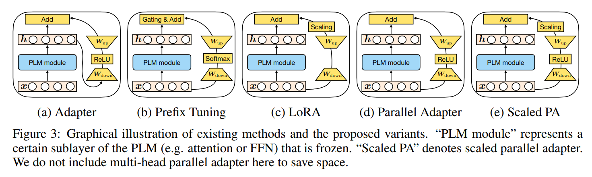

* 또한 $W_1 \in \mathbb{R}^{d_h \times l}$, $W_2 \in \mathbb{R}^{l \times d_h}$ 는 $l$ 이 작을 경우 low-rank matrix 가 되어 adapter 의 $W_{\text{down}}, W_{\text{up}}$ 과 유사하게 동작한다. 
* 이 관점은 또한 prefix vectors $l$ 이 adapter 의 bottleneck dimension $r$ 과 유사한 역할을 함을 시사한다. 
* 즉, 이들은 modification vector $\Delta h$ 를 계산할 때의 rank limitation 을 나타낸다. 
* 직관적으로, rank limitation 은 $\Delta h$ 가 어떤 $x$ 에 대해서도 동일한 $l$ (또는 $\leq l$) 개의 basis vector 의 선형 결합임을 의미한다. 따라서 $l$ 을 bottleneck dimension 으로도 부른다.

#### The Difference from Adapters

Gating variable $\lambda$ 외에도, prefix tuning 과 adapter 사이에는 세 가지 차이가 있다:

1. Fig. 3 에서 보이듯이, prefix tuning 은 PLM layer 의 입력 $x$ 를 사용하여 $\Delta h$ 를 계산하는 반면, adapter 는 PLM layer 의 출력 $h$ 를 사용한다. 따라서 prefix tuning 은 PLM layer 에 대한 “parallel” computation 으로 볼 수 있는 반면, adapter 는 “sequential” computation 이다.
2. Adapter 는 삽입 위치에 있어 prefix tuning 보다 더 유연하다. Adapter 는 attention 출력이나 FFN 출력 모두를 수정할 수 있지만, prefix tuning 은 각 head 의 attention 출력만 수정한다. 이는 실험적으로 큰 차이를 만들며, Sec. 4.4 에서 이를 보여준다.
3. Eq. 10 은 각 attention head 에 적용되지만, adapter 는 항상 single-head 이다. 따라서 prefix tuning 이 더 expressive 하다. Attention head 는 차원 $d/N_h$ 를 가지므로, $l \geq d/N_h$ 이면 각 head 에 full-rank update 가 가능하다. 
   * 그러나 adapter 에서는 $r \geq d$ 이어야 전체 attention 출력에 full-rank update 가 가능하다. 주목할 점은 $l = r$ 일 때 prefix tuning 이 adapter 보다 더 많은 parameter 를 추가하지 않는다는 것이다.

저자는 Sec. 4.4 에서 이러한 multi-head 영향력을 실증적으로 검증한다.

## 3.2 The Unified Framework

Prefix tuning 과 adapter 사이의 연결에서 영감을 받아, 저자는 여러 SOTA parameter-efficient tuning 방법을 통합하는 general framework 를 제안한다. 구체적으로, 이들 방법을 hidden representation 에 적용되는 modification vector $\Delta h$ 를 학습하는 것으로 본다.

형식적으로, 직접 수정되는 hidden representation 을 $h$, 그리고 $h$ 를 계산하는 PLM sub-module 의 직접 입력을 $x$ 라고 둔다 (e.g., $h$ 와 $x$ 는 각각 attention 의 출력과 입력이 될 수 있다). 이 modification 과정을 특성화하기 위해 저자는 design dimension 집합을 정의하고, 서로 다른 방법들은 이 dimension 값의 차이에 따라 인스턴스화된다.

아래에 design dimension 을 설명하고, adapter, prefix tuning, LoRA 가 각각 이 dimension 상에서 어떻게 위치하는지 Tab. 1 에 나타낸다.

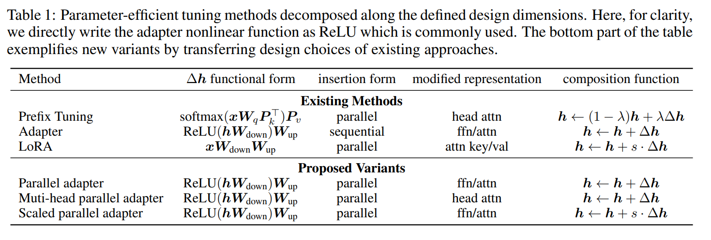

* **Functional Form**: $\Delta h$ 를 계산하는 구체적인 function. Adapter, prefix tuning, LoRA 의 functional form 은 각각 Eq. 4, 6, 10 에서 설명되었다. 이들 방법의 functional form 은 모두 `proj down → nonlinear → proj up` 구조와 유사하다. 단, LoRA 에서는 “nonlinear” 가 identity function 으로 퇴화된다.
* **Modified Representation**: 어떤 hidden representation 이 직접 수정되는지를 나타낸다.
* **Insertion Form**: 추가 module 이 network 에 삽입되는 방식. Sec. 3.1 및 Fig. 3 에서 설명했듯이, adapter 는 전통적으로 sequential 방식으로 삽입되어 입력과 출력 모두 $h$ 이다. 반면 prefix tuning 과 LoRA 는 원래 그렇게 설명되지 않았지만, $x$ 를 입력으로 하는 parallel insertion 과 등가적임이 드러난다.
* **Composition Function**: 수정된 vector $\Delta h$ 가 원래 hidden representation $h$ 와 결합되어 새로운 hidden representation 을 형성하는 방식. 예를 들어, adapter 는 단순한 additive composition 을 수행한다. Prefix tuning 은 Eq. 10 과 같이 gated additive composition 을 사용하고, LoRA 는 $\Delta h$ 에 constant factor 를 곱한 후 원래 hidden representation 에 더한다 (Eq. 6).

Tab. 1 에 없는 다른 많은 방법들도 이 framework 에 포함될 수 있다. 예를 들어, prompt tuning 은 첫 번째 layer 에서 head attention 을 prefix tuning 과 유사한 방식으로 수정하며, 다양한 adapter 변형 역시 adapter 와 유사하게 표현할 수 있다. 중요한 점은, unified framework 가 parameter-efficient tuning 방법들을 이러한 design dimension 에 따라 연구할 수 있게 하고, 중요한 design choice 를 식별하며, 나아가 approach 간 design element 의 전이를 가능하게 한다는 점이다. 이는 다음 절에서 다룬다.

## 3.3 Transferring Design Elements

Fig. 3 과 함께, 저자는 위 unified view 를 통해 방법 간 design element 를 전이하여 얻을 수 있는 몇 가지 새로운 방법을 설명한다.

1. **Parallel Adapter**: Prefix tuning 의 parallel insertion 을 adapter 로 전이한 변형. 흥미롭게도, 저자는 prefix tuning 과의 유사성에 기반하여 parallel adapter 를 도입했지만, 동시 연구(Zhu et al., 2021)에서 독립적으로 제안되어 실증적으로 연구되었다.
2. **Multi-head Parallel Adapter**: Adapter 를 prefix tuning 과 더 유사하게 만드는 추가 단계. Parallel adapter 를 각 head attention 출력에 적용하여 prefix tuning 과 유사하게 수정한다. 이를 통해 Sec. 3.1 에서 논의한 multi-head projection 을 활용함으로써 추가 비용 없이 capacity 를 향상시킨다.
3. **Scaled Parallel Adapter**: LoRA 의 composition 및 insertion form 을 adapter 로 전이한 변형 (Fig. 3e 참고).

이러한 논의와 공식화는 몇 가지 질문을 제기한다:

* Design element 가 다른 방법들은 서로 구별되는 특성을 보이는가?
* 어떤 design dimension 이 특히 중요한가?
* 위에서 설명한 새로운 방법들이 더 나은 성능을 내는가?

이 질문들에 대해서는 다음 절에서 답한다.

# 4 Experiments

## 4.1 General Setup

#### Datasets

네 가지 downstream task 를 대상으로 연구한다.

1. **XSum** (Narayan et al., 2018): 뉴스 기사에 대한 요약을 생성하는 English summarization dataset.
2. **English → Romanian translation**: WMT 2016 en-ro dataset (Bojar et al., 2016)을 사용.
3. **MNLI** (Williams et al., 2018): English natural language inference dataset 으로, 한 문장이 다른 문장을 entail/contradict/neutral 하는지를 예측.
4. **SST2** (Socher et al., 2013): English sentiment classification benchmark 으로, 문장의 sentiment 가 positive/negative 인지를 예측.

#### Setup  

* XSum 과 en-ro translation 에는 pretrained model 로 각각 BART$_\text{LARGE}$ 와 multilingual 버전인 mBART$_\text{LARGE}$ 사용.
* MNLI 와 SST2 에는 RoBERTa$_\text{BASE}$ 사용.
* Bottleneck dimension 은 필요에 따라 $\{1, 30, 200, 512, 1024\}$ 중에서 변화시킨다.
* 주요 비교 대상은 adapter, prefix tuning (prefix), LoRA 이며, 이들은 실험에서 bitfit 과 prompt tuning 보다 크게 우수한 성능을 보인다.
* 분석 구간 (§4.3–4.5) 에서는 분석 편의를 위해 adapter 를 attention 또는 FFN layer 에 삽입하지만, 최종 비교 (§4.6) 에서는 두 위치 모두 삽입한 결과를 포함한다.
* 각 방법은 공개된 코드 기반으로 재구현하였으며, huggingface transformers library (Wolf et al., 2020) 를 사용하였다.

#### Evaluation

* XSum test set: ROUGE-1/2/L
* en-ro test set: BLEU
* MNLI, SST2 dev set: accuracy
* MNLI 와 SST2 는 5 번 random run 의 median 값을 보고한다.
* 또한 full fine-tuning 대비 tuned parameter 수 (#params) 도 함께 보고한다.

#### Number of Tunable Parameters

* BART 와 mBART 는 encoder-decoder 구조로, encoder self-attention, decoder self-attention, decoder cross-attention 의 세 가지 attention 을 가진다.
* RoBERTa 는 encoder self-attention 만 가진다.
* Attention sub-layer 당 각 방법의 parameter 수는 다음과 같다.
  1. **Prefix tuning**: key 와 value 에 $l$ vector 를 추가 → $2 \times l \times d$
  2. **Adapter**: $W_{\text{down}}, W_{\text{up}}$ 사용 → $2 \times r \times d$
  3. **LoRA**: query 와 value projection 각각에 $W_{\text{down}}, W_{\text{up}}$ 사용 → $4 \times r \times d$
* FFN 에서 adapter modification 도 $2 \times r \times d$ 로, attention adapter 와 동일.
* 따라서 같은 $r$ 또는 $l$ 값에서 prefix tuning 과 adapter 는 같은 수의 parameter 를 사용하고, LoRA 는 더 많은 parameter 를 사용한다.

## 4.2 THE RESULTS OF EXISTING METHODS

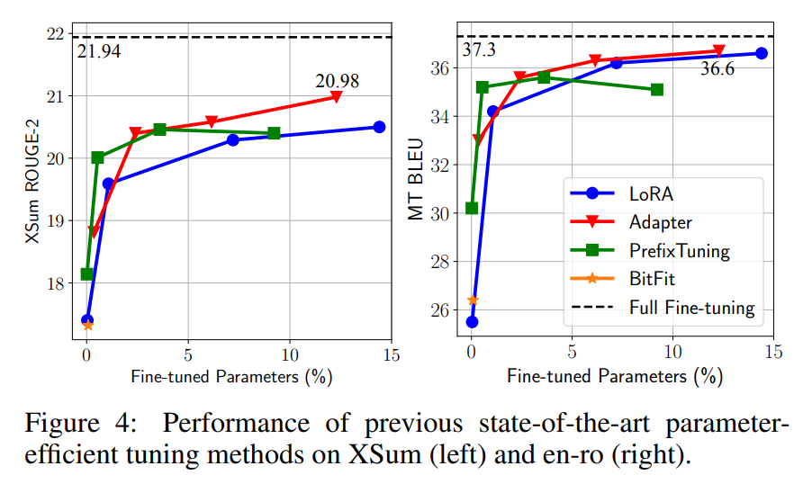

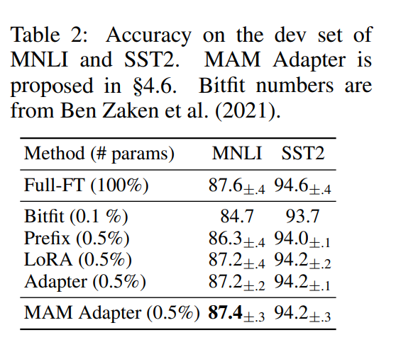

* Fig. 4 와 Tab. 2 에 나타난 바와 같이, 기존 방법들은 MNLI 와 SST2 에서 전체 parameter 의 1% 미만만 tuning 해도 full fine-tuning 과 경쟁력 있는 성능을 보인다. 
  * 그러나 XSum 과 en-ro 에서는 parameter 를 5% 추가해도 큰 성능 격차가 남아 있으며, parameter 비율을 10% 이상으로 늘려도 격차는 여전히 크다.
* Raffel et al. (2020) 은 high-resource MT task 에서 훨씬 더 큰 격차를 관찰하였다. 
  * 이는 GLUE benchmark (encoder-only model 사용) 에서 full fine-tuning 과 비슷한 결과를 보였다고 주장한 기존 연구들이나, 비교적 단순한 generation benchmark 인 E2E 에서의 결과가 다른 표준 benchmark 에 일반화되지 않을 수 있음을 시사한다.
* 이러한 성능 차이는 training sample 수, task 복잡성, model architecture 등 여러 요인에 의해 복합적으로 발생할 수 있다. 
  * 따라서 향후 연구에서는 다양한 benchmark 에 대한 결과 보고가 필요하며, 이를 통해 방법들의 성능 특성을 보다 완전하게 보여줄 수 있다.
* 이후 분석에서는 서로 다른 design choice 를 명확히 구분하기 위해 주로 XSum 과 en-ro dataset 에 집중한다. 
  * 두 benchmark 는 상대적으로 high-resource 이며 encoder-decoder model (BART) 을 사용한다. 한편, MNLI 와 SST2 결과는 §4.6 에서 논의한다.

## 4.3 WHICH INSERTION FORM – SEQUENTIAL OR PARALLEL?

이 절에서는 insertion form design dimension 을 연구한다. 저자가 제안한 **parallel adapter (PA)** 변형을 기존 **sequential adapter (SA)** 와 비교하며, attention (att) 및 FFN modification 모두를 대상으로 한다. 또한 prefix tuning 을 reference point 로 포함한다.

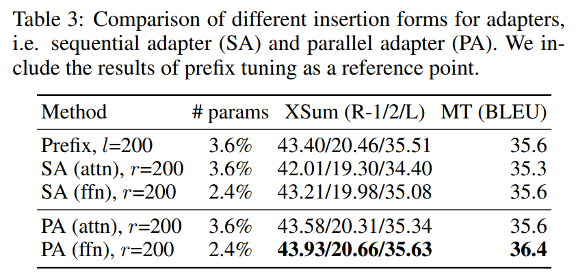

* Tab. 3 에 나타난 바와 같이, parallel insertion 을 사용하는 prefix tuning 은 attention sequential adapter 보다 우수하다. 
* 더 나아가 parallel adapter 는 모든 경우에서 sequential adapter 보다 성능이 좋았으며, 예를 들어 PA (ffn) 은 XSum 에서 SA (ffn) 대비 R-2 점수가 1.7 높고, en-ro 에서 BLEU 점수가 0.8 높다.
* 이러한 결과를 바탕으로, 이후 섹션에서는 sequential adapter 보다 우수한 parallel adapter 결과에 초점을 맞춘다.

## 4.4 WHICH MODIFIED REPRESENTATION – ATTENTION OR FFN?

#### Setup

이제 서로 다른 representation 을 수정하는 효과를 연구한다. 주로 attention 과 FFN modification 을 비교한다. 분석을 단순화하기 위해, attention sub-layer 내의 어떤 hidden representation (e.g., head output, query 등) 을 수정하는 방법은 모두 attention module 을 수정하는 것으로 분류한다. 저자는 attention 과 FFN 에 parallel adapter 를 적용한 결과와 prefix tuning 을 비교한다. 또한 LoRA 에 FFN modification 을 적용하여 **LoRA (ffn)** 변형을 도입한다. 구체적으로, LoRA 를 사용하여 FFN 의 weight $W_1 \in \mathbb{R}^{d \times d_m}$, $W_2 \in \mathbb{R}^{d_m \times d}$ 의 parameter update 를 근사한다. 이 경우 $W_1$ 의 LoRA up-projection 은 $r \times d_m$ 차원을 갖고 ($W_2$ 의 down-projection 도 유사), $d_m = 4d$ 이므로 Sec. 2.1 에서 설명했듯이 LoRA (ffn) 에는 일반적으로 다른 방법보다 더 작은 $r$ 을 사용하여 전체 parameter 수를 맞춘다.

#### Results

Fig. 5 에서 보이듯이, FFN modification 을 적용한 모든 방법은 attention modification 방법보다 항상 우수하며(red marker 가 blue marker 보다 위에 있음), 종종 더 적은 parameter 로도 성능이 높다. 동일한 방법이라도 FFN 에 적용하면 attention counterpart 보다 성능이 향상된다. 예를 들어, LoRA (ffn) 은 XSum 에서 LoRA (attn) 대비 R-2 점수가 1 높다. 또, prefix tuning 은 capacity 를 늘려도 성능이 더 이상 개선되지 않으며, 이는 Li & Liang (2021) 에서도 관찰되었다. 따라서 FFN modification 이 functional form 이나 composition function 과 관계없이 추가 parameter 를 더 효과적으로 활용한다는 점을 시사한다. 저자는 이는 FFN 이 task-specific textual pattern (Geva et al., 2021) 을 학습하는 반면, attention 은 pairwise positional interaction 을 학습하며, 후자는 새로운 task 적응에 큰 capacity 가 필요하지 않기 때문이라고 가설을 세운다.

#### Is the story different when we use 0.1% parameters?

Sec. 3.1 에서 prefix tuning 이 adapter (attn) 보다 expressive 하다고 논리 전개했으나, Fig. 5 에서는 반영되지 않았다. 저자는 multi-head attention 이 parameter budget 이 작을 때만 우월하다고 추정한다. 이를 검증하기 위해, pretrained parameter 의 0.1% 만 추가할 때 prefix tuning 과 parallel adapter 를 비교한다. Composition function 의 영향을 분리하기 위해, gating 을 제거한 prefix tuning ($h + \Delta h$) 도 함께 실험하였다. 또한 Sec. 3.3 에서 설명한 multi-head parallel adapter (MH PA) 도 포함한다.

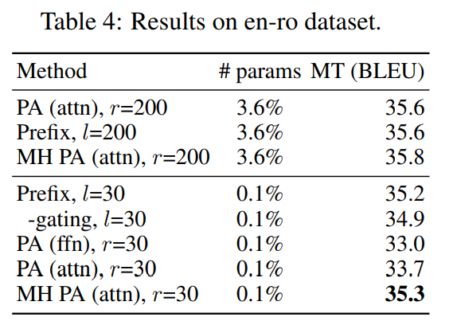

* Tab. 4 에 따르면 multi-head 방법 (prefix tuning 과 MH PA (attn)) 이 다른 모든 방법보다 최소 1.6 BLEU 점수 이상 높았다. 
* 흥미롭게도 prefix tuning 에서 $l$ 을 200 → 30 으로 줄여도 BLEU 손실은 0.4 점에 불과했으나, PA (attn) 은 1.9 점 손실을 보였다. 
* 또한 prefix tuning 의 gating composition function 은 성능을 약 0.3 점 개선하였다. 
* MH parallel adapter 는 single-head 버전보다 1.6 점 향상되어 multi-head formulation 의 효과성을 다시 검증하였다.

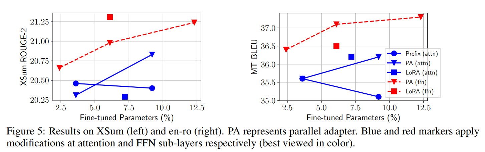

* Fig. 5 와 Tab. 4 를 종합하면, parameter budget 이 매우 작은 경우 head attention modification 이 최적의 성능을 보이며, parameter budget 이 클수록 FFN modification 이 더 효과적이다. 
* 이는 Houlsby et al. (2019) 처럼 attention 과 FFN 에 동일하게 parameter budget 을 분배하기보다, FFN modification 에 더 많은 budget 을 배분하는 것이 효과적일 수 있음을 시사한다.

## 4.5 WHICH COMPOSITION FUNCTION?

Sec. 3.2 에서 세 가지 composition function 을 제시하였다:

* simple addition (adapter)
* gated addition (prefix tuning)
* scaled addition (LoRA)

Softmax 를 사용하지 않는 functional form 에 gating addition 을 억지로 포함시키는 것은 부자연스러우므로, 여기서는 LoRA 에 대해 ablation 을 수행하고, Scaled Parallel Adapter (Scaled PA) 와 비교한다. Modified representation 은 §4.4 에서 보인 것처럼 FFN 이 일반적으로 더 효과적이므로, FFN 으로 고정한다.

Tab. 5 는 XSum 결과를 보고한다.

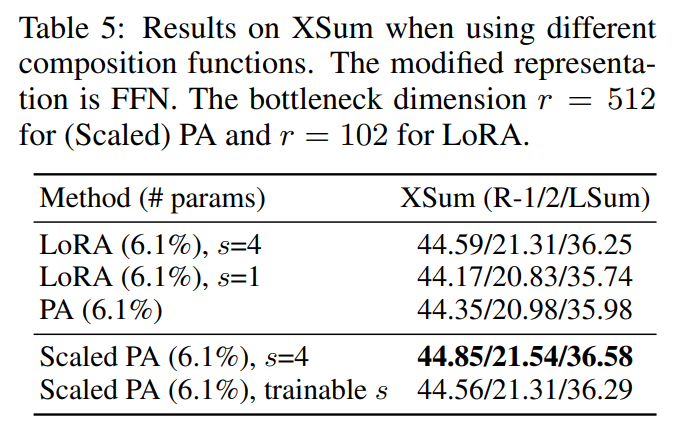

* Adapter: $r = 512$
* LoRA: $r = 102$ (두 방법의 tuned parameter 크기를 동일하게 맞춤)
* $s$: dev set 의 R-2 점수에 따라 선택

결과적으로, LoRA ($s=4$) 는 parallel adapter 보다 성능이 우수하다. 그러나 scaling 을 제거하여 $s=1$ 로 설정하면 이 우위는 사라진다. LoRA 의 composition function 을 parallel adapter 에 적용하면, Scaled PA 가 vanilla parallel adapter 대비 ROUGE-2 점수 0.56 향상되었다. 학습 가능한 scalar 도 실험했으나 추가적인 성능 향상은 없었다.

결론적으로 Scaling composition function 은 vanilla additive function 보다 우수하며, 적용도 용이하다.

## 4.6 AN EFFECTIVE INTEGRATION BY TRANSFERRING FAVORABLE DESIGN ELEMENTS

앞선 섹션에서 세 가지 주요 발견을 강조한다:

1. Scaled parallel adapter 가 FFN 수정에 가장 적합하다.
2. FFN 은 large capacity 에서 modification 을 더 효과적으로 활용한다.
3. Prefix tuning 처럼 head attention 을 수정하면 0.1% parameter 로도 strong performance 를 낼 수 있다.

이에 영감을 받아, 저자는 이러한 favorable design 을 mix & match 한다. 구체적으로, attention sub-layer 에는 작은 bottleneck dimension ($l=30$) 의 prefix tuning 을 사용하고, FFN representation 수정에는 Scaled Parallel Adapter ($r=512$) 를 사용하여 더 많은 parameter budget 을 할당한다. Unified framework 관점에서 prefix tuning 은 adapter 의 한 형태로 볼 수 있으므로, 이 변형을 **Mix-And-Match adapter (MAM Adapter)** 라 명명한다.

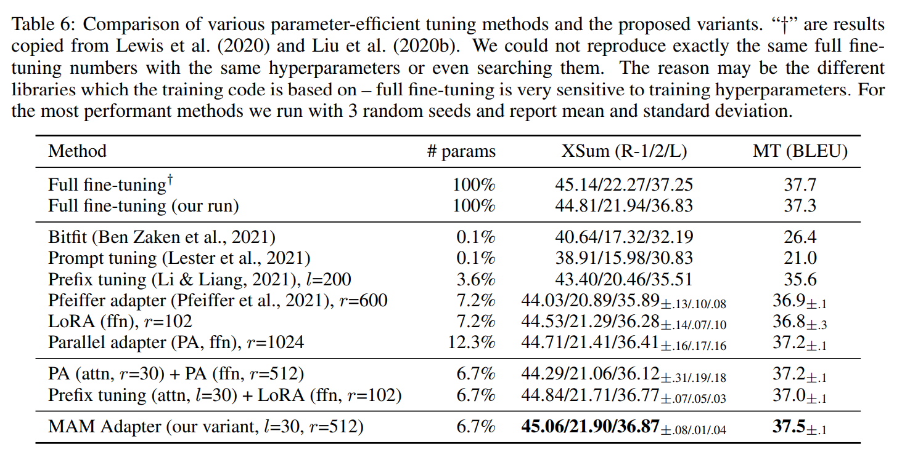

Tab. 6 은 MAM adapter 를 다양한 parameter-efficient tuning 방법과 비교한다. 또한 두 가지 다른 조합 결과도 포함한다:

* attention 과 FFN layer 모두에 parallel adapter 적용
* prefix tuning (attn) + LoRA (ffn) 결합

이 조합 방법들도 prototype 대비 성능을 향상시켰으나, MAM Adapter 가 두 task 모두에서 최상의 성능을 보였으며, pretrained parameter 의 단 6.7% 만 업데이트하면서 full fine-tuning 결과와 동일한 성능을 달성했다.

또한 Tab. 2 에서 MAM Adapter 의 MNLI 와 SST2 결과를 제시하는데, pretrained parameter 의 0.5% 만 추가하여도 full fine-tuning 과 견줄 만한 성능을 달성하였다.

# 5 DISCUSSION

저자는 여러 성능 좋은 parameter-tuning 방법을 위한 unified framework 를 제시하였으며, 이를 통해 approach 간 기법을 전이함으로써 full fine-tuning 과 동등한 성능을 내는 더 효과적인 model 을 구현할 수 있었다. 저자의 연구가 향후 parameter-efficient tuning 연구에 통찰과 지침을 제공하기를 기대한다.
