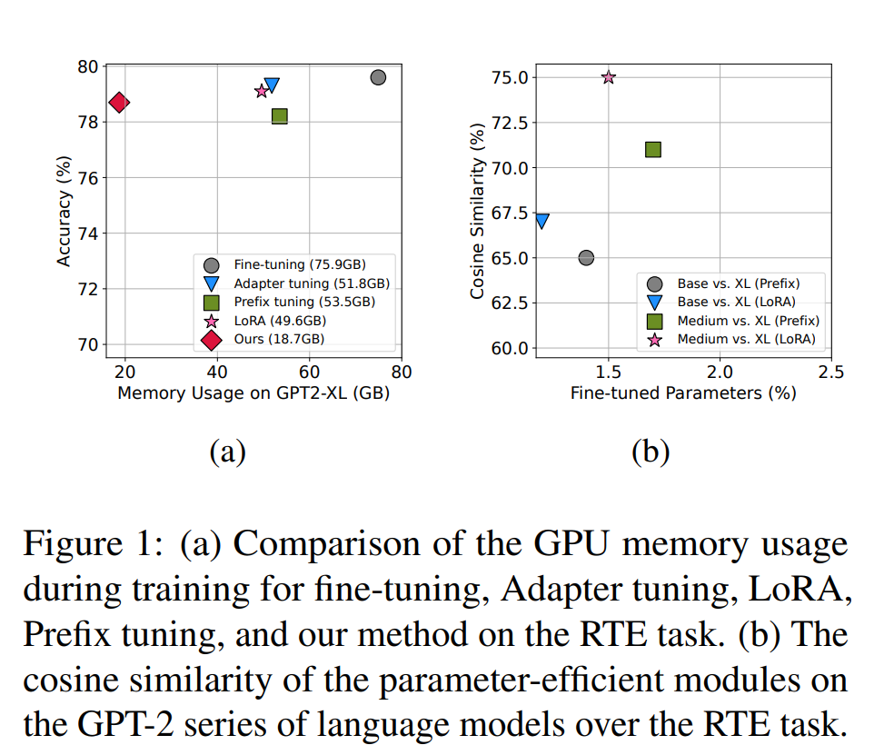
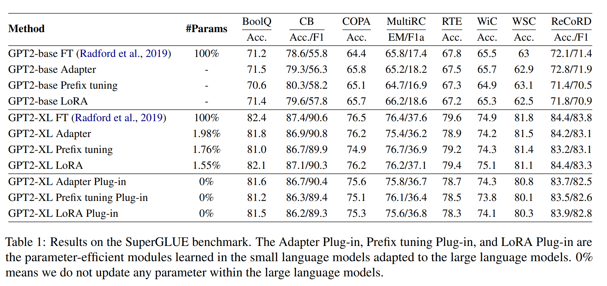
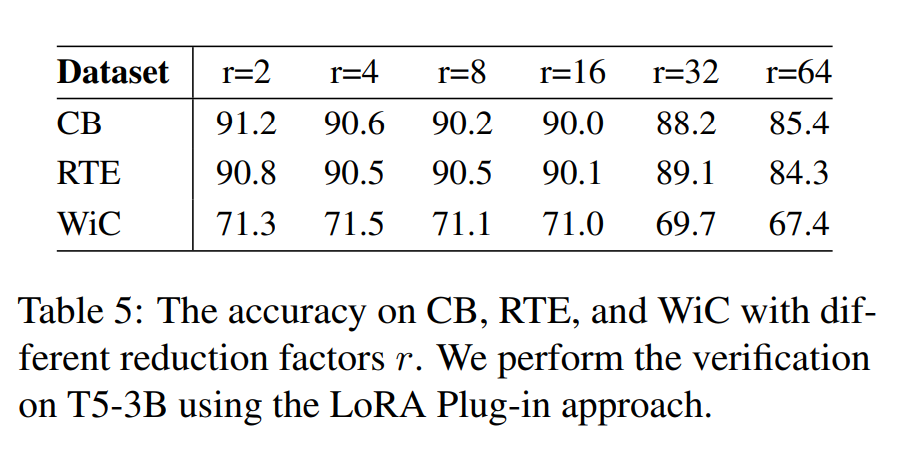
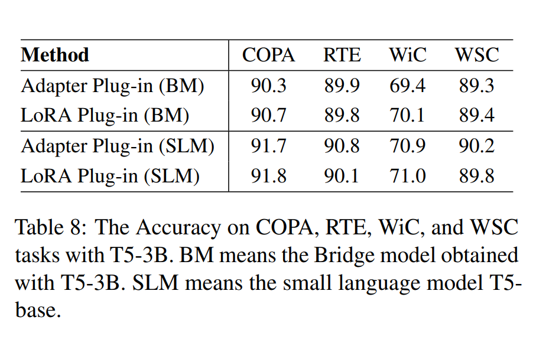

논문 및 이미지 출처 : <https://aclanthology.org/2023.emnlp-main.22.pdf>

# Abstract

large language models (LLMs) 의 fine-tuning 은 상당한 자원과 시간 소모가 필요하다.

최근 adapter tuning, prefix tuning 및 LoRA 같은 peft method 가 나오고 있지만, gradient 및 backpropagation 이 여전히 필요하여 약 30% 의 훈련 메모리 요구만 절약한다.

본 논문에선 gradients 계산이 필요없는 새로운 PEFT 를 제안한다.

- 동일한 task 에서 LLMs 및 SLMs 로 학습된 PEFT module 의 **유사성을 활용**하여, SLMs 로부터 파생되어 초기화한 peft module 을 LLMs 로 transferring 하는 전략
- 부드럽고 효과적인 adaptation process 를 보장하기 위해, **Bridge** model 을 도입하여 모델 간의 동적인 상호작용을 동시에 수행하며, 차원적 일관성을 보장
- T5 및 GPT-2 를 SuperGLUE 에 평가하여 효과성을 입증
  - gradient-based optimization 없이 fine-tuning 및 peft 와 comparable
- 다른 peft 와 비교하여 약 5.7X 메모리 절약

# 1. Introduction

GPT3, GPT4, T5-XXL, LLaMA 등 LLMs 의 놀라운 능력을 보여주지만 일반적인 하드웨어로 fine-tuning 하기에 매우 어렵다.

이에 일부 작은 파라미터만 수반하여 이들만 fine-tuning 하는 peft methods 가 등장한다.

- Adapter tuning : Transformer 의 layers 에 small task-specific modules 을 삽입하여 task-specific information 만 학습
- Prefix tuning : task-specific trainable prompt tokens 를 모든 Transformer layer 의 hidden states 앞에 붙임
- LoRA : 각 layer 의 frozen weights 에 low-rank 및 trainable matrices 를 병합

Fig. 1(a) 에선 RTE dataset fine-tuning 에서의 PEFT GPU memory 사용량을 보여준다.

30% 의 GPU memory 사용을 절약하지만 여전히 gradient-based optimization 을 사용한다.

이를 해결하기 위해, 저자는 gradients 계산이 필요 없는 새로운 PEFT 를 제안한다.

- LLMs 및 SLMs 은 task-specific 특성을 유사하게 학습
  - RTE task 에 peft method 를 실험했을 때 이 가설을 검증할 수 있다. (Fig. 1(b))
  - GPT2-XL 및 GPT2-base 또는 GPT2-medium 의 peft modules 간의 유사성을 계산한 결과 cosine similarity 가 75% 에 도달하였다.
- 위 관찰에 감명받아, SLMs 에서 훈련된 task-specific 특성을 LLMs 에 transfer 한다.
- 이에 gradient-based optimization 없이 LLM 에 task-specific 능력의 질을 높일 수 있다.

---

먼저 downstream task 의 task 특성을 학습하기 위해 기존 peft 를 SLM 에 활용한다.

이후 SLM 으로부터 얻은 peft module 을 LLM 에 직접적으로 적용하면 **dimention mismatch** 및 **limited interaction** 으로 인한 이슈가 발생하므로, 이를 해결하기 위해 저자는 **projection module** 을 채택한다.

- SLMs 및 LLMs 사이의 peft dimension 을 align
- PEFT 및 LLM 사이의 interaction 질을 높여줌
- **Bridge** model 을 도입하여 LLM knowledge 를 유지해주며, LLM dimensions matching 및 peft module interaction 을 얻을 수 있다.

마지막으로 inference 를 위해 peft module 을 LLM 에 plug 한다.

---

T5 및 GPT2 로 SuperGLUE 벤치마크에서 효율성을 입증한다.

추가로 다른 peft 와 비교하여 5.7X memory 를 절약할 수 있다.

- SLMs 와 LLMs 의 downstream task 에 대한 peft 적용에서 상당한 task simiarity 를 발견
- SLM 에서 학습된 peft modules 를 LLM 에 adaptation 하는 gradient-free method 제안
- T5 및 GPT2 를 SuperGLUE 에 실험하여 효과성을 입증하고 다른 peft 와 비교하여 5.7X 메모리 사용량 절약

# 2. Method

1. 먼저 training stage 중 peft method 를 사용하여 SLM 에 task-specific 특성을 학습한다.
2. 이후 Bridge model 및 peft module 을 fine-tuning 하여 peft module 의 knowledge 를 향상시킨다.
3. 마지막으로, inference state 중에 peft module 을 LLM 에 plug 한다.

#### Plug-in and Bridge Model Fine-tuning

먼저 SLM 에 Adapter, LoRA, Prefix-tuning 같은 peft 를 활용하여 downstream task 특성을 학습한다.

이를 LLM 에 직접 적용하면 두 가지 이슈가 발생한다.

- dimension mismatch
  - 이를 해결하기 위해 linear projection module $W_{plug}$ 를 **Plug-in** model 로 사용하여 peft module 의 dimension 을 align
  - SLM 은 보통 LLM 보다 적은 layers 를 가지므로, peft module 의 layers 를 duplicating 하여 layer mismatch 를 해결
  - 이 duplication 은 LLM 와의 layer alignment 를 가능하게 함
- limited interaction
  - peft 를 LLM 에 성공적으로 adapting 하려면 상당한 상호작용이 필요
  - interaction 향상을 위해, **Bridge** model 을 도입하여 LLM knowledge 를 유지하면서 peft module 과 interacting
  - pruning method 인 Laddersize-tuning (Sung et al., 2022) 을 채용하여 Bridge model 로 사용. LLM $f$ 의 각 layer 을 pruning 하는 과정을 포함한다.
  - 저자는 linear projections 을 사용하여 LLM $f$ 의 각 intermediate activations 및 word embeddings 를 lower-dimensional Bridge model $g$ 로 downsampling
  - reduction factor $r$ 은 8, 16, 32, 64 등 사용
  - LLM 의 주요 정보를 유지하기 위해 Fisher information 을 활용하여 LLM 의 파라미터를 pruning 하고 initial Bridge model $g$ 를 얻는다.
  - Fisher information 은 LLM parameter 의 중요성을 효과적으로 평가할 수 있다. backbone network 의 $W \in \mathbb{R}^{d_b \times d_l}$ 이 $d_l$-dim vectors 를 $d_b$-dim space 로 매핑하는 경우, 다음 식을 통해 각 weight vector importance 를 계산한다.

$$
W = \frac{1}{|D|}\sum^{|D|}_{i=1}(\triangledown_W \log p(y_i|x_i))^2,
$$

- $(x_i, y_i)$ : data $D$ 의 samples
- $W$ 의 rows 및 columns 을 유지하여 $\frac{d_b}{r}$ 및 $\frac{d_l}{r}$ importrance score 를 가진다.
- Transformer 각 layer 에 위 과정을 반복하여, weight matrices set $W_B \in \mathbb{R}^{\frac{d_b}{r} \times \frac{d_l}{r}}$ 를 얻으며, backbone network 에 $1/r$ 번 prunining 을 겪게하고, 이를 Bridge model 로 초기화하여 활용

---

이후, SML 에서 학습된 peft modules (Adapter, LoRA, Prefix tuning) 이 Bridge model 과 상호작용하도록 하기 위해 **linear projection module $W_{down}$** 을 peft 에 적용하고 Bridge model $g$ 와 함께 peft module 을 fine-tuning 한다.

위 fine-tuning 과정으로 두 목표를 달성할 수 있다.

- match LLM dimension
- enriching modules knowledge

#### Inference

peft module 및 Bridge model $g$ 는 한 번의 훈련으로 완성되며, LLM 의 knowledge 로 향상된 peft module 을 LLM 에 통합시킨다.

위 통합으로 LLM 은 inference 중 gradient-based optimization 없이 peft 로 capute 한 task-specific knowledge 를 활용할 수 있게 된다.

# 3. Experiments

## 3.1 Experimental Settings

SuperGLUE 의 8개 NLU task 에서 실험을 수행

- BoolQ
- CB
- COPA
- MultiRC
- RTE
- WiC
- WSC
- ReCoRD

accuracy 또는 F1-score 로 report 

autoregressive language model GPT2 및 sequence-to-sequence model T5 ㅇ에서 효과성을 평가한다.

- GPT2 의 경우 GPT2-base 를 small model 로, GPT2-XL 을 large model 로 지정
- T5 의 경우, T5-base 및 T5-large 를 small model 로, T5-3B 및 T5-XXL 을 large model 로 지정
- Bridge model 을 얻기 위해, reduction factor $r = 16$ 로 설정

- Bridge model 이 LLM parameter 보다 상당히 작다는 것을 볼 수 있다.

---

저자의 목표는 SLM 에 학습된 peft module 이 gradient-based optimization 없이 LLM 에 효과적으로 adapt 되어 full fine-tuning 및 다른 peft 와 comparable 한 성능을 달성하는 것.

baseline 은 다음과 같다.

#### Fine-tuning

vanilla Transformer fine-tuning

#### Adapter tuning

각 Transformer layer 의 self-attention module (and MLP module) 및 subsequent residual connection 사이에 small task-specific module 을 삽입

#### Prefix tuning

각 Transformer attention layer 의 Key 및 Value 에 trainable continuous prompt vectors 추가

#### LoRA

Transformer 각 frozen weighted layer 에 low-rank 및 trainable matrices 를 병합

#### Adapter tuning Plug-in

Adapter tuning method 를 SLM 에 적용하여 LLM 에 adapt 할 수 있는 peft module 을 얻음

### Prefix tuning Plug-in

Prefix tuning method 를 SLM 에 적용하여 LLM 에 adapt 할 수 있는 peft module 을 얻음

#### LoRA Plug-in

LoRA tuning method 를 SLM 에 적용하여 LLM 에 adapt 할 수 있는 peft module 을 얻음

## 3.2 Main Results

### 3.2.1 Experiments on GPT-2 Series of Models

- GPT2-base 를 slm, GPT2-XL 을 llm 으로 사용
- llm vanilla fine-tuning 및 peft methods 와 comparable result
- BoolQ 및 COPA task 에서 prefix-tuning method 에 대해 약간의 성능 향상을 증거로 효과성 입증

### 3.2.2 Experiments on T5 Series of Models

- Table 3 : T5-base 를 slm, T5-3B 를 llm 으로 사용
  - 8개의 SuperGLUE tasks 에서 comparable results 달성
  - 특히, BoolQ, CB, RTE, ReCoRD 에서 full fine-tuning 과 유사한 수준 달성
  - prefix-tuning 에서 비교하면, CB, COPA, WSC task 에서 약간 향상
- Table 4 : T5-large 를 slm, T5-XXL 을 llm 으로 사용
  - 마찬가지로 comparable results 달성
  - prefix-tuning 에서는 BoolQ, CB, ReCoRD 에서 약간 향상

LLM size 가 증가하면서 peft 는 약간의 parameter 를 추갛하지만, 저자의 방법은 parameter augmentation 이 필요하지 않고, plug-in 을 통해 llm 의 능력을 최적으로 사용한다.

이 방법은 llm 의 parameter updating 없이 knowledge 를 효과적으로 활용하며, llm 응용에 대한 잠재적인 제시도 준다.

### 3.2.3 Importance of the Reduction Factor $r$

reduction factor $r$ 의 영향을 고려하여, CB, RTE 및 WiC 에서 검증 분석을 실험한다.

- $r$ 의 증가에 따른 모델 성능의 점진적 감소를 발견
  - 눂은 $r$ 값은 llm 에서 Bridge 로의 knowledge 유지를 감소시키기 때문
  - 위 관찰을 통해 Bridge model 의 parameter 는 slm 보다 작아야 함을 알 수 있다.
- Bridge model 의 parameter 가 sml 과 비교 가능한 경우, 저자의 방법은 성능을 저하시키지 않고 모델을 유지
  - 모델 성능과 Bridge model 의 parameter 사이의 균형을 맞추기 위해, $r = 16$ 을 선택하는 것이 적절한 선택지

### 3.2.4 Memory Usage

저자의 method 는 parameter updating 없이 full fine-tuning 과 peft 와 comparable 성능을 달성할 뿐만 아니라 memory 사용량도 상당히 줄여준다.

- GPT2-XL 모델 사용 시
  - sequence length : 512
  - batch size : 8
  - vanilla fine-tuning 와 비교하여 7.1X 메모리 절약
  - 기존 peft 와 비교하면, 5.3x, 5.6x 및 5.7x 메모리 절약을 달성
- T5-3B 모델 사용 시
  - sequence length : 512
  - batch size : 1
  - vanilla fine-tuning 와 비교하여 5.1X 메모리 절약
  - 기존 peft 와 비교하면, 3.6x, 3.5x 및 3.6 메모리 절약을 달성

저자의 접근법은 LLM 에 더 효과적으로 적용할 수 있고, inference 에서 속도를 down 시키지 않는다.

plug-in 을 활용하여, llm 의 knowledge 를 직접적으로 활용하여 inference 에서 속도를 늦추지 않는다.

## 3.3 Utilize Bridge Model Directly?

질문 : 왜 Bridge model 을 직접적으로 peft 로 학습하지 않고 SLM 을 사용하며, peft module 을 LLM 에 적용하지 않을까?

직관적으로는, 저자는 LLM 의 dimension match 를 위해 project 할 projection model 이 필요하지만, projection model 은 interaction 만 잘 학습한다.

peft 및 linear projection modules 를 직접 초기화하여 Bridge model 을 훈련시키고 Bridge model 만으로 학습할 수 있는지 조사한다.

- T5-3B 를 사용하여, COPA, RTE, WiC 및 WSC task 에 실험 수행
  - Bridge model 로 학습된 peft module 을 SLM → T5-3B 로 plugging 하여 성능을 비교
  - Bridge model 을 직접적으로 사용하면 일관적으로 성능이 나쁜 것을 발견
- 위 결과는 Bridge model 혼자로는 활용할 수 없다는 것을 표시

# 4. Related Work

#### Fine-tuning and Parameter-efficient Tuning

LLM 은 downstream task 에 도입하여 pre-trained LM 의 모든 parameter 를 업데이트하고 저장해야하므로, 모델 사이즈가 점점 증가하는 현대에 full fine-tuning 이란 어렵다.

이에 PEFT 방법으로 LLM 은 frozen 한 채 작은 파라미터만 tuning 하여 vanilla fine-tuning 과 comparable result 를 얻을 수 있게 되었다.

- Adapter tuning : Transformer layers 에 small-scale task-specific module 을 추가하여 task-specific information 학습을 목표
- Prefix tuning : Transformer layers 에 additional parameter 도입
- LoRA : Transformer 각 layer 의 frozen weight 에 low-rank 및 trainable matrices 병합
- BitFit : frozen parameter 유지한 채 모델의 bias 를 최적화하는 간단한 방법

하지만 존재하는 peft method 는 일반적으로 gradient-base optimization 이 필요하고 여전히 메모리 사용량 수반

저자의 방법은 메모리 사용량을 상당히 절약하고, 성능은 유지

#### Gradient-free Optimization

최근, Ladder side-tuning (Sung et al. 2022) 의 downstream task 에 pruned model 을 직접 적용하여 gradient 가 필요없지만 LLM 의 knowledge 를 완전히 활용하지 않는 방법이 있다.

Offsite-tuning (Xiao et al. 2023) 은 full parameter access 없이 LLM 을 downstream task 에 adapting 할 수 있는 효과적인 transfer learning framework 를 제안했지만, compute-intensive distillation techiques 를 사용하여 큰 모델에 대해 비용이 크게 들 수 있다.

저자의 방법은 LLM 에 포함된 knowledge 를 더욱 활용하며, LLM 의 성능을 유지하면서도 간단하게 메모리를 절약할 수 있다.

# 5. Conclusion

gradient 계산 없이 LLM 에 적용할 새로운 peft method 제안

SLM 에 peft module 을 학습한 후, peft module 과 LLM 사이의 dimension mismatch 및 interaction 을 가능하게 할 Bridge model 과 함께 LLM 에 adapting

SuperGLUE 에 실험 결과 full fine-tuning 및 peft 와 비교하여 gradient-base optimization 없이도 comparable result 달성

# Limitations

weights 를 얻을 수 없는 LLM 의 경우 직접적으로 사용할 수 없으며, 다른 아키텍처의 LM 에 적용할 때는 한계가 존재한다.

서로 다른 아키텍처 및 모델 전역에 효과적이고 능력을 향상시킬 수 있는 것을 목표로 하는 방법에 대해 후속 연구

