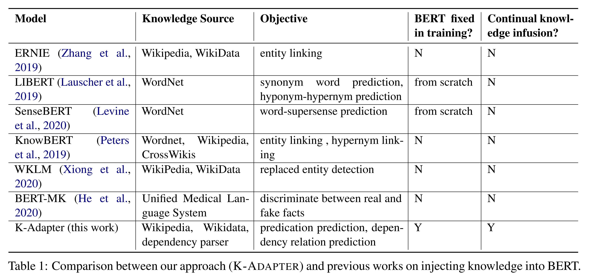
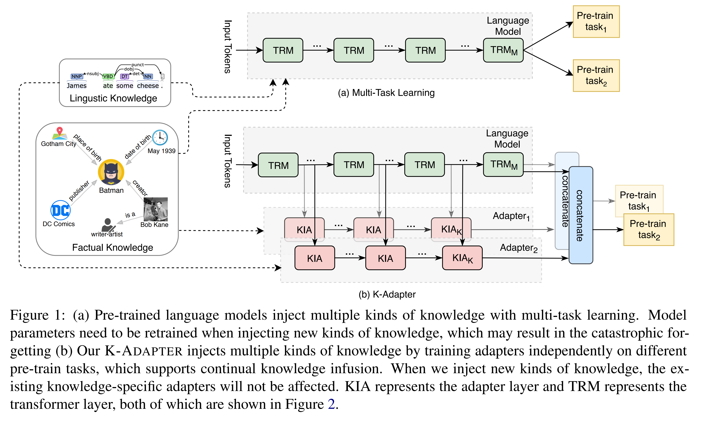
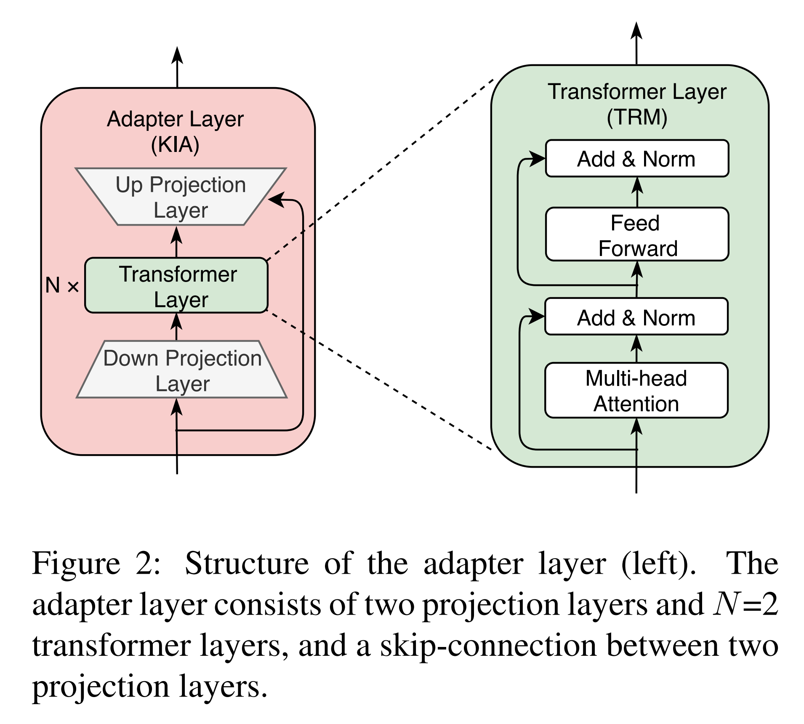
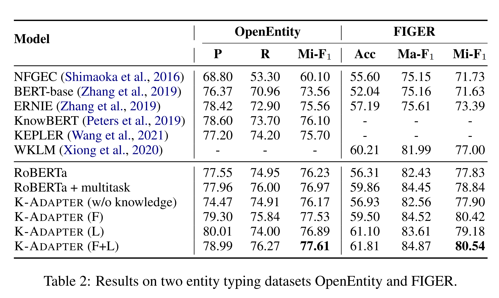
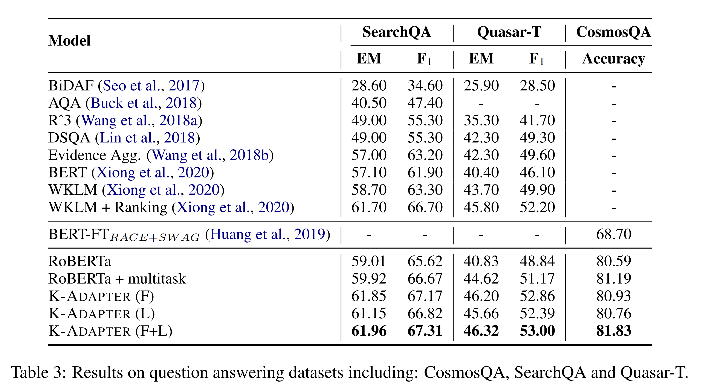
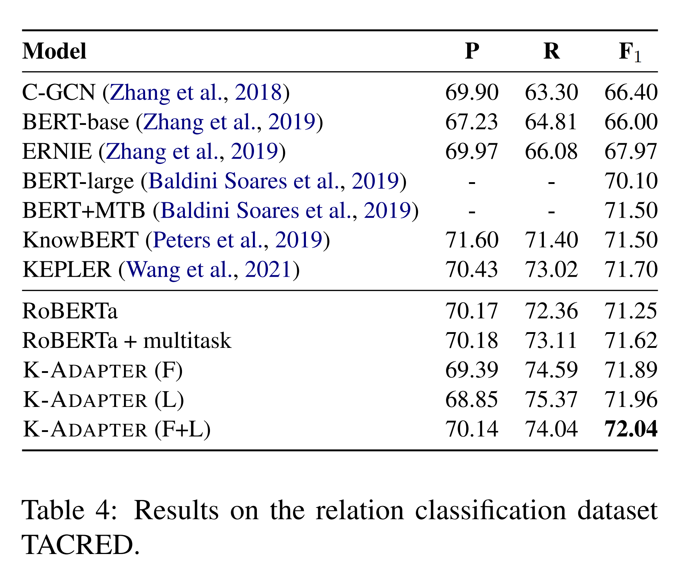
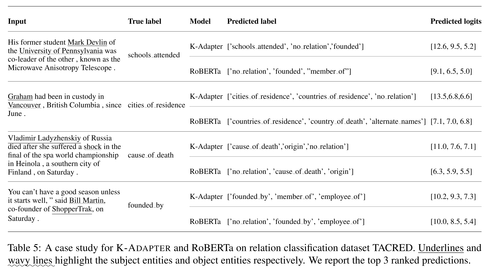
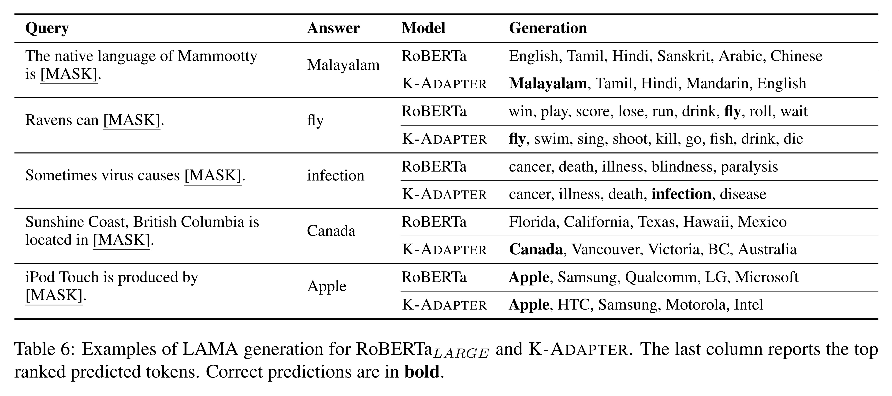

논문 및 이미지 출처 : <https://aclanthology.org/2021.findings-acl.121.pdf>

# Abstract

저자는 BERT 와 RoBERTa 와 같은 large pre-trained model 에 knowledge 를 주입하는 문제를 연구한다. 기존 방법들은 일반적으로 knowledge 를 주입할 때 pre-trained model 의 originsl parameter 를 업데이트한다. 그러나 여러 종류의 knowledge 가 주입될 경우, 과거에 주입된 knowledge 는 사라지게 된다. 이를 해결하기 위해 저자는 **K-ADAPTER** 를 제안한다. 

* 이 framework 은 pre-trained model 의 originsl parameter 를 고정한 채 유지하면서 다양한 knowledge-infused model 의 개발을 지원한다. 
* RoBERTa 를 backbone model 로 사용하며, K-ADAPTER 는 주입된 각 종류의 knowledge 에 대해 neural adapter 를 제공한다. 
* 이는 RoBERTa 에 연결된 plug-in 과 같은 구조이다. 서로 다른 adapter 사이에는 information flow 가 존재하지 않으므로, 여러 adapter 를 분산 방식으로 효율적으로 training 할 수 있다.

case study 로, 저자는 본 연구에서 두 가지 종류의 knowledge 를 주입한다.

(1) Wikipedia 와 Wikidata 에서 자동으로 정렬된 text-triplets 로부터 얻은 factual knowledge  
(2) dependency parsing 을 통해 얻은 linguistic knowledge

relation classification, entity typing, question answering 의 세 가지 knowledge-driven task 에 대한 결과는 각 adapter 가 성능을 향상시키며, 두 adapter 의 결합은 추가적인 성능 향상을 가져옴을 보여준다. 추가적인 분석을 통해 K-ADAPTER 가 RoBERTa 보다 다양한 knowledge 를 포착함을 확인할 수 있다.

# 1 Introduction

Language representation model 은 BERT, GPT, XLNet, RoBERTa, T5 와 같이 large-scale text corpus 에 대해 (masked) language modeling 과 같은 unsupervised objective 로 pre-training 된 모델을 의미하며, 다양한 NLP downstream task 에서 SOTA 성능을 확립하였다. 이러한 pre-trained model 들이 경험적 연구에서 큰 성공을 거두었음에도 불구하고, 최근 연구들은 이러한 unsupervised 방식으로 학습된 model 이 rich knowledge 를 포착하는 데 어려움을 겪는다고 제안한다. 

* 예를 들어, Poerner et al 은 language model 이 entity name 의 surface form 에 대해 reasoning 은 잘 수행하지만, rich factual knowledge 를 포착하는 데는 실패한다고 주장한다. 
* Kassner and Schutze 는 BERT 가 부정(e.g., "not")의 의미를 대부분 학습하지 못했다고 관찰하였다. 이러한 관찰은 BERT 와 RoBERTa 같은 pre-trained model 에 knowledge 를 주입하는 연구를 촉발한다.



최근에는 pre-trained language model 에 knowledge 를 주입하려는 다양한 시도가 이루어졌다. 기존 연구 대부분은 (Tab. 1 에 제시된 바와 같이) standard language modeling objective 에 knowledge-driven objective 를 결합하여 전체 model parameter 를 업데이트하였다. 이러한 방법들은 downstream task 에서 더 나은 성능을 얻지만, 여러 종류의 knowledge 가 주입된 versatile model 개발을 지원하는 데 어려움을 겪는다. 새로운 종류의 knowledge 가 주입되면, model parameter 를 다시 training 해야 하고, 이 과정에서 과거에 주입된 knowledge 가 사라지게 된다. 동시에, 이러한 model 은 서로 얽힌 representation 을 생성하므로 각 knowledge 의 효과를 분석하기 어렵다.

본 논문에서 저자는 K-ADAPTER 라는 flexible 하고 simple 한 framework 을 제안한다. 

* 이 framework 은 large pre-trained model 에 여러 종류의 knowledge infusion 을 지원한다. 
* K-ADAPTER 는 pre-trained model 의 originsl representation 을 변경하지 않고, 주입된 knowledge 의 종류에 따라 다른 representation 을 생성한다. 
* 이는 adapter 라 불리는 compact neural model 의 통합을 통해 달성된다. 
* Adapter 는 pre-trained model outside plug-in 형태로 연결된 knowledge-specific model 이며, input 은 pre-trained model 의 intermediate layer 의 hidden-state output 이다. 

저자는 RoBERTa 를 base pre-trained model 로 사용하고, 두 가지 종류의 knowledge 를 통합한다. 

(1) Wikipedia text 와 Wikidata triplet 을 정렬하여 얻은 factual knowledge,   
(2) web text 에 dependency parser 를 적용하여 얻은 linguistic knowledge. 

pre-training 단계에서 두 adapter 는 독립적으로 training 된다. Adapter 는 RoBERTa 에 비해 trainable parameter 수가 훨씬 적으므로 training 과정은 memory efficient 하다.

저자는 relation classification, entity typing, question answering 의 세 가지 knowledge-driven task 에 걸쳐 여섯 개 benchmark dataset 에 대해 광범위한 실험을 수행한다. 실험 결과 K-ADAPTER 는 RoBERTa 보다 일관되게 더 나은 성능을 보였으며, 다섯 개 dataset 에서 SOTA 성능을 달성하였다. Case study 와 probing experiment 는 K-ADAPTER 가 RoBERTa 보다 다양한 knowledge 를 포착함을 보여준다.

# 2 Related Work

본 연구는 pre-trained model 에 knowledge 를 주입하는 영역과 관련된다. Tab. 1 에서 나타난 바와 같이, 기존 연구들은 주로 knowledge source 와 training 에 사용된 objective 의 차이에서 구분된다.

* **ERNIE** 는 knowledge graph 를 BERT 에 주입한다. Wikipedia sentence 의 entity 를 WikiData 의 fact triple 과 정렬하고, entity 가 세 개 미만인 sentence 는 폐기한다. 
  * Training 과정에서 input 은 sentence 와 연결된 fact 를 포함하며, knowledge-aware learning objective 는 올바른 token-entity alignment 를 예측하는 것이다. 
  * Entity embedding 은 WikiData 의 fact triple 에 대해 TransE 로 학습된다.
* **LIBERT** 는 WordNet 에서 synonym 과 hyponym-hypernym 관계를 가지는 word 쌍을 주입한다. 
  * Model 은 special token 으로 구분된 word pair 를 input 으로 사용하고, 특정 relation 이 성립하는지를 예측하는 binary classification 문제로 최적화된다.
* **SenseBERT** 는 word-supersense knowledge 를 고려한다. Input 에서 masked word 의 supersense 를 예측하는 방식으로 knowledge 를 주입하며, 후보는 noun 과 verb 이고 ground truth 는 WordNet 에서 가져온다.
* **KnowBERT** 는 Knowledge attention 과 recontextualization 을 통해 knowledge base 를 BERT 에 통합한다. Knowledge source 는 WordNet 의 synset-synset, lemma-lemma 관계와 Wikipedia 의 entity linking 정보이다. Entity linking supervision 이 가능할 경우, model 은 knowledge-aware log-likelihood 나 max-margin objective 로 학습된다.
* **WKLM** 은 originsl document 의 entity mention 을 동일한 type 의 다른 entity name 으로 교체한다. 
  * Model 은 올바른 entity mention 과 무작위로 선택된 entity mention 을 구별하도록 학습된다.
* **BERT-MK** 는 knowledge graph 의 fact triple 을 통합한다. 
  * 각 entity 에 대해 knowledge graph 상의 이웃으로부터 incoming 과 outcoming instance 를 sampling 하고, head 또는 tail entity 를 교체하여 negative instance 를 생성한다. 
  * Model 은 real fact 와 fake fact 를 구별하도록 학습된다.

Tab. 1 에서 볼 수 있듯이, 저자의 model 인 K-ADAPTER 는 기존 연구와 세 가지 측면에서 다르다.

1. fact-related objective (i.e., predicate/relation prediction) 와 linguistic-related objective (i.e., dependency relation prediction) 를 모두 고려한다.
2. knowledge infusion 과정에서 BERT 의 original parameter 를 고정한다.
3. 저자의 접근법은 continual learning 을 지원한다. 즉, 서로 다른 adapter 의 학습이 얽히지 않는다. 이러한 flexibility 덕분에 서로 다른 종류의 knowledge 를 독립적으로 효율적으로 주입할 수 있으며, 이전에 주입된 knowledge 의 손실 없이 더 많은 종류의 knowledge 를 주입할 수 있다.

# 3 K-ADAPTER



Fig. 1(a) 에 나타난 바와 같이, 기존 연구 대부분은 pre-trained language model 에 knowledge 를 주입하고 multi-task learning 을 통해 model parameter 를 업데이트하여 이를 강화한다. 그러나 이러한 multi-task learning 기반 knowledge-injected 방법들의 다양한 변형에도 불구하고 공통적으로 충분히 연구되지 않은 문제는 과거 knowledge 의 catastrophic forgetting 이다. 

이를 해결하기 위해 저자는 Fig. 1(b) 와 같은 **K-ADAPTER** 를 제시한다. 

* 이 방식에서는 여러 종류의 knowledge 를 pre-trained model 에 직접 주입하는 대신, 개별 compact neural model (i.e., 본 논문에서 adapter) 에 각각 주입한다. 
* 이 방법은 pre-trained model 의 original representation 을 고정한 채 유지하면서 continual knowledge infusion 을 지원한다. 
* 즉, 각 종류의 knowledge 를 해당 knowledge-specific adapter 에 주입하여 disentangled representation 을 생성한다.
* 구체적으로 adapter 는 knowledge-specific model 로 (few parameter 를 가짐), pre-trained model outside plug-in 형태로 연결된다. 
* Adapter 의 input 은 pre-trained model 의 intermediate layer hidden-state output 이다. 
* 각 adapter 는 discriminative knowledge 를 주입하기 위해 서로 다른 task 에 대해 독립적으로 pre-training 되며, 이때 pre-trained model 의 original parameter 는 고정된다. 

본 논문에서는 RoBERTa 를 pre-trained model 로 활용하며, factual knowledge 와 linguistic knowledge 를 두 종류의 adapter (factual adapter 와 linguistic adapter) 로 주입한다. 

Factual adapter 는 relation classification task 로, linguistic adapter 는 dependency relation prediction task 로 각각 pre-training 된다. 이 절에서는 먼저 adapter 의 구조를 설명하고, 이후 knowledge-specific adapter 의 pre-training 과정을 제시한다.

## 3.1 Adapter Structure



본 연구에서는 Fig. 2 와 같은 knowledge-specific adapter 구조를 제안한다. 

* Houlsby et al. 이 transformer layer 마다 adapter layer 를 추가하는 방식과 달리, 저자의 adapter 는 outside plug-in 으로 동작한다. 
* 각 adapter model 은 $K$ 개의 adapter layer 로 구성되며, 각 adapter layer 는 $N$ 개의 transformer layer 와 두 개의 projection layer 를 포함한다. 
  * 두 projection layer 사이에는 skip-connection 이 적용된다.
* 구체적으로, 각 adapter model 은 pre-trained model 의 서로 다른 transformer layer 사이에 adapter layer 를 삽입한다. 
* Pre-trained model 의 transformer layer output hidden feature 와 이전 adapter layer 의 output feature 를 연결(concatenate)하여 현재 adapter layer 의 input feature 로 사용한다. 
* 각 knowledge-specific adapter 의 경우, pre-trained model 과 adapter 의 마지막 hidden feature 를 연결하여 해당 adapter model 의 최종 output feature 로 사용한다.

Pre-training 절차에서는 각 knowledge-specific adapter 를 서로 다른 pre-training task 에 대해 독립적으로 학습한다. 

* 다양한 downstream task 에 대해서는 K-ADAPTER 가 RoBERTa 와 BERT 와 유사한 fine-tuning 절차를 적용할 수 있다. 
* Knowledge-specific adapter 가 하나만 채택된 경우, 해당 adapter model 의 final output feature 를 downstream task 의 task-specific layer 에 input 으로 사용한다. 
* Knowledge-specific adapter 가 여러 개 채택된 경우, 서로 다른 adapter model 의 output feature 를 연결하여 downstream task 의 task-specific layer 에 input 으로 사용한다.

## 3.2 Pre-training settings

* 모든 실험에서 pre-trained model 로 Huggingface 의 RoBERTaLARGE ( $L=24$, $H=1024$, $A=16$, 355M params) 구현체를 사용한다. 
* 각 adapter layer 에 대해, transformer layer 의 개수를 $N$, transformer layer 의 hidden dimension 을 $H_A$, self-attention head 의 개수를 $A_A$, down-projection 과 up-projection layer 의 hidden dimension 을 각각 $H_d$, $H_u$ 로 표기한다. 
  * 구체적으로 adapter 의 크기는 다음과 같다: $N=2$, $H_A=768$, $A_A=12$, $H_u=1024$, $H_d=768$. 
* Adapter layer 가 삽입되는 RoBERTa layer 는 {0, 11, 23} 이며, 서로 다른 adapter layer 는 parameter 를 공유하지 않는다. 
  * 따라서 각 adapter model 의 전체 parameter 수는 약 42M 으로, RoBERTaLARGE 보다 훨씬 작아 training 과정에서 memory efficient 하다. 
* Training 중에는 RoBERTa 가 고정되며, adapter 의 parameter 만이 학습 가능하고 무작위로 초기화된다. 
* 이후 서로 다른 knowledge 를 knowledge-specific adapter 에 주입하는 방법을 설명한다.

## 3.3 Factual Adapter

Factual knowledge 는 사실과 관련된 기본 정보로 설명될 수 있다. 본 연구에서는 자연어 내 entity 들 간의 관계에서 factual knowledge 를 획득한다. Wikipedia abstract 와 Wikidata triple 간의 large-scale alignment dataset 인 T-REx 로부터 sub-dataset 인 T-REx-rc 를 추출한다. Entity pair 가 50 미만인 relation 은 모두 제거하고, 최종적으로 430 개 relation 과 5.5M sentence 를 수집한다.

Factual knowledge 를 주입하기 위해, 저자는 relation classification task 에 대해 facAdapter 라 불리는 knowledge-specific adapter 를 pre-training 한다. 이 task 는 주어진 entity pair 의 context 에 기반하여 relation label 을 분류하는 것을 요구한다. 구체적으로 RoBERTa 와 facAdapter 의 마지막 hidden feature 를 연결하여 input representation 으로 사용하고, 주어진 entity 들의 input representation 에 pooling layer 를 적용한다. 이후 두 entity representation 을 연결하여 relation classification 을 수행한다.

## 3.4 Linguistic Adapter

Linguistic knowledge 는 natural language texts 에 내재적으로 포함되어 있으며, 예를 들어 syntactic 및 semantic 정보가 있다. 

본 연구에서는 natural language texts 내 word 간 dependency 관계에서 linguistic knowledge 를 획득한다. 이를 위해 100 만 개의 example 로 구성된 dataset 을 구축하였다. 구체적으로, Book Corpus 의 일부에 Stanford Parser 의 off-the-shell dependency parser 를 적용한다.

Linguistic knowledge 를 주입하기 위해, 저자는 dependency relation prediction task 에 대해 linAdapter 라 불리는 또 다른 knowledge-specific adapter 를 pre-training 한다. 이 task 는 주어진 sentence 에서 각 token 의 head index 를 예측하는 것을 목표로 한다. RoBERTa 와 linAdapter 의 마지막 hidden feature 를 연결하여 input representation 으로 사용하고, 각 token 의 input representation 에 linear layer 를 적용하여 classification 을 수행한다. facAdapter 와 linAdapter 의 추가적인 training detail 은 Appendix 에 제시되어 있다.

# 4 Experiments

저자는 K-ADAPTER 를 세 가지 knowledge-driven downstream task, 즉 entity typing, question answering, relation classification 에 대해 평가한다. 또한 case study 와 probing experiment 를 통해 factual knowledge 학습에 대한 model 의 효과성과 능력을 탐구한다. 

K-ADAPTER (F+L), K-ADAPTER (F), K-ADAPTER (L) 은 각각 factual adapter 와 linguistic adapter 를 모두 포함한 경우, factual adapter 만 포함한 경우, linguistic adapter 만 포함한 경우를 의미한다.

## 4.1 Entity Typing

저자는 주어진 entity 와 그 context 의 type 을 예측하는 fine-grained entity typing 실험을 수행한다. 

* Model 은 OpenEntity 와 FIGER dataset 에 대해 평가되며, Zhang et al. 과 동일한 split setting 을 따른다. 
* Entity typing 을 위해 fine-tuning 시, input token sequence 를 수정하여 특정 entity 앞뒤에 special token “@” 를 추가하고, first “@” token 의 representation 을 classification 에 사용한다. 
* OpenEntity 의 경우, model 성능 평가는 micro F1 score 를 사용한다. 
* FIGER 의 경우, strict accuracy, loose macro, loose micro F1 score 를 평가 metric 으로 사용하며, Ling and Weld 의 동일한 평가 기준을 따른다.

#### Baselines

* NFGEC 은 attentive recursive neural network 를 사용하여 context representation 을 구성한다.
* KEPLER 는 knowledge embedding objective 의 supervision 으로 factual knowledge 를 통합한다.
* RoBERTa+multitask 은 두 가지 pre-training task 에 대해 multi-task learning (Fig. 1(a)) 으로 학습된 RoBERTa model 이며, 여러 종류의 knowledge 를 주입하기 위해 사용된다.
* K-ADAPTER (w/o knowledge) 는 RoBERTa model 과 knowledge 가 주입되지 않은 adapter 로 구성된다.
* 다른 baseline model 은 Sec. 2 에 설명되어 있다.

#### Results and Discussion

OpenEntity 와 FIGER 에 대한 결과는 Tab. 2 에 제시되어 있다. 



* K-ADAPTER (F+L) 은 두 dataset 모두에서 일관된 성능 향상을 달성하였다. 
* OpenEntity 의 경우, 저자의 RoBERTa 는 다른 baseline model 보다 더 나은 성능을 보였으며, K-ADAPTER (F+L) 은 RoBERTa 대비 F1 score 가 1.38% 더 향상되었다. 
  * 이는 factual knowledge 와 linguistic knowledge 가 entity type 을 더 정확히 예측하는 데 기여함을 의미한다.
* FIGER 는 OpenEntity 보다 더 많은 entity type 을 포함하며, 더 fine-grained 하다. 
* WKLM 과 비교했을 때, K-ADAPTER (F+L) 은 macro F1 에서 2.88%, micro F1 에서 2.54%, accuracy 에서 1.60% 향상되었다. 이는 K-ADAPTER (F+L) 이 fine-grained entity typing 에 효과적임을 보여준다.

추가적으로, 저자는 ablated model 인 K-ADAPTER (w/o knowledge) 에 대해 실험을 수행하여 성능 향상이 knowledge 도입 때문인지, 아니면 parameter 증가 때문인지를 검증하였다. 

* 결과는 K-ADAPTER (F) 가 K-ADAPTER (w/o knowledge) 보다 유의미하게 우수함을 보여준다. 
* 더욱이 OpenEntity dataset 에서 K-ADAPTER (w/o knowledge) 는 RoBERTa 보다 오히려 약간 낮은 성능을 보였다. 
* 이러한 결과는 저자의 model 이 parameter 증가가 아니라 knowledge 주입으로 인한 성능 향상을 달성했음을 입증한다. 
* 따라서 이후의 실험에서는 단순화를 위해 K-ADAPTER (w/o knowledge) 는 논의하지 않는다.

## 4.2 Question Answering

저자는 두 가지 QA task, 즉 commonsense QA 와 open-domain QA 에 대해 실험을 수행한다.

**Commonsense QA** 는 commonsense 를 활용하여 질문에 답하는 것을 목표로 한다. 이를 위해 CosmosQA dataset 을 사용하여 model 을 평가한다. CosmosQA 는 commonsense 기반 reading comprehension 문제로, multiple-choice question 형태로 구성된다. Fine-tuning 시, input token sequence 는

```
<SEP>context</SEP>question</SEP>answer</SEP>
```

형식으로 수정되며, first token 의 representation 을 사용하여 classification 을 수행하고 각 answer 에 대해 score 를 얻는다. 네 개의 score 중 가장 높은 값을 가지는 answer 를 최종 선택한다. 최종 성능은 leaderboard accuracy score 로 보고한다.

**Open-domain QA** 는 document 나 webpage 와 같은 외부 자원을 사용하여 질문에 답하는 것을 목표로 한다. 저자는 Quasar-T 와 SearchQA 두 public dataset 에 대해 model 을 평가한다. 구체적으로, 먼저 information retrieval system 을 통해 question 에 대응하는 paragraph 를 검색한 후, reading comprehension 기법으로 검색된 paragraph 에서 answer 를 추출한다. 이전 연구와 동일하게 Wang et al. 이 제공한 retrieval paragraph 를 사용한다. Fine-tuning 시 input token sequence 는

```
<SEP>question</SEP>paragraph</SEP>
```

형식으로 수정한다. Model 의 마지막 hidden feature 에 linear layer 를 적용하여 answer span 의 시작과 끝 position 을 예측한다. 평가 metric 으로는 ExactMatch (EM) 과 loose F1 score 를 사용한다.

#### Baselines

* BERT-FTRACE+SWAG: BERT 를 RACE 와 SWAG dataset 에 sequential fine-tuning 한 model.
* BiDAF: bi-directional attention network 기반 model.
* AQA: 질문을 재작성하고, 재작성된 질문들로부터 생성된 answer 를 집계.
* R³: ranker 를 활용하여 가장 confident 한 paragraph 를 선택하는 reinforced model.
* Evidence Agg.: 여러 paragraph 에 걸친 evidence 를 집계하여 활용.
* WKLM: 여러 paragraph 를 읽고 단일 answer 를 예측하는 reader model.
* WKLM+Ranking: WKLM 기반 paragraph reader 에 BERT 기반 paragraph ranker 를 추가하여 각 paragraph 에 relevance score 를 할당.

#### Results and Discussion

CosmosQA 결과는 Tab. 3 에 제시되어 있다. 



* BERT-FTRACE+SWAG 과 비교했을 때, 저자의 RoBERTa 는 accuracy 에서 11.89% 의 향상을 달성하였다. 
* RoBERTa 와 비교했을 때, K-ADAPTER (F+L) 은 accuracy 가 추가적으로 1.24% 향상되었으며, 이는 K-ADAPTER 가 더 나은 commonsense inference 능력을 획득했음을 보여준다. 
* 또한 K-ADAPTER (F), K-ADAPTER (L) 은 RoBERTa 보다 확실히 성능이 좋지만, RoBERTa+multitask 보다는 약간 낮은 성능을 보였다. 
* 그러나 K-ADAPTER (F+L) 은 RoBERTa+multitask 와 비교하여 뚜렷한 성능 향상을 달성하였다. 
* 이는 여러 knowledge-specific adapter 의 결합이 더 나은 성능을 이끌어낼 수 있음을 입증한다.

Open-domain QA 결과도 Tab. 3 에 제시되어 있다. 

* K-ADAPTER model 은 다른 baseline 에 비해 더 나은 성능을 달성하였다. 
  * 이는 K-ADAPTER 가 주입된 knowledge 를 효과적으로 활용하여 검색된 paragraph 를 더 잘 이해하고 question 에 답할 수 있음을 나타낸다. 
  * 특히 SearchQA dataset 에서, K-ADAPTER (F+L) 은 WKLM 대비 F1 score 가 4.01% 향상되었으며, WKLM+Ranking 과 비교해도 약간의 성능 향상을 보였다. 
* 주목할 점은 K-ADAPTER model 은 검색된 각 paragraph 의 confidence 를 고려하지 않음에도, WKLM+Ranking (BERT 기반 ranker 의 ranking score 활용) 과 유사하거나 더 나은 성능을 보였다는 것이다. 
* Quasar-T dataset 에서도 K-ADAPTER (F+L) 은 WKLM 대비 F1 score 가 3.1% 향상되었으며, WKLM+Ranking 보다 약간 더 우수한 성능을 달성하였다.

## 4.3 Relation Classification

Relation classification 은 주어진 sentence 내 두 entity 간의 올바른 relation 을 판별하는 task 이다. 

본 연구에서는 large-scale relation classification dataset 인 TACRED 를 사용한다. Fine-tuning 시, input token sequence 를 수정하여 first entity 앞뒤에 special token “@” 를 추가하고, second entity 앞뒤에 special token “#” 를 추가한다. 이후 first “@” 와 “#” token 의 representation 을 연결하여 relation classification 을 수행한다. 평가 metric 은 기존 연구와 동일하게 micro F1 score 를 사용한다.

#### Baselines

* C-GCN 은 dependency tree 를 model 하기 위해 graph convolutional network 을 사용한다.
* BERT-large 는 baseline BERT-large model.
* BERT+MTB 는 knowledge base supervision 없이 relation representation 을 학습하기 위해 matching the blanks 방법을 사용한다.
* 다른 baseline model 은 Sec. 2 와 Sec. 4.1 에 기술되어 있다.

#### Results and Discussion

Tab. 4 는 TACRED 에서 서로 다른 model 의 성능을 보여준다. 



결과는 K-ADAPTER model 이 모든 baseline 을 크게 능가함을 나타내며, 이는 model 이 relation classification 에서 knowledge infusion 으로부터 이득을 얻을 수 있음을 직접적으로 입증한다. 특히,

1. K-ADAPTER model 은 RoBERTa 보다 우수하며, 이는 adapter 를 통해 pre-trained model 에 knowledge infusion 하는 방식의 효과성을 증명한다.
2. K-ADAPTER model 은 RoBERTa+multitask 와 비교했을 때 더 큰 성능 향상을 보인다. 이는 K-ADAPTER 방식처럼 knowledge 를 개별적으로 주입하는 것이 model 이 knowledge 를 최대한 활용하는 데 유리함을 직접적으로 보여준다.

## 4.4 Case Study

Tab. 5 는 TACRED relation classification dataset 에서 K-ADAPTER 와 RoBERTa 의 정성적 비교 예시를 제공한다. 



결과는 대부분의 경우 RoBERTa 가 잘못 예측한 logit 값과 true label 의 logit 값이 실제로 매우 가깝다는 것을 보여준다. 예를 들어, 주어진 sentence “**New Fabris** closed down **June 16**” 에 대해 RoBERTa 는 “no relation” 을 예측하지만, true label 인 “city of birth” 는 두 번째 순위에 위치한다. 만약 model 이 “New Fabris” 와 “June 16” 간의 relation 을 올바르게 예측하려면 “New Fabris” 가 회사라는 사실을 알아야 한다. K-ADAPTER 에 포함된 factual knowledge 덕분에 model 이 “no relation” 대신 올바른 category label 을 예측할 수 있다.

추가적으로, 저자는 LAMA (LAnguage Model Analysis) probe 를 사용하여 model 이 factual knowledge 를 기억하는 능력을 검증한다. 구체적으로, LAMA probing task 는 zero-shot setting 에서 수행되며, language model 이 fine-tuning 없이 relational fact 에 대한 cloze-style question 에 답하도록 요구한다. 예를 들어, input 이 “Simon Bowman was born in [MASK]” 일 때, model 은 mask 된 올바른 token 을 예측해야 한다. 



* Tab. 6 은 RoBERTaLARGE 와 K-ADAPTER 의 LAMA query 에 대한 예시 결과를 보여준다. 
* 이 예시들에서 K-ADAPTER 가 예측한 object 가 더 정확함을 확인할 수 있으며, 이는 K-ADAPTER 가 RoBERTa 보다 더 rich 한 factual knowledge 를 포착함을 입증한다.

# 5 Conclusion

본 논문에서는 large pre-trained model 에 knowledge 를 주입하기 위한 flexible 하고 simple 한 접근법인 K-ADAPTER 를 제안하였다. K-ADAPTER 는 pre-trained model 의 original parameter 를 변경하지 않고 유지하며, continual knowledge infusion 을 지원한다. 즉, 새로운 종류의 knowledge 가 주입되더라도 기존 knowledge 를 위해 학습된 parameter 는 영향을 받지 않는다. 구체적으로, factual knowledge 와 linguistic knowledge 는 각각 relation classification task 와 dependency relation prediction task 에 대해 pre-training 된 두 종류의 adapter 를 통해 RoBERTa 에 주입된다.

세 가지 knowledge-driven downstream task 에 대한 광범위한 실험은 각 adapter 가 개별적으로 유의미한 성능 향상을 달성하며, 두 adapter 를 결합했을 때 더욱 큰 향상을 이끈다는 것을 보여준다. 또한 세부 분석은 K-ADAPTER 가 RoBERTa 보다 더 rich 한 factual 및 commonsense knowledge 를 포착함을 시사하며, knowledge infusion 의 효과성에 대한 통찰을 제공한다. 향후 연구에서는 더 다양한 종류의 knowledge 를 주입하고, 본 framework 을 더 많은 pre-trained model 에 적용할 예정이다.
