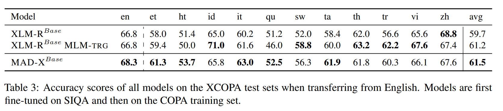

논문 및 이미지 출처 : <https://arxiv.org/pdf/2005.00052>

# Abstract

SOTA pretrained multilingual models 인 multilingual BERT 와 XLM-R 의 주요 목표는 zero-shot 혹은 few-shot cross-lingual transfer 를 통해 low-resource language 에서 NLP applications 을 가능하게 하고 이를 확장하는 것이다. 그러나 제한된 model capacity 때문에, 이들의 transfer 성능은 바로 이러한 low-resource language 나 pretraining 중에 관찰되지 않은 언어에서 가장 약하다. 

저자는 **MAD-X** 를 제안하는데, 

* 이는 modular 한 language 및 task representation 을 학습함으로써 임의의 task 와 language 에 대해 high portability 와 parameter-efficient transfer 를 가능하게 하는 *adapter-based framework* 이다. 
* 추가로, 저자는 새로운 invertible adapter architecture 와 pretrained multilingual model 을 새로운 language 로 적응시키기 위한 강력한 baseline 방법을 도입한다. 
* MAD-X 는 named entity recognition 과 causal commonsense reasoning 에서 대표적인 유형론적으로 다양한 언어 집합에 대한 cross-lingual transfer 에서 SOTA 를 능가하며, question answering 에서도 경쟁력 있는 결과를 달성한다.

# 1 Introduction

현재 deep pretrained multilingual models 인 multilingual BERT 와 XLM-R 은 cross-lingual transfer 에서 SOTA 성능을 달성하지만, 모든 언어를 표현할 수 있을 만큼의 충분한 capacity 를 가지지 못한다. 

* 이를 보여주는 증거로는 vocabulary size 의 중요성과 multilinguality curse 가 있으며, 이는 language coverage 와 model capacity 간의 trade-off 를 의미한다. 
* 전 세계의 7,000 개 이상의 언어를 모두 포괄하는 model 로의 scaling 은 불가능하다. 동시에 제한된 capacity 문제는 high-resource language 에서도 나타나는데, SOTA multilingual models 은 monolingual variants 보다 성능이 낮으며, pretrained models 에 포함된 low-resource language 에서는 성능이 더 떨어진다. 
* 특히 training data 에 전혀 포함되지 않은 언어의 경우, model capacity 문제는 가장 심각하며 pretrained models 은 이들 언어에서 매우 낮은 성능을 보인다.

본 논문에서 저자는 **Multiple ADapters for Cross-lingual transfer (MAD-X)** 를 제안한다. 

* 이는 pretrained multilingual models 의 근본적인 capacity 문제를 해결하기 위해 few extra parameters 를 활용하는 modular framework 이다.
* SOTA multilingual model 을 기반으로 하여, modular 한 language- 및 task-specific representation 을 adapters 를 통해 학습함으로써 임의의 task 와 language 로의 적응을 가능하게 한다. 
* *adapters* 는 model 의 weight 사이에 삽입되는 작은 bottleneck layer 이다.

특히 최근의 efficient adapter variant 를 사용하여, 저자는 다음과 같이 학습한다:

* unlabelled target language data 에 대한 masked language modelling (MLM) 을 통해 *language-specific adapter modules* 학습
* 임의의 source language 에서 labelled data 를 사용하여 target task 를 최적화함으로써 *task-specific adapter modules* 학습

Task adapter 와 language adapter 는 Fig. 1 과 같이 stack 되며, target language adapter 를 inference 시점에 대체함으로써 pretrained multilingual model 이 training data 에 포함되지 않은 언어에도 적응할 수 있게 한다.

또한 shared multilingual vocabulary 와 target language vocabulary 간의 불일치를 해결하기 위해 저자는 **invertible adapters** 를 제안한다. 

* 이는 다른 언어에서 MLM 을 수행하기에 적합한 새로운 adapter 유형이다. 
* 저자의 framework 는 cross-lingual transfer 를 위해 adapters 를 활용한 기존 연구를 넘어, pretraining 중에 관찰되지 않은 언어에도 적응할 수 있으며, 비용이 큰 language-specific token-level embedding 학습을 필요로 하지 않는다.

저자는 MAD-X 를 standard WikiANN NER dataset 과 causal commonsense reasoning 을 위한 XCOPA dataset 에서 SOTA cross-lingual transfer 방법들과 비교한다. 

* 이때 high-resource, low-resource, pretrained model 에 포함되지 않은 언어를 아우르는 대표적인 유형론적으로 다양한 언어 집합을 사용한다. 
* MAD-X 는 pretrained model 이 본 적 있는 언어와 보지 못한 언어 모두에서, high-resource 와 low-resource language 에 대해 baseline 보다 우수한 성능을 보인다. 
* 또한 challenging XQuAD QA dataset 의 high-resource language 에서도 저자의 framework 는 competitive 한 성능을 달성하면서 parameter-efficient 하다.

또 다른 기여는 pretrained multilingual model 을 새로운 language 로 적응시키는 단순한 방법을 제안한 것이다. 이는 labelled source language data 로부터의 transfer 만을 사용하는 standard setting 보다 우수한 성능을 보인다.

요약하면 저자의 기여는 다음과 같다.

1. multilinguality curse 를 완화하고 multilingual model 을 임의의 task 와 language 로 적응시키는 modular framework 인 MAD-X 제안. code 와 adapter weights 는 AdapterHub.ml repository 에 통합됨.
2. cross-lingual MLM 을 위한 새로운 adapter variant 인 invertible adapters 제안.
3. MAD-X 의 다양한 언어와 task 에 걸친 강력한 성능과 robustness 입증.
4. pretrained multilingual model 을 target language 로 적응시키기 위한 단순하면서도 더 효과적인 baseline 방법 제안.
5. multilingual pretraining 중에 보지 못한 언어에서의 현재 방법들의 동작 방식에 대한 분석 제공.

# 2 Related Work

#### Cross-lingual Representations

현대 cross-lingual NLP 연구는 점점 더 많은 task 에 적용 가능한 general-purpose cross-lingual representation 학습에 집중하고 있다. 초기에는 word level 에서 시작되었고, 이후 full-sentence level 로 확장되었다. 최근 multilingual BERT 와 같은 모델은 large-scale multilingual data 로 pretrained 된 large Transformer model 로, 다른 언어로 transfer 할 때 놀라울 정도로 좋은 성능을 보이는 것으로 관찰되었다. 

SOTA model 인 XLM-R 은 GLUE benchmark 에서 monolingual models 과 경쟁할 만한 성능을 보인다. 그러나 최근 연구에 따르면 XLM-R 과 같은 SOTA 모델도 여전히 많은 언어 쌍에서 cross-lingual transfer 성능이 낮다. 이러한 낮은 성능의 주요 원인은 vocabulary 와 representation space 에서 모든 언어를 동등하게 표현하기에 model capacity 가 부족하기 때문이다.

#### Adapters

Adapter modules 은 original computer vision task 에서 convolution 에 제한되어 연구되었으며, multiple domains 에 대한 model 적응에 사용되었다. 

* NLP 에서는 adapters 가 주로 base pretrained Transformer model 을 새로운 task 와 domain 에 parameter-efficient 하고 빠르게 fine-tuning 하기 위해 사용되었으며, catastrophic forgetting 을 피하는 데에도 유용했다. 
* Bapna 와 Firat 은 adapters 를 사용하여 multilingual NMT model 을 high-resource language 에 대해 fine-tuning 하고 성능을 회복했지만, 그들의 접근법은 pretraining 에서 보지 못한 언어에는 적용할 수 없다. 
* Artetxe et al. 은 adapters 를 사용해 pretrained monolingual model 을 unseen language 로 transfer 하지만, 새로운 token-level embedding 학습에 의존하는데, 이는 많은 언어에 대해 확장 가능하지 않다. 
* Pfeiffer et al. 은 여러 adapters 에 저장된 정보를 결합하여 monolingual task 간 보다 robust 한 transfer learning 을 가능하게 했다. 
* 또 다른 연구에서 Ustun et al. 은 multilingual dependency parsing 을 위해 language embeddings 로부터 adapter parameters 를 생성하였다.

# 3 Multilingual Model Adaptation for Cross-lingual Transfer

#### Standard Transfer Setup

SOTA large multilingual model (e.g., multilingual BERT, XLM-R) 로 cross-lingual transfer 를 수행하는 표준 방법은 다음과 같다.

1. source language 의 downstream task labelled data 로 fine-tuning
2. target language 에서 inference 를 직접 수행

그러나 이 setting 의 단점은 multilingual initialization 이 여러 언어 간의 균형을 맞추도록 설계되어 있다는 점이다. 따라서 inference 시 특정 언어에서 뛰어난 성능을 내는 데 적합하지 않다. 저자는 model 이 특정 target language 에 추가로 적응할 수 있도록 하여 이 문제를 완화하는 단순한 방법을 제안한다.

#### Target Language Adaptation

monolingual model 을 task domain 에 fine-tuning 하는 방식과 유사하게, 저자는 pretrained multilingual model 을 source language 에서 task-specific fine-tuning 을 수행하기 전에 target language 의 unlabelled data 에 대해 MLM 기반 fine-tuning 을 수행하는 방법을 제안한다. 이 접근법의 단점은 model 이 특정 target language 에 편향되므로 동일한 model 을 여러 target language 에 대해 평가할 수 없다는 점이다. 그러나 오직 하나의 특정 (i.e., fixed) target language 에서의 성능만 중요하다면 이 방법이 더 바람직할 수 있다.

저자는 target language adaptation 이 standard setting (§6) 대비 cross-lingual transfer 성능을 향상시킨다는 것을 발견했다. 즉, pretrained model 이 이미 보유한 multilingual knowledge 를 망각(catastrophic forgetting) 하지 않고, 여전히 다른 언어로 transfer 할 수 있는 능력을 유지한다. 실제로 catastrophic forgetting 을 방지하기 위한 기법들을 실험했을 때, 오히려 성능이 더 나빠지는 결과를 보였다.

그럼에도 불구하고, 제안된 단순한 adaptation 방법은 pretrained multilingual model 과 standard transfer setup 의 근본적 한계를 여전히 가진다. 즉, model capacity 의 제약으로 인해 low-resource language 나 unseen language 로의 효과적인 적응이 어렵다. 또한 full model fine-tuning 은 많은 task 나 language 로 확장하기에 적합하지 않다.

# 4 Adapters for Cross-lingual Transfer

저자의 MAD-X framework 은 기존 pretrained multilingual model 을 다른 언어로 효과적으로 적응시키는 방법을 제공하며, 기존 방법의 한계를 해결한다. 이 framework 은 language adapter, task adapter, invertible adapter 의 세 가지 adapter 로 구성된다. 

이전 연구와 마찬가지로 adapters 는 pretrained multilingual model 의 parameters 를 고정한 상태에서 학습된다. 따라서 저자의 framework 은 modular 하고 parameter-efficient 한 방식으로 language 및 task-specific transformation 을 학습할 수 있게 한다. Fig. 1 에는 standard Transformer model 내에서 전체 framework 가 어떻게 구성되는지와 adapter 유형이 제시된다.

## 4.1 Language Adapters

language-specific transformation 을 학습하기 위해 저자는 Pfeiffer et al. 이 제안한 efficient adapter architecture 를 사용한다. Houlsby et al. 의 정의를 따르며, adapter 의 내부는 residual connection 과 결합된 단순한 down- 및 up-projection 으로 구성된다.

layer $l$ 의 language adapter $LA_l$ 는 다음과 같이 정의된다.

* down-projection $D \in \mathbb{R}^{h \times d}$, 
  * 여기서 $h$ 는 Transformer model 의 hidden size, $d$ 는 adapter dimension
* ReLU activation
* up-projection $U \in \mathbb{R}^{d \times h}$

$$
LA_l(h_l, r_l) = U_l(\text{ReLU}(D_l(h_l))) + r_l \tag{1}
$$

* 여기서 $h_l$ 은 layer $l$ 의 Transformer hidden state, 
* $r_l$ 은 residual 이다. 
* residual connection $r_l$ 은 Transformer feed-forward layer 의 output 이고, 
* $h_l$ 은 그 다음 layer normalisation 의 output 이다 (Fig. 1 참조).

저자는 unlabelled language data 로 MLM 을 수행하여 language adapters 를 학습한다. 

* 이는 pretrained multilingual model 이 특정 언어에 더 적합하도록 transformation 을 학습하게 한다. 
* task-specific training (e.g., labelled data 사용) 시에는 source language adapter 를 사용하며, 이는 고정된다. 그리고 다른 언어로 zero-shot transfer 를 수행할 때는 source language adapter 를 target language adapter 로 단순히 교체한다. 
* 예를 들어, inference 시점에 English adapter 를 Quechua adapter 로 교체할 수 있다. 
  * 그러나 이 경우 downstream task fine-tuning 중에 multilingual model 자체가 변하지 않아야 한다. 
  * 이를 보장하기 위해 저자는 task-specific knowledge 를 포착하는 task adapters 를 추가로 도입한다.

## 4.2 Task Adapters

layer $l$ 의 task adapter $TA_l$ 은 language adapter 와 동일한 architecture 를 가진다. 즉, down-projection $D \in \mathbb{R}^{h \times d}$, ReLU activation, up-projection 으로 구성된다. 이들은 language adapters 위에 쌓이며, language adapter $LA_l$ 의 output 과 Transformer feed-forward layer 의 residual $r_l$ 을 입력으로 받는다:

$$
TA_l(h_l, r_l) = U_l(\text{ReLU}(D_l(LA_l))) + r_l \tag{2}
$$

task adapter 의 output 은 이후 layer normalisation 으로 전달된다. task adapters 는 downstream task (e.g., NER) 학습 시에만 업데이트되는 유일한 parameter 들이며, 언어 간 일반화가 가능한 task-specific knowledge 를 학습하는 것을 목표로 한다.

## 4.3 Invertible Adapters

pretrained multilingual models 의 “parameter budget” 대부분은 shared multilingual vocabulary 의 token embedding 에 사용된다. 그럼에도 불구하고 이러한 모델은 low-resource language 에서 성능이 떨어지며, training data 에 포함되지 않은 언어에서는 성능이 더욱 낮아질 수밖에 없다.

이 multilingual vocabulary 와 target language vocabulary 간의 불일치를 완화하기 위해 저자는 **invertible adapters** 를 제안한다. 

* 이들은 embedding layer 위에 쌓이고, 각각의 inverse 는 output embedding layer 앞에 위치한다 (Fig. 1 참조). 
* multilingual pretrained models 에서 input embedding 과 output embedding 은 tied 되어 있기 때문에, invertibility 를 통해 input 과 output representation 모두에 동일한 parameter 집합을 활용할 수 있다. 
* 이는 task-specific fine-tuning 중 discard 될 수 있는 output embedding 이 pretraining task 에 overfit 되는 것을 막는 데 중요하다.

이를 위해 저자는 **Nonlinear Independent Component Estimation (NICE)** 을 사용한다. NICE 는 coupling operation 집합을 통해 arbitrary non-linear functions 의 invertibility 를 보장한다.

* $i$-th token 의 input embedding vector $e_i$ 를 동일한 차원의 two vectors $e_{1,i}, e_{2,i} \in \mathbb{R}^{h/2}$ 로 분할한다. 
* two arbitrary non-linear function $F$, $G$ 에 대해 invertible adapter $A_{inv}()$ 의 forward pass 는 다음과 같다:

$$
\begin{aligned}
    &o_1 = F(e_2) + e_1; \quad o_2 = G(o_1) + e_2 \\
    &o = [o_1, o_2]
\end{aligned} \tag{3}
$$

* 여기서 $o$ 는 invertible adapter $A_{inv}$ 의 output 이며, 
* $[ \cdot, \cdot ]$ 는 two vector concatenations 을 의미한다.

inverted pass, 즉 $A^{-1}_{inv}$ 는 다음과 같이 계산된다:

$$
\begin{aligned}
    &e_2 = o_2 - G(o_1); \quad e_1 = o_1 - F(e_2) \\
    &e = [e_1, e_2]
\end{aligned}\tag{4}
$$

* 여기서 $e$ 는 $A^{-1}_{inv}()$ 의 output 이다. 
* non-linear transformation $F$, $G$ 는 language adapter 와 task adapters 에 사용된 것과 유사한 down- 및 up-projection 으로 정의된다:

$$
\begin{aligned}
    F(x) = U_F(\text{ReLU}(D_F(x))) \\
    G(x) = U_G(\text{ReLU}(D_G(x)))
\end{aligned}\tag{5}
$$

* 여기서 $D_F, D_G \in \mathbb{R}^{\frac{h}{4} \times \frac{h}{2}}$, $U_F, U_G \in \mathbb{R}^{\frac{h}{2} \times \frac{h}{4}}$, 
* $x$ 는 $e_1, e_2, o_1, o_2$ 를 대체하는 placeholder 이다. 

Fig. 2 에는 invertible adapter 와 그 inverse 의 전체 구조가 제시된다.

* invertible adapter 는 language adapter 와 유사한 역할을 하지만, token-level language-specific transformation 을 포착하는 데 초점을 맞춘다. 
* 따라서 특정 언어의 unlabelled data 로 MLM 학습 시 language adapter 와 함께 학습된다. 
* task-specific training 시에는 source language 의 fixed invertible adapter 를 사용하고, zero-shot transfer 시에는 이를 target language 의 invertible adapter 로 교체한다.

중요하게도, 저자의 invertible adapters 는 새로운 언어마다 별도의 token embedding 을 학습하는 Artetxe et al. 의 접근법보다 훨씬 parameter-efficient 하다.

#### An Illustrative Example

Fig. 1 의 예시를 통해 과정을 설명한다. 

* source language 가 English (En), target language 가 Quechua (Qu) 라고 가정한다. 
* 먼저 invertible adapters $A^{En}_{Inv}$ 와 $A^{Qu}_{Inv}$, 그리고 language adapters $A^{En}_{Lang}$ 과 $A^{Qu}_{Lang}$ 을 MLM 으로 학습한다. 
* 이때 마지막 layer 의 output 은 $A^{En^{-1}}_{Inv}$ 를 통과한다. 이후 English NER training set 을 사용하여 NER task adapter $A^{NER}_{Task}$ 를 학습한다.

training 동안 embedding 은 $A^{En}_{Inv}$ 를 거치고, 각 layer 마다 data 는 먼저 fixed $A^{En}_{Lang}$ 을 거친 뒤 NER adapter $A^{NER}_{Task}$ 로 전달된다.

zero-shot inference 시에는 English invertible, language adapters 인 $A^{En}_{Inv}, A^{En}_{Lang}$ 을 Quechua counterparts 인 $A^{Qu}_{Inv}, A^{Qu}_{Lang}$ 으로 교체하며, data 는 여전히 동일한 NER task adapter $A^{NER}_{Task}$ 를 통과한다.

# 5 Experiments

#### Data

저자는 세 가지 task 에 대해 실험을 수행한다: Named Entity Recognition (NER), Question Answering (QA), Causal Commonsense Reasoning (CCR).

* **NER**: WikiANN dataset 을 사용하며, Rahimi et al. 이 train, development, test 로 분할한 버전을 사용한다.
* **QA**: SQuAD 의 cross-lingual 버전인 XQuAD dataset 을 사용한다.
* **CCR**: COPA 의 cross-lingual 버전인 XCOPA dataset 을 사용한다.

#### Languages

분할된 WikiANN 은 176 개 언어를 포함한다. SOTA cross-lingual 방법들과 다양한 평가 조건에서 포괄적인 비교를 하기 위해 저자는 다음 기준에 따라 언어를 선택한다.  
a) 데이터 가용성의 차이 (Wikipedia 크기 범위에 따라 언어 선택)  
b) pretrained multilingual models 에서의 포함 여부 (특정 언어가 multilingual BERT 와 XLM-R 의 pretraining data 에 포함되었는지 여부)  
c) 유형론적 다양성 (다양한 언어 유형 및 어족을 포괄하도록 보장)

이에 따라 저자의 언어 집합은 네 가지 범주로 나뉜다.

1. pretrained SOTA multilingual models (mBERT, XLM-R) 에 포함된 high-resource language 
2. pretrained SOTA multilingual models 에 포함된 low-resource language 
3. pretrained multilingual models 에 포함되지 않은 low-resource language 
4. pretrained multilingual models 에 포함되지 않은 진정한 low-resource language 

각 범주에서 서로 다른 어족의 언어 4 개씩을 선택하여, 총 11 개 어족에 걸친 16 개 언어를 사용한다 (Tab. 1).

* 모든 가능한 언어 쌍에 대해 평가를 수행한다 (Cartesian product), 즉 각 언어를 source language 로 사용하고, 나머지 모든 언어 (자기 자신 포함) 를 target language 로 사용한다. 
* 이는 standard zero-shot cross-lingual transfer setting 과 monolingual in-language setting 을 모두 포함한다.
* **CCR, QA**: XCOPA (12 개 언어) 와 XQuAD (11 개 언어) 로 평가하며, source language 는 English 로 고정한다. 
* **XCOPA** 는 typologically diverse 한 언어 집합을 포함하며, Haitian Creole, Quechua 같은 pretrained model 이 보지 못한 언어도 포함한다. 
* **XQuAD** 는 주로 high-resource language 를 포함하며, 유형 다양성은 다소 낮다.

## 5.1 Baselines

저자는 §3 에서 논의한 multilingual model adaptation 방법들을 기반으로 baseline models 을 설정한다.

* **XLM-R**: 비교 대상의 기본 모델은 cross-lingual transfer 에서 SOTA 인 XLM-R 이다. 
  * 이는 large cleaned Common Crawl corpora 로 100 개 언어를 pretraining 한 Transformer-based model 이다. 
  * 실험의 효율성을 위해 XLM-R Base configuration 을 사용한다. 그러나 MAD-X framework 의 핵심 아이디어는 특정 pretrained model 에 국한되지 않으며, 다른 pretrained multilingual models (e.g., multilingual BERT) 로도 쉽게 적용될 수 있다.  
  * 먼저 standard setting 에서 XLM-R 과 비교한다. 즉, source language 의 labelled data 로 전체 model 을 fine-tuning 한다.
* **XLM-RBase MLM-SRC; XLM-RBase MLM-TRG**: §3 에서 저자는 target language adaptation 을 pretrained multilingual model 을 downstream task 에 더 잘 일반화하도록 적응시키는 단순한 방법으로 제안했다. 
  * sanity check 로서 source language data 에 대한 adaptation 도 수행한다. 이는 in-language 성능은 개선할 수 있지만 transfer 에는 도움이 되지 않을 것으로 예상된다. 
  * 구체적으로, XLM-R 을 unlabelled source language data (XLM-RBase MLM-SRC) 와 target language data (XLM-RBase MLM-TRG) 에 대해 MLM fine-tuning 한 뒤, task-specific fine-tuning 을 수행한다.

## 5.2 MAD-X: Experimental Setup

* 기본적으로 XLM-R Base architecture 를 기반으로 한다.
* 세 가지 변형을 평가한다:
  * Full MAD-X
  * MAD-X without invertible adapters (–INV)
  * MAD-X without language and invertible adapters (–LAD –INV)

모든 실험은 Transformers library 를 사용하여 수행한다.

* **MLM fine-tuning**: unlabelled Wikipedia data 로 250,000 step 학습, batch size 64, learning rate 5e−5 (XLM-R, -SRC, -TRG variants), 1e−4 (adapters).
* **NER fine-tuning**: source language 의 WikiANN training set 에 대해 100 epochs 학습. batch size 16 (high-resource), 8 (low-resource). learning rate 5e−5 (XLM-R), 1e−4 (adapters). validation 성능 기준 best checkpoint 선택.
* **Adapter dimensionality** (Pfeiffer et al. 기준):
  * Language adapters: 384
  * Invertible adapters: 192 (양방향 모두 384)
  * Task adapters: 48
  * XLM-R Base hidden size = 768 → 각각 2, 2, 16 배 축소
* **Evaluation protocol**:
  * NER: 각 source language 에 대해 WikiANN training set 으로 fine-tuning, 5 회 반복 (단, XLM-RBase MLM-TRG 는 효율성 때문에 1 회).
  * QA: English SQuAD training set 으로 fine-tuning 3 회, 모든 XQuAD target languages 로 평가. Mean F1, EM 점수 보고.
  * CCR: English training set 으로 fine-tuning 3 회, 모든 XCOPA target languages 로 평가. Accuracy 보고.

# 6 Results and Discussion

#### Named Entity Recognition

저자는 각 source language 에 대해 16 개 target languages 로의 cross-lingual transfer 결과를 평균하여 NER dataset 에 대한 결과를 요약하고 Tab. 2 에 제시한다.

* 일반적으로, XLM-R 은 pretrained data 에 포함되지 않은 unseen languages (표의 오른쪽 절반) 에서 가장 낮은 성능을 보인다. 
* XLM-RBase MLM-SRC 는 XLM-R 보다 성능이 낮으며, 이는 source-language fine-tuning 이 cross-lingual transfer 에 일반적으로 유용하지 않음을 보여준다. 
* 반면 XLM-RBase MLM-TRG 는 평균적으로 XLM-R 보다 강력한 transfer 방법이며, 16 개 target language 중 9 개에서 성능 향상을 보인다. 그러나 이러한 이점은 low-resource language 에서는 사라진다. 
* 또한, §3 에서 지적한 또 다른 단점이 있는데, XLM-RBase MLM-TRG 는 고려하는 각 target language 마다 full large pretrained model 을 별도로 fine-tuning 해야 하므로 비용이 매우 크다.

---

* MAD-X (–LAD –INV, 즉 language adapter 와 invertible adapter 제거) 는 pretraining data 에 포함된 언어들에 대해서는 거의 XLM-R 과 동일한 성능을 보인다 (표의 왼쪽 절반). 
* 이는 monolingual setting 에서 task adapters 만으로도 일반 fine-tuning 과 유사한 성능을 보이면서 더 parameter-efficient 하다는 기존 연구와 유사하다. 
* 그러나 unseen language 에서는 task adapters 만 사용하는 MAD-X 의 성능이 XLM-R 보다 크게 저하된다. 즉, task adapters 만으로는 unseen language 적응 시 발생하는 불일치를 해결하기에 충분하지 않음을 보여준다.

---

* 여기에 language adapters 를 추가하면 전반적으로 성능이 개선되며, 특히 low-resource language 에서 효과가 뚜렷하다. 
* language adapters 는 target language 의 특성을 포착하여 unseen language 에서 성능을 향상시킨다. 
* high-resource language 에서도 language-specific parameters 추가는 상당한 개선을 가져온다. 
* 마지막으로 invertible adapters 는 추가적인 향상을 제공하며, task + language adapters 만 사용하는 경우보다 전반적으로 우수하다. 
  * 예를 들어, MAD-X 는 MAD-X –INV 대비 16 개 target language 중 13 개에서 더 나은 성능을 보였다. 
  * 전체적으로 full MAD-X framework 는 평균적으로 XLM-R 대비 5 F1 점수 이상 향상된다.

저자는 MAD-X framework 이 특정 모델에 국한되지 않음을 보이기 위해 XLM-RLarge 와 mBERT 를 기반으로도 실험을 수행했고, Tab. 2 에 제시된 결과에서 MAD-X 는 stronger base pretrained models 에서도 일관된 개선을 보였다.

언어별 세부 성능 비교는 Fig. 3 에 제시된다. 

* high-resource → low-resource 혹은 unseen languages 로 transfer 할 때 (Fig. 3 의 오른쪽 상단 사분면) 성능 차이가 가장 크게 나타났는데, 이는 cross-lingual transfer 의 가장 자연스러운 상황이라 할 수 있다. 
* 특히 Arabic 에서 다른 언어로 transfer 할 때 큰 이득을 보였는데, 이는 XLM-R vocabulary 에 Arabic script representation 이 충분히 포함되지 않았기 때문일 수 있다. 
* 또한 일부 low-resource language 의 monolingual setting (대각선 위치) 에서도 강한 성능을 보였으며, 이는 MAD-X 가 multilingual models 의 monolingual 대비 약점을 보완할 수 있음을 시사한다. 
* 마지막으로 target language 가 high-resource 일 때도 MAD-X 는 경쟁력 있는 성능을 보였다.

#### Causal Commonsense Reasoning

XCOPA dataset 에서 English → target language transfer 결과는 Tab. 3 에 제시된다. 

* 간결성을 위해, Ponti et al. 의 best fine-tuning setting (SIQA → English COPA training set) 의 결과만 제시하며, 다른 설정 결과는 부록에 보고된다.
* 결과적으로, target language adaptation 은 XLM-RBase 보다 우수하며, MAD-XBase 가 가장 높은 성능을 달성했다. 
* 특히 unseen languages 인 Haitian Creole (ht) 과 Quechua (qu) 에서 큰 성능 향상을 보였다. 그 외 언어들에서도 전반적으로 competitive 하거나 더 우수한 성능을 기록했다.

#### Question Answering

XQuAD dataset 에서 English → target language transfer 결과는 Tab. 4 에 제시된다. 

* 주요 결과는 MAD-X 가 baseline XLM-R 과 유사한 성능을 달성했다는 점이다. 
* 이전과 마찬가지로 invertible adapters 는 전반적으로 성능을 개선하며, target language adaptation 또한 baseline 보다 향상된 결과를 보였다.
* XQuAD 에 포함된 언어들은 모두 high-resource language 로, 각 언어의 Wikipedia 문서 수가 100k 이상이다 (NER 언어들의 Wikipedia 크기와 비교하면 Tab. 1 참고). 이는 Fig. 3 의 좌상단 사분면에 해당하며, 상대적 차이가 비교적 작음을 보여준다.
* 이와 XCOPA 결과는 MAD-X 가 unseen 및 low-resource language 로의 transfer 에서 뛰어나면서도, high-resource language 나 더 어려운 task 에서도 competitive 한 성능을 보임을 입증한다. 
* 또한, 동일한 language-specific adapters (e.g., English, Mandarin Chinese) 를 NER, CCR, QA 세 가지 task 에 모두 사용했음에도 일관된 성능을 보였다는 점에서, adapter 기반 MAD-X 접근법의 **modularity** 와 빠른 task 적응 가능성을 시사한다.

# 7 Further Analysis

#### Impact of Invertible Adapters

저자는 NER dataset 에서 각 source–target language pair 에 대해 MAD-X 의 invertible adapters 유무에 따른 상대적 성능 차이를 분석하였다 (부록 Sec. D 참조). 그 결과, invertible adapters 는 많은 transfer pair 에서 성능을 향상시켰으며, 특히 low-resource language 로 transfer 할 때 효과가 뚜렷했다. 성능이 일관되게 낮아진 경우는 단 하나의 low-resource language (Maori) 를 source 로 사용했을 때였으며, 이는 데이터 변동성에 기인한 것으로 보인다.

#### Sample Efficiency

MAD-X 의 주요 adaptation 병목은 language adapters 와 invertible adapters 의 학습 과정이다. 그러나 MAD-X 의 modularity 덕분에, 한 번 학습된 adapters 는 다른 task 에서 그대로 재사용(i.e., “plug-and-play”) 가능하다는 장점이 있다 (§6 참조).

adapter 학습의 sample efficiency 를 추정하기 위해, 저자는 English 을 source 로 할 때 여러 low-resource target languages 에 대해 training iteration 수에 따른 NER 성능을 측정했다. 

* Fig. 4 의 결과에 따르면, 약 20k training iterations 만으로도 low-resource language 에서 강력한 성능을 달성할 수 있었으며, 더 긴 학습은 성능을 소폭만 증가시켰다.
* 또한 Tab. 5 에서는 각 MAD-X variant 별로 XLM-R Base model 에 언어당 추가되는 parameter 수를 제시한다. 

* NER 을 위한 full MAD-X model 은 언어당 약 8.25M 개의 adapter parameters 를 추가하며, 이는 원래 model 의 3.05% 에 불과하다.

# 8 Conclusion

저자는 task 와 language 간 transfer 를 위한 일반적 modular framework 인 **MAD-X** 를 제안하였다. 이는 소수의 추가 parameters 만으로, 현재 multilingual models 의 근본적인 한계인 capacity 문제를 완화한다. MAD-X 는 model-agnostic 하며, 현재 존재하는 어떤 pretrained multilingual model 에도 적용될 수 있다.

특히, MAD-X 는 multilingual model 의 pretraining data 에 포함되지 않은 언어에 적응할 때 매우 유용하며, high-resource language 에서도 competitive 한 성능을 보였다.

향후 연구에서는 MAD-X 를 다른 pretrained models 에 적용하고, 특정 속성 (e.g., script 차이) 을 가진 언어에 적합한 adapters 를 활용할 계획이다. 또한 추가적인 task 에 대한 평가를 수행하고, 관련 언어의 pretrained language adapters 를 활용하여 monolingual data 가 제한된 truly low-resource language 로의 transfer 를 개선하는 방안을 탐구할 것이다.
