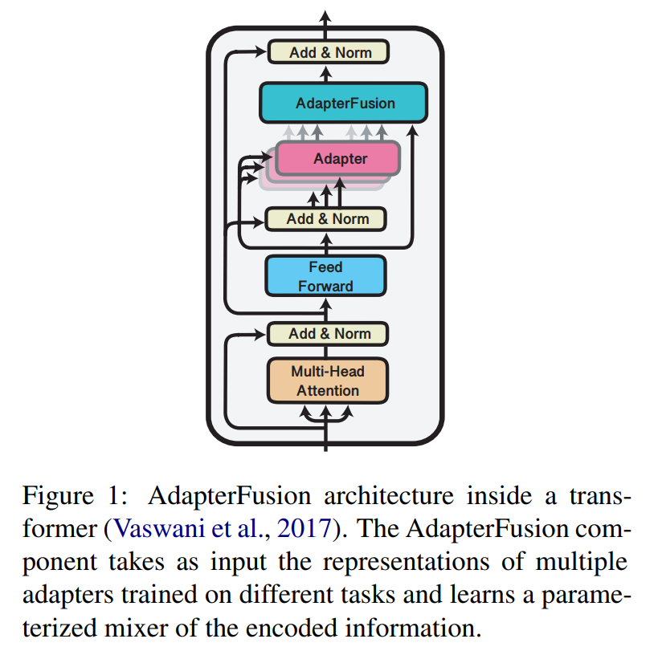
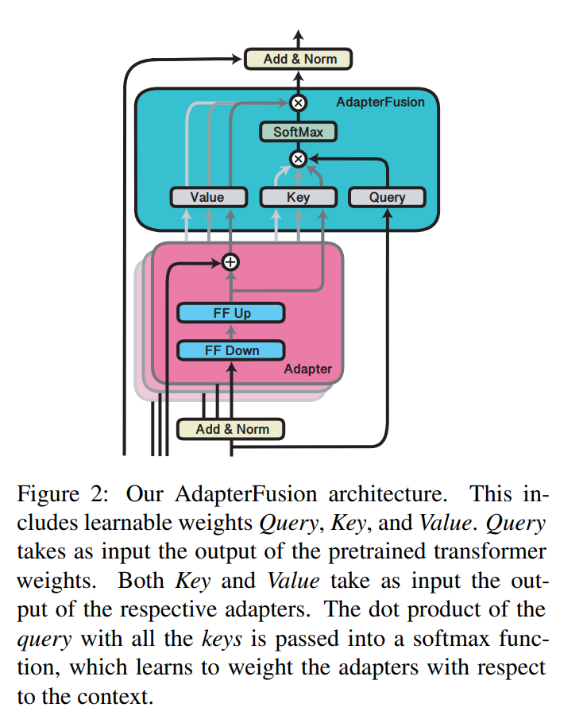
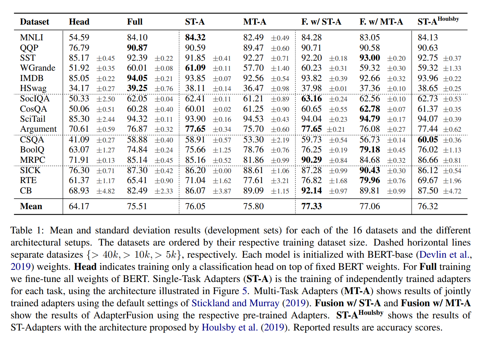
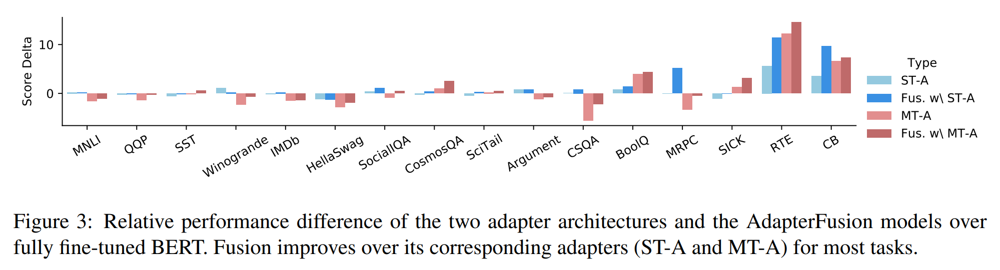
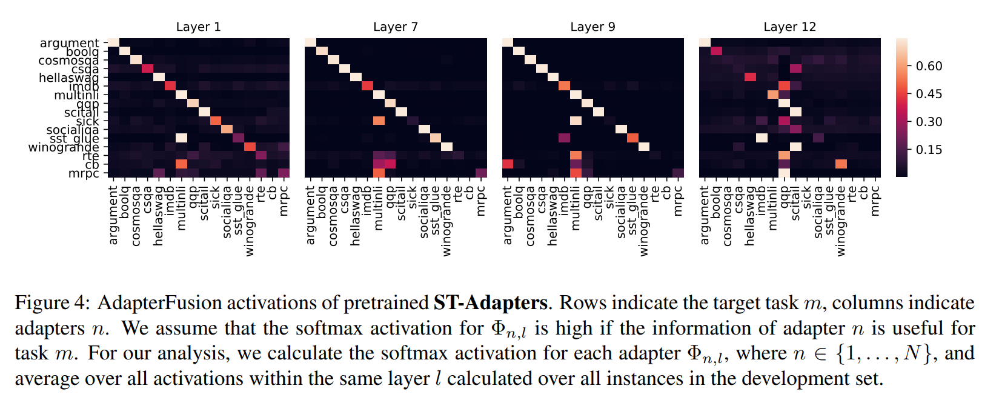

논문 및 이미지 출처 : <https://arxiv.org/pdf/2005.00247>

# Abstract

Sequential fine-tuning 과 multi-task learning 은 multiple task knowledge 를 통합하기 위한 방법이지만, catastrophic forgetting 과 dataset balancing 의 어려움을 겪는다. 

이러한 단점을 해결하기 위해 저자는 multiple task knowledge 을 활용하는 new two stage learning algorithm 인 **AdapterFusion**을 제안한다. 

1. **knowledge extraction** stage 에서는 task-specific information 을 캡슐화하는 **adapter** parameters 를 학습한다. 
2. 이후 **knowledge composition** step 에서 이러한 adapters 를 결합한다. 

two stages (i.e. knowledge extraction 과 knowledge composition) 를 분리함으로써 classifier 는 multiple task 에서 학습된 representations 를 비파괴적(non-destructive) 방식으로 효과적으로 활용할 수 있다. 

저자는 AdapterFusion 을 16 NLU task 에 대해 실험적으로 평가했으며, 이 접근법이 모델의 다른 계층에서 다양한 유형의 knowledge 를 효과적으로 결합함을 확인했다. 

저자의 방법은 full fine-tuning 및 multi-task learning 같은 전통적 전략을 능가한다는 것을 보인다.

# 1 Introduction

NLU task 해결을 위한 가장 일반적인 방법은 transformer architecture 를 기반으로 language modeling objective 로 pre-trained model 을 활용하는 것이다. **single task** 에 대해 pre-trained model 의 all parameters 를 fine-tuning 하는 것은 종종 SOTA 결과를 달성하지만, 각 task 마다 전용 모델이 필요하다는 문제가 있다.  

multiple task 간 정보 공유를 위한 두 가지 접근법이 있다:

1. **Sequential fine-tuning**: pre-trained language model 에서 시작해 task 를 sequentially fine-tuning 한다. 그러나 catastrophic forgetting 으로 인해 이전 task knowledge 가 손실되며, task 순서 결정이 비결정적이다.  
2. **Multi-task learning**: multiple target task 의 objective 를 weighted sum 으로 동시에 fine-tuning 한다. 그러나 all task 에 대한 동시 접근이 필요하며, new task 추가 시 retraining 이 불가피하다. 또한 low-resource task 에서의 over-fitting 과 high-resource task 에서의 under-fitting 문제가 발생한다. 이는 tasks 전역의 효과적인 knowledge transfer 을 어렵게한다. 따라서 많은 시나리오의 multi-task learning 의 응용성을 제한한다.

최근 **adapters** 는 pre-trained model parameters 를 고정한 채 소량의 task-specific parameters 를 도입하는 대안으로 주목받았다. 따라서, 동일한 pre-trained parameters 를 공유하는 multiple tasks 에 대해 adapters 를 부분적으로, 동시적으로 훈련할 수 있다. 그러나 현재까지, sequential fine-tuning 및 multi-task learning 과 동일한 문제를 겪지 않으면서 task 간 knowledge transfer 을 극대화하기 위해 **multiple adapters** 를 사용하는 방법은 존재하지 않는다. 

예를 들어, multi-task 접근 방식을 통해 training adapters 방법이 제안되었으나, 이는 여전히 다양한 target tasks 간 균형을 맞추는 어려움과 all target tasks 에 동시에 접근해야 하는 문제를 수반한다.

본 논문에서는 이러한 한계를 해결하고 **AdapterFusion** 이라는 new adapters variant 를 제안한다. 또한, 저자는 catastrophic forgetting 및 다양한 tasks 균형 문제를 회피하면서 multiple tasks 간 knowledge 를 효과적으로 공유할 수 있는 novel two stage learning algorithm 을 제안한다.

Fig. 1 에 나타난 저자의 AdapterFusion architecture 는 two components 로 이루어져 있다. 

1. language model 하의 weights 를 변경하지 않고 task 에 대해 학습된 adapter
2. Fusion layer 는 여러 task adapters 의 representation 을 결합하여 target task 의 성능을 향상시킨다.

#### Contributions

1. mutiple source tasks 의 knowledge 를 결합하여 target task 에서 더 나은 성능을 발휘할 수 있도록 하는 **AdapterFusion** 이라는 novel two-stage transfer learning strategy 도입
2. sentiment analysis, commonsense reasoning, paraphrase detection 및 recognizing textual entailment 등 16 NLU tasks 에 대해 제안한 접근법을 실험적으로 평가한다.  
3. all tasks 에 대해 multi-task manner 로 adapters 를 학습하는 (Stickland and Murray) 의 방법과 저자의 접근법을 비교한 결과, pre-training 중 model 이 all tasks 에 동시에 접근함에도 불구하고 AdapterFusion 이 해당 방법을 개선할 수 있음을 확인한다.
4. 제안한 접근법이 single target task 에 대해 transformer model 을 fully fine-tuning 한 경우보다도 우수한 성능을 발휘함을 보여준다. 또한, 본 접근법은 single task 및 multi-task setup 모두로 trained adapter based model 보다도 뛰어난 성능을 보인다.

# 2 Background

본 섹션에서는 transfer learning 의 목표를 공식화하고 주요 문제점을 강조하며, 이를 해결하기 위한 일반적 방법을 개괄한다. 

이후 adapters 를 소개하고 adapter training 접근법을 설명한다.

#### Task Definition

저자는 training data $D_0$ 및 loss function $L_0$ 과 함께 pre-trained model 이 주어졌다 하자.

이 모델의 weights $\Theta_0$ 는 다음과 같이 학습된다.

$$
\begin{align*}
   D_0 &:= \text{Large corpus of unlabelled text} \\
   L_0 &:= \text{Masked language modeling loss} \\
   \Theta_0 &\leftarrow \argmin_\Theta L_0 (D_0; \Theta)
\end{align*}
$$

논문의 나머지 부분에서는 이 pre-trained model 을 tuple $(D_0, L_0)$ 로 지칭한다. 

저자는 다양한 크기의 labelled data 와 different loss functions 를 가진 $N$ classification tasks set $C$ 로 정의한다:  

$$
C = \{(D_1, L_1), \dots, (D_N, L_N)\}.
$$

목표는 $C_m = (D_m, L_m)$ 인 target task $m$ 에서 개선을 이루기 위하여, $N$ tasks set 을 활용할 수 있도록 하는 것이다. 

본 연구에서는 $m \in \{1, \dots, N\}$ 인 경우에 초점을 맞춘다.

#### Desiderata

저자는 다음을 따라 parameterization $\Theta_m$ 을 학습하길 원한다.

$$
\Theta_m \leftarrow \arg\min_{\Theta'} L_m(D_m; \Theta')
$$  

여기서 $\Theta'$ 은 all $N$ tasks 에서 관련 정보를 캡슐화한 것으로 기대된다. 

task $m$ 의 target model 은 $\Theta'$ 로 초기화되며, 해당 task 의 training data 에 대한 loss 를 minimizing 하여 optimal parameters $\Theta_m$ 을 학습한다.

## 2.1 Current Approaches to Transfer Learning

한 task 에서 other task 로 information 을 공유하기 위한 두 가지 주된 접근법이 있다.

## 2.1.1 Sequential Fine-Tuning

이는 각 task 마다 model 의 all weights 를 순차적으로 업데이트하는 방식을 말한다. 

$N$ tasks set 에 대해 fine-tuning 의 order 가 정해지며, 각 step 에서 model 은 previous step 에서 학습한 parameter 로 초기화된다. 

그러나 이 방식은 catastrophic forgetting 으로 인해 two sequential tasks 이상에선 성능이 좋지 않다.

### 2.1.2 Multi-Task Learning (MTL)

All tasks 를 동시에 학습하여, 각 task 에서 model 이 better generalize 할 수 있는 shared representation 을 학습하는 것을 목표로 한다.

$$
\Theta_{0 \to \{1,\ldots,N\}} \leftarrow \argmin_\Theta \left( \sum_{n=1}^{N} L_n(D_n; \Theta_0) \right)
$$  

여기서 $\Theta_{0 \to \{1,\ldots,N\}}$ 은 $\Theta_0$ 로 시작하여 tasks $\{1,\ldots,N\}$ set 에 대해 fine-tuning 함을 의미한다.

그러나 MTL 은 all tasks 에 동시에 접근해야 하므로 새로운 task 를 즉석에서 추가하기 어렵다. 또한, task 마다 size 와 loss functions 가 달라 training 중 이를 효과적으로 결합하는 것이 매우 어려워, (Stickland and Murray (2019)) 에서 제안한 휴리스틱 접근법이 필요하다.

## 2.2 Adapters

transfer learning 의 주된 방법은 pre-trained model 의 all weights 를 fine-tuning 하는 것이지만, 최근 **adapters** 가 대안적 접근법으로 도입되었다. 

Adapters 는 all tasks 에 걸쳐 large parameters set $\Theta$ 를 공유하고, 소수의 task-specific parameters $\Phi_n$ 을 추가한다. 

여기서 $\Theta$ 는 pre-trained model (e.g., transformer) 의 weights 를 나타내며, $n \in \{1,\ldots,N\}$ 인 task-specific parameter $\Phi_n$ 은 shared model 의 intermediate layers 의 task-specific representations 를 인코딩하는 데 사용된다. 

현재 adapters 에 관한 연구는 각 task 마다 개별적으로 adapters 를 학습하는 방식 (e.g., Houlsby et al., 2019; Bapna and Firat, 2019; Stickland and Murray, 2019) 또는 shared representations 를 활용하기 위해 multi-task setting 에서 adapter 를 학습하는 방식에 초점을 맞추고 있다. 

### 2.2.1 Single-Task Adapters (ST-A)

각 $N$ tasks 에 대해 model 은 parameter $\Theta_0$ 로 초기화된다. 추가로, randomly initialized adapter parameters $\Phi_n$ 이 도입된다.

$\Theta_0$ 는 고정되고, 오직 $\Phi_n$ 만 학습된다. 이를 통해 all $N$ tasks 에 대해 adapters 를 효율적으로 병렬 학습할 수 있으며, 해당 task 의 knowledge 를 model 의 지정된 부분에 저장할 수 있다. 

각 task $n \in \{1,\ldots,N\}$ 에 대한 objective 는 다음과 같다:

$$
\Phi_n \leftarrow \argmin_\Phi L_n(D_n; \Theta_0, \Phi)
$$  

common adapter architectures 에서 $\Phi$ 는 $\Theta$ 보다 상당한 fewer parameters 만 포함한다. 예로, Houlsby et al. (2019) 에서 제시한 pre-trained model parameters 의 3.6% 정도만을 포함한다.

### 2.2.2 Multi-Task Adapters (MT-A)

Stickland and Murray (2019) 는 $N$ tasks 에 대해 adapters 를 multi-task objective 하에 parallel training 방식을 제안한다. 

기본 parameters $\Theta_0$ 는 task-specific parameters $\Phi_n$ 과 함께 fine-tuning 된다.

training objective 는 다음과 같이 정의된다:

$$
\Theta \leftarrow \argmin_{\Theta, \Phi} \left( \sum_{n=1}^{N} L_n(D_n; \Theta_0, \Phi_n)\right)
$$

여기서 

$$
\Theta = \Theta_{0 \to \{1,\ldots,N\}}, \Phi_1,\ldots,\Phi_N.
$$

### 2.2.3 Adapters in Practice

pre-trained model 내 여러 layer 에 adapter parameters 를 추가하는 것은 full model fine-tuning 과 유사한 성능을 내거나 약간 낮은 성능을 보인다. 
 
NLP tasks 에서는 adapter 가 Transformer architecture 에 도입되며, 각 transformer layer $l$ 에 adapter parameters $\Phi_l$ set 이 추가된다. pre-trained model 내 adapter parameters $\Phi$ 의 배치와 구조는 단순하지 않다.

Houlsby et al. (2019) 는 다양한 구조를 실험하여, bottleneck 이 있는 two-layer feed-forward neural network 가 잘 작동함을 발견하였다. 

이들은 one layer 내에 two components 배치하는데, 하나는 multi-head attention (_bottom_), 다른 하나는 transformer 의 feed-forward layers (_top_) 이다. Bapna and Firat (2019) 및 Stickland and Murray (2019) 는 _top_ position 에 단 하나의 component 만 도입하지만, Bapna and Firat (2019) 는 additional _layernorm_ 을 포함한다.

single-task  (ST-A) 또는 multi-task (MT-A) 환경에서 학습된 adapters 는 각 task 의 training data 에서 idiosyncratic knowledge 를 학습하여, 지정된 parameters 에 캡슐화한다. 이로 인해 information 이 압축되어 task-specific knowledge 를 저장하는 데 필요한 공간이 줄어든다. 

그러나 adapters 의 distinct weights 때문에 downstream task 가 multiple sources 의 extracted information 을 동시에 활용하기 어렵다. 

다음 섹션에서는 different tasks 에서 학습된 adapters 에 저장된 정보를 공유하는 문제를 해결하는 two stage algorithm 에 대해 설명한다.

# 3 AdapterFusion

Adapters 는 task-specific parameters 를 도입하여 catastrophic forgetting 을 방지하지만, 기존 adapter 방식은 task 간의 정보 공유가 불가능하다. 

이를 해결하기 위해 AdapterFusion 을 제안한다.

## 3.1 Learning algorithm

- 첫 번째 단계에서는 $N$ tasks 각각에 대해 ST-A 또는 MT-A 를 학습한다.
- 두 번째 단계에서는 AdapterFusion 을 사용하여 $N$ adapters 를 결합한다. 
  - 이때, $\Theta$ 및 all adapters $\Phi$ 를 고정하고, $N$ task adapters 를 target task 에 맞게 조합하도록 학습하는 새로운 parameters $\Psi$ 를 도입한다.

$$
\Psi_m \leftarrow \argmin_{\Psi} L_m(D_m; \Theta, \Phi_1, \dots, \Phi_N, \Psi)
$$

- 여기서 $\Psi_m$ 은 task $m$ 에 대해 새롭게 학습된 AdapterFusion parameter 이다. 
- $\Theta$ 는 ST-A setting 에서 $\Theta_0$, MT-A setting 에서 $\Theta_{0\rightarrow \{1,...,N,m\}}$ 를 의미한다.

실험에서는 $m \in \{1, ..., N\}$ 인 경우에 집중하며, 이는 training dataset $m$ 을 두 번 사용하는 것을 의미한다: 첫 번째는 adapters $\Phi_m$ 을 학습하기 위해, 두 번째는 Fusion parameters $\Psi_m$ 을 학습하여 $N$ task adapters 가 저장한 정보를 조합하는 역할을 한다.

adapters 내의 knowledge extraction 을 two stages 로 분리함으로써 catastrophic forgetting, task 간 간섭, training instability 문제를 해결할 수 있다.

## 3.2 Components

AdapterFusion 은 $N$ task adapters $\Phi_n$ 과 shared pretrained model $\Theta$ 를 조합하기 위해 new parameter set $\Psi$ 를 도입한다. 이 parameters 는 target task data 에 따라 adapter 를 dynamic function  으로 조합하는 방법을 학습한다.

Fig. 2 에서 보이듯이, AdapterFusion parameters $\Psi$ 는 각 layer $l$ 에 대해 _Key_, _Value_, _Query_ matrices 를 포함하며, 이를 각각 $K_l$, $V_l$, $Q_l$ 로 표기한다.

Transformer 의 각 layer $l$ 과 time-step $t$ 에 대해, feed-forward sub-layer 의 output 을 query vector 로 사용한다. 또한, 각 adapter 의 출력 $z_{l,t}$ 를 _key_ 와 _value_ transformation 의 input 으로 사용한다.

Attention mechanism 과 유사하게 다음과 같은 방식으로 adapter $n$ 의 context-aware activation 을 학습한다.

$$
\begin{align*}
   s_{l,t} &= \text{softmax}(h_{l,t}^\top Q_l \otimes z_{l,t,n}^\top K_l), n \in \{1, ..., N\} \\
   z'_{l,t,n} &= z_{l,t,n}^\top V_l, n \in \{1, ..., N\}\\
   Z'_{l,t} &= [z'_{l,t,0}, ..., z'_{l,t,N}]\\
   o_{l,t} &= s_{l,t}^\top Z'_{l,t}\\
\end{align*}
$$

여기서 $\otimes$ 는 dot product 를 의미하고, $[\cdot, \cdot]$ 은 vector concatenation 을 나타낸다.

주어진 context 에 따라 AdapterFusion 은 trained adapter 들을 효과적으로 조합하는 parameterized mixer 를 학습한다. 

이를 통해 입력에 따라 가장 유용한 adapter 를 식별하고 활성화하는 방법을 학습한다.

# 4 Experiments

이 섹션에서는 AdapterFusion 이 다른 transfer learning 방법에서 발생하는 문제를 얼마나 효과적으로 해결하는지 평가한다. 

실험에서는 16 datasets 를 사용하며, 각 dataset 에 대해 accuracy 를 scoring metric 으로 사용한다.

## 4.1 Experimental Setup

catastrophic forgetting 문제를 해결하는 AdapterFusion 의 능력을 조사하기 위해, ST-A 만을 사용하는 방식과 Fusion using ST-A 를 비교한다. 또한, Fusion using ST-A 와 MT-A 를 비교하여 two-stage procedure 가 task 간 간섭 문제를 완화하는지 확인한다. 

마지막으로, MT-A 를 Fusion 유무에 따라 비교하여 AdapterFusion 의 활용성을 평가한다. 

만약 이 설정에서 성능 향상이 있다면, AdapterFusion 이 이미 학습된 adapter 들에도 유용함을 보여준다.

모든 실험에서는 pretrained language model 로 BERT-base-uncased 를 사용한다. 

- Appendix A.2 및 Fig. 5 에서 설명한 ST-A 를 모든 dataset 에 대해 학습하며, reduction factor 를 $\{2, 16, 64\}$ 로 설정
- learning rate 0.0001 로 AdamW 및 linear learning rate decay 를 적용한다. 
- 최대 30 epoch 동안 학습하며 early stopping 을 적용한다. 
- MT-A training 은 Stickland and Murray (2019) 의 설정을 따른다. 
- default hyperparameter 를 사용하며, all datasets 에 대해 MT-A model 을 동시에 학습한다.
- AdapterFusion 의 경우, 경험적으로 learning rate 5e-5 가 가장 적절한 값임을 확인하고 이를 모든 실험에 적용한다. 
  - 최대 10 epoch 동안 학습하며 early stopping 을 사용한다. 
  - $Q$ 와 $K$ 는 랜덤으로 초기화하고, $V$ 는 대각선이 1 이고 나머지 값이 작은 norm $(1e-6)$ 을 갖는 random weights 로 초기화한다. 
  - 이렇게 하면 adapter output 을 $V$ 와 곱할 때 초기에 소량의 noise 가 추가되지만, 전체적인 표현은 유지된다. 
  - Value matrix 는 additional capacity 증가를 방지하기 위해 $l_2$-norm regularization 을 적용한다.

## 4.2 Tasks and Datasets

본 실험에서 사용한 다양한 task 유형을 간략히 설명하고 관련 dataset 을 참조한다.

- **Commonsense reasoning**: 모델이 기본적인 reasoning 능력을 갖추었는지 평가한다. 사용된 dataset 은 Hellaswag, Winogrande, CosmosQA, CSQA, SocialIQA 이다.
- **Sentiment analysis**: 주어진 텍스트가 긍정적 또는 부정적인지 예측한다. IMDb, SST dataset 을 사용한다.
- **Natural language inference**: 한 문장이 다른 문장을 포함(entail), 모순(contradict), 중립(neutral) 관계인지 예측한다. MNLI, SciTail, SICK, RTE, CB dataset 을 사용한다.
- **Sentence relatedness**: 두 문장이 유사한 내용을 포함하는지 평가한다. MRPC, QQP dataset 을 사용한다.
- **Argument mining**: Argument dataset 을 사용하여 논증 구조를 분석한다.
- **Reading comprehension**: BoolQ dataset 을 사용하여 독해 능력을 평가한다.

# 5 Results

all 16 datasets 에 대한 결과를 Tab. 1 에 정리하였다. 

참고를 위해 Houlsby et al. (2019) 의 adapter architecture 인 ST-A$^\text{Houlsby}$ 도 포함하였으며, 이는 ST-A 대비 두 배의 parameter 를 가진다. 

Stickland and Murray (2019) 와의 공정한 비교를 위해 주로 BERT-base-uncased 를 사용하여 실험을 진행한다. 또한, ST-A 및 Fusion with ST-A 모델을 RoBERTa-base 로 검증하였으며, 이에 대한 결과는 Appendix Tab. 4 에 제시한다.

## 5.1 Adapters

pretrained model 의 output 에 prediction-head 만을 학습하는 방법도 adapter 로 간주할 수 있다. 

이러한 방식은 일반적으로 "training only the Head" 라 불리며, 전체 weight 을 fine-tuning 하는 것보다 성능이 훨씬 낮다. 

실험 결과, Head 만 fine-tuning 한 경우 Full fine-tuning 대비 accuracy 가 평균 10 points 감소하였다. 이는 더 복잡한 adaptation 방법이 필요함을 보여준다.

Tab. 1 에 MT-A 및 ST-A (reduction factor 16) 결과를 정리하였다 (추가 결과는 Appendix Tab. 3 참조). 이를 통해 새로 도입된 파라미터의 수와 task 성능 간의 trade-off 가 좋음을 발견한다.

- ST-A 는 일부 dataset 에서 regularization 효과를 보이며, trained weights 비율이 적으면서도 특정 task 에 더 나은 성능을 보였다. 평균적으로 Full model 대신 ST-A 를 학습할 경우 0.66% 성능 향상이 있었다.
- MT-A 의 경우 CSQA 및 MRPC dataset 에서 2% 이상의 성능 감소가 발생하였다. 
  - 이는 다양한 dataset 에서 sampling 을 수행하는 heuristic 방식이 multitask learning 의 일반적인 문제인 catastrophic interference 를 완전히 해결하지 못함을 시사한다. 
  - 또한, shared representation 을 학습한다고 해서 항상 all task 에 최적의 결과를 보장하지는 않는다. 
  - 그러나 전반적으로 MT-A 를 사용할 경우 Full fine-tuning 대비 평균 0.4% 성능 향상이 있어, multitask learning 을 통해 다른 task 의 정보를 활용하는 것이 유리할 수 있음을 보여준다.

## 5.2 AdapterFusion

AdapterFusion 은 $m \in \{1, ..., N\}$ 일 때, $N$ task adapters 로부터 target task $m$ 에 필요한 정보를 전달하여 성능을 향상하는 것이 목표이다. 

만약 target task 를 지원하는 task 가 하나 이상 존재한다면 AdapterFusion 을 통해 성능이 향상될 것으로 예상된다. 반대로, 관련 task 가 없다면 성능이 유지될 것으로 가정한다.

#### Dependence on the size of training data.

Tab. 1 에서 확인할 수 있듯이, 관련 task 가 포함될 경우 AdapterFusion 은 target task 성능을 향상시킨다. 

- 40k 이상의 training instance 를 가진 dataset 은 Fusion 없이도 좋은 성능을 보이지만, training instance 수가 적은 dataset 일수록 AdapterFusion 의 이점을 더 크게 누릴 수 있다. 
- 특히, 5k 미만의 training instance 를 가진 dataset 의 경우 성능 향상이 두드러진다. 
  - 예를 들어, Fusion with ST-A 를 적용했을 때 RTE 는 6.5%, MRPC 는 5.64% 의 성능 향상이 있었다.
  - 또한, moderately size dataset 인 CosmosQA, CSQA 와 같은 commonsense reasoning task 에서도 성능 향상이 관찰되었다. 
- Fusion with MT-A 는 이미 shared parameter 를 포함하고 있기 때문에 상대적으로 적은 성능 향상을 보였으나, SICK, SocialIQA, Winogrande, MRPC 와 같은 dataset 에서는 여전히 개선이 있었다. 
- 평균적으로 Fusion with ST-A 는 1.27%, Fusion with MT-A 는 1.25% 의 성능 향상을 보였다.

#### Mitigating Catastrophic Interference

multi-task learning 의 문제를 완화할 수 있는지 확인하기 위해, Fig. 3 에 fully fine-tuned model 대비 adapter 및 AdapterFusion 의 성능 차이를 나타냈다. 

Tab. 2 에서는 AdapterFusion 을 ST-A 및 MT-A 와 비교하였다. 화살표는 성능 향상, 감소, 유지 여부를 나타낸다.

ST-A 및 MT-A 와 비교하여 Fusion with ST-A, Fusion with MT-A 의 성능을 비교한 주요 결과는 다음과 같다.

1. Fusion with ST-A 의 경우 15/16 tasks 에서 pretrained adapter 대비 성능이 유지되거나 향상되었으며, 10/16 tasks 에서 성능 향상이 나타났다. 이는 다른 task 의 adapter 를 활용하는 것이 target task 성능 향상에 유리함을 보여준다.
2. 11/16 tasks 에서 Fusion with ST-A 가 MT-A 대비 성능 향상을 보였다. 이는 multi-task training 의 간섭 문제를 방지하면서도 task 간 정보 공유가 가능함을 의미한다.
3. 7/16 tasks 에서만 Fusion with MT-A 가 ST-A 대비 향상을 보였다. MT-A 학습 과정에서 multi-task learning 의 문제로 인해 adapter 가 상대적으로 효과적이지 않으며, Fusion 이 일부 성능 저하를 완화할 수 있지만 완전히 해결하지는 못한다.
4. AdapterFusion with MT-A 의 경우 16 tasks 모두에서 성능이 유지되거나 향상되었다. 이는 multi-task setting 에서 학습된 adapter 도 효과적으로 결합할 수 있음을 보여준다.

#### Summary

Fusion with ST-A 가 task 간 information sharing 을 위한 가장 유망한 접근 방식임을 확인할 수 있다. 

이 접근 방식은 adapters 를 parallel training 할 수 있도록 하며, imbalanced dataset 문제를 해결하기 위한 heuristic sampling 전략을 필요로 하지 않는다. 또한, new task 가 추가될 때 전체 model 을 retraining 할 필요 없이 쉽게 확장할 수 있다.

반면, Fusion with MT-A 는 MT-A 자체보다 성능이 향상되지만, multi-task 환경에서 학습한 후 Fusion 을 수행하는 과정이 성능 향상 대비 비효율적일 수 있다. 이에 비해, Fusion with ST-A 는 transfer learning 에 있어 효율적이고 다양한 환경에 적용 가능한 접근 방식임을 보여준다.

# 6 Analysis of Fusion Activation

AdapterFusion 이 학습하는 weighting patterns 를 분석하여 어떤 task 가 model prediction 에 영향을 미치는지, 그리고 BERT layer 별 차이가 있는지 조사한다.

Fig. 4 에 layer 1, 7, 9, 12 및 ST-A 에 대한 결과를 나타냈다 (추가 layer 는 Appendix Fig. 6 참조). 

- AdapterFusion 이 성능을 향상시키지 못하는 task 는 all layers 에서 자신의 adapter 를 더 강하게 활성화하는 경향이 있다 (e.g., Argument, HellaSwag, MNLI, QQP, SciTail). 
  - 이는 AdapterFusion 이 target task $m$ 에 유용한 adapter 의 정보만을 추출한다는 점을 확인시켜 준다.
- 또한, MNLI 가 여러 target task (e.g., BoolQ, SICK, CSQA, SST-2, CB, MRPC, RTE) 에 유용한 intermediate task 임을 확인했다. 이는 기존 연구 결과와도 일치한다. 
  - QQP 역시 여러 task (e.g., SICK, IMDB, RTE, CB, MRPC, SST-2) 에 의해 활용된다. 
  - 특히, CB, RTE, MRPC 와 같은 small dataset 의 task 는 MNLI, QQP 와 같은 large dataset 에 학습된 adapter 를 주로 활용한다.
- 흥미롭게도, layer 12 에서는 multiple task 로부터 더 넓게 activation 이 분포되는 경향이 있다. 
  - 이는 last adapters 가 frozen pretrained layer 사이에 존재하지 않고, prediction head 의 확장으로 작용하기 때문일 가능성이 높다. 
  - 따라서 12$^\text{th}$ layer 의 adapter representation 은 비교 가능성이 낮아지고, activation 이 더 넓게 분포되는 것이다. 
  - 이러한 결과는 Pfeiffer et al. (2020d) 의 연구와도 일치하며, last layer 의 adapters 를 제거하면 zero-shot cross-lingual 성능이 크게 향상됨을 보였다.

# 7 Contemporary Work

최근 연구에서는 parameter-efficient fine-tuning 방법이 다양하게 제안되었다. 

- Guo et al. (2020) 는 pretrained frozen parameter vector 에 적용하는 sparse "diff" vector 를 학습하였다. 
- Ravfogel and Goldberg (2021) 는 pretrained language model 의 bias term 만을 fine-tune 하여 full model fine-tuning 과 유사한 성능을 달성하였다. 
- Li and Liang (2021) 는 natural language generation task 를 위한 prefix-tuning 을 제안하였으며, continuous task-specific vector 만을 학습하고 나머지 model 은 frozen 상태로 유지하였다. 
  - 이러한 접근 방식은 각각 특정 parameter 에 task-specific 정보를 캡슐화하여, 다양한 task 를 조합할 가능성을 제공한다.
- Rücklé et al. (2020a) 는 AdapterFusion 의 training 및 inference efficiency 를 분석하였다. Adapter 수가 증가할수록 computational cost 가 선형적으로 증가하는 문제를 해결하기 위한 방법도 제안되었다.

# 8 Conclusion and Outlook

## 8.1 Conclusion

AdapterFusion 은 여러 task 의 정보를 효과적으로 결합할 수 있는 novel transfer learning 접근 방식을 제안한다. 

AdapterFusion 은 knowledge extraction 과정과 knowledge composition 과정을 분리함으로써 catastrophic forgetting 및 multi-task learning 간섭 문제를 해결할 수 있다. 

또한, new tasks 가 추가될 때 model 을 완전히 재학습할 필요 없이 유연하게 확장할 수 있다.

AdapterFusion 은 single-task 및 multi-task 로 학습된 adapter 모두와 호환되며, target task 에서 fully fine-tuned model 대비 일관되게 우수한 성능을 보인다. 

ST-A 와 MT-A 모두에서 성능 향상이 나타났지만, ST-A 기반의 AdapterFusion 이 더 효율적인 전략임을 확인했다. 이는 adapter 를 병렬로 학습하고 재사용할 수 있기 때문이다.

또한, AdapterFusion 의 adapter weighting 패턴을 분석한 결과, small dataset task 가 large dataset adapter 를 자주 활용하며, 이러한 구조가 가장 큰 성능 향상을 제공함을 확인했다. 

AdapterFusion 은 target task 에 유용한 adapter 만을 자동으로 선택하며, 필요하지 않은 adapter 는 무시하는 동적 선택 기능을 가지고 있어 NLU 환경에서 강력한 transfer learning 접근 방식이 될 수 있다.

## 8.2 Outlook

Rücklé et al. (2020a) 는 Fusion training 후 불필요한 adapter 를 pruning 하는 연구를 수행하였다. 결과적으로, 활성화되지 않은 adapter 를 제거해도 inference 성능에는 거의 영향을 주지 않으면서도 속도를 크게 향상시킬 수 있음을 확인했다. 또한, 일부 adapter 만을 minibatch 에서 학습하는 방식으로 AdapterFusion 의 확장성을 더욱 높일 가능성을 제시했다.

Pfeiffer et al. (2020d) 는 last layer 의 adapter 를 제거하면 zero-shot cross-lingual 성능이 크게 향상됨을 보였다. 우리의 초기 실험에서도 AdapterFusion 에서 last layer adapter 를 제외했을 때 유사한 경향을 보였으며, 이를 추가 연구할 계획이다.

