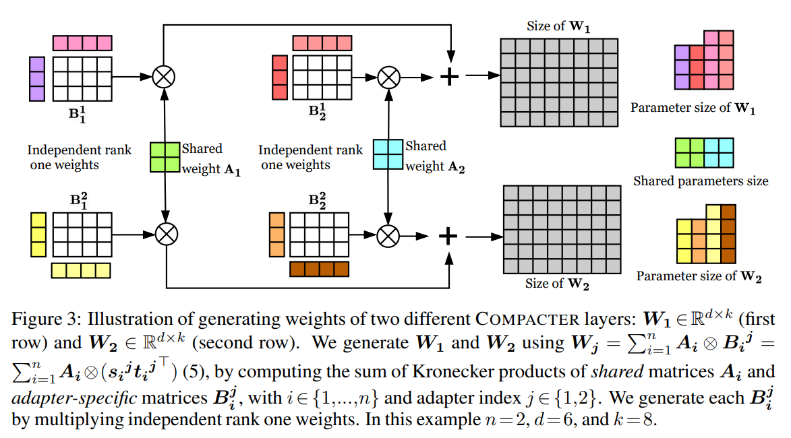

논문 및 이미지 출처 : <https://arxiv.org/pdf/2106.04647>

# Abstract

large-scale pretrained language model 을 downstream task 에 적응시키는 방법으로 fine-tuning 이 표준으로 사용되며, 이는 NLP benchmark 에서 SOTA 성능을 달성하는 방법이다. 그러나 수백만 또는 수십억 개의 parameter 를 가진 model 의 모든 weight 을 fine-tuning 하는 것은 sample 효율성이 낮고, low-resource setting 에서는 불안정하며, 각 task 마다 model 의 별도 복사본을 저장해야 하므로 낭비적이다. 최근 연구에서는 parameter-efficient fine-tuning 방법이 개발되었지만, 이러한 접근법들은 여전히 상대적으로 많은 수의 parameter 를 요구하거나 standard fine-tuning 에 비해 성능이 낮다.

이 연구에서는 이전 연구보다 task 성능과 trainable parameter 수 사이의 trade-off 가 더 우수한 방법인 **COMPACTER** 를 제안한다. COMPACTER 는 adapter, low-rank optimization, parameterized hypercomplex multiplication layer 의 아이디어를 기반으로 한다.

* 구체적으로, COMPACTER 는 pretrained model 의 weight 안에 task-specific weight matrix 를 삽입하는데, 이는 shared “slow” weight 과 COMPACTER layer 마다 정의된 “fast” rank-one matrix 의 Kronecker product 합으로 효율적으로 계산된다. 
* pretrained model 의 parameter 중 단지 0.047% 만 학습하면서도, COMPACTER 는 GLUE 에서 standard fine-tuning 과 동등한 성능을 보이고, SuperGLUE 와 low-resource setting 에서는 standard fine-tuning 을 능가한다.

# 1 Introduction

SOTA pretrained language model (PLM) 은 NLP 에서 수억에서 수십억 개의 parameter 로 구성된 over-parameterized representation 을 사용하여 다양한 NLP benchmark 에서 성공을 거두었다. 이러한 model 은 일반적으로 fine-tuning 을 통해 downstream task 에 적용되는데, 이는 모든 parameter 를 업데이트하고 각 task 마다 fine-tuned model 의 복사본을 저장해야 한다. 이는 상당한 저장 및 배포 비용을 유발하며, large-scale PLM 의 실제 응용 가능성을 저해한다. 또한 over-parameterized model 을 low-resource dataset 에서 fine-tuning 하는 것은 불안정하며 낮은 성능으로 이어질 수 있음이 알려져 있다.

John von Neumann 의 인용문에서 영감을 받아, 저자는 이미 PLM 을 통해 일반 목적의 language representation 을 학습한 상황(i.e., 코끼리를 맞추었다)에서, standard NLP task 에서 SOTA 성능을 달성하기 위해 얼마나 많은 추가 parameter 가 필요한지를 묻는다. 구체적으로, 저자는 minimum parameter 를 학습하면서도 SOTA NLP model 의 full fine-tuning 과 동등하거나 더 나은 성능을 달성하는 실용적이고 memory-efficient 한 방법을 개발하는 것을 목표로 한다.

최근 문헌에서는 *parameter-efficient fine-tuning* 방법이 제안되었다. 이러한 접근법은 일반적으로 pretrained model 의 parameter 를 고정하고, task 마다 trainable parameter 집합을 도입하여 trainable parameter 수와 task 성능 간의 trade-off 를 설정한다.

* 한쪽 극단에는 *prompt* (i.e., task 에 대한 natural language descriptions) 와 demonstration 을 사용하여 일부 benchmark 에서 parameter update 없이도 합리적인 성능을 달성하는 방법이 있다. 
  * 그러나 이러한 방법은 일반적으로 fine-tuned model 에 비해 성능이 떨어지며, 매우 큰 model 을 필요로 하고, model size 가 커질수록 좋은 prompt 를 선택하는 것이 어려워진다.
* Soft prompt 방법은 prompt 를 trainable 연속 parameter 로 취급하여 input layer 나 intermediate layer 의 입력 앞에 추가한다. 
  * 그러나 이러한 방법은 좋은 성능을 위해 대규모 model 을 필요로 하고, initialization 에 매우 민감하며 training 중 불안정하다.
* 이론적으로 동기부여된 low-rank 방법은 random projection 을 사용하여 low-rank subspace 에 속하는 few parameter 만 학습한다. 
  * 그러나 random projection matrix 를 저장해야 하므로 상당한 memory overhead 가 발생하며 training 시간이 느려진다.
* 다른 한쪽 극단에는 adapter 방법이 있는데, 이는 pretrained model 의 다양한 layer 에 trainable 변환을 삽입한다. 
  * adapter 방법은 앞서 언급한 접근법들보다 더 많은 parameter 를 필요로 하지만, memory 효율성이 높고 full fine-tuning 과 유사한 성능을 달성한다.

이 연구에서 저자는 기존 방법에 비해 trainable parameter 수, task 성능, memory footprint 사이의 우수한 trade-off 를 제공하는 방법인 COMPACTER 를 제안한다 (Fig. 1). 

* COMPACTER 는 adapter, low-rank 방법, 최근의 hypercomplex multiplication layer 아이디어를 기반으로 한다. 
* adapter 와 유사하게, COMPACTER 는 pretrained model 의 weight 안에 task-specific weight matrix 를 삽입한다. 
* 각 COMPACTER weight matrix 는 shared “slow” weight 과 COMPACTER layer 마다 정의된 “fast” rank-one matrix 의 Kronecker product 합으로 계산된다 (Sec. 3). 
* 결과적으로 COMPACTER 는 adapter 가 $k \times d$ 크기일 때 복잡도가 $\mathcal{O}(kd)$ 인 것과 달리, $\mathcal{O}(k+d)$ 의 parameter 복잡도를 달성한다. 
* 실제로 COMPACTER 는 PLM 의 parameter 중 단지 0.047% 만 학습한다.

standard GLUE 및 SuperGLUE benchmark 에서, COMPACTER 는 다른 parameter-efficient fine-tuning 방법들을 능가하며 full fine-tuning 과 동등하거나 더 나은 성능을 얻는다. low-resource setting 에서는 COMPACTER 가 standard fine-tuning 을 능가한다.

요약하면, 저자의 기여는 다음과 같다.

1. large-scale language model 을 적응시키기 위한 parameter-efficient 방법인 COMPACTER (Compact Adapter) layer 를 제안한다.
2. COMPACTER 가 GLUE 와 SuperGLUE 에서 강력한 경험적 성능을 얻음을 보인다.
3. COMPACTER 가 low-resource setting 에서 fine-tuning 을 능가함을 보여준다.
4. adapter 및 fine-tuning 보다 훨씬 적은 parameter 를 필요로 한다는 COMPACTER 의 parameter complexity 분석을 제공한다.
5. 최근 parameter-efficient fine-tuning 방법들의 training 시간과 memory consumption 에 대한 체계적인 평가를 제공한다.

# 2 Background

저자는 Kronecker product 와 adapter layer 에 대한 배경을 소개한다.

## 2.1 Kronecker Product

행렬 $A \in \mathbb{R}^{m \times f}$ 와 $B \in \mathbb{R}^{p \times q}$ 의 Kronecker product 는 $A \otimes B \in \mathbb{R}^{mp \times fq}$ 로 표기되며, 수학적으로 다음과 같이 정의된다:

$$
A \otimes B =
\begin{pmatrix}
a_{11} B & \cdots & a_{1f} B \\
\vdots & \ddots & \vdots \\
a_{m1} B & \cdots & a_{mf} B
\end{pmatrix},
\tag{1}
$$

여기서 $a_{ij}$ 는 $A$ 의 $i^{th}$ row, $j^{th}$ column 에 위치한 element 를 의미한다.

## 2.2 Adapter Layers

최근 연구에서는 language model 의 모든 parameter 를 fine-tuning 하는 것이 특히 low-resource dataset 에서는 sub-optimal solution 에 도달할 수 있음을 보여주었다. 대안으로, Rebuffi et al. 과 Houlsby et al. 은 pretrained model 의 layer 내부에 작은 task-specific module 인 adapter layer 를 삽입하여 model 을 새로운 task 로 전이하는 방법을 제안하였다 (Fig. 2). 

이 접근법에서는 adapter 와 layer normalization 만 학습하고, pretrained model 의 나머지 parameter 는 고정된 상태로 유지된다. 이 방식은 pretrained language model 이 효율적으로 새로운 task 에 적응할 수 있도록 한다.

transformer model 의 각 layer 는 두 가지 주요 module 로 구성된다:  
a) attention block,  
b) feed-forward block.  

두 module 은 모두 skip connection 뒤에 위치한다. Fig. 2 에서 볼 수 있듯이, Houlsby et al. 은 각 block 뒤, skip connection 이전에 adapter layer 를 삽입할 것을 제안하였다.

adapter 는 bottleneck architecture 를 따른다. output dimension 을 input 과 유사하게 유지함으로써, original model 의 구조나 parameter 에는 변화를 주지 않는다.

* layer $l$ 의 adapter layer $A^l$ 은 down-projection $D^l \in \mathbb{R}^{k \times d}$, 
* GeLU non-linearity, 그리고 up-projection $U^l \in \mathbb{R}^{d \times k}$ 로 구성된다. 
  * 여기서 $k$ 는 input dimension, 
  * $d$ 는 adapter layer 의 bottleneck dimension 이다. 
* adapter 는 다음과 같이 정의된다:

$$
A^l(x) = U^l(\text{GeLU}(D^l(x))) + x,
\tag{2}
$$

여기서 $x$ 는 input hidden state 이다.

# 3 Method

이 절에서는 large-scale PLM 을 compact 하고 효율적으로 적응시키는 방법인 COMPACTER 를 제안한다.

#### Problem formulation

large-scale language model 의 fine-tuning 문제를 고려한다. training data $\mathcal{D} = \{(x_i, y_i)\}_{i=1}^P$ 가 $P$ 개의 sample 로 주어졌다고 가정한다. 또한 parameter $\theta$ 로 정의된 large-scale pretrained language model $f_\theta(\cdot)$ 이 input $x^i$ 에 대한 출력을 계산한다고 가정한다. 저자의 목표는 $f_\theta(\cdot)$ 를 효율적으로 fine-tuning 하여 model 이 새로운 task 에 적응할 수 있도록 하는 것이다.

## 3.1 Compact and Efficient Adapter Layers

이 절에서는 **parameterized hypercomplex multiplication (PHM) layer** 의 최근 발전을 기반으로 한 efficient adapter layer 버전을 소개한다. 저자의 지식으로는, large-scale transformer model 의 효율적인 fine-tuning 에 PHM layer 를 활용한 것은 처음이다.

PHM layer 는 fully-connected layer 와 유사한 형태를 가지며, input $x \in \mathbb{R}^k$ 를 output $y \in \mathbb{R}^d$ 로 변환한다:

$$
y = Wx + b, \tag{3}
$$

* 여기서 $W \in \mathbb{R}^{k \times d}$ 이다. 
* 주요 차이점은 PHM layer 에서 $W$ 가 Kronecker product 의 합으로 학습된다는 점이다. 
* $k$ 와 $d$ 가 user-defined hyperparameter $n \in \mathbb{Z}_{>0}$ 로 나누어진다고 가정하면, Eq. (3) 의 matrix $W$ 는 다음과 같이 $n$ 개의 Kronecker product 의 합으로 계산된다:

$$
W = \sum_{i=1}^n A_i \otimes B_i, \tag{4}
$$

* 여기서 $A_i \in \mathbb{R}^{n \times n}$, $B_i \in \mathbb{R}^{\frac{k}{n} \times \frac{d}{n}}$ 이다. 
* PHM layer 의 parameter complexity 는 $\mathcal{O}\left(\frac{kd}{n}\right)$ 이며, 최대 $\frac1n$ 만큼 parameter 를 줄일 수 있다 (Sec. 4).

## 3.2 Beyond Hypercomplex Adapters

이전 연구에서는 pretrained model 이 포착한 일부 정보는 transfer 에 불필요하며, adapter 가 포착하는 정보에도 redundancy 가 존재하고, 특히 하위 layer 의 adapter 는 덜 중요하다는 것이 관찰되었다. 또한 adapter 를 여러 layer 에 공유하더라도 일부 task 에서는 성능이 비교적 작게 감소한다는 점이 보고되었다. 이러한 통찰에 기반하여, 저자는 hypercomplex adapter 를 더 효율적으로 만들기 위한 두 가지 확장을 제안한다.

#### Sharing information across adapters

모든 adapter parameter 를 layer 전반에 걸쳐 공유하는 것은 지나치게 제한적이며 fine-tuning 또는 regular adapter 와 동등한 성능을 낼 수 없다. 그러나 Eq. (4) 와 같이 adapter 를 $A_i$ 와 $B_i$ matrix 로 분해하면 더 유연하게 접근할 수 있다. 따라서 저자는 적응 weight 을 두 부분으로 나눈다:

* target task 에 적응하는 데 일반적으로 유용한 정보를 포착하는 **shared parameter**
* 각 개별 layer 의 적응에 필요한 정보를 포착하는 **adapter-specific parameter**

구체적으로, $A_i$ 는 모든 adapter layer 에 공통적인 shared parameter 로 정의되며, $B_i$ 는 adapter-specific parameter 이다.

#### Low-rank parameterization

low-rank 방법은 low-rank subspace 에서 task 를 최적화하여 강력한 성능을 달성할 수 있음을 보여주었다. 마찬가지로, 저자는 transformation 을 low-rank subspace 에서 학습함으로써 model 이 효과적으로 적응할 수 있다고 가정한다. 이를 위해 $B_i \in \mathbb{R}^{\frac{k}{n} \times \frac{d}{n}}$ 을 low-rank matrix 로 parameterization 한다. 즉, $B_i = s_i t_i^\top$ 이며, $s_i \in \mathbb{R}^{\frac{k}{n} \times r}$, $t_i \in \mathbb{R}^{r \times \frac{d}{n}}$, $r$ 은 matrix 의 rank 이다.

두 확장을 합치면, 저자는 **low-rank parameterized hypercomplex multiplication layer (LPHM)** 를 제안한다:

$$
W = \sum_{i=1}^n A_i \otimes B_i = \sum_{i=1}^n A_i \otimes (s_i t_i^\top). \tag{5}
$$

* 일반적으로 $r = 1$ 로 설정하여 $B_i$ 가 rank-one matrix 가 되도록 한다. 
* target task 의 복잡도에 따라 $r$ 은 더 큰 값으로 설정할 수도 있다. 

Fig. 3 은 저자의 방법을 도식화한 것이다. 전반적으로, LPHM layer 는 복잡도를 $\mathcal{O}(k+d)$ 로 더 줄인다 (Sec. 4). 또한 LPHM layer 는 모든 adapter 에 공유되며 일반적 정보를 포착하는 “slow” weight $A_i$ 와, 각 개별 layer 의 적응을 위해 학습되는 “fast” weight $B_i$ 를 활용한다고 볼 수 있다.

#### COMPACTER

위의 수식을 기반으로, 저자는 adapter 의 down-projection 과 up-projection layer 를 다음과 같이 교체하는 COMPACTER layer 를 제안한다:

$$
A^l(x) = \text{LPHM}^{U^l}(\text{GeLU}(\text{LPHM}^{D^l}(x))) + x,
$$

* 여기서 up-projection weight 인 $\text{LPHM}^{U^l}$ 은 Eq. (5) 와 같이 계산되어 Eq. (2) 의 $U^l$ 을 대체한다. 
* 마찬가지로 down-projection weight 인 $\text{LPHM}^{D^l}$ 은 Eq. (2) 의 $D^l$ 을 대체한다. 
* transformer 의 각 layer 에 있는 두 adapter 는 각기 다른 $s_i$, $t_i$ rank-one weight 을 가지지만, $A_i$ 는 모든 layer 와 adapter 위치에서 공유된다.

# 4 Parameter Efficiency

이 절에서는 COMPACTER 와 adapter 의 parameter 수를 비교한다.

#### Adapter parameters

standard 설정에서는 transformer model 의 각 layer 에 두 개의 adapter 가 추가된다. 각 adapter layer 는 down-projection 과 up-projection matrix $(U^l, D^l)$ 에 대해 각각 $2kd$ 개의 parameter 를 가진다. 

* 여기서 $k$ 는 input dimension 의 크기이고 
* $d$ 는 adapter 의 bottleneck dimension 이다. 

따라서 encoder 와 decoder 를 모두 포함하는 $L$ 개 layer 를 가진 transformer model 의 adapter 총 parameter 수는 $2L(2kd)$ 가 되며, 이는 세 변수에 대해 선형적으로 증가한다.

#### PHM-ADAPTER parameters

기존 PHM layer 에서 (Eq. (4)) $A_i \in \mathbb{R}^{n \times n}$, $B_i \in \mathbb{R}^{\frac{k}{n} \times \frac{d}{n}}$ 가 $W$ 의 자유도를 정의하며, 그 크기는 $n \left(\frac{kd}{n^2} + n^2\right) = \frac{kd}{n} + n^3$ 이다. 

* $kd > n^4$ 라는 완화된 조건에서 $\frac{kd}{n}$ 이 지배적이므로, (4) 의 PHM layer 의 전체 parameter size 는 $\mathcal{O}\left(\frac{kd}{n}\right)$ 이 된다. 
* 이 조건은 adapter, PHM layer, large-scale PLM (e.g., T5-large, hidden size $k=1024$, adapter hidden size $d \in \{24, 32, 48, 96\}$, $n = 2,4,8,12$) 의 전형적인 값에서 만족된다. 
* 따라서 PHM layer 는 $\mathcal{O}(kd)$ 인 standard fully-connected layer 와 비교하여 거의 $\frac{1}{n}$ 만큼의 parameter 감소를 제공한다.

유사하게 down-projection 과 up-projection matrix 를 PHM layer 로 모델링하면 거의 $\frac{1}{n}$ 만큼의 parameter 감소가 가능하다. 

* 각 adapter 는 PHM layer 를 사용할 경우 총 $2\left(\frac{kd}{n} + n^3\right)$ 개의 parameter 를 가진다. 
* $L$ 개 layer 를 가진 transformer model 에서 PHM-ADAPTER 의 총 parameter 수는 $4L\left(\frac{kd}{n} + n^3\right)$ 이다.

#### COMPACTER parameters

COMPACTER 는 Eq. (5) 에서 학습되는 weight matrix ${A_i}_{i=1}^n$ 을 모든 layer 에 공유하며, 이들은 $n^3$ 개의 parameter 를 가진다. 또한 각 adapter 마다 rank-one weight $s_i, t_i$ 를 두 개씩 가지며, 이는 $\frac{k}{n} + \frac{d}{n}$ 개의 parameter 로 구성된다. 따라서 down-projection 과 up-projection weight 에 대해 총 $2n\left(\frac{k}{n} + \frac{d}{n}\right)$ 개의 parameter 가 필요하다. 결과적으로 encoder 와 decoder 에 $L$ 개의 layer 를 가진 transformer 에서 COMPACTER 의 총 parameter 수는 $4L(k+d) + n^3$ 이다.

layer 수가 많은 setting 에서는 지배적인 항이 $4L(k+d)$ 이다. 따라서 $4L(k+d) > n^3$ 이라는 완화된 조건에서, COMPACTER 의 복잡도는 $\mathcal{O}(k+d)$ 가 된다. 이는 adapter 의 $\mathcal{O}(kd)$, PHM-ADAPTER 의 $\mathcal{O}(\tfrac{kd}{n})$ 와 비교했을 때 훨씬 더 효율적이다.

또한 $n$ 이 큰 setting 에서 COMPACTER 의 shared weight matrix ${A_i}_{i=1}^n$ 은 all layers 에 대해 상수 크기의 $n^3$ parameter 만 가지지만, PHM 및 adapter layer 는 layer 수 $L$ 에 비례하여 증가한다.

예를 들어, 222M parameter 를 가진 T5BASE model 에서 COMPACTER 는 전체 parameter 의 단지 **0.047%** 만 학습하며, full fine-tuning 과 비교해도 성능을 유지한다.

# 5 Experiments

#### Datasets

Raffel et al. 을 따라, 저자는 GLUE 와 SUPERGLUE benchmark 에서 방법들의 성능을 평가한다. 이 benchmark 들은 여러 task 를 포함한다:

* **paraphrase detection** (MRPC, QQP)
* **sentiment classification** (SST-2)
* **natural language inference** (MNLI, RTE, QNLI, CB)
* **linguistic acceptability** (CoLA)
* **question-answering** (MultiRC, ReCoRD, BoolQ)
* **word sense disambiguation** (WiC)
* **sentence completion** (COPA)

original test set 은 공개되지 않았기 때문에, Zhang et al. 을 따라 training set 에서 1k sample 을 validation 용으로 분리하고, original validation data 를 test set 으로 사용한다. sample 수가 10k 미만인 dataset (RTE, MRPC, STS-B, CoLA, COPA, WiC, CB, BoolQ, MultiRC) 에 대해서는 original validation set 을 절반으로 나누어, 한쪽은 validation 용으로, 다른 쪽은 test 용으로 사용한다.

#### Experimental details

저자의 실험에서 모든 방법의 기반 model 로 SOTA encoder-decoder 인 T5 model 을 사용한다. 계산 효율성을 위해, 모든 결과는 T5BASE model (12 encoder layer 와 12 decoder layer, 총 222M parameter) 에서 보고한다. HuggingFace PyTorch 구현체를 사용한다.

대규모 dataset 에 대해서는 3 epoch 동안 fine-tuning 하고, GLUE 의 low-resource dataset (MRPC, CoLA, STS-B, RTE, BoolQ, CB, COPA, WiC) 에 대해서는 20 epoch 동안 fine-tuning 하여 model 이 수렴할 수 있도록 한다.

모든 adapter 기반 방법에 대해 bottleneck size 가 {96, 48, 24} 인 adapter 를 실험한다. 모든 model 은 epoch 마다 checkpoint 를 저장하고, 각 task 에 대해 validation set 에서 가장 좋은 성능을 보이는 hyper-parameter 의 결과를 보고한다. PHM layer 의 경우 Le et al. 의 PyTorch 구현체를 사용한다. 세부적인 low-level 내용은 Appendix A 에 포함한다. 저자의 방법에서는 $n = \{4, 8, 12\}$ 를 실험하며, 가장 좋은 성능을 보이는 model 의 결과를 보고한다. $n$ 의 모든 값에 대한 결과는 Appendix B 에 포함한다.

Mahabadi et al. 을 따라, 모든 방법에서 pretrained model 의 output layer 는 모든 task 에 대해 고정한다. output layer 를 fine-tuning 한 결과는 Appendix C 에 포함한다. Houlsby et al. 을 따라, 적용 가능한 모든 방법에서 layer normalization parameter 를 업데이트한다.

## 5.1 Baselines

저자는 최근 제안된 여러 parameter-efficient fine-tuning 방법들과 비교한다.

* **T5BASE**
  저자의 방법을 T5 의 standard fine-tuning 방식과 비교한다. 이 경우, 각 task 에 대해 model 의 모든 parameter 를 fine-tuning 한다.
* **ADAPTER**
  강력한 adapter baseline 과 비교한다. 이 방법은 T5 의 각 transformer block 의 feed-forward 와 attention module 뒤에 task 별 adapter 를 추가한다.
* **PFEIFFER-ADAPTER**
  Pfeiffer et al. 은 더 효율적인 adapter 변형을 제안했는데, 각 layer 에서 adapter 하나만 유지하여 학습 효율을 높인다. 저자는 두 adapter 중 어느 것을 유지할지 실험했으며, 각 layer 의 self-attention module 뒤의 adapter 를 유지했을 때 가장 좋은 성능을 얻었다.
* **ADAPTER-LOWRANK**
  각 adapter 의 weight 을 두 개의 rank-one weight 의 곱으로 parameterization 한다.
* **PROMPT TUNING**
  Prompt tuning 은 Li 와 Liang 방법의 후속 변형으로, 입력 앞에 무작위로 초기화된 연속 prompt 를 추가한다 (PROMPT TUNING-R). 또한 pretrained language model 의 vocabulary token embedding 으로 prompt 를 초기화하는 변형 (PROMPT TUNING-T) 과도 비교한다.
* **INTRINSIC-SAID**
  Structure Aware Intrinsic Dimension 방법은 parameter 를 low-rank subspace 으로 reparameterization 하여 model 을 fine-tuning 한다. 즉, $\theta^{d'}(d' \ll D):\theta^D_i = \theta^D_{i,0} + \lambda_i P \theta^{d'-m}_i$

  여기서 $\theta^D_{i,0}$ 는 pretrained model 의 parameter, $P \in \mathbb{R}^{d'-m}\to\mathbb{R}^D$ 는 Fastfood transform 을 통한 random linear projection 이다. 이어서 PLM 의 전체 weight matrix 개수 $m$ 을 고려하여, 각 matrix 에 대해 하나의 weight 를 할당하고, 총 $\lambda \in \mathbb{R}^m$ 을 얻는다. 결과적으로 trainable parameter 는 $\theta^{d'-m} \in \mathbb{R}^{d'-m}$ 와 $\lambda$ 가 된다.
* **ADAPTERDROP**
  Rücklé et al. 의 방법을 적용하여, 학습 효율을 높이기 위해 하위 transformer layer 의 adapter 를 제거한다. T5BASE 에서는 encoder 와 decoder 의 처음 5 개 layer 에서 adapter 를 제거한다.
* **BITFIT**
  Cai et al. 은 weight 을 고정하고 bias 만 학습하는 방법을 제안하였다. 중간 activation 을 저장하지 않으므로 상당한 memory 절약이 가능하다. Ravfogel et al. 은 PLM 에 대해 bias 와 최종 output layer 만 fine-tuning 하는 유사한 방법을 연구하였다.

## 5.2 Our Methods

* **PHM-ADAPTER**
  Eq. (4) 와 같이 PHM layer 를 사용하여 adapter 의 weight 을 학습한다. 저자의 지식으로는, PHM 아이디어를 large-scale language model 의 효율적 fine-tuning 에 활용한 것은 최초이다.
* **COMPACTER**
  Eq. (5) 에서 설명한 LPHM layer 를 사용하여 adapter weight 을 학습한다. 또한 transformer block 에서 feed-forward layer 뒤에만 COMPACTER layer 를 유지하는 변형 (COMPACTER++) 도 탐구한다.

3# 5.3 Results on the GLUE Benchmark

Tab. 1 은 T5BASE 에서 GLUE 결과를 보여준다 (T5SMALL 결과는 Appendix E 참고). 

* COMPACTER 와 COMPACTER++ 는 기존의 모든 parameter-efficient 방법을 능가하며, 전체 parameter 의 각각 0.07% 와 0.047% 만 학습하면서도 full fine-tuning 과 동등한 성능을 달성한다.

#### Adapter-based methods

* ADAPTER 의 경우, classifier 를 fine-tuning 하지 않으면 성능이 크게 저하된다 (85.78 대 86.48; Appendix C 참고). 
* PFEIFFER-ADAPTER 는 각 layer 의 self-attention module 뒤에만 adapter 를 추가하여 standard ADAPTER 보다 더 효율적이며 성능도 우수하다. 
* 반면, ADAPTERDROP 은 full fine-tuning 보다 낮은 성능을 보이는데, 이는 encoder-decoder T5 model 에서 하위 layer 의 적응이 성능에 중요함을 보여준다. 
* 또한 ADAPTER-LOWRANK 는 충분히 expressive 하지 못하여 이 benchmark 에서 좋은 성능을 내지 못한다.

#### Prompt tuning and BitFit

* PROMPT TUNING 은 initialization 과 learning rate 에 매우 민감하며, 이는 기존 연구에서도 확인된 바 있다. 
* 여러 random seed 로 실험했지만 성능은 full fine-tuning 에 크게 못 미쳤고, 특히 low-resource dataset 에서 현저히 떨어졌다. 
  * 이는 모든 정보가 prefix 에 포함되어야 하는 이러한 방법의 낮은 유연성 때문이며, 따라서 model 의 다른 부분과의 상호작용이 제한된다. 
  * 이로 인해 좋은 성능을 내려면 매우 큰 model 이 필요하다. 
* 또한 sequence length 를 늘리면 memory overhead 가 증가하며 (§5.5 참고), prompt token 수는 model 의 최대 입력 길이에 의해 제한되므로 긴 문맥을 처리하기에는 유연성이 부족하고 적합하지 않다. 
* 마찬가지로, BITFIT 또한 full fine-tuning 보다 성능이 낮으며 특히 low-resource dataset 에서 두드러진다.

#### Intrinsic-SAID

흥미롭게도, model parameter 의 단지 0.009% 만 fine-tuning 하는 INTRINSIC-SAID 의 평균 성능은 full fine-tuning baseline 보다 1.05 점 낮을 뿐이다. 그러나 이 방법은 두 가지 실질적 단점이 있다:   
a) random projection matrix 를 저장해야 하므로 memory overhead 가 크다.  
b) 학습 속도가 매우 느리다 (§5.5 참고).  

그럼에도 불구하고 INTRINSIC-SAID 는 pretrained language model 의 low-rank optimization 이 효과적임을 보여주며, COMPACTER 와 같은 parameter-efficient 방법 개발의 동기를 제공한다.

#### COMPACTER

저자의 방법에서, PHM-ADAPTER 와 COMPACTER++ 모두 output layer 를 fine-tuning 해도 큰 성능 차이가 없었다 (Appendix C 참고). 

* PHM-ADAPTER 는 ADAPTER 의 parameter 를 0.83% 에서 0.179% 로 줄이며 ($n=12$), 이는 4.64배 더 효율적이다. 
* COMPACTER 는 parameter 를 0.073% 까지 줄이면서도 full fine-tuning 과 동등한 성능을 보인다. 
* self-attention 뒤의 COMPACTER layer 를 제거한 COMPACTER++ 는 성능은 비슷하게 유지하면서 parameter 를 0.047% 까지 줄인다. 
* 또한 layer normalization 을 업데이트하지 않는 적응 방식은 parameter 를 더 줄일 수 있는 유망한 방향이며, 최근의 normalization-free model 발전을 기반으로 할 수 있다. 이는 향후 연구 과제로 남긴다.

## 5.4 Results on the SUPERGLUE Benchmark

Tab. 2 는 SUPERGLUE 에서의 성능을 보여준다. $n$ 의 모든 값에 대한 결과는 Appendix D 에 포함한다. 

* GLUE (Tab. 1) 에서와 유사한 패턴이 관찰된다. 
* COMPACTER 와 COMPACTER++ 는 다른 parameter-efficient fine-tuning 방법들보다 훨씬 우수하며, full parameter 의 각각 0.073% 와 0.048% 만 학습하면서도 full fine-tuning 보다 더 높은 성능을 보인다.

## 5.5 Efficiency Evaluation

이 절에서는 동일한 계산 예산에서 제안된 방법들의 효율성을 최근 제안된 다양한 parameter-compact fine-tuning 방법들과 비교한다. 

* 이를 위해 MNLI dataset 에 대해 모든 방법을 1 epoch 학습한다. 
* 각 방법별로, 24GB GPU memory 제한 내에서 수용 가능한 가장 큰 batch size 를 선택한다. 
* 모든 adapter 기반 방법에서 adapter 크기는 24 로 고정한다. 
* PROMPT TUNING 의 경우 prefix token 수는 100 으로 설정한다. 
* INTRINSIC-SAID 의 경우 $d_0 = 1400$ 으로 설정한다. 
* 마지막으로 $n=4$ 로 설정한다. 

Tab. 3 에는 각 task 별 학습 parameter 비율, epoch 당 학습 시간, memory 사용량을 보고한다. 또한 Fig. 1 은 성능, 학습 parameter 비율, memory footprint 간의 trade-off 를 보여준다.

저자의 방법은 여러 장점을 가진다. 

* Tab. 1 의 분석에 따르면, COMPACTER 와 COMPACTER++ 는 모든 task 에서 평균된 GLUE 점수에서 높은 성능을 유지하면서도 parameter 수가 현저히 낮다 (각각 0.073%, 0.047%). 
  * 특히 COMPACTER++ 는 성능이 우수할 뿐 아니라, memory 요구량이 모든 방법 중 두 번째로 낮으며, T5BASE 대비 -41.94% 의 memory 사용량을 줄인다. 
  * 또한 COMPACTER 와 COMPACTER++ 는 학습 속도 또한 크게 향상시키며, 각각 T5BASE 대비 -13.41%, -26.51% 의 속도 개선을 보인다.
* 반면, BITFIT 은 중간 activation 을 저장하지 않음으로써 memory 요구량이 가장 낮고 (T5BASE 대비 -64.2%), 가장 빠르다 (T5BASE 대비 -35.06%). 
  * 그러나 이 경우 정량적 성능이 떨어지며, GLUE 점수가 1.53 포인트 낮아진다 (Tab. 1 참고).
* adapter pruning 에 의존하는 방법들, 즉 PFEIFFER-ADAPTER 와 ADAPTERDROP 은 memory overhead 를 줄이고 학습 시간을 개선한다. 
  * 그러나 이들의 parameter 수는 COMPACTER++ 에 비해 거의 한 자릿수 이상 많아, 각각 9.1배, 10.5배 더 많다. 
  * 또한 PFEIFFER-ADAPTER 는 약간의 성능 저하와 함께 full fine-tuning 과 유사한 성능을 보이지만 (Tab. 1 참고), ADAPTERDROP 은 평균적으로 모든 task 에서 성능이 0.65 포인트 낮다. 
  * transformer layer 에서 adapter 를 제거하는 것은 일반적인 기법이며, 이는 COMPACTER 에도 적용 가능해 추가적인 효율성을 개선할 수 있지만, 이는 향후 연구 과제로 남긴다.

마찬가지로 ADAPTER-LOWRANK 는 memory overhead 를 줄이고 학습 시간을 개선하지만, 평균적으로 모든 task 에서 성능이 0.68 포인트 낮아진다 (Tab. 1).

* 다른 한편으로, INTRINSIC-SAID 와 PROMPT TUNING 은 가장 적은 parameter 를 사용한다. 그러나 두 방법 모두 높은 memory overhead 를 가지며 (각각 full fine-tuning (T5BASE) 대비 +41.14%, +24.42%), 학습 속도가 가장 느리고, 성능은 full fine-tuning 보다 현저히 낮다 (Tab. 1 참고). 
* PROMPT TUNING 의 memory 비용이 높은 이유는 self-attention 의 계산 복잡도가 sequence length 에 대해 제곱 비례로 증가하며, gradient 계산을 위해 전체 attention matrix 를 저장해야 하기 때문이다. 
* INTRINSIC-SAID 의 높은 memory 요구량은 대규모 random projection matrix 를 저장해야 하기 때문이며, 이는 large-scale PLM 의 fine-tuning 적용을 제한한다. 
* 또한 FastFood transform 을 통한 projection 계산은 이론적으로 $\mathcal{O}(D \log d\_0)$ 에 가능하지만, 실제 CUDA 구현에서도 여전히 느리다. 
* 수백만~수십억 개의 parameter 를 가진 pretrained language model 에 대해 full parameter space 에 random projection 을 할당하는 것은 사실상 불가능하다. 
* FastFood transform 은 $\mathcal{O}(Dd\_0)$ 의 memory 사용을 $\mathcal{O}(D)$ 로 줄임으로써 이 문제를 부분적으로 완화하지만, memory 문제는 여전히 해결되지 않는다.

종합하면, T5 와 같은 수백만~수십억 개의 parameter 를 가진 large-scale transformer model 에서는 efficient memory 사용이 실제 응용에서 매우 중요하다. COMPACTER 와 COMPACTER++ 는 성능, memory 사용량, 학습 시간 측면에서 뛰어난 trade-off 를 제공한다. von Neumann 의 인용에서 영감을 받아, 저자는 PLM 을 실제적이고 효율적으로 적응시키기 위해 비교적 적은 수의 추가 parameter 만이 필요하다는 결론에 도달한다.

## 5.6 Low-resource Fine-tuning

COMPACTER++ 는 T5BASE 와 비교했을 때 parameter 수가 현저히 적다. 이 절에서는 이러한 특성이 resource 가 제한된 setting 에서 COMPACTER++ 가 더 잘 generalize 하는 데 도움이 되는지 조사한다. 저자는 GLUE 의 각 dataset 을 {100, 500, 1000, 2000, 4000} 크기로 subsample 한다. Fig. 4 는 그 결과를 보여준다. 

* COMPACTER++ 는 low-resource setting 에서 성능을 크게 향상시켜, 이와 같은 환경에서 더 효과적인 fine-tuning 이 가능함을 보여준다.

# 6 Related Work

#### Adapters

Adapter 는 최근 pretrained language model 의 fine-tuning 을 위한 새로운 패러다임으로 등장하였다. 

* Üstün et al. 은 adapter 와 contextual parameter generator network 를 기반으로 한 multilingual dependency parsing 방법을 제안했는데, 이는 학습된 trained input embedding 에 조건화된 adapter parameter 를 생성한다. 
  * 그러나 이 방법은 base model 과 비교했을 때 많은 수의 추가 parameter 를 요구한다. 
* 비슷한 시기에, Mahabadi et al. 은 단일 compact hypernetwork 를 사용하여 transformer model 의 여러 task 와 layer 에 조건화된 adapter weight 을 효율적으로 생성하였다. 
* Pilault et al. 또한 multi-task learning 을 위해 task-conditioned transformer 를 제안했지만, 이는 parameter 효율성이 떨어진다. 

이러한 연구들은 COMPACTER 와 상호 보완적이며, COMPACTER 를 contextual parameter generation 과 결합하여 adapter module 을 생성하는 것이 가능하다. Mahabadi et al. 과 비교했을 때, COMPACTER++ 는 parameter 를 6.2배 줄인다.

#### Hypercomplex representations

hypercomplex domain 에서의 deep learning 발전은 아직 초기 단계이며, 대부분 최근에 수행된 연구들이다. 

* standard network 의 matrix multiplication 을 자유도가 더 적은 Hamilton product 로 대체하면 single multiplication 연산에서 최대 4배의 parameter 절약을 제공한다. 
* 최근 Zhang et al. 은 이러한 방법을 확장하여, 완화된 조건에서 fully connected layer 의 parameter 를 $1/n$ 까지 줄일 수 있도록 제안했으며, 여기서 $n$ 은 사용자가 지정한 parameter 이다. 저자의 지식으로는, large-scale language model 의 효율적 fine-tuning 을 위해 hypercomplex space 를 활용한 연구는 이전에 없었다.

#### Other parameter-efficient models

* Li et al. 과 Aghajanyan et al. 은 original parameter space 가 아닌 low-dimensional random subspace 에서 model 을 학습하는 방법을 연구하였다. 
* 또 다른 연구에서는 BERT 와 같은 pretrained model 의 용량이 redundancy 를 가지며, 최종 성능 지표에서 큰 손실 없이 상당한 sparsification 이 가능함을 보여주었다. 
* 그러나 이러한 방법은 현재 하드웨어에서 잘 지원되지 않으며, 전용 효율적 architecture 와 비교했을 때 성능이 떨어지는 경우가 많다.

# 7 Conclusion

저자는 large-scale language model 을 위한 경량 fine-tuning 방법인 COMPACTER 를 제안하였다. COMPACTER 는 각 COMPACTER layer 에 대해 공유되는 “slow” weight 과 rank-one 형태의 “fast” matrix 간 Kronecker product 의 합으로 weight 을 생성한다. 이러한 공식을 활용하여, COMPACTER 는 adapter 의 parameter 복잡도를 $\mathcal{O}(kd)$ 에서 $\mathcal{O}(k+d)$ 로 크게 줄인다.

광범위한 실험을 통해, COMPACTER 가 standard fine-tuning 대비 **2127.66배 적은 parameter** 를 학습함에도 불구하고 full-data setting 에서 동등하거나 더 나은 성능을 보이고, data-limited 시나리오에서는 fine-tuning 을 능가함을 입증하였다.